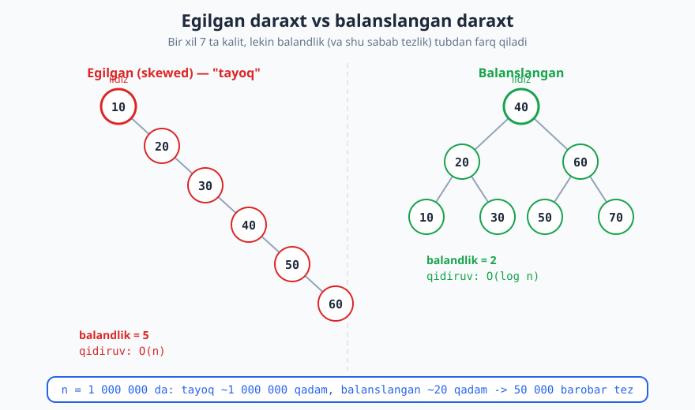
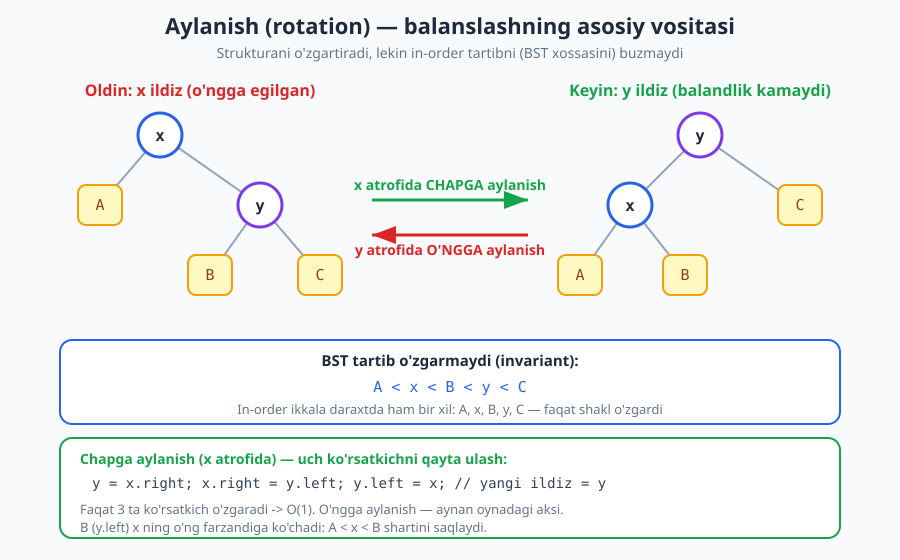
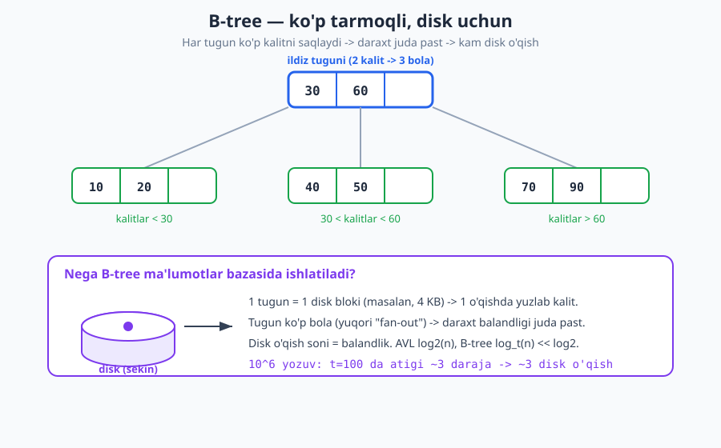

# 18 — Balanslangan daraxtlar (AVL, Red-Black, B-tree)

[⬅️ Oldingi: 17 — Binar qidiruv daraxti (BST)](./17-binar-qidiruv-daraxti.md) · [🏠 README](./README.md) · [Keyingi: 19 — Heap va Priority Queue ➡️](./19-heap-priority-queue.md)

---

> **Bu bobda:** Oddiy binar qidiruv daraxti (BST) qulay, lekin xavfli — kalitlar tartib bilan kelsa, u "tayoq"ka aylanib, barcha amal `O(n)` bo'lib qoladi. Yechim — daraxtni **avtomatik balanslangan** tutish, ya'ni balandlikni har doim `O(log n)` darajada saqlash. Biz balanslashning asosiy vositasi bo'lgan **aylanish (rotation)**ni, so'ng uchta klassik balanslangan struktura — **AVL daraxt**, **Red-Black daraxt** va **B-tree / B+ tree**ni o'rganamiz. AVL ni Python'da to'liq yozib, balandligi haqiqatan `O(log n)` ekanini empirik ko'rsatamiz.
>
> **Halollik / Eslatma:** Aylanish `O(1)` ekani, AVL balandligi `≤ 1.44·log₂(n)` chegarasi, Red-Black "eng uzun yo'l ≤ 2× eng qisqa" kafolati va B-tree balandligi `O(log_t n)` ekani — barchasi matematik aniq, isbotlangan natijalar. Bob **konseptual jihatdan og'ir**: Red-Black va B-tree'ning to'liq implementatsiyasi juda katta (o'chirishda o'nlab hollar), shuning uchun ularning **g'oyasi va kafolatini** tushuntiramiz, amaliy to'liq kodni esa AVL misolida beramiz. Python kodi haqiqatan ishga tushirilgan: balandlik raqamlari (3, 12, 16, 20) — kod chiqargan haqiqiy qiymatlar.

---

## Eslatma: oddiy BST nimadan aziyat chekadi

[17-bobda](./17-binar-qidiruv-daraxti.md) ko'rdikki, binar qidiruv daraxtida qidiruv, qo'shish va o'chirish — hammasi **ildizdan bargacha bitta yo'l** bo'ylab yuradi. Demak ularning narxi daraxtning **balandligiga** teng: `O(h)`.

Agar daraxt "chiroyli", ya'ni keng yoyilgan bo'lsa, `h ≈ log₂(n)` va har amal `O(log n)` — ajoyib. Lekin BST shaklini **kiruvchi ma'lumotlar tartibi** belgilaydi, va biz buni boshqarmaymiz. Eng yomon holat: kalitlar **o'sib boruvchi tartibda** keladi — `10, 20, 30, 40, …`. Har bir yangi kalit eng o'ngdagi tugunning o'ng farzandi bo'ladi, daraxt o'ngga egiladi va **bog'langan ro'yxatga** aylanadi:

```text
10
  \
   20
     \
      30
        \
         40
           ...
```

Bunday "tayoq" (skewed tree) balandligi `h = n − 1`, demak qidiruv `O(n)` — biz daraxtdan kutgan barcha tezlik yo'qoladi.



> **Diqqat:** Bu nazariy ehtimollik emas. Real hayotda ma'lumotlar **ko'pincha tartiblangan** keladi (ID lar, sanalar, alifbo bo'yicha import). Demak oddiy BST'ga ishonib bo'lmaydi — kafolat kerak.

**Yechim g'oyasi.** Har bir qo'shish/o'chirishdan keyin daraxtni ozgina "tuzatib", balandligini majburan `O(log n)` da ushlab turamiz. Bu **o'z-o'zini balanslaydigan (self-balancing) daraxt** deyiladi. Tuzatish narxi ham `O(log n)`, demak hech narsa yo'qotmaymiz — aksincha, eng yomon holat kafolatini qo'lga kiritamiz.

## Balans nima degani

"Balanslangan" so'zining intuitiv ma'nosi: **hech bir shoxcha boshqalaridan haddan tashqari uzun bo'lmasin**. Agar har tugunda chap va o'ng qism-daraxtlar balandligi bir-biridan juda farq qilmasa, daraxt yaproqlari taxminan bir tekisda joylashadi.

Formal bog'lanish (nega balans `O(log n)` beradi): balandligi `h` bo'lgan daraxtda ko'pi bilan `2^(h+1) − 1` ta tugun bo'ladi. Demak `n ≤ 2^(h+1) − 1`, undan:

```text
h ≥ log₂(n + 1) − 1
```

Ya'ni `n` ta tugunni saqlash uchun balandlik **hech bo'lmaganda** `log₂(n)` atrofida bo'lishi shart — bundan past tusha olmaymiz. Balanslangan daraxtning butun maqsadi — balandlikni shu mumkin bo'lgan **eng kichik qiymat** atrofida, ya'ni `O(log n)` da ushlab turish. Buni uddalasak, barcha amal `O(log n)` kafolatlanadi.

Turli balanslangan strukturalar "juda farq qilmasin" shartini turlicha qattiqlik bilan qo'yadi:

- **AVL**: juda qat'iy — har tugunda balandlik farqi ko'pi bilan 1.
- **Red-Black**: bo'shroq — eng uzun yo'l eng qisqasidan ko'pi bilan 2 barobar uzun.
- **B-tree**: barcha barglar **aynan bir** chuqurlikda (mukammal balandlik balansi), lekin tugunda ko'p kalit bo'ladi.

## Aylanish (rotation) — asosiy vosita

Balanslashning yuragi — **aylanish**. Bu daraxtning **shaklini** o'zgartiradigan, lekin **in-order tartibni (ya'ni BST xossasini) buzmaydigan** lokal operatsiya. Faqat bir nechta ko'rsatkichni qayta ulaydi, shuning uchun narxi **`O(1)`**.

Tasavvur qiling: `x` tuguni o'ng tomonga egilgan (o'ng farzandi `y` og'ir). Biz `y` ni yuqoriga ko'tarib, `x` ni uning chap farzandi qilamiz — bu **chapga aylanish (left rotation)**:



Diagrammada e'tibor bering: aylanishdan oldin ham, keyin ham in-order o'qish bir xil — `A, x, B, y, C`. Faqat kim ildiz ekani va balandlik o'zgardi. Ko'rsatkich mexanikasi (chapga aylanish, `x` atrofida):

```text
y = x.right        # ko'tariladigan tugun
x.right = y.left   # y ning chap qism-daraxti (B) x ning o'ngiga ko'chadi
y.left = x         # x endi y ning chap farzandi
# yangi ildiz = y
```

**Nega BST buzilmaydi (isbot eskizi).** Aylanishdan oldin tartib `A < x < B < y < C` edi (chunki `A` — `x` ning chap qism-daraxti, `B` — `y` ning chapi, `C` — `y` ning o'ngi). Aylanishdan keyin: `A` hali ham `x` ning chapida, `B` endi `x` ning o'ngida (`x < B`), va butun `x`-qism-daraxt `y` ning chapida (`< y`), `C` esa `y` ning o'ngida. Demak `A < x < B < y < C` **aynan saqlanadi**. ∎

O'ngga aylanish (right rotation) — buning oynadagi aksi: chap farzand `x` ni ko'tarib, `y` ni uning o'ng farzandi qilamiz. Ikkala aylanish ham faqat 3 ta ko'rsatkichni o'zgartiradi, demak **`O(1)`**, va balandlikni 1 ga kamaytirishi mumkin — balanslashning aniq quroli shu.

> **Eslatma:** In-order traversal ([16-bob](./16-daraxtlar-traversal.md)) — bu yerda asosiy invariant. "Balanslash to'g'rimi?" degan savolga javob: **agar in-order saralangan ketma-ketlik o'zgarmasa, daraxt hali ham to'g'ri BST**. Aylanish aynan shu xossani saqlaydi.

## AVL daraxt — qat'iy balans

AVL daraxt (1962, Adelson-Velsky va Landis — nomi shulardan) — tarixdagi **birinchi** o'z-o'zini balanslaydigan BST. G'oyasi sodda va qattiq:

> **Ta'rif:** Har bir tugunda **balans faktori** = (chap qism-daraxt balandligi) − (o'ng qism-daraxt balandligi). AVL daraxtda har tugunning balans faktori **{−1, 0, +1}** to'plamidan bo'lishi shart.

Agar qo'shish/o'chirishdan keyin biror tugunda balans faktori `+2` yoki `−2` ga chiqsa — daraxt buzilgan, va biz uni **aylanish bilan** darhol tuzatamiz.

**Nega bu `O(log n)` beradi.** Balansli faktor cheklangani balandlikni `n` ga nisbatan kichik ushlab turadi. Isbot AVL daraxtning eng "yomon" (eng kam tugunli) ko'rinishi orqali yuritiladi: balandligi `h` bo'lgan AVL daraxtdagi minimal tugun soni `N(h)` Fibonachchi rekurrentsiyasiga bo'ysunadi `N(h) = N(h−1) + N(h−2) + 1`. Bu yerdan `h ≤ 1.44·log₂(n)` kelib chiqadi — ya'ni AVL daraxt balandligi to'liq muvozanatli daraxtdan ko'pi bilan **44%** balandroq, demak doim `O(log n)`.

### To'rt holat: LL, RR, LR, RL

Balans buzilganda, qaysi tomondan og'irlik kelganiga qarab **to'rt holat** bo'ladi. `z` — balansi buzilgan eng pastki tugun bo'lsin:

| Holat | Qachon | Tuzatish |
|---|---|---|
| **LL** | chapning chap shoxiga qo'shildi (`bf(z) > 1`, chapga moyil) | `z` ni **o'ngga** aylantirish |
| **RR** | o'ngning o'ng shoxiga qo'shildi (`bf(z) < −1`, o'ngga moyil) | `z` ni **chapga** aylantirish |
| **LR** | chapning o'ng shoxiga qo'shildi | avval `z.left` ni **chapga**, so'ng `z` ni **o'ngga** |
| **RL** | o'ngning chap shoxiga qo'shildi | avval `z.right` ni **o'ngga**, so'ng `z` ni **chapga** |

Intuitsiya: **LL va RR** — "to'g'ri chiziq" buzilishi, bitta aylanish yetadi. **LR va RL** — "siniq chiziq" (zigzag), avval uni to'g'ri chiziqqa keltirish (1-aylanish), so'ng to'g'rilash (2-aylanish) kerak. Har holatda ko'pi bilan **2 ta aylanish**, demak tuzatish `O(1)`.

### AVL ga qo'shish — qadamlar

```text
insert(node, key):
    1. Oddiy BST qo'shish (key < node.key -> chapga, aks holda o'ngga)
    2. Yo'ldan qaytishda har tugunning balandligini yangilash
    3. Shu tugunning balans faktorini hisoblash
    4. Agar |bf| > 1 bo'lsa -> LL/RR/LR/RL ni aniqlab, aylanish bilan tuzatish
    5. (Balanslangan) qism-daraxt ildizini yuqoriga qaytarish
```

Muhim nozik nuqta: qo'shish rekursiv, va biz **pastdan yuqoriga qaytayotganda** balandlikni yangilab, balansni tekshiramiz. AVL'da bitta qo'shishdan keyin **ko'pi bilan bitta** balanslash (bitta yoki ikkita aylanish) yetarli — chunki aylanish o'sha qism-daraxt balandligini qo'shishdan oldingi holatiga qaytaradi.

### Python: to'liq AVL (qo'shish + aylanishlar)

Quyidagi kod to'liq ishlaydigan AVL daraxt. Uni ishga tushirib, ikki narsani ko'rsatamiz: (1) `1..7` ni **tartib bilan** qo'shganda ham balandlik faqat 3 bo'ladi (oddiy BST'da 6 bo'lardi), (2) tasodifiy `n` ta kalitda balandlik `1.44·log₂(n)` chegarasidan past qoladi.

```python
import math, random, sys
sys.setrecursionlimit(300000)

class Node:
    __slots__ = ("key", "left", "right", "height")
    def __init__(self, key):
        self.key = key
        self.left = None
        self.right = None
        self.height = 1   # yangi barg balandligi = 1

def h(node):
    return node.height if node else 0

def balance_factor(node):
    return h(node.left) - h(node.right) if node else 0

def update_height(node):
    node.height = 1 + max(h(node.left), h(node.right))

def rotate_right(y):
    x = y.left
    t2 = x.right
    x.right = y
    y.left = t2
    update_height(y)   # avval pastdagi (y), keyin yangi ildiz (x)
    update_height(x)
    return x

def rotate_left(x):
    y = x.right
    t2 = y.left
    y.left = x
    x.right = t2
    update_height(x)
    update_height(y)
    return y

def insert(node, key):
    # 1) oddiy BST qo'shish
    if node is None:
        return Node(key)
    if key < node.key:
        node.left = insert(node.left, key)
    elif key > node.key:
        node.right = insert(node.right, key)
    else:
        return node   # dublikat: o'zgarishsiz

    # 2) balandlikni yangilash
    update_height(node)

    # 3-4) balansni tekshirish va 4 holatni tuzatish
    bf = balance_factor(node)
    if bf > 1 and key < node.left.key:        # LL
        return rotate_right(node)
    if bf < -1 and key > node.right.key:      # RR
        return rotate_left(node)
    if bf > 1 and key > node.left.key:        # LR
        node.left = rotate_left(node.left)
        return rotate_right(node)
    if bf < -1 and key < node.right.key:      # RL
        node.right = rotate_right(node.right)
        return rotate_left(node)
    return node   # balans yaxshi

# (1) 1..7 ni TARTIB bilan qo'shamiz: oddiy BST bo'lsa balandlik 6 bo'lardi
root = None
for k in [1, 2, 3, 4, 5, 6, 7]:
    root = insert(root, k)
print("balandlik (1..7 tartib bilan):", h(root))
# -> balandlik (1..7 tartib bilan): 3

# (2) Empirik: balandlik <= 1.44*log2(n) kafolatini tekshiramiz
random.seed(42)
for n in [1000, 10000, 100000]:
    root = None
    keys = list(range(n))
    random.shuffle(keys)
    for k in keys:
        root = insert(root, k)
    print(f"n={n:>6}: AVL balandlik={h(root):>2}, "
          f"log2(n)~{math.log2(n):.1f}, 1.44*log2(n)~{1.44*math.log2(n):.1f}")
# -> n=  1000: AVL balandlik=12, log2(n)~10.0, 1.44*log2(n)~14.4
# -> n= 10000: AVL balandlik=16, log2(n)~13.3, 1.44*log2(n)~19.1
# -> n=100000: AVL balandlik=20, log2(n)~16.6, 1.44*log2(n)~23.9
```

Natijalarni o'qing: `100000` ta kalit uchun balandlik atigi **20** — `log₂(100000) ≈ 16.6` ga juda yaqin va `1.44·log₂(n) ≈ 23.9` chegarasidan past. Bu AVL kafolati amalda ishlashining empirik tasdig'i: balandlik `n` bilan emas, `log n` bilan o'sadi.

> **Isbot (eskiz) — nega qo'shish `O(log n)`:** BST qo'shishning o'zi ildizdan bargacha bitta yo'l = `O(h) = O(log n)`. Qaytish yo'lida har tugunda `O(1)` ish (balandlik + balans tekshiruvi), ko'pi bilan bitta `O(1)` aylanish. Demak jami `O(log n) + O(log n)·O(1) = O(log n)`. ∎

### Trassirovka: `10, 20, 30` ni qo'shish (RR holati)

Tartib bilan kelgan uchta kalit — eng yomon holat. AVL uni qanday tuzatishini kuzataylik:

| Qadam | Amal | Daraxt holati | Buzilgan tugun (bf) | Tuzatish |
|---|---|---|---|---|
| 1 | insert 10 | `10` | yo'q (bf 0) | — |
| 2 | insert 20 | `10 -> o'ngda 20` | yo'q (10 da bf −1) | — |
| 3 | insert 30 | `10 -> 20 -> 30` (tayoq) | **10 da bf = −2** | **RR**: 10 ni chapga aylantirish |
| natija | — | `20` ildiz, `10` chap, `30` o'ng | hammasi bf 0 | balanslandi |

Uchinchi qo'shishdan so'ng `10` tugunda balans `−2` ga chiqadi (o'ng zanjir og'ir). Bu RR holati (o'ngning o'ngiga qo'shildi), bitta chapga aylanish `10` ni pastga tushirib, `20` ni ildiz qiladi — daraxt balandligi 2 dan 1 ga tushadi.

> **Trade-off (AVL):** Qat'iy balans tufayli AVL daraxt **juda past** bo'ladi, demak **qidiruv eng tez** — yo'l qisqa. Evaziga, qattiq shartni saqlash uchun qo'shish/o'chirishda **ko'proq aylanish** kerak bo'lishi mumkin. Demak AVL — ko'p qidiriladigan, kam o'zgaradigan ma'lumotlar uchun ideal.

## Red-Black daraxt — bo'shroq, lekin amaliyroq balans

Red-Black (qizil-qora) daraxt — bugungi kunda eng ko'p ishlatiladigan balanslangan BST. U AVL kabi **mukammal** balansni emas, balki **yetarli** balansni saqlaydi: har tuguni "qizil" yoki "qora" rangga bo'yaladi, va beshta qoida bu ranglarni shunday cheklaydiki, eng uzun yo'l eng qisqasidan ko'pi bilan **2 barobar** uzun bo'ladi — bu yetarli, chunki `2·log n = O(log n)`.

**Beshta qoida (qisqacha):**

1. Har tugun yo qizil, yo qora.
2. **Ildiz** har doim qora.
3. Barcha barg (bo'sh/null) tugunlar qora deb hisoblanadi.
4. **Qizil tugunning ikkala farzandi ham qora** (ya'ni ketma-ket ikkita qizil bo'lmaydi).
5. Har bir tugundan uning ostidagi har bir bargacha bo'lgan yo'llarda **bir xil sondagi qora tugun** bor (bu son — "qora balandlik").

4- va 5-qoidalardan kelib chiqadigan sehr: 5-qoida har yo'lda qora tugunlar sonini tenglashtiradi; 4-qoida esa qizil tugunlar ketma-ket kelishiga yo'l qo'ymaydi. Demak eng uzun yo'l (qizil-qora-qizil-qora...) eng qisqasidan (faqat qora) ko'pi bilan ikki barobar uzun bo'ladi. Bu balandlikni `≤ 2·log₂(n+1)` da, ya'ni `O(log n)` da ushlab turadi.

> **Eslatma:** Red-Black balanslashni **rang almashtirish** (recoloring) va **aylanish** kombinatsiyasi bilan amalga oshiradi. Ko'p hollarda faqat rang o'zgartiriladi (aylanishsiz), shuning uchun o'rtacha **qayta balanslash kamroq** bo'ladi.

### AVL vs Red-Black — qaysi biri qachon

Ikkalasi ham barcha amalni `O(log n)` da kafolatlaydi, farq **konstantalarda** va **trade-off**da:

| Xususiyat | AVL | Red-Black |
|---|---|---|
| Balans qat'iyligi | qattiq (bf ∈ {−1,0,1}) | bo'sh (≤ 2× yo'l) |
| Balandlik | `≤ 1.44·log₂ n` (pastroq) | `≤ 2·log₂ n` (balandroq) |
| **Qidiruv** | tezroq (yo'l qisqa) | bir oz sekinroq |
| **Qo'shish/o'chirish** | sekinroq (ko'p aylanish) | tezroq (kam qayta balanslash) |
| Tipik qo'llanish | ko'p o'qiladigan indekslar | umumiy maqsadli map/set |

Aynan shu sababdan **ko'p tilning standart kutubxonasi** o'zgaruvchan map/set uchun Red-Black daraxtni tanlaydi: C++ `std::map` / `std::set`, Java `TreeMap` / `TreeSet`, Linux yadrosidagi ko'p planlovchilar. Qo'shish-o'chirish tez-tez bo'lganda, kamroq qayta balanslash amalda yutuq beradi. AVL esa qidiruv ustun bo'lgan vaziyatlarda (masalan, deyarli faqat o'qiladigan indeks) tanlanadi.

## B-tree va B+ tree — disk uchun ko'p tarmoqli daraxt

AVL va Red-Black — **binar** daraxtlar (har tugun ko'pi bilan 2 bola), va ular xotirada (RAM) ishlashga mo'ljallangan. Lekin ma'lumotlar bazasi **diskda** yashaydi, va u yerda o'yin qoidalari boshqacha:

> **Intuitsiya:** Diskdan o'qish RAM'dan o'qishdan ~100 000 marta sekin. Disk **blok-blok** o'qiydi (masalan, bir martada 4 KB). Demak narx — **necha marta disk bloki o'qildi**, ya'ni daraxt **balandligi**. Maqsad — balandlikni iloji boricha **kichraytirish**.

Binar daraxtda balandlik `log₂(n)`. Agar tugunda 2 emas, **yuzlab** bola bo'lsa, balandlik `log_t(n)` (`t` — tarmoqlanish koeffitsienti) ga tushadi — bu juda kichik son. Mana **B-tree** g'oyasi: har tugun ko'p kalit va ko'p bolani saqlaydi, va bitta tugun aynan **bitta disk blokiga** mos qilib o'lchanadi.



**B-tree xossalari** (`t` — minimal daraja):

- Har tugunda `t−1` dan `2t−1` gacha kalit (ildizdan tashqari), va `t` dan `2t` gacha bola.
- Tugundagi kalitlar **saralangan**, ular bolalar oralig'idagi qiymatlarni ajratadi (xuddi BST kabi, lekin ko'p "darvoza" bilan).
- **Barcha barglar bir xil chuqurlikda** — bu mukammal balandlik balansini ta'minlaydi.
- Balandlik `O(log_t n)`. `t = 100` da `10⁶` yozuvni saqlash uchun atigi ~3 daraja kerak — ya'ni har qidiruv **~3 disk o'qish**.

**B+ tree** — B-tree'ning amaliy varianti, real ma'lumotlar bazalari aynan shuni ishlatadi. Farqi: barcha **haqiqiy ma'lumot faqat barglarda** saqlanadi, ichki tugunlar esa faqat "yo'l ko'rsatkich" (kalit + ko'rsatkich). Bundan tashqari barglar bir-biriga bog'langan ro'yxat kabi **ulanadi**, shuning uchun **diapazon so'rovlari** (`WHERE x BETWEEN 10 AND 50`) juda tez — bir bargni topib, ro'yxat bo'ylab yurish kifoya.

Aynan shu sababdan ma'lumotlar bazasi indekslari (PostgreSQL, MySQL, SQLite default indeks) — deyarli har doim B+ tree. Ular xuddi [hash-jadval](./15-hash-jadval.md) kabi tez nuqta-qidiruv beradi, lekin hash-jadvaldan farqli o'laroq **tartiblangan**, shuning uchun diapazon va saralangan natijalar ham qo'llab-quvvatlanadi.

> **Halollik:** B-tree va B+ tree'ning to'liq qo'shish/o'chirish kodi (tugun "bo'linishi" — split, va "birlashishi" — merge bilan) ancha katta va bu nazariy bobning doirasidan tashqarida. Bu yerda maqsad — **nega disk uchun ko'p tarmoqli daraxt zarurligini** va kafolatni tushunish. Amaliy nuqtai nazarni ma'lumotlar bazasi indekslari mavzusida chuqurroq ko'rish mumkin.

## Murakkablik solishtirish jadvali

Barcha balanslangan strukturalar asosiy amallarni `O(log n)` da **kafolatlaydi** — bu oddiy BST'dan asosiy farq (BST'da `O(log n)` faqat o'rtacha, eng yomon holatda `O(n)`).

| Struktura | Qidiruv | Qo'shish | O'chirish | Eng yomon balandlik | Izoh |
|---|---|---|---|---|---|
| BST (o'rtacha) | `O(log n)` | `O(log n)` | `O(log n)` | — | tasodifiy kirishda |
| **BST (eng yomon)** | `O(n)` | `O(n)` | `O(n)` | `n − 1` | tartiblangan kirishda "tayoq" |
| **AVL** | `O(log n)` | `O(log n)` | `O(log n)` | `≤ 1.44·log₂ n` | eng past, qidiruvda tez |
| **Red-Black** | `O(log n)` | `O(log n)` | `O(log n)` | `≤ 2·log₂ n` | kam qayta balanslash |
| **B-tree / B+ tree** | `O(log n)` | `O(log n)` | `O(log n)` | `O(log_t n)` | disk uchun, juda past |

Asimptotik jihatdan ([8-bob](./08-asimptotik-notatsiya.md)) AVL, Red-Black va B-tree bir xil — hammasi `O(log n)`. Farq **doimiy koeffitsientlarda** va **qaysi sharoitga moslanganida**: AVL qidiruvga, Red-Black o'zgarishga, B-tree esa diskka.

## Asosiy g'oyalar (bobni qisqacha)

- Oddiy BST eng yomon holatda **`O(n)`** ga aylanadi (tartiblangan kirish -> "tayoq"). Yechim — daraxtni avtomatik **balanslangan** tutish.
- Balandlik `O(log n)` bo'lsa, barcha amal `O(log n)` **kafolatlanadi**. Balanslashning maqsadi aynan shu.
- **Aylanish (rotation)** — balanslashning asosiy vositasi: `O(1)`, daraxt shaklini o'zgartiradi, lekin in-order tartibni (BST xossasini) saqlaydi.
- **AVL**: qat'iy balans (har tugunda bf ∈ {−1,0,1}). To'rt holat — **LL, RR, LR, RL** — bir yoki ikki aylanish bilan tuzatiladi. Balandlik `≤ 1.44·log₂ n`. Qidiruv tez, o'zgarish nisbatan sekin.
- **Red-Black**: bo'shroq balans (5 rang qoidasi -> eng uzun yo'l ≤ 2× eng qisqa). Kamroq qayta balanslash -> ko'p tilning standart map/set'i (Java `TreeMap`, C++ `std::map`).
- **B-tree / B+ tree**: ko'p tarmoqli, har tugun = bir disk bloki. Balandlik juda past -> kam disk o'qish. Ma'lumotlar bazasi indekslari aynan B+ tree.
- Hammasi `O(log n)` kafolat; farq — doimiy koeffitsient va qaysi sharoitga moslanganida (qidiruv / o'zgarish / disk).

## Mashqlar

### Oson

**1-mashq.** Quyidagi tugun uchun balans faktorini hisoblang: chap qism-daraxt balandligi 3, o'ng qism-daraxt balandligi 1. Bu tugun AVL shartini qoniqtiradimi?

**2-mashq.** Quyidagi daraxt AVL ma'nosida balanslanganmi? Har tugunning balans faktorini yozing.
```text
        50
       /  \
      30   70
     /
    20
   /
  10
```

**3-mashq.** "Eng uzun yo'l ≤ 2× eng qisqa yo'l" — bu qaysi balanslangan strukturaning kafolati? Va nima uchun bu `O(log n)` balandlik beradi?

### O'rta

**4-mashq.** Quyidagi daraxtni `10` (ildiz) atrofida **chapga aylantiring** va natijani chizing. Aylanishdan oldin va keyin in-order o'qishni yozib, ular bir xil ekanini ko'rsating.
```text
   10
  /  \
 A    30
     /  \
    B    C
```

**5-mashq.** Bo'sh AVL daraxtga quyidagi tartibda qo'shilganda, har qadamda balans buzilsa — qaysi holat (LL/RR/LR/RL) yuzaga keladi va qaysi aylanish bilan tuzatiladi? Kalitlar: `30, 20, 10`.

**6-mashq.** AVL va Red-Black daraxt orasidan tanlash kerak: (a) deyarli faqat **qidiriladigan** lug'at (kamdan-kam o'zgaradi); (b) tez-tez **qo'shilib-o'chiriladigan** to'plam. Har biriga qaysi struktura mosroq va nega?

### Qiyin

**7-mashq.** Bo'sh AVL daraxtga `10, 20, 30, 40, 50` ni shu tartibda qo'shing. Har qo'shishdan keyin daraxt holatini va sodir bo'lgan aylanishlarni kuzating. Yakuniy daraxt balandligi necha? (Maslahat: yuqoridagi Python kodini ishlatib tekshirsangiz bo'ladi.)

**8-mashq.** Nima uchun ma'lumotlar bazasi indeksi binar AVL daraxt o'rniga B+ tree ishlatadi? `n = 10⁶` yozuv uchun AVL'da va B-tree'da (`t = 100`) qancha disk o'qish kerakligini taxminan hisoblab, javobni dalil bilan asoslang.

**9-mashq.** LR holati nima uchun **bitta** aylanish bilan tuzatilmaydi? "Chapning o'ng shoxiga qo'shildi" holatida bitta o'ngga aylanish nimaga yetarli emasligini misol bilan tushuntiring.

<details markdown="1">
<summary>Yechimlar</summary>

### 1-mashq yechimi

Balans faktori = (chap balandlik) − (o'ng balandlik) = `3 − 1 = 2`. AVL sharti balans faktori `{−1, 0, +1}` to'plamida bo'lishini talab qiladi. `2` bu to'plamda **yo'q**, demak bu tugun AVL shartini **buzadi** — balanslash (aylanish) kerak. Chap og'ir bo'lgani uchun bu LL yoki LR holati bo'ladi (chap-farzandning qaysi shoxida og'irlik borligiga qarab).

### 2-mashq yechimi

Balandliklarni pastdan hisoblaymiz (barg balandligi = 1, bo'sh = 0):
- `10`: barg, balandlik 1, bf = 0
- `20`: chapda `10` (balandlik 1), o'ngda bo'sh (0), balandlik 2, bf = `1 − 0 = 1`
- `30`: chapda `20` (balandlik 2), o'ngda bo'sh (0), balandlik 3, bf = `2 − 0 = 2`  ← **buzildi!**
- `70`: barg, balandlik 1, bf = 0
- `50` (ildiz): chapda `30` (balandlik 3), o'ngda `70` (balandlik 1), bf = `3 − 1 = 2`  ← **buzildi!**

Daraxt **balanslanmagan**: `30` da bf = 2 va `50` da bf = 2 (ikkalasi ham {−1,0,1} dan tashqari). Chap-chap zanjir (`30 -> 20 -> 10`) — bu LL ko'rinishidagi buzilish.

### 3-mashq yechimi

Bu — **Red-Black daraxt** kafolati (5 rang qoidasidan kelib chiqadi). Nega `O(log n)`: 5-qoida har yo'lda qora tugunlar sonini tenglashtiradi (qora balandlik `b` bir xil), 4-qoida esa qizil tugunlar ketma-ket kelishini taqiqlaydi. Demak eng qisqa yo'l (faqat qora) uzunligi `b`, eng uzun yo'l (qizil-qora navbatma-navbat) ko'pi bilan `2b`. Tugunlar soni `n ≥ 2^b − 1`, undan `b = O(log n)`, demak butun balandlik `≤ 2b = O(log n)`.

### 4-mashq yechimi

Chapga aylanish (`10` atrofida): `30` ko'tariladi, `10` uning chap farzandi bo'ladi, `30` ning chap farzandi `B` esa `10` ning o'ng farzandiga ko'chadi.

```text
oldin:           keyin (chapga aylanish):
   10                  30
  /  \                /  \
 A    30             10   C
     /  \           /  \
    B    C         A    B
```

- **In-order oldin:** `A, 10, B, 30, C`
- **In-order keyin:** `A, 10, B, 30, C`

Bir xil — BST tartib saqlandi (chunki `A < 10 < B < 30 < C` ikkala shaklda ham o'rinli). Bu yuqoridagi Python kodi bilan ham tasdiqlangan: `rotate_left` aynan shu in-order'ni qaytaradi.

### 5-mashq yechimi

| Qadam | Qo'shildi | Holat | Buzilgan tugun | Holat turi | Aylanish |
|---|---|---|---|---|---|
| 1 | 30 | `30` | — | — | — |
| 2 | 20 | `30 -> chap 20` | yo'q (bf 1) | — | — |
| 3 | 10 | `30 -> 20 -> 10` (chapga zanjir) | `30` da bf = +2 | **LL** | `30` ni o'ngga aylantirish |

Yakuniy daraxt: `20` ildiz, `10` chap, `30` o'ng — hammasi balanslangan. Bu **LL holati** (chapning chap shoxiga qo'shildi), bitta **o'ngga aylanish** bilan tuzatildi.

### 6-mashq yechimi

**(a) Deyarli faqat qidiriladigan lug'at -> AVL.** AVL daraxt qat'iy balans tufayli pastroq (`≤ 1.44·log₂ n` vs Red-Black `≤ 2·log₂ n`), demak qidiruv yo'li qisqaroq va tezroq. O'zgarish kam bo'lgani uchun AVL'ning "ko'proq aylanish" kamchiligi deyarli sezilmaydi.

**(b) Tez-tez qo'shilib-o'chiriladigan to'plam -> Red-Black.** Red-Black kamroq qayta balanslash qiladi (ko'pincha faqat rang almashtirish, aylanishsiz), shuning uchun yuqori o'zgaruvchanlikda amalda tezroq. Aynan shu sababdan umumiy maqsadli standart kutubxonalar (Java `TreeMap`, C++ `std::map`) Red-Black tanlaydi.

### 7-mashq yechimi

`10, 20, 30, 40, 50` ni ketma-ket qo'shamiz:

| Qadam | Qo'shildi | Buzilish | Aylanish | Natija (ildiz / shakl) |
|---|---|---|---|---|
| 1 | 10 | — | — | `10` |
| 2 | 20 | — | — | `10`, o'ngda `20` |
| 3 | 30 | `10` da bf −2 | **RR**: 10 chapga | ildiz `20`; `10` chap, `30` o'ng |
| 4 | 40 | — | — | `20`; chap `10`; o'ng `30`, `30` ning o'ngida `40` |
| 5 | 50 | `30` da bf −2 | **RR**: 30 chapga | ildiz `20`; chap `10`; o'ng `40`, `40` ning chap `30`, o'ng `50` |

Yakuniy daraxt:
```text
      20
     /  \
    10   40
        /  \
       30   50
```
Balandlik = **2** (ildiz `20` dan eng pastki bargacha 2 qirra). Oddiy BST bo'lsa balandlik 4 bo'lardi. Yuqoridagi Python kodida `[10,20,30,40,50]` qo'shilsa, `h(root)` aynan **3** qaytaradi (kod balandlikni "barg = 1" konventsiyasida sanaydi, ya'ni daraja soni = 3, qirra soni = 2 — ikkalasi bir xil daraxtni tasvirlaydi).

### 8-mashq yechimi

Asosiy sabab — **disk o'qish soni = daraxt balandligi**, va diskdan o'qish RAM'dan ~100 000 marta sekin, shuning uchun balandlikni minimallashtirish hal qiluvchi.

- **AVL (binar):** balandlik `≈ log₂(10⁶) ≈ 20`. Har daraja yangi disk bloki bo'lishi mumkin -> ~20 disk o'qish.
- **B-tree (`t = 100`):** har tugunda ~100 kalit, balandlik `≈ log₁₀₀(10⁶) = 3`. -> atigi ~3 disk o'qish.

~20 vs ~3 — taxminan **7 barobar** kam disk o'qish. Bundan tashqari, B-tree tuguni aynan bir disk blokiga (4 KB) mos qilib o'lchanadi, demak bitta o'qishda yuzlab kalit RAM'ga keladi va ular orasida qidiruv bepul (RAM tez). B+ tree'da barglar bog'langani uchun diapazon so'rovlari ham tez. Binar AVL'da har tugun mayda va alohida disk joyida bo'lishi mumkin — ko'p, tarqoq disk o'qishlar. Shu sabab ma'lumotlar bazalari B+ tree ishlatadi.

### 9-mashq yechimi

LR holatida og'irlik **chapning o'ng shoxida** (zigzag/"siniq chiziq"). Bitta o'ngga aylanish to'g'ri ishlamaydi, chunki u zigzag'ni to'g'rilamaydi — faqat bir tomonga egilgan "to'g'ri chiziq" buzilishini (LL) tuzata oladi.

Misol: `30` ga `10` qo'shilib, keyin `20` qo'shilsa (`10` chap, `20` esa `10` ning o'ngida):
```text
   30              30  ni o'ngga aylantirsak:    10
  /                                              / \
 10            (xato natija)                        30
   \                                               /
    20                                            20   <- hali ham buzuq
```
Faqat o'ngga aylanish muammoni boshqa tomonga ko'chiradi, balans tiklanmaydi. To'g'ri yechim **ikki aylanish**: avval `10` ni **chapga** aylantirib zigzag'ni to'g'ri chiziqqa (LL ko'rinishiga) keltiramiz, so'ng `30` ni **o'ngga** aylantirib to'g'rilaymiz. Natija — `20` ildiz, `10` chap, `30` o'ng — balanslangan. Shuning uchun LR (va simmetrik RL) doim **ikkita** aylanish talab qiladi.

</details>

---

[⬅️ Oldingi: 17 — Binar qidiruv daraxti (BST)](./17-binar-qidiruv-daraxti.md) · [🏠 README](./README.md) · [Keyingi: 19 — Heap va Priority Queue ➡️](./19-heap-priority-queue.md)
