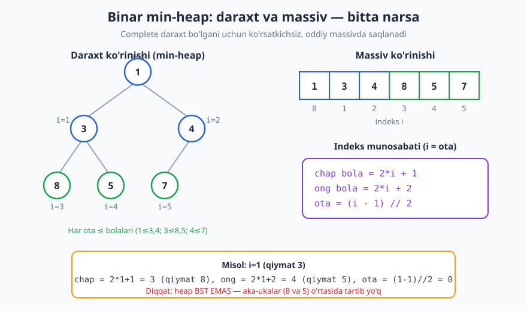
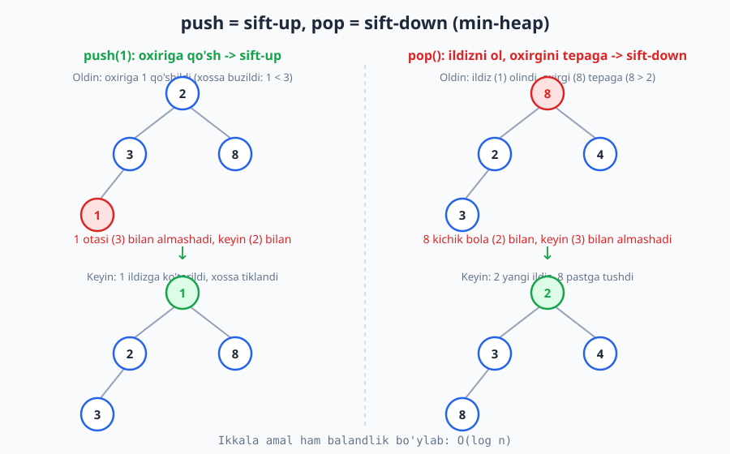
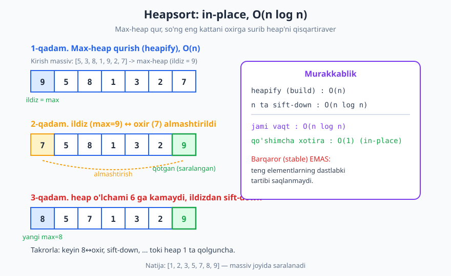

# 19 — Heap va Priority Queue

[⬅️ Oldingi: 18 — Balanslangan daraxtlar (AVL, Red-Black, B-tree)](./18-balanslangan-daraxtlar.md) · [🏠 README](./README.md) · [Keyingi: 20 — Trie va string strukturalari ➡️](./20-trie-string-strukturalari.md)

---

> **Bu bobda:** Doimo eng kichik (yoki eng katta) elementga tez yetishish kerak bo'lganda ishlatiladigan strukturani — **binar heap**ni — va u amalga oshiradigan abstrakt tushuncha **priority queue** (prioritetli navbat) ni o'rganamiz. Heap'ni daraxt sifatida tasavvur qilamiz, lekin uni oddiy massivda ko'rsatkichsiz saqlaymiz; `push`, `pop`, `peek`, `build-heap` amallarini va ularning narxini tahlil qilamiz; heapsort va top-K, oqimdagi median kabi qo'llanmalarni ko'ramiz.
>
> **Halollik / Eslatma:** Barcha murakkablik chegaralari (`peek` O(1), `push`/`pop` O(log n), `build-heap` O(n), heapsort O(n log n)) matematik aniq va shu yerda isbot eskizi bilan keltirilgan. `build-heap`ning O(n) ekani ko'pchilik kutmaydigan nozik natija — uni alohida isbotlaymiz. Python namunalari (ham `heapq` moduli, ham 0 dan yozilgan heap) haqiqatan ishga tushirib tekshirilgan; ko'rsatilgan chiqishlar kod chiqargan haqiqiy qiymatlar.

---

## Muammo: doimo eng kichikka tez yetishish

Tasavvur qiling, shifoxona qabulxonasida bemorlar navbat kutmoqda, lekin bu oddiy navbat emas — har bir bemorning **shoshilinchlik darajasi** bor. Keyingi bo'lib chaqiriladigan bemor — navbatga birinchi kelgan emas, balki **eng og'ir holatdagisi**. Yangi bemor istalgan vaqtda kelishi mumkin, va biz har safar tez topishimiz kerak: hozir kim eng shoshilinch?

Bu — juda keng tarqalgan vazifa: **to'plamga element qo'shib turish va istalgan paytda eng kichik (yoki eng katta) elementni tez olib chiqish.** Mavjud strukturalar bilan urinib ko'raylik:

| Struktura | Eng kichikni topish | Qo'shish | O'chirish (eng kichikni) |
|---|---|---|---|
| Saralanmagan massiv | O(n) (hammasini ko'rib chiqish) | O(1) (oxiriga) | O(n) |
| Saralangan massiv | O(1) (boshida turadi) | O(n) (joy ochish) | O(n) (siljitish) |
| Balanslangan BST | O(log n) | O(log n) | O(log n) |

Saralangan massiv "topish"ni tezlashtiradi, lekin qo'shishni O(n) ga aylantiradi. Balanslangan daraxt ([18-bob](./18-balanslangan-daraxtlar.md)) hamma amalni O(log n) qiladi, lekin u **haddan ortiq kuchli** — u to'liq tartibni saqlaydi (istalgan elementni qidiradi, oraliq so'rovlarni bajaradi). Bizga esa atigi bitta narsa kerak: **eng kichik**. Shuning uchun soddaroq, tezroq va kam xotira ishlatadigan maxsus struktura mavjud — **heap**.

**Heap** quyidagini va'da qiladi:

- **peek** (eng kichikka qarash): **O(1)** — u doim "tepada" turadi.
- **push** (qo'shish) va **pop** (eng kichikni olib chiqish): **O(log n)**.
- **build-heap** (massivdan heap qurish): **O(n)**.

## Binar heap nima: ikki shart

**Binar heap** — bu ikkita shartni qanoatlantiradigan binar daraxt.

**1-shart: complete (to'liq) binar daraxt.** Daraxt yuqoridan pastga, har qatorda chapdan o'ngga to'ldiriladi. Ya'ni faqat eng pastki qatorda bo'sh joy bo'lishi mumkin, va u ham faqat o'ng tomonda. "Teshik" yo'q. Bu shart heap'ning balandligini doim `⌊log₂ n⌋` ga teng qilib ushlab turadi — daraxt hech qachon "ipga" cho'zilmaydi.

**2-shart: heap xossasi (heap property).** Ikki tur bor:

- **Min-heap:** har bir ota-tugun qiymati o'z bolalaridan **katta emas** (`ota ≤ bolalar`). Demak **ildiz — butun to'plamdagi eng kichik element**.
- **Max-heap:** har bir ota-tugun qiymati o'z bolalaridan **kichik emas** (`ota ≥ bolalar`). Ildiz — eng katta element.

Bundan keyin asosan **min-heap** bilan ishlaymiz (max-heap simmetrik).

> **Diqqat: heap — bu BST EMAS.** Binar qidiruv daraxtida ([17-bob](./17-binar-qidiruv-daraxti.md)) qat'iy chap < tugun < o'ng tartibi bor. Heapda esa **faqat ota-bola** munosabati bog'langan — `ota ≤ har bir bola`. **Aka-ukalar (sibling) o'rtasida hech qanday tartib yo'q**, chap qism bilan o'ng qism o'rtasida ham yo'q. Shuning uchun heapda "bu element bormi?" degan qidiruv O(n) bo'ladi — heap qidiruv uchun emas, faqat eng chetki (min yoki max) element uchun mo'ljallangan. Bu "kuchsizroq" tartib aynan heap'ni soddaroq va tezroq qiladi.

## Massivda ko'rsatkichsiz saqlash

Heap **complete** bo'lgani uchun ajoyib narsa yuz beradi: uni daraxt ko'rsatkichlari (left/right pointer) bilan saqlashning hojati yo'q. Tugunlarni yuqoridan pastga, chapdan o'ngga raqamlab, oddiy **massivga** joylaymiz — va ota/bola munosabatini sof arifmetika bilan topamiz.

Ildiz — indeks `0`. U holda `i` indeksdagi tugun uchun:

```text
chap bola  = 2*i + 1
ong  bola  = 2*i + 2
ota        = (i - 1) // 2     (butun bo'linma)
```



Diagrammada `[1, 3, 4, 8, 5, 7]` heap'i ham daraxt, ham massiv ko'rinishida. Masalan `i = 1` (qiymat 3) ning bolalari indeks `3` (qiymat 8) va `4` (qiymat 5); otasi indeks `(1−1)//2 = 0` (qiymat 1). Hech qanday ko'rsatkich yo'q — faqat indeks hisobi.

> **Nega bu ishlaydi:** complete daraxtda "teshik" bo'lmagani uchun massivda ham bo'sh katak qolmaydi; tugunlarni qator-qator raqamlasak, `2*i+1` / `2*i+2` formulasi har doim to'g'ri bolaga olib boradi. Agar daraxt complete bo'lmaganida (o'rtada teshik bo'lsa) bu arifmetika buzilardi. Massivlar haqida [12-bob](./12-massiv-dinamik-massiv.md)da batafsil.

Bu yondashuvning afzalliklari: ko'rsatkichlar uchun qo'shimcha xotira yo'q, kesh-do'st (xotirada ketma-ket yotadi), va kod sodda.

## Amallar

### peek (eng kichikka qarash) — O(1)

Min-heapda eng kichik element doim ildizda, ya'ni `a[0]` da. Shunchaki uni qaytaramiz — **O(1)**. Hech narsa o'zgarmaydi.

### push (qo'shish) — sift-up, O(log n)

Yangi elementni qaerga qo'yamiz? Daraxtni **complete** saqlash uchun u **massivning oxiriga**, ya'ni eng pastki qatorning birinchi bo'sh joyiga tushishi kerak. Lekin yangi element otasidan kichik bo'lishi mumkin — bu heap xossasini buzadi.

Tuzatish: **sift-up** (yoki "bubble up", "ko'tarilish"). Yangi elementni otasi bilan solishtiramiz; agar undan kichik bo'lsa, **almashtiramiz** va yuqoriga bir pog'ona ko'tarilamiz. Toki element otasidan kichik bo'lmaguncha (yoki ildizga yetmaguncha) takrorlaymiz.

```text
push(x):
    massiv oxiriga x qo'sh
    i = oxirgi indeks
    while i > 0 va a[i] < a[ota(i)]:
        a[i] <-> a[ota(i)]      # almashtir
        i = ota(i)              # yuqoriga ko'taril
```

Element har qadamda bir qatorga ko'tariladi; daraxt balandligi `O(log n)`, demak `push` ko'pi bilan `O(log n)`.

### pop (eng kichikni olib chiqish) — sift-down, O(log n)

Ildizni (eng kichikni) qaytarmoqchimiz, lekin uni shunchaki olib tashlasak, ildiz bo'sh qoladi. Hiyla: **massivning oxirgi elementini ildizga ko'chiramiz** (daraxt complete qoladi), keyin uni **pastga suramiz**.

**Sift-down** (yoki "bubble down", "tushish"): ildizni **kichikroq bolasi** bilan solishtiramiz. Agar bolalardan biri undan kichik bo'lsa, **eng kichik bola** bilan almashtiramiz va pastga tushamiz. Toki element ikkala bolasidan kichik bo'lmaguncha (yoki bargga yetmaguncha) takrorlaymiz.

```text
pop():
    eng_kichik = a[0]
    a[0] = a[oxir];  oxirgini massivdan olib tashla
    i = 0
    while i ning bolasi bor:
        k = i ning kichikroq bolasi
        if a[i] <= a[k]: break       # xossa tiklandi
        a[i] <-> a[k]
        i = k                        # pastga tush
    return eng_kichik
```

> **Diqqat:** sift-down'da **albatta kichikroq bola** bilan almashtiring. Agar kattaroq bola bilan almashtirsangiz, u yangi otaning ikkinchi bolasidan katta bo'lib qolishi mumkin — xossa buzilgancha qoladi.



Diagrammada chap tomonda `push(1)` — 1 oxiriga qo'shilib, otalari (3, keyin 2) bilan almashib ildizga ko'tariladi. O'ng tomonda `pop()` — ildiz olingach, oxirgi element (8) tepaga qo'yilib, kichik bolalari bilan almashib pastga tushadi. Ikkalasi ham balandlik bo'ylab harakat — `O(log n)`.

### push/pop trassirovkasi

Bo'sh min-heapga `5, 1, 3` ni `push` qilib, keyin bir marta `pop` qilaylik. Massiv holatini kuzatamiz:

| Amal | Massiv (push'dan/pop'dan keyin) | Izoh |
|---|---|---|
| `push(5)` | `[5]` | birinchi element, ildiz |
| `push(1)` | `[1, 5]` | 1 oxirga (`[5,1]`), `1 < 5` -> almashdi |
| `push(3)` | `[1, 5, 3]` | 3 indeks 2 ga, otasi `1`, `3 < 1` emas -> qoldi |
| `pop()` -> 1 | `[3, 5]` | ildiz 1 olindi; oxirgi `3` tepaga; `3 < 5` -> qoldi |

Yakuniy massiv `[3, 5]`, qaytarilgan qiymat `1` (eng kichik). Heap xossasi har qadamda saqlangan.

### build-heap (heapify) — O(n), n log n EMAS

Bizda allaqachon tartibsiz massiv bor va undan heap qurmoqchimiz. Eng sodda yo'l — bo'sh heapga elementlarni birma-bir `push` qilish: `n` ta `push × O(log n) = O(n log n)`. Ishlaydi, lekin sekinroq.

Tezroq usul **build-heap**: massivni joyida qoldirib, **oxirgi ota-tugundan boshlab ildizga qarab** har biriga `sift-down` qo'llaymiz. Barglar (oxirgi yarmi) allaqachon o'zicha to'g'ri heap, shuning uchun ulardan boshlamaymiz.

```text
build-heap(a):
    n = len(a)
    for i = n//2 - 1 downto 0:    # oxirgi ota -> ildiz
        sift-down(a, i, n)
```

Bu **O(n)** — bu ko'pchilik kutmaydigan natija.

> **Isbot (eskiz): nega O(n), `n log n` emas?** Sift-down'ning narxi tugun **balandligiga** mutanosib (qancha pastga tushishi mumkin). Asosiy kuzatuv: **ko'pchilik tugun balandligi past, balandlik kichik.** `n` tugunli to'liq daraxtda balandligi `h` bo'lgan tugunlar soni ko'pi bilan `⌈n / 2^(h+1)⌉`. Jami ish:
>
> ```text
> T(n) ≤ Σ (h=0..log n) [ n / 2^(h+1) ] · O(h)  =  (n/2) · O( Σ h/2^h )
> ```
>
> Bu yerda `Σ (h=0..∞) h/2^h = 2` (yaqinlashuvchi qator). Demak `T(n) = (n/2) · O(2) = O(n)`. Sodda til bilan: barglar (eng ko'p) hech tushmaydi, ildiz (eng baland) faqat bitta — balandlikning ko'pchilik "puli" pastdagi ko'p tugunlardan tejaladi.

Buni empirik tasdiqlaymiz: build-heap'dagi almashtirishlar soni `n` dan ham kam bo'lib qoladi (`n log n` dan ancha kichik):

```python
import random

def _sift_down_count(a, i, n, cnt):
    while True:
        kichik = i
        c, r = 2 * i + 1, 2 * i + 2
        if c < n and a[c] < a[kichik]:
            kichik = c
        if r < n and a[r] < a[kichik]:
            kichik = r
        if kichik == i:
            break
        a[i], a[kichik] = a[kichik], a[i]
        cnt[0] += 1                       # bitta almashtirish sanaldi
        i = kichik

for n in [15, 1023, 65535]:
    a = list(range(n))
    random.shuffle(a)
    cnt = [0]
    for i in range(n // 2 - 1, -1, -1):   # oxirgi otadan ildizga
        _sift_down_count(a, i, n, cnt)
    print(f"n={n:>6}: almashishlar={cnt[0]:>6}, almashish/n={cnt[0]/n:.3f}")

# Chiqish (random aralashtirilgani uchun raqamlar biroz tebranadi, lekin nisbat doim < 1):
# n=    15: almashishlar=     8, almashish/n=0.533
# n=  1023: almashishlar=   751, almashish/n=0.734
# n= 65535: almashishlar= 48996, almashish/n=0.748
```

`almashish/n` nisbati hech qachon `1` dan oshmaydi — bu `O(n)` ekanining empirik dalili. Agar build-heap `O(n log n)` bo'lganida, `n = 65535` da nisbat `log₂ n ≈ 16` atrofida bo'lardi.

## Python: heapq moduli

Python standart kutubxonasida tayyor heap bor — `heapq` moduli. U **min-heap** ustida ishlaydi va heap'ni oddiy `list` da saqlaydi.

```python
import heapq

h = []
heapq.heappush(h, 5)
heapq.heappush(h, 1)
heapq.heappush(h, 3)
heapq.heappush(h, 8)
heapq.heappush(h, 2)

print(h[0])                 # -> 1   (eng kichik, peek, O(1))
print(heapq.heappop(h))     # -> 1
print(heapq.heappop(h))     # -> 2
print(h)                    # -> [3, 5, 8]

# Mavjud massivni joyida heapga aylantirish: O(n)
nums = [9, 4, 7, 1, 6, 3, 8, 2]
heapq.heapify(nums)
print(nums[0])              # -> 1

# Heapni ketma-ket bo'shatish -> saralangan ketma-ketlik
saralangan = [heapq.heappop(nums) for _ in range(len(nums))]
print(saralangan)           # -> [1, 2, 3, 4, 6, 7, 8, 9]
```

> **Eslatma — max-heap kerak bo'lsa:** `heapq` faqat min-heap. Eng kattani olish uchun keng tarqalgan hiyla — **qiymatlarni manfiy belgi bilan** saqlash (`heappush(h, -x)`, olishda `-heappop(h)`). Shunda eng katta `x` eng kichik `-x` bo'lib min-heap tepasiga chiqadi.

## Python: 0 dan heap (sift-up / sift-down)

Modulga tayanmasdan, heap'ni o'zimiz yozamiz — sift-up va sift-down qanday ishlashini ko'rish uchun:

```python
class MinHeap:
    def __init__(self):
        self.a = []                       # heap massiv ko'rinishida

    def _ota(self, i):  return (i - 1) // 2
    def _chap(self, i): return 2 * i + 1
    def _ong(self, i):  return 2 * i + 2

    def peek(self):
        return self.a[0]                  # eng kichik element, O(1)

    def push(self, x):
        self.a.append(x)                  # oxiriga qo'sh
        self._sift_up(len(self.a) - 1)    # joyiga ko'tar

    def _sift_up(self, i):
        while i > 0 and self.a[i] < self.a[self._ota(i)]:
            ota = self._ota(i)
            self.a[i], self.a[ota] = self.a[ota], self.a[i]
            i = ota

    def pop(self):
        oxir = len(self.a) - 1
        self.a[0], self.a[oxir] = self.a[oxir], self.a[0]   # ildiz <-> oxir
        eng_kichik = self.a.pop()                            # oxirini olib tashla
        if self.a:
            self._sift_down(0)
        return eng_kichik

    def _sift_down(self, i):
        n = len(self.a)
        while True:
            kichik = i
            c, r = self._chap(i), self._ong(i)
            if c < n and self.a[c] < self.a[kichik]:
                kichik = c
            if r < n and self.a[r] < self.a[kichik]:
                kichik = r
            if kichik == i:               # ikkala bola ham katta -> xossa tiklandi
                break
            self.a[i], self.a[kichik] = self.a[kichik], self.a[i]
            i = kichik

    def __len__(self):
        return len(self.a)


h = MinHeap()
for x in [5, 1, 3, 8, 2, 7]:
    h.push(x)
print(h.peek())                                   # -> 1
chiqarilgan = [h.pop() for _ in range(len(h))]
print(chiqarilgan)                                # -> [1, 2, 3, 5, 7, 8]
```

Heap'ni to'liq bo'shatganda elementlar **saralangan** chiqadi — bu bizni keyingi g'oyaga olib keladi.

## Heapsort

Yuqoridagi kuzatuv — heap'ni bo'shatsak, saralangan ketma-ketlik chiqadi — saralash algoritmining asosi. **Heapsort** uni in-place (qo'shimcha massivsiz) bajaradi:

1. Massivdan **max-heap** qur (`build-heap`, O(n)).
2. Ildiz (eng katta) ni **massiv oxiriga** almashtir — endi eng katta o'z joyida turibdi.
3. Heap o'lchamini bittaga kamaytir (oxirgi element "qotdi") va yangi ildizdan **sift-down** qil.
4. 2–3 ni heap o'lchami 1 ga tushguncha takrorla.



```python
def _sift_down(a, i, n):
    while True:
        katta = i
        c, r = 2 * i + 1, 2 * i + 2
        if c < n and a[c] > a[katta]:       # MAX-heap: kattaroqqa qarab
            katta = c
        if r < n and a[r] > a[katta]:
            katta = r
        if katta == i:
            break
        a[i], a[katta] = a[katta], a[i]
        i = katta

def heapsort(a):
    n = len(a)
    # 1) max-heap qurish: oxirgi ota-tugundan ildizga, O(n)
    for i in range(n // 2 - 1, -1, -1):
        _sift_down(a, i, n)
    # 2) ildiz (max) ni oxirga almashtir, heap'ni qisqartir, sift-down
    for oxir in range(n - 1, 0, -1):
        a[0], a[oxir] = a[oxir], a[0]
        _sift_down(a, 0, oxir)
    return a

print(heapsort([5, 3, 8, 1, 9, 2, 7]))   # -> [1, 2, 3, 5, 7, 8, 9]
print(heapsort([4, 4, 1, 2, 1]))         # -> [1, 1, 2, 4, 4]
```

**Murakkablik:** build-heap `O(n)` + `n` ta sift-down har biri `O(log n)` = **O(n log n)** vaqt, **O(1)** qo'shimcha xotira (in-place).

> **Trade-off:** Heapsort har doim `O(n log n)` (eng yomon holatda ham — quicksort'dan farqli, u eng yomon holatda `O(n²)`) va in-place. Lekin u **barqaror (stable) emas**: teng elementlarning dastlabki tartibi saqlanmaydi, chunki uzoq almashtirishlar tartibni buzadi. Shuningdek, amalda u kesh-do'stligi pastligi sababli quicksort'dan sekinroq ishlaydi. Saralash algoritmlarini taqqoslash — [27-bob](./27-saralash-algoritmlari.md)da.

## Priority Queue (prioritetli navbat)

Hozirgacha "heap" haqida — bu **amalga oshirish** (implementatsiya). Endi **abstrakt tushuncha** haqida: **priority queue** (prioritetli navbat) — bu ADT (abstrakt ma'lumot tipi), quyidagi amallarni va'da qiladi:

- `insert(x, prioritet)` — element qo'shish;
- `extract-min` (yoki `extract-max`) — eng yuqori prioritetli elementni olib chiqish;
- `peek` — eng yuqori prioritetlisiga qarash.

Oddiy navbat (queue, [14-bob](./14-stack-queue-deque.md)) **FIFO** edi — birinchi kelgan birinchi chiqadi. Priority queue'da esa **kelish tartibi emas, prioritet** hal qiladi: eng yuqori prioritetli element chiqadi, u qachon qo'shilganidan qat'i nazar. Shifoxona misolimizdagi "eng og'ir bemor birinchi" — aynan shu.

Priority queue'ni turli strukturalar bilan qurish mumkin, lekin **binar heap** eng keng tarqalgan tanlov: `insert` va `extract` ikkalasi ham `O(log n)`, `peek` `O(1)`, va xotira tejamkor. Shuning uchun amalda "priority queue" deyilganda ko'pincha "heap" tushuniladi.

> **Eslatma:** "Priority queue" — bu interfeys (nima qila olishi), "heap" — bu implementatsiya (qanday qilishi). Fibonacci heap, binomial heap kabi boshqa implementatsiyalar ham bor; ular ba'zi amallarni tezroq qiladi, lekin binar heap soddaligi va amaliy tezligi bilan eng ko'p ishlatiladi.

## Qo'llanmalar

Heap / priority queue ko'plab muhim algoritmlarning yuragida turadi:

- **Dijkstra eng qisqa yo'l algoritmi:** har qadamda "hozirgacha topilgan eng yaqin tugun"ni olish kerak — bu aynan `extract-min`. Priority queue Dijkstra'ni `O((V+E) log V)` ga tushiradi. Batafsil — [30-bob](./30-graf-algoritmlari-2.md)da.
- **Top-K eng katta (yoki kichik) element:** `n` ta elementdan eng katta `k` tasini topish. Hammasini saralamasdan (`O(n log n)`), o'lchami `k` bo'lgan heap bilan `O(n log k)` da bajariladi — `k ≪ n` bo'lganda ancha tez.
- **Oqimdagi median (running median):** raqamlar oqimida har bir yangi son kelganda hozirgi medianni tez bilish — ikkita heap bilan (pastki yarmi max-heap, yuqori yarmi min-heap).
- **Vazifa rejalashtirish (scheduling):** operatsion tizim eng yuqori prioritetli jarayonni keyingi bo'lib ishga tushiradi.
- **Huffman kodlash:** eng kam chastotali ikki tugunni qayta-qayta birlashtirish uchun — bu ham `extract-min`. Huffman — [24-bob](./24-greedy.md)da ochlik (greedy) algoritm sifatida.

### Top-K: O(n log k)

`n` ta elementdan eng katta `k` tasini topish uchun **eng kichik `k` ta**ni saqlovchi min-heap ishlatamiz (o'lcham `k`). Yangi element heap tepasidagi eng kichikdan kattaroq bo'lsagina uni almashtiramiz:

```python
import heapq

def top_k(elementlar, k):
    # eng katta k ta element: o'lchami k bo'lgan MIN-heap saqlaymiz
    h = elementlar[:k]
    heapq.heapify(h)                     # dastlabki k ta -> O(k)
    for x in elementlar[k:]:
        if x > h[0]:                     # heap tepasidagi eng kichikdan katta bo'lsa
            heapq.heapreplace(h, x)      # eng kichikni chiqar, x ni qo'y (O(log k))
    return sorted(h, reverse=True)

data = [3, 1, 9, 7, 2, 8, 5, 6, 4]
print(top_k(data, 3))                    # -> [9, 8, 7]
print(heapq.nlargest(3, data))           # -> [9, 8, 7]  (heapq tayyor funksiyasi)
```

Har element uchun ko'pi bilan bitta `O(log k)` amal -> jami **O(n log k)**. To'liq saralash `O(n log n)` bo'lardi; `k` kichik bo'lsa, bu sezilarli yutuq.

### Oqimda median: ikki heap

Median — saralangan ketma-ketlikning o'rta elementi. Oqimda har yangi son kelganda uni qayta saralamasdan medianni topish uchun ikkita heap saqlaymiz:

- **`past`** — kichik yarmini saqlovchi **max-heap** (uning tepasi — kichik yarmidagi eng katta son, ya'ni median atrofi);
- **`yuqori`** — katta yarmini saqlovchi **min-heap** (tepasi — katta yarmidagi eng kichik).

Ikki yarmni teng (yoki `past` bitta ortiq) saqlasak, median ikkala tepadan oson topiladi.

```python
import heapq

class MedianOqim:
    def __init__(self):
        self.past = []    # max-heap (manfiy belgi bilan): kichik yarmi
        self.yuqori = []  # min-heap: katta yarmi

    def qosh(self, x):
        heapq.heappush(self.past, -x)                            # avval pastga qo'y
        heapq.heappush(self.yuqori, -heapq.heappop(self.past))  # eng kattasini yuqoriga uzat
        if len(self.yuqori) > len(self.past):                   # balanslash: past >= yuqori
            heapq.heappush(self.past, -heapq.heappop(self.yuqori))

    def median(self):
        if len(self.past) > len(self.yuqori):
            return float(-self.past[0])                          # toq son: past tepasi
        return (-self.past[0] + self.yuqori[0]) / 2              # juft son: ikki tepaning o'rtasi

m = MedianOqim()
natija = []
for x in [5, 2, 8, 1, 9, 3]:
    m.qosh(x)
    natija.append(m.median())
print(natija)   # -> [5.0, 3.5, 5.0, 3.5, 5.0, 4.0]
```

Har `qosh` faqat bir nechta `O(log n)` heap amalidan iborat -> har yangi son uchun **O(log n)**, median esa **O(1)**.

## Asosiy g'oyalar (bobni qisqacha)

- **Heap** — complete binar daraxt + **heap xossasi** (`ota ≤ bolalar` min-heapda). Ildiz — eng kichik (yoki max-heapda eng katta) element.
- Heap **BST emas**: faqat ota-bola tartibi, aka-ukalar orasida tartib yo'q. Shuning uchun qidiruv O(n), lekin min/max O(1).
- Complete bo'lgani uchun heap **massivda ko'rsatkichsiz** saqlanadi: `chap = 2i+1`, `ong = 2i+2`, `ota = (i−1)//2`.
- **peek** O(1); **push** — oxiriga qo'sh + **sift-up**, O(log n); **pop** — oxirgini ildizga + **sift-down**, O(log n).
- **build-heap** (pastdan yuqoriga sift-down) — **O(n)**, `n log n` emas (ko'pchilik tugun balandligi past; `Σ h/2^h = 2`).
- **Heapsort:** max-heap qur -> ildizni oxirga almashtir -> qisqartir -> sift-down -> takrorla. **O(n log n)**, in-place, lekin **barqaror emas**.
- **Priority queue** — ADT; FIFO emas, eng yuqori prioritet chiqadi; odatda heap bilan amalga oshiriladi.
- Qo'llanmalar: Dijkstra (`extract-min`), top-K (`O(n log k)`), oqimda median (ikki heap), scheduling, Huffman.

## Mashqlar

### Oson

**1-mashq.** `i = 4` indeksdagi tugun uchun chap bola, o'ng bola va ota indekslarini hisoblang. Keyin `i = 0` (ildiz) uchun ota formulasi nima beradi va bu nimani anglatadi?

**2-mashq.** Massiv `[1, 5, 3, 8, 6, 4]` berilgan. U **min-heap**mi? Har bir ota-bola juftini tekshirib javob bering. Agar emas bo'lsa, qaysi juft xossani buzayotganini ko'rsating.

**3-mashq.** Massiv `[9, 7, 8, 3, 6, 5]` berilgan. U **max-heap**mi? Tekshiring.

### O'rta

**4-mashq.** Bo'sh min-heapga quyidagilarni shu tartibda `push` qiling: `4, 8, 2, 5, 1`. Har `push`dan keyin massiv holatini va sodir bo'lgan sift-up almashtirishlarini yozing.

**5-mashq.** `[1, 3, 2, 7, 4, 5, 9]` min-heapidan ketma-ket **ikki marta** `pop` qiling. Har `pop`dan keyin massiv holatini va sift-down qadamlarini ko'rsating. Qaytarilgan qiymatlar nima?

**6-mashq.** Massiv `[5, 9, 3, 1, 8, 2]` dan **build-heap** (min-heap) usuli bilan heap quring. `i = n//2 − 1` dan boshlab har bir `i` uchun sift-down'ni qo'lda bajaring va oraliq massiv holatlarini yozing.

### Qiyin

**7-mashq.** `[3, 1, 4, 1, 5, 9, 2, 6]` massivini **heapsort** bilan to'liq qo'lda saralang: avval max-heap quring, keyin har bir "ildizni oxirga almashtir + sift-down" qadamini bajaring. Yakuniy saralangan massiv `[1, 1, 2, 3, 4, 5, 6, 9]` chiqishini tasdiqlang.

**8-mashq.** Nega top-K eng katta element uchun **min-heap** ishlatamiz (max-heap emas), va nima uchun murakkablik `O(n log k)` ekanini tushuntiring. `n = 10⁶`, `k = 10` bo'lsa, bu to'liq saralash (`O(n log n)`) bilan solishtirganda taxminan necha barobar kam amal?

**9-mashq.** Oqimda median uchun ikki heap nega kerakligini tushuntiring: nima uchun bitta heap yetmaydi? Ikki heapni qanday balanslash medianni `O(1)` da topish imkonini beradi?

**10-mashq.** `build-heap`ning `O(n)` ekanini isbotlash eskizini o'z so'zlaringiz bilan qayta tiklang: nega "har tugun uchun `O(log n)`" degan sodda baho (`O(n log n)`) haddan tashqari pessimistik? `Σ (h=0..∞) h/2^h = 2` yig'indisi qaerda ishlatiladi?

<details markdown="1">
<summary>Yechimlar</summary>

### 1-mashq yechimi

`i = 4` uchun: chap `= 2·4+1 = 9`, o'ng `= 2·4+2 = 10`, ota `= (4−1)//2 = 1`. `i = 0` uchun ota `= (0−1)//2 = (−1)//2 = −1` (Pythonda butun bo'linma pastga yaxlitlaydi). `−1` haqiqiy indeks emas — bu **ildizning otasi yo'q**ligini anglatadi, shuning uchun `sift-up` sharti `i > 0` bilan ildizda to'xtaydi.

### 2-mashq yechimi

`[1, 5, 3, 8, 6, 4]`. Ota-bola juftlari (indeks: ota -> bolalar):
- `i=0` (1): bolalari `5` (i=1), `3` (i=2). `1 ≤ 5` ✓, `1 ≤ 3` ✓.
- `i=1` (5): bolalari `8` (i=3), `6` (i=4). `5 ≤ 8` ✓, `5 ≤ 6` ✓.
- `i=2` (3): bolasi `4` (i=5). `3 ≤ 4` ✓.

Hamma juft xossani qanoatlantiradi -> **ha, bu to'g'ri min-heap.**

### 3-mashq yechimi

`[9, 7, 8, 3, 6, 5]`, max-heap (`ota ≥ bolalar`)mi?
- `i=0` (9): bolalari `7`, `8`. `9 ≥ 7` ✓, `9 ≥ 8` ✓.
- `i=1` (7): bolalari `3`, `6`. `7 ≥ 3` ✓, `7 ≥ 6` ✓.
- `i=2` (8): bolasi `5`. `8 ≥ 5` ✓.

Hamma juft to'g'ri -> **ha, bu to'g'ri max-heap.**

### 4-mashq yechimi

| Amal | Almashtirishlar | Massiv |
|---|---|---|
| `push(4)` | yo'q | `[4]` |
| `push(8)` | `8` indeks 1, otasi `4`, `8 < 4` emas -> qoldi | `[4, 8]` |
| `push(2)` | `2` indeks 2, otasi `4`, `2 < 4` -> almashdi | `[2, 8, 4]` |
| `push(5)` | `5` indeks 3, otasi `8` (i=1), `5 < 8` -> almashdi; endi i=1, otasi `2`, `5 < 2` emas -> to'xtadi | `[2, 5, 4, 8]` |
| `push(1)` | `1` indeks 4, otasi `5` (i=1), `1 < 5` -> almashdi; i=1, otasi `2` (i=0), `1 < 2` -> almashdi; i=0 -> to'xtadi | `[1, 2, 4, 8, 5]` |

Yakuniy massiv `[1, 2, 4, 8, 5]`, ildiz `1` (eng kichik).

### 5-mashq yechimi

Boshlang'ich: `[1, 3, 2, 7, 4, 5, 9]`.

**1-pop:**
- Ildiz `1` qaytariladi. Oxirgi `9` ildizga: `[9, 3, 2, 7, 4, 5]`.
- sift-down(0): bolalari `3` (i=1), `2` (i=2); kichigi `2`. `9 > 2` -> almashdi: `[2, 3, 9, 7, 4, 5]`, i=2.
- i=2 ning bolasi `5` (i=5). `9 > 5` -> almashdi: `[2, 3, 5, 7, 4, 9]`, i=5 (barg) -> to'xtadi.
- Massiv: `[2, 3, 5, 7, 4, 9]`, qaytdi: **1**.

**2-pop:**
- Ildiz `2` qaytariladi. Oxirgi `9` ildizga: `[9, 3, 5, 7, 4]`.
- sift-down(0): bolalari `3` (i=1), `5` (i=2); kichigi `3`. `9 > 3` -> almashdi: `[3, 9, 5, 7, 4]`, i=1.
- i=1 ning bolalari `7` (i=3), `4` (i=4); kichigi `4`. `9 > 4` -> almashdi: `[3, 4, 5, 7, 9]`, i=4 (barg) -> to'xtadi.
- Massiv: `[3, 4, 5, 7, 9]`, qaytdi: **2**.

Qaytarilgan qiymatlar: **1, keyin 2** (eng kichik ikkita).

### 6-mashq yechimi

`[5, 9, 3, 1, 8, 2]`, `n = 6`, `n//2 − 1 = 2`. `i = 2, 1, 0` tartibida sift-down:

- **i=2** (qiymat 3): bolasi `2` (i=5). `3 > 2` -> almashdi: `[5, 9, 2, 1, 8, 3]`.
- **i=1** (qiymat 9): bolalari `1` (i=3), `8` (i=4); kichigi `1`. `9 > 1` -> almashdi: `[5, 1, 2, 9, 8, 3]`. i=3 barg -> to'xtadi.
- **i=0** (qiymat 5): bolalari `1` (i=1), `2` (i=2); kichigi `1`. `5 > 1` -> almashdi: `[1, 5, 2, 9, 8, 3]`, i=1. i=1 ning bolalari `9` (i=3), `8` (i=4); kichigi `8`. `5 > 8` emas -> to'xtadi.

Yakuniy min-heap: `[1, 5, 2, 9, 8, 3]`. Tekshiruv: `1≤5,2`; `5≤9,8`; `2≤3` — hammasi to'g'ri.

### 7-mashq yechimi

`[3, 1, 4, 1, 5, 9, 2, 6]`, `n = 8`.

**1) Max-heap qurish** (`i = 3, 2, 1, 0`, sift-down kattaga qarab):
- i=3 (1): bolasi `6` (i=7). `1 < 6` -> almashdi: `[3,1,4,6,5,9,2,1]`.
- i=2 (4): bolalari `9` (i=5), `2` (i=6); kattasi `9`. almashdi: `[3,1,9,6,5,4,2,1]`.
- i=1 (1): bolalari `6` (i=3), `5` (i=4); kattasi `6`. almashdi: `[3,6,9,1,5,4,2,1]`. i=3 ning bolasi `1` (i=7); `1 < 1` emas -> to'xtadi.
- i=0 (3): bolalari `6` (i=1), `9` (i=2); kattasi `9`. almashdi: `[9,6,3,1,5,4,2,1]`, i=2. i=2 ning bolalari `4` (i=5), `2` (i=6); kattasi `4`. almashdi: `[9,6,4,1,5,3,2,1]`, i=5 barg -> to'xtadi.
- Max-heap: `[9, 6, 4, 1, 5, 3, 2, 1]` (ildiz 9 = max).

**2) Saralash** (ildizni oxirga almashtir, heap qisqaradi, sift-down). Har qadamdan keyingi massiv (qotgan qism oxirida):
- `9`<->oxir, n=7: -> `[6, 5, 4, 1, 1, 3, 2 | 9]`
- `6`<->oxir, n=6: -> `[5, 1, 4, 2, 1, 3 | 6, 9]`
- `5`<->oxir, n=5: -> `[4, 2, 3, 1, 1 | 5, 6, 9]`
- `4`<->oxir, n=4: -> `[3, 2, 1, 1 | 4, 5, 6, 9]`
- `3`<->oxir, n=3: -> `[2, 1, 1 | 3, 4, 5, 6, 9]`
- `2`<->oxir, n=2: -> `[1, 1 | 2, 3, 4, 5, 6, 9]`
- `1`<->oxir, n=1: -> `[1 | 1, 2, 3, 4, 5, 6, 9]`

Yakuniy: **`[1, 1, 2, 3, 4, 5, 6, 9]`** — to'g'ri saralangan. (Aniq oraliq sift-down qiymatlari biroz boshqacha ketsa ham, yakuniy natija doim shu.)

### 8-mashq yechimi

Eng katta `k` element uchun **min-heap** ishlatamiz, chunki heapda doim "hozirgacha topilgan eng katta `k` ta"ni saqlaymiz, va yangi element ulardan **eng kichigi** bilan raqobatlashadi. Min-heap tepasi aynan o'sha "eng kichik nomzod" — uni `O(1)` da ko'ramiz. Yangi element undan katta bo'lsa, eng kichikni chiqarib (`O(log k)`) o'rniga qo'yamiz; kichik bo'lsa, e'tibormiz. Max-heap bo'lsa, "eng zaif nomzod"ni topish `O(k)` bo'lib qolardi.

Murakkablik: `n` ta element, har biri uchun ko'pi bilan bitta `O(log k)` amal -> **O(n log k)**.

`n = 10⁶`, `k = 10`: `log₂ k ≈ 3.3`, `log₂ n ≈ 20`. Taxminiy nisbat `log n / log k ≈ 20 / 3.3 ≈ 6` barobar kam amal (heap o'lchami kichikligi sababli). Bundan tashqari to'liq saralash `n` ning hammasini siljitadi; top-K esa ko'pchilik elementni faqat bir solishtiruvda rad etadi.

### 9-mashq yechimi

Bitta heap **yo'q** medianni `O(1)` da bermaydi: min-heap eng kichikni, max-heap eng kattani beradi, lekin median — **o'rtadagi** element, va heap o'rtasiga `O(1)` da yetib bo'lmaydi (heapda tartib yo'q, faqat tepa "ko'rinadi").

Yechim: ketma-ketlikni ikkiga bo'lamiz. **`past`** (max-heap) kichik yarmini, **`yuqori`** (min-heap) katta yarmini saqlaydi. Shunda `past` tepasi — kichik yarmidagi eng katta, `yuqori` tepasi — katta yarmidagi eng kichik; median aynan shu ikki chegara o'rtasida. Ikki heapni o'lchami **ko'pi bilan 1 ga farq qiladigan** qilib balanslab turamiz:
- Toq sondagi elementlarda kattaroq heap (bu yerda `past`) tepasi — median.
- Juft sondagi elementlarda ikki tepaning o'rtacha qiymati — median.

Har yangi son qo'shilganda faqat bir nechta `O(log n)` heap amali bajariladi; median esa ikki tepadan `O(1)` da o'qiladi.

### 10-mashq yechimi

Sodda baho `n` ta tugunning **har biri**ga eng yomon holatdagi `O(log n)` sift-down narxini yozadi -> `O(n log n)`. Bu pessimistik, chunki **sift-down narxi tugunning balandligiga** (ildizgacha emas, pastga qancha tusha olishiga) bog'liq, va **ko'pchilik tugun pastda joylashgan, balandligi kichik**:
- Barglar (taxminan `n/2` ta) balandligi 0 — umuman tushmaydi.
- Keyingi qator (`n/4` ta) balandligi 1.
- ... faqat ildiz (1 ta) balandligi `log n`.

Jami ish `Σ (h) [tugunlar soni balandlik h] · O(h) ≤ (n/2) Σ h/2^h`. Bu yerda `Σ (h=0..∞) h/2^h = 2` yaqinlashuvchi qatori ishlatiladi — u butun yig'indini chekli konstantaga (`(n/2)·2 = n`) bog'laydi. Demak `build-heap = O(n)`. Asosiy g'oya: balandlikning "qimmat" tugunlari (ildizga yaqin) **kam**, "arzon" tugunlari (barglar) **ko'p**, va yig'indi konstantaga yaqinlashadi.

</details>

---

[⬅️ Oldingi: 18 — Balanslangan daraxtlar (AVL, Red-Black, B-tree)](./18-balanslangan-daraxtlar.md) · [🏠 README](./README.md) · [Keyingi: 20 — Trie va string strukturalari ➡️](./20-trie-string-strukturalari.md)
