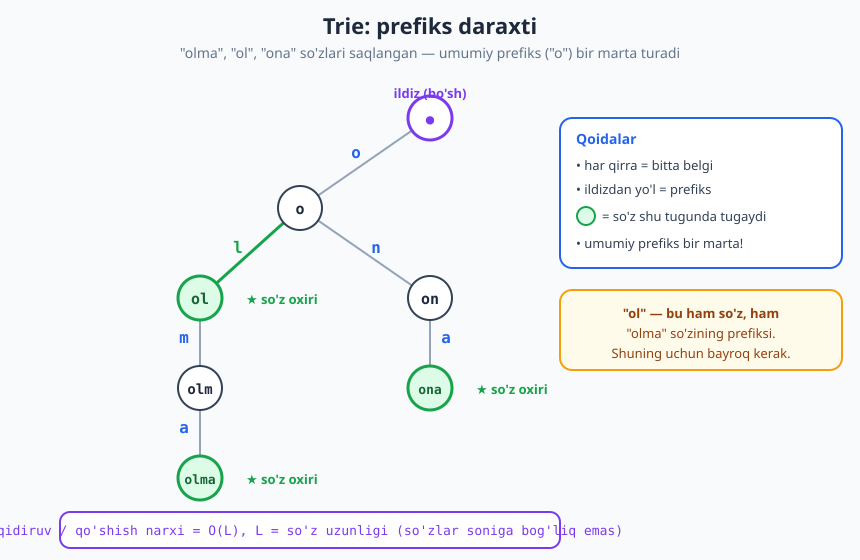
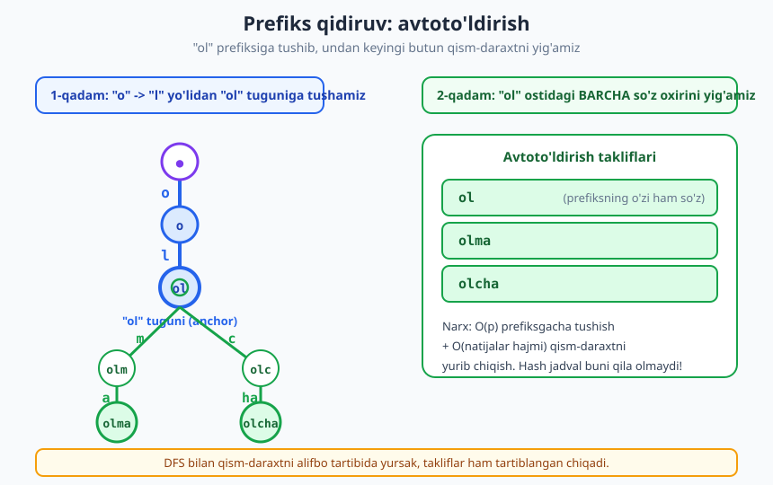
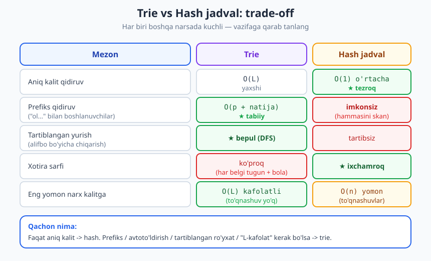

# 20 — Trie va string strukturalari

[⬅️ Oldingi: 19 — Heap va Priority Queue](./19-heap-priority-queue.md) · [🏠 README](./README.md) · [Keyingi: 21 — Graflar: tasvirlash va Union-Find ➡️](./21-graflar-union-find.md)

---

> **Bu bobda:** Ko'p so'zni saqlab, ular ustida **prefiks** ("ol bilan boshlanadigan hamma so'z") bo'yicha tez qidiradigan maxsus strukturani — **trie** (prefiks daraxti) ni o'rganamiz. `insert`, `search`, `starts_with` amallari va to'liq **avtoto'ldirish** (autocomplete) ni Python'da yozib, ishga tushirib ko'ramiz. So'ng trie ni hash jadval bilan taqqoslab, qachon qaysi biri yaxshiroq ekanini, xotira trade-off'ini va qisqa konseptual ko'prik sifatida **suffix** strukturalarni ko'rib chiqamiz.
>
> **Halollik / Eslatma:** Bu yerdagi murakkablik chegaralari (har amal `O(L)`, `L` — so'z uzunligi; avtoto'ldirish `O(p + natija hajmi)`) aniq va to'g'ri. Suffix array / suffix tree haqidagi qism **ataylab yuzaki** — faqat g'oya beriladi, chuqur tahlili [String algoritmlari](./31-string-algoritmlari.md) bobiga qoldiriladi. Barcha Python namunalari haqiqatan ishga tushirib tekshirilgan; ko'rsatilgan chiqishlar — kod bergan haqiqiy natijalar.

---

## Muammo: prefiks bo'yicha qidirish

Tasavvur qiling, telefoningizdagi qidiruv maydoniga "ol" deb yozdingiz — va u darhol *"olma", "olcha", "olov", "olis"* kabi takliflar ro'yxatini ko'rsatadi. Yoki lug'at ilovasi: siz hali so'zni yozib bo'lmadingiz, lekin u allaqachon mos variantlarni topib qo'ydi. Bularning ortida bitta umumiy savol turibdi:

> **"Berilgan harflar bilan *boshlanadigan* barcha so'zlarni qanday qilib tez topish mumkin?"**

Avval o'zimiz bilgan strukturalarni sinab ko'raylik.

**Massiv yoki ro'yxat.** Barcha so'zlarni massivda saqlab, har safar boshidan oxirigacha aylanib, har birining "ol" bilan boshlanishini tekshirsak bo'ladi. Lekin bu `n` ta so'z uchun `O(n · L)` — lug'atda million so'z bo'lsa, har bosishda millionta solishtirish. Sekin.

**Hash jadval.** [Hash jadval](./15-hash-jadval.md) bizga `O(1)` o'rtacha vaqtda **aniq** kalitni topib beradi: "olma" lug'atda bormi — bir lahzada. Lekin mana shu yerda uning chegarasi: hash jadval kalitni *butunlay* ahamiyatsiz (xaotik) joyga sochib yuboradi. "olma", "olcha", "ol" — ular bir-biriga o'xshasa-da, hash jadvalda butunlay turli kataklarda yotadi. Shuning uchun *"ol bilan boshlanadigan barcha so'zlar"* degan savolga hash jadval **javob bera olmaydi** — u faqat butun jadvalni boshdan-oxir skan qilib chiqishi mumkin, bu esa `O(n)`.

Demak bizga **prefikslarni o'zaro bog'liq saqlaydigan** struktura kerak: o'xshash boshlanishga ega so'zlar bir-biriga *yaqin* yotishi kerak. Aynan shuni **trie** beradi.

## Trie: prefiks daraxti

**Trie** (ingliz tilidagi re**trie**val — "izlash" so'zidan; ko'pincha "**try**" deb o'qiladi) — bu daraxt, unda:

- **Har bir qirra (chiziq) bitta belgini** anglatadi.
- **Ildizdan biror tugungacha bo'lgan yo'l — bitta prefiks** (harflar ketma-ketligi).
- Biror tugun **"so'z oxiri"** bayrog'i bilan belgilangan bo'lsa, demak ildizdan o'sha tugungacha bo'lgan yo'l — to'liq, lug'atga kiritilgan so'z.

Eng muhim g'oya: **umumiy prefiks faqat bir marta saqlanadi**. "olma" va "olcha" so'zlari `o → l` qismini *baham ko'radi* — bu yo'l daraxtda bitta marta mavjud, keyin ikkiga ajraladi.



Diagrammada uchta so'z — "olma", "ol", "ona" — saqlangan. E'tibor bering:

- Ildiz **bo'sh** (hech qanday belgiga mos kelmaydi) — u bor-yo'g'i boshlang'ich nuqta.
- `o` tuguni ikkala tarmoq uchun **umumiy**: undan `l` (→ "ol", "olma" tomon) va `n` (→ "ona" tomon) ajraladi.
- Yashil tugunlar — **so'z oxiri**: "ol", "olma", "ona". 

Eng nozik nuqta — **"ol"**. U bir vaqtning o'zida ham **mustaqil so'z** (kiritilgan), ham **"olma" so'zining prefiksi**. Aynan shuning uchun har tugunda alohida `so'z_oxiri` bayrog'i kerak: tugunning bola(lar)i bor-yo'qligi so'z ekanini bildirmaydi. "ol" tugunining bolasi bor ("olma" davom etadi), lekin o'zi ham so'z — buni faqat bayroq ayta oladi.

> **Eslatma:** Trie strukturasi *kalitlarning o'zini* (belgilarini) yo'lga "yozib" qo'yadi. Hash jadvalda kalit hash funksiya orqali son-indeksga aylanadi va asl tuzilishi yo'qoladi; trie da esa kalitning harf-tuzilishi to'g'ridan-to'g'ri daraxt shaklida saqlanadi. Mana shu farq trie ga prefiks-kuchini beradi.

## Amallar va ularning narxi

Trie ning uchta asosiy amali bor, va ularning hammasi **bir xil oddiy mantiqqa** ega: ildizdan boshlab, so'z (yoki prefiks) belgilari bo'yicha tugundan-tugunga "tushib boramiz".

1. **`insert(soz)`** — so'zni qo'shish. Ildizdan boshlaymiz; har belgi uchun mos bola bo'lmasa, yangisini yaratamiz; oxirgi tugunda `so'z_oxiri = True` qilamiz.
2. **`search(soz)`** — *aniq so'z* bormi? Belgilar bo'yicha tushamiz; biror belgida bola bo'lmasa → yo'q; oxiriga yetganda **`so'z_oxiri` bayrog'ini ham tekshiramiz** (prefiks bo'lishining o'zi so'z degani emas).
3. **`starts_with(prefiks)`** — shu prefiks bilan *biror* so'z bormi? `search` bilan deyarli bir xil, faqat oxirida bayroqni tekshirmaymiz — prefiksgacha yo'l mavjud bo'lsa, yetarli.

**Murakkablik — trie ning butun kuchi shu yerda.** `L` so'z (yoki prefiks) uzunligi bo'lsin:

| Amal | Vaqt | Izoh |
|---|---|---|
| `insert(soz)` | **O(L)** | har belgi uchun bitta qadam |
| `search(soz)` | **O(L)** | eng ko'pi `L` ta tugun bo'ylab tushish |
| `starts_with(prefiks)` | **O(L)** | xuddi shunday |

E'tibor bering: bu narxlar **lug'atdagi so'zlar soniga (`n`) umuman bog'liq emas!** Million so'z bo'lsa ham, "olma" ni qidirish bor-yo'g'i 4 ta qadam (har harfga bittadan). Hash jadval ham `n` ga bog'liq emas (o'rtacha), lekin trie buni *to'qnashuvlarsiz, kafolatli* `O(L)` da qiladi — va ustiga prefiks-qidiruvni ham beradi.

> **Intuitsiya:** Trie da qidiruv narxi **so'zning o'zi qancha uzun ekaniga** bog'liq, lug'at qancha katta ekaniga emas. Bu telefon kitobida ismni *bitta harfdan boshlab* topishga o'xshaydi: "A...", "Al...", "Ali..." — har harf izlash maydonini toraytiradi.

## Implementatsiya: Python'da trie

Avval tugun (`TrieNode`) ni belgilaymiz: har tugunda **bolalar lug'ati** (`belgi → tugun`) va **`so'z_oxiri`** bayrog'i bor. Lug'at (`dict`) ishlatamiz — u har qanday alifboga moslashadi va faqat mavjud belgilar uchun joy oladi (massiv ishlatsak, har tugunda 26 yoki 33 ta katak ajratiladi, ko'pi bo'sh qoladi).

```python
class TrieNode:
    def __init__(self):
        self.bolalar = {}        # belgi -> TrieNode
        self.soz_oxiri = False   # shu tugunda biror so'z tugaydimi?

class Trie:
    def __init__(self):
        self.ildiz = TrieNode()

    def insert(self, soz):
        tugun = self.ildiz
        for belgi in soz:
            if belgi not in tugun.bolalar:
                tugun.bolalar[belgi] = TrieNode()
            tugun = tugun.bolalar[belgi]
        tugun.soz_oxiri = True

    def _yur(self, prefiks):           # prefiks oxiridagi tugunni qaytaradi (yoki None)
        tugun = self.ildiz
        for belgi in prefiks:
            if belgi not in tugun.bolalar:
                return None
            tugun = tugun.bolalar[belgi]
        return tugun

    def search(self, soz):             # aniq so'z bormi?
        tugun = self._yur(soz)
        return tugun is not None and tugun.soz_oxiri

    def starts_with(self, prefiks):    # shu prefiks bilan biror so'z bormi?
        return self._yur(prefiks) is not None

t = Trie()
for soz in ["olma", "ol", "ona", "olcha"]:
    t.insert(soz)

print(t.search("ol"))        # -> True   (kiritilgan so'z)
print(t.search("olm"))       # -> False  (faqat prefiks, so'z emas)
print(t.search("olma"))      # -> True
print(t.starts_with("ol"))   # -> True
print(t.starts_with("xa"))   # -> False
```

`search("olm")` **`False`** qaytarishiga alohida e'tibor bering: "olm" — daraxtda mavjud yo'l (chunki "olma" shu orqali o'tadi), lekin *uning oxiridagi tugun so'z emas* (`so'z_oxiri = False`). `starts_with("olm")` esa `True` bo'lardi. Bu ikki amal orasidagi farq — aynan `so'z_oxiri` bayrog'ining ma'nosi.

`_yur` (ichki yordamchi) uchala "qidiruv" amalining umumiy yadrosi: prefiks bo'yicha tushib, yetib borgan tugunni yoki `None` ni qaytaradi. Bu — kodni takrorlamaslikning toza usuli.

### Avtoto'ldirish: prefiks bo'yicha barcha so'zlar

Endi trie ning "yulduzli" amali — **avtoto'ldirish**. Ikki bosqich:

1. Prefiksgacha "tushib boramiz" (`_yur`) — bu bizni qism-daraxtning ildiziga olib keladi.
2. O'sha qism-daraxtni **to'liq aylanib chiqib** (DFS), **`so'z_oxiri` belgilangan** har bir tugunga mos so'zni yig'amiz.



Diagrammada ko'rsatilganidek, "ol" prefiksiga tushgach, undan keyingi butun qism-daraxtni yuramiz va "ol", "olma", "olcha" ni topamiz. Bola tugunlarni **alifbo tartibida** (`sorted`) aylansak, natija ham avtomatik tartiblangan chiqadi.

```python
class TrieAuto(Trie):
    def _yig(self, tugun, qurilgan, natija):
        if tugun.soz_oxiri:
            natija.append(qurilgan)
        for belgi in sorted(tugun.bolalar):       # alifbo tartibida
            self._yig(tugun.bolalar[belgi], qurilgan + belgi, natija)

    def autocomplete(self, prefiks):
        boshlanish = self._yur(prefiks)
        if boshlanish is None:
            return []
        natija = []
        self._yig(boshlanish, prefiks, natija)
        return natija

a = TrieAuto()
for soz in ["olma", "ol", "ona", "olcha", "osmon"]:
    a.insert(soz)

print(a.autocomplete("ol"))    # -> ['ol', 'olcha', 'olma']
print(a.autocomplete("o"))     # -> ['ol', 'olcha', 'olma', 'ona', 'osmon']
print(a.autocomplete("xy"))    # -> []
```

**Narxi.** Prefiksgacha tushish `O(p)` (`p` — prefiks uzunligi), so'ng qism-daraxtni yurish — chiqariladigan natija hajmiga proporsional, ya'ni `O(natija hajmi)`. Jami: **`O(p + natija)`**. Bu juda yaxshi: siz faqat shuncha ish qilasizki, qancha natija qaytarsangiz (ortiqcha hech narsa skan qilinmaydi). Hash jadval bilan buni umuman qilib bo'lmasdi — barcha `n` kalitni skan qilishga to'g'ri kelardi.

> **Eslatma — DFS va tartib.** `sorted(tugun.bolalar)` chaqiruvi har tugunda bolalarni alifbo tartibida beradi, shuning uchun chuqurlikbo'yli yurish (DFS) so'zlarni **leksikografik (lug'at) tartibda** qaytaradi. Agar tartib kerak bo'lmasa, `sorted` ni olib tashlab tezlikni biroz oshirish mumkin. Daraxtlarni aylanib chiqish usullari haqida [Daraxtlar va traversal](./16-daraxtlar-traversal.md) bobida batafsil.

## Trie vs hash jadval: trade-off

Endi ikki strukturani yonma-yon qo'yamiz. Ikkalasi ham "kalitlar to'plami"ni saqlaydi, lekin butunlay boshqa narsada kuchli.



| Mezon | Trie | Hash jadval |
|---|---|---|
| Aniq kalit qidiruv | `O(L)` kafolatli | **`O(1)` o'rtacha** — tezroq |
| **Prefiks qidiruv** | **`O(p + natija)`** — tabiiy | imkonsiz (`O(n)` skan) |
| Tartiblangan yurish | **bepul** (DFS alifbo bo'yicha) | tartibsiz, qo'shimcha saralash kerak |
| Xotira | ko'proq (har belgi — tugun) | ixchamroq |
| Eng yomon narx (kalitga) | `O(L)` kafolatli (to'qnashuv yo'q) | `O(n)` (yomon to'qnashuvlarda) |

**Xulosa qiluvchi qoida:**

- **Faqat aniq kalit** kerakmi (lug'atda bor-yo'qligi, qiymat olish)? → **hash jadval**. U o'rtacha `O(1)` va kamroq xotira.
- **Prefiks, avtoto'ldirish, tartiblangan ro'yxat yoki kafolatlangan `O(L)`** kerakmi? → **trie**.

> **Trade-off:** Trie ning asosiy narxi — **xotira**. Sodda implementatsiyada har belgi alohida tugun bo'ladi, har tugunda esa bolalar lug'ati (yoki massiv). Agar so'zlar uzun va kam umumiy prefiksli bo'lsa (masalan, tasodifiy UUID'lar), trie hash jadvaldan ancha ko'p xotira yeydi va deyarli foyda bermaydi. Trie aynan **umumiy prefiks ko'p** bo'lgan ma'lumotda (tabiiy til so'zlari, URL'lar, IP manzillar) yarqiraydi.

> **Diqqat:** "`O(1)` hash har doim trie dan tez" degan xulosa noto'g'ri. Hash funksiyani hisoblash uchun ham butun kalitni o'qish kerak — bu `O(L)`. Trie da ham `O(L)`. Farq — doimiy koeffitsiyentlarda va to'qnashuvlar ehtimolida, prefiks-qobiliyatda emas. Asimptotik taqqoslashda ehtiyot bo'ling: [Asimptotik notatsiya](./08-asimptotik-notatsiya.md) bobini eslang.

## Xotirani tejash: compressed trie (radix tree)

Sodda trie da ko'p **"bir bolali zanjir"** uchraydi. Masalan lug'atda faqat "osmon" so'zi bo'lsa, `o → s → m → o → n` — beshta tugun, har birida bittadan bola. Bunday zanjir xotirani behuda sarflaydi.

**Compressed trie** (siqilgan trie), boshqacha **radix tree** yoki **Patricia trie** deb ataladi, shu g'oyani hal qiladi: **tarmoqlanmaydigan zanjirni bitta qirraga "yopishtirib"** qo'yadi. Ya'ni qirrada bitta belgi emas, butun **bo'lak** (substring) yoziladi.

```text
Oddiy trie ("osmon"):        Compressed trie:

   ildiz                        ildiz
     | o                          | "osmon"
    [o]                          [osmon] ★
     | s
    [os]
     | m
    [osm]
     | o
    [osmo]
     | n
   [osmon] ★
```

Tarmoqlanish boshlangan joyda esa zanjir ajraladi. Compressed trie bir xil qidiruv-kuchini saqlaydi, lekin tugunlar sonini keskin kamaytiradi — bu IP routing jadvallari (har paket uchun "eng uzun mos prefiks" qidiruvi) va katta lug'atlarda muhim. Biz bu yerda faqat g'oyani beramiz; amalda u biroz murakkabroq (qirralarni bo'lish/birlashtirish kerak).

## Suffix strukturalari: qisqacha ko'prik

Trie **prefiks** (so'z boshi) bo'yicha qidiradi. Lekin ko'p masalada bizga **substring** (matnning *o'rtasidagi* bo'lak) kerak bo'ladi: "katta matnda 'lma' bo'lagi qayerda uchraydi?" Trie bunga to'g'ridan-to'g'ri javob bermaydi.

G'oya shunday: agar bitta matnning **barcha suffikslari**ni (oxirgi qismlari) bir strukturaga joylasak, u holda *har qanday substring — albatta biror suffiksning prefiksidir*. Masalan "banana" matnida "nan" — "nana" suffiksining prefiksi. Demak suffikslar ustidagi prefiks-qidiruv = butun matn ichidagi substring-qidiruv!

Buni amalga oshiradigan ikki klassik struktura bor:

- **Suffix array** — barcha suffikslarni alifbo tartibida saralangan indekslar massivi. Ixcham, binar qidiruv bilan substringni tez topadi.
- **Suffix tree** — barcha suffikslardan qurilgan (compressed) trie. Kuchli, lekin ko'proq xotira.

Bular bilan substring qidiruv, takrorlanuvchi bo'laklar, eng uzun umumiy substring kabi masalalar samarali yechiladi. Bu yerda biz **faqat g'oyani** beramiz — to'liq qurilishi va tahlili [String algoritmlari](./31-string-algoritmlari.md) bobida.

> **Eslatma:** Trie — "ko'p so'zni prefiks bo'yicha" uchun; suffix strukturalar — "bitta matn ichidagi substring bo'yicha" uchun. Ikkalasi ham bir g'oyaning — *yo'lni belgilarga ajratib daraxtga joylash* — turli qo'llanishi.

## Qo'llanmalar

Trie qaerda ishlatiladi:

- **Avtoto'ldirish (autocomplete)** — qidiruv maydonlari, kod muharrirlari (IDE), brauzer manzil qatori.
- **Imlo tekshirish va tuzatish** — so'z lug'atda bormi (`search`), yoki yaqin variantlarni topish.
- **IP routing** — routerlar "eng uzun mos prefiks" (longest prefix match) ni topish uchun (compressed) trie/radix tree ishlatadi.
- **So'z o'yinlari** — Scrabble, Boggle kabi o'yinlarda berilgan harflardan tuzilishi mumkin bo'lgan so'zlarni tez tekshirish.
- **T9 / klaviatura bashorati** — telefon klaviaturasida tugma ketma-ketligidan mos so'zlarni taklif qilish.

Umumiy jihat: hammasida **prefiks bo'yicha qidirish yoki to'plamga tegishlilikni belgi-belgi tekshirish** kerak — bu trie ning tabiiy vazifasi.

## Asosiy g'oyalar (bobni qisqacha)

- **Trie (prefiks daraxti):** har qirra bitta belgi; ildizdan tugungacha yo'l — prefiks; `so'z_oxiri` bayrog'i — to'liq so'z. Umumiy prefiks bir marta saqlanadi.
- **Uchta amal** — `insert`, `search`, `starts_with` — har biri **`O(L)`**, `L` so'z uzunligi. Lug'atdagi so'zlar soniga **bog'liq emas**.
- `search` so'z oxirida **`so'z_oxiri` bayrog'ini ham** tekshiradi; `starts_with` tekshirmaydi. Mana shu farq "ol" (so'z) va "olm" (faqat prefiks) ni ajratadi.
- **Avtoto'ldirish** = prefiksgacha tushish (`O(p)`) + qism-daraxtni DFS bilan yurish (`O(natija)`). Bolalarni `sorted` aylansak, natija tartiblangan.
- **Trade-off:** trie prefiks-qidiruv, tartiblangan yurish va kafolatlangan `O(L)` beradi; evaziga **ko'proq xotira**. Hash jadval aniq kalit uchun `O(1)` o'rtacha va ixchamroq, lekin prefiks qila olmaydi.
- **Compressed trie / radix tree** — bir bolali zanjirlarni siqib xotirani tejaydi (IP routing).
- **Suffix array / suffix tree** — substring qidiruv uchun: *substring = biror suffiksning prefiksi* g'oyasi. Tafsilot 31-bobda.

## Mashqlar

### Oson

**1-mashq.** "kit", "kitob", "kun", "ko'k" so'zlarini saqlovchi trie ni qog'ozda chizing (qirralarni belgilar bilan, so'z oxirlarini yulduzcha bilan). Qaysi tugun(lar) bir nechta so'z uchun umumiy? Daraxtda nechta tugun bor (ildizdan tashqari)?

**2-mashq.** Yuqoridagi trie da quyidagilar `True` mi yoki `False` mi, izohlang: (a) `search("kit")`, (b) `search("ki")`, (c) `starts_with("ki")`, (d) `starts_with("kitobcha")`.

**3-mashq.** Nima uchun trie ga `so'z_oxiri` bayrog'i kerak? "Tugunning bolasi bo'lmasa — bu so'z oxiri" degan qoidaning *qaysi holatda* buzilishini bitta misol bilan ko'rsating.

### O'rta

**4-mashq.** `insert`, `search`, `starts_with` ni o'zingiz nol'dan yozing (bobdagi kodga qaramasdan urinib ko'ring). So'ng `["dasturlash", "dastur", "dars", "daraxt"]` ni qo'shib, `search("dars")`, `search("das")`, `starts_with("da")` natijalarini bashorat qiling, keyin ishga tushirib tekshiring.

**5-mashq.** Berilgan prefiks bilan boshlanadigan **so'zlar sonini** qaytaradigan `prefiks_soni(prefiks)` funksiyasini yozing. (Maslahat: prefiksgacha tushib, qism-daraxtdagi `so'z_oxiri` belgilangan tugunlarni rekursiv sanang.) `["olma","ol","olcha","osmon","ona"]` da `prefiks_soni("ol")` nechaga teng?

**6-mashq.** `insert` amalining `O(L)` ekanini tushuntiring (`L` — so'z uzunligi). Nima uchun u trie dagi *boshqa* so'zlar soniga (`n`) bog'liq emas? Hash jadvalga `insert` bilan taqqoslang.

### Qiyin

**7-mashq.** To'liq **avtoto'ldirish** ni implement qiling: `autocomplete(prefiks)` berilgan prefiks bilan boshlanadigan barcha so'zlarni **alifbo tartibida** qaytarsin. `["car","card","care","cat","dog"]` da `autocomplete("car")` va `autocomplete("ca")` nimani qaytaradi? Vaqt murakkabligini ayting.

**8-mashq.** Quyidagi har bir vaziyat uchun trie yoki hash jadval tanlang va **sababini** ayting: (a) faqat "bu email ro'yxatda bormi?" deb tekshirish; (b) qidiruv maydonida avtoto'ldirish; (c) lug'atdagi barcha so'zlarni alifbo tartibida chiqarish; (d) tasodifiy 128-bitli hash kalitlar to'plamiga tegishlilikni tekshirish.

**9-mashq.** **Eng uzun umumiy prefiks.** Bir nechta so'z berilgan (masalan `["dasturlash","dastur","dars"]`). Ularning hammasiga umumiy bo'lgan **eng uzun boshlang'ich prefiks**ni trie yordamida toping (bu yerda `"da"`). Trie ning qaysi xossasi — qaysi tugungacha "bir yo'lli zanjir" davom etishi — bu masalani osonlashtirishini tushuntiring.

<details markdown="1">
<summary>Yechimlar</summary>

### 1-mashq yechimi

```text
        ildiz
        /    \
     k          (faqat k bilan boshlanadi)
     |
    ki ------------------\
     |  \                 \
    kit  ku               ko'
     |\    \                \
    kit ★  kito             ku ★? 
```

Aniqroq tuzilma (har tugun = ildizdan to'plangan prefiks):

- `k`
- `ki` → `kit` → `kito` → `kitob` ★
  - `kit` ★ (so'z "kit")
- `ku` → `kun` ★
- `ko'` → `ko'k` ★

Umumiy tugun: **`k`** — to'rt so'z uchun ham umumiy; **`ki`** — "kit" va "kitob" uchun umumiy. So'z oxirlari (★): `kit`, `kitob`, `kun`, `ko'k`. Tugunlar (ildizdan tashqari, har biri noyob prefiks): `k, ki, kit, kito, kitob, ku, kun, ko', ko'k` = **9 ta** tugun. ("kit" — "kitob" yo'lining bir qismi, alohida tugun qo'shmaydi, faqat bayroq oladi.)

### 2-mashq yechimi

- **(a) `search("kit")` = True.** "kit" — kiritilgan so'z; uning oxiridagi tugun `so'z_oxiri = True`.
- **(b) `search("ki")` = False.** "ki" daraxtda mavjud yo'l, lekin so'z sifatida kiritilmagan — `so'z_oxiri = False`.
- **(c) `starts_with("ki")` = True.** "ki" bilan boshlanuvchi so'zlar bor ("kit", "kitob"), shuning uchun prefiks mavjud.
- **(d) `starts_with("kitobcha")` = False.** "kitob" dan keyin daraxtda "c" bolasi yo'q — yo'l uzilib qoladi.

### 3-mashq yechimi

`so'z_oxiri` bayrog'i kerak, chunki **bir so'z ikkinchisining prefiksi bo'lishi mumkin**. Misol: lug'atda ham "ol", ham "olma" bor. "ol" tugunining **bolasi bor** ("olma" davom etadi), demak "bolasi bo'lmasa — so'z oxiri" qoidasiga ko'ra "ol" so'z emas deb hisoblanadi — bu **noto'g'ri**, "ol" haqiqatan so'z. Bayroq aynan shu holatni hal qiladi: "ol" tugunida `so'z_oxiri = True`, lekin bola(lar)i ham bor.

### 4-mashq yechimi

Kod (bobdagiga o'xshash):

```python
class TrieNode:
    def __init__(self):
        self.bolalar = {}
        self.soz_oxiri = False

class Trie:
    def __init__(self):
        self.ildiz = TrieNode()
    def insert(self, soz):
        tugun = self.ildiz
        for belgi in soz:
            tugun = tugun.bolalar.setdefault(belgi, TrieNode())
        tugun.soz_oxiri = True
    def _yur(self, prefiks):
        tugun = self.ildiz
        for belgi in prefiks:
            if belgi not in tugun.bolalar:
                return None
            tugun = tugun.bolalar[belgi]
        return tugun
    def search(self, soz):
        tugun = self._yur(soz)
        return tugun is not None and tugun.soz_oxiri
    def starts_with(self, prefiks):
        return self._yur(prefiks) is not None
```

Bashorat va natija: `["dasturlash","dastur","dars","daraxt"]` qo'shilgach:

- `search("dars")` → **True** (kiritilgan so'z).
- `search("das")` → **False** ("das" faqat prefiks, kiritilmagan).
- `starts_with("da")` → **True** (hamma so'z "da" bilan boshlanadi).

### 5-mashq yechimi

```python
def sanash(tugun):                       # qism-daraxtdagi so'zlar soni
    soni = 1 if tugun.soz_oxiri else 0
    for bola in tugun.bolalar.values():
        soni += sanash(bola)
    return soni

def prefiks_soni(trie, prefiks):
    tugun = trie._yur(prefiks)
    return 0 if tugun is None else sanash(tugun)

t = Trie()
for soz in ["olma", "ol", "olcha", "osmon", "ona"]:
    t.insert(soz)

print(prefiks_soni(t, "ol"))   # -> 3   (ol, olma, olcha)
print(prefiks_soni(t, "o"))    # -> 5
print(prefiks_soni(t, "xy"))   # -> 0
```

`prefiks_soni("ol")` = **3** — "ol", "olma", "olcha" shu prefiks bilan boshlanadi.

### 6-mashq yechimi

`insert(soz)` so'z belgilarini birma-bir aylanadi: har belgi uchun bola bor-yo'qligini tekshiradi (lug'atda `O(1)`) va bittadan qadam pastga tushadi. Demak jami `L` ta qadam — **`O(L)`**.

U trie dagi **boshqa** `n` so'zga bog'liq emas, chunki biz faqat o'z so'zimiz yo'li bo'ylab yuramiz — qaysi yo'lda nechta begona so'z yotgani ahamiyatsiz; har qadamda lug'at qidiruvi `O(1)`. Hash jadvalga `insert` ham `O(L)` (kalitni hash qilish uchun butun kalitni o'qish kerak) + o'rtacha `O(1)` joylashtirish, ya'ni o'rtacha `O(L)`. Ikkalasi ham `n` ga bog'liq emas; farq prefiks-qobiliyatda va xotirada.

### 7-mashq yechimi

```python
class TrieAuto(Trie):
    def _yig(self, tugun, qurilgan, natija):
        if tugun.soz_oxiri:
            natija.append(qurilgan)
        for belgi in sorted(tugun.bolalar):
            self._yig(tugun.bolalar[belgi], qurilgan + belgi, natija)
    def autocomplete(self, prefiks):
        boshlanish = self._yur(prefiks)
        if boshlanish is None:
            return []
        natija = []
        self._yig(boshlanish, prefiks, natija)
        return natija

a = TrieAuto()
for soz in ["car", "card", "care", "cat", "dog"]:
    a.insert(soz)
print(a.autocomplete("car"))   # -> ['car', 'card', 'care']
print(a.autocomplete("ca"))    # -> ['car', 'card', 'care', 'cat']
```

`autocomplete("car")` → **`['car', 'card', 'care']`**; `autocomplete("ca")` → **`['car', 'card', 'care', 'cat']`** ("dog" tushmaydi). Vaqt: prefiksgacha tushish `O(p)` + qism-daraxtni yurish `O(natija hajmi)` = **`O(p + natija)`**. `sorted` tufayli natija alifbo tartibida.

### 8-mashq yechimi

- **(a) "email ro'yxatda bormi?" → hash jadval.** Faqat aniq kalit tekshiriladi, prefiks kerak emas; hash o'rtacha `O(1)` va kamroq xotira.
- **(b) avtoto'ldirish → trie.** Prefiks bo'yicha barcha mos so'zlar kerak — bu aynan trie ning vazifasi; hash buni qila olmaydi.
- **(c) barcha so'zlarni alifbo tartibida → trie.** DFS bilan trie tartiblangan yurishni bepul beradi; hash tartibsiz, qo'shimcha saralash (`O(n log n)`) talab qilardi.
- **(d) tasodifiy 128-bitli hash kalitlar → hash jadval.** Umumiy prefiks deyarli yo'q (kalitlar tasodifiy), shuning uchun trie xotirani behuda yeydi va foyda bermaydi; hash jadval ixcham va `O(1)`.

### 9-mashq yechimi

Eng uzun umumiy prefiks — bu ildizdan boshlanib, **tarmoqlanish (ikkidan ortiq bola) yoki so'z oxiri uchragunga qadar** davom etadigan "bir yo'lli zanjir". Trie da bu juda tabiiy:

```python
def eng_uzun_umumiy_prefiks(trie):
    natija = []
    tugun = trie.ildiz
    while len(tugun.bolalar) == 1 and not tugun.soz_oxiri:
        (belgi, bola), = tugun.bolalar.items()   # yagona bola
        natija.append(belgi)
        tugun = bola
    return "".join(natija)

t = Trie()
for soz in ["dasturlash", "dastur", "dars"]:
    t.insert(soz)
print(eng_uzun_umumiy_prefiks(t))   # -> da
```

Natija **`"da"`**. Trie xossasi: agar tugunning aniq **bitta** bolasi bo'lsa, demak shu nuqtagacha barcha so'zlar bir xil belgi bilan davom etadi — ya'ni umumiy prefiks uzaymoqda. Bola **ikkita yoki ko'p** bo'lganda (yo'l ajraladi) yoki tugun **so'z oxiri** bo'lganda (bir so'z shu yerda tugaydi, masalan "dars") — umumiy prefiks tugaydi. Shu zanjirni yurib chiqsak, javob `O(natija uzunligi)` da topiladi. (Yuqoridagi `["dasturlash","dastur","dars"]` da `da` dan keyin `s`/`r` ga tarmoqlanadi, shuning uchun "da" da to'xtaydi.)

</details>

---

[⬅️ Oldingi: 19 — Heap va Priority Queue](./19-heap-priority-queue.md) · [🏠 README](./README.md) · [Keyingi: 21 — Graflar: tasvirlash va Union-Find ➡️](./21-graflar-union-find.md)
