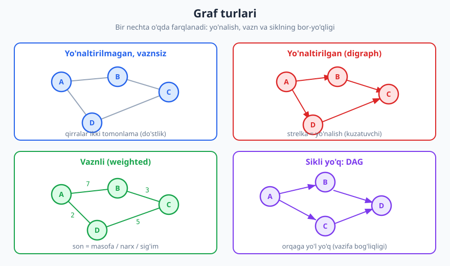
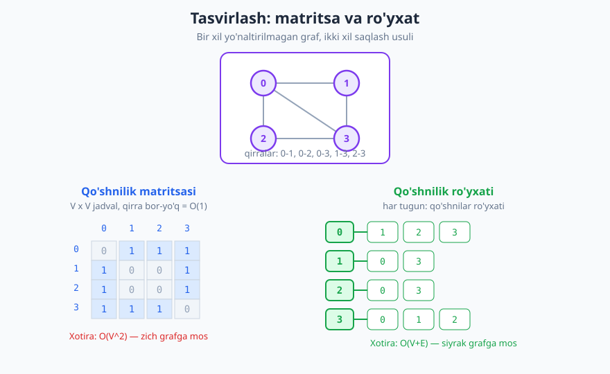
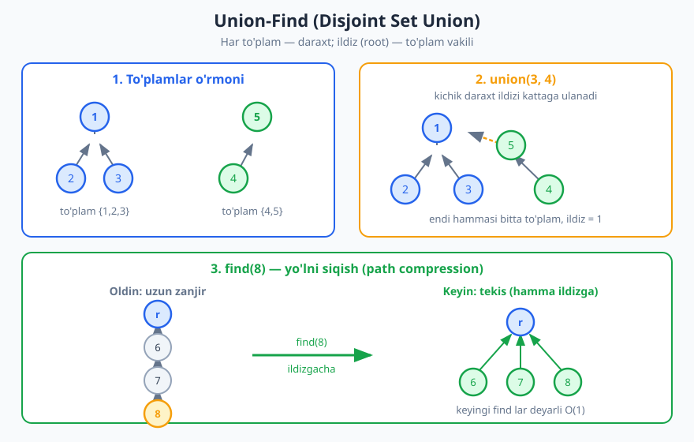

# 21 — Graflar: tasvirlash va Union-Find

[⬅️ Oldingi: 20 — Trie va string strukturalari](./20-trie-string-strukturalari.md) · [🏠 README](./README.md) · [Keyingi: 22 — Brute force va to'liq qidiruv ➡️](./22-brute-force.md)

---

> **Bu bobda:** Eng umumiy va eng kuchli ma'lumotlar strukturasi — **graf** bilan tanishamiz: u nima, qanday terminologiya bilan tasvirlanadi va qaysi turlari bor. So'ngra grafni kompyuter xotirasida saqlashning ikki asosiy usulini — **qo'shnilik matritsasi** va **qo'shnilik ro'yxati** ni — chuqur taqqoslaymiz. Bobning ikkinchi yarmi alohida muhim strukturaga — **Union-Find** (Disjoint Set Union) ga bag'ishlangan: u to'plamlarni tez birlashtirib, "bir guruhdami?" savoliga deyarli bir zumda javob beradi.
>
> **Halollik / Eslatma:** Xotira va vaqt chegaralari (matritsa `O(V^2)`, ro'yxat `O(V+E)`, Union-Find amortized `α(n)`) matematik aniq. Union-Find ning `α(n)` (teskari Akkerman funksiyasi) chegarasi — chuqur isbotga ega; biz bu yerda faqat **intuitsiyasini** beramiz, to'liq isbotini emas. Python namunalari haqiqatan ishga tushirib tekshirilgan: chiqishlar — kod chiqargan haqiqiy natijalar.

---

## Graf nima

Tasavvur qiling, sizda bir nechta **obyekt** bor va ular orasida qandaydir **bog'lanishlar** mavjud. Odamlar va ular orasidagi do'stlik. Shaharlar va ularni bog'lovchi yo'llar. Web sahifalar va ulardagi havolalar. Vazifalar va "bu vazifa avval bajarilishi kerak" bog'liqliklari. Bularning hammasi bitta umumiy matematik tushuncha bilan ifodalanadi — **graf**.

Graf ikki narsadan iborat:

- **Tugunlar** (vertex, node) — obyektlarning o'zi. Masalan, odamlar.
- **Qirralar** (edge) — tugunlarni bog'lovchi aloqalar. Masalan, "Ali va Vali do'st".

Matematik yozuvda graf `G = (V, E)` deb belgilanadi, bu yerda `V` — tugunlar (vertices) to'plami, `E` — qirralar (edges) to'plami. Odatda `|V|` ni qisqacha `V`, `|E|` ni `E` deb yozamiz: "graf V ta tugun va E ta qirradan iborat".

> **Intuitsiya:** Graf — bu **eng umumiy** struktura. Biz oldingi boblarda ko'rgan deyarli barcha strukturalar — uning xususiy holatlari:
> - **Bog'langan ro'yxat** [13-bob](./13-boglangan-royxatlar.md) — har tugunning aniq bitta keyingisi bor graf (chiziq).
> - **Daraxt** [16-bob](./16-daraxtlar-traversal.md) — sikli yo'q, bog'langan, `V-1` qirrali graf.
>
> Daraxt — grafning qat'iy cheklangan turi; graf esa bu cheklovlarni olib tashlaydi: bir tugun istalgancha qo'shniga ega bo'lishi, halqalar (sikllar) yuzaga kelishi mumkin.

Real misollar bilan tasavvur qilaylik:

| Soha | Tugunlar | Qirralar |
|---|---|---|
| Ijtimoiy tarmoq | foydalanuvchilar | do'stlik / obuna |
| Yo'l xaritasi | shaharlar / chorrahalar | yo'llar |
| Internet | routerlar | kabellar |
| Dastur moduli | fayllar / paketlar | `import` bog'liqliklari |
| Web | sahifalar | havolalar (link) |

Grafning kuchi shundaki, bir marta "bu masala graf masalasi" deb tushunsangiz, unga tayyor algoritmlar (eng qisqa yo'l, bog'langan komponentlar, sikl topish) bevosita qo'llaniladi.

## Terminologiya

Graflar bilan ishlash uchun bir nechta atamani aniq bilish kerak. Quyida kichik bir grafga tayanib tushuntiramiz.

- **Tugun (vertex / node):** grafning bitta nuqtasi. `A`, `B`, `0`, `1` kabi belgilanadi.
- **Qirra (edge):** ikki tugunni bog'lovchi aloqa, `(A, B)` juftligi.
- **Qo'shni (adjacent):** ikki tugun bitta qirra bilan bog'langan bo'lsa, ular qo'shni. `A` ning **qo'shnilari** — unga to'g'ridan bog'langan barcha tugunlar.
- **Daraja (degree):** tugunning qirralari soni. Yo'naltirilgan grafda ikkiga bo'linadi: **kiruvchi daraja** (in-degree — tugunga kiradigan strelkalar) va **chiquvchi daraja** (out-degree — tugundan chiqadigan strelkalar).
- **Yo'l (path):** tugunlar ketma-ketligi, har biri keyingisiga qirra bilan bog'langan: `A → B → D`.
- **Sikl (cycle):** boshlangan tugunga qaytib keladigan yo'l: `A → B → D → A`.
- **Bog'langan (connected):** grafda har ikki tugun orasida yo'l bo'lsa, graf bog'langan deyiladi.
- **Komponent (connected component):** o'zaro bog'langan tugunlarning maksimal guruhi. Bog'langan graf — bitta komponentdan iborat.
- **Og'irlik / vazn (weight):** qirraga biriktirilgan son — masofa, narx, sig'im.

> **Eslatma (handshaking lemmasi):** Yo'naltirilmagan grafda barcha tugunlar darajalarining **yig'indisi qirralar sonining ikki barobariga teng**: `Σ deg(v) = 2E`. Sababi oddiy — har bir qirra ikki uchining darajasiga bittadan hissa qo'shadi. Buni keyinroq kodda tekshirib ko'ramiz.

## Graf turlari

Graflar bir nechta o'qda farqlanadi. To'g'ri turni tanlash — masalani to'g'ri modellashtirishning birinchi qadami.



### Yo'naltirilgan va yo'naltirilmagan

- **Yo'naltirilmagan (undirected):** qirra ikki tomonlama. `A`–`B` qirrasi "A va B bir-biriga bog'langan" degani. Do'stlik bunday: agar Ali Valining do'sti bo'lsa, Vali ham Alining do'sti.
- **Yo'naltirilgan (directed / digraph):** qirra strelka, faqat bir yo'nalishda. `A → B` "A dan B ga" degani, lekin `B → A` bo'lmasligi mumkin. Twitter/X dagi obuna bunday: siz kimnidir kuzatishingiz mumkin, lekin u sizni kuzatmasligi mumkin.

Yo'naltirilmagan grafni har qirra ikki yo'nalishli bo'lgan yo'naltirilgan grafning xususiy holati deb qarash mumkin.

### Vaznli va vaznsiz

- **Vaznsiz (unweighted):** qirra faqat "bog'lanish bor" deydi.
- **Vaznli (weighted):** har qirraga **son** biriktiriladi — ikki shahar orasidagi masofa, kabel sig'imi, parvoz narxi. Eng qisqa yo'l algoritmlari (Dijkstra) aynan vaznli graflar ustida ishlaydi [29-bob](./29-graf-algoritmlari-1.md).

### Sikli bor va sikli yo'q (DAG)

- **Sikli bor:** grafda halqa mavjud (boshlangan tugunga qaytish mumkin).
- **DAG (Directed Acyclic Graph):** **yo'naltirilgan, lekin sikli yo'q** graf. Bu juda muhim maxsus tur: vazifa bog'liqliklari ("A ni bajarmasdan B ni boshlab bo'lmaydi"), build tizimlari, jadval rejalashtirish — hammasi DAG bilan modellashtiriladi. DAG da tugunlarni "to'g'ri tartibda" joylashtirish (topologik saralash) mumkin [29-bob](./29-graf-algoritmlari-1.md).

### Zich va siyrak

- **Zich (dense):** qirralar soni maksimumga yaqin. Yo'naltirilmagan grafda maksimum qirralar soni `V(V-1)/2`, ya'ni `E ≈ V^2`.
- **Siyrak (sparse):** qirralar kam, odatda `E ≈ V` (har tugunda bir nechta qo'shni). **Ko'pchilik real graflar siyrak**: ijtimoiy tarmoqda milliardlab odam bor, lekin har kimning do'stlari yuzlab, milliardlab emas.

Bu farq tasvirlash usulini tanlashda hal qiluvchi ahamiyatga ega — buni endi ko'ramiz.

## Grafni tasvirlash

Graf — mavhum tushuncha. Uni kodda ishlatish uchun **xotirada saqlash** kerak. Ikki asosiy usul bor: qo'shnilik matritsasi va qo'shnilik ro'yxati. Ikkalasi ham bir xil grafni saqlaydi, lekin turli **trade-off** bilan.



### Qo'shnilik matritsasi (adjacency matrix)

`V×V` o'lchamli ikki o'lchovli jadval. `M[i][j] = 1` agar `i` dan `j` ga qirra bo'lsa, aks holda `0`. Vaznli grafda `1` o'rniga **vaznni** yozamiz (yoki qirra yo'qligini ifodalash uchun `∞`).

Yo'naltirilmagan grafda matritsa **simmetrik** bo'ladi: `M[i][j] = M[j][i]`, chunki qirra ikki tomonlama.

```text
       0  1  2  3
   0 [ 0  1  1  1 ]
   1 [ 1  0  0  1 ]
   2 [ 1  0  0  1 ]
   3 [ 1  1  1  0 ]
```

**Xossalari:**

- "`i` va `j` orasida qirra bormi?" — `M[i][j]` ga qarash, **O(1)**. Bu matritsaning eng katta afzalligi.
- **Xotira: O(V^2)** — qirra bo'ladimi-yo'qmi, har bir katakka joy ajratiladi. Million tugunli grafda bu `10^12` katak — imkonsiz.
- `i` ning barcha qo'shnilarini topish uchun butun satrni aylanib chiqish kerak — **O(V)**, hatto qo'shnilar kam bo'lsa ham.

### Qo'shnilik ro'yxati (adjacency list)

Har tugun uchun **uning qo'shnilari ro'yxatini** saqlaymiz. Amalda bu — dict (yoki massiv), kalit — tugun, qiymat — qo'shnilar ro'yxati.

```text
0 -> [1, 2, 3]
1 -> [0, 3]
2 -> [0, 3]
3 -> [0, 1, 2]
```

**Xossalari:**

- **Xotira: O(V+E)** — har tugun va har qirra uchungina joy. Siyrak grafda bu juda tejamkor.
- `i` ning qo'shnilarini aylanib chiqish — `i` ning ro'yxati uzunligiga proporsional, ya'ni `O(deg(i))`. Ortiqcha ish yo'q.
- "`i` va `j` orasida qirra bormi?" — `i` ning ro'yxatini qidirish kerak, **O(deg(i))** (matritsadagi O(1) emas).

### Qaysi birini tanlash — trade-off

| Mezon | Qo'shnilik matritsasi | Qo'shnilik ro'yxati |
|---|---|---|
| Xotira | `O(V^2)` | `O(V+E)` |
| Qirra bor-yo'qligini tekshirish | `O(1)` | `O(deg(v))` |
| Tugun qo'shnilarini aylanish | `O(V)` | `O(deg(v))` |
| Qirra qo'shish/o'chirish | `O(1)` | `O(deg(v))` |
| Qachon afzal | **zich** graf, tez-tez qirra tekshirish | **siyrak** graf (real graflar) |

> **Trade-off:** Matritsa — soddalik va qirra tekshirishda tezlik; lekin xotira `V^2` ga o'sadi. Ro'yxat — xotirada tejamkor va qo'shnilarni tez aylanadi; lekin "shu ikki tugun bog'langanmi?" savoliga sekinroq javob beradi. **Amalda ko'pchilik graflar siyrak**, shuning uchun qo'shnilik ro'yxati — odatdagi tanlov. Aksariyat graf algoritmlari (BFS, DFS, Dijkstra) qo'shnilarni aylanib chiqishga tayanadi — bu yerda ro'yxat yutadi.

> **Eslatma (qirralar ro'yxati — edge list):** Eng sodda tasvirlash — shunchaki qirralar juftliklari ro'yxati: `[(0,1), (0,2), (0,3), (1,3), (2,3)]`. Xotira `O(E)`, lekin "i ning qo'shnilari" ni topish uchun butun ro'yxatni skanlash kerak. Ba'zi algoritmlar (Kruskal MST) aynan shu ko'rinishni qulay deb biladi — qirralarni vazni bo'yicha saralab, birma-bir ko'rib chiqadi [30-bob](./30-graf-algoritmlari-2.md).

### Python: grafni qurish

Qo'shnilik ro'yxatini dict orqali quramiz. `setdefault` har tugun uchun bo'sh ro'yxatni avtomatik yaratadi.

```python
# Yo'naltirilmagan grafni qo'shnilik ro'yxati (dict) sifatida qurish
def qo_shnilik_ro_yxati(qirralar, yo_naltirilgan=False):
    graf = {}
    for u, v in qirralar:
        graf.setdefault(u, [])
        graf.setdefault(v, [])
        graf[u].append(v)
        if not yo_naltirilgan:
            graf[v].append(u)
    return graf

qirralar = [(0, 1), (0, 2), (0, 3), (1, 3), (2, 3)]
g = qo_shnilik_ro_yxati(qirralar)
for tugun in sorted(g):
    print(tugun, "->", sorted(g[tugun]))
# -> 0 -> [1, 2, 3]
# -> 1 -> [0, 3]
# -> 2 -> [0, 3]
# -> 3 -> [0, 1, 2]

# 0-tugun darajasi (necha qo'shnisi bor)
print("0 darajasi:", len(g[0]))
# -> 0 darajasi: 3
```

Matritsaga aylantirish va handshaking lemmasini tekshirish ham oson:

```python
# Qo'shnilik ro'yxatidan qo'shnilik matritsasiga aylantirish
def royxat_to_matritsa(graf, n):
    M = [[0] * n for _ in range(n)]
    for u in graf:
        for v in graf[u]:
            M[u][v] = 1
    return M

graf = {0: [1, 2, 3], 1: [0, 3], 2: [0, 3], 3: [0, 1, 2]}
M = royxat_to_matritsa(graf, 4)
for satr in M:
    print(satr)
# -> [0, 1, 1, 1]
# -> [1, 0, 0, 1]
# -> [1, 0, 0, 1]
# -> [1, 1, 1, 0]

# Darajalar yig'indisi = 2 * qirralar soni (handshaking lemmasi)
darajalar_yigindisi = sum(len(graf[u]) for u in graf)
print("Darajalar yig'indisi:", darajalar_yigindisi, "-> qirralar:", darajalar_yigindisi // 2)
# -> Darajalar yig'indisi: 10 -> qirralar: 5
```

Matritsa simmetrik (yo'naltirilmagan graf), darajalar yig'indisi 10 = `2 × 5` — lemma tasdiqlandi.

## Union-Find (Disjoint Set Union)

Endi bobning ikkinchi, alohida muhim mavzusiga o'tamiz. **Union-Find** (boshqacha nomi — Disjoint Set Union, qisqacha **DSU**) — bu graf masalalarida tez-tez uchraydigan maxsus struktura.

> **Intuitsiya:** Tasavvur qiling, sizda elementlar bor va ular **guruhlarga** (to'plamlarga) bo'lingan. Sizga ikki amal kerak:
> - **"Bu ikki element bir guruhdami?"** — tekshirish.
> - **"Bu ikki guruhni birlashtir."** — birlashtirish.
>
> Masalan, tarmoqdagi kompyuterlar: yangi kabel ulansa, ikki tarmoq bitta bo'lib qoladi; istalgan ikki kompyuter haqida "ular bir tarmoqdami?" deb so'rash mumkin. Union-Find aynan shu ikki amalni **deyarli bir zumda** bajaradi.

Struktura ikki asosiy amaldan iborat:

- **`find(x)`** — `x` qaysi to'plamga tegishli ekanini aytadi. To'plamning **vakili** (representative), ya'ni **ildizi** (root) ni qaytaradi. Ikki element bir to'plamda bo'lsa, `find` ular uchun bir xil ildizni qaytaradi.
- **`union(a, b)`** — `a` va `b` tegishli ikki to'plamni bitta to'plamga birlashtiradi.

### Asosiy g'oya: to'plamlar o'rmoni

Har bir to'plamni **daraxt** sifatida saqlaymiz. Daraxtning **ildizi** — to'plam vakili. Har element o'zining **otasini** (parent) ko'rsatadi; ildizning otasi — o'zi.



`find(x)` shunchaki otalar zanjiri bo'ylab ildizgacha ko'tariladi. `union(a, b)` — bir to'plam ildizini ikkinchisining ildiziga ulaydi.

Sodda (optimizatsiyasiz) ko'rinishda daraxt **uzun zanjirga** aylanib qolishi mumkin — u holda `find` `O(n)` ishlaydi, juda sekin. Ikki optimizatsiya buni deyarli `O(1)` ga keltiradi.

### Optimizatsiya 1: union by rank/size

Ikki daraxtni birlashtirganda **pastroq (kichikroq) daraxtni balandroq daraxtga** ulaymiz. Shunda umumiy balandlik kam o'sadi. "Rank" — daraxt balandligining yuqori chegarasi; "size" — tugunlar soni. Ikkalasi ham yaxshi ishlaydi.

Agar har doim past daraxtni balandga ulasak, daraxt balandligi `O(log n)` dan oshmaydi — chunki balandlik faqat ikki teng rankli daraxt birlashganda oshadi, va bunday birlashish elementlar sonini hech bo'lmaganda ikki barobar qiladi.

### Optimizatsiya 2: path compression (yo'lni siqish)

`find(x)` ildizga ko'tarilayotganda, **yo'l ustidagi har tugunni to'g'ridan ildizga ulab qo'yamiz**. Keyingi safar bu tugunlar uchun `find` deyarli bir qadam bo'ladi.

Diagrammada (yuqorida) `find(8)` ildizgacha ko'tariladi, so'ng `6`, `7`, `8` larning hammasini to'g'ridan ildizga "tortib" qo'yadi — daraxt **tekislanadi**.

> **Isbot (eskiz):** Union by rank **va** path compression birgalikda ishlatilganda, `m` ta amalning jami narxi `O(m · α(n))` bo'ladi. Bu yerda `α(n)` — **teskari Akkerman funksiyasi**: u shu qadar sekin o'sadiki, amaliyotda uchraydigan har qanday `n` (hatto atomlar sonidan katta) uchun `α(n) ≤ 4`. Demak har amal **amortizatsiyalangan** ma'noda deyarli `O(1)` [11-bob](./11-amortizatsiyalangan-tahlil.md). To'liq isbot ancha murakkab — biz bu yerda faqat natijani keltiramiz.

### Python: Union-Find 0 dan

```python
class UnionFind:
    def __init__(self, n):
        self.ota = list(range(n))   # boshida har element o'ziga ildiz
        self.rank = [0] * n         # daraxt balandligi (taxminiy)

    def find(self, x):
        # yo'lni siqish: yo'l ustidagi har tugunni to'g'ridan ildizga ulaymiz
        if self.ota[x] != x:
            self.ota[x] = self.find(self.ota[x])
        return self.ota[x]

    def union(self, a, b):
        ra, rb = self.find(a), self.find(b)
        if ra == rb:
            return False            # allaqachon bir to'plamda -> sikl belgisi
        # rank bo'yicha: past daraxtni baland daraxtga ulaymiz
        if self.rank[ra] < self.rank[rb]:
            ra, rb = rb, ra
        self.ota[rb] = ra
        if self.rank[ra] == self.rank[rb]:
            self.rank[ra] += 1
        return True

uf = UnionFind(6)
uf.union(1, 2)
uf.union(2, 3)
uf.union(4, 5)
print("1 va 3 bir to'plamdami?", uf.find(1) == uf.find(3))   # -> True
print("1 va 5 bir to'plamdami?", uf.find(1) == uf.find(5))   # -> False

# Bog'langan komponentlar soni = har xil ildizlar soni
komponentlar = len({uf.find(i) for i in range(6)})
print("Komponentlar soni:", komponentlar)   # -> 3   ({0}, {1,2,3}, {4,5})
```

Diqqat qiling: `union` **`False` qaytarganda** — bu ikki tugun *allaqachon* bir to'plamda degani. Yo'naltirilmagan grafda buni qirralar ustida ishlatsak, **sikl aniqlash** uchun tayyor vosita olamiz: agar yangi qirra ikki uchini bog'lashga harakat qilsa-yu, ular allaqachon bog'langan bo'lsa — bu qirra sikl hosil qiladi.

```python
# Sikl aniqlash: agar union allaqachon bog'langan tugunlarni ulasa -> sikl
def sikl_bormi(n, qirralar):
    uf = UnionFind(n)
    for u, v in qirralar:
        if not uf.union(u, v):   # union False qaytarsa -> sikl topildi
            return True
    return False

print("Sikl (0-1,1-2,2-0):", sikl_bormi(3, [(0, 1), (1, 2), (2, 0)]))  # -> True
print("Sikl (0-1,1-2):", sikl_bormi(3, [(0, 1), (1, 2)]))              # -> False
```

### Union-Find trassirovkasi

`UnionFind(5)` da quyidagi amallarni kuzataylik. `ota[]` massivining o'zgarishini ko'rsatamiz (union by rank bilan):

| Amal | ota[] (0..4) | Izoh |
|---|---|---|
| boshlang'ich | `[0, 1, 2, 3, 4]` | har element o'ziga |
| `union(0, 1)` | `[0, 0, 2, 3, 4]` | 1 ning otasi 0 bo'ldi |
| `union(2, 3)` | `[0, 0, 2, 2, 4]` | 3 ning otasi 2 bo'ldi |
| `union(1, 2)` | `[0, 0, 0, 2, 4]` | teng rank: 2 ildizi 0 ga ulandi |
| `find(3)` | `[0, 0, 0, 0, 4]` | path compression: 3 to'g'ridan 0 ga |

Oxirgi qadamga e'tibor bering: `find(3)` chaqirilganda `3 → 2 → 0` zanjiri bo'ylab ildiz `0` topiladi, so'ng `3` ning otasi to'g'ridan `0` ga o'zgartiriladi. Keyingi `find(3)` bir qadamda javob beradi.

### Union-Find qayerda ishlatiladi

- **Kruskal MST** — minimal qoplovchi daraxt qurishda qirralarni vazni bo'yicha qo'shib, sikl hosil qilmaslikni Union-Find bilan tekshiradi [30-bob](./30-graf-algoritmlari-2.md).
- **Bog'langan komponentlar** — qaysi tugunlar bir guruhda ekanini topish.
- **Sikl aniqlash** — yo'naltirilmagan grafda (yuqorida ko'rdik).
- **Tarmoq bog'liqligi** — "bu ikki kompyuter bir tarmoqdami?" dinamik savollar oqimi.

## Asosiy g'oyalar (bobni qisqacha)

- **Graf `G = (V, E)`** — tugunlar va ularni bog'lovchi qirralar; eng umumiy struktura (ro'yxat va daraxt — uning xususiy hollari).
- Graflar **yo'naltirilgan/yo'naltirilmagan**, **vaznli/vaznsiz**, **sikli bor/yo'q (DAG)**, **zich/siyrak** bo'lishi mumkin.
- **Qo'shnilik matritsasi:** `O(V^2)` xotira, qirra tekshirish `O(1)` — zich grafga mos.
- **Qo'shnilik ro'yxati:** `O(V+E)` xotira, qo'shnilarni tez aylanadi — siyrak grafga (ya'ni ko'pchilik real grafga) mos, odatdagi tanlov.
- **Handshaking lemmasi:** yo'naltirilmagan grafda `Σ deg(v) = 2E`.
- **Union-Find (DSU):** to'plamlarni `union` bilan birlashtiradi, `find` bilan vakilni topadi. **Union by rank + path compression** bilan har amal amortized deyarli `O(1)` (`α(n) ≤ 4`).
- Union-Find — Kruskal MST, bog'langan komponentlar, sikl aniqlash, tarmoq bog'liqligida ishlatiladi.

## Mashqlar

### Oson

**1-mashq.** Quyidagi grafning **turini** to'liq aniqlang (yo'naltirilgan/yo'naltirilmagan, vaznli/vaznsiz): qirralar `A–B (5)`, `B–C (3)`, `A–C (2)`, har qirra ikki tomonlama. Bu graf siklga egami?

**2-mashq.** `4` tugunli (`0,1,2,3`) va qirralari `0–1, 1–2, 2–3, 3–0` bo'lgan yo'naltirilmagan graf uchun **qo'shnilik matritsasini** va **qo'shnilik ro'yxatini** yozing.

**3-mashq.** Oldingi grafda har tugunning **darajasini** hisoblang. Darajalar yig'indisi qirralar soniga qanday bog'liq? Tekshiring.

### O'rta

**4-mashq.** Quyidagi qo'shnilik matritsasini **qo'shnilik ro'yxatiga** aylantiring:

```text
       0  1  2
   0 [ 0  1  0 ]
   1 [ 1  0  1 ]
   2 [ 0  1  0 ]
```

**5-mashq.** `V = 1000` tugunli grafni tasavvur qiling. (a) Agar graf zich bo'lsa (`E ≈ 500000`), qaysi tasvirlash xotirada tejamkorroq? (b) Agar siyrak bo'lsa (`E ≈ 2000`), qaysi biri? Har ikki holatda matritsa va ro'yxat uchun taxminiy xotira (katak/element sonida) hisoblang.

**6-mashq.** `UnionFind(5)` da quyidagi amallarni ketma-ket bajaring va har qadamdan keyin `ota[]` massivini yozing (union by rank bilan, teng rankda birinchi argument ildiz bo'lsin): `union(0,1)`, `union(2,3)`, `union(3,4)`, `union(1,4)`. Oxirida nechta to'plam qoldi?

### Qiyin

**7-mashq.** Union-Find ni **path compression bilan** va **siz** taqqoslang. `n = 8` element bilan `find` ni har doim eng chuqur tugundan chaqirsangiz: (a) compression bo'lmasa, ketma-ket `k` ta `find` ning eng yomon jami narxi qancha? (b) Birinchi `find` dan keyin compression daraxtni qanday o'zgartiradi va keyingi `find` lar narxini qanday kamaytiradi? Tushuntiring.

**8-mashq.** Union-Find yordamida grafning **bog'langan komponentlar sonini** qaytaradigan funksiya yozing (`komponentlar_soni(n, qirralar)`). `n = 6`, qirralar `[(0,1), (1,2), (3,4)]` uchun nechta komponent chiqishi kerak? Kodingiz haqiqatan shu javobni berishini tekshiring.

**9-mashq.** Yo'naltirilmagan grafda **sikl aniqlash** ni Union-Find bilan amalga oshiring va nega ishlashini tushuntiring (loop invariant g'oyasi: har bir qadamda nima saqlanadi?). `n = 4`, qirralar `[(0,1), (1,2), (2,3), (3,1)]` uchun sikl bormi? Qaysi qirra siklni hosil qiladi?

<details markdown="1">
<summary>Yechimlar</summary>

### 1-mashq yechimi

Graf **yo'naltirilmagan** (har qirra ikki tomonlama) va **vaznli** (har qirrada son bor: 5, 3, 2). Tugunlar `A, B, C` o'zaro uchburchak hosil qiladi: `A–B`, `B–C`, `A–C`. Bu yopiq halqa, demak graf **siklga ega** (`A → B → C → A`).

### 2-mashq yechimi

Bu kvadrat (4-tsikl). Qo'shnilik **matritsasi** (simmetrik):

```text
       0  1  2  3
   0 [ 0  1  0  1 ]
   1 [ 1  0  1  0 ]
   2 [ 0  1  0  1 ]
   3 [ 1  0  1  0 ]
```

Qo'shnilik **ro'yxati**:

```text
0 -> [1, 3]
1 -> [0, 2]
2 -> [1, 3]
3 -> [0, 2]
```

### 3-mashq yechimi

Har tugun aniq 2 ta qo'shniga ega: `deg(0) = deg(1) = deg(2) = deg(3) = 2`. Darajalar yig'indisi = `2 + 2 + 2 + 2 = 8`. Qirralar soni `E = 4`. Handshaking lemmasi: `Σ deg(v) = 2E`, ya'ni `8 = 2 × 4`. ✓ Har qirra ikki uchining darajasiga bittadan qo'shgani uchun yig'indi har doim qirralar sonining ikki barobari bo'ladi.

### 4-mashq yechimi

Matritsa simmetrik, qirralar `0–1` va `1–2`. Qo'shnilik ro'yxati:

```text
0 -> [1]
1 -> [0, 2]
2 -> [1]
```

Bu — chiziq (path) graf: `0 — 1 — 2`. `1` markaziy tugun (daraja 2), `0` va `2` chetdagi (daraja 1).

### 5-mashq yechimi

- **Matritsa xotirasi** har doim `V^2 = 1000^2 = 1 000 000` katak (qirralar soniga bog'liq emas).
- **Ro'yxat xotirasi** taxminan `V + 2E` element (yo'naltirilmagan grafda har qirra ikki marta saqlanadi).

(a) **Zich** (`E ≈ 500 000`): ro'yxat `≈ 1000 + 1 000 000 = 1 001 000` element — matritsadan ko'p emas, lekin kam afzallik. Bu yerda matritsa yetarlicha yaxshi (qirra tekshirish O(1) bonus).

(b) **Siyrak** (`E ≈ 2000`): ro'yxat `≈ 1000 + 4000 = 5000` element, matritsa esa baribir `1 000 000`. Ro'yxat **200 baravar** tejamkor. Xulosa: siyrak grafda ro'yxat aniq g'olib.

### 6-mashq yechimi

| Amal | ota[] (0..4) | Izoh |
|---|---|---|
| boshlang'ich | `[0, 1, 2, 3, 4]` | har element o'ziga |
| `union(0,1)` | `[0, 0, 2, 3, 4]` | rank teng (0), 0 ildiz; 1 → 0 |
| `union(2,3)` | `[0, 0, 2, 2, 4]` | rank teng (0), 2 ildiz; 3 → 2 |
| `union(3,4)` | `[0, 0, 2, 2, 2]` | find(3)=2 (rank 1) vs find(4)=4 (rank 0); 4 → 2 |
| `union(1,4)` | `[0, 0, 0, 2, 2]` | find(1)=0 (rank 1) vs find(4)=2 (rank 1); teng -> 2 → 0, rank[0]=2 |

Oxirida hamma element ildizi `0`: bitta to'plam `{0,1,2,3,4}` qoldi — **1 ta to'plam**.

### 7-mashq yechimi

(a) **Compression bo'lmasa**, daraxt `0 → 1 → 2 → ... → 7` uzun zanjirga aylanishi mumkin. Eng chuqur tugundan `find` qilish butun zanjirni kechadi — `O(n) = O(8)`. `k` ta bunday `find` ning jami narxi `O(k · n)`.

(b) **Path compression bilan**: birinchi `find(eng_chuqur)` chaqirilganda zanjir bo'ylab ildizgacha boriladi, so'ng **yo'l ustidagi har tugun to'g'ridan ildizga ulanadi** — daraxt deyarli tekis bo'lib qoladi (balandlik 1 ga tushadi). Birinchi `find` `O(n)` turadi, lekin keyingi barcha `find` lar shu tugunlar uchun `O(1)`. Demak `k` ta `find` ning jami narxi `O(n + k)` ga tushadi — amortized deyarli `O(1)`.

### 8-mashq yechimi

```python
class UnionFind:
    def __init__(self, n):
        self.ota = list(range(n)); self.rank = [0]*n
    def find(self, x):
        if self.ota[x] != x:
            self.ota[x] = self.find(self.ota[x])
        return self.ota[x]
    def union(self, a, b):
        ra, rb = self.find(a), self.find(b)
        if ra == rb: return False
        if self.rank[ra] < self.rank[rb]: ra, rb = rb, ra
        self.ota[rb] = ra
        if self.rank[ra] == self.rank[rb]: self.rank[ra] += 1
        return True

def komponentlar_soni(n, qirralar):
    uf = UnionFind(n)
    for u, v in qirralar:
        uf.union(u, v)
    return len({uf.find(i) for i in range(n)})

print(komponentlar_soni(6, [(0, 1), (1, 2), (3, 4)]))  # -> 3
```

`n = 6`: `{0,1,2}`, `{3,4}` va yolg'iz `{5}` — jami **3 ta** komponent. Boshida 6 ta alohida to'plam bor; har muvaffaqiyatli `union` ularni bittaga kamaytiradi (bu yerda 3 ta union bo'lardi-yu, lekin `1–2` va `0–1` ketma-ket `{0,1,2}` ga birlashadi, shuning uchun `6 − 3 = 3` natija to'g'ri).

### 9-mashq yechimi

```python
def sikl_bormi(n, qirralar):
    uf = UnionFind(n)  # 8-mashqdagi UnionFind
    for u, v in qirralar:
        if not uf.union(u, v):
            return True   # u va v allaqachon bog'langan -> bu qirra sikl yopadi
    return False

print(sikl_bormi(4, [(0, 1), (1, 2), (2, 3), (3, 1)]))  # -> True
```

`n = 4`, qirralar ketma-ket: `(0,1)` ulanadi, `(1,2)` ulanadi, `(2,3)` ulanadi — endi `{0,1,2,3}` bitta to'plam. So'ng `(3,1)`: `find(3) == find(1)` (ikkalasi bir to'plamda), `union` `False` qaytaradi — **sikl topildi**. Siklni yopadigan qirra — `(3,1)`.

**Nega ishlaydi (loop invariant):** Har qadamda invariant — "Union-Find dagi to'plamlar grafning shu paytgacha qo'shilgan qirralari hosil qilgan **bog'langan komponentlarni** aniq ifodalaydi". Yangi `(u, v)` qirrasi ikki *har xil* komponentni bog'lasa — yangi sikl hosil bo'lmaydi (`union` True). Agar `u` va `v` *allaqachon bir* komponentda bo'lsa, ular orasida yo'l mavjud edi; yangi qirra shu yo'l bilan birga **halqa** yopadi — demak sikl. Invariant har `union` dan keyin saqlanadi, shuning uchun algoritm to'g'ri.

</details>

---

[⬅️ Oldingi: 20 — Trie va string strukturalari](./20-trie-string-strukturalari.md) · [🏠 README](./README.md) · [Keyingi: 22 — Brute force va to'liq qidiruv ➡️](./22-brute-force.md)
