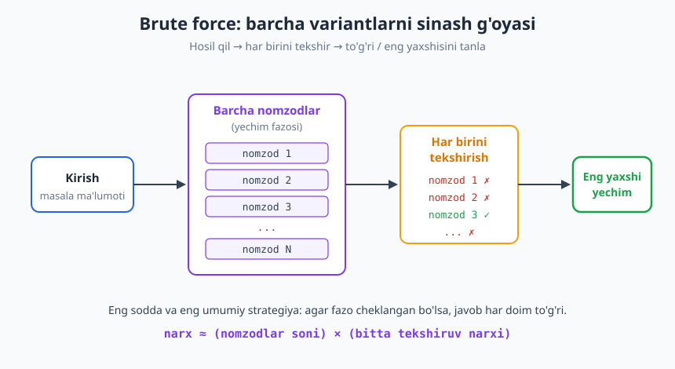
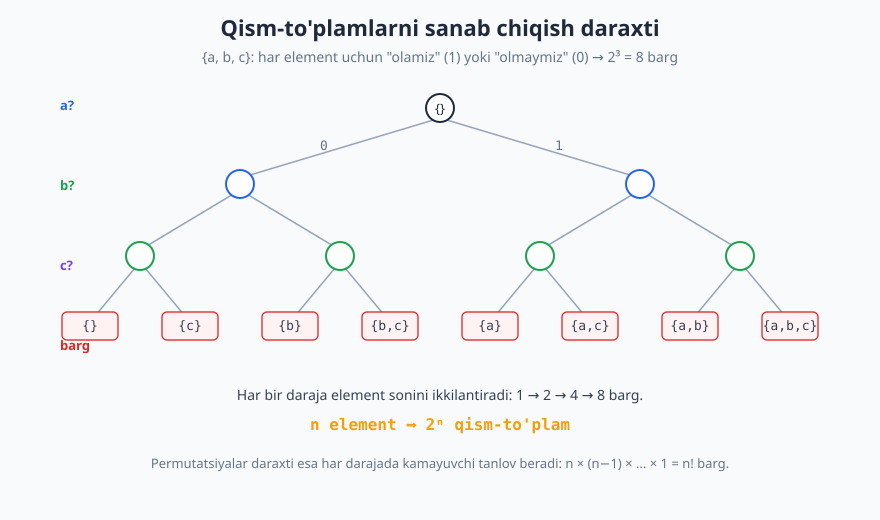
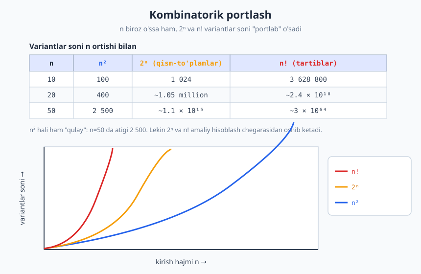

# 22 — Brute force va to'liq qidiruv

[⬅️ Oldingi: 21 — Graflar: tasvirlash va Union-Find](./21-graflar-union-find.md) · [🏠 README](./README.md) · [Keyingi: 23 — Divide and Conquer (bo'lib hal qil) ➡️](./23-divide-and-conquer.md)

---

> **Bu bobda:** Bu bob — kitobning **IV qismi** (algoritm paradigmalari)ning kirishi. Avval umumiy dizayn strategiyalari (brute force, divide & conquer, greedy, dinamik dasturlash, backtracking) bilan tanishamiz, so'ng eng sodda va eng umumiy paradigma — **brute force** (to'liq sanab chiqish)ni chuqur o'rganamiz: barcha mumkin yechimlarni hosil qilib, har birini tekshirib, to'g'risini yoki eng yaxshisini tanlash. Klassik misollar (chiziqli qidiruv, two-sum, eng yaqin juftlik, qism-to'plamlar va permutatsiyalar), **kombinatorik portlash** hodisasi va brute force qachon yetarli, qachon yetarli emasligini ko'rib chiqamiz.
>
> **Halollik / Eslatma:** Bu yerdagi murakkablik chegaralari (chiziqli qidiruv O(n), two-sum brute O(n²), eng yaqin juftlik O(n²), qism-to'plamlar 2ⁿ, permutatsiyalar n!) matematik aniq. Brute force "yomon algoritm" emas — u to'g'ri vositada to'g'ri javob. Barcha Python namunalari haqiqatan ishga tushirib tekshirilgan; ko'rsatilgan chiqishlar kod bergan haqiqiy natijalar.

---

## IV qismga kirish: algoritm paradigmalari

Shu paytgacha biz ma'lumotlar strukturalarini (massiv, ro'yxat, daraxt, graf) va tahlil vositalarini (Big-O, rekurrent munosabatlar, amortizatsiya) o'rgandik. Endi savol o'zgaradi: **berilgan masalani yechish uchun algoritmni qanday _o'ylab topamiz_?**

Tajriba shuni ko'rsatadiki, juda ko'p turli masalalar bir nechta **umumiy dizayn strategiyasi** (paradigma) ostida yechiladi. Paradigma — bu retsept emas, balki **fikrlash qolipi**: "bu masalaga qaysi qolip mos keladi?" deb so'rab, yechimga yo'l ochiladi.

IV qismda beshta asosiy paradigmani ko'rib chiqamiz:

| Paradigma | G'oya (bir jumlada) | Bob |
|---|---|---|
| **Brute force** | Barcha variantni hosil qil va tekshir | **shu bob** |
| **Divide & Conquer** | Masalani kichik bo'laklarga bo'l, hal qil, birlashtir | [23-bob](./23-divide-and-conquer.md) |
| **Greedy** | Har qadamda hozir eng yaxshi ko'rinadigan tanlovni qil | [24-bob](./24-greedy.md) |
| **Dinamik dasturlash** | Qism-masalalar javobini eslab qol, qayta hisoblama | [25-bob](./25-dinamik-dasturlash.md) |
| **Backtracking** | Variantlarni daraxt bo'ylab sina, umidsiz shoxlarni kes | [26-bob](./26-backtracking.md) |

Bu paradigmalar bir-biriga zid emas — ko'pincha **brute force**dan boshlanadi va asta-sekin aqlliroq strategiyaga aylantiriladi. Aynan shuning uchun biz brute force'dan boshlaymiz: u barcha qolganlarining **etaloni** (boshlang'ich nuqtasi).

## Brute force nima

> **Intuitsiya:** Kalitlar bog'lami bor, eshikni ochish kerak. Qaysi kalit ekanini bilmaysiz. Eng sodda usul — **har bir kalitni navbat bilan sinab ko'rish**, ishlaganini topguncha. Bu — brute force.

**Brute force** (yoki **to'liq sanab chiqish**, ingliz tilida *exhaustive search*) — masalaning **barcha mumkin yechimlarini** (yoki barcha nomzodlarni) sistematik ravishda hosil qilib, har birini tekshirib chiqadigan strategiya. To'g'ri yechim qidirilsa — birinchi mos kelganini qaytaramiz; eng yaxshi yechim qidirilsa — hammasini ko'rib, eng yaxshisini eslab qolamiz.



Yuqoridagi diagrammada brute force'ning umumiy "shakli" ko'rsatilgan: kirishdan **yechim fazosi** (barcha nomzodlar) hosil qilinadi, har bir nomzod **tekshiruvdan** o'tkaziladi, mos kelganlari orasidan **natija** tanlanadi. Umumiy narx oddiy ko'paytma:

```text
narx ≈ (nomzodlar soni) × (bitta nomzodni tekshirish narxi)
```

Psevdokod ko'rinishida brute force shabloni quyidagicha:

```text
brute_force(masala):
    eng_yaxshi = yo'q
    har bir nomzod ∈ barcha_nomzodlar(masala):     # hosil qilish
        agar yaroqli(nomzod) va nomzod > eng_yaxshi:  # tekshirish
            eng_yaxshi = nomzod
    qaytar eng_yaxshi
```

E'tibor bering: bu yerda hech qanday "aqllilik" yo'q. Biz strukturadan, matematik xossadan yoki nayrangdan foydalanmaymiz — shunchaki **hammasini ko'rib chiqamiz**. Aynan shuning uchun u har doim eng tushunarli yechim.

## Nega brute force muhim

Brute force ko'pincha "sodda, demak ahamiyatsiz" deb qabul qilinadi. Bu xato. U to'rt sababga ko'ra g'oyatda muhim:

1. **Har doim to'g'ri javob beradi** (agar yechim fazosi cheklangan bo'lsa). Biz *barcha* nomzodni ko'rib chiqamiz — demak to'g'ri javob ular orasida bo'lsa, biz uni topamiz. Bu — eng kuchli to'g'rilik kafolati.
2. **Etalon (baseline) yechim.** Optimallashtirishdan oldin avval *ishlaydigan* yechim kerak. Brute force'ni yozish odatda eng oson, va u keyinroq tezroq algoritm to'g'ri ishlayotganini tekshirish uchun **reference** bo'lib xizmat qiladi (kichik kirishlarda ikkalasi bir xil javob berishi kerak).
3. **Kichik kirishda mukammal.** Agar `n` kichik bo'lsa (masalan `n ≤ 20`), brute force tez ishlaydi va boshqa hech narsa kerak emas. Murakkab algoritm yozish — vaqt isrofi.
4. **Ba'zan eng yaxshi ma'lum yechim.** Ayrim masalalar uchun (NP-qiyin masalalar — [32-bob](./32-p-np-murakkablik-nazariyasi.md)) ma'lum bo'lgan eng yaxshi aniq algoritm baribir eksponensial. Bunday holatda brute force (yoki uning aqlliroq varianti — backtracking) amalda ishlatiladigan yechim bo'lib qoladi.

> **Eslatma:** "Premature optimization is the root of all evil" (erta optimallashtirish — barcha yomonlikning ildizi) degan mashhur ogohlantirish aynan shu haqida. Avval **ishlaydigan** brute force yoz, ishonch hosil qil, keyin *agar haqiqatan kerak bo'lsa* tezlashtir.

## Klassik misollar

Endi brute force'ni beshta klassik masalada ko'ramiz. Har birining murakkabligini aniq aytamiz.

### 1-misol. Chiziqli qidiruv — O(n)

Eng sodda brute force: massivda elementni topish uchun **boshidan oxirigacha** har bir elementni nishon bilan solishtiramiz.

```python
def chiziqli_qidiruv(massiv, nishon):
    for i, x in enumerate(massiv):
        if x == nishon:
            return i          # topildi: indeksni qaytar
    return -1                 # topilmadi

print(chiziqli_qidiruv([4, 2, 7, 1, 9], 7))   # -> 2
print(chiziqli_qidiruv([4, 2, 7, 1, 9], 5))   # -> -1
```

Bu yerda "yechim fazosi" — massivning `n` ta pozitsiyasi; har birini tekshirish O(1). Demak jami **O(n)**. Eng yomon holatda (element yo'q yoki oxirida) hamma `n` ta elementni ko'ramiz.

> **Eslatma:** Agar massiv **saralangan** bo'lsa, biz brute force o'rniga binar qidiruvni ([28-bob](./28-qidiruv-algoritmlari.md)) ishlatib O(log n) ga tushira olamiz. Bu — "strukturadan foydalanish" optimallashtirishning birinchi misoli: saralanganlik xossasi yarmini tashlab yuborishga imkon beradi.

### 2-misol. Two-sum (ikki sonli yig'indi) — O(n²)

Masala: massivda yig'indisi `target` ga teng bo'lgan ikkita elementni toping. Brute force: **barcha juftliklarni** sinab ko'ramiz.

```python
def two_sum_brute(nums, target):
    n = len(nums)
    for i in range(n):
        for j in range(i + 1, n):       # har juftlik bir marta
            if nums[i] + nums[j] == target:
                return (i, j)
    return None

print(two_sum_brute([2, 7, 11, 15], 9))   # -> (0, 1)
print(two_sum_brute([3, 2, 4], 6))         # -> (1, 2)
```

Juftliklar soni `C(n, 2) = n(n−1)/2 = O(n²)`, har birini tekshirish O(1). Demak **O(n²)**.

Buni **hash jadval** ([15-bob](./15-hash-jadval.md)) bilan O(n) ga tushirish mumkin: har bir `x` uchun `target − x` ni daftarchada qidiramiz.

```python
def two_sum_hash(nums, target):
    korilgan = {}                          # qiymat -> indeks
    for i, x in enumerate(nums):
        if target - x in korilgan:         # juftini O(1) da topdik
            return (korilgan[target - x], i)
        korilgan[x] = i
    return None

print(two_sum_hash([2, 7, 11, 15], 9))    # -> (0, 1)
print(two_sum_hash([3, 2, 4], 6))          # -> (1, 2)
```

Mana bu — brute force'dan aqlliroq paradigmaga o'tishning ajoyib namunasi: **ichki sikl** (juftni qidirish) hash jadval orqali O(1) ga aylanadi, shu sababli jami O(n²) → O(n) ga tushadi. Lekin e'tibor bering: brute force versiyasi avval bizga *to'g'ri javob nima* ekanini ko'rsatdi, va u hash versiyasini tekshirish uchun etalon bo'lib xizmat qildi.

### 3-misol. Eng yaqin ikki nuqta — O(n²)

`n` ta nuqta berilgan; bir-biriga eng yaqin ikkitasini toping. Brute force: **har bir juftlik** orasidagi masofani hisoblab, eng kichigini eslaymiz.

```python
import math

def eng_yaqin_juftlik(nuqtalar):
    n = len(nuqtalar)
    eng_kichik = math.inf
    juftlik = None
    for i in range(n):
        for j in range(i + 1, n):
            (x1, y1), (x2, y2) = nuqtalar[i], nuqtalar[j]
            masofa = math.hypot(x1 - x2, y1 - y2)
            if masofa < eng_kichik:
                eng_kichik = masofa
                juftlik = (i, j)
    return juftlik, round(eng_kichik, 3)

nuqtalar = [(0, 0), (3, 4), (1, 1), (5, 5)]
print(eng_yaqin_juftlik(nuqtalar))   # -> ((0, 2), 1.414)
```

Yana `C(n, 2) = O(n²)` ta juftlik. Qiziq tomoni: bu masalani **divide & conquer** ([23-bob](./23-divide-and-conquer.md)) bilan **O(n log n)** ga tushirish mumkin — bu paradigmalarning kuchini ko'rsatadigan mashhur natija. Lekin brute force versiyasi atigi besh qatorda yoziladi va kichik `n` uchun mukammal.

### 4-misol. Barcha qism-to'plamlar (2ⁿ) va permutatsiyalar (n!)

Ko'p brute force masalalarda biz **barcha qism-to'plamlarni** yoki **barcha tartiblarni** hosil qilib, har birini baholaymiz. Bu — kombinatorik qidiruvning yuragi.

`n` elementli to'plamning **qism-to'plamlari** soni — `2ⁿ`. Sababi: har bir element uchun mustaqil "olamiz yoki olmaymiz" degan ikki tanlov bor.

```python
def barcha_qism_toplamlar(elementlar):
    natija = [[]]                          # bo'sh to'plamdan boshlaymiz
    for x in elementlar:
        natija += [oldingi + [x] for oldingi in natija]
    return natija

qts = barcha_qism_toplamlar([1, 2, 3])
print(len(qts))   # -> 8
print(qts)        # -> [[], [1], [2], [1, 2], [3], [1, 3], [2, 3], [1, 2, 3]]
```

Bu g'oya daraxt sifatida juda yaxshi ko'rinadi: har bir element bo'yicha shox ikkiga bo'linadi.



Diagrammada {a, b, c} to'plami uchun **sanab chiqish daraxti** ko'rsatilgan: har bir daraja bir elementga "olamiz (1) / olmaymiz (0)" tanlovini qo'shadi, daraxt har darajada barglar sonini ikkilantiradi → `2³ = 8` ta barg, har biri bitta qism-to'plam.

**Permutatsiyalar** (tartiblar) soni esa — `n!`. Bu yerda har darajada tanlov soni bittaga kamayadi: birinchi pozitsiyaga `n` ta variant, keyingisiga `n−1`, va hokazo.

```python
from itertools import permutations

perms = list(permutations([1, 2, 3]))
print(len(perms))      # -> 6
print(perms[0])        # -> (1, 2, 3)
print(perms[-1])       # -> (3, 2, 1)
```

> **Eslatma:** Ko'p mashhur masalalar shu ikki shaklga keladi. Masalan, **knapsack** (sumka) — qaysi buyumlarni olish (qism-to'plam, 2ⁿ); **kommivoyajyor** (TSP) — shaharlarni qaysi tartibda aylanib chiqish (permutatsiya, n!). Brute force ularni to'g'ri yechadi, lekin faqat kichik `n` da.

### 5-misol. Parol / kombinatsiya sinash (g'oya)

Brute force'ning eng tanish nomi — "parolni brute force qilish". G'oya: ruxsat etilgan alifboning **barcha mumkin ketma-ketliklarini** hosil qilib, har birini sinab ko'rish.

```python
from itertools import product

def kodni_top(haqiqiy_kod, alifbo="0123456789", uzunlik=3):
    sinaldi = 0
    for harflar in product(alifbo, repeat=uzunlik):  # 000, 001, ..., 999
        nomzod = "".join(harflar)
        sinaldi += 1
        if nomzod == haqiqiy_kod:
            return nomzod, sinaldi
    return None, sinaldi

print(kodni_top("019"))   # -> ('019', 20)
```

3 raqamli kod uchun fazoning hajmi `10³ = 1000`; "019" 20-chi bo'lib sinaladi. Lekin uzunlik oshsa, fazo `alifbo ^ uzunlik` bo'lib eksponensial o'sadi: 8 belgili harf-raqamli parol uchun `62⁸ ≈ 2.18 × 10¹⁴` variant. Mana shu yerda biz eng muhim cheklovga — **kombinatorik portlash**ga duch kelamiz.

## Kombinatorik portlash

> **Intuitsiya:** Shaxmat taxtasining birinchi katagiga 1 dona bug'doy, keyingisiga 2, keyingisiga 4 ... deb ikkilantirib qo'ysangiz, 64-katakka dunyodagi bug'doydan ko'p don kerak bo'ladi. Eksponensial o'sish — inson sezgisini aldaydi: "biroz kattaroq" kirish "vaqt qadar ko'p" ish degani bo'lib chiqadi.

**Kombinatorik portlash** (combinatorial explosion) — yechim fazosining hajmi kirish `n` bilan **eksponensial** yoki **faktorial** o'sishi. Brute force *barcha* nomzodni ko'rgani uchun, uning narxi to'g'ridan-to'g'ri fazo hajmiga teng. Quyidagi jadval `n` ozgina o'sganda nima bo'lishini ko'rsatadi:

| n | n² | 2ⁿ (qism-to'plamlar) | n! (tartiblar) |
|---|---|---|---|
| 10 | 100 | 1 024 | 3 628 800 |
| 20 | 400 | ~1.05 million | ~2.4 × 10¹⁸ |
| 50 | 2 500 | ~1.13 × 10¹⁵ | ~3 × 10⁶⁴ |

E'tibor bering: `n²` **n=50** da ham atigi 2 500 — bemalol hisoblanadi. Lekin `2ⁿ` 50 da kvadrillionga, `n!` esa tasavvurdan tashqari songa yetadi.



Buni Python bilan to'g'ridan-to'g'ri ko'rsatamiz:

```python
import math

for n in [10, 20, 50]:
    print(f"n={n}: n^2={n**2}, 2^n={2**n}, n!={math.factorial(n)}")

# Chiqish:
# n=10: n^2=100, 2^n=1024, n!=3628800
# n=20: n^2=400, 2^n=1048576, n!=2432902008176640000
# n=50: n^2=2500, 2^n=1125899906842624, n!=30414093201713378043612608166064768844377641568960512000000000000
```

**Amaliy chegara.** Zamonaviy kompyuter taxminan `10⁸` (yuz million) sodda amalni bir soniyada bajaradi. Demak:

- `2ⁿ`: `n ≈ 26` da sekundlar; `n ≈ 40` da soatlar; `n ≈ 50` da haftalar — chegara taxminan **n ≤ 25–30**.
- `n!`: `n = 12` da ~0.5 milliard (sekundlar); `n = 15` da soatlar; `n = 20` da kosmik — chegara taxminan **n ≤ 11–12**.

Mana shu sabab brute force katta kirishda ishlamaydi: fazoning o'zi shunchalik kattaki, hatto har bir nomzodga bir nanosoniya sarflasak ham, koinotning yoshi yetmaydi. Brute force "sekin kod" emas — u **bajarib bo'lmaydigan hajmda ish** qiladi.

> **Diqqat:** Kompyuterni 1000 marta tezlatish eksponensial muammoni yechmaydi. `2ⁿ` da 1000x tezlik — bu atigi `n` ni `+10` ga oshiradi (chunki `2¹⁰ ≈ 1000`). Eksponensial o'sishni faqat **boshqa algoritm** (boshqa paradigma) yengadi, ko'proq apparat emas.

## Brute force'dan tezroqqa: optimallashtirish yo'llari

Agar brute force juda sekin bo'lsa, uni qanday tezlashtiramiz? Keyingi boblar shu haqida, lekin asosiy yo'nalishlarni hozir sanab o'tamiz:

1. **Erta to'xtash (early exit).** Javob topilishi bilan to'xtash. Two-sum'da birinchi mos juftlikni topib qaytdik — qolganini ko'rmadik. Bu eng yomon holatni o'zgartirmaydi, lekin amalda ko'p vaqt tejaydi.
2. **Kesib tashlash (pruning).** Yechim fazosini daraxt sifatida ko'rib, **umidsiz shoxlarni** ulardan oldin kesish. Bu — **backtracking** ([26-bob](./26-backtracking.md))ning yuragi: nomzodni to'liq qurmasdan turib, "bu yo'ldan yaxshi yechim chiqmaydi" deb butun pastki daraxtni tashlab yuborish.
3. **Strukturadan foydalanish.** Saralash (binar qidiruv imkonini beradi), hash jadval (O(1) qidiruv), oldindan hisoblangan jadval. Two-sum'da hash bizni O(n²) → O(n) ga olib chiqdi.
4. **Aqlliroq paradigma.** Masalada **takrorlanuvchi qism-masalalar** bo'lsa — dinamik dasturlash ([25-bob](./25-dinamik-dasturlash.md)); **bo'lib hal qilish** mumkin bo'lsa — divide & conquer ([23-bob](./23-divide-and-conquer.md)); **ochko'z tanlov** to'g'ri bo'lsa — greedy ([24-bob](./24-greedy.md)).

Quyidagi jadval shu bobdagi misollarning brute force va yaxshilangan murakkabliklarini umumlashtiradi:

| Masala | Brute force | Yaxshilangan | Vosita |
|---|---|---|---|
| Saralangan massivda qidiruv | O(n) | O(log n) | binar qidiruv (struktura) |
| Two-sum | O(n²) | O(n) | hash jadval |
| Eng yaqin juftlik | O(n²) | O(n log n) | divide & conquer |
| Qism-to'plam masalalari | O(2ⁿ) | gohida O(n·W) | dinamik dasturlash / pruning |

## Halollik: brute force "yomon" emas

Brute force haqida ikki keng tarqalgan noto'g'ri tushuncha bor, ularni to'g'rilaymiz.

> **Anti-pattern:** "Brute force — havaskorlar uchun, professional har doim aqlli algoritm yozadi." Bu xato. Professional **avval** brute force yozadi (chunki u tez yoziladi va to'g'riligi aniq), keyin **profillab** (o'lchab) ko'radi: agar tez bo'lsa — ish tamom. Murakkab algoritmni faqat haqiqatan kerak bo'lganda yozadi, chunki har bir qo'shimcha murakkablik — yangi xato manbai.

> **Trade-off:** Brute force **soddalik va to'g'rilik kafolati**ni beradi, evaziga **tezlik**ni oladi. Aqlli algoritm tezlikni beradi, evaziga **murakkablik va xato xavfi**ni oladi. To'g'ri tanlov `n` ning kattaligiga bog'liq: kichik `n` — brute force; katta `n` — aqlliroq paradigma.

Eng to'g'ri yondashuv — bosqichma-bosqich:

```text
1. Brute force yoz  ->  ishlaydi, to'g'ri (etalon)
2. n kichik bo'lsa  ->  TO'XTA. Yetarli.
3. n katta bo'lsa   ->  profillab, optimallashtir
4. Tezlatilgan kodni brute force bilan (kichik n da) solishtir -> teng bo'lsa, to'g'ri
```

Bu jarayonda brute force ikki marta yutuq beradi: birinchi ishlaydigan yechim sifatida, va keyin tezroq kodning to'g'riligini tasdiqlovchi **reference** sifatida. Aynan shuning uchun u — barcha paradigmalarning poydevori, va shu sababli IV qism aynan u bilan boshlanadi.

## Asosiy g'oyalar (bobni qisqacha)

- **Algoritm paradigmasi** — masala yechishning umumiy fikrlash qolipi. Beshta asosiysi: brute force, divide & conquer, greedy, dinamik dasturlash, backtracking.
- **Brute force** (to'liq sanab chiqish) — barcha mumkin nomzodlarni hosil qilib, har birini tekshirib, to'g'ri yoki eng yaxshi yechimni tanlash. Eng sodda va eng umumiy strategiya.
- Narx ≈ **(nomzodlar soni) × (bitta tekshiruv narxi)**.
- Brute force muhim, chunki: har doim to'g'ri javob beradi (cheklangan fazoda); etalon (baseline) yechim; kichik kirishda mukammal; ba'zan eng yaxshi ma'lum yechim.
- Klassik murakkabliklar: chiziqli qidiruv **O(n)**; two-sum brute **O(n²)**; eng yaqin juftlik **O(n²)**; qism-to'plamlar **2ⁿ**; permutatsiyalar **n!**.
- **Kombinatorik portlash:** `2ⁿ` va `n!` shunchalik tez o'sadiki, brute force taxminan `n > 25–30` (2ⁿ) yoki `n > 12` (n!) da amaliy emas. Ko'proq apparat eksponensial muammoni yechmaydi.
- Optimallashtirish: erta to'xtash, pruning (backtracking), strukturadan foydalanish (saralash, hash), aqlliroq paradigma.
- **Halollik:** brute force "yomon" emas. Avval ishlaydigan brute force, keyin *kerak bo'lsa* tezlatish — bu "premature optimization"dan saqlaydi.

## Mashqlar

### Oson

**1-mashq.** Massivdagi **eng katta elementni** topadigan brute force funksiyani yozing (so'zda yoki kodda) va uning vaqt murakkabligini Big-O da ayting. Nega bundan tezroq qilish mumkin emas (saralanmagan massivda)?

**2-mashq.** "Brute force" so'zini o'z so'zlaringiz bilan ta'riflang. Nega u **har doim to'g'ri** javob beradi (yechim fazosi cheklangan bo'lsa)? Bir jumlada ayting.

**3-mashq.** 4 elementli to'plamning nechta qism-to'plami bor? 5 ta shaharni nechta xil tartibda aylanib chiqish mumkin? Formulalarni ishlatib hisoblang.

### O'rta

**4-mashq.** Massivdagi **barcha juftliklarni** ro'yxat qilib qaytaradigan funksiya yozing (har juftlik bir marta, tartibsiz). `[10, 20, 30, 40]` uchun natija nechta juftlikdan iborat? Funksiyaning murakkabligini ayting.

**5-mashq.** Two-sum'ni ikki usulda — brute force O(n²) va hash jadval O(n) bilan — yeching. Har biri uchun: (a) ichki ish nima qiladi, (b) nima uchun murakkablik shunday, (c) qaysi resurs evaziga tezlik olinadi (hash versiyada)?

**6-mashq.** `[1, 2, 3]` to'plamining barcha qism-to'plamlarini generatsiya qiluvchi funksiyani **rekursiv** usulda yozing (har element uchun "olamiz / olmaymiz"). Natijada nechta qism-to'plam bo'lishi kerak?

### Qiyin

**7-mashq.** Quyidagi funksiyaning vaqt murakkabligini **aniq** hisoblang (Big-O):

```text
maksimal_qism_yigindi_brute(arr):
    eng_yaxshi = arr[0]
    har i ∈ 0..n-1:
        har j ∈ i..n-1:
            joriy = sum(arr[i..j])     # bu ichki amal nechta qadam?
            eng_yaxshi = max(eng_yaxshi, joriy)
    qaytar eng_yaxshi
```

Diqqat: `sum(arr[i..j])` o'zi bir sikl. Qancha bo'ladi va nega?

**8-mashq.** Bir masalada `2ⁿ` brute force kerak. Kompyuter sekundiga `10⁸` amal bajaradi. (a) `n = 40` uchun taxminan qancha vaqt ketadi? (b) Kompyuteringizni 1000 baravar tezlatsangiz, qaysi `n` gacha yecha olasiz (ya'ni 1000x tezlik `n` ni qanchaga oshiradi)? (c) Xulosa: ko'proq apparat eksponensial muammoni yechadimi?

**9-mashq.** Sizga masala berildi va `n` ning kattaligi noma'lum. **Qaror daraxti** (yoki qadamlar ro'yxati) tuzing: qachon brute force yetarli, qachon optimallashtirish kerak, va optimallashtirilgan kodning to'g'riligini qanday tekshirasiz? Brute force'ning ikki rolini (birinchi yechim + reference) eslang.

<details markdown="1">
<summary>Yechimlar</summary>

### 1-mashq yechimi

Brute force: birinchi elementni "eng katta" deb olamiz, keyin qolganlarini ketma-ket ko'rib, kattaroqini uchratsak — yangilaymiz.

```text
eng_katta = arr[0]
har x ∈ arr[1:]:
    agar x > eng_katta: eng_katta = x
qaytar eng_katta
```

Murakkablik **O(n)** — har bir elementni bir marta ko'ramiz. Bundan tezroq qilish **mumkin emas**: saralanmagan massivda eng kattani topish uchun *har* elementni hech bo'lmasa bir marta ko'rish **shart** — agar birortasini o'tkazib yuborsak, aynan o'sha eng katta bo'lib chiqishi mumkin. Demak O(n) — bu masala uchun optimal (pastki chegara ham O(n)).

### 2-mashq yechimi

**Brute force** — masalaning barcha mumkin nomzodlarini sistematik hosil qilib, har birini tekshirib, mosini (yoki eng yaxshisini) tanlaydigan strategiya. U har doim to'g'ri javob beradi, chunki biz **barcha** nomzodni ko'rib chiqamiz — to'g'ri javob fazoda mavjud bo'lsa, biz uni albatta uchratamiz (hech narsa o'tkazib yuborilmaydi).

### 3-mashq yechimi

- 4 elementli to'plamning qism-to'plamlari: `2⁴ = 16` ta (bo'sh to'plam va to'liq to'plam ham kiradi).
- 5 ta shaharni aylanib chiqish tartiblari: `5! = 5 × 4 × 3 × 2 × 1 = 120` ta.

(Eslatma: agar TSP'da boshlang'ich shahar qat'iy bo'lsa, aylanma yo'llar soni `(5−1)! = 24`, lekin sof permutatsiyalar soni 120.)

### 4-mashq yechimi

```python
def barcha_juftliklar(arr):
    juftliklar = []
    n = len(arr)
    for i in range(n):
        for j in range(i + 1, n):       # j > i: har juftlik bir marta
            juftliklar.append((arr[i], arr[j]))
    return juftliklar

print(barcha_juftliklar([10, 20, 30, 40]))
# -> [(10, 20), (10, 30), (10, 40), (20, 30), (20, 40), (30, 40)]
print(len(barcha_juftliklar([10, 20, 30, 40])))   # -> 6
```

Juftliklar soni `C(4, 2) = 4·3/2 = 6`. Umuman `C(n, 2) = n(n−1)/2 = O(n²)`. Funksiya har juftlikni bir marta hosil qiladi, demak **O(n²)**.

### 5-mashq yechimi

**Brute force O(n²):**

```python
def two_sum_brute(nums, target):
    n = len(nums)
    for i in range(n):
        for j in range(i + 1, n):
            if nums[i] + nums[j] == target:
                return (i, j)
    return None
```

(a) Ichki ish: har bir `(i, j)` juftligi uchun yig'indini hisoblab, `target` bilan solishtiradi. (b) Juftliklar soni `C(n, 2) = O(n²)`, har biri O(1) → **O(n²)**. (c) Qo'shimcha resurs yo'q (O(1) xotira), lekin sekin.

**Hash O(n):**

```python
def two_sum_hash(nums, target):
    korilgan = {}
    for i, x in enumerate(nums):
        if target - x in korilgan:
            return (korilgan[target - x], i)
        korilgan[x] = i
    return None
```

(a) Ichki ish: har bir `x` uchun "juftim" `target − x` daftarchada (hash jadvalda) bormi deb O(1) da qaraydi. (b) Massivni bir marta aylanamiz, har qadamda O(1) hash amali → **O(n)**. (c) Tezlik **O(n) qo'shimcha xotira** evaziga olinadi (hash jadval) — klassik **vaqt-xotira trade-off**i.

### 6-mashq yechimi

```python
def qism_toplamlar_rek(elementlar):
    if not elementlar:                  # bazaviy holat: bo'sh to'plam
        return [[]]
    bosh, qoldiq = elementlar[0], elementlar[1:]
    kichik = qism_toplamlar_rek(qoldiq)              # qoldiqning qism-to'plamlari
    # har biriga "bosh"ni qo'shgan / qo'shmagan variant:
    return kichik + [[bosh] + s for s in kichik]

print(qism_toplamlar_rek([1, 2, 3]))
# -> [[], [3], [2], [2, 3], [1], [1, 3], [1, 2], [1, 2, 3]]
print(len(qism_toplamlar_rek([1, 2, 3])))   # -> 8
```

Natijada `2³ = 8` ta qism-to'plam. Rekursiya har elementda fazoni ikkiga bo'ladi ("olamiz / olmaymiz") — bu aynan diagrammadagi sanab chiqish daraxti.

### 7-mashq yechimi

Uchta ichki-ichiga sikl bor:

- Tashqi `i`: `n` marta.
- O'rta `j`: har `i` uchun `n − i` marta, o'rtacha `~n/2`.
- **Eng ichki `sum(arr[i..j])`:** bu *yashirin* sikl — `j − i + 1` ta elementni qo'shadi, bu `O(n)` qadargacha.

Demak jami: barcha `(i, j)` juftliklar uchun `O(n²)` ta, va har biri uchun ichki yig'indi `O(n)`. Jami **O(n³)**.

Aniqrog'i: `Σ_i Σ_j (j − i + 1) = Θ(n³)`. Bu — klassik "max subarray sum" masalasining sodda brute force'i. (Uni ichki yig'indini takrorlamasdan O(n²) ga, Kadane algoritmi bilan esa **O(n)** ga tushirish mumkin — yana brute force etalon, optimallashtirish keyin.) Tekshiruv:

```python
def maksimal_qism_yigindi_brute(arr):
    n = len(arr)
    eng_yaxshi = arr[0]
    for i in range(n):
        for j in range(i, n):
            joriy = sum(arr[i:j+1])
            if joriy > eng_yaxshi:
                eng_yaxshi = joriy
    return eng_yaxshi

print(maksimal_qism_yigindi_brute([-2, 1, -3, 4, -1, 2, 1, -5, 4]))   # -> 6
```

### 8-mashq yechimi

(a) `n = 40`: `2⁴⁰ = 1 099 511 627 776 ≈ 1.1 × 10¹²` amal. `10⁸` amal/sek tezlikda: `~1.1 × 10¹² / 10⁸ = ~11 000` sekund ≈ **~3 soat**.

(b) 1000 baravar tezlik — bu `2¹⁰ ≈ 1000`, demak biz qo'shimcha **`+10`** ta `n` ni qoplay olamiz (`2^(n+10) = 1024 · 2ⁿ ≈ 1000 · 2ⁿ`). Ya'ni `n = 40` o'rniga `n = 50` gacha (o'sha vaqtda). Atigi 10 ga ko'paydi!

(c) **Yo'q.** Ko'proq apparat eksponensial muammoni yechmaydi: tezlikni 1000x oshirsangiz ham `n` chegarasi faqat o'nlab birlik siljiydi. Eksponensial o'sishni faqat **boshqa algoritm/paradigma** (pruning, dinamik dasturlash, ...) yengadi.

### 9-mashq yechimi

Qaror qadamlari:

```text
1. BRUTE FORCE YOZ.
   - Tez yoziladi, to'g'riligi aniq. Bu birinchi ishlaydigan yechim VA reference.

2. n NING KATTALIGINI BAHOLA.
   - n kichik (mas. brute O(2^n) da n <= 25, O(n!) da n <= 11,
     O(n^2) da n <= ~10000) -> TO'XTA, brute force yetarli.
   - n katta -> 3-qadamga o't.

3. OPTIMALLASHTIR (kerak bo'lsa).
   - Strukturadan foydalan (hash, saralash), pruning (backtracking),
     yoki aqlliroq paradigma (DP, divide&conquer, greedy).

4. TO'G'RILIKNI TEKSHIR.
   - Tezlatilgan kodni KICHIK n larda brute force bilan solishtir.
   - Ko'p tasodifiy kirishda ikkalasi bir xil javob bersa -> ishonch.
```

Brute force'ning **ikki roli**: (1) **birinchi yechim** — to'g'riligi kafolatlangan ishlaydigan kod; (2) **reference (etalon)** — keyinroq yozilgan tezroq kodning to'g'riligini kichik kirishlarda tasdiqlash uchun "haqiqat manbai". Aynan shuning uchun, hatto oxir-oqibat tashlab yuboriladigan bo'lsa ham, brute force yozishga arziydi.

</details>

---

[⬅️ Oldingi: 21 — Graflar: tasvirlash va Union-Find](./21-graflar-union-find.md) · [🏠 README](./README.md) · [Keyingi: 23 — Divide and Conquer (bo'lib hal qil) ➡️](./23-divide-and-conquer.md)
