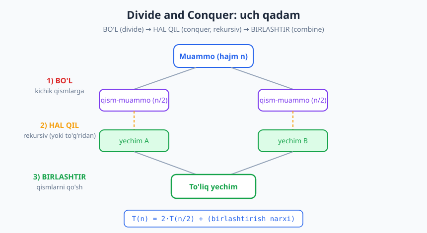
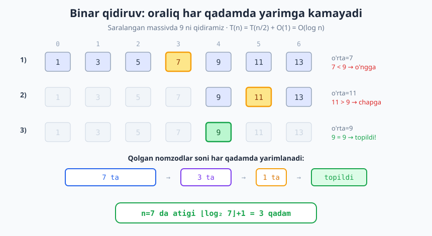
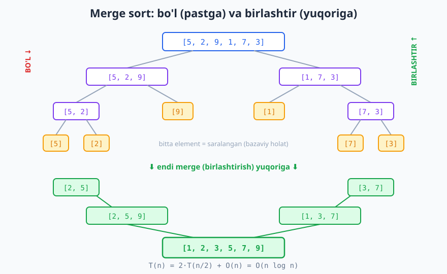

# 23 — Divide and Conquer (bo'lib hal qil)

[⬅️ Oldingi: 22 — Brute force va to'liq qidiruv](./22-brute-force.md) · [🏠 README](./README.md) · [Keyingi: 24 — Greedy (ochko'z) algoritmlar ➡️](./24-greedy.md)

---

> **Bu bobda:** Ikkinchi katta paradigma — **divide and conquer** (bo'lib hal qil)ni o'rganamiz: muammoni bir nechta kichikroq, xuddi shu turdagi qism-muammolarga **bo'lamiz**, ularni (odatda rekursiv) **hal qilamiz**, so'ng yechimlarni **birlashtirib** to'liq javob quramiz. Klassik misollar — binar qidiruv, merge sort, tez daraja, Karatsuba ko'paytirish va maksimal qism-massiv — orqali bu uch qadamning kuchini va nega u ko'pincha brute force'dan tezroq ekanini ko'ramiz.
>
> **Halollik / Eslatma:** Bu yerdagi murakkablik chegaralari (binar qidiruv O(log n), merge sort O(n log n), tez daraja O(log n), Karatsuba O(n^1.585)) matematik aniq va Master teoremasidan keladi. Karatsuba va maksimal qism-massiv qismlari g'oyani ko'rsatadi — to'liq sanoat darajasidagi implementatsiya emas. Barcha Python namunalari haqiqatan ishga tushirib tekshirilgan; ko'rsatilgan chiqishlar kod bergan haqiqiy natijalar.

---

## Paradigmaning g'oyasi

> **Intuitsiya:** Katta xaritani o'rganishni tasavvur qiling. Butun mamlakatni bir qarashda yodlash qiyin. Lekin uni viloyatlarga, viloyatni tumanlarga bo'lsangiz — har bir kichik bo'lakni alohida tushunish oson, keyin ularni yopishtirib butun manzarani tiklaysiz. Mana shu — bo'lib hal qilish.

**Divide and conquer** (qisqacha **D&C**, o'zbekcha "bo'lib hal qil") — muammoni **bir nechta kichikroq**, **xuddi shu turdagi** qism-muammolarga bo'lib yechadigan paradigma. U doim uch qadamdan iborat:

1. **BO'L (Divide).** Muammoni kichikroq qism-muammolarga bo'lamiz. Eng ko'p uchraydigan holat — ikkiga (yarmiga) bo'lish.
2. **HAL QIL (Conquer).** Har bir qism-muammoni hal qilamiz. Ular yetarlicha kichik bo'lguncha — **rekursiv** ravishda xuddi shu usulni qo'llaymiz. Yetarlicha kichik (bazaviy holat) bo'lganda to'g'ridan-to'g'ri javob beramiz.
3. **BIRLASHTIR (Combine).** Qism-muammolar yechimlarini **birlashtirib**, asl muammoning to'liq yechimini quramiz.



Diagrammada ko'rinib turibdi: hajmi `n` bo'lgan muammo ikkita `n/2` hajmli qism-muammoga **bo'linadi**, har biri (rekursiv) **hal qilinadi**, so'ng ikki yechim **birlashtiriladi**. Aynan shu uch qadam butun paradigmaning qolipi.

> **Eslatma:** Muhim shart — qism-muammolar asl muammo bilan **bir xil shaklda** bo'lishi kerak. Aynan shuning uchun ularni xuddi shu funksiya bilan rekursiv yechish mumkin. Bu bilan D&C [rekursiya](./06-rekursiya-asoslari.md) bilan chambarchas bog'liq: D&C — bu "muammoni o'ziga o'xshash kichik nusxalarga bo'lish" g'oyasining algoritmik nomi.

### Murakkablik qayerdan keladi

D&C algoritmining narxi tabiiy ravishda **rekurrent munosabat** sifatida yoziladi. Agar muammoni `a` ta `n/b` hajmli qismga bo'lib, bo'lish va birlashtirishga `f(n)` ish sarflasak:

```text
T(n) = a · T(n/b) + f(n)
```

Bunday rekurrentlarni yechishning tayyor vositasi — **Master teorema** ([10-bob](./10-rekurrent-master-teorema.md)). Shu bob davomida har bir misol uchun rekurrentni yozamiz, keyin uning yechimini aytamiz — Master teorema esa nima uchun aynan shunday ekanini tushuntiradi.

## 1-misol. Binar qidiruv — O(log n)

Saralangan massivda elementni topishning eng tabiiy D&C usuli. Brute force (chiziqli qidiruv, [22-bob](./22-brute-force.md)) hamma elementni ko'rardi — O(n). D&C esa har qadamda **yarmini tashlab yuboradi**.

> **Intuitsiya:** Lug'atda "salom" so'zini qidirayapsiz. Birinchi betdan boshlamaysiz. O'rtasini ochasiz: agar "salom" o'sha betdagi so'zlardan keyin kelsa — birinchi yarmini butunlay tashlaysiz, faqat ikkinchi yarmida qidirishni davom ettirasiz. Bir tekshiruv bilan ishning **yarmi** yo'qoladi.

```python
def binar_qidiruv(massiv, nishon):
    chap, ong = 0, len(massiv) - 1
    while chap <= ong:
        orta = (chap + ong) // 2
        if massiv[orta] == nishon:
            return orta              # topildi
        elif massiv[orta] < nishon:
            chap = orta + 1          # chap yarmni tashla
        else:
            ong = orta - 1           # ong yarmni tashla
    return -1                        # topilmadi

print(binar_qidiruv([1, 3, 5, 7, 9, 11, 13], 9))   # -> 4
print(binar_qidiruv([1, 3, 5, 7, 9, 11, 13], 6))   # -> -1
```



**Trassirovka.** `[1, 3, 5, 7, 9, 11, 13]` massivida `9` ni qidiramiz (indekslar 0..6):

| Qadam | chap | ong | orta | massiv[orta] | Solishtirish | Keyingi qadam |
|---|---|---|---|---|---|---|
| 1 | 0 | 6 | 3 | 7 | 7 < 9 | chap = 4 |
| 2 | 4 | 6 | 5 | 11 | 11 > 9 | ong = 4 |
| 3 | 4 | 4 | 4 | 9 | 9 = 9 | **topildi (indeks 4)** |

Atigi **3** qadamda topdik, garchi massivda 7 ta element bo'lsa ham.

**Nega bu D&C.** Har qadamda muammoni (qidiruv oralig'ini) **bir** qism-muammoga — yarmiga — bo'lamiz va faqat o'shanisini hal qilamiz; ikkinchi yarmiga umuman tegmaymiz. Birlashtirish qadami **yo'q** (bitta qismdan javob to'g'ridan-to'g'ri keladi). Shu sababli bu D&C'ning maxsus, soddalashgan turi — uni ko'pincha **"kamaytir va hal qil"** (decrease and conquer) deb ataladi.

**Murakkablik.** Rekurrent:

```text
T(n) = T(n/2) + O(1)
```

Har qadam ishni yarimga kamaytiradi va ichida atigi O(1) (bitta solishtirish) ish bor. Nechta marta `n` ni 1 gacha yarimlash mumkin? — `log₂ n` marta. Demak **O(log n)**. `n = 1 000 000` element uchun atigi ~20 qadam.

> **Diqqat:** Binar qidiruv faqat **saralangan** massivda ishlaydi. "Yarmini tashlash" qarori massivning saralangan tartibiga tayanadi — agar tartib buzilgan bo'lsa, qaror noto'g'ri bo'ladi. Saralanmagan ma'lumotda avval saralash kerak (O(n log n)), yoki to'g'ridan-to'g'ri chiziqli qidiruv (O(n)).

## 2-misol. Merge sort — O(n log n)

Mana endi **uchala** qadam ham bor bo'lgan klassik D&C: merge sort (birlashtirib saralash). Bu — D&C'ning eng go'zal namunasi.

**Uch qadam:**

1. **BO'L:** massivni o'rtasidan ikkiga bo'lamiz (ikki yarim massiv).
2. **HAL QIL:** har bir yarimni rekursiv ravishda merge sort bilan saralaymiz. (Bitta elementli massiv allaqachon saralangan — bazaviy holat.)
3. **BIRLASHTIR:** ikkita **saralangan** yarimni bitta saralangan massivga **merge** qilamiz.

```python
def merge(chap, ong):
    """Ikkita saralangan ro'yxatni bitta saralangan ro'yxatga qo'shadi."""
    natija = []
    i = j = 0
    while i < len(chap) and j < len(ong):
        if chap[i] <= ong[j]:
            natija.append(chap[i]); i += 1
        else:
            natija.append(ong[j]); j += 1
    natija.extend(chap[i:])          # qolgan dumlar
    natija.extend(ong[j:])
    return natija

def merge_sort(massiv):
    if len(massiv) <= 1:             # bazaviy holat: saralangan
        return massiv
    orta = len(massiv) // 2
    chap = merge_sort(massiv[:orta])   # BO'L + HAL QIL (chap)
    ong = merge_sort(massiv[orta:])    # BO'L + HAL QIL (ong)
    return merge(chap, ong)            # BIRLASHTIR

print(merge_sort([5, 2, 9, 1, 7, 3]))   # -> [1, 2, 3, 5, 7, 9]
print(merge([1, 4, 7], [2, 3, 8]))      # -> [1, 2, 3, 4, 7, 8]
```



Diagrammada `[5, 2, 9, 1, 7, 3]` massivi to bitta elementli bo'lakcha qolguncha **bo'linadi** (chap tomon, pastga), keyin esa juft-juft **birlashib** saralangan holda **yuqoriga** ko'tariladi (o'ng tomon).

> **Isbot (eskiz):** `merge` qadami nima uchun to'g'ri ishlaydi? Ikkala kirish ham saralangan. Har qadamda biz ikki ro'yxatning **boshidagi** ikki elementdan **kichigini** olamiz. Demak natijaga qo'shilayotgan element — qolgan barcha elementlardan kichik yoki teng. Bu invariant har qadamda saqlanadi, shuning uchun natija saralangan chiqadi. `merge` har bir elementni aniq bir marta ko'radi → **O(n)**.

**Merge qadami batafsil.** Ikkita saralangan ro'yxatni qo'shish — alohida muhim texnika (ikki ko'rsatkichli o'tish). Uni saralash algoritmlari bobida ([27-bob](./27-saralash-algoritmlari.md)) yana ko'ramiz, chunki u tashqi xotirada saralash kabi joylarda ham ishlatiladi.

**Murakkablik.** Rekurrent:

```text
T(n) = 2·T(n/2) + O(n)
```

Ya'ni: muammoni `2` ta yarimga bo'lamiz, har biri `n/2`, va birlashtirish (`merge`) `O(n)`. Master teorema bo'yicha bu **O(n log n)** ga teng. Sababini rekursiya daraxti orqali ko'rsatamiz (pastdagi "Nega D&C tez" bo'limida).

> **Trade-off:** Merge sort barqaror (stable) va kafolatlangan O(n log n), lekin natija uchun O(n) **qo'shimcha xotira** talab qiladi (`merge` yangi ro'yxat yasaydi). Quick sort esa joyida (in-place) ishlaydi, lekin eng yomon holatda O(n²). Bu — vaqt-xotira tanloviga klassik misol.

## 3-misol. Quick sort g'oyasi (qisqacha)

**Quick sort** ham D&C, lekin "ish"ni birlashtirishda emas, **bo'lishda** qiladi.

1. **BO'L:** bitta element — **pivot** (tayanch) tanlanadi. Massiv **partition** qilinadi: pivotdan kichiklar chapga, kattalar o'ngga.
2. **HAL QIL:** chap va o'ng bo'laklarni rekursiv saralaymiz.
3. **BIRLASHTIR:** hech narsa kerak emas! Partitiondan keyin `[kichiklar] + [pivot] + [kattalar]` allaqachon to'g'ri tartibda.

```python
def quick_sort(massiv):
    if len(massiv) <= 1:
        return massiv
    pivot = massiv[len(massiv) // 2]
    kichik = [x for x in massiv if x < pivot]
    teng = [x for x in massiv if x == pivot]
    katta = [x for x in massiv if x > pivot]
    return quick_sort(kichik) + teng + quick_sort(katta)

print(quick_sort([5, 2, 9, 1, 7, 3]))   # -> [1, 2, 3, 5, 7, 9]
```

> **Eslatma:** Bu — quick sort'ning soddalashtirilgan, o'qish uchun qulay versiyasi (joyida emas, qo'shimcha ro'yxat yasaydi). O'rtacha **O(n log n)**, lekin agar pivot doim yomon tanlansa (mas. saralangan massivda chetdagi element) eng yomon holat **O(n²)**. To'liq tahlil va joyida (in-place) partition — [27-bobda](./27-saralash-algoritmlari.md).

Merge sort va quick sort'ni solishtiring: ikkalasi ham D&C, lekin ish qaysi qadamda — qarama-qarshi. **Merge sort** osongina bo'ladi (o'rtadan), lekin birlashtirishda ishlaydi. **Quick sort** bo'lishda ishlaydi (partition), lekin birlashtirish bepul.

## 4-misol. Tez daraja (fast exponentiation) — O(log n)

`x^n` ni hisoblash. Sodda usul — `x` ni `n` marta ko'paytirish — **O(n)**. D&C buni **O(log n)** ga tushiradi.

> **Intuitsiya:** `x^16` ni hisoblash uchun 16 marta ko'paytirish shartmi? Yo'q. `x^2` ni topib, uni kvadratga ko'tarsak `x^4`; yana kvadrat — `x^8`; yana — `x^16`. Atigi 4 ko'paytirish! Har safar **darajani yarimlaymiz**.

Asosiy tenglik:

```text
x^n = (x^(n/2))^2           agar n juft
x^n = (x^(n/2))^2 · x       agar n toq
```

```python
def tez_daraja(x, n):
    if n == 0:
        return 1                     # bazaviy holat
    yarim = tez_daraja(x, n // 2)    # x^(n/2) ni BIR marta hisoblaymiz
    if n % 2 == 0:
        return yarim * yarim         # juft: kvadratga ko'taramiz
    else:
        return yarim * yarim * x     # toq: ustiga yana bir x

print(tez_daraja(2, 10))   # -> 1024
print(tez_daraja(3, 5))    # -> 243
```

**Asosiy nayrang.** `yarim`ni **bir marta** hisoblab, uni ikki marta ishlatamiz (`yarim * yarim`). Agar `tez_daraja(x, n//2)` ni ikki marta chaqirsak, butun tejam yo'qoladi va yana O(n) bo'lardi. Aynan shu — D&C'da "bir marta hisobla, qayta ishlatib birlashtir" g'oyasi.

**Murakkablik.** Rekurrent:

```text
T(n) = T(n/2) + O(1)
```

Binar qidiruvdek — har chaqiruvda darajani yarimlaymiz, ichida O(1) ko'paytirish. Demak **O(log n)** ta ko'paytirish. `x^1000` uchun ~10 ta ko'paytirish kifoya. Bu — kriptografiyada (modulli daraja) hayotiy muhim.

## 5-misol. Karatsuba ko'paytirish (g'oya) — O(n^1.585)

Endi D&C kuchini ko'rsatadigan eng nafis misol. **Katta** sonlarni (yuzlab raqamli, kompyuter so'zidan kattaroq) ko'paytirish.

Maktabdagi "ustun usuli" — har bir raqamni har biriga ko'paytiradi — `n` raqamli ikki son uchun **O(n²)**. 1960-yilda 23 yoshli Karatsuba buni yengib o'tdi.

> **Intuitsiya:** Ikki sonni yarmiga bo'lamiz: `x = a·10^m + b`, `y = c·10^m + d`. Oddiy yoyilma `x·y = ac·10^(2m) + (ad+bc)·10^m + bd` — bu yerda **4 ta** ko'paytma (`ac`, `ad`, `bc`, `bd`). Karatsuba sezdi: o'rtadagi `ad+bc` ni alohida hisoblash shart emas — uni **3-ko'paytma** orqali olish mumkin.

Sehrli ayniyat:

```text
ac, bd  -> ikki ko'paytma
(a+b)(c+d) = ac + ad + bc + bd   -> uchinchi ko'paytma
ad + bc = (a+b)(c+d) − ac − bd   -> ayirib olamiz, BEPUL!
```

Demak 4 o'rniga **3 ta** rekursiv ko'paytma:

```python
def karatsuba(x, y):
    if x < 10 or y < 10:             # bazaviy holat: bitta raqam
        return x * y
    n = max(len(str(x)), len(str(y)))
    yarim = n // 2
    bolgich = 10 ** yarim
    a, b = divmod(x, bolgich)        # x = a*bolgich + b
    c, d = divmod(y, bolgich)        # y = c*bolgich + d
    ac = karatsuba(a, c)             # 1-ko'paytma
    bd = karatsuba(b, d)             # 2-ko'paytma
    ad_bc = karatsuba(a + b, c + d) - ac - bd   # 3-ko'paytma (nayrang!)
    return ac * bolgich * bolgich + ad_bc * bolgich + bd

print(karatsuba(1234, 5678))                       # -> 7006652
print(karatsuba(12345678, 87654321) == 12345678 * 87654321)   # -> True
```

**Murakkablik.** Rekurrent:

```text
T(n) = 3·T(n/2) + O(n)
```

`3` (4 emas!) ta yarim-hajmli ko'paytma, qo'shish/ayirish O(n). Master teorema bo'yicha bu **O(n^log₂3) = O(n^1.585)**. `n²` dan sezilarli kichik: `n = 1000` raqamda `n² = 10⁶` ga qarshi `n^1.585 ≈ 4.5×10⁴` — ~20 baravar tez. Atigi bitta ko'paytmani tejash butun darajani pasaytiradi — D&C'ning go'zalligi shunda.

> **Eslatma:** Bu g'oyani amalda til ichidagi katta sonlar kutubxonalari (mas. Python'ning o'zi katta `int`larda) ishlatadi. Yana ham tez usullar bor (Toom-Cook, FFT asosidagi Schönhage-Strassen) — barchasi D&C'ning rivoji.

## 6-misol. Maksimal qism-massiv yig'indisi (D&C)

Massivda **uzluksiz** qism-massivni toping, uning elementlari yig'indisi eng katta bo'lsin. Masalan `[-2, 1, -3, 4, -1, 2, 1, -5, 4]` da javob `[4, -1, 2, 1]` = **6**.

Brute force barcha `(i, j)` juftlik yig'indisini sanab chiqadi — O(n²) yoki sodda hisoblashda O(n³). D&C **O(n log n)** beradi.

**G'oya.** Massivni o'rtadan ikkiga bo'lamiz. Eng yaxshi qism-massiv uch holatdan biri:

1. To'liq **chap** yarmda — rekursiv hal qilamiz.
2. To'liq **o'ng** yarmda — rekursiv hal qilamiz.
3. **O'rtadan o'tadi** (chapda boshlanib, o'ngda tugaydi) — bu maxsus holat.

Uchinchi holatni alohida hisoblaymiz: o'rtadan chapga eng yaxshi yig'indi + o'rtadan o'ngga eng yaxshi yig'indi.

```python
def max_orqali(arr, chap, orta, ong):
    """O'rtadan o'tib ketuvchi eng katta qism-massiv yig'indisi."""
    chap_yig, yig = float('-inf'), 0
    for i in range(orta, chap - 1, -1):     # o'rtadan chapga
        yig += arr[i]
        chap_yig = max(chap_yig, yig)
    ong_yig, yig = float('-inf'), 0
    for i in range(orta + 1, ong + 1):      # o'rtadan o'ngga
        yig += arr[i]
        ong_yig = max(ong_yig, yig)
    return chap_yig + ong_yig

def max_qism(arr, chap, ong):
    if chap == ong:
        return arr[chap]                    # bazaviy holat: bitta element
    orta = (chap + ong) // 2
    return max(
        max_qism(arr, chap, orta),          # to'liq chapda
        max_qism(arr, orta + 1, ong),       # to'liq o'ngda
        max_orqali(arr, chap, orta, ong),   # o'rtadan o'tadi
    )

arr = [-2, 1, -3, 4, -1, 2, 1, -5, 4]
print(max_qism(arr, 0, len(arr) - 1))   # -> 6
```

**Murakkablik.** Rekurrent `T(n) = 2·T(n/2) + O(n)` (o'rtadan o'tishni tekshirish O(n)) → **O(n log n)**, xuddi merge sort kabi.

> **Trade-off:** Bu masalani **dinamik dasturlash** (Kadane algoritmi, [25-bob](./25-dinamik-dasturlash.md)) bilan **O(n)** ga tushirish mumkin. Demak D&C bu yerda eng tez emas. Lekin u D&C fikrlashning yaxshi mashqi: "muammoni o'rtadan bo'l, o'rtadan o'tuvchi holatni alohida ko'r". Qaysi paradigma qachon qaysi — pastdagi bo'limda.

## Nega D&C tez: rekursiya daraxti

D&C nima uchun ko'pincha brute force'dan tez? Buni `T(n) = 2·T(n/2) + O(n)` (merge sort) misolida rekursiya daraxti orqali ko'ramiz.

```text
Daraja 0:           n  ish  (1 ta tugun, har birida n)
Daraja 1:      n/2     n/2   ish jami: 2·(n/2) = n
Daraja 2:   n/4  n/4  n/4  n/4   ish jami: 4·(n/4) = n
...
Daraja k:   ... 2^k ta tugun, har biri n/2^k ...  ish jami: n
```

**Asosiy kuzatuv:** har **darajadagi** umumiy ish — `n` (tugunlar soni ikkilanadi, lekin har birining hajmi yarimlanadi, ko'paytma o'zgarmaydi). Nechta daraja bor? — `n` ni 1 gacha yarimlash uchun `log₂ n` ta. Demak:

```text
Jami ish = (har darajadagi ish) × (daraja soni) = n × log₂ n = O(n log n)
```

Brute force saralash (mas. tanlab saralash) O(n²) edi. D&C esa O(n log n). `n = 1 000 000` da bu farq: `n²  = 10¹²` ga qarshi `n log n ≈ 2×10⁷` — **50 000 baravar** tez. Mana shu — "ishni log n darajada tarqatish" g'oyasining samarasi.

> **Isbot (eskiz):** Har darajadagi ishning `n` ekani — qism-muammolar hajmlari yig'indisi har darajada `n` ga teng bo'lgani uchun (`2^k · n/2^k = n`). Birlashtirish narxi qism hajmiga chiziqli bo'lsa, har darajadagi birlashtirish ham jami `n`. `log n` ta daraja → `n log n`. Bu Master teoremaning "muvozanatli" (3-holat chegaraviy) holati ([10-bob](./10-rekurrent-master-teorema.md)).

## D&C qachon to'g'ri, qachon emas

D&C — kuchli, lekin universal emas. U **qachon** ishlaydi?

**To'g'ri keladi, agar:**

1. Muammo **mustaqil** qism-muammolarga bo'linsa (bir qismni yechish boshqasiga bog'liq emas).
2. Qism-muammolar asl muammo bilan **bir xil turdagi** bo'lsa (rekursiya imkoni).
3. **Birlashtirish arzon** bo'lsa (ideal holda O(n) yoki undan tez). Agar birlashtirish O(n²) bo'lsa, butun afzallik yo'qoladi.

**To'g'ri kelmaydi, agar:**

- Qism-muammolar bir-biriga **bog'liq** yoki **takrorlansa** (bir xil qism-muammoni qayta-qayta yechsangiz, vaqt isrof bo'ladi). Bunday holatda javoblarni eslab qoladigan **dinamik dasturlash** ([25-bob](./25-dinamik-dasturlash.md)) kerak. Klassik misol — Fibonachchi: sodda rekursiya bir xil qiymatlarni qayta-qayta hisoblaydi (eksponensial), DP esa eslab qolib O(n).

| Belgi | Mos paradigma |
|---|---|
| Mustaqil qismlar, arzon birlashtirish | **Divide & Conquer** (bu bob) |
| Takrorlanuvchi/bir-biriga bog'liq qism-muammolar | **Dinamik dasturlash** ([25-bob](./25-dinamik-dasturlash.md)) |
| Har qadamda lokal eng yaxshi tanlov yetarli | **Greedy** ([24-bob](./24-greedy.md)) |
| Variantlarni daraxtda sinab, yomonlarini kesish | **Backtracking** ([26-bob](./26-backtracking.md)) |

> **Anti-pattern:** Fibonachchini sof D&C/rekursiya bilan yechish — `fib(n) = fib(n-1) + fib(n-2)`. Ko'rinishi D&C, lekin qism-muammolar **takrorlanadi** (`fib(n-2)` ikki joyda chaqiriladi), shuning uchun bu O(2ⁿ) — falokat. Bu yerda D&C noto'g'ri vosita; DP to'g'ri.

## Parallellashtirish afzalligi

D&C'ning yashirin bonusi: qism-muammolar **mustaqil** bo'lgani uchun, ularni **bir vaqtning o'zida** (parallel) hisoblash mumkin. Merge sort'da chap va o'ng yarimni ikki xil protsessor yadrosi bir vaqtda saralashi mumkin — birlashtirish faqat ikkalasi tayyor bo'lganda boshlanadi.

Aynan shu sabab merge sort va D&C umuman ko'p yadroli va taqsimlangan tizimlarda (mas. MapReduce) tabiiy yotadi: "bo'l" qadami ishni mashinalarga tarqatadi, "birlashtir" esa natijalarni yig'adi. Brute force odatda bunday tabiiy bo'linishga ega emas.

## Asosiy g'oyalar (bobni qisqacha)

- **Divide and conquer** — muammoni kichik, bir xil turdagi qism-muammolarga **bo'l**, har birini rekursiv **hal qil**, yechimlarni **birlashtir**.
- Narx rekurrent munosabat sifatida yoziladi: `T(n) = a·T(n/b) + f(n)`, yechimi **Master teorema** ([10-bob](./10-rekurrent-master-teorema.md)) orqali.
- **Binar qidiruv** O(log n) — har qadamda qidiruv oralig'i yarimlanadi (birlashtirishsiz, "kamaytir va hal qil").
- **Merge sort** O(n log n) — bo'l (yarmiga), saralab hal qil, **merge** (O(n)) bilan birlashtir. To'liq uch qadamli D&C.
- **Quick sort** ham D&C, lekin ish bo'lishda (partition), birlashtirish bepul.
- **Tez daraja** O(log n) — `x^n = (x^(n/2))^2`, yarimni bir marta hisoblab qayta ishlatish.
- **Karatsuba** O(n^1.585) — 4 o'rniga 3 ko'paytma, D&C kuchining nafis namunasi.
- **Maksimal qism-massiv** D&C bilan O(n log n) (DP bilan O(n) — D&C doim eng tez emas).
- **Nega tez:** har darajadagi ish ~n, daraja soni log n → n log n. Rekursiya daraxti buni ko'rsatadi.
- **Qachon to'g'ri:** mustaqil qism-muammolar + arzon birlashtirish. **Qachon emas:** takrorlanuvchi qism-muammolar → DP ([25-bob](./25-dinamik-dasturlash.md)).
- Mustaqil qismlar **parallellashtirish**ga ham qulay.

## Mashqlar

### Oson

**1-mashq.** Merge sort uchun **uch qadamni** (Divide, Conquer, Combine) `[8, 3, 5, 1]` massivida aniqlang: har qadamda nima sodir bo'ladi, so'zda yozing.

**2-mashq.** `[2, 4, 6, 8, 10, 12, 14, 16]` massivida binar qidiruv bilan `12` ni qidirganda **nechta** solishtirish bo'ladi? Har qadamdagi `orta` indeksini va qiymatini yozing.

**3-mashq.** Quyidagilardan qaysi biri D&C, qaysi biri **emas**, deb ayting va sababini bir jumlada tushuntiring: (a) massiv yig'indisini bir sikl bilan hisoblash; (b) merge sort; (c) binar qidiruv; (d) chiziqli qidiruv.

### O'rta

**4-mashq.** `merge(chap, ong)` funksiyasini o'zingiz yozing (ikki saralangan ro'yxatni qo'shish). `merge([1, 3, 5], [2, 4, 6])` natijasi qanday bo'ladi? Murakkabligi nega O(n)?

**5-mashq.** Tez darajani (fast exponentiation) **iterativ** (siklli, rekursiyasiz) usulda yozing. `tez_daraja_iter(2, 10)` `1024` berishini tekshiring. Nega bu ham O(log n)?

**6-mashq.** Quyidagi rekurrentlarni Master teorema yordamida yeching (faqat yakuniy Big-O): (a) `T(n) = 2T(n/2) + O(n)`; (b) `T(n) = T(n/2) + O(1)`; (c) `T(n) = 3T(n/2) + O(n)`; (d) `T(n) = 2T(n/2) + O(1)`.

### Qiyin

**7-mashq.** Karatsuba **4** o'rniga **3** ko'paytma ishlatadi. (a) Agar 4 ko'paytma bo'lsa, rekurrent `T(n) = 4T(n/2) + O(n)` bo'lardi — bu qanday Big-O beradi? (b) 3 ko'paytma bilan `T(n) = 3T(n/2) + O(n)` qanday Big-O? (c) Nega bitta ko'paytmani tejash butun **darajani** o'zgartiradi?

**8-mashq.** Maksimal qism-massiv masalasini D&C O(n log n) va Kadane (DP) O(n) bilan solishtiring. Ikkalasi `[-2, 1, -3, 4, -1, 2, 1, -5, 4]` da `6` berishini tekshiring. Qaysi qism-muammolar D&C versiyasini DP'dan sekinroq qiladi?

**9-mashq.** Sizga masala berildi. **Qaror daraxti** tuzing: qachon D&C, qachon DP, qachon greedy ishlatasiz? Har biri uchun bitta belgi va bitta misol keltiring. Fibonachchi nega sof D&C uchun yomon misol?

<details markdown="1">
<summary>Yechimlar</summary>

### 1-mashq yechimi

`[8, 3, 5, 1]` uchun merge sort:

- **Divide (bo'l):** massivni o'rtadan ikkiga bo'lamiz → `[8, 3]` va `[5, 1]`.
- **Conquer (hal qil):** har bir yarimni rekursiv saralaymiz. `[8, 3]` → bo'lib `[8]`, `[3]` (bitta element = saralangan), merge → `[3, 8]`. Xuddi shunday `[5, 1]` → `[1, 5]`.
- **Combine (birlashtir):** ikki saralangan yarim `[3, 8]` va `[1, 5]` ni merge qilamiz → `[1, 3, 5, 8]`.

### 2-mashq yechimi

`[2, 4, 6, 8, 10, 12, 14, 16]`, indekslar 0..7, `12` ni qidiramiz:

| Qadam | chap | ong | orta | massiv[orta] | Qaror |
|---|---|---|---|---|---|
| 1 | 0 | 7 | 3 | 8 | 8 < 12 → o'ngga (chap=4) |
| 2 | 4 | 7 | 5 | 12 | topildi! |

**2 ta** solishtirish. (`orta = (0+7)//2 = 3`, keyin `(4+7)//2 = 5`.)

### 3-mashq yechimi

- **(a) massiv yig'indisi bir sikl bilan** — D&C **emas**: muammoni qism-muammolarga bo'lmaymiz, shunchaki ketma-ket o'tamiz (iteratsiya).
- **(b) merge sort** — D&C: bo'l (yarmiga), hal qil (rekursiv), birlashtir (merge). To'liq uch qadam.
- **(c) binar qidiruv** — D&C (aniqrog'i "kamaytir va hal qil"): har qadamda muammoni yarmiga kamaytiramiz, birlashtirish yo'q.
- **(d) chiziqli qidiruv** — D&C **emas**: brute force, hammani ketma-ket ko'radi, bo'lish yo'q.

### 4-mashq yechimi

```python
def merge(chap, ong):
    natija = []
    i = j = 0
    while i < len(chap) and j < len(ong):
        if chap[i] <= ong[j]:
            natija.append(chap[i]); i += 1
        else:
            natija.append(ong[j]); j += 1
    natija.extend(chap[i:])
    natija.extend(ong[j:])
    return natija

print(merge([1, 3, 5], [2, 4, 6]))   # -> [1, 2, 3, 4, 5, 6]
```

Natija `[1, 2, 3, 4, 5, 6]`. Murakkablik **O(n)**, chunki har bir elementni (ikkala ro'yxatdan jami `n` ta) aniq **bir marta** ko'rib, natijaga qo'shamiz — ikki ko'rsatkich (`i`, `j`) faqat oldinga siljiydi.

### 5-mashq yechimi

```python
def tez_daraja_iter(x, n):
    natija = 1
    asos = x
    while n > 0:
        if n & 1:          # n ning eng past biti 1 bo'lsa
            natija *= asos
        asos *= asos       # asosni kvadratga
        n >>= 1            # n ni yarimlash (o'ngga surish)
    return natija

print(tez_daraja_iter(2, 10))   # -> 1024
print(tez_daraja_iter(3, 5))    # -> 243
```

`n` ning ikkilik yozuvidan foydalanadi: har bitda asosni kvadratga ko'taramiz, bit 1 bo'lsa natijaga ko'paytiramiz. **O(log n)**, chunki sikl `n` ni har qadamda yarimlaydi (`n >>= 1`) → `log₂ n` ta iteratsiya.

### 6-mashq yechimi

Master teorema (`T(n) = a·T(n/b) + f(n)`, `log_b a` bilan `f` ni solishtirish):

- **(a)** `T(n) = 2T(n/2) + O(n)`: `log₂2 = 1`, `f(n) = n = n¹` — muvozanat → **O(n log n)**. (merge sort)
- **(b)** `T(n) = T(n/2) + O(1)`: `log₂1 = 0`, `f(n) = O(1) = n⁰` — muvozanat → **O(log n)**. (binar qidiruv)
- **(c)** `T(n) = 3T(n/2) + O(n)`: `log₂3 ≈ 1.585 > 1` — barglar hukmron → **O(n^1.585)**. (Karatsuba)
- **(d)** `T(n) = 2T(n/2) + O(1)`: `log₂2 = 1 > 0` — barglar hukmron → **O(n)**. (mas. daraxtni to'liq aylanib chiqish)

### 7-mashq yechimi

- **(a)** `T(n) = 4T(n/2) + O(n)`: `log₂4 = 2`, `f(n) = n¹ < n²` — barglar hukmron → **O(n²)**. Bu maktab usuli bilan bir xil — hech qanday foyda yo'q!
- **(b)** `T(n) = 3T(n/2) + O(n)`: `log₂3 ≈ 1.585` → **O(n^1.585)**.
- **(c)** Daraja (eksponenta) `log₂a` ga teng — ya'ni rekursiv chaqiruvlar **soni** `a` ni qancha bo'lsa, daraja shunchalik. `a = 4` da `log₂4 = 2`, `a = 3` da `log₂3 ≈ 1.585`. Bitta ko'paytmani (4→3) tejash `a` ni kamaytiradi, bu esa **eksponentani** pasaytiradi — natija butun bir tartibga tez bo'ladi. Daraxtning har darajasida tugunlar 3 baravar (4 emas) ko'payadi, shuning uchun jami barglar soni ancha kam.

Tekshiruv:

```python
def karatsuba(x, y):
    if x < 10 or y < 10:
        return x * y
    n = max(len(str(x)), len(str(y)))
    yarim = n // 2
    b10 = 10 ** yarim
    a, b = divmod(x, b10)
    c, d = divmod(y, b10)
    ac = karatsuba(a, c)
    bd = karatsuba(b, d)
    ad_bc = karatsuba(a + b, c + d) - ac - bd
    return ac * b10 * b10 + ad_bc * b10 + bd

print(karatsuba(98765, 43210) == 98765 * 43210)   # -> True
```

### 8-mashq yechimi

```python
# D&C versiyasi (O(n log n))
def max_orqali(arr, chap, orta, ong):
    chap_yig, yig = float('-inf'), 0
    for i in range(orta, chap - 1, -1):
        yig += arr[i]; chap_yig = max(chap_yig, yig)
    ong_yig, yig = float('-inf'), 0
    for i in range(orta + 1, ong + 1):
        yig += arr[i]; ong_yig = max(ong_yig, yig)
    return chap_yig + ong_yig

def max_qism(arr, chap, ong):
    if chap == ong:
        return arr[chap]
    orta = (chap + ong) // 2
    return max(max_qism(arr, chap, orta),
               max_qism(arr, orta + 1, ong),
               max_orqali(arr, chap, orta, ong))

# Kadane (DP, O(n))
def kadane(arr):
    eng = joriy = arr[0]
    for x in arr[1:]:
        joriy = max(x, joriy + x)
        eng = max(eng, joriy)
    return eng

arr = [-2, 1, -3, 4, -1, 2, 1, -5, 4]
print(max_qism(arr, 0, len(arr) - 1))   # -> 6
print(kadane(arr))                       # -> 6
```

Ikkalasi ham `6`. D&C sekinroq, chunki **o'rtadan o'tuvchi** holatni har bir rekursiv darajada qaytadan O(n) da hisoblaydi — bu qism-ishlar ustma-ust tushadi. Kadane esa massivni **bir marta** o'tib, har pozitsiyadagi "shu yerda tugaydigan eng yaxshi yig'indi"ni eslab qoladi (DP) — qayta hisoblash yo'q, O(n).

### 9-mashq yechimi

```text
MASALANI KO'R:

1. Qism-muammolar MUSTAQILmi va birlashtirish ARZONmi?
   -> HA: DIVIDE & CONQUER.
      Belgi: tabiiy yarmiga/qismlarga bo'linadi, qismlar bog'lanmagan.
      Misol: merge sort, binar qidiruv, tez daraja.

2. Qism-muammolar TAKRORLANADImi (bir xilini qayta hisoblaysizmi)?
   -> HA: DINAMIK DASTURLASH (javoblarni eslab qol).
      Belgi: rekursiya daraxtida bir xil chaqiruvlar takrorlanadi.
      Misol: Fibonachchi, knapsack, eng uzun umumiy ketma-ketlik.

3. Har qadamda LOKAL eng yaxshi tanlov global yechimga olib boradimi?
   -> HA: GREEDY.
      Belgi: "hozir eng yaxshi"ni olsang, oxirda ham eng yaxshi.
      Misol: tanga maydalash (kanonik), MST, Huffman.
```

**Fibonachchi nega sof D&C uchun yomon misol:** `fib(n) = fib(n-1) + fib(n-2)` ko'rinishidan D&C, lekin qism-muammolar **mustaqil emas — takrorlanadi**: `fib(n-2)` ikki shoxda qayta-qayta hisoblanadi, natijada O(2ⁿ) eksponensial portlash. Bu — D&C'ning "mustaqil/arzon" sharti buzilgani. To'g'ri vosita — DP ([25-bob](./25-dinamik-dasturlash.md)): har `fib(k)` ni bir marta hisoblab eslab qolish → O(n).

</details>

---

[⬅️ Oldingi: 22 — Brute force va to'liq qidiruv](./22-brute-force.md) · [🏠 README](./README.md) · [Keyingi: 24 — Greedy (ochko'z) algoritmlar ➡️](./24-greedy.md)
