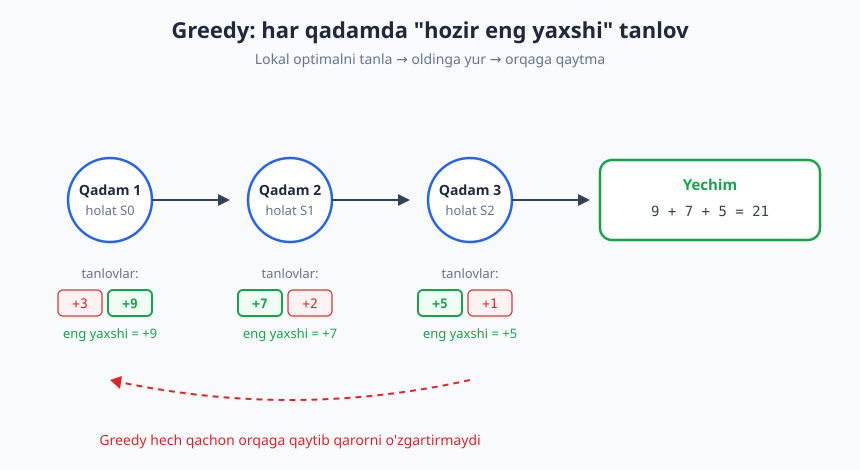
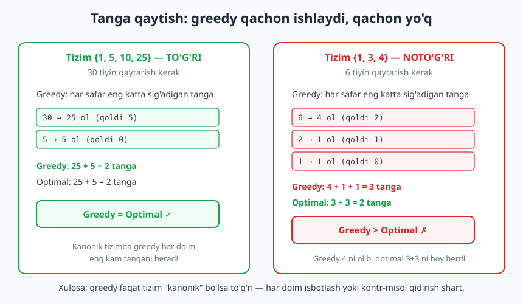
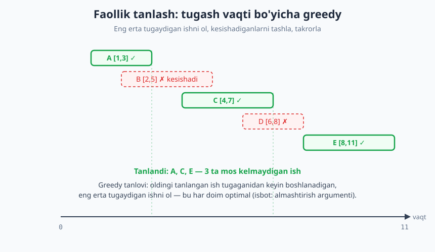

# 24 — Greedy (ochko'z) algoritmlar

[⬅️ Oldingi: 23 — Divide and Conquer (bo'lib hal qil)](./23-divide-and-conquer.md) · [🏠 README](./README.md) · [Keyingi: 25 — Dinamik dasturlash (DP) ➡️](./25-dinamik-dasturlash.md)

---

> **Bu bobda:** **Greedy** (ochko'z) paradigmasini o'rganamiz: har qadamda "hozir eng yaxshi" ko'rinadigan (lokal optimal) tanlovni qilib, global optimal yechimga umid qilish. Greedy orqaga qaytmaydi, qarorni qayta ko'rib chiqmaydi — shuning uchun u tez (odatda saralash + bir o'tish). Lekin markaziy savol shu: lokal optimal tanlovlar har doim ham global optimalga olib keladimi? **Yo'q** — faqat ma'lum masalalarda. To'g'ri ishlaydigan klassiklarni (faollik tanlash, fractional knapsack, Huffman) va greedy **noto'g'ri** bo'lgan misollarni ({1,3,4} tangalari, 0/1 knapsack) ko'rib chiqamiz.
>
> **Halollik / Eslatma:** Bu yerdagi murakkablik chegaralari (faollik tanlash `O(n log n)`, fractional knapsack `O(n log n)`, Huffman `O(n log n)`) matematik aniq. Greedy'ning to'g'riligi **isbot talab qiladi** — biz almashtirish argumentining (exchange argument) g'oyasini ko'rsatamiz, lekin to'liq formal isbotlarni eskiz darajasida qoldiramiz. Barcha Python namunalari haqiqatan ishga tushirib tekshirilgan; ko'rsatilgan chiqishlar kod bergan haqiqiy natijalar.

---

## Greedy paradigmasi

> **Intuitsiya:** Tog'da turibsiz va tepaga chiqmoqchisiz, lekin tuman tushgan — faqat oyog'ingiz ostidagi yerni ko'rasiz. Strategiyangiz: **har qadamda eng tik ko'tariladigan yo'nalishga qadam tashlash**. Bu — greedy. Ba'zan u sizni cho'qqiga olib chiqadi; ba'zan esa kichik tepalikka qamab qo'yadi, chunki haqiqiy cho'qqiga borish uchun avval biroz pastga tushish kerak edi.

**Greedy** (ochko'z) — har qadamda mavjud tanlovlardan **hozir eng foydali ko'rinadiganini** (lokal optimal) tanlab, shu tanlovni hech qachon qayta ko'rib chiqmasdan, global optimal yechimga umid qiladigan strategiya. Uchta xususiyat greedy'ni ajratib turadi:

1. **Lokal qaror.** Har qadamda faqat "hozir" qaysi variant eng yaxshi ekaniga qaraydi — kelajakni hisobga olmaydi.
2. **Orqaga qaytmaslik (no backtracking).** Bir marta tanlangan qaror qat'iy; greedy uni hech qachon bekor qilmaydi yoki qayta ko'rib chiqmaydi.
3. **Tezlik.** Aynan shu "qaytmaslik" tufayli greedy odatda juda tez: nomzodlarni bir marta saralab (`O(n log n)`), so'ng bir o'tishda (`O(n)`) yechimni quradi.



Diagrammada greedy'ning "shakli" ko'rsatilgan: har bir holatda mavjud tanlovlardan eng kattasini (lokal optimal) olamiz va keyingi holatga o'tamiz. Pastdagi qizil punktir strelka esa eng muhim cheklovni eslatadi — greedy **hech qachon orqaga qaytib** oldingi qarorni o'zgartirmaydi.

Psevdokod ko'rinishida greedy shabloni juda sodda:

```text
greedy(masala):
    yechim = bo'sh
    nomzodlarni biror mezon bo'yicha saralab tartibga sol
    har bir nomzod ∈ tartiblangan_nomzodlar:
        agar nomzodni yechimga qo'shish yaroqli bo'lsa:
            yechim = yechim + nomzod        # lokal optimal tanlov, qat'iy
    qaytar yechim
```

Bu [brute force](./22-brute-force.md) bilan keskin farq qiladi: brute force *barcha* variantlarni ko'rib chiqadi (eksponensial), greedy esa *bitta* yo'lni tanlab oldinga yuradi (chiziqli yoki `n log n`). Tezlik jihatidan greedy ajoyib — lekin bu tezlikning narxi bor.

## Markaziy savol: greedy har doim ishlaydimi?

**Yo'q.** Bu — greedy'ning eng muhim nuansi va boshlovchilar tez-tez yiqiladigan joy. "Har qadamda eng yaxshisini tanlash" mantiqan to'g'ridek tuyuladi, lekin **lokal optimal tanlovlar yig'indisi global optimal bo'lishi shart emas**.

Mana sodda kontr-misol. Tanga tizimi `{1, 3, 4}` bo'lsin, 6 tiyin qaytarish kerak:

- **Greedy** har safar eng katta sig'adigan tangani oladi: `4 → qoldi 2 → 1 → qoldi 1 → 1` = `4 + 1 + 1` = **3 ta tanga**.
- **Optimal** esa: `3 + 3` = **2 ta tanga**.

Greedy "4 katta, demak yaxshi" deb o'yladi va 4 ni oldi — lekin shu bilan optimal `3 + 3` yo'lini abadiy yopib qo'ydi. Mana shu greedy'ning xavfi: bir lokal qaror butun global yechimni buzishi mumkin.

> **Diqqat:** Greedy "tabiiy" tuyulgani uchun, ko'pchilik uni isbotlamasdan ishlatadi — va jim sodir bo'ladigan, topish qiyin xatolar oladi. **Qoida:** greedy yozdingizmi — yo to'g'riligini isbotla, yo uni buzadigan kontr-misol qidir. Ikkalasidan biri bo'lmasa, greedy'ga ishonmang.

## Greedy qachon to'g'ri ishlaydi

Greedy bir masala uchun **to'g'ri** bo'lishi uchun ikki xossa kerak:

1. **Greedy choice property (ochko'z tanlov xossasi):** har bir qadamda qilingan lokal optimal tanlov **kamida bitta** global optimal yechimning tarkibiga kira oladi. Ya'ni "hozir eng yaxshi"ni tanlash bizni optimal yechimdan mahrum qilmaydi.
2. **Optimal substructure (optimal qism-struktura):** masalaning optimal yechimi uning qism-masalalarining optimal yechimlaridan tashkil topadi. (Bu xossa [dinamik dasturlash](./25-dinamik-dasturlash.md)da ham markaziy.)

Greedy va DP ikkalasi ham optimal qism-strukturani talab qiladi. Farq **greedy choice** xossasida: agar lokal optimal tanlov har doim global optimalga olib borsa — greedy ishlaydi va u DP'dan tezroq. Aks holda — DP kerak.

> **Isbot (eskiz): almashtirish argumenti (exchange argument).** Greedy'ning to'g'riligini isbotlashning eng keng tarqalgan usuli. G'oya: ixtiyoriy optimal yechim `O` ni olamiz va uni qadam-baqadam greedy yechimi `G` ga "almashtiramiz", har almashtirishda yechim sifati **yomonlashmasligini** ko'rsatamiz. Agar `O` ning birinchi qadami greedy tanloviga mos kelmasa, biz `O` dagi o'sha elementni greedy tanloviga **almashtiramiz** — va bu `O` ni yomonlashtirmasligini (ko'pincha optimalligini saqlashini) ko'rsatamiz. Demak greedy tanlovini o'z ichiga olgan kamida bitta optimal yechim mavjud. Buni har qadamga qo'llab (induksiya), greedy yechimi ham optimal degan xulosaga kelamiz.

## To'g'ri ishlaydigan klassik misollar

### 1-misol. Tanga qaytish — kanonik tizimda to'g'ri, lekin har doim emas

Eng katta tangadan boshlab, har safar summa ichiga sig'adigan eng katta tangani olamiz.

```python
def tanga_greedy(tangalar, summa):
    tangalar = sorted(tangalar, reverse=True)   # kattadan kichikka
    natija = []
    for t in tangalar:
        while summa >= t:
            summa -= t
            natija.append(t)
    return natija if summa == 0 else None

print(tanga_greedy([1, 5, 10, 25], 30))   # -> [25, 5]
print(tanga_greedy([1, 3, 4], 6))         # -> [4, 1, 1]
```

`{1, 5, 10, 25}` (kabi **kanonik** tizimlar — masalan AQSh tangalari yoki ko'p real pul tizimlari)da greedy **har doim** eng kam tanga beradi. Lekin `{1, 3, 4}` da 6 uchun greedy `[4, 1, 1]` (3 tanga) beradi, optimal esa `3 + 3` (2 tanga).



To'g'ri yechim (har qanday tizim uchun) — **dinamik dasturlash** ([25-bob](./25-dinamik-dasturlash.md)):

```python
def tanga_dp(tangalar, summa):
    INF = float("inf")
    dp = [0] + [INF] * summa            # dp[s] = s ni yasash uchun eng kam tanga
    for s in range(1, summa + 1):
        for t in tangalar:
            if t <= s and dp[s - t] + 1 < dp[s]:
                dp[s] = dp[s - t] + 1
    return dp[summa] if dp[summa] != INF else None

print(tanga_dp([1, 3, 4], 6))   # -> 2
```

DP barcha variantni hisobga olgani uchun `3 + 3 = 2` ni topadi. **Saboq:** tanga qaytishda greedy faqat tizim kanonik bo'lsa to'g'ri; aks holda DP shart.

### 2-misol. Faollik tanlash (activity selection) — greedy TO'G'RI

Masala: bir nechta ishning boshlanish va tugash vaqtlari berilgan. Bir vaqtda faqat bitta ish bajariladi (kesishmasligi kerak). **Eng ko'p** ishni bajaring.

**Greedy strategiya:** ishlarni **tugash vaqti bo'yicha** saralang; eng erta tugaydiganni oling; oldingi tanlangan ish tugaganidan keyin boshlanadigan keyingi eng erta tugaydiganni oling, va hokazo.

```python
def faollik_tanlash(ishlar):
    # ishlar: (boshlanish, tugash, nom)
    ishlar = sorted(ishlar, key=lambda x: x[1])   # tugash vaqti bo'yicha
    natija = []
    oxirgi_tugash = float("-inf")
    for b, t, nom in ishlar:
        if b >= oxirgi_tugash:        # oldingi ish bilan kesishmaydi
            natija.append(nom)
            oxirgi_tugash = t
    return natija

ishlar = [(1, 3, "A"), (2, 5, "B"), (4, 7, "C"), (6, 8, "D"), (8, 11, "E")]
print(faollik_tanlash(ishlar))   # -> ['A', 'C', 'E']
```



Quyidagi jadval greedy'ning qadamlarini kuzatadi (ishlar tugash bo'yicha saralangan):

| Ish | `[b, t]` | `b >= oxirgi_tugash`? | Qaror | yangi `oxirgi_tugash` |
|---|---|---|---|---|
| A | `[1, 3]` | `1 >= -∞` ✓ | OL | 3 |
| B | `[2, 5]` | `2 >= 3` ✗ | tashla | 3 |
| C | `[4, 7]` | `4 >= 3` ✓ | OL | 7 |
| D | `[6, 8]` | `6 >= 7` ✗ | tashla | 7 |
| E | `[8, 11]` | `8 >= 7` ✓ | OL | 11 |

Natija: `A, C, E` — 3 ta mos kelmaydigan ish. Saralash `O(n log n)`, bir o'tish `O(n)`, demak jami **`O(n log n)`**.

> **Isbot (eskiz):** Nega aynan **tugash vaqti** bo'yicha? Eng erta tugaydigan ishni olsak, kelajak uchun **eng ko'p joy** qoladi. Almashtirish argumenti: ixtiyoriy optimal yechim `O` ni oling. Uning birinchi ishi `o₁` tugashi greedy tanlagan `g₁` (eng erta tugaydigan) dan kech yoki teng. `O` dagi `o₁` ni `g₁` ga almashtiramiz — `g₁` `o₁` dan oldin tugagani uchun qolgan ishlar bilan kesishmaydi, demak `O` baribir yaroqli va xuddi shuncha ishdan iborat (ya'ni optimalligini yo'qotmadi). Buni qolgan qadamlarga ham qo'llab, greedy yechimi optimal degan xulosaga kelamiz.

### 3-misol. Fractional knapsack (bo'linadigan ryukzak) — greedy TO'G'RI

Masala: har biri qiymat va og'irlikka ega buyumlar bor; sig'imi cheklangan ryukzakni eng katta jami **qiymat**ga to'ldiring. **Bo'linadigan** versiyada buyumning bir qismini ham olish mumkin.

**Greedy strategiya:** **qiymat/og'irlik nisbati** eng yuqori buyumdan boshlab to'ldiring; ryukzakka to'liq sig'masa — qolgan joyga buyumning bir qismini soling.

```python
def fractional_knapsack(buyumlar, sigim):
    # buyumlar: (qiymat, ogirlik)
    buyumlar = sorted(buyumlar, key=lambda x: x[0] / x[1], reverse=True)
    jami = 0.0
    for q, o in buyumlar:
        if sigim >= o:
            jami += q                       # buyumni to'liq ol
            sigim -= o
        else:
            jami += q * (sigim / o)         # qolgan joyga ulushini ol
            break
    return jami

buyumlar = [(60, 10), (100, 20), (120, 30)]
print(fractional_knapsack(buyumlar, 50))   # -> 240.0
```

Nisbatlar: `60/10 = 6`, `100/20 = 5`, `120/30 = 4`. Greedy nisbati eng yuqori tartibda to'ldiradi: `60` (10 birlik) + `100` (20 birlik) + `120` ning `20/30` ulushi (= `80`) = `60 + 100 + 80 = 240`. Bu **optimal**.

> **Isbot (eskiz):** Bo'linadigan versiyada, agar ryukzakda nisbati pastroq buyum bo'lsa-yu, nisbati yuqori buyumdan joy qolgan bo'lsa — pastroq buyumning bir qismini olib tashlab, o'rniga yuqori nisbatli buyumni qo'ysak, jami qiymat **oshadi**. Demak optimal yechimda nisbat bo'yicha to'ldirilgan bo'lishi shart — greedy aynan shuni qiladi.

**Lekin 0/1 knapsack (buyumni bo'lib bo'lmaydi)da greedy NOTO'G'RI.** Xuddi shu buyumlarda, sig'im 50:

```python
def knapsack01_brute(buyumlar, sigim):
    n = len(buyumlar)
    eng = 0
    for mask in range(1 << n):              # barcha qism-to'plamlar (brute force)
        w = v = 0
        for i in range(n):
            if mask & (1 << i):
                v += buyumlar[i][0]
                w += buyumlar[i][1]
        if w <= sigim:
            eng = max(eng, v)
    return eng

buyumlar = [(60, 10), (100, 20), (120, 30)]
print(knapsack01_brute(buyumlar, 50))   # -> 220
```

0/1 da optimal `100 + 120 = 220` (20 + 30 = 50 og'irlik, aniq sig'adi). Lekin nisbat-greedy avval `60` (eng yuqori nisbat) ni olib, qolgan 40 joyga `100` ni qo'yadi va `120` sig'maydi → `60 + 100 = 160`. Greedy `60` ni "yutuq" deb o'yladi, lekin u optimal `120` ni boy berishga olib keldi. 0/1 knapsack uchun to'g'ri yechim — **dinamik dasturlash** ([25-bob](./25-dinamik-dasturlash.md)).

> **Trade-off:** Bitta o'zgarish — "buyumni bo'lish mumkinmi?" — greedy'ni to'g'ridan noto'g'riga aylantiradi. Bu greedy'ning naqadar nozikligini ko'rsatadi: masalaning ozgina o'zgarishi greedy choice xossasini buzishi mumkin.

### 4-misol. Huffman kodlash (g'oya) — greedy + heap

**Huffman kodlash** — matnni siqishda eng tez-tez uchraydigan belgilarga **qisqaroq** kod, kam uchraydiganlarga uzunroq kod beradigan klassik greedy algoritm. **Greedy tanlov:** har qadamda eng kam chastotali **ikkita** tugunni birlashtirib, yangi (yig'indi chastotali) tugun yasash. Buni samarali qilish uchun [min-heap (priority queue)](./19-heap-priority-queue.md) ishlatiladi.

```python
import heapq

def huffman_narx(chastotalar):
    h = list(chastotalar)
    heapq.heapify(h)
    jami = 0
    while len(h) > 1:
        a = heapq.heappop(h)        # eng kam ikkitasi
        b = heapq.heappop(h)
        jami += a + b               # birlashtirish narxi
        heapq.heappush(h, a + b)
    return jami                     # = jami kodlash bitlari (optimal)

print(huffman_narx([5, 9, 12, 13, 16, 45]))   # -> 224
```

Har qadamda eng kam ikkita tugunni olish — bu greedy choice. `n − 1` ta birlashtirish, har biri heap amali `O(log n)`, demak **`O(n log n)`**. Huffman — greedy'ning to'g'ri ishlashi *isbotlangan* mashhur misoli (almashtirish argumenti bilan optimalligi ko'rsatiladi).

### 5-misol. Eng kam platforma (yig'ilish xonalari)

Masala: bir nechta yig'ilishning vaqtlari berilgan; bir vaqtda kesishadigan eng ko'p yig'ilish soni — kerakli **eng kam xona** soni. Greedy g'oya: barcha boshlanish va tugash vaqtlarini alohida saralab, vaqt o'qi bo'ylab yurib, qancha yig'ilish **bir vaqtda** ochiq ekanini hisoblaymiz.

```python
def eng_kam_xona(intervallar):
    boshlar = sorted(b for b, t in intervallar)
    tugashlar = sorted(t for b, t in intervallar)
    i = j = 0
    joriy = eng_kop = 0
    n = len(intervallar)
    while i < n:
        if boshlar[i] < tugashlar[j]:   # yangi yig'ilish boshlandi
            joriy += 1
            eng_kop = max(eng_kop, joriy)
            i += 1
        else:                           # bir yig'ilish tugadi, xona bo'shadi
            joriy -= 1
            j += 1
    return eng_kop

print(eng_kam_xona([(1, 4), (2, 5), (7, 9), (3, 6)]))   # -> 3
```

`[1,4]`, `[2,5]`, `[3,6]` vaqt `3` da uchchovi ham ochiq → 3 xona kerak. Saralash `O(n log n)`.

## Greedy qachon NOTO'G'RI

Greedy intuitiv bo'lgani uchun, uni noto'g'ri qo'llash juda oson. Eng tipik holatlar:

| Masala | Greedy strategiya | Nega NOTO'G'RI | To'g'ri vosita |
|---|---|---|---|
| Tanga `{1, 3, 4}`, summa 6 | eng katta tangani ol | `4+1+1=3`, optimal `3+3=2` | [DP](./25-dinamik-dasturlash.md) |
| 0/1 knapsack | eng yuqori nisbatni ol | bo'linmaydi → optimalni boy beradi | [DP](./25-dinamik-dasturlash.md) |
| Eng qisqa yo'l (salbiy vaznlar) | eng yengil qirrani ol | salbiy sikl greedy'ni aldaydi | Bellman-Ford ([30-bob](./30-graf-algoritmlari-2.md)) |

Umumiy belgi: greedy buziladi, qachonki **bir lokal qaror kelajakdagi yaxshiroq imkonni yopib qo'ysa**. `{1, 3, 4}` da `4` ni olish `3 + 3` ni yopadi; 0/1 knapsack'da nisbati yuqori kichik buyumni olish katta buyum uchun joyni yo'qotadi.

> **Anti-pattern:** "Bu masalada greedy ishlaydiganga o'xshaydi, kichik testlarda ham to'g'ri javob berdi — demak to'g'ri." Bu xato. Bir nechta misolda to'g'ri ishlash **isbot emas**. Greedy `{1, 5, 10, 25}` da to'g'ri, `{1, 3, 4}` da noto'g'ri — ikkalasi ham "katta tangani ol" strategiyasi. To'g'rilikni faqat **isbot** (almashtirish argumenti) yoki [brute force](./22-brute-force.md) bilan keng taqqoslash kafolatlaydi.

## Greedy vs Dinamik dasturlash

Greedy va [DP](./25-dinamik-dasturlash.md) ko'pincha bir xil masalaga qo'llanadi, lekin yondashuvi tubdan farq qiladi:

| Jihat | Greedy | Dinamik dasturlash |
|---|---|---|
| Qaror | har qadamda **bitta** lokal optimal tanlov | barcha variantlarni hisobga oladi |
| Orqaga | hech qachon qaytmaydi | qism-masalalar javobini eslab, qayta foydalanadi |
| Tezlik | odatda `O(n log n)` (saralash + o'tish) | odatda sekinroq (`O(n·W)`, `O(n²)`, ...) |
| To'g'rilik | **faqat greedy choice xossasi bo'lsa** | optimal substructure bo'lsa **har doim** |
| Talab | isbot **shart** | takrorlanuvchi qism-masalalar |

Amaliy qoida: **agar greedy ishlasa — uni ishlat** (tezroq va sodda). Lekin greedy'ning ishlashiga ishonch faqat isbotdan keladi. Ishonchingiz komil bo'lmasa — DP'ga o'ting (har doim to'g'ri, sekinroq bo'lsa ham). Ko'p hollarda yondashuv: avval DP bilan to'g'ri yechim yoz, keyin "bu masalada greedy ham ishlaydimi?" deb tekshir va isbotla — agar ha, tezroq greedy'ga o't.

> **Eslatma:** Bir qator klassik graf algoritmlari — Dijkstra (eng qisqa yo'l, salbiy vaznsiz), Prim va Kruskal (minimal qamrab oluvchi daraxt) — aslida **greedy** algoritmlar bo'lib, ularning to'g'riligi qattiq isbotlangan. Ular bilan [graf algoritmlari](./30-graf-algoritmlari-2.md) boblarida tanishasiz. Ya'ni greedy "o'yinchoq" g'oya emas — to'g'ri qo'llanganda u eng kuchli algoritmlardan ba'zilarining asosidir.

## Asosiy g'oyalar (bobni qisqacha)

- **Greedy** (ochko'z) — har qadamda lokal optimal (hozir eng yaxshi) tanlovni qilib, orqaga qaytmasdan global optimalga umid qiladigan strategiya. Tez, sodda — odatda saralash + bir o'tish.
- **Markaziy nuans:** lokal optimal tanlovlar har doim ham global optimalga olib kelmaydi. Greedy faqat **ma'lum** masalalarda to'g'ri.
- To'g'ri ishlashi uchun ikki xossa kerak: **greedy choice property** (lokal tanlov optimal yechimga kira oladi) va **optimal substructure**.
- To'g'rilikni **almashtirish argumenti** (exchange argument) bilan isbotlanadi: ixtiyoriy optimal yechimni greedy yechimiga sifatini yomonlashtirmasdan almashtirish.
- **TO'G'RI** misollar: faollik tanlash (tugash vaqti bo'yicha, `O(n log n)`), fractional knapsack (qiymat/og'irlik nisbati), Huffman kodlash (heap, `O(n log n)`), eng kam platforma, kanonik tanga tizimi.
- **NOTO'G'RI** misollar: `{1, 3, 4}` tangalar (6 uchun `4+1+1` o'rniga `3+3`), 0/1 knapsack, salbiy vaznli eng qisqa yo'l.
- **Greedy vs DP:** greedy bitta yo'l tanlaydi (tez, lekin faqat greedy choice bo'lsa to'g'ri); DP barcha variantni hisobga oladi (sekinroq, lekin optimal substructure bo'lsa har doim to'g'ri).
- **Halollik:** greedy yozdingmi — yo to'g'riligini isbotla, yo kontr-misol qidir. Bir nechta testda ishlash isbot emas.

## Mashqlar

### Oson

**1-mashq.** O'z so'zlaringiz bilan greedy paradigmasini ta'riflang. Uning uchta asosiy xususiyatini (lokal qaror, orqaga qaytmaslik, tezlik) sanab bering. Greedy'ni [brute force](./22-brute-force.md)dan nima farqlaydi?

**2-mashq.** `{1, 5, 10, 25}` tanga tizimida 30 va 67 tiyinni greedy bilan qaytaring (qadamlarni yozing). Har birida nechta tanga chiqdi?

**3-mashq.** Quyidagi ishlarni **tugash vaqti** bo'yicha saralang va greedy faollik tanlashni qo'lda bajaring: `[(0, 6), (1, 4), (3, 5), (5, 7), (5, 9)]`. Qaysi ishlar tanlanadi?

### O'rta

**4-mashq.** Faollik tanlash algoritmini `(boshlanish, tugash)` juftliklari ro'yxatini olib, tanlangan **intervallarni** qaytaradigan qilib yozing (nomlar emas). `[(1,4),(3,5),(0,6),(5,7),(3,9),(5,9),(6,10),(8,11),(8,12),(2,14),(12,16)]` uchun natijani toping.

**5-mashq.** Fractional knapsack'ni amalga oshiring. `buyumlar = [(60, 10), (100, 20), (120, 30)]`, `sigim = 50` uchun jami qiymatni hisoblang. Greedy qaysi mezon bo'yicha saralaydi va nega aynan shu mezon?

**6-mashq.** Sizga masala berildi: "n ta sonni shunday tartibla(ki) ularni ketma-ket yozganda eng katta son hosil bo'lsin" (masalan `[3, 30, 34, 5, 9]`). Bunga qaysi greedy mezon mos keladi? (Maslahat: oddiy "kattadan kichikka" saralash NOTO'G'RI — `3` va `30` ni o'ylab ko'ring.) To'g'ri solishtirish mezonini ayting.

### Qiyin

**7-mashq.** `{1, 3, 4}` tanga tizimida greedy NOTO'G'RI bo'ladigan **eng kichik** summani toping. Greedy va optimal (DP) javobni yonma-yon ko'rsatadigan kod yozing va 1..10 oralig'ida qaysi summalarda farq borligini chiqaring.

**8-mashq.** Faollik tanlashda greedy nega aynan **tugash vaqti** bo'yicha saralaydi? Almashtirish argumenti yordamida (so'zda) tushuntiring. Agar **boshlanish vaqti** bo'yicha saralasak, buzadigan bir kontr-misol keltiring.

**9-mashq.** Sizga yangi masala berildi va greedy yechimi bormi yo'qmi noma'lum. **Qaror jarayonini** (qadamlar ro'yxati) tuzing: greedy'ni qanday sinab ko'rasiz, to'g'riligini qanday tekshirasiz (yoki rad etasiz), va greedy ishlamasa nimaga o'tasiz? Brute force va DP'ning rolini eslang.

<details markdown="1">
<summary>Yechimlar</summary>

### 1-mashq yechimi

**Greedy** — har qadamda mavjud tanlovlardan hozir eng foydali ko'rinadiganini (lokal optimal) tanlab, shu qarorni qayta ko'rib chiqmasdan global optimalga umid qiladigan strategiya. Uchta xususiyat:

1. **Lokal qaror** — faqat "hozir" eng yaxshisiga qaraydi, kelajakni hisobga olmaydi.
2. **Orqaga qaytmaslik** — tanlangan qaror qat'iy, hech qachon bekor qilinmaydi.
3. **Tezlik** — odatda saralash (`O(n log n)`) + bir o'tish (`O(n)`).

**Brute force'dan farqi:** brute force *barcha* nomzodlarni ko'rib chiqadi (eksponensial, lekin har doim to'g'ri); greedy esa *bitta* yo'l tanlab oldinga yuradi (tez, lekin faqat ma'lum masalalarda to'g'ri).

### 2-mashq yechimi

**30 tiyin:** `30 → 25 ol (qoldi 5) → 5 ol (qoldi 0)` = `25 + 5` = **2 tanga**.

**67 tiyin:** `67 → 25 ol (qoldi 42) → 25 ol (qoldi 17) → 10 ol (qoldi 7) → 5 ol (qoldi 2) → 1 ol (qoldi 1) → 1 ol (qoldi 0)` = `25 + 25 + 10 + 5 + 1 + 1` = **6 tanga**.

`{1, 5, 10, 25}` kanonik tizim bo'lgani uchun ikkala holatda ham greedy optimal (eng kam tanga) beradi.

### 3-mashq yechimi

Tugash bo'yicha saralangan: `(1,4), (3,5), (0,6), (5,7), (5,9)`.

| Ish | `[b, t]` | `b >= oxirgi_tugash`? | Qaror | `oxirgi_tugash` |
|---|---|---|---|---|
| `(1,4)` | | `1 >= -∞` ✓ | OL | 4 |
| `(3,5)` | | `3 >= 4` ✗ | tashla | 4 |
| `(0,6)` | | `0 >= 4` ✗ | tashla | 4 |
| `(5,7)` | | `5 >= 4` ✓ | OL | 7 |
| `(5,9)` | | `5 >= 7` ✗ | tashla | 7 |

Tanlanadi: `(1,4)` va `(5,7)` — **2 ta** ish.

### 4-mashq yechimi

```python
def faollik_intervallar(ishlar):
    ishlar = sorted(ishlar, key=lambda x: x[1])   # tugash bo'yicha
    natija = []
    oxir = float("-inf")
    for b, t in ishlar:
        if b >= oxir:
            natija.append((b, t))
            oxir = t
    return natija

print(faollik_intervallar(
    [(1,4),(3,5),(0,6),(5,7),(3,9),(5,9),(6,10),(8,11),(8,12),(2,14),(12,16)]
))
# -> [(1, 4), (5, 7), (8, 11), (12, 16)]
```

Natija: `[(1,4), (5,7), (8,11), (12,16)]` — 4 ta mos kelmaydigan ish (klassik CLRS misoli). Murakkablik `O(n log n)`.

### 5-mashq yechimi

```python
def fractional_knapsack(buyumlar, sigim):
    buyumlar = sorted(buyumlar, key=lambda x: x[0] / x[1], reverse=True)
    jami = 0.0
    for q, o in buyumlar:
        if sigim >= o:
            jami += q
            sigim -= o
        else:
            jami += q * (sigim / o)
            break
    return jami

print(fractional_knapsack([(60, 10), (100, 20), (120, 30)], 50))   # -> 240.0
```

Greedy **qiymat/og'irlik nisbati** bo'yicha (kattadan kichikka) saralaydi. Nisbatlar: `6, 5, 4`. To'ldirish: `60` (10) + `100` (20) + `120` ning `20/30` ulushi (= 80) = **240.0**.

Nega aynan shu mezon? Chunki bo'linadigan masalada har birlik joyga eng ko'p qiymat beradigan buyum eng foydali. Agar nisbati pastroq buyum joy egallab tursa-yu, nisbati yuqori buyum to'liq sig'masa — almashtirish jami qiymatni oshiradi. Demak optimal yechim nisbat bo'yicha to'ldirilgan bo'lishi shart.

### 6-mashq yechimi

Oddiy "kattadan kichikka" (`30 > 3`) saralash NOTO'G'RI: `[3, 30]` → `"330"` beradi, lekin `[30, 3]` → `"303"`... aslida `"330" > "303"`, demak `3` oldin kelishi kerak. Ya'ni sonlarni emas, **birlashtirilgan satrlarni** solishtirish kerak.

**To'g'ri mezon:** ikkita son `a`, `b` uchun, agar `str(a) + str(b) > str(b) + str(a)` bo'lsa, `a` oldin kelishi kerak.

```python
from functools import cmp_to_key

def eng_katta_son(nums):
    s = list(map(str, nums))
    s.sort(key=cmp_to_key(lambda a, b: (a + b < b + a) - (a + b > b + a)))
    return "".join(s)

print(eng_katta_son([3, 30, 34, 5, 9]))   # -> 9534330
```

Bu greedy: har juftlik uchun "qaysi tartib katta son beradi" mezoni bo'yicha saralaymiz. `3` va `30`: `"330" > "303"` → `3` oldin. Natija `9534330`.

### 7-mashq yechimi

```python
def greedy_count(coins, amount):
    coins = sorted(coins, reverse=True)
    c = 0
    for coin in coins:
        c += amount // coin
        amount %= coin
    return c if amount == 0 else None

def dp_count(coins, amount):
    INF = float("inf")
    dp = [0] + [INF] * amount
    for s in range(1, amount + 1):
        for coin in coins:
            if coin <= s:
                dp[s] = min(dp[s], dp[s - coin] + 1)
    return dp[amount] if dp[amount] != INF else None

coins = [1, 3, 4]
for a in range(1, 11):
    g, d = greedy_count(coins, a), dp_count(coins, a)
    mark = "  <-- FARQ" if g != d else ""
    print(f"summa={a}: greedy={g}, dp={d}{mark}")

# Chiqish:
# summa=1: greedy=1, dp=1
# summa=2: greedy=2, dp=2
# summa=3: greedy=1, dp=1
# summa=4: greedy=1, dp=1
# summa=5: greedy=2, dp=2
# summa=6: greedy=3, dp=2  <-- FARQ
# summa=7: greedy=2, dp=2
# summa=8: greedy=2, dp=2
# summa=9: greedy=3, dp=3
# summa=10: greedy=4, dp=3  <-- FARQ
```

**Eng kichik** farq summasi — **6**: greedy `4+1+1=3` tanga, optimal `3+3=2` tanga. 10 da ham farq bor (`4+4+1+1=4` o'rniga `4+3+3=3`). Bu greedy'ning kanonik bo'lmagan tizimda buzilishini aniq ko'rsatadi.

### 8-mashq yechimi

**Nega tugash vaqti?** Eng erta tugaydigan ishni olsak, kelajak uchun **eng ko'p bo'sh joy** qoldiramiz — demak undan keyin ko'proq ish sig'adi. Bu greedy choice xossasini ta'minlaydi.

**Almashtirish argumenti (so'zda):** Ixtiyoriy optimal yechim `O` ni oling. Uning birinchi (eng erta tugaydigan) ishi `o₁` ning tugashi greedy tanlagan `g₁` (umuman eng erta tugaydigan) dan kech yoki teng. `O` da `o₁` ni `g₁` ga almashtiramiz: `g₁` `o₁` dan oldin (yoki bir vaqtda) tugagani uchun, `O` dagi qolgan ishlar `g₁` bilan ham kesishmaydi. Demak almashtirilgan yechim hali yaroqli va aynan shuncha ishdan iborat — optimalligini yo'qotmadi. Buni har qadamga qo'llab, greedy yechimi optimal degan xulosaga kelamiz.

**Boshlanish bo'yicha saralash kontr-misoli:** `[(0, 10), (1, 2), (3, 4)]`. Boshlanish bo'yicha eng erta — `(0, 10)`; uni olsak, qolgan ikkala ish (`(1,2)`, `(3,4)`) u bilan kesishadi → greedy faqat **1** ish topadi. Lekin optimal `(1,2)` va `(3,4)` = **2** ish. Demak boshlanish bo'yicha saralash noto'g'ri.

### 9-mashq yechimi

Qaror jarayoni:

```text
1. GREEDY MEZONNI TAXMIN QIL.
   - "Har qadamda nimaga qarab tanlasam yaxshi?" (eng katta? eng erta
     tugaydigan? eng yuqori nisbat?). Bir nechta mezonni o'ylab ko'r.

2. KICHIK TESTLARDA SINA.
   - Greedy'ni brute force (barcha variant, 22-bob) BILAN kichik n da
     solishtir. Farq chiqsa -> greedy NOTO'G'RI, kontr-misol topding.

3. ISBOTLASHGA URIN (almashtirish argumenti).
   - Optimal yechimni greedy tanloviga sifatini yomonlashtirmasdan
     almashtira olasanmi? Ha -> greedy to'g'ri, ishlat (tezroq).

4. GREEDY ISHLAMASA -> DP GA O'T.
   - Optimal substructure va takrorlanuvchi qism-masalalar bo'lsa,
     dinamik dasturlash (25-bob) har doim optimal javob beradi.
```

**Brute force'ning roli:** kichik n da greedy'ni tekshirish uchun "haqiqat manbai" (etalon) — agar farq chiqsa, greedy darrov rad etiladi. **DP'ning roli:** greedy ishlamaganda har doim to'g'ri (lekin sekinroq) yechim. Eng xavfli xato — greedy'ni isbotsiz va brute force bilan solishtirmasdan ishonish: u bir nechta testda to'g'ri ishlab, keyin jim buzilishi mumkin.

</details>

---

[⬅️ Oldingi: 23 — Divide and Conquer (bo'lib hal qil)](./23-divide-and-conquer.md) · [🏠 README](./README.md) · [Keyingi: 25 — Dinamik dasturlash (DP) ➡️](./25-dinamik-dasturlash.md)
