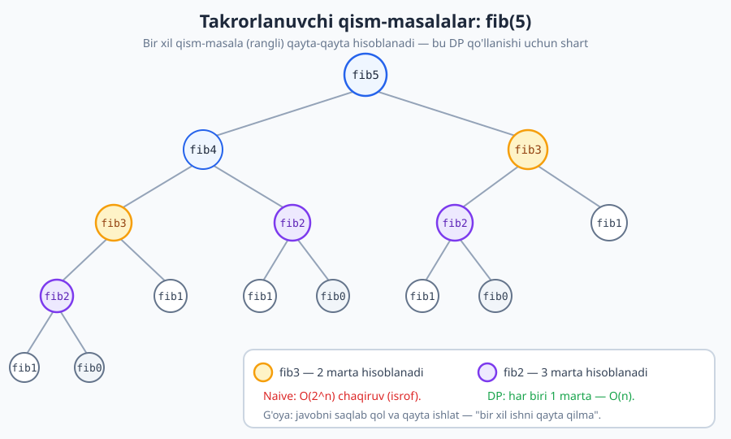
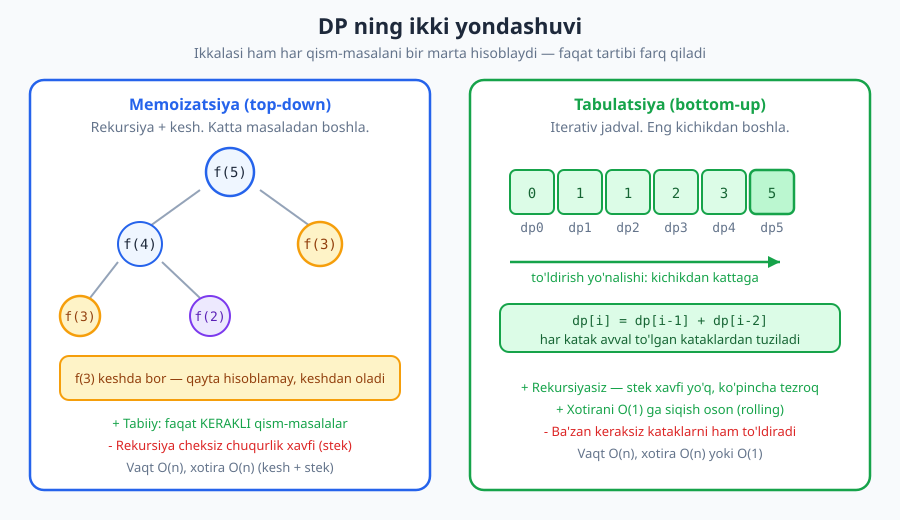
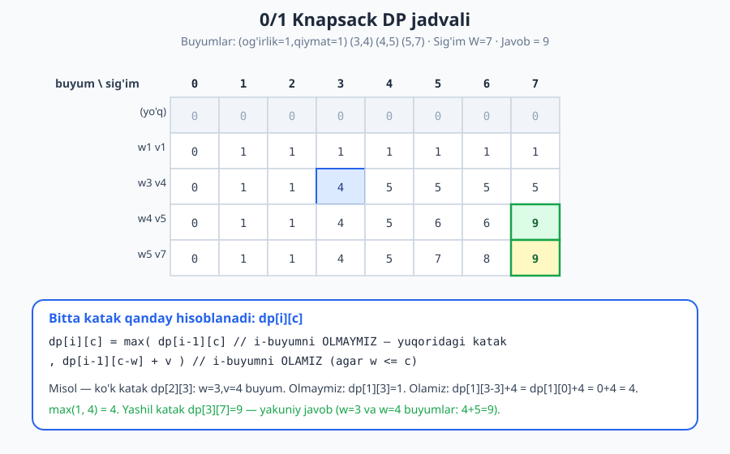

# 25 — Dinamik dasturlash (DP)

[⬅️ Oldingi: 24 — Greedy (ochko'z) algoritmlar](./24-greedy.md) · [🏠 README](./README.md) · [Keyingi: 26 — Backtracking (orqaga qaytish) ➡️](./26-backtracking.md)

---

> **Bu bobda:** Dinamik dasturlash (DP) — masalani qism-masalalarga bo'lib, har qism-masalani **faqat bir marta** yechib, javobini xotirada saqlab, qayta ishlatadigan kuchli paradigma. DP qachon qo'llanishi (optimal substructure + takrorlanuvchi qism-masalalar), ikki yondashuv (memoizatsiya va tabulatsiya), DP yechish retsepti va ettita klassik masala — Fibonachchi, tanga qaytish, 0/1 knapsack, LCS, LIS, yo'l sanash, tahrirlash masofasi — jadval va trassirovka bilan ko'rib chiqamiz.
>
> **Halollik / Eslatma:** Bu yerdagi barcha murakkablik chegaralari (DP bilan Fibonachchi O(n), tanga qaytish O(summa·tangalar), knapsack O(n·W), LCS/edit O(m·n), LIS O(n²)) matematik aniq. `O(n·W)` — bu **pseudo-polinomial**, bu nozik nuqtani aniq tushuntiramiz. Barcha Python namunalari haqiqatan ishga tushirib tekshirilgan; ko'rsatilgan chiqishlar va jadval qiymatlari kod bergan haqiqiy natijalardir.

---

## Dinamik dasturlash g'oyasi

> **Intuitsiya:** Imtihonga tayyorlanyapsiz. Bir masalani yechib, javobini qoralamaga yozib qo'ydingiz. Yarim soatdan keyin **aynan o'sha** masala yana chiqdi. Aqlli talaba qayta yechmaydi — qoralamadan javobni ko'chiradi. Ahmoq talaba boshidan qayta yechadi. Dinamik dasturlash — bu "qoralamaga yozib qo'yish" strategiyasi: bir marta yechilgan qism-masalaning javobini saqlab qol va qayta ishlat.

**Dinamik dasturlash** (ingliz tilida *dynamic programming*, qisqacha **DP**) — masalani **bir-biriga bog'liq qism-masalalarga** bo'lib, har qism-masalani faqat **bir marta** yechib, javobini xotirada (jadval yoki lug'atda) saqlab, kerak bo'lganda **qayta hisoblamasdan** o'sha saqlangan javobni ishlatadigan algoritm dizayni strategiyasi.

Bitta jumlaga jamlasak: **"bir xil ishni qayta qilma."**

> **Eslatma:** Nom chalg'itadi. "Dinamik dasturlash" da "dasturlash" — kod yozish degani **emas**. Bu 1950-yillarda Richard Bellman qo'llagan atama bo'lib, "dasturlash" o'sha davrda "jadval bilan rejalashtirish/optimallashtirish" ma'nosida ishlatilgan (xuddi "lineer dasturlash" dagidek). DP — bu jadval to'ldirish orqali optimallashtirish.

DP ning butun kuchi bitta kuzatuvga asoslanadi: ko'p masalalarda **bir xil qism-masala qayta-qayta uchraydi**. Agar uni bir marta hisoblab saqlab qolsak, ulkan isrofdan qutulamiz. Buni eng yaxshi misol — Fibonachchi sonlari — orqali ko'ramiz.

## Motivatsiya: Fibonachchi va eksponensial isrof

Fibonachchi ketma-ketligi: `fib(0)=0`, `fib(1)=1`, va `fib(n)=fib(n−1)+fib(n−2)`. To'g'ridan-to'g'ri rekursiya ([6-bob](./06-rekursiya-asoslari.md)) bilan yozsak:

```python
def fib_naive(n):
    if n < 2:
        return n
    return fib_naive(n - 1) + fib_naive(n - 2)

print(fib_naive(10))   # -> 55
```

To'g'ri javob beradi, lekin **dahshatli sekin**. Nega? `fib(5)` ni hisoblash uchun chaqiruvlar daraxtiga qarang:



Diagrammada ko'rinib turibdiki, `fib(3)` ikki marta, `fib(2)` uch marta **noldan qayta hisoblanadi**. `n` o'sgani sari bu takror portlaydi: chaqiruvlar soni taxminan `O(φⁿ) ≈ O(1.618ⁿ)` — ya'ni **eksponensial**. `fib(50)` ni naive usulda hisoblash zamonaviy kompyuterda ham daqiqalar oladi.

Sababini ikki tushuncha aniq tavsiflaydi:

1. **Optimal substructure:** `fib(n)` yechimi `fib(n−1)` va `fib(n−2)` yechimlaridan tuziladi.
2. **Overlapping subproblems (takrorlanuvchi qism-masalalar):** `fib(3)`, `fib(2)` kabi bir xil qism-masalalar daraxtning turli shoxlarida qayta-qayta uchraydi.

Mana shu ikkinchi xossa — DP ishlatish uchun **signal**. Agar bir xil qism-masala ko'p marta hisoblanayotgan bo'lsa, uni **bir marta** hisoblab saqlab qo'yamiz. Bu naive `O(φⁿ)` ni **O(n)** ga tushiradi — eksponensialdan chiziqliga.

## DP qo'llanishining ikki sharti

DP har qanday masalaga emas, faqat ikkita xossani qanoatlantiradigan masalalarga qo'llanadi.

### 1-shart. Optimal substructure (optimal qism-struktura)

Katta masalaning optimal yechimi **qism-masalalarning optimal yechimlaridan** tuziladi. Ya'ni: agar men qism-masalalarning eng yaxshi javoblarini bilsam, ulardan katta masalaning eng yaxshi javobini qura olaman.

Fibonachchida bu aniq: `fib(n) = fib(n−1) + fib(n−2)` — katta javob to'g'ridan-to'g'ri kichik javoblardan. Bu xossa **rekurrent munosabat** (transition) ko'rinishida yoziladi, va u DP ning yuragi.

### 2-shart. Overlapping subproblems (takrorlanuvchi qism-masalalar)

Bir xil qism-masala yechish jarayonida **ko'p marta** uchraydi. Aynan shu sabab javobni saqlab qo'yishdan foyda bor. Agar har qism-masala faqat bir marta uchrasa, saqlashdan ma'no yo'q.

> **Diqqat — DP va divide & conquer farqi:** [Divide & conquer](./23-divide-and-conquer.md) ham masalani qism-masalalarga bo'ladi, lekin uning qism-masalalari **mustaqil va takrorlanmaydigan** (masalan, merge sort chap yarmi va o'ng yarmi — butunlay alohida). DP da esa qism-masalalar **ustma-ust tushadi** (overlapping). Aynan shu farq DP ni alohida paradigma qiladi: D&C da saqlashdan foyda yo'q (har qism-masala bir marta), DP da esa saqlash hal qiluvchi.

Quyidagi jadval ikki sharti birga qachon DP berishini ko'rsatadi:

| Optimal substructure? | Overlapping? | Strategiya |
|---|---|---|
| Ha | Ha | **Dinamik dasturlash** |
| Ha | Yo'q (mustaqil) | Divide & conquer ([23-bob](./23-divide-and-conquer.md)) |
| Ha (lokal tanlov yetarli) | — | Greedy ([24-bob](./24-greedy.md)) bo'lishi mumkin |

## Ikki yondashuv: memoizatsiya va tabulatsiya

DP ni amalga oshirishning ikki yo'li bor. Ikkalasi ham bir xil natija beradi (har qism-masala bir marta hisoblanadi), faqat **tartibi** farq qiladi.



### Memoizatsiya (top-down — yuqoridan pastga)

**Tabiiy rekursiyani saqlab qol, ammo har javobni keshga yoz.** Qism-masalaga ikkinchi marta kelganda — keshdan o'qiymiz, qayta hisoblamaymiz.

```python
def fib_memo(n, kesh=None):
    if kesh is None:
        kesh = {}
    if n < 2:
        return n
    if n in kesh:                              # qoralamaga qarash
        return kesh[n]
    kesh[n] = fib_memo(n - 1, kesh) + fib_memo(n - 2, kesh)
    return kesh[n]                              # va qoralamaga yozish

print(fib_memo(50))   # -> 12586269025
```

Bu yondashuv **katta masaladan boshlaydi** (`fib(50)`) va rekursiya orqali pastga tushadi. Afzalligi: **faqat kerakli** qism-masalalar hisoblanadi, va kod tabiiy rekursiyaga juda yaqin. Kamchiligi: rekursiya stek chuqurligi (juda katta `n` da `RecursionError` xavfi) va funksiya chaqiruvi ortig'i.

### Tabulatsiya (bottom-up — pastdan yuqoriga)

**Rekursiyani butunlay tashlab, jadvalni eng kichikdan kattaga to'ldiramiz.** Har katakni hisoblaganda, undan kichik kataklar allaqachon to'lgan bo'ladi.

```python
def fib_tab(n):
    if n < 2:
        return n
    dp = [0] * (n + 1)
    dp[1] = 1
    for i in range(2, n + 1):                  # kichikdan kattaga
        dp[i] = dp[i - 1] + dp[i - 2]
    return dp[n]

print(fib_tab(50))   # -> 12586269025
```

Bu **eng kichik qism-masalalardan boshlaydi** (`dp[0]`, `dp[1]`) va yuqoriga qarab quradi. Afzalligi: rekursiyasiz (stek xavfi yo'q), ko'pincha tezroq, va xotirani siqish oson. Kamchiligi: ba'zan keraksiz kataklarni ham to'ldirishi mumkin.

> **Trade-off:** Memoizatsiya — kodi tabiiy, faqat kerakli qism-masalalar; tabulatsiya — tezroq, stek-xavfsiz, xotira-tejamkor. Boshlovchiga memoizatsiya intuitivroq (oddiy rekursiyaga "kesh qo'shasiz"); tajriba ortgach tabulatsiya ko'pincha afzal. Ikkalasi ham **O(n) vaqt** beradi.

Tabulatsiyada yana bir bonus bor: ko'pincha **butun jadval kerak emas**, faqat oxirgi bir-ikki qiymat. Fibonachchida faqat oldingi ikki son yetarli, demak massivni **ikki o'zgaruvchiga** siqamiz — xotira `O(n) → O(1)`:

```python
def fib_rolling(n):
    if n < 2:
        return n
    oldingi, joriy = 0, 1
    for _ in range(2, n + 1):
        oldingi, joriy = joriy, oldingi + joriy   # faqat 2 qiymat saqlanadi
    return joriy

print(fib_rolling(50))   # -> 12586269025
```

Bu — **rolling array** (aylanma massiv) texnikasi; unga bobning oxirida qaytamiz.

## DP yechish retsepti (amaliy)

DP masalasini ko'rib, "qayerdan boshlasam?" deb qotib qolish oson. Quyidagi olti qadamli retsept deyarli har DP masalasini yechishga olib boradi. Buni xotirada saqlang — bu bobning eng amaliy qismi.

```text
1. HOLAT (state):  qism-masalani noyob aniqlovchi parametr(lar)ni tanla.
                   "dp[...] nimani anglatadi?" deb aniq yoz.
2. REKURRENT (transition):  dp[holat] ni kichikroq holatlar orqali ifodala.
3. BAZA (base case):  eng kichik holatlar javobini to'g'ridan-to'g'ri ber.
4. TARTIB (order):  holatlarni qaysi tartibda hisoblash kerak
                    (har holat o'ziga kerakli kichik holatlardan KEYIN).
5. JAVOB:  qaysi holat(lar)da yakuniy javob turibdi?
6. XOTIRA:  to'liq jadval kerakmi yoki rolling bilan siqsa bo'ladimi?
```

Eng qiyini — **1-qadam, holatni to'g'ri aniqlash**. Buni mashq bilan o'rganasiz; bob davomidagi har masalada holatni aniq ataymiz, shunda qolip miyangizga o'rnashadi.

## Klassik masala 1: Fibonachchi (retseptni qo'llab)

Yuqorida ko'rdik, lekin retsept bo'yicha rasmiylashtiraylik:

- **Holat:** `dp[i]` = `i`-chi Fibonachchi soni.
- **Rekurrent:** `dp[i] = dp[i−1] + dp[i−2]`.
- **Baza:** `dp[0]=0`, `dp[1]=1`.
- **Tartib:** `i` ni `2` dan `n` gacha (har `i` o'zidan kichiklardan keyin).
- **Javob:** `dp[n]`.
- **Xotira:** faqat 2 oldingi qiymat kerak → `O(1)`.

Bu — eng sodda DP. Endi haqiqiy optimallashtirish masalalariga o'tamiz.

## Klassik masala 2: Tanga qaytish (coin change)

**Masala:** tanga nominallari (masalan `{1, 3, 4}`) va `summa` berilgan. Summani hosil qilish uchun **eng kam nechta tanga** kerak? (Har nominal cheksiz ko'p.)

> **Diqqat — bu yerda greedy ALDAYDI.** Tabiiy "ochko'z" yondashuv: har safar eng katta tangani ol. `{1,3,4}` bilan `6` summa uchun greedy `4+1+1 = 3 ta` tanga oladi. Lekin DP `3+3 = 2 ta` tanga topadi — bu yaxshiroq! Bu [greedy bob](./24-greedy.md)dagi muhim saboqning aynan davomi: greedy faqat ba'zi tanga tizimlarida to'g'ri (masalan oddiy pul), umumiy holda esa **DP shart**.

### Retsept bo'yicha

- **Holat:** `dp[s]` = `s` summani hosil qilish uchun eng kam tangalar soni.
- **Rekurrent:** `dp[s] = 1 + min(dp[s − t])` — barcha `t` tanga uchun (agar `t ≤ s`). Mantiq: oxirgi qo'yilgan tanga `t` bo'lsa, qolgani `dp[s−t]`, ustiga `+1`.
- **Baza:** `dp[0] = 0` (bo'sh summa uchun tanga kerak emas).
- **Tartib:** `s` ni `1` dan `summa` gacha.
- **Javob:** `dp[summa]` (yetib bo'lmasa — `cheksiz`, ya'ni `-1`).

```python
def tanga_qaytish(tangalar, summa):
    INF = float("inf")
    dp = [0] + [INF] * summa                    # dp[0]=0, qolgani cheksiz
    for s in range(1, summa + 1):
        for t in tangalar:
            if t <= s and dp[s - t] + 1 < dp[s]:
                dp[s] = dp[s - t] + 1
    return dp[summa] if dp[summa] != INF else -1

print(tanga_qaytish([1, 3, 4], 6))    # -> 2   (3 + 3)
print(tanga_qaytish([1, 3, 4], 11))   # -> 3   (3 + 4 + 4)
print(tanga_qaytish([2, 5], 3))       # -> -1  (hosil qilib bo'lmaydi)
```

**Trassirovka** — `{1,3,4}` bilan `dp` qanday to'lishini kuzataylik:

| s | dp[s] hisoblanishi | dp[s] |
|---|---|---|
| 0 | baza | 0 |
| 1 | `1 + dp[0]` (t=1) | 1 |
| 2 | `1 + dp[1]` (t=1) | 2 |
| 3 | `min(1+dp[2], 1+dp[0])` = min(3, **1**) (t=3) | 1 |
| 4 | `min(1+dp[3], 1+dp[0])` = min(2, **1**) (t=4) | 1 |
| 5 | `min(1+dp[4], 1+dp[2], 1+dp[1])` = min(2, 3, **2**) | 2 |
| 6 | `min(1+dp[5], 1+dp[3], 1+dp[2])` = min(3, **2**, 3) | **2** |

`s=6` da `dp[3]+1 = 1+1 = 2` g'olib — bu aynan `3+3`. Greedy `4` ni olib qolib, `4+1+1=3` ga ketgan bo'lar edi. DP barcha variantni ko'rib, eng yaxshisini topadi.

**Murakkablik:** ikki ichma-ich sikl — `O(summa × tangalar_soni)` vaqt, `O(summa)` xotira.

## Klassik masala 3: 0/1 Knapsack (sumka masalasi)

**Masala:** har biri og'irlik `w` va qiymat `v` ga ega `n` ta buyum bor. Sig'imi `W` bo'lgan sumkaga buyumlarni joylab, **umumiy qiymatni maksimal** qilmoqchimiz. Har buyumni **butunlay olamiz yoki olmaymiz** (shuning uchun "0/1") — bo'lib bo'lmaydi.

Bu masalaning naive brute force yechimi `O(2ⁿ)` (har buyum uchun ol/olma) — [brute force bobi](./22-brute-force.md)dagi qism-to'plam portlashi. DP buni `O(n·W)` ga tushiradi.

### Retsept bo'yicha

- **Holat:** `dp[i][c]` = birinchi `i` ta buyumdan foydalanib, sig'imi `c` bo'lgan sumkadagi maksimal qiymat.
- **Rekurrent — har buyum uchun ikki tanlov:**

```text
dp[i][c] = max(
    dp[i-1][c],              // i-buyumni OLMAYMIZ
    dp[i-1][c - w] + v       // i-buyumni OLAMIZ (faqat agar w <= c)
)
```

- **Baza:** `dp[0][c] = 0` (buyum yo'q → qiymat yo'q).
- **Tartib:** `i` ni `1..n`, ichida `c` ni `0..W`.
- **Javob:** `dp[n][W]`.

```python
def knapsack(ogirliklar, qiymatlar, sigim):
    n = len(ogirliklar)
    dp = [[0] * (sigim + 1) for _ in range(n + 1)]
    for i in range(1, n + 1):
        w, v = ogirliklar[i - 1], qiymatlar[i - 1]
        for c in range(sigim + 1):
            dp[i][c] = dp[i - 1][c]                          # olmaymiz
            if w <= c:
                dp[i][c] = max(dp[i][c], dp[i - 1][c - w] + v)  # olamiz
    return dp[n][sigim]

ogir = [1, 3, 4, 5]
qiy  = [1, 4, 5, 7]
print(knapsack(ogir, qiy, 7))   # -> 9   (w=3,v=4 va w=4,v=5: 4+5=9)
```

Jadvalni to'liq ko'rsatamiz — qatorlar buyumlar, ustunlar sig'im 0..7:



To'liq jadval (kod chiqargan haqiqiy qiymatlar):

| buyum \ c | 0 | 1 | 2 | 3 | 4 | 5 | 6 | 7 |
|---|---|---|---|---|---|---|---|---|
| (yo'q) | 0 | 0 | 0 | 0 | 0 | 0 | 0 | 0 |
| w1 v1 | 0 | 1 | 1 | 1 | 1 | 1 | 1 | 1 |
| w3 v4 | 0 | 1 | 1 | **4** | 5 | 5 | 5 | 5 |
| w4 v5 | 0 | 1 | 1 | 4 | 5 | 6 | 6 | **9** |
| w5 v7 | 0 | 1 | 1 | 4 | 5 | 7 | 8 | 9 |

Bitta katakni tushunamiz — `dp[2][3]` (qalin **4**): bu `w=3, v=4` buyum, sig'im `3`. Olmaymiz → `dp[1][3] = 1`. Olamiz → `dp[1][3−3] + 4 = dp[1][0] + 4 = 0 + 4 = 4`. `max(1, 4) = 4`. Yakuniy javob `dp[3][7] = 9`.

**Murakkablik:** `O(n × W)` vaqt va xotira.

> **Diqqat — pseudo-polinomial.** `O(n·W)` "polinomial" ko'rinadi, lekin `W` — *son*, uning kattaligini yozish uchun atigi `log W` bit kerak. Kirish hajmiga (bitlar soniga) nisbatan bu eksponensial bo'lishi mumkin. Shuning uchun knapsack **pseudo-polinomial** deyiladi va aslida NP-qiyin ([32-bob](./32-p-np-murakkablik-nazariyasi.md)). Amalda esa `W` kichik bo'lsa — bu juda tez ishlaydi.

## Klassik masala 4: Eng uzun umumiy qism-ketma-ketlik (LCS)

**Masala:** ikki satr (yoki ketma-ketlik) berilgan. Ikkalasida ham **bir xil tartibda** uchraydigan (ammo qo'shni bo'lishi shart emas) eng uzun qism-ketma-ketlik uzunligini toping. Masalan `"ABCBDAB"` va `"BDCAB"` uchun LCS — `"BCAB"` (uzunligi 4).

Bu masala `diff` vositalari, DNK taqqoslash va matn solishtirishning asosida yotadi.

### Retsept bo'yicha (2D jadval)

- **Holat:** `dp[i][j]` = `a` ning birinchi `i` belgisi va `b` ning birinchi `j` belgisi uchun LCS uzunligi.
- **Rekurrent:**

```text
agar a[i-1] == b[j-1]:  dp[i][j] = dp[i-1][j-1] + 1   // mos belgi, diagonal + 1
aks holda:              dp[i][j] = max(dp[i-1][j], dp[i][j-1])  // birini tashla
```

- **Baza:** `dp[0][j] = dp[i][0] = 0` (bo'sh satr bilan LCS = 0).
- **Javob:** `dp[m][n]`.

```python
def lcs(a, b):
    m, n = len(a), len(b)
    dp = [[0] * (n + 1) for _ in range(m + 1)]
    for i in range(1, m + 1):
        for j in range(1, n + 1):
            if a[i - 1] == b[j - 1]:
                dp[i][j] = dp[i - 1][j - 1] + 1
            else:
                dp[i][j] = max(dp[i - 1][j], dp[i][j - 1])
    return dp[m][n]

print(lcs("ABCBDAB", "BDCAB"))   # -> 4
```

**Trassirovka** — kichik misol `a="AGCAT"`, `b="GAC"` (kod chiqargan jadval). Qatorlar `a`, ustunlar `b`:

| | "" | G | A | C |
|---|---|---|---|---|
| "" | 0 | 0 | 0 | 0 |
| A | 0 | 0 | 1 | 1 |
| G | 0 | 1 | 1 | 1 |
| C | 0 | 1 | 1 | 2 |
| A | 0 | 1 | 2 | 2 |
| T | 0 | 1 | 2 | 2 |

Yakuniy `dp[5][3] = 2` — LCS uzunligi 2 (masalan `"AC"` yoki `"GC"`). Diagonal bo'ylab `+1` qadamlar mos belgilarni belgilaydi.

**Murakkablik:** `O(m × n)` vaqt va xotira. Faqat uzunlik emas, **satrning o'zini** ham tiklash mumkin — jadval bo'ylab orqaga yurib (buni mashqlarda ko'rasiz).

## Klassik masala 5: Eng uzun o'suvchi qism-ketma-ketlik (LIS)

**Masala:** sonlar massivi berilgan. **Qat'iy o'suvchi** (har keyingi avalgidan katta) eng uzun qism-ketma-ketlik uzunligini toping. `[10, 9, 2, 5, 3, 7, 101, 18]` uchun LIS — `[2, 3, 7, 101]` yoki `[2, 3, 7, 18]`, uzunligi 4.

### Retsept bo'yicha (O(n²) versiya)

- **Holat:** `dp[i]` = `i`-indeks bilan **tugaydigan** eng uzun o'suvchi qism-ketma-ketlik uzunligi.
- **Rekurrent:** `dp[i] = 1 + max(dp[j])` — barcha `j < i` uchun, agar `nums[j] < nums[i]`. (Mos `j` topilmasa, `dp[i] = 1` — faqat o'zi.)
- **Baza:** har `dp[i]` boshida `1`.
- **Javob:** `max(dp)` — eng uzun ketma-ketlik istalgan indeksda tugashi mumkin.

```python
def lis(nums):
    if not nums:
        return 0
    n = len(nums)
    dp = [1] * n
    for i in range(n):
        for j in range(i):
            if nums[j] < nums[i] and dp[j] + 1 > dp[i]:
                dp[i] = dp[j] + 1
    return max(dp)

print(lis([10, 9, 2, 5, 3, 7, 101, 18]))   # -> 4
```

`dp` massivining oxirgi holati (kod chiqargan): `[1, 1, 1, 2, 2, 3, 4, 4]`. Masalan `dp[6]=4` (`101` da tugaydigan `[2,3,7,101]`).

**Murakkablik:** `O(n²)` vaqt (ikki ichma-ich sikl), `O(n)` xotira.

> **Eslatma:** LIS ni **O(n log n)** ga tushirish mumkin — binar qidiruv ([28-bob](./28-qidiruv-algoritmlari.md)) bilan "patience sorting" texnikasi orqali. G'oya: o'sib boruvchi "uchlar" massivini saqlab, har yangi sonni binar qidiruv bilan to'g'ri joyga qo'yamiz. Bu DP ni strukturadan foydalanib tezlashtirishning chiroyli namunasi, lekin bu bob doirasidan tashqarida.

## Klassik masala 6: Yo'l sanash (grid paths)

**Masala:** `rows × cols` to'rda chap-yuqori burchakdan o'ng-pastki burchakka **faqat pastga yoki o'ngga** yurib bormoqchisiz. Nechta turli yo'l bor?

Bu — "climbing stairs" (pog'ona) masalasining ikki o'lchovli ukasi va eng tushunarli kirish-darajadagi DP.

### Retsept bo'yicha

- **Holat:** `dp[i][j]` = `(0,0)` dan `(i,j)` katakgacha yo'llar soni.
- **Rekurrent:** `dp[i][j] = dp[i−1][j] + dp[i][j−1]` (yuqoridan yoki chapdan kelinadi).
- **Baza:** birinchi qator va birinchi ustun butunlay `1` (faqat bitta yo'l — to'g'ri).
- **Javob:** `dp[rows−1][cols−1]`.

```python
def grid_paths(rows, cols):
    dp = [[1] * cols for _ in range(rows)]
    for i in range(1, rows):
        for j in range(1, cols):
            dp[i][j] = dp[i - 1][j] + dp[i][j - 1]
    return dp[rows - 1][cols - 1]

print(grid_paths(3, 3))   # -> 6
print(grid_paths(3, 7))   # -> 28
```

`3×4` to'r uchun jadval (kod chiqargan):

| | j=0 | j=1 | j=2 | j=3 |
|---|---|---|---|---|
| i=0 | 1 | 1 | 1 | 1 |
| i=1 | 1 | 2 | 3 | 4 |
| i=2 | 1 | 3 | 6 | 10 |

Har ichki katak yuqorisi va chapining yig'indisi: `6 = 3 + 3`, `10 = 6 + 4`. **Murakkablik:** `O(rows × cols)`.

Bir o'lchovli "pog'ona" varianti yanada sodda — `n` ta pog'onaga 1 yoki 2 qadam bilan chiqish usullari soni aynan Fibonachchi:

```python
def pogona(n):
    if n <= 2:
        return n
    a, b = 1, 2
    for _ in range(3, n + 1):
        a, b = b, a + b
    return b

print(pogona(5))   # -> 8
```

## Klassik masala 7: Tahrirlash masofasi (edit distance)

**Masala:** bir satrni boshqasiga aylantirish uchun minimal nechta **bir belgili amal** (qo'shish, o'chirish, almashtirish) kerak? Bu — imlo tuzatuvchi, `diff` va DNK tahlilning asosi. `"kitten" → "sitting"` uchun javob 3.

- **Holat:** `dp[i][j]` = `a` ning birinchi `i` belgisini `b` ning birinchi `j` belgisiga aylantirish uchun minimal amallar.
- **Rekurrent:**

```text
agar a[i-1] == b[j-1]:  dp[i][j] = dp[i-1][j-1]          // belgi mos, amal kerak emas
aks holda: dp[i][j] = 1 + min(dp[i-1][j],      // o'chirish
                              dp[i][j-1],      // qo'shish
                              dp[i-1][j-1])    // almashtirish
```

- **Baza:** `dp[i][0] = i` (hammasini o'chirish), `dp[0][j] = j` (hammasini qo'shish).

```python
def edit_distance(a, b):
    m, n = len(a), len(b)
    dp = [[0] * (n + 1) for _ in range(m + 1)]
    for i in range(m + 1):
        dp[i][0] = i
    for j in range(n + 1):
        dp[0][j] = j
    for i in range(1, m + 1):
        for j in range(1, n + 1):
            if a[i - 1] == b[j - 1]:
                dp[i][j] = dp[i - 1][j - 1]
            else:
                dp[i][j] = 1 + min(dp[i - 1][j], dp[i][j - 1], dp[i - 1][j - 1])
    return dp[m][n]

print(edit_distance("kitten", "sitting"))   # -> 3
print(edit_distance("olma", "alma"))         # -> 1
```

`"olma" → "alma"`: faqat `o` ni `a` ga almashtirish — 1 amal. **Murakkablik:** `O(m × n)` vaqt va xotira.

## Xotira optimizatsiyasi: rolling array

Ko'p 2D DP da `dp[i][...]` ni hisoblash uchun faqat `dp[i−1][...]` (oldingi qator) kerak — undan oldingi qatorlar boshqa ishlatilmaydi. Demak butun jadvalni saqlamasdan, **faqat ikki (yoki bitta) qatorni** saqlash mumkin. Bu — **rolling array** texnikasi.

Knapsackni misol qilamiz. To'liq versiya `O(n·W)` xotira ishlatadi; rolling bilan **bitta qator** — `O(W)` ga tushiriladi:

```python
def knapsack_1d(ogirliklar, qiymatlar, sigim):
    dp = [0] * (sigim + 1)
    for w, v in zip(ogirliklar, qiymatlar):
        for c in range(sigim, w - 1, -1):       # TESKARI yo'nalish — muhim!
            dp[c] = max(dp[c], dp[c - w] + v)
    return dp[sigim]

print(knapsack_1d([1, 3, 4, 5], [1, 4, 5, 7], 7))   # -> 9
```

> **Diqqat — teskari yo'nalish nega shart:** 1D knapsackda ichki siklni `sigim` dan `w` ga qarab **teskari** yuritamiz. Sababi: `dp[c]` ni yangilashda `dp[c−w]` **oldingi qatorning** (bu buyumsiz) qiymatini ko'rsatishi kerak. Agar oldinga (kichikdan kattaga) yursak, `dp[c−w]` allaqachon shu buyum bilan yangilangan bo'ladi — va buyumni **ikki marta** olib qo'yamiz (bu "unbounded knapsack" ga aylanadi, 0/1 emas). Teskari yo'nalish bu xatoning oldini oladi.

Fibonachchidagi `fib_rolling` ham aynan shu g'oya — `O(n)` jadvalni `O(1)` (ikki o'zgaruvchi) ga siqdi. Umumiy qoida: **rekurrent munosabat necha oldingi qatorga/qiymatga bog'liq bo'lsa, shuncha saqlash kifoya.**

## DP ning eng qiyin qismi: holatni aniqlash

Endi rost gapni aytaylik. Yuqoridagi yetti masalada rekurrent munosabatlar tayyor edi. Haqiqiy hayotda esa **eng qiyin ish — holatni (state) to'g'ri aniqlash**. "dp[...] aniq nimani anglatadi?" degan savolga to'g'ri javob topish — DP ning 90% i.

Bir necha amaliy maslahat:

- **Holat — "yetarli ma'lumot".** O'zingizdan so'rang: "qaror qabul qilish uchun menga *qancha* o'tmish kerak?" Knapsackda — qaysi buyumgacha kelganim va qancha sig'im qolgani. Bu ikki narsa holatni to'liq aniqlaydi.
- **Avval naive rekursiyani yoz.** Brute force/rekursiv yechimni yozsangiz, uning parametrlari ko'pincha aynan DP holatidir. Keyin "kesh qo'shsam DP bo'ladimi?" deb tekshiring.
- **Overlapping bormi?** Naive rekursiya daraxtida bir xil chaqiruv takrorlanyaptimi? Ha bo'lsa — DP yordam beradi. Yo'q bo'lsa — bu divide & conquer, DP emas.
- **Mashq, mashq, mashq.** Holatni "ko'rish" — tajriba bilan keladigan ko'nikma. Boshida qiyin, keyin qolip tanish bo'lib qoladi.

> **Eslatma:** DP — bobning eng kuchli, ammo eng "tafakkur talab qiladigan" paradigmasi. [Greedy](./24-greedy.md) ko'pincha soddaroq, lekin har doim ham to'g'ri emas (tanga misolini eslang). [Backtracking](./26-backtracking.md) — keyingi bob — DP ga yaqin: u ham yechim fazosini kezadi, lekin saqlash o'rniga umidsiz shoxlarni kesadi. Murakkablikni baholashda [9-bob](./09-murakkablikni-hisoblash.md)dagi vositalar asqotadi.

## Asosiy g'oyalar (bobni qisqacha)

- **Dinamik dasturlash** — masalani qism-masalalarga bo'lib, har qism-masalani **bir marta** yechib, javobini saqlab, qayta ishlatish. Shior: "bir xil ishni qayta qilma."
- DP ikki shartni talab qiladi: **optimal substructure** (katta yechim kichik yechimlardan tuziladi) va **overlapping subproblems** (bir xil qism-masala ko'p marta uchraydi). Ikkinchisi yo'q bo'lsa — bu [divide & conquer](./23-divide-and-conquer.md), DP emas.
- Naive Fibonachchi `O(φⁿ)` (eksponensial isrof) → DP bilan **O(n)**.
- Ikki yondashuv: **memoizatsiya** (top-down, rekursiya + kesh — tabiiy, faqat kerakli holatlar) va **tabulatsiya** (bottom-up, jadval to'ldirish — tezroq, stek-xavfsiz, xotira-tejamkor). Ikkalasi ham O(n).
- **DP retsepti:** (1) holat, (2) rekurrent munosabat, (3) baza, (4) hisoblash tartibi, (5) javob qayerda, (6) xotira optimizatsiyasi.
- Klassik masalalar va murakkabliklari: Fibonachchi `O(n)`; tanga qaytish `O(summa·tangalar)` (bu yerda **greedy aldaydi**); 0/1 knapsack `O(n·W)` (pseudo-polinomial); LCS va edit distance `O(m·n)`; LIS `O(n²)` (yoki `O(n log n)`); grid paths `O(rows·cols)`.
- **Rolling array:** rekurrent faqat oldingi bir-ikki qatorga bog'liq bo'lsa, xotirani `O(n)` yoki `O(1)` ga siqish mumkin (1D knapsackda **teskari yo'nalish** shart).
- DP ning **eng qiyin qismi — holatni to'g'ri aniqlash**. Naive rekursiyadan boshlang, overlapping borligini tekshiring, mashq qiling.

## Mashqlar

### Oson

**1-mashq.** O'z so'zlaringiz bilan tushuntiring: DP qo'llanishi uchun zarur bo'lgan ikki shart nima? Va nega aynan **overlapping subproblems** sharti DP ni divide & conquer dan ajratib turadi?

**2-mashq.** `fib(6)` ni naive rekursiya bilan hisoblaganda, `fib(2)` necha marta chaqiriladi? (Qog'ozda daraxtni chizib sanang.) Memoizatsiya bu sonni nechaga tushiradi?

**3-mashq.** Pog'ona masalasi: 4 pog'onaga har qadamda 1 yoki 2 pog'ona ko'tarilib chiqish usullari soni nechta? Tabulatsiya bilan `dp[0..4]` jadvalini to'ldiring va javobni ayting.

### O'rta

**4-mashq.** Tanga qaytish: `{1, 5, 6, 9}` nominallari va `summa = 11` uchun: (a) greedy (eng katta tangadan) nechta tanga oladi? (b) DP optimal javob nechta? (c) Ular farq qiladimi, va bu nimani ko'rsatadi?

**5-mashq.** Grid paths: `4×5` to'rda chap-yuqoridan o'ng-pastga nechta yo'l bor? Formuladan (`C(rows+cols−2, rows−1)`) yoki DP jadvalidan foydalaning va javobni tekshiring.

**6-mashq.** Yangi masala uchun holatni aniqlang (kod yozmang): "Massivda *qo'shni bo'lmagan* elementlarni tanlab, ularning yig'indisini maksimal qiling (House Robber)." Holat `dp[i]` nimani anglatishi va rekurrent munosabat qanday bo'lishi kerakligini yozing.

### Qiyin

**7-mashq.** 0/1 knapsack uchun to'liq DP jadvalini **qo'lda** to'ldiring: og'irliklar `[2, 3, 4]`, qiymatlar `[3, 4, 5]`, sig'im `W = 5`. `dp[3][5]` (yakuniy javob) nechiga teng? Qaysi buyumlar tanlangan?

**8-mashq.** LCS faqat uzunlikni emas, **satrning o'zini** ham qaytarsin. `"ABCBDAB"` va `"BDCAB"` uchun bitta to'g'ri LCS satrini tiklang. (Maslahat: jadvalni to'ldirgandan keyin `dp[m][n]` dan orqaga yuring — belgilar mos kelsa diagonalga, aks holda kattaroq qo'shniga.)

**9-mashq.** 1D (rolling) knapsackda ichki siklni nega **teskari** (`sigim` dan `w` ga) yuritish shart? Agar oldinga (kichikdan kattaga) yursak qanday xato yuzaga keladi va bu qaysi boshqa masalaga aylanadi?

<details markdown="1">
<summary>Yechimlar</summary>

### 1-mashq yechimi

Ikki shart: **(1) optimal substructure** — katta masala optimal yechimi qism-masalalarning optimal yechimlaridan quriladi; **(2) overlapping subproblems** — bir xil qism-masala yechish davomida ko'p marta uchraydi.

Aynan **overlapping** DP ni divide & conquer dan ajratadi. D&C da qism-masalalar **mustaqil va takrorlanmaydi** (merge sort chap/o'ng yarmi — alohida), shuning uchun javobni saqlashdan foyda yo'q. DP da esa bir xil qism-masala qayta-qayta kelgani uchun, uni saqlab qo'yib qayta hisoblashdan qutulamiz — butun tejamkorlik shundan. Overlapping bo'lmasa, "DP" oddiy rekursiyaga aylanib qoladi, kesh hech narsa tejamaydi.

### 2-mashq yechimi

`fib(6)` naive daraxtida `fib(2)` **5 marta** chaqiriladi. (Tekshirish uchun: `fib(n)` chaqiriqlar sonida `fib(2)` necha marta uchrashini hisoblash mumkin — bu `fib(n−1)` ga teng, ya'ni `fib(5)=5`.)

```python
hisob = {}
def fib_count(n):
    hisob[n] = hisob.get(n, 0) + 1
    if n < 2:
        return n
    return fib_count(n - 1) + fib_count(n - 2)
fib_count(6)
print(hisob[2])   # -> 5
```

Memoizatsiya bilan `fib(2)` **atigi 1 marta** to'liq hisoblanadi (qolgan murojaatlar keshdan o'qiladi). Umuman, memoizatsiya har bir noyob qism-masalani bir martaga tushiradi → `O(n)` chaqiruv.

### 3-mashq yechimi

Rekurrent: `dp[i] = dp[i−1] + dp[i−2]` (oxirgi qadam 1 yoki 2 pog'ona). Baza: `dp[0]=1` (bo'sh yo'l — joyida turish), `dp[1]=1`.

| i | dp[i] |
|---|---|
| 0 | 1 |
| 1 | 1 |
| 2 | dp[1]+dp[0] = 2 |
| 3 | dp[2]+dp[1] = 3 |
| 4 | dp[3]+dp[2] = **5** |

Javob: **5 usul**. (Bobdagi `pogona(n)` funksiyasi `dp[0]=1` o'rniga boshqa bazani ishlatib `n=4` da ham 5 beradi: `pogona(4)` → 5.)

```python
def pogona(n):
    if n <= 2:
        return n
    a, b = 1, 2
    for _ in range(3, n + 1):
        a, b = b, a + b
    return b
print(pogona(4))   # -> 5
```

### 4-mashq yechimi

```python
def tanga_qaytish(tangalar, summa):
    INF = float("inf")
    dp = [0] + [INF] * summa
    for s in range(1, summa + 1):
        for t in tangalar:
            if t <= s and dp[s - t] + 1 < dp[s]:
                dp[s] = dp[s - t] + 1
    return dp[summa] if dp[summa] != INF else -1

def tanga_greedy(tangalar, summa):
    soni = 0
    for t in sorted(tangalar, reverse=True):
        soni += summa // t
        summa %= t
    return soni if summa == 0 else -1

print(tanga_greedy([1, 5, 6, 9], 11))    # -> 3   (9 + 1 + 1)
print(tanga_qaytish([1, 5, 6, 9], 11))   # -> 2   (5 + 6)
```

(a) Greedy: `9 + 1 + 1 = 3 ta` tanga. (b) DP optimal: `5 + 6 = 2 ta` tanga. (c) Ha, farq qiladi (3 ≠ 2). Bu **greedy bu tanga tizimida noto'g'ri** ekanini ko'rsatadi — eng katta tangani olish optimal emas. Umumiy tanga qaytish uchun **DP shart** ([greedy bob](./24-greedy.md)dagi saboq).

### 5-mashq yechimi

```python
def grid_paths(rows, cols):
    dp = [[1] * cols for _ in range(rows)]
    for i in range(1, rows):
        for j in range(1, cols):
            dp[i][j] = dp[i - 1][j] + dp[i][j - 1]
    return dp[rows - 1][cols - 1]

from math import comb
print(grid_paths(4, 5))             # -> 35
print(comb(4 + 5 - 2, 4 - 1))       # -> 35
```

Javob: **35 yo'l**. DP jadvali va kombinatorik formula `C(rows+cols−2, rows−1) = C(7, 3) = 35` aynan mos keladi — DP to'g'riligining mustaqil tasdig'i.

### 6-mashq yechimi (House Robber)

**Holat:** `dp[i]` = birinchi `i` ta elementdan, **qo'shnilarni birga olmaslik** sharti bilan, hosil qilinadigan maksimal yig'indi.

**Rekurrent:** har `i`-element uchun ikki tanlov —

```text
dp[i] = max(
    dp[i-1],                 // i-elementni OLMAYMIZ
    dp[i-2] + nums[i-1]      // i-elementni OLAMIZ (i-1 ni o'tkazib yuborib)
)
```

**Baza:** `dp[0] = 0`, `dp[1] = nums[0]`. **Javob:** `dp[n]`. Bu — knapsack bilan bir xil "ol / olma" qolipi, faqat cheklov "qo'shnini birga olma". (Ixtiyoriy tekshiruv:)

```python
def rob(nums):
    a, b = 0, 0          # a = dp[i-2], b = dp[i-1]
    for x in nums:
        a, b = b, max(b, a + x)
    return b
print(rob([2, 7, 9, 3, 1]))   # -> 12   (2 + 9 + 1)
```

### 7-mashq yechimi

Og'irliklar `[2,3,4]`, qiymatlar `[3,4,5]`, `W=5`. Jadval (qatorlar buyumlar, ustunlar `c=0..5`):

| buyum \ c | 0 | 1 | 2 | 3 | 4 | 5 |
|---|---|---|---|---|---|---|
| (yo'q) | 0 | 0 | 0 | 0 | 0 | 0 |
| w2 v3 | 0 | 0 | 3 | 3 | 3 | 3 |
| w3 v4 | 0 | 0 | 3 | 4 | 4 | **7** |
| w4 v5 | 0 | 0 | 3 | 4 | 5 | 7 |

`dp[3][5] = 7`. Tanlangan buyumlar: `w=2,v=3` va `w=3,v=4` (og'irlik `2+3=5 ≤ 5`, qiymat `3+4=7`). Tekshiruv:

```python
def knapsack(ogirliklar, qiymatlar, sigim):
    n = len(ogirliklar)
    dp = [[0] * (sigim + 1) for _ in range(n + 1)]
    for i in range(1, n + 1):
        w, v = ogirliklar[i - 1], qiymatlar[i - 1]
        for c in range(sigim + 1):
            dp[i][c] = dp[i - 1][c]
            if w <= c:
                dp[i][c] = max(dp[i][c], dp[i - 1][c - w] + v)
    return dp[n][sigim]
print(knapsack([2, 3, 4], [3, 4, 5], 5))   # -> 7
```

### 8-mashq yechimi

Jadvalni to'ldirib, `dp[m][n]` dan orqaga yuramiz: belgilar mos kelsa — belgini yozib diagonalga (`i−1, j−1`) o'tamiz; aks holda kattaroq qo'shniga (`dp[i−1][j]` yoki `dp[i][j−1]`) buramiz.

```python
def lcs_str(a, b):
    m, n = len(a), len(b)
    dp = [[0] * (n + 1) for _ in range(m + 1)]
    for i in range(1, m + 1):
        for j in range(1, n + 1):
            if a[i - 1] == b[j - 1]:
                dp[i][j] = dp[i - 1][j - 1] + 1
            else:
                dp[i][j] = max(dp[i - 1][j], dp[i][j - 1])
    i, j, res = m, n, []
    while i > 0 and j > 0:
        if a[i - 1] == b[j - 1]:
            res.append(a[i - 1]); i -= 1; j -= 1
        elif dp[i - 1][j] >= dp[i][j - 1]:
            i -= 1
        else:
            j -= 1
    return "".join(reversed(res))

print(lcs_str("ABCBDAB", "BDCAB"))   # -> BCAB
```

Natija: **"BCAB"** (uzunligi 4). (Boshqa to'g'ri LCS, masalan `"BDAB"`, ham mavjud — qaysi qo'shniga burilish tartibiga bog'liq.)

### 9-mashq yechimi

1D knapsackda `dp[c] = max(dp[c], dp[c−w] + v)` yangilanishida `dp[c−w]` **shu buyumni hali qo'shmagan** (oldingi qator) qiymatini ko'rsatishi kerak — chunki 0/1 da har buyum **bir marta** olinadi.

Agar **oldinga** (kichik `c` dan katta `c` ga) yursak: `dp[c−w]` ni `dp[c]` dan oldin shu buyum bilan allaqachon yangilab bo'lgan bo'lamiz. Natijada bitta buyumni **bir necha marta** sumkaga solib qo'yamiz. Bu masalani **"unbounded knapsack"** (har buyum cheksiz nusxada) ga aylantirib yuboradi — bizning 0/1 masalamiz emas.

**Teskari** (katta `c` dan kichik `c` ga) yurganda esa `dp[c−w]` hali shu buyum bilan yangilanmagan bo'ladi (chunki kichik indekslar keyin keladi), shuning uchun u oldingi qatorni to'g'ri aks ettiradi — va har buyum aniq bir marta hisobga olinadi.

Buni aniq ko'rsatadigan misol — buyumlar `og'irlik=[2,3]`, `qiymat=[3,4]`, sig'im `6`:

```python
def knapsack_1d(ogirliklar, qiymatlar, sigim, teskari=True):
    dp = [0] * (sigim + 1)
    for w, v in zip(ogirliklar, qiymatlar):
        rng = range(sigim, w - 1, -1) if teskari else range(w, sigim + 1)
        for c in rng:
            dp[c] = max(dp[c], dp[c - w] + v)
    return dp[sigim]

print(knapsack_1d([2, 3], [3, 4], 6, teskari=True))    # -> 7   (to'g'ri 0/1: 3+4)
print(knapsack_1d([2, 3], [3, 4], 6, teskari=False))   # -> 9   (xato: w=2 buyum takror olindi)
```

Oldinga yurganda `9` chiqadi — algoritm `w=2,v=3` buyumni **uch marta** (2+2+2=6) sumkaga solib `3·3=9` deydi, holbuki 0/1 da har buyum bir marta — to'g'ri javob `7` (`3+4`). Demak teskari yo'nalish 0/1 to'g'riligi uchun shart.

</details>

---

[⬅️ Oldingi: 24 — Greedy (ochko'z) algoritmlar](./24-greedy.md) · [🏠 README](./README.md) · [Keyingi: 26 — Backtracking (orqaga qaytish) ➡️](./26-backtracking.md)
