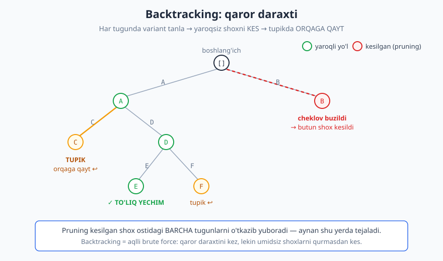
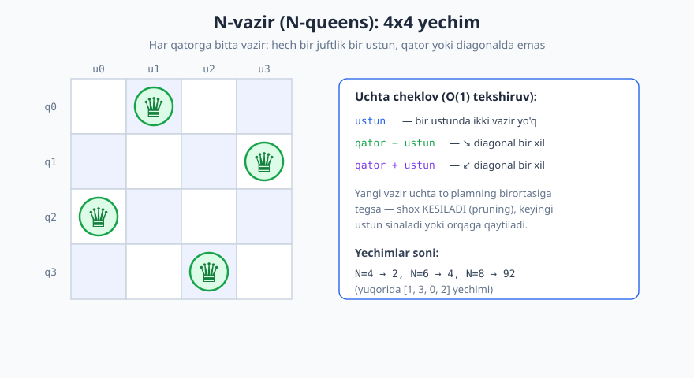

# 26 — Backtracking (orqaga qaytish)

[⬅️ Oldingi: 25 — Dinamik dasturlash (DP)](./25-dinamik-dasturlash.md) · [🏠 README](./README.md) · [Keyingi: 27 — Saralash algoritmlari ➡️](./27-saralash-algoritmlari.md)

---

> **Bu bobda:** Backtracking — yechimni **qadamba-qadam** qurib boradigan, har qadamda variant tanlaydigan va tanlov boshi berk ko'chaga olib kelsa **orqaga qaytib** boshqasini sinaydigan paradigma. Bu — "aqlli brute force": qaror daraxtini kezamiz, lekin yaroqsiz shoxlarni darhol **kesib tashlaymiz** (pruning). Umumiy shablonni o'rganamiz, so'ng klassik masalalarni (permutatsiyalar, qism-to'plamlar, kombinatsiyalar, **N-vazir**, Sudoku, labirint, kombinatsion yig'indi) Python bilan yechamiz. Oxirida pruning, murakkablik va backtracking'ning DP/greedy bilan farqini ko'ramiz.
>
> **Halollik / Eslatma:** Backtracking eng yomon holatda **eksponensial** (yoki faktorial) — bu matematik aniq. Pruning *amalda* ko'p tejaydi, lekin eng yomon nazariy chegarani odatda o'zgartirmaydi. Backtracking to'liq qidiruv bo'lgani uchun **barcha** yoki **optimal** yechimni topishni kafolatlaydi. Barcha Python namunalari haqiqatan ishga tushirib tekshirilgan; ko'rsatilgan chiqishlar kod bergan haqiqiy natijalar (N-vazir yechimlari soni, Sudoku va h.k.).

---

## Backtracking g'oyasi

> **Intuitsiya:** Labirintda yuribsiz. Chorrahaga kelganda bir yo'lni tanlaysiz. Agar u **tupik** (berk ko'cha) bo'lib chiqsa — orqaga, oxirgi chorrahaga **qaytasiz** va boshqa yo'lni sinaysiz. Hech qachon tasodifan yoki butun labirintni xaritasiz aylanib chiqmaysiz — yo'lni *qurib* borasiz, berk chiqsa *bekor qilasiz*. Backtracking aynan shu.

**Backtracking** (orqaga qaytish) — yechimni **bo'lakma-bo'lak** quradigan strategiya. Har qadamda joriy qisman yechimga bitta yangi bo'lak (nomzod) qo'shamiz. Agar bu bo'lak masalaning **cheklovini buzsa** yoki yo'l boshi berk ko'chaga olib kelsa — qo'shilgan bo'lakni **olib tashlaymiz** (undo) va keyingi variantni sinaymiz. Agar qisman yechim to'liq bo'lib qolsa — uni yozamiz.

Bu jarayonni **qaror daraxti** sifatida tasavvur qilish eng to'g'risi: ildiz — bo'sh yechim; har tugundan chiqayotgan shoxlar — keyingi tanlov variantlari; barglar — to'liq yechimlar (yoki tupiklar).



Diagrammada uchta muhim hodisa ko'rsatilgan:

- **Yashil tugunlar** — yaroqli qisman yechim; pastga davom etamiz.
- **Sariq tupik (TUPIK)** — bu shoxdan to'liq yechim chiqmadi; oxirgi tanlovni bekor qilib (`pop`) **orqaga qaytamiz**.
- **Qizil kesilgan shox (pruning)** — tanlov darhol cheklovni buzdi (mas. N-vazirda ikki vazir bir ustunda). Biz bu shoxni **umuman qurmaymiz** — uning ostidagi *butun pastki daraxt* tejaladi.

Mana shu uchinchisi — pruning — backtracking'ni oddiy brute force'dan ajratib turadi va uni amaliy qiladi.

## Brute force'dan farqi

[Brute force](./22-brute-force.md) (22-bob) *barcha* nomzodni **to'liq** qurib, keyin tekshiradi. Backtracking esa qisman yechimni **erta** tekshiradi: agar shu paytdayoq cheklov buzilgan bo'lsa, butun shoxni tashlab yuboradi — to'liq qurishga ham urinmaydi.

```text
BRUTE FORCE:                       BACKTRACKING:
har bir to'liq nomzodni qur        nomzodni bo'lakma-bo'lak qur
    -> keyin tekshir                   -> har bo'lakdan keyin tekshir
                                       -> yaroqsiz bo'lsa: butun shoxni KES
                                          (qolganini qurmaydan tashla)
```

Misol: N-vazir masalasini sof brute force bilan yechsak — `n×n` taxtaga `n` vazirni **barcha** joylashtirish usulini ko'rib chiqishimiz kerak bo'lardi (juda katta). Backtracking esa har qatorga bitta vazir qo'yib, *darhol* "bu vazir oldingilarini urmayaptimi?" deb tekshiradi — urgan bo'lsa, o'sha pozitsiyaga umuman bormaydi. Shu tariqa qidiruv fazosining ulkan qismi yo'q qilinadi.

> **Eslatma:** Backtracking — brute force'ning *qism-turi*. Ikkalasi ham oxir-oqibatda to'liq qidiruv (barcha yaroqli yechimni topa oladi). Farq — **qachon** tekshirishda: backtracking iloji boricha erta tekshirib, umidsiz shoxlarni kesadi. "Aqlli brute force" deyilishining sababi shu.

## Umumiy shablon (template)

Deyarli barcha backtracking masalalari bitta umumiy qolipga tushadi. Uni yaxshilab yodda saqlang — keyin har masala shu qolipning to'ldirilishi bo'lib qoladi:

```text
backtrack(qisman_yechim):
    agar qisman_yechim TO'LIQ:
        yechimni YOZ (yoki eng yaxshisini yangilab qo'y)
        qaytar
    har bir nomzod ∈ keyingi_variantlar(qisman_yechim):
        agar YAROQLI(qisman_yechim, nomzod):       # cheklov tekshiruvi (pruning)
            qisman_yechim.qo'sh(nomzod)            # 1. TANLA
            backtrack(qisman_yechim)               # 2. REKURSIV kez
            qisman_yechim.olib_tashla(nomzod)      # 3. BEKOR QIL (backtrack!)
```

Uch qadamli "tanla → kez → bekor qil" raqsi — backtracking'ning yuragi. Ayniqsa uchinchi qadam (`olib_tashla`) muhim: rekursiya qaytib kelgach, biz qilgan o'zgartirishni **aynan orqaga qaytaramiz**, toki keyingi nomzodni *toza* holatdan sinashimiz mumkin bo'lsin.

> **Diqqat:** `qo'sh` va `olib_tashla` bir-birining **aniq teskarisi** bo'lishi shart. Agar `qo'sh` umumiy holatga (mas. `ishlatildi` to'plami, taxta katagi) o'zgartirish kiritsa, `olib_tashla` aynan o'sha o'zgartirishni qaytarishi kerak. Aks holda "iflos" holat keyingi shoxlarga oqib o'tadi va javob noto'g'ri chiqadi.

Bobning qolgan qismi shu shablonni olti klassik masalada to'ldiradi.

## 1-misol. Permutatsiyalar (barcha tartiblar)

Masala: `[1, 2, 3]` ning barcha tartiblarini (permutatsiyalarini) hosil qiling. Bu — eng yaxshi kirish misoli, chunki qaror daraxti juda aniq ko'rinadi.

G'oya: birinchi pozitsiyaga **ishlatilmagan** har bir elementni qo'yamiz; keyin rekursiv ravishda qolgan pozitsiyalarni to'ldiramiz; qaytib kelgach, qo'ygan elementni "ishlatilmagan" deb belgilab orqaga qaytamiz.

```python
def permutatsiyalar(elementlar):
    natija = []
    n = len(elementlar)
    ishlatildi = [False] * n
    joriy = []

    def backtrack():
        if len(joriy) == n:               # TO'LIQ: barcha pozitsiya to'ldi
            natija.append(joriy[:])       # nusxasini yoz (joriy keyin o'zgaradi!)
            return
        for i in range(n):
            if ishlatildi[i]:
                continue                  # bu element allaqachon ishlatilgan
            ishlatildi[i] = True          # 1. TANLA
            joriy.append(elementlar[i])
            backtrack()                   # 2. KEZ
            joriy.pop()                   # 3. BEKOR QIL
            ishlatildi[i] = False

    backtrack()
    return natija

p = permutatsiyalar([1, 2, 3])
print(len(p))    # -> 6
print(p)         # -> [[1, 2, 3], [1, 3, 2], [2, 1, 3], [2, 3, 1], [3, 1, 2], [3, 2, 1]]
```

![Permutatsiya daraxti: [1,2,3] uchun har darajada tanlov soni bittaga kamayadi, 3 faktorial ya'ni 6 barg](./rasmlar/alg26-permutatsiya.svg)

Diagrammada daraxtning shakli ko'rinadi: birinchi pozitsiyaga 3 variant, ikkinchisiga 2 (bittasi ishlatilgan), uchinchisiga 1 — jami `3 × 2 × 1 = 3! = 6` barg. Har bir barg — bitta to'liq permutatsiya.

**Nega to'g'ri ishlaydi?** `joriy` har doim *yaroqli prefiks* (takrorlanmas tartibning boshi) bo'lib qoladi, chunki `ishlatildi` to'plami bir elementni ikki marta qo'yishga yo'l qo'ymaydi. Daraxtdagi *har bir* barg — uzunligi `n` bo'lgan, takrorsiz tartib — ta'rifi bo'yicha bitta permutatsiya. Daraxt barcha barglarni kezgani uchun barcha permutatsiyalar topiladi.

Bu yerda `joriy[:]` (nusxa olish) muhim: `joriy` ro'yxati rekursiya davomida o'zgarib turadi, shuning uchun uning *o'sha paytdagi* holatini saqlab qolamiz, aks holda `natija` ichidagi hamma element pirovardida bo'sh ro'yxatga ishora qilib qolardi.

Trassirovka (birinchi to'rt qadam, `joriy` va `ishlatildi`):

| Qadam | Amal | joriy | ishlatildi |
|---|---|---|---|
| 1 | `1` qo'shildi | `[1]` | `[T, F, F]` |
| 2 | `2` qo'shildi | `[1, 2]` | `[T, T, F]` |
| 3 | `3` qo'shildi → TO'LIQ, yoz | `[1, 2, 3]` | `[T, T, T]` |
| 4 | `3` olindi, `2` olindi (backtrack) | `[1]` | `[T, F, F]` |
| 5 | `3` qo'shildi | `[1, 3]` | `[T, F, T]` |

## 2-misol. Qism-to'plamlar va kombinatsiyalar

**Qism-to'plamlar.** `[1, 2, 3]` ning barcha qism-to'plamlarini hosil qiling. Bu yerda shablon biroz boshqacha: har bir tugun (har bir qisman yechim) — *o'zi* bir to'liq qism-to'plam, shuning uchun barcha tugunlarni yozamiz, faqat barglarni emas.

```python
def qism_toplamlar(elementlar):
    natija = []
    joriy = []
    n = len(elementlar)

    def backtrack(boshlanish):
        natija.append(joriy[:])           # HAR tugun -> bitta qism-to'plam
        for i in range(boshlanish, n):    # boshlanish: takrorlanmaslik uchun
            joriy.append(elementlar[i])   # TANLA
            backtrack(i + 1)              # KEZ (i+1: oldingilarni qaytarmaymiz)
            joriy.pop()                   # BEKOR QIL

    backtrack(0)
    return natija

s = qism_toplamlar([1, 2, 3])
print(len(s))   # -> 8
print(s)        # -> [[], [1], [1, 2], [1, 2, 3], [1, 3], [2], [2, 3], [3]]
```

`boshlanish` indeksi — pruning'ning soddagina shakli: `[1, 2]` va `[2, 1]` bir xil to'plam bo'lgani uchun biz har doim faqat **oldinga** (kattaroq indeksga) yuramiz, shu bilan dublikatlarni qurmaymiz ham. `n` elementli to'plamda `2ⁿ = 2³ = 8` qism-to'plam.

**Kombinatsiyalar.** `C(n, k)` — `1..n` dan aynan `k` ta element tanlash. Faqat bitta cheklov qo'shamiz: uzunlik `k` ga yetganda yozamiz.

```python
def kombinatsiyalar(n, k):
    natija = []
    joriy = []

    def backtrack(boshlanish):
        if len(joriy) == k:               # TO'LIQ: k ta tanlandi
            natija.append(joriy[:])
            return
        for son in range(boshlanish, n + 1):
            joriy.append(son)             # TANLA
            backtrack(son + 1)            # KEZ
            joriy.pop()                   # BEKOR QIL

    backtrack(1)
    return natija

c = kombinatsiyalar(4, 2)
print(len(c))   # -> 6
print(c)        # -> [[1, 2], [1, 3], [1, 4], [2, 3], [2, 4], [3, 4]]
```

`C(4, 2) = 6` — to'g'ri. E'tibor bering: qism-to'plamlar, kombinatsiyalar va keyingi misollar — hammasi bitta shablonning ozgina o'zgartirilgan ko'rinishi.

> **Trade-off:** Yuqoridagi kodlar `joriy[:]` bilan nusxa oladi (ravshanlik uchun). Agar juda ko'p yechim bo'lsa, bu nusxalar xotirani egallaydi. Ko'pincha yechimlarni saqlash o'rniga *darhol ishlatib* (mas. chop etib yoki sanab) tashlash xotirani tejaydi — backtracking'ning kuchli tomoni: u bir paytda faqat **bitta** qisman yechimni xotirada saqlaydi, daraxtning chuqurligi `O(n)`.

## 3-misol. N-vazir (N-queens) — klassik

Masala: `n×n` shaxmat taxtasiga `n` ta vazirni **bir-birini urmaydigan** qilib joylashtiring. Vazir gorizontal, vertikal va ikkala diagonal bo'yicha yuradi.

Asosiy g'oya — kuchli pruning: **har qatorga aniq bitta vazir** qo'yamiz (chunki ikki vazir bir qatorda bo'lolmaydi). Shunda faqat *ustun* va *diagonallarni* tekshirish qoladi. Ikki katak `(q1, u1)` va `(q2, u2)` bir diagonalda bo'lishi:

- **↘ diagonal:** `q1 − u1 == q2 − u2` (qator − ustun bir xil).
- **↙ diagonal:** `q1 + u1 == q2 + u2` (qator + ustun bir xil).

Shu sababli uchta to'plamda band ustun va diagonallarni `O(1)` da tekshiramiz:

```python
def n_vazir(n):
    yechimlar = []
    ustun = set()
    diag1 = set()    # qator - ustun  (↘)
    diag2 = set()    # qator + ustun  (↙)
    joylashuv = []

    def backtrack(qator):
        if qator == n:                    # TO'LIQ: barcha qatorga vazir qo'yildi
            yechimlar.append(joylashuv[:])
            return
        for u in range(n):
            if u in ustun or (qator - u) in diag1 or (qator + u) in diag2:
                continue                  # PRUNING: bu katak hujum ostida
            ustun.add(u); diag1.add(qator - u); diag2.add(qator + u)   # TANLA
            joylashuv.append(u)
            backtrack(qator + 1)          # KEZ
            joylashuv.pop()               # BEKOR QIL
            ustun.remove(u); diag1.remove(qator - u); diag2.remove(qator + u)

    backtrack(0)
    return yechimlar

for n in [4, 6, 8]:
    print(f"N={n}: {len(n_vazir(n))} ta yechim")
# -> N=4: 2 ta yechim
# -> N=6: 4 ta yechim
# -> N=8: 92 ta yechim
print(n_vazir(4)[0])   # -> [1, 3, 0, 2]
```

Natija `8 → 92` — bu N-vazirning **mashhur to'g'ri javobi** (8-vazir masalasining yechimlari soni 92 ta). `[1, 3, 0, 2]` degani: 0-qatorda vazir 1-ustunda, 1-qatorda 3-ustunda va hokazo.



Diagrammada `[1, 3, 0, 2]` yechimi va uchta cheklov ko'rsatilgan. Pruningning kuchini his qilish uchun: pruningsiz sof brute force `n=8` da `8⁸ = 16 777 216` joylashuvni ko'rardi; backtracking esa atigi **2 057** ta tugunni kezadi — minglab marta kam (buni mashqlarda hisoblaymiz).

> **Isbot (eskiz):** Algoritm har qatorga bitta vazir qo'ygani uchun **gorizontal** cheklov avtomatik qoniqtiriladi. `ustun`, `diag1`, `diag2` to'plamlari vertikal va ikkala diagonal cheklovini qo'shishdan *oldin* tekshiradi, shuning uchun har bir yaroqli qisman joylashuv haqiqatan urishmaydigan. `qator == n` bargi `n` ta urishmaydigan vazir — ta'rifi bo'yicha yechim. Daraxt barcha yaroqli barglarni kezgani uchun barcha yechimlar topiladi.

## 4-misol. Sudoku yechuvchi

Sudoku — backtracking'ning eng tabiiy qo'llanishlaridan. G'oya: birinchi **bo'sh** katakni topib, unga `1..N` dan yaroqli har bir raqamni sinab ko'ramiz; raqamni qo'yib rekursiv davom etamiz; agar boshi berkka tiqilsak — raqamni olib (`= 0`) keyingisini sinaymiz.

Soddalik uchun **4×4** Sudokuni (2×2 qutilar, raqamlar 1..4) ko'rsatamiz; 9×9 ham *aynan* shu kod, faqat o'lcham 9 va quti 3×3.

```python
def yarokli(plata, q, u, son):
    for i in range(4):
        if plata[q][i] == son or plata[i][u] == son:   # qator yoki ustunda bormi
            return False
    qb, ub = (q // 2) * 2, (u // 2) * 2                 # 2x2 quti boshi
    for i in range(qb, qb + 2):
        for j in range(ub, ub + 2):
            if plata[i][j] == son:                      # qutida bormi
                return False
    return True

def sudoku_yech(plata):
    for q in range(4):
        for u in range(4):
            if plata[q][u] == 0:                        # birinchi bo'sh katak
                for son in range(1, 5):
                    if yarokli(plata, q, u, son):
                        plata[q][u] = son               # TANLA
                        if sudoku_yech(plata):          # KEZ
                            return True
                        plata[q][u] = 0                 # BEKOR QIL (backtrack)
                return False                            # 1..4 hech biri yaramadi
    return True                                         # bo'sh katak yo'q -> yechildi

plata = [
    [1, 0, 0, 4],
    [0, 0, 0, 0],
    [0, 0, 0, 0],
    [3, 0, 0, 2],
]
print(sudoku_yech(plata))   # -> True
for r in plata:
    print(r)
# -> [1, 2, 3, 4]
# -> [4, 3, 2, 1]
# -> [2, 1, 4, 3]
# -> [3, 4, 1, 2]
```

E'tibor bering: bo'sh katak qolmasa `True` qaytadi (yechildi). Ag'ar biror katakda barcha raqam yaroqsiz bo'lsa `False` qaytadi, va chaqiruvchi avvalgi tanlovini *bekor qilib* (`= 0`) boshqa raqamni sinaydi. Aynan shu — orqaga qaytish.

> **Eslatma:** Bu yerda `yarokli` funksiyasi — **constraint propagation** (cheklov tarqatish)ning sodda shakli: har raqamni *qo'yishdan oldin* qator/ustun/quti cheklovini tekshirib, yaroqsiz shoxni darhol kesamiz. Murakkabroq Sudoku yechuvchilar bundan ham aqlliroq qoidalar (mas. "eng kam variantli katakdan boshlash") ishlatadi — bu pruningni yanada kuchaytiradi.

## 5-misol. Labirintdan yo'l topish

Masala: `0` — yurish mumkin, `1` — devor bo'lgan gridda yuqori-chap `(0,0)` dan pastki-o'ng burchakkacha yo'l toping. Backtracking: bir yo'nalishni tanlab yuramiz; tupikka tiqilsak — orqaga qaytib boshqa yo'nalishni sinaymiz.

```python
def labirint_yol(grid):
    qatorlar, ustunlar = len(grid), len(grid[0])
    yol = []
    korilgan = [[False] * ustunlar for _ in range(qatorlar)]

    def backtrack(q, u):
        if q < 0 or q >= qatorlar or u < 0 or u >= ustunlar:
            return False                  # tashqarida
        if grid[q][u] == 1 or korilgan[q][u]:
            return False                  # devor yoki allaqachon ko'rilgan
        yol.append((q, u)); korilgan[q][u] = True          # TANLA
        if (q, u) == (qatorlar - 1, ustunlar - 1):
            return True                   # manzilga yetdik!
        for dq, du in [(1, 0), (0, 1), (-1, 0), (0, -1)]:  # past, o'ng, yuqori, chap
            if backtrack(q + dq, u + du):
                return True
        yol.pop()                         # TUPIK -> BEKOR QIL (orqaga qayt)
        return False

    return yol if backtrack(0, 0) else None

grid = [
    [0, 0, 1, 0],
    [1, 0, 1, 0],
    [0, 0, 0, 0],
    [0, 1, 1, 0],
]
print(labirint_yol(grid))
# -> [(0, 0), (0, 1), (1, 1), (2, 1), (2, 2), (2, 3), (3, 3)]
```

`korilgan` jadvali — siklga (bir katakka qayta-qayta kirib qolish) qarshi himoya. `yol.pop()` — tupikdan orqaga qaytishning aniq ifodasi: shu katak yaxshi yo'lga olib bormagani uchun uni yo'ldan olib tashlaymiz.

Bir o'zgartirish bilan bu kod **grid'da so'z qidirish** masalasini ham yechadi (so'z harflarini qo'shni kataklar bo'ylab tutashtirish): har bargda harfni mos kelishini tekshirib, mos kelmasa shoxni kesamiz, qaytishda katakni *tiklab* qo'yamiz. Mashqlarda buni ko'ramiz.

## 6-misol. Kombinatsion yig'indi

Masala: musbat sonlar ro'yxati `nomzodlar` va `nishon` berilgan; har sondan **istalgancha** marta ishlatib, yig'indisi `nishon`ga teng bo'lgan barcha kombinatsiyalarni toping. Bu yerda pruning ayniqsa chiroyli ko'rinadi.

```python
def kombinatsion_yigindi(nomzodlar, nishon):
    natija = []
    nomzodlar = sorted(nomzodlar)         # PRUNING uchun saralaymiz
    joriy = []

    def backtrack(boshlanish, qoldiq):
        if qoldiq == 0:                   # TO'LIQ: nishonga aniq yetdik
            natija.append(joriy[:])
            return
        for i in range(boshlanish, len(nomzodlar)):
            if nomzodlar[i] > qoldiq:     # PRUNING: saralangan -> qolganlari ham katta
                break                     # bu va undan keyingilarni kesamiz
            joriy.append(nomzodlar[i])    # TANLA
            backtrack(i, qoldiq - nomzodlar[i])   # i: shu sonni qayta ishlatish mumkin
            joriy.pop()                   # BEKOR QIL

    backtrack(0, nishon)
    return natija

print(kombinatsion_yigindi([2, 3, 6, 7], 7))
# -> [[2, 2, 3], [7]]
```

`break` — bu **constraint propagation**ning yaqqol misoli: ro'yxat saralangani uchun, agar joriy son `qoldiq`dan katta bo'lsa, undan *keyingi* sonlar ham albatta kattaroq, demak hammasini birdaniga kesamiz. Bu pruning amalda tugunlar sonini sezilarli kamaytiradi (mashqlarda o'lchaymiz: bu kichik misolda 10 tugun, sodda variantda 28).

## Pruning — kesib tashlash

Yuqoridagi misollar yashirin bir haqiqatni ko'rsatadi: **backtracking samaradorligi to'liq pruning sifatiga bog'liq.** Cheklovni qancha *erta* tekshirsangiz, shuncha katta pastki daraxtni kesib, shuncha ko'p ish tejaysiz.

Pruning'ning umumiy turlari:

- **Yaroqlilik cheklovi (feasibility):** joriy qisman yechim cheklovni buzsa, davom etmaymiz (N-vazirda ustun/diagonal, Sudokuda qator/ustun/quti).
- **Chegara cheklovi (bound):** "bu shoxdan eng yaxshi javob ham hozirgi eng yaxshimdan yomon" — butun shoxni tashlaymiz. Bu — **branch and bound** g'oyasi (optimallashtirish masalalarida).
- **Tartib bilan kesish:** kombinatsion yig'indidagi `break` kabi — saralanganlikdan foydalanib, bir butun "dum"ni birdaniga kesish.

> **Anti-pattern:** Pruningni *butun nomzod qurilgandan keyin* tekshirish — bu backtracking emas, oddiy brute force. Backtracking'ning butun foydasi cheklovni **iloji boricha erta** (har bo'lakdan keyin) tekshirishda. Cheklovni faqat bargda tekshirsangiz, kod to'g'ri ishlaydi-yu, lekin tezligi yo'qoladi.

> **Trade-off:** Kuchliroq pruning kamroq tugun beradi, lekin har tugunda ko'proq tekshirish narxini qo'shadi. Maqsad — bu ikkisining mahsulotini (jami ish) minimallashtirish. Ko'pincha `O(1)` da tekshiriladigan oddiy yaroqlilik cheklovi (to'plam orqali, N-vazirdagidek) eng yaxshi muvozanat.

## Murakkablik

Backtracking — to'liq qidiruv bo'lgani uchun eng yomon holatda murakkablik **qaror daraxtining hajmiga** teng, ya'ni odatda eksponensial yoki faktorial:

| Masala | Eng yomon holat | Izoh |
|---|---|---|
| Permutatsiyalar | `O(n! · n)` | `n!` barg, har birini nusxalash `O(n)` |
| Qism-to'plamlar | `O(2ⁿ · n)` | `2ⁿ` qism-to'plam |
| N-vazir | `O(n!)` (yuqori chegara) | har qatorda ≤ `n` tanlov, pruning bilan amalda ancha kam |
| Sudoku (9×9) | eksponensial | amalda pruning bilan tez |

Ikki muhim nuqta:

1. **Pruning eng yomon nazariy chegarani odatda o'zgartirmaydi**, lekin *amaliy* ishni dramatik kamaytiradi. N-vazirda `8⁸ ≈ 16.8 million` o'rniga atigi ~2057 tugun — bu pruningning amaldagi kuchi, garchi nazariy "yomon holat" baribir eksponensial bo'lsa ham.
2. **Xotira `O(n)`** (daraxt chuqurligi) — backtracking bir paytda faqat bitta yo'lni (ildizdan joriy tugungacha) xotirada saqlaydi. Bu uning DP'dan (ko'pincha `O(n·m)` jadval) ustunligi.

> **Diqqat:** Backtracking eksponensial bo'lgani uchun u faqat **kichik** kirishlarda yoki **kuchli pruning** mavjud bo'lganda amaliy. `n` katta bo'lsa va pruning kuchsiz bo'lsa — boshqa paradigma (DP, greedy) yoki yaqinlashtiruvchi (approximation) yechim kerak. Ko'p backtracking masalalari aslida [NP-qiyin](./32-p-np-murakkablik-nazariyasi.md) — ya'ni hech kim ular uchun polinomial aniq algoritm topa olmagan.

## Backtracking vs DP vs greedy

Uchala paradigma ham qaror ketma-ketligini quradi, lekin maqsad va usul boshqacha:

| | Qachon ishlatamiz | Usul |
|---|---|---|
| **Backtracking** | **Barcha** yechimni sanash kerak; yoki cheklovli qoniqtirish (CSP) — N-vazir, Sudoku; yoki to'liq qidiruvdan boshqa yo'l yo'q | Qaror daraxtini kez + pruning; yaroqsiz shoxni bekor qil |
| **[Dinamik dasturlash](./25-dinamik-dasturlash.md)** | **Takrorlanuvchi qism-masalalar** bor; bitta optimal qiymat/son kerak | Qism-masalalar javobini eslab qol, qayta hisoblama |
| **[Greedy](./24-greedy.md)** | **Har qadamdagi mahalliy** eng yaxshi tanlov global optimalga olib keladi (isbotlanadigan xossa) | Har qadamda eng yaxshini ol, orqaga qaytma |

Qisqacha farq:

- **Greedy** — orqaga *qaytmaydi*: har qadamda bir tanlov qiladi va davom etadi. Tez (odatda `O(n log n)`), lekin faqat maxsus masalalarda to'g'ri.
- **DP** — barcha qism-masalalarni hisoblaydi, lekin *takrorlanmaydi* (memoizatsiya). Bitta optimal qiymatni samarali topadi, ammo *barcha* yechimni sanash uchun emas.
- **Backtracking** — *barcha* yaroqli yo'lni kezadi (orqaga qaytib), pruning bilan yaroqsizlarini tashlaydi. Eng umumiy va eng sekin, lekin barcha/optimal yechimni kafolatlaydi.

> **Eslatma:** Ba'zan masala bir nechta paradigmaga mos keladi. Mas. kichik knapsack'ni backtracking + branch-and-bound bilan ham, DP bilan ham yechish mumkin. Tanlov: bitta optimal qiymat kerakmi (DP) yoki barcha optimal *yechimlar* kerakmi (backtracking), va `n` qanchaligi.

## Asosiy g'oyalar (bobni qisqacha)

- **Backtracking** — yechimni qadamba-qadam qurib, har qadamda variant tanlab, tupikka tiqilsa **orqaga qaytib** (tanlovni bekor qilib) boshqasini sinaydigan paradigma. "Aqlli brute force".
- **Shablon:** `agar TO'LIQ -> yoz; aks holda har nomzod uchun: agar YAROQLI -> TANLA, KEZ (rekursiya), BEKOR QIL`. Uchinchi qadam (bekor qilish) — backtracking'ning belgisi.
- **Brute force'dan farq:** backtracking cheklovni *erta* (har bo'lakdan keyin) tekshiradi va yaroqsiz shoxni butunlay **kesadi (pruning)** — to'liq qurishga urinmaydi.
- Klassik masalalar: **permutatsiyalar** (`n!`), **qism-to'plamlar** (`2ⁿ`), **kombinatsiyalar** (`C(n,k)`), **N-vazir** (8 → 92 yechim), **Sudoku**, **labirint/so'z qidirish**, **kombinatsion yig'indi** — hammasi bitta shablon.
- **Pruning** samaradorlikning kaliti: cheklovni qancha erta tekshirsang, shuncha katta pastki daraxt kesiladi. Tartibdan foydalanib kesish (`break`), yaroqlilik va chegara cheklovlari.
- **Murakkablik:** eng yomon holatda eksponensial/faktorial; xotira `O(n)` (chuqurlik). Pruning eng yomon chegarani odatda o'zgartirmaydi, lekin amalda dramatik tejaydi.
- Backtracking **barcha** yoki **optimal** yechimni kafolatlaydi — barcha yechimni sanash kerak bo'lganda yoki cheklovli qoniqtirish (CSP) masalalarida tanlanadi.

## Mashqlar

### Oson

**1-mashq.** `[A, B, C]` ning permutatsiyalari qaror daraxtini (qog'ozda) chizing. Nechta barg bor? Umuman `n` element uchun nechta? Formulani ayting.

**2-mashq.** Backtracking shablonidagi uchta asosiy qadamni (TANLA, KEZ, BEKOR QIL) o'z so'zlaringiz bilan tushuntiring. Nega "BEKOR QIL" qadami **zarur**? Agar uni unutib qoldirsak nima bo'ladi?

**3-mashq.** Quyidagilardan qaysi biri pruning (kesib tashlash)ning misoli? (a) N-vazirda yangi vazir oldingisini urganini ko'rib, o'sha ustunni o'tkazib yuborish; (b) barcha permutatsiyalarni qurib bo'lgach, yaroqsizlarini o'chirish; (c) kombinatsion yig'indida saralangan ro'yxatda `nomzod > qoldiq` bo'lsa `break`. Har birini "ha/yo'q" deb javob bering va nega.

### O'rta

**4-mashq.** `[1, 2, 2]` (takror element bor!) ning **noyob** permutatsiyalarini qaytaruvchi funksiya yozing. Oddiy permutatsiya kodi `[1,2,2]` ni necha marta, sizning kodingiz necha marta qaytaradi? (Maslahat: bir darajada bir xil qiymatni ikki marta tanlamaslik uchun pruning qo'shing.)

**5-mashq.** Kombinatsion yig'indi kodida `break` ni `continue` ga almashtirsangiz, javob to'g'ri qoladimi? Tezlik o'zgaradimi? Nega? (Maslahat: saralanganlik nimani kafolatlaydi.)

**6-mashq.** Grid'da **so'z qidirish** funksiyasini yozing: berilgan so'z gridda qo'shni (yuqori/past/chap/o'ng) kataklar orqali tutashib chiqadimi? Bir katakni ikki marta ishlatib bo'lmaydi. Pruning qayerda? Backtrack (tiklash) qadami qayerda?

### Qiyin

**7-mashq.** N-vazir kodini o'zgartirib, har bir `n` (4..8) uchun **nechta tugun** kezilishini sanang. Buni `8⁸ = 16 777 216` (pruningsiz to'liq qidiruv) bilan solishtiring. Pruning necha barobar tejadi?

**8-mashq.** 4×4 Sudoku yechuvchini ishga tushiring va `sudoku_yech` rekursiyasi necha marta chaqirilishini sanang. So'ng "eng kam variantli bo'sh katakdan boshlash" (most-constrained-variable) evristikasini qo'shsangiz, bu son qanday o'zgaradi deb o'ylaysiz? (Tahlil; kod ixtiyoriy.)

**9-mashq.** Kombinatsion yig'indida pruning samarasini o'lchang: bir versiya `break` (pruning bilan), boshqasi pruningsiz (har shoxga kirib, `qoldiq < 0` da to'xtaydigan) — `[2, 3, 6, 7]`, `nishon = 7` uchun har biri necha tugun kezadi? Pruning qancha tejaydi?

<details markdown="1">
<summary>Yechimlar</summary>

### 1-mashq yechimi

Daraxt: ildizdan 3 shox (`A`, `B`, `C` — 1-pozitsiya), har biridan 2 shox (qolgan 2 element), har biridan 1 shox. Barglar: `3 × 2 × 1 = 6` ta. Ular: `ABC, ACB, BAC, BCA, CAB, CBA`.

Umuman `n` element uchun barglar (permutatsiyalar) soni `n!` — chunki 1-pozitsiyaga `n` variant, 2-pozitsiyaga `n−1`, ..., oxirgisiga `1`.

### 2-mashq yechimi

- **TANLA:** joriy qisman yechimga bitta nomzodni qo'shamiz (va kerakli umumiy holatni — `ishlatildi`, taxta katagi — yangilaymiz).
- **KEZ:** shu yangi qisman yechimdan rekursiv davom etamiz (pastki daraxtni o'rganamiz).
- **BEKOR QIL:** rekursiya qaytgach, qo'shgan nomzodni *olib tashlaymiz* va o'zgartirilgan holatni qaytaramiz.

"BEKOR QIL" **zarur**, chunki shundan keyin biz *boshqa* nomzodni *toza* boshlang'ich holatdan sinashimiz kerak. Agar uni unutsak, oldingi tanlovning "izi" (mas. `ishlatildi`da `True` qolib ketgan element, yoki taxtadagi qo'yilgan vazir) keyingi shoxlarga oqib o'tadi — natijada yechimlar noto'g'ri yoki kam chiqadi. Holat "iflos"lanadi.

### 3-mashq yechimi

- **(a) Ha** — yangi vazir cheklovni buzganini ko'rib, *o'sha shoxga kirmaymiz*. Bu — yaroqlilik pruning'i.
- **(b) Yo'q** — bu pruning emas, balki sof brute force: hamma narsani qurib bo'lib, keyin yaroqsizini tashlash. Pruning aynan *qurishdan oldin* kesishdir.
- **(c) Ha** — saralanganlikdan foydalanib, joriy va undan keyingi barcha (kattaroq) nomzodlarni birdaniga kesish. Bu — tartib bilan pruning.

### 4-mashq yechimi

Avval saralaymiz, so'ng bir darajada bir xil qiymatni ikki marta tanlamaymiz (yondosh dublikatlarni o'tkazib yuboramiz):

```python
def noyob_permutatsiyalar(elementlar):
    elementlar = sorted(elementlar)       # dublikatlar yondosh bo'lsin
    natija = []
    n = len(elementlar)
    ishlatildi = [False] * n
    joriy = []

    def backtrack():
        if len(joriy) == n:
            natija.append(joriy[:])
            return
        for i in range(n):
            if ishlatildi[i]:
                continue
            # PRUNING: oldingi bir xil qiymat ishlatilmagan bo'lsa -> o'tkaz
            if i > 0 and elementlar[i] == elementlar[i - 1] and not ishlatildi[i - 1]:
                continue
            ishlatildi[i] = True
            joriy.append(elementlar[i])
            backtrack()
            joriy.pop()
            ishlatildi[i] = False

    backtrack()
    return natija

print(noyob_permutatsiyalar([1, 2, 2]))   # -> [[1, 2, 2], [2, 1, 2], [2, 2, 1]]
print(len(noyob_permutatsiyalar([1, 2, 2])))   # -> 3
```

Oddiy permutatsiya kodi `[1,2,2]` ni `3! = 6` marta qaytaradi (ikkala `2` ni farqli deb), lekin ulardan faqat **3** tasi noyob. Pruning bilan kod aynan 3 tasini qaytaradi. Pruning sharti: "agar oldingi bir xil qiymat *hozir ishlatilmayotgan* bo'lsa, joriysini tanlamaymiz" — bu bir darajada bir xil qiymatni faqat *bir tartibda* ishlatishni ta'minlaydi.

### 5-mashq yechimi

Javob **to'g'ri qoladi**: `continue` ham `nomzodlar[i] > qoldiq` bo'lgan sonni o'tkazib yuboradi, demak yaroqsiz shox baribir qurilmaydi. Lekin **tezlik yomonlashadi**: ro'yxat saralangani uchun, agar `nomzodlar[i] > qoldiq` bo'lsa, undan *keyingi* barcha sonlar ham `qoldiq`dan katta — ularning hammasi ham o'tkazib yuboriladi. `break` bularning barchasini *birdaniga* to'xtatadi (`O(1)`), `continue` esa har birini *alohida* tekshirib o'tadi (bekorga aylanish). Demak `break` — to'g'riligini saqlab, ortiqcha iteratsiyalarni kesadi. Saralanganlik aynan shu kafolatni beradi.

### 6-mashq yechimi

```python
def soz_bormi(plata, soz):
    qatorlar, ustunlar = len(plata), len(plata[0])

    def backtrack(q, u, idx):
        if idx == len(soz):
            return True                   # butun so'z topildi
        if q < 0 or q >= qatorlar or u < 0 or u >= ustunlar:
            return False
        if plata[q][u] != soz[idx]:       # PRUNING: harf mos kelmadi -> kes
            return False
        belgi = plata[q][u]
        plata[q][u] = "#"                 # TANLA: tashrif belgisi (qayta ishlatmaslik)
        topildi = (backtrack(q + 1, u, idx + 1) or backtrack(q - 1, u, idx + 1)
                   or backtrack(q, u + 1, idx + 1) or backtrack(q, u - 1, idx + 1))
        plata[q][u] = belgi               # BEKOR QIL: belgini tikla
        return topildi

    for q in range(qatorlar):
        for u in range(ustunlar):
            if backtrack(q, u, 0):
                return True
    return False

plata = [["A", "B", "C", "E"],
         ["S", "F", "C", "S"],
         ["A", "D", "E", "E"]]
print(soz_bormi([r[:] for r in plata], "ABCCED"))   # -> True
print(soz_bormi([r[:] for r in plata], "ABCB"))     # -> False
```

- **Pruning:** `plata[q][u] != soz[idx]` — harf mos kelmasa, shu shoxni darhol kesamiz (rekursiyaga umuman kirmaymiz).
- **Backtrack (tiklash):** `plata[q][u] = belgi` — rekursiyadan qaytgach katakni asl harfiga tiklaymiz, toki u *boshqa* yo'lda yana ishlatilishi mumkin bo'lsin. (Vaqtincha `"#"` qo'yish — bir yo'l ichida bir katakni ikki marta ishlatmaslik uchun.)

### 7-mashq yechimi

```python
def nq_tugunlar(n):
    cnt = [0]
    ust, d1, d2 = set(), set(), set()
    def bt(r):
        cnt[0] += 1
        if r == n:
            return
        for u in range(n):
            if u in ust or (r - u) in d1 or (r + u) in d2:
                continue
            ust.add(u); d1.add(r - u); d2.add(r + u)
            bt(r + 1)
            ust.remove(u); d1.remove(r - u); d2.remove(r + u)
    bt(0)
    return cnt[0]

for n in range(4, 9):
    print(f"N={n}: {nq_tugunlar(n)} tugun")
# -> N=4: 17 tugun
# -> N=5: 54 tugun
# -> N=6: 153 tugun
# -> N=7: 552 tugun
# -> N=8: 2057 tugun
```

`n=8` da backtracking atigi **2057** tugun kezadi, pruningsiz to'liq qidiruv esa `8⁸ = 16 777 216` joylashuvni ko'rardi. Tejash: `16 777 216 / 2057 ≈ 8156` barobar. Mana shu — pruningning amaldagi kuchi: nazariy "yomon holat" eksponensial bo'lsa-da, real ishni minglab marta kamaytiradi.

### 8-mashq yechimi

Berilgan `plata` uchun `sudoku_yech` chaqiruvlari sonini sanaymiz:

```python
chaqiruvlar = [0]
def yarokli(plata, q, u, son):
    for i in range(4):
        if plata[q][i] == son or plata[i][u] == son:
            return False
    qb, ub = (q // 2) * 2, (u // 2) * 2
    for i in range(qb, qb + 2):
        for j in range(ub, ub + 2):
            if plata[i][j] == son:
                return False
    return True

def sudoku_yech(plata):
    chaqiruvlar[0] += 1
    for q in range(4):
        for u in range(4):
            if plata[q][u] == 0:
                for son in range(1, 5):
                    if yarokli(plata, q, u, son):
                        plata[q][u] = son
                        if sudoku_yech(plata):
                            return True
                        plata[q][u] = 0
                return False
    return True

plata = [[1,0,0,4],[0,0,0,0],[0,0,0,0],[3,0,0,2]]
sudoku_yech(plata)
print(chaqiruvlar[0])   # -> 14
```

Bu kichik misolda 14 ta chaqiruv. **Most-constrained-variable** evristikasi (eng kam yaroqli variantli bo'sh katakdan boshlash) chaqiruvlar sonini **kamaytiradi**: eng "qattiq" katakni avval to'ldirib, yaroqsiz shoxlarni daraxtning yuqorisida (kichikroq pastki daraxt bilan) kesamiz. Tartibsiz (birinchi bo'sh katak) tanlovga nisbatan bu odatda tugunlar sonini sezilarli kamaytiradi — chunki tezroq qarama-qarshilikka duch kelib, butun shoxni erta tashlaymiz. Katta (9×9 va qiyin) Sudokularda bu farq dramatik bo'ladi.

### 9-mashq yechimi

```python
def pruning_bilan(nomzodlar, nishon):
    nomzodlar = sorted(nomzodlar)
    tugunlar = [0]
    def bt(boshlanish, qoldiq):
        tugunlar[0] += 1
        if qoldiq == 0:
            return
        for i in range(boshlanish, len(nomzodlar)):
            if nomzodlar[i] > qoldiq:     # PRUNING
                break
            bt(i, qoldiq - nomzodlar[i])
    bt(0, nishon)
    return tugunlar[0]

def pruningsiz(nomzodlar, nishon):
    nomzodlar = sorted(nomzodlar)
    tugunlar = [0]
    def bt(boshlanish, qoldiq):
        tugunlar[0] += 1
        if qoldiq <= 0:                   # faqat manfiyga tushganda to'xtaydi
            return
        for i in range(boshlanish, len(nomzodlar)):
            bt(i, qoldiq - nomzodlar[i])
    bt(0, nishon)
    return tugunlar[0]

print(pruning_bilan([2, 3, 6, 7], 7))   # -> 10
print(pruningsiz([2, 3, 6, 7], 7))      # -> 28
```

Pruning bilan **10** tugun, pruningsiz **28** tugun — pruning bu kichik misolda ~2.8 barobar tejadi. `nishon` katta bo'lsa yoki ko'p nomzod bo'lsa, bu farq tez o'sadi: pruningsiz versiya manfiy `qoldiq`gacha bemaqsad chuqurlashadi, pruningli versiya esa "umidsiz" shoxlarga umuman kirmaydi. Bu — backtracking samaradorligi to'g'ridan-to'g'ri pruning sifatiga bog'liqligini ko'rsatadi.

</details>

---

[⬅️ Oldingi: 25 — Dinamik dasturlash (DP)](./25-dinamik-dasturlash.md) · [🏠 README](./README.md) · [Keyingi: 27 — Saralash algoritmlari ➡️](./27-saralash-algoritmlari.md)
