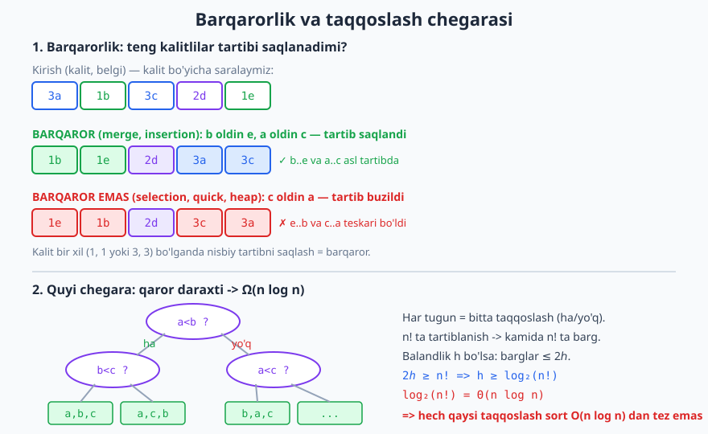
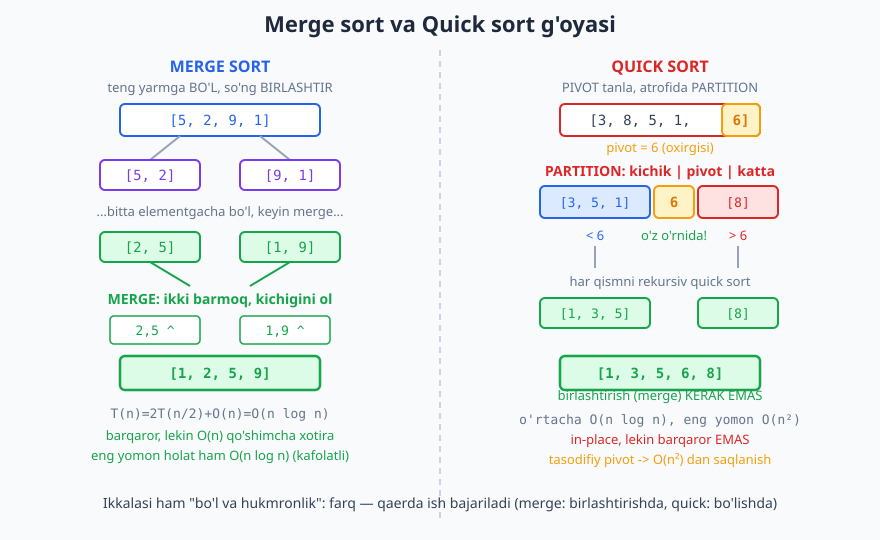
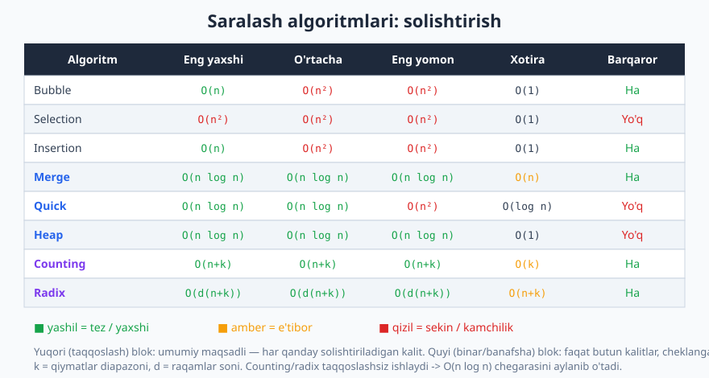

# 27 — Saralash algoritmlari

[⬅️ Oldingi: 26 — Backtracking (orqaga qaytish)](./26-backtracking.md) · [🏠 README](./README.md) · [Keyingi: 28 — Qidiruv algoritmlari ➡️](./28-qidiruv-algoritmlari.md)

---

> **Bu bobda:** Kompyuter fanidagi eng ko'p o'rganilgan masala — **saralash** (sorting) — bilan tanishamiz. Oddiy `O(n²)` algoritmlardan (bubble, selection, insertion) boshlab, samarali `O(n log n)` algoritmlarga (merge, quick, heap) o'tamiz; har birining g'oyasini, nega to'g'ri ishlashini va narxini ko'ramiz. Keyin chuqur nazariy natijani isbotlaymiz: **taqqoslashga asoslangan har qanday saralash kamida `Ω(n log n)` taqqoslash qiladi**. Nihoyat, bu chegarani aylanib o'tadigan chiziqli saralashlarni (counting, radix, bucket) va "qaysi algoritm qachon" degan amaliy savolni qamraymiz.
>
> **Halollik / Eslatma:** Barcha murakkablik chegaralari (`O(n²)`, `O(n log n)`, `Ω(n log n)` quyi chegara, counting `O(n+k)`, radix `O(d(n+k))`) matematik aniq va shu yerda isbot eskizlari bilan keltirilgan. Barqarorlik (stability) haqidagi har bir da'vo standart amalga oshirishga tegishli — boshqacha yozilsa o'zgarishi mumkin, buni alohida ta'kidlaymiz. Barcha Python namunalari haqiqatan ishga tushirib tekshirilgan: har bir kod 200 ta tasodifiy massivda Python'ning o'rnatilgan `sorted()` natijasiga teng chiqishi tasdiqlangan; ko'rsatilgan chiqishlar kod chiqargan haqiqiy qiymatlar.

---

## Saralash nima va nega u markaziy

**Saralash** — elementlarni biror tartib (odatda kalit bo'yicha o'sish) bo'yicha joylashtirish. `[5, 2, 9, 1, 7]` -> `[1, 2, 5, 7, 9]`. Ko'rinishidan oddiy, lekin u algoritmika dunyosining markazida turadi, va buning sababi bor.

**Sabab 1 — saralangan ma'lumotda boshqa amallar tezlashadi.** Saralanmagan massivda elementni topish uchun hammasini ko'rib chiqish kerak (`O(n)`). Saralangan massivda esa [binar qidiruv](./28-qidiruv-algoritmlari.md) `O(log n)` da topadi. Ikki ro'yxatning umumiy elementlarini topish, dublikatlarni o'chirish, eng yaqin juftlikni izlash, median topish — bularning hammasi saralashdan keyin osonlashadi. Ko'plab [greedy](./24-greedy.md) algoritmlar (masalan, intervallarni rejalashtirish) birinchi qadami sifatida saralaydi.

**Sabab 2 — saralash o'zi ko'p g'oyalarning poligoni.** [Bo'l va hukmronlik qil](./23-divide-and-conquer.md) (merge sort), tasodifiylashtirish (quick sort), maxsus ma'lumot strukturasi (heap sort), quyi chegara isboti (qaror daraxti) — bularning barchasi saralash kontekstida o'rganiladi. Shuning uchun saralash — algoritm tahlilini o'rganishning eng yaxshi mavzusi.

> **Eslatma:** Amalda siz deyarli hech qachon saralashni o'zingiz yozmaysiz — har bir til tayyor, juda optimallashtirilgan funksiya beradi (Python `sorted()`, Java `Arrays.sort`). Lekin **ular qanday ishlashini bilish** — kalit. Qaysi algoritm barqaror, qaysisi xotira talab qiladi, qaysisi eng yomon holatda sekinlashadi — buni bilmasangiz, noto'g'ri vositani tanlaysiz yoki sekin kodning sababini topa olmaysiz.

## O'lchovlar: algoritmlarni nima bilan solishtiramiz

Saralash algoritmini baholashda to'rt o'lchov muhim:

1. **Vaqt murakkabligi** — eng yaxshi, o'rtacha, eng yomon holatlar uchun. [Asimptotik notatsiya](./08-asimptotik-notatsiya.md)da o'lchaymiz.
2. **Qo'shimcha xotira** — algoritm massivdan tashqari qancha joy talab qiladi. **In-place** (joyida) algoritm `O(1)` yoki `O(log n)` qo'shimcha xotira ishlatadi; merge sort esa `O(n)` qo'shimcha massiv talab qiladi.
3. **Barqarorlik (stability)** — bu eng ko'p e'tibordan chetda qoladigan, ammo amalda muhim xossa. Algoritm **barqaror** (stable) deyiladi, agar **teng kalitli elementlarning bir-biriga nisbatan boshlang'ich tartibini saqlasa**. Pastda batafsil ko'ramiz.
4. **Taqqoslashga asoslanganmi** — algoritm faqat "a < b mi?" degan taqqoslash bilan ishlaydimi (umumiy), yoki kalit qiymatining tuzilishidan foydalanadimi (counting/radix — faqat butun sonlar uchun).

### Barqarorlik nima va nega muhim

Faraz qilaylik, xodimlar ro'yxatini avval **ism** bo'yicha saralagansiz. Endi uni **bo'lim** bo'yicha qayta saralayapsiz. Agar saralash **barqaror** bo'lsa, bir bo'limdagi xodimlar o'zaro **ism tartibida** qoladi — chunki teng kalitlilar (bir xil bo'lim) o'z navbatini buzmaydi. Barqaror bo'lmasa, ism tartibi yo'qoladi.

```python
data = [(3, 'a'), (1, 'b'), (3, 'c'), (2, 'd'), (1, 'e')]
barqaror = sorted(data, key=lambda t: t[0])   # Python sorted = barqaror
print(barqaror)
# -> [(1, 'b'), (1, 'e'), (2, 'd'), (3, 'a'), (3, 'c')]
```

E'tibor bering: `(1, 'b')` `(1, 'e')` dan oldin keladi (boshlang'ich tartibdek), va `(3, 'a')` `(3, 'c')` dan oldin. Teng kalitli juftlarning ichki tartibi saqlandi — bu **barqarorlik**.



> **Diqqat:** "Barqaror" so'zi bu yerda "ishonchli/yiqilmaydigan" degani EMAS. U faqat teng kalitlilar tartibiga tegishli texnik atama.

## Oddiy `O(n²)` algoritmlar

Uchta klassik "maktab" algoritmi bilan boshlaymiz. Ular sekin, lekin tushunish oson va kichik massivlarda amalda ham foydali.

### 1. Bubble sort (pufakcha saralash)

**G'oya:** Massivni ko'p marta ayl ko'rib chiqamiz; har qarashda **qo'shni juftlarni** solishtirib, tartibsizini almashtirib chiqamiz. Har bir to'liq o'tishdan keyin eng katta element o'ng chetga "pufakcha kabi qalqib chiqadi". Hech narsa almashmasa — massiv saralangan, to'xtaymiz.

```python
def bubble_sort(a):
    a = a[:]                       # nusxa olamiz (asl massivga tegmaymiz)
    n = len(a)
    for i in range(n - 1):
        almashdi = False
        for j in range(n - 1 - i): # har o'tishda oxiri saralangan
            if a[j] > a[j + 1]:
                a[j], a[j + 1] = a[j + 1], a[j]
                almashdi = True
        if not almashdi:           # almashish bo'lmadi -> saralangan
            break
    return a

print(bubble_sort([5, 2, 9, 1, 5, 6]))
# -> [1, 2, 5, 5, 6, 9]
```

**Trassirovka** `[5, 1, 4, 2, 8]` uchun (har bir to'liq o'tishdan keyingi holat):

| O'tish | Massiv holati |
|---|---|
| Boshlang'ich | `[5, 1, 4, 2, 8]` |
| 1-o'tish | `[1, 4, 2, 5, 8]` |
| 2-o'tish | `[1, 2, 4, 5, 8]` |
| 3-o'tish | `[1, 2, 4, 5, 8]` (almashish yo'q -> to'xtaydi) |

**Murakkablik:** Eng yomon va o'rtacha `O(n²)` (ichkarida `~n²/2` taqqoslash). Eng yaxshi holat (allaqachon saralangan) — `almashdi` flagi tufayli `O(n)`. **Xotira `O(1)`, in-place. Barqaror** — biz faqat `a[j] > a[j+1]` da almashtiramiz (qat'iy katta), teng elementlar joyidan jilmaydi.

### 2. Selection sort (tanlash bilan saralash)

**G'oya:** Saralanmagan qismdan **eng kichik** elementni topib, uni saralanmagan qismning boshiga olib qo'yamiz. Keyin saralangan chegarani bir qadam o'ngga suramiz va takrorlaymiz.

```python
def selection_sort(a):
    a = a[:]
    n = len(a)
    for i in range(n):
        min_idx = i
        for j in range(i + 1, n):  # qolgan qismdan eng kichikni izlash
            if a[j] < a[min_idx]:
                min_idx = j
        a[i], a[min_idx] = a[min_idx], a[i]   # boshiga olib qo'yamiz
    return a

print(selection_sort([5, 2, 9, 1, 5, 6]))
# -> [1, 2, 5, 5, 6, 9]
```

**Trassirovka** `[5, 2, 9, 1]` uchun:

| `i` | Topilgan min | Almashtirishdan keyin |
|---|---|---|
| 0 | `1` (indeks 3) | `[1, 2, 9, 5]` |
| 1 | `2` (indeks 1) | `[1, 2, 9, 5]` |
| 2 | `5` (indeks 3) | `[1, 2, 5, 9]` |
| 3 | `9` | `[1, 2, 5, 9]` |

**Murakkablik:** Har doim `O(n²)` taqqoslash — hatto saralangan massivda ham (eng kichikni topish uchun qolganini to'liq ko'rib chiqadi). Lekin **almashtirishlar soni faqat `O(n)`** — bu uning bitta afzalligi (yozish qimmat bo'lgan holatlarda). **In-place, xotira `O(1)`.**

> **Diqqat — barqaror EMAS (odatda).** Uzoq almashtirish teng elementning tartibini buzishi mumkin. Masalan `[(3,'a'), (3,'b'), (1,'c')]` da birinchi qadamda `(1,'c')` boshiga ko'chiriladi va `(3,'a')` 3-o'ringa uchadi — endi `(3,'b')` `(3,'a')` dan oldinda qoladi. Tartib buzildi.

### 3. Insertion sort (qo'yib saralash)

**G'oya:** Qo'lda qarta o'ynaganda qartani saralagandek. Chap tomonda **saralangan qism** bo'ladi; har bir yangi elementni olib, uni saralangan qismning **to'g'ri joyiga** suqib kiritamiz (kattalarni o'ngga surib bo'sh joy ochib).

```python
def insertion_sort(a):
    a = a[:]
    for i in range(1, len(a)):
        kalit = a[i]               # joylashtiriladigan element
        j = i - 1
        while j >= 0 and a[j] > kalit:   # kattalarni o'ngga surish
            a[j + 1] = a[j]
            j -= 1
        a[j + 1] = kalit           # bo'shagan joyga qo'yamiz
    return a

print(insertion_sort([5, 2, 9, 1, 5, 6]))
# -> [1, 2, 5, 5, 6, 9]
```

**Trassirovka** `[5, 2, 4, 6, 1, 3]` uchun (har `i` dan keyin; `|` saralangan chegarani bildiradi):

| `i` | `kalit` | Massiv holati |
|---|---|---|
| 1 | 2 | `[2, 5, 4, 6, 1, 3]` |
| 2 | 4 | `[2, 4, 5, 6, 1, 3]` |
| 3 | 6 | `[2, 4, 5, 6, 1, 3]` |
| 4 | 1 | `[1, 2, 4, 5, 6, 3]` |
| 5 | 3 | `[1, 2, 3, 4, 5, 6]` |

**Murakkablik:** Eng yomon (teskari saralangan) `O(n²)`. **Eng yaxshi holat — allaqachon (yoki deyarli) saralangan massiv — `O(n)`!** Chunki har bir `kalit` darrov o'z joyida bo'ladi, ichki `while` bir qadam ham bosmaydi. Bu **adaptivlik** deyiladi: kirish "deyarli tartibli" bo'lsa, algoritm tezroq ishlaydi. **In-place, `O(1)` xotira, barqaror** (`a[j] > kalit` da to'xtaymiz, teng elementdan o'tib ketmaymiz).

> **Trade-off:** Uchchala `O(n²)` algoritm orasida **insertion sort amalda eng foydalisi**. U adaptiv, barqaror, in-place va kichik massivlarda doimiy koeffitsienti past. Aynan shuning uchun ko'plab tezkor saralashlar (Timsort, introsort) kichik bo'laklarda insertion sort'ga o'tadi.

## Samarali `O(n log n)` algoritmlar

`O(n²)` katta `n` da chidab bo'lmas: `n = 10⁶` da `n² = 10¹²` amal. `O(n log n)` esa `~2·10⁷` — million marta tezroq. Endi shu darajaga yetadigan uchta algoritmni ko'ramiz.

### 4. Merge sort (birlashtirib saralash)

Bu — sof [bo'l va hukmronlik qil](./23-divide-and-conquer.md) algoritmi:

- **Bo'l:** Massivni ikki teng yarmiga ajrat.
- **Hukmronlik:** Har bir yarmni rekursiv saralab ol.
- **Birlashtir (merge):** Ikki **saralangan** yarmni bitta saralangan massivga qo'sh.

Bazaviy holat: 0 yoki 1 elementli massiv allaqachon saralangan.

Sehr **merge** qadamida. Ikki saralangan ro'yxat berilgan; ikki "barmoq" (indeks) bilan boshidan yuramiz, har qadamda ikki barmoq ko'rsatgan elementdan **kichigini** olib natijaga qo'yamiz va o'sha barmoqni suramiz. Bu `O(n)` — har elementni bir marta ko'ramiz.

```python
def merge(chap, ong):
    natija = []
    i = j = 0
    while i < len(chap) and j < len(ong):
        if chap[i] <= ong[j]:      # <= -> barqarorlik (chapdagi oldin)
            natija.append(chap[i]); i += 1
        else:
            natija.append(ong[j]); j += 1
    natija.extend(chap[i:])        # qolganini qo'shamiz
    natija.extend(ong[j:])
    return natija

def merge_sort(a):
    if len(a) <= 1:
        return a[:]                # bazaviy holat
    mid = len(a) // 2
    chap = merge_sort(a[:mid])
    ong = merge_sort(a[mid:])
    return merge(chap, ong)

print(merge_sort([5, 2, 9, 1, 7, 3]))
# -> [1, 2, 3, 5, 7, 9]
```



**Nega `O(n log n)`:** Rekurrent munosabat `T(n) = 2·T(n/2) + O(n)` — massivni ikkiga bo'lamiz (`2·T(n/2)`) va birlashtirish `O(n)`. [Master teoremasi](./10-rekurrent-master-teorema.md) bo'yicha bu `O(n log n)`. Intuitiv: rekursiya daraxtining `log₂ n` qatori bor, har qatorda jami `O(n)` ish (barcha merge'larning yig'indisi) -> `O(n log n)`.

> **Isbot (eskiz) — nega merge to'g'ri ishlaydi:** Invariant — har bir `merge(chap, ong)` chaqiruvi `chap` va `ong` **saralangan** bo'lganda saralangan natija qaytaradi. Sikl invariantlari: tsikl boshida `natija` har ikkala kirishning ko'rilgan boshlanish qismlarining barchasini, saralangan holda, o'z ichiga oladi; va `natija`ning oxirgi elementi `chap[i]` hamda `ong[j]` dan katta emas. Har qadamda kichigini qo'shganimiz uchun bu saqlanadi. Rekursiyaning bazaviy holati (`len <= 1`) trivial saralangan; induksiya bo'yicha butun saralash to'g'ri.

**Xususiyatlari:** Vaqt **har doim `O(n log n)`** (eng yomon holat ham!). **Barqaror** (`<=` tanlovi tufayli). **Asosiy kamchilik — `O(n)` qo'shimcha xotira** (har birlashtirishda yangi massiv). Kafolatlangan tezligi va barqarorligi uni tilning standart saralashi uchun mashhur qiladi.

### 5. Quick sort (tez saralash)

Yana [bo'l va hukmronlik](./23-divide-and-conquer.md), lekin "bo'lish" usuli boshqacha. **Pivot** (tayanch element) tanlaymiz va massivni **partition** qilamiz: pivotdan kichiklar chapga, kattalar o'ngga. Pivot endi o'z **yakuniy o'rnida**. Keyin chap va o'ng qismlarni rekursiv saralaymiz. Birlashtirish (merge) qadami **kerak emas** — partition'dan keyin qismlar allaqachon to'g'ri joyda.

```python
import random

def quick_sort(a):
    a = a[:]
    def qs(lo, hi):
        if lo >= hi:
            return
        p = random.randint(lo, hi)      # tasodifiy pivot tanlash
        a[p], a[hi] = a[hi], a[p]        # uni oxirga olib qo'yamiz
        pivot = a[hi]
        i = lo                          # kichiklar chegarasi
        for j in range(lo, hi):         # Lomuto partition
            if a[j] < pivot:
                a[i], a[j] = a[j], a[i]
                i += 1
        a[i], a[hi] = a[hi], a[i]        # pivotni o'rniga qo'yamiz
        qs(lo, i - 1)                   # chap qism
        qs(i + 1, hi)                   # o'ng qism
    qs(0, len(a) - 1)
    return a

print(quick_sort([5, 2, 9, 1, 7, 3, 5]))
# -> [1, 2, 3, 5, 5, 7, 9]
```

**Partition trassirovkasi (Lomuto)** `[3, 8, 2, 5, 1, 4, 7, 6]`, pivot = `6` (oxirgisi). `i` — pivotdan kichiklar tugagan joy:

| `j` | Amal | `i` | Massiv |
|---|---|---|---|
| 0 | `a[j]=3 < 6` -> almash, `i++` | 1 | `[3, 8, 2, 5, 1, 4, 7, 6]` |
| 1 | `a[j]=8 >= 6` -> qoldi | 1 | `[3, 8, 2, 5, 1, 4, 7, 6]` |
| 2 | `a[j]=2 < 6` -> almash, `i++` | 2 | `[3, 2, 8, 5, 1, 4, 7, 6]` |
| 3 | `a[j]=5 < 6` -> almash, `i++` | 3 | `[3, 2, 5, 8, 1, 4, 7, 6]` |
| 4 | `a[j]=1 < 6` -> almash, `i++` | 4 | `[3, 2, 5, 1, 8, 4, 7, 6]` |
| 5 | `a[j]=4 < 6` -> almash, `i++` | 5 | `[3, 2, 5, 1, 4, 8, 7, 6]` |
| 6 | `a[j]=7 >= 6` -> qoldi | 5 | `[3, 2, 5, 1, 4, 8, 7, 6]` |

Oxirida pivotni `i=5` ga qo'yamiz: `[3, 2, 5, 1, 4, 6, 7, 8]`. Endi `6` o'z yakuniy o'rnida; chapda undan kichiklar, o'ngda kattalari.

**Murakkablik:** Pivot massivni **muvozanatli** ikkiga bo'lsa, `T(n) = 2·T(n/2) + O(n) = O(n log n)` — bu **o'rtacha holat**, va amalda deyarli har doim shunday. **Lekin eng yomon holat `O(n²)`!** Agar har safar pivot eng kichik (yoki eng katta) element bo'lsa, partition massivni `1` va `n−1` ga bo'ladi -> `T(n) = T(n−1) + O(n) = O(n²)`. Bu allaqachon saralangan massivda doim eng oxirgini pivot qilsangiz yuz beradi.

> **Anti-pattern -> yechim:** Pivotni doim qat'iy o'rindan (masalan oxirgi element) tanlash — saralangan kirishlarda `O(n²)` ga olib keladi (klassik dastur xatosi). **Yechim:** **tasodifiy pivot** (yuqoridagi kod) yoki **median-of-three** (birinchi, o'rta, oxirgi elementlarning medianasi). Tasodifiy pivotda eng yomon holatning ehtimoli amalda nolga teng — kutilgan vaqt `O(n log n)`. Shuning uchun yuqorida `random.randint` ishlatdik.

**Xususiyatlari:** **In-place** (`O(log n)` rekursiya steki). **Barqaror EMAS** (uzoq almashtirishlar teng elementlar tartibini buzadi). **Amalda eng tez** umumiy saralash — kichik doimiy koeffitsient va kesh-do'st xotira kirishi tufayli. Median va k-eng-katta topishda partition g'oyasi qayta ishlatiladi (Quickselect).

### 6. Heap sort (uyum bilan saralash)

[Heap (uyum)](./19-heap-priority-queue.md) — eng kichik (yoki eng katta) elementni `O(1)` da ko'rsatadigan, `O(log n)` da olib tashlaydigan struktura. Heap sort shu asosda:

1. Massivdan **max-heap** qur (`O(n)` — bu `build-heap`ning nozik `O(n)` natijasi, 19-bobda isbotlangan).
2. `n` marta: ildizni (eng katta) massivning oxiriga almashtir, heap o'lchamini bittaga kichraytir, ildizni `sift-down` qilib heap xossasini tikla (`O(log n)`).

Har `pop` `O(log n)`, jami `n` ta -> **`O(n log n)`** — eng yomon holatda ham kafolatlangan.

```python
import heapq

def heap_sort(a):
    h = a[:]
    heapq.heapify(h)               # O(n) min-heap qurish
    return [heapq.heappop(h) for _ in range(len(h))]  # n × O(log n)

print(heap_sort([5, 2, 9, 1, 7, 3]))
# -> [1, 2, 3, 5, 7, 9]
```

> **Eslatma:** Yuqorida ko'rgazma uchun `heapq` modulidan foydalandik (u min-heap beradi, shuning uchun o'sib chiqadi). 0 dan to'liq heap qurish va `sift-down`ning batafsil kodi [19-bobda](./19-heap-priority-queue.md) bor — bu yerda takrorlamaymiz.

**Xususiyatlari:** Vaqt **kafolatlangan `O(n log n)`** (quick sort'ning eng yomon holati yo'q). **In-place** (`O(1)` qo'shimcha, agar massiv ustida bevosita ishlasak). **Barqaror EMAS.** Kamchiligi — kesh xotira kirishi tartibsiz (heap sakrab-sakrab indekslaydi), shuning uchun amalda ko'pincha quick sort'dan sekinroq, garchi nazariy chegarasi bir xil bo'lsa ham.



## Taqqoslashga asoslangan saralashning quyi chegarasi: `Ω(n log n)`

Endi chuqur nazariy savol: **biz `O(n log n)` dan yaxshiroq qila olamizmi?** Faqat element-element taqqoslash bilan ishlaydigan algoritmlar uchun **javob: yo'q.** Har qanday taqqoslashga asoslangan saralash kamida `Ω(n log n)` taqqoslash qilishi shart. Bu — informatika nazariyasining go'zal natijasi.

> **Isbot (eskiz) — qaror daraxti argumenti:**
>
> Taqqoslashga asoslangan har qanday algoritmni **qaror daraxti** (decision tree) sifatida tasavvur qilamiz: har bir ichki tugun bitta taqqoslash ("`aᵢ < aⱼ` mi?"), ikki shoxi — "ha" va "yo'q". Algoritm ildizdan boshlab, javoblarga qarab pastga tushadi; bargga yetganda u natijani (bitta aniq tartiblanish) chiqaradi.
>
> 1. `n` ta turli elementning **`n!`** ta mumkin bo'lgan tartiblanishi (permutatsiyasi) bor. To'g'ri saralash uchun algoritm bularning **har birini** ajrata olishi kerak — demak daraxtda kamida `n!` ta **barg** bo'lishi shart.
> 2. Balandligi `h` bo'lgan binar daraxtda ko'pi bilan `2ʰ` barg bo'ladi. Demak `2ʰ ≥ n!`, ya'ni `h ≥ log₂(n!)`.
> 3. **Eng yomon holatdagi taqqoslashlar soni = daraxt balandligi `h`.** Stirling formulasi bo'yicha `log₂(n!) = Θ(n log n)` (chunki `n!` ning yarmidan ko'pi `n/2` dan katta omillardan iborat, har biri `≥ n/2`, demak `n! ≥ (n/2)^(n/2)`, va `log₂` olsak `≥ (n/2)·log₂(n/2) = Ω(n log n)`).
>
> Demak `h = Ω(n log n)` — **hech qanday taqqoslash algoritmi bundan tezroq bo'la olmaydi.**

Bu degani: merge sort va heap sort **optimal** (chegaraga yetadi). Quick sort o'rtacha optimal. Va `O(n)` da taqqoslash bilan saralash — **mumkin emas**. Buni faqat taqqoslashni butunlay tark etib aylanib o'tish mumkin.

## Chiziqli saralash: chegarani aylanib o'tish

Yuqoridagi chegara faqat **taqqoslashga** tegishli. Agar kalitlar haqida qo'shimcha bilim bo'lsa — masalan, ular **kichik diapazondagi butun sonlar** — taqqoslashsiz saralab, `O(n)` ga yetishimiz mumkin.

### 7. Counting sort (sanab saralash)

**Shart:** kalitlar `0..k` oralig'idagi butun sonlar, `k` katta emas.

**G'oya:** Har bir qiymat necha marta uchraganini sanaymiz, keyin sanoq bo'yicha natijani to'g'ridan-to'g'ri quramiz. Hech qanday taqqoslash yo'q.

```python
def counting_sort(a):
    if not a:
        return []
    lo, hi = min(a), max(a)
    hisob = [0] * (hi - lo + 1)
    for x in a:                    # har qiymatni sanaymiz
        hisob[x - lo] += 1
    natija = []
    for v in range(len(hisob)):    # sanoq bo'yicha qaytadan quramiz
        natija.extend([v + lo] * hisob[v])
    return natija

print(counting_sort([4, 2, 2, 8, 3, 3, 1]))
# -> [1, 2, 2, 3, 3, 4, 8]
```

**Murakkablik:** `O(n + k)` — `n` ta elementni sanab chiqamiz, `k` ta katakni ko'rib natija quramiz. Agar `k = O(n)` (diapazon element soni darajasida) bo'lsa, bu **`O(n)`**. **Xotira `O(k)`.** To'g'ri (barqaror) amalga oshirilsa (sanoqdan prefiks-yig'indi orqali) **barqaror** bo'ladi.

> **Diqqat:** Counting sort faqat `k` kichik bo'lganda mantiqli. `[1, 1000000000]` ni saralashga urinmang — `k ≈ 10⁹` xotira talab qiladi. U yoshlar (0–120), baholar, ASCII kodlar kabi cheklangan diapazonlarda zo'r.

### 8. Radix sort (raqamlar bo'yicha saralash)

**G'oya:** Sonlarni **raqam-raqam** saralaymiz — eng kichik (birlik) raqamdan eng kattasiga (LSD — least significant digit). Har bir raqam bosqichida **barqaror** counting sort ishlatamiz; barqarorlik tufayli oldingi raqamlar bo'yicha tartib saqlanadi.

```python
def counting_by_digit(a, exp):
    n = len(a)
    chiqish = [0] * n
    hisob = [0] * 10               # 0..9 raqamlar
    for x in a:
        hisob[(x // exp) % 10] += 1
    for d in range(1, 10):
        hisob[d] += hisob[d - 1]   # prefiks-yig'indi (joylashuv)
    for x in reversed(a):          # teskari yurish -> barqaror
        d = (x // exp) % 10
        hisob[d] -= 1
        chiqish[hisob[d]] = x
    return chiqish

def radix_sort(a):
    if not a:
        return []
    a = a[:]
    mx = max(a)
    exp = 1
    while mx // exp > 0:           # har bir raqam pozitsiyasi uchun
        a = counting_by_digit(a, exp)
        exp *= 10
    return a

print(radix_sort([170, 45, 75, 90, 2, 802, 24, 66]))
# -> [2, 24, 45, 66, 75, 90, 170, 802]
```

**Murakkablik:** `O(d · (n + k))`, bu yerda `d` — raqamlar soni, `k` — raqam asosi (bu yerda 10). `d` doimiy (masalan, 32-bitli sonlar uchun cheklangan) bo'lsa — **`O(n)`**. **Barqaror** (har bosqich barqaror bo'lishi shart — shuning uchun teskari yurish muhim).

### 9. Bucket sort (chelaklarga ajratib saralash) — qisqacha

**G'oya:** Kirish **bir tekis taqsimlangan** (masalan, `[0, 1)` oralig'idagi sonlar) bo'lganda, diapazonni `n` ta "chelak"ka bo'lamiz, har elementni o'z chelagiga tashlaymiz, har chelakni alohida saralaymiz (odatda insertion sort), so'ng chelaklarni ketma-ket o'qiymiz. Bir tekis taqsimotda o'rtacha **`O(n)`**, lekin elementlar bitta chelakka to'planib qolsa eng yomon holat `O(n²)`.

> **Eslatma:** Counting, radix, bucket — uchchasi ham **maxsus shartlarda** ishlaydi (cheklangan diapazon yoki bir tekis taqsimot). Umumiy maqsadli saralash kerak bo'lsa, ular yaramaydi — `O(n log n)` taqqoslash algoritmiga qaytasiz. Ular "ajoyib qoidabuzar" emas, balki "to'g'ri kontekstda kuchli vosita".

## Hammasi bir joyda: solishtirish va "qaysi qachon"

| Algoritm | Eng yaxshi | O'rtacha | Eng yomon | Xotira | Barqaror | Asoslangan |
|---|---|---|---|---|---|---|
| Bubble | `O(n)` | `O(n²)` | `O(n²)` | `O(1)` | Ha | Taqqoslash |
| Selection | `O(n²)` | `O(n²)` | `O(n²)` | `O(1)` | Yo'q | Taqqoslash |
| Insertion | `O(n)` | `O(n²)` | `O(n²)` | `O(1)` | Ha | Taqqoslash |
| Merge | `O(n log n)` | `O(n log n)` | `O(n log n)` | `O(n)` | Ha | Taqqoslash |
| Quick | `O(n log n)` | `O(n log n)` | `O(n²)` | `O(log n)` | Yo'q | Taqqoslash |
| Heap | `O(n log n)` | `O(n log n)` | `O(n log n)` | `O(1)` | Yo'q | Taqqoslash |
| Counting | `O(n+k)` | `O(n+k)` | `O(n+k)` | `O(k)` | Ha | Sanoq |
| Radix | `O(d(n+k))` | `O(d(n+k))` | `O(d(n+k))` | `O(n+k)` | Ha | Raqam |

**Amaliy maslahat — qaysi algoritmni qachon tanlash:**

- **Juda kichik `n` (taxminan < 16–32):** insertion sort — doimiy koeffitsienti past, adaptiv.
- **Umumiy maqsad, eng tez amaliy:** quick sort (tasodifiy/median pivot bilan).
- **Kafolatlangan `O(n log n)` kerak (eng yomon holat muhim, masalan real-time):** merge sort yoki heap sort.
- **Barqarorlik kerak (teng kalitlilar tartibi muhim):** merge sort (yoki counting/radix).
- **Xotira juda cheklangan:** heap sort (in-place + kafolatli) yoki quick sort.
- **Kalitlar kichik diapazondagi butun sonlar:** counting yoki radix sort -> `O(n)`.

> **Til kutubxonalari nima ishlatadi:** Ko'p tillar **Timsort** ishlatadi (Python `sorted`/`list.sort`, Java obyektlar uchun `Arrays.sort`). Bu — **merge sort + insertion sort** gibridi: kirishdagi tabiiy "run" (allaqachon tartibli bo'laklar) larni topib insertion bilan kengaytiradi, so'ng ularni merge qiladi. Natija — **barqaror** va deyarli-saralangan ma'lumotda `O(n)` ga yaqin. C++ `std::sort` esa **introsort** — quick sort, lekin rekursiya chuqurlashib ketsa heap sort'ga o'tib eng yomon `O(n²)` dan himoyalanadi, va kichik bo'laklarda insertion sort.

## Asosiy g'oyalar (bobni qisqacha)

- **Saralash markaziy:** saralangan ma'lumotda qidiruv, dublikat, median va ko'p [greedy](./24-greedy.md) hamda DP yengillashadi.
- **To'rt o'lchov:** vaqt, qo'shimcha xotira (in-place mi), **barqarorlik** (teng kalitlilar tartibi), taqqoslashga asoslanganmi.
- **Oddiy `O(n²)`:** bubble (barqaror), selection (barqaror emas, kam almashtirish), insertion (barqaror, adaptiv `O(n)`). Insertion — amalda eng foydalisi.
- **Samarali `O(n log n)`:** merge (barqaror, `O(n)` xotira, kafolatli), quick (in-place, amalda eng tez, lekin eng yomon `O(n²)` — tasodifiy pivot bilan oldini olamiz), heap (kafolatli, in-place).
- **Quyi chegara `Ω(n log n)`:** qaror daraxtida `n!` barg -> balandlik `≥ log₂(n!) = Ω(n log n)`. Hech qanday taqqoslash algoritmi bundan tez emas — merge/heap optimal.
- **Chiziqli saralash:** counting `O(n+k)`, radix `O(d(n+k))`, bucket — taqqoslashsiz, lekin faqat maxsus shartlarda (cheklangan diapazon, bir tekis taqsimot).

## Mashqlar

### Oson

**1-mashq.** `[4, 1, 3, 2]` massivini **bubble sort** bilan qo'lda saralang. Har bir to'liq o'tishdan keyingi massiv holatini yozing.

**2-mashq.** `[3, 1, 2]` massivini **insertion sort** bilan saralang. Har bir `i` qadamida `kalit` qiymatini va natijaviy massivni ko'rsating.

**3-mashq.** Quyidagi algoritmlardan qaysilari **barqaror** (stable)? Bubble, selection, insertion, merge, quick, heap. Har biri uchun bir so'z bilan sabab.

### O'rta

**4-mashq.** `merge(chap, ong)` funksiyasini `[2, 5, 8]` va `[1, 3, 9]` kirishlarida qo'lda bajaring. Har bir qadamda qaysi element natijaga qo'shilishini va nima uchun ekanini yozing.

**5-mashq.** `[2, 8, 7, 1, 3, 5, 6, 4]` massivida Lomuto partition'ni pivot = `4` (oxirgi element) bilan bajaring. `i` indeksining o'zgarishini va yakuniy massivni hamda pivot tushgan o'rinni toping.

**6-mashq.** Sizga `n = 5000` ta yozuv kelyapti, ular **deyarli to'liq saralangan** (faqat bir nechtasi joyidan siljigan). Qaysi saralash algoritmi eng tez ishlaydi va nega? Big-O bilan asoslang.

**7-mashq.** Quyidagi har bir holat uchun eng mos algoritmni tanlang va sababini ayting: (a) `0..100` oralig'idagi 10 million butun son; (b) barqarorlik shart bo'lgan obyektlar ro'yxati; (c) xotira juda cheklangan, eng yomon holat kafolati kerak.

### Qiyin

**8-mashq.** Taqqoslashga asoslangan saralashning `Ω(n log n)` quyi chegarasini **qaror daraxti** argumenti bilan isbotlang (eskiz). Nega kamida `n!` barg kerak, va undan `Ω(n log n)` qanday kelib chiqadi?

**9-mashq.** Quick sort qaysi kirishda va qaysi pivot tanlovida eng yomon `O(n²)` ga tushadi? Bir misol keltiring va nima uchun rekurrent `T(n) = T(n−1) + O(n)` bo'lishini tushuntiring. Tasodifiy pivot buni qanday hal qiladi?

**10-mashq.** Nega counting sort `[0, 10⁹]` oralig'idagi 100 ta son uchun **yomon** tanlov, lekin `[0, 100]` oralig'idagi 1 million son uchun **a'lo** tanlov? Xotira va vaqtni Big-O bilan solishtiring.

<details markdown="1">
<summary>Yechimlar</summary>

### 1-mashq yechimi

`[4, 1, 3, 2]`, bubble sort, har o'tishda qo'shni juftlarni almashtiramiz:

| O'tish | Massiv |
|---|---|
| Boshlang'ich | `[4, 1, 3, 2]` |
| 1-o'tish | `[1, 3, 2, 4]` (4 oxirga qalqdi) |
| 2-o'tish | `[1, 2, 3, 4]` |
| 3-o'tish | `[1, 2, 3, 4]` (almashish yo'q -> to'xtaydi) |

Saralangan: `[1, 2, 3, 4]`.

### 2-mashq yechimi

`[3, 1, 2]`, insertion sort:

| `i` | `kalit` | Massiv (qadamdan keyin) |
|---|---|---|
| 1 | 1 | `[1, 3, 2]` (`3` o'ngga surildi, `1` boshiga) |
| 2 | 2 | `[1, 2, 3]` (`3` o'ngga surildi, `2` o'rtaga) |

Saralangan: `[1, 2, 3]`.

### 3-mashq yechimi

- **Bubble — barqaror.** Faqat `a[j] > a[j+1]` da almashtiradi (qat'iy katta), teng elementlar jilmaydi.
- **Selection — barqaror EMAS.** Uzoq almashtirish teng elementni o'zidan keyingisidan oldinga tashlab yuborishi mumkin.
- **Insertion — barqaror.** `a[j] > kalit` da to'xtaydi, teng elementdan o'tib ketmaydi.
- **Merge — barqaror.** Teng bo'lganda `chap[i] <= ong[j]` chap (oldingi) elementni oldin oladi.
- **Quick — barqaror EMAS.** Partition'dagi uzoq almashtirishlar teng elementlar tartibini buzadi.
- **Heap — barqaror EMAS.** Heap operatsiyalari elementlarni uzoqqa ko'chiradi, tartib saqlanmaydi.

### 4-mashq yechimi

`chap = [2, 5, 8]`, `ong = [1, 3, 9]`. Ikki barmoq `i`, `j` (har biri 0 dan). Har qadamda `chap[i]` va `ong[j]` dan kichigini olamiz:

| Qadam | `chap[i]` | `ong[j]` | Olingan | Sabab |
|---|---|---|---|---|
| 1 | 2 | 1 | **1** | `1 < 2`, `ong` dan |
| 2 | 2 | 3 | **2** | `2 <= 3`, `chap` dan |
| 3 | 5 | 3 | **3** | `3 < 5`, `ong` dan |
| 4 | 5 | 9 | **5** | `5 <= 9`, `chap` dan |
| 5 | 8 | 9 | **8** | `8 <= 9`, `chap` dan |
| 6 | — | 9 | **9** | `chap` tugadi, `ong` qoldig'i |

Natija: `[1, 2, 3, 5, 8, 9]`. Jami `O(n)` qadam — har element bir marta ko'rildi.

### 5-mashq yechimi

`[2, 8, 7, 1, 3, 5, 6, 4]`, pivot = `4` (oxirgi). `i` — pivotdan kichiklar chegarasi (boshda 0). Har `j` da `a[j] < 4` bo'lsa `a[i]` bilan almashtirib `i++`:

| `j` | `a[j]` | `< 4` ? | `i` | Massiv |
|---|---|---|---|---|
| 0 | 2 | ha | 1 | `[2, 8, 7, 1, 3, 5, 6, 4]` |
| 1 | 8 | yo'q | 1 | `[2, 8, 7, 1, 3, 5, 6, 4]` |
| 2 | 7 | yo'q | 1 | `[2, 8, 7, 1, 3, 5, 6, 4]` |
| 3 | 1 | ha | 2 | `[2, 1, 7, 8, 3, 5, 6, 4]` |
| 4 | 3 | ha | 3 | `[2, 1, 3, 8, 7, 5, 6, 4]` |
| 5 | 5 | yo'q | 3 | `[2, 1, 3, 8, 7, 5, 6, 4]` |
| 6 | 6 | yo'q | 3 | `[2, 1, 3, 8, 7, 5, 6, 4]` |

Oxirida pivotni `i = 3` ga qo'yamiz (`a[3]` bilan `a[7]` ni almashtiramiz): `[2, 1, 3, 4, 7, 5, 6, 8]`. **Pivot `4` indeks `3` ga tushdi**; chapda `[2, 1, 3]` (hammasi < 4), o'ngda `[7, 5, 6, 8]` (hammasi > 4).

### 6-mashq yechimi

**Insertion sort** eng tez. Deyarli saralangan massivda har bir elementning o'z joyiga yetib borishi uchun ichki `while` deyarli hech qadam bosmaydi — jami siljishlar soni "tartibsizliklar" (inversiyalar) soniga teng. Deyarli saralangan -> inversiyalar `O(n)` -> umumiy **`O(n)`** (adaptivlik). Merge/quick/heap esa kirishning tartibli ekanidan foyda olmay, baribir `O(n log n)` qiladi. Aynan shuning uchun Timsort allaqachon tartibli "run"larni topib insertion bilan ishlatadi.

### 7-mashq yechimi

- **(a) `0..100` oralig'idagi 10 million son:** **counting sort**. Diapazon `k = 101` juda kichik, `n = 10⁷` katta. `O(n + k) ≈ O(n)` — taqqoslash `O(n log n)` dan ancha tez. Xotira `O(k) = O(101)` arzimas.
- **(b) Barqarorlik shart obyektlar:** **merge sort** (yoki Timsort). Barqaror va kafolatli `O(n log n)`. Quick/heap barqaror emas, yaramaydi.
- **(c) Xotira cheklangan + eng yomon kafolat:** **heap sort**. In-place (`O(1)` qo'shimcha) va eng yomon holatda ham `O(n log n)`. Merge `O(n)` xotira talab qiladi (yaramaydi); quick eng yomon `O(n²)` (kafolat yo'q).

### 8-mashq yechimi

Taqqoslashga asoslangan algoritmni **qaror daraxti** sifatida modellashtiramiz: har bir ichki tugun — bitta taqqoslash ("`aᵢ < aⱼ`?"), ikki shoxi javoblar. Algoritm ildizdan barggacha tushadi; barg — bitta aniq natija (saralangan tartiblanish).

1. `n` ta turli elementning **`n!`** ta permutatsiyasi bor. Algoritm to'g'ri bo'lishi uchun har bir permutatsiyani boshqasidan ajrata olishi — ya'ni har biri uchun **alohida barg** bo'lishi shart. Demak barglar soni `≥ n!`.
2. Balandligi `h` binar daraxtda ko'pi bilan `2ʰ` barg. Shuning uchun `2ʰ ≥ n!`, ya'ni `h ≥ log₂(n!)`.
3. `n! ≥ (n/2)^(n/2)` (chunki `n!` ning yuqori yarmidagi `n/2` ta omil har biri `≥ n/2`). `log₂` olsak: `log₂(n!) ≥ (n/2)·log₂(n/2) = Ω(n log n)`.

Eng yomon holatdagi taqqoslashlar soni — daraxt balandligi `h ≥ Ω(n log n)`. Demak **hech qanday taqqoslash algoritmi `Ω(n log n)` dan tezroq ishlay olmaydi**; merge va heap sort bu chegaraga yetadi (optimal).

### 9-mashq yechimi

**Eng yomon holat:** har bir partition massivni `1` va `n−1` ga bo'lganda. Bu, masalan, **allaqachon saralangan** (yoki teskari saralangan) massivda **doim oxirgi elementni pivot qilsangiz** yuz beradi. Pivot doim eng katta (yoki eng kichik) bo'lib, partition'dan keyin bir tomonda `0` element, ikkinchi tomonda `n−1` element qoladi.

Rekurrent: `T(n) = T(n−1) + O(n)` (bitta `n−1` o'lchamli rekursiya + `O(n)` partition). Bu yoyilsa `O(n) + O(n−1) + ... + O(1) = O(n²)`.

**Tasodifiy pivot** buni hal qiladi: pivot tasodifiy tanlanganda, hech qanday qat'iy kirish uni doim "yomon" qila olmaydi. Kutilgan (o'rtacha) bo'linish muvozanatga yaqin bo'ladi, va kutilgan vaqt **`O(n log n)`** ga tushadi. Eng yomon `O(n²)` ning ehtimoli amalda nolga teng (har bir tasodifiy tanlov yomon chiqishi kerak bo'ladi).

### 10-mashq yechimi

Counting sort vaqti `O(n + k)`, xotirasi `O(k)`, bu yerda `k` — qiymatlar diapazoni.

- **`[0, 10⁹]`, `n = 100`:** `k ≈ 10⁹`. Vaqt `O(100 + 10⁹) ≈ 10⁹` va xotira `O(10⁹)` — bir milliard katakli massiv! Bu falokat: `n` atigi 100 bo'lsa-da, diapazon ulkan. Bu yerda taqqoslash sort `O(n log n) = O(100 · 7) ≈ 700` amal — son-sanoqsiz marta yaxshiroq.
- **`[0, 100]`, `n = 10⁶`:** `k = 101`. Vaqt `O(10⁶ + 101) ≈ 10⁶` va xotira `O(101)` — arzimas. Taqqoslash sort esa `O(n log n) = O(10⁶ · 20) ≈ 2·10⁷` — 20 barobar sekinroq. Counting sort bu yerda a'lo.

**Xulosa:** Counting sort `k` (diapazon) `n` (element soni) bilan taqqoslaganda kichik bo'lganda yaxshi. `k ≫ n` bo'lsa, u vaqt va xotirani diapazon kattaligiga "to'laydi" — yaroqsiz.

</details>

---

[⬅️ Oldingi: 26 — Backtracking (orqaga qaytish)](./26-backtracking.md) · [🏠 README](./README.md) · [Keyingi: 28 — Qidiruv algoritmlari ➡️](./28-qidiruv-algoritmlari.md)
