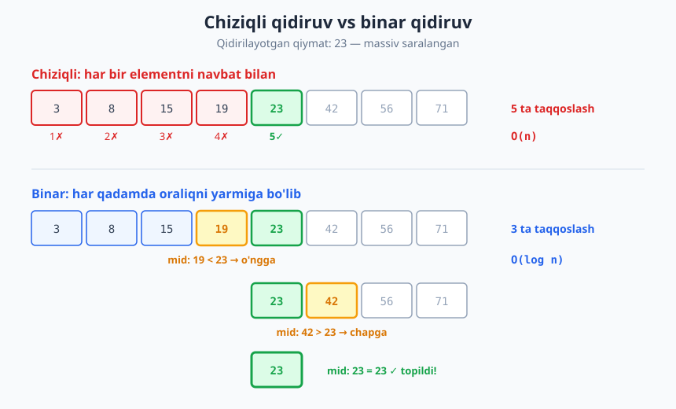
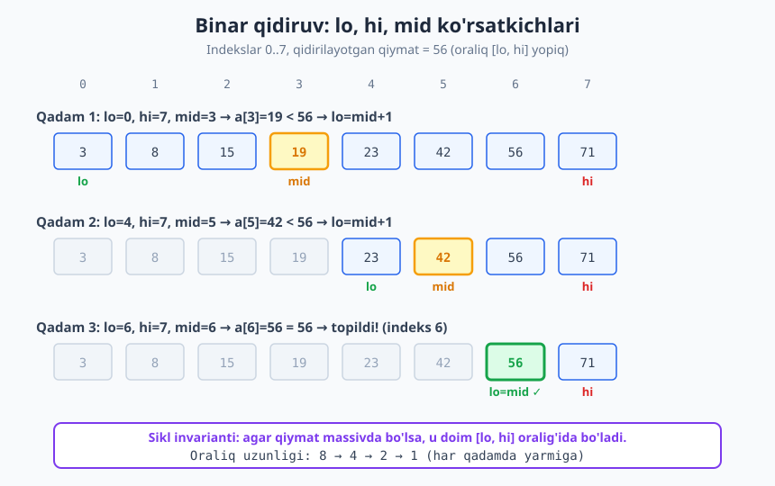
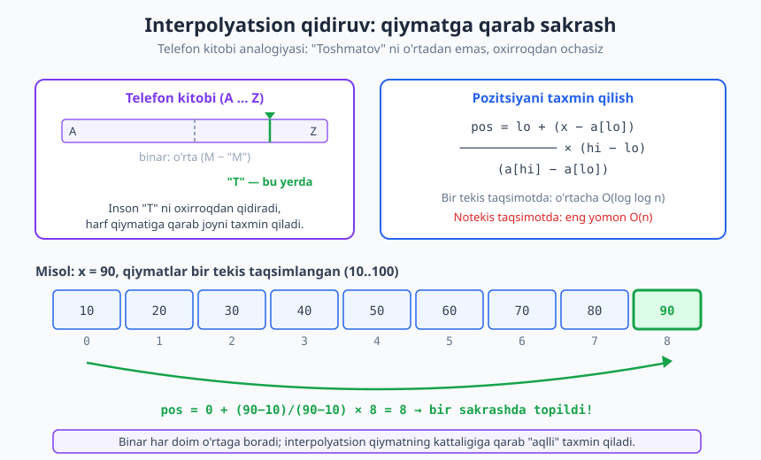

# 28 — Qidiruv algoritmlari

[⬅️ Oldingi: 27 — Saralash algoritmlari](./27-saralash-algoritmlari.md) · [🏠 README](./README.md) · [Keyingi: 29 — Graf algoritmlari I: BFS, DFS va qo'llanmalar ➡️](./29-graf-algoritmlari-1.md)

---

> **Bu bobda:** Kompyuterda eng ko'p bajariladigan amallardan biri — to'plamdan elementni **topish**. Avval har qanday ma'lumotda ishlaydigan, lekin sekin **chiziqli qidiruv**ni (`O(n)`), so'ng saralangan massivda mo'jiza ko'rsatadigan **binar qidiruv**ni (`O(log n)`) chuqur o'rganamiz: uni to'g'ri yozish (mashhur xatolarga to'la!), `lower_bound`/`upper_bound` variantlari, sikl invarianti orqali to'g'riligini isbotlash. Keyin **interpolyatsion qidiruv**, "javob ustida binar qidiruv" degan kuchli g'oya, saralangan-vs-hash trade-off va Python `bisect` modulini ko'ramiz.
>
> **Halollik / Eslatma:** Bu yerdagi murakkablik chegaralari (chiziqli `O(n)`, binar `O(log n)`, interpolyatsion o'rtacha `O(log log n)` lekin yomon holatda `O(n)`) matematik aniq. Binar qidiruvning to'g'riligi sikl invarianti orqali isbotlanadi. Barcha Python namunalari haqiqatan ishga tushirib tekshirilgan; ko'rsatilgan chiqishlar kod bergan haqiqiy natijalar.

---

## Qidiruv muammosi

Sizda bir to'plam (massiv, ro'yxat, jadval) bor va undan biror elementni topishingiz kerak. Bu — informatikadagi eng tez-tez uchraydigan masala. Lug'atda so'z izlash, telefon kitobida ismni topish, ma'lumotlar bazasidan yozuvni olish, kodda o'zgaruvchi nomini qidirish — barchasi tagida **qidiruv** yotadi.

Aniqlik kiritamiz. Qidiruv masalasi ikki ko'rinishda bo'ladi:

- **Bor-yo'qlik (membership):** "`x` to'plamda bormi?" — javob `ha`/`yo'q`.
- **Joyni topish (locate):** "`x` qaysi indeksda turibdi?" — javob indeks yoki `topilmadi`.

Joyni topish kuchliroq: indeksni bilsangiz, bor-yo'qlikni ham bilasiz. Shu sababli odatda joyni qaytaramiz va "topilmadi" uchun maxsus qiymat (`-1`) ishlatamiz.

> **Diqqat:** Qidiruv tezligi **ma'lumotning tartibiga** keskin bog'liq. Saralanmagan ma'lumotda eng yaxshi ko'rsatkich `O(n)` — boshqa iloj yo'q. Saralangan ma'lumotda esa `O(log n)` gacha tushiramiz. Bu farq — butun bobning markazidagi g'oya.

## Chiziqli qidiruv

> **Intuitsiya:** Stol ustida aralash kartalar yotibdi, "qarol"ni topishingiz kerak. Tartib yo'q, shuning uchun **birinchidan oxirigacha** har bir kartani ko'tarib qaraysiz. Bu — chiziqli qidiruv.

**Chiziqli qidiruv** (ingliz tilida *linear* yoki *sequential search*) — eng oddiy strategiya: elementlarni birinchidan oxirigacha navbat bilan tekshirib, qidirilayotganini topguncha (yoki ro'yxat tugaguncha) yuramiz.

```python
def chiziqli_qidiruv(arr, x):
    for i in range(len(arr)):
        if arr[i] == x:
            return i
    return -1

print(chiziqli_qidiruv([4, 2, 7, 1, 9, 3], 9))   # -> 4
print(chiziqli_qidiruv([4, 2, 7, 1, 9, 3], 5))   # -> -1
```

**Murakkablik.** `n` ta element bo'lsa:

- **Eng yaxshi holat** `O(1)` — qidirilayotgan element birinchi turibdi.
- **Eng yomon holat** `O(n)` — element oxirida yoki umuman yo'q (hamma elementni ko'ramiz).
- **O'rtacha holat** `O(n)` — element bor bo'lsa, o'rtacha `n/2` taqqoslash; konstantani tashlaymiz.

Murakkablikni nega aynan shunday sanaymiz — bu haqda [9-bobda](./09-murakkablikni-hisoblash.md) batafsil. Asosiy amal (taqqoslash) sonini hisoblaymiz.

**Qachon ishlatamiz?** Chiziqli qidiruv "yomon" emas — u **saralanmagan** ma'lumotda yagona yo'l. Bundan tashqari:

- Ma'lumot kichik bo'lsa (`n` o'nlab birlik), saralash ortiqcha — chiziqli yetarli.
- Bir martagina qidirish kerak bo'lsa, saralash narxini (`O(n log n)`) qoplab bo'lmaydi.
- Ma'lumot bog'langan ro'yxat bo'lib, tasodifiy indeksga kirib bo'lmasa ([13-bob](./13-boglangan-royxatlar.md)), baribir chiziqli yuramiz.

## Binar qidiruv

Endi **saralangan** massivda ishlaymiz. Bu shartdan ulkan kuch chiqadi.

> **Intuitsiya:** Lug'atda "samolyot" so'zini izlaysiz. Birinchi betdan boshlab varaqlamaysiz — lug'atni o'rtasidan ochasiz. "M" ko'rdingiz; "s" undan keyin keladi, demak **birinchi yarmini butunlay tashlab**, ikkinchi yarmining o'rtasini ochasiz. Har ochishda izlanadigan hudud **yarmiga kamayadi**. Bu — binar qidiruv.

**Binar qidiruv** (ingliz tilida *binary search*) saralangan massivda ishlaydi:

1. Joriy oraliqning **o'rtasidagi** elementni tekshir.
2. Agar u qidirilayotganga teng bo'lsa — topdik.
3. Agar qidirilayotgan **kichikroq** bo'lsa — javob faqat **chap** yarmida bo'lishi mumkin, o'ng yarmni tashla.
4. Agar **kattaroq** bo'lsa — **o'ng** yarmda davom et.

Har qadamda oraliq yarmiga kamayadi, shuning uchun `n` element ustida ko'pi bilan `⌊log₂ n⌋ + 1` qadam ketadi — bu **`O(log n)`**. Bu — [bo'lib hal qilish (divide & conquer)](./23-divide-and-conquer.md) paradigmasining sof namunasi (aniqrog'i, *decrease & conquer* — har qadamda masala ikki barobar kichrayadi, lekin faqat bitta yarmida davom etamiz).



`O(n)` va `O(log n)` orasidagi farq ulkan. `n = 1 000 000` uchun chiziqli qidiruv eng yomon holatda million taqqoslash qiladi; binar qidiruv esa atigi **20** ta (`log₂ 1 000 000 ≈ 20`). Bir milliardlik massivda — `30` ta. Bu shunchaki "tezroq" emas — bu boshqa o'yin.

### Binar qidiruvni to'g'ri yozish

Binar qidiruv g'oyasi sodda, lekin **uni xatosiz yozish mashhur darajada qiyin**. Tajribali dasturchilar ham off-by-one (bir birlikka adashish), cheksiz sikl yoki chegaradan chiqib ketish xatolariga yo'l qo'yishadi. Bir afsona bor: binar qidiruv 1946-yilda chop etilgan, lekin birinchi **xatosiz** umumiy versiyasi 1962-yilgacha nashr etilmagan.

Asosiy savollar:

- **Chegaralar yopiqmi yoki ochiq?** Biz `[lo, hi]` ni **yopiq** (inclusive) deb olamiz: `lo` va `hi` ham izlanish hududiga kiradi.
- **`mid` ni qanday hisoblaymiz?** `mid = lo + (hi - lo) // 2`. Nega oddiy `(lo + hi) // 2` emas? Chunki katta sonlarda `lo + hi` **toshib ketishi** (overflow) mumkin. Python'da butun son cheksiz, lekin C/Java'da bu real xato — shuning uchun bu odatni boshidanoq egallang.
- **Sikl sharti `<=` yoki `<`?** Yopiq oraliqda `while lo <= hi` — chunki `lo == hi` bo'lganda ham hali bitta tekshirilmagan element qoladi.
- **Yangilash.** `arr[mid] < x` bo'lsa `lo = mid + 1` (`mid` ni tashlaymiz, u kichik); aks holda `hi = mid - 1`. **`+1`/`-1` shart** — `mid` ni qayta tekshirmaymiz, aks holda cheksiz sikl bo'ladi.

```python
def binar_qidiruv(arr, x):
    lo, hi = 0, len(arr) - 1          # yopiq oraliq [lo, hi]
    while lo <= hi:
        mid = lo + (hi - lo) // 2     # toshib ketishdan himoyalangan
        if arr[mid] == x:
            return mid
        elif arr[mid] < x:
            lo = mid + 1              # chap yarm + mid ni tashla
        else:
            hi = mid - 1              # o'ng yarm + mid ni tashla
    return -1

a = [3, 8, 15, 19, 23, 42, 56, 71]
print(binar_qidiruv(a, 23))   # -> 4
print(binar_qidiruv(a, 56))   # -> 6
print(binar_qidiruv(a, 50))   # -> -1
print(binar_qidiruv(a, 3))    # -> 0
print(binar_qidiruv(a, 71))   # -> 7
```

> **Anti-pattern:** `lo = mid` yoki `hi = mid` deb yozish (`±1` siz) — eng keng tarqalgan xato. Agar `arr[mid] < x` bo'lganda `lo = mid` qilsangiz va oraliqda ikki element qolsa, `mid` o'zgarmay qoladi — **cheksiz sikl**. Yopiq oraliqda doim `mid ± 1` ishlating.

### Trassirovka jadvali

`a = [3, 8, 15, 19, 23, 42, 56, 71]` da `x = 56` ni qidiramiz (indekslar 0..7):

| Qadam | lo | hi | mid | a[mid] | Taqqoslash | Harakat |
|---|---|---|---|---|---|---|
| 1 | 0 | 7 | 3 | 19 | 19 < 56 | lo = 4 |
| 2 | 4 | 7 | 5 | 42 | 42 < 56 | lo = 6 |
| 3 | 6 | 7 | 6 | 56 | 56 == 56 | **topildi, indeks 6** |

Atigi 3 qadamda topdik (`log₂ 8 = 3`). Quyidagi diagramma `lo`, `hi`, `mid` ko'rsatkichlarining har qadamda qanday siljishini va oraliqning `8 → 4 → 2 → 1` torayishini ko'rsatadi:



### Nega ishlaydi: sikl invarianti

Bu **nazariy** kitob — algoritm nega to'g'ri ishlashini isbotlaymiz, faqat yozishni emas. Vosita — **sikl invarianti**: sikl har aylanishida saqlanadigan haqiqat ([5-bob](./05-takrorlanuvchi-algoritmlar.md)).

> **Isbot (eskiz).** Invariant: *agar `x` massivda mavjud bo'lsa, u doim `[lo, hi]` oralig'ida turadi.*
>
> - **Boshlanish.** Dastlab `lo = 0`, `hi = n-1` — bu butun massiv. Agar `x` bor bo'lsa, albatta shu oraliqda. Invariant to'g'ri.
> - **Saqlanish.** `mid` ni tekshiramiz. Massiv **saralangan** bo'lgani uchun: agar `arr[mid] < x` bo'lsa, `x` `mid` dan **kichik bo'la olmaydi**, demak u `[mid+1, hi]` da. `lo = mid + 1` qilamiz — invariant saqlanadi. Simmetrik tarzda `arr[mid] > x` uchun `hi = mid - 1`.
> - **Tugash.** Har qadamda `hi - lo` kamayadi, shuning uchun sikl albatta tugaydi. Sikl `lo > hi` bo'lganda to'xtaydi — oraliq bo'sh. Invariantga ko'ra, agar `x` bo'lganda u shu (endi bo'sh) oraliqda bo'lardi; oraliq bo'sh, demak `x` yo'q. `-1` qaytaramiz — to'g'ri.

Saralanganlik shartisiz "katta/kichik" deb butun yarmni tashlab bo'lmaydi — aynan shu sabab binar qidiruv saralangan massivni talab qiladi.

### Variantlar: lower_bound va upper_bound

Ko'pincha "`x` bormi?" emas, "`x` **qayerga** kiradi?" yoki "takror qiymatlardan **birinchisi** qayerda?" kerak bo'ladi. Bunda ikki muhim variant bor.

**`lower_bound(x)`** — `x` dan **kichik bo'lmagan** birinchi elementning indeksi (ya'ni `arr[i] >= x` bo'lgan eng chap `i`). Bu yerda **ochiq o'ng chegara** `[lo, hi)` qulayroq:

```python
def lower_bound(arr, x):
    lo, hi = 0, len(arr)              # ochiq oraliq [lo, hi)
    while lo < hi:
        mid = lo + (hi - lo) // 2
        if arr[mid] < x:
            lo = mid + 1
        else:
            hi = mid                 # mid ham nomzod -> tashlamaymiz
    return lo

b = [1, 2, 2, 2, 3, 5, 8]
print(lower_bound(b, 2))   # -> 1   (birinchi 2)
print(lower_bound(b, 4))   # -> 5   (4 yo'q; 5 shu yerdan boshlanadi)
print(lower_bound(b, 0))   # -> 0   (hammadan kichik)
print(lower_bound(b, 9))   # -> 7   (hammadan katta -> massiv oxiri)
```

**`upper_bound(x)`** — `x` dan **katta** birinchi elementning indeksi (`arr[i] > x` bo'lgan eng chap `i`). Faqat shart `<` o'rniga `<=`:

```python
def upper_bound(arr, x):
    lo, hi = 0, len(arr)
    while lo < hi:
        mid = lo + (hi - lo) // 2
        if arr[mid] <= x:            # <= : teng bo'lsa ham o'ngga
            lo = mid + 1
        else:
            hi = mid
    return lo

b = [1, 2, 2, 2, 3, 5, 8]
print(upper_bound(b, 2))                      # -> 4
print(upper_bound(b, 2) - lower_bound(b, 2))  # -> 3  (2 soni 3 marta)
```

> **Eslatma:** `upper_bound(x) - lower_bound(x)` — `x` qiymatning massivdagi **takror soni**. `[lower_bound, upper_bound)` — barcha `x` ga teng elementlar diapazoni. Bu naqsh real loyihalarda juda ko'p ishlatiladi.

E'tibor bering: bu ikki variantda `mid` ni topganda **darrov to'xtamaymiz** — chap yoki o'ngdagi yana yaqinroq nomzodni izlashda davom etamiz. Aynan shu binar qidiruvni "topish"dan "chegara izlash"ga aylantiradi.

### Birinchi va oxirgi uchrash

`lower_bound`/`upper_bound` ustiga qurib, takror qiymatning **birinchi** va **oxirgi** indeksini olamiz:

```python
def lower_bound(arr, x):
    lo, hi = 0, len(arr)
    while lo < hi:
        mid = lo + (hi - lo) // 2
        if arr[mid] < x:
            lo = mid + 1
        else:
            hi = mid
    return lo

def upper_bound(arr, x):
    lo, hi = 0, len(arr)
    while lo < hi:
        mid = lo + (hi - lo) // 2
        if arr[mid] <= x:
            lo = mid + 1
        else:
            hi = mid
    return lo

def birinchi_uchrash(arr, x):
    i = lower_bound(arr, x)
    return i if i < len(arr) and arr[i] == x else -1

def oxirgi_uchrash(arr, x):
    i = upper_bound(arr, x) - 1
    return i if i >= 0 and arr[i] == x else -1

b = [1, 2, 2, 2, 3, 5, 8]
print(birinchi_uchrash(b, 2))   # -> 1
print(oxirgi_uchrash(b, 2))     # -> 3
print(birinchi_uchrash(b, 7))   # -> -1  (yo'q)
```

### Python: bisect moduli

Amalda binar qidiruvni qo'lda yozish shart emas — Python standart kutubxonasida **`bisect`** moduli bor. U aynan `lower_bound`/`upper_bound` ni beradi:

```python
import bisect

b = [1, 2, 2, 2, 3, 5, 8]
print(bisect.bisect_left(b, 2))    # -> 1   (lower_bound)
print(bisect.bisect_right(b, 2))   # -> 4   (upper_bound)
print(bisect.bisect_left(b, 4))    # -> 5

# Saralangan ro'yxatga element qo'shish (tartibni saqlab):
bisect.insort(b, 4)
print(b)                           # -> [1, 2, 2, 2, 3, 4, 5, 8]
```

> **Trade-off:** `bisect_left/right` — `O(log n)`, lekin `insort` saralangan ro'yxatga qo'shganda elementlarni surishi kerak, shuning uchun **`O(n)`** (qidirish tez, qo'shish sekin). Ko'p qo'shish kerak bo'lsa, [balanslangan daraxt](./18-balanslangan-daraxtlar.md) yoki [heap](./19-heap-priority-queue.md) o'ylab ko'ring.

## Interpolyatsion qidiruv

> **Intuitsiya:** Telefon kitobida "Toshmatov"ni izlaysiz. Binar qidiruv har doim **aniq o'rtadan** ochadi. Lekin siz aqlliroq harakat qilasiz: "T" alifboning oxiriga yaqin, shuning uchun kitobni o'rtadan emas, **oxirroqdan** ochasiz. Mana shu g'oya — interpolyatsion qidiruv.

**Interpolyatsion qidiruv** (ingliz tilida *interpolation search*) — saralangan **va qiymatlari taxminan bir tekis taqsimlangan** massivda ishlaydi. Binar qidiruv `mid` ni doim o'rtaga qo'yadi; interpolyatsion esa qidirilayotgan `x` ning **kattaligiga qarab** taxminiy pozitsiyani hisoblaydi:

```text
pos = lo + (x - a[lo]) * (hi - lo) / (a[hi] - a[lo])
```

Bu — chiziqli interpolyatsiya: "`x` `a[lo]` va `a[hi]` orasida qaysi nisbatda turibdi — pozitsiyasi ham o'sha nisbatda".



```python
def interpolyatsion_qidiruv(arr, x):
    lo, hi = 0, len(arr) - 1
    while lo <= hi and arr[lo] <= x <= arr[hi]:
        if arr[lo] == arr[hi]:                 # nolga bo'lishni oldini olamiz
            return lo if arr[lo] == x else -1
        pos = lo + (x - arr[lo]) * (hi - lo) // (arr[hi] - arr[lo])
        if arr[pos] == x:
            return pos
        elif arr[pos] < x:
            lo = pos + 1
        else:
            hi = pos - 1
    return -1

c = [10, 20, 30, 40, 50, 60, 70, 80, 90]
print(interpolyatsion_qidiruv(c, 90))   # -> 8   (bir sakrashda!)
print(interpolyatsion_qidiruv(c, 10))   # -> 0
print(interpolyatsion_qidiruv(c, 55))   # -> -1
print(interpolyatsion_qidiruv(c, 40))   # -> 3
```

**Murakkablik.** Bir tekis taqsimotda har sakrash qolgan qatlamlarning kvadrat ildizicha qisqartiradi, shuning uchun o'rtacha **`O(log log n)`** — bu binar `O(log n)` dan ham tezroq. Lekin taqsimot notekis bo'lsa (masalan `[1, 2, 3, ..., 100, 10⁹]`), pozitsiya taxmini doim adashadi va eng yomon holatda **`O(n)`** ga aylanadi.

> **Trade-off:** Interpolyatsion qidiruv faqat ma'lumot **bir tekis taqsimlangan** bo'lsa foydali (masalan ketma-ket ID'lar, vaqt belgilari). Ishonchsiz taqsimotda binar qidiruv barqaror tanlov — uning `O(log n)` kafolati taqsimotga bog'liq emas.

## Kengroq g'oya: javob ustida binar qidiruv

Binar qidiruvning eng kuchli qo'llanishi — massivda emas, **javoblar diapazonida** qidirish. Ingliz tilida bu *binary search on the answer*.

> **Intuitsiya:** "Eng kichik yetarli sig'imni top" tipidagi masalalar. Agar biror sig'im **yetsa**, undan kattasi ham yetadi; biror sig'im **yetmasa**, undan kichigi ham yetmaydi. Bu **monoton** xossa: javob o'qida bir nuqtada `yo'q...yo'q` `ha...ha` ga o'tadi. Aynan shu o'tish nuqtasini binar qidiruv bilan topamiz — to'g'ridan-to'g'ri javoblar massivini hatto saqlamasdan.

Klassik masala: `n` ta paketni belgilangan tartibda `k` kunda jo'natish kerak. Kunlik konveyer sig'imi bir xil. **Eng kichik sig'imni** toping (shunda `k` kunga sig'ib qolinsin).

Predikat `kun_yetadimi(sigim)` — monoton: sig'im katta bo'lsa, kun kamayadi. Javob `[max(paketlar), sum(paketlar)]` oralig'ida yotadi; shu oraliqda binar qidiramiz:

```python
def kun_yetadimi(paketlar, sigim, k):
    kunlar, joriy = 1, 0
    for p in paketlar:
        if joriy + p > sigim:        # bugun sig'maydi -> yangi kun
            kunlar += 1
            joriy = p
        else:
            joriy += p
    return kunlar <= k

def min_sigim(paketlar, k):
    lo, hi = max(paketlar), sum(paketlar)
    while lo < hi:
        mid = lo + (hi - lo) // 2
        if kun_yetadimi(paketlar, mid, k):
            hi = mid                 # yetadi -> kichikroqni sina
        else:
            lo = mid + 1             # yetmaydi -> kattaroq kerak
    return lo

print(min_sigim([1, 2, 3, 4, 5, 6, 7, 8, 9, 10], 5))   # -> 15
print(min_sigim([3, 2, 2, 4, 1, 4], 3))                # -> 6
```

Bu — `O(n log S)` (`S` — javob diapazoni kengligi), brute force `O(S·n)` o'rniga. Bir misol — butun sondan kvadrat ildiz: `mid² <= n` predikati monoton, javobni `[0, n]` da binar qidiramiz.

```python
def isqrt_binar(n):
    lo, hi = 0, n
    while lo < hi:
        mid = (lo + hi + 1) // 2     # yuqoriga yaxlitlash: lo=mid sikldan chiqish uchun
        if mid * mid <= n:
            lo = mid
        else:
            hi = mid - 1
    return lo

print(isqrt_binar(16))   # -> 4
print(isqrt_binar(24))   # -> 4
print(isqrt_binar(25))   # -> 5
```

> **Eslatma:** `lo = mid` ishlatadigan variantda `mid` ni **yuqoriga** yaxlitlash shart (`(lo+hi+1)//2`), aks holda `lo` va `hi` ikki element bo'lganda `mid == lo` qotib qolib, cheksiz sikl bo'ladi. Bu — binar qidiruvning yana bir off-by-one tuzog'i.

## Saralangan vs saralanmagan: trade-off

Binar qidiruv tez, lekin u **bepul emas** — massiv saralangan bo'lishini talab qiladi. Saralash esa `O(n log n)`. Qaror qoidasi:

| Stsenariy | Eng yaxshi tanlov | Narx |
|---|---|---|
| Bir martalik qidiruv, saralanmagan | Chiziqli qidiruv | `O(n)` |
| Ko'p marta qidiruv, ma'lumot statik | Bir marta saralash + binar | `O(n log n)` + har qidiruv `O(log n)` |
| Ko'p marta qidiruv, tartib kerakmas | [Hash jadval](./15-hash-jadval.md) | qurish `O(n)`, har qidiruv o'rtacha `O(1)` |
| Diapazon so'rovlari (`x` dan `y` gacha) | Saralash + binar (lower/upper bound) | `O(log n)` chegaralar |

Asosiy g'oya: **saralash — bir martalik investitsiya**. `q` ta qidiruv qilsangiz, chiziqli `O(q·n)`, saralash+binar esa `O(n log n + q log n)`. `q` katta bo'lsa, ikkinchisi yutadi.

> **Trade-off:** Hash jadval o'rtacha `O(1)` bilan eng tez **bor-yo'qlik** beradi, lekin u **tartibsiz** — "`x` dan katta birinchi element" yoki diapazon so'roviga javob bera olmaydi. Aynan tartib kerak bo'lganda saralangan massiv + binar qidiruv (yoki [BST](./17-binar-qidiruv-daraxti.md)) yutadi. "Tezlik" yagona o'lchov emas — qaysi **amallar** kerakligiga qarang.

## Asosiy g'oyalar (bobni qisqacha)

- **Chiziqli qidiruv** — har elementni navbat bilan tekshiradi: `O(n)`. Saralanmagan ma'lumotda yagona yo'l; kichik yoki bir martalik qidiruvda yetarli.
- **Binar qidiruv** — **saralangan** massivda oraliqni har qadamda yarmiga bo'ladi: `O(log n)`. Saralanganlik "katta/kichik" deb butun yarmni tashlashga imkon beradi.
- Binar qidiruvni **to'g'ri yozish qiyin**: yopiq `[lo, hi]` oraliq, `mid = lo + (hi-lo)//2` (toshib ketishdan himoya), `while lo <= hi`, doim `mid ± 1`. `lo=mid`/`hi=mid` ni `±1` siz ishlatish — cheksiz sikl.
- To'g'rilik **sikl invarianti** bilan isbotlanadi: agar `x` bor bo'lsa, u doim `[lo, hi]` da.
- **`lower_bound`/`upper_bound`** — chap/o'ng chegara variantlari; ularning ayirmasi — takror soni. Python'da tayyor: `bisect`.
- **Interpolyatsion qidiruv** — bir tekis taqsimotda qiymatga qarab sakraydi: o'rtacha `O(log log n)`, yomon taqsimotda `O(n)`.
- **Javob ustida binar qidiruv** — monoton predikat bo'lsa, javoblar diapazonida qidirish. Kuchli, keng qo'llaniladigan g'oya.
- **Trade-off:** saralash — bir martalik investitsiya; ko'p qidiruvda o'zini qoplaydi. Tartib kerakmas bo'lsa, hash jadval o'rtacha `O(1)`.

## Mashqlar

### Oson

**1-mashq.** `arr = [5, 9, 2, 7, 4, 1]` da `x = 7` ni chiziqli qidiruv bilan izlasangiz, **nechta taqqoslash** qilinadi? Va `x = 3` uchun-chi?

**2-mashq.** `a = [2, 5, 8, 12, 16, 23, 38, 56, 72, 91]` (10 ta element) da `x = 23` ni binar qidiruv bilan izlaymiz. Har qadamdagi `lo`, `hi`, `mid`, `a[mid]` qiymatlarini trassirovka jadvalida yozing. Nechta qadam ketadi?

**3-mashq.** `n = 1000` element uchun binar qidiruv eng yomon holatda nechta taqqoslash qiladi? Formulani ko'rsating. `n = 1 000 000` uchun-chi?

### O'rta

**4-mashq.** Quyidagi binar qidiruvda **off-by-one xato** bor. Toping, tushuntiring va tuzating:

```python
def buggy(arr, x):
    lo, hi = 0, len(arr)
    while lo <= hi:
        mid = (lo + hi) // 2
        if arr[mid] == x:
            return mid
        elif arr[mid] < x:
            lo = mid + 1
        else:
            hi = mid - 1
    return -1
```

**5-mashq.** `lower_bound` funksiyasidan foydalanib, saralangan massivda berilgan `x` qiymat **nechta marta** uchrashini `O(log n)` da qaytaruvchi `son(arr, x)` funksiyasini yozing. Misol: `son([1,2,2,2,3], 2) -> 3`, `son([1,2,2,2,3], 4) -> 0`.

**6-mashq.** Saralangan massivda `x` dan **qat'iy katta** birinchi elementning **qiymatini** qaytaruvchi (yo'q bo'lsa `None`) funksiyani `bisect` modulidan foydalanib yozing. Misol: `keyingi([1,3,5,7], 4) -> 5`, `keyingi([1,3,5,7], 7) -> None`.

### Qiyin

**7-mashq.** Saralangan (takrorli) massivda berilgan `x` qiymatning **birinchi** va **oxirgi** indeksini `[birinchi, oxirgi]` ko'rinishida `O(log n)` da qaytaring; yo'q bo'lsa `[-1, -1]`. Misol: `diapazon([5,7,7,7,8,8,10], 7) -> [1, 3]`.

**8-mashq.** (Javob ustida binar qidiruv) `kitoblar` — sahifalar soni ro'yxati; ularni `k` ta talabaga **tartibni buzmasdan** (ketma-ket bo'laklarga) taqsimlash kerak. Maqsad — **eng ko'p yuklangan talabaning** sahifalar yig'indisini **minimallashtirish**. Binar qidiruv bilan yeching. Misol: `taqsimot([12, 34, 67, 90], 2) -> 113`.

**9-mashq.** (Aylantirilgan massiv) Saralangan, lekin noma'lum nuqtadan **aylantirilgan** massivda (masalan `[4,5,6,7,0,1,2]`) `x` ni `O(log n)` da qidiring. Takror yo'q deb faraz qiling. Misol: `aylangan_qidiruv([4,5,6,7,0,1,2], 0) -> 4`, `... 3) -> -1`.

<details markdown="1">
<summary>Yechimlar</summary>

### 1-mashq yechimi

Chiziqli qidiruv chapdan o'ngga yuradi.

- `x = 7`: `5`(1), `9`(2), `2`(3), `7`(4) — **4 ta** taqqoslash (4-indeksda topildi).
- `x = 3`: massivda yo'q, hamma 6 elementni ko'ramiz — **6 ta** taqqoslash, so'ng `-1`.

Umumiy qoida: element `i`-pozitsiyada (0-asosli) bo'lsa `i+1` taqqoslash; yo'q bo'lsa `n` taqqoslash.

### 2-mashq yechimi

`a = [2, 5, 8, 12, 16, 23, 38, 56, 72, 91]`, indekslar 0..9, `x = 23`:

| Qadam | lo | hi | mid | a[mid] | Harakat |
|---|---|---|---|---|---|
| 1 | 0 | 9 | 4 | 16 | 16 < 23 → lo = 5 |
| 2 | 5 | 9 | 7 | 56 | 56 > 23 → hi = 6 |
| 3 | 5 | 6 | 5 | 23 | 23 == 23 → **topildi, indeks 5** |

**3 ta** qadam. (`⌊log₂ 10⌋ + 1 = 3 + 1 = 4` — yuqori chegara; bu yerda 3 ta yetdi.)

### 3-mashq yechimi

Binar qidiruv eng yomon holatda `⌊log₂ n⌋ + 1` taqqoslash qiladi (har qadamda oraliq yarmiga kamayadi, oraliq `1` ga tushguncha).

- `n = 1000`: `⌊log₂ 1000⌋ + 1 = 9 + 1 = 10` taqqoslash (`2⁹ = 512`, `2¹⁰ = 1024`).
- `n = 1 000 000`: `⌊log₂ 1 000 000⌋ + 1 = 19 + 1 = 20` taqqoslash (`2¹⁹ ≈ 524 288`, `2²⁰ ≈ 1.05M`).

Tekshirish (har bir kirish qiymati uchun eng yomon qadam soni):

```python
import math

def binar_qadamlar(arr, x):
    lo, hi, qadam = 0, len(arr) - 1, 0
    while lo <= hi:
        qadam += 1
        mid = lo + (hi - lo) // 2
        if arr[mid] == x:
            return qadam
        elif arr[mid] < x:
            lo = mid + 1
        else:
            hi = mid - 1
    return qadam

n = 1000
arr = list(range(n))
worst = max(binar_qadamlar(arr, x) for x in range(-1, n + 1))
print(worst, math.floor(math.log2(n)) + 1)   # -> 10 10
```

### 4-mashq yechimi

Xato: `hi = len(arr)` (oraliqdan **tashqari** indeks) **bilan birga** `while lo <= hi` ishlatilgan. Bu ikkovi bir-biriga zid. Birinchi iteratsiyada `mid` `len(arr)` gacha yetishi mumkin va `arr[mid]` — **indeksdan chiqib ketish** (`IndexError`). Masalan `arr = [1]`, `x = 5`: `lo=0, hi=1, mid=0, arr[0]=1<5 → lo=1`; keyin `lo=1<=hi=1`, `mid=1`, `arr[1]` — xato.

**Tuzatish — ikki to'g'ri variant bor:**

Variant A (yopiq oraliq): `hi = len(arr) - 1` qiling (sikl sharti `<=` qoladi).

```python
def fixed_a(arr, x):
    lo, hi = 0, len(arr) - 1      # -1 qo'shildi
    while lo <= hi:
        mid = lo + (hi - lo) // 2
        if arr[mid] == x:
            return mid
        elif arr[mid] < x:
            lo = mid + 1
        else:
            hi = mid - 1
    return -1

print(fixed_a([1], 5))            # -> -1   (endi xato yo'q)
print(fixed_a([2, 4, 6, 8], 6))  # -> 2
```

Variant B (ochiq oraliq): `hi = len(arr)` ni qoldirib, sikl shartini `while lo < hi` ga, yangilashni `hi = mid` ga o'zgartiring. Har ikkalasi to'g'ri; aralashtirmaslik kerak.

### 5-mashq yechimi

`upper_bound - lower_bound` takror sonini beradi:

```python
def lower_bound(arr, x):
    lo, hi = 0, len(arr)
    while lo < hi:
        mid = lo + (hi - lo) // 2
        if arr[mid] < x:
            lo = mid + 1
        else:
            hi = mid
    return lo

def upper_bound(arr, x):
    lo, hi = 0, len(arr)
    while lo < hi:
        mid = lo + (hi - lo) // 2
        if arr[mid] <= x:
            lo = mid + 1
        else:
            hi = mid
    return lo

def son(arr, x):
    return upper_bound(arr, x) - lower_bound(arr, x)

print(son([1, 2, 2, 2, 3], 2))   # -> 3
print(son([1, 2, 2, 2, 3], 4))   # -> 0
```

Ikki `O(log n)` chaqiruv — jami `O(log n)`.

### 6-mashq yechimi

`bisect_right(arr, x)` — `x` dan katta birinchi elementning indeksi. Agar u massiv uzunligiga teng bo'lsa, bunday element yo'q:

```python
import bisect

def keyingi(arr, x):
    i = bisect.bisect_right(arr, x)
    return arr[i] if i < len(arr) else None

print(keyingi([1, 3, 5, 7], 4))   # -> 5
print(keyingi([1, 3, 5, 7], 7))   # -> None
print(keyingi([1, 3, 5, 7], 0))   # -> 1
```

### 7-mashq yechimi

`lower_bound` (birinchi) va `upper_bound - 1` (oxirgi); element haqiqatan bor-yo'qligini tekshiramiz:

```python
def lower_bound(arr, x):
    lo, hi = 0, len(arr)
    while lo < hi:
        mid = lo + (hi - lo) // 2
        if arr[mid] < x:
            lo = mid + 1
        else:
            hi = mid
    return lo

def upper_bound(arr, x):
    lo, hi = 0, len(arr)
    while lo < hi:
        mid = lo + (hi - lo) // 2
        if arr[mid] <= x:
            lo = mid + 1
        else:
            hi = mid
    return lo

def diapazon(arr, x):
    lo = lower_bound(arr, x)
    if lo == len(arr) or arr[lo] != x:
        return [-1, -1]
    return [lo, upper_bound(arr, x) - 1]

print(diapazon([5, 7, 7, 7, 8, 8, 10], 7))   # -> [1, 3]
print(diapazon([5, 7, 7, 7, 8, 8, 10], 6))   # -> [-1, -1]
print(diapazon([5, 7, 7, 7, 8, 8, 10], 10))  # -> [6, 6]
```

### 8-mashq yechimi

Bu — javob ustida binar qidiruv. Predikat: *berilgan limit bilan `k` ta yoki kamroq talabaga sig'adimi?* (ochko'zlik bilan to'ldiramiz). Javob `[max(kitoblar), sum(kitoblar)]` oralig'ida monoton:

```python
def yetadimi(kitoblar, limit, k):
    talaba, joriy = 1, 0
    for sahifa in kitoblar:
        if joriy + sahifa > limit:
            talaba += 1
            joriy = sahifa
        else:
            joriy += sahifa
    return talaba <= k

def taqsimot(kitoblar, k):
    lo, hi = max(kitoblar), sum(kitoblar)
    while lo < hi:
        mid = lo + (hi - lo) // 2
        if yetadimi(kitoblar, mid, k):
            hi = mid          # limit yetarli -> kichikroqni sina
        else:
            lo = mid + 1      # yetmaydi -> kattaroq limit
    return lo

print(taqsimot([12, 34, 67, 90], 2))   # -> 113
print(taqsimot([10, 20, 30, 40], 2))   # -> 60
```

`[12,34,67,90]`, `k=2`: eng yaxshi bo'linish `[12,34,67] | [90]` → max(113, 90) = **113**.
Murakkablik: `O(n log S)`, bu yerda `S = sum - max`.

### 9-mashq yechimi

Aylantirilgan massivda har bir `mid` da **kamida bitta yarm saralangan** bo'ladi. Qaysi yarm saralanganini aniqlab, `x` shu saralangan yarmda yotadimi-yo'qmi tekshiramiz:

```python
def aylangan_qidiruv(arr, x):
    lo, hi = 0, len(arr) - 1
    while lo <= hi:
        mid = lo + (hi - lo) // 2
        if arr[mid] == x:
            return mid
        if arr[lo] <= arr[mid]:              # chap yarm saralangan
            if arr[lo] <= x < arr[mid]:
                hi = mid - 1
            else:
                lo = mid + 1
        else:                                # o'ng yarm saralangan
            if arr[mid] < x <= arr[hi]:
                lo = mid + 1
            else:
                hi = mid - 1
    return -1

print(aylangan_qidiruv([4, 5, 6, 7, 0, 1, 2], 0))   # -> 4
print(aylangan_qidiruv([4, 5, 6, 7, 0, 1, 2], 3))   # -> -1
print(aylangan_qidiruv([4, 5, 6, 7, 0, 1, 2], 6))   # -> 2
print(aylangan_qidiruv([4, 5, 6, 7, 0, 1, 2], 4))   # -> 0
```

Har qadamda oraliq yarmiga kamayadi — `O(log n)`. Asosiy nayrang: `arr[lo] <= arr[mid]` shartidan qaysi yarm "toza" saralanganini aniqlab, faqat o'sha yarmda `x` ning diapazon tekshiruvini qilamiz.

</details>

---

[⬅️ Oldingi: 27 — Saralash algoritmlari](./27-saralash-algoritmlari.md) · [🏠 README](./README.md) · [Keyingi: 29 — Graf algoritmlari I: BFS, DFS va qo'llanmalar ➡️](./29-graf-algoritmlari-1.md)
