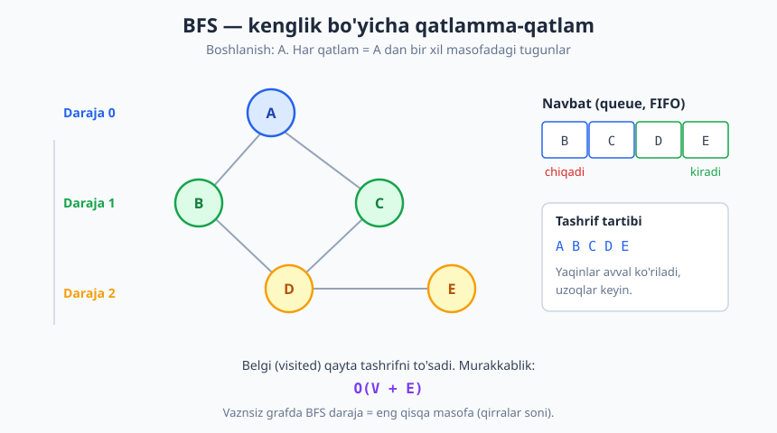
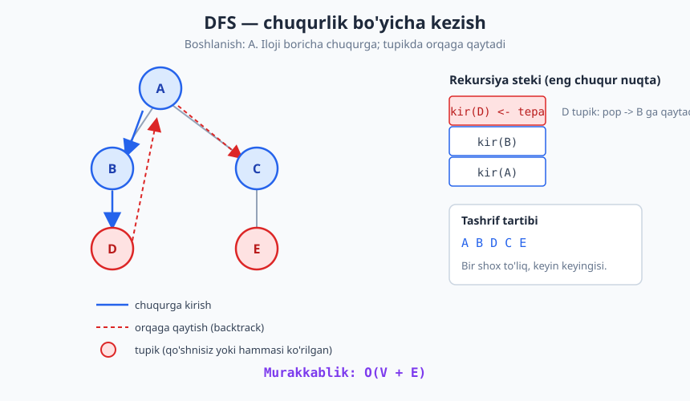
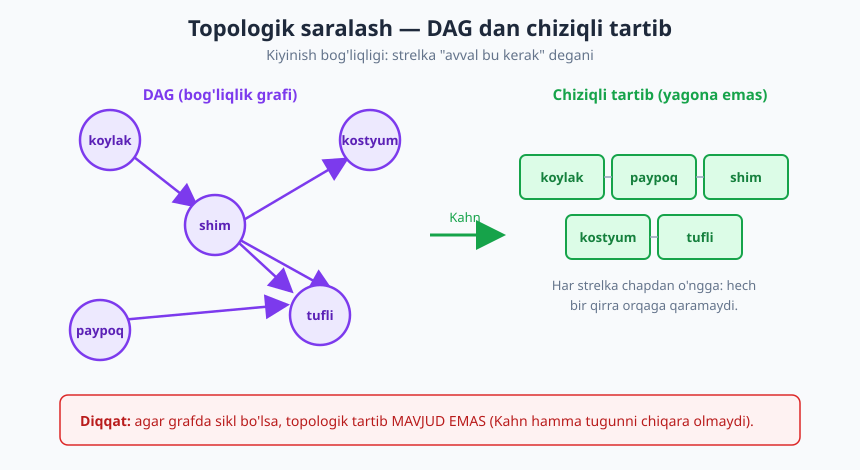

# 29 — Graf algoritmlari I: BFS, DFS va qo'llanmalar

[⬅️ Oldingi: 28 — Qidiruv algoritmlari](./28-qidiruv-algoritmlari.md) · [🏠 README](./README.md) · [Keyingi: 30 — Graf algoritmlari II: eng qisqa yo'l va MST ➡️](./30-graf-algoritmlari-2.md)

---

> **Bu bobda:** Grafni kompyuterda **kezish** (traversal) — ya'ni barcha tugunlarga muntazam, takrorsiz tashrif qilish — ikki asosiy usulini chuqur o'rganamiz: **BFS** (kenglik bo'yicha) va **DFS** (chuqurlik bo'yicha). So'ng ular ustiga qurilgan amaliy masalalarni ko'ramiz: vaznsiz grafda eng qisqa yo'l, bog'langan komponentlar, sikl aniqlash, topologik saralash va ikki bo'lakli (bipartite) tekshirish.
>
> **Halollik / Eslatma:** BFS va DFS ning `O(V + E)` murakkabligi matematik aniq va isboti to'liq beriladi. SCC (kuchli bog'langan komponentlar) ni faqat **g'oyaviy** eslatib o'tamiz — Kosaraju/Tarjan algoritmlarining to'liq tahlili bu bobdan tashqarida. Barcha Python namunalari haqiqatan ishga tushirib tekshirilgan; ko'rsatilgan chiqishlar — kod chiqargan haqiqiy natijalar.

---

## Kirish: grafni kezish nima

[21-bobda](./21-graflar-union-find.md) grafni tasvirlashni o'rgandik: tugunlar, qirralar, qo'shnilik ro'yxati. Endi savol o'zgaradi. Grafni *saqlash* emas, balki uni *aylanib chiqish* kerak: "shu tugundan boshlab, qaysi tugunlarga yetib bora olaman? Ularning hammasiga aniq bir marta tashrif qilib chiq."

Bu — **kezish** (traversal). Daraxtlarda [16-bobda](./16-daraxtlar-traversal.md) ham kezishni ko'rgandik (inorder, preorder), lekin u yerda hayot oson edi: daraxtda sikl yo'q, har tugunga aniq bitta yo'l bilan kelinadi. Grafda esa ikki yangi qiyinchilik bor:

1. **Sikllar.** `A → B → A` kabi halqa bo'lsa, ehtiyot bo'lmasak, abadiy aylanib qolamiz.
2. **Bir tugunga ko'p yo'l.** Bir xil tugunga turli yo'nalishlardan kelishimiz mumkin; uni ikki marta ishlab ketmaslik kerak.

Ikkala muammoning yechimi bitta oddiy g'oya — **belgilash** (visited): tashrif qilingan tugunni eslab qolamiz va qayta kirmaymiz. Shu g'oya BFS va DFS ning yuragida turadi. Farq esa — tugunlarni *qaysi tartibda* qayta ishlashda.

> **Intuitsiya:** Yong'in (yoki suv) tarqalishini tasavvur qiling. Agar olov bir nuqtadan dumaloq to'lqin bo'lib, hamma tomonga bir vaqtda kengaysa — bu **BFS**. Agar bir koridordan to oxirigacha yugurib borib, tupikka yetganda orqaga qaytib boshqa koridorni sinasangiz — bu **DFS**.

Kezish algoritmlarini ikki xil grafga qo'llaymiz: **yo'naltirilmagan** (do'stlik — bog'lanish ikki tomonlama) va **yo'naltirilgan** (vazifa bog'liqligi — strelka bir tomonga). Ikkalasi uchun ham kod deyarli bir xil; farq faqat qo'shnilarni qanday qurganimizda.

Quyidagi kichik grafni bob davomida ishchi misol qilamiz (yo'naltirilmagan):

```text
qirralar:  A-B   A-C   B-D   C-D   D-E

       A
      / \
     B   C
      \ /
       D
       |
       E
```

Avval grafni qo'shnilik ro'yxati sifatida quramiz — bu strukturani [21-bobda](./21-graflar-union-find.md) batafsil ko'rgan edik.

```python
from collections import defaultdict

def graf_qur(qirralar, yonaltirilgan=False):
    g = defaultdict(list)
    tugunlar = set()
    for u, v in qirralar:
        g[u].append(v)
        tugunlar.add(u); tugunlar.add(v)
        if not yonaltirilgan:
            g[v].append(u)      # yo'naltirilmagan: ikki tomon ham
    for t in tugunlar:
        _ = g[t]                # yakka tugunlar ham bo'sh ro'yxat olsin
    return g

qirralar = [("A","B"), ("A","C"), ("B","D"), ("C","D"), ("D","E")]
g = graf_qur(qirralar)
print("A qo'shnilari:", sorted(g["A"]))   # -> ['B', 'C']
```

## BFS — kenglik bo'yicha qidiruv

**BFS** (Breadth-First Search) tugunlarni **qatlamma-qatlam** qayta ishlaydi. Boshlang'ich tugun — 0-daraja. Uning barcha bevosita qo'shnilari — 1-daraja. Ularning hali ko'rilmagan qo'shnilari — 2-daraja. Va hokazo. Bir qatlam to'liq tugamaguncha keyingisiga o'tmaydi.

Bu tartibni saqlash uchun bizga **navbat** (queue, FIFO) kerak — [14-bobdagi](./14-stack-queue-deque.md) struktura. Mantiq: birinchi *kirgan* tugun birinchi bo'lib *chiqib* qayta ishlanadi. Shu sabab yaqin tugunlar uzoqlardan oldin ko'riladi.



Algoritm sodda:

```text
BFS(g, boshlanish):
    korilgan <- {boshlanish}           # belgilash
    navbat   <- [boshlanish]
    while navbat bo'sh emas:
        tugun <- navbat.boshidan ol    # popleft
        ishla(tugun)
        har qoshni uchun (g[tugun]):
            agar qoshni korilmagan:
                korilgan ga qo'sh
                navbat oxiriga qo'y     # append
```

> **Diqqat — qachon belgilash kerak?** Tugunni **navbatga qo'shayotganda** belgilang, chiqarayotganda emas. Aks holda bir tugun bir necha qo'shnisidan kelib, navbatga bir necha marta tushib qoladi va `O(V+E)` buziladi. "Navbatda bormi yoki ko'rilganmi" — bir xil belgi bilan boshqaramiz.

Python da:

```python
from collections import deque

def bfs(g, boshlanish):
    korilgan = {boshlanish}
    navbat = deque([boshlanish])
    tartib = []
    while navbat:
        tugun = navbat.popleft()
        tartib.append(tugun)
        for qoshni in sorted(g[tugun]):     # sorted faqat tartib aniqligi uchun
            if qoshni not in korilgan:
                korilgan.add(qoshni)
                navbat.append(qoshni)
    return tartib

print("BFS:", bfs(g, "A"))   # -> ['A', 'B', 'C', 'D', 'E']
```

### Trassirovka: navbat qadamma-qadam

Yuqoridagi grafda `A` dan boshlab BFS qanday ishlashini qadamlab kuzatamiz. Har qadamda navbat boshidan bitta tugun chiqadi, uning yangi qo'shnilari oxiriga qo'shiladi:

| Qadam | Chiqdi | Yangi qo'shildi | Navbat (qadamdan keyin) |
|---|---|---|---|
| 1 | A | B, C | [B, C] |
| 2 | B | D | [C, D] |
| 3 | C | — (D ko'rilgan) | [D] |
| 4 | D | E | [E] |
| 5 | E | — | [] |

Tashrif tartibi: `A B C D E`. E'tibor bering — `D` ga `B` va `C` orqali ikki yo'l bor edi, lekin u faqat **bir marta** navbatga tushdi (3-qadamda `C` `D` ni qayta qo'shmadi, chunki `D` allaqachon ko'rilgan).

### Eng muhim xossa: vaznsiz eng qisqa yo'l

BFS ning sehri shu yerda. **Vaznsiz grafda BFS tugunni topgan daraja — uning boshlang'ichdan eng qisqa masofasi** (qirralar soni bo'yicha).

Buni isbotlash uchun masofani ham saqlaymiz:

```python
def bfs_masofa(g, boshlanish):
    masofa = {boshlanish: 0}
    navbat = deque([boshlanish])
    while navbat:
        tugun = navbat.popleft()
        for qoshni in g[tugun]:
            if qoshni not in masofa:        # masofa[...] borligi = ko'rilgan
                masofa[qoshni] = masofa[tugun] + 1
                navbat.append(qoshni)
    return masofa

print("Masofalar:", dict(sorted(bfs_masofa(g, "A").items())))
# -> {'A': 0, 'B': 1, 'C': 1, 'D': 2, 'E': 3}
```

> **Isbot (eskiz).** Asosiy kuzatuv: BFS navbatga tugunlarni **masofa o'sish tartibida** qo'shadi — har qanday vaqtda navbatdagi masofalar yo bir xil `d`, yo `d` va `d+1` (ikki qo'shni daraja). Buni induksiya bilan ko'rsatamiz. Boshida navbatda faqat `boshlanish` (masofa 0). `d` masofali tugunni qayta ishlaganda uning yangi qo'shnilariga `d+1` beramiz va oxiriga qo'yamiz. Navbat FIFO bo'lgani uchun barcha `d` masofalilar barcha `d+1` larigacha chiqadi. Demak tugun **birinchi** topilganida unga berilgan masofa — chindan ham minimal: agar undan qisqaroq yo'l bo'lganida, u tugun avvalroq, kichikroq daraja qayta ishlanganda topilgan bo'lardi. ∎

Bu xossa BFS ni juda kuchli qiladi: labirintda eng kam qadamli chiqish, ijtimoiy tarmoqda "necha qo'l uzoqlikda", shaxmat otining minimal yurishlari — barchasi vaznsiz eng qisqa yo'l masalasi va BFS ularni `O(V+E)` da hal qiladi.

> **Diqqat:** Bu faqat **vaznsiz** (yoki barcha qirralar vazni teng) grafda ishlaydi. Qirralar har xil vaznli bo'lsa, BFS xato beradi — u yerda Dijkstra kerak ([30-bob](./30-graf-algoritmlari-2.md)).

### BFS qo'llanmalari

- **Vaznsiz eng qisqa yo'l / eng yaqin obyekt** — yuqoridagidek.
- **Bog'langanlikni tekshirish** — bitta BFS hamma tugunni ko'rsa, graf bog'langan.
- **Labirint / panjara** — har katak = tugun, qo'shni kataklar = qirra.
- **Ikki bo'lakli (bipartite) tekshirish** — qatlamlarni navbatma-navbat ranglab (pastda ko'ramiz).
- **Eng yaqin "manba" topish** — bir nechta boshlang'ichdan bir vaqtda BFS (multi-source).

## DFS — chuqurlik bo'yicha qidiruv

**DFS** (Depth-First Search) teskari falsafa bilan ishlaydi: tanlangan bir qo'shni bo'ylab **iloji boricha chuqurga** kirib boradi, faqat **tupikka** (ko'riladigan yangi qo'shni qolmagan tugun) yetganda **orqaga qaytadi** (backtrack) va boshqa shoxni sinaydi.

DFS ni saqlash uchun **stek** (LIFO) kerak — oxirgi kirgan birinchi chiqadi. Eng tabiiy ifodasi esa **rekursiya** [6-bob](./06-rekursiya-asoslari.md), chunki funksiya chaqiruvlari steki aynan shu vazifani bajaradi.



### Rekursiv DFS

```python
def dfs_rekursiv(g, boshlanish):
    korilgan = set()
    tartib = []
    def kir(tugun):
        korilgan.add(tugun)
        tartib.append(tugun)              # "kirish" vaqti
        for qoshni in sorted(g[tugun]):
            if qoshni not in korilgan:
                kir(qoshni)               # chuqurga
        # shu yerda tugun "tugadi" (finish) — qo'shnilar hammasi ko'rildi
    kir(boshlanish)
    return tartib

print("DFS (rekursiv):", dfs_rekursiv(g, "A"))   # -> ['A', 'B', 'D', 'C', 'E']
```

Tartibni tushunamiz: `A` dan `B` ga (eng kichik qo'shni), `B` dan `D` ga, `D` dan `E` ga — chuqurga ketdik. `E` tupik (uning yagona qo'shnisi `D` ko'rilgan). Orqaga qaytamiz: `D` dan ham yangisi yo'q, `B` dan ham yo'q, `A` ga qaytib uning ikkinchi qo'shnisi `C` ga kiramiz. `C` ning qo'shnisi `D` ko'rilgan. Tamom: `A B D C E`.

### Iterativ DFS (aniq stek bilan)

Katta grafda chuqurlik mingdan oshsa, Python rekursiya chegarasiga uriladi. Shunda rekursiyani **aniq stek** bilan almashtiramiz:

```python
def dfs_iterativ(g, boshlanish):
    korilgan = set()
    stek = [boshlanish]
    tartib = []
    while stek:
        tugun = stek.pop()                # LIFO: oxirgisi chiqadi
        if tugun in korilgan:
            continue                      # ikki marta tushib qolgan bo'lishi mumkin
        korilgan.add(tugun)
        tartib.append(tugun)
        # teskari sort: kichik qo'shni stek tepasiga tushib, birinchi chiqsin
        for qoshni in sorted(g[tugun], reverse=True):
            if qoshni not in korilgan:
                stek.append(qoshni)
    return tartib

print("DFS (iterativ):", dfs_iterativ(g, "A"))   # -> ['A', 'B', 'D', 'C', 'E']
```

> **Eslatma — nozik farq.** Iterativ versiyada bir tugun stekka bir necha marta tushishi mumkin (har bir ko'rmagan qo'shnisidan). Shuning uchun chiqarganda yana bir bor `if tugun in korilgan` tekshiramiz. Rekursiv versiyada bu muammo yo'q, chunki belgilashni chaqiruvdan oldin qilamiz.

### Kirish va chiqish vaqtlari (discovery / finish)

DFS ning kuchli g'oyasi — har tugunga ikkita vaqt belgilash: u **birinchi ko'rilgan** (discovery) va undan **butunlay chiqilgan** (finish, ya'ni hamma qo'shnisi qayta ishlanib bo'lgan) payt. Yuqoridagi koddagi `tartib.append` — discovery; izoh qoldirgan joy — finish.

Bu ikki vaqt graf tahlilining poydevori. Masalan, **finish vaqtlari teskari tartibi** — to'g'ridan-to'g'ri topologik saralashni beradi (pastda), va vaqtlar orqali qirralarni "orqa qirra / oldinga qirra" deb tasniflab sikl topiladi.

### DFS qo'llanmalari

- **Yo'l borligini tekshirish** — `u` dan `v` ga DFS yetsa, yo'l bor.
- **Bog'langan komponentlar** — har bir ko'rilmagan tugundan DFS yangi komponentni belgilaydi.
- **Sikl aniqlash** — rekursiya stekida turgan tugunni qayta uchratsak, sikl bor.
- **Topologik saralash** — finish tartibining teskarisi.
- **Backtracking masalalari** [26-bob](./26-backtracking.md) — DFS ning umumlashmasi.

## BFS va DFS: qachon qaysi

Ikkalasi ham `O(V+E)` vaqtda barcha tugunni ko'radi (har tugun bir marta navbatga/stekka, har qirra bir-ikki marta tekshiriladi). Farq — *tartib* va *xotira profili*da.

| Mezon | BFS | DFS |
|---|---|---|
| Struktura | navbat (queue, FIFO) | stek / rekursiya (LIFO) |
| Tartib | qatlamma-qatlam (yaqindan) | shoxma-shox (chuqurga) |
| Eng qisqa yo'l (vaznsiz) | **ha**, beradi | yo'q (topgan yo'li eng qisqa emas) |
| Topologik saralash | Kahn varianti | finish tartibi |
| Sikl, komponent, yo'l bor-yo'qligi | mumkin | tabiiy va sodda |
| Xotira | qatlam keng bo'lsa katta `O(V)` | chuqurlikka mutanosib `O(h)` |
| Tabiiy yozilishi | iterativ | rekursiv |

> **Trade-off (xotira).** Keng, sayoz grafda (masalan, har tugunning ko'p qo'shnisi bor) BFS navbati katta bo'lib ketishi mumkin — eng katta qatlam butun navbatda turadi. Chuqur, ingichka grafda esa DFS rekursiya steki chuqurlikka teng joy oladi. "Qisqa yo'l kerakmi?" — BFS. "Faqat yetib borish / tuzilma tahlili kerakmi?" — DFS odatda soddaroq.

Endi DFS/BFS ustiga qurilgan to'rtta klassik masalani ko'ramiz.

## Bog'langan komponentlar

**Komponent** — o'zaro yo'l bilan bog'langan tugunlarning maksimal guruhi ([21-bob](./21-graflar-union-find.md) terminologiyasi). "Do'stlar tarmog'i nechta ajralgan jamoaga bo'linadi?" — aynan shu savol.

G'oya oddiy: hamma tugunni aylanib chiqamiz; ko'rilmaganini uchratsak, undan to'liq BFS/DFS qilib **bitta yangi komponentni** belgilaymiz. Nechta marta yangi qidiruv boshlasak — shuncha komponent.

```python
def komponentlar(g, hamma_tugunlar):
    korilgan = set()
    natija = []
    for boshlanish in sorted(hamma_tugunlar):
        if boshlanish not in korilgan:
            komp = []
            stek = [boshlanish]                 # DFS bilan
            while stek:
                tugun = stek.pop()
                if tugun in korilgan:
                    continue
                korilgan.add(tugun)
                komp.append(tugun)
                for qoshni in g[tugun]:
                    if qoshni not in korilgan:
                        stek.append(qoshni)
            natija.append(sorted(komp))
    return natija

q2 = [("A","B"), ("B","C"), ("X","Y")]
g2 = graf_qur(q2)
tugunlar2 = {"A","B","C","X","Y","Z"}            # Z — yakka tugun
for t in tugunlar2:
    _ = g2[t]
print("Komponentlar:", komponentlar(g2, tugunlar2))
# -> [['A', 'B', 'C'], ['X', 'Y'], ['Z']]
```

Murakkablik: `O(V+E)` — chunki har tugun va qirra umuman bir marta ishlanadi, tashqi sikl shunchaki ko'rilmaganlarni topadi.

> **Eslatma (SCC — yo'naltirilgan holat).** Yo'naltirilgan grafda "bog'langanlik" murakkabroq: `A`dan `B`ga yo'l bo'lsa-yu `B`dan `A`ga bo'lmasligi mumkin. Bu yerda **kuchli bog'langan komponent** (Strongly Connected Component) tushunchasi ishlatiladi — guruhdagi har ikki tugun **o'zaro** yetib boradigan maksimal to'plam. Ularni topadigan klassik algoritmlar — **Kosaraju** (ikki marta DFS) va **Tarjan** (bitta DFS + low-link). Bu yerda nomini eslatib o'tamiz; to'liq tahlili keyingi materiallarga qoldiriladi.

## Sikl aniqlash

### Yo'naltirilmagan grafda

DFS bilan kezamiz. Agar qo'shni **ko'rilgan** bo'lsa-yu, u biz endigina kelgan **ota** tugun bo'lmasa — demak boshqa yo'l bilan ham bog'langan, ya'ni sikl bor.

```text
DFS(u, ota):
    u ni belgila
    har qoshni v (g[u]):
        agar v korilmagan:  DFS(v, u)
        else agar v != ota:  SIKL TOPILDI
```

`v != ota` sharti muhim: yo'naltirilmagan grafda har qirra ikki tomonlama, shuning uchun endigina kelgan tugunga "qaytib qarash" sikl emas.

### Yo'naltirilgan grafda (rang usuli)

Bu yerda "ota" hiyalasi yetmaydi. Buning o'rniga uch **rang** ishlatamiz:

- **oq** — hali ko'rilmagan;
- **kulrang** — hozir rekursiya stekida (ishlanyapti, lekin tugamagan);
- **qora** — butunlay tugagan (finish bo'lgan).

DFS davomida agar **kulrang** tugunga qirra topsak — bu **orqa qirra** (back edge), ya'ni o'zimiz hozir turgan yo'lga qaytdik: **sikl bor**.

```python
def sikl_bormi_yonaltirilgan(g, hamma_tugunlar):
    OQ, KULRANG, QORA = 0, 1, 2
    rang = {t: OQ for t in hamma_tugunlar}
    def kir(u):
        rang[u] = KULRANG
        for v in g[u]:
            if rang[v] == KULRANG:        # stekdagi tugun = orqa qirra
                return True
            if rang[v] == OQ and kir(v):
                return True
        rang[u] = QORA                    # tugadi
        return False
    for t in sorted(hamma_tugunlar):
        if rang[t] == OQ:
            if kir(t):
                return True
    return False

dag = [("koylak","shim"), ("shim","tufli"), ("paypoq","tufli"),
       ("koylak","kostyum"), ("shim","kostyum")]
gd = graf_qur(dag, yonaltirilgan=True)
tugunlar_d = {"koylak","shim","tufli","paypoq","kostyum"}
for t in tugunlar_d:
    _ = gd[t]
print("DAG sikli bormi:", sikl_bormi_yonaltirilgan(gd, tugunlar_d))   # -> False

siklli = graf_qur([("A","B"),("B","C"),("C","A")], yonaltirilgan=True)
print("Siklli graf:", sikl_bormi_yonaltirilgan(siklli, {"A","B","C"}))  # -> True
```

> **Nega faqat "ko'rilgan" yetmaydi?** Yo'naltirilgan grafda allaqachon **qora** (tugagan) tugunga qirra bo'lishi sikl emas — bu shunchaki bir tugunga ikki yo'ldan kelish. Faqat **kulrang** (hali stekda turgan) tugunga qaytish sikl yaratadi. Shuning uchun ikki holatni ajratish shart.

## Topologik saralash

**Topologik saralash** — yo'naltirilgan grafdagi tugunlarni shunday chiziqli tartibga solishki, **har bir qirra `u → v` da `u` `v`dan oldin** kelsin. "Avval bu bajarilishi kerak" turidagi bog'liqliklarning to'g'ri bajarilish navbati.

Bu faqat **DAG** (Directed Acyclic Graph — yo'naltirilgan siklsiz graf, [21-bob](./21-graflar-union-find.md)) uchun mumkin. Sikl bo'lsa, `A` `B`dan oldin **va** `B` `A`dan oldin bo'lishi kerak bo'lib qoladi — ziddiyat, demak tartib **mavjud emas**.



Amaliy misollar: universitet kurslarini old shartlariga ko'ra olish; `make` / build tizimida fayllarni kompilyatsiya tartibi; paket menejerida o'rnatish navbati; elektron jadvalda kataklarni qayta hisoblash tartibi.

### 1-usul: Kahn algoritmi (kiruvchi daraja + navbat)

G'oya juda tabiiy. **Kiruvchi darajasi 0** bo'lgan tugun — hech narsaga bog'liq emas, uni darrov qo'yish mumkin. Uni tartibga qo'shamiz va "olib tashlaymiz" — bu uning qo'shnilarining kiruvchi darajasini kamaytiradi. Yangi 0 bo'lganlar navbatga tushadi. Shu jarayonni davom ettiramiz.

```python
def topologik_kahn(g, hamma_tugunlar):
    kiruvchi = {t: 0 for t in hamma_tugunlar}
    for u in g:
        for v in g[u]:
            kiruvchi[v] += 1                       # in-degree sanash
    navbat = deque(sorted(t for t in hamma_tugunlar if kiruvchi[t] == 0))
    tartib = []
    while navbat:
        tugun = navbat.popleft()
        tartib.append(tugun)
        for qoshni in sorted(g[tugun]):
            kiruvchi[qoshni] -= 1                  # "qirrani olib tashlash"
            if kiruvchi[qoshni] == 0:
                navbat.append(qoshni)
    if len(tartib) != len(hamma_tugunlar):
        return None                                # hammasi chiqmadi = sikl bor
    return tartib

print("Topologik:", topologik_kahn(gd, tugunlar_d))
# -> ['koylak', 'paypoq', 'shim', 'kostyum', 'tufli']

print("Siklda topologik:", topologik_kahn(siklli, {"A","B","C"}))   # -> None
```

E'tibor bering: Kahn algoritmi **bepul sikl aniqlash** beradi. Agar oxirda `tartib` da hamma tugun bo'lmasa, qolganlari sikl ichida qolgan (kiruvchi darajasi hech qachon 0 bo'lmagan) — demak topologik tartib yo'q.

### Trassirovka: Kahn qadamlari

`gd` grafida (`koylak→shim`, `shim→tufli`, `paypoq→tufli`, `koylak→kostyum`, `shim→kostyum`) boshlang'ich kiruvchi darajalar: `koylak:0, paypoq:0, shim:1, kostyum:2, tufli:2`.

| Qadam | Chiqdi | Kamaydi | Yangi 0 | Tartib |
|---|---|---|---|---|
| 1 | koylak | shim→0, kostyum→1 | shim | koylak |
| 2 | paypoq | tufli→1 | — | koylak, paypoq |
| 3 | shim | kostyum→0, tufli→0 | kostyum, tufli | koylak, paypoq, shim |
| 4 | kostyum | — | — | koylak, paypoq, shim, kostyum |
| 5 | tufli | — | — | koylak, paypoq, shim, kostyum, tufli |

> **Eslatma:** Topologik tartib **yagona emas**. `paypoq` ni `koylak`dan oldin ham qo'ysak bo'lardi — ikkalasi ham kiruvchi darajasi 0. Qaysi 0-tugunni avval olishga qarab turli (lekin barchasi to'g'ri) tartiblar chiqadi.

### 2-usul: DFS bilan (finish tartibi teskarisi)

DFS qiling; tugun **finish** bo'lganda (hamma qo'shnisi ishlangach) uni ro'yxat oxiriga qo'shing; oxirida ro'yxatni **teskari** qiling.

```python
def topologik_dfs(g, hamma_tugunlar):
    korilgan = set()
    natija = []
    def kir(u):
        korilgan.add(u)
        for v in sorted(g[u]):
            if v not in korilgan:
                kir(v)
        natija.append(u)        # FINISH bo'lganda qo'sh
    for t in sorted(hamma_tugunlar):
        if t not in korilgan:
            kir(t)
    natija.reverse()            # finish tartibini teskari qil
    return natija

print("Topologik (DFS):", topologik_dfs(gd, tugunlar_d))
# -> ['paypoq', 'koylak', 'shim', 'tufli', 'kostyum']
```

> **Isbot (eskiz) — nega finish-teskari ishlaydi.** Istalgan qirra `u → v` ni olamiz. DFS `u` ni ishlaganda ikki holat bor: (1) `v` hali oq — unda `kir(u)` ichida `kir(v)` chaqiriladi va `v` `u`dan **oldin** finish bo'ladi. (2) `v` allaqachon qora (tugagan) — u holda ham `v` `u`dan oldin finish bo'lgan. (DAG bo'lgani uchun `v` kulrang — ya'ni `u`ning ajdodi — bo'lishi mumkin emas; aks holda `v→...→u→v` sikli chiqardi.) Har ikki holatda `v` `u`dan **oldin** finish bo'ladi. Demak finish tartibida `u` doim `v`dan keyin; teskarisida `u` `v`dan **oldin** — aynan topologik shart. ∎

DFS varianti `O(V+E)`, Kahn ham `O(V+E)`. Kahn navbat bilan iterativ — chuqurlik chegarasi muammosi yo'q; DFS varianti qisqaroq. Tanlov uslubiy.

## Ikki bo'lakli (bipartite) tekshirish

**Ikki bo'lakli graf** — tugunlarni shunday **ikki guruhga** bo'lish mumkin bo'lgan grafki, **har qirra ikki guruh orasidan** o'tadi (bir guruh ichida qirra yo'q). Misol: o'quvchilar va to'garaklar (qirra = "qatnashadi"), ish izlovchilar va vakansiyalar.

BFS bilan tekshiramiz: boshlang'ichni 0-rangga bo'yaymiz, har qatlamga **qarama-qarshi rang** beramiz. Agar biror qirra **bir xil rangli** ikki tugunni bog'lasa — bipartite emas.

```python
def ikki_bolaklimi(g, hamma_tugunlar):
    rang = {}
    for boshlanish in hamma_tugunlar:
        if boshlanish in rang:
            continue                         # boshqa komponent allaqachon ranglangan
        rang[boshlanish] = 0
        navbat = deque([boshlanish])
        while navbat:
            u = navbat.popleft()
            for v in g[u]:
                if v not in rang:
                    rang[v] = 1 - rang[u]    # qarama-qarshi rang
                    navbat.append(v)
                elif rang[v] == rang[u]:     # bir xil rangli qo'shni
                    return False
    return True

bp = graf_qur([("A","B"),("B","C"),("C","D"),("D","A")])   # 4-li sikl
print("4-sikl bipartite:", ikki_bolaklimi(bp, {"A","B","C","D"}))   # -> True

bp2 = graf_qur([("A","B"),("B","C"),("C","A")])            # 3-li sikl
print("3-sikl bipartite:", ikki_bolaklimi(bp2, {"A","B","C"}))      # -> False
```

> **Isbot (eskiz).** Graf bipartite ⟺ unda **toq uzunlikdagi sikl yo'q**. Agar toq sikl bo'lsa, uni 2 rang bilan navbatma-navbat bo'yashda halqa yopilganda ikki uchi bir xil rang bo'lib qoladi — demak ranglash mumkin emas. BFS ranglashda aynan shu ziddiyatni topadi: bir xil rangli qo'shni = toq sikl belgisi. Toq sikl bo'lmasa, ranglash har doim muvaffaqiyatli. ∎

## Hammasini birga ishlatish

Quyidagi yagona skript bobning barcha kodlarini bitta joyga yig'adi va ishga tushirib chiqishni ko'rsatadi. O'zingiz tekshiring:

```python
from collections import deque, defaultdict

def graf_qur(qirralar, yonaltirilgan=False):
    g = defaultdict(list)
    tugunlar = set()
    for u, v in qirralar:
        g[u].append(v); tugunlar.add(u); tugunlar.add(v)
        if not yonaltirilgan:
            g[v].append(u)
    for t in tugunlar:
        _ = g[t]
    return g

g = graf_qur([("A","B"),("A","C"),("B","D"),("C","D"),("D","E")])
print("BFS:", bfs(g, "A"))                 # -> ['A', 'B', 'C', 'D', 'E']
print("DFS:", dfs_rekursiv(g, "A"))        # -> ['A', 'B', 'D', 'C', 'E']
```

## Asosiy g'oyalar (bobni qisqacha)

- **Kezish** = barcha tugunlarga takrorsiz tashrif. Sikl va ko'p yo'l muammosini **belgilash** (visited) hal qiladi.
- **BFS** — navbat (FIFO), qatlamma-qatlam. Vaznsiz grafda **eng qisqa yo'l** (qirralar bo'yicha) beradi. `O(V+E)`.
- **DFS** — stek / rekursiya (LIFO), chuqurga-tupik-backtrack. Yo'l borligi, komponent, sikl, topologik uchun tabiiy. `O(V+E)`.
- **Eng qisqa yo'l kerak** → BFS. **Tuzilma tahlili / yetib borish** → DFS. Xotira: BFS qatlam keng bo'lsa katta, DFS chuqurlikka teng.
- **Bog'langan komponentlar** — har ko'rilmagandan yangi BFS/DFS. Yo'naltirilganda **SCC** (Kosaraju/Tarjan).
- **Sikl aniqlash** — yo'naltirilmaganda DFS + "ota" tekshiruv; yo'naltirilganda DFS + **rang** (kulrang = orqa qirra = sikl).
- **Topologik saralash** — faqat **DAG** uchun. **Kahn** (kiruvchi daraja + navbat, bepul sikl aniqlash) yoki **DFS** (finish tartibi teskarisi). `O(V+E)`.
- **Bipartite** — BFS bilan 2 rangda navbatma-navbat bo'yash; bir xil rangli qo'shni = toq sikl = bipartite emas.

## Mashqlar

### Oson

**1-mashq.** Quyidagi yo'naltirilmagan grafga (qo'shnilar alifbo tartibida ko'riladi) `A` dan boshlab **BFS** va **DFS** tashrif tartibini qo'lda yozing:
`A-B, A-C, B-D, C-E, E-F`.

**2-mashq.** BFS uchun qaysi ma'lumotlar strukturasi (stek yoki navbat) ishlatiladi? DFS uchun-chi? Bir jumlada nima uchun shu struktura kerakligini tushuntiring.

**3-mashq.** Quyidagi gaplardan qaysilari to'g'ri? (a) BFS vaznsiz grafda eng qisqa yo'lni beradi. (b) DFS vaznsiz grafda eng qisqa yo'lni beradi. (c) Topologik saralash istalgan yo'naltirilgan grafda mumkin. (d) Topologik tartib yagona bo'lmasligi mumkin.

### O'rta

**4-mashq.** `bfs_masofa` funksiyasidan foydalanib, berilgan boshlang'ichdan **aniq `k` qadam uzoqlikdagi** barcha tugunlarni qaytaradigan funksiya yozing.

**5-mashq.** Yo'naltirilmagan grafda `u` va `v` orasida **yo'l bor-yo'qligini** aniqlaydigan funksiya yozing (BFS yoki DFS bilan).

**6-mashq.** `komponentlar` funksiyasini o'zgartirib, faqat ro'yxat emas, **eng katta komponentning o'lchamini** (tugunlar soni) qaytaring.

### Qiyin

**7-mashq.** Topologik saralashni **Kahn** va **DFS** usullari bilan bitta DAG ga qo'llab, ikkalasi ham haqiqiy topologik tartib (har qirra oldindan keyinga) ekanini tekshiradigan kichik tasdiqlovchi (validator) funksiya yozing.

**8-mashq.** Yo'naltirilgan grafda **sikl bor-yo'qligini** rang usuli bilan aniqlang va — agar sikl bo'lsa — siklning o'zini (tugunlar ketma-ketligini) qaytaring.

**9-mashq.** Grafning **ikki bo'lakli** ekanini BFS bilan tekshiring va — bipartite bo'lsa — ikki guruhning tugunlar ro'yxatini qaytaring; bo'lmasa, muammoli qirrani ko'rsating.

<details markdown="1">
<summary>Yechimlar</summary>

### 1-mashq yechimi

Graf (yo'naltirilmagan): `A: B,C | B: A,D | C: A,E | D: B | E: C,F | F: E`.

**BFS (`A`dan, navbat):** `A` → qo'shnilar `B,C` → `B`ning `D` → `C`ning `E` → `E`ning `F`.
Tartib: **A B C D E F**.

**DFS (`A`dan, rekursiv, alifbo tartibi):** `A→B→D` (tupik, qayt) `→C→E→F`.
Tartib: **A B D C E F**.

### 2-mashq yechimi

**BFS — navbat (queue, FIFO).** Yaqin (avval qo'shilgan) tugunlar avval chiqishi kerak, shunda qatlamma-qatlam kengayadi va eng qisqa masofa saqlanadi. **DFS — stek (LIFO) yoki rekursiya.** Oxirgi topilgan qo'shni birinchi ishlanib, iloji boricha chuqurga kirishni ta'minlaydi; rekursiya chaqiruvlar steki orqali buni avtomatik beradi.

### 3-mashq yechimi

(a) **To'g'ri.** (b) **Noto'g'ri** — DFS topgan yo'l eng qisqa bo'lishi shart emas. (c) **Noto'g'ri** — faqat **DAG** (siklsiz) uchun mumkin. (d) **To'g'ri** — bir vaqtda bir nechta tugun "tayyor" (in-degree 0) bo'lsa, turli to'g'ri tartiblar chiqadi.

### 4-mashq yechimi

```python
from collections import deque, defaultdict

def graf_qur(qirralar, yonaltirilgan=False):
    g = defaultdict(list); tugunlar=set()
    for u,v in qirralar:
        g[u].append(v); tugunlar.add(u); tugunlar.add(v)
        if not yonaltirilgan: g[v].append(u)
    for t in tugunlar: _=g[t]
    return g

def bfs_masofa(g, boshlanish):
    masofa = {boshlanish: 0}; navbat = deque([boshlanish])
    while navbat:
        u = navbat.popleft()
        for v in g[u]:
            if v not in masofa:
                masofa[v] = masofa[u] + 1; navbat.append(v)
    return masofa

def k_qadamdagi(g, boshlanish, k):
    masofa = bfs_masofa(g, boshlanish)
    return sorted(t for t, d in masofa.items() if d == k)

g = graf_qur([("A","B"),("A","C"),("B","D"),("C","D"),("D","E")])
print(k_qadamdagi(g, "A", 2))   # -> ['D']
print(k_qadamdagi(g, "A", 1))   # -> ['B', 'C']
```

`A`dan masofalar: `A:0, B:1, C:1, D:2, E:3`. Demak `k=2` → `['D']`, `k=1` → `['B','C']`. To'g'ri.

### 5-mashq yechimi

```python
from collections import deque

def yol_bormi(g, u, v):
    if u == v:
        return True
    korilgan = {u}; navbat = deque([u])
    while navbat:
        x = navbat.popleft()
        for y in g[x]:
            if y == v:
                return True
            if y not in korilgan:
                korilgan.add(y); navbat.append(y)
    return False

print(yol_bormi(g, "A", "E"))   # -> True
print(yol_bormi(g, "A", "A"))   # -> True
```

`A`dan `E`ga `A→B→D→E` yo'li bor, shuning uchun `True`. (Yuqoridagi `g` 4-mashqdan.)

### 6-mashq yechimi

```python
def eng_katta_komponent(g, hamma_tugunlar):
    korilgan = set(); eng_katta = 0
    for boshlanish in hamma_tugunlar:
        if boshlanish not in korilgan:
            olcham = 0; stek = [boshlanish]
            while stek:
                t = stek.pop()
                if t in korilgan: continue
                korilgan.add(t); olcham += 1
                for q in g[t]:
                    if q not in korilgan: stek.append(q)
            eng_katta = max(eng_katta, olcham)
    return eng_katta

g2 = graf_qur([("A","B"),("B","C"),("X","Y")])
tugunlar2 = {"A","B","C","X","Y","Z"}
for t in tugunlar2: _=g2[t]
print(eng_katta_komponent(g2, tugunlar2))   # -> 3
```

Komponentlar: `{A,B,C}` (3), `{X,Y}` (2), `{Z}` (1). Eng kattasi — **3**.

### 7-mashq yechimi

```python
from collections import deque, defaultdict

def topologik_kahn(g, hamma_tugunlar):
    kiruvchi = {t:0 for t in hamma_tugunlar}
    for u in g:
        for v in g[u]: kiruvchi[v]+=1
    navbat = deque(sorted(t for t in hamma_tugunlar if kiruvchi[t]==0))
    tartib=[]
    while navbat:
        u=navbat.popleft(); tartib.append(u)
        for v in sorted(g[u]):
            kiruvchi[v]-=1
            if kiruvchi[v]==0: navbat.append(v)
    return tartib if len(tartib)==len(hamma_tugunlar) else None

def topologik_dfs(g, hamma_tugunlar):
    korilgan=set(); natija=[]
    def kir(u):
        korilgan.add(u)
        for v in sorted(g[u]):
            if v not in korilgan: kir(v)
        natija.append(u)
    for t in sorted(hamma_tugunlar):
        if t not in korilgan: kir(t)
    natija.reverse(); return natija

def topologikmi(g, tartib):
    orin = {t:i for i,t in enumerate(tartib)}     # har tugun pozitsiyasi
    for u in g:
        for v in g[u]:
            if orin[u] > orin[v]:                 # qirra orqaga qarasa — noto'g'ri
                return False
    return True

dag = [("koylak","shim"),("shim","tufli"),("paypoq","tufli"),
       ("koylak","kostyum"),("shim","kostyum")]
gd = graf_qur(dag, yonaltirilgan=True)
T = {"koylak","shim","tufli","paypoq","kostyum"}
for t in T: _=gd[t]
k = topologik_kahn(gd, T); d = topologik_dfs(gd, T)
print("Kahn to'g'ri:", topologikmi(gd, k))   # -> True
print("DFS  to'g'ri:", topologikmi(gd, d))   # -> True
```

Validator har bir qirra `u→v` uchun `u` tartibda `v`dan **oldin** kelishini tekshiradi. Ikkala usul ham (tartiblari boshqacha bo'lsa-da) shartni qondiradi.

### 8-mashq yechimi

```python
def sikl_top(g, hamma_tugunlar):
    OQ,KULRANG,QORA = 0,1,2
    rang = {t:OQ for t in hamma_tugunlar}
    ota = {}
    natija = []
    def kir(u):
        rang[u]=KULRANG
        for v in g[u]:
            if rang[v]==KULRANG:               # orqa qirra topildi
                # v dan u gacha bo'lgan zanjirni tiklaymiz
                sikl=[v]; x=u
                while x!=v:
                    sikl.append(x); x=ota[x]
                sikl.append(v); sikl.reverse()
                natija.extend(sikl); return True
            if rang[v]==OQ:
                ota[v]=u
                if kir(v): return True
        rang[u]=QORA; return False
    for t in sorted(hamma_tugunlar):
        if rang[t]==OQ and kir(t):
            return natija
    return None

siklli = graf_qur([("A","B"),("B","C"),("C","A"),("C","D")], yonaltirilgan=True)
print(sikl_top(siklli, {"A","B","C","D"}))   # -> ['A', 'B', 'C', 'A']
dag = graf_qur([("A","B"),("B","C")], yonaltirilgan=True)
print(sikl_top(dag, {"A","B","C"}))          # -> None
```

`A→B→C→A` siklini topadi va zanjirni `ota` ko'rsatkichlari orqali tiklaydi. DAG da `None`.

### 9-mashq yechimi

```python
from collections import deque

def bipartite_guruhlar(g, hamma_tugunlar):
    rang = {}
    for boshlanish in sorted(hamma_tugunlar):
        if boshlanish in rang: continue
        rang[boshlanish]=0; navbat=deque([boshlanish])
        while navbat:
            u=navbat.popleft()
            for v in g[u]:
                if v not in rang:
                    rang[v]=1-rang[u]; navbat.append(v)
                elif rang[v]==rang[u]:
                    return (False, (u,v))           # muammoli qirra
        # komponent yopildi
    guruh0 = sorted(t for t in hamma_tugunlar if rang[t]==0)
    guruh1 = sorted(t for t in hamma_tugunlar if rang[t]==1)
    return (True, (guruh0, guruh1))

bp  = graf_qur([("A","B"),("B","C"),("C","D"),("D","A")])
print(bipartite_guruhlar(bp,  {"A","B","C","D"}))
# -> (True, (['A', 'C'], ['B', 'D']))
bp2 = graf_qur([("A","B"),("B","C"),("C","A")])
print(bipartite_guruhlar(bp2, {"A","B","C"}))
# -> (False, ('B', 'C'))
```

4-li sikl ikki guruhga bo'linadi: `{A,C}` va `{B,D}`. 3-li sikl (toq) bo'linmaydi — BFS `A`ni 0, `B` va `C`ni 1 ranglaydi, so'ng `B`–`C` qirrasini ko'rib ikki uchi bir xil rangda ekanini aniqlaydi.

</details>

---

[⬅️ Oldingi: 28 — Qidiruv algoritmlari](./28-qidiruv-algoritmlari.md) · [🏠 README](./README.md) · [Keyingi: 30 — Graf algoritmlari II: eng qisqa yo'l va MST ➡️](./30-graf-algoritmlari-2.md)
