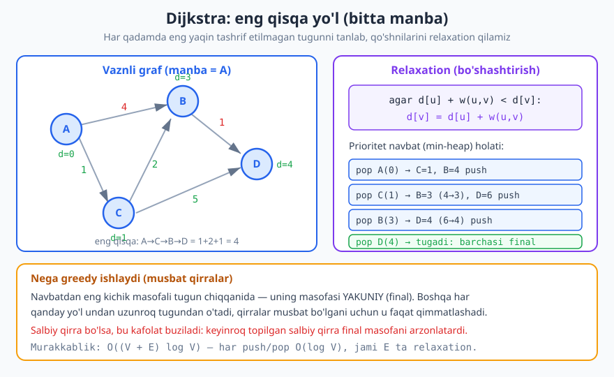
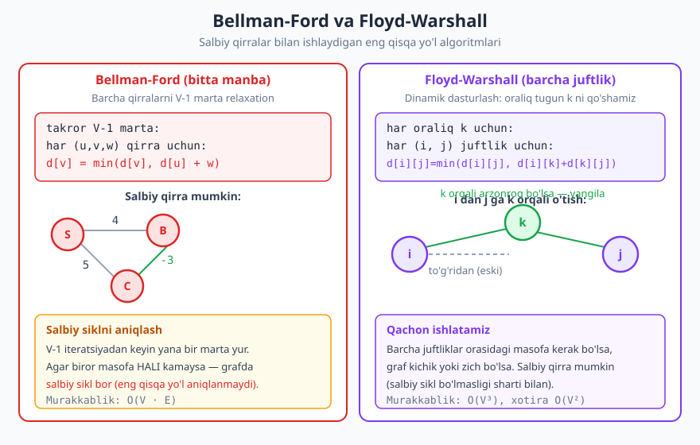
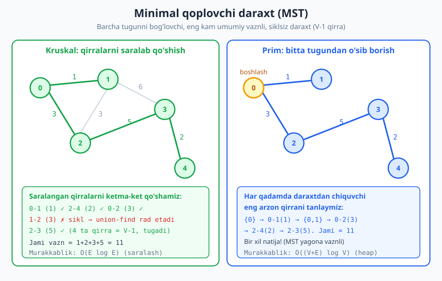

# 30 — Graf algoritmlari II: eng qisqa yo'l va MST

[⬅️ Oldingi: 29 — Graf algoritmlari I: BFS, DFS va qo'llanmalar](./29-graf-algoritmlari-1.md) · [🏠 README](./README.md) · [Keyingi: 31 — String algoritmlari ➡️](./31-string-algoritmlari.md)

---

> **Bu bobda:** Vaznli graflar ustidagi ikki klassik masalani chuqur o'rganamiz: **eng qisqa yo'l** (eng kam umumiy vaznli yo'l) va **minimal qoplovchi daraxt** (MST). Barcha eng qisqa yo'l algoritmlarining yadrosi — **relaxation** (bo'shashtirish) tushunchasi. So'ng **Dijkstra**, **Bellman-Ford** va **Floyd-Warshall** algoritmlarini, ularning farqlarini va qachon qaysisini ishlatishni ko'ramiz. Oxirida MST uchun **Kruskal** va **Prim** ni — ikkala greedy yondashuvni — tahlil qilamiz.
>
> **Halollik / Eslatma:** Barcha murakkablik chegaralari (Dijkstra `O((V+E) log V)`, Bellman-Ford `O(V·E)`, Floyd-Warshall `O(V³)`, Kruskal `O(E log E)`, Prim `O((V+E) log V)`) matematik aniq. To'g'rilik isbotlarini (greedy choice, cut property) biz **eskiz** darajasida beramiz — to'liq formal isbotni emas. Python namunalari haqiqatan ishga tushirilib tekshirilgan: chiqishlar — kod chiqargan haqiqiy natijalar.

---

## Vaznli graflar va ikki katta masala

Oldingi bobda [graflar va Union-Find](./21-graflar-union-find.md) hamda BFS/DFS bilan tanishdik. BFS vaznsiz grafda eng qisqa yo'lni (qirralar soni bo'yicha) topadi. Lekin real hayotda qirralar teng emas: ikki shahar orasidagi yo'l 50 km yoki 300 km bo'lishi mumkin; ikki router orasidagi kabel turli kechikishga ega; reys narxi turlicha. Bu **vaznli graf** — har qirraga `w(u, v)` soni (vazn, og'irlik) biriktirilgan graf.

Vaznli graflarda ikki asosiy masala tug'iladi:

1. **Eng qisqa yo'l (shortest path):** bir tugundan boshqasiga **eng kam umumiy vaznli** yo'lni top. "Eng kam qirra" emas — "eng kam yig'indi vazn". Ko'pincha ko'proq qirradan o'tgan yo'l arzonroq bo'ladi.
2. **Minimal qoplovchi daraxt (MST):** **barcha** tugunni bog'lab turuvchi, umumiy vazni eng kam bo'lgan qirralar to'plamini top. Yo'lni emas — butun grafni eng arzon "ushlab turish"ni qidiramiz.

Bu ikki masala bir-biriga o'xshasa-da, butunlay boshqa algoritmlarni talab qiladi. Birinchisidan boshlaymiz — lekin avval ularning umumiy "g'ishti" bo'lgan tushunchani aniqlaymiz.

## Relaxation — barcha eng qisqa yo'llarning yadrosi

Eng qisqa yo'l algoritmlari turlicha ko'rinsa-da, hammasining markazida bitta oddiy amal turadi: **relaxation** (bo'shashtirish, yumshatish).

Har tugun `v` uchun biz `d[v]` ni saqlaymiz — manbadan `v` gacha hozircha topilgan **eng yaxshi (eng kichik) masofa**. Boshida `d[manba] = 0`, qolganlari `d[v] = ∞` (cheksiz, ya'ni "hali yo'l topilmagan").

Relaxation g'oyasi shu: agar biror `u` tuguni orqali `v` ga yetish hozirgi `d[v]` dan **arzonroq** bo'lsa, masofani yangilaymiz:

```text
agar d[u] + w(u, v) < d[v]:
    d[v] = d[u] + w(u, v)
```

Ya'ni: "men `u` gacha `d[u]` masofada keldim; `u` dan `v` ga qirra `w(u, v)` turadi; demak `v` ga bu yo'l bilan `d[u] + w(u, v)` da yetaman. Agar bu hozirgi eng yaxshi yo'limdan qisqaroq bo'lsa — yangilayman."

> **Intuitsiya:** Tasavvur qiling, har tugunga rezina arqon bilan bog'langan belgi osilgan: belgi balandligi `d[v]`. Boshida hamma belgi cheksiz balandda. Relaxation — bu belgini pastga **tortish** (bo'shashtirish): topilgan har qisqaroq yo'l belgini biroz pastga tushiradi. Belgi hech qachon yuqoriga ko'tarilmaydi — faqat tushadi. Algoritm tugaganda har belgi haqiqiy eng qisqa masofada to'xtaydi.

Barcha farq — **qaysi tartibda va necha marta** relaxation qilishda. Dijkstra qirralarni aqlli (greedy) tartibda bir marta ishlatadi; Bellman-Ford hammasini ko'p marta takrorlaydi. Endi har birini ko'rib chiqamiz.

## Dijkstra algoritmi

**Dijkstra** algoritmi bitta manbadan barcha tugunlargacha eng qisqa yo'lni topadi — **lekin faqat barcha qirralar musbat bo'lganda** (salbiy qirra yo'q). Bu eng ko'p ishlatiladigan eng qisqa yo'l algoritmi: GPS navigatsiya, tarmoq marshrutlash, o'yinlardagi yo'l topish — hammasi shu g'oyaga tayanadi.



### Asosiy g'oya (greedy)

Dijkstra — bu **greedy** [algoritm](./24-greedy.md): har qadamda u **eng yaqin (eng kichik `d` li) tashrif etilmagan** tugunni tanlaydi, uni "yakuniy" (final) deb belgilaydi va qo'shnilarini relaxation qiladi.

Nega bu ishlaydi? Navbatdan **eng kichik** masofali tugun `u` chiqqanida, uning `d[u]` qiymati allaqachon yakuniydir. Sababi: `u` ga boshqa har qanday yo'l boshqa, hali tashrif etilmagan tugundan o'tishi kerak — lekin u tugunning masofasi `u` nikidan katta (axir biz eng kichikni tanladik), va qirralar musbat bo'lgani uchun u yo'l faqat qimmatlashadi. Demak `u` gacha bundan arzonroq yo'l yo'q.

> **Eslatma (nega salbiy qirra buzadi):** Yuqoridagi mulohaza "qirralar musbat" deb taxmin qiladi. Salbiy qirra bo'lsa, "boshqa tugundan o'tgan yo'l faqat qimmatlashadi" degan kafolat yo'qoladi — keyinroq topilgan salbiy qirra final deb belgilangan masofani arzonlatib yuborishi mumkin, lekin Dijkstra unga qaytib qaramaydi. Buni quyida konkret misolda ko'ramiz.

### Prioritet navbat bilan

"Eng yaqin tashrif etilmagan tugun"ni tez topish uchun **min-heap** (prioritet navbat) [ishlatamiz](./19-heap-priority-queue.md). Heap har doim eng kichik masofali tugunni `O(log V)` da beradi.

```python
import heapq

def dijkstra(graf, manba):
    # graf: {tugun: [(qo'shni, vazn), ...]}, barcha vazn >= 0
    masofa = {t: float('inf') for t in graf}
    masofa[manba] = 0
    navbat = [(0, manba)]              # (masofa, tugun) min-heap
    while navbat:
        d, u = heapq.heappop(navbat)  # eng kichik masofali tugun
        if d > masofa[u]:
            continue                  # eskirgan yozuv, e'tiborsiz qoldir
        for v, w in graf[u]:
            yangi = d + w
            if yangi < masofa[v]:     # relaxation
                masofa[v] = yangi
                heapq.heappush(navbat, (yangi, v))
    return masofa

graf = {
    'A': [('B', 4), ('C', 1)],
    'B': [('D', 1)],
    'C': [('B', 2), ('D', 5)],
    'D': [],
}
print(dijkstra(graf, 'A'))
# -> {'A': 0, 'B': 3, 'C': 1, 'D': 4}
```

E'tibor bering: to'g'ridan `A → B` qirrasi 4 turadi, lekin `A → C → B` yo'li `1 + 2 = 3` — arzonroq. Dijkstra buni topadi: `B` ning yakuniy masofasi 3, `D` niki esa `A → C → B → D = 1 + 2 + 1 = 4`.

> **Eslatma (`if d > masofa[u]`):** Bitta tugun heapga bir necha marta, har xil (yaxshilanayotgan) masofalar bilan tushishi mumkin. Biz uni heapdan o'chirib o'tirmaymiz — buning o'rniga heapdan chiqqan yozuvning masofasini joriy eng yaxshi masofa bilan solishtiramiz. Agar yozuv eskirgan bo'lsa (`d > masofa[u]`), uni shunchaki tashlab yuboramiz. Bu "lazy deletion" usuli kodni soddalashtiradi.

### Trassirovka

Yuqoridagi graf uchun (manba `A`) heap va masofalar qanday o'zgarishini kuzatamiz. `∞` — cheksiz.

| Qadam | Heapdan pop | `d[A]` | `d[B]` | `d[C]` | `d[D]` | Izoh |
|---|---|---|---|---|---|---|
| boshlang'ich | — | 0 | ∞ | ∞ | ∞ | faqat A ma'lum |
| 1 | A(0) | 0 | 4 | 1 | ∞ | B=4, C=1 relax |
| 2 | C(1) | 0 | **3** | 1 | 6 | B: 4→3 (A→C→B), D=6 |
| 3 | B(3) | 0 | 3 | 1 | **4** | D: 6→4 (A→C→B→D) |
| 4 | D(4) | 0 | 3 | 1 | 4 | hammasi yakuniy — tugadi |

Diqqat: `C` (masofa 1) `B` (masofa 4) dan oldin pop qilinadi — chunki heap eng kichikni beradi. Aynan shu tartib `B` ni 4 emas, 3 bilan yakunlashga imkon beradi.

### Nega salbiy qirra ishlamaydi — konkret misol

"Eng kichik masofali tugun chiqqach, u yakuniy" degan greedy kafolat salbiy qirrada buziladi. Quyidagi klassik Dijkstra (tugunni navbatdan chiqqach **final** deb belgilaydi) noto'g'ri javob beradi:

```python
import heapq

def dijkstra_klassik(graf, manba):
    masofa = {t: float('inf') for t in graf}
    masofa[manba] = 0
    navbat = [(0, manba)]
    final = {}
    while navbat:
        d, u = heapq.heappop(navbat)
        if u in final:
            continue
        final[u] = d                  # u final deb belgilandi - qaytmaymiz
        for v, w in graf[u]:
            if v not in final and d + w < masofa[v]:
                masofa[v] = d + w
                heapq.heappush(navbat, (d + w, v))
    return final

# A->T = 2, A->B = 3, B->T = -2 (salbiy qirra!)
graf = {
    'A': [('T', 2), ('B', 3)],
    'B': [('T', -2)],
    'T': [],
}
print(dijkstra_klassik(graf, 'A'))
# -> {'A': 0, 'T': 2, 'B': 3}
# AMMO haqiqiy eng qisqa A->T = min(2, 3 + (-2)) = 1  (A->B->T)
```

Nima bo'ldi? `T` masofasi 2 bilan `B` (masofasi 3) dan oldin pop qilinadi va **final** deb qulflanadi. Keyin `B` qayta ishlanganda `B → T = -2` qirrasi `T` ni `3 + (-2) = 1` ga arzonlatardi — lekin `T` allaqachon final, Dijkstra unga qaytib qaramaydi. Natijada `T = 2` — **noto'g'ri**, haqiqiy javob 1. Salbiy qirrali graf uchun bizga boshqa algoritm kerak.

> **Diqqat:** "Salbiy qirra"ni "salbiy sikl" bilan adashtirmang. Salbiy sikl (yig'indisi manfiy bo'lgan halqa) bo'lsa, eng qisqa yo'l **umuman aniqlanmaydi** (siklni cheksiz aylanib masofani `−∞` ga tushirish mumkin). Salbiy qirra esa o'zicha muammo emas — agar salbiy sikl bo'lmasa, eng qisqa yo'l mavjud, faqat Dijkstra uni topa olmaydi.

### Dijkstra murakkabligi

Min-heap bilan: har qirra ko'pi bilan bir marta relaxation qiladi va heapga bir `push` qo'shadi (`O(log V)`); har tugun bir marta pop qilinadi (`O(log V)`). Jami **`O((V + E) log V)`**. Bu siyrak graflar uchun juda tez — shuning uchun Dijkstra amalda eng ko'p qo'llaniladi.

## Bellman-Ford algoritmi

**Bellman-Ford** ham bitta manbadan eng qisqa yo'lni topadi, lekin **salbiy qirralar bilan ham ishlaydi** va undan ham muhimi — **salbiy siklni aniqlay oladi**. Bahosi: Dijkstradan sekinroq.



### G'oya: barcha qirrani V-1 marta relaxation

Bellman-Ford greedy tartibni butunlay tashlaydi. Buning o'rniga u **barcha qirralarni** `V - 1` marta relaxation qiladi.

Nega `V - 1` marta? Salbiy sikl bo'lmagan grafda eng qisqa yo'l ko'pi bilan `V - 1` qirradan iborat bo'ladi (aks holda yo'l biror tugunni ikki marta o'tib, sikl hosil qilardi — uni olib tashlash yo'lni qisqartiradi). Har "to'liq aylanish"da (barcha qirra ustidan bir marta o'tish) eng qisqa yo'lning **kamida bitta yangi qirrasi** to'g'ri hisoblanib qoladi. Demak `V - 1` aylanish butun yo'lni hisoblab tugatishga yetadi.

```python
def bellman_ford(n, qirralar, manba):
    # qirralar: [(u, v, vazn), ...]; tugunlar 0..n-1
    masofa = [float('inf')] * n
    masofa[manba] = 0
    for _ in range(n - 1):                    # V-1 marta
        for u, v, w in qirralar:              # barcha qirra
            if masofa[u] != float('inf') and masofa[u] + w < masofa[v]:
                masofa[v] = masofa[u] + w     # relaxation
    # V-chi marta: agar hali yangilansa -> salbiy sikl bor
    for u, v, w in qirralar:
        if masofa[u] != float('inf') and masofa[u] + w < masofa[v]:
            return None
    return masofa

# Salbiy qirrali (2->1 = -3), lekin salbiy siklsiz graf
qirralar = [(0, 1, 4), (0, 2, 5), (1, 3, 5), (2, 1, -3), (3, 2, -2)]
print(bellman_ford(4, qirralar, 0))    # -> [0, 2, 5, 7]

# Salbiy sikl: 1->2 (-3) va 2->1 (1) yig'indisi manfiy
qirralar2 = [(0, 1, 1), (1, 2, -3), (2, 1, 1)]
print(bellman_ford(3, qirralar2, 0))   # -> None
```

Birinchi grafda `0 → 2` to'g'ridan 5 turadi, `0 → 2 → 1` esa `5 + (-3) = 2` — salbiy qirra tufayli `1` gacha masofa 4 emas, 2 ga tushdi. Dijkstra bu salbiy qirrani to'g'ri ishlatolmas edi; Bellman-Ford ishlatadi.

### Salbiy siklni aniqlash

Mana Bellman-Ford ning eng kuchli xususiyati. Algoritm to'g'ri grafda `V - 1` aylanishdan keyin **barqarorlashishi** (boshqa hech narsa yangilanmasligi) kerak. Agar `V`-chi aylanishda biror masofa **hali ham kamaysa**, demak grafda salbiy sikl bor — masofa cheksiz pasaya beradi, hech qachon barqarorlashmaydi. Kodda buni oxirgi tekshiruv aniqlaydi va `None` qaytaradi.

### Trassirovka (V-1 = 3 aylanish)

`qirralar = [(0,1,4), (0,2,5), (1,3,5), (2,1,-3), (3,2,-2)]`, manba 0. Har aylanishdan keyingi masofalar (`∞` cheksiz):

| Holat | `d[0]` | `d[1]` | `d[2]` | `d[3]` | Izoh |
|---|---|---|---|---|---|
| boshlang'ich | 0 | ∞ | ∞ | ∞ | faqat manba |
| 1-aylanishdan keyin | 0 | 2 | 5 | 7 | (0,1):1=4; (0,2):2=5; (2,1):1=5−3=2; (1,3):3=2+5=7 |
| 2-aylanishdan keyin | 0 | 2 | 5 | 7 | o'zgarish yo'q — barqaror |
| 3-aylanishdan keyin | 0 | 2 | 5 | 7 | o'zgarish yo'q |
| V-chi (tekshiruv) | 0 | 2 | 5 | 7 | yangilanish yo'q → salbiy sikl yo'q ✓ |

Yakuniy javob `[0, 2, 5, 7]` — kod chiqargani bilan bir xil.

### Qachon Dijkstra o'rniga Bellman-Ford

- Grafda **salbiy qirralar** bo'lsa (Dijkstra ishonchsiz).
- Sizga **salbiy siklni aniqlash** kerak bo'lsa (masalan, valyuta arbitrajini topishda).
- Aks holda Dijkstra afzal: `O((V+E) log V)` Bellman-Ford ning `O(V·E)` sidan ancha tez.

## Floyd-Warshall — barcha juftliklar orasidagi eng qisqa yo'l

Yuqoridagi ikkala algoritm **bitta manbadan** masofa beradi. Agar bizga **har bir juft tugun** orasidagi eng qisqa yo'l kerak bo'lsa-chi? **Floyd-Warshall** aynan shu masalani hal qiladi — sodda, ixcham va salbiy qirralarni qo'llab-quvvatlaydigan **dinamik dasturlash** [yechimi](./25-dinamik-dasturlash.md).

### G'oya: oraliq tugun k ni qo'shib yaxshilash

`d[i][j]` ni `i` dan `j` ga eng qisqa masofa deb saqlaymiz. Boshida bu to'g'ridan-to'g'ri qirra (yoki `∞`). Keyin har bir tugun `k` ni **oraliq nuqta** sifatida ko'rib chiqamiz: "agar `i` dan `j` ga `k` orqali o'tish (`i → k → j`) hozirgi yo'ldan arzonroq bo'lsa — yangila".

```text
har oraliq k uchun:
  har (i, j) juftlik uchun:
    d[i][j] = min(d[i][j], d[i][k] + d[k][j])
```

DP "qatlami" shu: `k` ni 0 dan oxirigacha qo'shib borganimizda, `d[i][j]` "faqat `{0, 1, ..., k}` tugunlaridan oraliq sifatida foydalanadigan eng qisqa yo'l" ni ifodalaydi. `k` barcha tugunni qamragach, `d[i][j]` — haqiqiy eng qisqa masofa.

```python
def floyd_warshall(n, qirralar):
    INF = float('inf')
    d = [[INF] * n for _ in range(n)]
    for i in range(n):
        d[i][i] = 0
    for u, v, w in qirralar:
        d[u][v] = w
    for k in range(n):                    # oraliq tugun
        for i in range(n):
            for j in range(n):
                if d[i][k] + d[k][j] < d[i][j]:
                    d[i][j] = d[i][k] + d[k][j]
    return d

qirralar = [(0, 1, 4), (0, 2, 1), (2, 1, 2), (1, 3, 1), (2, 3, 5)]
for row in floyd_warshall(4, qirralar):
    print(row)
# -> [0, 3, 1, 4]
# -> [inf, 0, inf, 1]
# -> [inf, 2, 0, 3]
# -> [inf, inf, inf, 0]
```

Birinchi qatorga e'tibor bering: `0 → 1` to'g'ridan 4 turadi, lekin `0 → 2 → 1 = 1 + 2 = 3` arzonroq — Floyd-Warshall buni `k = 2` qatlamida topadi. Va `0 → 3` eng qisqasi `0 → 2 → 1 → 3 = 1 + 2 + 1 = 4`.

### Murakkablik va qachon ishlatiladi

Uch ichma-ich tsikl — **`O(V³)`** vaqt, **`O(V²)`** xotira. Bu kichik yoki zich graflar uchun ajoyib: kod uch qator, salbiy qirralarni qo'llab-quvvatlaydi (salbiy sikl bo'lmasa) va barcha juftlikni beradi. Lekin `V` katta (masalan 10 000) bo'lsa, `V³` juda qimmat — unda har tugundan Dijkstra ishlatish afzal.

> **Eslatma:** Floyd-Warshall ham salbiy siklni aniqlay oladi: algoritmdan keyin biror `d[i][i] < 0` bo'lsa, `i` salbiy siklda yotadi (o'ziga qaytib, manfiy yig'indi to'plagan).

## Solishtirish: qaysi algoritm qachon

Endi to'rt yondashuvni bir jadvalda ko'raylik. BFS [vaznsiz grafda](./29-graf-algoritmlari-1.md) eng qisqa yo'lni (qirralar soni) topishini eslang — vazn barobar bo'lsa, u eng tezi.

| Algoritm | Masala | Salbiy qirra | Salbiy sikl | Murakkablik | Qachon |
|---|---|---|---|---|---|
| **BFS** | bitta manba | — (vaznsiz) | — | `O(V + E)` | barcha qirra teng vaznli |
| **Dijkstra** | bitta manba | yo'q | — | `O((V+E) log V)` | musbat vaznli, tez kerak |
| **Bellman-Ford** | bitta manba | ha | aniqlaydi | `O(V · E)` | salbiy qirra / sikl tekshirish |
| **Floyd-Warshall** | barcha juftlik | ha | aniqlaydi | `O(V³)` | kichik/zich graf, barcha juft kerak |

> **Trade-off:** Tezlik va imkoniyat orasida tanlov. Dijkstra eng tez, lekin salbiy qirrani uddalay olmaydi. Bellman-Ford sekinroq, lekin universal va salbiy siklni topadi. Floyd-Warshall faqat barcha juftlik kerak bo'lganda va graf kichik bo'lganda mantiqiy. "Birini bilsa yetadi" degan yondashuv noto'g'ri — masalaning shartiga qarab tanlanadi.

## Minimal qoplovchi daraxt (MST)

Endi ikkinchi katta masalaga o'tamiz. Tasavvur qiling: bir nechta uyni elektr tarmog'iga ulashingiz kerak. Har ikki uy orasiga sim tortish mumkin, lekin har birining narxi (masofasi) har xil. Maqsad — **barcha uyni** ulab turuvchi, **umumiy sim uzunligi eng kam** bo'lgan tarmoqni qurish. Bu — **minimal qoplovchi daraxt** (Minimum Spanning Tree, MST) masalasi.



**Qoplovchi daraxt** (spanning tree) — grafning barcha tugunini o'z ichiga olgan, siklsiz va bog'langan qism-graf. `V` ta tugunli grafda har qoplovchi daraxt aynan `V - 1` qirradan iborat (daraxt ta'rifi). **Minimal** qoplovchi daraxt — barcha qoplovchi daraxtlar ichida umumiy vazni eng kichigi.

Qo'llanmasi: telekommunikatsiya/elektr/suv tarmoqlarini eng arzon qurish, klasterlash, sxema dizayni. Bu yerda **yo'l** emas — butun grafni eng arzon "ushlab turuvchi karkas" qidiriladi.

MST ikki klassik greedy algoritmga ega: **Kruskal** va **Prim**. Ikkalasi ham greedy, ikkalasi ham optimal natija beradi.

### Kruskal: qirralarni saralab, sikl hosil qilmasa qo'sh

Kruskal eng intuitiv yondashuv: **barcha qirrani vazn bo'yicha o'sish tartibida sarala**, so'ng eng arzonidan boshlab birma-bir ko'rib chiq — agar qirra **sikl hosil qilmasa**, daraxtga qo'sh; aks holda tashla. `V - 1` qirra to'planganda tugadi.

Asosiy savol: "bu qirra sikl hosil qiladimi?" Buni tez tekshirish uchun **Union-Find** [strukturasini](./21-graflar-union-find.md) ishlatamiz. Qirra `(u, v)` sikl hosil qiladi **agar va faqat** `u` va `v` allaqachon bir komponentda bo'lsa (`find(u) == find(v)`). Aks holda `union(u, v)` qilib qirrani qo'shamiz.

```python
def kruskal(n, qirralar):
    # qirralar: [(vazn, u, v), ...]
    ota = list(range(n))
    def find(x):
        while ota[x] != x:
            ota[x] = ota[ota[x]]          # yo'l qisqartirish
            x = ota[x]
        return x
    mst, jami = [], 0
    for w, u, v in sorted(qirralar):      # vazn bo'yicha saralangan
        ru, rv = find(u), find(v)
        if ru != rv:                      # sikl hosil qilmasa
            ota[ru] = rv
            mst.append((u, v, w))
            jami += w
    return mst, jami

qirralar = [(1, 0, 1), (3, 0, 2), (3, 1, 2), (6, 1, 3),
            (5, 2, 3), (2, 2, 4), (6, 3, 4)]
mst, jami = kruskal(5, qirralar)
print(mst)            # -> [(0, 1, 1), (2, 4, 2), (0, 2, 3), (2, 3, 5)]
print("Jami:", jami)  # -> Jami: 11
```

### Kruskal trassirovkasi

Saralangan qirralar va Union-Find qaroriga qarab kuzatamiz (`{}` — komponentlar):

| Qirra (vazn) | `find` teng? | Qaror | MST qirralari | Komponentlar |
|---|---|---|---|---|
| 0–1 (1) | yo'q | qo'sh ✓ | {0-1} | {0,1} {2} {3} {4} |
| 2–4 (2) | yo'q | qo'sh ✓ | +{2-4} | {0,1} {2,4} {3} |
| 0–2 (3) | yo'q | qo'sh ✓ | +{0-2} | {0,1,2,4} {3} |
| 1–2 (3) | **ha** | tashla ✗ (sikl) | — | {0,1,2,4} {3} |
| 2–3 (5) | yo'q | qo'sh ✓ | +{2-3} | {0,1,2,3,4} |

4 ta qirra (`V - 1 = 4`) to'plandi — tugadi. Qolgan `1–3 (6)`, `3–4 (6)` ko'rilmaydi ham. Jami vazn `1 + 2 + 3 + 5 = 11`. Diqqat: `1–2 (3)` qirrasi vazn jihatdan `0–2 (3)` bilan teng bo'lsa-da, ikkinchisi sikl yopgani uchun rad etildi.

### Prim: bitta tugundan o'sib borish

**Prim** boshqa tomondan yondashadi. Bitta tugundan boshlaymiz va daraxtni **bittadan tugun** qo'shib o'stiramiz: har qadamda **daraxtdan tashqariga chiquvchi eng arzon qirra**ni tanlab, u qirra ulaydigan yangi tugunni daraxtga qo'shamiz. Bu Dijkstraga o'xshaydi — yana **min-heap** ishlatamiz, lekin "manbadan to'liq masofa" emas, "daraxtga ulaydigan bitta qirra vazni" bo'yicha.

```python
import heapq

def prim(graf, boshlash):
    # graf: {tugun: [(qo'shni, vazn), ...]}  (yo'naltirilmagan)
    tashrif = {boshlash}
    navbat = [(w, boshlash, v) for v, w in graf[boshlash]]
    heapq.heapify(navbat)
    mst, jami = [], 0
    while navbat and len(tashrif) < len(graf):
        w, u, v = heapq.heappop(navbat)   # eng arzon chiquvchi qirra
        if v in tashrif:
            continue                      # ikki uchi ham daraxtda — tashla
        tashrif.add(v)
        mst.append((u, v, w))
        jami += w
        for keyingi, ww in graf[v]:
            if keyingi not in tashrif:
                heapq.heappush(navbat, (ww, v, keyingi))
    return mst, jami

graf = {
    0: [(1, 1), (2, 3)],
    1: [(0, 1), (2, 3), (3, 6)],
    2: [(0, 3), (1, 3), (3, 5), (4, 2)],
    3: [(1, 6), (2, 5), (4, 6)],
    4: [(2, 2), (3, 6)],
}
print(prim(graf, 0))
# -> ([(0, 1, 1), (0, 2, 3), (2, 4, 2), (2, 3, 5)], 11)
```

Bu — Kruskal ishlatgani bilan **bir xil graf** (faqat boshqa ko'rinishda), va natija ham bir xil: jami vazn **11**. MST yagona (bu grafda barcha qirra vaznlari deyarli farqli), shuning uchun ikki algoritm bir xil daraxtni topadi.

### Nega ikkalasi ham optimal — cut property

Ikkala algoritmning to'g'riligi bitta chiroyli faktga tayanadi — **cut property** (kesim xususiyati).

> **Isbot (eskiz) — cut property:** Grafni ikki bo'lakka ajrating (har qanday "kesim"). Bu kesimni **kesib o'tuvchi** (bir tomondan ikkinchisiga boruvchi) barcha qirralar ichida **eng yengili** har doim **biror** MST ga tegishli bo'ladi.
>
> Nega? Faraz qilaylik, kesimning eng yengil qirrasi `e` biror MST `T` ga kirmagan. `T` ga `e` ni qo'shsak, sikl hosil bo'ladi (daraxtga qirra qo'shish doim sikl yasaydi). Bu sikl kesimni **kamida ikki marta** kesib o'tadi — demak siklda `e` dan boshqa, kesimni kesuvchi qirra `e'` bor. `e` eng yengil bo'lgani uchun `w(e) ≤ w(e')`. Endi `T` dan `e'` ni olib, `e` ni qo'ysak — yana daraxt, lekin vazni katta emas. Demak `e` ni o'z ichiga olgan, vazni `T` dan kichik bo'lmagan MST mavjud. ∎

Kruskal va Prim aynan shuni qiladi, faqat har xil kesim bilan:
- **Kruskal** har qadamda eng yengil qirrani oladi, agar u ikki *alohida* komponentni bog'lasa — bu komponentlarni ajratuvchi kesimning eng yengil qirrasi.
- **Prim** har qadamda daraxt va qolgan grafni ajratuvchi kesimning eng yengil chiquvchi qirrasini oladi.

Ikkalasida ham har tanlangan qirra cut property bo'yicha *biror* MST ga tegishli — shuning uchun yakuniy natija optimal.

### Kruskal va Prim ni solishtirish

| | Kruskal | Prim |
|---|---|---|
| Yondashuv | qirralarni saralab qo'shish | tugundan o'sib borish |
| Asosiy struktura | Union-Find | min-heap |
| Murakkablik | `O(E log E)` | `O((V+E) log V)` |
| Qaysi grafga qulay | **siyrak** (E kichik) | **zich** (E katta) |

Amalda: siyrak grafda (kam qirra) Kruskal sodda va tez; zich grafda (ko'p qirra) Prim ko'pincha afzal. Lekin ikkalasi ham bir xil optimal MST ni beradi.

## Asosiy g'oyalar (bobni qisqacha)

- **Relaxation** — barcha eng qisqa yo'l algoritmlarining yadrosi: `d[u] + w(u,v) < d[v]` bo'lsa, `d[v]` ni yangila. Masofa faqat kamayadi.
- **Dijkstra** `O((V+E) log V)`: greedy + min-heap, har qadamda eng yaqin tugunni final qiladi. **Faqat musbat qirralar** — salbiy qirrada buziladi.
- **Bellman-Ford** `O(V·E)`: barcha qirrani `V-1` marta relaxation. Salbiy qirra bilan ishlaydi va `V`-chi iteratsiyada **salbiy siklni aniqlaydi**.
- **Floyd-Warshall** `O(V³)`: DP, oraliq tugun `k` ni qo'shib barcha juftlik masofasini topadi. Kichik/zich graf uchun.
- **MST** — barcha tugunni eng kam umumiy vazn bilan bog'lovchi siklsiz daraxt (`V-1` qirra).
- **Kruskal** `O(E log E)`: qirralarni saralab, sikl yopmasa qo'sh (Union-Find bilan tekshir). **Prim** `O((V+E) log V)`: tugundan eng arzon qirra bilan o'sib bor (heap).
- Ikkala MST algoritmi ham greedy va **cut property** tufayli optimal.

## Mashqlar

### Oson

**1-mashq.** `d[u] = 5`, `w(u, v) = 3`, va hozir `d[v] = 10`. Relaxation qadamidan keyin `d[v]` qanday bo'ladi? Agar `d[v] = 7` bo'lsa-chi?

**2-mashq.** "Minimal qoplovchi daraxt" deganda nima tushuniladi? `V = 6` tugunli bog'langan grafda MST nechta qirradan iborat bo'ladi?

**3-mashq.** Quyidagilardan qaysi biri to'g'ri? (a) Dijkstra salbiy qirralar bilan ishlaydi. (b) Bellman-Ford salbiy siklni aniqlay oladi. (c) Floyd-Warshall bitta manbadan masofa beradi.

### O'rta

**4-mashq.** Quyidagi grafda (manba `A`) Dijkstra bilan barcha masofalarni qo'lda hisoblang. Qirralar (yo'naltirilgan): `A→B = 2`, `A→C = 5`, `B→C = 1`, `B→D = 7`, `C→D = 2`.

**5-mashq.** Quyidagi qirralarda (vazn, u, v) Kruskal bilan MST ni qo'lda toping va jami vaznini ayting: `(1, 0, 1)`, `(4, 0, 2)`, `(2, 1, 2)`, `(3, 1, 3)`, `(5, 2, 3)`. Tugunlar 0..3.

**6-mashq.** Har holat uchun qaysi algoritm to'g'ri keladi? (a) GPS, barcha yo'l masofasi musbat, bitta manzilga. (b) Valyuta kurslari grafida foydali arbitraj (salbiy sikl) bor-yo'qligini tekshirish. (c) 200 ta shahar orasidagi **barcha** juft masofalar jadvali kerak.

### Qiyin

**7-mashq.** Dijkstra (heapq bilan) ni o'zingiz yozing va kichik grafda natijani tekshiring. Funksiya manbadan barcha tugungacha masofa lug'atini qaytarsin.

**8-mashq.** Bellman-Ford ni yozing, shunday qilib salbiy sikl bo'lsa `None` qaytarsin. Salbiy siklli kichik grafda sinab ko'ring.

**9-mashq.** `A→B = 1`, `A→C = 4`, `B→C = -3` grafida Dijkstra (final-belgilovchi) noto'g'ri javob berishini ko'rsating: haqiqiy `A→C` masofasi necha, Dijkstra qancha deydi, va nima uchun?

**10-mashq.** Prim va Kruskal ni qisqa solishtiring: qaysi struktura, qaysi murakkablik, qaysi turdagi grafga (siyrak/zich) qaysi biri qulayroq va nega.

<details markdown="1">
<summary>Yechimlar</summary>

### 1-mashq yechimi

Relaxation sharti: `d[u] + w(u,v) < d[v]`, ya'ni `5 + 3 = 8 < 10` — **rost**, demak `d[v]` yangilanadi: `d[v] = 8`.

Agar `d[v] = 7` bo'lsa: `8 < 7` — **yolg'on**, yangilanish bo'lmaydi, `d[v] = 7` qoladi. Masofa hech qachon ko'paymaydi — relaxation faqat kamaytiradi.

### 2-mashq yechimi

MST — bog'langan vaznli grafning **barcha tugunini** o'z ichiga olgan, **siklsiz** (daraxt) va **umumiy vazni eng kam** bo'lgan qism-graf. `V = 6` tugunli grafda har qoplovchi daraxt aynan `V - 1 = 5` qirradan iborat.

### 3-mashq yechimi

- (a) **Noto'g'ri** — Dijkstra faqat musbat qirralar bilan ishonchli; salbiy qirrada buziladi.
- (b) **To'g'ri** — Bellman-Ford `V`-chi iteratsiyada hali yangilanish bo'lsa, salbiy sikl borligini aniqlaydi.
- (c) **Noto'g'ri** — Floyd-Warshall **barcha juftlik** orasidagi masofani beradi, bitta manbadan emas.

### 4-mashq yechimi

Min-heap holatini kuzatamiz (manba `A`):

| Qadam | Pop | `d[A]` | `d[B]` | `d[C]` | `d[D]` |
|---|---|---|---|---|---|
| boshlang'ich | — | 0 | ∞ | ∞ | ∞ |
| 1 | A(0) | 0 | 2 | 5 | ∞ |
| 2 | B(2) | 0 | 2 | **3** | 9 |
| 3 | C(3) | 0 | 2 | 3 | **5** |
| 4 | D(5) | 0 | 2 | 3 | 5 |

`B` orqali `C` 5 dan 3 ga (`A→B→C = 2+1`), `D` esa `A→B→C→D = 3+2 = 5` ga tushdi. Yakuniy: `A=0, B=2, C=3, D=5`.

### 5-mashq yechimi

Saralangan qirralar: `(1,0-1)`, `(2,1-2)`, `(3,1-3)`, `(4,0-2)`, `(5,2-3)`.

| Qirra (vazn) | Sikl? | Qaror |
|---|---|---|
| 0–1 (1) | yo'q | qo'sh ✓ |
| 1–2 (2) | yo'q | qo'sh ✓ |
| 1–3 (3) | yo'q | qo'sh ✓ |
| 0–2 (4) | **ha** ({0,1,2} bir to'plamda) | tashla ✗ |
| 2–3 (5) | **ha** | tashla ✗ |

`V - 1 = 3` qirra to'plandi: `0-1, 1-2, 1-3`. Jami vazn `1 + 2 + 3 = 6`.

### 6-mashq yechimi

- (a) **Dijkstra** — musbat qirralar, bitta manba, tez kerak.
- (b) **Bellman-Ford** — salbiy siklni aniqlash uchun (arbitraj = manfiy yig'indili sikl).
- (c) **Floyd-Warshall** — barcha juftlik masofasi, `V = 200` kichik (`200³ = 8 mln` amal — arzon).

### 7-mashq yechimi

```python
import heapq

def dijkstra(graf, manba):
    masofa = {t: float('inf') for t in graf}
    masofa[manba] = 0
    navbat = [(0, manba)]
    while navbat:
        d, u = heapq.heappop(navbat)
        if d > masofa[u]:
            continue
        for v, w in graf[u]:
            if d + w < masofa[v]:
                masofa[v] = d + w
                heapq.heappush(navbat, (d + w, v))
    return masofa

graf = {
    'A': [('B', 4), ('C', 1)],
    'B': [('D', 1)],
    'C': [('B', 2), ('D', 5)],
    'D': [],
}
print(dijkstra(graf, 'A'))  # -> {'A': 0, 'B': 3, 'C': 1, 'D': 4}
```

`B` ning masofasi 4 emas 3 — chunki `A→C→B = 1+2` arzonroq; `D = A→C→B→D = 4`.

### 8-mashq yechimi

```python
def bellman_ford(n, qirralar, manba):
    masofa = [float('inf')] * n
    masofa[manba] = 0
    for _ in range(n - 1):
        for u, v, w in qirralar:
            if masofa[u] != float('inf') and masofa[u] + w < masofa[v]:
                masofa[v] = masofa[u] + w
    for u, v, w in qirralar:              # V-chi tekshiruv
        if masofa[u] != float('inf') and masofa[u] + w < masofa[v]:
            return None                   # salbiy sikl
    return masofa

# salbiy sikl: 1->2 (-3), 2->1 (1) => yig'indi -2
print(bellman_ford(3, [(0, 1, 1), (1, 2, -3), (2, 1, 1)], 0))  # -> None
# salbiy siklsiz:
print(bellman_ford(3, [(0, 1, 1), (1, 2, -3), (0, 2, 5)], 0))  # -> [0, 1, -2]
```

Birinchi grafda `1↔2` salbiy sikl — `None`. Ikkinchisida sikl yo'q: `0→1→2 = 1 + (-3) = -2`, javob `[0, 1, -2]`.

### 9-mashq yechimi

Graf: `A→B = 1`, `A→C = 4`, `B→C = -3`.

- **Haqiqiy** eng qisqa `A→C = min(4, 1 + (-3)) = min(4, -2) = -2` (yo'l `A→B→C`).
- **Dijkstra (final-belgilovchi)**: heapdan `B(1)` chiqib qayta ishlanadi, `C` ni `1 + (-3) = -2` ga relax qiladi... lekin bu yerda nozik nuqta tartibga bog'liq. Asosiy buzilish shu: Dijkstra tugunni final qulflagach, unga **salbiy qirra orqali keyin keladigan yaxshilanish**ni e'tiborga olmaydi. Boshqa bir tartibda (`C` ning to'g'ridan masofasi `B` nikidan kichik bo'lsa) `C` erta `4` da qulflanib, `B→C = -3` orqali `-2` ga tushishi e'tiborsiz qolardi.

Aniq buzilish misoli (bobdagi): `A→T = 2`, `A→B = 3`, `B→T = -2`. Dijkstra `T` ni 2 da qulflaydi (`B` dan oldin pop qilinadi), keyin `B→T = -2` qirrasi `T` ni `3 - 2 = 1` ga tushirardi — lekin `T` allaqachon final, qaralmaydi. Dijkstra `T = 2` deydi, haqiqiy javob esa **1**. Umumiy xulosa: **final qulflash greedy kafolati faqat musbat qirralar uchun amal qiladi**; salbiy qirrada keyin kelgan arzonroq yo'l yo'qolib qoladi, shuning uchun bunday grafda Bellman-Ford ishlatiladi.

### 10-mashq yechimi

| | Kruskal | Prim |
|---|---|---|
| Asosiy struktura | Union-Find (sikl tekshirish) | min-heap (eng arzon chiquvchi qirra) |
| Yondashuv | global: barcha qirrani saralab, arzonidan qo'sh | lokal: bitta tugundan o'sib bor |
| Murakkablik | `O(E log E)` (saralash hukmron) | `O((V+E) log V)` |
| Qulay graf | **siyrak** (E kichik) — saralash arzon | **zich** (E katta) — har qadam lokal |

Ikkalasi ham greedy va **cut property** tufayli optimal — bir xil minimal vaznli MST beradi (vaznlar yagona bo'lsa, aynan bir xil daraxt). Siyrak grafda Kruskal sodda va tez (kam qirrani saralash); zich grafda (qirralar `V²` ga yaqin) Prim ko'pincha afzal, chunki u qirralarning hammasini global saralamaydi, faqat kesimning chiquvchilarini heapda boshqaradi.

</details>

---

[⬅️ Oldingi: 29 — Graf algoritmlari I: BFS, DFS va qo'llanmalar](./29-graf-algoritmlari-1.md) · [🏠 README](./README.md) · [Keyingi: 31 — String algoritmlari ➡️](./31-string-algoritmlari.md)
