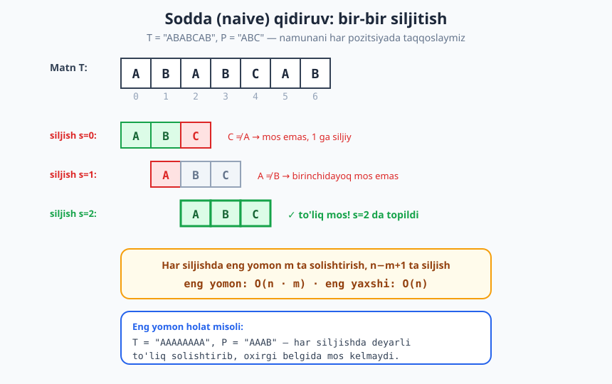
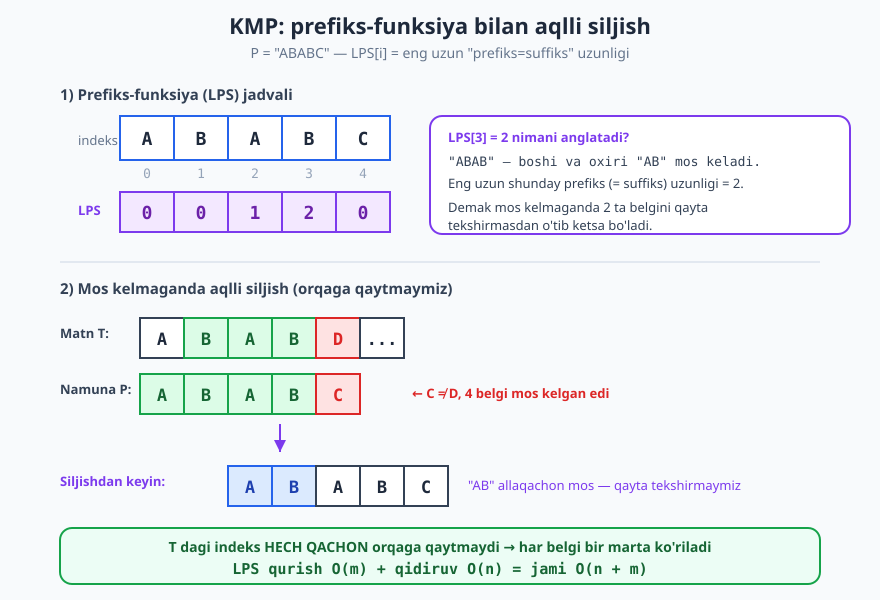
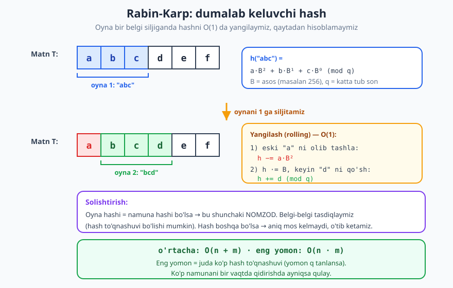

# 31 — String algoritmlari

[⬅️ Oldingi: 30 — Graf algoritmlari II: eng qisqa yo'l va MST](./30-graf-algoritmlari-2.md) · [🏠 README](./README.md) · [Keyingi: 32 — Hisoblash murakkabligi: P, NP va NP-to'liqlik ➡️](./32-p-np-murakkablik-nazariyasi.md)

---

> **Bu bobda:** Matn ichidan namuna (pattern) qidirishning klassik algoritmlarini o'rganamiz: sodda (naive) usul, **KMP** (Knuth-Morris-Pratt) o'zining **prefiks-funksiyasi** bilan, **Rabin-Karp** o'zining **dumalab keluvchi hashi** (rolling hash) bilan va **Boyer-Moore** g'oyasi. Har birining nima uchun ishlashini (to'g'riligini) va aniq murakkabligini tushunamiz, so'ng Python'da yozib, ishga tushirib ko'ramiz. Oxirida anagram, palindrom, eng uzun umumiy qism-satr kabi boshqa string masalalariga qisqa nazar tashlaymiz.
>
> **Halollik / Eslatma:** Murakkablik chegaralari (naive `O(n·m)`, KMP `O(n+m)`, Rabin-Karp o'rtacha `O(n+m)`) matematik aniq va to'g'ri. KMP prefiks-funksiyasining `O(m)` ekani amortizatsiyalangan dalilga tayanadi — uni sodda til bilan tushuntiramiz. Boyer-Moore qismi **ataylab yuzaki** (faqat g'oya). Barcha Python namunalari haqiqatan ishga tushirib tekshirilgan; ko'rsatilgan chiqishlar — kod bergan haqiqiy natijalar.

---

## Nega string algoritmlari muhim

Kompyuterda matn — hamma joyda. Siz brauzerda `Ctrl+F` bosib so'z qidirganingizda, tahrirlovchida "topish va almashtirish" qilganingizda, `grep` bilan log fayllarni izlaganingizda, biolog DNK ketma-ketligidan (`AGCT...`) ma'lum gen-naqshini topganda, antivirus fayl ichidan zararli kod "imzosini" qidirganda — barchasining tagida **bitta umumiy savol** turadi:

> **"Katta matn `T` ichida kichik namuna `P` qayerlarda uchraydi?"**

Bu **pattern matching** (namuna qidirish) muammosi. Belgilashlar shu bob davomida o'zgarmaydi:

- `T` — **matn** (text), uzunligi `n`.
- `P` — **namuna** (pattern), uzunligi `m`, odatda `m ≤ n`.
- Maqsad: `T` ning `P` to'liq mos keladigan barcha **boshlanish indekslarini** topish.

Masalan, `T = "ABABCAB"`, `P = "AB"` bo'lsa, javob `[0, 2, 5]` — chunki `AB` aynan shu uchta pozitsiyadan boshlanadi.

Bu oddiy ko'rinadigan masala aslida boy: undan kelib chiqadigan algoritmlar **hash**, **avtomat (holatlar mashinasi)** va **amortizatsiyalangan tahlil** kabi chuqur g'oyalarni birlashtiradi. Keling, eng soddasidan boshlaylik.

## Sodda (naive) algoritm

**Intuitsiya.** Namunani matn ustiga qo'yib, chapdan o'ngga **bir-bir siljitamiz**. Har pozitsiyada namuna belgilarini matnnikilar bilan solishtiramiz: hammasi mos kelsa — topdik; biror joyda mos kelmasa — namunani **bitta** o'ngga suramiz va qaytadan boshlaymiz.



Diagrammada `T = "ABABCAB"`, `P = "ABC"`:

- `s = 0`: `A`, `B` mos, lekin `C ≠ A` — mos emas, 1 ga siljiymiz.
- `s = 1`: birinchi belgidayoq `A ≠ B` — mos emas.
- `s = 2`: `A`, `B`, `C` — uchalasi mos! Topildi, `s = 2`.

```text
NAIVE-SEARCH(T, P):
    n = len(T);  m = len(P)
    for s = 0 .. n-m:               # har bir mumkin bo'lgan siljish
        j = 0
        while j < m and T[s+j] == P[j]:
            j = j + 1
        if j == m:                   # m ta belgi to'liq mos keldi
            "topildi: s"
```

**Trassirovka** (`T = "ABABCAB"`, `P = "AB"`):

| Siljish `s` | Solishtirishlar | Natija |
|---|---|---|
| 0 | `T[0]=A=P[0]`, `T[1]=B=P[1]` | ✓ mos (s=0) |
| 1 | `T[1]=B ≠ P[0]=A` | mos emas |
| 2 | `T[2]=A=P[0]`, `T[3]=B=P[1]` | ✓ mos (s=2) |
| 3 | `T[3]=B ≠ A` | mos emas |
| 4 | `T[4]=C ≠ A` | mos emas |
| 5 | `T[5]=A=P[0]`, `T[6]=B=P[1]` | ✓ mos (s=5) |

Javob: `[0, 2, 5]`.

**Murakkablik.** Tashqi tsikl `n − m + 1` marta aylanadi, ichkarida eng yomon holda `m` ta solishtirish. Demak eng yomon vaqt:

$$O((n - m + 1) \cdot m) = O(n \cdot m)$$

Eng yomon holatga klassik misol — `T = "AAAA...A"` (n ta `A`), `P = "AAA...AB"`. Har siljishda namunaning deyarli hammasi mos keladi, faqat oxirgi `B` da uziladi — ya'ni deyarli har safar to'liq `m` ta solishtirish bekorga ketadi. Eng yaxshi holat esa `O(n)` (har siljishda birinchi belgidayoq uziladi).

> **Eslatma:** Naive algoritm yomon emas! Kichik matnlar, qisqa namunalar va kam takrorlanadigan alifbo (masalan oddiy ingliz matni) uchun amalda juda tez va eng sodda. Murakkabroq algoritmlar faqat *katta* matn yoki *patologik* holatlar uchun kerak bo'ladi.

**Nega naive ko'pincha isrof qiladi?** `s = 0` da biz `T[0..1] = "AB"` mos kelganini *allaqachon bilib oldik*. `s = 1` ga o'tganda esa bu ma'lumotni **tashlab yuboramiz** — go'yo hech narsa bilmagandek noldan boshlaymiz. Aynan shu isrofni KMP bartaraf qiladi.

## KMP: allaqachon bilgan narsani unutmaslik

**Intuitsiya.** Faraz qilaylik, namunaning bir necha belgisi mos keldi-yu, keyin uzildi. Naive algoritm namunani **1 ga** suradi. Ammo biz mos kelgan qismni *o'qib bo'lganmiz* — undan foydalanib, namunani **bir necha belgi oldinga** sakratish va matnning o'qilgan qismini **qayta tekshirmaslik** mumkin emasmi?

KMP (Knuth-Morris-Pratt, 1977) aynan shu g'oyani aniq qoidaga aylantiradi. Kalit tushuncha — **prefiks-funksiya** (uni **LPS jadvali** ham deyishadi: *Longest Proper Prefix which is also Suffix* — eng uzun haqiqiy prefiks, bir vaqtda suffiks ham bo'lgan).

### Prefiks-funksiya (LPS) nima

Namunaning har bir prefiksi `P[0..i]` uchun savol: uning **boshi** (prefiksi) va **oxiri** (suffiksi) bo'lib bir vaqtda mos keladigan eng uzun bo'lak qancha? ("Haqiqiy" — ya'ni butun bo'lakning o'zi hisobga olinmaydi.)

`LPS[i]` = `P[0..i]` ning eng uzun "prefiks=suffiks" uzunligi.



Misol — `P = "ABABC"`:

| `i` | `P[0..i]` | Eng uzun prefiks=suffiks | `LPS[i]` |
|---|---|---|---|
| 0 | `A` | (yo'q) | 0 |
| 1 | `AB` | (yo'q) | 0 |
| 2 | `ABA` | `A` | 1 |
| 3 | `ABAB` | `AB` | 2 |
| 4 | `ABABC` | (yo'q, `C` buzdi) | 0 |

`LPS[3] = 2` ning ma'nosi: `"ABAB"` ning boshidagi `"AB"` va oxiridagi `"AB"` bir xil. Demak agar matnda `"ABAB"` mos kelib, keyingi belgi uzilsa, biz **oxirgi `"AB"`** ni **boshidagi `"AB"`** sifatida qayta ishlatib, namunani shunday suramizki, `"AB"` allaqachon joyida turadi — uni **qayta solishtirmaymiz**.

### Prefiks-funksiyani hisoblash

LPS ni hisoblash o'zi ham nafis — namuna uni o'z-o'ziga taqqoslab quradi:

```python
def lps_jadval(pattern):
    m = len(pattern)
    lps = [0] * m
    k = 0                                # hozirgi prefiks=suffiks uzunligi
    for i in range(1, m):
        while k > 0 and pattern[i] != pattern[k]:
            k = lps[k - 1]               # qisqaroq prefiksga "qaytamiz"
        if pattern[i] == pattern[k]:
            k += 1
        lps[i] = k
    return lps

print(lps_jadval("ABABC"))               # -> [0, 0, 1, 2, 0]
print(lps_jadval("AAAA"))                # -> [0, 1, 2, 3]
print(lps_jadval("ABCDE"))               # -> [0, 0, 0, 0, 0]
```

**Nega bu `O(m)`?** Birinchi qarashda ichki `while` tsikli qo'rqitadi — go'yo har `i` uchun ko'p marta aylanishi mumkin. Ammo `k` ni kuzating: u har `i` da **ko'pi bilan 1 ga oshadi** (`k += 1` faqat bir marta). `while` esa har safar `k` ni **kamaytiradi**. `k` hech qachon manfiy bo'lmaydi va jami `m` martadan ko'p oshmaydi — demak jami `m` martadan ko'p kamaya ham olmaydi. Shuning uchun ichki tsiklning **umumiy** ishlashlari soni `O(m)` bilan chegaralangan. Bu — [amortizatsiyalangan tahlil](./11-amortizatsiyalangan-tahlil.md) ning klassik namunasi: alohida qadam qimmat ko'rinadi, lekin "byudjet" cheklangan.

### KMP qidiruv

Endi LPS yordamida asosiy qidiruvni yozamiz. Sehr shundaki, matndagi indeks `i` **hech qachon orqaga qaytmaydi**:

```python
def kmp_search(text, pattern):
    n, m = len(text), len(pattern)
    if m == 0:
        return []
    lps = lps_jadval(pattern)
    natijalar = []
    j = 0                                # namunada nechta belgi mos kelgan
    for i in range(n):                   # i — matnda; HECH QACHON orqaga qaytmaydi
        while j > 0 and text[i] != pattern[j]:
            j = lps[j - 1]               # aqlli siljish
        if text[i] == pattern[j]:
            j += 1
        if j == m:                       # to'liq mos
            natijalar.append(i - m + 1)
            j = lps[j - 1]               # keyingisini qidirishda davom etamiz
    return natijalar

print(kmp_search("ABABDABACDABABCABAB", "ABABCABAB"))  # -> [10]
print(kmp_search("AAAAA", "AA"))                       # -> [0, 1, 2, 3]
print(kmp_search("ABABCAB", "AB"))                     # -> [0, 2, 5]
```

**Nega to'g'ri ishlaydi (eskiz).** Sikl invarianti: tsiklning har takrori boshida `j` — `P` ning matnda `T[i-1]` da tugaydigan **eng uzun prefiksi** uzunligi. Mos kelmaganda `j = lps[j-1]` qilamiz: bu — biz mos kelgan `j` ta belgini buzmasdan, namunaning **keyingi eng uzun mos prefiksiga** o'tish. LPS ta'rifi bunday prefiks `T` dagi joriy joyga mos kelishini **kafolatlaydi**, shuning uchun matn indeksini orqaga olmaymiz. `j` `m` ga yetganda — to'liq mos topildi.

**Murakkablik.** LPS qurish `O(m)`, qidiruv `O(n)` (yuqoridagi amortizatsiya: `j` ko'pi bilan `n` marta oshadi, demak ko'pi bilan `n` marta kamayadi). Jami:

$$O(n + m)$$

— matn uzunligiga **chiziqli**, holat qanchalik patologik bo'lmasin. Bu naive ning `O(n·m)` eng yomon holatidan keskin yaxshiroq.

## Rabin-Karp: namunani songa aylantirish

**Intuitsiya.** Ikki satrni belgi-belgi solishtirish qimmat. Agar har satrning o'rniga uning **hash kodini** (bitta son) saqlasak-chi? Unda `m` ta belgili namunani har oyna bilan solishtirish `O(m)` o'rniga **`O(1)`** ga (bitta son tengligiga) aylanadi. Muammo: har oynaning hashini noldan hisoblash yana `O(m)` — bu hech narsa yutmaydi. Yechim — **dumalab keluvchi hash** (rolling hash).



**Rolling hash g'oyasi.** Satrni `B` asosli sanoq sistemasidagi son deb qaraymiz (xuddi [hash jadval](./15-hash-jadval.md) dagi polinomial hash kabi). `"abc"` ning hashi:

$$h = a \cdot B^2 + b \cdot B^1 + c \cdot B^0 \pmod q$$

Bu yerda `B` — asos (masalan, 256, belgi kodlari uchun), `q` — katta tub son (sonni cheklab, to'qnashuvni kamaytirish uchun). Oyna bir belgi o'ngga siljiganda — `"abc"` dan `"bcd"` ga — hashni **noldan emas, `O(1)` da** yangilaymiz:

1. Eski birinchi belgini olib tashlaymiz: `h -= a · B^(m-1)`.
2. Qolganini bir razryadga suramiz: `h *= B`.
3. Yangi belgini qo'shamiz: `h += d` (hammasi `mod q`).

```python
def rabin_karp(text, pattern, B=256, q=1_000_000_007):
    n, m = len(text), len(pattern)
    if m == 0 or m > n:
        return []
    high = pow(B, m - 1, q)              # B^(m-1) mod q
    hp = ht = 0
    for i in range(m):                   # namuna va birinchi oyna hashi
        hp = (hp * B + ord(pattern[i])) % q
        ht = (ht * B + ord(text[i])) % q
    natijalar = []
    for s in range(n - m + 1):
        if hp == ht:                     # hash mos -> tasdiqlaymiz
            if text[s:s + m] == pattern:
                natijalar.append(s)
        if s < n - m:                    # oynani siljitamiz (rolling)
            ht = ((ht - ord(text[s]) * high) * B + ord(text[s + m])) % q
    return natijalar

print(rabin_karp("ABABCAB", "AB"))        # -> [0, 2, 5]
print(rabin_karp("AAAAA", "AA"))          # -> [0, 1, 2, 3]
print(rabin_karp("hello world", "world")) # -> [6]
```

> **Diqqat:** Hash tengligi mos kelishni **kafolatlamaydi** — turli satrlar bir xil hashga ega bo'lishi mumkin (hash to'qnashuvi). Shuning uchun `hp == ht` bo'lganda biz baribir belgi-belgi **tasdiqlaymiz** (`text[s:s+m] == pattern`). Tengsizlik esa aniq mos kelmaslikni bildiradi — bu yerda hech qanday tekshirishsiz o'tib ketamiz, butun tezlik shundan.

**Murakkablik.** Yaxshi `q` bilan to'qnashuvlar kam, har oyna `O(1)` da yangilanadi va tasdiqlash kam uchraydi — **o'rtacha `O(n + m)`**. Eng yomon holat (juda ko'p to'qnashuv yoki yomon tanlangan `q`) — `O(n · m)`, chunki har oynada bekorga to'liq tasdiqlash kerak bo'ladi. Rabin-Karp ayniqsa **bir vaqtning o'zida ko'p namuna** qidirishda yorqin: barcha namunalarning hashlarini bir to'plamga (set) solib qo'yib, matn bo'ylab bitta o'tishda hammasini izlash mumkin.

## Boyer-Moore: oxiridan boshlash (g'oya)

KMP va Rabin-Karp matnning **har** belgisiga kamida bir marta qaraydi. Amalda esa eng tez algoritm — **Boyer-Moore** — ba'zan belgilarni **umuman ko'rmasdan** sakrab o'tadi. Asosiy g'oyalari (chuqur kirmaymiz):

- **Oxiridan solishtirish.** Namunani matnga qo'yib, **eng oxirgi** belgidan chapga qarab solishtiramiz.
- **"Bad character" (yomon belgi) qoidasi.** Mos kelmagan matn belgisi namunada umuman bo'lmasa — namunani **butunlay** o'sha belgidan nariga sakratamiz (bir necha belgini chetlab o'tib).
- **"Good suffix" (yaxshi suffiks) qoidasi.** Namunaning oxiridagi qism mos kelgan bo'lsa, uni yana qayerda uchratish mumkinligiga qarab aqlli siljiymiz (KMP'ning suffiks varianti).

Natijada amalda (ayniqsa katta alifbo va uzun namunada) Boyer-Moore ko'pincha eng tez — ba'zan **sublinear**, ya'ni `n` dan kamroq solishtirish bilan ishlaydi. Aynan shuning uchun ko'pgina kutubxonalar (`grep`, tahrirlovchilar) Boyer-Moore yoki uning variantlarini qo'llaydi.

## Solishtirish jadvali

| Algoritm | Oldindan ishlov | Qidiruv (eng yomon) | O'rtacha | Qachon tanlash |
|---|---|---|---|---|
| **Naive** | yo'q | `O(n·m)` | yaxshi (qisqa P) | kichik matn, qisqa namuna, soddalik |
| **KMP** | `O(m)` LPS | `O(n)` | `O(n)` | kafolatlangan chiziqli kerak; patologik kirish |
| **Rabin-Karp** | `O(m)` hash | `O(n·m)` | `O(n+m)` | **ko'p namuna**, plagiat/imzo qidiruv |
| **Boyer-Moore** | `O(m+σ)` jadvallar | `O(n·m)` | ko'pincha eng tez | katta alifbo, uzun namuna, amaliyot |

`σ` — alifbo hajmi. Jadvaldan ko'rinadiki, **bitta "eng yaxshi" algoritm yo'q** — tanlov matn hajmi, namuna uzunligi, alifbo va necha marta qidirilishiga bog'liq. [Murakkablikni hisoblash](./09-murakkablikni-hisoblash.md) bobidagi tahlil ko'nikmalari aynan shunday qaror qabul qilishga yordam beradi.

## Boshqa string masalalari (qisqa)

Pattern matching — string algoritmlarining bir qismi. Yana bir nechta klassik masala:

**Anagram tekshirish.** Ikki so'z bir xil harflardan (faqat tartib boshqacha) iboratmi? Eng sodda yo'l — harflarni saralab solishtirish, `O(L log L)`; yoki harf-sanog'ini taqqoslash, `O(L)`.

```python
def anagram(a, b):
    return sorted(a) == sorted(b)

print(anagram("listen", "silent"))       # -> True
print(anagram("abc", "abd"))             # -> False
```

**Palindrom.** Satr teskari o'qilganda ham aynan o'zimi?

```python
def palindrom(s):
    return s == s[::-1]

print(palindrom("kayak"))                # -> True
print(palindrom("hello"))                # -> False
```

**Eng uzun umumiy qism-satr (longest common substring).** Ikki satrning *uzluksiz* eng uzun umumiy bo'lagi. Bu — [dinamik dasturlash](./25-dinamik-dasturlash.md) masalasi: `dp[i][j]` = `a` ning `i` da, `b` ning `j` da tugaydigan umumiy suffiks uzunligi. Murakkablik `O(na · nb)`.

```python
def lcs_substr(a, b):
    na, nb = len(a), len(b)
    dp = [[0] * (nb + 1) for _ in range(na + 1)]
    best = end = 0
    for i in range(1, na + 1):
        for j in range(1, nb + 1):
            if a[i - 1] == b[j - 1]:
                dp[i][j] = dp[i - 1][j - 1] + 1
                if dp[i][j] > best:
                    best, end = dp[i][j], i
    return a[end - best:end]

print(lcs_substr("abcdef", "zbcdq"))     # -> "bcd"
print(lcs_substr("abc", "xyz"))          # -> ""
```

> **Eslatma:** Ko'p namunani bir matnda qidirish yoki prefiks-bo'yicha tez izlash kerak bo'lsa, [trie va string strukturalari](./20-trie-string-strukturalari.md) bobidagi strukturalar (trie, suffiks daraxti/massivi) bu masalalarni yanada kuchli usulda yechadi. Masalan, suffiks massivi yordamida ko'p so'rovli substr qidiruvni juda tez bajarish mumkin.

## Asosiy g'oyalar (bobni qisqacha)

- **Pattern matching:** matn `T` (uzunlik `n`) ichida namuna `P` (uzunlik `m`) qayerda uchrashini topish.
- **Naive** — har pozitsiyada to'liq solishtirish; eng yomon `O(n·m)`, lekin kichik/qisqa kirishda amalda sodda va tez.
- **KMP** — **prefiks-funksiya (LPS)** ni `O(m)` da oldindan hisoblab, mos kelmaganda allaqachon o'qilgan qismdan foydalanib aqlli siljiydi; matn indeksi **orqaga qaytmaydi** → jami `O(n+m)`.
- **Rabin-Karp** — **rolling hash** bilan har oyna hashini `O(1)` da yangilab, namuna hashi bilan solishtiradi; o'rtacha `O(n+m)`, **ko'p namuna** qidiruvga ideal; hash to'qnashganda belgi-belgi tasdiqlash shart.
- **Boyer-Moore** — namunani **oxiridan** solishtirib, "bad character" / "good suffix" qoidalari bilan ko'p belgini sakrab o'tadi; amalda ko'pincha eng tez.
- **Bitta "eng yaxshi" algoritm yo'q** — tanlov matn hajmi, namuna uzunligi, alifbo va so'rovlar soniga bog'liq.

## Mashqlar

### Oson

**1-mashq.** `T = "ABABAB"`, `P = "ABA"`. Naive algoritm qaysi siljishlarda namunani topadi? Javobni indekslar ro'yxati shaklida yozing.

**2-mashq.** `T = "AAAAA"`, `P = "AAB"` bo'lsa, naive algoritm jami nechta belgi solishtirishini sanab chiqing (har siljishdagi solishtirishlarni qo'shing).

**3-mashq.** Nega `P` bo'sh satr (`m = 0`) yoki `m > n` bo'lganda alohida (chegaraviy) holatlar deb qaraladi? Har biri uchun mantiqiy javob qanday bo'lishi kerak?

### O'rta

**4-mashq.** `P = "AABAA"` uchun LPS (prefiks-funksiya) jadvalini **qo'lda** hisoblang. Har bir indeks uchun "eng uzun prefiks=suffiks" qiymatini ko'rsating.

**5-mashq.** Naive qidiruvni o'zingiz Python'da yozing (funksiya nomi `naive_search`, indekslar ro'yxatini qaytarsin) va `naive_search("ABABCAB", "AB")` chiqishi `[0, 2, 5]` ekanini tekshiring.

**6-mashq.** Rabin-Karp'da `B = 10` va `q = 13` bo'lsin. `P = "31"` ning hashini (`'3' → 3`, `'1' → 1` deb soddalashtiring, ya'ni ord o'rniga raqamning o'zini oling) hisoblang. Keyin `T = "315"` ning birinchi oynasi `"31"` hashidan ikkinchi oyna `"15"` hashiga rolling formula bilan o'ting va natijani tekshiring.

### Qiyin

**7-mashq.** KMP qidiruvni to'liq yozing (`lps_jadval` + `kmp_search`) va `kmp_search("ABABDABACDABABCABAB", "ABABCABAB")` chiqishi `[10]` ekanini tasdiqlang.

**8-mashq.** Prefiks-funksiyani hisoblash nega `O(m)` ekanini `k` o'zgaruvchisining "umumiy oshish / umumiy kamayish" mulohazasi orqali tushuntiring.

**9-mashq.** Rabin-Karp'da hash to'qnashuvi nima va nega `text[s:s+m] == pattern` tekshiruvi **shart**? To'qnashuv eng yomon murakkablikni qanday `O(n·m)` ga ko'taradi?

**10-mashq.** Bir nechta namunani (masalan `["abc", "xyz", "world"]`) bitta matnda Rabin-Karp bilan **bir o'tishda** qidirish g'oyasini tushuntiring. Barcha namunalar bir xil uzunlikda bo'lsa, bu nega oson? Turli uzunlikda bo'lsa qanday qiyinchilik tug'iladi?

<details markdown="1">
<summary>Yechimlar</summary>

### 1-mashq yechimi

`T = "ABABAB"` (uzunlik 6), `P = "ABA"` (uzunlik 3). Mumkin siljishlar `s = 0..3`:

- `s=0`: `T[0..2] = "ABA"` = `P` → ✓
- `s=1`: `T[1..3] = "BAB"` ≠ `"ABA"` → yo'q
- `s=2`: `T[2..4] = "ABA"` = `P` → ✓
- `s=3`: `T[3..5] = "BAB"` → yo'q

Javob: **`[0, 2]`**.

### 2-mashq yechimi

`T = "AAAAA"` (n=5), `P = "AAB"` (m=3). Siljishlar `s = 0..2`:

- `s=0`: `A=A`, `A=A`, `A≠B` → 3 solishtirish
- `s=1`: `A=A`, `A=A`, `A≠B` → 3 solishtirish
- `s=2`: `A=A`, `A=A`, `A≠B` → 3 solishtirish

Jami: `3 + 3 + 3 = ` **9 solishtirish**. Bu naive ning eng yomon xulq-atvori: har siljishda deyarli to'liq solishtirib, oxirida uziladi.

### 3-mashq yechimi

- **`m = 0` (bo'sh namuna):** bo'sh satr har joyda "mos keladi" deb hisoblanadi (matematik konvensiya). Amalda ko'p ilova bo'sh ro'yxat `[]` qaytaradi yoki har pozitsiyani qaytaradi — muhimi, xatosiz, aniqlangan xulq bo'lishi. Bizning kodimizda `[]` qaytaramiz.
- **`m > n`:** namuna matndan uzun — uni hech qachon joylashtirib bo'lmaydi, javob doim **`[]`**. Bu holni boshida ushlamasak, tsikl chegaralari (`n - m + 1` manfiy) noto'g'ri ishlaydi.

### 4-mashq yechimi

`P = "AABAA"`:

| `i` | `P[0..i]` | Eng uzun prefiks=suffiks | `LPS[i]` |
|---|---|---|---|
| 0 | `A` | (yo'q) | 0 |
| 1 | `AA` | `A` | 1 |
| 2 | `AAB` | (yo'q) | 0 |
| 3 | `AABA` | `A` | 1 |
| 4 | `AABAA` | `AA` | 2 |

Javob: **`[0, 1, 0, 1, 2]`**. Eng nozigi `i=4`: `"AABAA"` ning boshidagi `"AA"` va oxiridagi `"AA"` mos keladi (uzunlik 2), `"AAB"` esa suffiks emas.

### 5-mashq yechimi

```python
def naive_search(text, pattern):
    n, m = len(text), len(pattern)
    natijalar = []
    for s in range(n - m + 1):
        j = 0
        while j < m and text[s + j] == pattern[j]:
            j += 1
        if j == m:
            natijalar.append(s)
    return natijalar

print(naive_search("ABABCAB", "AB"))     # -> [0, 2, 5]
```

Chiqish `[0, 2, 5]` — `AB` aynan 0, 2, 5 indekslaridan boshlanadi.

### 6-mashq yechimi

`B = 10`, `q = 13`, raqamlarning o'zini olamiz.

`h("31") = 3·10 + 1 = 31`, `31 mod 13 = 5`.

Rolling — `"31"` dan `"15"` ga (eski `'3'`, yangi `'5'`), `m = 2`, `high = B^(m-1) = 10`:

`ht = ((5 − 3·10)·10 + 5) mod 13 = ((5 − 30)·10 + 5) mod 13 = (−250 + 5) mod 13 = −245 mod 13`.

`−245 mod 13`: `13·(−19) = −247`, `−245 − (−247) = 2`. Demak `ht = 2`.

Tekshirish: to'g'ridan-to'g'ri `h("15") = 1·10 + 5 = 15`, `15 mod 13 = 2`. ✓ Mos keldi — rolling formula to'g'ri ishladi.

### 7-mashq yechimi

```python
def lps_jadval(pattern):
    m = len(pattern)
    lps = [0] * m
    k = 0
    for i in range(1, m):
        while k > 0 and pattern[i] != pattern[k]:
            k = lps[k - 1]
        if pattern[i] == pattern[k]:
            k += 1
        lps[i] = k
    return lps

def kmp_search(text, pattern):
    n, m = len(text), len(pattern)
    if m == 0:
        return []
    lps = lps_jadval(pattern)
    natijalar = []
    j = 0
    for i in range(n):
        while j > 0 and text[i] != pattern[j]:
            j = lps[j - 1]
        if text[i] == pattern[j]:
            j += 1
        if j == m:
            natijalar.append(i - m + 1)
            j = lps[j - 1]
    return natijalar

print(kmp_search("ABABDABACDABABCABAB", "ABABCABAB"))  # -> [10]
```

Chiqish `[10]` — namuna `"ABABCABAB"` matnda faqat 10-indeksdan boshlanadi.

### 8-mashq yechimi

`k` ni "byudjet" deb qaraymiz. Tsikl davomida:

- `k` faqat `if pattern[i] == pattern[k]: k += 1` qatorida **oshadi** — har `i` da ko'pi bilan **1 marta**. `i` `1` dan `m−1` gacha, demak `k` ning jami oshishi ko'pi bilan `m`.
- Ichki `while` har takrorida `k = lps[k-1]` orqali `k` ni **qat'iy kamaytiradi** (chunki `lps[k-1] < k`).
- `k` hech qachon `0` dan past tushmaydi.

`k` jami `m` martadan ko'p osha olmasa, u jami `m` martadan ko'p kamaya ham olmaydi — aks holda manfiy bo'lib qolardi. Demak ichki `while` ning **butun algoritm bo'yicha umumiy** ishlashlari `O(m)`. Tashqi tsikl `O(m)`. Jami `O(m)`. Bu — alohida qadam qimmat ko'rinsa-da, umumiy ish chegaralangan amortizatsiya dalilidir.

### 9-mashq yechimi

**Hash to'qnashuvi** — ikkita *turli* satr bir xil hash qiymatiga ega bo'lishi (`h(x) = h(y)`, lekin `x ≠ y`). Bu muqarrar, chunki hash cheksiz ko'p satrni cheklangan sondagi qiymatga (`mod q`) siqadi.

Shuning uchun `hp == ht` faqat **nomzod** beradi, dalil emas. `text[s:s+m] == pattern` tekshiruvi soxta mosliklarni (false positive) chiqarib tashlaydi — busiz algoritm noto'g'ri natija qaytaradi.

Eng yomon holat: yomon `q` (yoki dushman tomonidan tanlangan kirish) deyarli **har** oynada hashni namuna hashiga teng qiladi. Unda har oynada `O(m)` lik to'liq tasdiqlash bajariladi, `n − m + 1` ta oyna bor — natija `O(n · m)`, xuddi naive kabi. Yaxshi (katta, tasodifiy) `q` bu ehtimolni juda kichik qiladi, shuning uchun **o'rtacha** `O(n + m)`.

### 10-mashq yechimi

**Bir xil uzunlikdagi namunalar.** Barcha namunalar uzunligi `m` bo'lsa, ularning hashlarini bitta **to'plamga** (set) solamiz: `{h(p1), h(p2), ...}`. Keyin matn bo'ylab `m`-uzunlikli oynani rolling hash bilan **bir marta** suramiz; har oynada uning hashi shu to'plamda bormi deb `O(1)` (o'rtacha) tekshiramiz. Bor bo'lsa — qaysi namuna ekanini belgi-belgi tasdiqlaymiz. Natija: bir o'tishda hamma namuna izlandi, o'rtacha `O(n + jami namuna uzunligi)`.

**Turli uzunlikdagi namunalar.** Qiyinchilik: bitta oyna hajmi barcha namunaga to'g'ri kelmaydi — har xil uzunlik uchun **alohida oyna** (va alohida hash holati) kerak. Amalda namunalarni uzunlik bo'yicha guruhlab, har guruhga alohida rolling hash yuritiladi (yoki butunlay boshqa struktura — masalan Aho-Corasick avtomati — ishlatiladi, u ko'p namunani bir o'tishda `O(n + jami uzunlik)` da qidiradi).

</details>

---

[⬅️ Oldingi: 30 — Graf algoritmlari II: eng qisqa yo'l va MST](./30-graf-algoritmlari-2.md) · [🏠 README](./README.md) · [Keyingi: 32 — Hisoblash murakkabligi: P, NP va NP-to'liqlik ➡️](./32-p-np-murakkablik-nazariyasi.md)
