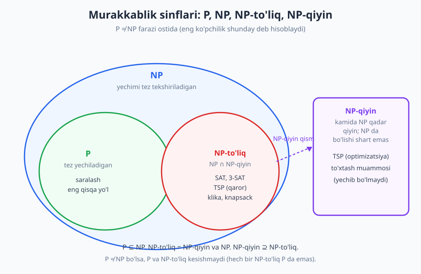
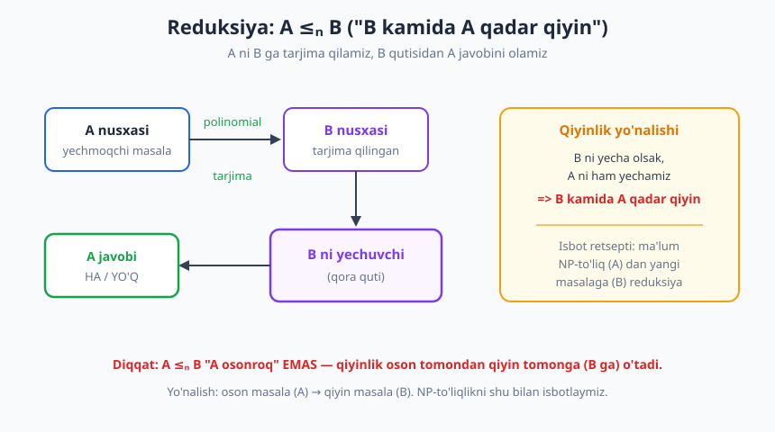
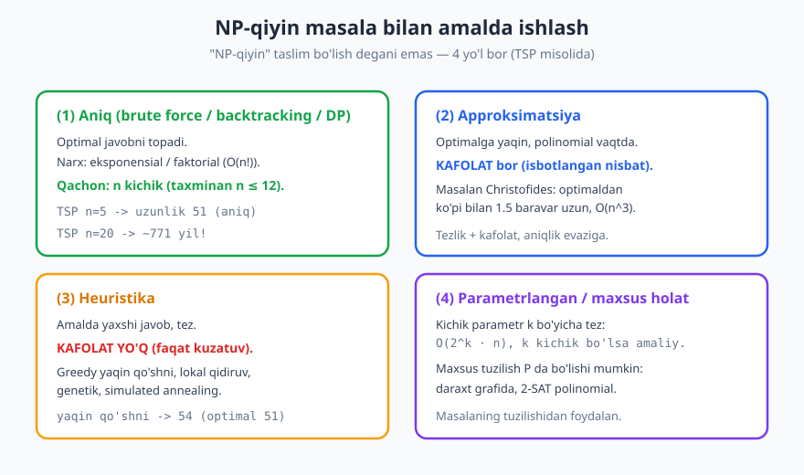

# 32 — Hisoblash murakkabligi: P, NP va NP-to'liqlik

[⬅️ Oldingi: 31 — String algoritmlari](./31-string-algoritmlari.md) · [🏠 README](./README.md) · [Keyingi: 33 — Kapston: muammodan yechimgacha — algoritm dizayni amaliyoti ➡️](./33-kapston-algoritm-dizayni.md)

---

> **Bu bobda:** Nega ba'zi masalalar boshqalardan tubdan **qiyinroq**? Shu paytgacha biz tez (polinomial) algoritmlar ko'rdik, lekin sayohatchi savdogar kabi masalalarga hech kim tez algoritm topa olmagan. Bu bobda hisoblash murakkabligi nazariyasining yuragi bilan tanishamiz: **qaror masalalari**, **P** sinfi (tez yechiladigan), **NP** sinfi (tez tekshiriladigan), mashhur **P vs NP** savoli, **NP-to'liqlik** (NP-complete), **reduksiya** g'oyasi va **NP-qiyin** masalalar bilan amalda qanday ishlash kerakligi.
>
> **Halollik / Eslatma:** P ⊆ NP isboti, NP-to'liqlikning ta'rifi va Cook-Levin teoremasi matematik aniq. P ≠ NP esa **isbotlanmagan faraz** — buni ochiq aytamiz. Bobning eng muhim qismi — keng tarqalgan XATOLARNI to'g'rilash ("NP = yechib bo'lmaydigan" — noto'g'ri). Python namunalari (brute force TSP, tekshiruvchi, heuristika) haqiqatan ishga tushirib tekshirilgan; ko'rsatilgan chiqishlar kod bergan haqiqiy natijalar.

---

## Markaziy savol: nega ba'zi masalalar "qiyin"?

Kitob davomida biz ko'p masalalarga **tez** algoritm topdik: saralash `O(n log n)` ([27-bob](./27-saralash-algoritmlari.md)), eng qisqa yo'l `O(E log V)` ([29-bob](./29-graf-algoritmlari-1.md)), binar qidiruv `O(log n)` ([28-bob](./28-qidiruv-algoritmlari.md)). Bularning hammasida o'lcham `n` ikki barobar oshsa, ish vaqti ham bashorat qilinadigan, mo''tadil darajada oshadi.

Lekin ayrim masalalar mutlaqo boshqacha. Klassik misol — **sayohatchi savdogar masalasi** (TSP, *travelling salesman problem*): savdogar `n` ta shaharni har biriga aniq bir marta kirib aylanib chiqishi va boshlang'ich shaharga qaytishi kerak; **eng qisqa** umumiy yo'lni toping. Bu masala juda oddiy ko'rinadi. Lekin **hech kim** unga tez (polinomial) algoritm topa olgan emas — 1930-yillardan beri, dunyodagi eng zo'r matematiklar urinishiga qaramay. Ma'lum bo'lgan eng yaxshi aniq algoritmlar `n` oshganda eksponensial portlaydi ([22-bob](./22-brute-force.md)dagi kombinatorik portlash).

> **Intuitsiya:** Tasavvur qiling, ikki turdagi topshiriq bor. Birinchi turda — **javobni o'zingiz topish** qiyin, lekin kimdir tayyor javob bersa, uni **to'g'ri ekanini tekshirish** oson. Sudoku aynan shunday: bo'sh kataklarni to'ldirish soatlab vaqt olishi mumkin, lekin to'ldirilgan jadval to'g'rimi degan savolni bir necha soniyada tekshirasiz. Murakkablik nazariyasi aynan shu farq — **topish** va **tekshirish** orasidagi tubsizlik — ustiga qurilgan.

Bu bobda biz "qiyin"likni **aniq** ta'riflaymiz: qaysi masalalar tez yechiladi, qaysilari (ehtimol) hech qachon tez yechilmaydi, va dasturchi sifatida bunday masalaga duch kelganda nima qilish kerak.

## Qaror masalalari: ha/yo'q javobli shakl

Nazariyani qurish uchun avval masalalarni bir xil **standart shaklga** keltiramiz. Eng qulay shakl — **qaror masalasi** (*decision problem*): javobi faqat **HA** yoki **YO'Q** bo'lgan masala.

Misollar:

- "Bu grafda uzunligi `k` dan oshmaydigan, hamma shaharni aylanib chiqadigan yo'l bormi?" — HA/YO'Q.
- "Bu mantiqiy formulani ROST qiladigan o'zgaruvchilar qiymati bormi?" — HA/YO'Q.
- "Bu sonlar to'plamida yig'indisi aniq `S` ga teng qism-to'plam bormi?" — HA/YO'Q.

Amalda bizni ko'pincha **optimizatsiya** qiziqtiradi ("eng qisqa yo'l qancha?"), qaror emas. Lekin har qanday optimizatsiya masalasini qaror shakliga aylantirish oson: optimal qiymat o'rniga **chegara `k`** kiritamiz va "natija `k` dan yaxshimi?" deb so'raymiz.

```text
Optimizatsiya:  Eng qisqa TSP yo'li qancha?
Qaror:          Uzunligi <= k bo'lgan TSP yo'li bormi?
```

> **Nega aynan qaror shakli?** Ikki sabab. Birinchidan, nazariya soddalashadi — har masalada javob bir bit (HA/YO'Q). Ikkinchidan, qaror va optimizatsiya **murakkablik jihatdan teng**: agar qaror masalasini har xil `k` lar uchun tez yechsangiz, optimal qiymatni **binar qidiruv** ([28-bob](./28-qidiruv-algoritmlari.md)) bilan `O(log)` urinishdan topasiz. Demak biri qiyin bo'lsa, ikkinchisi ham qiyin. Shuning uchun nazariyani qaror masalalari ustiga quramiz, umumiylikni yo'qotmasdan.

## P sinfi: tez YECHILADIGAN masalalar

**P sinfi** (*Polynomial time*) — **polinomial vaqtda yechiladigan** qaror masalalari to'plami. Ya'ni kirish o'lchami `n` ga nisbatan ish vaqti `O(n^k)` bo'lgan ( `k` — qandaydir o'zgarmas son) algoritm mavjud masalalar.

Polinomial vaqt — bu nazariyada **"amalda boshqariladigan"** (*tractable*, qulay) degani. `n^2`, `n^3`, hatto `n^{100}` ham polinomial. Garchi `n^{100}` amalda dahshatli sekin bo'lsa-da, nazariy chegara sifatida polinomiallik muhim suv ayirg'ichi: polinomial algoritmlar `n` oshganda **boshqariladigan** tarzda o'sadi, eksponensial (`2^n`) esa portlaydi.

P sinfidagi masalalar — biz kitobda ko'rgan deyarli hamma narsa:

| Masala | Algoritm | Murakkablik |
|---|---|---|
| Massivni saralash | merge/quick sort ([27-bob](./27-saralash-algoritmlari.md)) | `O(n log n)` |
| Eng qisqa yo'l | Dijkstra ([29-bob](./29-graf-algoritmlari-1.md)) | `O(E log V)` |
| Saralangan massivda qidiruv | binar qidiruv | `O(log n)` |
| Graf bog'langanmi | BFS/DFS | `O(V + E)` |
| Eng katta umumiy bo'luvchi | Evklid algoritmi | `O(log n)` |

Bularga umumiy narsa: ularning hammasiga **aqlli, polinomial** algoritm topilgan. Demak ular "oson" (tractable). P — bizning "qulay zona"imiz.

## NP sinfi: tez TEKSHIRILADIGAN masalalar

Endi eng nozik tushunchaga keldik. **NP sinfi** — **yechimni polinomial vaqtda TEKSHIRISH** (*verify*) mumkin bo'lgan qaror masalalari to'plami.

Aniqrog'i: masala NP da bo'lishi uchun, javob HA bo'lganda, buni isbotlovchi qisqa **dalil (sertifikat, *certificate*)** bo'lishi va shu dalilni **polinomial vaqtda tekshirib** "ha, rost" deb tasdiqlash mumkin bo'lishi kerak.

> **Intuitsiya:** Sudoku. To'ldirilgan jadvalni (sertifikatni) bersam, siz uni **tez** tekshirasiz: har satr, har ustun, har 3×3 blokda 1–9 takrorlanmaganini ko'rasiz — `O(n^2)` ish. To'ldirilgan jadvalni **topish** esa juda qiyin bo'lishi mumkin. Tekshirish — oson; topish — qiyin. Mana shu NP ning mohiyati.

TSP qaror shakli (`uzunligi <= k yo'l bormi?`) ham NP da: agar kimdir aniq bir yo'l (shaharlar tartibi) bersa — bu sertifikat — uning haqiqatan yaroqli va uzunligi `<= k` ekanini `O(n)` da tekshiramiz. Buni Python bilan ko'rsatamiz:

```python
# Tekshirish OSON: berilgan tartib (sertifikat) yaroqli yo'lmi va <= chegara?
def tsp_tekshir(masofa, tartib, chegara):
    n = len(masofa)
    if sorted(tartib) != list(range(n)):     # har shahar aniq bir marta
        return False
    uzunlik = sum(masofa[tartib[i]][tartib[(i+1) % n]] for i in range(n))
    return uzunlik <= chegara                 # O(n) ish — juda tez!

masofa = [
    [0, 13, 14,  2,  9],
    [13, 0, 17, 16, 13],
    [14, 17, 0, 10, 16],
    [2, 16, 10,  0, 12],
    [9, 13, 16, 12,  0],
]
print(tsp_tekshir(masofa, [0, 3, 2, 1, 4], 51))   # -> True   (optimal yo'l)
print(tsp_tekshir(masofa, [0, 3, 2, 1, 4], 50))   # -> False  (51 > 50)
print(tsp_tekshir(masofa, [0, 0, 2, 1, 4], 51))   # -> False  (0 ikki marta)
```

Tekshiruvchi atigi `O(n)`. Mana shu — TSP qaror masalasi NP da ekanining isboti: **sertifikat bor va u tez tekshiriladi.**

> **Diqqat — eng muhim tushunmovchilik.** "NP" **"non-polynomial"** (polinomialdan tashqari) degani **EMAS**! Bu eng keng tarqalgan xato. NP — **"Nondeterministic Polynomial"** (nodeterministik polinomial) qisqartmasi. Ma'nosi: agar bizda "barcha variantlarni bir vaqtda sinab ko'ra oladigan" sehrli (nodeterministik) mashina bo'lsa, masala polinomial vaqtda yechiladi. Buni amaliyroq qilib aytsak: **NP = tez tekshiriladigan masalalar.** "Tez yechiladi" emas, "tez tekshiriladi".

### P ⊆ NP: har bir P masalasi NP da ham

Bu munosabat muhim va isboti oson. Agar masala P da bo'lsa — uni o'zimiz polinomial vaqtda **yechib** qo'ya olamiz. Demak sertifikatga ehtiyoj ham yo'q: kimdir javob bersa, biz uni e'tiborsiz qoldirib, masalani noldan o'zimiz tez yechib, javobni solishtiramiz — bu polinomial tekshiruv. Demak P dagi har bir masala NP da ham bor.

> **Isbot (eskiz):** Masala `X ∈ P` bo'lsin, demak `X` ni `O(n^k)` da yechuvchi `A` algoritm bor. NP tekshiruvchisini quramiz: sertifikatni umuman o'qimaymiz, `A` ni ishlatib javobni topamiz va sertifikat HA da'vo qilsa, javobimiz HA bo'lishini talab qilamiz. Bu `O(n^k)` — polinomial. Demak `X ∈ NP`. ∎

Demak: **P ⊆ NP**. Tez yechilsa, albatta tez tekshiriladi. Teskarisi-chi?

## P vs NP: million dollarlik savol

Mana asosiy savol:

> **P = NP mi?** Ya'ni: tez **tekshiriladigan** har bir masala tez **yechiladimi** ham?

Boshqacha aytganda: agar yechimni tez tasdiqlay olsangiz, uni tez **topa** olasizmi ham? Sudokuni tekshirish oson — uni yechish ham (asl mohiyatda) oson bo'lishi shartmi?

Bu — **kompyuter fanining eng mashhur ochiq muammosi**. 2000-yilda Clay matematika instituti uni yetti "Ming yillik muammo"dan biri deb e'lon qildi va yechganga **1 million dollar** mukofot tayinladi. Hozirgacha hech kim yecha olmagan.

Ko'pchilik mutaxassislar **P ≠ NP** deb hisoblaydi — ya'ni tekshirish topishdan haqiqatan osonroq, va TSP kabi masalalar tubdan qiyin. Lekin bu **isbotlanmagan** — shunchaki kuchli ishonch va ko'p urinishlarning muvaffaqiyatsizligi.

> **Halollik:** Bu kitobda "P ≠ NP" ni faraz sifatida ishlatamiz, chunki diagrammalar va intuitsiya shunga tayanadi. Lekin yodda tuting: bu **isbotlanmagan**. Agar ertaga kimdir P = NP ni isbotlasa, kriptografiyadan tortib optimizatsiyagacha hamma narsa o'zgaradi (pastdagi mashqlarda bu haqda o'ylaymiz). Hozircha eng kuchli ehtimol — P ≠ NP.



## NP-to'liqlik: NP dagi eng qiyin masalalar

Endi nazariyaning gultoji. NP ichida shunday masalalar bor — ular **NP dagi ENG QIYIN** masalalar. Ularni **NP-to'liq** (*NP-complete*) deb ataymiz.

NP-to'liqlikning sehrli xossasi:

> Agar **bitta** NP-to'liq masalaga polinomial algoritm topilsa, **BARCHA** NP masalalariga topiladi — ya'ni P = NP bo'lib qoladi.

Ya'ni NP-to'liq masalalar bir-biriga shu qadar mahkam bog'langanki, ularning biri "qulasa" hammasi quladi. Aynan shuning uchun ular eng qiyin: TSP ni tez yechish — bu butun NP ni tez yechish bilan teng kuchli. 1930-yillardan beri hech kim buni uddalay olmagani — P ≠ NP ga eng kuchli amaliy dalil.

Cook-Levin teoremasi (1971) birinchi NP-to'liq masalani ko'rsatdi: **SAT** (*boolean satisfiability* — mantiqiy formula qoniqarliligi). Undan keyin minglab masalalar NP-to'liq deb isbotlandi. Mashhurlari:

| NP-to'liq masala | Savol (qaror shakli) |
|---|---|
| **SAT / 3-SAT** | Bu mantiqiy formulani ROST qiladigan qiymatlar bormi? |
| **TSP (qaror)** | Uzunligi `<= k` bo'lgan aylanma yo'l bormi? |
| **Graf bo'yash** | Grafni `k` rang bilan (qo'shni tepalar har xil) bo'yash mumkinmi? |
| **Klika (Clique)** | Grafda `k` ta o'zaro to'liq bog'langan tepa bormi? |
| **Vertex Cover** | `k` ta tepa bilan barcha qirralarni "qoplash" mumkinmi? |
| **Subset Sum** | Yig'indisi aniq `S` bo'lgan qism-to'plam bormi? |
| **0/1 Knapsack (qaror)** | Og'irligi `<= W`, qiymati `>= V` to'plam bormi? |

Hammasiga umumiy: yechimni **tekshirish oson** (NP da), lekin **topish** uchun ma'lum bo'lgan eng yaxshi algoritm eksponensial. Va ularning hammasi bir-biriga **reduksiya** orqali bog'langan — keyingi bo'limda shuni ko'ramiz.

## Reduksiya: qiyinlikni bir masaladan boshqasiga o'tkazish

NP-to'liqlikni isbotlash quroli — **reduksiya** (*reduction*). G'oya sodda, lekin yo'nalishi chalkash bo'lishi mumkin, shuning uchun ehtiyot bo'lib tushuntiramiz.

> **Intuitsiya:** Sizda `A` masalani yechuvchi qurilma yo'q, lekin `B` masalani yechuvchi "qora quti" bor. Agar `A` ning har bir nusxasini **tez** (polinomial vaqtda) `B` ning nusxasiga **tarjima qila olsangiz**, demak `B` qutisi orqali `A` ni ham yechasiz. Bu shuni anglatadi: **`B` kamida `A` qadar qiyin** — chunki `B` ni yecha olsangiz, `A` ni ham yechgan bo'lasiz.

Buni `A ≤ₚ B` deb yozamiz: "A polinomial reduksiya bilan B ga keltiriladi", o'qilishi — **"B kamida A qadar qiyin"**.

```text
A nusxasi  --(polinomial tarjima)-->  B nusxasi
                                          |
                                     B ni yech (qora quti)
                                          |
   A javobi  <--------------------------  B javobi
```



> **Diqqat — yo'nalish chalkashligi (eng ko'p uchraydigan xato).** `A ≤ₚ B` "A osonroq" degani EMAS, ehtiyot bo'ling. Buni shunday eslang: **A ni B ga o'rab yuboramiz**, demak biz B ning kuchidan A ni yechishda foydalanamiz — shuning uchun **B kamida A qadar qiyin**. Yo'nalish: oson masaladan (A) qiyin masalaga (B). NP-to'liqlikni isbotlash uchun: **ma'lum NP-to'liq masalani (A) yangi masalaga (B) reduksiya qilamiz**, shunda B ham kamida shuncha qiyin (NP-to'liq) ekani chiqadi.

**NP-to'liqlikni isbotlash retsepti.** Yangi `X` masala NP-to'liq ekanini ko'rsatish uchun ikki narsani isbotlaymiz:

1. **`X ∈ NP`** — yechimi tez tekshiriladi (sertifikat bor).
2. **`X` NP-qiyin** — biror ma'lum NP-to'liq masalani (masalan 3-SAT) `X` ga polinomial reduksiya qilamiz: `3-SAT ≤ₚ X`.

Reduksiyalar zanjiri shu tarzda quriladi: Cook-Levin SAT ni isbotladi, SAT dan 3-SAT, 3-SAT dan klika, klikadan vertex cover, ... — minglab masala. Bitta yangi reduksiya bir masalani butun oilaga bog'laydi.

## NP-qiyin: NP-to'liqlikdan ham keng

**NP-qiyin** (*NP-hard*) — "kamida har qanday NP masalasi qadar qiyin" masalalar. Ta'rifi reduksiya orqali: `X` NP-qiyin, agar **har bir** NP masalasi `X` ga reduksiya qilinsa.

Farqni aniq ushlang:

- **NP-to'liq = NP-qiyin VA NP da.** Ya'ni `NP-complete = NP-hard ∩ NP`. Bunday masala kamida NP qadar qiyin, lekin o'zi ham NP da (yechimi tez tekshiriladi).
- **NP-qiyin** esa **NP da bo'lishi shart emas.** U NP dan **tashqarida** ham bo'lishi mumkin — undan ham qiyinroq.

Misollar, NP da bo'lmagan NP-qiyin masalalar:

- **TSP optimizatsiya** shakli ("eng qisqa yo'lni TOP", chegara emas). Berilgan yo'l **eng qisqa** ekanini tez tekshira olmaysiz (buning uchun barcha yo'llarni bilish kerak) — shuning uchun u NP da emas, lekin NP-qiyin.
- **To'xtash muammosi** (*halting problem*) — NP-qiyin, lekin **umuman yechib bo'lmaydigan** (bu haqda quyida). Murakkablikdan ham narida.

```text
                  NP-qiyin (NP-hard)
        kamida NP qadar qiyin; NP da bo'lishi shart emas
        ┌─────────────────────────────────────────────┐
        │   NP-to'liq = NP-qiyin ∩ NP                  │
        │   (TSP-qaror, SAT, klika, ...)              │
        │                                             │
        │   ... to'xtash muammosi (NP-qiyin,          │
        │       lekin yechib bo'lmaydi) ...           │
        └─────────────────────────────────────────────┘
```

## Diqqat: keng tarqalgan xatolar (bularni yodlang)

Murakkablik nazariyasi atrofida noto'g'ri tushunchalar juda ko'p. Eng muhimlarini to'g'rilaymiz — bu bobning eng qimmatli qismi.

> **Anti-pattern:** "NP masalasini **yechib bo'lmaydi**." **NOTO'G'RI.** NP masalalari **yechiladi** — biz brute force bilan har doim javobni topamiz. Muammo — **sekinlik**, imkonsizlik emas. `n` kichik bo'lsa, NP-to'liq masala ham bir lahzada yechiladi. "Yechib bo'lmaydigan" (*undecidable*) — butunlay boshqa narsa (to'xtash muammosi).

> **Anti-pattern:** "NP = polinomialdan tashqari (eksponensial)." **NOTO'G'RI** ikki sababga ko'ra. (1) NP — "Nondeterministic Polynomial", "non-polynomial" emas. (2) P ⊆ NP, ya'ni har bir tez (polinomial) masala ham NP da! Demak NP ichida polinomial masalalar bisyor. NP — bu "tekshirish oson" sinfi, "yechish qiyin" sinfi emas.

> **Anti-pattern:** "Masala NP da, demak qiyin." **NOTO'G'RI.** Saralash ham NP da (chunki u P da, P ⊆ NP). NP da bo'lish qiyinlik anglatmaydi. **Qiyin** bo'lganlar — NP-to'liqlar. "NP da" ≠ "qiyin".

> **Eslatma — to'g'ri munosabatlar:** `P ⊆ NP`. `NP-to'liq = NP-qiyin ∩ NP`. `NP-qiyin ⊇ NP-to'liq` (NP-qiyin kengroq). P ≠ NP farazida P va NP-to'liq sinflari **kesishmaydi** — ya'ni hech bir NP-to'liq masala P da emas.

## NP-qiyin masala bilan amalda ishlash

Eng amaliy savol: dasturchi sifatida NP-qiyin masalaga duch kelsangiz, nima qilasiz? "Yechib bo'lmaydi" deb taslim bo'lasizmi? **Yo'q.** To'rtta kuchli yondashuv bor.



TSP misolida ularni ko'ramiz. Avval **aniq** (brute force) yechim — `n` kichik bo'lsa mukammal. U barcha `(n-1)!` tartibni sanaydi ([26-bob](./26-backtracking.md)dagi backtracking yoki [25-bob](./25-dinamik-dasturlash.md)dagi DP bilan optimallashtirilishi mumkin):

```python
import math
from itertools import permutations

# === (1) Aniq (brute force): barcha tartiblarni sanaymiz -> O(n!) ===
def tsp_aniq(masofa):
    n = len(masofa)
    eng_qisqa, eng_yol = math.inf, None
    for tartib in permutations(range(1, n)):     # 0 ni boshlanish qilib qotiramiz
        yol = (0,) + tartib + (0,)
        uzunlik = sum(masofa[yol[i]][yol[i+1]] for i in range(len(yol) - 1))
        if uzunlik < eng_qisqa:
            eng_qisqa, eng_yol = uzunlik, yol
    return eng_yol, eng_qisqa

masofa = [
    [0, 13, 14,  2,  9],
    [13, 0, 17, 16, 13],
    [14, 17, 0, 10, 16],
    [2, 16, 10,  0, 12],
    [9, 13, 16, 12,  0],
]
print(tsp_aniq(masofa))   # -> ((0, 3, 2, 1, 4, 0), 51)
```

Aniq javob — uzunligi **51** bo'lgan yo'l. Bu `n = 5` da bir lahzada hisoblanadi. Lekin `n` o'ssa, `(n-1)!` portlaydi:

```python
import math

for n in [13, 15, 20]:
    fakt = math.factorial(n)
    # sekundiga 10^8 yo'l sanaymiz desak:
    sek = fakt / 1e8
    print(f"n={n}: n!={fakt}  taxminan {sek:.0f} sekund")

# Chiqish:
# n=13: n!=6227020800  taxminan 62 sekund
# n=15: n!=1307674368000  taxminan 13077 sekund
# n=20: n!=2432902008176640000  taxminan 24329020082 sekund
```

`n = 20` da bu **771 yildan ko'p** (24 milliard sekund). Demak aniq yechim faqat **kichik `n`** (taxminan `n <= 12`) uchun. Katta `n` da uchta muqobil yo'l qoladi.

### (2) Approksimatsiya algoritmlari — kafolatli yaqinlik

**Approksimatsiya algoritmi** optimal javobni topmaydi, lekin unga **kafolatli darajada yaqin** javobni **polinomial vaqtda** beradi. Masalan, metrik TSP uchun mashhur **Christofides** algoritmi optimaldan ko'pi bilan **1.5 baravar** uzun yo'lni `O(n^3)` da topadi. Bu — kafolat: "javobim optimaldan 50% dan ko'p yomon emas".

Approksimatsiya nisbati (*approximation ratio*) — algoritm bergan javobning optimalga maksimal nisbati. Christofides uchun u `1.5`; eng yaqin qo'shni (quyida) uchun esa umuman kafolat yo'q (cheksiz yomon bo'lishi mumkin).

> **Trade-off:** Approksimatsiya **tezlik va matematik kafolat**ni beradi, evaziga **aniq optimallik**ni yo'qotasiz. Ko'p amaliy masalalarda "optimaldan 5% yomon, lekin sekundda" — "optimal, lekin million yilda" dan ancha afzal.

### (3) Heuristika — kafolatsiz, lekin amalda yaxshi

**Heuristika** — "amalda yaxshi ishlaydi, lekin matematik kafolat yo'q" usul. TSP uchun eng sodda heuristika — **eng yaqin qo'shni** (greedy [24-bob](./24-greedy.md)): har qadamda hozir eng yaqin ko'rinadigan ko'rilmagan shaharga boramiz.

```python
import math

# === (3) Heuristika (greedy yaqin qo'shni): O(n^2), KAFOLATSIZ ===
def tsp_yaqin_qoshni(masofa, boshlanish=0):
    n = len(masofa)
    korilgan = [False] * n
    yol, joriy, jami = [boshlanish], boshlanish, 0
    korilgan[boshlanish] = True
    for _ in range(n - 1):
        keyingi, eng_yaqin = -1, math.inf
        for j in range(n):
            if not korilgan[j] and masofa[joriy][j] < eng_yaqin:
                eng_yaqin, keyingi = masofa[joriy][j], j
        yol.append(keyingi)
        korilgan[keyingi] = True
        jami += eng_yaqin
        joriy = keyingi
    jami += masofa[joriy][boshlanish]            # boshlanishga qaytish
    return yol + [boshlanish], jami

masofa = [
    [0, 13, 14,  2,  9],
    [13, 0, 17, 16, 13],
    [14, 17, 0, 10, 16],
    [2, 16, 10,  0, 12],
    [9, 13, 16, 12,  0],
]
print(tsp_yaqin_qoshni(masofa))   # -> ([0, 3, 2, 4, 1, 0], 54)
```

Bu heuristika `O(n^2)` da ishlaydi — juda tez. Lekin javobi **54**, aniq optimal esa **51** edi. Ya'ni heuristika bu masalada optimaldan ozgina yomon javob berdi — bu **kafolatsizlikning** ko'rinishi: greedy "hozir yaqin" shaharni tanlab, keyin uzoq qaytishga majbur bo'ldi. Katta masalalarda heuristikalar (lokal qidiruv, simulated annealing, genetik algoritmlar) ko'pincha juda yaxshi ishlaydi — lekin hech qachon **kafolat** bermaydi.

> **Heuristika vs approksimatsiya:** Ikkalasi ham optimal bo'lmagan javob beradi. Farq: **approksimatsiyada** "optimaldan ko'pi bilan `c` baravar yomon" degan **isbotlangan** kafolat bor; **heuristikada** bunday kafolat **yo'q** — faqat amaliy kuzatuv ("odatda yaxshi"). Bu farqni chalkashtirmang.

### (4) Parametrlangan / maxsus holatlar

Ko'pincha masala **umuman** qiyin, lekin amaldagi nusxalar **maxsus tuzilishga** ega bo'ladi. Buni ishlatamiz:

- **Parametrlangan murakkablik:** ish vaqtini boshqa kichik parametr `k` bo'yicha ifodalaymiz, masalan `O(2^k · n)`. Agar `k` (masalan vertex cover hajmi) kichik bo'lsa — amalda tez, garchi `n` katta bo'lsa ham.
- **Maxsus holatlar:** masalaning ba'zi ko'rinishlari P da. Masalan, daraxt grafida ko'p NP-qiyin masala polinomial yechiladi; 2-SAT (har bandda 2 ta literal) P da, lekin 3-SAT NP-to'liq.

> **Xulosa — qarorlar daraxti:** NP-qiyin masalaga duch kelsangiz: `n` kichikmi → **aniq** (brute force / backtracking / DP); kafolat kerakmi → **approksimatsiya**; shunchaki yaxshi javob yetarlimi → **heuristika**; masalada maxsus tuzilish bormi → **parametrlangan / maxsus holat**. "NP-qiyin" hech qachon "taslim bo'l" degani emas.

## Bundan ham narida: yechib bo'lmaydigan masalalar

NP-qiyin masalalar sekin — lekin baribir **yechiladi**. Murakkablik nazariyasidan ham narida esa **umuman yechib bo'lmaydigan** (*undecidable*) masalalar bor.

Eng mashhuri — **to'xtash muammosi** (*halting problem*): "berilgan dastur berilgan kirishda **to'xtaydimi** yoki cheksiz ishlaydimi?". Alan Turing 1936-yilda buni **hech qanday algoritm** umuman yecha olmasligini isbotladi — qancha vaqt va xotira bersangiz ham. Bu — sekinlik emas, **printsipial imkonsizlik**.

Demak masalalar ierarxiyasi:

```text
P           -> tez yechiladi          (saralash, eng qisqa yo'l)
NP-to'liq   -> sekin, lekin yechiladi  (TSP, SAT)  -- ehtimol P emas
yechib bo'lmaydigan -> umuman yechilmaydi (to'xtash muammosi)
```

> **Diqqat:** "NP-qiyin" va "yechib bo'lmaydigan"ni chalkashtirmang. NP-qiyin — **sekin** (eksponensial), lekin yechiladi. Undecidable — **printsipial yechib bo'lmaydi**, hech qachon. To'xtash muammosi NP-qiyin **ham**, undecidable **ham** — chunki u NP-to'liq masalalardan ham qiyin.

## Asosiy g'oyalar (bobni qisqacha)

- **Qaror masalasi** — javobi HA/YO'Q bo'lgan masala. Optimizatsiyani chegara `k` qo'shib qaror shakliga keltiramiz; ikkalasi murakkablik jihatdan teng.
- **P** — polinomial vaqtda **yechiladigan** masalalar (`O(n^k)`). "Amalda boshqariladigan" (tractable). Saralash, eng qisqa yo'l, qidiruv.
- **NP** — yechimi polinomial vaqtda **tekshiriladigan** (verify) masalalar. NP = "Nondeterministic Polynomial", **"non-polynomial" EMAS**. Sertifikat tez tekshiriladi.
- **P ⊆ NP** — tez yechilsa, tez tekshiriladi ham (isboti oson).
- **P vs NP** — tez tekshiriladigan hamma narsa tez yechiladimi? Isbotlanmagan, $1M mukofot. Ko'pchilik **P ≠ NP** deb hisoblaydi.
- **NP-to'liq** (NP-complete) — NP dagi eng qiyin masalalar. Bittasi tez yechilsa, **hammasi** yechiladi (P=NP). SAT (Cook-Levin), 3-SAT, TSP-qaror, klika, vertex cover, subset sum, knapsack.
- **Reduksiya** `A ≤ₚ B` — A ni B ga tez tarjima qilish; **"B kamida A qadar qiyin"**. NP-to'liqlikni isbotlash quroli: ma'lum NP-to'liq masaladan reduksiya.
- **NP-qiyin** (NP-hard) — kamida NP qadar qiyin; NP da bo'lishi shart emas. `NP-to'liq = NP-qiyin ∩ NP`. TSP-optimizatsiya, to'xtash muammosi.
- **Xatolar:** "NP = yechib bo'lmaydi" (yo'q, **sekin** yechiladi); "NP = eksponensial" (yo'q, P ⊆ NP); "NP da = qiyin" (yo'q, saralash ham NP da).
- **NP-qiyin bilan ishlash:** (1) aniq — kichik `n`; (2) approksimatsiya — kafolatli yaqinlik; (3) heuristika — kafolatsiz, amalda yaxshi (greedy, lokal qidiruv); (4) parametrlangan / maxsus holat.
- **Yechib bo'lmaydigan** (undecidable) — to'xtash muammosi: hech qanday algoritm yecha olmaydi. Sekinlik emas, **imkonsizlik**.

## Mashqlar

### Oson

**1-mashq.** Quyidagilarni to'g'ri ta'rif bilan moslang: (a) P, (b) NP, (c) NP-to'liq. Ta'riflar: (i) "NP dagi eng qiyin masalalar — biri tez yechilsa hammasi yechiladi"; (ii) "polinomial vaqtda yechiladigan"; (iii) "yechimi polinomial vaqtda tekshiriladigan".

**2-mashq.** Quyidagilar **qaror** masalasimi yoki **optimizatsiya** masalasimi ayting: (a) "Eng qisqa TSP yo'li qancha?"; (b) "Uzunligi 100 dan kichik TSP yo'li bormi?"; (c) "Bu grafni 3 rang bilan bo'yash mumkinmi?"; (d) "Grafni bo'yash uchun minimal nechta rang kerak?".

**3-mashq.** "NP" qisqartmasi nimani anglatadi? "Non-polynomial" degani to'g'rimi? Bir jumlada tushuntiring.

### O'rta

**4-mashq.** "Sudoku NP da" iborasini tushuntiring: **nimasi** tez (polinomial), **nimasi** qiyin? Sertifikat (dalil) nima bo'ladi va uni tekshirish necha qadam oladi (taxminan)?

**5-mashq.** Quyidagi gaplarni **to'g'rilang** (har biri xato): (a) "NP masalalarini yechib bo'lmaydi"; (b) "Masala NP da bo'lsa, u albatta qiyin"; (c) "NP — polinomialdan tashqaridagi masalalar".

**6-mashq.** Nega `P ⊆ NP`? Ya'ni nega har bir tez **yechiladigan** masala tez **tekshiriladigan** ham? Qisqa isbot eskizini bering.

### Qiyin

**7-mashq.** Reduksiya `A ≤ₚ B` "B kamida A qadar qiyin" degani. **Yo'nalishni** tushuntiring: nega bu A ni emas, B ni qiyin deb belgilaydi? Yangi `X` masala NP-to'liq ekanini isbotlash uchun qaysi yo'nalishda reduksiya qilamiz — `X` dan ma'lum NP-to'liqqami, yoki ma'lum NP-to'liqdan `X` gami? Nega?

**8-mashq.** Sizga NP-qiyin masala (masalan `n = 10000` shaharli TSP) berildi va aniq yechim mumkin emas. **Uchta** har xil yondashuv taklif qiling, har birining (a) nima berishi, (b) qanday kafolati (yoki kafolatsizligi)ni ayting.

**9-mashq.** Faraz qiling, ertaga kimdir **P = NP** ekanini isbotladi va har bir NP masalasiga amaliy `O(n^3)` algoritm berdi. (a) TSP, SAT kabi masalalarga nima bo'ladi? (b) Nega bu kriptografiyaga (masalan parol-hashlar, RSA) jiddiy ta'sir qiladi? (c) "NP-qiyin masalalar" hali ham "qiyin" bo'lib qoladimi?

<details markdown="1">
<summary>Yechimlar</summary>

### 1-mashq yechimi

- (a) **P** ↔ (ii) "polinomial vaqtda **yechiladigan**".
- (b) **NP** ↔ (iii) "yechimi polinomial vaqtda **tekshiriladigan**".
- (c) **NP-to'liq** ↔ (i) "NP dagi eng qiyin masalalar — biri tez yechilsa hammasi yechiladi".

Kalit farq: P = yechish, NP = tekshirish, NP-to'liq = NP ning eng qiyin "yadrosi".

### 2-mashq yechimi

- (a) "Eng qisqa yo'l **qancha**?" — **optimizatsiya** (aniq qiymat so'raladi).
- (b) "Uzunligi 100 dan kichik yo'l **bormi**?" — **qaror** (HA/YO'Q, chegara `k=100`).
- (c) "3 rang bilan bo'yash **mumkinmi**?" — **qaror** (HA/YO'Q).
- (d) "**Minimal nechta** rang?" — **optimizatsiya** (aniq son so'raladi).

Eslatma: (b) ni har xil `k` lar uchun yechib, binar qidiruv bilan (a) ning javobini topish mumkin — shu sababli ular murakkablik jihatdan teng.

### 3-mashq yechimi

**NP = "Nondeterministic Polynomial"** (nodeterministik polinomial). "Non-polynomial" (polinomialdan tashqari) degani **NOTO'G'RI** — bu eng keng tarqalgan xato. Ma'nosi: yechimni polinomial vaqtda **tekshirish** mumkin (yoki: sehrli "barcha variantni bir vaqtda sinaydigan" mashinada polinomial yechiladi). P ⊆ NP bo'lgani uchun NP ichida tez (polinomial) masalalar ham bor.

### 4-mashq yechimi

- **Tez (polinomial):** to'ldirilgan Sudoku jadvalini **tekshirish**. Har satr, ustun va 3×3 blokda 1–9 raqamlari takrorlanmaganini ko'ramiz — `n` katakli (9×9 da `n=81`) jadval uchun `O(n)` yoki `O(n^2)` ish, juda tez.
- **Qiyin:** bo'sh kataklarni **to'ldirib yechim topish** — umumiy `n×n` Sudoku uchun bu NP-to'liq, eksponensial qidiruv kerak bo'lishi mumkin.
- **Sertifikat (dalil):** to'liq to'ldirilgan jadval. Uni tekshirish polinomial — shuning uchun Sudoku NP da. Topish qiyin, tekshirish oson — bu NP ning mohiyati.

### 5-mashq yechimi

- (a) **Noto'g'ri.** NP masalalari **yechiladi** (masalan brute force bilan) — muammo **sekinlik**, imkonsizlik emas. "Yechib bo'lmaydigan" — bu boshqa narsa (to'xtash muammosi). To'g'risi: "NP-to'liq masalalarni hozircha tez (polinomial) yechishning ma'lum usuli yo'q".
- (b) **Noto'g'ri.** P ⊆ NP, demak saralash ham NP da — lekin u oson. "NP da" qiyinlik anglatmaydi. To'g'risi: "**NP-to'liq** masalalar qiyin deb hisoblanadi".
- (c) **Noto'g'ri.** NP = "Nondeterministic Polynomial", "non-polynomial" emas. Bundan tashqari P ⊆ NP — NP ichida polinomial masalalar bor. To'g'risi: "NP — yechimi tez tekshiriladigan masalalar sinfi".

### 6-mashq yechimi

`X ∈ P` bo'lsin — demak `X` ni `O(n^k)` da **yechuvchi** `A` algoritm bor. NP da bo'lish uchun tez **tekshiruvchi** kerak. Tekshiruvchini shunday quramiz: berilgan sertifikatni umuman e'tiborga olmaymiz, `A` ni ishlatib masalani noldan o'zimiz yechamiz va sertifikat HA da'vo qilganda bizning javobimiz ham HA bo'lishini talab qilamiz. Bu tekshiruv `A` ning narxi qadar — `O(n^k)`, ya'ni polinomial. Demak `X ∈ NP`. Har qanday P masalasi uchun shunday, shuning uchun **P ⊆ NP**. Intuitsiya: agar masalani **o'zing tez yechsang**, dalilni tekshirish ham tez (dalilga muhtoj emassan).

### 7-mashq yechimi

**Yo'nalish.** `A ≤ₚ B` da biz `A` ning nusxasini polinomial vaqtda `B` ning nusxasiga **tarjima qilamiz**, so'ng `B` ni yechuvchi qutidan foydalanib `A` javobini olamiz. Demak: **agar `B` ni yecha olsak, `A` ni ham yechamiz**. Shuning uchun `B` kamida `A` qadar qiyin — `B` ning kuchi `A` ni "qoplaydi". Agar `A` qiyin (masalan NP-to'liq) bo'lsa, bu qiyinlik `B` ga "yuqadi".

**NP-to'liqlikni isbotlash uchun:** **ma'lum NP-to'liq masaladan (masalan 3-SAT) yangi `X` ga** reduksiya qilamiz, ya'ni `3-SAT ≤ₚ X`. Sababi: shunda `X` kamida 3-SAT qadar qiyin bo'ladi, demak NP-qiyin. (Yana `X ∈ NP` ni alohida ko'rsatamiz; ikkalasi birga `X` NP-to'liq ekanini beradi.) **Teskarisi xato bo'lardi**: `X ≤ₚ 3-SAT` faqat `X` ning 3-SAT dan oson emasligini ko'rsatmaydi — u `X` NP da ekanini bildiradi (har bir NP masala 3-SAT ga reduksiya qilinadi), qiyinligini emas. Demak yo'nalish: **qiyin ma'lumdan → yangiga.**

### 8-mashq yechimi

`n = 10000` da `(n-1)!` mutlaqo mumkin emas. Uch yondashuv:

1. **Approksimatsiya (Christofides).** (a) Optimaldan ko'pi bilan 1.5 baravar uzun yo'lni `O(n^3)` da beradi. (b) **Kafolat bor:** javob ≤ 1.5 × optimal. Matematik isbotlangan yuqori chegara.
2. **Heuristika (eng yaqin qo'shni + lokal qidiruv / 2-opt).** (a) Tez (`O(n^2)` yoki shunga yaqin), amalda ko'pincha optimalga juda yaqin javob beradi. (b) **Kafolat yo'q** — ba'zi kirishlarda optimaldan ancha yomon bo'lishi mumkin, lekin amalda yaxshi.
3. **Parametrlangan / maxsus holat.** (a) Agar shaharlar maxsus tuzilishga ega bo'lsa (masalan tekislikdagi nuqtalar, yoki klasterlangan), shu tuzilishni ishlatuvchi maxsus algoritm. (b) Kafolat tuzilishga bog'liq — ba'zi holatlarda aniq polinomial yechim ham bo'lishi mumkin.

(To'rtinchi variant — aniq DP/branch-and-bound — `n=10000` da baribir ishlamaydi, shuning uchun bu yerda mos emas.)

### 9-mashq yechimi

- (a) **TSP, SAT va barcha NP-to'liq masalalar** birdan **amaliy tez** (`O(n^3)`) yechiladigan bo'lib qoladi — chunki ular NP da, P = NP esa hammasi P da degani. Optimizatsiya, jadval tuzish, marshrutlash kabi sohalar tubdan o'zgaradi.
- (b) **Kriptografiya buziladi.** Ko'p shifrlash (RSA va h.k.) "yechimni topish qiyin, tekshirish oson" tamoyiliga tayanadi — ya'ni aynan P ≠ NP ga. Agar P = NP bo'lsa, kalitni "topish" ham "tekshirish" qadar oson bo'lib, shifrlarni polinomial vaqtda buzish mumkin bo'lardi. Parol-hashni teskari aylantirish, RSA ni faktorlash kabilar amaliy bo'lib qolardi.
- (c) **Yo'q** — agar P = NP bo'lsa, NP-to'liq (va shu ma'noda "NP-qiyin ∩ NP") masalalar **endi qiyin emas**, ular ham polinomial yechiladi. Lekin **NP da bo'lmagan** masalalar (haqiqiy NP-qiyin, masalan undecidable to'xtash muammosi) **baribir qiyin/yechib bo'lmaydigan** bo'lib qoladi — P = NP ularga ta'sir qilmaydi.

</details>

---

[⬅️ Oldingi: 31 — String algoritmlari](./31-string-algoritmlari.md) · [🏠 README](./README.md) · [Keyingi: 33 — Kapston: muammodan yechimgacha — algoritm dizayni amaliyoti ➡️](./33-kapston-algoritm-dizayni.md)
