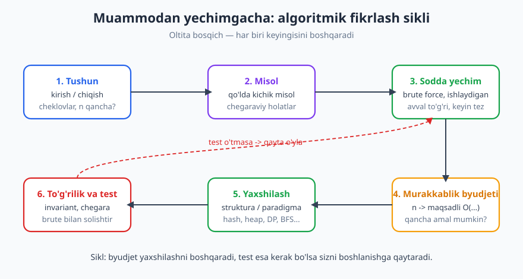
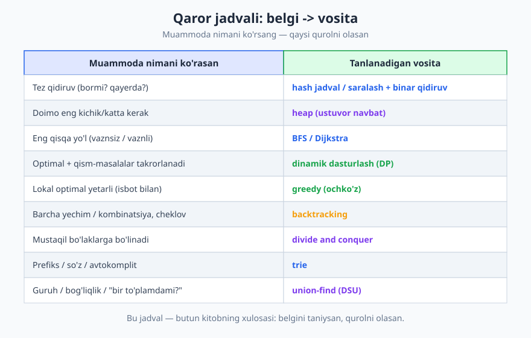
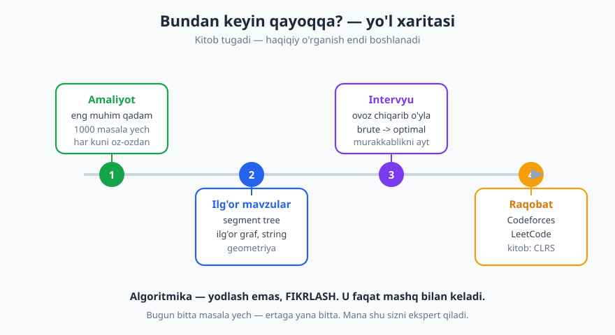

# 33 — Kapston: muammodan yechimgacha — algoritm dizayni amaliyoti

[⬅️ Oldingi: 32 — Hisoblash murakkabligi: P, NP va NP-to'liqlik](./32-p-np-murakkablik-nazariyasi.md) · [🏠 README](./README.md)

---

> **Bu bobda:** Bu — kitobning **yakuniy** bobi. 32 bob davomida biz ko'p vosita yig'dik: ma'lumotlar strukturalari (massiv, hash, daraxt, heap, graf, trie), algoritm paradigmalari (brute force, divide & conquer, greedy, DP, backtracking) va tahlil asboblari (Big-O, invariant, amortizatsiya). Endi savol o'zgaradi: **yangi, notanish muammoga duch kelganda ularni qanday _tanlaymiz_ va qanday _yondashamiz_?** Biz **algoritmik fikrlash siklini** (tushun -> misol -> sodda yechim -> murakkablik byudjeti -> yaxshilash -> test) qadamma-qadam o'rganamiz, butun kitobni jamlaydigan **qaror jadvalini** quramiz, bitta real muammoni boshidan oxirigacha to'liq yechamiz, intervyu va raqobat maslahatlarini ko'rib chiqamiz va keyingi qadamlarga yo'l xaritasi chizamiz.
>
> **Halollik / Eslatma:** Bu bobda yangi algoritm yo'q — bu **metodologiya** bobi. Keltirilgan murakkablik chegaralari (`O(n)`, `O(n log n)`, `O(n log k)`, `2ⁿ`, `n!`) matematik aniq. "Murakkablik byudjeti" jadvalidagi `n` chegaralari `~10⁸ amal/sek` qo'pol taxminiga asoslangan — aniq raqam emas, balki **kattalik tartibi** (order of magnitude) yo'riqnomasi. Barcha Python namunalari haqiqatan ishga tushirib tekshirilgan; ko'rsatilgan chiqishlar kod bergan haqiqiy natijalar.

---

## Kirish: vositalar to'plami tayyor — endi nima?

Tasavvur qiling: usta o'z ustaxonasida. Devorida o'nlab asbob — bolg'a, arra, parma, otvyortka. Yangi shogird barcha asboblarni nomma-nom biladi, lekin **stol yasash** topshirilsa, qaysi asbobni qachon olishni bilmaydi. Mana shu — bilim bilan **mahorat** orasidagi farq.

Biz ham xuddi shu vaziyatdamiz. Hash jadval nima ekanini bilamiz ([15-bob](./15-hash-jadval.md)), Dijkstra qanday ishlashini bilamiz ([30-bob](./30-graf-algoritmlari-2.md)), DP qachon qo'llanishini bilamiz ([25-bob](./25-dinamik-dasturlash.md)). Lekin notanish bir masala oldida — masalan, "katta log fayldan eng ko'p uchragan 10 ta xatoni top" — qaysi vositani olamiz? Mana shu bob aynan shu **tanlash mahoratini** beradi.

Yaxshi xabar: bu mahorat sehr emas. U **takrorlanadigan jarayon** — siklni bir necha bor bosib o'tsangiz, u refleksga aylanadi. Yomon xabar: bu jarayonni faqat **mashq** bilan ichkilashtirish mumkin. Kitobni o'qish — bu xarita; manzilga yetish uchun esa yurish kerak.

## Algoritmik fikrlash sikli

Har qanday algoritmik muammoga **bir xil oltita qadam** bilan yondashish mumkin. Bu — universal retsept:



```text
1. TUSHUN     -> nima so'ralyapti? kirish/chiqish/cheklovlar
2. MISOL      -> qo'lda kichik misol ishla, chegaraviy holatlar
3. SODDA      -> avval ishlaydigan (brute force), to'g'riligi aniq
4. BYUDJET    -> n dan kelib chiq: qancha amalga ruxsat bor?
5. YAXSHILASH -> to'g'ri struktura/paradigma tanla
6. TEST       -> invariant, chegara, brute bilan solishtir
```

Endi har bir qadamni alohida ochamiz.

### 1-qadam. TUSHUN — masalani aniq ushlab ol

Eng ko'p xato shu yerda boshlanadi: odam masalani **to'liq tushunmasdan** kod yozishga shoshiladi. To'xtang. Avval uchta savolga javob bering:

- **Kirish nima?** Tur (sonlarmi, satrmi, graf?), o'lcham, tartiblanganmi yoki yo'q.
- **Chiqish nima?** Bitta sonmi, ro'yxatmi, ha/yo'q, yoki eng yaxshi variant?
- **Cheklovlar qanday?** Eng muhimi — **`n` qancha katta?** Bu raqam butun yechimni belgilaydi (4-qadamda ko'ramiz). `n ≤ 20` bilan `n = 10⁶` butunlay boshqa algoritm talab qiladi.

> **Diqqat:** "Cheklovlar" — bu shunchaki texnik tafsilot emas, balki **eng kuchli yo'l ko'rsatuvchi**. Intervyuda yoki masalada `n` ning chegarasini bilsangiz, kerakli murakkablik o'z-o'zidan ayon bo'ladi.

### 2-qadam. MISOL — qo'lda ishla

Kichik, aniq misolni **qog'ozda** boshidan oxirigacha yechib chiqing. Bu uch foyda beradi: (1) masalani haqiqatan tushunganingizni tekshiradi; (2) yechim "shaklini" his qildiradi; (3) keyinchalik kodni sinash uchun test holatini beradi.

Ayniqsa **chegaraviy holatlarni** o'ylang: bo'sh kirish, bitta element, hammasi bir xil, eng katta `n`, manfiy sonlar. Ko'pgina xato aynan shu chetlarda yashiringan.

### 3-qadam. SODDA YECHIM — avval ishlasin, keyin tezlashsin

Birinchi maqsad — **to'g'ri ishlaydigan** yechim, **tez** emas. Eng sodda yo'l odatda **brute force** ([22-bob](./22-brute-force.md)): barcha variantni sanab chiq, har birini tekshir. U sekin bo'lishi mumkin, lekin:

- uni yozish oson va to'g'riligi deyarli aniq;
- u **reference** (etalon) bo'lib xizmat qiladi — keyinroq yozgan tezroq kodni shu bilan solishtirib tekshirasiz.

> **Eslatma:** "Premature optimization is the root of all evil" (erta optimallashtirish — barcha yomonliklarning ildizi) — Donald Knuth. Avval to'g'ri, keyin tez. Ishlamaydigan tez kod — foydasiz.

### 4-qadam. MURAKKABLIK BYUDJETI — `n` sizga javobni aytadi

Mana eng kuchli amaliy fokus. Zamonaviy kompyuter sekundiga taxminan **`10⁸` (yuz million)** "oddiy" amalni bajaradi (bu — qo'pol, til/mashinaga bog'liq taxmin). Demak, `n` chegarasini bilsangiz, **qaysi murakkablik "sig'adi"** ekanini hisoblaysiz:

| `n` taxminan | Sig'adigan murakkablik | Mos paradigma/struktura |
|---|---|---|
| `n ≤ 11` | `O(n!)` | barcha permutatsiya (backtracking) |
| `n ≤ 25` | `O(2ⁿ)` | barcha qism-to'plam, bitmask (backtracking) |
| `n ≤ 500` | `O(n³)` | uch qatlamli sikl, Floyd-Warshall |
| `n ≤ 10⁴` | `O(n²)` | qo'sh sikl, sodda DP |
| `n ≤ 10⁶` | `O(n log n)` | saralash, heap, divide & conquer |
| `n ≤ 10⁸` | `O(n)` yoki `O(n log n)` | bir o'tish, hash, ikki ko'rsatkich |

Bu jadvalning mantig'i sodda: agar `n = 10⁶` bo'lsa, `O(n²) = 10¹²` amal — bu ~3 soat, mumkin emas. Demak `O(n log n) ≈ 2×10⁷` ga "tushishingiz" shart. Aksincha, `n = 20` bo'lsa, `2²⁰ ≈ 10⁶` — bemalol, brute force yetadi.

Quyidagi kod bu chegaralarni tasdiqlaydi:

```python
import math

# 2^n qaysi n da 10^8 dan oshadi
n = 0
while 2**n <= 10**8:
    n += 1
print("2^n <= 10^8 uchun max n:", n - 1)        # -> 2^n <= 10^8 uchun max n: 26

# n! qaysi n da 10^8 dan oshadi
n = 1
while math.factorial(n) <= 10**8:
    n += 1
print("n! <= 10^8 uchun max n:", n - 1)          # -> n! <= 10^8 uchun max n: 11

# n=10^6 uchun n log2(n) qancha
n = 10**6
print("n log2 n =", int(n * math.log2(n)))        # -> n log2 n = 19931568
```

> **Trade-off:** Bu jadval — **qo'pol yo'riqnoma**, qonun emas. Doimiy koeffitsiyent (konstanta) katta bo'lsa yoki amallar "og'ir" bo'lsa (masalan, satr nusxalash), chegaralar pasayadi. Lekin **kattalik tartibini** tanlashda u deyarli har doim to'g'ri yo'l ko'rsatadi.

### 5-qadam. YAXSHILASH — to'g'ri vositani tanla

Endi byudjet ma'lum. Brute force juda sekin bo'lsa, uni **struktura** yoki **paradigma** bilan tezlashtirasiz. Aynan shu yerda butun kitob jamlanadi — keyingi bo'limdagi **qaror jadvali** sizga qaysi vosita kerakligini aytadi.

Yaxshilashning tipik usullari:

- **Strukturadan foydalanib qidiruvni tezlash:** chiziqli qidiruv `O(n)` -> hash `O(1)` yoki binar qidiruv `O(log n)`.
- **Takroriy hisoblashni eslab qolish:** brute rekursiya `O(2ⁿ)` -> DP/memoizatsiya `O(n²)`.
- **Umidsiz shoxlarni kesish:** to'liq sanash -> backtracking pruning.
- **Tartiblashdan foydalanish:** ko'pincha avval saralash (`O(n log n)`) keyingi qadamni `O(n)` qiladi.

### 6-qadam. TO'G'RILIK va TEST — ishonchni quring

Tez kod yozildi — lekin u **to'g'ri**mi? Uch usul bilan tekshiring:

1. **Invariant:** sikl/rekursiyada har doim haqiqat bo'lib turuvchi shartni aniqlang ([05-bob](./05-takrorlanuvchi-algoritmlar.md)). Masalan: "har qadamda `eng_yaxshi` o'zgaruvchi ko'rilgan elementlarning eng kattasi". Invariant boshda to'g'ri, har qadam uni saqlaydi -> oxirida ham to'g'ri (induksiya).
2. **Chegaraviy holatlar:** 2-qadamdagi misollar — bo'sh, bitta element, hammasi bir xil.
3. **Brute bilan solishtirish:** tezlatilgan kodni **kichik `n`** larda brute force bilan, **ko'p tasodifiy kirishda** solishtiring. Ikkalasi har doim bir xil javob bersa — ishonch yuqori.

Bu — **algoritmik fikrlash siklining** to'liq aylanasi. Endi 5-qadamning yuragini — qaror jadvalini — quramiz.

## Qaror jadvali: belgi -> vosita (butun kitob jamlanmasi)

Yangi muammoga qaraganda, undagi **belgilarni** (signal) qidiring. Har bir belgi ma'lum bir vositaga ishora qiladi. Mana butun kitobni jamlovchi jadval:



| Muammoda nimani ko'rasan (belgi) | Tanlanadigan vosita | Bob |
|---|---|---|
| Tez qidiruv: "bormi?", "qayerda?", "necha marta?" | **hash jadval** (`O(1)`) yoki **saralash + binar qidiruv** (`O(log n)`) | [15](./15-hash-jadval.md), [28](./28-qidiruv-algoritmlari.md) |
| Doimo **eng kichik/katta** kerak, dinamik | **heap** (ustuvor navbat), `O(log n)` push/pop | [19](./19-heap-priority-queue.md) |
| **Eng qisqa yo'l** vaznsiz grafda | **BFS** | [30](./30-graf-algoritmlari-2.md) |
| **Eng qisqa yo'l** vaznli (musbat) grafda | **Dijkstra** | [30](./30-graf-algoritmlari-2.md) |
| **Optimal** javob + qism-masalalar **takrorlanadi** (overlapping) | **dinamik dasturlash (DP)** | [25](./25-dinamik-dasturlash.md) |
| **Lokal optimal** tanlov global optimalga olib keladi (isbot bilan) | **greedy** | [24](./24-greedy.md) |
| **Barcha** yechim/kombinatsiyani sanab, cheklov bilan kesish | **backtracking** | [26](./26-backtracking.md) |
| Masala **mustaqil** bo'laklarga bo'linadi, keyin birlashtiriladi | **divide and conquer** | [23](./23-divide-and-conquer.md) |
| **Prefiks**, so'z, avtokomplit | **trie** | [20](./20-trie-string-strukturalari.md) |
| **Guruh**, bog'liqlik, "bir to'plamdami?", komponentlar | **union-find (DSU)** | [21](./21-graflar-union-find.md) |

> **Eslatma:** Bu jadval — boshlang'ich nuqta, dogma emas. Ko'p masala bir nechta vositani **birlashtiradi** (masalan, hash bilan sanash + heap bilan top-K, keyingi to'liq misolda ko'ramiz). Mahorat — belgilarni tez payqab, vositalarni **birga** ishlatishda.

Bir necha belgi-misol bilan mashq qilaylik:

- *"Massivdagi ikki son yig'indisi `target` ga teng juftlik bormi?"* — belgi: tez qidiruv ("bormi?"). Vosita: **hash to'plam** (har element uchun `target - x` ni hash'da qidir), `O(n)`.
- *"Vazifalar bog'liqligi bor; qaysi tartibda bajaramiz?"* — belgi: bog'liqlik + tartib. Vosita: **topologik saralash** (graf). 
- *"Telefon kontaktlaridan harf terilganda mos ismlar"* — belgi: prefiks. Vosita: **trie**.
- *"Bir necha shahar orasida eng arzon marshrut narxi"* — belgi: eng qisqa yo'l, vaznli. Vosita: **Dijkstra**.

## To'liq ishlangan misol: log fayldan eng ko'p uchragan K ta so'z

Endi nazariyani amalga aylantiramiz. Bitta real muammoni **boshidan oxirigacha** — oltita qadamning hammasi bilan — yechamiz. Bu — kapston ichidagi kapston.

> **Muammo.** Katta server log faylida millionlab qator bor. Har qatorda so'zlar (xato turlari, IP manzillar va h.k.) bo'ladi. **Eng ko'p uchragan `K` ta so'zni** (va ularning sanog'ini) toping.

### 1-qadam. Tushun

- **Kirish:** so'zlar ro'yxati (uzunligi `n`, masalan `n = 10⁶`); butun son `K` (masalan `K = 10`).
- **Chiqish:** sanoq bo'yicha kamayuvchi tartibda eng katta `K` ta `(so'z, sanoq)` juftligi.
- **Cheklov:** `n` katta (`~10⁶`), `K` kichik (`~10`). Bu juda muhim: `K ≪ n`.

### 2-qadam. Misol (qo'lda)

Kichik kirish:

```text
error error info warn error info debug warn error info info warn
```

Sanoq: `error = 4`, `info = 4`, `warn = 3`, `debug = 1`. `K = 2` uchun javob: `[(error, 4), (info, 4)]` (ikkalasi 4 ta).

Chegaraviy holatlar: bo'sh ro'yxat (`K` ta yo'q -> bor narsani qaytar); `K` so'z turidan katta; hammasi bir xil so'z.

### 3-qadam. Sodda yechim (brute / naiv)

To'g'ridan-to'g'ri: sana, keyin **hammasini saral**, birinchi `K` tasini ol.

```python
from collections import Counter

def top_k_naiv(sozlar, k):
    sanoq = Counter(sozlar)                       # hash bilan sanash: O(n)
    tartib = sorted(sanoq.items(),                # m ta noyob so'zni saralash
                    key=lambda p: -p[1])          # sanoq bo'yicha kamayuvchi
    return tartib[:k]

log = "error error info warn error info debug warn error info info warn"
print(top_k_naiv(log.split(), 2))                 # -> [('error', 4), ('info', 4)]
```

Murakkablik: sanash `O(n)`, saralash `O(m log m)` — bu yerda `m` — **noyob** so'zlar soni (`m ≤ n`). Yomon emas! Lekin biz **hammasini** saralayapmiz, holbuki bizga faqat eng katta `K` tasi kerak.

### 4-qadam. Murakkablik byudjeti

`n = 10⁶`, `m` ham `10⁶` gacha bo'lishi mumkin. Naiv usul `O(n + m log m) ≈ 10⁶ + 10⁶·20 = ~2×10⁷` — bu **byudjetga sig'adi**. Demak bu masalada naiv yechim allaqachon yetarlicha tez. Shunday bo'lsa-da, `K ≪ m` faktidan foydalanib, saralashni **`O(m log K)`** ga tushirsak — yanada tabiiy va kamroq xotira ishlatadi (ayniqsa oqim/stream holatida).

### 5-qadam. Yaxshilash — heap bilan top-K

Belgi: "eng katta `K` tasi kerak" + "`K` kichik". Qaror jadvali aytadi: **heap**. G'oya — `K` o'lchamli **min-heap** saqlash. Har bir `(sanoq, so'z)` ni qo'shamiz; heap `K` dan oshsa, **eng kichigini** chiqaramiz. Oxirida heapda aynan eng katta `K` ta qoladi.

```python
import heapq
from collections import Counter

def top_k_heap(sozlar, k):
    sanoq = Counter(sozlar)                        # O(n)
    heap = []                                      # K o'lchamli min-heap
    for soz, c in sanoq.items():                   # m marta
        heapq.heappush(heap, (c, soz))             # O(log k)
        if len(heap) > k:
            heapq.heappop(heap)                    # eng kichigini chiqar
    # kamayuvchi tartibda qaytaramiz
    return sorted(heap, key=lambda p: -p[0])

log = "error error info warn error info debug warn error info info warn"
print(top_k_heap(log.split(), 2))                  # -> [(4, 'error'), (4, 'info')]
```

Murakkablik: `O(n)` sanash + `O(m log K)` heap. `K = 10` bo'lsa `log K ≈ 3.3`, ya'ni saralashning `log m ≈ 20` o'rniga 3.3 — taxminan **6 baravar kam** taqqoslash. Xotira: heap faqat `O(K)` (butun `m` emas).

Python'da heq tez-tez ishlatiladigan bu naqsh standart kutubxonada tayyor: `heapq.nlargest`:

```python
import heapq
from collections import Counter

def top_k_tayyor(sozlar, k):
    sanoq = Counter(sozlar)
    return heapq.nlargest(k, sanoq.items(), key=lambda p: p[1])  # O(m log k)

log = "error error info warn error info debug warn error info info warn"
print(top_k_tayyor(log.split(), 2))                # -> [('error', 4), ('info', 4)]
```

| Yondashuv | Murakkablik | Xotira | Qachon |
|---|---|---|---|
| Naiv (to'liq saralash) | `O(n + m log m)` | `O(m)` | `K` ≈ `m` (deyarli hammasi kerak) |
| Heap top-K | `O(n + m log K)` | `O(m + K)` | `K ≪ m` (oz qismi kerak) |

### 6-qadam. To'g'rilik va test

Heap yechimi to'g'rimi? Uni **brute (naiv) bilan ko'p tasodifiy kirishda** solishtiramiz. Bir-biriga teng sanoqli so'zlarda nom tartibi farq qilishi mumkin, shuning uchun faqat **sanoqlar to'plamini** taqqoslaymiz:

```python
import random, heapq
from collections import Counter

def top_k_heap(sozlar, k):
    sanoq = Counter(sozlar)
    return heapq.nlargest(k, sanoq.items(), key=lambda p: p[1])

def top_k_naiv(sozlar, k):
    sanoq = Counter(sozlar)
    return sorted(sanoq.items(), key=lambda p: -p[1])[:k]

random.seed(7)
for _ in range(200):
    arr = [random.choice("abcde") for _ in range(random.randint(1, 30))]
    a = sorted(x[1] for x in top_k_heap(arr, 2))   # faqat sanoqlar
    b = sorted(x[1] for x in top_k_naiv(arr, 2))
    assert a == b
print("solishtirish: OK")                          # -> solishtirish: OK
```

200 ta tasodifiy testda ikki yechim mos keldi — bu kuchli (garchi to'liq emas) **to'g'rilik dalili**. Mana shu — siklning to'liq bir aylanasi: tushundik, misol ishladik, sodda yechim yozdik, byudjetni baholadik, heap bilan yaxshiladik va brute bilan tekshirdik.

> **Trade-off:** Bu misolda naiv yechim ham byudjetga sig'di — demak heap **majburiy emas**, balki "yaxshiroq". Doimiy oqimda (stream, masalan jonli loglar) heap yutadi, chunki xotira `O(K)` da qoladi. Real tanlovni **byudjet va kontekst** belgilaydi, "eng aqlli algoritm" ambitsiyasi emas.

## Intervyu va raqobat: amaliy maslahatlar

Algoritmik fikrlash sikli — intervyuda ham, musobaqada ham bir xil ishlaydi. Bir necha amaliy maslahat:

- **Savolni aniqlashtir.** Darrov kod yozma. So'ra: "Kirish saralangan bo'lishi mumkinmi? `n` qancha katta? Takror elementlar bormi? Bo'sh kirish bo'ladimi?" Bu — 1-qadam, va u sizning chuqur o'ylashingizni ko'rsatadi.
- **Ovoz chiqarib o'yla.** Intervyuer sizning **fikrlash jarayoningizni** baholaydi, faqat oxirgi kodni emas. "Avval brute force o'ylayman, keyin tezlashtirsam bo'ladimi ko'raman" deyish — kuchli signal.
- **Misol ishla.** Doskada kichik misolni qo'lda yeching — bu masalani tushunganingizni ko'rsatadi va keyin kodni shu bilan sinaysiz.
- **Brute -> optimal.** Avval ishlaydigan sodda yechimni ayting (hatto sekin bo'lsa ham), keyin yaxshilang. Ko'p nomzod hech narsa demay "mukammal" yechimni qidirib qotib qoladi.
- **Murakkablikni o'zing ayt.** "Bu yechim `O(n log n)` vaqt va `O(n)` xotira" deb yozgan kodingizning narxini aniq ayting. Bu — professionallik belgisi.
- **Test qil.** Yozgandan keyin chegaraviy holatlarni ovoz chiqarib tekshiring: bo'sh, bitta element, eng katta `n`.

> **Anti-pattern:** Yodlangan yechimni masalaga "majburan" tiqishtirish. Intervyuer masalani biroz o'zgartiradi va yodlangan shablon buziladi. Yodlash emas — **siklni qo'llash** sizni qutqaradi.

## Keyingi qadamlar: bu kitobdan keyin qayoqqa?

Kitob tugadi — lekin haqiqiy o'rganish endi boshlanadi. Mana yo'l xaritasi:



**1. Amaliyot — eng muhim qadam.** Algoritmni "bilish" va uni "qo'llay olish" — ikki boshqa narsa. Faqat masala yechib, vositani **mushak xotirasiga** o'tkazasiz. Shuning uchun bu yerda atayin alohida amaliy to'plamga yo'naltiramiz: [1000 amaliy masala](../1000-masala/README.md). Har kuni bittadan ham yechsangiz, bir yilda 365 ta — bu sizni butunlay o'zgartiradi.

**2. Ilg'or mavzular.** Bu kitob mustahkam poydevor berdi. Keyingisi:

- **Segment tree / Fenwick tree** — diapazon so'rovlari (`O(log n)` yangilash va so'rov).
- **Ilg'or graf:** maksimal oqim (max-flow), ikki tomonlama moslik (matching), kuchli bog'langan komponentlar.
- **Ilg'or string:** suffix massiv/avtomat, Aho-Corasick (ko'p naqsh qidiruv).
- **Hisoblash geometriyasi:** qavariq qobiq (convex hull), kesishishlar, eng yaqin juftlik.

**3. Intervyu tayyorgarligi.** Yuqoridagi maslahatlarni real sharoitda mashq qiling — do'st bilan "mock interview" o'tkazing.

**4. Raqobatli dasturlash.** Real, vaqt bosimi ostida fikrlash uchun:

- **LeetCode** — intervyu uslubidagi masalalar, mavzu bo'yicha saralangan.
- **Codeforces** — muntazam musobaqalar, reyting tizimi, kuchli jamoa.

Va klassik chuqurlashtirish uchun kitob: **CLRS** ("Introduction to Algorithms", Cormen, Leiserson, Rivest, Stein) — algoritmika sohasining qomusi.

## Yakuniy so'z

Bu kitob bo'ylab biz 0 dan boshlab — algoritm nimaligidan tortib P va NP nazariyasigacha — yo'l bosdik. Lekin asosiy saboq bironta ham aniq algoritmda emas. Asosiy saboq — **fikrlash usulida**:

> **Algoritmika — yodlash emas, FIKRLASH.**

Strukturalar va paradigmalar — bu shunchaki **so'z boyligi**. Haqiqiy mahorat — notanish muammoni ko'rib, undagi belgilarni payqab, to'g'ri vositani tanlab, siklni qo'llay olishda. Bu mahorat bir kechada kelmaydi — u **mashq** bilan, yechilgan har bir masala bilan, qilingan har bir xato bilan asta-sekin o'sadi.

Endi kitobni yoping, [bitta masalani](../1000-masala/README.md) oching va yeching. Mana shu — sizni boshlovchidan ekspertga aylantiradigan yagona qadam. Yo'lingiz ochiq bo'lsin.

## Asosiy g'oyalar (bobni qisqacha)

- **Algoritmik fikrlash sikli** — universal jarayon: *tushun -> misol -> sodda yechim -> murakkablik byudjeti -> yaxshilash -> test*. Uni takrorlab, refleksga aylantiring.
- **`n` ning kattaligi** — eng kuchli yo'l ko'rsatuvchi. `~10⁸ amal/sek` taxmini bilan `n` chegarasidan kerakli murakkablikni hisoblang (`n=10⁶ -> O(n log n)`; `n≤25 -> O(2ⁿ)`; `n≤11 -> O(n!)`).
- **Avval brute force** — to'g'riligi aniq ishlaydigan yechim, hamda keyinroq tezroq kodni tekshirish uchun **etalon**.
- **Qaror jadvali** belgini vositaga bog'laydi: tez qidiruv->hash/binar, eng kichik/katta->heap, eng qisqa yo'l->BFS/Dijkstra, optimal+overlapping->DP, lokal optimal->greedy, barcha variant+cheklov->backtracking, mustaqil bo'lak->divide&conquer, prefiks->trie, guruh->union-find.
- **Real masalalar vositalarni birlashtiradi** (top-K: hash sanash + heap). "Eng aqlli" algoritm emas, **byudjetga mos** algoritm yutadi.
- **To'g'rilikni** invariant, chegaraviy holatlar va brute-bilan-solishtirish orqali qo'ling.
- **Mashq hal qiluvchi.** Algoritmika — yodlash emas, fikrlash; u faqat yechilgan masalalar bilan keladi.

## Mashqlar

### Oson

**1-mashq.** Quyidagi har bir masalaga **qaysi struktura yoki paradigma** mos kelishini ayting (qaror jadvalidan foydalaning):
(a) "Massivda berilgan `x` soni bormi?" (massiv tartiblanmagan, bir marta so'raladi);
(b) "Doimiy oqimda har vaqt eng kichik 3 elementni saqlash";
(c) "Lug'atdagi so'zlardan berilgan prefiks bilan boshlanadiganlari".

**2-mashq.** `~10⁸ amal/sek` deb hisoblab, quyidagi `n` lar uchun **qaysi murakkablik byudjetga sig'adi** ekanini ayting:
(a) `n = 18`; (b) `n = 2000`; (c) `n = 5 000 000`.

**3-mashq.** Algoritmik fikrlash siklining oltita qadamini **tartibi bilan** ayting va har biriga bir jumlali izoh bering.

### O'rta

**4-mashq.** Muammo: *"Massivda yig'indisi `target` ga teng ikkita son bormi (indekslari har xil)?"* `n` katta (`10⁶`). To'liq yondashuvni yozing: (1) brute force va uning murakkabligi; (2) byudjet baholash; (3) yaxshilangan yechim va vositani **asoslang**; (4) murakkabligi.

**5-mashq.** Muammo: *"Onlayn do'konda mahsulot narxlari oqimi keladi. Har vaqt eng qimmat 5 ta mahsulot narxini chiqarish kerak."* Qaysi vosita? Asoslang va murakkabligini ayting (oqim uzunligi `n`, `K = 5`).

**6-mashq.** Nima uchun "avval brute force yozish" — hatto u oxir-oqibat tashlab yuborilsa ham — foydali? Ikkita aniq sababni ayting.

### Qiyin

**7-mashq.** Muammo: *"Katta matnda eng ko'p uchragan `K` ta so'zni topish."* Ikki yondashuvni — (A) to'liq saralash, (B) `K` o'lchamli heap — **trade-off** bilan solishtiring: murakkablik, xotira va qaysi holatda qaysi biri afzal. Bittasini tanlab, tanlovingizni asoslang.

**8-mashq.** Bitta real muammoni **boshidan oxirigacha** loyihalang: *"`n` ta vazifa bor; ba'zilari boshqasidan oldin bajarilishi shart (bog'liqliklar). Hammasini bajarib bo'ladigan bir tartibni toping, yoki imkonsiz (siklik bog'liqlik) ekanini aniqlang."* Oltita qadamni qo'llang: tushun, misol, sodda g'oya, byudjet, vosita tanlash (va asoslash), to'g'rilik.

**9-mashq.** Sizga *"`n = 10⁶` element ichidan `k`-chi eng kichik elementni topish"* masalasi berildi. Uchta yondashuvni murakkablik bo'yicha solishtiring: (A) to'liq saralash; (B) `k` o'lchamli heap; (C) Quickselect. Qaysi holatda qaysi biri afzal? Tanlovingizni byudjet bilan asoslang.

<details markdown="1">
<summary>Yechimlar</summary>

### 1-mashq yechimi

(a) **hash to'plam** (`set`) — `O(1)` o'rtacha tekshirish; massiv tartiblanmagan va bir marta so'ralgani uchun saralashga arzimaydi. (Agar **ko'p marta** so'ralsa, avval saralash + binar qidiruv `O(log n)` ham maqul.)
(b) **heap** (min-heap, `K=3` o'lchamli) — oqimda har vaqt eng kichiklarni `O(log K)` da saqlaydi.
(c) **trie** — prefiks bo'yicha qidiruv aynan trie'ning kuchli tomoni.

### 2-mashq yechimi

(a) `n = 18`: `2¹⁸ ≈ 2.6×10⁵`, `18! ` juda katta. Demak `O(2ⁿ)` **sig'adi** (hatto `O(2ⁿ·n)` ham), backtracking/bitmask mumkin. (`O(n!)` esa yo'q.)
(b) `n = 2000`: `n² = 4×10⁶` — sig'adi; `n³ = 8×10⁹` — chegarada, ehtiyot bo'l. Demak `O(n²)` xavfsiz tanlov.
(c) `n = 5×10⁶`: `n² = 2.5×10¹³` — mumkin emas. Faqat `O(n)` yoki `O(n log n)` (`≈ 1.1×10⁸`) sig'adi.

### 3-mashq yechimi

1. **Tushun** — kirish/chiqish/cheklovlarni aniqla, ayniqsa `n` ning kattaligini.
2. **Misol** — kichik misolni qo'lda ishla, chegaraviy holatlarni o'yla.
3. **Sodda yechim** — avval ishlaydigan brute force yoz (to'g'riligi aniq, etalon bo'ladi).
4. **Byudjet** — `n` dan kelib chiqib qaysi murakkablik sig'ishini hisobla.
5. **Yaxshilash** — qaror jadvalidan to'g'ri struktura/paradigmani tanla va qo'lla.
6. **Test** — invariant, chegaraviy holatlar va brute-bilan-solishtirish orqali to'g'rilikni tekshir.

### 4-mashq yechimi

(1) **Brute force:** har bir juftlik `(i, j)` ni tekshir — `O(n²)`. `n = 10⁶` da `10¹²` amal -> mumkin emas, lekin to'g'riligi aniq, etalon sifatida yaxshi.

(2) **Byudjet:** `n = 10⁶` -> `O(n²)` sig'maydi. `O(n)` yoki `O(n log n)` kerak.

(3) **Yaxshilash:** belgi — "bormi?" + tez qidiruv. Vosita — **hash to'plam**. Massivni bir marta aylanib, har `x` uchun `target - x` ni to'plamda qidiramiz; bo'lsa — topdik, bo'lmasa `x` ni qo'shamiz.

```python
def juftlik_bormi(arr, target):
    korilgan = set()
    for x in arr:
        if target - x in korilgan:      # O(1) o'rtacha
            return True
        korilgan.add(x)
    return False

print(juftlik_bormi([2, 7, 11, 15], 9))   # -> True  (2+7)
print(juftlik_bormi([1, 2, 3], 7))        # -> False
```

(4) **Murakkablik:** `O(n)` vaqt (bir o'tish, har biri `O(1)` o'rtacha hash amal), `O(n)` xotira. Byudjetga bemalol sig'adi.

### 5-mashq yechimi

Belgi: "doimiy oqim" + "eng katta `K` ta". Vosita: **`K=5` o'lchamli min-heap**. Har yangi narx kelganda heap'ga qo'shamiz; heap 5 dan oshsa eng kichigini chiqaramiz. Shunda heapda doim eng qimmat 5 ta qoladi. Murakkablik: butun oqim uchun `O(n log K)` vaqt, `O(K)` xotira. Bu yerda heap min-heap ekani muhim — eng qimmatlarni saqlash uchun **eng kichigini** chiqarib turamiz. To'liq saralash (`O(n log n)`, `O(n)` xotira) oqim/cheksiz holatda yaramaydi, chunki butun ma'lumotni saqlash kerak bo'ladi.

### 6-mashq yechimi

(1) **Birinchi ishlaydigan yechim:** brute force'ni yozish oson va to'g'riligi deyarli aniq — hech bo'lmasa bitta to'g'ri javob beruvchi kodingiz bo'ladi (intervyuda "hech narsa" dan ko'ra ancha yaxshi).
(2) **Etalon (reference):** keyinroq yozgan tezroq kodning to'g'riligini **kichik kirishlarda brute force bilan solishtirib** tekshirasiz. Ko'p tasodifiy testda ikkalasi mos kelsa — ishonch yuqori.

### 7-mashq yechimi

| Yondashuv | Vaqt | Xotira | Afzal qachon |
|---|---|---|---|
| (A) To'liq saralash | `O(n + m log m)` | `O(m)` | `K` ≈ `m` (deyarli hamma noyob so'z kerak); bir martalik, butun ro'yxat xotirada |
| (B) `K` o'lchamli heap | `O(n + m log K)` | `O(m + K)` | `K ≪ m`; ayniqsa oqim/stream, xotira `O(K)` da chiqishni xohlasak |

Bu yerda `n` — jami so'zlar, `m` — noyob so'zlar. `K ≪ m` bo'lganda heap kamroq taqqoslash qiladi (`log K` vs `log m`). **Tanlov:** odatda `K` kichik (top-10, top-100) bo'lgani uchun **(B) heap** afzal — u `log K` koeffitsiyenti va `O(K)` chiqish-xotirasi bilan yutadi. Agar `K` `m` ga yaqin bo'lsa (deyarli hammasi kerak), to'liq saralash soddaroq va tezroq. Tasdiqlangan kod (bobdagi `top_k_heap` va `top_k_naiv`) ikkala yo'lni ham ko'rsatadi.

### 8-mashq yechimi

**Tushun:** kirish — `n` ta vazifa va bog'liqliklar (yo'naltirilgan qirralar `a -> b`: "`a` `b` dan oldin"). Chiqish — barcha vazifalarni qamragan tartib (yoki "siklik, imkonsiz"). Bu — yo'naltirilgan graf.

**Misol:** vazifalar `kiyim -> tugma`, `paypoq -> tufli`, `kiyim -> palto`. Tartib: `kiyim, tugma, paypoq, tufli, palto` (yoki boshqa to'g'ri tartib). Agar `a -> b` va `b -> a` bo'lsa — sikl, imkonsiz.

**Sodda g'oya:** belgi — "bog'liqlik + tartib" + yo'naltirilgan graf. Vosita: **topologik saralash**. Eng tabiiy usul — Kahn algoritmi: kiruvchi darajasi (in-degree) 0 bo'lgan vazifani ol, ro'yxatga qo'sh, uning qirralarini olib tashla, takrorla. Agar oxirida hamma vazifa qo'shilmasa — sikl bor.

**Byudjet:** `V` ta vazifa, `E` ta bog'liqlik. Kahn algoritmi `O(V + E)` — har qanday amaliy `n` uchun sig'adi.

**Vosita tanlash asosi:** topologik saralash aynan "qisman tartib"ni "to'liq tartib"ga aylantirish uchun yaratilgan; u sikl bo'lsa buni ham aniqlaydi (qo'shimcha tekshiruvsiz). DP yoki greedy bu yerda kerak emas — graf algoritmi to'g'ridan-to'g'ri mos.

```python
from collections import deque

def topologik_tartib(n, qirralar):
    qoshni = [[] for _ in range(n)]
    kiruvchi = [0] * n
    for a, b in qirralar:               # a -> b: a dan keyin b
        qoshni[a].append(b)
        kiruvchi[b] += 1
    navbat = deque(i for i in range(n) if kiruvchi[i] == 0)
    tartib = []
    while navbat:
        u = navbat.popleft()
        tartib.append(u)
        for v in qoshni[u]:
            kiruvchi[v] -= 1
            if kiruvchi[v] == 0:
                navbat.append(v)
    if len(tartib) != n:
        return None                     # sikl bor -> imkonsiz
    return tartib

# 0=kiyim, 1=tugma, 2=paypoq, 3=tufli, 4=palto
print(topologik_tartib(5, [(0, 1), (2, 3), (0, 4)]))  # -> [0, 2, 1, 4, 3]  (to'g'ri tartiblardan biri)
print(topologik_tartib(2, [(0, 1), (1, 0)]))          # -> None  (siklik)
```

**To'grilik:** Kahn algoritmi invarianti — navbatda faqat barcha bog'liqligi bajarilgan (kiruvchi darajasi 0 ga tushgan) vazifalar bo'ladi. Demak ro'yxatga qo'shilgan har bir vazifaning barcha "oldingilari" allaqachon ro'yxatda. Agar graf siklik bo'lsa, sikldagi hech bir tugun 0 ga tushmaydi -> `tartib` to'liq bo'lmaydi -> `None`. Test: yuqoridagi siklik holat `None` qaytarishini tekshiramiz.

### 9-mashq yechimi

| Yondashuv | Vaqt | Xotira | Izoh |
|---|---|---|---|
| (A) To'liq saralash, `arr[k-1]` ol | `O(n log n)` | `O(1)` joyida (yoki `O(n)`) | sodda, lekin keragidan ko'p ish: butun massivni tartiblaydi |
| (B) `k` o'lchamli max-heap | `O(n log k)` | `O(k)` | `k` kichik bo'lsa juda yaxshi; xotira `O(k)` |
| (C) Quickselect | `O(n)` o'rtacha, `O(n²)` yomon holat | `O(1)` | o'rtacha eng tez; lekin yomon holat xavfi (random pivot bilan kamayadi) |

**Byudjet bilan asoslash:** `n = 10⁶`. (A) `≈ 2×10⁷` — sig'adi, lekin ortiqcha ish. (C) Quickselect o'rtacha `O(n) ≈ 10⁶` — eng tez, **agar** yomon holat xavfini boshqarsak (tasodifiy pivot yoki median-of-medians). (B) heap — `k` kichik bo'lsa (`k = 10`) `O(n log k) ≈ 3.3×10⁶`, sodda va bashoratli (yomon holatsiz).

**Tanlov:** agar `k` kichik va kafolatlangan barqarorlik kerak bo'lsa — **(B) heap** (oddiy, `O(k)` xotira, yomon holat yo'q). Agar faqat bitta `k`-chi element kerak va o'rtacha tezlik muhim bo'lsa — **(C) Quickselect** (random pivot bilan). To'liq saralash (A) faqat allaqachon saralangan natija boshqa maqsadga ham kerak bo'lsa oqlanadi. Amaliyotda `k` kichik bo'lgani uchun ko'pincha heap eng pragmatik tanlov.

</details>

---

[⬅️ Oldingi: 32 — Hisoblash murakkabligi: P, NP va NP-to'liqlik](./32-p-np-murakkablik-nazariyasi.md) · [🏠 README](./README.md)
