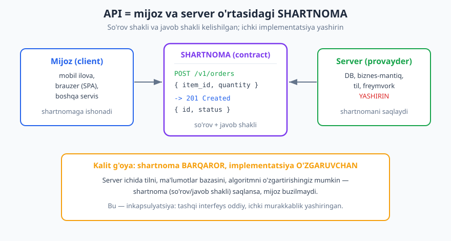
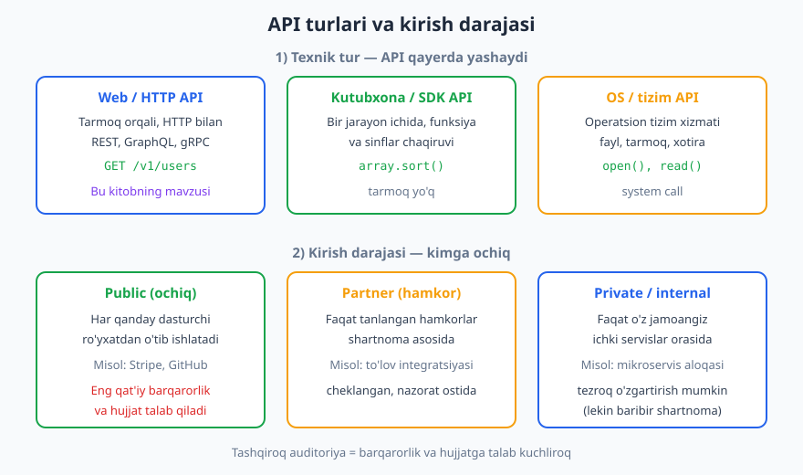
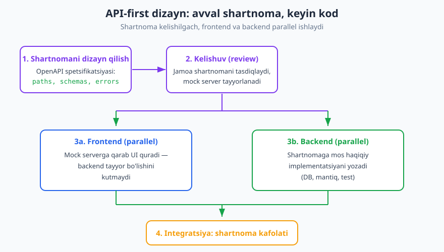

# 01 — API nima va nega muhim

[🏠 README](./README.md) · [Keyingi: 02 — HTTP protokoli chuqur ➡️](./02-http-chuqur.md)

---

> **Bu bobda:** API nima ekanini intuitiv analogiyalardan boshlab aniq ta'rifga olib chiqamiz; API'ni ikki muhim ko'z bilan ko'ramiz — **shartnoma** (contract) va **mahsulot** (product); API turlari (web/HTTP, kutubxona, OS) va kirish darajalari (public/partner/private) bilan tanishamiz; nega API zamonaviy dasturlashning markazida turishini va **API-first** dizayn yondashuvini o'rganamiz.
>
> **Halollik / Eslatma:** Bu kitob til-mustaqil — tamoyillar Node, Python, PHP, Go, Java — har qanday tilda bir xil. HTTP semantikasi (metodlar, status kodlar) RFC 9110 (2022) ga, OpenAPI namunalari 3.1 sintaksisiga asoslangan; bularning aniq versiyasi vaqt bilan o'zgaradi va biz buni har joyda halol belgilaymiz. Dizayn qarorlari esa "har doim shunday qil" emas, **kontekstga bog'liq trade-off** sifatida taqdim etiladi.

---

## API nima: oddiy intuitsiyadan boshlaymiz

Tasavvur qiling, restoranga keldingiz. Oshxonaga o'zingiz kirib, qozonlarni titkilab, taom pishirib bermaysiz. Buning o'rniga **ofitsiant** bor: unga **menyu**dan tanlab buyurtma berasiz, u esa oshxonaga borib, taomni olib keladi. Siz oshxonada qanday pishirilishini, qaysi pechka ishlatilishini, oshpaz kimligini **bilishingiz shart emas**. Sizga kerak bo'lgan narsa — aniq bir **interfeys**: menyu (nima so'rash mumkin) va ofitsiant (so'rovni qabul qilib, javobni qaytaradigan vositachi).

Mana shu — **API** (Application Programming Interface, "ilova dasturlash interfeysi") g'oyasining mohiyati. API — bu bir dasturning boshqa dasturga taqdim etadigan **aloqa interfeysi**: "mendan nimani, qanday so'rash mumkin, men evaziga nimani qaytaraman" degan aniq kelishuv. Restoran misolida:

- **Oshxona** — serverning ichki ishlashi (ma'lumotlar bazasi, biznes-mantiq, kod).
- **Menyu + ofitsiant** — API (so'rash mumkin bo'lgan amallar va ularning shakli).
- **Mijoz** — API'dan foydalanadigan dastur (mobil ilova, brauzer, boshqa servis).

Boshqa, undan ham yaqinroq analogiya — **elektr rozetkasi**. Devordagi rozetka — bu interfeys. Siz unga choynak, telefon zaryadchisi yoki noutbukni ulaysiz — ularning hammasi bir xil shaklga (interfeysga) suyangani uchun ishlaydi. Lekin orqada elektr stansiyasi qanday ishlashini, tok qayerdan kelishini bilishingiz shart emas. Stansiyada generatorni almashtirsalar ham, rozetka **bir xil** qolaveradi — shuning uchun sizning choynagingiz buzilmaydi.

Ikkala analogiyadagi asosiy tushuncha bitta: **interfeys ichki ishlashdan ajratilgan**. Bu — dasturlashda **inkapsulyatsiya** (encapsulation, axborotni yashirish) deb ataladi. API ichki murakkablikni **yashiradi** va faqat kelishilgan **kirish nuqtalarini** (endpoint) ochadi.

> **Eslatma:** "API" so'zi keng — u faqat web/internet bilan bog'liq emas. Kodingizdagi `Array.sort()` funksiyasi ham API, operatsion tizimning `open()` chaqiruvi ham API. Lekin bu kitobda biz asosan **web/HTTP API** — tarmoq orqali ishlaydigan API'ga e'tibor qaratamiz. Turlari haqida quyiroqda batafsil.

## API = SHARTNOMA (contract)

Endi eng muhim mental modelga o'tamiz. Professional dunyoda API'ni eng to'g'ri tushunish yo'li — uni **shartnoma** (contract) sifatida ko'rish. Shartnoma — bu ikki tomon (mijoz va provayder) o'rtasida kelishilgan, **rasmiy va aniq** kelishuv:

- **Mijoz** quyidagicha va'da beradi: "Men so'rovni **mana shu shaklda** yuboraman" — to'g'ri metod, to'g'ri manzil (URL), to'g'ri sarlavhalar va body.
- **Provayder (server)** quyidagicha va'da beradi: "Agar so'roving shartnomaga mos bo'lsa, men **mana shu shaklda** javob qaytaraman" — kelishilgan status kod va body.



Buni aniq misolda ko'raylik. Bir buyurtma yaratish API'sining shartnomasi shunday bo'lishi mumkin:

```http
POST /v1/orders HTTP/1.1
Host: api.example.com
Content-Type: application/json
Authorization: Bearer <token>

{"item_id": 42, "quantity": 2}

HTTP/1.1 201 Created
Location: /v1/orders/1001
Content-Type: application/json

{"id": 1001, "status": "pending", "item_id": 42, "quantity": 2}
```

Bu yerda shartnoma quyidagilarni belgilaydi: amal `POST /v1/orders` orqali bajariladi; so'rov body'sida `item_id` va `quantity` bo'lishi kerak; muvaffaqiyatda server `201 Created` status, yangi resurs manzili (`Location` sarlavhasi) va yaratilgan buyurtma obyektini qaytaradi. (Bu yerda `POST` ishlatilgani — RFC 9110 bo'yicha to'g'ri: yangi resurs yaratish "xavfsiz emas" va "idempotent emas" amal, demak `POST` mos keladi. Metodlar haqida [keyingi bobda](./02-http-chuqur.md) chuqur gaplashamiz.)

**Nega "shartnoma" so'zi shu qadar muhim?** Chunki shartnomaning ikki muhim xossasi bor:

**1. Shartnoma barqaror bo'lishi kerak.** Mijoz shartnomaga ishonib, o'z kodini yozadi. Agar siz bir kuni `quantity` maydonini `qty` ga o'zgartirib qo'ysangiz yoki javobni `200` o'rniga `201` ga aylantirsangiz — bu **buzuvchi o'zgarish** (breaking change) bo'ladi va mijozning kodi sinadi. Shuning uchun shartnoma — bu **va'da**, uni yengil buzib bo'lmaydi. (Shartnomani buzmasdan qanday rivojlantirishni [versiyalash bobida](./10-versiyalash.md) o'rganamiz.)

**2. Shartnoma ichki kodni yashiradi.** Buyurtmani saqlash uchun PostgreSQL ishlatasizmi yoki MongoDB; kodni Python'da yozasizmi yoki Go'da; bitta serverdami yoki yuzta mikroservis ortidami — **mijozga farqi yo'q**. Shartnoma o'sha-o'sha. Bu — inkapsulyatsiyaning kuchi: siz ichki implementatsiyani xohlagancha o'zgartira olasiz, **shartnoma saqlansa** mijoz buzilmaydi.

> **Trade-off:** Bu erkinlikning narxi bor: bir marta e'lon qilingan shartnomaga "bog'lanib qolasiz". Shuning uchun API'ni boshidanoq o'ylab loyihalash kerak — keyin tuzatish qimmatga tushadi. Ko'pincha aytishadi: "API'ni almos kabi o'yib chiqar, chunki uni keyin sindirish qiyin". Bu bobning butun mavzusi — **shartnomani yaxshi loyihalash**.

Shartnomani aniq, mashinada o'qiladigan tilda yozish uchun maxsus format bor — **OpenAPI** spetsifikatsiyasi. Unga [21-bobda](./21-openapi.md) batafsil kiramiz; hozircha bilib qo'ying: yaxshi API'ning shartnomasi odamning xayolida emas, **rasmiy hujjatda** yashaydi.

## API = MAHSULOT (product)

Ikkinchi muhim mental model — API'ni **mahsulot** sifatida ko'rish. Bu ko'pincha e'tibordan chetda qoladigan, lekin g'oyat muhim fikr.

O'ylab ko'ring: API'dan kim foydalanadi? **Boshqa dasturchilar.** Sizning frontend jamoangiz, mobil ilova dasturchilaringiz, hamkor kompaniyalar, balki minglab tashqi dasturchilar. Demak ular sizning API'ngizning **foydalanuvchilari** (users). Va har qanday mahsulotda bo'lgani kabi:

- **Yomon mahsulot = norozi foydalanuvchilar.** Agar API chigal, nomuvofiq, hujjatsiz, kutilmagan tarzda o'zgaradigan bo'lsa — dasturchilar undan jirkanadi, qo'llab-quvvatlash so'rovlari ko'payadi, ba'zilari raqobatchiga o'tadi.
- **Yaxshi mahsulot = xursand foydalanuvchilar.** Izchil, oldindan aytib bo'ladigan, yaxshi hujjatlangan API bilan dasturchi tez ishlay boshlaydi, kamroq xato qiladi, sizning platformangizga sodiq qoladi.

Mana shu yondashuv **"API as a product"** ("API — mahsulot sifatida") deb ataladi. U bilan birga **developer experience (DX)** — "dasturchi tajribasi" tushunchasi keladi: API'dan foydalanish qanchalik yoqimli, oson va tushunarli? DX yaxshi API uchun foydalanuvchi interfeysining (UI) yaxshi ilovasi uchun qanchalik muhim bo'lsa, shunchalik muhim. Buni alohida — [hujjatlash va DX bobida](./22-hujjatlash-dx.md) — chuqur ko'rib chiqamiz.

> **Eslatma:** Internetdagi eng muvaffaqiyatli kompaniyalarning ko'pi — aslida **API mahsuloti**. Stripe (to'lov), Twilio (SMS/qo'ng'iroq), AWS (bulutli xizmatlar) — ularning asosiy mahsuloti go'zal interfeys emas, balki **boshqa dasturchilar foydalanadigan API**. Bu kompaniyalar API'ni mahsulot sifatida — hujjat, izchillik, ishonchlilik bilan — jiddiy qabul qilgani uchun yutdi.

Ikki mental modelni birga olsak: **API = barqaror SHARTNOMA + yaxshi tajribali MAHSULOT.** Shartnoma — texnik aniqlik; mahsulot — inson tomoni. Yaxshi API ikkalasini ham talab qiladi.

## API turlari

"API" so'zi keng. Loyihalashda chalkashmaslik uchun ikki o'lcham bo'yicha ajratamiz: **(1) texnik tur** — API qayerda yashaydi; **(2) kirish darajasi** — u kimga ochiq.



### Texnik tur bo'yicha

| Tur | Qayerda ishlaydi | Aloqa usuli | Misol |
|---|---|---|---|
| **Web / HTTP API** | Tarmoq orqali, masofadagi server | HTTP so'rov/javob (REST, GraphQL, gRPC) | `GET https://api.github.com/users/octocat` |
| **Kutubxona / SDK API** | Bir jarayon ichida, kod chaqiruvi | Funksiya/sinf/metod chaqiruvi | `array.sort()`, `requests.get(...)` |
| **OS / tizim API** | Operatsion tizim xizmatlari | System call (tizim chaqiruvi) | `open()`, `read()`, `socket()` |

- **Web/HTTP API** — bu kitobning **asosiy mavzusi**. Bunda mijoz va server **alohida mashinalarda** bo'ladi, ular tarmoq (odatda HTTP) orqali xabar almashadi. Bu kontekstda shartnoma, tarmoq kechikishi, xavfsizlik, versiyalash kabi muammolar markazga chiqadi.
- **Kutubxona/SDK API** — bir dasturning ichidagi funksiya va sinflar to'plami. Tarmoq yo'q; chaqiruv darhol va bir xil xotirada bo'ladi. (SDK = Software Development Kit; ko'pincha web API ustiga qurilgan tilga xos o'rama.)
- **OS/tizim API** — operatsion tizim taqdim etadigan past darajali interfeys (fayl, tarmoq, xotira bilan ishlash).

> **Diqqat:** Web va kutubxona API'larining muhim farqi — **xatolarga munosabat**. Kutubxona chaqiruvi deyarli har doim ishlaydi; web so'rovi esa tarmoq uzilishi, kechikish, server o'chishi tufayli **istalgan paytda muvaffaqiyatsiz** bo'lishi mumkin. Shuning uchun web API dizaynida xato, qayta urinish (retry), [idempotentlik](./15-idempotentlik-parallellik.md) kabi tushunchalar juda muhim — bularni keyingi qismlarda chuqur ko'ramiz.

### Web API uslublari (qisqa eslatma)

Web/HTTP API'ni qurishning bir necha **uslubi** (style) bor. Hozircha faqat tanishtiramiz; har birini keyinroq batafsil ko'ramiz:

| Uslub | Asosiy g'oya | Qisqa |
|---|---|---|
| **REST** | Resurslar + HTTP metodlari | Eng keng tarqalgan; URL'lar resurslarni bildiradi |
| **GraphQL** | Bitta endpoint, mijoz maydonlarni tanlaydi | Moslashuvchan so'rov; ortiqcha/kam ma'lumot muammosini hal qiladi |
| **gRPC** | HTTP/2 ustida ikkilik RPC | Tezkor, servislararo aloqa uchun; Protocol Buffers |

Bu uslublar va ular orasidagi trade-off'larni [04-bobda — API uslublari](./04-api-uslublari.md) chuqur taqqoslaymiz. Hozircha esa kitobning katta qismi (REST, status kod, xato, auth) **HTTP poydevoriga** asoslanadi va deyarli barcha uslublarga taalluqlidir.

### Kirish darajasi bo'yicha

API'ni **kim ishlatishi** mumkinligiga qarab uch toifaga ajratamiz:

| Daraja | Kim foydalanadi | Barqarorlik/hujjat talabi | Misol |
|---|---|---|---|
| **Public (ochiq)** | Har qanday dasturchi (ro'yxatdan o'tib) | **Eng yuqori** — ko'p noma'lum mijoz | Stripe, GitHub API |
| **Partner (hamkor)** | Faqat kelishilgan hamkorlar | Yuqori, lekin nazorat ostida | B2B to'lov integratsiyasi |
| **Private / internal** | Faqat o'z jamoangiz | Pastroq — tezroq o'zgartirsa bo'ladi | Mikroservislar orasidagi aloqa |

Bu farq **dizayn qarorlariga to'g'ridan-to'g'ri ta'sir qiladi**. Public API'da har qanday o'zgarish minglab noma'lum mijozni sindirishi mumkin — shuning uchun u **juda ehtiyotkor, juda hujjatlangan, juda barqaror** bo'lishi shart. Private (ichki) API'da esa, agar barcha mijozlar o'z jamoangiz nazoratida bo'lsa, kerak bo'lsa shartnomani tezroq o'zgartirib, mijozlarni ham yangilashingiz mumkin.

> **Trade-off:** "Ichki API ekan, shartnoma muhim emas" deb o'ylash — keng tarqalgan xato. Ichki API ham shartnoma; faqat uni o'zgartirishning **narxi** boshqacha. Kompaniya o'ssa, ichki API'lar ham yuzlab jamoaning tayanchiga aylanadi — shuning uchun ularga ham jiddiy munosabat kerak.

## NEGA API muhim: zamonaviy dasturlashning markazi

Endi katta savol: nega bu hammasi shunchalik muhim? Bugungi dasturiy ta'minot **monolit ("hamma narsa bitta dastur ichida")** dunyodan **ulangan tizimlar** dunyosiga o'tdi. API — shu ulanishni mumkin qiladigan yelim. Sabablarni sanaymiz:

**1. Integratsiya — tizimlarni ulash.** Sizning ilovangiz to'lovni Stripe orqali, SMS'ni Twilio orqali, xaritani biror kartografiya xizmati orqali bajaradi. Bularning hammasi — **boshqa kompaniyaning API'sini chaqirish**. Siz to'lov tizimini noldan yozmaysiz; uning API'sini ishlatasiz. API'siz har bir ilova hamma narsani o'zi qurishi kerak bo'lardi.

**2. Platforma va ekotizim.** Yaxshi API atrofida **ekotizim** o'sadi. Stripe API'si shu qadar yaxshiki, uning ustiga minglab biznes qurildi. API'ni ochib, siz boshqa dasturchilarga sizning xizmatingiz ustida qurish imkonini berasiz — bu sizning mahsulotingizni platformaga aylantiradi. (Yana o'sha "API = mahsulot" g'oyasi.)

**3. Mikroservislar — ichki aloqa.** Katta tizim ko'pincha o'nlab kichik **mikroservislar**ga bo'linadi (foydalanuvchilar, buyurtmalar, to'lov, bildirishnomalar...). Bu servislar bir-biri bilan **API orqali** gaplashadi. API'ning sifati — bu butun tizimning ishonchliligi va rivojlanuvchanligini belgilaydi. (Bu mavzu [Dasturiy arxitektura](../arxitektura/README.md) kitobida kengroq, bu kitob esa uning **API qatlamini** chuqurlashtiradi.)

**4. Mobil va SPA backend.** Zamonaviy mobil ilova yoki single-page application (SPA, masalan React ilovasi) — bu aslida "yupqa" mijoz. Asl ish backenddagi API'da bajariladi; ilova faqat API'ni chaqirib, natijani ko'rsatadi. Bitta backend API bir vaqtning o'zida web, iOS va Android mijozlariga xizmat qiladi.

**5. Avtomatlashtirish.** API mashinaga boshqa mashinani boshqarish imkonini beradi. CI/CD quvurlari, skriptlar, integratsiyalar — bularning hammasi API chaqiruvlari orqali ishlaydi. Inson aralashuvisiz tizimlar bir-birini boshqaradi.

> **Eslatma:** Qisqasi — bugungi dunyoda deyarli har bir jiddiy dastur **API iste'molchisi yoki API provayderi** (yoki ikkalasi). Shuning uchun API'ni yaxshi loyihalash — endi ixtiyoriy mahorat emas, balki har bir backend dasturchining asosiy ko'nikmasi.

## API-FIRST dizayn

Endi amaliy yondashuvga o'tamiz: API'ni qachon va qanday loyihalash kerak? An'anaviy ("code-first") yondashuvda dasturchilar avval kodni yozadilar, API esa **kodning yon mahsuloti** bo'lib chiqadi — "qaysi endpoint qanday bo'lishi, kodni yozgan paytimda ma'lum bo'ladi". Bu ko'pincha nomuvofiq, o'ylanmagan shartnomaga olib keladi.

**API-first** (yoki **design-first**) yondashuvi buni teskari qiladi: **kod yozishdan oldin shartnomani loyihalaysiz**. Ya'ni avval OpenAPI spetsifikatsiyasini yozasiz — qaysi endpointlar bor, ular qanday so'rov qabul qiladi, qanday javob va xato qaytaradi — keyin shu shartnoma asosida kod yoziladi.



API-first siklining bosqichlari:

1. **Shartnomani dizayn qilish.** Jamoa OpenAPI hujjatida API shaklini loyihalaydi — resurslar, maydonlar, status kodlar, xatolar. Hali bironta ham qator kod yozilmagan.
2. **Kelishuv (review).** Jamoa shartnomani ko'rib chiqadi, kelishadi. Bu bosqichda o'zgartirish **arzon** — chunki faqat hujjat o'zgaradi, kod emas. Shartnoma asosida **mock server** (soxta server) tayyorlanadi.
3. **Parallel ishlab chiqish.** Endi sehr boshlanadi: **frontend** jamoasi mock serverga qarab UI quradi (backend tayyor bo'lishini kutmasdan), **backend** jamoasi esa o'sha shartnomaga mos haqiqiy implementatsiyani yozadi. Ikki tomon **parallel** ishlaydi.
4. **Integratsiya.** Backend tayyor bo'lganda, frontend uni mock o'rniga ulaydi. Ikkalasi ham bir xil shartnomaga amal qilgani uchun — birlashtirishda kam ajablanish bo'ladi.

> **Trade-off — design-first vs code-first:**
>
> - **Design-first** afzal: shartnoma o'ylangan, jamoalar parallel ishlaydi, hujjat hamisha mavjud, mijozlar erta fikr bildiradi. Kamchiligi: oldindan ko'proq fikrlash kerak; tezkor prototip uchun "og'ir" tuyulishi mumkin.
> - **Code-first** afzal: tez boshlanadi, kichik yoki tezgina o'zgaradigan ichki API uchun yengil. Kamchiligi: shartnoma keyinroq, ko'pincha nomuvofiq chiqadi; hujjat odatda orqada qoladi yoki umuman yozilmaydi.
>
> Umumiy maslahat: **public yoki ko'p-mijozli API uchun design-first** ko'pincha yutadi; **kichik, bitta jamoa ishlatadigan, tez o'zgaradigan ichki xizmat uchun code-first** ham maqbul. Bu — kontekst qarori, qat'iy qoida emas.

## Yaxshi API qanday bo'ladi: kitobning yo'l xaritasi

Biz "yaxshi API" iborasini ko'p ishlatdik. Aniqroq aytsak, yaxshi API quyidagi xossalarga ega — va bu xossalar aynan bu kitobning **yo'l xaritasi**:

| Xossa | Ma'nosi | Qaysi boblar bunga xizmat qiladi |
|---|---|---|
| **Izchil (consistent)** | Bir xil qoidalar hamma joyda — bir endpoint shunday qilsa, boshqasi ham shunday | [05](./05-rest-tamoyillari.md), [06](./06-resurs-uri-dizayni.md), [07](./07-sorov-javob-payload.md) |
| **Oldindan aytib bo'ladigan (predictable)** | Dasturchi bir qismni ko'rib, qolganini taxmin qila oladi | [03](./03-http-status-kodlari.md), [09](./09-xato-dizayni.md) |
| **Yaxshi hujjatlangan** | Aniq, misolli, yangilanadigan hujjat | [21](./21-openapi.md), [22](./22-hujjatlash-dx.md) |
| **Evolyutsiyaga chidamli** | Mijozni sindirmasdan o'sa oladi | [10](./10-versiyalash.md) |
| **Xavfsiz** | Auth, ruxsatlar, hujum himoyasi | [11](./11-autentifikatsiya.md), [12](./12-avtorizatsiya.md), [13](./13-api-xavfsizligi.md) |
| **Ishonchli va tez** | Rate limit, kesh, idempotentlik, kuzatuv | [14](./14-rate-limiting.md), [16](./16-keshlash.md), [25](./25-observability.md) |

Ko'rib turganingizdek, "yaxshi API" — bu bitta hiyla emas, balki ko'p o'lchamli sifat. Kitobning qolgan qismi shu o'lchamlarni birma-bir, chuqur ochib boradi. Keyingi bobdan — barcha web API'larning poydevori bo'lgan **HTTP protokoli**dan boshlaymiz.

> **Standart:** Yodda tuting — "REST" deb atalgan ko'pgina API'lar aslida hamma tamoyillarga to'liq amal qilmaydi. Buni o'lchaydigan foydali model — **Richardson Maturity Model** (L0–L3) bo'lib, uni [05-bobda](./05-rest-tamoyillari.md) ko'ramiz. Maqsad — "to'liq REST" degan medal emas, balki **mijoz uchun qulay, izchil shartnoma**.

## Asosiy g'oyalar (bobni qisqacha)

- **API — dasturlar o'rtasidagi aloqa interfeysi.** U ichki murakkablikni yashirib (inkapsulyatsiya), faqat kelishilgan kirish nuqtalarini ochadi. Analogiya: restoran ofitsianti, elektr rozetkasi.
- **API = SHARTNOMA (contract).** Mijoz va server kelishadigan so'rov/javob shakli. Shartnoma **barqaror** bo'lishi kerak — ichki kod o'zgarsa ham shartnoma saqlansa, mijoz buzilmaydi.
- **API = MAHSULOT (product).** Foydalanuvchilaringiz — boshqa dasturchilar. Yomon API = norozi dasturchilar. Developer experience (DX) muhim.
- **API turlari:** texnik bo'yicha — web/HTTP, kutubxona/SDK, OS; kirish bo'yicha — public, partner, private. Tashqiroq auditoriya = barqarorlik va hujjatga talab kuchliroq.
- **Nega muhim:** integratsiya, platforma/ekotizim, mikroservislar, mobil/SPA backend, avtomatlashtirish. Bugungi har bir jiddiy dastur — API iste'molchisi yoki provayderi.
- **API-first (design-first):** kod yozishdan oldin shartnomani loyihalash; frontend/backend parallel ishlaydi; mock serverlar. Code-first bilan trade-off — kontekstga bog'liq.
- **Yaxshi API:** izchil, oldindan aytib bo'ladigan, yaxshi hujjatlangan, evolyutsiyaga chidamli, xavfsiz — bu kitobning yo'l xaritasi.

## Mashqlar

### Oson

**1-mashq.** O'z so'zlaringiz bilan tushuntiring: "API — bu shartnoma" iborasini misol bilan asoslang. Restoran yoki rozetka analogiyasidan boshqa, kundalik hayotdan **o'zingizning analogiyangizni** o'ylab toping va unda "interfeys" va "yashirin ichki ishlash" qismlarini ajrating.

**2-mashq.** Quyidagi har bir holatda qaysi **API turi** (web/HTTP, kutubxona/SDK, OS/tizim) ishlatilayotganini aniqlang:
1. Python kodida `requests.get("https://...")` chaqiruvi.
2. Python kodida `sorted([3, 1, 2])` chaqiruvi.
3. Dastur diskdan fayl o'qish uchun `open("data.txt")` chaqiradi.
4. Mobil ilova ob-havoni olish uchun masofadagi serverga so'rov yuboradi.

**3-mashq.** Quyidagi uchta API'ni **kirish darajasi** (public / partner / private) bo'yicha tasniflang va nima uchun shunday deb o'ylayotganingizni bir jumlada yozing:
1. GitHub'ning ochiq REST API'si — har kim ro'yxatdan o'tib ishlatadi.
2. Kompaniya ichidagi "foydalanuvchilar" mikroservisining "buyurtmalar" mikroservisiga taqdim etadigan API'si.
3. Faqat bitta tanlangan bank bilan tuzilgan shartnoma asosida ishlaydigan to'lov integratsiyasi API'si.

### O'rta

**4-mashq.** Quyidagi real-ko'rinishli HTTP almashuv berilgan:

```http
POST /v1/users HTTP/1.1
Host: api.example.com
Content-Type: application/json

{"email": "ali@example.com", "name": "Ali"}

HTTP/1.1 201 Created
Location: /v1/users/507
Content-Type: application/json

{"id": 507, "email": "ali@example.com", "name": "Ali", "created_at": "2026-06-16T09:00:00Z"}
```

Quyidagilarni aniqlang: (a) shartnomaning qaysi qismlari **mijoz va server kelishgan** — ya'ni shartnomaga kiradi? (b) shartnomaga kirmaydigan, **server ichida yashiringan** narsalarga uchta misol keltiring. (c) Agar ertaga server `email` maydonini `email_address` ga o'zgartirsa, bu buzuvchi o'zgarishmi? Nega?

**5-mashq.** Bir kompaniyaning API'sini "mahsulot sifatida" baholang. Tasavvur qiling, ikkita raqobatchi to'lov xizmati bor: birining API'si chiroyli hujjatli, izchil va misollar bilan to'la; ikkinchisiniki tarqoq, har endpoint o'z qoidasiga ega va hujjat eskirgan. Texnik imkoniyatlar bir xil deb faraz qilsak, dasturchi qaysi birini tanlaydi va nega? Buni "developer experience" tushunchasi bilan bog'lab tushuntiring.

### Qiyin

**6-mashq.** Sizga yangi loyiha topshirildi: ichki "bildirishnomalar" (notifications) xizmati. U boshlang'ich bosqichda faqat bitta jamoa (sizning jamoangiz) tomonidan ishlatiladi, lekin keyinchalik boshqa jamoalar, ehtimol tashqi hamkorlar ham ulanishi mumkin. **API-first (design-first)** yoki **code-first** yondashuvini tanlang va qaroringizni trade-off'lar orqali asoslang. Vaqt o'tib API public bo'lib qolsa, qaroringiz qanday o'zgaradi?

**7-mashq.** Yomon API "mahsulot sifatida" qanday muvaffaqiyatsiz bo'lishini tahlil qiling. Bir xayoliy API'ni tasavvur qiling: u texnik jihatdan ishlaydi, lekin (1) har versiyada maydon nomlari sababsiz o'zgaradi, (2) xato javoblar tushunarsiz, (3) hujjat yo'q. Bu uchta muammoning **har biri** API foydalanuvchilariga (boshqa dasturchilarga) qanday zarar yetkazishini va oxir-oqibat biznesga qanday ta'sir qilishini ketma-ket tushuntiring. Har bir muammoni qaysi kitob bobi hal qilishini ham ko'rsating.

<details markdown="1">
<summary>Yechimlar</summary>

### 1-mashq yechimi

Maqsad — interfeys va yashirin ichki ishlashni ajrata olish. Bir yaxshi analogiya — **bankomat (ATM)**:
- **Interfeys (API)**: ekran, tugmalar, karta uyasi. Siz "100 ming so'm yech" deb so'raysiz va pul olasiz.
- **Yashirin ichki ishlash**: bankning markaziy bazasi, hisobingiz qoldig'i, tranzaksiya jurnali, xavfsizlik tekshiruvlari, bank serverlari bilan aloqa.

Siz bankomat ichida pul qanday saqlanishini, hisob qaysi bazada turishini bilmaysiz — sizga faqat **interfeys** kerak. Bank orqada tizimini butunlay almashtirsa ham, bankomat **interfeysi** o'sha-o'sha qoladi — bu aynan API'ning "shartnoma barqaror, implementatsiya yashirin" xossasi. Boshqa to'g'ri javoblar: pochta qutisi, lift tugmalari, televizor pulti — har birida "siz nima so'rashingiz mumkin" (interfeys) "u qanday bajariladi" (yashirin)dan ajralgan.

### 2-mashq yechimi

1. `requests.get("https://...")` — **web/HTTP API** (masofadagi server bilan tarmoq orqali aloqa). E'tibor bering: `requests` kutubxonasining o'zi SDK/kutubxona API'si, lekin u **chaqirayotgan** narsa — web API.
2. `sorted([3, 1, 2])` — **kutubxona/SDK API** (tilning standart funksiyasi, bir jarayon ichida, tarmoqsiz).
3. `open("data.txt")` — **OS/tizim API** (fayl tizimi bilan ishlash operatsion tizim xizmati orqali). Til funksiyasi ko'rinsa-da, u orqada tizim chaqiruvini bajaradi.
4. Mobil ilovaning masofadagi serverga so'rovi — **web/HTTP API**.

### 3-mashq yechimi

1. GitHub ochiq REST API — **public**: har qanday dasturchi ro'yxatdan o'tib (token olib) ishlatadi, oldindan tanlanmaydi.
2. Ichki "foydalanuvchilar -> buyurtmalar" mikroservis API'si — **private/internal**: faqat o'z kompaniyangiz servislari orasida ishlatiladi.
3. Bitta bank bilan shartnoma asosidagi to'lov integratsiyasi — **partner**: ochiq emas, lekin sof ichki ham emas; tanlangan tashqi hamkor bilan kelishilgan.

Eslatma: kirish darajasi qanchalik "tashqi" bo'lsa (private → partner → public), shartnoma barqarorligi va hujjat sifatiga talab shunchalik kuchayadi.

### 4-mashq yechimi

**(a) Shartnomaga kiradigan (kelishilgan) qismlar:**
- Metod va manzil: `POST /v1/users`.
- So'rov body shakli: JSON, `email` va `name` maydonlari bilan.
- Muvaffaqiyat javobi: `201 Created` status, yangi resurs manzili `Location` sarlavhasida, body'da `id`, `email`, `name`, `created_at` maydonlari.
- Sana formati: `created_at` ISO 8601 / RFC 3339 (`2026-06-16T09:00:00Z`).

**(b) Yashiringan (shartnomaga kirmaydigan) narsalarga misollar:**
- Foydalanuvchi qaysi ma'lumotlar bazasida va qaysi jadvalda saqlanadi.
- `id` qanday generatsiya qilinadi (avto-inkrement, UUID, ketma-ketlik?).
- Server qaysi tilda/freymvorkda yozilgan, nechta server orqasida turibdi.
- Parol/email validatsiyasi ichki qanday amalga oshadi, qo'shimcha ichki maydonlar (masalan, ichki audit jurnali) bormi.

**(c)** Ha, `email` ni `email_address` ga o'zgartirish — **buzuvchi o'zgarish** (breaking change). Mijoz kodi javobdan `email` kalitini o'qiyotgan bo'lsa, endi u maydonni topa olmaydi (yoki `null`/xato oladi). Shartnoma — va'da; maydon nomini o'zgartirish o'sha va'dani buzadi. To'g'ri yo'l — bunday o'zgarishni [versiyalash](./10-versiyalash.md) orqali boshqarish (masalan yangi versiya yoki ikkala maydonni vaqtincha qaytarish).

### 5-mashq yechimi

Dasturchi deyarli har doim **birinchisini** — yaxshi hujjatli, izchil, misolli API'ni tanlaydi. Sabab — **developer experience (DX)**: dasturchi uchun "qancha tez ishlay boshlayman va qancha kam og'riq bilan?" degan savol hal qiluvchi.

- **Birinchi API** bilan: hujjatni o'qib, misolni nusxalab, bir necha daqiqada ishlaydigan integratsiya quradi. Izchillik tufayli bir endpointni o'rgansa, qolganini taxmin qila oladi.
- **Ikkinchi API** bilan: har endpoint o'z qoidasiga ega bo'lgani uchun har birini alohida o'rganish kerak; eskirgan hujjat tufayli "sinab-yanglishib" vaqt ketadi; ishonch yo'qoladi.

Bu — "API = mahsulot" g'oyasining amaliy ko'rinishi. Texnik imkoniyat teng bo'lsa, **tajriba g'olib chiqadi**. Yomon DX = ko'proq qo'llab-quvvatlash so'rovlari, sekinroq integratsiya, kamroq sodiq dasturchi va oxir-oqibat raqobatda yutqazish. Aynan shu sababdan Stripe kabi kompaniyalar API hujjati va izchilligiga juda katta sarmoya kiritadi.

### 6-mashq yechimi

Bu — sof trade-off qarori; "to'g'ri" javob — asoslangan tahlil.

**Boshlang'ich holat (faqat bitta jamoa):** code-first ham, design-first ham maqbul. Lekin masalada **muhim ishora** bor: "keyinchalik boshqa jamoalar, ehtimol tashqi hamkorlar ulanishi mumkin". Bu kelajakdagi auditoriya **kengayishini** anglatadi.

**Tavsiya etilgan qaror: yengil design-first.** Sabablari:
- Hatto ichki bo'lsa ham, oldindan shartnomani (OpenAPI) loyihalash uni o'ylangan va izchil qiladi — keyin boshqa jamoalar ulanganda qayta yozish shart bo'lmaydi.
- Mock server frontend/iste'molchi jamoalarga parallel ishlash imkonini beradi.
- Hujjat boshidanoq mavjud bo'ladi — kelajakdagi onboarding arzon.

**Code-first foydasiga argument:** agar bu sof eksperiment/prototip bo'lsa va tez-tez tubdan o'zgaradigan bo'lsa, design-first "og'ir" tuyulishi mumkin; bunday holda code-first bilan tez boshlab, barqarorlashganda OpenAPI'ga ko'chirish mumkin.

**API public bo'lib qolsa, qaror qanday o'zgaradi:** design-first **majburiyatga aylanadi**. Public API'da:
- Har bir buzuvchi o'zgarish minglab noma'lum mijozni sindiradi — shuning uchun shartnomani oldindan, ehtiyotkorlik bilan loyihalash shart.
- Hujjat, izchillik, versiyalash siyosati — endi ixtiyoriy emas, balki mahsulotning asosiy qismi.
- Mock va contract testing ([24-bob](./24-testlash-contract.md)) mijozlarni himoya qilish uchun zarur bo'ladi.

Xulosa: auditoriya qanchalik tashqi va katta bo'lsa, **design-first shunchalik foydali**.

### 7-mashq yechimi

Har bir muammoni foydalanuvchi (dasturchi) → biznes zanjirida ko'ramiz:

**(1) Har versiyada maydon nomlari sababsiz o'zgaradi.**
- *Dasturchiga zarar:* mijoz kodi har yangilanishda sinadi; dasturchi doimo "tuzatish rejimida" bo'lib, yangi imkoniyat qurish o'rniga buzilganni ta'mirlaydi. Ishonch yo'qoladi — "bu API'ga tayanib bo'lmaydi".
- *Biznesga ta'sir:* integratsiyalar uziladi, mijozlar ketadi, qo'llab-quvvatlash xarajati oshadi.
- *Qaysi bob hal qiladi:* [10 — versiyalash](./10-versiyalash.md) (buzuvchi o'zgarishni boshqarish) va [07 — payload dizayni](./07-sorov-javob-payload.md) (izchil maydon konvensiyalari).

**(2) Xato javoblar tushunarsiz.**
- *Dasturchiga zarar:* nimaning noto'g'ri ekanini bilolmaydi — "400 Bad Request" yozuvi bilan qoladi, sababini topish uchun soatlab vaqt sarflaydi. Debug qilish azobga aylanadi.
- *Biznesga ta'sir:* integratsiya sekinlashadi, qo'llab-quvvatlash so'rovlari ko'payadi, dasturchi raqobatchiga o'tishi mumkin.
- *Qaysi bob hal qiladi:* [09 — xato dizayni](./09-xato-dizayni.md) (Problem Details, RFC 9457, foydali xato xabarlari) va [03 — status kodlari](./03-http-status-kodlari.md).

**(3) Hujjat yo'q.**
- *Dasturchiga zarar:* qanday ishlatishni umuman bilmaydi; "sinab-yanglishib" yoki boshqalardan so'rab vaqt yo'qotadi. Boshlash to'sig'i juda baland.
- *Biznesga ta'sir:* yangi mijozlarni jalb qilish (adoption) sekin — API'ni hech kim ishlata olmasa, uning texnik kuchi befoyda.
- *Qaysi bob hal qiladi:* [21 — OpenAPI](./21-openapi.md) va [22 — hujjatlash va DX](./22-hujjatlash-dx.md).

**Umumiy xulosa:** API texnik jihatdan "ishlashi" yetarli emas. U **mahsulot** sifatida muvaffaqiyatsiz bo'lsa — ya'ni ishonchsiz, tushunarsiz va hujjatsiz bo'lsa — foydalanuvchilar (dasturchilar) undan voz kechadi, bu esa biznesga to'g'ridan-to'g'ri zarar yetkazadi. "Yaxshi API" — bu shartnoma barqarorligi (versiyalash), aniqlik (xato dizayni) va tajriba (hujjat) birgalikdagi sifat.

</details>

---

[🏠 README](./README.md) · [Keyingi: 02 — HTTP protokoli chuqur ➡️](./02-http-chuqur.md)
