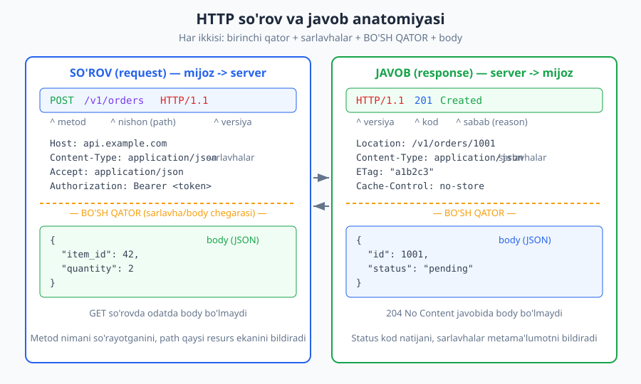
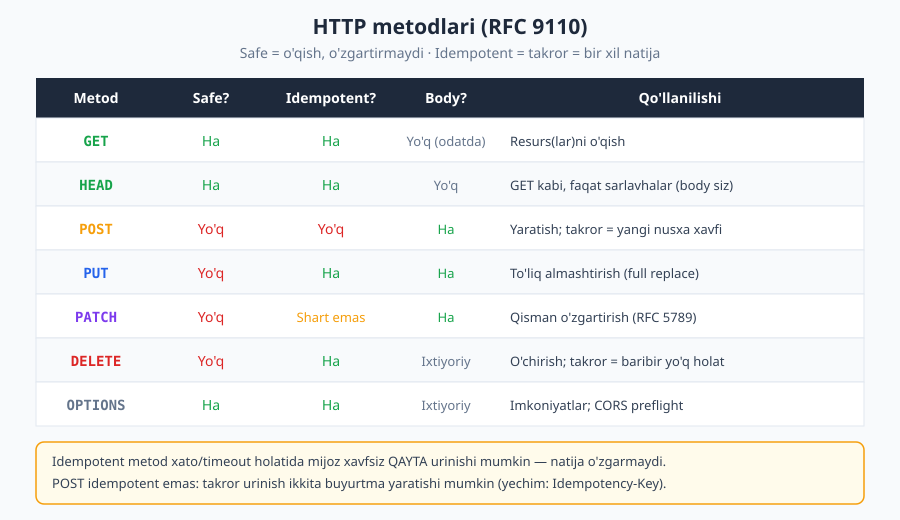
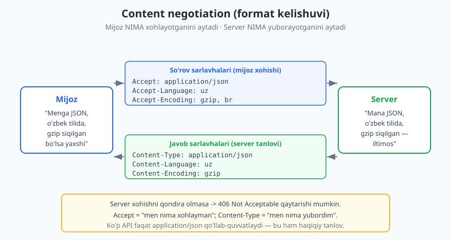

# 02 — HTTP protokoli chuqur

[⬅️ Oldingi: 01 — API nima va nega muhim](./01-api-nima.md) · [🏠 README](./README.md) · [Keyingi: 03 — HTTP status kodlari ➡️](./03-http-status-kodlari.md)

---

> **Bu bobda:** Veb API'larning aksariyati HTTP ustida quriladi, shuning uchun yaxshi API dizayn qilish uchun HTTP'ni "tashqaridan" emas, "ichidan" tushunish kerak. So'rov va javobning aniq anatomiyasini, metodlar semantikasini (GET/POST/PUT/PATCH/DELETE...), **safe** va **idempotent** tushunchalarini, sarlavhalar va content negotiation'ni, URL tuzilishini hamda HTTP versiyalarini ko'rib chiqamiz. Maqsad — metod va sarlavhalarni "shunchaki ishlaydi"dan "ataylab to'g'ri tanlangan" darajasiga olib chiqish.

>
> **Halollik / Eslatma:** HTTP semantikasi (metodlar, status kodlar, sarlavhalar) bo'yicha joriy asosiy standart — **RFC 9110 (HTTP Semantics, 2022-yil iyun)**. U eski RFC 7231/7232/7233/7235 va (zanjir orqali) RFC 2616'ni bekor qiladi — biz ataylab faqat 9110'ga tayanamiz. So'rov/javob namunalari haqiqiy HTTP shaklida, JSON body'lar valid. Qaysidir qaror standart talab emas, balki amaliyot/trade-off bo'lsa — buni alohida belgilaymiz.

---

## HTTP nima va nega u API'ning poydevori

Tasavvur qiling, restoranda ofitsiantga buyurtma berasiz. Siz aniq **so'rov** aytasiz ("ikkita osh, bittasi achchiqsiz"), ofitsiant oshxonaga olib boradi, va sizga **javob** keladi (taom, yoki "achchiqsizi tugadi" degan xabar). Siz oshpazni ko'rmaysiz, pechni ko'rmaysiz — siz faqat **so'rov-javob** almashinuvini bilasiz. HTTP ham xuddi shunday: mijoz (client) so'rov yuboradi, server javob qaytaradi. Hammasi shu oddiy halqaga asoslanadi.

HTTP'ning uchta xususiyati API dizayn uchun hal qiluvchi:

1. **Client-server.** Aloqani har doim **mijoz boshlaydi** — server o'zicha mijozga "salom" demaydi (real-time istisnolar bor, ularni [20-bobda](./20-realtime-websocket-sse.md) ko'ramiz). Server faqat kelgan so'rovga javob beradi.
2. **Request-response (so'rov-javob).** Har bir so'rovga aniq bitta javob to'g'ri keladi. Bu juftlik — API "shartnomasi"ning atom birligi.
3. **Stateless (holatsiz).** **Har bir so'rov mustaqil va o'zini o'zi to'liq tavsiflaydi.** Server avvalgi so'rovni "eslab qolishi" shart emas (va eslamaydi ham). Agar mijoz kim ekanini bilish kerak bo'lsa, har so'rovda `Authorization` sarlavhasi yuboriladi. Bu xususiyat API'ni **masshtablanadigan** qiladi: istalgan server istalgan so'rovni ko'tara oladi, chunki kontekst so'rovning o'zida.

> **Standart:** HTTP semantikasi RFC 9110'da ta'riflangan. "Semantika" — bu metod nimani anglatishini, status kod nima deyishini, sarlavha nimani bildirishini belgilaydigan **ma'no** qatlami. U xabar sintaksisidan (HTTP/1.1 = RFC 9112) ajratilgan — shuning uchun bir xil semantika HTTP/1.1, HTTP/2 va HTTP/3 ustida bir xil ishlaydi.

> **Eslatma:** "Stateless" so'rovning *ichida* holat yo'q degani EMAS — ma'lumotlar bazasida holat bo'lishi mumkin (buyurtmangiz saqlanadi). Gap shundaki, **ulanish (connection) darajasida** server avvalgi so'rovni eslab qolishga tayanmaydi. Sessiyani serverda saqlash mumkin, lekin bu masshtabni qiyinlashtiradi — token-asosli yondashuvni [11-bobda](./11-autentifikatsiya.md) ko'ramiz.

## So'rov (request) anatomiyasi

HTTP so'rovi — bu matn (tekst) xabari, qat'iy tuzilishga ega. To'rt qism bor:

```
<metod> <nishon> <HTTP-versiya>      <- so'rov qatori (request line)
<Sarlavha-nomi>: <qiymat>            <- sarlavhalar (headers), 0 yoki ko'p
<Sarlavha-nomi>: <qiymat>
                                     <- BO'SH QATOR (majburiy chegara)
<body>                               <- ixtiyoriy tana (masalan JSON)
```

Mana to'liq, real bir POST so'rovi:

```http
POST /v1/orders HTTP/1.1
Host: api.example.com
Content-Type: application/json
Accept: application/json
Authorization: Bearer eyJhbGciOiJI...
Content-Length: 32

{"item_id": 42, "quantity": 2}
```

Qismlarni ajratamiz:

- **So'rov qatori (`POST /v1/orders HTTP/1.1`):** metod (`POST` — nima qilmoqchimiz), nishon/path (`/v1/orders` — qaysi resurs), versiya (`HTTP/1.1`).
- **Sarlavhalar:** `Host` (qaysi domen — bitta IP'da ko'p sayt bo'lishi mumkin, shuning uchun majburiy), `Content-Type` (body qaysi formatda), `Accept` (javobni qaysi formatda xohlaymiz), `Authorization` (kim so'rayapti), `Content-Length` (body necha bayt).
- **Bo'sh qator:** sarlavhalar tugagani va body boshlanganini bildiruvchi **majburiy** chegara. Bu qatorsiz parser body qayerda boshlanishini bilmaydi.
- **Body:** bu yerda yangi buyurtma ma'lumoti (JSON). GET so'rovlarida odatda body bo'lmaydi.



> **Eslatma:** API dizaynerlar uchun eng muhim qismlar — **metod**, **path**, va **body shakli**. Bular birgalikda "shartnoma"ni tashkil qiladi. Sarlavhalar ko'pincha "kross-kesim" (cross-cutting) mavzular — auth, format, kesh — bilan shug'ullanadi.

## Javob (response) anatomiyasi

Javob ham xuddi shu tuzilishga ega, faqat birinchi qatori boshqacha — u **status qatori** deyiladi:

```
<HTTP-versiya> <status-kod> <sabab>   <- status qatori (status line)
<Sarlavha-nomi>: <qiymat>             <- sarlavhalar
                                      <- BO'SH QATOR
<body>                                <- ixtiyoriy tana
```

Yuqoridagi POST so'roviga server quyidagicha javob berishi mumkin:

```http
HTTP/1.1 201 Created
Location: /v1/orders/1001
Content-Type: application/json
ETag: "a1b2c3"
Cache-Control: no-store

{"id": 1001, "status": "pending", "item_id": 42, "quantity": 2}
```

- **Status qatori (`HTTP/1.1 201 Created`):** versiya, status kod (`201` — mashina o'qiydigan natija), sabab iborasi (`Created` — odam o'qiydigan izoh; uni hech qachon kod mantig'ida ishonch tayanchi qilmang, faqat kodga qarang).
- **Sarlavhalar:** `Location` (yangi yaratilgan resurs qayerda), `Content-Type` (javob formati), `ETag` (resurs versiyasi — kesh va parallellik uchun), `Cache-Control` (keshlash siyosati).
- **Body:** yaratilgan resursning hozirgi holati.

`201 Created` + `Location` juftligi — bu yaratish (creation) uchun klassik, to'g'ri naqsh. Status kodlarning to'liq oilasini va qaysi vaziyatda qaysisini ishlatishni keyingi [03-bobda](./03-http-status-kodlari.md) batafsil ko'ramiz; hozircha shuni bilish kifoya: **status kod — javobning eng muhim qismi**, chunki mijoz birinchi navbatda unga qaraydi.

> **Diqqat:** "Sabab iborasi" (reason phrase, masalan `Created`, `Not Found`) faqat odam uchun. HTTP/2 va HTTP/3'da u umuman yuborilmaydi. Shuning uchun mijoz kodi har doim **raqamli status kodga** tayanishi kerak, matnga emas.

## Metodlar (RFC 9110)

Metod — so'rovning "fe'li": resurs ustida **qanday amal** bajarmoqchimiz. To'g'ri metod tanlash — REST dizaynning yuragi. Mana asosiy metodlar va ularning xossalari:



| Metod | Safe? | Idempotent? | Body? | Tavsif |
|---|---|---|---|---|
| `GET` | Ha | Ha | Yo'q (odatda) | Resurs(lar)ni o'qish. Hech narsani o'zgartirmaydi. |
| `HEAD` | Ha | Ha | Yo'q | GET kabi, lekin faqat sarlavhalar (body'siz). Mavjudlik/o'lcham tekshirish. |
| `POST` | Yo'q | Yo'q | Ha | Yangi resurs yaratish yoki noydempotent amal. |
| `PUT` | Yo'q | **Ha** | Ha | Resursni to'liq almashtirish (full replace). |
| `PATCH` | Yo'q | Shart emas | Ha | Resursni qisman o'zgartirish (RFC 5789). |
| `DELETE` | Yo'q | **Ha** | Ixtiyoriy | Resursni o'chirish. |
| `OPTIONS` | Ha | Ha | Ixtiyoriy | Resursning imkoniyatlari; CORS preflight. |

Endi eng muhim ikki tushunchani — **safe** va **idempotent**ni — aniq ajratamiz, chunki ular API dizaynda markaziy.

### Safe (xavfsiz)

**Safe metod serverdagi holatni o'zgartirmaydi** — u faqat o'qish (read-only). `GET`, `HEAD`, `OPTIONS` safe. Bu nima beradi? Mijoz, brauzer, qidiruv tizimi, proxy — barchasi safe so'rovni xavfsiz, oqibatsiz yuborishi mumkin. Brauzer sahifa ortidagi havolalarni oldindan yuklab qo'yishi (prefetch) mumkin, chunki ular GET — hech narsa buzilmaydi.

> **Anti-pattern:** `GET /users/42/delete` kabi URL'lar — klassik xato. Bu GET, demak safe bo'lishi kerak; lekin u o'chiradi. Natijada brauzer prefetch yoki qidiruv-bot URL'ni ochib, ma'lumotni o'chirib yuborishi mumkin. **O'chirish hech qachon GET bo'lmasligi kerak** — `DELETE /users/42` ishlating.

### Idempotent (takrorga bardoshli)

**Idempotent metod bir necha marta yuborilsa ham, server holatiga ta'siri bitta marta yuborilgandagi bilan bir xil bo'ladi.** Diqqat: bu "javob har safar bir xil" degani EMAS — gap **server holatiga** yakuniy ta'sir haqida.

Misol bilan tushunamiz:

- `DELETE /v1/orders/1001` — birinchi marta buyurtmani o'chiradi (`204 No Content`). Ikkinchi marta yuborsangiz, buyurtma allaqachon yo'q — server `404 Not Found` qaytarishi mumkin. Status kod **boshqacha**, lekin **server holati o'zgarmadi**: buyurtma baribir o'chgan. Demak DELETE idempotent.
- `PUT /v1/orders/1001` bilan to'liq yangi holat yuborsangiz — necha marta yuborsangiz ham, resurs aynan o'sha yuborgan holatga keladi. Idempotent.
- `POST /v1/orders` — har bir yuborish **yangi** buyurtma yaratadi. Ikki marta yuborsangiz — ikkita buyurtma. **Idempotent emas.**

Nega bu muhim? Tarmoq ishonchsiz. Mijoz so'rov yubordi, lekin javob kelmadi (timeout). So'rov yetib bormadimi yoki javob yo'qoldimi — mijoz bilmaydi. **Idempotent** metodda mijoz **xavfsiz qayta urinishi** mumkin: agar birinchisi yetgan bo'lsa, ikkinchisi hech narsani buzmaydi. Idempotent bo'lmagan metodda (POST) qayta urinish — ikkita buyurtma, ikkita to'lov degan xavf bor.

> **Trade-off:** POST'ni "xavfsiz qayta urinish mumkin" qilishning standart usuli — **`Idempotency-Key` sarlavhasi** (Stripe va boshqalar shu naqshni ishlatadi). Mijoz har bir mantiqiy operatsiyaga noyob kalit beradi; server bir xil kalit bilan kelgan ikkinchi so'rovni **takror bajarmasdan** avvalgi natijani qaytaradi. Bu IETF draft'i (`draft-ietf-httpapi-idempotency-key-header`) — hali rasmiy RFC emas, lekin keng tarqalgan amaliyot. Batafsil [15-bobda](./15-idempotentlik-parallellik.md).

> **Eslatma:** `safe` har doim `idempotent`ni anglatadi (o'zgartirmasangiz, takror ham hech narsa o'zgartirmaydi), lekin teskarisi noto'g'ri: `DELETE` idempotent, ammo safe emas.

### PUT vs PATCH — to'liq vs qisman

Ikkalasi ham o'zgartirish uchun, lekin farqi bor:

- **`PUT` — to'liq almashtirish.** Siz resursning **butun** yangi holatini yuborasiz; server eski holatni yangisi bilan to'liq almashtiradi. Yubormagan maydonlaringiz **o'chib ketishi** (yoki standart qiymatga tushishi) mumkin. PUT idempotent: bir xil to'liq holatni 5 marta yuborsangiz ham natija bitta.

```http
PUT /v1/users/7 HTTP/1.1
Content-Type: application/json

{"name": "Ali", "email": "ali@example.com", "role": "admin"}
```

- **`PATCH` — qisman o'zgartirish.** Siz faqat **o'zgartirmoqchi bo'lgan** qismni yuborasiz.

```http
PATCH /v1/users/7 HTTP/1.1
Content-Type: application/json

{"role": "editor"}
```

PATCH **har doim ham idempotent emas**. Masalan, agar PATCH "balansga +10 qo'sh" kabi nisbatan (relative) o'zgartirish qilsa, har takror balansni yana oshiradi — idempotent emas. Lekin PATCH'ni idempotent qilib loyihalash MUMKIN (masalan, "rol'ni 'editor'ga o'rnat" kabi absolyut qiymat). Bu — dizayn qarori, metodning o'zi kafolatlamaydi.

> **Trade-off:** PATCH body formati ham qaror: oddiy "yuborilgan maydonlarni birlashtirish" (merge) yoki rasmiy **JSON Merge Patch (RFC 7396)** / **JSON Patch (RFC 6902)**. Public API'larda formatni hujjatlab qo'ying, aks holda mijoz `null` qiymatni "o'chir" deb yuborganmi yoki "tegma" deb yuborganmi — noaniq qoladi.

## Sarlavhalar (headers)

Sarlavhalar — so'rov yoki javob haqidagi **metama'lumot** (body emas, balki "body haqida" yoki "kontekst haqida"). Nom: qiymat shaklida. Quyida eng muhimlari.

**Tez-tez uchraydigan so'rov sarlavhalari:**

| Sarlavha | Vazifasi |
|---|---|
| `Host` | Qaysi domen (HTTP/1.1'da majburiy). |
| `Authorization` | Kim so'rayapti — `Bearer <token>`, `Basic ...` va h.k. |
| `Accept` | Javobni qaysi formatda xohlayman (`application/json`). |
| `Content-Type` | Yuborayotgan body qaysi formatda. |
| `Content-Length` | Body necha bayt. |
| `User-Agent` | Mijoz dasturi (brauzer, SDK, bot). |
| `If-None-Match` | Shartli so'rov — kesh validatsiyasi (`ETag` bilan). |
| `If-Match` | Optimistik parallellik — "faqat shu versiya bo'lsa o'zgartir". |

**Tez-tez uchraydigan javob sarlavhalari:**

| Sarlavha | Vazifasi |
|---|---|
| `Content-Type` | Javob body'si formati. |
| `Location` | Yangi/ko'chgan resurs URL'i (201, 3xx bilan). |
| `ETag` | Resursning hozirgi versiya "barmoq izi". |
| `Cache-Control` | Keshlash siyosati (`max-age`, `no-store`...). |
| `Retry-After` | Qachon qayta urinish kerak (429, 503 bilan). |
| `Set-Cookie` | Brauzerga cookie o'rnatish. |

`ETag`, `If-Match`, `Cache-Control` kabi sarlavhalar keshlash va parallellik uchun markaziy — ularni [16-keshlash](./16-keshlash.md) va [15-idempotentlik](./15-idempotentlik-parallellik.md) boblarida chuqurlashtiramiz.

> **Standart vs custom:** Standart sarlavhalar RFC'larda ro'yxatdan o'tgan. O'zingizning maxsus sarlavhangiz kerak bo'lsa, oddiygina ma'noli nom bering (masalan `X-Request-Id` yoki `Request-Id`). Tarixan custom sarlavhalar `X-` bilan boshlanardi (`X-RateLimit-Limit`), lekin **RFC 6648 (2012)** bu `X-` prefiksidan voz kechishni tavsiya qildi, chunki "vaqtinchalik" deb boshlangan `X-` sarlavhalar standartlashganda nomi noqulay qoladi. Amalda `X-` hali ham keng — yangi loyihada `X-`siz nom afzal, lekin mavjud `X-RateLimit-*` kabilarni ham ko'rasiz.

## Content negotiation (format kelishuvi)

Bitta resurs (masalan, foydalanuvchi) turli **ko'rinishlarda** (representation) bo'lishi mumkin: JSON, XML, turli tillarda, siqilgan yoki siqilmagan. **Content negotiation** — mijoz va server qaysi ko'rinish ustida kelishishi.

Asosiy farqni yodda tuting:

- **`Accept` — mijoz NIMA xohlaydi.** So'rovda boradi.
- **`Content-Type` — yuboruvchi NIMA yubordi.** Ham so'rovda (body bo'lsa), ham javobda boradi.



```http
GET /v1/users/7 HTTP/1.1
Host: api.example.com
Accept: application/json
Accept-Language: uz
Accept-Encoding: gzip, br

HTTP/1.1 200 OK
Content-Type: application/json
Content-Language: uz
Content-Encoding: gzip

{"id": 7, "name": "Ali"}
```

Bu yerda uchta o'lcham bo'yicha kelishuv bor:

- **Format / media type:** `Accept: application/json` -> `Content-Type: application/json`. "Media type" (eski nomi MIME type) — `tur/subtur` shaklida: `application/json`, `application/xml`, `text/csv`, `application/problem+json` (xato uchun, [09-bob](./09-xato-dizayni.md)).
- **Til:** `Accept-Language: uz` -> `Content-Language: uz`.
- **Siqish (compression):** `Accept-Encoding: gzip, br` -> `Content-Encoding: gzip`. Bu javobni kichraytiradi va tezlashtiradi (`br` = Brotli).

`Accept` qiymatida `q` (sifat/quality) og'irliklari ham bo'lishi mumkin: `Accept: application/json, text/xml;q=0.8` — "JSON afzal, lekin bo'lmasa XML ham mayli". Server xohishni qondira olmasa, **`406 Not Acceptable`** qaytarishi mumkin.

> **Trade-off:** Ko'p amaliy API faqat `application/json`ni qo'llab-quvvatlaydi — bu **mutlaqo to'g'ri tanlov**. To'liq content negotiation (XML, CSV, bir nechta til) qo'shimcha murakkablik; uni faqat real ehtiyoj bo'lsa qo'shing. "JSON-only" API ham professional API.

## URL / URI tuzilishi

API'da resursni ko'rsatadigan manzil — **URI** (Uniform Resource Identifier; amalda ko'pincha "URL" deymiz). Tuzilishi:

```
https://api.example.com:443/v1/users/7?fields=name,email&active=true#section
\___/   \______________/\_/\___________/\______________________/\______/
scheme        host     port    path              query           fragment
```

- **scheme** — protokol (`https`). API'da deyarli har doim `https`.
- **host** — domen (`api.example.com`).
- **port** — ulanish porti (`443` HTTPS uchun standart, shuning uchun odatda yozilmaydi).
- **path** — resurs ierarxiyasidagi yo'l (`/v1/users/7`). REST'da bu **ot** (resurs nomi) bo'lishi kerak — URI dizaynini [06-bobda](./06-resurs-uri-dizayni.md) chuqur o'rganamiz.
- **query** — `?kalit=qiymat&kalit=qiymat` shaklidagi parametrlar. Odatda filtrlash, saralash, sahifalash uchun ([08-bob](./08-sahifalash-filtrlash.md)).
- **fragment** — `#` dan keyingi qism. **Serverga umuman yuborilmaydi** — u faqat brauzer/mijoz tomonida ishlaydi, shuning uchun API'da kamdan-kam ishlatiladi.

### Foiz-kodlash (percent-encoding)

URL'da ba'zi belgilar maxsus ma'noga ega (`/`, `?`, `&`, `=`, `#`, bo'shliq...). Agar qiymat ichida shunday belgi yoki ASCII bo'lmagan harf bo'lsa, u **foiz-kodlanadi**: bayt `%XX` shaklida (o'n oltilik) yoziladi. Masalan, query'da `q=osh palov` quyidagicha bo'ladi:

```
GET /v1/search?q=osh%20palov&type=taom HTTP/1.1
```

Bu yerda bo'shliq `%20` ga aylandi (yoki query'da `+` bilan ham yoziladi). Agar qiymatda `&` yoki `=` bo'lsa, ularni ham kodlash shart — aks holda parser ularni ajratuvchi deb o'qiydi. Yaxshi xabar: deyarli barcha til/kutubxonalarda URL-encode funksiyasi tayyor, qo'lda qilmang.

## HTTPS / TLS — nega har doim shifrlash

HTTP ochiq matnda yuriladi: orada turgan har kim (Wi-Fi, ISP, proxy) so'rovni **o'qiy** va **o'zgartira** oladi. `Authorization` token, foydalanuvchi ma'lumotlari — hammasi ko'rinib qoladi. **HTTPS** — bu HTTP ustiga **TLS** shifrlash qatlami qo'shilgani. U uch narsani beradi:

1. **Maxfiylik (confidentiality):** trafik shifrlangan — orada o'qib bo'lmaydi.
2. **Yaxlitlik (integrity):** yo'lda o'zgartirish aniqlanadi.
3. **Autentiklik (authenticity):** sertifikat orqali siz haqiqatan o'sha serverga ulanganingizga ishonch.

Shu sababli **har bir jiddiy API HTTPS-only** bo'lishi kerak; ko'p server `http://` so'rovni avtomatik `https://` ga yo'naltiradi (`301`/`308`). Token va sirlarni hech qachon shifrlanmagan kanalda yubormang. Xavfsizlik mavzularini [13-API xavfsizligi](./13-api-xavfsizligi.md) bobida to'liq ko'ramiz; hozircha qoida oddiy: **HTTPSsiz API yo'q**.

> **Xavfsizlik:** HTTPS faqat "yo'l"ni himoya qiladi — server va mijozdagi ma'lumotni emas. U avtorizatsiya o'rnini bosmaydi: shifrlangan kanalda ham noto'g'ri ruxsat tekshiruvi xatarli ([12-bob](./12-avtorizatsiya.md)).

## HTTP versiyalari — 1.1, 2, 3

HTTP semantikasi (metod, status, sarlavha ma'nosi) versiyalar bo'ylab **bir xil** qoladi. O'zgaradigani — xabar **qanday uzatilishi** (transport/sintaksis). API dizayner uchun farqlari:

| Versiya | Standart | Asosiy yangilik | API uchun ahamiyati |
|---|---|---|---|
| HTTP/1.1 | RFC 9112 | Matnli, ulanishni qayta ishlatish (keep-alive) | Bitta ulanishda so'rovlar navbat bilan — "head-of-line blocking". |
| HTTP/2 | RFC 9113 | **Multiplexing**, binar kadrlar, sarlavha siqish (HPACK) | Bitta ulanishda ko'p so'rov parallel; gRPC shu ustida ([18-bob](./18-grpc.md)). |
| HTTP/3 | RFC 9114 | **QUIC** (UDP ustida), transport darajasida HOL'siz | Mobil/nobarqaror tarmoqda tezroq, ulanish migratsiyasi. |

Yaxshi xabar: bularning aksariyati **shaffof** — sizning REST API'ingiz odatda HTTP/1.1, /2, /3 ustida bir xil ishlaydi, chunki semantika o'zgarmaydi. Versiyani odatda server/CDN sozlaydi, mijoz va server eng yaxshisini avtomatik kelishadi. Shuning uchun bu kitobning qolgan qismida biz HTTP/1.1 namunalarini ko'rsatamiz — ular barcha versiyaga taalluqli.

> **Eslatma:** HTTP/2 va /3'da `Connection`, `Keep-Alive`, `Transfer-Encoding: chunked` kabi 1.1'ga xos sarlavhalar ishlatilmaydi yoki boshqacha ko'rinadi. Lekin API darajasidagi sarlavhalar (`Content-Type`, `Authorization`, `Cache-Control`) bir xil.

## Hammasini birlashtirish — to'liq misol

Mana resurs yangilashning real almashinuvi, optimistik parallellik bilan (`If-Match`):

```http
PATCH /v1/users/7 HTTP/1.1
Host: api.example.com
Content-Type: application/json
Accept: application/json
Authorization: Bearer eyJhbGciOiJI...
If-Match: "a1b2c3"

{"role": "editor"}

HTTP/1.1 200 OK
Content-Type: application/json
ETag: "d4e5f6"
Cache-Control: no-store

{"id": 7, "name": "Ali", "role": "editor"}
```

E'tibor bering: bitta almashinuvda **ushbu bobning deyarli barchasi** ishladi — metod (`PATCH`, qisman), path (resurs `/v1/users/7`), content negotiation (`Accept`/`Content-Type`), auth (`Authorization`), parallellik (`If-Match` + javobda yangi `ETag`), kesh siyosati (`Cache-Control`) va status (`200 OK`). API dizayn — aynan shu qismlarni **ataylab to'g'ri tanlash** san'ati.

## Asosiy g'oyalar (bobni qisqacha)

- HTTP — **client-server, request-response, stateless**. Har so'rov o'zini to'liq tavsiflaydi; joriy semantika standarti — **RFC 9110**.
- **So'rov** = so'rov qatori (metod + path + versiya) + sarlavhalar + bo'sh qator + body. **Javob** = status qatori + sarlavhalar + bo'sh qator + body. Bo'sh qator — majburiy chegara.
- **Metod = fe'l.** GET o'qiydi, POST yaratadi, PUT to'liq almashtiradi, PATCH qisman o'zgartiradi, DELETE o'chiradi.
- **Safe** = o'zgartirmaydi (GET/HEAD/OPTIONS). **Idempotent** = takror = bir xil yakuniy holat (GET/HEAD/PUT/DELETE; POST emas, PATCH shart emas). Bu — ishonchli qayta urinishning asosi.
- **POST idempotent emas** — qayta urinish dublikat yaratadi; yechim `Idempotency-Key` (draft, lekin keng amaliyot).
- **`Accept`** mijoz xohishini, **`Content-Type`** yuborilgan formatni bildiradi — content negotiation shu ikkisining kelishuvi.
- URI = scheme://host:port/path?query#fragment; fragment serverga bormaydi; maxsus belgilar **foiz-kodlanadi**.
- **Har doim HTTPS.** HTTP versiyasi (1.1/2/3) transportni o'zgartiradi, semantikani emas — REST API barchasida bir xil ishlaydi.

## Mashqlar

### Oson

**1-mashq.** Quyidagi metodlarni "safe" va "idempotent" bo'yicha tasniflang: `GET`, `POST`, `PUT`, `DELETE`, `PATCH`, `HEAD`.

**2-mashq.** Quyidagi so'rovda to'rt asosiy qismni (so'rov qatori, sarlavhalar, bo'sh qator, body) belgilang va `Accept` bilan `Content-Type` qaysi maqsadda turganini ayting:

```http
POST /v1/comments HTTP/1.1
Host: api.example.com
Content-Type: application/json
Accept: application/json

{"text": "salom"}
```

**3-mashq.** Nega `GET /users/42/delete` yomon dizayn? Bir jumlada tushuntiring.

### O'rta

**4-mashq.** Quyidagi amallarning har biriga to'g'ri HTTP metodini tanlang va sababini ayting:
(a) foydalanuvchi profilini o'qish; (b) yangi maqola yaratish; (c) maqolaning faqat sarlavhasini o'zgartirish; (d) maqolani butunlay yangi mazmun bilan almashtirish; (e) maqolani o'chirish.

**5-mashq.** Mijoz JSON formatda, o'zbek tilida javob xohlaydi va siqilgan trafikni qabul qila oladi. Qaysi so'rov sarlavhalarini qo'yadi va server javobida qaysi mos sarlavhalar bo'ladi?

**6-mashq.** Ushbu URL'ni qismlarga ajrating va har birini nomlang:
`https://api.shop.example/v2/products?category=kitob&sort=narx#top`

### Qiyin

**7-mashq.** `PUT /v1/users/7` ni 3 marta ketma-ket bir xil body bilan yuborsangiz va `PATCH /v1/users/7` bilan `{"balance_delta": 10}` ni 3 marta yuborsangiz — server holatiga ta'siri qanday farq qiladi? Qaysi biri idempotent, nega? PATCH'ni idempotent qilib qayta loyihalash mumkinmi?

**8-mashq.** Mijoz `POST /v1/payments` yubordi, lekin tarmoq uzilib, javob kelmadi. Mijoz to'lov o'tdimi yo'qmi bilmaydi. Nega oddiy "qayta yuborish" xavfli, va buni qanday qilib xavfsiz hal qilish mumkin? Aniq sarlavha va server xulq-atvorini tasvirlang.

**9-mashq.** Server faqat `application/json` qo'llab-quvvatlaydi, lekin mijoz `Accept: application/xml` yubordi. Server qanday status kod qaytarishi to'g'ri va nega? Agar mijoz `Accept: application/json, application/xml;q=0.5` yuborsachi?

<details markdown="1">
<summary>Yechimlar</summary>

### 1-mashq yechimi

| Metod | Safe? | Idempotent? |
|---|---|---|
| `GET` | Ha | Ha |
| `HEAD` | Ha | Ha |
| `PUT` | Yo'q | Ha |
| `DELETE` | Yo'q | Ha |
| `PATCH` | Yo'q | Shart emas (dizaynga bog'liq) |
| `POST` | Yo'q | Yo'q |

Eslatma: safe metodlar avtomatik idempotent; teskarisi shart emas (DELETE idempotent, lekin safe emas).

### 2-mashq yechimi

- **So'rov qatori:** `POST /v1/comments HTTP/1.1` (metod `POST`, path `/v1/comments`, versiya `HTTP/1.1`).
- **Sarlavhalar:** `Host`, `Content-Type`, `Accept`.
- **Bo'sh qator:** `Accept` qatoridan keyingi bo'sh qator — sarlavhalar tugaganini bildiradi.
- **Body:** `{"text": "salom"}`.

`Content-Type: application/json` — **men yuborayotgan body** JSON ekanini aytadi (server uni qanday o'qishni bilsin). `Accept: application/json` — **men javobni** JSON formatda xohlashimni aytadi.

### 3-mashq yechimi

Chunki `GET` safe (o'zgartirmasligi kerak) bo'lishi shart, lekin bu URL o'chiradi — natijada brauzer prefetch'i yoki qidiruv-bot URL'ni ochib, ma'lumotni beixtiyor o'chirib yuborishi mumkin. To'g'risi — `DELETE /users/42`.

### 4-mashq yechimi

- (a) o'qish -> **`GET /articles/{id}`** (safe).
- (b) yaratish -> **`POST /articles`** (yangi resurs; javobda `201 Created` + `Location`).
- (c) faqat sarlavhani o'zgartirish -> **`PATCH /articles/{id}`** (qisman).
- (d) butunlay almashtirish -> **`PUT /articles/{id}`** (to'liq replace).
- (e) o'chirish -> **`DELETE /articles/{id}`**.

### 5-mashq yechimi

So'rov sarlavhalari:

```http
Accept: application/json
Accept-Language: uz
Accept-Encoding: gzip, br
```

Mos javob sarlavhalari:

```http
Content-Type: application/json
Content-Language: uz
Content-Encoding: gzip
```

Naqsh: har bir `Accept-*` (mijoz xohishi) ga server `Content-*` (haqiqiy tanlov) bilan javob beradi.

### 6-mashq yechimi

`https://api.shop.example/v2/products?category=kitob&sort=narx#top`

- **scheme:** `https`
- **host:** `api.shop.example`
- **port:** ko'rsatilmagan -> HTTPS uchun standart `443`
- **path:** `/v2/products`
- **query:** `category=kitob&sort=narx` (ikki parametr: `category=kitob`, `sort=narx`)
- **fragment:** `top` (`#` dan keyin; serverga **yuborilmaydi**, faqat mijoz tomonida)

### 7-mashq yechimi

- **`PUT` (to'liq holat):** 1-marta resurs yuborilgan holatga keladi; 2- va 3-martada u **allaqachon o'sha holatda**, shuning uchun hech narsa o'zgarmaydi. Yakuniy holat har doim bir xil -> **idempotent**.
- **`PATCH` bilan `{"balance_delta": 10}`:** bu **nisbatan** (relative) o'zgartirish — har yuborilganda balansga +10 qo'shiladi. 3 marta = +30. Yakuniy holat takrorlar soniga bog'liq -> **idempotent EMAS**.

PATCH'ni idempotent qilib qayta loyihalash mumkin: nisbatan delta o'rniga **absolyut** qiymat yuboring, masalan `{"balance": 150}`. Endi necha marta yuborsangiz ham balans 150 bo'lib qoladi -> idempotent. Demak idempotentlik metodning o'zidan emas, **operatsiya semantikasi**dan kelib chiqadi.

### 8-mashq yechimi

`POST` idempotent emas — agar birinchi so'rov serverga yetgan bo'lsa-yu, faqat javob yo'qolgan bo'lsa, oddiy "qayta yuborish" **ikkinchi to'lovni** yaratadi. Xavfsiz yechim — **`Idempotency-Key`** sarlavhasi:

```http
POST /v1/payments HTTP/1.1
Idempotency-Key: 9f1c2e7a-...-unique
Content-Type: application/json

{"amount": 5000, "currency": "UZS"}
```

Server xulqi: kalitni saqlaydi. Birinchi so'rovda to'lovni bajaradi va natijani kalitga bog'lab eslab qoladi. **Bir xil kalit** bilan kelgan qayta urinishda server to'lovni **takror bajarmaydi**, balki saqlangan **avvalgi natijani** qaytaradi. Shunday qilib mijoz xavfsiz qayta urina oladi — bitta to'lov kafolatlanadi. (Bu `Idempotency-Key` IETF draft'i; tafsilot [15-bob](./15-idempotentlik-parallellik.md).)

### 9-mashq yechimi

Server JSON'dan boshqa formatni bera olmaydi, mijoz esa faqat XML so'radi — kelishuv bo'lmadi. To'g'ri javob — **`406 Not Acceptable`**, chunki bu mijozning `Accept` shartini server qondira olmasligini bildiradi (4xx — mijoz tomoni xatosi/talabi).

Ikkinchi holatda `Accept: application/json, application/xml;q=0.5` — mijoz JSON'ni afzal ko'radi (`q` aytilmasa 1.0), XML'ni esa zaxira (`q=0.5`) sifatida qabul qiladi. Server JSON bera oladi, shuning uchun **`200 OK`** + `Content-Type: application/json` qaytaradi — eng yuqori og'irlikli, qo'llab-quvvatlanadigan formatni tanlaydi. Demak `q` og'irliklari mijozga "bo'lmasa, mana shu ham mayli" deyish imkonini beradi.

</details>

---

[⬅️ Oldingi: 01 — API nima va nega muhim](./01-api-nima.md) · [🏠 README](./README.md) · [Keyingi: 03 — HTTP status kodlari ➡️](./03-http-status-kodlari.md)
