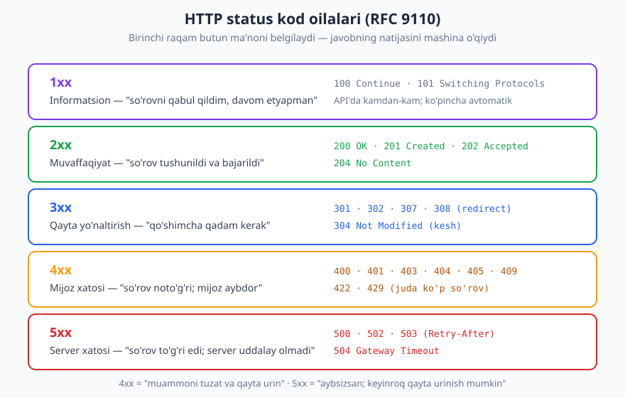
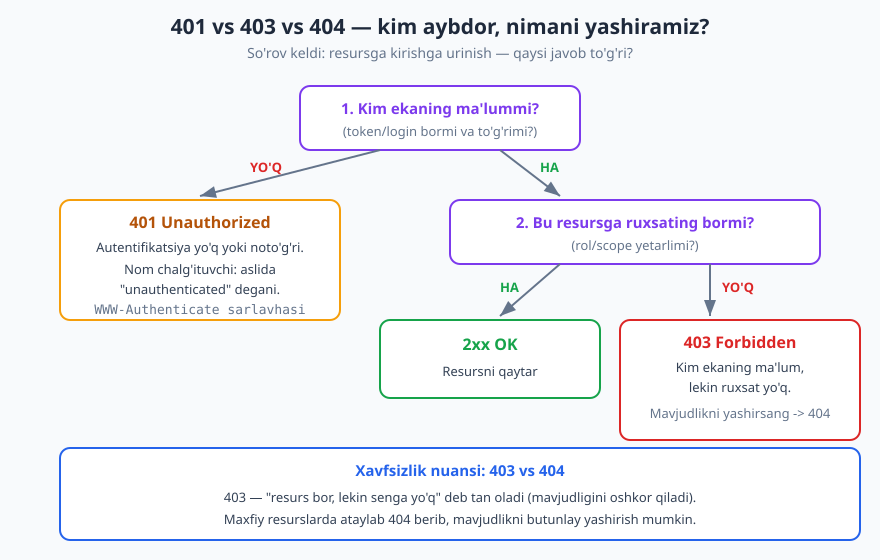
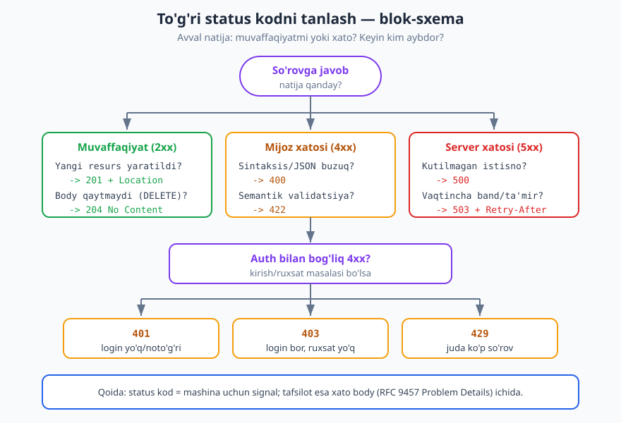

# 03 — HTTP status kodlari

[⬅️ Oldingi: 02 — HTTP protokoli chuqur](./02-http-chuqur.md) · [🏠 README](./README.md) · [Keyingi: 04 — API uslublari: REST, RPC, GraphQL, gRPC ➡️](./04-api-uslublari.md)

---

> **Bu bobda:** HTTP status kodlari — javobning natijasini mijozga mashina o'qiy oladigan tarzda bildiruvchi uch xonali raqamlar. Beshta oilani (1xx–5xx), eng muhim kodlarni (201, 204, 304, 400, 401, 403, 404, 409, 422, 429, 500, 503) chuqur ko'rib chiqamiz, 401 vs 403 vs 404 farqini alohida ajratamiz va to'g'ri kodni tanlash blok-sxemasini tuzamiz. So'ngida — "hammasiga 200 qaytarish" kabi keng tarqalgan anti-naqshlarni tuzatamiz.
>
> **Halollik / Eslatma:** Status kodlarning semantikasi **RFC 9110** (HTTP Semantics, 2022-yil iyun) bilan belgilangan; u eski RFC 7231/2616 ni almashtirgan. 428/429/431 kabi qo'shimcha kodlar **RFC 6585** dan. Bu bobdagi barcha kodlar va ularning ma'nosi standartga asoslangan; lekin *qaysi stsenariyga qaysi kodni tanlash* ko'pincha kontekstga bog'liq **trade-off** — buni har joyda halol belgilaymiz. JSON namunalari tekshirilgan.

---

## Status kod nima va nega muhim

Tasavvur qiling, siz pochta orqali ariza yubordingiz va javob xatini oldingiz. Xatning birinchi qatori — katta shtamp: **"QABUL QILINDI"**, **"RAD ETILDI"** yoki **"ARIZA NOTO'G'RI TO'LDIRILGAN"**. Xatning qolgan matnini o'qimasdan ham, shtampga qarab nima qilish kerakligini bilasiz. HTTP status kodi — aynan shu shtamp.

Har bir HTTP javob **status qatori** bilan boshlanadi va u uch xonali **status kod** ni o'z ichiga oladi:

```http
HTTP/1.1 200 OK
```

Bu yerda `200` — mashina o'qiydigan kod, `OK` — odam uchun qisqa izoh (reason phrase). Muhimi raqam: mijoz dasturi `200` ni ko'rib "muvaffaqiyat" deb tushunadi, `404` ni ko'rib "topilmadi" deb biladi — `OK` yoki `Not Found` so'zlarini tahlil qilmasdan.

Nega bu muhim? Chunki **mijoz status kodga qarab harakat qiladi**, va bu harakatlar avtomatik:

- `200`/`201` — natijani qabul qil, foydalanuvchiga ko'rsat.
- `301`/`308` — yangi manzilga qayta yo'naltir.
- `304` — keshdagi nusxa hali yangi, qaytadan yuklamaslik mumkin.
- `401` — qaytadan login qil yoki tokenni yangila.
- `429`/`503` — biroz kutib, qayta urin (ko'pincha `Retry-After` sarlavhasiga qarab).
- `400`/`422` — so'rovni tuzatmasdan qayta urinish befoyda; foydalanuvchiga xatoni ko'rsat.
- `500` — server aybi; ehtimol biroz kutib qayta urinish mumkin, lekin so'rovni o'zgartirish shart emas.

Agar API to'g'ri status kod qaytarmasa, mijoz bu qarorlarni **mustaqil qila olmaydi** va har bir javobni qo'lda tahlil qilishga majbur bo'ladi. Bu — keyinroq ko'radigan eng yomon anti-naqsh.

> **Standart:** Status kodlar ro'yxati va semantikasi **RFC 9110, §15** da. Bu — yagona haqiqiy manba; "men 200 ni shunday ishlataman" degan o'zboshimcha talqin shartnomani buzadi.

---

## Beshta oila — birinchi raqam butun ma'noni belgilaydi

Status kodning **birinchi raqami** uning umumiy sinfini ("oila") belgilaydi. Mijoz aniq kodni tanimasa ham, oilani tushunib to'g'ri qaror qabul qilishi mumkin: masalan `418` degan g'alati kodni ko'rsa ham, `4xx` ekanini bilib "bu mijoz xatosi" deydi.



| Oila | Ma'no | Kim "aybdor" | Mijoz nima qiladi |
|---|---|---|---|
| **1xx** | Informatsion — "davom etyapman" | — | Kutadi (kamdan-kam, ko'pincha avtomatik) |
| **2xx** | Muvaffaqiyat | — | Natijani qabul qiladi |
| **3xx** | Qayta yo'naltirish — qo'shimcha qadam | — | Boshqa manzilga boradi yoki keshni ishlatadi |
| **4xx** | Mijoz xatosi — so'rov noto'g'ri | **Mijoz** | So'rovni tuzatadi, keyin qayta urinadi |
| **5xx** | Server xatosi — server uddalay olmadi | **Server** | So'rovni o'zgartirmay, keyinroq qayta urinishi mumkin |

### 4xx vs 5xx — eng muhim chegara

API dizaynidagi eng muhim farq — `4xx` va `5xx` o'rtasidagi chegara. U ikki savolga javob beradi:

1. **Kim aybdor?** `4xx` — mijoz noto'g'ri so'rov yubordi (buzuq JSON, yo'q resurs, ruxsat yo'q). `5xx` — so'rov to'g'ri edi, lekin server uni bajara olmadi (kod xatosi, DB tushib qoldi).
2. **Qayta urinish mantiqlimi?** `4xx` da so'rovni **o'zgartirmasdan** qayta urinish foydasiz — har safar bir xil xato qaytadi. `5xx` da esa so'rov to'g'ri, shuning uchun keyinroq aynan o'sha so'rovni qayta urinish ko'pincha ishlaydi.

> **Diqqat:** Bu chegara monitoring uchun ham hayotiy. Ko'p jamoalar `5xx` koeffitsiyentini SLO/alert uchun ishlatadi: `5xx` ko'paysa — bu **bizning aybimiz**, darhol reaksiya kerak. Agar siz validatsiya xatosiga (mijoz aybi) noto'g'ri `500` qaytarsangiz, alert tizimingiz yolg'on signal beradi va haqiqiy avariyalarni ko'rib bo'lmay qoladi.

---

## 2xx — muvaffaqiyat oilasi

Hammasi yaxshi bo'lganda `2xx` qaytaramiz. Lekin "yaxshi" — bitta narsa emas: yangi narsa yaratdikmi, hech narsa qaytarmaymizmi, jarayon hali davom etadimi — har biri o'z kodiga ega.

### 200 OK

Eng keng tarqalgan kod. So'rov muvaffaqiyatli bajarildi va javobda odatda **body** bor. `GET` uchun standart; `PUT`/`PATCH` mavjud resursni yangilab uni qaytarganda ham `200`.

```http
GET /v1/orders/1001 HTTP/1.1
Host: api.example.com

HTTP/1.1 200 OK
Content-Type: application/json

{"id": 1001, "status": "pending", "total": 4500}
```

### 201 Created

Yangi resurs **yaratilganda** ishlatiladi (ko'pincha `POST` ga javoban). Ikki muhim qoidasi bor:

1. **`Location` sarlavhasi** yangi resurs URI'sini ko'rsatishi kerak — mijoz qayerda topishini biladi.
2. Javob body'sida odatda yaratilgan resurs (uning server tomonidan to'ldirilgan `id`, `created_at` kabi maydonlari bilan) qaytariladi.

```http
POST /v1/orders HTTP/1.1
Host: api.example.com
Content-Type: application/json

{"item_id": 42, "quantity": 2}

HTTP/1.1 201 Created
Location: /v1/orders/1001
Content-Type: application/json

{"id": 1001, "status": "pending", "item_id": 42, "quantity": 2}
```

> **Standart:** `Location` sarlavhasining `201` bilan ishlatilishi RFC 9110 §10.2.2 da. Resurs URI'sini qanday dizayn qilish — [resurs va URI dizayni](./06-resurs-uri-dizayni.md) bobida.

### 202 Accepted

So'rov **qabul qilindi, lekin hali bajarib bo'linmadi**. Bu — **asinxron** ishlar uchun: masalan katta hisobotni generatsiya qilish, video kodlash, to'lov navbatga qo'yildi. Server "qabul qildim, keyin bajaraman" deydi va ko'pincha jarayon holatini kuzatish uchun havola beradi.

```http
POST /v1/reports HTTP/1.1
Host: api.example.com
Content-Type: application/json

{"type": "annual", "year": 2025}

HTTP/1.1 202 Accepted
Content-Type: application/json

{"job_id": "rep_88", "status": "queued", "status_url": "/v1/reports/jobs/rep_88"}
```

> **Eslatma:** `202` — "ishlandi" degani **emas**, "navbatga olindi" degani. Mijoz natijani bilish uchun `status_url` ni so'rab turishi (polling) yoki [webhook](./19-asinxron-webhook.md) orqali xabar olishi kerak. Asinxron naqshlar shu bobda.

### 204 No Content

So'rov muvaffaqiyatli, lekin qaytaradigan **body yo'q**. Klassik misol — `DELETE`: resurs o'chirildi, qaytaradigan hech narsa qolmadi.

```http
DELETE /v1/orders/1001 HTTP/1.1
Host: api.example.com
Authorization: Bearer <token>

HTTP/1.1 204 No Content
```

`204` javobida body bo'lmasligi **kerak**. `PUT`/`PATCH` dan keyin ham, agar mijozga yangilangan resursni qaytarish shart bo'lmasa, `204` mos keladi.

| Kod | Qachon | Body bormi |
|---|---|---|
| `200 OK` | Umumiy muvaffaqiyat (GET, yoki natijani qaytaradigan POST/PUT/PATCH) | Ha |
| `201 Created` | Yangi resurs yaratildi | Ha (+ `Location`) |
| `202 Accepted` | Asinxron — navbatga olindi, hali bajarilmadi | Ha (holat havolasi) |
| `204 No Content` | Muvaffaqiyat, lekin qaytaradigan narsa yo'q (ko'pincha DELETE) | Yo'q |

---

## 3xx — qayta yo'naltirish oilasi

`3xx` "borasan, lekin yana bir qadam kerak" deydi. API'larda `3xx` REST'da kam uchraydi (sahifa redirect'lari ko'proq brauzer dunyosi), lekin ba'zilari muhim.

| Kod | Ma'no | API'da qo'llanishi |
|---|---|---|
| `301 Moved Permanently` | Doimiy ko'chish | Eski endpoint butunlay yangiga ko'chsa (versiyalash) |
| `302 Found` | Vaqtinchalik ko'chish | Vaqtincha boshqa joyga (kam) |
| `307 Temporary Redirect` | Vaqtincha, metodni saqlab | `302` ga o'xshash, lekin POST POST bo'lib qoladi |
| `308 Permanent Redirect` | Doimiy, metodni saqlab | `301` ga o'xshash, metod o'zgarmaydi |
| `304 Not Modified` | O'zgarmadi — keshdagi nusxa yangi | Shartli so'rovlar (kesh) |

`301`/`302` va `307`/`308` o'rtasidagi nozik farq: eski `301`/`302` ni ba'zi mijozlar redirect paytida `POST` ni `GET` ga aylantirib yuborgan. `307`/`308` esa **metodni va body'ni saqlashni** kafolatlaydi. Shuning uchun API'da redirect kerak bo'lsa, ko'pincha `307`/`308` afzal.

### 304 Not Modified — keshning yuragi

`304` — `3xx` ichida API uchun eng foydalisi. Mijoz oldin olgan nusxasini `ETag` yoki `Last-Modified` bilan eslab qoladi va keyingi so'rovda "menda shu versiya bor, o'zgarmaganmi?" deb so'raydi. Agar o'zgarmagan bo'lsa, server **body'ni qayta yubormay** `304` qaytaradi — trafik tejaladi.

```http
GET /v1/orders/1001 HTTP/1.1
Host: api.example.com
If-None-Match: "v7-abc"

HTTP/1.1 304 Not Modified
ETag: "v7-abc"
```

> **Standart:** Keshlash va shartli so'rovlar mexanikasi **RFC 9111** (HTTP Caching) va RFC 9110 §13 da. To'liq tafsilot — [keshlash](./16-keshlash.md) bobida; bu yerda faqat status kod kontekstida ko'rsatamiz.

---

## 4xx — mijoz xatosi (API uchun eng muhim oila)

`4xx` — kunlik API ishida eng ko'p o'ylanadigan oila. Bu yerda har bir kod aniq bir "noto'g'ri" turini bildiradi, va to'g'ri tanlash mijozga **xatoni qanday tuzatishni** aytadi.

### 400 Bad Request

So'rov **shakli** noto'g'ri — server uni hatto tushuna olmadi. Misol: buzuq JSON, yo'q majburiy maydon, noto'g'ri tip (raqam o'rniga matn). `400` — "umumiy mijoz xatosi" sifatida ko'p ishlatiladi, lekin imkon qadar aniqroq kodni (masalan `422`, `409`) tanlash yaxshiroq.

```http
POST /v1/orders HTTP/1.1
Host: api.example.com
Content-Type: application/json

{"item_id": 42, "quantity":

HTTP/1.1 400 Bad Request
Content-Type: application/problem+json

{"type": "https://errors.example.com/bad-json", "title": "Buzuq JSON", "status": 400, "detail": "So'rov tanasi yaroqli JSON emas"}
```

### 401 Unauthorized — nomi chalg'ituvchi

`401` aslida **"unauthenticated"** (autentifikatsiya qilinmagan) degani: server **kim ekaningizni bilmaydi**. Token yo'q, eskirgan, yoki noto'g'ri. Nom tarixiy sabablarga ko'ra "Unauthorized" deb qolgan, lekin u **ruxsat** haqida emas, **kimlik** haqida.

`401` bilan birga server `WWW-Authenticate` sarlavhasini qaytarishi kerak — mijozga qanday autentifikatsiya kutilayotganini aytadi.

```http
GET /v1/orders HTTP/1.1
Host: api.example.com

HTTP/1.1 401 Unauthorized
WWW-Authenticate: Bearer realm="api", error="invalid_token"
Content-Type: application/problem+json

{"type": "https://errors.example.com/unauthenticated", "title": "Autentifikatsiya talab qilinadi", "status": 401}
```

> **Standart:** `401` va `WWW-Authenticate` RFC 9110 §15.5.2 da. Autentifikatsiya sxemalari (API key, Bearer/JWT, OAuth) — [autentifikatsiya](./11-autentifikatsiya.md) bobida.

### 403 Forbidden

`403` — "men kim ekaningizni **bilaman**, lekin sizga bu **ruxsat etilmagan**". Autentifikatsiya muvaffaqiyatli, lekin avtorizatsiya muvaffaqiyatsiz: rolingiz yetmaydi, scope'ingiz yo'q, yoki bu boshqa foydalanuvchining resursi.

```http
DELETE /v1/users/777 HTTP/1.1
Host: api.example.com
Authorization: Bearer <oddiy-foydalanuvchi-token>

HTTP/1.1 403 Forbidden
Content-Type: application/problem+json

{"type": "https://errors.example.com/forbidden", "title": "Ruxsat yo'q", "status": 403, "detail": "Foydalanuvchini o'chirish uchun admin roli kerak"}
```

> **Diqqat:** `401` ga qayta login qilish foyda beradi (yangi token olasiz). `403` ga qayta login **foyda bermaydi** — kimligingiz to'g'ri, lekin ruxsatingiz yo'q. Shuning uchun bu ikkisini chalkashtirish mijoz logikasini buzadi. Avtorizatsiya modellari — [avtorizatsiya](./12-avtorizatsiya.md) bobida.

### 404 Not Found

So'ralgan resurs **mavjud emas** (yoki server uning mavjudligini oshkor qilmaydi). `GET /v1/orders/999999` — bunday buyurtma yo'q.

### 405 Method Not Allowed

Resurs **bor**, lekin bu **metod** unga ruxsat etilmagan. Masalan `/v1/orders` GET va POST ni qabul qiladi, lekin DELETE ni emas. `405` bilan server `Allow` sarlavhasida ruxsat etilgan metodlarni sanab berishi kerak.

```http
DELETE /v1/orders HTTP/1.1
Host: api.example.com

HTTP/1.1 405 Method Not Allowed
Allow: GET, POST
```

### 406 va 415 — media tip muammolari

- **406 Not Acceptable** — mijoz `Accept` sarlavhasida server bera olmaydigan formatni so'radi (masalan `Accept: application/xml`, lekin API faqat JSON).
- **415 Unsupported Media Type** — mijoz server tushunmaydigan `Content-Type` da body yubordi (masalan `text/xml`, lekin API faqat `application/json` qabul qiladi).

### 409 Conflict

So'rov resursning **joriy holati** bilan ziddiyatga uchradi. Misollar: bir xil `email` bilan ikkinchi foydalanuvchi yaratish, allaqachon yakunlangan buyurtmani bekor qilish, optimistik parallellikda eski versiyani yozishga urinish.

```http
POST /v1/users HTTP/1.1
Host: api.example.com
Content-Type: application/json

{"email": "ali@example.com"}

HTTP/1.1 409 Conflict
Content-Type: application/problem+json

{"type": "https://errors.example.com/duplicate-email", "title": "Email band", "status": 409, "detail": "Bu email allaqachon ro'yxatdan o'tgan"}
```

> **Trade-off:** Parallel yangilanishlarda (ikki mijoz bir resursni bir vaqtda o'zgartirsa) `409` yoki `412 Precondition Failed` ishlatiladi — qaysi biri `If-Match`/`ETag` qo'llanganiga bog'liq. Bu — [idempotentlik va parallellik](./15-idempotentlik-parallellik.md) bobining mavzusi.

### 410 Gone

Resurs **avval bor edi, lekin endi butunlay yo'q** va qaytmaydi. `404` "topilmadi (balki hech qachon bo'lmagan)" desa, `410` "ataylab o'chirildi, qidirmang" deydi. Eskirgan API endpoint'ini o'chirishda foydali.

### 422 Unprocessable Content — semantik validatsiya

Bu — eng ko'p chalkashlik tug'diradigan kod. `400` so'rov **shakli** buzuq bo'lganda (server JSON'ni tahlil qila olmaganda), `422` esa **shakl to'g'ri, lekin ma'no noto'g'ri** bo'lganda ishlatiladi:

- JSON yaroqli, maydonlar bor, tiplari to'g'ri (`400` shart emas);
- lekin `quantity: -5` (manfiy bo'lmasligi kerak), yoki `end_date` `start_date` dan oldin, yoki `email` formati noto'g'ri.

```http
POST /v1/orders HTTP/1.1
Host: api.example.com
Content-Type: application/json

{"item_id": 42, "quantity": -5}

HTTP/1.1 422 Unprocessable Content
Content-Type: application/problem+json

{"type": "https://errors.example.com/validation", "title": "Validatsiya xatosi", "status": 422, "errors": [{"field": "quantity", "message": "0 dan katta bo'lishi kerak"}]}
```

> **Trade-off:** `400` va `422` o'rtasidagi tanlov ko'p bahslashiladi. Amaliy chegara: **parse qila olmadingmi -> 400; parse qildim, lekin biznes-qoidalar buzildi -> 422.** Ba'zi jamoalar soddalik uchun barcha validatsiya xatolariga `400` ishlatadi — bu ham qabul qilinadi, faqat **izchil** bo'ling va hujjatlang. Eng yomoni — bir endpoint `400`, boshqasi `422` qaytarib, sababini hech kim bilmasligi. Xato body dizayni — [xatolarni dizayn qilish](./09-xato-dizayni.md) bobida.

### 428 Precondition Required

Server mijozdan **shartli so'rov** yuborishni talab qiladi (masalan `If-Match`), lekin mijoz yubormadi. Bu — "ko'r-ko'rona ustiga yozish" (lost update) muammosidan himoya: serverga "avval ETag tekshir" deydi.

### 429 Too Many Requests

Mijoz **juda ko'p so'rov** yubordi — rate limit oshib ketdi. Server `Retry-After` sarlavhasida qancha kutish kerakligini aytishi kerak.

```http
GET /v1/orders HTTP/1.1
Host: api.example.com

HTTP/1.1 429 Too Many Requests
Retry-After: 30
Content-Type: application/problem+json

{"type": "https://errors.example.com/rate-limit", "title": "Juda ko'p so'rov", "status": 429, "detail": "Limit oshdi, 30 soniya kutib qayta urinng"}
```

> **Standart:** `429` va `428` **RFC 6585** dan. Rate limiting algoritmlari va `RateLimit` sarlavhalari — [rate limiting](./14-rate-limiting.md) bobida.

| Kod | "Noto'g'ri" turi | Mijoz nima qiladi |
|---|---|---|
| `400` | So'rov shakli buzuq (parse bo'lmadi) | So'rov sintaksisini tuzatadi |
| `401` | Kimlik noma'lum (auth yo'q/noto'g'ri) | Login/token yangilaydi |
| `403` | Kimlik ma'lum, ruxsat yo'q | Qayta urinish foydasiz; ruxsat so'raydi |
| `404` | Resurs topilmadi | URI ni tekshiradi |
| `405` | Metod ruxsat etilmagan | `Allow` ga qarab boshqa metod |
| `409` | Joriy holat bilan ziddiyat | Holatni qayta o'qib, qaror qiladi |
| `410` | Resurs butunlay o'chirilgan | Qidirishni to'xtatadi |
| `415` | Yuborilgan `Content-Type` qo'llab-quvvatlanmaydi | Formatni o'zgartiradi |
| `422` | Shakl to'g'ri, biznes-qoida buzildi | Maydon qiymatlarini tuzatadi |
| `429` | Juda ko'p so'rov | `Retry-After` ga ko'ra kutadi |

---

## 401 vs 403 vs 404 — alohida chuqurlashtirib

Bu uchlik — eng ko'p xato qilinadigan joy va bir vaqtning o'zida **xavfsizlik** masalasi. Avval ma'no farqini aniq qotiramiz:

- **401** — *"Sen kimsan? Bilmayman."* (autentifikatsiya yo'q yoki noto'g'ri)
- **403** — *"Sen falonchisan, bilaman. Lekin bu senga ruxsat etilmagan."* (autentifikatsiya bor, avtorizatsiya yo'q)
- **404** — *"Bunaqa resurs yo'q (yoki yo'qligini ko'rsatyapman)."*



Qaror tartibi odatda shunday:

1. Token/kimlik **umuman bormi va to'g'rimi?** Yo'q -> **401**.
2. Kimlik bor. Bu resursga **ruxsati bormi?** Yo'q -> **403** (yoki xavfsizlik uchun **404**, pastga qarang).
3. Hammasi joyida -> **2xx**, resursni qaytaramiz.

### Xavfsizlik nuansi: 403 mi yoki 404?

Mana nozik joy. Tasavvur qiling, foydalanuvchi `GET /v1/users/777/private-notes` ga kirmoqchi, lekin bu boshqa odamning maxfiy yozuvlari. Ikki variant bor:

- **403 Forbidden** — "bu resurs **bor**, lekin senga yo'q". Bu mijozga resurs **mavjudligini oshkor qiladi**.
- **404 Not Found** — "bunaqa resurs yo'q". Bu mavjudlikni **yashiradi**.

Maxfiy yoki sezgir resurslarda ikkinchisi afzal: agar tajovuzkor `/users/1`, `/users/2`, ... bo'ylab yurib `403` va `404` ni farqlay olsa, u **qaysi ID lar mavjudligini** xaritalashtira oladi (enumeration hujumi). Shuning uchun ko'p xavfsizlik yo'riqnomalari "ruxsat yo'q" holatida ham `404` qaytarishni tavsiya qiladi — mavjudlik sirini saqlash uchun.

> **Trade-off:** `403` vs `404` — sof xavfsizlik trade-off'i. `403` halolroq va developer'ga qulayroq (nima bo'lganini aniq aytadi), lekin mavjudlikni oshkor qiladi. `404` xavfsizroq, lekin "men aniq bilaman bu resurs bor, nega 404?" degan chalkashlik tug'diradi. Qoida: **ommaviy/oddiy resurslarda 403** (oshkorlik zarar qilmaydi), **sezgir/maxfiy resurslarda 404** (mavjudlikni yashir). Tanlovni hujjatlang.

> **Xavfsizlik:** Bu — OWASP API Security Top 10 dagi **API1: Broken Object Level Authorization (BOLA)** muammosi bilan bevosita bog'liq. To'liq — [API xavfsizligi](./13-api-xavfsizligi.md) bobida.

---

## 5xx — server xatosi oilasi

`5xx` "so'rov to'g'ri edi, lekin **men** (server) uddalay olmadim" deydi. Mijoz aybsiz, shuning uchun u ko'pincha **o'sha so'rovni o'zgartirmasdan** keyinroq qayta urinishi mumkin.

| Kod | Ma'no | Tipik sabab |
|---|---|---|
| `500 Internal Server Error` | Umumiy server xatosi | Kutilmagan istisno, null pointer, bug |
| `502 Bad Gateway` | Yuqori oqimdan yaroqsiz javob | Gateway/proxy backend'dan buzuq javob oldi |
| `503 Service Unavailable` | Server vaqtincha xizmat ko'rsata olmaydi | Ortiqcha yuk, ta'mir (maintenance), overload |
| `504 Gateway Timeout` | Yuqori oqim vaqtida javob bermadi | Backend juda sekin yoki o'lik |

### 500 — "boshqa hech narsa to'g'ri kelmaganda"

`500` — umumiy, "kutilmagan narsa bo'ldi" kodi. Muhim qoida: **`500` body'sida ichki tafsilotlarni (stack trace, SQL xatosi, fayl yo'llari) oshkor qilmang** — bu xavfsizlik teshigi. Mijozga umumiy xabar bering, batafsil log'ni server tomonida `trace_id` bilan saqlang.

```http
GET /v1/orders/1001 HTTP/1.1
Host: api.example.com

HTTP/1.1 500 Internal Server Error
Content-Type: application/problem+json

{"type": "about:blank", "title": "Ichki server xatosi", "status": 500, "trace_id": "req-9f2c1a"}
```

### 503 — `Retry-After` bilan

`503` "vaqtincha bandman/ta'mirdaman" deydi. U `Retry-After` sarlavhasi bilan birga qachon qayta urinishni aytishi kerak — bu mijozga (va keshlarga) aqlli backoff qilishga yordam beradi.

```http
GET /v1/orders HTTP/1.1
Host: api.example.com

HTTP/1.1 503 Service Unavailable
Retry-After: 120
Content-Type: application/problem+json

{"type": "https://errors.example.com/maintenance", "title": "Xizmat vaqtincha mavjud emas", "status": 503}
```

> **Diqqat:** `500` ni "axlat qutisi" sifatida ishlatmang. Mijoz xatosini (`4xx`) `500` deb qaytarish — keng tarqalgan bug: mijoz "server aybi" deb o'ylab qayta-qayta urinaveradi, monitoringingiz esa yolg'on avariya signali beradi. So'rovni qayta ko'rib, mijoz aybi bo'lsa `4xx`, faqat haqiqatan server uddalay olmaganda `5xx` qaytaring.

---

## To'g'ri kodni tanlash — amaliy yo'riqnoma

Endi hammasini bitta qaror oqimiga birlashtiramiz. Status kod tanlashda ketma-ketlik:

1. **Muvaffaqiyatmi yoki xato?**
2. Muvaffaqiyat bo'lsa: yangi narsa yaratildimi (`201`) / qaytaradigan body bormi (`200` yoki `204`) / asinxronmi (`202`)?
3. Xato bo'lsa: **kim aybdor** — mijoz (`4xx`) yoki server (`5xx`)?
4. Mijoz aybi bo'lsa: aniq turini tanlang (auth -> `401`/`403`; topilmadi -> `404`; validatsiya -> `400`/`422`; konflikt -> `409`; limit -> `429`).



> **Eslatma:** "Eng aniq mos kelgan kodni tanla, lekin tanimagan kodlarni o'ylab topma." Standart kodlar yetarli; mijozlar ularni biladi. Noyob `2xx`/`4xx` kodlarni faqat ma'nosi aniq mos kelsa ishlating, aks holda oilaning umumiy kodiga (`200`, `400`, `500`) qayting.

---

## Keng tarqalgan xatolar (anti-naqshlar)

### Anti-naqsh 1 — "hammasiga 200 qaytarish"

Eng zararli anti-naqsh: server **har doim** `200 OK` qaytaradi, haqiqiy natijani esa body ichidagi maydonga yashiradi.

```json
{"success": false, "error": "Buyurtma topilmadi", "data": null}
```

```http
HTTP/1.1 200 OK
Content-Type: application/json

{"success": false, "error": "Buyurtma topilmadi", "data": null}
```

> **Anti-pattern:** Bu yerda HTTP "muvaffaqiyat" deydi, lekin amalda xato. Oqibatlari: (1) keshlar va proxylar `200` ni muvaffaqiyat deb keshlaydi; (2) monitoring xatolarni ko'rmaydi (`5xx` koeffitsiyenti har doim 0); (3) har bir mijoz body'ni qo'lda tahlil qilishga majbur, retry/redirect avtomatlashtirilmaydi; (4) standart HTTP mijoz kutubxonalari (`fetch`, `axios`, `requests`) xatoni avtomatik aniqlay olmaydi. **To'g'ri yo'l:** status kodni HTTP qatlamida to'g'ri qo'ying, tafsilotni esa xato body'da bering.

```http
HTTP/1.1 404 Not Found
Content-Type: application/problem+json

{"type": "https://errors.example.com/not-found", "title": "Buyurtma topilmadi", "status": 404}
```

### Anti-naqsh 2 — `200` + `{"error": ...}`

Yuqoridagining yumshoqroq varianti: ba'zan `200`, ba'zan to'g'ri kod. Bu **nomuvofiqlik** — mijoz qaysiga ishonishni bilmaydi. Bitta qoidaga rioya qiling: **status kod — yagona haqiqat manbai**, body esa uni faqat **tafsillaydi**, ziddiga bormaydi.

### Anti-naqsh 3 — noto'g'ri 4xx/5xx

Mijoz aybiga `500`, server aybiga `400` qaytarish. Yoki autentifikatsiya yo'qligida `403`, ruxsat yo'qligida `401` (teskari). Bu monitoring va mijoz logikasini buzadi. Har safar so'rang: *kim aybdor — mijozmi server?* va *bu aniq qaysi tur?*

### Anti-naqsh 4 — validatsiyaga doim `200` yoki tasodifiy kod

Validatsiya xatosiga `200` (anti-naqsh 1), yoki `403` (auth bilan aralashtirib), yoki tasodifan `500` qaytarish. To'g'risi: parse bo'lmadi -> `400`, biznes-qoida buzildi -> `422` (yoki izchil `400`).

> **Trade-off:** Status kod **o'zi yetarli emas** — u mashina uchun signal, lekin developer'ga *nega* va *qaysi maydon* xato ekanini aytmaydi. Shuning uchun status kod **doim mazmunli xato body bilan birga** ishlaydi. Standart format — **RFC 9457 Problem Details** (`application/problem+json`): `type`, `title`, `status`, `detail`, `instance` a'zolari. Buni to'liq [xatolarni dizayn qilish](./09-xato-dizayni.md) bobida ko'ramiz; hozir esa shuni eslab qoling: **kod + body birga**, bir-biriga zid bo'lmasin.

---

## Asosiy g'oyalar (bobni qisqacha)

- **Status kod — javobning natijasini mashina o'qiy oladigan signal.** Mijoz unga qarab avtomatik harakat qiladi (retry, redirect, xatoni ko'rsatish). Manba — RFC 9110.
- **Birinchi raqam butun ma'noni belgilaydi:** 1xx info, 2xx muvaffaqiyat, 3xx redirect, 4xx mijoz xatosi, 5xx server xatosi.
- **4xx vs 5xx — eng muhim chegara:** kim aybdor (mijoz/server) va qayta urinish mantiqlimi. 5xx koeffitsiyenti monitoring uchun hayotiy.
- **2xx aniqligi:** `201` (+ `Location`) yaratishda, `204` body yo'q bo'lganda (DELETE), `202` asinxronda, `200` qolgan hollarda.
- **401 ≠ 403:** `401` kimlik noma'lum (autentifikatsiya), `403` kimlik ma'lum lekin ruxsat yo'q (avtorizatsiya). `404` esa ba'zan mavjudlikni yashirish uchun `403` o'rniga beriladi (xavfsizlik trade-off).
- **422** semantik validatsiya uchun (shakl to'g'ri, ma'no noto'g'ri); `400` parse-darajadagi xato uchun. Izchil bo'ling.
- **Eng yomon anti-naqsh — "hammasiga 200"**: status kodni HTTP qatlamida to'g'ri qo'ying, tafsilotni xato body (Problem Details, RFC 9457) ichida bering. Kod va body bir-biriga zid bo'lmasin.

---

## Mashqlar

### Oson

**1-mashq.** Quyidagi status kodlarni to'g'ri oilaga (1xx–5xx) ajrating va har birining bir og'iz ma'nosini ayting: `201`, `404`, `500`, `304`, `429`.

**2-mashq.** `200`, `201`, `204` — uchalasi ham `2xx`. Har biri qachon ishlatilishini bitta jumlada ayting va qaysi biri javob body'siz bo'lishini belgilang.

**3-mashq.** Mijoz buzuq JSON (yopilmagan qavs) yubordi. Server qaysi status kodni qaytarishi kerak va nega? Bu mijoz aybimi yoki server aybi?

### O'rta

**4-mashq.** Quyidagi stsenariylarning har biriga eng mos status kodni tanlang va sababini yozing:
- (a) `POST /v1/articles` muvaffaqiyatli yangi maqola yaratdi.
- (b) `DELETE /v1/articles/55` maqolani o'chirdi, qaytaradigan narsa yo'q.
- (c) `GET /v1/articles/99999` — bunaqa maqola yo'q.
- (d) Foydalanuvchi rate limitdan oshdi.
- (e) DB ulanmadi, kutilmagan istisno yuz berdi.

**5-mashq.** Uchta holatni `401`, `403`, `404` ga to'g'ri ajrating va sababini tushuntiring:
- (a) So'rovda `Authorization` sarlavhasi umuman yo'q.
- (b) Token to'g'ri, lekin oddiy foydalanuvchi admin endpoint'iga kirmoqchi.
- (c) Token to'g'ri, foydalanuvchi `GET /v1/orders/1001` so'radi, lekin bunday buyurtma yo'q.

**6-mashq.** Mijoz JSON yubordi, sintaksisi to'g'ri, barcha maydonlar bor, lekin `quantity: 0` (kamida 1 bo'lishi kerak) va `email: "salom"` (formati noto'g'ri). Qaysi status kod (`400` yoki `422`)? Tanlovingizni asoslang va `application/problem+json` formatida qisqa xato body yozing.

### Qiyin

**7-mashq.** Quyidagi javob anti-naqsh bilan yozilgan. Muammoni aniqlang va to'g'ri HTTP javobiga (status qatori + sarlavha + body) qayta yozing.
```http
HTTP/1.1 200 OK
Content-Type: application/json

{"success": false, "error_code": "ORDER_NOT_FOUND", "message": "Buyurtma topilmadi", "data": null}
```

**8-mashq.** Sizning API'ingizda `/v1/users/{id}/medical-records` endpoint'i bor — bu juda maxfiy ma'lumot. Foydalanuvchi A boshqa odamning (B) tibbiy yozuvlarini so'radi. `403` yoki `404` qaytarasizmi? Ikkala variantning trade-off'ini yozing va tanlovingizni asoslang. Bu qaysi OWASP API xavfsizlik kategoriyasi bilan bog'liq?

**9-mashq.** Bir jamoa "soddalik uchun barcha validatsiya xatolariga `400` ishlatamiz" deb qaror qildi, boshqasi esa "parse xatosiga `400`, biznes-validatsiyaga `422`" deydi. Har bir yondashuvning afzalligi va kamchiligini yozing. Eng muhim umumiy talab nima? Misol bilan ko'rsating.

<details markdown="1">
<summary>Yechimlar</summary>

### 1-mashq yechimi
- `201` — **2xx** (muvaffaqiyat): yangi resurs yaratildi.
- `404` — **4xx** (mijoz xatosi): so'ralgan resurs topilmadi.
- `500` — **5xx** (server xatosi): kutilmagan ichki server xatosi.
- `304` — **3xx** (qayta yo'naltirish/kesh): resurs o'zgarmagan, keshdagi nusxa hali yangi.
- `429` — **4xx** (mijoz xatosi): juda ko'p so'rov, rate limit oshdi.

### 2-mashq yechimi
- `200 OK` — umumiy muvaffaqiyat, javobda body bor (masalan `GET` natijasi). 
- `201 Created` — yangi resurs yaratildi, body bor va `Location` sarlavhasi qo'shiladi.
- `204 No Content` — muvaffaqiyat, lekin **body yo'q** (ko'pincha `DELETE`). 
Body'siz bo'lgani — `204`.

### 3-mashq yechimi
**`400 Bad Request`.** So'rovning shakli buzuq — server JSON'ni hatto tahlil (parse) qila olmadi. Bu **mijoz aybi** (`4xx`): mijoz noto'g'ri shakldagi so'rov yubordi. So'rovni o'zgartirmasdan qayta urinish foydasiz — shuning uchun `4xx`, `5xx` emas. (Eslatma: agar JSON to'g'ri bo'lib, faqat qiymatlar noto'g'ri bo'lsa edi, `422` bo'lardi.)

### 4-mashq yechimi
- (a) **`201 Created`** + `Location` sarlavhasi yangi maqola URI'si bilan. Yangi resurs yaratildi.
- (b) **`204 No Content`** — o'chirildi, qaytaradigan body yo'q.
- (c) **`404 Not Found`** — resurs topilmadi (mijoz aybi, `4xx`).
- (d) **`429 Too Many Requests`** + `Retry-After` sarlavhasi.
- (e) **`500 Internal Server Error`** — kutilmagan server xatosi (`5xx`); body'da `trace_id`, lekin ichki tafsilot yo'q.

### 5-mashq yechimi
- (a) **`401 Unauthorized`** — kimlik umuman yo'q (autentifikatsiya qilinmagan). `WWW-Authenticate` sarlavhasi bilan.
- (b) **`403 Forbidden`** — kimlik ma'lum (token to'g'ri), lekin admin ruxsati yo'q (avtorizatsiya muvaffaqiyatsiz). Qayta login foyda bermaydi.
- (c) **`404 Not Found`** — autentifikatsiya va ruxsat joyida, lekin so'ralgan resurs mavjud emas. (Agar bu boshqa odamning buyurtmasi bo'lsa va biz mavjudlikni yashirmoqchi bo'lsak ham `404` — 8-mashqga qarang.)

### 6-mashq yechimi
**`422 Unprocessable Content`.** JSON yaroqli va parse bo'ladi (`400` shart emas), lekin **biznes/semantik qoidalar buzilgan**: `quantity` kamida 1 bo'lishi va `email` formati to'g'ri bo'lishi kerak. Bu — semantik validatsiya, shuning uchun `422` (yoki jamoa izchil `400` ishlatsa ham bo'ladi). Misol body:

```json
{"type": "https://errors.example.com/validation", "title": "Validatsiya xatosi", "status": 422, "errors": [{"field": "quantity", "message": "Kamida 1 bo'lishi kerak"}, {"field": "email", "message": "Email formati noto'g'ri"}]}
```

### 7-mashq yechimi
**Muammo — "hammasiga 200" anti-naqshi.** HTTP qatlami `200 OK` (muvaffaqiyat) deydi, lekin amalda buyurtma topilmadi. Bu keshlarni chalg'itadi, monitoringda xato ko'rinmaydi va har bir mijoz body'ni qo'lda tekshirishga majbur bo'ladi. **To'g'ri javob — status kodni HTTP qatlamida to'g'ri qo'yib, tafsilotni Problem Details body'da berish:**

```http
HTTP/1.1 404 Not Found
Content-Type: application/problem+json

{"type": "https://errors.example.com/order-not-found", "title": "Buyurtma topilmadi", "status": 404, "detail": "ID bo'yicha buyurtma mavjud emas"}
```

### 8-mashq yechimi
Tibbiy yozuvlar — o'ta sezgir. Trade-off:
- **`403 Forbidden`:** halolroq va developer'ga aniq aytadi ("resurs bor, senga ruxsat yo'q"). **Kamchilik:** resurs **mavjudligini oshkor qiladi**. Tajovuzkor `403` va `404` ni farqlab, qaysi ID lar mavjudligini sanab chiqishi mumkin (enumeration).
- **`404 Not Found`:** mavjudlikni **yashiradi** — tajovuzkor "bor"mi "yo'q"mi ajrata olmaydi. **Kamchilik:** "men bilaman bu resurs bor, nega 404?" degan chalkashlik (lekin sezgir kontekstda bu maqbul).

Maxfiy tibbiy ma'lumot uchun **`404`** afzal — mavjudlikni yashirish hujumchidan himoya qiladi. Bu **OWASP API1: Broken Object Level Authorization (BOLA)** muammosi bilan bog'liq: server har bir obyekt darajasida foydalanuvchi shu obyektga ega ekanini tekshirishi, va sezgir hollarda mavjudlikni oshkor qilmasligi kerak.

### 9-mashq yechimi
- **"Hamma narsaga `400`"** — *afzalligi:* sodda, eslab qolish oson, mijozlar bitta kodni kutadi. *Kamchiligi:* parse xatosi (sintaksis) va semantik xato (biznes-qoida) farqlanmaydi — mijoz "JSON buzuqmi yoki qiymat noto'g'rimi?" ni faqat body'dan biladi.
- **"`400` parse, `422` semantik"** — *afzalligi:* aniqroq; mijoz status kodning o'zidan xato turini biladi (qayta yuborishdan oldin formatnimi yoki qiymatlarnimi tuzatishni). *Kamchiligi:* `422` ni hamma ham yaxshi bilmaydi, biroz murakkabroq.

**Eng muhim umumiy talab — izchillik (consistency).** Qaysi konvensiyani tanlasangiz ham, **butun API bo'ylab bir xil** qo'llang va hujjatlang. Eng yomoni — bir endpoint validatsiyaga `400`, boshqasi `422` qaytarib, sababini hech kim bilmasligi. Misol: agar `422` tanlasangiz, **barcha** biznes-validatsiya xatolari (`quantity < 1`, noto'g'ri email, `end_date < start_date`) `422` bo'lsin; faqat parse-darajadagi (buzuq JSON) xatolar `400` bo'lsin.

</details>

---

[⬅️ Oldingi: 02 — HTTP protokoli chuqur](./02-http-chuqur.md) · [🏠 README](./README.md) · [Keyingi: 04 — API uslublari: REST, RPC, GraphQL, gRPC ➡️](./04-api-uslublari.md)
