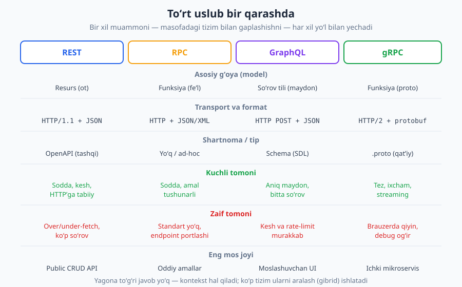
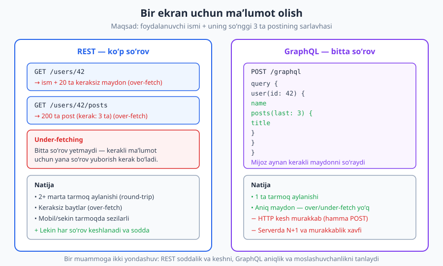
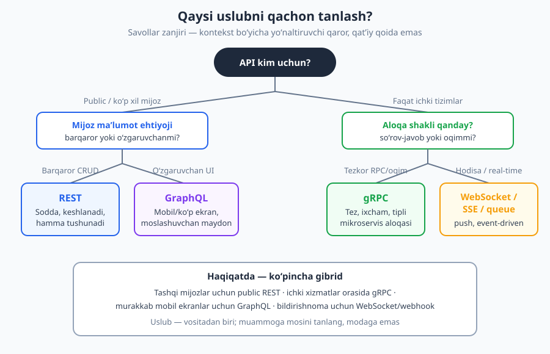

# 04 — API uslublari: REST, RPC, GraphQL, gRPC

[⬅️ Oldingi: 03 — HTTP status kodlari](./03-http-status-kodlari.md) · [🏠 README](./README.md) · [Keyingi: 05 — REST tamoyillari va Richardson Maturity Model ➡️](./05-rest-tamoyillari.md)

---

> **Bu bobda:** API qurishning to'rtta asosiy uslubi — REST, RPC, GraphQL va gRPC — bilan tanishamiz va ularni bitta jadvalda taqqoslaymiz. Har biri masofadagi tizim bilan gaplashishning boshqacha falsafasi: resurs-markazli (REST), funksiya-markazli (RPC/gRPC) yoki so'rov-til-markazli (GraphQL). Yana over-fetching/under-fetching muammosini va "qaysi uslubni qachon tanlash" qarorini chuqur ko'rib chiqamiz.
>
> **Halollik / Eslatma:** Bu bob xarita — uslublarning *qiyofasi* va *trade-off*'larini beradi; REST'ning to'liq tafsiloti II–III qismda, GraphQL [17-bobda](./17-graphql.md), gRPC [18-bobda](./18-grpc.md), asinxron [19-bobda](./19-asinxron-webhook.md) ochiladi. HTTP semantikasi RFC 9110 ga, gRPC HTTP/2 (RFC 9113) + Protocol Buffers ga tayanadi. "Qaysi uslub yaxshi?" degan savolga **mutlaq javob yo'q** — bu kontekstga bog'liq trade-off; biz buni har joyda halol belgilaymiz.

---

## Nega bitta API uchun bir nechta uslub bor?

Tasavvur qiling, siz boshqa shahardagi do'st bilan bog'lanmoqchisiz. Buni xat yozib (pochta), qo'ng'iroq qilib (telefon) yoki ovozli xabar yuborib (messenjer) qilishingiz mumkin. Maqsad bitta — *aloqa qilish* — lekin **vosita** har xil, va har birining o'z qulayligi va cheklovi bor. Xat hujjat sifatida saqlanadi, lekin sekin; qo'ng'iroq tezkor, lekin yozib qolmaydi.

API uslublari ham xuddi shunday. Hammasining maqsadi bitta: **bir tizim ikkinchi tizimdan biror narsani so'rasin yoki unga buyruq bersin**. Lekin bu so'rovni qanday shakllantirish, qanday tashish va javobni qanday qaytarish bo'yicha ular keskin farq qiladi. Yangi boshlovchilar ko'pincha "REST" so'zini "API" bilan teng deb o'ylaydi — bu xato. REST faqat bitta *uslub* (style); RPC, GraphQL va gRPC esa boshqa, teng huquqli yondashuvlar.

Bu kitobning asosiy e'tibori REST'da, chunki u public API'larda eng keng tarqalgan. Lekin yaxshi API dizayneri to'rttasini ham biladi va har birining o'rni borligini tushunadi. Quyidagi jadval — butun bobning markazi:



> **Eslatma:** "Uslub" (style), "paradigma" va "yondashuv" — bu yerda bir xil ma'noda ishlatiladi. Texnik jihatdan REST — *arxitektura uslubi*, gRPC — *freymvork*, GraphQL — *so'rov tili va runtime*. Lekin amalda biz ularni "API qurish usuli" sifatida bir qatorga qo'yib taqqoslaymiz, chunki loyihada aynan shu darajada tanlov qilamiz.

---

## RPC — masofadagi funksiyani chaqirish

Eng eski va eng intuitiv g'oyadan boshlaylik. **RPC (Remote Procedure Call — masofaviy protsedura chaqiruvi)** o'z nomidan ham ko'rinib turibdi: siz xuddi o'z kodingizdagi funksiyani chaqirgandek, lekin u boshqa serverda ishlaydi.

Kod yozayotganda siz `getUser(42)` yoki `createOrder(cart)` deb yozasiz. RPC shu g'oyani tarmoqqa olib chiqadi: server `getUser`, `createOrder`, `cancelSubscription` kabi **funksiyalarni** e'lon qiladi, mijoz esa ularni nom bilan chaqiradi va parametr uzatadi. Bu **fe'l-markazli** (action-oriented) yondashuv — markazda *amal* turadi.

JSON-RPC bilan oddiy chaqiruv shunday ko'rinadi:

```http
POST /rpc HTTP/1.1
Host: api.example.com
Content-Type: application/json

{"jsonrpc": "2.0", "method": "getUser", "params": {"id": 42}, "id": 1}

HTTP/1.1 200 OK
Content-Type: application/json

{"jsonrpc": "2.0", "result": {"id": 42, "name": "Olim"}, "id": 1}
```

Diqqat qiling: URL faqat `/rpc` — bitta endpoint, va u o'zgarmaydi. **Nima qilish** kerakligi URL'da emas, balki body ichidagi `method` maydonida. HTTP metodi deyarli har doim `POST` (o'qish bo'lsa ham), chunki RPC HTTP semantikasidan foydalanmaydi — u uchun HTTP shunchaki "quvur".

RPC oilasiga `JSON-RPC` (JSON formatida), `XML-RPC` (eski, XML formatida) va keyinroq ko'radigan `gRPC` (protobuf formatida) kiradi.

**Kuchli tomoni:** sodda va tabiiy. Agar sizda "yuborilgan emailni bekor qil" yoki "hisobni qayta hisobla" kabi murakkab *amal* bo'lsa, uni funksiya sifatida ifodalash REST resurslariga moslashtirishdan oson.

**Zaif tomoni:** uchta jiddiy muammo bor.

1. **Standart yo'q (yoki ko'p).** Har bir RPC API o'z konvensiyalarini o'ylab topadi. Xatolarni qanday qaytarish, sahifalashni qanday qilish — universal qoida yo'q.
2. **Endpoint portlashi.** Har bir yangi amal — yangi funksiya. `getUser`, `getUserByEmail`, `getUserWithPosts`, `getActiveUsers`... ro'yxat cheksiz o'sadi. Funksiyalar nomlari nomuvofiq bo'lib ketadi (`getUser` mi yoki `fetchUser` mi?).
3. **HTTP imkoniyatlari behuda ketadi.** Hamma narsa `POST` bo'lgani uchun HTTP keshlash, `GET`ning xavfsizligi (safe), status kodlarning boy semantikasi ishlatilmaydi. Brauzer va proksilar so'rov "o'qish"mi yoki "yozish"mi bilolmaydi.

> **Anti-pattern:** REST API ichida `POST /users/getById` yoki `GET /api?action=deleteUser` kabi URL'lar — bu "RESTga o'ralgan RPC". URL ichida fe'l (`getById`, `deleteUser`) ko'rsangiz, bu odatda resurs modeli buzilganidan darak. Bu haqda [06-bobda](./06-resurs-uri-dizayni.md) batafsil.

---

## REST — resurs-markazli yondashuv

Endi eng keng tarqalganiga keldik. **REST (Representational State Transfer)** RPC'ning teskarisi: u **funksiya emas, resurs** atrofida quriladi. Resurs — bu API ishlaydigan "narsa": foydalanuvchi, buyurtma, maqola. Ular **ot** bilan nomlanadi (fe'l emas), va har biri o'z URL'iga ega.

REST'ning asosiy nayrangi — *amalni* URL'ga emas, balki **HTTP metodiga** yuklash. "Foydalanuvchini o'chir" amali alohida funksiya emas; bu shunchaki `users/42` resursiga `DELETE` metodi:

```http
GET /v1/users/42 HTTP/1.1
Host: api.example.com
Accept: application/json

HTTP/1.1 200 OK
Content-Type: application/json

{"id": 42, "name": "Olim", "email": "olim@example.com"}
```

```http
DELETE /v1/users/42 HTTP/1.1
Host: api.example.com
Authorization: Bearer <token>

HTTP/1.1 204 No Content
```

Bu yerda bir nechta muhim narsa bor (hammasini [05](./05-rest-tamoyillari.md)–[06](./06-resurs-uri-dizayni.md)-boblarda ochamiz):

- **Resurs = ot, ko'plik:** `/users`, `/orders`. Amal URL'da emas.
- **HTTP metodlari amalni bildiradi:** `GET` (o'qish, *safe* va *idempotent*), `POST` (yaratish), `PUT` (to'liq almashtirish, idempotent), `PATCH` (qisman yangilash), `DELETE` (o'chirish, idempotent). Bu semantika RFC 9110 da belgilangan.
- **Status kodlar natijani bildiradi:** `200`, `201 Created` + `Location`, `204 No Content`, `404`, `409`... ([03-bob](./03-http-status-kodlari.md)).
- **Stateless:** server so'rovlar orasida mijoz holatini saqlamaydi; har so'rov o'zini o'zi tushuntiradi.

**Kuchli tomoni:** HTTP'ga *tabiiy*. Keshlash (`GET` + `ETag`), xavfsizlik, proksilar, brauzer — hammasi qutidan ishlaydi. Konvensiyalar keng tanilgan, shuning uchun har qanday dasturchi REST API'ni tez tushunadi. Public API uchun bu — eng past kirish to'sig'i.

**Zaif tomoni:** ikkita asosiy muammo — **over-fetching** va **under-fetching** (pastda alohida bo'lim), hamda murakkab, bog'langan ma'lumotni olishda **ko'p so'rov** kerakligi.

> **Standart:** Ko'pchilik "REST" deb ataydigan API'lar aslida Richardson Maturity Model bo'yicha **2-darajada** (resurslar + HTTP metodlari + status kodlar), lekin to'liq HATEOAS (3-daraja) ishlatmaydi. Bu yomon emas — bu amaliy norma. RMM haqida to'liq [05-bobda](./05-rest-tamoyillari.md).

---

## GraphQL — mijoz so'rov tilini boshqaradi

REST'da server qaror qiladi: `GET /users/42` aynan qaysi maydonlarni qaytarishini server hal qiladi. Mijoz faqat ismni xohlasa ham, server unga butun obyektni — 20 ta maydonni — beradi. Yoki aksincha, mijozga foydalanuvchi *va* uning postlari kerak, lekin bitta endpoint faqat foydalanuvchini beradi.

**GraphQL** bu muvozanatni teskari buradi: **mijoz** aynan qaysi maydonlarni xohlashini **so'rov tili** orqali aytadi. Server bitta endpoint (`POST /graphql`) ochadi, va mijoz unga "so'rov hujjati" yuboradi:

```http
POST /graphql HTTP/1.1
Host: api.example.com
Content-Type: application/json

{"query": "{ user(id: 42) { name posts(last: 3) { title } } }"}

HTTP/1.1 200 OK
Content-Type: application/json

{"data": {"user": {"name": "Olim", "posts": [{"title": "Salom"}]}}}
```

> **Eslatma:** So'rovning o'zi GraphQL tilida yoziladi (`{ user(id: 42) { name } }`), lekin HTTP orqali u JSON ichida `query` matni sifatida uzatiladi — shuning uchun yuqoridagi body to'liq valid JSON.

GraphQL'ning asosiy g'oyalari:

- **Bitta endpoint.** Ko'p URL emas — barcha so'rov `/graphql` ga boradi.
- **Mijoz maydonni tanlaydi.** Faqat `name` kerakmi? Faqat shu keladi. Bu over/under-fetchingni hal qiladi.
- **Tipli schema (SDL).** Server o'zining tip tizimini e'lon qiladi: qaysi maydonlar bor, ularning turi nima. Bu kuchli avtoto'ldirish va validatsiya beradi.
- **query / mutation / subscription.** O'qish, yozish va real-time obuna uchun alohida operatsiyalar.

**Kuchli tomoni:** mijoz aynan kerakini oladi. Murakkab, o'zgaruvchan UI (ayniqsa mobil ilovalar, ko'p ekranli mahsulotlar) uchun ideal — frontend jamoasi backendni o'zgartirmasdan turli ekranlar uchun turli so'rovlar yozadi.

**Zaif tomoni:**

- **HTTP keshlash murakkab.** Hamma narsa bitta URL'ga `POST` bo'lgani uchun, REST'dagi `GET` + `ETag` keshlash ishlamaydi. Keshni ilova darajasida qurish kerak.
- **Rate-limit va xarajat hisoblash qiyin.** "Bitta so'rov" arzon yoki juda qimmat bo'lishi mumkin (chuqur ichma-ich so'rov). So'rovning "narxini" oldindan baholash kerak.
- **N+1 muammosi.** Ichma-ich maydonlar har biri uchun alohida bazaga murojaat qilib, serverni cho'ktirishi mumkin. Yechim — DataLoader/batching ([17-bob](./17-graphql.md)).

GraphQL haqida to'liq, schema dizayni va N+1 yechimlari bilan, [17-bobda](./17-graphql.md) gaplashamiz.

---

## gRPC — tez, tipli, ichki aloqa uchun

**gRPC** — Google ishlab chiqqan zamonaviy RPC freymvorki. U RPC g'oyasini (funksiya chaqirish) oladi, lekin uni eng yuqori unumdorlik uchun optimallashtiradi.

Ikkita asosiy texnik tanlovi bor:

1. **Protocol Buffers (protobuf, proto3)** — ma'lumotni JSON kabi matnda emas, balki ixcham **binary** formatda kodlaydi. Bu ancha kichikroq va tezroq.
2. **HTTP/2** (RFC 9113) — multiplekslash va **streaming** beradi: bitta ulanish ustida ko'p chaqiruv, va uzluksiz oqim.

gRPC **contract-first** (shartnoma-avval): avval `.proto` faylida xizmat va xabarlarni ta'riflaysiz, undan kod generatsiya qilinadi. Bu qat'iy, mashina-tekshiriladigan shartnoma beradi:

```protobuf
syntax = "proto3";

service UserService {
  rpc GetUser(GetUserRequest) returns (User);
}

message GetUserRequest {
  int32 id = 1;
}

message User {
  int32 id = 1;
  string name = 2;
}
```

gRPC to'rt xil chaqiruv turini qo'llab-quvvatlaydi: **unary** (oddiy so'rov-javob), **server-streaming**, **client-streaming** va **bidirectional-streaming** (ikki tomonlama oqim). Bu uni real-vaqt va katta hajmli oqimlar uchun kuchli qiladi.

**Kuchli tomoni:** juda tez va ixcham (binary + HTTP/2), qat'iy tipli shartnoma, ko'p tilga kod generatsiyasi, streaming. **Ichki mikroservislar** orasidagi aloqa uchun deyarli ideal — yuqori yuk, past kechikish.

**Zaif tomoni:** **brauzerda to'g'ridan-to'g'ri qiyin.** Brauzer JavaScript'i HTTP/2 freymlarini va trailerlarini to'liq nazorat qila olmaydi, shuning uchun gRPC'ni to'g'ridan-to'g'ri brauzerdan chaqirib bo'lmaydi — oraliq proksi (gRPC-Web) kerak bo'ladi. Binary format inson uchun o'qilmaydi, debug qilish (oddiy `curl` bilan) qiyinroq. Public API uchun kirish to'sig'i baland.

> **Trade-off:** gRPC = unumdorlik va qat'iylik ⇄ soddalik va keng moslik. Ichki tizimda siz ikkala tomonni ham nazorat qilasiz, shuning uchun qat'iylik foyda; public API'da mijozlar har xil, shuning uchun REST'ning moslashuvchanligi yutadi. To'liq [18-bobda](./18-grpc.md).

---

## Asinxron va event-driven — so'rov-javobdan tashqari

Yuqoridagi to'rttasi ham **request-response** (so'rov-javob) modelida: mijoz so'raydi, server javob beradi, tamom. Lekin ba'zi vazifalar bu modelga sig'maydi. Masalan, "to'lov muvaffaqiyatli bo'lganda menga xabar ber" — bu yerda *server* mijozga, voqea sodir bo'lganda, xabar yubormoqchi.

Bu **asinxron / event-driven** (hodisaga asoslangan) naqshlar:

- **Webhook** — server, voqea sodir bo'lganda, sizning URL'ingizga `POST` qiladi. "Bizga qo'ng'iroq qilmang, biz sizga qo'ng'iroq qilamiz."
- **Message queue** (Kafka, RabbitMQ) — tizimlar ishonchli xabar navbati orqali bog'lanadi, to'g'ridan-to'g'ri emas.
- **WebSocket / SSE** — uzun, ochiq ulanish orqali real-time ikki tomonlama yoki server→mijoz oqim.

Bularning hammasi alohida dunyo. Webhook va event-driven naqshlar [19-bobda](./19-asinxron-webhook.md), WebSocket/SSE real-time esa [20-bobda](./20-realtime-websocket-sse.md) ochiladi. Hozircha shuni esda tuting: agar muammo "voqeaga reaksiya" yoki "uzluksiz oqim" bo'lsa, request-response uslublari (REST/GraphQL/gRPC) yolg'iz yetmaydi.

---

## Markaziy taqqoslash jadvali

Endi hammasini bitta joyga yig'amiz. Bu jadvalga bob davomida qaytib turing:

| Mezon | REST | RPC (JSON-RPC) | GraphQL | gRPC |
|---|---|---|---|---|
| **Model** | Resurs (ot) | Funksiya (fe'l) | So'rov tili + tip | Funksiya (fe'l) |
| **Transport** | HTTP/1.1+ | HTTP (odatda POST) | HTTP (POST /graphql) | HTTP/2 |
| **Format** | JSON (odatda) | JSON / XML | JSON | Protobuf (binary) |
| **Shartnoma / tip** | OpenAPI (tashqi, ixtiyoriy) | Yo'q / ad-hoc | Schema (SDL, built-in) | `.proto` (qat'iy) |
| **Endpoint** | Ko'p URL | Bitta `/rpc` | Bitta `/graphql` | Servis + metodlar |
| **HTTP keshlash** | ✅ Tabiiy (`GET`+`ETag`) | ❌ Yo'q | ⚠️ Qiyin | ❌ Yo'q |
| **Streaming** | ⚠️ Cheklangan (SSE/chunked) | ❌ | ✅ (subscription) | ✅ (4 turi) |
| **Brauzerda** | ✅ Oson | ✅ | ✅ | ❌ gRPC-Web kerak |
| **O'rganish to'sig'i** | Past | Past | O'rta | O'rta–baland |
| **Over/under-fetch** | ⚠️ Bor | ⚠️ Bor | ✅ Hal qilingan | ⚠️ Bor |
| **Eng mos joyi** | Public CRUD API | Oddiy ichki amallar | Moslashuvchan/mobil UI | Ichki mikroservis |

> **Trade-off:** Bu jadvalda "g'olib" qator yo'q. Har bir ✅ ko'pincha boshqa joyda ⚠️ yoki ❌ bilan keladi. Masalan, GraphQL'ning moslashuvchanligi keshlashni qiyinlashtiradi; gRPC'ning tezligi brauzer mosligini yo'qotadi. Dizayn — bu almashuv san'ati.

---

## Over-fetching va under-fetching — REST'ning og'rig'i, GraphQL'ning sababi

Bu ikki atama API dizaynida juda muhim, chunki GraphQL'ning butun mavjudlik sababi shu. Keling, aniq tushunamiz.

**Over-fetching** ("ortiqcha olish") — server **kerakdan ko'p** ma'lumot qaytaradi. Sizga foydalanuvchining faqat ismi kerak, lekin `GET /users/42` butun obyektni — email, manzil, ro'yxatdan o'tgan sana, sozlamalar — 20 ta maydonni qaytaradi. Ortiqcha baytlar tarmoqda behuda ketadi. Mobil yoki sekin tarmoqda bu sezilarli.

**Under-fetching** ("kam olish") — bitta so'rov **yetarli emas**, sizga kerakli ma'lumot uchun **bir necha so'rov** yuborish kerak. Foydalanuvchi ismi *va* uning postlari kerakmi? `GET /users/42` keyin `GET /users/42/posts` — ikki marta tarmoqqa borasiz. Bu ko'pincha "N+1 so'rov muammosi" sifatida namoyon bo'ladi (ro'yxatdagi har element uchun qo'shimcha so'rov).



GraphQL bu ikkalasini ham hal qiladi: mijoz **aynan kerakli maydonlarni** bitta so'rovda so'raydi, na ko'p, na kam.

> **Diqqat:** Lekin "REST = yomon, GraphQL = yaxshi" degan xulosa chiqarmang. REST'da over-fetchingni `?fields=name,email` (sparse fieldsets, [08-bob](./08-sahifalash-filtrlash.md)) va `include` parametrlari bilan ancha yumshatish mumkin. Va GraphQL keshlash, murakkablik, N+1 kabi **yangi** muammolarni olib keladi. Bu — muammoni almashtirish, yo'qotish emas. Ko'p hollarda yaxshi loyihalangan REST yetarli.

---

## Qaysi uslubni qachon tanlash?

Endi eng amaliy savol. Eslatma: **yagona to'g'ri javob yo'q** — bu kontekstga bog'liq. Lekin foydali yo'naltiruvchi savollar bor:



**REST ni tanlang, agar:**

- API **public** yoki keng, har xil mijozlar uchun (har kim tushunadi).
- Ma'lumot modeli asosan **CRUD** (yaratish/o'qish/yangilash/o'chirish) va nisbatan barqaror.
- Keshlash muhim (`GET` + CDN + `ETag`).
- Soddalik va past kirish to'sig'i ustuvor. *Shubha bo'lsa — REST'dan boshlang.*

**GraphQL ni tanlang, agar:**

- Mijozlar har xil, **o'zgaruvchan** ma'lumot ehtiyojiga ega (ayniqsa mobil, ko'p ekranli ilovalar).
- Frontend jamoasi backendga bog'liq bo'lmasdan tez harakat qilishi kerak.
- Ko'p manbadan ma'lumotni bitta grafga birlashtirasiz.
- Over/under-fetching haqiqiy og'riq bo'lib turibdi.

**gRPC ni tanlang, agar:**

- Bu **ichki** mikroservislar orasidagi aloqa (ikkala tomonni ham nazorat qilasiz).
- Yuqori unumdorlik va past kechikish kritik (binary, HTTP/2).
- Streaming kerak.
- Qat'iy, tipli shartnoma va ko'p tilga kod generatsiyasi qadrli.

**Asinxron (webhook / queue / WebSocket / SSE) ni tanlang, agar:**

- Muammo **voqeaga reaksiya** yoki **real-time push** ([20-bob](./20-realtime-websocket-sse.md)).
- Tizimlarni bir-biridan ajratish (decoupling) va ishonchli yetkazish kerak.

> **Halollik:** Real tizimlar deyarli har doim **gibrid** ishlatadi. Tipik zamonaviy backend: tashqi mijozlar uchun **public REST**, ichki xizmatlar orasida **gRPC**, murakkab mobil ekranlar uchun **GraphQL** gateway, va bildirishnomalar uchun **webhook/WebSocket**. "Bitta uslub tanlash" — odatda noto'g'ri ramka; to'g'ri savol — "har bir chegarada qaysi mos?".

> **Anti-pattern (resume-driven dizayn):** Uslubni *modaga* qarab tanlamang. "Hamma GraphQL ishlatyapti" yoki "gRPC zamonaviyroq" — bular dizayn argumenti emas. Oddiy CRUD public API'ni gRPC'da qurish yoki ichki ikki servis orasiga to'liq GraphQL gateway qo'yish — ko'pincha keraksiz murakkablik. Muammoga mosini tanlang.

---

## Asosiy g'oyalar (bobni qisqacha)

- API uslubi — masofadagi tizim bilan gaplashish *vositasi*. To'rt asosiysi: **REST**, **RPC**, **GraphQL**, **gRPC**. "API" ≠ "REST".
- **RPC** funksiya-markazli (fe'l): sodda, lekin standartsiz, endpoint portlaydi va HTTP imkoniyatlari behuda ketadi.
- **REST** resurs-markazli (ot): HTTP metodlari + status kodlardan tabiiy foydalanadi, keshlanadi, hamma tushunadi — public API uchun standart tanlov. Zaifi: over/under-fetching.
- **GraphQL** mijoz so'rov tili bilan aynan kerakli maydonni so'raydi: over/under-fetchingni hal qiladi, lekin keshlash, rate-limit va N+1 muammolarini olib keladi.
- **gRPC** = protobuf (binary) + HTTP/2: juda tez, tipli, streaming — ichki mikroservis uchun ideal, lekin brauzerda to'g'ridan-to'g'ri qiyin.
- **Over-fetching** = kerakdan ko'p ma'lumot; **under-fetching** = bitta so'rov yetmaydi (ko'p round-trip).
- Tanlovda **yagona to'g'ri javob yo'q** — kontekst, trade-off va auditoriya hal qiladi. Real tizimlar ko'pincha **gibrid**.

---

## Mashqlar

### Oson

**1-mashq.** Quyidagi tavsiflarni to'g'ri uslubga moslang:
(a) "Bitta endpoint, mijoz qaysi maydonlarni xohlashini o'zi aytadi."
(b) "Binary format va HTTP/2 ustida, ichki mikroservislar uchun juda tez."
(c) "Resurs URL'lari va HTTP metodlari, public API uchun keng tarqalgan."
(d) "Bitta `/rpc` endpoint, body ichida `method` nomi, deyarli har doim POST."

**2-mashq.** Quyidagi holatlarning qaysi biri **over-fetching**, qaysi biri **under-fetching**?
(a) Sizga foydalanuvchi ismi kerak, lekin server 25 ta maydonli to'liq obyektni qaytaradi.
(b) Foydalanuvchi va uning oxirgi buyurtmasini ko'rsatish uchun avval `GET /users/42`, keyin `GET /users/42/orders` so'rovini yuborasiz.

**3-mashq.** Quyidagi URL nima sababdan "RESTga o'ralgan RPC" anti-patterniga misol? Uni REST uslubida qanday qayta yozgan bo'lardingiz?
`POST /api/users/getUserById` (body: `{"id": 42}`)

### O'rta

**4-mashq.** Sizdan **mobil ovqat-yetkazish ilovasi** uchun backend tanlash so'raladi. Ilovada bosh ekran, restoran sahifasi va savatcha bor — har biri turli ma'lumot ehtiyojiga ega, tarmoq ko'pincha sekin (mobil). Qaysi uslubni tavsiya qilasiz va nega? Bitta trade-off ham ayting.

**5-mashq.** REST va RPC o'rtasidagi farqni **aniq misolda** ko'rsating: "foydalanuvchi 42 ni o'chirish" amali har ikkala uslubda qanday ko'rinadi (HTTP metodi + yo'l)? Qaysi biri HTTP semantikasidan to'g'riroq foydalanadi va nega?

**6-mashq.** Bir jamoa public API'ni gRPC'da qurmoqchi, chunki "gRPC tezroq". Ularga ikkita asosli e'tiroz ayting (nega bu public API uchun yaxshi tanlov bo'lmasligi mumkin).

### Qiyin

**7-mashq.** Bitta **elektron tijorat platformasi** uchun **gibrid** API arxitekturasini taklif qiling. Quyidagi qismlar bor: (1) tashqi dasturchilar uchun public mahsulot/buyurtma API, (2) `order-service` va `payment-service` o'rtasidagi ichki aloqa, (3) murakkab mobil ilova bosh ekrani, (4) "buyurtma yetkazildi" bildirishnomasi. Har qism uchun uslub tanlang va bir jumlada asoslang.

**8-mashq.** "GraphQL har doim REST'dan yaxshi, chunki over-fetchingni hal qiladi" — bu da'voni **chuqur tahlil qiling**. Kamida uchta sababni keltiring, nega bu soddalashtirilgan va noto'g'ri xulosa (GraphQL qanday yangi muammolarni olib keladi, REST'da over-fetchingni qanday yumshatish mumkin).

**9-mashq.** Nega gRPC'ni brauzerdan to'g'ridan-to'g'ri chaqirib bo'lmaydi? Texnik sababini tushuntiring va amaliy yechim (gRPC-Web) nima qilishini ayting.

<details markdown="1">
<summary>Yechimlar</summary>

### 1-mashq yechimi

(a) → **GraphQL** (mijoz maydonni tanlaydi, bitta endpoint).
(b) → **gRPC** (binary protobuf + HTTP/2, ichki mikroservis).
(c) → **REST** (resurs URL + HTTP metodlari, public).
(d) → **RPC** (JSON-RPC: bitta `/rpc`, `method` body'da, POST).

### 2-mashq yechimi

(a) — **Over-fetching**: kerakdan ko'p (25 maydon, kerak — 1 ta). Server ortiqcha ma'lumot yuboryapti.
(b) — **Under-fetching**: bitta so'rov yetmaydi, kerakli to'liq ko'rinish uchun ikki marta tarmoqqa borish kerak (ikki round-trip).

### 3-mashq yechimi

URL ichida `getUserById` — bu **fe'l/funksiya nomi**, ot-resurs emas. Bu RPC uslubini REST URL'iga "o'ragan". Resurs allaqachon `users/42` bilan aniqlanadi, "olish" amali esa HTTP metodi `GET` bilan ifodalanishi kerak. To'g'ri REST varianti:

```http
GET /api/users/42 HTTP/1.1
```

Endi URL faqat resursni ko'rsatadi, amal (`GET`) metodda, va so'rov *safe* hamda keshlanadigan bo'ladi.

### 4-mashq yechimi

**GraphQL** kuchli nomzod. Sabablari:

- Har ekran (bosh ekran, restoran, savatcha) turli ma'lumot ehtiyojiga ega — GraphQL'da frontend har ekran uchun aynan kerakli maydonlarni bitta so'rovda oladi, REST'dagi over/under-fetchingsiz.
- Sekin mobil tarmoqda kamroq round-trip va kamroq ortiqcha bayt — sezilarli yutuq.
- Frontend jamoasi backendni har safar o'zgartirmasdan yangi ekranlarni qura oladi.

**Trade-off:** GraphQL HTTP keshlashni qiyinlashtiradi (hammasi `POST /graphql`) va serverda N+1/murakkablik xavfini olib keladi — ularni DataLoader va so'rov-murakkabligi cheklash bilan boshqarish kerak. (Halol muqobil: yaxshi loyihalangan REST + sparse fieldsets ham yetarli bo'lishi mumkin; bu jamoa tajribasi va miqyosga bog'liq.)

### 5-mashq yechimi

**REST:**

```http
DELETE /users/42 HTTP/1.1
```

**RPC (JSON-RPC):**

```http
POST /rpc HTTP/1.1
Content-Type: application/json

{"jsonrpc": "2.0", "method": "deleteUser", "params": {"id": 42}, "id": 1}
```

REST varianti HTTP semantikasidan **to'g'riroq** foydalanadi: `DELETE` metodi RFC 9110 bo'yicha *idempotent* deb belgilangan — bir xil so'rovni qayta yuborish xavfsiz, va proksilar/vositalar buni "o'chirish" deb tushunadi. RPC'da hammasi `POST` (idempotent emas deb hisoblanadi) va "o'chirish" ekani faqat `method` matnidan bilinadi — HTTP qatlami bu haqda hech nima bilmaydi.

### 6-mashq yechimi

1. **Brauzer mosligi.** gRPC'ni brauzerdan to'g'ridan-to'g'ri chaqirib bo'lmaydi (gRPC-Web proksi kerak), public API esa ko'pincha veb-mijozlardan chaqiriladi. Bu kirish to'sig'ini oshiradi.
2. **Kirish to'sig'i va debug.** Tashqi dasturchilar `.proto` o'rganishi, kod generatsiya qilishi kerak; binary formatni oddiy `curl`/brauzer bilan ko'rib bo'lmaydi. REST'ni esa har kim darhol sinab ko'radi. "Tezroq" — bu odatda *ichki, yuqori-yukli* aloqada sezilarli; ko'p public API uchun tarmoq tezligi to'siq emas, dasturchi qulayligi muhimroq.

### 7-mashq yechimi

| Qism | Uslub | Asos |
|---|---|---|
| (1) Public mahsulot/buyurtma API | **REST** | Tashqi dasturchilar, CRUD, keshlanadi, past kirish to'sig'i. |
| (2) `order-service` ↔ `payment-service` | **gRPC** | Ichki, yuqori unumdorlik, tipli shartnoma, ikkala tomon nazoratda. |
| (3) Murakkab mobil bosh ekran | **GraphQL** | Turli maydon ehtiyoji, kamroq round-trip, over/under-fetchsiz. |
| (4) "Buyurtma yetkazildi" bildirishnomasi | **Webhook / WebSocket** | Voqeaga asoslangan push, request-response emas ([19](./19-asinxron-webhook.md)/[20](./20-realtime-websocket-sse.md)-bob). |

Bu — tipik **gibrid**: har chegarada muammoga mos uslub. Hech bir uslub yolg'iz hamma ehtiyojni qoplay olmaydi.

### 8-mashq yechimi

Da'vo soddalashtirilgan. Sabablar:

1. **GraphQL yangi muammolar olib keladi.** HTTP keshlash (hammasi `POST /graphql`) endi qutidan ishlamaydi — uni ilova darajasida qurish kerak. REST'da `GET` + `ETag` + CDN bepul keladi.
2. **Murakkablik va xavfsizlik.** GraphQL'da mijoz juda chuqur/qimmat so'rov yuborib serverni cho'ktirishi mumkin; rate-limit va so'rov-narxini hisoblash murakkab. N+1 muammosi (DataLoader bilan boshqariladi) ham qo'shimcha mehnat.
3. **REST'da over-fetchingni yumshatish mumkin.** `?fields=name,email` (sparse fieldsets) va `?include=...` bilan mijoz kerakli maydon/bog'lanishlarni tanlay oladi — GraphQL'ning bir qismi REST'da ham mavjud.

Xulosa: GraphQL over/under-fetchingni hal qiladi, lekin buni **boshqa murakkablik evaziga** qiladi. Ko'p hol uchun, ayniqsa barqaror CRUD public API'da, yaxshi REST yetarli yoki afzal. Tanlov — trade-off, "har doim yaxshiroq" emas.

### 9-mashq yechimi

**Texnik sabab:** gRPC HTTP/2 ning past darajadagi imkoniyatlariga tayanadi — freymlar ustidan to'liq nazorat va **trailerlar** (javob oxiridagi metadata, masalan `grpc-status`). Brauzerning standart `fetch`/XHR API'lari bu past darajadagi HTTP/2 freym va trailerlarga ruxsat bermaydi, shuning uchun brauzer JavaScript'i to'liq gRPC protokolini bajara olmaydi.

**Yechim — gRPC-Web:** bu brauzer va gRPC server o'rtasiga **proksi** qo'yadi. Brauzer gRPC-Web'ning brauzer-mos variantida so'rov yuboradi, proksi (masalan Envoy) uni haqiqiy gRPC'ga aylantiradi va aksincha. Shunday qilib brauzer to'g'ridan-to'g'ri gRPC gaplashmaydi, lekin gRPC backend bilan ishlay oladi — qo'shimcha infratuzilma evaziga.

</details>

---

[⬅️ Oldingi: 03 — HTTP status kodlari](./03-http-status-kodlari.md) · [🏠 README](./README.md) · [Keyingi: 05 — REST tamoyillari va Richardson Maturity Model ➡️](./05-rest-tamoyillari.md)
