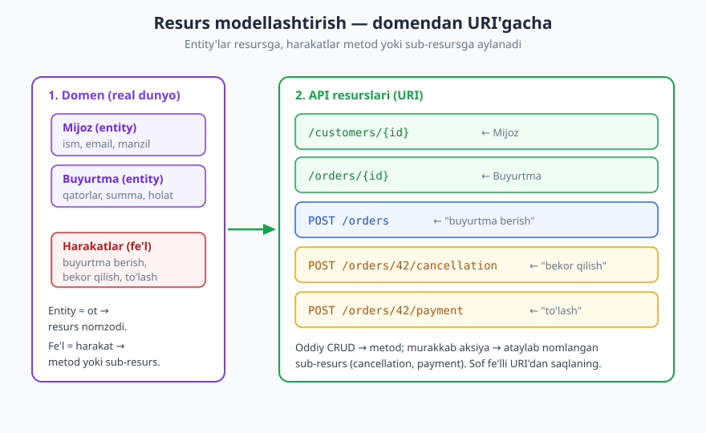
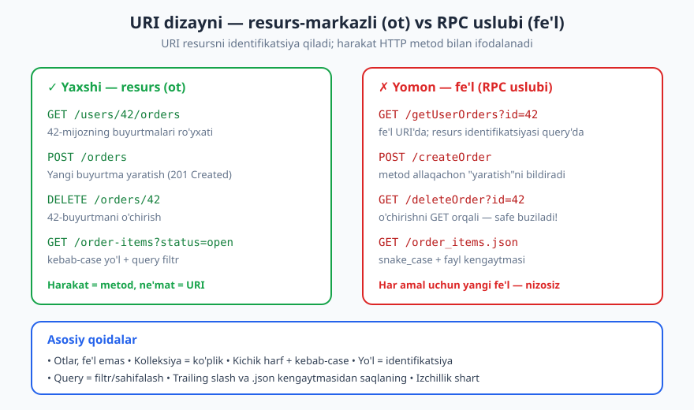
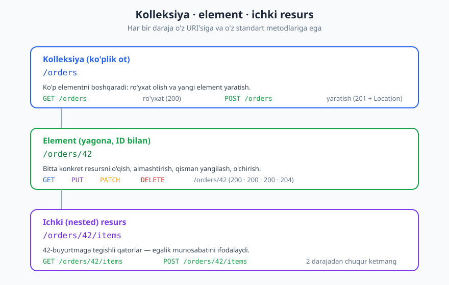

# 06 — Resurs modellashtirish va URI dizayni

[⬅️ Oldingi: 05 — REST tamoyillari va Richardson Maturity Model](./05-rest-tamoyillari.md) · [🏠 README](./README.md) · [Keyingi: 07 — So'rov va javob dizayni (payload) ➡️](./07-sorov-javob-payload.md)

---

> **Bu bobda:** REST API'ning "skeleti" — qaysi resurslar bor va ular qanday URI bilan nomlanadi. Domen entity'laridan resurslarni qanday ajratishni, kolleksiya/element/ichki resurs naqshlarini, URI yozishning amaliy qoidalarini, har resursga standart CRUD amallarini va eng qiyini — "buyurtmani bekor qilish" kabi fe'l/aksiyani resurs dunyosiga qanday keltirishni o'rganamiz. Oxirida anti-naqshlar va izchillik (consistency).
>
> **Halollik / Eslatma:** HTTP metod va status semantikasi RFC 9110 (2022) ga asoslanadi — bu yerda "to'g'ri" deganimiz shu standartdan. URI'ning aniq shakli (ko'plik/birlik, nesting chuqurligi, aksiyani modellashtirish) esa **trade-off**: REST spetsifikatsiyasi URI strukturasini majburlamaydi. Shuning uchun ko'p o'rinda "X — keng tarqalgan amaliyot, lekin kontekstga qarab Y ham haqli" deb halol aytamiz. Misollar (HTTP/JSON) tekshirilgan; siz boshqa izchil konvensiya tanlasangiz ham, asosiy gap — **bir xil** tanlovga sodiq qolish.

---

## Resurs nima

Tasavvur qiling, siz kutubxonaga kirdingiz. Kutubxona sizga **narsalar**ni — kitoblar, javonlar, foydalanuvchi kartochkalari, ijara yozuvlarini — taqdim etadi. Siz bu narsalar ustida amal bajarasiz: kitobni o'qiysiz, ijaraga olasiz, qaytarasiz. API ham xuddi shunday: u dunyoga **resurslar** to'plamini ochadi, va mijoz ular ustida amal bajaradi.

**Resurs** — bu API tashqariga ko'rsatadigan "narsa": real dunyodagi entity (mijoz, buyurtma, mahsulot, hisob) yoki mavhum tushuncha (qidiruv natijasi, hisobot, joriy foydalanuvchi sessiyasi). REST'ning markaziy g'oyasi — **resurs-markazli** bo'lish. Ya'ni API'ning so'zlik birligi **ot** (resurs), **fe'l** (harakat) emas. Harakatni esa allaqachon HTTP metodlari (GET, POST, PUT, PATCH, DELETE) ifodalaydi. Buni [05-bobda](./05-rest-tamoyillari.md) ko'rgan Richardson Maturity Model tilida: resurslarga ega bo'lish — L1, ularni HTTP fe'llari bilan to'g'ri ishlatish — L2.

> **Eslatma:** "fe'l emas, ot" — bu shior bo'lib qolmasin. Asl maqsad: **takrorlanmas, oldindan aytib bo'ladigan** lug'at. Agar har bir amal yangi fe'l talab qilsa (`getUser`, `createUser`, `activateUser`, `suspendUser`...), API cheksiz o'sadi. Agar amal mavjud metodlarga tushsa, lug'at kichik va prognozli qoladi.

### Resurs vs tasvir (representation)

Bu farq nozik, lekin REST'ning yuragi. **Resurs** — mavhum tushuncha ("42-buyurtma"). **Tasvir (representation)** — o'sha resursning biror formatdagi konkret ko'rinishi: JSON hujjat, XML, HTML sahifa, hatto PDF. Bitta resursning bir nechta tasviri bo'lishi mumkin:

```http
GET /orders/42 HTTP/1.1
Host: api.example.com
Accept: application/json

HTTP/1.1 200 OK
Content-Type: application/json

{"id": 42, "status": "shipped", "total": 79.90}
```

Bu yerda `/orders/42` — **resurs identifikatori**, javobdagi JSON esa — uning **tasviri**. Agar mijoz `Accept: text/html` so'rasa, server xuddi shu resursning HTML tasvirini qaytarishi mumkin. Resurs bitta, tasvir esa kontentga bog'liq ([content negotiation](./02-http-chuqur.md)). URI dizayni — bu **resurslarni** nomlash san'ati; tasvir esa keyingi bob, [07 — payload](./07-sorov-javob-payload.md) mavzusi.

> **Standart:** URI ("Uniform Resource Identifier") resursni **nomlaydi** va identifikatsiya qiladi — RFC 3986. U resursning ichidagi ma'lumot emas, balki uning **manzili**. Shu sabab URI'da fe'l ("oboyu olchaymiz") emas, balki resursning o'zi (ot) bo'lishi mantiqan to'g'ri.

---

## Resursni modellashtirish

API dizaynining birinchi va eng muhim qadami — **qaysi resurslar bor?** degan savolga javob berish. Bu ko'pincha domen modelingizdan (ma'lumotlar bazasi entity'lari, biznes tushunchalari) boshlanadi, lekin **aynan nusxa emas**. API resurslari mijoz nuqtai nazaridan modellashtiriladi: mijozga nima kerak, u qaysi narsalar bilan ishlaydi?



Jarayonni bosqichma-bosqich ko'rib chiqamiz. Aytaylik, biz e-commerce API quryapmiz.

**1-qadam: entity'larni (otlarni) toping.** Domeningizdagi asosiy "narsalar"ni ro'yxatlang — bular odatda resurs nomzodlari:

- Mijoz (Customer)
- Buyurtma (Order)
- Mahsulot (Product)
- Savat (Cart)
- To'lov (Payment)

Har bir entity — potensial **kolleksiya** resursi: `/customers`, `/orders`, `/products`. Har bir konkret nusxa — **element**: `/orders/42`.

**2-qadam: munosabatlarni aniqlang.** Buyurtma mijozga tegishli; buyurtmada qatorlar (items) bor. Bu munosabatlar **ichki (nested) resurslar**ga aylanishi mumkin: `/customers/7/orders`, `/orders/42/items`.

**3-qadam: harakatlarni (fe'llarni) modellashtiring.** Mana eng qiziq qism. Biznesingizda fe'llar bor: "buyurtma berish", "buyurtmani bekor qilish", "to'lovni qaytarish". Ularni qanday resurs dunyosiga keltirish kerak? Ko'p holatda fe'l bevosita HTTP metodga tushadi:

| Domen fe'li | Resurs amaliga aylantirish |
|---|---|
| "Buyurtma yaratish" | `POST /orders` (yaratish = POST) |
| "Buyurtmani o'qish" | `GET /orders/42` |
| "Buyurtmani yangilash" | `PATCH /orders/42` |
| "Buyurtmani o'chirish" | `DELETE /orders/42` |
| "Buyurtmalarni ro'yxatlash" | `GET /orders` |

Ko'rib turibsizmi: `createOrder`, `getOrder`, `updateOrder`, `deleteOrder` — to'rtta fe'l — bitta resurs (`/orders`) va to'rtta HTTP metodga siqildi. Bu — modellashtirishning kuchi. "Bekor qilish" kabi standart CRUD'ga tushmaydigan murakkab fe'llarni keyinroq ("Fe'l/aksiyani modellashtirish" bo'limida) alohida ko'rib chiqamiz.

> **Trade-off:** Domen modeli = API resurslari emas. Ba'zan bitta DB jadvali bir nechta resursga bo'linadi (`/users/42` va `/users/42/profile`), ba'zan bir nechta jadval bitta resursga birlashadi (`/orders/42` ichida items, shipping, total). Resursni **mijoz uchun qulay** birlik qilib tanlang, ichki sxema strukturasini sirtga "to'kib qo'ymang".

---

## URI dizayn qoidalari

Endi eng amaliy qism: URI'ni aniq qanday yozish kerak. REST spetsifikatsiyasi bu qoidalarni majburlamaydi — bular **konvensiya**, lekin sanoatda shu darajada keng qabul qilinganki, ulardan chetga chiqish mijozni hayron qoldiradi va DX (developer experience)ni buzadi.



### Otlar, fe'l emas

URI resursni (ot) nomlaydi, harakatni esa HTTP metod ifodalaydi.

```
✓ GET    /users          (foydalanuvchilar ro'yxati)
✗ GET    /getUsers       (fe'l URI'da — metod allaqachon "olish"ni bildiradi)
✗ POST   /createUser     (POST allaqachon "yaratish")
```

`/getUsers` ortiqcha: `GET` so'zi shundoq ham "ol" degani. Fe'lni URI'ga qo'ysangiz, u ma'noni ikki marta takrorlaydi va lug'atni shishiradi.

### Kolleksiya = ko'plik ot, element = ID bilan



```
/orders          → kolleksiya (hamma buyurtmalar)
/orders/42       → element (42-buyurtma)
```

Ko'plik (`/orders`, `/users`, `/products`) keng tarqalgan, chunki `/orders` "buyurtmalar to'plami" degan ma'noni tabiiy beradi, `/orders/42` esa "to'plamning 42-a'zosi". Birlik (`/order/42`) ham uchraydi, lekin asosiy qoida — **izchillik**: hammasini ko'plik yoki hammasini birlik qiling, aralashtirmang. Ko'pchilik amaliyot ko'plikni tanlaydi.

### Ichki (nested) resurs — egalik munosabati uchun

```
/customers/7/orders        → 7-mijozning buyurtmalari
/orders/42/items           → 42-buyurtmaning qatorlari
```

Nesting "X ga tegishli Y" munosabatini aniq ifodalaydi. Lekin **chuqurlikni cheklang**: 2 darajadan oshmang.

```
✓ /customers/7/orders
✗ /customers/7/orders/42/items/3/discounts/1   (juda chuqur — mo'rt, uzun)
```

Chuqur nesting muammoli: URI uzun va mo'rt bo'ladi, har bir oraliq ID to'g'riligini tekshirish kerak, va ko'pincha ortiqcha. Ko'p holatda 1 darajadan keyin to'g'ridan-to'g'ri element URI'siga o'ting: `/items/3` (agar `items` global identifikatorga ega bo'lsa). Qoida: nesting'ni **ona resurs kontekstida ma'noli** bo'lganda ishlating, faqat "munosabat bor" deb emas.

> **Trade-off:** `/customers/7/orders` (nested) yoki `/orders?customer_id=7` (query filtr) — ikkalasi ham haqli. Nested URI iyerarxiyani ko'rsatadi va kontekstni majburlaydi; query filtr esa yassi (flat) va moslashuvchan ([filtrlash](./08-sahifalash-filtrlash.md)). Public API'larda ko'pincha har ikkisi ham qo'llab-quvvatlanadi.

### Kichik harf va kebab-case yo'lda

URI yo'lining (path) segmentlari **kichik harf** va so'zlar `defis` bilan (kebab-case) bo'lsin:

```
✓ /order-items
✗ /orderItems      (camelCase — URI'da odatlanmagan)
✗ /order_items     (snake_case — pastki chiziq ba'zi shriftlarda yashiringan)
✗ /Order-Items     (URI yo'li registr-sezgir; chalkashlik)
```

> **Eslatma:** Yo'l (`/order-items`) odatda kebab-case bo'ladi, lekin JSON **tana**sidagi maydon nomlari (`order_items` yoki `orderItems`) — alohida masala, [07-bobda](./07-sorov-javob-payload.md) muhokama qilamiz. Yo'l va payload uchun har xil konvensiya bo'lishi normal: `GET /order-items` → `{"orderItems": [...]}`.

### ID turlari: ketma-ket vs UUID

Element URI'sidagi identifikator turi muhim qaror:

| Tur | Misol | Afzallik | Kamchilik |
|---|---|---|---|
| Ketma-ket (sequential) | `/orders/42` | qisqa, o'qiluvchan, debug oson | **bashorat qilinadi** — `/orders/43` ni taxmin qilish oson; soningiz oshkor |
| UUID / random | `/orders/9f8c2e1a-...` | bashorat qilib bo'lmaydi, global yagona | uzun, o'qish noqulay |

> **Xavfsizlik:** Ketma-ket ID xavfsizlik muammosi **emas**, lekin u xatoni **kuchaytiradi**. Agar avtorizatsiya zaif bo'lsa, hujumchi `/orders/41`, `/orders/43`... ni ketma-ket sinab, boshqalarning ma'lumotini o'g'irlashi mumkin — bu **BOLA** (Broken Object Level Authorization), OWASP API Security Top 10 dagi #1 xavf. Asl yechim — har so'rovda egalikni tekshirish ([avtorizatsiya](./12-avtorizatsiya.md)); UUID esa faqat qo'shimcha himoya qatlami (taxmin qilishni qiyinlashtiradi), almashtirmaydi. Ya'ni: ketma-ket ID xavfsiz avtorizatsiya bilan to'g'ri, lekin tashqi (public) resurslar uchun UUID ko'pincha xavfsizroq tanlov.

### Query parametrlar — filtr/sahifalash uchun, yo'l — identifikatsiya uchun

Mana muhim chegara:

- **Yo'l (path)** resursni **identifikatsiya** qiladi: `/orders/42`.
- **Query** parametrlar natijani **o'zgartiradi** (filtr, saralash, sahifalash): `/orders?status=open&page=2`.

```
✓ GET /orders?status=shipped&sort=-created_at&page=2
✗ GET /getOrdersByStatus/shipped/page/2     (filtrlar yo'lga tiqilgan)
✗ GET /orders/42?action=cancel              (aksiya query'da yashiringan)
```

Query'lar ixtiyoriy va kombinatsiyalanuvchi bo'ladi; ularni yo'lga kiritsangiz, har kombinatsiyaga yangi marshrut kerak bo'ladi. Sahifalash va filtrlashning to'liq dizaynini [08-bobda](./08-sahifalash-filtrlash.md) ko'ramiz.

### Trailing slash va fayl kengaytmasi — yo'q

```
✗ /orders/         (oxirgi slash — /orders va /orders/ bir xilmi? chalkashlik)
✗ /orders/42.json  (format URI'da emas, Accept sarlavhasida bo'lishi kerak)
```

Format (JSON/XML) **content negotiation** orqali, ya'ni `Accept` sarlavhasi bilan tanlanadi, URI'dagi `.json` kengaytmasi bilan emas. `.json` URI'ni formatga bog'lab qo'yadi va keyin XML qo'shsangiz, URI'lar ikkilanadi. Oxirgi slashని esa bitta variantga qaror qiling (odatda yo'q) va izchil bo'ling.

---

## Har resursga standart amallar (CRUD → HTTP)

Resursni aniqlab olgach, unga **standart amallar to'plami**ni qo'llaysiz. Bu — REST'ning go'zalligi: har resurs uchun bir xil, prognozli to'plam. CRUD (Create, Read, Update, Delete) HTTP metodlariga shunday tushadi (semantika [RFC 9110](./02-http-chuqur.md) bo'yicha):

| Amal | Metod + URI | Ma'nosi | Tipik javob |
|---|---|---|---|
| Ro'yxat (list) | `GET /orders` | kolleksiyani o'qish | `200 OK` + massiv |
| Yaratish (create) | `POST /orders` | kolleksiyaga yangi element | `201 Created` + `Location` |
| Bitta o'qish (read) | `GET /orders/42` | elementni o'qish | `200 OK` (yoki `404`) |
| To'liq almashtirish (replace) | `PUT /orders/42` | butun elementni almashtirish | `200 OK` / `204 No Content` |
| Qisman yangilash (update) | `PATCH /orders/42` | ba'zi maydonlarni o'zgartirish | `200 OK` / `204` |
| O'chirish (delete) | `DELETE /orders/42` | elementni o'chirish | `204 No Content` (yoki `404`) |

Eslab qolish uchun metod xossalari (bu [03-bob](./03-http-status-kodlari.md) va RFC 9110 dan):

- **GET** — *safe* (o'qiydi, o'zgartirmaydi) va *idempotent*.
- **POST** — *safe emas, idempotent emas*. Ikki marta yuborsangiz, ikkita buyurtma yaratilishi mumkin.
- **PUT** — *idempotent*, **to'liq almashtirish**: tananing o'zi butun yangi holatni bildiradi. Bir xil PUT'ni 10 marta yuborsangiz, natija bitta marta yuborgandagidek.
- **PATCH** ([RFC 5789](./07-sorov-javob-payload.md)) — **qisman** yangilash; *idempotent bo'lishi shart emas* (masalan "balansga +10 qo'sh" idempotent emas).
- **DELETE** — *idempotent*: o'chirilgan resursni yana o'chirsangiz, holat o'zgarmaydi (ko'pincha `404` yoki `204`).

Yaratish jarayonini ko'raylik — `201 Created` va `Location` muhim:

```http
POST /orders HTTP/1.1
Host: api.example.com
Content-Type: application/json
Authorization: Bearer <token>

{"customer_id": 7, "items": [{"product_id": 100, "quantity": 2}]}

HTTP/1.1 201 Created
Location: /orders/1001
Content-Type: application/json

{"id": 1001, "status": "pending", "total": 159.80}
```

`201` kod "yangi resurs yaratildi" deydi, `Location` sarlavhasi esa yaratilgan resursning URI'sini beradi — mijoz endi `GET /orders/1001` bilan unga murojaat qilishi mumkin. Bu — yaxshi REST dizaynining belgisi (status kodlarining to'liq xaritasini [03-bobda](./03-http-status-kodlari.md) ko'ramiz).

> **Diqqat:** `PUT` va `PATCH` farqi ko'p chalkashlikka sabab. **PUT** — "mana resursning to'liq yangi holati, eskisini butunlay almashtir" (yuborilmagan maydonlar o'chadi/null bo'ladi). **PATCH** — "faqat shu maydonlarni o'zgartir, qolganini tegma". Ko'p amaliy API'lar asosan PATCH ishlatadi, chunki mijozga butun ob'ektni qayta yuborish noqulay.

---

## Fe'l/aksiyani modellashtirish (qiyin holatlar)

Hamma narsa CRUD'ga tushavermaydi. "Buyurtmani **bekor qilish**", "elektron pochtani **tasdiqlash**", "to'lovni **qaytarish**", "obunani **to'xtatish**" — bular biznes aksiyalari, oddiy "yangilash" emas. Bu — URI dizaynining eng qiyin va eng ko'p bahslashiladigan qismi. Bir nechta haqli variant bor; halol bo'lamiz — "yagona to'g'ri javob" yo'q.

"Buyurtmani bekor qilish"ni 3 xil modellashtiramiz:

### Variant A — holat o'zgarishi (PATCH status)

Bekor qilishni buyurtmaning `status` maydonini o'zgartirish deb ko'rsatamiz:

```http
PATCH /orders/42 HTTP/1.1
Content-Type: application/json

{"status": "cancelled"}

HTTP/1.1 200 OK
Content-Type: application/json

{"id": 42, "status": "cancelled"}
```

**Afzallik:** sof REST'ga eng yaqin — yangi resurs/fe'l yo'q, faqat holat o'zgardi. **Kamchilik:** bekor qilish ko'pincha shunchaki maydon o'zgarishi emas — yon-ta'sirlar bor (to'lovni qaytarish, omborni yangilash, xat yuborish). Mijoz "men `status: cancelled` yozdim" deydi, lekin server "agar buyurtma allaqachon yetkazilgan bo'lsa, bekor qilib bo'lmaydi" deyishi mumkin. Murakkab biznes qoidasini oddiy maydon ko'rinishida yashirish chalkash.

### Variant B — aksiyani sub-resurs sifatida (POST /orders/42/cancel)

Aksiyani buyurtmaga tegishli amal sifatida ifodalaymiz:

```http
POST /orders/42/cancel HTTP/1.1
Content-Type: application/json

{"reason": "mijoz fikrini o'zgartirdi"}

HTTP/1.1 200 OK
Content-Type: application/json

{"id": 42, "status": "cancelled", "cancelled_at": "2026-06-16T10:00:00Z"}
```

**Afzallik:** aksiya ochiq va aniq; murakkab biznes mantig'i (yon-ta'sirlar, validatsiya) shu endpoint ortida tabiiy joylashadi. Sanoatda juda keng tarqalgan amaliyot. **Kamchilik:** `/cancel` — bu fe'l, ya'ni sof REST'dan biroz chetga chiqish. Buni "controller" yoki "action" resurs deyishadi — REST puristlari ma'qul ko'rmaydi, lekin amaliy.

> **Trade-off:** Variant B — "amaliy REST". Maslahat: bunday aksiyalarni **POST** bilan qiling (safe emas, holat o'zgaradi) va URI'ni qisqa, fe'l-ot tarzida (`/orders/42/cancel`) tuting. Bu juda ko'p mashhur API'da uchraydi.

### Variant C — aksiyani yangi resurs (cancellation) sifatida

Aksiyaning o'zini **resursga aylantiramiz** — bekor qilish hodisasini "narsa" deb ko'ramiz:

```http
POST /orders/42/cancellation HTTP/1.1
Content-Type: application/json

{"reason": "mijoz fikrini o'zgartirdi"}

HTTP/1.1 201 Created
Location: /orders/42/cancellation
Content-Type: application/json

{"id": "c-771", "order_id": 42, "reason": "mijoz fikrini o'zgartirdi", "created_at": "2026-06-16T10:00:00Z"}
```

**Afzallik:** eng "REST-puxta" — `cancellation` haqiqiy resurs: uni `GET` bilan o'qish, audit qilish, kim/qachon bekor qilganini saqlash mumkin. Murakkab, hujjatlashtiriladigan jarayonlar (refund, return, dispute) uchun ajoyib. **Kamchilik:** oddiy holat uchun ortiqcha — yangi resurs, yangi sxema, ko'proq murakkablik.

| Variant | Qachon eng mos | REST sofligi | Murakkablik |
|---|---|---|---|
| A — `PATCH status` | aksiya = oddiy holat o'zgarishi, yon-ta'sir yo'q | yuqori | past |
| B — `POST /…/cancel` | murakkab biznes aksiyasi, ko'p amaliy holat | o'rta | o'rta |
| C — `POST /…/cancellation` resurs | aksiyani o'qish/audit kerak, boy jarayon | eng yuqori | yuqori |

> **Halollik:** Hech bir variant universal "to'g'ri" emas. Kichik/oddiy holatda A; ko'pchilik amaliy API uchun B; murakkab, kuzatiladigan jarayon uchun C. Asosiy qoida o'zgarmaydi: **aksiyani GET orqali qilmang** (GET safe bo'lishi shart) va izchil bo'ling.

---

## Singleton va sub-resurs naqshlari

Ba'zi resurslar kolleksiya emas, balki **yagona** (singleton) — ID kerak emas, chunki har doim bittagina nusxa bor.

**Singleton — joriy foydalanuvchi (`/me`):**

```http
GET /me HTTP/1.1
Authorization: Bearer <token>

HTTP/1.1 200 OK
Content-Type: application/json

{"id": 7, "name": "Aziz", "email": "aziz@example.com"}
```

`/me` — autentifikatsiyalangan foydalanuvchining o'zi. ID yo'q, chunki "men" tokendan aniqlanadi. Bu juda qulay naqsh: mijoz o'z ID'sini bilmasdan o'zini so'rashi mumkin. Shunga o'xshash, `/users/42/settings` — 42-foydalanuvchining yagona sozlamalar resursi (kolleksiya emas, bittagina).

**Sub-resurs — egalikdagi yagona narsa (`/avatar`):**

```http
PUT /users/42/avatar HTTP/1.1
Content-Type: image/png

<rasm baytlari>

HTTP/1.1 200 OK
```

`avatar` — 42-foydalanuvchiga tegishli yagona resurs. `PUT` bilan almashtiramiz (idempotent: bir xil rasmni qayta yuborsangiz, holat o'zgarmaydi), `DELETE /users/42/avatar` bilan o'chiramiz. Singleton sub-resurs ID talab qilmaydi — egasi (`/users/42`) allaqachon kontekstni beradi.

> **Eslatma:** `/me` kabi singletonlar **qulaylik** (convenience) resurslari. Ko'p API ham `/me`, ham `/users/42` ni qo'llab-quvvatlaydi: `/me` joriy foydalanuvchiga qisqartma, `/users/{id}` esa umumiy. Izchillik uchun `/me` ortidagi javob xuddi `/users/{id}` dagidek tuzilishda bo'lsin.

---

## Anti-naqshlar

Endi bir joyda — qochish kerak bo'lgan keng tarqalgan xatolar. Bularning ko'pini yuqorida ko'rib o'tdik; bu yerda jamlab, **nega yomon**ligi bilan beramiz.

| Anti-naqsh | Misol | Nega yomon |
|---|---|---|
| Fe'lli URI | `POST /createOrder` | metod allaqachon harakatni bildiradi; lug'at shishadi |
| ID query'da | `GET /order?id=42` | yo'l identifikatsiya qilishi kerak; query — filtr uchun |
| Chuqur nesting | `/a/1/b/2/c/3/d/4` | mo'rt, uzun, ko'p oraliq tekshiruv |
| Izchilsiz ko'plik/birlik | `/users` + `/order/42` | bashorat qilib bo'lmaydi; mijoz har safar eslab qolishi kerak |
| Aksiyani GET orqali | `GET /orders/42/cancel` | **GET safe bo'lishi shart** — o'zgartirmasligi kerak; brauzer/proxy GET'ni oldindan yuklab, holatni buzishi mumkin |
| Format URI'da | `/orders/42.json` | content negotiation (`Accept`) o'rnini bosa olmaydi; URI'lar ikkilanadi |
| Fe'l + ot aralash | `/orders` va `/fetchInvoices` | bitta API ikki uslubda — chalkash |

> **Anti-pattern:** Eng xavflisi — **holat o'zgartiruvchi GET**. `GET /users/42/delete` yoki `GET /orders/42/cancel` ko'rinishidagi URI'lar dahshatli: qidiruv-robotlari, brauzer prefetch, link-skanerlar GET so'rovlarini **avtomatik** yuboradi va sizning ma'lumotingizni jimgina o'chirib/o'zgartirib qo'yishi mumkin. Har qanday holatni o'zgartiruvchi amal POST/PUT/PATCH/DELETE bo'lishi shart. Bu shunchaki uslub emas — **xavfsizlik** qoidasi.

---

## Izchillik — eng muhim DX omili

Yuqoridagi qoidalarning hammasidan ham muhimroq bitta meta-qoida bor: **izchillik (consistency)**. Yaxshi API — uni o'rganguningizcha **bir marta** o'rgangach, qolganini **taxmin** qila olganingiz. Agar `/orders` ko'plik bo'lsa, `/products` ham ko'plik bo'lsin. Agar bitta resursda aksiya `POST /…/cancel` shaklida bo'lsa, boshqasida ham shunday bo'lsin, `POST /…/doRefund` emas.

Izchillik nima uchun muhim:

- **Bashoratlilik:** mijoz `/orders/42` ni ko'rib, `/products/100`, `/customers/7` qanday ishlashini darrov biladi.
- **Kam xatolik:** har bir resurs uchun yangi qoida eslamaslik — kamroq dokumentatsiya o'qish, kamroq xato.
- **Ishonch:** izchil API "yaxshi o'ylangan"dek tuyuladi; chalkash API mijozni asabiylashtiradi.

Buni real qilish uchun amaliy maslahat: API'ngiz uchun **dizayn standarti** (style guide) yozib qo'ying — ko'plik/birlik, kebab-case, nesting chuqurligi, aksiyalarni qanday modellash, sana formati ([07-bob](./07-sorov-javob-payload.md)). Yangi resurs qo'shganda shu standartga qarang. Katta tashkilotlar buni linter (masalan OpenAPI uchun) bilan avtomatlashtiradi.

> **Trade-off:** Izchillik vs "har holatda ideal". Ba'zan bitta resurs uchun boshqacha (mukammalroq) yondashuv mavjud bo'ladi. Lekin agar u qolgan API'dan farq qilsa, ko'pincha **izchillik g'olib** — bir oz "ideal emas", lekin prognozli API yaxshi. Faqatgina kuchli sabab bo'lganda istisno qiling, va uni hujjatlang.

---

## Asosiy g'oyalar (bobni qisqacha)

- **Resurs = ot.** API resurs-markazli: lug'at otlardan (resurslar) iborat, harakatlar HTTP metodlari bilan ifodalanadi. Resurs (mavhum "narsa") va tasvir (representation — JSON/XML ko'rinishi) farqlanadi.
- **Modellashtirish:** domen entity'laridan resurslarni ajrating, lekin DB sxemasini ko'r-ko'rona nusxalamang — mijoz uchun qulay birlik tanlang. Fe'llarni avval HTTP metodlariga keltiring.
- **URI qoidalari:** otlar (fe'l emas), ko'plik kolleksiya + ID'li element, nesting ≤ 2 daraja, kichik harf + kebab-case, query = filtr/sahifalash, trailing slash va `.json` kengaytmasi yo'q.
- **CRUD → HTTP:** `GET /x` (list), `POST /x` (create, 201+Location), `GET /x/{id}`, `PUT` (to'liq almashtirish, idempotent), `PATCH` (qisman), `DELETE` (idempotent).
- **Aksiyalar (bekor qilish):** 3 haqli variant — PATCH status (oddiy), `POST /…/cancel` (amaliy, eng keng), `POST /…/cancellation` resurs (boy/auditli). "Yagona to'g'ri" yo'q — kontekstga qarab tanlang; **hech qachon GET bilan emas**.
- **Singleton/sub-resurs:** `/me`, `/users/42/avatar` — ID talab qilmaydigan yagona resurslar.
- **Anti-naqsh #1:** holatni o'zgartiruvchi GET — bu xavfsizlik xatosi (prefetch/robot buzadi).
- **Izchillik** — eng muhim DX omili. Style guide yozing, har joyda bir xil konvensiya tuting.

---

## Mashqlar

### Oson

**1-mashq.** Quyidagi URI'larni "yaxshi" yoki "yomon (RESTga zid)" deb ajrating va yomonlarini tuzating: (a) `GET /getAllProducts`, (b) `GET /products/55`, (c) `POST /products/create`, (d) `DELETE /products/55`, (e) `GET /products?category=phones&sort=price`.

**2-mashq.** Quyidagi CRUD amallarini to'g'ri HTTP metod + URI ga moslashtiring (resurs: `articles`): (a) barcha maqolalar ro'yxati, (b) yangi maqola yaratish, (c) 12-maqolani o'qish, (d) 12-maqolaning faqat sarlavhasini o'zgartirish, (e) 12-maqolani o'chirish.

**3-mashq.** `POST /orders` so'rovi muvaffaqiyatli bajarilganda server qaysi status kodini qaytarishi va qaysi sarlavhani qo'shishi kerak? Nega bu sarlavha mijoz uchun foydali?

### O'rta

**4-mashq.** Quyidagi fe'lli (RPC uslubidagi) URI'larni resurs-markazli REST dizayniga qayta yozing: (a) `POST /activateUser?id=7`, (b) `GET /listUserOrders?userId=7`, (c) `POST /updateOrderStatus` (tanada `{"orderId": 42, "status": "shipped"}`), (d) `GET /searchProducts?q=phone`.

**5-mashq.** Siz blog API loyihalayapsiz. Domenda: Muallif (Author), Maqola (Article), Izoh (Comment) entity'lari bor. Har biri uchun: (a) kolleksiya va element URI'sini yozing, (b) "muallifning maqolalari" va "maqolaning izohlari" munosabatlarini nested resurs sifatida ifodalang, (c) nesting chuqurligi qoidasiga rioya qilganingizni tushuntiring.

**6-mashq.** Quyidagi nested URI muammoli: `GET /companies/3/departments/8/teams/15/members/22/tasks`. Nega yomon va qanday soddalashtirasiz? Ikki muqobil yondashuv bering.

### Qiyin

**7-mashq.** "Foydalanuvchining parolini tiklash (reset)" aksiyasini **3 xil** modellashtiring (PATCH-holat, `POST /…/action`, va yangi resurs sifatida). Har biri uchun HTTP so'rov/javob namunasini yozing va trade-off (qachon qaysi) ni tushuntiring.

**8-mashq.** Quyidagi izchilsiz API'ni qayta dizayn qiling va izchillik qoidalarini sanang. Endpointlar: `GET /users`, `GET /Product/42`, `POST /createOrder`, `GET /order/99/getItems`, `GET /orders/99.json`, `POST /orders/99/cancel`, `PATCH /Users/7`.

**9-mashq.** Bir kompaniyaning public API'sida buyurtmalar `/orders/1`, `/orders/2`, `/orders/3` ... ketma-ket ID bilan ochiq. Avtorizatsiya esa faqat "token bormi?" ni tekshiradi, "bu buyurtma shu foydalanuvchiniki mi?" ni tekshirmaydi. (a) Qanaqa xavf bor va u OWASP API Top 10 da qaysi nom bilan ataladi? (b) UUID ga o'tish muammoni hal qiladimi? (c) Asl yechim nima?

<details markdown="1">
<summary>Yechimlar</summary>

### 1-mashq yechimi

- (a) `GET /getAllProducts` — **yomon** (fe'l URI'da). Tuzatish: `GET /products`.
- (b) `GET /products/55` — **yaxshi** (element o'qish).
- (c) `POST /products/create` — **yomon** (`create` ortiqcha, POST allaqachon yaratish). Tuzatish: `POST /products`.
- (d) `DELETE /products/55` — **yaxshi**.
- (e) `GET /products?category=phones&sort=price` — **yaxshi** (filtr/saralash query'da, to'g'ri).

### 2-mashq yechimi

| Amal | Metod + URI |
|---|---|
| (a) ro'yxat | `GET /articles` |
| (b) yaratish | `POST /articles` (→ 201 + Location) |
| (c) o'qish | `GET /articles/12` |
| (d) faqat sarlavhani o'zgartirish | `PATCH /articles/12` tanasi `{"title": "..."}` (qisman → PATCH, PUT emas) |
| (e) o'chirish | `DELETE /articles/12` |

(d) da PATCH tanladik, chunki faqat bitta maydon o'zgaradi; PUT butun ob'ektni almashtirgani uchun qolgan maydonlar yo'qolib/null bo'lib qolardi.

### 3-mashq yechimi

Server `201 Created` qaytaradi va `Location` sarlavhasini qo'shadi, masalan `Location: /orders/1001`. Bu foydali, chunki: (1) `201` aniq "yangi resurs yaratildi" deb bildiradi (oddiy `200` emas); (2) `Location` yaratilgan resursning URI'sini beradi, shunda mijoz uni alohida `GET /orders/1001` bilan o'qiy oladi — ID'ni javob tanasidan qidirib olishga majbur emas. Bu RFC 9110 ga muvofiq to'g'ri amaliyot.

### 4-mashq yechimi

- (a) `POST /activateUser?id=7` → foydalanuvchini faollashtirish aksiya. Variantlar: `POST /users/7/activation` (resurs) yoki `POST /users/7/activate` (amal). Oddiyroq bo'lsa, `PATCH /users/7` tanasi `{"status": "active"}`.
- (b) `GET /listUserOrders?userId=7` → `GET /users/7/orders` (nested) yoki `GET /orders?user_id=7` (filtr).
- (c) `POST /updateOrderStatus` (tana `{"orderId": 42, "status": "shipped"}`) → `PATCH /orders/42` tanasi `{"status": "shipped"}` (resurs URI'da, ID query/tanada emas).
- (d) `GET /searchProducts?q=phone` → `GET /products?q=phone` ( `products` resursini query bilan filtrlash; alohida `/search` resursi ham haqli, lekin `/products?q=` izchilroq).

### 5-mashq yechimi

(a) Kolleksiya va element:

```
/authors        /authors/3
/articles       /articles/12
/comments       /comments/55
```

(b) Munosabatlar (nested):

```
GET /authors/3/articles        (3-muallifning maqolalari)
GET /articles/12/comments      (12-maqolaning izohlari)
```

(c) Nesting chuqurligi: har ikkalasi ham **1 daraja** (ona/bola), shu sabab qoidaga (≤ 2 daraja) rioya qilingan. Agar "muallifning maqolasining izohlari" kerak bo'lsa, `/authors/3/articles/12/comments` (3 daraja) o'rniga to'g'ridan-to'g'ri `/articles/12/comments` ishlatiladi — izoh maqolaga tegishli, muallif ID ortiqcha.

### 6-mashq yechimi

Muammo: 5 darajali nesting (`/companies/3/.../tasks`) — juda uzun, mo'rt (har bir oraliq ID to'g'riligini tekshirish kerak), va ko'p ID ortiqcha. Agar `members` global ID'ga ega bo'lsa, oraliqlar keraksiz.

- **Muqobil 1 (yassi + filtr):** `GET /tasks?member_id=22`. Vazifa global resurs, a'zo bo'yicha filtr. Eng moslashuvchan.
- **Muqobil 2 (qisqartirilgan nesting):** `GET /members/22/tasks`. Eng yaqin ona (member) kontekstini saqlaydi, qolgan iyerarxiyani tashlaydi — chunki `member` 22 allaqachon yagona aniqlaydi.

### 7-mashq yechimi

"Parolni tiklash" 3 xil:

**Variant A — PATCH holat (parolni maydon sifatida):**

```http
PATCH /users/7 HTTP/1.1
Content-Type: application/json

{"password": "yangi-parol"}

HTTP/1.1 200 OK
```

Faqat foydalanuvchi o'zi, eski parolni bilgan holatda yangilasa mos. Lekin "unutilgan parol" jarayoniga mos emas (eski parol yo'q), va parolni oddiy maydon kabi ko'rsatish xavfsizlik nuqtai nazaridan zaif.

**Variant B — aksiya endpoint:**

```http
POST /users/7/password-reset HTTP/1.1
Content-Type: application/json

{"token": "<reset-token>", "new_password": "yangi-parol"}

HTTP/1.1 200 OK
```

Aniq aksiya; murakkab mantiq (token tekshirish, eski parolni bekor qilish, xat yuborish) shu yerda. "Unutilgan parol" oqimiga eng mos, amaliy.

**Variant C — yangi resurs (reset so'rovi):**

```http
POST /password-reset-requests HTTP/1.1
Content-Type: application/json

{"email": "aziz@example.com"}

HTTP/1.1 202 Accepted
Location: /password-reset-requests/req-88
```

Tiklash **so'rovi**ni resursga aylantiradi: u kuzatiladi, audit qilinadi (kim/qachon so'radi), holati bor (`pending` → `completed`). Email orqali tiklash oqimi uchun ideal. `202 Accepted` — "so'rov qabul qilindi, email yuboriladi".

**Trade-off:** A — faqat oddiy "o'z parolini bilib o'zgartirish"; B — amaliy, eng ko'p ishlatiladigan ("unutdim" oqimi); C — eng boy/auditli, ko'p-bosqichli yoki tashqi (email) tiklash jarayoni uchun.

### 8-mashq yechimi

Izchilsizliklar va tuzatilgan API:

```
GET    /users
GET    /products/42        (Product → products: ko'plik + kichik harf)
POST   /orders             (createOrder → POST /orders)
GET    /orders/99/items    (order → orders; getItems → metod GET)
GET    /orders/99          (.json kengaytmasi olib tashlandi; format Accept orqali)
POST   /orders/99/cancel   (allaqachon to'g'ri — saqlanadi)
PATCH  /users/7            (Users → users: kichik harf)
```

Buzilgan izchillik qoidalari: (1) **registr** — `Product`/`Users` katta harf bilan, qolganlari kichik; barchasini kichik qiling. (2) **ko'plik/birlik** — `users`/`orders` ko'plik, lekin `Product`/`order` birlik; barchasi ko'plik bo'lsin. (3) **fe'l URI** — `createOrder`, `getItems` fe'l ishlatadi; metodlarga keltiring. (4) **format URI'da** — `.json`; `Accept` sarlavhasiga ko'chiring. Natijada hammasi bir xil konvensiyaga keldi: kichik harf, ko'plik, fe'lsiz.

### 9-mashq yechimi

(a) **Xavf:** har kim o'z tokeni bilan kirib, `/orders/1`, `/orders/2`... ni ketma-ket so'rab, **boshqalarning** buyurtmalarini o'qiy oladi — chunki server faqat "autentifikatsiya bormi?" ni tekshiradi, "bu obyekt so'rovchiniki mi?" ni emas. Bu **BOLA — Broken Object Level Authorization**, OWASP API Security Top 10 (2023) dagi **API1** (eng birinchi va eng keng tarqalgan xavf). Ketma-ket ID enumeratsiyani osonlashtiradi.

(b) **UUID muammoni hal qiladimi?** To'liq emas. UUID ID'larni **taxmin qilishni** qiyinlashtiradi (enumeratsiyaga qarshi qatlam), lekin agar ID biror joyda (loglar, referer, boshqa javob) oshkor bo'lsa, hujum baribir ishlaydi. UUID — himoya qatlami, **avtorizatsiyaning o'rnini bosmaydi**.

(c) **Asl yechim:** har bir obyekt-darajadagi so'rovda **egalik/ruxsatni tekshirish** — server `/orders/42` ni qaytarishdan oldin "42-buyurtma so'rovchi foydalanuvchiniki mi (yoki unga ruxsati bormi)?" ni tekshirsin; aks holda `404` yoki `403`. Bu [12 — avtorizatsiya](./12-avtorizatsiya.md) bobining markaziy mavzusi. UUID — qo'shimcha, lekin majburiy emas; egalikni tekshirish — majburiy.

</details>

---

[⬅️ Oldingi: 05 — REST tamoyillari va Richardson Maturity Model](./05-rest-tamoyillari.md) · [🏠 README](./README.md) · [Keyingi: 07 — So'rov va javob dizayni (payload) ➡️](./07-sorov-javob-payload.md)
