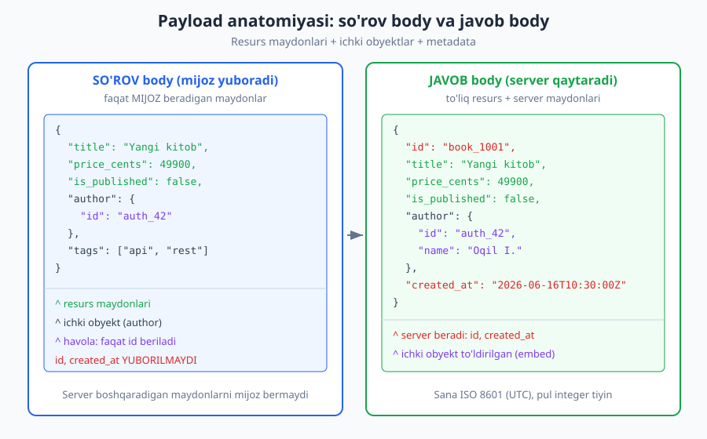
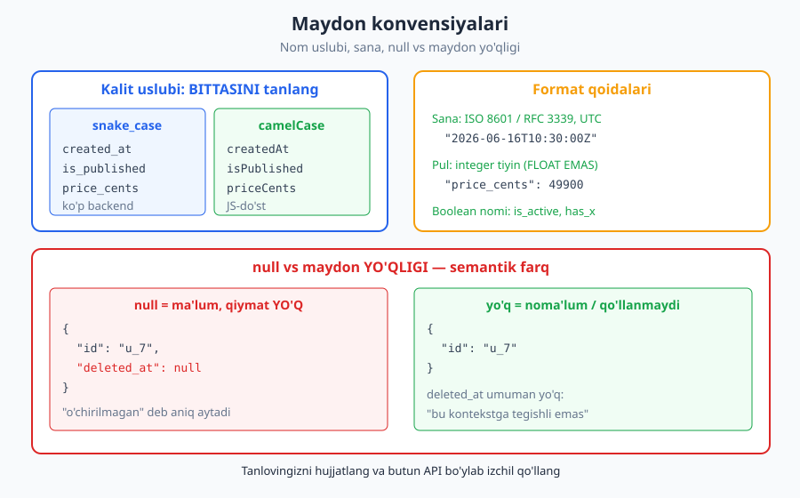
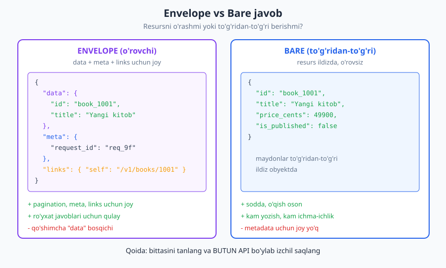

# 07 — So'rov va javob dizayni (payload)

[⬅️ Oldingi: 06 — Resurs modellashtirish va URI dizayni](./06-resurs-uri-dizayni.md) · [🏠 README](./README.md) · [Keyingi: 08 — Sahifalash, filtrlash, saralash, qidiruv ➡️](./08-sahifalash-filtrlash.md)

---

> **Bu bobda:** So'rov (request) va javob (response) tanasi — *payload* — qanday loyihalanadi. JSON konvensiyalari, maydon nomlash, sana/pul/enum formatlari, `null` vs maydon yo'qligi, envelope vs bare yondashuvlar, xavfsiz so'rov body dizayni (mass assignment), va ichki obyekt (embed) vs havola (reference) trade-off'ini ko'rib chiqamiz.
>
> **Halollik / Eslatma:** JSON struktura va data turlari RFC 8259 ga, sana formati ISO 8601 / RFC 3339 ga asoslanadi; xavfsizlik nuqtalari OWASP API Security Top 10 (2023) ga ishora qiladi. Barcha JSON namunalari valid sintaksisda tekshirilgan. Lekin "snake_case yoki camelCase", "envelope yoki bare", "embed yoki reference" kabi qarorlar **mutlaq qoida emas** — kontekstga bog'liq trade-off'lar. Standartlar versiyasi vaqt bilan o'zgaradi.

---

## Payload nima va nega muhim

Tasavvur qiling, pochta orqali xat yuboryapsiz. **Konvert** — bu metadata: kimga, qaysi manzilga, qaysi marka bilan. **Xatning matni** — bu asosiy yuk, ya'ni *payload*. HTTP'da ham xuddi shunday: sarlavhalar (headers) — konvert, **body** esa payload — so'rov yoki javobning haqiqiy mazmuni.

API dizaynida payload deganda odatda **so'rov yoki javob body'sidagi tuzilgan ma'lumot** tushuniladi — bugungi web API'larda bu deyarli har doim **JSON** ([JavaScript Object Notation](../arxitektura/README.md)). Mijoz serverga "yangi kitob yarat" deganda, kitobning maydonlari (sarlavha, narx) so'rov payload'ida ketadi. Server "mana yaratilgan kitob" deganda, to'liq resurs javob payload'ida qaytadi.

Nega bu shunchalik muhim? Chunki payload — bu sizning API'ngiz bilan ishlaydigan har bir dasturchi **ko'radigan** va **kod yozadigan** narsa. URI dizayni bir marta ko'riladi; payload har bir so'rovda parse qilinadi. Yomon payload dizayni har bir integratsiyani og'irlashtiradi.

Yaxshi payload dizaynining uchta belgisi bor:

- **Izchil (consistent):** bir maydon hamma joyda bir xil nomlanadi, bir xil formatda bo'ladi. `created_at` bir endpointda `createdAt` bo'lib qolmaydi.
- **Bashorat qilinadigan (predictable):** bitta resursni ko'rgan dasturchi qolganini ham taxmin qila oladi. "Demak sana har doim ISO 8601, pul har doim integer" deb ishonadi.
- **Evolyutsiyaga chidamli (evolvable):** yangi maydon qo'shilganda eski mijozlar sinmaydi. Bu [versiyalash](./10-versiyalash.md) bilan chambarchas bog'liq.



> **Eslatma:** Bu bobda misollar JSON'da. Ammo printsiplar formatdan mustaqil — XML, Protocol Buffers ([gRPC](./18-grpc.md)) yoki MessagePack ishlatsangiz ham "izchil nomlash", "null semantikasi", "server maydonini mijozdan qabul qilmaslik" qoidalari bir xil qoladi.

---

## JSON konvensiyalari (RFC 8259)

JSON juda kichik standart — uni butunlay tushunish mumkin. RFC 8259 ga ko'ra JSON faqat olti turdagi qiymatni biladi:

| Tur | Misol | Izoh |
|---|---|---|
| string | `"salom"` | Unicode, qo'shtirnoq ichida |
| number | `42`, `-1`, `3.14`, `49900` | integer/float ajratilmaydi — bitta `number` turi |
| boolean | `true`, `false` | faqat ikki qiymat |
| null | `null` | "qiymat yo'q" |
| array | `[1, 2, 3]` | tartiblangan ro'yxat |
| object | `{"k": "v"}` | kalit-qiymat juftliklar |

Bu yerda muhim nuance bor: **JSON'da integer va float farqi yo'q** — ikkalasi ham `number`. Bu ko'p tilda muammo tug'diradi: `0.1 + 0.2` ko'p tilda `0.30000000000000004` chiqadi (IEEE 754 float). Shuning uchun **puldek aniqlik talab qiladigan qiymatni hech qachon float saqlamang** — bu haqda pastda batafsil.

### Eng muhim qoida: bitta kalit konvensiyasi tanlang

Bu — payload dizaynidagi **eng muhim developer experience (DX) qoidasi**. JSON kalitlari uchun ikki keng tarqalgan uslub bor:

- **`snake_case`** — `created_at`, `is_published`, `price_cents`. Python, Ruby, ko'p backend ekotizimida tabiiy; ko'p ma'lumotlar bazasi ustunlari ham shunday.
- **`camelCase`** — `createdAt`, `isPublished`, `priceCents`. JavaScript/TypeScript dunyosida tabiiy; brauzer mijozlari uchun qulay.



**Qaysi biri to'g'ri?** Ikkalasi ham to'g'ri. Yagona muhim narsa — **bittasini tanlang va BUTUN API bo'ylab izchil saqlang**. Bitta API'da `created_at` va `lastModified` aralashib ketsa, har bir dasturchi har bir maydonni eslab qolishi kerak bo'ladi — bu og'riq.

> **Trade-off:** Agar API'ngiz asosan JavaScript frontend'lar tomonidan iste'mol qilinsa, `camelCase` qo'shimcha konvertatsiyani kamaytiradi. Agar serverdan-serverga, ko'p tilli iste'molchilar bo'lsa, `snake_case` ham yaxshi. Public API'larda `snake_case` biroz ko'proq uchraydi (Stripe, GitHub aralash ishlatadi), lekin bu didga bog'liq. **Tanlovingizni [hujjatlang](./22-hujjatlash-dx.md)** va undan og'ishmang.

> **Anti-pattern:** Bir API ichida uslublarni aralashtirish (`user_id` lekin `firstName`). Bu eng ko'p uchraydigan izchillik buzilishi — har bir maydon nomi endi alohida eslab qolinadigan narsaga aylanadi.

---

## Maydon dizayni: nomlash va turlar

Maydon nomi — bu mikro-API. Yaxshi nom o'zini o'zi tushuntiradi; yomon nom hujjatga murojaat qildiradi.

### Aniq, tavsiflovchi nomlar

- **Qisqartmalardan saqlaning** agar ular umumiy bo'lmasa. `usr_nm` emas, `username`. `dob` emas, `birth_date` (DOB ko'pchilik uchun aniq emas). `id`, `url`, `api` kabi keng qabul qilingan qisqartmalar — ma'qul.
- **Maydon nimani anglatishini aytsin.** `amount` emas — `amount` nimaning? `total_amount_cents` aniqroq. `date` emas — `published_at`, `expires_at`.
- **Birlik/o'lchovni nomga qo'shing** noaniqlikni yo'qotish uchun: `timeout_ms`, `file_size_bytes`, `price_cents`. "30" o'zi soniyami, millisekundmi? Nom aytib bersin.

### Boolean nomlash

Boolean'larni `is_`, `has_`, `can_` prefiksi bilan nomlang: `is_active`, `has_subscription`, `can_edit`. Bu kod o'qiganda tabiiy o'qiladi va qiymat boolean ekanini darrov bildiradi.

```json
{
  "id": "user_42",
  "username": "oqil",
  "is_active": true,
  "has_verified_email": false
}
```

> **Diqqat:** Boolean'ni ikki holatdan ortiq narsa uchun ishlatmang. `is_deleted: false` bugun yetarli ko'rinadi, lekin ertaga "arxivlangan", "muzlatilgan" holatlar kerak bo'lsa, sizga `status: "active"` (enum) kerak bo'ladi. Boolean bir tomonlama eshik — kelajakni o'ylab tanlang.

### Sana va vaqt: ISO 8601 / RFC 3339, UTC

Vaqtni **har doim** mashina o'qiy oladigan, bir ma'noli formatda bering: **ISO 8601 / RFC 3339**, UTC mintaqasida (`Z` suffiksi):

```json
{
  "created_at": "2026-06-16T10:30:00Z",
  "expires_at": "2026-12-31T23:59:59Z",
  "birth_date": "1998-04-25"
}
```

- To'liq vaqt momenti: `2026-06-16T10:30:00Z` — `Z` "Zulu/UTC" degani. Mahalliy ofset kerak bo'lsa: `2026-06-16T15:30:00+05:00`.
- Faqat sana (vaqtsiz): `1998-04-25` (vaqt zonasi ma'nosiz bo'lganda, masalan tug'ilgan kun).

> **Anti-pattern:** Vaqtni `"16/06/2026"` (mahalliy), `"June 16, 2026"` yoki Unix timestamp'ni har xil joyda turlicha berish. `16/06` — bu 16-iyunmi yoki yo'qmi? Amerikada `06/16` boshqacha o'qiladi. ISO 8601 bu noaniqlikni butunlay yo'qotadi. Vaqtni serverda **doim UTC** saqlang, ko'rsatishni mijozga qoldiring.

### Pul: integer (eng kichik birlik) yoki string — FLOAT EMAS

Bu — eng ko'p qilingan xato. **Pulni hech qachon JSON `number` (float) sifatida saqlamang.** Sabab: float aniqlik yo'qotadi (`0.1 + 0.2 != 0.3`), va moliyaviy hisobda bu fojiaga olib keladi.

Ikki to'g'ri yondashuv:

```json
{
  "price_cents": 49900,
  "currency": "UZS"
}
```

yoki katta/o'nlik aniqlik kerak bo'lsa, string sifatida:

```json
{
  "price": "499.00",
  "currency": "UZS"
}
```

- **integer (eng kichik birlik):** `price_cents: 49900` = 499.00. Hech qanday float yo'q, oddiy butun son arifmetikasi. Stripe shu yondashuvni ishlatadi.
- **string:** `"499.00"` — mijoz uni decimal kutubxonaga beradi, float'ga aylantirmaydi. Juda katta yoki o'nlik raqamli valyutalar uchun.
- **Valyutani har doim alohida bering** (`currency: "UZS"`, ISO 4217 kodi). 49900 o'zi UZS'mi, USD'mi — aytib bo'lmaydi.

> **Diqqat:** `price_cents` deyarli barcha valyutada ishlamaydi — ba'zi valyutalarda mayda birlik yo'q yoki uch xona (masalan dinar). Shuning uchun "eng kichik birlik" deb umumlashtirish to'g'riroq, va `currency` bilan birga uzatish shart.

### Enum qiymatlari: string, izchil

Cheklangan to'plamdagi qiymatlar (status, tur) uchun **string enum** ishlating, integer kod emas:

```json
{
  "id": "order_1001",
  "status": "pending",
  "payment_method": "card"
}
```

`"status": 2` emas — `"status": "pending"`. String o'zini tushuntiradi (`2` nima? hujjatga qarash kerak). Enum qiymatlarini ham izchil yozing: hammasi `lower_snake` yoki hammasi `UPPER` — aralashtirmang. Yangi qiymat qo'shilishi mumkinligini hisobga oling — mijoz noma'lum enum qiymatini "graceful" qabul qilsin (xato bermasin).

### ID turlari: string vs number

ID'ni **string** sifatida berishni ko'p hollarda afzal ko'ring, hatto u ichkarida raqam bo'lsa ham:

```json
{ "id": "1001" }
```

Sabablari: (1) katta raqamli ID JavaScript'da `Number.MAX_SAFE_INTEGER` (2^53) dan oshib aniqlikni yo'qotishi mumkin — string bunday emas; (2) kelajakda ID formatini UUID yoki prefiksli ID'ga (`user_1001`, `order_42`) o'zgartirsangiz, mijoz kodi sinmaydi. Prefiksli ID'lar (Stripe uslubi: `cus_`, `ch_`) tur xatosini ham kamaytiradi.

---

## `null` vs maydon yo'qligi — semantik farq

Bu nozik, lekin muhim. JSON'da maydonni bermaslik mumkin, yoki uni `null` qilib berish mumkin — bular **bir xil emas**:

- **`"deleted_at": null`** — maydon mavjud, lekin qiymati yo'q. Ma'nosi: "*biz bilamiz*: bu element o'chirilmagan". Qiymat aniq, u — "yo'qlik".
- **`deleted_at` umuman yo'q** — maydon javobda berilmagan. Ma'nosi odatda: "*noma'lum*", "qo'llanmaydi", yoki "bu kontekstda yuborilmaydi".

```json
{
  "id": "user_7",
  "name": "Oqil",
  "deleted_at": null
}
```

Bu yerda `deleted_at: null` "foydalanuvchi faol, o'chirilmagan" deb **aniq** aytadi. Agar `deleted_at` butunlay yo'q bo'lsa, mijoz "balki bu endpoint o'chirish vaqtini umuman bilmasa kerak" deb taxmin qiladi.

**Qaysi birini tanlash kerak?** Asosiy qoida — **izchil bo'ling**:

- Agar maydon resursning doimiy qismi bo'lsa, uni **doimo bering** — bo'sh bo'lsa `null` bilan. Bu mijoz kodini soddalashtiradi (maydon har doim mavjud deb ishonadi).
- Agar maydon haqiqatan kontekstga bog'liq bo'lsa (masalan `?fields=` bilan [sparse fieldset](./08-sahifalash-filtrlash.md), yoki ruxsatga qarab), uni **yo'qligi** ma'noli bo'ladi.

> **Trade-off:** "Doimo `null` bilan to'ldirish" payload'ni biroz kattalashtiradi, lekin mijoz uchun bashorat qilinadiganlikni oshiradi. "Bo'sh maydonni tushirib qoldirish" payload'ni kichiklashtiradi, lekin mijoz har bir maydonni `if (x !== undefined)` bilan tekshirishga majbur bo'ladi. Public API'lar uchun ko'pincha **doimo to'ldirish** afzal — kamroq syurpriz.

### PATCH'da farq kritik bo'ladi

[Qisman yangilash (PATCH)](./06-resurs-uri-dizayni.md) so'rovida bu farq hal qiluvchi ahamiyatga ega:

```json
{ "nickname": null }
```

Bu "nickname'ni *tozala* (bo'shat)" degani. Agar `nickname` so'rovda **berilmasa**, bu "nickname'ga tegma" degani. Ya'ni PATCH'da `null` va "yo'qlik" butunlay boshqa amal. Buni hujjatda aniq bayon eting.

---

## Envelope vs bare: javobni o'rashmi?

Resursni qaytarayotganda ikki yondashuv bor.

**Bare** — resursni to'g'ridan-to'g'ri body ildizida bering:

```json
{
  "id": "book_1001",
  "title": "API dizayni",
  "price_cents": 49900,
  "is_published": false
}
```

**Envelope** — resursni o'rovchi obyekt ichiga joylang, `data` (yoki shunga o'xshash) kalit ostida, qo'shimcha `meta`/`links` bilan:

```json
{
  "data": {
    "id": "book_1001",
    "title": "API dizayni"
  },
  "meta": {
    "request_id": "req_9f3a"
  },
  "links": {
    "self": "/v1/books/book_1001"
  }
}
```



| Mezon | Bare | Envelope |
|---|---|---|
| Soddalik | ✅ eng sodda, kam yozish | ➖ qo'shimcha `data` bosqichi |
| Metadata uchun joy | ❌ yo'q | ✅ `meta`, `links`, pagination |
| Ro'yxat javobi | ➖ pagination'ni qayerga? | ✅ tabiiy joy bor |
| Xato bilan birxillik | ➖ | ✅ xato ham `{"error": ...}` shaklida |
| Mijoz tomoni | ✅ `res.title` | ➖ `res.data.title` |

> **Trade-off:** Yagona resurs uchun **bare** sodda va o'qish oson. Ammo **ro'yxat (collection)** javoblarida envelope deyarli shart — chunki sahifalash metadatasi (`total`, `next` havola) qayoqqadir kerak, va massiv ildizida (`[...]`) bunday joy yo'q. Ko'p jamoa shuning uchun **butun API'ni envelope'ga o'tkazadi** (yagona resurs ham, ro'yxat ham) — izchillik uchun. Eng yomon variant — aralashtirib, ba'zi endpoint envelope, ba'zisi bare bo'lishi.

Ro'yxat javobida envelope odatda shunday ko'rinadi (sahifalash maydonlari [08-bobda](./08-sahifalash-filtrlash.md)):

```json
{
  "data": [
    { "id": "book_1001", "title": "API dizayni" },
    { "id": "book_1002", "title": "REST chuqur" }
  ],
  "meta": {
    "total": 124,
    "page": 1,
    "per_page": 2
  },
  "links": {
    "self": "/v1/books?page=1",
    "next": "/v1/books?page=2"
  }
}
```

> **Standart:** Agar envelope tanlamasangiz ham, sahifalash uchun [`Link` sarlavhasi (RFC 8288)](./08-sahifalash-filtrlash.md) bilan `rel="next"` berish mumkin — body'ni bare qoldirib, metadatani header'ga olib chiqish. Bu ham legitim trade-off.

---

## So'rov body dizayni — faqat kerakli, xavfsiz

Javob to'liq resursni qaytaradi; lekin **so'rov body'si boshqacha** — u faqat *mijoz boshqaradigan* maydonlarni o'z ichiga olishi kerak.

### Server boshqaradigan maydonlarni MIJOZDAN qabul qilmang

`id`, `created_at`, `updated_at`, `owner_id` kabi maydonlarni **server** belgilaydi. Mijoz ularni so'rovda yuborsa, e'tiborsiz qoldiring (yoki rad eting) — **hech qachon ko'r-ko'rona qabul qilmang**.

To'g'ri so'rov (faqat mijoz beradigan maydonlar):

```http
POST /v1/books HTTP/1.1
Host: api.example.com
Content-Type: application/json
Authorization: Bearer <token>

{"title": "API dizayni", "price_cents": 49900, "is_published": false}

HTTP/1.1 201 Created
Location: /v1/books/book_1001
Content-Type: application/json

{"id": "book_1001", "title": "API dizayni", "price_cents": 49900, "is_published": false, "created_at": "2026-06-16T10:30:00Z"}
```

E'tibor bering: mijoz `id` va `created_at` **yubormadi** — ularni server qo'shdi va javobda qaytardi.

### Mass assignment / BOPLA xavfi

Agar serverda barcha kelgan maydonlarni ko'r-ko'rona modelga "to'kib tashlasangiz" (mass assignment), hujumchi **ruxsat etilmagan maydonni** qo'shib yuborishi mumkin:

```json
{
  "title": "Oddiy kitob",
  "is_admin": true,
  "owner_id": "victim_99"
}
```

Agar server `is_admin` yoki `owner_id` ni so'roqsiz qabul qilsa — bu **xavfsizlik teshigi**. Bu OWASP API Security Top 10 (2023) dagi **API3: Broken Object Property Level Authorization (BOPLA)** ga to'g'ri keladi (mass assignment uning bir ko'rinishi). Himoya: serverda **allowlist** ishlating — faqat aniq ruxsat etilgan maydonlarni o'qing, qolganini tashlang. Buni [xavfsizlik bobida](./13-api-xavfsizligi.md) chuqurroq ko'rib chiqamiz.

> **Xavfsizlik:** Hech qachon "kelgan butun JSON'ni modelga bind qilish" qulayligiga aldanmang. Har bir endpoint uchun *qaysi maydonlarni mijoz o'zgartira oladi* degan aniq ro'yxat tuzing. Yaratish (POST) va yangilash (PATCH/PUT) uchun bu ro'yxatlar har xil bo'lishi mumkin.

### PUT vs PATCH body'si

- **PUT** — resursning **to'liq** yangi holatini yuboradi (almashtirish). Agar maydonni tushirib qoldirsangiz, u "default/null bo'lsin" deb talqin qilinadi (RFC 9110: PUT — to'liq almashtirish).
- **PATCH** ([RFC 5789](./06-resurs-uri-dizayni.md)) — faqat **o'zgaradigan** maydonlarni yuboradi (qisman). Yuqorida ko'rganimizdek, `null` va "yo'qlik" PATCH'da har xil ma'no beradi.

```http
PATCH /v1/books/book_1001 HTTP/1.1
Host: api.example.com
Content-Type: application/json
Authorization: Bearer <token>

{"is_published": true}

HTTP/1.1 200 OK
Content-Type: application/json

{"id": "book_1001", "title": "API dizayni", "price_cents": 49900, "is_published": true, "created_at": "2026-06-16T10:30:00Z"}
```

PATCH so'rovi faqat o'zgartirilayotgan `is_published` ni yubordi — qolgan maydonlarga tegmadi.

---

## Katta va ulashgan ma'lumot: embed vs reference

Bir resurs boshqasiga bog'liq bo'lganda (kitob → muallif), ikki yondashuv bor.

**Reference (havola)** — faqat bog'langan resursning ID'sini bering; mijoz kerak bo'lsa alohida so'rov qiladi:

```json
{
  "id": "book_1001",
  "title": "API dizayni",
  "author_id": "author_42"
}
```

**Embed (ichki joylash)** — bog'langan resursni (yoki uning bir qismini) to'g'ridan-to'g'ri ichiga joylang:

```json
{
  "id": "book_1001",
  "title": "API dizayni",
  "author": {
    "id": "author_42",
    "name": "Oqil Imomnazarov"
  }
}
```

| Mezon | Reference (faqat ID) | Embed (ichki obyekt) |
|---|---|---|
| So'rovlar soni | ➖ ko'proq (N+1 xavfi) | ✅ bitta so'rov yetadi |
| Payload hajmi | ✅ kichik | ➖ kattaroq (over-fetching) |
| Yangilik | ✅ doim eng yangi | ➖ ko'chirilgan nusxa eskirishi mumkin |
| Mijoz qulayligi | ➖ qo'shimcha so'rov | ✅ darrov tayyor |

> **Trade-off:** Embed **over-fetching** (kerakmas ma'lumot tashish) xavfini, reference esa **under-fetching / N+1** (har bir element uchun yana so'rov) xavfini keltiradi. Yechim ko'pincha — **moslashuvchanlik berish:** standart holatda yengil javob, lekin `?include=author` yoki [`?fields=` sparse fieldsets](./08-sahifalash-filtrlash.md) bilan mijoz nimani embed qilishni so'rasin. [GraphQL](./17-graphql.md) bu muammoni butunlay boshqacha — mijoz aniq kerakli maydonlarni so'raydi — hal qiladi.

Amalda ko'p REST API "sayoz embed" qiladi: bog'langan obyektning **ID va bir-ikki asosiy maydoni** (masalan `author.name`) ni beradi, to'liq obyektni emas. Bu over-fetching'ni cheklab, mijozni har safar ikkinchi so'rovdan qutqaradi.

---

## Izchillik — butun API bo'ylab

Yuqoridagi barcha qarorlar bitta meta-printsipga olib keladi: **izchillik**. Konkret tanlovingiz (snake yoki camel, envelope yoki bare) ikkinchi darajali; uni **hamma joyda bir xil** qo'llash birinchi darajali.

Izchillik checklisti:

- **Bitta kalit uslubi** — barcha endpointda `snake_case` *yoki* `camelCase`.
- **Bitta sana formati** — barcha vaqt maydonlari ISO 8601 / RFC 3339, UTC.
- **Bitta pul ko'rinishi** — hamma joyda integer eng-kichik-birlik *yoki* string, har doim `currency` bilan.
- **Bitta o'rash strategiyasi** — hamma envelope *yoki* hamma bare (ro'yxatlar uchun envelope kuchli tavsiya).
- **Bitta ID ko'rinishi** — string (yoki number), barcha resursda bir xil.
- **Bitta xato shakli** — [09-bobdagi Problem Details](./09-xato-dizayni.md) kabi yagona xato strukturasi, har bir endpointda bir xil.

> **Eslatma:** Izchillikni qo'lda emas, **mashina bilan** ta'minlang. [OpenAPI](./21-openapi.md) schema'da umumiy komponentlar (`components/schemas`) yarating va ularni qayta ishlating; linter (masalan Spectral) bilan nomlash konvensiyasini avtomatik tekshiring. Inson xotirasi izchillikni saqlay olmaydi — vosita saqlaydi.

---

## Asosiy g'oyalar (bobni qisqacha)

- **Payload** — so'rov/javob body'sidagi tuzilgan ma'lumot (odatda JSON). Yaxshi payload: izchil, bashorat qilinadigan, evolyutsiyaga chidamli.
- **Bitta kalit konvensiyasi tanlang** (`snake_case` YOKI `camelCase`) va butun API bo'ylab izchil saqlang — bu eng muhim DX qoidasi.
- **Format qoidalari:** sana ISO 8601 / RFC 3339 UTC; pul integer (eng kichik birlik) yoki string + `currency`, **float emas**; enum string; ID afzal string; boolean `is_`/`has_` prefiks.
- **`null` ≠ maydon yo'qligi.** `null` = "ma'lum, qiymat yo'q"; yo'qlik = "noma'lum/qo'llanmaydi". PATCH'da bu farq kritik.
- **Envelope vs bare:** bare sodda; envelope `meta`/`links`/pagination uchun joy beradi. Ro'yxatlar uchun ko'pincha envelope. Izchil bo'ling.
- **So'rov body** faqat mijoz boshqaradigan maydonlarni o'z ichiga olsin; `id`/`created_at` kabi server maydonlarini **mijozdan qabul qilmang** (mass assignment / BOPLA — OWASP API3).
- **Embed vs reference:** embed over-fetching, reference under-fetching/N+1 xavfini beradi; moslashuvchanlik (`?include=`, sparse fieldsets) ko'pincha yaxshi yechim.
- **Izchillikni vosita bilan** ta'minlang: umumiy OpenAPI schema komponentlari + linter.

---

## Mashqlar

### Oson

**1-mashq.** Quyidagi maydon nomlaridan qaysilari yaxshi, qaysilari yomon? Yomonlarini tuzating va sababini ayting: `usrNm`, `is_active`, `dt`, `total_amount_cents`, `flag`.

**2-mashq.** Quyidagi sana qiymatlarini to'g'ri formatga (ISO 8601 / RFC 3339, UTC) keltiring: `"16/06/2026"`, `"June 16, 2026 1:30 PM"`, `1718533800` (Unix sekund).

**3-mashq.** Quyidagi narx maydoni nima sababdan xavfli, va uni qanday tuzatasiz?
```json
{ "price": 499.99 }
```

### O'rta

**4-mashq.** "Maqola" (article) resursi uchun javob payload'ini loyihalang. Quyidagilar bo'lsin: ID, sarlavha, matn, holat (qoralama/chop etilgan), chop etilgan vaqt (hali chop etilmagan bo'lishi mumkin), muallif (ID va ism), teglar ro'yxati. Izchil snake_case ishlatib valid JSON yozing.

**5-mashq.** Bir API "yagona maqola" uchun bare, "maqolalar ro'yxati" uchun esa envelope qaytaryapti. Bu muammomi? Bitta izchil yondashuvni tanlab, ikkala javobni ham shu yondashuvda qayta yozing.

**6-mashq.** Foydalanuvchi profili javobida `phone` maydoni ba'zan `null`, ba'zan butunlay yo'q. Ikkala holat semantik jihatdan nimani anglatishi mumkin? Izchil dizayn uchun qaysi yondashuvni tavsiya qilasiz va nega?

### Qiyin

**7-mashq.** Quyidagi so'rov body'si mass-assignment xavfini o'z ichiga oladi. Xavfli maydonlarni aniqlang, server ularni qanday himoya qilishi kerakligini tushuntiring (qaysi OWASP API toifasi), va xavfsiz "yaratish" so'rovi qanday ko'rinishini yozing.
```json
{
  "title": "Mening postim",
  "owner_id": "user_777",
  "is_featured": true,
  "view_count": 999999
}
```

**8-mashq.** "Buyurtma" (order) resursi vaqt o'tishi bilan o'zgarib boradi: bugun unda `items` ro'yxati to'g'ridan-to'g'ri embed qilingan. Ertaga buyurtmalar juda katta bo'lishi mumkin (1000+ element). Embed vs reference trade-off'ini hisobga olib, **evolyutsiyaga chidamli** payload dizaynini taklif qiling — bugungi mijozlarni sindirmasdan kelajakda kattalashishga imkon beradigan.

**9-mashq.** Sizning API'ngiz `created_at` ni ba'zi endpointda `created_at`, boshqasida `createdAt`, yana birida `creation_time` deb qaytaradi. Bu nima muammoga olib keladi? Buni qanday tuzatasiz va kelajakda qaytalanmasligi uchun qanday **mashina-tekshiruvi** o'rnatasiz?

<details markdown="1">
<summary>Yechimlar</summary>

### 1-mashq yechimi
- `usrNm` — **yomon** (qisqartma + agar API snake_case bo'lsa, uslub buzilgan). → `username`.
- `is_active` — **yaxshi** (boolean `is_` prefiksi bilan, aniq).
- `dt` — **yomon** (mavhum qisqartma, nimaning sanasi?). → `created_at` yoki `published_at` — kontekstga qarab.
- `total_amount_cents` — **yaxshi** (tavsiflovchi, birlik `cents` nomda).
- `flag` — **yomon** (nimaning flagi? ma'nosiz). → masalan `is_enabled` yoki aniq holatni bildiruvchi nom.

### 2-mashq yechimi
- `"16/06/2026"` → `"2026-06-16"` (faqat sana) yoki vaqt kerak bo'lsa `"2026-06-16T00:00:00Z"`. Mahalliy `dd/mm` formati noaniq (16-iyunmi?), ISO buni yo'qotadi.
- `"June 16, 2026 1:30 PM"` → `"2026-06-16T13:30:00Z"` (UTC deb faraz qilsak; mahalliy bo'lsa ofset bilan, masalan `"2026-06-16T13:30:00+05:00"`).
- `1718533800` → uni ISO 8601 ga aylantiring. Unix timestamp ham ishlaydi, lekin inson o'qiy olmaydi va mintaqa noaniq; API javobida ISO afzal: masalan `"2024-06-16T10:30:00Z"`. (Asosiy nuqta: bitta format tanlang va izchil bo'ling.)

### 3-mashq yechimi
`499.99` JSON `number` (float) sifatida saqlanadi — float aniqlik yo'qotishi tufayli moliyaviy hisobda xavfli (`0.1 + 0.2 != 0.3`). Tuzatish — integer eng-kichik-birlik yoki string, va valyuta bilan:
```json
{ "price_cents": 49999, "currency": "UZS" }
```
yoki
```json
{ "price": "499.99", "currency": "UZS" }
```

### 4-mashq yechimi
```json
{
  "id": "article_501",
  "title": "API dizayni asoslari",
  "body": "Maqola matni...",
  "status": "draft",
  "published_at": null,
  "author": {
    "id": "author_42",
    "name": "Oqil Imomnazarov"
  },
  "tags": ["api", "rest", "design"]
}
```
E'tibor: `status` — string enum; `published_at` — hali chop etilmaganligi uchun `null` (maydon doimo mavjud — bashorat qilinadigan); `author` — sayoz embed (ID + ism); barcha kalitlar snake_case.

### 5-mashq yechimi
Ha, bu muammo — **izchillik buzilgan**. Mijoz yagona resursni `res.title`, ro'yxatni esa `res.data[0].title` orqali oladi — har bir endpoint uchun har xil shakl. Izchil yondashuv — **ikkalasini ham envelope** qilish (ro'yxat baribir envelope talab qiladi):
```json
{ "data": { "id": "article_501", "title": "API dizayni" } }
```
```json
{
  "data": [
    { "id": "article_501", "title": "API dizayni" }
  ],
  "meta": { "total": 1 }
}
```
Endi mijoz har doim `res.data` dan boshlaydi.

### 6-mashq yechimi
- **`"phone": null`** — "biz bilamiz: bu foydalanuvchining telefoni yo'q / kiritmagan". Qiymat aniq (yo'qlik).
- **`phone` yo'q** — "noma'lum", yoki "bu javobda telefon bermaymiz" (masalan ruxsat yo'q, yoki sparse fieldset). Mijoz nima xulosa qilishni bilmaydi.

Tavsiya: agar `phone` profil resursning doimiy qismi bo'lsa, uni **doimo bering** — bo'lmasa `null` bilan. Bu mijozni `if (user.phone === undefined)` tekshiruvidan qutqaradi va bashorat qilinadiganlikni oshiradi. "Yo'qlik" ni faqat sparse fieldset (`?fields=`) yoki ruxsat asosida filterlash kabi *ataylab* holatlar uchun qoldiring.

### 7-mashq yechimi
Xavfli maydonlar: `owner_id` (hujumchi boshqa foydalanuvchini egasi qilib qo'yishi mumkin), `is_featured` (faqat admin/server qaror qilishi kerak), `view_count` (bu server hisoblaydigan statistika — mijoz uni soxtalashtirishi mumkin). Bu **OWASP API3: Broken Object Property Level Authorization (BOPLA)** — mass assignment uning ko'rinishi.

Himoya: serverda **allowlist** — faqat ruxsat etilgan maydonlarni o'qing (`title`, ehtimol `body`, `tags`), qolganini tashlang. `owner_id` ni **autentifikatsiya tokenidan** oling, body'dan emas. `is_featured`/`view_count` ni faqat server boshqarsin.

Xavfsiz "yaratish" so'rovi:
```json
{ "title": "Mening postim", "body": "Matn...", "tags": ["api"] }
```
Server javobi `owner_id` ni token'dan, `is_featured: false` va `view_count: 0` ni o'zi qo'shadi.

### 8-mashq yechimi
Bugungi mijozlarni sindirmaslik uchun mavjud embed'ni butunlay olib tashlash mumkin emas (breaking change — [versiyalash](./10-versiyalash.md)). Evolyutsiyaga chidamli yondashuv:

1. **Standart holatda yengil javob ber:** to'liq `items` o'rniga qisqacha xulosa (`items_count`, balki dastlabki bir nechta element) + `items` resursiga havola:
   ```json
   {
     "id": "order_1001",
     "status": "paid",
     "items_count": 1240,
     "items_url": "/v1/orders/order_1001/items"
   }
   ```
2. **Moslashuvchanlik qo'sh:** mijoz to'liq embed xohlasa, `?include=items` bilan so'rasin (kichik buyurtmalar uchun qulay).
3. **`items` ni o'zini sahifalanadigan** alohida sub-kolleksiya qil (`/orders/{id}/items` — [08-bob](./08-sahifalash-filtrlash.md)), shunda 1000+ element ham xavfsiz uzatiladi.

Bu reference'ga moyil dizayn under-fetching beradi, lekin `?include=` orqali embed imkonini saqlab, over-fetching va katta payload muammosini hal qiladi.

### 9-mashq yechimi
Muammo: **izchillik buzilgan** — bir tushuncha (yaratilish vaqti) uch xil nomda. Har bir dasturchi har bir endpoint uchun nomni eslab qolishi kerak; mijoz kodi mo'rt bo'ladi; bug'lar ko'payadi.

Tuzatish: bitta kanonik nom tanlang (masalan `created_at`) va hamma joyda shunga keltiring. Eski nomlarni olib tashlash breaking change bo'lgani uchun, [versiyalash](./10-versiyalash.md)/deprecation rejasini qo'llang (eski nomni vaqtincha qoldirib, deprecated belgilab).

Kelajakda qaytalanmaslik uchun **mashina-tekshiruvi**: [OpenAPI](./21-openapi.md) schema'da umumiy `Timestamps` komponentini yarating va qayta ishlating; CI'da **linter** (masalan Spectral) bilan qoida o'rnating — barcha sana maydonlari snake_case va `_at` bilan tugashi shart. Inson xotirasi emas, vosita izchillikni saqlaydi.

</details>

---

[⬅️ Oldingi: 06 — Resurs modellashtirish va URI dizayni](./06-resurs-uri-dizayni.md) · [🏠 README](./README.md) · [Keyingi: 08 — Sahifalash, filtrlash, saralash, qidiruv ➡️](./08-sahifalash-filtrlash.md)
