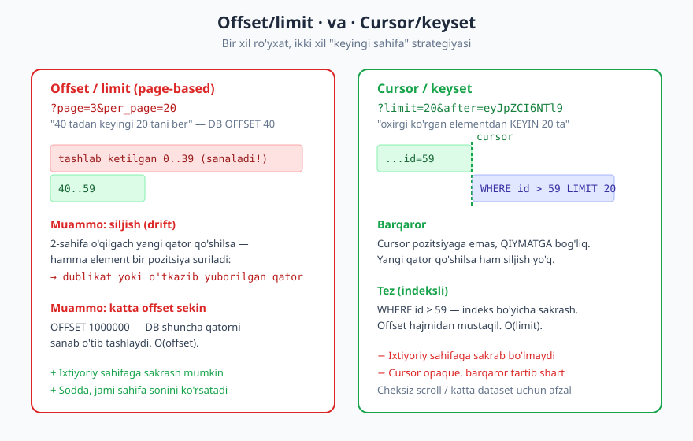
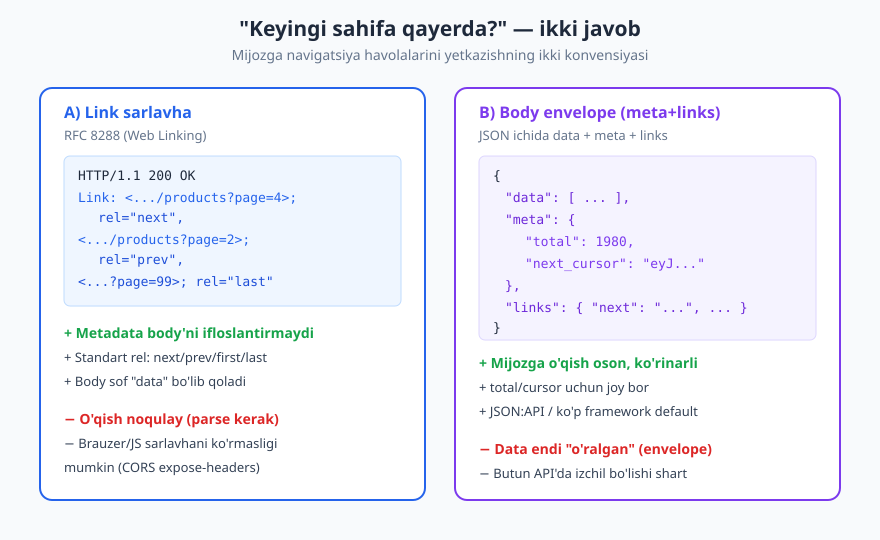
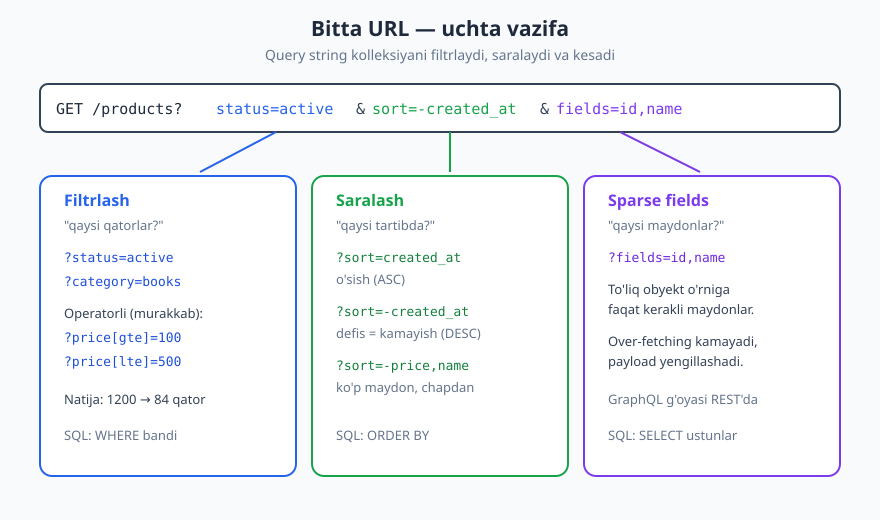

# 08 — Sahifalash, filtrlash, saralash, qidiruv

[⬅️ Oldingi: 07 — So'rov va javob dizayni (payload)](./07-sorov-javob-payload.md) · [🏠 README](./README.md) · [Keyingi: 09 — Xatolarni dizayn qilish ➡️](./09-xato-dizayni.md)

---

> **Bu bobda:** kolleksiya endpointlarini — ya'ni ko'p element qaytaradigan `GET /products` kabi yo'llarni — boshqarishni o'rganamiz. To'rtta vositani ko'rib chiqamiz: sahifalash (pagination), filtrlash, saralash va qidiruv, ustiga sparse fieldsets. Offset va cursor strategiyalarini chuqur taqqoslaymiz, havolalarni mijozga yetkazishning ikki usulini (Link sarlavha va body envelope) ko'ramiz, hammasini bitta izchil query dizayniga birlashtiramiz.
>
> **Halollik / Eslatma:** metodlar va status kodlar RFC 9110 ga, `Link` sarlavha RFC 8288 ga asoslangan. Query parametr nomlari (`page`, `sort`, `fields`, `filter`) RFC tomonidan belgilanmagan — bular sanoat konvensiyalari (GitHub, Stripe, JSON:API kabi), shuning uchun bularni "majburiy standart" emas, "keng tarqalgan amaliyot" sifatida qabul qiling. Barcha JSON namunalar valid; standartlar va de-fakto konvensiyalar vaqt o'tib o'zgarishi mumkin.

---

## Muammo: katta kolleksiyani qaytarib bo'lmaydi

Tasavvur qiling, ombor ma'lumotlar bazasida 2 million mahsulot bor va mijoz `GET /products` so'rovini yuboradi. Agar siz hammasini bitta javobda bersangiz:

- Javob **og'ir** bo'ladi — yuzlab megabayt JSON. Tarmoq, xotira, serializatsiya — hammasi cho'kadi.
- So'rov **sekin** bo'ladi — DB butun jadvalni o'qishi, server hammasini JSON'ga aylantirishi kerak.
- Mijoz **deyarli hammasini ishlatmaydi** — ekranga 20-50 ta qator sig'adi xolos.
- Bitta og'ir so'rov serverni **band qiladi** va boshqa mijozlarga xizmat ko'rsatishni sekinlashtiradi (resurs iste'moli — OWASP API4 "Unrestricted Resource Consumption").

Yechim: kolleksiyani **bo'laklab** berish va mijozga "menga aynan nima kerak" deyishga imkon yaratish. Bu to'rtta savolga javob beradi:

| Savol | Vosita | Misol |
|---|---|---|
| Nechtadan-nechtagacha? | **Sahifalash** | `?page=2&per_page=20` |
| Qaysi qatorlar? | **Filtrlash** | `?status=active` |
| Qaysi tartibda? | **Saralash** | `?sort=-created_at` |
| Qaysi so'z bo'yicha? | **Qidiruv** | `?q=qalam` |
| Qaysi maydonlar? | **Sparse fields** | `?fields=id,name` |

Bularning hammasi **query string** orqali ifodalanadi — chunki ular resursni o'zgartirmaydi, balki **bir xil kolleksiyaning ko'rinishini** sozlaydi. Yo'l (`/products`) "nima"ni, query "qaysi qismini va qanday"ni aytadi. Endi har birini ketma-ket chuqurlashtiramiz.

---

## Sahifalash (pagination)

Sahifalash — eng muhim qism, chunki "hammasini berma" muammosini bevosita hal qiladi. Ikki asosiy yondashuv bor va ular orasidagi tanlov jiddiy trade-off.



### Offset / limit (page-based)

Eng tanish usul — kitobning sahifalari kabi. "40 tadan keyingi 20 tani ber":

```http
GET /products?offset=40&limit=20 HTTP/1.1
Host: api.example.com
Accept: application/json
```

Yoki ko'pincha qulayroq "sahifa" tilida ifodalanadi (`offset = (page - 1) * per_page`):

```http
GET /products?page=3&per_page=20 HTTP/1.1
Host: api.example.com
Accept: application/json
```

Server tomonida bu odatda to'g'ridan-to'g'ri SQL'ga tushadi:

```
SELECT * FROM products ORDER BY id LIMIT 20 OFFSET 40;
```

**Afzalligi:** sodda, intuitiv. Mijoz istalgan sahifaga **sakrab** o'tishi mumkin (`?page=99`). Jami sahifa sonini hisoblab ko'rsatish oson ("99 sahifadan 3-si").

**Lekin ikkita jiddiy muammosi bor:**

**1. Katta offset sekin.** `OFFSET 1000000` — ma'lumotlar bazasi birinchi million qatorni **sanab o'tib tashlashi** kerak, faqat keyin keraklisini olishi mumkin. Bu O(offset) — offset qancha katta bo'lsa, shuncha sekin. Chuqur sahifalar (10000-sahifa) o'rmalab qoladi.

**2. Siljish (drift).** Sahifalash davomida ma'lumot o'zgarsa muammo paydo bo'ladi. Aytaylik, siz `created_at` bo'yicha kamayish tartibida 1-sahifani o'qidingiz (eng yangi 20 ta). Shu payt **yangi mahsulot qo'shildi**. Endi 2-sahifani (`offset=20`) so'rasangiz, hamma element bir pozitsiya pastga surilgan — siz 1-sahifaning oxirgi elementini **yana ko'rasiz** (dublikat). Aksincha, element o'chirilsa — bir qatorni **o'tkazib yuborasiz**.

> **Diqqat:** drift — nazariy emas, real muammo. Faol o'sib turgan ro'yxatda (yangiliklar, loglar, buyurtmalar) offset sahifalash mijozga dublikat yoki yo'qolgan qatorlarni ko'rsatadi. Bu, ayniqsa, "cheksiz scroll" UI'da seziladi.

> **Trade-off:** offset/limit — kichik, sekin o'zgaradigan kolleksiyalar uchun yetarli va sodda. Admin panellar, sahifa raqamlari kerak bo'lgan joylar uchun yaxshi. Lekin katta yoki tez-tez o'zgaradigan datasetlar uchun emas.

### Cursor / keyset-based

Cursor sahifalash boshqa savol beradi: "**oxirgi ko'rganingdan keyin** 20 tani ber". Pozitsiyaga (40-qator) emas, **qiymatga** (oxirgi ko'rilgan element) tayanadi:

```http
GET /products?limit=20&after=eyJpZCI6NTl9 HTTP/1.1
Host: api.example.com
Accept: application/json
```

Bu yerda `after` — **cursor**: oxirgi qaytarilgan elementning pozitsiyasini bildiruvchi opaque (mijoz uchun "qora quti") token. Ko'pincha bu Base64'ga kodlangan kichik JSON bo'ladi — masalan `{"id":59}` (`eyJpZCI6NTl9` aynan shuning Base64'i). Server uni dekodlab, SQL'ga aylantiradi:

```
SELECT * FROM products WHERE id > 59 ORDER BY id LIMIT 20;
```

**Nega bu barqaror?** Chunki `WHERE id > 59` — pozitsiyaga emas, qiymatga bog'liq. Yangi qator qo'shilsa yoki o'chirilsa ham, "59-ID'dan keyingi" mantig'i o'zgarmaydi. **Siljish yo'q.**

**Nega bu tez?** `WHERE id > 59` indeksli ustun bo'lsa, DB indeks bo'yicha to'g'ri pozitsiyaga **sakraydi** — million qatorni sanab o'tmaydi. Tezlik offset hajmidan mustaqil: O(limit).

**Narxi:** mijoz `?page=99` deb **istalgan sahifaga sakray olmaydi** — faqat "keyingi"/"oldingi" mavjud. Cursor `opaque` bo'lishi kerak (mijoz uni o'zi yasamaydi, faqat server bergan tokenni qaytaradi) — bu serverga ichki strategiyani o'zgartirish erkinligini beradi.

> **Diqqat:** cursor sahifalash **barqaror, noyob tartib** talab qiladi. `created_at` o'zi yetarli emas (bir vaqtda yaratilgan ikki qator bo'lishi mumkin) — odatda `(created_at, id)` kabi tartib ishlatiladi, bu yerda `id` "tie-breaker" vazifasini bajaradi. Aks holda chegarada qatorlar o'tkazib yuboriladi yoki takrorlanadi.

### Offset va cursor: trade-off jadvali

| Mezon | Offset / limit | Cursor / keyset |
|---|---|---|
| Tezlik (chuqur sahifa) | Sekin — O(offset) | Tez — O(limit), indeksli sakrash |
| Barqarorlik (o'zgaruvchi data) | Siljish/dublikat xavfi | Barqaror, siljishsiz |
| Ixtiyoriy sahifaga sakrash | Ha (`?page=99`) | Yo'q (faqat next/prev) |
| Jami sahifa sonini ko'rsatish | Oson | Qiyin/qimmat |
| Murakkablik | Past | O'rtacha (cursor kodlash/dekodlash) |
| Eng mos joy | Kichik/barqaror ro'yxat, admin UI | Katta dataset, lentalar, cheksiz scroll |

> **Trade-off:** universal "to'g'ri" javob yo'q. **Kichik public API yoki admin panel** uchun offset sodda va yetarli. **Katta, tez o'zgaradigan, lentaga o'xshash** ma'lumot (ijtimoiy tarmoq feed, audit loglar, xabarlar) uchun cursor afzal. Ko'p yetuk API'lar (masalan, ko'p yirik provayderlar) yangi endpointlarda cursorni standart qiladi.

---

## Meta va links: mijoz "keyingi sahifa"ni qanday topadi?

Mijozga shunchaki 20 ta element berish yetarli emas — u **keyingi sahifa bor-yo'qligini va qayerdaligini** bilishi kerak. Buni yetkazishning ikki keng tarqalgan usuli bor.



### Usul A: `Link` sarlavha (RFC 8288)

`Link` sarlavha — **Web Linking** standarti (RFC 8288). Havolalarni javob **sarlavhasida**, `rel` (relation) belgisi bilan beradi. Bu GitHub API mashhur qilgan uslub:

```http
GET /products?page=3&per_page=20 HTTP/1.1
Host: api.example.com
Accept: application/json

HTTP/1.1 200 OK
Content-Type: application/json
Link: <https://api.example.com/products?page=4&per_page=20>; rel="next",
      <https://api.example.com/products?page=2&per_page=20>; rel="prev",
      <https://api.example.com/products?page=1&per_page=20>; rel="first",
      <https://api.example.com/products?page=99&per_page=20>; rel="last"
X-Total-Count: 1980

[
  {"id": 41, "name": "Qalam"},
  {"id": 42, "name": "Daftar"}
]
```

Standart `rel` qiymatlari: `next`, `prev`, `first`, `last`. Afzalligi — javob **body**'si sof "data" bo'lib qoladi (o'ralmaydi), metadata sarlavhada turadi.

> **Standart:** `Link` sarlavha sintaksisi RFC 8288 (Web Linking) tomonidan belgilangan — bu rasmiy standart. `X-Total-Count` esa de-fakto konvensiya, RFC emas. Brauzer JS'i sarlavhalarni ko'rishi uchun (CORS holatida) server `Access-Control-Expose-Headers: Link, X-Total-Count` yuborishi kerak — aks holda `fetch` bu sarlavhalarni o'qiy olmaydi (qarang: [API xavfsizligi](./13-api-xavfsizligi.md)).

### Usul B: Body envelope (meta + links)

Ikkinchi usul — havola va metadatani **javob body'si ichiga** "o'rash" (envelope). Bu JSON:API va ko'p framework'larning standart uslubi:

```json
{
  "data": [
    {"id": 41, "name": "Qalam"},
    {"id": 42, "name": "Daftar"}
  ],
  "meta": {
    "page": 3,
    "per_page": 20,
    "total": 1980,
    "total_pages": 99
  },
  "links": {
    "self": "/products?page=3&per_page=20",
    "next": "/products?page=4&per_page=20",
    "prev": "/products?page=2&per_page=20",
    "first": "/products?page=1&per_page=20",
    "last": "/products?page=99&per_page=20"
  }
}
```

Cursor sahifalashda esa envelope odatda `next_cursor` ko'rsatadi (jami soni va sahifa raqami bo'lmaydi):

```json
{
  "data": [
    {"id": 58, "name": "O'chirg'ich"},
    {"id": 59, "name": "Lineyka"}
  ],
  "meta": {
    "next_cursor": "eyJpZCI6NTl9",
    "has_more": true
  },
  "links": {
    "next": "/products?limit=20&after=eyJpZCI6NTl9"
  }
}
```

Oxirgi sahifaga yetganda `next_cursor` `null` bo'ladi va `has_more` `false` bo'ladi — mijoz shu bilan tugaganini biladi.

> **Trade-off:** **Link sarlavha** — body'ni toza saqlaydi, lekin mijoz sarlavhani parse qilishi kerak va JS'da ko'rinmasligi mumkin. **Body envelope** — o'qish oson, `total`/`next_cursor` uchun tabiiy joy bor, lekin endi "data" o'ralgan, ya'ni bitta element uchun ham `data` qutisini ochish kerak (qarang: payload dizayni — [07-bob](./07-sorov-javob-payload.md)). Tanlov muhim emas — **izchillik muhim**: butun API bo'ylab bitta uslubni tanlang.

---

## Filtrlash

Filtrlash — "qaysi qatorlar?" degan savolga javob: katta kolleksiyani shartlar bo'yicha toraytirish.

### Oddiy (tenglik) filtrlar

Eng keng tarqalgani — maydon nomi = query parametr:

```http
GET /products?status=active&category=books HTTP/1.1
Host: api.example.com
Accept: application/json
```

Bu "status `active` VA category `books` bo'lgan mahsulotlar" degani. Bir nechta parametr odatda **VA (AND)** mantiqida birlashadi. Bu o'qishga oson va aksariyat holatlar uchun yetarli.

### Murakkab (operatorli) filtrlar

Ba'zan tenglik kam — "narxi 100 dan yuqori" kabi **diapazon** kerak. Bu yerda izchil konvensiya tanlash muhim. Bir nechta keng tarqalgan uslub:

| Uslub | Misol | Izoh |
|---|---|---|
| Qavsli operator | `?price[gte]=100&price[lte]=500` | Ko'p framework (PHP, Rails) qo'llab-quvvatlaydi |
| Qo'shimchali nom | `?min_price=100&max_price=500` | Sodda, lekin har operator uchun yangi nom |
| Operator-qiymat | `?price=gte:100` | Bitta parametr, ajratuvchili |
| Filter tili (RSQL/OData) | `?filter=price>=100 and status=='active'` | Kuchli, lekin parser kerak, murakkab |

```http
GET /products?price[gte]=100&price[lte]=500&status=active HTTP/1.1
Host: api.example.com
Accept: application/json
```

> **Trade-off:** qanchalik kuchli filtr tili kiritsangiz, API'ngiz shunchalik moslashuvchan, **lekin** shunchalik murakkab — yozish, hujjatlash, validatsiya qilish va xavfsiz bajarish qiyinlashadi. To'liq filtr tili (RSQL, OData) kuchli, lekin u alohida "kichik til" bo'lib, parser, validator va injection himoyasini talab qiladi. **Aksariyat API'lar uchun bir nechta aniq, hujjatlangan filtr parametri** to'liq tildan ko'ra yaxshiroq.

> **Xavfsizlik:** filtr parametrlarini **hech qachon to'g'ridan-to'g'ri SQL'ga qo'shmang** — bu SQL injection eshigini ochadi. Faqat **ruxsat etilgan (allow-list)** maydonlar va operatorlar bo'yicha ishlang, qiymatlarni parametrlangan so'rov orqali uzating. Mijoz hech qachon ixtiyoriy ustun bo'yicha filtrlay olmasligi kerak.

---

## Saralash

Saralash — "qaysi tartibda?" degan savolga javob. Eng keng tarqalgan konvensiya: bitta `sort` parametri, maydon nomi bilan:

```http
GET /products?sort=created_at HTTP/1.1
Host: api.example.com
Accept: application/json
```

Bu o'sish (ascending) tartibida saralaydi. **Kamayish** (descending) uchun keng tarqalgan konvensiya — maydon oldiga **defis** (`-`) qo'yish:

```http
GET /products?sort=-created_at HTTP/1.1
Host: api.example.com
Accept: application/json
```

`-created_at` = "eng yangi birinchi". Bu defis konvensiyasi (GitHub, JSON:API) qisqa va o'qilishi oson.

**Ko'p maydon bo'yicha** saralash — vergul bilan ajratilgan ro'yxat, chapdan o'ngga ustuvorlik:

```http
GET /products?sort=-price,name HTTP/1.1
Host: api.example.com
Accept: application/json
```

Bu "avval narx bo'yicha kamayish, narx teng bo'lsa — nom bo'yicha o'sish" degani. SQL'da bu `ORDER BY price DESC, name ASC` ga aylanadi.

> **Eslatma:** boshqa konvensiya ham mavjud — `?sort=price&order=desc` (alohida `order` parametri). Bu o'qilishi tushunarli, lekin ko'p maydonni qo'llab-quvvatlash qiyin. Qaysi konvensiyani tanlamang — **butun API bo'ylab bittasiga sodiq qoling** va saralanishga ruxsat etilgan maydonlarni allow-list bilan cheklang (ixtiyoriy ustun bo'yicha saralash indekssiz, sekin so'rovlarni keltirib chiqaradi).

---

## Qidiruv

Qidiruv — matnli izlash. Filtrlashdan farqi: filtr aniq qiymat bo'yicha (`status=active`), qidiruv esa "matn ichida bor-yo'qligi" bo'yicha ishlaydi. Eng oddiy holatda bitta parametr:

```http
GET /products?q=qalam HTTP/1.1
Host: api.example.com
Accept: application/json
```

`q` (yoki `search`) — keng tarqalgan nom. Server buni bir yoki bir nechta maydon bo'yicha qisman moslik (`LIKE '%qalam%'` yoki to'liq-matnli indeks) sifatida talqin qiladi.

**Oddiy qidiruv** (substring/LIKE) — kichik datasetlar uchun yetarli, lekin sekin va "fuzzy" emas. **To'liq-matnli qidiruv** (full-text: PostgreSQL FTS, Elasticsearch, Meilisearch) — relevantlik, ranjirovka, tipografik xatolarga chidamlilik beradi, lekin alohida infratuzilma talab qiladi.

> **Trade-off:** murakkab qidiruv (ranjirovka, fasetlar, "did you mean") oddiy kolleksiya endpointiga sig'maydi. Bunday holatda alohida `GET /search?q=...` endpoint mantiqan to'g'riroq — chunki uning javobi (relevantlik bali, faset agregatlari) oddiy resurs ro'yxatidan farq qiladi. Kichik holatda esa `?q=` ni kolleksiyaning o'zida qoldirish soddaroq. Mezon: agar qidiruv natijasi resursning o'zidan boshqa "shakl"ga ega bo'lsa — alohida endpoint.

---

## Sparse fieldsets: "menga faqat shu maydonlar kerak"

Standart holatda `GET /products` har bir element uchun **to'liq** obyektni qaytaradi — 30 ta maydon. Lekin mobil mijozga ro'yxatda faqat `id` va `name` kerak bo'lsachi? Qolgan 28 maydonni tarmoq orqali tashish — **over-fetching** (ortiqcha olish).

**Sparse fieldsets** mijozga kerakli maydonlarni so'rashga imkon beradi:

```http
GET /products?fields=id,name,price HTTP/1.1
Host: api.example.com
Accept: application/json

HTTP/1.1 200 OK
Content-Type: application/json

[
  {"id": 41, "name": "Qalam", "price": 3000},
  {"id": 42, "name": "Daftar", "price": 8000}
]
```

Bu — GraphQL'ning markaziy g'oyasini ([API uslublari — 04-bob](./04-api-uslublari.md)) REST'ga keltirish: mijoz aynan nima kerakligini aytadi, over-fetching kamayadi. To'liq GraphQL'dan farqi — bu yengil, faqat "qaysi ustunlar" darajasida; ichma-ich graf bo'yicha tanlash yo'q.

> **Trade-off:** sparse fields payloadni yengillashtiradi va trafikni kamaytiradi, lekin javob endi "shaklan o'zgaruvchan" bo'ladi — kesh kaliti murakkablashadi (`?fields=` har xil bo'lsa, har xil javob — qarang: [keshlash](./16-keshlash.md)), hujjatlash va validatsiya qo'shimcha ish talab qiladi. Agar mijozlaringizga ko'p moslashuvchanlik kerak bo'lsa — to'laqonli GraphQL'ni ko'rib chiqing. Bir nechta sobit "ko'rinish" yetarli bo'lsa — `?view=summary` kabi oldindan belgilangan profillar sparse fields'dan ham soddaroq.

---

## Barchasi birga: izchil query dizayni

Endi to'rt vositani bitta endpointda birlashtiramiz. Mana real, izchil so'rov:

```http
GET /products?status=active&min_price=100&sort=-created_at&page=2&per_page=20&fields=id,name,price HTTP/1.1
Host: api.example.com
Accept: application/json
```

O'qiymiz: "**faol** va **narxi 100 dan yuqori** mahsulotlar, **eng yangidan boshlab**, **2-sahifa** (20 tadan), faqat **id, name, price** maydonlari bilan". Har bir parametr o'z vazifasini bajaradi va ular bir-biriga xalal bermaydi.



To'liq javob (offset uslubida, body envelope bilan):

```json
{
  "data": [
    {"id": 88, "name": "Marker", "price": 12000},
    {"id": 84, "name": "Stikerlar", "price": 5000}
  ],
  "meta": {
    "page": 2,
    "per_page": 20,
    "total": 137,
    "total_pages": 7,
    "applied_filters": {"status": "active", "min_price": 100},
    "sort": "-created_at"
  },
  "links": {
    "next": "/products?status=active&min_price=100&sort=-created_at&page=3&per_page=20",
    "prev": "/products?status=active&min_price=100&sort=-created_at&page=1&per_page=20"
  }
}
```

Diqqat qiling: `links.next` da **barcha filtr/sort parametrlari saqlanadi** — mijoz keyingi sahifaga o'tganda filtrlari yo'qolmaydi. Bu envelope yondashuvining yana bir afzalligi: server tayyor URL beradi, mijoz parametrlarni qo'lda yig'ishi shart emas.

### Dizayn tamoyillari (izchillik kontrakti)

- **Bitta konvensiya, butun API bo'ylab.** Agar `?sort=-field` ishlatsangiz, hamma joyda shunday. Aralashtirmang.
- **Standart qiymatlar bering.** `page` berilmasa = 1, `per_page` berilmasa = oqilona default (20 yoki 50). Mijoz parametrsiz `GET /products` yuborsa ham mantiqiy, cheklangan javob olishi kerak.
- **Noma'lum parametrni qanday qabul qilish — qaror qiling.** Ko'pchilik noma'lum query parametrlarni **e'tiborsiz qoldiradi** (xatoga olib kelmaydi), bu mijoz uchun bardoshli. Ba'zilar qattiqroq — `400` qaytaradi. Qaror qilib, hujjatda yozing.
- **Yaroqsiz qiymatga aniq xato.** `?per_page=abc` yoki `?sort=parol` (mavjud bo'lmagan maydon) — `400 Bad Request` bilan tushunarli xabar (qarang: [xato dizayni — 09-bob](./09-xato-dizayni.md)).

---

## Performance va xavfsizlik: maksimal limitni majburlang

Eng muhim xavfsizlik qoidasi: **mijoz `per_page` ni cheksiz qila olmasligi kerak.** Aks holda `GET /products?per_page=10000000` bitta so'rov bilan serverni cho'ktiradi — bu OWASP API4 ("Unrestricted Resource Consumption") hujumi.

```http
GET /products?per_page=100000 HTTP/1.1
Host: api.example.com
Accept: application/json

HTTP/1.1 400 Bad Request
Content-Type: application/problem+json

{
  "type": "https://api.example.com/problems/invalid-parameter",
  "title": "Yaroqsiz parametr",
  "status": 400,
  "detail": "per_page maksimal 100 bo'lishi mumkin",
  "instance": "/products"
}
```

> **Xavfsizlik:** har doim **maksimal limit** majburlang (masalan, 100). Mijoz undan kattaroq so'rasa — yo `400` qaytaring, yo jimgina maksimumga "qisib" qo'ying (clamp). Default ham bering, toki parametrsiz so'rov ham cheklangan bo'lsin. Bu — to'ldiruvchi himoya, [rate limiting](./14-rate-limiting.md) bilan birga ishlaydi: limit bitta so'rovni cheklaydi, rate limiting esa so'rovlar tezligini.

Yuqoridagi xato javobi `application/problem+json` formatida — bu RFC 9457 "Problem Details" standarti, batafsil [09-bobda](./09-xato-dizayni.md) ko'riladi.

Qo'shimcha performance maslahatlar:

- **Chuqur offset'dan ehtiyot bo'ling.** Agar offset ruxsat etsangiz, juda chuqur sahifalarga (masalan `page > 1000`) cheklov qo'yish yoki cursorga o'tishni taklif qilish mantiqiy.
- **`total` ni hisoblash qimmat bo'lishi mumkin.** Million qatorli jadvalda `COUNT(*)` har so'rovda sekin. Ba'zan `total` ni taxminiy berish yoki butunlay bermaslik (cursor uslubida) to'g'riroq.
- **Saralash/filtr maydonlarini indekslang.** Mijozga indekssiz ustun bo'yicha saralashga ruxsat berish — har so'rovda to'liq jadval skanini keltirib chiqaradi.

---

## Asosiy g'oyalar (bobni qisqacha)

- Katta kolleksiyani **bir butun** qaytarib bo'lmaydi — sahifalash, filtrlash, saralash va qidiruv kolleksiya endpointini boshqaradi; hammasi **query string** orqali, chunki ular resursni emas, uning **ko'rinishini** sozlaydi.
- **Offset/limit** sodda va ixtiyoriy sahifaga sakratadi, lekin chuqur offset sekin va o'zgaruvchan datada **siljish (drift)** beradi. **Cursor/keyset** barqaror va tez (indeksli sakrash), lekin sakrash yo'q va barqaror, noyob tartib talab qiladi.
- Havolalarni mijozga yetkazish — **`Link` sarlavha** (RFC 8288, `rel=next/prev/first/last`) yoki **body envelope** (`data`+`meta`+`links`). Tanlov muhim emas, **izchillik** muhim.
- Filtrlashda **allow-list** va parametrlangan so'rov shart (SQL injection xavfi); saralashda **defis** konvensiyasi (`-field` = kamayish) keng tarqalgan; qidiruv murakkablashsa **alohida `/search`** endpoint mantiqiy.
- **Sparse fieldsets** (`?fields=`) over-fetchingni kamaytiradi — GraphQL g'oyasining yengil REST varianti, lekin kesh va hujjatlashni murakkablashtiradi.
- **Maksimal limitni majburlang** (OWASP API4) va oqilona **default**lar bering — bu rate limiting bilan birga ishlaydigan to'ldiruvchi himoya.

---

## Mashqlar

### Oson

**1-mashq.** Quyidagi ikki so'rovdan qaysi biri offset, qaysi biri cursor sahifalash ekanligini ayting va har birining bitta asosiy afzalligi va bitta kamchiligini yozing:
`GET /orders?page=5&per_page=25` va `GET /orders?limit=25&after=eyJpZCI6MTAwfQ`.

**2-mashq.** "`status` `shipped` bo'lgan buyurtmalarni, eng yangidan boshlab saralangan holda" so'raydigan query stringni yozing (defis konvensiyasidan foydalaning).

**3-mashq.** Mijozga `GET /users` da har bir foydalanuvchidan faqat `id` va `email` kerak. Over-fetchingni kamaytiruvchi query stringni yozing va bu texnika nima deb atalishini ayting.

### O'rta

**4-mashq.** `GET /articles` kolleksiya endpointi uchun to'liq query dizaynini taklif qiling: maqolalarni `published` holati bo'yicha filtrlash, sana bo'yicha kamayish saralash, sahifalash va `author` bo'yicha qidiruv. Bitta misol URL yozing va har bir parametrni izohlang.

**5-mashq.** Offset sahifalashda "siljish (drift)" muammosini konkret stsenariy bilan ko'rsating: 1-sahifani o'qigandan keyin yangi element qo'shilsa, 2-sahifada nima yuz beradi? Nima uchun cursor bu muammoni hal qiladi?

**6-mashq.** `GET /products` so'roviga sahifalangan javobni **body envelope** uslubida loyihalang: `data`, `meta` (sahifa, jami soni) va `links` (next, prev) bilan. Valid JSON yozing.

### Qiyin

**7-mashq.** Cursor pagination'ni server tomonida qanday implementatsiya qilishni g'oyaviy tushuntiring: cursorda nima saqlanadi, u qanday SQL'ga aylanadi, va nima uchun u offsetdan **barqaror**? `(created_at, id)` tartibi nima uchun faqat `created_at` dan yaxshiroq?

**8-mashq.** Bir jamoa "maksimal moslashuvchanlik" uchun to'liq filtr tilini (`?filter=price>=100 and (status=='active' or status=='draft')`) joriy qilmoqchi. Bu yondashuvning trade-off'larini tahlil qiling — qaysi holatda oqlanadi, qaysida ortiqcha murakkablik, va qanday xavfsizlik xavflari bor?

**9-mashq.** Sparse fieldsets (`?fields=id,name`) va to'laqonli GraphQL'ni taqqoslang. Sparse fields qaysi muammoni hal qiladi, qaysisini hal qila olmaydi? Qaysi vaziyatda biri ikkinchisidan afzal?

<details markdown="1">
<summary>Yechimlar</summary>

### 1-mashq yechimi

- `GET /orders?page=5&per_page=25` — **offset/limit** (page-based) sahifalash. Afzalligi: istalgan sahifaga sakrash mumkin (`page=5`), sodda. Kamchiligi: chuqur sahifa sekin (`OFFSET` katta), o'zgaruvchan datada siljish/dublikat.
- `GET /orders?limit=25&after=eyJpZCI6MTAwfQ` — **cursor/keyset** sahifalash (`after` — opaque cursor). Afzalligi: barqaror (siljishsiz), katta datada tez. Kamchiligi: ixtiyoriy sahifaga sakrab bo'lmaydi (faqat next/prev), barqaror tartib talab qiladi.

### 2-mashq yechimi

```
GET /orders?status=shipped&sort=-created_at
```

`status=shipped` — filtr; `sort=-created_at` — defis kamayishni bildiradi, ya'ni eng yangi buyurtmalar birinchi.

### 3-mashq yechimi

```
GET /users?fields=id,email
```

Bu texnika **sparse fieldsets** deb ataladi: mijoz to'liq obyekt o'rniga faqat kerakli maydonlarni so'raydi, over-fetching (ortiqcha ma'lumot olish) kamayadi va payload yengillashadi.

### 4-mashq yechimi

```
GET /articles?status=published&sort=-published_at&q=Ali&page=2&per_page=20
```

- `status=published` — **filtr**: faqat chop etilgan maqolalar.
- `sort=-published_at` — **saralash**: defis kamayishni bildiradi, eng yangi maqola birinchi.
- `q=Ali` — **qidiruv**: muallif (yoki matn) bo'yicha matnli izlash. Muqobil sifatida aniq `author=Ali` filtr ham mumkin — agar aniq tenglik kerak bo'lsa filtr, qisman moslik kerak bo'lsa qidiruv.
- `page=2&per_page=20` — **sahifalash**.

Diqqat: barcha parametrlar VA (AND) mantiqida birlashadi va keyingi sahifa havolasida saqlanishi kerak.

### 5-mashq yechimi

Stsenariy: maqolalar `created_at` bo'yicha kamayish tartibida, har sahifada 20 ta.

1. Mijoz **1-sahifa**ni o'qiydi: eng yangi 20 ta maqola (pozitsiya 0–19).
2. Shu payt **yangi maqola qo'shiladi** — endi u eng yangi, ya'ni pozitsiya 0 ga turadi, qolganlari bir pozitsiya pastga suriladi.
3. Mijoz **2-sahifa**ni (`offset=20`) so'raydi. Lekin endi 20-pozitsiyadagi element — bu **avval 19-pozitsiyada bo'lgan**, ya'ni mijoz 1-sahifada allaqachon ko'rgan maqola. Natija: **dublikat**.

(Aksincha, element o'chirilsa, hamma yuqoriga suriladi va mijoz bir maqolani **o'tkazib yuboradi**.)

Cursor buni hal qiladi, chunki u pozitsiyaga emas, **qiymatga** tayanadi: `WHERE created_at < '<oxirgi ko'rilgan sana>'`. Yangi qator qo'shilishi bu shartni o'zgartirmaydi — mijoz har doim "oxirgi ko'rganidan keyingisini" oladi, siljish yo'q.

### 6-mashq yechimi

```json
{
  "data": [
    {"id": 41, "name": "Qalam", "price": 3000},
    {"id": 42, "name": "Daftar", "price": 8000}
  ],
  "meta": {
    "page": 2,
    "per_page": 20,
    "total": 137,
    "total_pages": 7
  },
  "links": {
    "self": "/products?page=2&per_page=20",
    "next": "/products?page=3&per_page=20",
    "prev": "/products?page=1&per_page=20",
    "first": "/products?page=1&per_page=20",
    "last": "/products?page=7&per_page=20"
  }
}
```

`data` — elementlar massivi; `meta` — sahifalash holati (jami 137 element, 7 sahifa); `links` — navigatsiya havolalari (filtrlar bo'lsa, ularni ham havolada saqlash kerak).

### 7-mashq yechimi

**Cursorda nima saqlanadi:** oxirgi qaytarilgan elementning **saralash kaliti(lar)i** — masalan `{"created_at": "2026-06-15T10:00:00Z", "id": 59}`. Bu odatda Base64'ga kodlanadi va mijozga opaque token sifatida beriladi. Mijoz uni keyingi so'rovda `?after=<token>` deb qaytaradi, server dekodlaydi.

**SQL'ga aylanishi** (kamayish tartibi, `(created_at, id)` bo'yicha):

```
SELECT * FROM articles
WHERE (created_at, id) < ('2026-06-15T10:00:00Z', 59)
ORDER BY created_at DESC, id DESC
LIMIT 20;
```

**Nima uchun barqaror:** shart **qiymatga** (`created_at < X`) bog'liq, pozitsiyaga emas. Yangi qator qo'shilsa yoki o'chirilsa ham, "shu qiymatdan keyingilari" mantig'i o'zgarmaydi — mijoz hech narsani takror ko'rmaydi yoki o'tkazib yubormaydi. Offsetda esa "40 tadan keyin" pozitsiyaga bog'liq, va pozitsiyalar har o'zgarishda siljiydi.

**Nega `(created_at, id)`, faqat `created_at` emas:** bir vaqtning o'zida yaratilgan ikki maqola bir xil `created_at` ga ega bo'lishi mumkin. Faqat `created_at` bo'yicha cursor chegarada noaniqlik beradi — bir xil sanali qatorlar o'tkazib yuborilishi yoki takrorlanishi mumkin. `id` (noyob) — "tie-breaker": tartibni to'liq aniq, deterministik qiladi, shu sababli chegara ham aniq bo'ladi.

### 8-mashq yechimi

**To'liq filtr tili** (`?filter=price>=100 and (status=='active' or status=='draft')`) — bu API ichida kichik so'rov tili (DSL) yaratish demak. Trade-off'lar:

- **Foydasi:** juda moslashuvchan — mijoz murakkab, mantiqiy (AND/OR/qavs), diapazon shartlarini server kodini o'zgartirmasdan tuza oladi. Analitik yoki "explore" tipidagi API'lar (data platformalari) uchun bu kuchli.
- **Murakkablik narxi:** sizga **parser** (grammatikani tahlil qiluvchi), **validator** (faqat ruxsat etilgan maydon/operatorlarni o'tkazuvchi), va **so'rov rejasini xavfsiz tarjima qiluvchi** qatlam kerak. Hujjatlash ham qiyin — endi grammatikani ham hujjatlashtirish kerak. Bu jiddiy injenerlik investitsiyasi.
- **Xavfsizlik xavflari:** (1) **Injection** — agar filtr tilini parse qilmasdan to'g'ridan-to'g'ri SQL'ga ulasangiz, bu to'g'ridan-to'g'ri SQL injection. (2) **Resurs iste'moli** (OWASP API4) — mijoz indekssiz maydon yoki og'ir OR/JOIN kombinatsiyasini tuzib, server DB'sini cho'ktirishi mumkin. Har bir maydon va operator **allow-list** bilan cheklanishi, og'ir so'rovlar uchun timeout/cost-limit qo'yilishi shart.

**Xulosa:** to'liq filtr tili — analitik/qidiruv platformalari, ko'p moslashuvchanlik haqiqatan zarur bo'lgan joylar uchun oqlanadi. **Oddiy CRUD API'lar** uchun u ortiqcha murakkablik: bir nechta aniq, hujjatlangan, allow-list bilan cheklangan filtr parametri (`?status=`, `?price[gte]=`) deyarli har doim yaxshiroq tanlov.

### 9-mashq yechimi

| Jihat | Sparse fieldsets (`?fields=`) | GraphQL |
|---|---|---|
| Hal qiladigan muammo | Over-fetching (ortiqcha ustunlar) | Over-fetching + under-fetching (ko'p so'rov) |
| Chuqurlik | Faqat tekis, bitta resurs ustunlari | Ichma-ich graf bo'yicha tanlash |
| Bir so'rovda ko'p resurs | Yo'q (har resurs alohida) | Ha (bog'liq resurslarni bir so'rovda) |
| Murakkablik | Past — REST'ga kichik qo'shimcha | Yuqori — schema, resolver, alohida runtime |

**Sparse fields hal qiladi:** mijoz ro'yxatda 30 ta maydon o'rniga 2 tasini olishi — payload yengillashadi. **Hal qila olmaydi:** "under-fetching" muammosini — masalan, maqola + uning muallifi + muallifning oxirgi 5 posti ni **bitta** so'rovda olish. REST'da bu bir nechta so'rov yoki maxsus endpoint talab qiladi; GraphQL buni bitta query bilan beradi.

**Qachon qaysi:** agar muammo faqat "ortiqcha ustunlar" bo'lsa — sparse fields yetarli va arzon (GraphQL'ning butun infratuzilmasini olib kelishga arzimaydi). Agar mijozlar **murakkab, har xil, bog'langan** ma'lumotni moslashuvchan tarzda so'rashi kerak bo'lsa (masalan, mobil ilova har ekran uchun boshqacha ma'lumot to'plami) — GraphQL bu moslashuvchanlikni tabiiy beradi. Ko'pincha o'rtacha yechim — bir nechta oldindan belgilangan `?view=summary|full` profillar — ham sparse fields, ham to'liq GraphQL'dan soddaroq bo'ladi.

</details>

---

[⬅️ Oldingi: 07 — So'rov va javob dizayni (payload)](./07-sorov-javob-payload.md) · [🏠 README](./README.md) · [Keyingi: 09 — Xatolarni dizayn qilish ➡️](./09-xato-dizayni.md)
