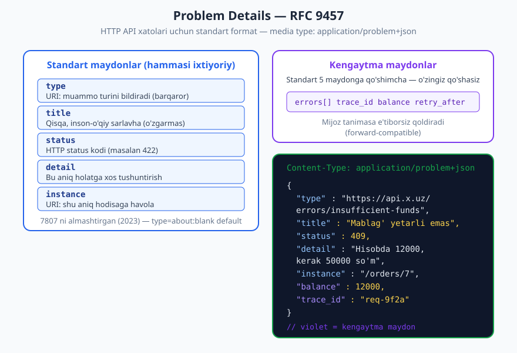
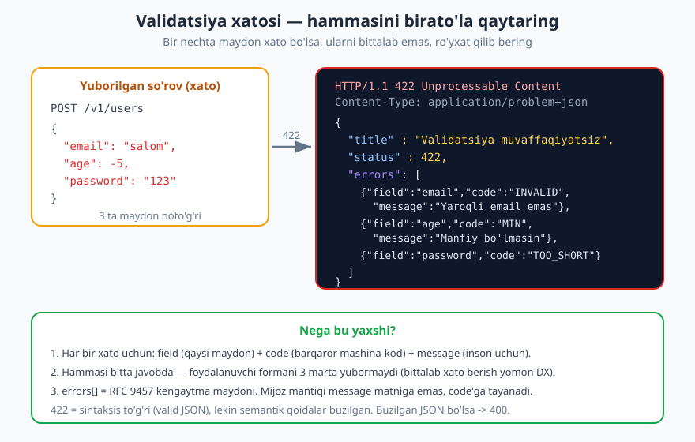
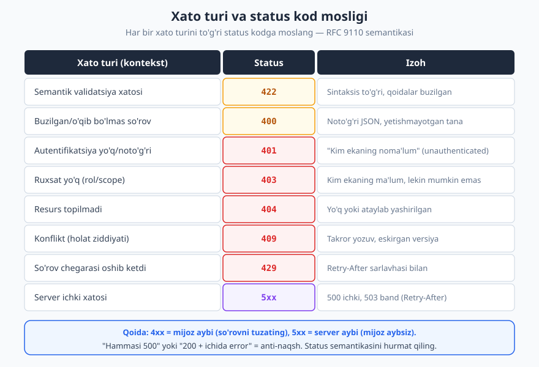

# 09 — Xatolarni dizayn qilish

[⬅️ Oldingi: 08 — Sahifalash, filtrlash, saralash, qidiruv](./08-sahifalash-filtrlash.md) · [🏠 README](./README.md) · [Keyingi: 10 — API versiyalash va evolyutsiya ➡️](./10-versiyalash.md)

---

> **Bu bobda:** API'ning eng ko'p ishlatiladigan, lekin ko'pincha eng kam o'ylangan qismi — **xato javoblari**. Yaxshi xatoni qanday loyihalash: to'g'ri status kod, mashina-o'qiy `code`, inson-o'qiy xabar, qo'shimcha kontekst. **RFC 9457 Problem Details** standartini chuqur o'rganamiz, validatsiya xatolarini (ko'p maydon) modellashtiramiz, xato turini status kodga moslaymiz, va xavfsizlik bilan izchillikni ta'minlaymiz.
>
> **Halollik / Eslatma:** Xato formati uchun asosiy standart — **RFC 9457 "Problem Details for HTTP APIs"** (2023, RFC 7807 ni almashtirgan). Status kod semantikasi **RFC 9110** ga tayanadi. Bu yerdagi barcha JSON namunalar valid (tekshirilgan); media type `application/problem+json` standart. Status tanlovida ba'zi nuanslar (masalan 400 yoki 422) amalda **ikkala** ko'rinishda ham uchraydi — buni halol belgilaymiz. Standartlar versiyasi vaqt bilan o'zgarishi mumkin.

---

## Nega xato dizayni muhim

Tasavvur qiling: siz yangi API'ga ulanyapsiz. So'rov yuborasiz va shunday javob olasiz:

```http
HTTP/1.1 500 Internal Server Error
Content-Type: text/html

<html><body>Something went wrong</body></html>
```

Endi nima qilasiz? Token noto'g'rimi? Maydon yetishmayaptimi? Server o'chganmi? Hech narsa ma'lum emas. Siz dokumentatsiyani titkilaysiz, taxminlar qilasiz, supportga yozasiz — soatlar ketadi.

Mana shu **xato dizayni** muammosi. Aksariyat dasturchilar API'ning "muvaffaqiyatli" yo'liga (happy path) ko'p vaqt sarflaydi, xatolarni esa oxirgi daqiqada "tashlab qo'yadi". Lekin amalda:

- **Xato javoblari eng ko'p o'qiladi.** Integratsiya jarayonida dasturchi muvaffaqiyatli javobni bir marta ko'radi, xatolarni esa o'nlab marta — chunki dastlab hamma narsa noto'g'ri ketadi.
- **Yaxshi xato = tezkor tuzatish.** Yaxshi loyihalangan xato javobi dasturchiga aniq aytadi: *nima* noto'g'ri, *qayerda*, *qanday* tuzatish. Bu **Developer Experience (DX)** ning yuragi.
- **Yomon xato = sarflangan vaqt va supportga yuk.** "500 Internal Error" hech kimga yordam bermaydi — na mijozga, na sizga.

> **Eslatma:** Xato javobini *mijoz uchun yozilgan xat* deb tasavvur qiling. Maqsad — uni o'qigan dasturchi (yoki uning kodi) muammoni mustaqil hal qila olishi. Bu API'ning eng yaxshi "hujjati".

Bu bobda biz xatolarni shunchaki "qaytarish" emas, balki **shartnoma sifatida loyihalash**ni o'rganamiz: bir xil, oldindan aytsa bo'ladigan, mashinaga ham insonga ham tushunarli.

---

## Yaxshi xato javobi nimadan iborat

Yaxshi xato javobida besh element bo'ladi. Birortasi tushib qolsa, javob "yarim" bo'ladi.

| # | Element | Kim uchun | Misol |
|---|---------|-----------|-------|
| 1 | **To'g'ri status kod** | Mashina (HTTP qatlami) | `422`, `404`, `409` |
| 2 | **Mashina-o'qiy kod** (`code`) | Mijoz mantiqi (`if`/`switch`) | `"ORDER_NOT_FOUND"` |
| 3 | **Inson-o'qiy xabar** | Loglarni o'qiyotgan dasturchi | `"Buyurtma topilmadi"` |
| 4 | **Qo'shimcha kontekst** | Aniq tuzatish uchun | qaysi maydon, qiymat, chegara |
| 5 | **Havola / trace id** | Debugging, support | `type` URI, `trace_id` |

Keling, har birini ko'rib chiqaylik.

**1. To'g'ri status kod.** HTTP status kodi — xatoning birinchi va eng muhim signali. U mijoz aybi (`4xx`) yoki server aybi (`5xx`) ekanini bir qarashda aytadi. Mijozlar (va proksilar, monitoring tizimlari) ko'pincha faqat status kodga qarab harakat qiladi. Status kodlarni chuqurroq [03 — HTTP status kodlari](./03-http-status-kodlari.md) bobida ko'rib chiqqansiz; bu bobda ularni xato kontekstiga moslaymiz.

**2. Mashina-o'qiy kod.** Bu — sizning API'ngiz aniqlaydigan **barqaror** kalit, masalan `"INSUFFICIENT_FUNDS"`. Mijoz kodida `if (err.code === "INSUFFICIENT_FUNDS")` deb yozadi. Bu kod **hech qachon o'zgarmasligi** kerak (xabar matni o'zgarsa ham).

**3. Inson-o'qiy xabar.** Loglarda ko'rinadigan, dasturchiga tushunarli matn. Bu matn **o'zgarishi mumkin** (tilga tarjima qilinadi, qayta yoziladi) — shuning uchun mijoz mantiqi unga tayanmasligi shart.

**4. Qo'shimcha kontekst.** "Email noto'g'ri" yetarli emas. "`email` maydoni yaroqli format emas: `salom`" — mana bu foydali. Qaysi maydon, qaysi qiymat, qanday chegara buzilgan.

**5. Havola / trace id.** Muammo turini tavsiflovchi hujjatga URI (`type`), va aniq hodisani topish uchun `trace_id` — support bilan gaplashganda bebaho.

---

## Problem Details — RFC 9457

Agar har bir API o'z xato formatini o'ylab topsa, dasturchilar har safar yangidan o'rganishlari kerak. Shuning uchun IETF **standart format** chiqargan.

> **Standart:** **RFC 9457 — "Problem Details for HTTP APIs"** (2023-yil iyul). U eski **RFC 7807** ni (2016) **almashtirdi** (obsoletes). 7807 ni "avvalgi versiyasi" sifatida eslashingiz mumkin, lekin hozir amaldagi standart — **9457**. Media type: **`application/problem+json`** (XML uchun `application/problem+xml` ham bor, lekin amalda JSON ustun).



### Standart maydonlar

RFC 9457 beshta standart maydonni belgilaydi. **Barchasi ixtiyoriy** — lekin amalda kamida `type`, `title`, `status` berish yaxshi odat.

| Maydon | Tur | Ma'nosi |
|--------|-----|---------|
| `type` | URI (string) | Muammo **turini** bildiruvchi barqaror identifikator. Default `"about:blank"`. Odatda hujjatga havola. |
| `title` | string | Qisqa, inson-o'qiy sarlavha. `type` uchun **o'zgarmas** xulosa (holatdan holatga emas). |
| `status` | number | HTTP status kodi (javob status bilan mos bo'lsin). |
| `detail` | string | **Shu aniq holatga xos** tushuntirish (title'dan farqli — bu o'zgaruvchan). |
| `instance` | URI (string) | Muammoning **shu aniq hodisasi**ga havola (masalan `/orders/7`). |

> **Diqqat:** `title` va `detail` farqini ajrating. `title` — muammo *turi* uchun barqaror sarlavha ("Mablag' yetarli emas"). `detail` — *bu safar* nima bo'lganini aytadi ("Hisobda 12000, kerak 50000"). `title` ni mijoz `type` o'rniga ham ishlatishi mumkin; `detail` har safar boshqacha.

Eng oddiy valid Problem Details javobi:

```http
GET /v1/orders/9999 HTTP/1.1
Host: api.example.com
Accept: application/json

HTTP/1.1 404 Not Found
Content-Type: application/problem+json

{
  "type": "https://api.example.com/errors/not-found",
  "title": "Resurs topilmadi",
  "status": 404,
  "detail": "9999 raqamli buyurtma mavjud emas",
  "instance": "/v1/orders/9999"
}
```

E'tibor bering: `Content-Type` — `application/problem+json`, oddiy `application/json` emas. Bu mijozga "bu xato javobi, uni Problem Details sifatida tahlil qil" deb signal beradi.

### Kengaytma maydonlar

RFC 9457 ning eng kuchli tomoni: beshta standart maydonga **o'zingizning maydonlaringizni qo'shsangiz bo'ladi**. Bular — **kengaytma maydonlar** (extension members).

```http
POST /v1/orders HTTP/1.1
Host: api.example.com
Content-Type: application/json
Authorization: Bearer <token>

{"item_id": 42, "quantity": 3}

HTTP/1.1 409 Conflict
Content-Type: application/problem+json

{
  "type": "https://api.example.com/errors/insufficient-funds",
  "title": "Mablag' yetarli emas",
  "status": 409,
  "detail": "Hisobda 12000 so'm, buyurtma uchun 50000 so'm kerak",
  "instance": "/v1/orders/7",
  "balance": 12000,
  "required": 50000,
  "trace_id": "req-9f2a3c"
}
```

Bu yerda `balance`, `required`, `trace_id` — kengaytma maydonlar. Ular standartda yo'q, lekin RFC 9457 ularni qo'shishga ruxsat beradi.

> **Trade-off:** Kengaytma maydonlar — kuch, lekin **mas'uliyat** ham. Ularni hujjatlang (`type` URI ortida tavsif bo'lsin). Ularni **forward-compatible** deb hisoblang: mijoz tanimagan maydonni e'tiborsiz qoldirishi kerak. Yangi kengaytma maydon qo'shish — buzmaydigan o'zgarish (breaking emas); maydon olib tashlash yoki ma'nosini o'zgartirish esa — buzadi.

> **Eslatma — `type` URI ochilishi shartmi?** Yo'q. RFC `type` ni shunchaki **barqaror identifikator** deb belgilaydi — uni brauzerda ochib bo'lmasa ham yaroqli. Lekin **eng yaxshi amaliyot**: shu URI'da haqiqiy hujjat bo'lsin (muammo nima, qanday tuzatish). Bu DX uchun katta yutuq.

---

## Validatsiya xatolari — eng keng tarqalgani

API'da eng ko'p uchraydigan xato — **validatsiya**: mijoz yuborgan ma'lumot qoidalarni buzgan. Bu yerda bitta nozik, lekin juda muhim qoida bor.

> **Anti-pattern:** Maydonlarni **bittalab** tekshirib, birinchi xatoda to'xtab qaytarish. Foydalanuvchi formani to'ldiradi, "email noto'g'ri" oladi, tuzatadi, qayta yuboradi, "parol qisqa" oladi... Bu jirkanch DX.

To'g'ri yondashuv: **hamma maydonni bir vaqtda tekshiring**, barcha xatolarni **`errors[]` ro'yxati** qilib bitta javobda qaytaring.



```http
POST /v1/users HTTP/1.1
Host: api.example.com
Content-Type: application/json

{"email": "salom", "age": -5, "password": "123"}

HTTP/1.1 422 Unprocessable Content
Content-Type: application/problem+json

{
  "type": "https://api.example.com/errors/validation",
  "title": "Validatsiya muvaffaqiyatsiz",
  "status": 422,
  "detail": "So'rovda 3 ta maydon noto'g'ri",
  "errors": [
    {"field": "email", "code": "INVALID_FORMAT", "message": "Yaroqli email manzil emas"},
    {"field": "age", "code": "OUT_OF_RANGE", "message": "Yosh manfiy bo'lishi mumkin emas"},
    {"field": "password", "code": "TOO_SHORT", "message": "Kamida 8 belgi bo'lishi kerak"}
  ]
}
```

Har bir xato uchun uch element:

- **`field`** — qaysi maydon (ichma-ich bo'lsa, `address.city` yoki JSON Pointer `/address/city`).
- **`code`** — barqaror mashina-kod (mijoz mantiqi shunga tayanadi).
- **`message`** — inson uchun matn (o'zgarishi/tarjima bo'lishi mumkin).

> **Eslatma:** `errors[]` — RFC 9457 ning **kengaytma maydoni**. Standart uni majburlamaydi, lekin ko'p maydonli validatsiya uchun de-fakto naqsh shu. Ba'zi API'lar `errors` o'rniga `invalid_params` (RFC 9457 misolida ham shu nom uchraydi) ishlatadi — nomi muhim emas, **izchillik** muhim.

### 422 vs 400 — halol farq

Bu eng ko'p bahsli savol. Qachon `400 Bad Request`, qachon `422 Unprocessable Content`?

| Holat | Status | Sabab |
|-------|--------|-------|
| JSON buzilgan, o'qib bo'lmaydi (`{"a":}`) | **400** | So'rovni umuman **tahlil qilib bo'lmadi** (sintaktik). |
| `Content-Type` noto'g'ri, majburiy maydon umuman yo'q | **400** | So'rov shakli noto'g'ri. |
| JSON valid, lekin `age: -5` (qoida buzilgan) | **422** | Sintaksis to'g'ri, lekin **semantik** xato. |
| `email` formati noto'g'ri, qiymat chegaradan tashqari | **422** | Ma'no jihatdan qayta ishlab bo'lmaydi. |

> **Halollik:** RFC 9110 `422 Unprocessable Content` ni "so'rov to'g'ri shakllangan, lekin semantik xatolar tufayli ko'rsatmalarga amal qilib bo'lmadi" deb belgilaydi — shuning uchun **semantik validatsiya** uchun u yaxshi mos keladi. Lekin amalda ko'p mashhur API'lar (ba'zilari tarixiy sabablarga ko'ra) **barcha** validatsiya xatolari uchun `400` ishlatadi. **Ikkalasi ham qabul qilinadi.** Eng muhimi — bitta API ichida **izchil** bo'lish va tanlovni hujjatlash. Bu kitobda biz `400` = buzilgan/o'qib bo'lmas, `422` = valid-lekin-qoidaga-zid deb ajratamiz.

---

## Status kod mosligi

Har bir xato turini to'g'ri status kodga moslash — xato dizaynining yadrosi. Quyidagi jadval eng keng tarqalgan moslarni beradi.



| Xato turi | Status | Eslatma |
|-----------|--------|---------|
| Buzilgan/o'qib bo'lmas so'rov | `400 Bad Request` | Sintaktik xato, noto'g'ri JSON. |
| Semantik validatsiya xatosi | `422 Unprocessable Content` | Valid shakl, buzilgan qoida (yoki `400`, izchil bo'lsa). |
| Autentifikatsiya yo'q/noto'g'ri | `401 Unauthorized` | Aslida "**unauthenticated**" — kim ekaning noma'lum. |
| Ruxsat yo'q | `403 Forbidden` | Kim ekaning ma'lum, lekin **ruxsat yo'q**. |
| Resurs topilmadi | `404 Not Found` | Yo'q yoki ataylab yashirilgan. |
| Metod qo'llab-quvvatlanmaydi | `405 Method Not Allowed` | `Allow` sarlavhasi bilan. |
| Media type qo'llanmaydi | `415 Unsupported Media Type` | Noto'g'ri `Content-Type`. |
| Konflikt (holat ziddiyati) | `409 Conflict` | Takror yozuv, bir vaqtda tahrir. |
| Resurs endi yo'q (butunlay) | `410 Gone` | 404 dan farqli — "ataylab o'chirilgan". |
| Shart talab qilinadi | `428 Precondition Required` | `If-Match` ni majburlash uchun. |
| So'rov chegarasi oshdi | `429 Too Many Requests` | `Retry-After` bilan ([14 — Rate limiting](./14-rate-limiting.md)). |
| Server ichki xatosi | `500 Internal Server Error` | Kutilmagan bug — mijoz aybsiz. |
| Vaqtincha band/o'chiq | `503 Service Unavailable` | `Retry-After` bilan. |

**Asosiy qoida:** `4xx` = **mijoz aybi** (so'rovni tuzatsa, qayta urinsa bo'ladi); `5xx` = **server aybi** (mijoz aybsiz, odatda keyinroq qayta urinish kerak).

> **Diqqat — 401 vs 403:** Bu ikkisini juda ko'p chalkashtiradi. `401` — "men seni **tanimadim**" (token yo'q/yaroqsiz), odatda `WWW-Authenticate` sarlavhasi bilan keladi. `403` — "men seni tanidim, **lekin bu senga mumkin emas**". Bu farqni [12 — Avtorizatsiya](./12-avtorizatsiya.md) bobi chuqurlashtiradi.

### Status kod yetarli emas

Status kod — birinchi signal, lekin **o'zi yetarli emas**. `400` ko'plab turli xatolarni qamraydi. Shuning uchun status kodni **doim** Problem Details tanasi bilan to'ldiring: aniq `type`/`code`, `detail`, kerakli kontekst. Status — keng kategoriya; tana — aniq sabab.

---

## Xavfsizlik — nimani oshkor qilmaslik

Xato javoblari — ma'lumot **sizib chiqishi**ning eng keng tarqalgan manbai. Tasavvur qiling, server quyidagini qaytaradi:

```json
{
  "error": "SQLSTATE[23000]: Integrity constraint violation: 1062 Duplicate entry 'admin@x.uz' for key 'users.email_unique' in /var/www/app/Models/User.php:142"
}
```

Bu **falokat**. Bitta xabar bilan hujumchi: ma'lumotlar bazasi turi (MySQL), jadval va ustun nomlari (`users.email_unique`), ichki fayl yo'llari (`/var/www/...`), texnologiya stegi va hattoki haqiqiy email manzilni bildi.

> **Xavfsizlik:** **Ichki tafsilotlarni mijozga hech qachon oshkor qilmang** — stack trace, SQL so'rovlari, ichki fayl yo'llari, kutubxona versiyalari, ma'lumotlar bazasi tuzilishi. Bu — ma'lumot oshkorligi zaifligi (OWASP API Security Top 10 — 2023 da **API8: Security Misconfiguration** ostida). Mijozga **umumiy, xavfsiz** xabar bering; to'liq tafsilotni esa **server log'ida** saqlang va `trace_id` orqali bog'lang.

To'g'ri yondashuv:

```http
GET /v1/orders/5 HTTP/1.1
Host: api.example.com

HTTP/1.1 500 Internal Server Error
Content-Type: application/problem+json

{
  "type": "https://api.example.com/errors/internal",
  "title": "Ichki server xatosi",
  "status": 500,
  "detail": "Kutilmagan xato yuz berdi. Iltimos, keyinroq urinib ko'ring.",
  "trace_id": "req-7b1e44d0"
}
```

Server tomonida esa to'liq log saqlanadi:

```json
{
  "trace_id": "req-7b1e44d0",
  "level": "error",
  "exception": "PDOException",
  "message": "SQLSTATE[23000]: Duplicate entry ...",
  "stack": "/var/www/app/Models/User.php:142 ...",
  "user_id": 1001
}
```

Endi support mijozdan `trace_id` ni so'raydi va log'da to'liq tafsilotni topadi — mijozga hech narsa oshkor qilmasdan.

> **Xavfsizlik — 404 vs 403:** Maxfiy resurslarda `403` ("bor, lekin senga mumkin emas") **mavjudlikni oshkor qiladi**. Hujumchi `403` olsa, resurs borligini biladi. Shuning uchun ko'p tizimlar atayin **404** beradi — "bormi yo'qmi, bilmaysan". Bu ayniqsa boshqa foydalanuvchining obyektiga murojaat (BOLA — **API1**, OWASP 2023) holatida muhim. Bu mavzu [13 — API xavfsizligi](./13-api-xavfsizligi.md) bobida chuqurlashadi.

> **Diqqat:** Xato xabarlari **timing** ham oshkor qiladi. "Email topilmadi" va "Parol noto'g'ri" ni ajratish — qaysi emaillar ro'yxatdan o'tganini bildiradi (account enumeration). Login xatolarida umumiy "Email yoki parol noto'g'ri" bering.

---

## Izchillik — butun API bir xil shaklda

Tasavvur qiling, bitta API'da uch xil xato shakli:

```json
{"error": "not found"}
```
```json
{"message": "Forbidden", "code": 403}
```
```json
{"errors": [{"detail": "invalid"}]}
```

Mijoz har bir endpoint uchun alohida xato tahlilini yozishga majbur. Bu — texnik qarz va doimiy bosh og'rig'i.

> **Standart:** Butun API **bitta** xato shakliga ega bo'lsin. Eng yaxshisi — `application/problem+json` (RFC 9457) ni **hamma joyda** ishlatish. Bitta `type`+`title`+`status`+`detail` skeleti, kerak bo'lsa `errors[]` yoki boshqa kengaytma. Mijoz bir marta tahlilchi yozadi va u **hamma** xato uchun ishlaydi.

Buni ta'minlashning amaliy yo'li — markazlashgan **xato handler** (middleware/filter). Har bir endpoint o'zicha xato qaytarmaydi; barcha xatolar bitta joyda Problem Details ga aylanadi. Bu — [07 — So'rov/javob payload](./07-sorov-javob-payload.md) bobidagi izchil javob konvensiyalarining tabiiy davomi.

---

## Error code dizayni

Mashina-o'qiy `code` (yoki `type` URI) — sizning xato shartnomangizning eng barqaror qismi. Uni jiddiy loyihalang.

**1. Barqaror va hujjatlangan.** `code` bir marta e'lon qilingach, **o'zgartirmang**. Mijozlar unga tayanadi. Hammasini hujjatlang.

**2. Mashina-do'st format.** `SCREAMING_SNAKE_CASE` keng tarqalgan: `ORDER_NOT_FOUND`, `INSUFFICIENT_FUNDS`, `RATE_LIMIT_EXCEEDED`. Yoki `type` URI: `https://api.x.uz/errors/order-not-found`.

**3. Matnga tayanmang.** Bu eng muhim qoida:

> **Anti-pattern:** Mijoz mantiqini **xabar matniga** asoslash:
> ```js
> if (response.message === "Order not found") { ... }  // YOMON
> ```
> Matn o'zgaradi (qayta yoziladi, tarjima qilinadi, kontekst qo'shiladi) va kod sinadi. To'g'risi:
> ```js
> if (response.code === "ORDER_NOT_FOUND") { ... }  // YAXSHI
> ```

**4. Granularlik to'g'ri bo'lsin.** Juda umumiy (`ERROR`) — foydasiz. Juda nozik (har bir holat uchun alohida kod) — boshqarib bo'lmas. O'rta yo'l: mijoz **boshqacha harakat qilishi** kerak bo'lgan har bir holat uchun alohida kod.

| Kod | Status | Qachon |
|-----|--------|--------|
| `VALIDATION_FAILED` | 422 | Maydon validatsiyasi (`errors[]` bilan) |
| `UNAUTHENTICATED` | 401 | Token yo'q/yaroqsiz |
| `PERMISSION_DENIED` | 403 | Ruxsat yetmaydi |
| `ORDER_NOT_FOUND` | 404 | Buyurtma topilmadi |
| `IDEMPOTENCY_CONFLICT` | 409 | Bir xil idempotency-key, boshqa tana |
| `RATE_LIMITED` | 429 | Chegara oshdi |
| `INTERNAL_ERROR` | 500 | Kutilmagan server xatosi |

> **Trade-off:** `type` URI (RFC 9457) yoki qisqa `code` string? URI — standartga to'liq mos, hujjatga havola qiladi, global noyob. `code` — yozish/o'qish qulayroq, mijoz `switch`'i qisqaroq. **Ko'pchilik** ikkalasini ham beradi: `type` (URI, standart) + qo'shimcha `code` (qisqa kalit). Kichik ichki API uchun `code` yetarli; katta public API uchun `type` URI tavsiya etiladi.

---

## To'liq misol — barchasi birga

Keling, yaxshi loyihalangan to'liq xato javobini ko'raylik (`type` + `code` + `detail` + kontekst + `trace_id`):

```http
POST /v1/payments HTTP/1.1
Host: api.example.com
Content-Type: application/json
Authorization: Bearer <token>
Idempotency-Key: a1b2c3d4

{"amount": 50000, "currency": "UZS", "card_id": "crd_99"}

HTTP/1.1 409 Conflict
Content-Type: application/problem+json

{
  "type": "https://api.example.com/errors/insufficient-funds",
  "code": "INSUFFICIENT_FUNDS",
  "title": "Mablag' yetarli emas",
  "status": 409,
  "detail": "Kartada 12000 UZS mavjud, 50000 UZS kerak",
  "instance": "/v1/payments/pay_7f3a",
  "balance": 12000,
  "required": 50000,
  "currency": "UZS",
  "trace_id": "req-9f2a3c"
}
```

Bu javob mukammal: status (`409`) kategoriyani, `type`/`code` aniq sababni, `title`/`detail` insonga, `balance`/`required` aniq kontekstni, `trace_id` debuggingni beradi. Mijoz buni **mustaqil** hal qila oladi — supportga yozish shart emas.

---

## Asosiy g'oyalar (bobni qisqacha)

- **Xato dizayni = DX.** Xatolar API'ning eng ko'p o'qiladigan qismi. Yaxshi xato dasturchiga *nima*, *qayerda*, *qanday tuzatish*ni aytadi.
- **Besh element:** to'g'ri status kod + mashina-`code` + inson-xabar + kontekst + `trace_id`/havola.
- **RFC 9457 Problem Details** — standart format. `application/problem+json`, maydonlar: `type`, `title`, `status`, `detail`, `instance` + kengaytmalar. RFC 7807 ni almashtirgan.
- **Validatsiya:** hamma maydonni **bir vaqtda** tekshir, `errors[]` (field+code+message) qilib **bitta** javobda qaytar.
- **422 vs 400:** `400` = o'qib bo'lmas/sintaktik; `422` = valid-lekin-semantik-xato. Ikkalasi ham amalda; **izchil** bo'l.
- **401 vs 403:** `401` = tanimadim; `403` = tanidim, lekin mumkin emas. Maxfiy resursda `404` mavjudlikni yashiradi.
- **Xavfsizlik:** stack trace/SQL/ichki yo'lni mijozga **bermang**; log'da to'liq saqla + `trace_id` ber.
- **Izchillik:** butun API **bitta** xato shaklida — markaziy handler bilan.
- **`code` barqaror, hujjatlangan, mashina-do'st.** Mijoz **matnga emas, `code`ga** tayanadi.

---

## Mashqlar

### Oson

**1-mashq.** Quyidagi har bir holat uchun to'g'ri HTTP status kodini tanlang:
(a) Foydalanuvchi yuborgan JSON buzilgan, tahlil qilib bo'lmaydi.
(b) Token umuman yuborilmagan.
(c) Foydalanuvchi boshqa odamning buyurtmasini o'chirishga urinmoqda (token yaroqli, lekin ruxsat yo'q).
(d) `/v1/orders/9999` so'raldi, bunday buyurtma yo'q.
(e) `email` maydoni formati noto'g'ri (qolgan JSON valid).

**2-mashq.** Quyidagi xato javobi nimasi bilan yomon? Kamida 3 ta muammoni sanab bering.
```json
{"error": "Error 500: SQLSTATE[42S02] Table 'shop.ordrs' doesn't exist in /app/db.php line 88"}
```

### O'rta

**3-mashq.** `GET /v1/orders/777` so'rovi uchun, bunday buyurtma yo'qligi holatida, to'liq **valid RFC 9457 Problem Details** javobini yozing (status liniyasi + `Content-Type` + JSON tanasi). Barcha 5 standart maydonni ishlating.

**4-mashq.** Quyidagi so'rov uchun **422 validatsiya** javobini `errors[]` bilan yozing. So'rov: `{"username": "ab", "email": "yoq", "age": 200}`. Qoidalar: username kamida 3 belgi; email yaroqli format; age 0..150 oralig'ida. Har bir xato uchun `field`, `code`, `message` bering.

**5-mashq.** Bir to'lov API uchun 6 ta error `code` dizayn qiling (`code` nomi + status + qachon ishlatilishini bitta jumlada). Nega `code` ni xabar matnidan ajratish kerakligini 1-2 jumlada tushuntiring.

### Qiyin

**6-mashq.** Bir API **barcha** xatolar uchun `200 OK` qaytaradi va xatoni tanada `{"success": false, "error": "..."}` shaklida beradi. Bu anti-naqshning kamida 3 ta zararini tushuntiring va uni **to'g'ri** dizaynga qayta loyihalang (qaysi statuslar, qaysi format).

**7-mashq.** Bir tizim **maxfiy** hujjatlar API'siga ega. Foydalanuvchi `GET /v1/documents/42` so'raydi, lekin 42-hujjat **boshqa** foydalanuvchiniki. Xavfsizlik nuqtai nazaridan `403` va `404` orasidan qaysi birini tanlaysiz va **nega**? Tanlovingiz uchun valid Problem Details javobini yozing. (OWASP 2023 dagi qaysi xavf bilan bog'liq?)

**8-mashq.** Bir kompaniya yangi API quryapti va 30+ endpointda **izchil** xato modeli xohlaydi. Butun API uchun bitta xato shartnomasini loyihalang: (a) standart shakl (qaysi maydonlar), (b) `400` va `422` qachon, (c) validatsiya `errors[]` strukturasi, (d) xavfsizlik qoidasi, (e) buni qanday qilib markazlashtirib ta'minlash. Misol javoblar bilan ko'rsating.

<details markdown="1">
<summary>Yechimlar</summary>

### 1-mashq yechimi

(a) **400 Bad Request** — JSON buzilgan, sintaktik xato, so'rovni tahlil qilib bo'lmaydi.
(b) **401 Unauthorized** — autentifikatsiya yo'q ("unauthenticated"); odatda `WWW-Authenticate` sarlavhasi bilan.
(c) **403 Forbidden** — tanidim (token yaroqli), lekin ruxsat yo'q. (Maxfiylik xohlansa, **404** ham mumkin — 7-mashqqa qarang.)
(d) **404 Not Found** — resurs mavjud emas.
(e) **422 Unprocessable Content** — JSON valid (sintaksis to'g'ri), lekin semantik qoida buzilgan. (Agar API izchil ravishda `400` ishlatsa, `400` ham qabul qilinadi — muhimi izchillik.)

### 2-mashq yechimi

Muammolar:
1. **Ma'lumot oshkorligi (xavfsizlik):** SQL holati (`SQLSTATE`), jadval nomi (`shop.ordrs`), ichki fayl yo'li (`/app/db.php`) va satr raqami oshkor qilingan — OWASP API8 (Security Misconfiguration). Hujumchiga sovg'a.
2. **Status tanada takrorlangan:** "Error 500" matn ichida — bu HTTP status liniyasida bo'lishi kerak, mashina o'qiy maydonda emas.
3. **Mashina-o'qiy `code` yo'q:** mijoz mantiqi tayanadigan barqaror kalit yo'q.
4. **Foydasiz inson xabari:** dasturchiga "nima qilay?"ni aytmaydi, faqat ichki bug'ni ko'rsatadi.
5. **`trace_id` yo'q:** support uchun log'ga bog'lovchi yo'q.
6. **Noto'g'ri `Content-Type` ehtimoli:** `application/problem+json` emas.

To'g'ri: umumiy `500` Problem Details (yuqoridagi "Xavfsizlik" bo'limidagi misol), to'liq SQL xatosi esa faqat server log'ida + `trace_id`.

### 3-mashq yechimi

```http
GET /v1/orders/777 HTTP/1.1
Host: api.example.com
Accept: application/json

HTTP/1.1 404 Not Found
Content-Type: application/problem+json

{
  "type": "https://api.example.com/errors/order-not-found",
  "title": "Buyurtma topilmadi",
  "status": 404,
  "detail": "777 raqamli buyurtma mavjud emas",
  "instance": "/v1/orders/777"
}
```

`type` (barqaror URI), `title` (o'zgarmas sarlavha), `status` (404, status liniyasiga mos), `detail` (shu holatga xos), `instance` (aniq URI) — beshtasi ham bor. `Content-Type` = `application/problem+json`.

### 4-mashq yechimi

```http
HTTP/1.1 422 Unprocessable Content
Content-Type: application/problem+json

{
  "type": "https://api.example.com/errors/validation",
  "title": "Validatsiya muvaffaqiyatsiz",
  "status": 422,
  "detail": "So'rovda 3 ta maydon noto'g'ri",
  "errors": [
    {"field": "username", "code": "TOO_SHORT", "message": "Foydalanuvchi nomi kamida 3 belgi bo'lishi kerak"},
    {"field": "email", "code": "INVALID_FORMAT", "message": "Yaroqli email manzil emas"},
    {"field": "age", "code": "OUT_OF_RANGE", "message": "Yosh 0 va 150 oralig'ida bo'lishi kerak"}
  ]
}
```

Uchchala maydon ham **bir vaqtda** tekshirilgan va bitta javobda qaytarilgan. Har birida `field` + barqaror `code` + inson-`message`.

### 5-mashq yechimi

To'lov API uchun 6 ta error code:

| `code` | Status | Qachon |
|--------|--------|--------|
| `VALIDATION_FAILED` | 422 | Yuborilgan to'lov maydonlari qoidalarni buzdi (summa, valyuta...). |
| `INSUFFICIENT_FUNDS` | 409 | Kartada/hisobda yetarli mablag' yo'q. |
| `CARD_DECLINED` | 402 | Bank kartani rad etdi (`402 Payment Required`). |
| `PAYMENT_NOT_FOUND` | 404 | Berilgan ID bo'yicha to'lov topilmadi. |
| `IDEMPOTENCY_CONFLICT` | 409 | Bir xil `Idempotency-Key`, lekin boshqa tana yuborildi. |
| `RATE_LIMITED` | 429 | So'rov chegarasi oshdi (`Retry-After` bilan). |

**Nega `code` ni matndan ajratish kerak:** xabar matni o'zgaradi — uni qayta yozadilar, boshqa tilga tarjima qiladilar, kontekst qo'shadilar. Agar mijoz `if (msg === "...")` deb yozsa, matn o'zgargan zahoti kodi buziladi. `code` esa — shartnomaning barqaror qismi: bir marta e'lon qilinib, hech qachon o'zgarmaydi, shuning uchun mijoz mantiqi unga ishonchli tayanadi.

### 6-mashq yechimi

**`200 + {"success": false}` anti-naqshning zararlari:**
1. **HTTP semantikasi buziladi:** monitoring, proksilar, retry kutubxonalari, CDN'lar — barchasi `2xx`ni "muvaffaqiyat" deb biladi. Ular xatoni "ko'rmaydi", noto'g'ri keshlaydi, qayta urinmaydi. Xato sezilmay qoladi.
2. **Mijoz har safar tanani ochishga majbur:** status kodga qarab tez qaror qilib bo'lmaydi; har javobni parse qilib `success`ni tekshirish kerak. Generik HTTP klientlar (avtomatik `throw on 4xx/5xx`) ishlamaydi.
3. **Statistika va alerting buziladi:** "xato darajasi" status kodga asoslanadi; hamma narsa `200` bo'lsa, dashboard'da xato ko'rinmaydi — incidentlar yashirin qoladi.

**Qayta dizayn:** xato kategoriyasiga mos `4xx`/`5xx` status qaytaring va tanada RFC 9457 Problem Details bering:
```http
HTTP/1.1 422 Unprocessable Content
Content-Type: application/problem+json

{
  "type": "https://api.example.com/errors/validation",
  "title": "Validatsiya muvaffaqiyatsiz",
  "status": 422,
  "detail": "email maydoni yaroqli emas",
  "errors": [{"field": "email", "code": "INVALID_FORMAT", "message": "Yaroqli email manzil emas"}]
}
```
Endi status xatoni bildiradi, format izchil va standart, infratuzilma to'g'ri ishlaydi.

### 7-mashq yechimi

**Tanlov: `404 Not Found`.** Sabab: `403` "hujjat **bor**, lekin senga mumkin emas" deb mavjudlikni **oshkor qiladi**. Hujumchi turli ID'larni sinab `403` vs `404` farqidan qaysi hujjatlar mavjudligini xaritalashi mumkin. Maxfiy resurslarda begona foydalanuvchiga `404` berib, "bormi-yo'qmi bilmaysan" deyish ma'lumot sizishini to'sadi.

Bu **OWASP API Security Top 10 — 2023 dagi API1: Broken Object Level Authorization (BOLA)** bilan bog'liq — eng keng tarqalgan API zaifligi (boshqa foydalanuvchi obyektiga ruxsatsiz kirish).

```http
GET /v1/documents/42 HTTP/1.1
Host: api.example.com
Authorization: Bearer <token>

HTTP/1.1 404 Not Found
Content-Type: application/problem+json

{
  "type": "https://api.example.com/errors/not-found",
  "title": "Resurs topilmadi",
  "status": 404,
  "detail": "So'ralgan hujjat mavjud emas",
  "instance": "/v1/documents/42",
  "trace_id": "req-3c8a11"
}
```

> Eslatma: server **log'ida** haqiqiy sababni (ruxsat rad etilishi, qaysi foydalanuvchi) `trace_id` bilan saqlang — audit uchun zarur, lekin mijozga `403` "hujjat bor" deb aytmang.

### 8-mashq yechimi

**Butun API uchun izchil xato shartnomasi:**

**(a) Standart shakl** — har bir xato `application/problem+json` (RFC 9457):
```json
{
  "type": "https://api.example.com/errors/<turi>",
  "code": "MACHINE_CODE",
  "title": "Inson-o'qiy sarlavha",
  "status": 422,
  "detail": "Shu holatga xos tushuntirish",
  "instance": "/v1/...",
  "trace_id": "req-..."
}
```
`type`+`title`+`status` doim; `detail`/`instance`/`trace_id` mavjud bo'lsa; `code` — qisqa mashina kaliti.

**(b) `400` vs `422`:** `400` = so'rovni o'qib/parse qilib bo'lmadi (buzilgan JSON, noto'g'ri `Content-Type`, yetishmayotgan tana). `422` = so'rov valid shaklda, lekin semantik qoida buzilgan (maydon validatsiyasi). Bu farq **butun API'da bir xil** qo'llaniladi va hujjatlanadi.

**(c) Validatsiya `errors[]`:**
```json
{
  "type": "https://api.example.com/errors/validation",
  "code": "VALIDATION_FAILED",
  "title": "Validatsiya muvaffaqiyatsiz",
  "status": 422,
  "errors": [
    {"field": "<maydon>", "code": "<QOIDA>", "message": "<tushuntirish>"}
  ]
}
```
Hamma maydon bir vaqtda tekshiriladi; `field` ichma-ich uchun nuqtali yoki JSON Pointer.

**(d) Xavfsizlik qoidasi:** stack trace/SQL/ichki yo'l **hech qachon** tanada emas — faqat log'da + `trace_id`. Maxfiy obyektlarda begonaga `404`. Login xatolarida umumiy "email yoki parol noto'g'ri".

**(e) Markazlashtirish:** bitta **xato handler middleware** — barcha tashlangan xatolarni (exception) ushlaydi va yuqoridagi shaklga aylantiradi. Endpointlar **hech qachon** xatoni qo'lda formatlamaydi; ular faqat tipik xato obyektini (yoki exception) tashlaydi, handler uni Problem Details ga o'giradi. Shu tariqa 30+ endpoint avtomatik izchil bo'ladi va yangi endpoint qo'shilganda ham shakl o'zi to'g'ri keladi.

Misol — bitta to'g'ri javob:
```http
HTTP/1.1 409 Conflict
Content-Type: application/problem+json

{
  "type": "https://api.example.com/errors/duplicate-email",
  "code": "DUPLICATE_EMAIL",
  "title": "Email band",
  "status": 409,
  "detail": "Bu email allaqachon ro'yxatdan o'tgan",
  "instance": "/v1/users",
  "trace_id": "req-5d2f"
}
```

</details>

---

[⬅️ Oldingi: 08 — Sahifalash, filtrlash, saralash, qidiruv](./08-sahifalash-filtrlash.md) · [🏠 README](./README.md) · [Keyingi: 10 — API versiyalash va evolyutsiya ➡️](./10-versiyalash.md)
