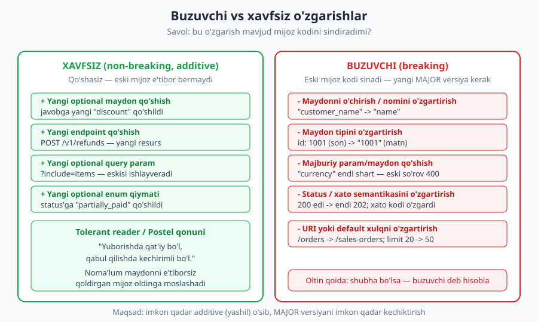
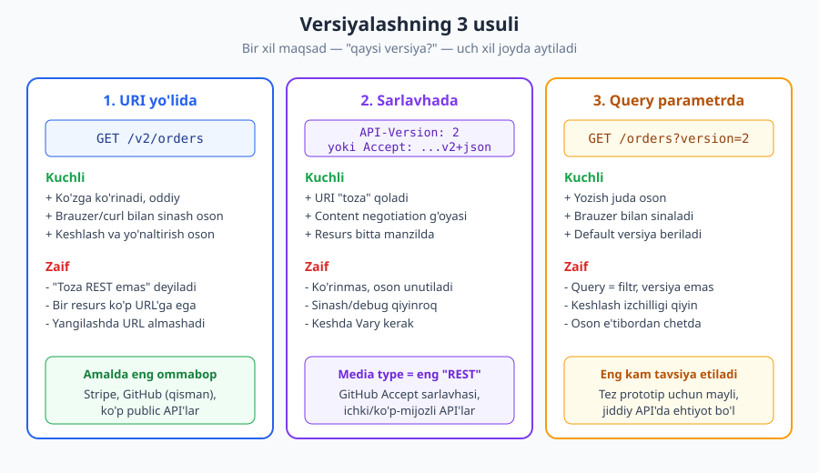
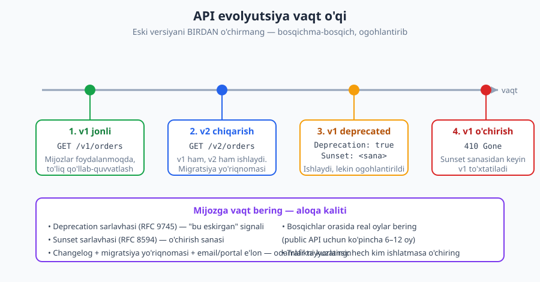

# 10 — API versiyalash va evolyutsiya

[⬅️ Oldingi: 09 — Xatolarni dizayn qilish](./09-xato-dizayni.md) · [🏠 README](./README.md) · [Keyingi: 11 — Autentifikatsiya ➡️](./11-autentifikatsiya.md)

---

> **Bu bobda:** API chiqgach undan boshqalar foydalanadi — va siz uni o'zgartirsangiz, ularning kodini sindirib qo'yishingiz mumkin. Lekin API o'sishi, takomillashishi kerak. Shu ziddiyatni qanday hal qilish: qaysi o'zgarish xavfsiz (additive), qaysisi buzuvchi (breaking); versiyalashning uchta usuli (URI, sarlavha, query) va ularning trade-off'lari; semantik versiyalash g'oyasi; eski versiyani halol va bosqichma-bosqich bekor qilish (`Deprecation` va `Sunset`).
>
> **Halollik / Eslatma:** Buzuvchi/xavfsiz farqi va versiyalash usullari **standartlar emas, balki amaliyot va trade-off'lar** — "har doim URI'da versiyala" degan mutlaq qoida yo'q, kontekst hal qiladi. Aniq standartga tayanadigan joylar: `Deprecation` sarlavhasi = **RFC 9745** (2025), `Sunset` sarlavhasi = **RFC 8594**, status kodlari (`410 Gone`, `400`) = **RFC 9110**, media type orqali versiyalash esa content negotiation (**RFC 9110**) g'oyasiga tayanadi. Standartlar va versiyalar vaqt bilan o'zgaradi; HTTP namunalari `RFC 9110` semantikasiga mos.

---

## Muammo: chiqarilgan API — siznikidan ko'proq mijozniki

Tasavvur qiling, siz `/orders` endpoint'ini chiqardingiz. Bir hafta o'tib, undan to'rtta turli ilova foydalanadi: mobil dastur, hamkorning saytidagi widget, ichki admin panel va kimdir Telegram bot. Ularning hammasi sizning javobingizdagi `customer_name` maydonini o'qiydi.

Endi siz tushundingizki, `customer_name` yomon nom edi — uni `name` deb o'zgartirmoqchisiz. Bir qator kod o'zgartirasiz, deploy qilasiz. Va o'sha zahoti to'rtta ilova ham sinadi: ular hali ham `customer_name` ni qidiradi, lekin u endi yo'q.

Mana API dizaynining markaziy haqiqati:

> **Diqqat:** API — bu siz egalik qiladigan kod emas, balki **boshqalar tayanadigan shartnoma**. Ichki funksiyani istalgancha refaktor qilishingiz mumkin — uni faqat siz chaqirasiz. Lekin API'ni o'zgartirganda, siz uni chaqirayotgan har bir mijoz bilan kelishuvni buzasiz. Bu [01-bobda](./01-api-nima.md) ko'rgan "API = shartnoma" g'oyasining eng og'riqli amaliy oqibati.

Shu bilan birga, API muzlatib qo'yilgan haykal ham emas. Biznes o'zgaradi, yangi xususiyatlar kerak bo'ladi, eski qarorlar xato chiqadi. API **o'sishi shart**. Demak bizga ikki narsa kerak:

1. **Evolyutsiya** — API'ni mavjud mijozlarni sindirmasdan o'stirish.
2. **Versiyalash** — bordi-yu o'zgarishni sindirmasdan kirita olmasak, eski va yangi xulqni yonma-yon yashashga majburlash.

Tartib muhim: **avval evolyutsiya, oxirgi chora — versiyalash.** Versiya — bu murosa, "sig'dira olmadim" degan e'tirof. Shuning uchun avval qaysi o'zgarish umuman versiyani talab qilishini bilishimiz kerak.

---

## Buzuvchi va xavfsiz o'zgarishlar — bobning yuragi

Hamma narsa bitta savolga bog'lanadi:

> **Bu o'zgarish mavjud mijoz kodini sindiradimi?**

Agar **yo'q** bo'lsa — bu *non-breaking* (xavfsiz, additive) o'zgarish; uni shunchaki chiqarasiz, versiya kerak emas. Agar **ha** bo'lsa — bu *breaking* (buzuvchi) o'zgarish; uni eski mijozlardan yashirish, ya'ni yangi versiyaga qo'yish kerak.



### Xavfsiz (non-breaking, additive) o'zgarishlar

Asosiy g'oya: **qo'shish — buzmaslik.** Mavjud nimanidir tashlamasangiz, ko'pchilik mijoz sezmaydi.

- **Javobga yangi maydon qo'shish.** Eski mijoz uni shunchaki o'qimaydi. Agar mijoz "noma'lum maydonni e'tiborsiz qoldir" qoidasiga rioya qilsa (deyarli barcha JSON parserlar shunday), hech narsa sinmaydi.
- **Yangi endpoint qo'shish.** `POST /v1/refunds` — yangi resurs, eskilariga tegmaydi.
- **Yangi *ixtiyoriy* query parametr qo'shish.** `?include=items` — beruvchi oladi, bermaydigan eski mijoz oldingidek ishlayveradi.
- **Yangi ixtiyoriy so'rov maydoni qo'shish** (default qiymat bilan).
- **Yangi `enum` qiymati qo'shish** — *agar* mijozlar noma'lum qiymatni xotirjam qabul qiladigan qilib yozilgan bo'lsa (bu nozik nuqta, pastda qaytamiz).

Bu yondashuvning nazariy nomi bor:

> **Standart:** **Postel qonuni** (robustlik tamoyili): *"Yuborishda qat'iy bo'l, qabul qilishda kechirimli bo'l."* API dunyosida bu **tolerant reader** (kechirimli o'quvchi) naqshi deyiladi: mijoz faqat o'ziga kerakli maydonlarni o'qiydi va tanimagan maydonlarni e'tiborsiz qoldiradi. Shunday yozilgan mijoz serverning additive o'sishiga avtomatik moslashadi — siz har yangi maydon uchun yangi versiya chiqarmaysiz.

```json
{
  "id": 1001,
  "status": "pending",
  "customer_name": "Ali",
  "discount": 0.1
}
```

Yuqorida `discount` — yangi qo'shilgan maydon. `customer_name` ni o'qiydigan eski mijoz uni umuman ko'rmaydi va xotirjam ishlayveradi. Bu **xavfsiz**.

### Buzuvchi (breaking) o'zgarishlar

Bular eski mijoz kutgan shartnomani buzadi:

| O'zgarish | Nega buzadi |
|---|---|
| Maydonni **o'chirish** yoki **nomini o'zgartirish** (`customer_name` → `name`) | Mijoz eski nomni qidiradi — topolmaydi, `null`/xato. |
| Maydon **tipini o'zgartirish** (`id: 1001` → `id: "1001"`) | Mijoz sonni kutadi, matn keladi — parsing/hisob sinadi. |
| **Majburiy** so'rov parametri/maydoni qo'shish | Eski so'rov endi `400` oladi — talab to'ldirilmagan. |
| Mavjud `enum` qiymatini olib tashlash yoki ma'nosini o'zgartirish | Mijozning shartli logikasi noto'g'ri ishlaydi. |
| **Status kodi** yoki **xato semantikasini** o'zgartirish (`200` → `202`; xato shakli boshqa) | Mijozning javob/xatoni qayta ishlashi sinadi. |
| **URI** ni o'zgartirish (`/orders` → `/sales-orders`) | Eski manzil `404`. |
| **Default xulqni** o'zgartirish (`limit` default 20 → 50; saralash tartibi) | Mijoz eski xulqqa tayangan bo'lsa, jimgina noto'g'ri natija. |

> **Anti-pattern:** "Bu kichik o'zgarish, hech kim sezmaydi" deb buzuvchi o'zgarishni jimgina chiqarish. Eng yomon xato — *jim* buzilish: status `200` qaytadi, lekin maydon nomi o'zgargan; mijoz xatolik bermaydi, shunchaki noto'g'ri ishlaydi. Ko'rinmas buzilish ko'rinadiganidan battar.

> **Eslatma — `enum` qo'shish nozik holat.** Javobga yangi `status` qiymati (masalan `"partially_paid"`) qo'shish *texnik jihatdan* additive, lekin agar mijoz `switch (status)` da faqat ma'lum qiymatlarni qayta ishlasa va `default` shoxi bo'lmasa — yangi qiymat uni sindirishi mumkin. Shuning uchun yaxshi shartnoma hujjatida boshidanoq aytiladi: *"kelajakda yangi `enum` qiymatlari qo'shilishi mumkin; tanimaganini xavfsiz qayta ishlang."* Bu kutilmani oldindan o'rnatish — evolyutsiyaning bir qismi.

> **Trade-off:** Buzuvchimi yoki yo'qmi — har doim **mijoz nuqtai nazaridan** baholang, server kodining "kichikligi"dan emas. Server uchun bir qator o'zgarish, minglab mijoz uchun katta buzilish bo'lishi mumkin. Shubha bo'lsa — buzuvchi deb hisoblang.

---

## Versiyalash usullari: bir savol, uch joy

Buzuvchi o'zgarishni baribir kiritishimiz kerak bo'lsa, eski va yangi xulqni ajratamiz: mijoz **qaysi versiyani** istayotganini aytadi. Bu axborotni qo'yishning uch asosiy joyi bor.



### 1. URI versiyalash

Versiya raqami yo'lning bir qismi bo'ladi:

```http
GET /v2/orders/1001 HTTP/1.1
Host: api.example.com
Accept: application/json

HTTP/1.1 200 OK
Content-Type: application/json

{"id": 1001, "name": "Ali", "status": "paid"}
```

- **Kuchli:** eng oddiy va ko'zga ko'rinadigan. Brauzer yoki `curl` bilan sinash oson; URL'ni ko'rib darrov qaysi versiya ekanini bilasiz. Keshlash va reverse-proxy yo'naltirish ham oson — yo'l boshqacha bo'lsa, kesh kaliti ham boshqacha.
- **Zaif:** purist nuqtai nazardan "toza REST emas" — URI *resurs*ni bildirishi kerak, versiya esa resursning o'zi emas, balki uning ko'rinishi (representation). Natijada bir mantiqiy resurs (`order 1001`) ko'p URL'ga ega bo'ladi: `/v1/orders/1001` va `/v2/orders/1001`.

URI versiyalash **amalda eng keng tarqalgan** — aynan ko'rinadigan va sodda bo'lgani uchun. Ko'p public API'lar (masalan ko'plab `/v1/` prefiksli xizmatlar) shu yo'ldan boradi.

### 2. Sarlavha (header) versiyalash

Versiya HTTP sarlavhasida boriladi. Ikki ko'rinishi bor.

**a) Maxsus (custom) sarlavha:**

```http
GET /orders/1001 HTTP/1.1
Host: api.example.com
API-Version: 2

HTTP/1.1 200 OK
Content-Type: application/json

{"id": 1001, "name": "Ali", "status": "paid"}
```

**b) Media type (content negotiation) orqali** — `Accept` sarlavhasida versiyalangan media type so'raladi:

```http
GET /orders/1001 HTTP/1.1
Host: api.example.com
Accept: application/vnd.example.v2+json

HTTP/1.1 200 OK
Content-Type: application/vnd.example.v2+json

{"id": 1001, "name": "Ali", "status": "paid"}
```

Bu eng "REST'ga sodiq" yondashuv: resurs URI'si o'zgarmaydi (`/orders/1001` doim bitta), siz faqat **qaysi ko'rinishini** (representation) so'raysiz — bu aynan content negotiation g'oyasi ([02-bobga](./02-http-chuqur.md) qarang). `vnd.` prefiksi — bu "vendor-specific" media type ekanini bildiradi.

- **Kuchli:** URI toza va barqaror qoladi; bitta resurs — bitta manzil. Media type yondashuvi nazariy jihatdan eng to'g'ri.
- **Zaif:** versiya **ko'rinmaydi** — URL'ga qarab bilolmaysiz, oson unutiladi. Brauzer manzil qatoridan sinab bo'lmaydi (sarlavha qo'shish kerak), shuning uchun debug va hujjatlash biroz qiyinroq. Keshlash uchun server `Vary: Accept` (yoki `Vary: API-Version`) sarlavhasini qaytarishi shart — aks holda kesh noto'g'ri versiyani berib qo'yadi.

> **Standart:** GitHub'ning REST API'si tarixan media type orqali versiyalagan: `Accept: application/vnd.github+json` va versiyani qo'shimcha `X-GitHub-Api-Version: 2022-11-28` sarlavhasida ham e'lon qilgan. Bu sarlavha-versiyalashning real misoli.

### 3. Query parametr versiyalash

Versiya query string'da boriladi:

```http
GET /orders/1001?version=2 HTTP/1.1
Host: api.example.com

HTTP/1.1 200 OK
Content-Type: application/json

{"id": 1001, "name": "Ali", "status": "paid"}
```

- **Kuchli:** yozish juda oson, brauzerda ham sinab ko'rasiz, query'siz so'rovga default versiya berish ham qulay.
- **Zaif:** semantik jihatdan query parametr **filtr/sahifalash** uchun ([08-bobga](./08-sahifalash-filtrlash.md) qarang), versiya tanlash uchun emas — bu g'alati aralashma. Keshlash izchilligi qiyinlashadi (versiyali va versiyasiz URL'lar alohida kesh kalitlari) va versiya boshqa parametrlar orasida oson ko'zdan qochadi.

Query versiyalash **eng kam tavsiya etiladigan** — tez prototip uchun mayli, lekin jiddiy, uzoq yashaydigan API uchun ehtiyot bo'lish kerak.

### Qiyosiy jadval

| Mezon | URI (`/v2/orders`) | Sarlavha (`API-Version`/media type) | Query (`?version=2`) |
|---|---|---|---|
| Ko'rinadiganligi | Yuqori (URL'da) | Past (yashirin) | O'rta |
| Sinash/debug qulayligi | Oson (brauzer, curl) | Qiyinroq (sarlavha kerak) | Oson (brauzer) |
| "REST tozaligi" | Pastroq (URI o'zgaradi) | Yuqori (resurs barqaror) | Past (semantika aralash) |
| Keshlash | Oson (yo'l = kalit) | `Vary` kerak | Qiyinroq |
| Tarqalganligi | Eng ko'p | O'rta (yirik API'lar) | Kam |
| Asosiy savob | Soddalik | Tozalik | Sayoz qulaylik |

> **Trade-off:** Universal "to'g'ri" javob yo'q. **Kichik yoki public API**, keng auditoriya, oddiy onboarding kerak bo'lsa — **URI versiyalash** (ko'rinadigan, sinash oson). **Yirik, ko'p-mijozli yoki "REST-toza" bo'lishni xohlagan platforma** — **media type / sarlavha** versiyalash (URI barqaror, content negotiation). Aralash strategiyalar ham bor: katta sakrashlar uchun URI'da MAJOR (`/v2/`), kichik o'zgarishlar uchun sana-sarlavha (`API-Version: 2024-01-01`) — Stripe shunday ishlatadi.

---

## Semantik versiyalash (SemVer) g'oyasi

Dasturiy ta'minotda versiyani `MAJOR.MINOR.PATCH` (masalan `2.4.1`) ko'rinishida raqamlash keng tarqalgan — bu **Semantic Versioning** (SemVer):

| Qism | Qachon oshadi | API kontekstida |
|---|---|---|
| **MAJOR** (`2`.x.x) | **Buzuvchi** o'zgarish | Yangi, mos kelmaydigan shartnoma. |
| **MINOR** (x.`4`.x) | **Additive** (orqaga mos) yangi xususiyat | Yangi maydon/endpoint qo'shildi, eski mijoz buzilmaydi. |
| **PATCH** (x.x.`1`) | Orqaga mos bug-fix | Xatti-harakat to'g'irlandi, shartnoma o'zgarmaydi. |

Web API'da odatda mijozni **faqat MAJOR qiziqtiradi** — chunki faqat MAJOR buzadi. Shuning uchun URI'da yoki sarlavhada odatda faqat major raqam ko'rinadi: `/v2/`, `API-Version: 2`. MINOR va PATCH o'zgarishlar additive bo'lgani uchun, ularni *jimgina* chiqarish to'g'ri — yangi versiya prefiksi shart emas.

> **Eslatma:** Demak amaliy qoida sodda: **MINOR/PATCH** (additive, bug-fix) → versiyani oshirmasdan chiqaring; **MAJOR** (buzuvchi) → yangi `/vN/` yoki yangi versiya sarlavhasi. Mijozlarga "endpoint'ingiz har minor relizda o'zgaradi" demaslik — bu evolyutsiyaning butun maqsadi.

---

## Evolyutsion yondashuv: versiyalashni kechiktiring

Eng yaxshi versiya — **chiqarilmagan versiya**. Har yangi MAJOR versiya sizga ham, mijozga ham xarajat: ikki kod yo'lini saqlash, ikki hujjat, migratsiya, qo'llab-quvvatlash. Shuning uchun donishmand strategiya — **iloji boricha additive o'sib, MAJOR sakrashni kechiktirish**:

- Yangi maydon kerakmi? **Qo'shing**, eskisini olib tashlamang.
- Maydon nomi yomonmi? Imkon bo'lsa, eskisini saqlab *qo'shimcha* yangi nom bering (ikkalasini ham qaytaring), eski mijozlar ko'chgach o'chiring — bu o'chirishni keyingi MAJOR'ga qoldiradi.
- Yangi xulq kerakmi? Uni **yangi ixtiyoriy parametr ortida** bering (`?expand=customer`), default xulq o'zgarmasin.

> **Anti-pattern: "versiya inflyatsiyasi".** Har kichik o'zgarishga yangi versiya chiqarish (`v2`, `v3`, `v4`... bir oyda) — bu mijozni doimiy migratsiyaga majburlaydi va versiyalashning ma'nosini yo'qotadi. Versiya = kamdan-kam, og'ir, ataylab qilingan qaror bo'lishi kerak. Ko'p muvaffaqiyatli API'lar yillab bitta MAJOR versiyada (`/v1/`) qoladi, faqat additive o'sib.

Bu g'oyalar bilan siz buzuvchidek ko'ringan o'zgarishlarning ko'pini **qayta loyihalab non-breaking qilishingiz** mumkin — bu eng qimmatli mahorat. Qiyin mashqlarda buni amalda ko'ramiz.

---

## Deprecation va Sunset: eski versiyani halol bekor qilish

Versiya chiqdi deylik, endi eski `v1` ni bir kun o'chirish kerak. Buni **birdan** qilsangiz — barcha qolgan mijozni sindirasiz. To'g'ri yo'l — bosqichma-bosqich, ogohlantirib, vaqt berib.



Hayot sikli odatda to'rt bosqich:

1. **v1 jonli** — to'liq qo'llab-quvvatlanadi, mijozlar foydalanadi.
2. **v2 chiqarish** — endi v1 va v2 *ikkalasi ham* ishlaydi; migratsiya yo'riqnomasi e'lon qilinadi.
3. **v1 deprecated** — v1 hali ishlaydi, lekin "eskirgan" deb belgilanadi; `Deprecation` va `Sunset` sarlavhalari yuboriladi.
4. **v1 o'chirish** — Sunset sanasidan keyin v1 to'xtatiladi (odatda `410 Gone`).

### Standart sarlavhalar

API mijozni mashina-o'qiy tarzda ogohlantirish uchun ikki sarlavha bor:

- **`Deprecation`** (RFC 9745, 2025) — bu endpoint/versiya eskirganini bildiradi. Eng sodda ko'rinishi `Deprecation: true`, yoki eskirgan sanani ko'rsatadigan `@`-vaqt belgisi sifatida (`Deprecation: @1735689600`).
- **`Sunset`** (RFC 8594) — resurs **qachon o'chishini** ko'rsatadi; qiymat HTTP-sana formatida.

```http
GET /v1/orders/1001 HTTP/1.1
Host: api.example.com

HTTP/1.1 200 OK
Content-Type: application/json
Deprecation: true
Sunset: Sat, 31 Jan 2026 23:59:59 GMT
Link: <https://docs.example.com/migrating-v2>; rel="deprecation"

{"id": 1001, "customer_name": "Ali", "status": "paid"}
```

Bu javob hali `200 OK` qaytaradi (v1 ishlayapti), lekin mijoz dasturchisi yoki monitoring tizimi `Deprecation`/`Sunset` ni ko'rib, ko'chish vaqti kelganini biladi. `Link` sarlavhasi (RFC 8288) bilan migratsiya hujjatiga to'g'ridan-to'g'ri havola qo'shish — yaxshi DX amaliyoti.

Sunset sanasidan keyin v1 chaqirilsa:

```http
GET /v1/orders/1001 HTTP/1.1
Host: api.example.com

HTTP/1.1 410 Gone
Content-Type: application/problem+json

{
  "type": "https://docs.example.com/errors/version-sunset",
  "title": "API versiyasi o'chirilgan",
  "status": 410,
  "detail": "v1 2026-01-31 sanasida to'xtatildi. v2 ga o'ting.",
  "instance": "/v1/orders/1001"
}
```

`410 Gone` (RFC 9110) bu yerda `404` dan ma'lumotliroq: u "bu resurs *bor edi*, lekin ataylab olib tashlandi" deydi — bu aynan o'chirilgan versiya holati. Xato tanasi esa [09-bobda](./09-xato-dizayni.md) ko'rgan Problem Details (`application/problem+json`) formatida.

### Sarlavhadan tashqari aloqa

Sarlavhalar — texnik signal, lekin ular yetarli emas. **Odamlar** ko'chishi kerak:

- **Changelog** — har bir o'zgarishni (ayniqsa buzuvchini) yozib boring.
- **Migratsiya yo'riqnomasi** — "v1 dan v2 ga: nima o'zgardi, kodingizni qanday yangilaysiz". Aniq before/after misollar.
- **To'g'ridan-to'g'ri aloqa** — email, developer portal e'loni, status sahifasi. Imkon bo'lsa, qaysi mijozlar hali v1 ishlatayotganini bilib, ularga *shaxsan* xabar bering.
- **Yetarli vaqt** — public API uchun ko'pincha 6–12 oy; ichki API uchun qisqaroq bo'lishi mumkin (kelishilgan jadval bo'yicha). Vaqt — eng katta hurmat belgisi.

> **Diqqat:** Trafikni **kuzating**. Sunset sanasi yaqinlashganda v1 dan hali ham so'rov kelayotgan bo'lsa, kim yuborayotganini aniqlang. Hech kim ishlatmayotgan versiyani o'chirish xavfsiz; faol mijozli versiyani Sunset kelgani uchun jimgina o'chirib qo'yish — ishonchni buzadi.

Bu deprecation jarayoni katta API hayot siklining bir qismi; uni tashkiliy darajada boshqarish (kim qaror qiladi, qancha versiya bir vaqtda jonli bo'ladi, governance siyosati) [26-bobda](./26-hayot-sikli-governance.md) chuqurroq ko'riladi. Versiyalash haqida mijozlarga qanday yetkazish va yaxshi changelog/migratsiya hujjati yozish esa [22-bob — Hujjatlash va DX](./22-hujjatlash-dx.md) mavzusiga ulanadi.

---

## Hammasini birlashtirgan misol

Faraz qilaylik, `v1/orders` da `customer_name` maydoni bor va biz uni `name` ga o'zgartirmoqchimiz. Bu **buzuvchi** (nom o'zgarishi). To'g'ri yo'l:

1. **Additive bosqich (versiyasiz):** v1 javobiga `name` ni *qo'shamiz*, `customer_name` ni ham saqlaymiz. Ikkalasi bir xil qiymat. Bu non-breaking — yangi mijozlar `name` ni o'qiy boshlaydi.

   ```json
   {"id": 1001, "customer_name": "Ali", "name": "Ali", "status": "paid"}
   ```

2. **Yangi MAJOR:** `v2` da faqat `name` qoladi (`customer_name` yo'q). v2 — toza shartnoma.

3. **Deprecate v1:** v1 javoblarida `Deprecation: true` + `Sunset` sarlavhasi yuboriladi; migratsiya hujjati e'lon qilinadi.

4. **O'chirish:** Sunset o'tgach, v1 → `410 Gone`.

Diqqat qiling — agar 1-bosqichdagi additive hiyla yetarli bo'lganida (masalan biz `customer_name` ni baribir saqlay olsak), 2–4 bosqichlar, ya'ni butun yangi MAJOR versiya, **umuman kerak bo'lmasdi**. Mana evolyutsiyaning kuchi: ko'p "buzuvchi" istaklar additive qayta loyihalash bilan versiyasiz hal bo'ladi.

---

## Asosiy g'oyalar (bobni qisqacha)

- API — boshqalar tayanadigan **shartnoma**; uni o'zgartirish mijoz kodini sindirishi mumkin, lekin API o'sishi ham shart. Yechim: o'ylangan **evolyutsiya** + zarurda **versiyalash**.
- Markaziy savol: **bu o'zgarish mijozni sindiradimi?** **Additive** (maydon/endpoint/ixtiyoriy param qo'shish) = xavfsiz, versiyasiz; **buzuvchi** (o'chirish/qayta nomlash/tip/majburiy/URI/default o'zgartirish) = yangi MAJOR versiya kerak.
- **Tolerant reader / Postel qonuni:** noma'lum maydonni e'tiborsiz qoldiradigan mijoz serverning additive o'sishiga avtomatik moslashadi.
- Versiyalashning **3 usuli**: **URI** (`/v2/`, ko'rinadi, sinash oson, eng ommabop), **sarlavha/media type** (toza, content negotiation, lekin yashirin), **query** (sodda, lekin semantik g'alati, eng kam tavsiya). Universal to'g'ri javob yo'q — kontekst hal qiladi.
- **SemVer:** MAJOR=buzuvchi, MINOR=additive, PATCH=bug-fix. Web API'da odatda faqat **MAJOR** mijozga ko'rinadi.
- **Versiyalashni kechiktiring** — iloji boricha additive o'sing. "Versiya inflyatsiyasi" (har kichik o'zgarishga yangi versiya) — anti-naqsh.
- **Deprecation jarayoni:** v1 jonli → v2 chiqarish → v1 deprecated (`Deprecation` RFC 9745 + `Sunset` RFC 8594) → v1 o'chirish (`410 Gone`). Changelog, migratsiya yo'riqnomasi, aloqa va **yetarli vaqt** bilan.

---

## Mashqlar

### Oson

**1-mashq.** Quyidagi o'zgarishlarning har birini **buzuvchi (breaking)** yoki **xavfsiz (non-breaking)** deb belgilang va bir jumlada sababini ayting:
- (a) Javobga yangi `created_at` maydoni qo'shildi.
- (b) `price` maydoni `1000` (son) dan `"1000"` (matn) ga o'zgartirildi.
- (c) `POST /v1/orders` so'rovida `currency` maydoni endi majburiy.
- (d) Yangi `GET /v1/invoices` endpoint qo'shildi.

**2-mashq.** Quyidagi uch so'rovda versiyalashning qaysi **usuli** ishlatilgan (URI / sarlavha / query)?
- (a) `GET /v3/users/42`
- (b) `GET /users/42` + sarlavha `Accept: application/vnd.acme.v3+json`
- (c) `GET /users/42?api_version=3`

**3-mashq.** `Deprecation` va `Sunset` sarlavhalari nima uchun kerak va ular qaysi RFC'larga tegishli? Eski versiya o'chirilgach qaysi status kodi `404` dan ma'lumotliroq va nega?

### O'rta

**4-mashq.** Siz yangi, kichik public API quryapsiz. Versiyalashning qaysi usulini tanlaysiz va nega? Endi tasavvur qiling — bu yirik, ko'p ichki-mijozli "REST-toza" platforma. Javobingiz o'zgaradimi? Har ikki holatda qarorni asoslang.

**5-mashq.** Mahsulot menejeri javobdagi `status` maydoniga yangi `"refunded"` qiymatini qo'shmoqchi. Bu **xavfsiz** o'zgarishmi? Qaysi sharoitda u mavjud mijozni sindirishi mumkin va buni oldindan qanday yengillashtirgan bo'lardingiz?

**6-mashq.** `v1` API'ingizni 3 oydan keyin o'chirmoqchisiz. Bosqichma-bosqich Sunset rejasini yozing: qanday sarlavhalar yuboriladi, mijozlarga qanday xabar berasiz, va o'chirish kuni so'rov kelsa server nima qaytaradi? Sunset sarlavhali bitta namunaviy HTTP javob ham keltiring.

### Qiyin

**7-mashq.** Sizda `v1` javobida `full_name` maydoni bor va uni `first_name` + `last_name` ga **bo'lib tashlamoqchisiz**. Bu buzuvchi ko'rinadi. Yangi MAJOR versiyaga o'tmasdan, buni **non-breaking** qilib qanday loyihalaysiz? Bosqichlarni va oxir-oqibat `full_name` ni qachon o'chirish mumkinligini tushuntiring.

**8-mashq.** URI versiyalash va media type (sarlavha) versiyalashning chuqur trade-off'ini muhokama qiling: keshlash (`Vary`), sinash/debug, "REST tozaligi", reverse-proxy yo'naltirish va developer onboarding nuqtai nazaridan. Qaysi biri qaysi sharoitda yutadi? Aralash strategiya (URI'da MAJOR + sarlavhada sana) qachon mantiqiy?

**9-mashq.** To'liq deprecation jarayonini dizayn qiling: sizda `v1` (1 yil jonli, 200 ta faol mijoz) bor, `v2` chiqdi. Vaqt o'qini bosqichlarga bo'ling, har bosqichda qaysi sarlavhalar/status kodlari yuboriladi, qanday aloqa kanallari ishlatiladi, va Sunset yaqinlashganda hali v1 ishlatayotgan mijozlarni qanday hal qilasiz? Hech kim "kutilmaganda" sinmasligini ta'minlovchi qaror nuqtalarini ko'rsating.

<details markdown="1">
<summary>Yechimlar</summary>

### 1-mashq yechimi
- (a) **Xavfsiz** — yangi maydon qo'shish additive; eski mijoz `created_at` ni o'qimaydi va sezmaydi (tolerant reader).
- (b) **Buzuvchi** — maydon **tipi** o'zgardi (son → matn); sonni kutgan mijozning parsing/arifmetikasi sinadi.
- (c) **Buzuvchi** — endi **majburiy** maydon qo'shildi; `currency` siz yuborilgan eski so'rov `400` oladi.
- (d) **Xavfsiz** — yangi endpoint qo'shish additive; mavjud endpointlarga tegmaydi.

### 2-mashq yechimi
- (a) **URI versiyalash** — versiya yo'lda (`/v3/`).
- (b) **Sarlavha (media type) versiyalash** — versiya `Accept` sarlavhasidagi `vnd.acme.v3+json` media type'da; content negotiation.
- (c) **Query parametr versiyalash** — versiya query string'da (`?api_version=3`).

### 3-mashq yechimi
`Deprecation` (RFC 9745) endpoint/versiya **eskirganini** bildiradi; `Sunset` (RFC 8594) uni **qachon o'chirishni** ko'rsatadi. Ular mijozning kodi yoki monitoringi ko'chish vaqti kelganini **mashina-o'qiy** tarzda bilishi uchun kerak. Versiya o'chirilgach **`410 Gone`** (RFC 9110) `404` dan ma'lumotliroq: u "bu resurs *bor edi*, ataylab olib tashlandi" deydi — bu aynan to'xtatilgan versiya holatini bildiradi, oddiy "topilmadi" emas.

### 4-mashq yechimi
**Kichik public API:** **URI versiyalash** (`/v1/`). Sabab: u ko'rinadigan, brauzer/`curl` bilan sinash oson, hujjatlash va onboarding sodda; keng, texnik jihatdan turlicha auditoriya uchun "qaysi versiya?" savoli URL'da darrov ko'rinadi. Soddalik bu yerda eng qadrli.

**Yirik, ko'p ichki-mijozli "REST-toza" platforma:** javob **o'zgarishi mumkin** — **media type / sarlavha versiyalash**ni ko'proq o'ylayman. Sabab: resurs URI'si barqaror qoladi (`/orders/1001` doim bitta manzil), content negotiation g'oyasiga mos, va platforma jamoasi sarlavhalar bilan ishlashga ko'nikkan. Lekin bu yashirin va `Vary` keshlashini talab qiladi — shuning uchun bu qaror toza-arxitektura afzalligini operatsion murakkablikka almashtirish. Ikkala holatda ham asosiy mezon: **auditoriya kim va soddalik vs tozalikdan qaysi biri muhimroq.**

### 5-mashq yechimi
`status` ga yangi `"refunded"` qiymati qo'shish **texnik jihatdan additive** — ko'p mijoz uni xotirjam qabul qiladi. Lekin u **sindirishi mumkin**, agar mijoz `status` ni cheklangan to'plam deb hisoblab, faqat ma'lum qiymatlarni qayta ishlasa va `default`/noma'lum shoxisiz yozilgan bo'lsa (masalan `switch` da `refunded` ni ushlamaydi yoki uni xato deb qabul qiladi). **Oldindan yengillashtirish:** shartnoma hujjatida boshidanoq aytish — *"`status` kelajakda yangi qiymatlar olishi mumkin; tanimaganini xavfsiz/neytral qayta ishlang."* Shunda yangi qiymat additive bo'lib qoladi, aks holda uni amalda buzuvchidek ko'rib, MAJOR versiyaga qo'yishga to'g'ri kelishi mumkin.

### 6-mashq yechimi
**Sunset rejasi (3 oy):**
1. **0-oy — e'lon:** changelog va migratsiya yo'riqnomasini chiqaring; barcha faol v1 mijozlariga email/portal orqali xabar bering; v1 javoblariga `Deprecation: true` va `Sunset: <3 oy keyingi sana>` sarlavhalarini qo'shing.
2. **1–2 oy — eslatish:** trafikni kuzating; hali v1 ishlatayotganlarga takroriy eslatma; har javobda `Deprecation`/`Sunset` davom etadi; `Link: ...; rel="deprecation"` bilan hujjatga havola.
3. **3-oy — o'chirish:** v1 ni to'xtating; so'rov kelsa `410 Gone` + Problem Details qaytaring.

Namunaviy ogohlantirilgan javob:

```http
HTTP/1.1 200 OK
Content-Type: application/json
Deprecation: true
Sunset: Tue, 30 Jun 2026 23:59:59 GMT
Link: <https://docs.example.com/migrating-v2>; rel="deprecation"

{"id": 1001, "name": "Ali", "status": "paid"}
```

O'chirilgandan keyin:

```http
HTTP/1.1 410 Gone
Content-Type: application/problem+json

{"type":"https://docs.example.com/errors/version-sunset","title":"API versiyasi o'chirilgan","status":410,"detail":"v1 to'xtatildi, v2 ga o'ting.","instance":"/v1/orders"}
```

### 7-mashq yechimi
`full_name` ni `first_name` + `last_name` ga bo'lishni **non-breaking** qilish — additive qo'shish:
1. **Qo'shish:** v1 javobiga `first_name` va `last_name` ni *qo'shing*, `full_name` ni ham saqlang. Endi javobda uchchasi ham bor; eski mijoz `full_name` ni o'qiyveradi, yangi mijoz `first_name`/`last_name` ga o'tadi. So'rovda (POST/PUT) ikkala shaklni ham qabul qiling.
2. **Deprecate maydon:** hujjatda `full_name` ni "deprecated" deb belgilang; changelog'da yangi maydonlarni tavsiya qiling. Ixtiyoriy: maydon-darajasida ogohlantirish (hujjat yoki javobda izoh).
3. **Kuzatish:** monitoring orqali `full_name` ni hali kim o'qiyotganini (yoki yuborayotganini) baholang — bu API darajasida to'g'ridan-to'g'ri ko'rinmaydi, shuning uchun ko'pincha mijoz so'rov shakliga qarab yoki e'longa javoban kuzatiladi.
4. **O'chirish:** faqat **keyingi MAJOR versiyada** (`v2`) `full_name` ni olib tashlang. Shu paytgacha v1 to'liq ishlaydi.

Natija: butun o'tish davri **versiyasiz, additive** kechadi; `full_name` ni o'chirish — yagona buzuvchi qadam — keyingi MAJOR'ga qoldiriladi va shoshilinch emas.

### 8-mashq yechimi
**URI versiyalash** yutadigan joylar: **sinash/debug** (brauzer/`curl` da darrov ishlaydi), **developer onboarding** (URL'da ko'rinadi, tushunish oson), **reverse-proxy yo'naltirish** (yo'l bo'yicha v1/v2 ni alohida backendlarga osongina yo'naltirasiz), **keshlash** (yo'l = kesh kaliti, `Vary` shart emas). Narxi — "REST tozaligi"ni biroz qurbon qilish (bir resurs ko'p URL).

**Media type versiyalash** yutadigan joylar: **"REST tozaligi"** (resurs URI'si barqaror, content negotiation), bitta mantiqiy resurs — bitta manzil. Narxi: **keshlash** uchun `Vary: Accept` shart (aks holda kesh noto'g'ri versiya beradi), **sinash/debug** qiyinroq (sarlavha qo'shish kerak, manzil qatoridan bo'lmaydi), **onboarding** sekinroq (versiya yashirin).

**Qaysi qachon:** keng/tashqi/oddiy auditoriya, tez integratsiya muhim → URI. Murakkab, ichki, "toza" arxitektura va sarlavhalar bilan ishlashga ko'nikkan jamoa → media type. **Aralash strategiya** (URI'da MAJOR + sarlavhada sana, masalan `/v2/` + `API-Version: 2024-01-01`) mantiqiy bo'ladi, agar siz **kamdan-kam katta sakrashlar**ni (`v1`→`v2`) URI bilan ko'rinarli qilib, **ko'p mayda, sana-belgili o'zgarishlar**ni esa URL'ni ifloslantirmasdan sarlavhada boshqarmoqchi bo'lsangiz — bu Stripe yondashuviga o'xshaydi va katta, tez rivojlanayotgan API'larda yaxshi ishlaydi.

### 9-mashq yechimi
**To'liq deprecation dizayni (200 faol mijoz):**

- **A bosqich — v2 chiqarish, v1 jonli.** v1 va v2 yonma-yon ishlaydi. v1 hali toza javob beradi (deprecation belgisi yo'q). Changelog va batafsil migratsiya yo'riqnomasi (before/after misollar) e'lon qilinadi.
- **B bosqich — v1 deprecation boshlanishi.** v1 javoblariga `Deprecation: true` + `Sunset: <sana, masalan 9–12 oy keyin>` + `Link: ...; rel="deprecation"` qo'shiladi. Status hali `200`. Email/portal/status-sahifa orqali barcha 200 mijozga e'lon. **Eng muhim:** kim hali v1 ishlatayotganini aniqlash uchun trafikni mijoz/kalit bo'yicha kuzatish boshlanadi.
- **C bosqich — faol eslatish.** Sunset yaqinlashganda hali v1 ishlatayotgan mijozlarni *individual* aniqlab, ularga shaxsiy xabar (email/qo'ng'iroq). Status sahifasida hisoblagich. Ixtiyoriy "brownout" testlari — qisqa muddatga v1 ni o'chirib, mijozlarga real ta'sirni his qildirib, keyin yoqish (faqat oldindan e'lon bilan).
- **D bosqich — Sunset.** Sanada v1 → `410 Gone` + Problem Details. Lekin: agar hali **muhim** mijozlar v1 da bo'lsa, qaror nuqtasi — Sunset'ni **kechiktirish** (yangi sana e'lon qilib) yoki kelishilgan grace-period berish. Hech kimni "kutilmaganda" sindirmaslik ustuvor.

**Hech kim kutilmaganda sinmasligini ta'minlovchi qaror nuqtalari:**
1. B bosqichdayoq trafik telemetriyasi — kim, qancha ishlatyapti.
2. Sunset'dan oldin "faol mijoz qoldimi?" tekshiruvi — agar muhim mijoz bo'lsa, sanani siljitish mexanizmi.
3. Aloqa ko'p kanalli (sarlavha + email + portal + shaxsiy) — bitta kanalga tayanmaslik.
4. Yetarli vaqt (public uchun ko'pincha 6–12 oy) va `Sunset` sarlavhasida aniq sana.

Tashkiliy jihatdan kim qaror qiladi, bir vaqtning o'zida nechta versiya jonli bo'ladi degan governance siyosati [26-bobda](./26-hayot-sikli-governance.md) chuqurroq ko'riladi.

</details>

---

[⬅️ Oldingi: 09 — Xatolarni dizayn qilish](./09-xato-dizayni.md) · [🏠 README](./README.md) · [Keyingi: 11 — Autentifikatsiya ➡️](./11-autentifikatsiya.md)
