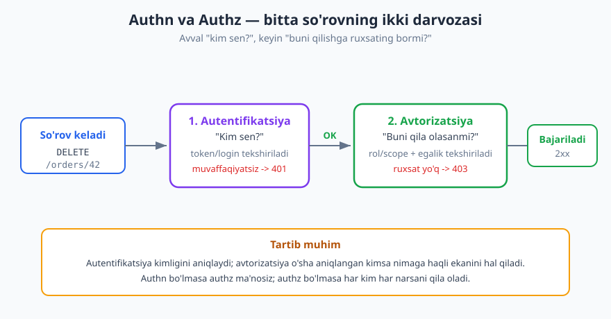
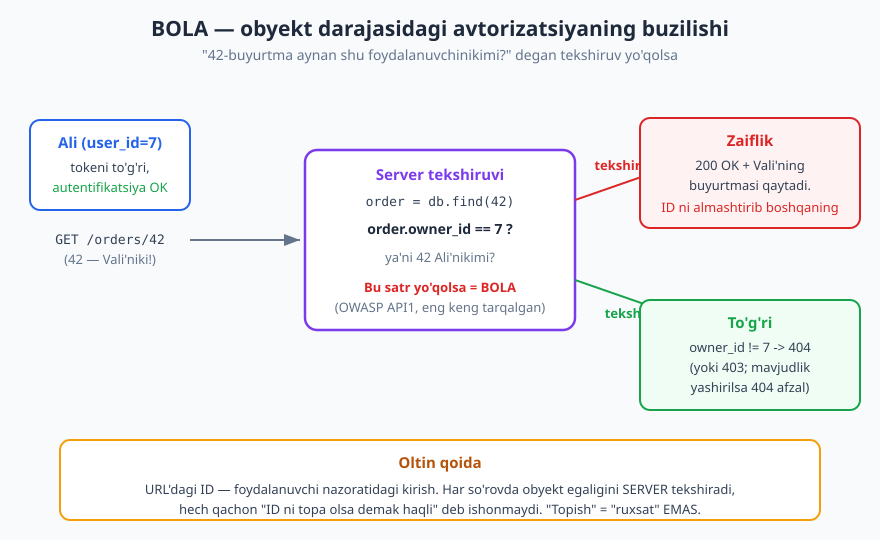
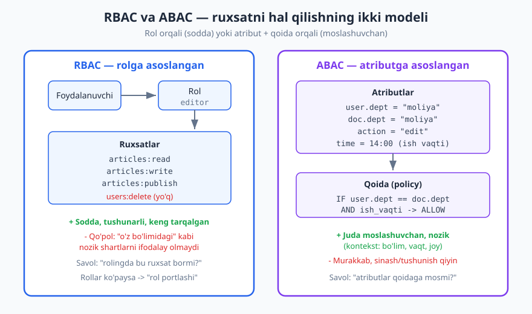

# 12 — Avtorizatsiya va ruxsatlar

[⬅️ Oldingi: 11 — Autentifikatsiya](./11-autentifikatsiya.md) · [🏠 README](./README.md) · [Keyingi: 13 — API xavfsizligi (OWASP API Top 10) ➡️](./13-api-xavfsizligi.md)

---

> **Bu bobda:** Foydalanuvchi kimligini bildik (autentifikatsiya) — endi savol boshqacha: **u BU amalni qila oladimi va BU resursga haqlimi?** Avtorizatsiyaning ikki darajasi (funksiya darajasi va obyekt darajasi) va ularning buzilishi — OWASP'ning eng keng tarqalgan API zaifligi BOLA; ruxsatni modellashtirishning uchta yo'li (RBAC, ABAC, ReBAC); OAuth scope'lari va ularning rol bilan farqi; eng kam imtiyoz tamoyili; avtorizatsiyani qayerda joylash; va `401` vs `403` tanlovi.
>
> **Halollik / Eslatma:** Status kodlari (`401`, `403`, `404`) **RFC 9110** semantikasiga mos. Zaiflik nomlari va tartibi — **OWASP API Security Top 10 (2023)** rasmiy ro'yxatidan (BOLA = API1, BFLA = API5). Scope tushunchasi **OAuth 2.0 (RFC 6749)** ga tayanadi. RBAC/ABAC/ReBAC modellari va "avtorizatsiyani qayerda joylash" — bular standart emas, balki **arxitektura trade-off'lari**; "har doim shunday qil" degan mutlaq qoida yo'q, kontekst hal qiladi. HTTP namunalari RFC 9110 semantikasiga mos; standartlar vaqt bilan o'zgaradi.

---

## Autentifikatsiyadan keyin: ikkinchi savol

[11-bobda](./11-autentifikatsiya.md) biz bitta savolga javob berdik: **"sen kimsan?"** Token tekshirildi, login to'g'ri chiqdi, server endi kim so'rov yuborayotganini biladi. Ali — bu Ali.

Lekin "Ali ekanligi" bilan "Ali shu narsani qila olishi" — butunlay boshqa ikki narsa. Eshikni ochib uyga kirgan mehmon — kim ekani ma'lum, lekin shu bilan u sizning seyfingizni ochishga haqli bo'lib qolmaydi.

Mana **avtorizatsiya** (authz) shu ikkinchi savol:

> **Bu aniqlangan foydalanuvchi BU amalni/resursni qila oladimi?**

Ikkalasini yonma-yon qo'yamiz, chunki ularni adashtirish — eng keng tarqalgan xavfsizlik xatosining ildizi:

| | Autentifikatsiya (authn) | Avtorizatsiya (authz) |
|---|---|---|
| Savol | "Kim sen?" | "Nimaga ruxsating bor?" |
| Nimani aniqlaydi | Shaxsni (identity) | Ruxsatni (permission) |
| Vositasi | Parol, token, JWT, sessiya | Rol, scope, qoida, egalik |
| Buzilsa | Begona "Ali" bo'lib kiradi | Haqiqiy Ali begonaning narsasini ko'radi |
| Muvaffaqiyatsiz status | `401 Unauthorized` | `403 Forbidden` |



Tartib doimo shu: **avval authn, keyin authz.** Authn bo'lmasa authz qaror qabul qilish uchun "kim?" degan tayanchsiz qoladi; authz bo'lmasa har bir muvaffaqiyatli kirgan foydalanuvchi hamma narsani qila oladi. Ikkalasi ham kerak.

> **Diqqat:** Nomlar adashtiradi. `401` ingliz tilida "Unauthorized" deyiladi, lekin u aslida **autentifikatsiya** xatosi ("kim ekaning noma'lum/noto'g'ri"). Haqiqiy **avtorizatsiya** xatosi esa `403 Forbidden`. Bu nomdagi tarixiy chalkashlikni eslab qoling — [03-bobda](./03-http-status-kodlari.md) batafsil ko'rgansiz.

---

## Ikki darajali tekshiruv — bobning yuragi

Ko'pchilik avtorizatsiyani bitta narsa deb o'ylaydi: "foydalanuvchining roli bormi?". Aslida u **ikki mustaqil daraja**da ishlaydi, va ikkalasini ham tekshirish shart. Birini eslab, ikkinchisini unutish — aynan eng katta API zaifliklari shu yerdan keladi.

### 1-daraja: Funksiya / amal darajasi (function-level)

Savol: **"bu foydalanuvchi UMUMAN bu turdagi amalni qila oladimi?"**

Bu *resursning aniq nusxasiga* bog'liq emas — u amal *turi*ga bog'liq. Misollar:

- `DELETE /v1/users/{id}` — bu **admin**ga atalgan endpoint. Oddiy foydalanuvchi qaysi `id` bo'lishidan qat'i nazar, bu amalni umuman qila olmasligi kerak.
- `POST /v1/admin/reports` — faqat moderatorlar.
- `GET /v1/analytics` — faqat manager rol.

Tekshiruv: *"so'rovchining roli/scope'i bu endpoint sinfiga ruxsat beradimi?"*

Agar bu daraja buzilsa — ya'ni oddiy foydalanuvchi admin-only endpoint'ni chaqira olsa — bu **BFLA**: *Broken Function Level Authorization* (**OWASP API5**). Ko'pincha sabab oddiy: frontend admin tugmasini yashiradi, lekin **backend endpoint'ni qo'riqlamaydi** — hujumchi tugmani ko'rmaydi, lekin so'rovni qo'lda yuboradi. [13-bobda](./13-api-xavfsizligi.md) batafsil.

> **Anti-pattern:** "Tugma ko'rinmasa, demak ruxsat yo'q" deb o'ylash. UI'ni yashirish — bu qulaylik, xavfsizlik EMAS. Har bir himoyalangan endpoint serverda mustaqil tekshirilishi shart.

### 2-daraja: Obyekt darajasi (object-level)

Savol: **"bu foydalanuvchi AYNAN MANA SHU nusxaga haqlimi?"**

Endi amal turiga emas, *resursning aynan o'sha nusxasi*ga qaraymiz. Ali `GET /orders/42` so'raydi. Funksiya darajasida hammasi joyida — har qanday mijoz buyurtmani o'qiy oladi. Lekin **42-buyurtma Ali'nikimi yoki Vali'nikimi?**



Agar server `/orders/42` ni topib, egalikni tekshirmasdan qaytarib yuborsa, Ali shunchaki URL'dagi raqamni `42` dan `43`, `44` ga o'zgartirib, boshqalarning buyurtmalarini ketma-ket o'qiy boshlaydi. Bu **BOLA**: *Broken Object Level Authorization* (**OWASP API1**) — ro'yxatdagi **eng yuqori, eng keng tarqalgan API zaifligi**.

Mohiyat ushbu noto'g'ri taxminda:

> **Xavfsizlik:** "Foydalanuvchi `42` ID'sini *biladi/topadi*, demak unga haqli" — bu **xato taxmin**. ID — maxfiy emas; u URL'da, JavaScript'da, log'da ko'rinadi va oson taxmin qilinadi (`41`, `42`, `43`...). **"Topish" hech qachon "ruxsat" degani emas.** Egalikni har so'rovda server o'zi tekshiradi.

To'g'ri yondashuv — har so'rovda obyektni so'rovchiga **bog'lash**:

```
order = db.orders.find(42)
if order is None or order.owner_id != current_user.id:
    return 404   # yoki 403 — pastda
return order
```

Diqqat: bu tekshiruvni *har bir* obyekt-darajali endpoint takrorlashi kerak — `GET`, `PATCH`, `DELETE`, hammasi. Bitta endpoint'da unutilsa — zaiflik o'sha yerda.

> **Trade-off:** Eng ishonchli usul — so'rovni **doim foydalanuvchi kontekstida bajarish**: `db.orders.find(id, owner_id=current_user.id)`, ya'ni so'rovga egalikni *o'rnatib qo'yish*, "topib, keyin tekshirish" emas. Shunda dasturchi tekshiruvni unutib qo'ya olmaydi — begona obyekt shunchaki "topilmadi" bo'lib qaytadi. Bu — xato kamayishini ta'minlovchi dizayn.

> **Eslatma:** Yana bir qarindosh zaiflik bor — **BOPLA** (*Broken Object Property Level Authorization*, **OWASP API3**): foydalanuvchi obyektga haqli, lekin uning *ayrim maydonlari*ga emas. Masalan, foydalanuvchi o'z profilini tahrirlay oladi, lekin `is_admin: true` maydonini o'zgartira olmasligi kerak — uni so'rovda yuborib qo'ysa, server e'tiborsiz qoldirishi (yoki rad etishi) shart. Bu — "mass assignment" muammosi.

---

## Ruxsatni modellashtirish: RBAC, ABAC, ReBAC

Endi savol amaliy bo'ladi: ruxsatni *qanday* hisoblaymiz? Bu yerda bir nechta model bor, har biri o'z trade-off'i bilan.



### RBAC — rolga asoslangan (Role-Based Access Control)

Eng keng tarqalgan, eng sodda model. Zanjir shunday:

**foydalanuvchi → rol(lar) → ruxsatlar**

Foydalanuvchiga bir yoki bir nechta **rol** beriladi (`admin`, `editor`, `viewer`, `support`). Har bir rolga oldindan **ruxsatlar** to'plami biriktiriladi (`articles:write`, `users:delete`). Tekshiruv: *"foydalanuvchi rollaridan biri bu ruxsatga egami?"*

```
ROLE_PERMISSIONS = {
    "admin":  {"articles:*", "users:delete", "billing:read"},
    "editor": {"articles:read", "articles:write", "articles:publish"},
    "viewer": {"articles:read"},
}

def can(user, permission):
    for role in user.roles:
        if permission in ROLE_PERMISSIONS[role]:
            return True
    return False
```

**Afzalligi:** sodda, tushunarli, audit qilish oson ("editor nima qila oladi?" — jadvalga qarang). Aksariyat tizimlar uchun yetarli.

**Kamchiligi:** **qo'pol** (coarse-grained). RBAC "*o'z* bo'limidagi hujjatni tahrirlay oladi" yoki "*ish vaqtida*" kabi kontekstga bog'liq shartlarni tabiiy ifodalay olmaydi. Har bir nozik holat uchun yangi rol yarata boshlasangiz (`editor_moliya`, `editor_marketing`, `editor_moliya_faqat_kunduzi`) — **"rol portlashi"** (role explosion) yuz beradi va model boshqarib bo'lmas holga keladi.

### ABAC — atributga asoslangan (Attribute-Based Access Control)

ABAC qarorni **atributlar** va **qoidalar** asosida chiqaradi. Rol o'rniga — foydalanuvchining, resursning, amalning va muhitning xususiyatlariga qaraydi:

- **Subyekt** atributlari: `user.dept = "moliya"`, `user.level = 3`
- **Resurs** atributlari: `doc.dept = "moliya"`, `doc.classified = false`
- **Amal**: `edit`, `read`
- **Muhit**: vaqt, IP, qurilma

Qoida (policy) bularni birlashtiradi:

```
ALLOW edit ON document IF user.dept == document.dept
                        AND request.time IN ish_vaqti
```

**Afzalligi:** juda **moslashuvchan, nozik** (fine-grained). "O'z bo'limidagi hujjatni faqat ish vaqtida tahrirlash" — RBAC'da imkonsiz bo'lgan shart bu yerda bitta qoida.

**Kamchiligi:** **murakkab**. Qoidalar ko'paygach, "nega bu foydalanuvchi rad etildi?" degan savolga javob berish qiyinlashadi; sinash va audit og'irlashadi. Ko'pincha alohida **policy engine** (masalan, OPA — Open Policy Agent) talab qiladi.

### ReBAC — munosabatga asoslangan (qisqa eslatma)

**ReBAC** (Relationship-Based) ruxsatni *obyektlar orasidagi munosabatlar grafi* orqali hal qiladi: *"Ali shu hujjat joylashgan papkaning egasi, papka esa shu jamoaga tegishli, demak Ali hujjatni ko'ra oladi."* Bu Google'ning **Zanzibar** tizimi ommalashtirgan model (Google Drive'dagi "ushbu havola bilan ulashish" mantiqi shunga o'xshash). Murakkab ulashish/ierarxiya stsenariylarida juda kuchli.

### Solishtirma jadval

| Model | Asos | Kuchli tomoni | Zaif tomoni | Qachon |
|---|---|---|---|---|
| **RBAC** | Rol → ruxsat | Sodda, tushunarli, audit oson | Qo'pol; rol portlashi | Aksariyat ilovalar; aniq lavozimlar |
| **ABAC** | Atribut + qoida | Juda moslashuvchan, kontekstli | Murakkab; sinash/tushunish qiyin | Nozik, kontekstga-bog'liq qoidalar |
| **ReBAC** | Munosabatlar grafi | Ulashish/ierarxiya kuchli | Graf infratuzilmasi kerak | Drive-kabi ulashish, ijtimoiy graf |

> **Trade-off:** Universal "to'g'ri" model yo'q. Ko'p tizim **RBAC'dan boshlaydi** (yetarli va sodda), keyin ayrim nozik joylarga **ABAC shartlarini qo'shadi** — masalan, "rol `editor` BO'LSA VA hujjat o'zinikiga tegishli BO'LSA". Bu aralash yondashuv amalda eng keng tarqalgan: qo'pol qaror RBAC'da, "o'zinikimi?" tekshiruvi (BOLA himoyasi) obyekt darajasida.

---

## Scope'lar (OAuth): tokenning ruxsat doirasi

RBAC foydalanuvchi *kim nima qila oladi*ni belgilaydi. **Scope** boshqa narsani belgilaydi: **token egasi nomidan ilova nimaga ruxsat olgan**.

Tasavvur qiling, Ali uchinchi tomon ilovasiga "mening buyurtmalarimni KO'R" deb ruxsat berdi, lekin "o'zgartir" demadi. OAuth ([11-bob](./11-autentifikatsiya.md)) bu yerda tokenga **scope** biriktiradi — bu token nima qila olishini cheklaydigan yorliqlar:

- `read:orders` — buyurtmalarni o'qish
- `write:orders` — yaratish/o'zgartirish
- `read:profile` — profilni o'qish

Token JWT bo'lsa, scope odatda payload'da turadi:

```json
{
  "sub": "user_7",
  "iss": "https://auth.example.com",
  "aud": "https://api.example.com",
  "exp": 1718540000,
  "scope": "read:orders write:orders",
  "roles": ["customer"]
}
```

Server endpoint'da scope'ni tekshiradi:

```http
POST /v1/orders HTTP/1.1
Host: api.example.com
Authorization: Bearer <faqat read:orders scope'li token>
Content-Type: application/json

{"item_id": 42, "quantity": 2}


HTTP/1.1 403 Forbidden
Content-Type: application/problem+json

{
  "type": "https://api.example.com/problems/insufficient-scope",
  "title": "Insufficient scope",
  "status": 403,
  "detail": "Bu amal uchun 'write:orders' scope kerak; tokeningizda faqat 'read:orders' bor.",
  "instance": "/v1/orders/42",
  "required_scope": "write:orders"
}
```

(Xato javobi formati — `application/problem+json`, RFC 9457; buni [09-bobda](./09-xato-dizayni.md) ko'rgansiz.)

### Scope va RBAC — farqi va bog'liqligi

Buni adashtirish oson, shuning uchun aniq ajratamiz:

| | Scope | Rol (RBAC) |
|---|---|---|
| Nimani cheklaydi | Ilova foydalanuvchi nomidan **nimagacha** bora oladi | Foydalanuvchining **o'zi** nima qila oladi |
| Kim beradi | Foydalanuvchi rozilik berib (OAuth) | Administrator/tizim |
| Misol | "bu ilova faqat o'qiy oladi" | "Ali — moderator" |

Ular **birga ishlaydi**: token `write:orders` scope'iga ega bo'lishi (ilova ruxsatga ega) **VA** Ali roli buyurtma yarata olishi (foydalanuvchi haqli) kerak. Ya'ni yakuniy ruxsat = *scope ⋂ foydalanuvchi ruxsati* — ikkalasidan kichigini oladi. Token "yozish" deyishi, lekin foydalanuvchining o'zi yozolmasa — baribir rad.

> **Eslatma:** Token dizaynida — **minimal scope** tamoyiliga rioya qiling. Ilovaga unga aslida kerak bo'lgan eng kichik scope to'plamini bering, "hamma narsa" emas. Bu keyingi bo'limdagi eng kam imtiyoz tamoyilining bevosita tatbiqi.

---

## Eng kam imtiyoz (least privilege): default deny

Avtorizatsiyaning eng muhim yagona tamoyili shu:

> **Standart:** **Eng kam imtiyoz** (Principle of Least Privilege): har bir subyektga vazifasini bajarish uchun zarur bo'lgan **eng kam** ruxsat beriladi — ortig'i emas. Va asosiy holat — **default deny**: aniq ruxsat berilmagan hamma narsa **rad etiladi**, ruxsat berilmagan emas, balki *taqiqlangan* hisoblanadi.

Bu nima uchun shunchalik muhim? Chunki **xato yo'nalishi** ahamiyatli:

- **Default allow** (ochiq, faqat aniq taqiqlangani yopiq): bitta endpoint'da tekshiruvni unutsangiz — u **himoyasiz ochiq qoladi**. Xato = teshik.
- **Default deny** (yopiq, faqat aniq ruxsat berilgani ochiq): bitta endpoint'da ruxsat berishni unutsangiz — u **ishlamay qoladi**. Xato = buzilgan funksiya, lekin teshik emas.

Birinchi holatda xato jimgina xavfsizlik zaifligiga aylanadi; ikkinchi holatda xato darrov ko'rinadi va tuzatiladi. Shuning uchun **default deny doimo afzal** — u xatoni xavfsiz tomonga yiqitadi ("fail closed").

Amaliy tatbiqlar:

- Yangi endpoint qo'shganda — u **default himoyalangan**; ruxsatni *ataylab* ochasiz.
- Token'ga **minimal scope**; rolga **minimal ruxsat**.
- Vaqtinchalik vazifa uchun **vaqtinchalik** ruxsat — keyin qaytarib olinadi.
- Admin ruxsatlarini ehtiyot bilan tarqating; "har ehtimolga qarshi" hamma narsa berib qo'yish — anti-pattern.

---

## Avtorizatsiya qayerda yashashi kerak?

Tekshiruvni qayerga joylaysiz? Bu — arxitektura qarori, va u BOLA/BFLA kabi zaifliklarning oldini olishda hal qiluvchi.

### Tarqoq (scattered) vs markazlashtirilgan (centralized)

**Tarqoq:** har bir endpoint'ning kodi ichida `if` tekshiruvlari qo'lda yoziladi. Sodda boshlanadi, lekin tez **bir xil emas** bo'lib ketadi — bir joyda tekshirildi, boshqa joyda unutildi. Aynan BOLA shunday tug'iladi.

**Markazlashtirilgan:** avtorizatsiya bitta umumiy qatlamga to'planadi — **middleware**, **decorator/policy** yoki alohida **policy engine** (OPA). Endpoint'lar shu qatlamdan o'tadi; tekshiruv mantig'i bitta joyda, izchil, sinaladigan.

> **Trade-off:** **Funksiya darajasi** tekshiruvini markazlashtirish oson — middleware "bu yo'l `admin` rolini talab qiladi" deydi. Lekin **obyekt darajasi** (BOLA) tekshiruvini to'liq markazlashtirib bo'lmaydi: "42-buyurtma Ali'nikimi?" degan savolga javob faqat *resursni yuklab*, uning egasini *so'rovchi bilan solishtirib* beriladi — bu ko'pincha biznes-mantig'i ichida, ma'lumot bazasiga yaqin joyda turadi. Shuning uchun amalda: funksiya darajasi — markaziy darvozada, obyekt darajasi — har resurs bilan ishlash nuqtasida, lekin **bir xil naqsh** bilan.

### Gateway darajasi vs servis darajasi

Mikroservis muhitida yana bir qatlam bor — **API gateway** ([23-bob](./23-api-gateway-bff.md)).

- **Gateway** odatda **qo'pol** tekshiruvni bajaradi: token to'g'rimi (autentifikatsiya), eng asosiy funksiya-darajali qoidalar ("`/admin/*` ga admin scope kerak"). U "darvozabon".
- **Servis** esa **nozik** tekshiruvni qiladi: aynan obyekt egaligini, biznes-qoidalarini. Faqat servis 42-buyurtma kimga tegishli ekanini biladi.

> **Diqqat:** "Gateway tokenni tekshirdi-ku, demak servis ichida hamma so'rov ishonchli" — bu xavfli. Gateway BOLA'ni bilmaydi. Har bir servis o'z obyekt-darajali tekshiruvini **o'zi** qilishi shart — **zero trust**: ichki so'rovlar ham tekshiriladi.

---

## 401 vs 403 — qaysi javob, va nimani oshkor qilamiz

Avtorizatsiya rad etilganda qaysi status kodi? [03-bobga](./03-http-status-kodlari.md) tayanib (RFC 9110):

- **`401 Unauthorized`** — autentifikatsiya **yo'q yoki noto'g'ri**. "Sen kim ekaning noma'lum." Server `WWW-Authenticate` sarlavhasini qaytaradi. Bu — authn xatosi, authz emas.
- **`403 Forbidden`** — kim ekaning **ma'lum**, lekin bu amal/resursga **ruxsating yo'q**. Bu — sof avtorizatsiya xatosi. `403`'ni qayta urinish foyda bermaydi: kimligi o'zgarmaguncha javob o'zgarmaydi.

Lekin obyekt darajasida nozik nuqta bor: `403` o'zi **resurs mavjudligini oshkor qiladi**. "42-buyurtma senga emas" desangiz, hujumchi 42-buyurtma *borligini* bilib oladi. Maxfiy resurslarda buni yashirish kerak:

```http
GET /v1/orders/42 HTTP/1.1
Host: api.example.com
Authorization: Bearer <Ali'ning tokeni; 42 esa Vali'niki>


HTTP/1.1 404 Not Found
Content-Type: application/problem+json

{
  "type": "https://api.example.com/problems/not-found",
  "title": "Not Found",
  "status": 404,
  "detail": "So'ralgan resurs topilmadi."
}
```

Bu yerda `404` ataylab tanlangan: Ali uchun begona buyurtma "umuman yo'q" ko'rinadi. U `42`, `43`, `44` ni sinab ham hech qanday ma'lumot ololmaydi — borini ham, yo'qini ham ajrata olmaydi.

> **Trade-off:** `403` vs `404` — bu **aniqlik vs maxfiylik** murosasi. `403` halolroq va debug uchun qulayroq ("ruxsating yo'q"), lekin mavjudlikni oshkor qiladi. `404` mavjudlikni yashiradi, lekin chalg'ituvchi ("nega topilmadi? URL to'g'ri-ku?"). Qoida: **maxfiy/shaxsiy resurslar** (boshqaning buyurtmasi, hujjati) uchun `404`; **ochiq-ma'lum, lekin ruxsat talab qiladigan** amal (admin paneli mavjudligi sir emas) uchun `403`. Ikkala holatda ham javobda *nega* rad etilganini ortiqcha izohlab, hujumchiga yo'l ko'rsatib qo'ymang.

---

## Asosiy g'oyalar (bobni qisqacha)

- **Authn vs authz:** autentifikatsiya — "kim sen?" (shaxs), avtorizatsiya — "nimaga haqliding?" (ruxsat). Avval authn, keyin authz. Authn xatosi = `401`, authz xatosi = `403`.
- **Ikki darajali tekshiruv — eng muhim g'oya.** *Funksiya darajasi:* "bu turdagi amalni umuman qila oladimi?" (buzilsa **BFLA**, OWASP API5). *Obyekt darajasi:* "aynan shu nusxaga haqlimi?" (buzilsa **BOLA**, OWASP API1 — eng keng tarqalgan API zaifligi). Har ikkisini ham tekshiring.
- **"Topish ≠ ruxsat":** URL'dagi ID maxfiy emas; egalikni har so'rovda server tekshiradi. Eng xavfsizi — so'rovni doim foydalanuvchi kontekstida bajarish (`find(id, owner_id=...)`), "topib-keyin-tekshirish" emas.
- **Modellar:** **RBAC** (rol → ruxsat, sodda, qo'pol), **ABAC** (atribut + qoida, moslashuvchan, murakkab), **ReBAC** (munosabatlar grafi, Zanzibar). Universal "to'g'ri" yo'q; amalda ko'pincha RBAC + obyekt-darajali egalik tekshiruvi.
- **Scope ≠ rol:** scope — *ilova* foydalanuvchi nomidan nimagacha bora olishini cheklaydi (OAuth); rol — *foydalanuvchining o'zi* nima qila olishini. Yakuniy ruxsat = ikkalasining kesishmasi. Token dizaynida **minimal scope**.
- **Eng kam imtiyoz + default deny:** aniq ruxsat berilmagan hamma narsa rad etiladi. Xato yo'nalishi muhim — default deny xatoni "buzilgan funksiya"ga (xavfsiz), default allow esa "ochiq teshik"ka aylantiradi.
- **Qayerda:** funksiya darajasi — markaziy middleware/gateway'da; obyekt darajasi — har resurs nuqtasida, lekin **bir xil naqsh** bilan. Har servis o'z BOLA tekshiruvini o'zi qiladi (zero trust).
- **401 vs 403 vs 404:** authn yo'q → `401`; ruxsat yo'q → `403`; maxfiy resurs mavjudligini yashirish kerak bo'lsa → `404`.

---

## Mashqlar

### Oson

**1-mashq.** Quyidagi har bir holat **autentifikatsiya** muammosimi yoki **avtorizatsiya** muammosi, va qaysi status kodi (`401` yoki `403`) to'g'ri keladi?
- (a) Foydalanuvchi token umuman yubormasdan himoyalangan endpoint'ga so'rov yubordi.
- (b) Token to'g'ri va amal qiluvchi, lekin oddiy foydalanuvchi `DELETE /v1/users/9` ni chaqirdi (bu admin amali).
- (c) Tokenning `exp` vaqti o'tib ketgan (muddati tugagan).

**2-mashq.** Bir RBAC tizimida `editor` roli `articles:read`, `articles:write`, `articles:publish` ruxsatlariga ega; `viewer` roli faqat `articles:read`. Quyidagilarni ayting: (a) `viewer` maqola e'lon qila oladimi? (b) `editor` foydalanuvchini o'chira oladimi (`users:delete`)? (c) Bu modelda zanjir qanday: foydalanuvchidan ruxsatga qadar nima orqali o'tiladi?

**3-mashq.** O'z so'zlaringiz bilan tushuntiring: nima uchun "frontend'da admin tugmasini yashirish" avtorizatsiya emas? Hujumchi bu himoyani qanday chetlab o'tadi?

### O'rta

**4-mashq.** Sizga ikki talab keldi: (a) "barcha managerlar hisobotlarni ko'ra olsin"; (b) "foydalanuvchi faqat *o'z bo'limidagi* va faqat *ish vaqtida* hujjatni tahrirlay olsin". Har biri uchun **RBAC** yoki **ABAC** dan qaysi biri mosroq va nega? Aralash yondashuv qanday ko'rinishi mumkin?

**5-mashq.** Buyurtma API'si uchun scope to'plamini loyihalang: o'qish, yaratish, bekor qilish va to'liq boshqaruv (admin) amallari bor. Scope nomlarini yozing. Keyin: foydalanuvchi mobil ilovaga ruxsat berayotganda, ilova qaysi minimal scope'larni so'rashi kerak, agar u faqat buyurtmalarni ko'rsatib, yangi buyurtma yaratsa? Javobingizni **minimal scope** tamoyili bilan asoslang.

**6-mashq.** Quyidagi ikki so'rovning qaysi biri **funksiya darajasi**, qaysi biri **obyekt darajasi** tekshiruvini talab qiladi? Har biri uchun aniq tekshiruv savolini yozing.
- (a) `GET /v1/admin/audit-log` (oddiy foydalanuvchi chaqirdi)
- (b) `PATCH /v1/orders/77` (foydalanuvchi 77-buyurtmani yangilamoqchi)

### Qiyin

**7-mashq.** Quyidagi psevdokodda **BOLA zaifligi** bor. Uni toping, nima uchun xavfli ekanini tushuntiring va tuzating. Tuzatishda obyekt darajasi tekshiruvini eng xato-bardosh tarzda joylang, hamda begona resurs uchun qaysi status kodini qaytarishni asoslang.
```
GET /v1/invoices/{id}
  user = authenticate(request.token)   # 401 agar muvaffaqiyatsiz
  invoice = db.invoices.find(id)
  return 200, invoice
```

**8-mashq.** Kichik SaaS uchun **eng kam imtiyozli RBAC** sxemasini loyihalang: rollar (`owner`, `member`, `billing`, `viewer`) va ularning ruxsatlari (loyihalar, a'zolar, to'lov, sozlamalar bo'yicha). Jadval ko'rinishida ber. Keyin tushuntiring: nega "default deny" bu sxemada xavfsizroq, va yangi endpoint qo'shilganda nima sodir bo'ladi?

**9-mashq.** Bitta **ABAC qoidasi** yozing (psevdo-qoida ko'rinishida): "shifokor bemorning yozuvini faqat (a) o'sha bemor *o'z* bo'limiga biriktirilgan bo'lsa VA (b) bemor bilan *faol* tashrifi bo'lsa, va (c) yozuv `top-secret` belgisiga ega bo'lmasa" o'qiy oladi. Keyin tushuntiring: bu qoidani **RBAC bilan** ifodalashga uringanda nima uchun "rol portlashi" yuz beradi.

<details markdown="1">
<summary>Yechimlar</summary>

### 1-mashq yechimi
- (a) **Autentifikatsiya** muammosi → **`401`**. Token yo'q — "kim sen?" javobsiz; bu authn darvozasida to'xtaydi.
- (b) **Avtorizatsiya** muammosi → **`403`**. Kim ekani ma'lum (token to'g'ri), lekin amal admin-only — ruxsat yo'q. Bu funksiya darajasi tekshiruvi (buzilsa BFLA bo'lardi).
- (c) **Autentifikatsiya** muammosi → **`401`**. Muddati tugagan token = amal qilmaydigan token; shaxsni isbotlay olmaydi. (Mijoz refresh qilib qayta urinishi kerak.)

### 2-mashq yechimi
- (a) **Yo'q.** `viewer` faqat `articles:read` ga ega; `articles:publish` uning ruxsatlarida yo'q.
- (b) **Yo'q.** `editor`da maqola bilan bog'liq ruxsatlar bor, lekin `users:delete` yo'q — bu boshqa rolga (masalan `admin`) tegishli.
- (c) Zanjir: **foydalanuvchi → rol(lar) → ruxsatlar.** Foydalanuvchiga rol biriktiriladi, rolga oldindan ruxsatlar to'plami biriktirilgan; tekshiruv "foydalanuvchi rollaridan birida bu ruxsat bormi?" degan savolga keladi.

### 3-mashq yechimi
Frontend faqat **ko'rinish**ni boshqaradi — tugmani yashirish foydalanuvchi uni *bosa olmasligi*ni anglatadi, lekin endpoint'ga so'rov yuborilishini to'sa olmaydi. Hujumchi brauzer konsoli, `curl` yoki Postman orqali aynan o'sha so'rovni (`DELETE /v1/users/9`) **qo'lda** yuboradi — UI umuman ishtirok etmaydi. Agar backend so'rovni mustaqil tekshirmasa, amal bajariladi. Bu BFLA (OWASP API5). Xulosa: **avtorizatsiya har doim serverda, har so'rovda** bo'lishi shart; UI'ni yashirish — qulaylik, himoya emas.

### 4-mashq yechimi
- (a) "barcha managerlar hisobotlarni ko'rsin" — bu **RBAC** uchun ideal: aniq rol (`manager`), aniq ruxsat (`reports:read`). Hech qanday kontekst yoki atribut shartiga ehtiyoj yo'q.
- (b) "faqat o'z bo'limidagi va faqat ish vaqtida" — bu **ABAC** talab qiladi: qaror `user.dept == doc.dept` (atributlar taqqoslash) va `time IN ish_vaqti` (muhit) shartlariga bog'liq. RBAC buni faqat bo'lim×vaqt kombinatsiyalari uchun rol yaratib ifodalashga uringanda portlaydi.
- **Aralash:** RBAC qo'pol qatlamni beradi (`role == editor` — umuman tahrirlash huquqi bormi?), so'ng ABAC-uslubidagi shart obyekt darajasida qo'shiladi (`AND user.dept == doc.dept AND ish_vaqti`). Amalda eng keng tarqalgan naqsh aynan shu.

### 5-mashq yechimi
Scope to'plami (minimal, aniq amallar):
- `read:orders` — buyurtmalarni o'qish
- `write:orders` — yangi buyurtma yaratish/o'zgartirish
- `cancel:orders` — buyurtmani bekor qilish
- `admin:orders` — to'liq boshqaruv (barcha mijozlar bo'yicha)

Faqat buyurtmalarni ko'rsatib, yangi buyurtma yaratadigan mobil ilova **`read:orders` va `write:orders`** ni so'rashi kerak — `cancel:orders` ham, `admin:orders` ham emas. **Minimal scope** tamoyili: ilovaga aslida kerak bo'lgan eng kam ruxsat beriladi. Agar token o'g'irlansa, zarar shu ikki amal bilan cheklanadi — hujumchi buyurtmalarni bekor qila olmaydi yoki boshqalarnikini ko'ra olmaydi. "Har ehtimolga qarshi `admin:orders` so'rab qo'yaylik" — anti-pattern.

### 6-mashq yechimi
- (a) `GET /v1/admin/audit-log` — **funksiya darajasi.** Savol: *"so'rovchining roli/scope'i bu endpoint sinfiga (audit-log o'qish) umuman ruxsat beradimi?"* Resursning aniq nusxasi bilan bog'liq emas; oddiy foydalanuvchi qaysi log bo'lishidan qat'i nazar bu yo'lga umuman kira olmaydi. Buzilsa — BFLA.
- (b) `PATCH /v1/orders/77` — **obyekt darajasi.** Savol: *"77-buyurtma aynan shu foydalanuvchinikimi (`order.owner_id == user.id`)?"* Har qanday mijoz buyurtma yangilay oladi (funksiya joiz), lekin faqat *o'zinikini*. Buzilsa — BOLA. (Aniqrog'i, ikkala daraja ham qo'llaniladi: avval "buyurtma yangilay oladimi?" — funksiya, keyin "aynan 77 niki?" — obyekt.)

### 7-mashq yechimi
**Zaiflik:** `db.invoices.find(id)` `id` bo'yicha har qanday hisob-fakturani topadi va **egalikni tekshirmasdan** qaytaradi. Autentifikatsiya bor (`user` aniqlangan), lekin **obyekt darajasi avtorizatsiyasi yo'q** — bu BOLA (OWASP API1). Foydalanuvchi `id` ni `100`, `101`, `102` ga o'zgartirib, begona hisob-fakturalarni ketma-ket o'qiy boshlaydi.

**Nega xavfli:** ID — maxfiy emas (URL'da, taxmin qilinadigan); "ID ni topa olsa demak haqli" — xato taxmin. Hisob-faktura — moliyaviy, shaxsiy ma'lumot.

**Tuzatish** (eng xato-bardosh: egalikni so'rovga *o'rnatib*, "topib-keyin-tekshirish" emas):
```
GET /v1/invoices/{id}
  user = authenticate(request.token)        # 401 agar muvaffaqiyatsiz
  invoice = db.invoices.find(id, owner_id=user.id)
  if invoice is None:
      return 404                            # begona yoki mavjud emas — ajratilmaydi
  return 200, invoice
```
Bu yerda so'rovning o'zi `owner_id` bilan cheklangan — dasturchi keyinchalik tekshiruvni unuta olmaydi. **Status kodi: `404`** tanlandi, chunki hisob-faktura — maxfiy/shaxsiy resurs; `404` uning mavjudligini ham yashiradi, shuning uchun hujumchi `id` ni sanab borib "bormi-yo'qmi?" degan ma'lumotni ham ololmaydi. (Agar mavjudlikni yashirish shart bo'lmaganida, "ruxsating yo'q" ni halol bildirish uchun `403` ham joiz bo'lardi.)

### 8-mashq yechimi
Eng kam imtiyozli RBAC sxemasi:

| Ruxsat | `owner` | `member` | `billing` | `viewer` |
|---|---|---|---|---|
| `projects:read` | ✔ | ✔ | ✖ | ✔ |
| `projects:write` | ✔ | ✔ | ✖ | ✖ |
| `members:manage` | ✔ | ✖ | ✖ | ✖ |
| `billing:read` | ✔ | ✖ | ✔ | ✖ |
| `billing:write` | ✔ | ✖ | ✔ | ✖ |
| `settings:write` | ✔ | ✖ | ✖ | ✖ |

Har rol o'z vazifasi uchun zarur eng kam ruxsatga ega: `viewer` faqat o'qiydi; `billing` faqat to'lovga tegadi (loyiha kodiga emas); `member` ishlaydi, lekin a'zolar/to'lov/sozlamalarni boshqarmaydi; `owner` to'liq.

**Nega default deny xavfsizroq:** jadvalda `✖` turgan har bir katak — *aniq taqiqlangan emas, balki ruxsat berilmagani uchun rad etilgan*. Yangi endpoint qo'shilganda u **avtomatik hech kimga ochiq emas** — kodda ataylab "bu yo'l `X` ruxsatini talab qiladi" deb yozib, kerakli rollarga `X` berilmaguncha hech kim kira olmaydi. Demak, ruxsat berishni unutsangiz — funksiya *ishlamaydi* (darrov sezasiz), lekin teshik ochilmaydi. Default allow bo'lganida — aynan teskari: unutsangiz, endpoint himoyasiz ochiq qolardi.

### 9-mashq yechimi
ABAC qoidasi:
```
ALLOW read ON patient_record AS doctor IF
       patient.department == doctor.department      # (a) o'z bo'limi
   AND exists_active_visit(doctor, patient)         # (b) faol tashrif
   AND patient_record.classification != "top-secret" # (c) maxfiy emas
```
Qaror uchta atributga bog'liq: resurs-subyekt munosabati (`department` tengligi), dinamik holat (faol tashrif bor-yo'qligi) va resurs atributi (`classification`).

**Nega RBAC'da rol portlashi:** RBAC faqat oldindan biriktirilgan ruxsatlarni biladi — u "o'z bo'limi", "faol tashrif", "maxfiylik darajasi" kabi *ish vaqtidagi, kontekstga bog'liq* shartlarni ifodalay olmaydi. Buni RBAC bilan modellashtirishga uringanda har kombinatsiya uchun alohida rol kerak bo'ladi: `doctor_kardiologiya_faol_tashrif_oddiy`, `doctor_nevrologiya_faol_tashrif_oddiy`, va hokazo — bo'limlar × tashrif holatlari × maxfiylik darajalari ko'paytmasi soni rollarni portlatadi va, eng yomoni, "faol tashrif" kabi dinamik shartni statik rol baribir ifodalay olmaydi. Shuning uchun bunday nozik, kontekstli qoidalar — ABAC'ning aynan o'rni.

</details>

---

[⬅️ Oldingi: 11 — Autentifikatsiya](./11-autentifikatsiya.md) · [🏠 README](./README.md) · [Keyingi: 13 — API xavfsizligi (OWASP API Top 10) ➡️](./13-api-xavfsizligi.md)
