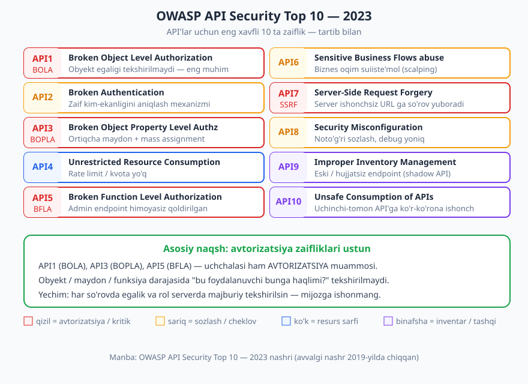
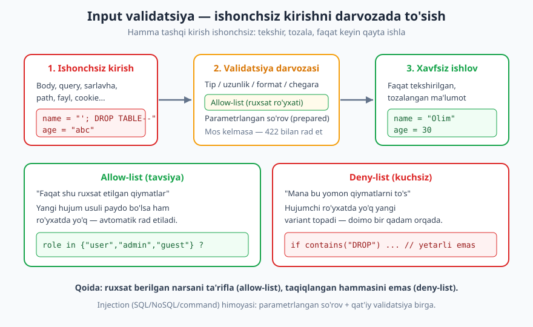
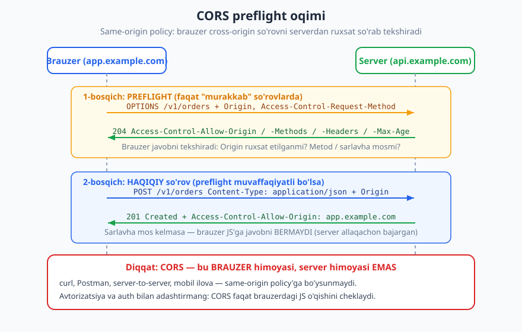

# 13 — API xavfsizligi (OWASP API Top 10)

[⬅️ Oldingi: 12 — Avtorizatsiya va ruxsatlar](./12-avtorizatsiya.md) · [🏠 README](./README.md) · [Keyingi: 14 — Rate limiting, throttling, kvotalar ➡️](./14-rate-limiting.md)

---

> **Bu bobda:** API xavfsizligi nega alohida fan ekanini, **OWASP API Security Top 10 — 2023** ro'yxatining har bir bandini (API1 dan API10 gacha) tushuntiramiz va himoyasini ko'rsatamiz. So'ng ko'ndalang (har joyda kerak bo'ladigan) himoyalarni o'rganamiz: input validatsiya va injection himoyasi, ma'lumot oshkorligini cheklash, TLS, CORS va xavfsizlik sarlavhalari. Misollarda buzuq va tuzatilgan kodni yonma-yon ko'ramiz.
>
> **Halollik / Eslatma:** Tahdidlar ro'yxati **OWASP API Security Top 10 — 2023 nashri**ga aniq tayanadi (avvalgi nashr 2019-yilda chiqqan; ro'yxat vaqt bilan yangilanadi). Status kod semantikasi **RFC 9110**, CORS esa **WHATWG Fetch** standartiga asoslanadi. Bu yerdagi barcha JSON namunalar valid; xavfsizlik — qat'iy qoidalar emas, balki tahdid modeliga bog'liq trade-off'lar to'plami, shuni halol belgilab boramiz.

---

## API xavfsizligi nega alohida

An'anaviy veb-saytda foydalanuvchi tugmalarni bosadi, server esa unga tayyor HTML sahifa qaytaradi. Hujum yuzasi cheklangan: foydalanuvchi faqat ekrandagi narsalarni ko'radi va biznes mantiq serverning ichida, ko'rinmas joyda yashiringan bo'ladi.

API'da hammasi ochiq. API — bu **mashina uchun eshik**. U biznes mantiqni va ma'lumotni **to'g'ridan-to'g'ri** tashqariga ochadi:

- Veb-UI'da "buyurtmani bekor qil" tugmasi faqat o'z buyurtmalaringizda ko'rinadi. API'da esa `DELETE /v1/orders/{id}` endpoint mavjud — hujumchi istalgan `{id}` ni qo'lda yozib sinab ko'rishi mumkin.
- Brauzer ilovasi ortida har doim API turadi. Hujumchi UI'ni e'tiborsiz qoldirib, API'ga `curl` yoki skript bilan to'g'ridan-to'g'ri murojaat qiladi. **Mijozdagi (frontend) har qanday tekshiruv — bezak**, chunki uni chetlab o'tish oson.

Shuning uchun API'lar ko'pincha **"eng katta hujum yuzasi"** deb ataladi. Endpointlar son-sanoqsiz, har biri parametr qabul qiladi, har biri ma'lumot ochadi. Bitta unutilgan tekshiruv — butun ma'lumotlar bazasiga yo'l ochadi.

> **Xavfsizlik:** Oltin qoida — **mijozga hech qachon ishonmang**. Validatsiya, avtorizatsiya, rate limiting — hammasi **serverda** majburiy bo'lishi shart. Frontend'dagi tekshiruv faqat foydalanuvchi qulayligi (UX) uchun, xavfsizlik uchun emas.

Bu bob — xavfsizlikning **xaritasi**. Auth (kim ekanligini aniqlash) [11 — autentifikatsiya](./11-autentifikatsiya.md) va avtorizatsiya (nimaga haqli) [12 — avtorizatsiya](./12-avtorizatsiya.md) boblarida chuqur ko'rilgan; bu yerda ularni umumiy tahdid manzarasiga joylashtirib, qolgan zaifliklarni qo'shamiz.

---

## OWASP API Security Top 10 — 2023

OWASP (Open Worldwide Application Security Project) — xavfsizlik bo'yicha eng nufuzli notijorat tashkilot. Ular muntazam ravishda eng keng tarqalgan zaifliklarning ro'yxatini chiqaradi. **API Security Top 10** — maxsus API'larga bag'ishlangan ro'yxat; eng so'nggi nashri **2023-yil**.

> **Standart:** Quyidagi ro'yxat **OWASP API Security Top 10 — 2023** nashridan aynan olingan (tartibi bilan). Bu — "qonun" emas, balki sanoatda kuzatilgan eng tez-tez uchraydigan va eng zararli zaifliklar ro'yxati. Ro'yxat vaqt bilan yangilanadi.



Diqqat bilan qarasangiz, bitta naqsh ko'rinadi: **API1, API3, API5 — uchchalasi ham avtorizatsiya muammosi** (obyekt, maydon va funksiya darajasida). API xavfsizligining yuragi — "bu foydalanuvchi shu narsaga haqlimi?" degan savolga har safar serverda javob berish.

### API1 — Broken Object Level Authorization (BOLA)

**Eng muhim va eng keng tarqalgan API zaifligi.** "Broken Object Level Authorization" — obyekt darajasidagi avtorizatsiyaning buzilishi. Server foydalanuvchini autentifikatsiya qiladi (kim ekanligini biladi), lekin so'ralgan **obyekt unga tegishlimi** — buni tekshirmaydi.

Klassik misol:

```http
GET /v1/orders/1043 HTTP/1.1
Host: api.example.com
Authorization: Bearer <Olim_token>
```

Olim tizimga to'g'ri kirgan. Lekin `1043` — Salimning buyurtmasi. Agar server faqat "token to'g'rimi?" deb tekshirib, "bu buyurtma Olimnikimi?" deb tekshirmasa, Olim Salimning ma'lumotini ko'radi. ID'ni `1044`, `1045` deb oshirib (yoki kamaytirib), hujumchi butun bazani **sidirib chiqishi** mumkin — bunga **IDOR** (Insecure Direct Object Reference) ham deyiladi.

**Himoya:** har bir obyekt so'rovida **egalik tekshiruvi** — bu obyekt shu foydalanuvchiga tegishlimi yoki u ko'rishga haqlimi? Buni bevosita ma'lumotlar bazasi so'roviga kiriting:

```sql
-- Buzuq: faqat ID bo'yicha
SELECT * FROM orders WHERE id = 1043;
-- Tuzatilgan: ID + egalik birga
SELECT * FROM orders WHERE id = 1043 AND owner_id = :current_user_id;
```

Topilmasa — `404 Not Found` qaytaring (`403` emas; quyida sababini ko'ramiz). Bu mavzu [12 — avtorizatsiya](./12-avtorizatsiya.md) bobida chuqur ko'rilgan.

### API2 — Broken Authentication

Autentifikatsiya — "sen kimsan?" mexanizmi — zaif yoki noto'g'ri amalga oshirilgan. Misollar: parolni "brute force" qilishga yo'l ochiq (rate limit yo'q), token muddati cheksiz, JWT imzosi tekshirilmaydi (`alg: none` qabul qilinadi), parol oddiy matn (plaintext) saqlanadi, "parolni unutdim" oqimi orqali akkaunt egallab olinadi.

**Himoya:** kuchli token mexanizmi, qisqa muddatli access token + refresh token, login urinishlarini cheklash, ko'p faktorli autentifikatsiya (MFA), JWT imzosini **har doim** tekshirish. Batafsil — [11 — autentifikatsiya](./11-autentifikatsiya.md) bobida.

### API3 — Broken Object Property Level Authorization (BOPLA)

Bu — BOLA'ning **maydon darajasidagi** ko'rinishi. Foydalanuvchi obyektga (masalan, o'z profiliga) haqli, lekin u **ko'rmasligi yoki o'zgartirmasligi kerak bo'lgan maydonlar** ham ochiq. Ikki ko'rinishi bor:

**1. Ortiqcha ma'lumot oshkorligi (excessive data exposure).** Server obyektni "to'liq holida" qaytaradi va ichida nozik maydonlar bo'ladi:

```json
{
  "id": 42,
  "name": "Olim",
  "email": "olim@example.com",
  "password_hash": "$2b$12$...",
  "internal_risk_score": 0.83,
  "is_admin": false
}
```

`password_hash` va `internal_risk_score` mijozga **hech qachon** chiqmasligi kerak.

**2. Mass assignment.** Server kelgan JSON'ni "ko'r-ko'rona" obyektga yozadi. Foydalanuvchi ortiqcha maydon yuboradi:

```http
PATCH /v1/users/42 HTTP/1.1
Content-Type: application/json

{"name": "Olim", "is_admin": true}
```

Agar server `is_admin`ni ham qabul qilsa — oddiy foydalanuvchi o'zini admin qilib oladi.

**Himoya:** kirishda va chiqishda **allow-list** ishlating — qaysi maydonlar ruxsat etilgan, faqat o'shalarni o'qing/yozing. Javob uchun alohida DTO/serializer ishlating, ichki modelni to'g'ridan-to'g'ri qaytarmang. Bu [07 — so'rov/javob payload](./07-sorov-javob-payload.md) bobidagi payload dizayni bilan chambarchas bog'liq.

### API4 — Unrestricted Resource Consumption

So'rovlar soni, hajmi yoki narxi cheklanmagan. Hujumchi minglab so'rov yuboradi, ulkan fayllar yuklaydi, yoki bitta og'ir so'rov (masalan, chuqur GraphQL query yoki cheksiz sahifa hajmi) bilan serverni "tiz cho'ktiradi". Bu nafaqat xizmatdan voz kechirish (DoS) tahdidi, balki pulli resurslar (SMS, tashqi API chaqiruvlari) orqali **moliyaviy zarar** ham keltiradi.

**Himoya:** rate limiting va kvotalar, so'rov tanasi hajmiga chegara, sahifa hajmiga maksimum (`limit<=100`), murakkab so'rovlarga vaqt/qiymat byudjeti. To'liq mavzu — [14 — rate limiting, throttling, kvotalar](./14-rate-limiting.md) bobida.

### API5 — Broken Function Level Authorization (BFLA)

Bu — **funksiya (amal) darajasidagi** avtorizatsiya buzilishi. Foydalanuvchi muayyan **amalni** bajarishga haqli emas, lekin endpoint himoyasiz. Eng tipik holat — admin endpointlar oddiy foydalanuvchi uchun ham ishlaydi:

```http
DELETE /v1/admin/users/99 HTTP/1.1
Authorization: Bearer <oddiy_foydalanuvchi_token>

HTTP/1.1 204 No Content
```

Server faqat "token bormi?" deb tekshirgan, "bu foydalanuvchi admin'mi?" deb emas. Hujumchi `/admin/...` yo'llarini taxmin qilib yoki UI'da yashirin tugmalarni topib, ruxsatsiz amallarni bajaradi.

**Himoya:** har bir endpoint uchun **rol/ruxsat tekshiruvi** — afzal markazlashtirilgan middleware orqali. "Default deny" tamoyili: yangi endpoint qo'shilganda u **avtomatik ravishda** himoyalangan bo'lishi, ataylab ochilishi kerak. BOLA (obyekt) va BFLA (funksiya) farqi: BOLA — "qaysi yozuv", BFLA — "qaysi amal".

### API6 — Unrestricted Access to Sensitive Business Flows

Bu — texnik zaiflik emas, **biznes mantiqning suiiste'mol qilinishi**. Har bir so'rov alohida olganda qonuniy, lekin **avtomatlashtirilgan ommaviy** foydalanish biznesga zarar yetkazadi:

- Cheklangan mahsulotni botlar bilan to'liq sotib olib, qayta-sotish (scalping).
- Minglab soxta akkaunt yaratib, ro'yxatdan o'tish bonuslarini yig'ish.
- Ovoz berish / sharh / "like" tizimini bot bilan to'ldirish.

API "ishlayapti", xato yo'q — lekin biznes maqsadi buzilyapti.

**Himoya:** shubhali avtomatlashtirishni aniqlash (qurilma barmoq izi, CAPTCHA, anomaliya tahlili), biznes-darajadagi cheklovlar (bir foydalanuvchiga N dona), inson xulqi naqshlarini kuzatish. Bu rate limiting'dan kengroq — "tezlik" emas, "niyat" haqida.

### API7 — Server-Side Request Forgery (SSRF)

Server foydalanuvchi bergan **URL'ga o'zi so'rov yuboradi**, lekin o'sha URL'ni tekshirmaydi. Masalan, "rasm URL'ini bering, biz yuklab olamiz" funksiyasi:

```http
POST /v1/import HTTP/1.1
Content-Type: application/json

{"image_url": "http://169.254.169.254/latest/meta-data/iam/credentials"}
```

Hujumchi tashqi URL o'rniga **ichki manzil** beradi — bulut metadata xizmati (`169.254.169.254`), ichki admin paneli, yoki `localhost`. Server ichki tarmoqdan turib so'rov yuborgani uchun, hujumchi tashqaridan yetib bo'lmaydigan ichki resurslarga kira oladi.

**Himoya:** foydalanuvchi URL'lariga **allow-list** (faqat ruxsat etilgan domenlar/sxemalar), ichki/xususiy IP diapazonlarini (`127.0.0.0/8`, `10.0.0.0/8`, `169.254.0.0/16`...) bloklash, DNS qayta yozilishidan (rebinding) himoya, redirektlarni cheklash, metadata xizmatini IMDSv2 bilan himoyalash.

### API8 — Security Misconfiguration

Eng keng "savat" — noto'g'ri sozlash. Misollar: debug rejimi production'da yoniq (stack trace ko'rinadi), keraksiz HTTP metodlari ochiq, standart parollar o'zgartirilmagan, ortiqcha ruxsat etuvchi CORS (`Access-Control-Allow-Origin: *` nozik API'da), eskirgan TLS, xato xabarlarida ichki tafsilotlar, yangilanmagan kutubxonalar.

**Himoya:** xavfsiz default'lar, production va dev konfiguratsiyalarini ajratish, debug'ni o'chirish, ortiqcha narsalarni olib tashlash (minimal hujum yuzasi), avtomatik konfiguratsiya tekshiruvi (CI'da). Xato xabarlarini yashirish — [09 — xatolarni dizayn qilish](./09-xato-dizayni.md) bobi bilan bog'liq.

### API9 — Improper Inventory Management

Tashkilot **qaysi API'lar va endpointlar ishlab turganini bilmaydi**. Vaqt o'tishi bilan:

- **Shadow API** — hujjatlanmagan, hech kim bilmaydigan endpointlar.
- **Zombie API** — eski versiyalar (`/v1/...`) hali ishlab turibdi, lekin endi qarovsiz, yangilanmaydi, ko'pincha eski zaifliklar bilan.

Hujumchi ko'pincha eng zaif, e'tiborsiz qoldirilgan eski endpointni topadi.

**Himoya:** to'liq, yangilanib turadigan inventar (qaysi API, qaysi versiya, qayerda, kim egasi), eski versiyalarni rasman to'xtatish (deprecation + sunset), avtomatik endpoint kashfi, OpenAPI hujjatini "haqiqat manbai" qilib tutish. Versiyalash va hayot sikli — [10 — versiyalash](./10-versiyalash.md) bobida.

### API10 — Unsafe Consumption of APIs

Bu band sizning API'ngiz **boshqa (uchinchi-tomon) API'larni ishlatganda** yuzaga keladi. Ko'pincha biz "o'zimizning foydalanuvchiga ishonmaymiz", lekin tashqi yetkazib beruvchi API'ga **ko'r-ko'rona ishonamiz** — uning javobini tekshirmasdan qabul qilamiz, ulanishni shifrlamaymiz, redirektlarga ergashamiz.

**Himoya:** uchinchi-tomon javoblarini ham **ishonchsiz kirish** deb biling — validatsiya qiling. TLS majburiy, redirektlarni cheklang, timeout qo'ying, kutilmagan formatdan himoyalaning, sirlarni xavfsiz saqlang.

---

## Ko'ndalang himoya 1 — Input validatsiya

OWASP ro'yxatining ko'p bandlari (injection, mass assignment, SSRF) bitta ildizdan o'sadi: **tashqaridan kelgan ma'lumotga ishonish**. Shuning uchun birinchi va eng muhim ko'ndalang himoya — **input validatsiya**.

> **Xavfsizlik:** Asosiy aqida — **hamma tashqi kirish ishonchsiz**. Body, query parametr, URL path, HTTP sarlavha, cookie, yuklangan fayl, hatto uchinchi-tomon API javobi — barchasi tekshirilmaguncha "dushman" deb qaraladi.



### Allow-list > deny-list

Ikkita yondashuv bor:

- **Deny-list (qora ro'yxat):** "mana bu yomon qiymatlarni to's". Masalan, `DROP`, `<script>` so'zlarini qidirib o'chirish. **Kuchsiz** — hujumchi har doim ro'yxatda yo'q yangi variant topadi (`DrOp`, kodlangan shakllar...). Siz doimo bir qadam orqada.
- **Allow-list (oq ro'yxat):** "faqat shu ruxsat etilgan qiymatlar o'tadi". Masalan, `sort` parametri faqat `{"date", "price", "name"}` to'plamidan bo'lishi mumkin. Boshqa hamma narsa — rad. **Kuchli** — yangi hujum usuli paydo bo'lsa ham, u ro'yxatda yo'q, demak avtomatik to'siladi.

| Mezon | Allow-list | Deny-list |
|-------|-----------|-----------|
| Tamoyil | "Faqat ruxsat etilgan o'tadi" | "Taqiqlanganlar to'siladi" |
| Yangi hujumga | Avtomatik chidamli | Zaif (yangi variant o'tadi) |
| Noto'g'ri ijobiy | Ko'proq (qattiq) | Kamroq (yumshoq) |
| Tavsiya | **Standart** | Faqat to'ldiruvchi sifatida |

### Nimani tekshirish kerak

Har bir maydon uchun: **tip** (raqammi, satrmi, mantiqiymi), **uzunlik/o'lcham** (min/max), **format** (email, sana ISO 8601, UUID), **diapazon** (`0 <= age <= 150`), **ruxsat etilgan qiymatlar to'plami** (enum). Mos kelmasa — **422 Unprocessable Content** bilan rad eting va aniq xatoni bering ([09 — xato dizayni](./09-xato-dizayni.md)).

```http
POST /v1/users HTTP/1.1
Content-Type: application/json

{"name": "", "email": "salom", "age": -5}

HTTP/1.1 422 Unprocessable Content
Content-Type: application/problem+json

{
  "type": "https://api.example.com/errors/validation",
  "title": "Validatsiya muvaffaqiyatsiz",
  "status": 422,
  "errors": [
    {"field": "name", "code": "REQUIRED", "message": "Bo'sh bo'lmasligi kerak"},
    {"field": "email", "code": "INVALID_FORMAT", "message": "Yaroqli email emas"},
    {"field": "age", "code": "OUT_OF_RANGE", "message": "0 va 150 oralig'ida bo'lishi kerak"}
  ]
}
```

### Injection — parametrlangan so'rov

Injection (SQL, NoSQL, OS command, LDAP...) — ishonchsiz ma'lumot kod yoki so'rovning bir qismi sifatida bajarilganda yuzaga keladi. Klassik buzuq misol — satrni qo'shib (concatenation) SQL yasash:

```
-- BUZUQ (anti-namuna): foydalanuvchi kiritmasini to'g'ridan-to'g'ri ulash
query = "SELECT * FROM users WHERE name = '" + input + "'"
-- input = "'; DROP TABLE users; --"  bo'lsa, jadval o'chadi
```

**Yechim — parametrlangan (prepared) so'rov.** Ma'lumot hech qachon "kod" sifatida talqin qilinmaydi, faqat **qiymat** sifatida uzatiladi:

```
-- XAVFSIZ: parametrlangan so'rov
query = "SELECT * FROM users WHERE name = ?"
execute(query, [input])
```

Bu yerda `input` qanday bo'lishidan qat'i nazar, faqat qiymat — DROP ham, qo'shtirnoq ham bazaga tegmaydi. Bu — injection himoyasining asosi; validatsiya esa uni **qatlamli mudofaa** (defense in depth) sifatida to'ldiradi.

---

## Ko'ndalang himoya 2 — Ma'lumot oshkorligini cheklash

API "kerakligidan ko'p" ma'lumot qaytarmasligi kerak. Ikki yo'nalish:

**1. Faqat kerakli maydonlar.** Ichki ma'lumotlar bazasi modelini to'g'ridan-to'g'ri qaytarmang. Javob uchun alohida shakl (DTO/serializer) tuzing va unga faqat ruxsat etilgan maydonlarni qo'shing — bu BOPLA (API3) himoyasi:

```json
{
  "id": 42,
  "name": "Olim",
  "created_at": "2026-06-16T10:00:00Z"
}
```

`password_hash`, `internal_notes`, `is_admin` kabi maydonlar javobda yo'q — chunki serializer'ning allow-list'ida yo'q.

**2. Ichki xato va stack trace'ni yashirish.** Production'da mijozga hech qachon stack trace, SQL matni, fayl yo'li yoki kutubxona versiyasini ko'rsatmang — bular hujumchiga xarita beradi. Mijozga umumiy, xavfsiz xabar; haqiqiy tafsilot esa **server log'ida** `trace_id` bilan:

```http
HTTP/1.1 500 Internal Server Error
Content-Type: application/problem+json

{
  "type": "https://api.example.com/errors/internal",
  "title": "Ichki xato",
  "status": 500,
  "detail": "Kutilmagan xatolik yuz berdi",
  "trace_id": "req-7f3a9c"
}
```

Bu — [09 — xato dizayni](./09-xato-dizayni.md) bobining xavfsizlik tomoni. Yana bir nozik nuqta: maxfiy obyektda begona foydalanuvchiga `403` ("bor, lekin mumkin emas") o'rniga `404` ("yo'q") berish — obyekt **mavjudligini** oshkor qilmaslik uchun.

---

## Ko'ndalang himoya 3 — Transport va sirlar

**TLS/HTTPS — har doim.** Hech qanday production API HTTP (shifrsiz) bo'lmasligi kerak. Token, parol, shaxsiy ma'lumot — hammasi shifrlangan kanal orqali yuriydi. HTTP'dan HTTPS'ga avtomatik yo'naltirish va **HSTS** (quyida) majburiy.

**Sirlarni to'g'ri joyda saqlang.** Token, API kalit, parol — quyidagi joylarda **bo'lmasligi** kerak:

- **URL'da** (`?token=...`) — chunki URL'lar server log'iga, brauzer tarixiga, `Referer` sarlavhasiga, proksilarga tushadi. Token har doim `Authorization` sarlavhasida.
- **Log'larda** — so'rovlarni loglashda `Authorization` sarlavhasini, parol/karta maydonlarini **maskalang** (`****`).
- **Kodda yoki repozitoriyada** — sirlar muhit o'zgaruvchisi (env) yoki maxsus sir-saqlovchida (secrets manager).

> **Anti-pattern:** `GET /v1/data?api_key=secret123` — kalit URL'da. Bu kalit darhol log'larga va tarixga "sizib chiqadi". To'g'risi: `Authorization: Bearer secret123` sarlavhasida.

---

## Ko'ndalang himoya 4 — CORS

CORS (Cross-Origin Resource Sharing) — eng ko'p **tushunmovchilik** keltirib chiqaradigan mavzu. Keling, halol va aniq tushuntiramiz.

### Same-origin policy nima

Brauzerda xavfsizlik qoidasi bor: **same-origin policy**. JavaScript bir "origin" (sxema + domen + port, masalan `https://app.example.com`) dan boshqa origin'ga (`https://api.example.com`) so'rov yuborganda, brauzer javobni JS'ga **berishdan oldin** serverdan ruxsat so'raydi. Bu — bir saytdagi zararli skript sizning nomingizdan boshqa saytga so'rov yuborib, javobini o'qib olishining oldini oladi.

**CORS — bu cheklovni yumshatish mexanizmi:** server "ha, bu origin'ga ruxsat" deb sarlavha bilan aytadi.



### Preflight oqimi

"Murakkab" so'rovlar (masalan `Content-Type: application/json` bilan `POST`, yoki maxsus sarlavhalar) uchun brauzer avval **preflight** — `OPTIONS` so'rovini yuboradi:

```http
OPTIONS /v1/orders HTTP/1.1
Host: api.example.com
Origin: https://app.example.com
Access-Control-Request-Method: POST
Access-Control-Request-Headers: Content-Type, Authorization

HTTP/1.1 204 No Content
Access-Control-Allow-Origin: https://app.example.com
Access-Control-Allow-Methods: GET, POST, PATCH, DELETE
Access-Control-Allow-Headers: Content-Type, Authorization
Access-Control-Max-Age: 600
```

Brauzer javobni tekshiradi: origin ruxsat etilganmi? Metod va sarlavhalar mosmi? Hammasi joyida bo'lsa — **haqiqiy** so'rovni yuboradi. `Access-Control-Max-Age` preflight natijasini necha soniya keshlashni aytadi (har safar `OPTIONS` yubormaslik uchun).

### `*` va credential

`Access-Control-Allow-Origin: *` — "har qanday origin'dan ruxsat". Ochiq, autentifikatsiyasiz public API uchun maqbul. Lekin:

> **Diqqat:** `Access-Control-Allow-Origin: *` ni **credential** (cookie yoki `Authorization`) bilan **birga ishlatib bo'lmaydi**. Agar `Access-Control-Allow-Credentials: true` bo'lsa, `*` o'rniga **aniq origin** ko'rsatilishi shart. Nozik API'da `*` ishlatmang — ruxsat etilgan origin'lar ro'yxatini aniq bering.

### Eng muhim halollik: CORS — xavfsizlik EMAS

Bu eng keng tarqalgan tushunmovchilik, halol aytamiz:

> **Xavfsizlik:** **CORS — serverning himoyasi emas, faqat BRAUZER xulqini boshqaradi.** `curl`, Postman, server-to-server so'rovi, mobil ilova — same-origin policy'ga umuman bo'ysunmaydi va CORS sarlavhalariga e'tibor bermaydi. CORS faqat "boshqa origin'dagi brauzer JS'i javobni o'qiy oladimi" degan savolni hal qiladi. **U auth, avtorizatsiya yoki rate limiting o'rnini bosmaydi.** "Men CORS qo'ydim, demak API himoyalangan" — bu xato fikr. Haqiqiy himoya — token, avtorizatsiya va validatsiya serverda.

---

## Ko'ndalang himoya 5 — Xavfsizlik sarlavhalari

Bir nechta HTTP sarlavhasi qo'shimcha himoya qatlamini beradi. Eng muhimlari:

| Sarlavha | Vazifasi |
|----------|----------|
| `Strict-Transport-Security` (HSTS) | Brauzerni faqat HTTPS ishlatishga majbur qiladi (HTTP'ga tushishni man etadi). |
| `Content-Type` (aniq) | Javob turini aniq belgilab, MIME-sniffing'ni kamaytiradi. |
| `X-Content-Type-Options: nosniff` | Brauzer `Content-Type`ni "taxmin qilmasligi"ni majbur qiladi. |
| `Cache-Control: no-store` | Nozik javoblarni keshlamaslik (token, shaxsiy ma'lumot). |

Misol — nozik javob uchun sarlavhalar:

```http
HTTP/1.1 200 OK
Content-Type: application/json
Strict-Transport-Security: max-age=31536000
X-Content-Type-Options: nosniff
Cache-Control: no-store

{"balance": 125000, "currency": "UZS"}
```

> **Eslatma:** Bu sarlavhalar — qatlamli mudofaaning bir qismi, "sehrli o'q" emas. Asosiy himoya hamon auth, avtorizatsiya, validatsiya va rate limiting'da qoladi. HSTS faqat HTTPS allaqachon to'g'ri sozlanganda ma'noli.

---

## Misol — BOLA: buzuq vs tuzatilgan

Eng muhim zaiflikni (API1) yonma-yon ko'ramiz.

**Buzuq (psevdokod):** faqat autentifikatsiya tekshiriladi, egalik emas:

```
GET /v1/invoices/{id}:
    user = authenticate(request)        # token to'g'rimi?
    invoice = db.find_invoice(id)       # faqat ID bo'yicha
    return invoice                      # egalik tekshirilmadi!
```

Olim `GET /v1/invoices/8801` yuboradi — bu Salimning hisob-fakturasi, lekin Olimga qaytadi. Hujumchi ID'ni oshirib butun bazani o'qiydi.

**Tuzatilgan:** egalik so'rovning ichida:

```
GET /v1/invoices/{id}:
    user = authenticate(request)
    invoice = db.find_invoice(id, owner_id=user.id)   # ID + egalik birga
    if invoice is None:
        return 404                                     # bor-yo'qligini oshkor qilmaymiz
    return serialize(invoice)                          # faqat ruxsat etilgan maydonlar
```

```http
GET /v1/invoices/8801 HTTP/1.1
Host: api.example.com
Authorization: Bearer <Olim_token>

HTTP/1.1 404 Not Found
Content-Type: application/problem+json

{
  "type": "https://api.example.com/errors/not-found",
  "title": "Resurs topilmadi",
  "status": 404,
  "instance": "/v1/invoices/8801"
}
```

Olim uchun "yo'q" — Salimning hisob-fakturasi mavjudligi ham oshkor bo'lmadi. Mana bu — **obyekt darajasidagi avtorizatsiya** to'g'ri ishlagani.

---

## Asosiy g'oyalar (bobni qisqacha)

- **API — eng katta hujum yuzasi:** biznes mantiq va ma'lumotni to'g'ridan-to'g'ri ochadi; **mijozga hech qachon ishonmang**, hamma tekshiruv serverda majburiy.
- **OWASP API Top 10 — 2023:** API1 BOLA, API2 Broken Authentication, API3 BOPLA, API4 Unrestricted Resource Consumption, API5 BFLA, API6 Sensitive Business Flows, API7 SSRF, API8 Security Misconfiguration, API9 Improper Inventory Management, API10 Unsafe Consumption of APIs.
- **Avtorizatsiya zaifliklari ustun:** API1 (obyekt), API3 (maydon), API5 (funksiya) — uchchalasi ham "bu foydalanuvchi bunga haqlimi?" savolini tashlab ketgani.
- **Input validatsiya:** hamma kirish ishonchsiz; **allow-list > deny-list**; injection'ga qarshi **parametrlangan so'rov**.
- **Ma'lumot oshkorligi:** faqat kerakli maydonlar (allow-list serializer), stack trace'ni yashir, maxfiy obyektda `404`.
- **CORS — brauzer mexanizmi, server himoyasi emas.** Auth/avtorizatsiya o'rnini bosmaydi; `*` ni credential bilan ishlatmang.

---

## Mashqlar

### Oson

**1-mashq.** OWASP API Security Top 10 — 2023 dagi API1, API5 va API7 qisqartmalari/nomlarini yozing va har birini bir jumlada tushuntiring.

**2-mashq.** CORS aniq nima qiladi? "CORS API'mni xavfsiz qiladi" degan da'voga bir jumlada javob bering.

**3-mashq.** Nima uchun token yoki API kalitni URL'da (`?token=...`) yubormaslik kerak? Kamida ikkita sabab keltiring.

### O'rta

**4-mashq.** Quyidagi uch holatni OWASP bandlariga (BOLA / BFLA / BOPLA) moslang va sababini ayting:
(a) Oddiy foydalanuvchi `DELETE /admin/users/5` ni muvaffaqiyatli bajaradi.
(b) Foydalanuvchi `GET /orders/777` orqali begona buyurtmani ko'radi.
(c) `PATCH /users/me` ga `{"is_admin": true}` yuborib, o'zini admin qiladi.

**5-mashq.** Quyidagi endpoint `sort` va `limit` query parametrlarini qabul qiladi. Allow-list yondashuvi bilan validatsiya qoidalarini yozing va noto'g'ri so'rovga `422` javob namunasini bering:
`GET /v1/products?sort=price&limit=20`

**6-mashq.** Brauzer ilovasi `https://shop.example.com` dan `https://api.example.com` ga `Authorization` sarlavhasi bilan `POST` so'rov yuboradi. To'g'ri CORS preflight javob sarlavhalarini yozing (credential bilan, `*` ishlatmasdan).

### Qiyin

**7-mashq.** Quyidagi psevdokodda zaiflikni toping, OWASP bandini nomlang va tuzatilgan variantini yozing:
```
GET /v1/documents/{id}:
    user = authenticate(request)
    doc = db.find_document(id)
    return doc.to_dict()   # barcha maydonlar
```

**8-mashq.** Ilovada "rasm URL'ini bering, biz uni yuklab profilingizga qo'yamiz" funksiyasi bor. Hujumchi `http://169.254.169.254/...` yuboradi. Bu qaysi zaiflik (OWASP bandi)? Stsenariyni va kamida uchta himoya choralarini tushuntiring.

**9-mashq.** Hamkasbingiz aytadi: "Men `Access-Control-Allow-Origin` ni faqat o'z domenimizga qo'ydim, demak endi API'mizga faqat bizning sayt murojaat qila oladi — boshqa hech kim ma'lumot o'g'irlay olmaydi." Bu fikrdagi xatoni tushuntiring va to'g'ri himoya nima bo'lishini ayting.

<details markdown="1">
<summary>Yechimlar</summary>

### 1-mashq yechimi

- **API1 — Broken Object Level Authorization (BOLA):** server foydalanuvchini taniydi, lekin so'ralgan obyekt unga tegishlimi — tekshirmaydi; ID'ni almashtirib begona yozuvlarni o'qish mumkin.
- **API5 — Broken Function Level Authorization (BFLA):** foydalanuvchi muayyan amalni (masalan, admin endpoint) bajarishga haqli emas, lekin endpoint rol/ruxsatni tekshirmagani uchun amal o'tib ketadi.
- **API7 — Server-Side Request Forgery (SSRF):** server foydalanuvchi bergan URL'ga o'zi so'rov yuboradi va URL tekshirilmagani uchun ichki manzillarga (metadata, localhost) kirish ochiladi.

### 2-mashq yechimi

CORS brauzerga aytadi: "boshqa origin'dagi JavaScript bu serverning javobini o'qiy oladimi yoki yo'qmi". U brauzerning same-origin policy'sini boshqarish mexanizmi.

Da'voga javob: **xato.** CORS — xavfsizlik chorasi emas. U faqat brauzerdagi JS'ni cheklaydi; `curl`, Postman, server-to-server, mobil ilova CORS'ga umuman bo'ysunmaydi. Haqiqiy himoya — auth, avtorizatsiya va validatsiya serverda.

### 3-mashq yechimi

URL'lar ko'p joyda saqlanadi/uzatiladi, shuning uchun undagi sir "sizib chiqadi":
1. **Server (access) log'lariga** to'liq URL yoziladi — token log faylida qoladi.
2. **Brauzer tarixiga** va `Referer` sarlavhasiga tushadi — boshqa saytga ham ko'rinishi mumkin.

Qo'shimcha: proksilar va CDN'lar URL'ni keshlashi/loglashi mumkin. To'g'ri yo'l — token har doim `Authorization: Bearer ...` sarlavhasida.

### 4-mashq yechimi

- **(a) BFLA (API5)** — funksiya/amal darajasi: oddiy foydalanuvchi admin amalini bajardi, rol tekshirilmagan.
- **(b) BOLA (API1)** — obyekt darajasi: begona buyurtma (obyekt) egaligi tekshirilmagan.
- **(c) BOPLA (API3)** — maydon darajasi (mass assignment): `is_admin` maydoni allow-list'da bo'lmasligi kerak edi, lekin server uni ko'r-ko'rona qabul qildi.

Esda tuting: BOLA = "qaysi yozuv", BFLA = "qaysi amal", BOPLA = "qaysi maydon".

### 5-mashq yechimi

**Allow-list qoidalari:**
- `sort` — faqat ruxsat etilgan to'plamdan: `{"price", "name", "created_at"}`. Boshqa qiymat — rad.
- `limit` — butun son, `1 <= limit <= 100`. Kattaroq berilsa, `100` ga cheklang yoki rad eting; raqam bo'lmasa — rad. Default `20`.

Noto'g'ri so'rov: `GET /v1/products?sort=secret_column&limit=99999`

```http
HTTP/1.1 422 Unprocessable Content
Content-Type: application/problem+json

{
  "type": "https://api.example.com/errors/validation",
  "title": "Validatsiya muvaffaqiyatsiz",
  "status": 422,
  "errors": [
    {"field": "sort", "code": "NOT_ALLOWED", "message": "Ruxsat etilgan: price, name, created_at"},
    {"field": "limit", "code": "OUT_OF_RANGE", "message": "1 va 100 oralig'ida bo'lishi kerak"}
  ]
}
```

Allow-list `sort` ni SQL injection'dan ham himoya qiladi: faqat oldindan belgilangan ustun nomlari o'tadi.

### 6-mashq yechimi

Credential (`Authorization`) bilan `*` ishlatib bo'lmaydi — aniq origin kerak:

```http
OPTIONS /v1/... HTTP/1.1
Origin: https://shop.example.com
Access-Control-Request-Method: POST
Access-Control-Request-Headers: Content-Type, Authorization

HTTP/1.1 204 No Content
Access-Control-Allow-Origin: https://shop.example.com
Access-Control-Allow-Methods: GET, POST, PATCH, DELETE
Access-Control-Allow-Headers: Content-Type, Authorization
Access-Control-Allow-Credentials: true
Access-Control-Max-Age: 600
```

Asosiy nuqtalar: `Allow-Origin` — aniq domen (`*` emas, chunki credential bor); `Allow-Credentials: true`; `Authorization` `Allow-Headers` ichida ro'yxatga olingan.

### 7-mashq yechimi

**Zaifliklar — ikkita band:**
1. **API1 (BOLA):** `db.find_document(id)` egalikni tekshirmaydi — istalgan foydalanuvchi istalgan hujjatni o'qiydi.
2. **API3 (BOPLA — excessive data exposure):** `doc.to_dict()` barcha maydonni qaytaradi, jumladan ichki/nozik maydonlarni.

**Tuzatilgan:**
```
GET /v1/documents/{id}:
    user = authenticate(request)
    doc = db.find_document(id, owner_id=user.id)   # ID + egalik
    if doc is None:
        return 404                                  # mavjudligini oshkor qilmaymiz
    return serialize_public(doc)                     # faqat allow-list maydonlar
```
`serialize_public` faqat ruxsat etilgan maydonlarni qaytaradi (`id`, `title`, `created_at`...), `owner_internal_notes` kabilarni emas. Topilmasa `404` — `403` emas (mavjudlikni yashirish uchun).

### 8-mashq yechimi

Bu — **API7: Server-Side Request Forgery (SSRF)**. `169.254.169.254` — bulut metadata xizmati manzili; server o'sha ichki manzilga so'rov yuborsa, hujumchi tashqaridan yetib bo'lmaydigan **bulut kredensiallarini** (IAM token) o'g'irlashi mumkin. Server "ishonchli ichki tarmoq" ichida bo'lgani uchun bu juda xavfli.

**Stsenariy:** foydalanuvchi `image_url` sifatida tashqi rasm o'rniga ichki manzil beradi; server uni "rasm yuklayapman" deb chaqiradi va javobni qaytarib yuboradi yoki saqlaydi.

**Himoya choralari:**
1. **Allow-list:** faqat ruxsat etilgan domenlar va sxemalar (`https://` faqat); `http://` IP-manzillarni rad eting.
2. **Ichki IP diapazonlarini bloklash:** `127.0.0.0/8`, `10.0.0.0/8`, `172.16.0.0/12`, `192.168.0.0/16`, `169.254.0.0/16` — hal qilingan IP shu diapazonlarda bo'lsa, rad.
3. **DNS rebinding'dan himoya:** domenni hal qiling, IP'ni tekshiring, **o'sha hal qilingan IP**ga ulaning (qayta hal qilmang); redirektlarni cheklang/taqiqlang; timeout qo'ying.

Qo'shimcha: metadata xizmatini IMDSv2 (token talab qiladigan) bilan himoyalash.

### 9-mashq yechimi

**Xato:** hamkasb CORS'ni server himoyasi deb o'ylayapti. `Access-Control-Allow-Origin` faqat **brauzerga** "boshqa origin'dagi JS javobni o'qiy oladimi" deb aytadi. U serverga keladigan so'rovlarni **bloklamaydi**:
- `curl`, Postman, skript, mobil ilova, boshqa server — bu sarlavhaga umuman e'tibor bermaydi va so'rovni bemalol yuboradi.
- Hatto brauzerda ham: so'rov serverga **yetib boradi va bajariladi** (masalan, ma'lumot o'chiriladi); CORS faqat **javobni o'qishni** to'sadi, **yon ta'sirni** emas (shu sababli CSRF himoyasi ham alohida kerak).

Demak "boshqa hech kim ma'lumot o'g'irlay olmaydi" — noto'g'ri. To'g'ri himoya:
1. **Autentifikatsiya** — har so'rovda yaroqli token talab qilish ([11 — autentifikatsiya](./11-autentifikatsiya.md)).
2. **Avtorizatsiya** — obyekt va funksiya darajasida ruxsat tekshiruvi ([12 — avtorizatsiya](./12-avtorizatsiya.md)).
3. **Validatsiya + rate limiting** serverda.

CORS bularning ustiga qo'shimcha qatlam, lekin **o'rnini bosmaydi**.

</details>

---

[⬅️ Oldingi: 12 — Avtorizatsiya va ruxsatlar](./12-avtorizatsiya.md) · [🏠 README](./README.md) · [Keyingi: 14 — Rate limiting, throttling, kvotalar ➡️](./14-rate-limiting.md)
