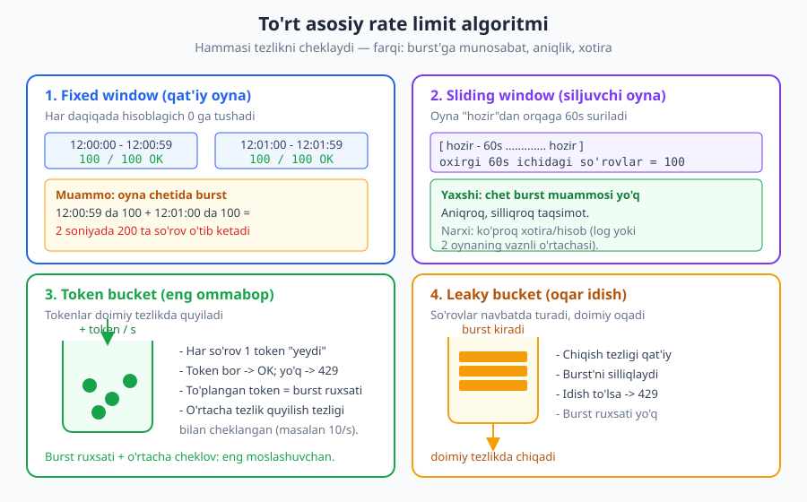
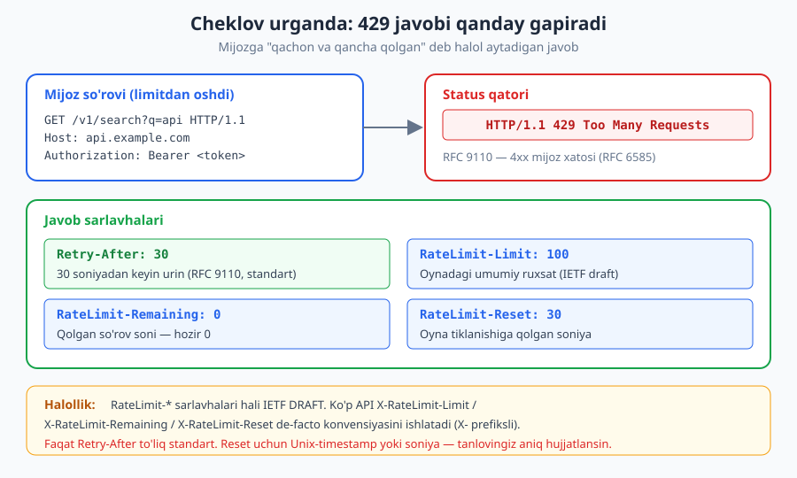
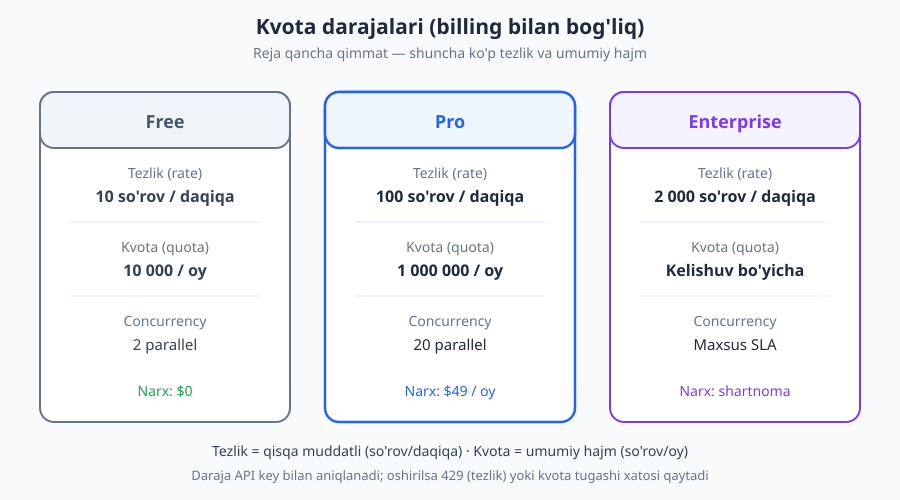

# 14 — Rate limiting, throttling, kvotalar

[⬅️ Oldingi: 13 — API xavfsizligi (OWASP API Top 10)](./13-api-xavfsizligi.md) · [🏠 README](./README.md) · [Keyingi: 15 — Idempotentlik va parallellik ➡️](./15-idempotentlik-parallellik.md)

---

> **Bu bobda:** Hech bir mijoz API'ni cheksiz "yeyishi" mumkin emas — aks holda u serverni ag'daradi yoki boshqalarning ulushini o'g'irlaydi. Shu bobda nega tezlikni cheklash kerakligini; rate limiting, throttling va kvota orasidagi farqni; to'rt asosiy algoritmni (fixed window, sliding window, token bucket, leaky bucket) ularning trade-off'lari bilan; cheklov urganda qanday javob qaytarishni (`429 Too Many Requests` + `Retry-After` + `RateLimit` sarlavhalari); nima bo'yicha cheklashni (API key / foydalanuvchi / IP / endpoint); va mijoz tomonida `429` ni qanday hurmat qilishni (exponential backoff + jitter) ko'ramiz.
>
> **Halollik / Eslatma:** `429 Too Many Requests` va `Retry-After` to'liq standart — **RFC 9110** (status semantikasi) va **RFC 6585** (429 ning o'zi). `RateLimit`, `RateLimit-Policy` sarlavhalari esa hali **IETF draft** (`draft-ietf-httpapi-ratelimit-headers`) — buni halol aytamiz; `X-RateLimit-*` esa rasmiy standart emas, faqat keng tarqalgan de-facto konvensiya. Algoritmlar va "nima bo'yicha cheklash" tanlovi standart emas — bular kontekstga bog'liq **dizayn trade-off'lari**. JSON namunalari valid; standartlar va draftlar vaqt bilan o'zgaradi.

---

## Nega tezlikni umuman cheklash kerak?

Tasavvur qiling, restoran ochig'-suvday ochiq: kim kelsa ham xohlagancha buyurtma beradi, navbat yo'q, cheklov yo'q. Bir kuni bitta mijoz kelib, oshxonani band qilib, soat sayin 500 ta taom buyurtma qiladi. Oshpazlar faqat o'shaning buyurtmasini tayyorlaydi — qolgan hamma och qoladi. Yoki oshxona portlab ketadi.

API ham xuddi shunday. Server resurslari cheklangan: CPU, xotira, ma'lumotlar bazasiga ulanishlar, tashqi servislarga chaqiruvlar. Agar har bir mijoz xohlagancha so'rov yuborsa, to'rtta yomon narsa yuz beradi:

1. **Server ag'darilishi (DoS).** Bitta buggi mijoz (yoki ataylab hujum) sekundiga minglab so'rov yuborib serverni tiz cho'ktiradi. Hatto yomon niyatsiz ham: cheksiz `while` siklida API'ni chaqiradigan mijoz kodi yetarli.
2. **Adolatsiz taqsimot.** Bitta "ochko'z" mijoz butun quvvatni egallasa, qolgan minglab mijoz sekin javob oladi yoki umuman javob olmaydi. Umumiy resurs adolatli bo'linishi kerak.
3. **Xarajat nazoratsizligi.** Bulutda har so'rov pul turadi (CPU, trafik, tashqi API chaqiruvlari). Cheklovsiz API'ni biror mijoz minglab marta chaqirsa, hisobingiz portlaydi.
4. **Suiiste'mol va parol urinishlari.** `POST /login` ni cheklamasangiz, hujumchi soniyada minglab parol sinab ko'radi (brute force). Rate limiting — bunday hujumlarga qarshi birinchi to'siq.

Bu shunchaki "yaxshi amaliyot" emas — bu xavfsizlik talabi. OWASP API Security Top 10 (2023) ro'yxatida bu aniq aytilgan:

> **Xavfsizlik:** **API4: Unrestricted Resource Consumption** — cheklanmagan resurs iste'moli. Agar API so'rov soni, hajmi yoki tezligini cheklamasa, hujumchi (yoki nosoz mijoz) servisni ishdan chiqarishi yoki xarajatni keskin oshirishi mumkin. Rate limiting va kvota — bu zaiflikning to'g'ridan-to'g'ri yechimi. Batafsil: [13 — API xavfsizligi](./13-api-xavfsizligi.md).

---

## Rate limiting, throttling, kvota — uchta turli narsa

Bu uch atama tez-tez aralashtiriladi, lekin ular boshqa-boshqa savollarga javob beradi. Farqni aniq tushunib oling:

| Atama | Savol | O'lchov | Misol | Oshganda |
|---|---|---|---|---|
| **Rate limiting** | Qanchalik *tez*? | so'rov / vaqt birligi | 100 so'rov / daqiqa | `429` (rad etiladi) |
| **Throttling** | Sekinlashtir | kechikish / navbat | har so'rov orasi 200ms | sekinlashadi (ko'pincha) |
| **Quota (kvota)** | Jami *qancha*? | so'rov / katta davr | 1 000 000 so'rov / oy | kvota tugadi xatosi |

- **Rate limiting** — qisqa muddatli tezlik chegarasi. "Sekundiga 10 tadan ko'p emas." Oshsa, ortiqcha so'rov **rad etiladi** (`429`).
- **Throttling** — so'rovni rad etish o'rniga uni **sekinlashtirish** yoki navbatga qo'yish. Ko'pincha amaliyotda "throttling" va "rate limiting" sinonim sifatida ishlatiladi; lekin nozik farqi: throttling so'rovni butunlay tashlamasdan tezligini pasaytiradi (masalan, navbatda ushlab turish). Leaky bucket algoritmi — aslida throttling g'oyasi.
- **Quota (kvota)** — uzoq muddatli umumiy hajm. "Oyiga 1 million so'rov." Bu odatda **billing** (to'lov rejasi) bilan bog'liq. Kvota tugasa, daqiqa tezligingiz yetarli bo'lsa ham, oy oxirigacha kutasiz yoki rejani oshirasiz.

> **Eslatma:** Bir API'da uchchalasi birga yashashi mumkin va odatda shunday bo'ladi: "Pro reja — daqiqasiga 100 so'rov (rate), oyiga 1 million (quota), va biz pik vaqtda so'rovlarni biroz sekinlashtiramiz (throttle)." Ular bir-birini almashtirmaydi, balki to'ldiradi.

---

## Algoritmlar: tezlikni qanday "sanaymiz"?

Rate limiting yuragida bitta savol bor: *"Bu so'rov ruxsat etilgan tezlikni oshiradimi yoki yo'q?"* Buni hisoblashning bir necha klassik usuli bor. Har biri burst (qisqa portlash), aniqlik, xotira va murakkablik bo'yicha boshqacha trade-off beradi.



### 1. Fixed window (qat'iy oyna) — eng oddiy

G'oya: vaqtni teng oynalarga bo'lasiz (masalan, har daqiqa). Har oyna uchun bitta hisoblagich. So'rov kelganda hisoblagichni oshirasiz; agar u limitdan oshsa — `429`. Oyna tugaganda hisoblagich nolga tushadi.

```
12:00:00–12:00:59 -> counter = 0, limitgacha 100 ta o'tadi
12:01:00–12:01:59 -> counter qayta 0
```

**Yaxshi tomoni:** o'ta sodda. Faqat bitta son saqlaysiz (`key -> count`), kalitiga muddat (TTL) qo'yasiz. Redis'da `INCR` + `EXPIRE` bilan ikki qatorda.

**Yomon tomoni — oyna chetidagi burst.** Mijoz `12:00:59` da 100 ta so'rov yuboradi, keyin `12:01:00` da yana 100 ta. Ikkalasi ham o'z oynasida qonuniy. Lekin natijada **2 soniyada 200 so'rov** o'tib ketdi — sizning "daqiqasiga 100" cheklovingizdan ikki barobar ko'p. Bu klassik muammo.

> **Trade-off:** Fixed window — arzon va tushunarli, lekin oyna chegarasida ikki baravar burst'ga yo'l qo'yadi. Aniq tezlik kafolati kerak bo'lmagan oddiy ichki API uchun yetarli; jiddiy public API uchun zaif.

### 2. Sliding window (siljuvchi oyna) — silliqroq

G'oya: qat'iy soat oynalari o'rniga, oynani har doim "hozir"dan orqaga 60 soniya qilib **surib** turasiz. Ya'ni "oxirgi 60 soniyada nechta so'rov bo'ldi?" deb so'raysiz — chegara doim siljiydi.

Ikki amaliy variant bor:

- **Sliding window log:** har so'rovning aniq vaqtini saqlaysiz va eski (60s dan oldingi) yozuvlarni tashlab, qolganini sanaysiz. Eng aniq, lekin **xotira qimmat** — har so'rov uchun bitta yozuv.
- **Sliding window counter:** joriy va oldingi fixed oynani saqlab, ularning **vaznli o'rtachasini** olasiz. Masalan, joriy daqiqaning 25% o'tgan bo'lsa: `joriy_count + oldingi_count * 0.75`. Bu logdan ancha arzon va fixed window'ning burst muammosini deyarli yo'qotadi. Ko'p ishlab chiqarish tizimlari shu variantni ishlatadi.

> **Trade-off:** Sliding window — fixed window'ning burst muammosini yechadi, aniqroq va adolatliroq. Narxi: ko'proq hisob va xotira (ayniqsa log variantida). Counter varianti — yaxshi muvozanat.

### 3. Token bucket (token idishi) — eng ommabop

Bu eng keng tarqalgan algoritm, chunki u **burst'ga oqilona ruxsat** beradi-yu, **o'rtacha tezlikni** ham cheklaydi.

G'oya: har mijoz uchun bir "idish" (bucket) bo'lib, unga doimiy tezlikda tokenlar quyiladi (masalan, soniyasiga 10 ta). Idishning maksimal sig'imi bor (masalan, 100 token). Har so'rov **1 token "yeydi"**:

- Idishda token bor bo'lsa — so'rov o'tadi, bitta token kamayadi.
- Token yo'q bo'lsa — `429`.

Natijada nozik xulq paydo bo'ladi: agar mijoz bir muddat jim tursa, idishi to'ladi (100 tagacha). Keyin u **bir zarbda 100 ta so'rov** yuborishi mumkin (to'plangan tokenlar — bu ruxsat etilgan burst). Lekin idish bo'shagach, u faqat tokenlar quyilish tezligida (10/s) davom etadi. Demak qisqa burst'ga ruxsat, lekin uzoq muddatli o'rtacha tezlik cheklangan.

> **Trade-off:** Token bucket — moslashuvchan: burst ruxsati (idish sig'imi) va o'rtacha tezlik (quyilish tezligi) ni alohida sozlaysiz. Saqlash arzon (ikki son: token soni + oxirgi yangilanish vaqti). Shuning uchun AWS, Stripe va ko'p gateway'lar shuni ishlatadi.

### 4. Leaky bucket (oqar idish) — silliqlovchi

G'oya: so'rovlar idishga (navbatga) tushadi va **doimiy tezlikda** undan "oqib chiqadi" (qayta ishlanadi). Idish to'lib qolsa, yangi so'rovlar tashlab yuboriladi (`429`).

Token bucket'dan farqi: token bucket burst'ga ruxsat beradi, leaky bucket esa **burst'ni silliqlaydi** — qancha tez kelmasin, chiqish tezligi har doim bir xil va tekis. Bu chiqishni barqaror ushlab turish kerak bo'lganda (masalan, orqadagi sekin servisni himoya qilishda) foydali.

> **Trade-off:** Leaky bucket — chiqishni doimiy va tekis qiladi (throttling g'oyasi), lekin burst'ga umuman yo'l qo'ymaydi. Token bucket'ga teskari: biri portlashga ruxsat beradi, ikkinchisi tekislaydi.

### Algoritmlarni taqqoslash

| Algoritm | Burst'ga ruxsat | Aniqlik | Xotira | Murakkablik |
|---|---|---|---|---|
| Fixed window | Ha (chetda 2x — yomon) | Past | Juda kam | Eng oddiy |
| Sliding window (log) | Yo'q | Yuqori | Ko'p | O'rta–yuqori |
| Sliding window (counter) | Deyarli yo'q | Yaxshi | Kam | O'rta |
| Token bucket | Ha (boshqariladigan) | Yaxshi | Kam | O'rta |
| Leaky bucket | Yo'q (silliqlaydi) | Yaxshi | Kam | O'rta |

> **Eslatma:** "Eng to'g'ri algoritm" yo'q. Oddiy ichki API uchun fixed window yetadi. Burst'ga oqilona ruxsat berib, o'rtacha tezlikni ushlamoqchi bo'lsangiz — token bucket. Chiqishni qat'iy tekis qilmoqchi bo'lsangiz — leaky bucket. Mutlaq aniqlik kerak bo'lsa — sliding window.

---

## Javob dizayni: cheklov urganda nima qaytarish?

Mijoz limitdan oshganda, javob ikki narsani aniq aytishi kerak: **(1)** so'rov rad etildi va **(2)** qachon qayta urinish mumkin. Bu yerda standartlarga rioya qilish muhim.



### Status kod: 429 Too Many Requests

To'g'ri status kod — `429 Too Many Requests`. U **RFC 6585** da kiritilgan va **RFC 9110** semantikasiga ko'ra `4xx` (mijoz xatosi) oilasiga kiradi: ya'ni *mijoz* haddan oshib so'rov yubordi. Boshqa kodlardan tanlamang — `503` (server band) yoki `403` (taqiqlangan) bu yerda noto'g'ri ma'no beradi.

> **Standart:** `429` rate limit uchun to'g'ri javob, chunki muammo *mijoz tomonda* (juda ko'p so'rov). `403 Forbidden` — ruxsat yo'qligi haqida, bu boshqa narsa ([12 — Avtorizatsiya](./12-avtorizatsiya.md)). HTTP status kodlari haqida to'liq: [03 — HTTP status kodlari](./03-http-status-kodlari.md).

### Retry-After — qachon qayta urinish (to'liq standart)

Eng muhim sarlavha — `Retry-After`. U **RFC 9110** da belgilangan va to'liq standart. Ikki formati bor:

- **Soniya** (delta-seconds): `Retry-After: 30` — "30 soniyadan keyin urin."
- **Sana** (HTTP-date): `Retry-After: Wed, 16 Jun 2026 12:00:30 GMT` — "shu vaqtdan keyin urin."

Ko'pchilik soniya formatini afzal ko'radi — soddaroq va soat farqlari muammosi yo'q.

### RateLimit sarlavhalari — qancha qolgan (DRAFT, halol ayting)

Mijozga proaktiv ma'lumot berish uchun ko'p API qo'shimcha sarlavhalar qaytaradi: limit qancha, nechtasi qolgan, qachon tiklanadi. Bu yerda halol bo'lish kerak:

> **Standart:** `RateLimit-Limit`, `RateLimit-Remaining`, `RateLimit-Reset` (va `RateLimit-Policy`) sarlavhalari hali **IETF DRAFT** (`draft-ietf-httpapi-ratelimit-headers`) — final RFC emas. Tarixan ko'p API `X-RateLimit-Limit` / `X-RateLimit-Remaining` / `X-RateLimit-Reset` (`X-` prefiksli) de-facto konvensiyasini ishlatgan; bu ham rasmiy standart emas. Faqat `Retry-After` to'liq standart. Qaysi birini tanlasangiz ham — **hujjatlashtiring** va izchil bo'ling.

Sarlavhalar ma'nosi:

| Sarlavha | Ma'no |
|---|---|
| `RateLimit-Limit` | Oynadagi umumiy ruxsat (masalan, 100) |
| `RateLimit-Remaining` | Hozir qolgan so'rov soni (masalan, 0) |
| `RateLimit-Reset` | Oyna tiklanishiga qolgan soniya (yoki Unix timestamp) |
| `Retry-After` | Qayta urinishdan oldin kutish (soniya yoki sana) |

> **Diqqat:** `RateLimit-Reset` ni soniya (`30`) yoki Unix timestamp (`1750075230`) sifatida berishingiz mumkin — bu ikki xil ma'no! Tanlovingizni hujjatda aniq yozing, aks holda mijoz noto'g'ri hisoblaydi. Draft soniya (delta) ko'rinishini tavsiya qiladi.

### To'liq HTTP misol

```http
GET /v1/search?q=api HTTP/1.1
Host: api.example.com
Authorization: Bearer <token>

HTTP/1.1 429 Too Many Requests
Content-Type: application/problem+json
Retry-After: 30
RateLimit-Limit: 100
RateLimit-Remaining: 0
RateLimit-Reset: 30

{
  "type": "https://api.example.com/problems/rate-limit",
  "title": "Too Many Requests",
  "status": 429,
  "detail": "So'rov tezligi chegarasidan oshdingiz. 30 soniyadan keyin qayta urinib ko'ring.",
  "limit": 100,
  "remaining": 0,
  "reset_after_seconds": 30
}
```

Javob tanasi **RFC 9457 "Problem Details"** (`application/problem+json`) formatida — bu xato dizayni bilan izchil ([09 — Xatolarni dizayn qilish](./09-xato-dizayni.md)). `type`, `title`, `status`, `detail` standart maydonlar; `limit`, `remaining`, `reset_after_seconds` — kengaytma maydonlar. Mijoz uchun bu o'qilishi oson va sarlavhalarni takrorlaydi.

> **Diqqat:** `429` javobi ham mashinaga o'qiladigan (sarlavhalar) ham odamga o'qiladigan (`detail`) ma'lumot bersin. Faqat bo'sh `429` qaytarsangiz, mijoz qachon urinishni bilmaydi va ko'r-ko'rona qayta urinaverib (retry storm) holatni yomonlashtiradi.

---

## Kvota dizayni: darajalar va billing

Kvota — uzoq muddatli umumiy hajm va u odatda **to'lov rejasi** bilan bog'lanadi. Klassik dizayn — bir necha **daraja** (tier):



| Daraja | Tezlik (rate) | Kvota (oy) | Concurrency | Narx |
|---|---|---|---|---|
| **Free** | 10 so'rov / daqiqa | 10 000 / oy | 2 parallel | $0 |
| **Pro** | 100 so'rov / daqiqa | 1 000 000 / oy | 20 parallel | $49 / oy |
| **Enterprise** | 2 000 so'rov / daqiqa | Kelishuv bo'yicha | Maxsus SLA | Shartnoma |

Daraja odatda **API key** orqali aniqlanadi: kalit qaysi rejaga tegishli — o'sha limitlar qo'llanadi. Mijoz rejani oshirsa — limitlari ham oshadi. Bu API'ni biznes modeliga bog'laydigan tabiiy joy.

### So'rov narxi: hamma endpoint teng emas

Nozik, lekin muhim dizayn: ba'zi endpoint'lar boshqalardan **qimmatroq**. Oddiy `GET /users/{id}` — arzon (bitta yozuv). `POST /reports/generate` — qimmat (sekundlab hisob-kitob). Agar har ikkalasini "1 so'rov" deb sanasangiz, qimmat endpoint orqali mijoz serverni baribir bo'g'adi.

Yechim: har so'rovga **"narx" (cost / weight)** berasiz. Token bucket bilan bu juda tabiiy: arzon so'rov 1 token, qimmat so'rov 10 token "yeydi". Shunda kvota *real resurs iste'moliga* bog'lanadi, oddiy so'rov soniga emas.

> **Trade-off:** Bir xil narx (har so'rov = 1) — sodda va tushunarli, lekin qimmat endpoint'larni adolatsiz "arzon" hisoblaydi. Og'irlikli narx — adolatliroq va resursga mosroq, lekin mijoz uchun tushunish qiyinroq (qancha qoldi — aniq bilmaydi). GraphQL'da bu ayniqsa muhim: bitta so'rov ulkan bo'lishi mumkin ([17 — GraphQL](./17-graphql.md)).

---

## Nima bo'yicha cheklash? (cheklov kaliti)

"Daqiqasiga 100 so'rov" — lekin *kimning* 100 tasi? Hisoblagich kaliti (limit key)ni to'g'ri tanlash — markaziy dizayn qarori. Asosiy variantlar:

| Cheklov bo'yicha | Afzalligi | Kamchiligi |
|---|---|---|
| **API key / hisob** | Adolatli, billing'ga mos, mijozni aniq biladi | Faqat autentifikatsiyalangan so'rovlar uchun |
| **Foydalanuvchi (user ID)** | Bir hisobdagi har foydalanuvchini alohida | Foydalanuvchi kim — aniqlash kerak |
| **IP manzil** | Anonim (login'siz) so'rovlar uchun ishlaydi | NAT/proxy ortida ko'p foydalanuvchi bitta IP'da — adolatsiz |
| **Endpoint** | Qimmat endpoint'ni alohida cheklash | Yakka o'zi yetarli emas, boshqalar bilan birga |

- **API key bo'yicha** — eng adolatli va aniq, chunki har mijoz o'z hisobchasiga ega. Billing bilan tabiiy bog'lanadi. Autentifikatsiyalangan API uchun standart tanlov ([11 — Autentifikatsiya](./11-autentifikatsiya.md)).
- **IP bo'yicha** — login talab qilmaydigan ochiq endpoint'lar (masalan, ro'yxatdan o'tish, parol tiklash) uchun yagona variant. Lekin **NAT muammosi** bor: bir ofis yoki mobil operator ortidagi yuzlab foydalanuvchi bitta tashqi IP'dan chiqadi — biri limitni ursa, hammasi jazolanadi. Va aksincha, hujumchi IP'ni oson almashtiradi (proxy, bot tarmoq).

> **Anti-pattern:** Faqat IP bo'yicha cheklash. NAT ortidagi haqiqiy foydalanuvchilar bir-birini "yeydi", IP almashtiradigan hujumchi esa osongina chetlab o'tadi. IP'ni faqat anonim trafik uchun, ko'pincha boshqa signal bilan birga ishlating.

### Darajali (layered) cheklash

Amaliyotda bitta cheklov yetarli emas — bir nechta qatlam birga qo'llanadi:

1. **Global** — butun servis bo'yicha umumiy chegara (umumiy yuklamani himoya qilish).
2. **Per-user / per-key** — har mijoz adolatli ulush oladi.
3. **Per-endpoint** — qimmat yoki nozik endpoint'lar (masalan, `POST /login`, `POST /reports`) qattiqroq cheklanadi.

Misol: `POST /login` — IP bo'yicha daqiqasiga 5 urinish (brute force'ga qarshi), bir vaqtning o'zida butun API key bo'yicha daqiqasiga 1000 so'rov. Bir so'rov bir necha cheklovdan o'tadi; birortasi ursa — `429`.

> **Eslatma:** Darajali cheklashda javobga *qaysi* limit urganini aytish foydali (masalan, `RateLimit-Policy` yoki javob tanasida). Aks holda mijoz "nega 429 keldi, limitim hali to'lmagan-ku?" deb hayron bo'ladi — chunki boshqa qatlam (masalan, global) urgan bo'lishi mumkin.

---

## Mijoz tomoni: 429 ni qanday hurmat qilish

Rate limiting ikki tomonlama shartnoma: server cheklaydi, mijoz esa cheklovni **hurmat qiladi**. Yomon mijoz `429` olgach, darhol va ayni tezlikda qayta uradi — bu holatni faqat yomonlashtiradi (retry storm). To'g'ri mijoz quyidagicha ishlaydi:

1. **`429` ni tan ol.** Javob kodini tekshir; `429` bo'lsa — bu xato emas, "sekinroq" signali.
2. **`Retry-After` ni o'qib, shuncha kut.** Server aytgan vaqtni hurmat qil. Bu bor bo'lsa, taxmin qilma — aniq raqam shu.
3. **Exponential backoff (eksponensial chekinish) qo'lla** — `Retry-After` bo'lmasa. Har muvaffaqiyatsiz urinishdan keyin kutish vaqtini ikki barobar oshir: 1s, 2s, 4s, 8s... ma'lum maksimumgacha.
4. **Jitter (tasodifiy chayqalish) qo'sh.** Agar 1000 ta mijoz bir vaqtda `429` olib, hammasi aynan 2 soniyadan keyin urinsa — yana bir vaqtda zarba beradi (thundering herd). Yechim: kutish vaqtiga tasodifiy qo'shimcha qo'shing, masalan `random(0, backoff)`. Shunda urinishlar vaqt bo'ylab yoyiladi.

```
Urinish 1 -> 429 -> kut: 1s  + jitter
Urinish 2 -> 429 -> kut: 2s  + jitter
Urinish 3 -> 429 -> kut: 4s  + jitter
Urinish 4 -> 429 -> kut: 8s  + jitter (maksimum: 30s)
```

> **Diqqat:** Qayta urinish faqat **idempotent** operatsiyalar uchun xavfsiz. `GET` ni xotirjam takrorlash mumkin; lekin `POST` (masalan, to'lov) ni ko'r-ko'rona takrorlash ikki marta pul yechib olishi mumkin. Shuning uchun retry'ni idempotentlik bilan birga loyihalang — bu **idempotency key** orqali hal qilinadi: [15 — Idempotentlik va parallellik](./15-idempotentlik-parallellik.md). Backoff/retry va ularning monitoringi haqida ko'proq: [25 — Observability](./25-observability.md).

> **Trade-off:** Maksimal urinish soni va umumiy kutish vaqtini cheklang. Cheksiz retry — buggi mijoz serverni soatlab dolzarb so'rov bilan urib turishi demak. Odatda 3–5 urinish va umumiy "deadline" (masalan, 1 daqiqa) qo'yiladi.

---

## Tarqalgan (distributed) rate limiting — qisqa nazar

Bir serverda rate limiting oson: hisoblagich xotirada turadi. Lekin real tizimda API ortida **bir nechta server** (instance) bo'ladi va so'rov ular orasiga tarqaladi. Agar har server o'z xotirasida alohida sanasa, mijoz 5 serverga ulansa — har birida 100 dan, jami 500 so'rov o'tadi. Cheklov buziladi.

Yechim: **markaziy, taqsimlangan hisoblagich.** Hamma server bitta umumiy do'kondan (ko'pincha **Redis**) hisoblagichni o'qiydi/yangilaydi. Redis atomik `INCR` va Lua skriptlar bilan token bucket yoki sliding window mantiqini xavfsiz (race condition'siz) bajaradi.

> **Trade-off:** Markaziy hisoblagich — aniq, lekin har so'rovga tarmoq chaqiruvi (Redis'ga) qo'shadi va Redis o'zi "single point" bo'lib qoladi. Juda yuqori trafikda ba'zilar **mahalliy + taxminiy** yondashuvni tanlaydi: har server o'z ulushini mahalliy sanaydi, vaqti-vaqti bilan markaz bilan sinxronlaydi. Aniqlik bir oz pasayadi, lekin tezlik va chidamlilik oshadi. Bu — masshtab vs aniqlik trade-off'i.

> **Eslatma:** Ko'p amaliyotda rate limiting **API gateway** darajasida amalga oshiriladi — har servisda qayta yozish o'rniga, kirish nuqtasida markazlashtiriladi. Bu haqda: [23 — API Gateway / BFF](./23-api-gateway-bff.md).

---

## Asosiy g'oyalar (bobni qisqacha)

- **Nega kerak:** serverni himoya (DoS), adolatli taqsimot, xarajat nazorati, suiiste'molga qarshi. Bu OWASP **API4 (Unrestricted Resource Consumption)** ning to'g'ridan-to'g'ri yechimi.
- **Uch atama, uch savol:** rate limiting = qanchalik tez (so'rov/vaqt); throttling = sekinlashtirish; quota = jami qancha (so'rov/oy, billing bilan).
- **To'rt algoritm:** fixed window (oddiy, lekin chetda 2x burst); sliding window (silliq, aniqroq, qimmatroq); **token bucket** (eng ommabop — burst ruxsati + o'rtacha tezlik); leaky bucket (chiqishni tekislaydi).
- **Javob:** `429 Too Many Requests` + `Retry-After` (to'liq standart). `RateLimit-*` sarlavhalari — hali **IETF draft**; `X-RateLimit-*` — de-facto konvensiya (halol ayting). Tana — Problem Details.
- **Cheklov kaliti:** API key (adolatli) > IP (NAT muammosi, faqat anonim uchun). Darajali: global + per-user + per-endpoint.
- **Mijoz tomoni:** `429` ni hurmat qil, `Retry-After` ni o'qi, **exponential backoff + jitter**; retry faqat idempotent so'rovlar uchun xavfsiz.
- **Distributed:** ko'p server -> markaziy hisoblagich (Redis); aniqlik vs tezlik trade-off'i.

---

## Mashqlar

### Oson

**1-mashq.** Quyidagi uch holatni rate limiting, throttling yoki quota deb tasniflang va sababini ayting:
(a) "Bu kalit oyiga 50 000 so'rov yubora oladi."
(b) "Bu kalit daqiqasiga 20 dan ko'p so'rov yubora olmaydi."
(c) "Pik vaqtda biz so'rovlarni navbatga qo'yib, sekundiga 100 tadan qayta ishlaymiz."

**2-mashq.** Quyidagi javobni o'qing va savollarga javob bering:

```http
HTTP/1.1 429 Too Many Requests
Retry-After: 45
RateLimit-Limit: 60
RateLimit-Remaining: 0
RateLimit-Reset: 45
```
(a) Mijoz nima qilishi kerak? (b) Oynadagi umumiy limit qancha? (c) Hozir nechta so'rov qolgan? (d) `Retry-After` va `RateLimit-Reset` ichidan qaysi biri to'liq HTTP standartiga kiradi?

**3-mashq.** Nega bo'sh `429` (hech qanday sarlavhasiz) yomon dizayn? Bitta jumla bilan tushuntiring.

### O'rta

**4-mashq.** Quyidagi har bir stsenariy uchun eng mos algoritmni tanlang (fixed window / sliding window / token bucket / leaky bucket) va sababini ayting:
(a) Mijozlarga ba'zan qisqa portlash (burst) qilishga ruxsat bermoqchisiz, lekin o'rtacha tezlik cheklangan bo'lsin.
(b) Orqadagi sekin to'lov servisini himoya qilyapsiz — unga so'rovlar har doim bir xil, tekis tezlikda yetib borishi shart.
(c) Eng oddiy yechim kerak, oyna chetidagi 2x burst sizni bezovta qilmaydi (ichki, kam-trafikli API).

**5-mashq.** Bir mobil ilova `POST /login` va `GET /feed` endpoint'larini chaqiradi. Mobil operator NAT'i ortida minglab foydalanuvchi bitta tashqi IP'dan chiqadi. Login uchun va feed uchun cheklov kalitini (API key / user / IP / endpoint) qanday tanlaysiz? Trade-off'larini tushuntiring.

**6-mashq.** Bir Pro foydalanuvchi `RateLimit-Remaining: 0` xabarini ko'rmoqda, lekin uning shaxsiy limiti hali to'lmagan. Nega bunday bo'lishi mumkin? Darajali (layered) cheklash kontekstida tushuntiring va mijozga buni qanday tushuntirish mumkinligini ayting.

### Qiyin

**7-mashq.** Token bucket: sig'im 10 token, quyilish tezligi soniyasiga 2 token, idish boshida to'la (10 token). Mijoz `t=0` da darhol 10 ta so'rov yuboradi, keyin `t=3s` da yana 8 ta so'rov yuboradi. Nechta so'rov o'tadi, nechtasi `429` oladi? Hisobni ko'rsating.

**8-mashq.** Fixed window'ning "oyna chetidagi burst" muammosini aniq misol bilan tushuntiring (limit: daqiqasiga 100). Keyin bu muammoni sliding window counter qanday yumshatishini ko'rsating.

**9-mashq.** "API gateway ortida 4 ta server bor, har biri token bucket ishlatadi, har mijozga daqiqasiga 100 so'rov." Bu dizaynda qanday xato bor? Darajali + distributed rate limiting yondashuvi bilan to'g'rilang. Mijoz tomonida `429` ga qanday javob berish kerakligini ham qo'shing (idempotentlik bilan bog'lab).

<details markdown="1">
<summary>Yechimlar</summary>

### 1-mashq yechimi

(a) **Quota** — "oyiga 50 000" uzoq muddatli umumiy hajm, billing bilan bog'liq. (b) **Rate limiting** — "daqiqasiga 20" qisqa muddatli tezlik chegarasi; oshsa so'rov rad etiladi (`429`). (c) **Throttling** — so'rovlar rad etilmaydi, balki navbatga qo'yilib doimiy tezlikda (sekundiga 100) sekinlashtirilib qayta ishlanadi (leaky bucket g'oyasi).

### 2-mashq yechimi

(a) Mijoz **45 soniya kutib**, keyin qayta urinishi kerak (`Retry-After: 45`). (b) Oynadagi umumiy limit **60** (`RateLimit-Limit`). (c) Hozir **0** so'rov qolgan (`RateLimit-Remaining: 0`) — shuning uchun `429` keldi. (d) **`Retry-After`** to'liq HTTP standart (RFC 9110); `RateLimit-Reset` esa hali IETF draft sarlavhasi.

### 3-mashq yechimi

Bo'sh `429` mijozga *qachon* qayta urinishni aytmaydi, shuning uchun mijoz ko'r-ko'rona darhol va takror urinaveradi (retry storm), bu serverga yuklamani yanada oshiradi — kamida `Retry-After` bo'lishi shart.

### 4-mashq yechimi

(a) **Token bucket** — to'plangan tokenlar burst'ga ruxsat beradi, quyilish tezligi o'rtacha tezlikni cheklaydi. Aynan shu maqsad uchun yaratilgan. (b) **Leaky bucket** — chiqish tezligi har doim qat'iy va tekis, burst silliqlanadi; orqadagi sekin servisni barqaror tezlikda himoya qiladi. (c) **Fixed window** — eng oddiy, faqat `INCR` + `EXPIRE`; chet burst muammosi bu kontekstda muhim emas.

### 5-mashq yechimi

`POST /login` uchun: faqat IP bo'yicha cheklash NAT muammosi tufayli xavfli (bir operator ortidagi minglab odam bir-birini bloklaydi). Yaxshiroq — **akkaunt/foydalanuvchi (login qilinayotgan username) bo'yicha** cheklash (brute force aynan bitta akkauntga qarshi bo'ladi), ehtimol IP bilan birga (ikkala signal). `GET /feed` uchun foydalanuvchi allaqachon autentifikatsiyalangan, demak **API key / user ID bo'yicha** cheklash — adolatli va NAT muammosidan xoli. Umumiy saboq: autentifikatsiyalangan trafik uchun key/user; anonim trafik uchun IP, lekin uni yagona signal sifatida emas, ehtiyotkorlik bilan.

### 6-mashq yechimi

Darajali cheklashda bir necha qatlam bor: **global** (butun servis), **per-user**, **per-endpoint**. Foydalanuvchining shaxsiy (per-user) limiti to'lmagan bo'lsa ham, **global** limit yoki u chaqirgan **qimmat endpoint** limiti urgan bo'lishi mumkin — `429` o'sha qatlamdan keldi. Mijozga buni javobda qaysi limit urganini ko'rsatib (masalan, `RateLimit-Policy` yoki tanada `"scope": "global"`/`"scope": "endpoint"`) tushuntirish kerak, aks holda u "limitim to'lmagan-ku?" deb hayron bo'ladi.

### 7-mashq yechimi

Boshlanish: idish to'la = 10 token.
- `t=0`: 10 ta so'rov keladi. Idishda 10 token bor -> **10 ta o'tadi**, idishda 0 token qoladi.
- `t=0` dan `t=3s` gacha 3 soniya o'tdi. Quyilish 2 token/s, demak `3 * 2 = 6` token quyildi. Idishda endi **6 token** (sig'im 10 dan oshmadi).
- `t=3s`: 8 ta so'rov keladi. Idishda 6 token bor -> **6 tasi o'tadi**, **2 tasi `429`** oladi.

Jami: **16 so'rov o'tdi, 2 so'rov `429`** oldi.

### 8-mashq yechimi

**Burst muammosi:** limit daqiqasiga 100. Mijoz `12:00:59.5` da 100 ta, keyin `12:01:00.5` da yana 100 ta yuboradi. Har ikkisi o'z fixed oynasida (`12:00:xx` va `12:01:xx`) qonuniy. Lekin natijada **bir soniya ichida 200 ta** so'rov o'tdi — "daqiqasiga 100" cheklovidan ikki barobar ko'p.

**Sliding window counter yechimi:** "hozir"dan orqaga 60 soniyalik oynani ko'radi. `12:01:00.5` da u oxirgi 60 soniyani hisoblaydi: joriy daqiqaning ozgina (1%) o'tgan, demak `joriy_count + oldingi_count * 0.99 ≈ 0 + 100*0.99 = 99`. 100 ta yangi so'rov bu hisobni 199 ga ko'taradi — limitdan oshadi, shuning uchun ortiqchasi `429` oladi. Oyna doim siljiganligi sababli chetdagi 2x burst yo'qoladi.

### 9-mashq yechimi

**Xato:** 4 ta server *alohida-alohida* token bucket ushlaydi, har biri "daqiqasiga 100". So'rovlar 4 server orasiga tarqalsa, mijoz amalda `4 * 100 = 400` so'rov yuborishi mumkin — cheklov 4 baravar buziladi (taqsimlangan hisoblagich yo'qligi muammosi).

**To'g'rilash (distributed):** hisoblagichni **markazlashtiring** — barcha server bitta umumiy do'kondan (masalan, **Redis**) hisoblaydi, atomik operatsiyalar (Lua skript / `INCR`) bilan race condition'siz. Shunda jami chegara haqiqatan ham 100 bo'ladi. Juda yuqori trafikda mahalliy+taxminiy yondashuv (har server ulushini sanab, vaqti-vaqti bilan sinxronlash) tezlik uchun tanlanishi mumkin — aniqlik biroz pasayadi. Ko'pincha buni **API gateway** darajasida markazlashtirish qulay.

**Darajali qatlam qo'shish:** global + per-key + per-endpoint cheklovlarni birga qo'llang; qimmat endpoint'larni alohida cheklang.

**Mijoz tomoni:** `429` kelganda `Retry-After` ni o'qib shuncha kuting; yo'q bo'lsa **exponential backoff + jitter** (1s, 2s, 4s... + tasodif) qo'llang, maksimal urinish sonini cheklang. Qayta urinish faqat **idempotent** so'rovlar uchun xavfsiz — `POST` (masalan, to'lov) uchun **idempotency key** ishlating, aks holda takror urinish ikki marta amalga oshib qolishi mumkin ([15 — Idempotentlik va parallellik](./15-idempotentlik-parallellik.md)).

</details>

---

[⬅️ Oldingi: 13 — API xavfsizligi (OWASP API Top 10)](./13-api-xavfsizligi.md) · [🏠 README](./README.md) · [Keyingi: 15 — Idempotentlik va parallellik ➡️](./15-idempotentlik-parallellik.md)
