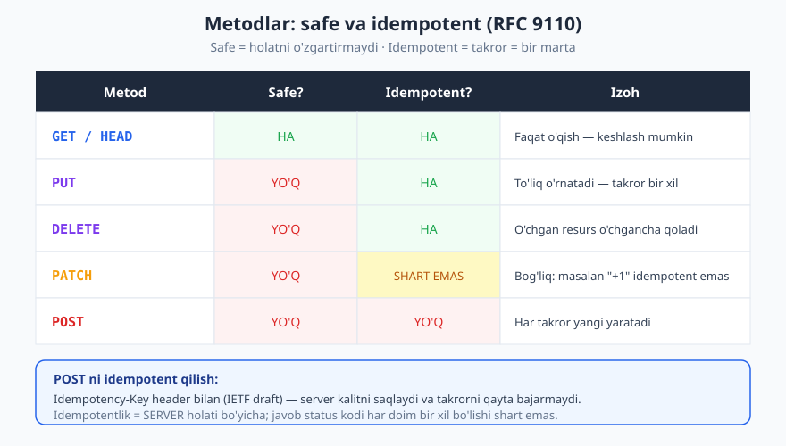
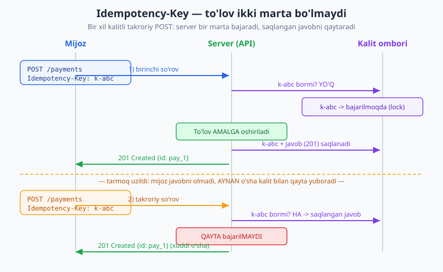
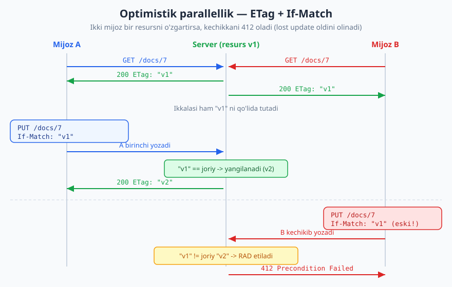

# 15 — Idempotentlik va parallellik

[⬅️ Oldingi: 14 — Rate limiting, throttling, kvotalar](./14-rate-limiting.md) · [🏠 README](./README.md) · [Keyingi: 16 — Keshlash (HTTP caching) ➡️](./16-keshlash.md)

---

> **Bu bobda:** Ishonchli API'larning ikki "ko'rinmas" ustuni — **idempotentlik** (takroriy so'rov zarar keltirmasligi) va **parallellik** (ikki mijoz bir resursni bir vaqtda o'zgartirsa, biri ikkinchisini bosib ketmasligi). Idempotent metodlar, `Idempotency-Key` naqshi (Stripe uslubi), retry bilan bog'liqligi, va optimistik parallellik — `ETag` + `If-Match` -> `412 Precondition Failed` orqali **lost update** muammosini hal qilamiz.
>
> **Halollik / Eslatma:** Metod semantikasi (safe, idempotent) va shartli so'rovlar (`ETag`, `If-Match`, `412`, `428`) **RFC 9110** ga (2022) asoslanadi — bular barqaror standart. `Idempotency-Key` header esa hali **IETF draft** (`draft-ietf-httpapi-idempotency-key-header`) bo'lib, amalda keng tarqalgan konvensiya (Stripe va boshqalar) — buni halol belgilaymiz. Barcha JSON namunalar valid (tekshirilgan). Pessimistik va optimistik tanlovi kontekstga bog'liq trade-off; standartlar versiyasi vaqt bilan o'zgarishi mumkin.

---

## Muammo: tarmoq hech qachon ishonchli emas

Tasavvur qiling, mijoz to'lov qiladi:

```http
POST /v1/payments HTTP/1.1
Host: api.example.com
Content-Type: application/json
Authorization: Bearer <token>

{"amount": 50000, "currency": "UZS", "order_id": 7}
```

Server to'lovni amalga oshiradi va `201 Created` qaytaradi. Lekin **javob mijozga yetib bormaydi** — Wi-Fi uzildi, mobil tarmoq sekinlashdi yoki timeout bo'ldi. Mijoz nima ko'radi? Hech narsa. U bilmaydi: to'lov o'tdimi yoki yo'qmi?

Mijozning tabiiy reaksiyasi — **qayta yuborish**. Va mana shu yerda falokat:

- Agar to'lov birinchi marta o'tgan bo'lsa va mijoz qayta yuborsa -> **ikkita to'lov**, foydalanuvchidan ikki marta pul yechiladi.
- Agar to'lov o'tmagan bo'lsa va mijoz qayta yubormasa -> **to'lov yo'qoladi**.

Mijoz "o'tdimi yoki yo'q" deb bila olmagani uchun, qayta yuborishni **xavfsiz** qilishimiz kerak. Ya'ni: "qayta yuborsang, agar birinchisi o'tgan bo'lsa, ikkinchisi zarar qilmaydi". Bu — **idempotentlik**.

> **Eslatma:** Bu faqat to'lov muammosi emas. Buyurtma yaratish, email yuborish, hisob ochish — har qanday **yon ta'sirli** (side-effecting) amal tarmoq uzilganda takrorlanish xavfi ostida. Ishonchli tarqalgan tizimda **"kamida bir marta" (at-least-once)** yetkazish odatiy; "aniq bir marta" (exactly-once) ni biz idempotentlik bilan **quramiz**.

Bu bobning ikkita asosiy savoli:

1. **Takroriy so'rov** zarar keltirmasligi uchun nima qilish kerak? -> idempotentlik.
2. **Parallel o'zgarish**da bir mijoz boshqasini "bosib ketmasligi" uchun nima qilish kerak? -> optimistik parallellik.

---

## Idempotentlik nima

**Idempotentlik** — matematikadan kelgan tushuncha: bir amalni bir necha marta qo'llash, bir marta qo'llash bilan **bir xil natija** beradi (server holatida). Misol: `x = 5` ni o'rnatish idempotent — necha marta yozsang ham `x` baribir `5`. Lekin `x = x + 1` idempotent emas — har takror qiymatni o'zgartiradi.

API kontekstida: **bitta so'rovni N marta yuborish = bitta marta yuborish bilan bir xil server holatini qoldiradi.**

Bu **safe** (xavfsiz) tushunchasidan farq qiladi — ko'pincha chalkashtiriladi:

| Tushuncha | Ta'rifi | Misol |
|-----------|---------|-------|
| **Safe** | Server holatini umuman **o'zgartirmaydi** (faqat o'qiydi) | `GET /users/7` |
| **Idempotent** | O'zgartirishi mumkin, lekin **takror = bir marta** | `PUT /users/7` |

Har bir safe metod idempotentdir (hech narsa o'zgarmasa, takror ham o'zgartirmaydi). Lekin teskarisi noto'g'ri: `PUT`/`DELETE` idempotent, ammo safe emas (ular holatni o'zgartiradi).

### Metodlar va ularning xususiyatlari (RFC 9110)

**RFC 9110** har bir HTTP metodining safe va idempotent ekanini aniq belgilaydi. Bu HTTP metodlarini chuqurroq [02 — HTTP'ni chuqurroq](./02-http-chuqur.md) bobida ko'rib chiqqansiz; bu yerda idempotentlik nuqtai nazaridan jamlaymiz:



| Metod | Safe? | Idempotent? | Nega |
|-------|:-----:|:-----------:|------|
| `GET` / `HEAD` | HA | HA | Faqat o'qish, holat o'zgarmaydi |
| `OPTIONS` | HA | HA | Imkoniyatlarni so'raydi |
| `PUT` | YO'Q | HA | To'liq holatni **o'rnatadi** — takror bir xil |
| `DELETE` | YO'Q | HA | O'chgan resurs o'chgancha qoladi |
| `PATCH` | YO'Q | **shart emas** | Bog'liq: amalga qarab idempotent bo'lishi ham, bo'lmasligi ham mumkin |
| `POST` | YO'Q | YO'Q | Har takror **yangi** resurs/effekt yaratadi |

> **Standart:** "Safe" va "idempotent" ta'riflari **RFC 9110 §9.2.1–9.2.2** da. Idempotentlik **server holatiga** tegishli, javobning aynan bir xil bo'lishiga emas. Masalan, birinchi `DELETE` `204 No Content`, ikkinchisi `404 Not Found` qaytarishi mumkin — bu hali ham idempotent, chunki **resurs holati** (o'chgan) bir xil qoladi.

### Nega PUT idempotent, POST emas

Bu farqni tushunish — kalit. Mohiyat: **kim resurs identifikatorini belgilaydi.**

- **`PUT /users/7`** — mijoz aynan `/users/7` ni to'liq yangi holatga **o'rnatadi**. "Bu resursni shu holatga qil." Buni 10 marta yuborsang, resurs har safar shu holatga keladi — natija bir xil. Idempotent.

```http
PUT /v1/users/7 HTTP/1.1
Content-Type: application/json

{"name": "Ali", "email": "ali@example.com"}

HTTP/1.1 200 OK
Content-Type: application/json

{"id": 7, "name": "Ali", "email": "ali@example.com"}
```

10 marta yuborsang ham `/users/7` baribir aynan shu — yangi user paydo bo'lmaydi.

- **`POST /users`** — mijoz **yangi** resurs yaratishni so'raydi, identifikatorni **server** beradi. "Yangi user qo'sh." Buni 10 marta yuborsang — 10 ta user yaratiladi, har biri yangi `id` bilan. Idempotent emas.

```http
POST /v1/users HTTP/1.1
Content-Type: application/json

{"name": "Ali", "email": "ali@example.com"}

HTTP/1.1 201 Created
Location: /v1/users/7
Content-Type: application/json

{"id": 7, "name": "Ali", "email": "ali@example.com"}
```

Takrorlasang -> `/users/8`, `/users/9` ... har safar yangi.

> **Trade-off:** Agar mijoz identifikatorni **o'zi** yarata olsa (masalan UUID), siz `PUT /orders/{client-uuid}` qilib yaratishni ham idempotent qilishingiz mumkin — "bu UUID'li buyurtmani shu holatga o'rnat". Ammo ko'p API'lar yaratish uchun `POST` (server ID beradi) ni saqlaydi, chunki bu RESTful va tabiiy. Shu sabab `POST` ni idempotent qilishning **boshqa** mexanizmi kerak — `Idempotency-Key`.

---

## Idempotency-Key — POST'ni idempotent qilish

`POST` (va idempotent bo'lmagan `PATCH`) tabiatan takrorga xavfli. Lekin to'lov, buyurtma yaratish kabi amallar aynan `POST` orqali ketadi. Yechim — mijoz har bir **mantiqiy operatsiya** uchun unikal kalit yuboradi:

```http
POST /v1/payments HTTP/1.1
Host: api.example.com
Content-Type: application/json
Idempotency-Key: 9f8a2c14-7b3e-4d21-a0f6-1e5c8b2d4a90
Authorization: Bearer <token>

{"amount": 50000, "currency": "UZS", "order_id": 7}
```

G'oya oddiy:

1. Mijoz unikal kalit yaratadi (odatda UUID) va `Idempotency-Key` header'ida yuboradi.
2. Server kalitni ko'radi: **avval ko'rganmi?**
   - **Yo'q** -> operatsiyani bajaradi, **kalit + natijaviy javobni saqlaydi**, javobni qaytaradi.
   - **Ha** -> operatsiyani **qayta bajarmaydi**; saqlangan **o'sha javobni** qaytaradi.
3. Mijoz tarmoq uzilib qayta yuborsa, **aynan o'sha kalit** bilan yuboradi -> server takrorlamaydi.



> **Standart:** `Idempotency-Key` header hali rasmiy RFC emas — u **IETF draft** (`draft-ietf-httpapi-idempotency-key-header`). Ammo amalda u **de-fakto standart**: Stripe, PayPal, Adyen va ko'p to'lov/buyurtma API'lari aynan shu nom va naqshdan foydalanadi. Draft ekanini hujjatingizda halol ayting, lekin naqsh ishonchli va keng qo'llaniladi.

### Server tomonida — saqlanadigan narsa

Server har kalit uchun kamida quyidagini saqlaydi:

```json
{
  "idempotency_key": "9f8a2c14-7b3e-4d21-a0f6-1e5c8b2d4a90",
  "request_fingerprint": "sha256:3a1f...",
  "status": "completed",
  "response_status": 201,
  "response_body": {"id": "pay_1001", "status": "succeeded", "amount": 50000},
  "created_at": "2026-06-16T10:00:00Z",
  "expires_at": "2026-06-17T10:00:00Z"
}
```

- **`request_fingerprint`** — so'rov tanasining xeshi. Agar mijoz **bir xil kalit, lekin boshqa tana** yuborsa (masalan boshqa summa), bu **xato** — server `422 Unprocessable Content` qaytarishi kerak ("bu kalit boshqa so'rov uchun ishlatilgan"). Bu kalitni tasodifan qayta ishlatishdan himoya qiladi.
- **`expires_at`** — kalitlar abadiy saqlanmaydi (odatda 24 soat). Muddat o'tgach, o'sha kalit yangi operatsiya sifatida qabul qilinishi mumkin.

### Qirra holatlar — bu yerda chinakam injenerlik

Sodda ko'rinadi, lekin tarqalgan tizimda qiyin holatlar bor:

**1. Parallel kelgan ikki so'rov (bir xil kalit, deyarli bir vaqtda).** Mijoz timeout'dan keyin **birinchisi hali tugamasdan** qayta yuborsa, server ikkala so'rovni bir vaqtda ko'radi. Yechim — kalit bo'yicha **lock**: birinchisi kalitni "bajarilmoqda" (in-progress) holatida band qiladi; ikkinchisi shu holatni ko'rib, `409 Conflict` qaytaradi yoki birinchisi tugashini kutadi.

```http
POST /v1/payments HTTP/1.1
Idempotency-Key: 9f8a2c14-7b3e-4d21-a0f6-1e5c8b2d4a90
Content-Type: application/json

{"amount": 50000, "currency": "UZS", "order_id": 7}

HTTP/1.1 409 Conflict
Content-Type: application/problem+json

{
  "type": "https://api.example.com/errors/idempotency-in-progress",
  "title": "So'rov hali bajarilmoqda",
  "status": 409,
  "detail": "Bu Idempotency-Key bilan so'rov hozir qayta ishlanmoqda, biroz kutib qayta urinib ko'ring"
}
```

**2. Birinchi so'rov yarmida o'chib qolsa.** Operatsiya boshlandi, lekin javob saqlanmasdan server qulab tushdi. Bu sabab kalit yozuvi va asosiy operatsiya **bir atomik tranzaksiyada** bo'lishi yoki kalitga aniq "in-progress/completed/failed" holat berilishi muhim.

**3. Muddat (TTL).** Mijoz juda kech (masalan 2 kundan keyin) o'sha kalit bilan kelsa — kalit allaqachon o'chgan. Server uni yangi operatsiya deb qabul qiladi. Shuning uchun TTL'ni mijoz retry oynasidan **kattaroq** tanlang.

> **Trade-off:** Idempotency-Key barcha endpoint uchun emas. U **idempotent bo'lmagan, yon ta'sirli** amallar uchun: `POST /payments`, `POST /orders`, `POST /transfers`. `GET` allaqachon safe, `PUT`/`DELETE` allaqachon idempotent — ularga kalit kerak emas. Kalitni **majburiy** qilasizmi yoki **ixtiyoriy**, bu siyosat masalasi: pul bilan bog'liq kritik endpoint'larda ko'pincha majburiy qilinadi.

### Resurs konvensiyasi

`Idempotency-Key` ni **mijoz** yaratadi va u butun operatsiya umrida o'zgarmaydi. Muhim qoidalar:

- Har **yangi mantiqiy operatsiya** uchun **yangi** kalit. "To'lovni qayta urinish" -> o'sha kalit; "yangi to'lov" -> yangi kalit.
- Kalit **mijoz tomonida** retry'lar orasida saqlanishi kerak (xotirada yoki diskda) — aks holda retry yangi kalit bilan ketib, idempotentlik buziladi.
- UUIDv4 yoki shunga o'xshash global-unikal qiymat tavsiya etiladi (taxmin qilib bo'lmaydigan).

---

## Retry va idempotentlik — bir-birini to'ldiradi

Idempotentlik **xavfsiz qayta urinish** (safe retry) uchun zamin yaratadi. Mijoz quyidagi javoblardan keyin qayta urinishni xohlaydi:

- **`429 Too Many Requests`** — rate limit (qarang [14 — Rate limiting](./14-rate-limiting.md)). Server `Retry-After` bilan qachon urinishni aytadi.
- **`503 Service Unavailable`**, **`502`**, **`504`** — vaqtinchalik server muammosi.
- **Tarmoq xatosi / timeout** — javob umuman kelmadi.

Lekin **idempotentlik bo'lmasa, retry xavfli**: `POST /payments` ni qayta urinish ikkinchi to'lovga olib keladi. Shu sabab qoida:

> **Faqat idempotent operatsiyalarni (yoki `Idempotency-Key` bilan himoyalangan operatsiyalarni) avtomatik qayta urinish mumkin.**

### Exponential backoff

Qayta urinishni darhol, ketma-ket qilish serverni yanada bo'g'adi ("retry storm"). To'g'ri usul — **eksponensial backoff + jitter**: har urinishda kutish vaqtini oshirib borish, ustiga ozgina tasodif qo'shish.

| Urinish | Kutish (taxminan) |
|---------|-------------------|
| 1 | darhol |
| 2 | ~1 soniya |
| 3 | ~2 soniya |
| 4 | ~4 soniya |
| 5 | ~8 soniya (+ jitter) |

> **Diqqat:** Server `Retry-After` header bersa, **uni hurmat qiling** — o'zingizning backoff'ingizdan ustun qo'ying. Bu `429` va `503` da odatiy. Cheksiz urinmang: maksimal urinishlar soni va umumiy vaqt chegarasi qo'ying.

Demak: idempotentlik + backoff = ishonchli mijoz. Biri ikkinchisiz to'liq emas.

---

## Ikkinchi muammo: parallel o'zgarish va lost update

Endi boshqa muammoga o'tamiz. Faraz qiling, ikki muharrir bir hujjatni tahrirlaydi:

1. **A** hujjatni o'qiydi: sarlavha = "Loyiha".
2. **B** ham o'qiydi: sarlavha = "Loyiha".
3. **A** sarlavhani "Loyiha 2026" ga o'zgartirib saqlaydi.
4. **B** (eski nusxani ko'rib) sarlavhani "Yangi loyiha" ga o'zgartirib saqlaydi.

Natija: A ning o'zgarishi **butunlay yo'qoladi** — B uni bilmasdan bosib ketdi. Bu **lost update** (yo'qolgan yangilanish) muammosi. B o'zining yozayotgan nusxasi allaqachon eskirganini bilmasdan yozdi.

Bu — to'lov takrorlanishidan **boshqa** muammo. Bu yerda gap takror emas, **bir vaqtdagi raqobat** (concurrency). API stateless bo'lgani uchun ([05 — REST tamoyillari](./05-rest-tamoyillari.md)) server "kim qachon o'qigan"ini eslamaydi — har so'rov mustaqil. Demak yechim **so'rovning o'zida** bo'lishi kerak.

---

## Optimistik parallellik — ETag + If-Match

Yechim nomi: **optimistik parallellik nazorati** (optimistic concurrency control). "Optimistik" — chunki biz "konflikt **kam** bo'ladi" deb taxmin qilamiz va lock qo'yib kutmaymiz; o'rniga **yozish paytida** tekshiramiz: "men o'qiganimdan beri resurs o'zgardimi?"

Buni HTTP'da **shartli so'rovlar** (conditional requests) amalga oshiradi (**RFC 9110 §13**):

1. **`ETag`** — resursning joriy **versiyasi** (entity tag). Server uni `GET` javobida beradi. Bu odatda mazmun xeshi yoki versiya raqami.
2. **`If-Match`** — mijoz `PUT`/`PATCH`/`DELETE` da "men shu versiyani o'zgartiryapman" deb yuboradi. Server tekshiradi: agar joriy `ETag` mos kelmasa (ya'ni resurs orada o'zgardi) -> **`412 Precondition Failed`**, yozishni rad etadi.



### To'liq oqim

**Qadam 1 — o'qish, ETag olish:**

```http
GET /v1/documents/7 HTTP/1.1
Host: api.example.com
Authorization: Bearer <token>

HTTP/1.1 200 OK
ETag: "v1-3a8f"
Content-Type: application/json

{"id": 7, "title": "Loyiha", "body": "..."}
```

Mijoz endi `"v1-3a8f"` ni "qo'lida tutadi".

**Qadam 2 — shartli yozish:**

```http
PUT /v1/documents/7 HTTP/1.1
Host: api.example.com
If-Match: "v1-3a8f"
Content-Type: application/json
Authorization: Bearer <token>

{"id": 7, "title": "Loyiha 2026", "body": "..."}
```

Server tekshiradi:

- Joriy `ETag` hali `"v1-3a8f"` mi? -> HA -> yozadi, yangi `ETag` qaytaradi:

```http
HTTP/1.1 200 OK
ETag: "v2-9c1d"
Content-Type: application/json

{"id": 7, "title": "Loyiha 2026", "body": "..."}
```

- Orada kimdir o'zgartirib, joriy `ETag` endi `"v2-..."` bo'lib qolsa -> mos kelmaydi -> rad:

```http
HTTP/1.1 412 Precondition Failed
Content-Type: application/problem+json

{
  "type": "https://api.example.com/errors/version-conflict",
  "title": "Versiya konflikti",
  "status": 412,
  "detail": "Hujjat siz o'qiganingizdan beri o'zgargan; eng yangi nusxani qayta oling"
}
```

Mijoz `412` ni ko'rib, **qayta `GET` qiladi**, yangi nusxani oladi, o'zgarishini unga qo'shadi (yoki foydalanuvchidan so'raydi) va qayta urinadi. A ning ishi **yo'qolmaydi**.

> **Standart:** `If-Match` mos kelmaganda **`412 Precondition Failed`** qaytariladi (RFC 9110 §13.1.1 / §15.5.13). `If-Match: *` esa "resurs umuman mavjud bo'lsa" degani — yo'q bo'lsa ham 412. Bu yerda biz **kuchli (strong) ETag** ishlatamiz — bayt-aniq taqqoslash uchun.

### 428 — shartli so'rovni majburlash

Yuqorida muammo: agar mijoz `If-Match` ni **umuman yubormasa**, server eski uslubda ko'r-ko'rona yozib qo'yadi va lost update qaytadi. Buni oldini olish uchun server `If-Match`siz yozishni **rad etishi** mumkin:

```http
PUT /v1/documents/7 HTTP/1.1
Content-Type: application/json

{"id": 7, "title": "..."}

HTTP/1.1 428 Precondition Required
Content-Type: application/problem+json

{
  "type": "https://api.example.com/errors/precondition-required",
  "title": "If-Match shart",
  "status": 428,
  "detail": "Bu resursni yangilash uchun If-Match header bilan joriy ETag'ni yuboring"
}
```

> **Standart:** **`428 Precondition Required`** (RFC 6585, RFC 9110 ham qamraydi) — "shartli so'rovni majburla". Bu lost update'ni **strukturaviy** ravishda imkonsiz qiladi: mijoz avval `GET` qilib `ETag` olmasa, yoza olmaydi.

### 409 va 412 — qaysi biri qachon

Ikkalasi ham "konflikt" haqida, lekin farqi muhim:

| Status | Ma'nosi | Qachon |
|--------|---------|--------|
| **`412 Precondition Failed`** | Yuborilgan **shart** (`If-Match` ETag) joriy holatga mos kelmadi | Optimistik parallellik: ETag eskirgan |
| **`409 Conflict`** | So'rov **resursning joriy holati bilan ziddiyatda** (shartdan mustaqil) | Biznes-qoidaviy ziddiyat: dublikat email, allaqachon band slot, in-progress idempotent operatsiya |

Soddasi: **`412`** — "sening **versiya**ng eski"; **`409`** — "bu **amal** hozirgi holatda mantiqan mumkin emas". Optimistik parallellikning toza signali — **`412`**.

---

## Optimistik va pessimistik nazorat

Parallellikni boshqarishning ikki yondashuvi bor:

| Mezon | Optimistik (ETag + If-Match) | Pessimistik (lock) |
|-------|------------------------------|---------------------|
| G'oya | "Konflikt kam" — yozish paytida tekshir | "Avval bloklab ol, keyin o'zgartir" |
| Holat | Stateless — server hech narsa eslamaydi | Stateful — lock saqlanadi |
| Mos keladi | Web API, yuqori o'qish/kam konflikt | Kam, lekin kritik raqobat (bank ichki tizimi) |
| Kamchilik | Konflikt bo'lsa mijoz qayta urinadi | Lock ushlab turish, deadlock, masshtab qiyin |
| HTTP'da | Tabiiy (`ETag`/`If-Match`) | Tabiiy emas (stateless'ga zid) |

Web API'larda **optimistik** yondashuv deyarli har doim afzal — chunki HTTP stateless ([05 — REST tamoyillari](./05-rest-tamoyillari.md)) va lock ushlab turish masshtablashga to'sqinlik qiladi. Konfliktlar kam bo'lgani uchun, ularni paydo bo'lganda hal qilish arzon. Pessimistik lock ko'proq ma'lumotlar bazasi darajasida (qisqa tranzaksiya ichida) ishlatiladi, API shartnomasida emas.

> **Trade-off:** Konflikt **tez-tez** bo'ladigan resurslarda (masalan, bir kishi yangilaydigan global hisoblagich) optimistik yondashuv ko'p `412` keltirib chiqaradi — bu yerda boshqa dizayn (masalan, server tomonida atomik inkrement: `POST /counter/increment`) yaxshiroq. Optimizmni **konflikt darajasiga** moslang.

---

## ETag: parallellik va keshlash — bir header, ikki vazifa

Diqqat: `ETag` ni siz [16 — Keshlash](./16-keshlash.md) bobida ham ko'rasiz, lekin **boshqa maqsadda**. Bir header, ikki ishlatilishi bor:

- **Keshlash** (16-bob): mijoz `If-None-Match: "<etag>"` yuboradi -> agar resurs o'zgarmagan bo'lsa, server `304 Not Modified` qaytaradi (tana yubormaydi, trafik tejaydi). Bu **o'qish**ni optimallashtiradi.
- **Parallellik** (bu bob): mijoz `If-Match: "<etag>"` yuboradi -> agar resurs o'zgargan bo'lsa, server `412 Precondition Failed` qaytaradi (yozishni rad etadi). Bu **yozish**ni xavfsiz qiladi.

Eslab qoling: `If-None-Match` = keshlash (o'zgarmagan bo'lsa 304); `If-Match` = parallellik (o'zgargan bo'lsa 412). Ikkisi `ETag` ning teskari yo'nalishlari. Bu yerda biz faqat parallellik — `If-Match` — bilan shug'ullandik.

> **Eslatma:** Bir xil `ETag` qiymatini ikkala maqsadda ham ishlatish mumkin va odatiy. Server uni bir marta hisoblaydi (masalan, resurs versiyasi yoki mazmun xeshi), mijoz esa kontekstga qarab `If-Match` yoki `If-None-Match` da yuboradi.

---

## Hammasi birga — to'lov endpointi dizayni

Idempotentlik va parallellikni bir misolda jamlaymiz. To'lov yaratish (`POST`, idempotency-key bilan), keyin to'lov holatini yangilash (`PATCH`, ETag bilan):

**1. To'lov yaratish — Idempotency-Key bilan:**

```http
POST /v1/payments HTTP/1.1
Host: api.example.com
Content-Type: application/json
Idempotency-Key: 9f8a2c14-7b3e-4d21-a0f6-1e5c8b2d4a90
Authorization: Bearer <token>

{"amount": 50000, "currency": "UZS", "order_id": 7}

HTTP/1.1 201 Created
Location: /v1/payments/pay_1001
ETag: "p-v1"
Content-Type: application/json

{"id": "pay_1001", "status": "pending", "amount": 50000}
```

Mijoz timeout'da shu `Idempotency-Key` bilan qayta yuborsa — **bir xil** `201` va `pay_1001` qaytadi, ikkinchi to'lov yaratilmaydi.

**2. To'lov holatini yangilash — ETag bilan (parallellikdan himoya):**

```http
PATCH /v1/payments/pay_1001 HTTP/1.1
Host: api.example.com
If-Match: "p-v1"
Content-Type: application/json
Authorization: Bearer <token>

{"status": "cancelled"}

HTTP/1.1 200 OK
ETag: "p-v2"
Content-Type: application/json

{"id": "pay_1001", "status": "cancelled", "amount": 50000}
```

Agar orada boshqa jarayon to'lovni `succeeded` ga o'tkazgan bo'lsa, `"p-v1"` eskirgan -> `412 Precondition Failed`. Mijoz qayta `GET` qilib holatni ko'radi va "allaqachon bajarilgan to'lovni bekor qila olmayman" degan qarorni to'g'ri qabul qiladi. Ikki xil himoya — biri takrordan, biri raqobatdan.

---

## Asosiy g'oyalar (bobni qisqacha)

- **Tarmoq ishonchsiz** — mijoz javobni olmasa qayta yuboradi. **Idempotentlik** bu takrorni xavfsiz qiladi: N marta yuborish = 1 marta yuborish (server holatida).
- **Safe** = holatni o'zgartirmaydi (`GET`); **idempotent** = o'zgartirishi mumkin, lekin takror = bir marta (`PUT`, `DELETE`). `POST` ikkalasi ham emas; `PATCH` idempotent bo'lishi shart emas (RFC 9110).
- **`PUT` idempotent** — to'liq holat o'rnatadi; **`POST` emas** — har takror yangi yaratadi.
- **`Idempotency-Key`** (IETF draft, Stripe naqshi) `POST`/`PATCH` ni idempotent qiladi: mijoz unikal kalit yuboradi, server kalit+javobni saqlaydi, takrorni qayta bajarmaydi. Lock, fingerprint, TTL — muhim qirralar.
- Faqat **idempotent yoki kalit bilan himoyalangan** operatsiyalarni avtomatik **qayta urinish** mumkin (`429`/`5xx`/timeout'dan keyin), **eksponensial backoff + jitter** bilan; `Retry-After` ni hurmat qiling.
- **Lost update** — ikki mijoz bir resursni parallel o'zgartirsa, biri ikkinchisini bosib ketadi. **Optimistik parallellik** (`ETag` + `If-Match` -> `412`) buni hal qiladi (RFC 9110 §13).
- **`428 Precondition Required`** bilan `If-Match` ni majburlang. **`412`** = versiyang eski; **`409`** = amal joriy holatda mantiqsiz.
- Web API'da **optimistik** yondashuv pessimistik lock'dan afzal — HTTP stateless. `ETag` ham keshlash (`If-None-Match` -> 304), ham parallellik (`If-Match` -> 412) uchun ishlatiladi.

---

## Mashqlar

### Oson

**1-mashq.** Quyidagi metodlarni **safe** va **idempotent** bo'yicha tasniflang va har biriga sabab yozing: `GET`, `POST`, `PUT`, `DELETE`, `PATCH`.

**2-mashq.** Mijoz `POST /v1/orders` yuboradi, lekin tarmoq uzilib javobni olmaydi. U qayta yuboradi. Hech qanday himoya bo'lmasa, qanday muammo yuzaga keladi? Bu nima deb ataladi?

**3-mashq.** `DELETE /v1/users/7` ni ikki marta yuborsangiz, birinchisi `204 No Content`, ikkinchisi `404 Not Found` qaytaradi. Bu metod hali ham idempotentmi? Javobingizni asoslang.

### O'rta

**4-mashq.** `Idempotency-Key` oqimini o'z so'zlaringiz bilan tushuntiring: mijoz nima yuboradi, server nimani saqlaydi, takroriy so'rov kelganda nima sodir bo'ladi.

**5-mashq.** Optimistik parallellik uchun to'liq `GET` -> `PUT If-Match` HTTP almashuvini yozing (header + status), shu jumladan resurs orada o'zgargan holat uchun javobni.

**6-mashq.** Quyidagi endpoint'lardan qaysilariga `Idempotency-Key` mantiqan kerak, qaysilariga **kerak emas**, va nega? `GET /v1/users/7`, `POST /v1/payments`, `PUT /v1/users/7`, `POST /v1/orders`, `DELETE /v1/orders/7`.

### Qiyin

**7-mashq.** `POST /v1/transfers` (pul o'tkazish) endpointini **idempotent** qilib to'liq dizayn qiling: mijoz nima yuboradi, server kalit ombarida nima saqlaydi, va uchta qirra holatni (parallel kelgan ikki so'rov; bir xil kalit + boshqa tana; muddat o'tgan kalit) qanday hal qilasiz. Har biriga mos status kodni ko'rsating.

**8-mashq.** Hujjat tahrirlash stsenariysi: muharrir A va B bir hujjatni o'qiydi, A saqlaydi, keyin B saqlaydi. Lost update qanday sodir bo'lishini ketma-ket ko'rsating, so'ng `ETag` + `If-Match` optimistik yechimini bosqichma-bosqich qo'llang. `428` ning roli nima?

**9-mashq.** `409 Conflict` va `412 Precondition Failed` farqini misollar bilan tushuntiring: qaysi biri optimistik parallellik konflikti uchun, qaysi biri biznes-qoidaviy ziddiyat uchun? Har biriga bittadan HTTP misol bering.

<details markdown="1">
<summary>Yechimlar</summary>

### 1-mashq yechimi

| Metod | Safe | Idempotent | Sabab |
|-------|:----:|:----------:|-------|
| `GET` | HA | HA | Faqat o'qiydi, holatni umuman o'zgartirmaydi |
| `POST` | YO'Q | YO'Q | Har takror yangi resurs/effekt yaratadi |
| `PUT` | YO'Q | HA | To'liq holatni o'rnatadi — takror bir xil natija |
| `DELETE` | YO'Q | HA | O'chgan resurs o'chgancha qoladi; takror holatni o'zgartirmaydi |
| `PATCH` | YO'Q | shart emas | Amalga bog'liq: `{"status":"done"}` idempotent, `{"balance":"+10"}` emas |

Qoida: har safe metod idempotentdir, lekin har idempotent metod safe emas (`PUT`/`DELETE` idempotent, ammo holatni o'zgartiradi). Bu ta'riflar **RFC 9110** dan.

### 2-mashq yechimi

Hech qanday himoya bo'lmasa, ikkala so'rov ham serverga yetib boradi (faqat **birinchisining javobi** mijozga yetmagan). Server `POST` ni idempotent emas deb biladi, shuning uchun **ikkita alohida buyurtma** yaratadi — foydalanuvchi bitta narsani buyurtma qilib, ikkita to'lov/yetkazib berish oladi. Bu **dublikat (takroriy) so'rov** muammosi. Yechimi — `Idempotency-Key`: mijoz ikkala urinishda **bir xil** kalit yuboradi, server ikkinchisini qayta bajarmasdan birinchisining saqlangan javobini qaytaradi.

### 3-mashq yechimi

**Ha, hali ham idempotent.** Idempotentlik **server holatiga** tegishli, javob status kodiga emas (RFC 9110 §9.2.2). Birinchi `DELETE` dan keyin resurs o'chadi; ikkinchi, uchinchi `DELETE` dan keyin resurs **baribir o'chgan** — server holati o'zgarmaydi. Status kod farqi (`204` keyin `404`) muhim emas: `404` shunchaki "bu resurs allaqachon yo'q" deb aytadi. Resurs holati barqaror bo'lgani uchun metod idempotent.

### 4-mashq yechimi

**Mijoz** har bir mantiqiy operatsiya uchun unikal kalit yaratadi (odatda UUIDv4) va uni `Idempotency-Key` header'ida yuboradi. Retry'lar orasida **o'sha** kalitni saqlaydi.

**Server** kalitni ko'rib:

- **Kalit yangi** -> operatsiyani bajaradi, so'ng **kalit + so'rov fingerprint + natijaviy javob (status + tana)** ni TTL bilan saqlaydi, javobni qaytaradi.
- **Kalit allaqachon bor (completed)** -> operatsiyani **qayta bajarmaydi**, saqlangan **o'sha javobni** qaytaradi.

**Takroriy so'rov** (tarmoq uzilgach mijoz qayta yuboradi) bir xil kalit bilan keladi -> server saqlangan javobni qaytaradi -> ikkinchi marta effekt (masalan to'lov) **sodir bo'lmaydi**. Shu tariqa "kamida bir marta" yetkazishda ham "aniq bir marta" effekti olinadi.

### 5-mashq yechimi

**Qadam 1 — o'qish:**

```http
GET /v1/documents/7 HTTP/1.1
Host: api.example.com

HTTP/1.1 200 OK
ETag: "v1-3a8f"
Content-Type: application/json

{"id": 7, "title": "Loyiha"}
```

**Qadam 2a — yozish, resurs o'zgarmagan (muvaffaqiyat):**

```http
PUT /v1/documents/7 HTTP/1.1
If-Match: "v1-3a8f"
Content-Type: application/json

{"id": 7, "title": "Loyiha 2026"}

HTTP/1.1 200 OK
ETag: "v2-9c1d"
Content-Type: application/json

{"id": 7, "title": "Loyiha 2026"}
```

**Qadam 2b — yozish, lekin resurs orada o'zgargan (konflikt):**

```http
PUT /v1/documents/7 HTTP/1.1
If-Match: "v1-3a8f"
Content-Type: application/json

{"id": 7, "title": "Loyiha 2026"}

HTTP/1.1 412 Precondition Failed
Content-Type: application/problem+json

{
  "type": "https://api.example.com/errors/version-conflict",
  "title": "Versiya konflikti",
  "status": 412,
  "detail": "Resurs siz o'qiganingizdan beri o'zgargan; qayta GET qiling"
}
```

`412` ni olgan mijoz qayta `GET` qiladi, eng yangi `ETag` va mazmunni oladi, o'zgarishini qo'shadi va qayta urinadi.

### 6-mashq yechimi

| Endpoint | Kalit kerakmi | Sabab |
|----------|:-------------:|-------|
| `GET /v1/users/7` | YO'Q | Safe — holatni o'zgartirmaydi, takror zararsiz |
| `POST /v1/payments` | HA | Idempotent emas, yon ta'sirli (pul) — takror = ikki to'lov |
| `PUT /v1/users/7` | YO'Q | Allaqachon idempotent — takror bir xil holat o'rnatadi |
| `POST /v1/orders` | HA | Idempotent emas — takror = ikki buyurtma |
| `DELETE /v1/orders/7` | YO'Q | Allaqachon idempotent — takror o'chgan holatni saqlaydi |

Umumiy qoida: kalit **idempotent bo'lmagan, yon ta'sirli** amallar (`POST` yaratish, idempotent bo'lmagan `PATCH`) uchun. Safe (`GET`) va tabiatan idempotent (`PUT`/`DELETE`) metodlarga kerak emas.

### 7-mashq yechimi

**Mijoz yuboradi:**

```http
POST /v1/transfers HTTP/1.1
Host: api.example.com
Content-Type: application/json
Idempotency-Key: 7c2e9b40-1a3d-4f8e-9012-ab34cd56ef78
Authorization: Bearer <token>

{"from": "acc_11", "to": "acc_22", "amount": 100000, "currency": "UZS"}
```

**Server kalit ombarida saqlaydi:**

```json
{
  "idempotency_key": "7c2e9b40-1a3d-4f8e-9012-ab34cd56ef78",
  "request_fingerprint": "sha256:9b1c...",
  "status": "completed",
  "response_status": 201,
  "response_body": {"id": "trf_5001", "status": "settled", "amount": 100000},
  "expires_at": "2026-06-17T10:00:00Z"
}
```

**Qirra holatlar:**

1. **Parallel kelgan ikki so'rov (bir xil kalit).** Birinchisi kalitni `in-progress` holatida lock qiladi. Ikkinchisi shu lock'ni ko'radi va `409 Conflict` ("so'rov hali bajarilmoqda") qaytaradi yoki birinchisi tugashini kutib, keyin saqlangan javobni qaytaradi. **Ikki o'tkazma sodir bo'lmaydi.**

   ```http
   HTTP/1.1 409 Conflict
   Content-Type: application/problem+json

   {"type": "https://api.example.com/errors/idempotency-in-progress",
    "title": "So'rov bajarilmoqda", "status": 409}
   ```

2. **Bir xil kalit + boshqa tana** (masalan boshqa `amount`). Server saqlangan `request_fingerprint` bilan yangi so'rov xeshini solishtiradi — mos kelmaydi -> `422 Unprocessable Content` ("bu kalit boshqa so'rov uchun ishlatilgan"). Bu kalitni tasodifan qayta ishlatishdan himoya qiladi.

   ```http
   HTTP/1.1 422 Unprocessable Content
   Content-Type: application/problem+json

   {"type": "https://api.example.com/errors/idempotency-key-reuse",
    "title": "Kalit boshqa so'rov uchun ishlatilgan", "status": 422}
   ```

3. **Muddat o'tgan kalit.** Kalitning `expires_at` o'tgan (masalan 2 kun keyin) -> ombarda yo'q -> server uni **yangi** operatsiya deb qabul qiladi va o'tkazmani bajaradi. Shuning uchun TTL'ni mijozning retry oynasidan **kattaroq** (masalan 24 soat) tanlang, aks holda kech retry takroriy o'tkazma keltirib chiqaradi.

Atomarlik muhim: kalit yozuvi va o'tkazmaning o'zi **bir tranzaksiyada** bo'lishi yoki kalit aniq holat mashinasiga (`in-progress` -> `completed`/`failed`) ega bo'lishi kerak — yarmida o'chsa, qayta tiklanganda holat aniq bo'lsin.

### 8-mashq yechimi

**Lost update qanday sodir bo'ladi (himoyasiz):**

1. A: `GET /docs/7` -> `{"title": "Loyiha"}`.
2. B: `GET /docs/7` -> `{"title": "Loyiha"}` (ikkalasi ham bir xil eski nusxa).
3. A: `PUT /docs/7 {"title": "Loyiha 2026"}` -> `200`. Endi server'da "Loyiha 2026".
4. B: `PUT /docs/7 {"title": "Yangi loyiha"}` -> `200`. B A ni bosib ketdi.

Natija: A ning "Loyiha 2026" o'zgarishi **yo'qoldi** — B uning yozganini bilmasdan ustiga yozdi.

**Optimistik yechim (ETag + If-Match):**

1. A: `GET /docs/7` -> `ETag: "v1"`.
2. B: `GET /docs/7` -> `ETag: "v1"`.
3. A: `PUT /docs/7`, `If-Match: "v1"` -> joriy `"v1"` ga mos -> yoziladi, yangi `ETag: "v2"`, `200`.
4. B: `PUT /docs/7`, `If-Match: "v1"` -> joriy endi `"v2"`, mos kelmaydi -> **`412 Precondition Failed`**.
5. B `412` ni ko'radi, `GET /docs/7` qaytadan qiladi (`"v2"` va A ning matnini oladi), o'z o'zgarishini A ning ustiga **ongli** qo'shadi yoki foydalanuvchidan so'raydi, so'ng `If-Match: "v2"` bilan qayta yozadi.

Endi hech kim ko'r-ko'rona bosib ketmaydi.

**`428` ning roli:** agar B `If-Match` ni **umuman yubormasa**, server eski uslubda yozib qo'yishi mumkin edi — lost update qaytadi. Server `If-Match`siz `PUT` ni **`428 Precondition Required`** bilan rad etib, har bir yozishni "avval ETag ol" qoidasiga **majbur** qiladi. Bu lost update'ni strukturaviy ravishda imkonsiz qiladi.

### 9-mashq yechimi

**`412 Precondition Failed`** — yuborilgan **shart** (`If-Match` dagi ETag) joriy holatga mos kelmadi. Bu **optimistik parallellik** konfliktining toza signali: "sening versiyang eski".

```http
PUT /v1/documents/7 HTTP/1.1
If-Match: "v1-3a8f"
Content-Type: application/json

{"title": "..."}

HTTP/1.1 412 Precondition Failed
Content-Type: application/problem+json

{"type": "https://api.example.com/errors/version-conflict",
 "title": "Versiya konflikti", "status": 412}
```

**`409 Conflict`** — so'rov resursning **joriy holati bilan biznes-qoidaviy ziddiyatda**, shartdan mustaqil ravishda. "Bu amal hozirgi holatda mantiqan mumkin emas".

```http
POST /v1/users HTTP/1.1
Content-Type: application/json

{"email": "ali@example.com"}

HTTP/1.1 409 Conflict
Content-Type: application/problem+json

{"type": "https://api.example.com/errors/duplicate-email",
 "title": "Email allaqachon band", "status": 409}
```

Xulosa: optimistik parallellik (ETag eskirgan) uchun **`412`**; biznes-qoidaviy ziddiyat (dublikat, band slot, in-progress idempotent operatsiya) uchun **`409`**. `412` "versiyang eski", `409` "amal joriy holatda mumkin emas" deydi.

</details>

---

[⬅️ Oldingi: 14 — Rate limiting, throttling, kvotalar](./14-rate-limiting.md) · [🏠 README](./README.md) · [Keyingi: 16 — Keshlash (HTTP caching) ➡️](./16-keshlash.md)
