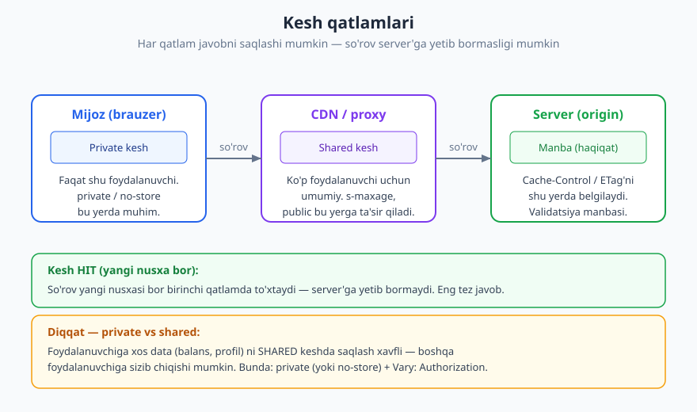
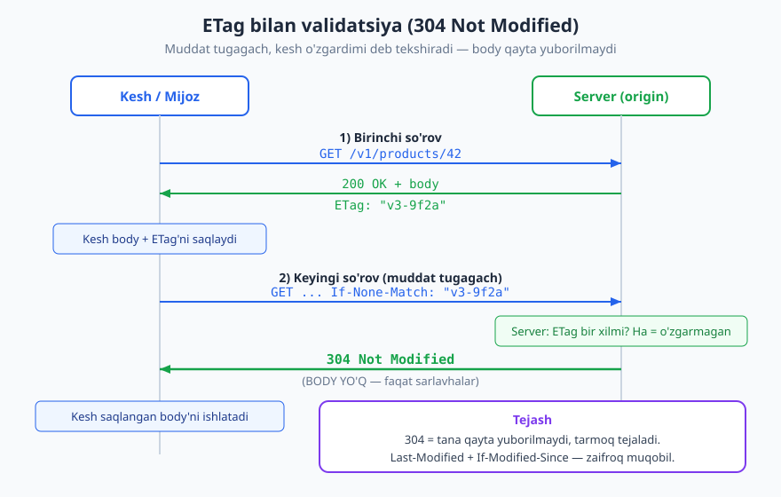
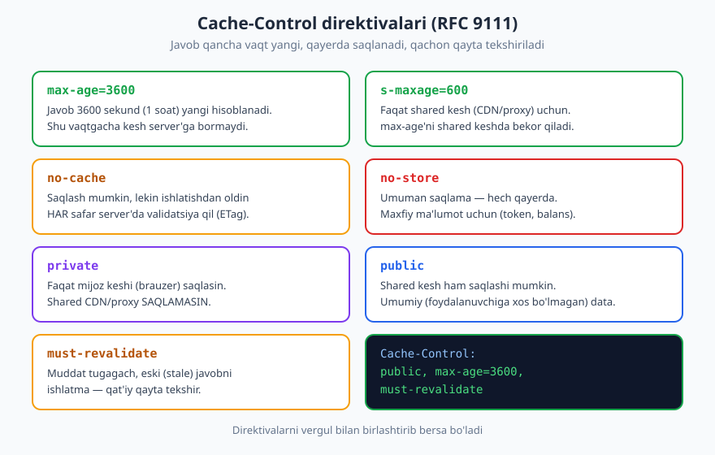

# 16 — Keshlash (HTTP caching)

[⬅️ Oldingi: 15 — Idempotentlik va parallellik](./15-idempotentlik-parallellik.md) · [🏠 README](./README.md) · [Keyingi: 17 — GraphQL dizayni ➡️](./17-graphql.md)

---

> **Bu bobda:** API javoblarini **keshlash** — qanday qilib bir xil javobni qayta-qayta hisoblamasdan, mijoz yoki oraliq qatlamga "eslab qol" deyish. Ikki asosiy mexanizm: **freshness** (`Cache-Control: max-age` — javob qancha vaqt yangi) va **validation** (`ETag` + `If-None-Match` -> `304 Not Modified` — o'zgardimi deb tekshirish, tana yubormay). Kesh qatlamlari (brauzer -> CDN/proxy -> origin), `private` vs `public`, `Vary`, nima keshlanadi va keshning eng xavfli xatolari.
>
> **Halollik / Eslatma:** Barcha keshlash semantikasi **RFC 9111** ("HTTP Caching", 2022) ga asoslanadi; `ETag`, `If-None-Match`, `Last-Modified` esa **RFC 9110** (HTTP semantics) ga. Bular barqaror standart — qo'shimcha infratuzilmasiz, oddiy HTTP'da ishlaydi. `stale-while-revalidate` kabi kengaytmalar RFC 5861 da. Barcha JSON namunalar valid (tekshirilgan). `max-age` qiymatini, `private`/`public` tanlovini tanlash kontekstga bog'liq trade-off; standartlar versiyasi vaqt bilan o'zgarishi mumkin.

---

## Nega keshlash kerak

Tasavvur qiling, mahsulotlar ro'yxati sahifasi minutiga 10 000 marta so'raladi, lekin ro'yxat soatiga bir marta o'zgaradi. Har so'rovda server ma'lumotlar bazasiga boradi, JSON yig'adi, qaytaradi — bir xil natijani **600 000 marta** qayta hisoblaydi. Bu isrof.

**Keshlash** — javobni bir marta hisoblab, uni "eslab qolish" va keyingi so'rovlarga shu saqlangan nusxani berish. Uch xil foyda beradi:

- **Tezlik** — kesh mijozga yaqin (brauzerda yoki yaqin CDN'da); javob bir necha millisekundda keladi, server'ga borib-kelish kerak emas. Kechikish (latency) keskin kamayadi.
- **Server yuki kamayadi** — keshdan kelgan so'rovlar origin server'ga **yetib ham bormaydi**. DB, hisoblash, tarmoq — hammasi yengillashadi. Bu masshtablash uchun kalit.
- **Tarmoq tejaladi** — javob qayta uzatilmaydi (yoki validation'da faqat kichik sarlavhalar uzatiladi). Mobil tarmoq, cheklangan trafik uchun katta yutuq.

REST arxitekturasi keshlashni **rasmiy cheklov** sifatida o'z ichiga oladi — "cacheable" ([05 — REST tamoyillari](./05-rest-tamoyillari.md)) REST'ning olti tamoyilidan biri. G'oya: server har javobni "keshlasa bo'ladimi?" deb belgilaydi, kesh esa bu belgiga qarab ish ko'radi.

> **Standart:** HTTP keshlash — **qo'shimcha kutubxona yoki maxsus infratuzilmasiz** ishlaydigan standart mexanizm. Server javobga to'g'ri sarlavhalarni qo'yadi, brauzer va har qanday standart proksi/CDN ularni **avtomatik** hurmat qiladi. Bu **RFC 9111** da to'liq belgilangan. Ya'ni keshlashni "yoqish" ko'pincha bir-ikki sarlavha qo'shishdir.

---

## Kesh qatlamlari

Kesh bitta joyda emas — so'rov yo'lida bir necha qatlam bo'lishi mumkin. So'rov mijozdan chiqib server'gacha boradigan yo'lda har bir qatlam javobni saqlab qo'yishi mumkin:



1. **Mijoz / brauzer keshi (private).** Faqat **shu bitta foydalanuvchi**ga tegishli. Brauzer (yoki mobil ilova) javobni o'z xotirasida saqlaydi. Boshqa foydalanuvchi bu keshga umuman tegmaydi.
2. **CDN / proxy keshi (shared).** **Ko'p foydalanuvchi** o'rtasida bo'lishiladigan umumiy kesh. Cloudflare, Fastly, nginx kabi oraliq qatlamlar. Bir foydalanuvchi olib kelgan javob shu CDN'da turadi va **boshqa** foydalanuvchilarga ham beriladi.
3. **Server / origin.** Haqiqat manbai — javobni asl hisoblaydigan joy. `Cache-Control`, `ETag` kabi belgilarni shu yer belgilaydi.

So'rov yangi nusxasi bor **birinchi** qatlamda to'xtaydi ("kesh HIT") — undan keyingi qatlamlarga umuman bormaydi. Yangi nusxa hech qayerda bo'lmasa, so'rov origin'gacha boradi ("kesh MISS").

### Private vs shared — bu farq xavfsizlik masalasi

Eng muhim ajratma: kesh **private** (bir foydalanuvchiga xos) yoki **shared** (ko'pchilik uchun umumiy) bo'ladimi.

| Kesh turi | Kim ko'radi | Misol | Mos data |
|-----------|-------------|-------|----------|
| **Private** | Faqat bitta foydalanuvchi (brauzer) | Brauzer keshi, mobil ilova keshi | Foydalanuvchiga xos: profil, balans |
| **Shared** | Ko'p foydalanuvchi (CDN/proxy) | Cloudflare, nginx, API gateway | Umumiy: mahsulot ro'yxati, narxlar |

> **Xavfsizlik:** Eng xavfli kesh xatosi — **foydalanuvchiga xos** javobni **shared** keshda saqlash. Masalan, Ali'ning balansini CDN keshlasa, keyin Vali shu URL'ni so'raganda **Ali'ning balansi** unga beriladi. Foydalanuvchiga xos har qanday data uchun `private` (yoki `no-store`) qo'ying va `Vary: Authorization` bilan kesh kalitini ajrating (pastda batafsil).

---

## Ikki mexanizm: freshness va validation

HTTP keshlashning butun mohiyati ikki savolga javob beradi:

1. **Yangimi?** (freshness) — keshlangan nusxa hali ham yetarlicha yangimi, server'ga umuman bormay ishlatsa bo'ladimi?
2. **O'zgardimi?** (validation) — agar muddat tugagan bo'lsa, server'dan "o'zgardimi?" deb so'rab, agar o'zgarmagan bo'lsa, eski nusxani **qayta tasdiqlash** mumkinmi?

Mana mantiq: avval freshness tekshiriladi. Yangi bo'lsa — server'ga umuman borilmaydi, eng tez. Muddat tugagan bo'lsa — validation ishga tushadi: kesh server'dan so'raydi, lekin agar javob o'zgarmagan bo'lsa, server **tana yubormaydi** (`304`), faqat "o'zgarmagan" deb tasdiqlaydi.

```
So'rov keladi
   |
   v
Keshda nusxa bormi? --yo'q--> origin'dan to'liq oladi (MISS)
   | ha
   v
Hali yangimi (max-age ichidami)? --ha--> keshdan beradi (HIT, eng tez)
   | yo'q (stale)
   v
Validation: ETag bilan so'ra --o'zgarmagan(304)--> eski nusxani qayta ishlatadi
                                --o'zgargan(200)--> yangi nusxani oladi va keshlaydi
```

Endi har ikkisini batafsil ko'ramiz.

### Freshness — Cache-Control: max-age

**Freshness** (yangilik) — javob qancha vaqt "yangi" hisoblanishini server aytadi. Bu vaqt ichida kesh server'ga **umuman bormaydi** — to'g'ridan-to'g'ri saqlangan nusxani beradi.

```http
GET /v1/products HTTP/1.1
Host: api.example.com

HTTP/1.1 200 OK
Cache-Control: public, max-age=3600
Content-Type: application/json

{"items": [{"id": 1, "name": "Kitob"}, {"id": 2, "name": "Daftar"}]}
```

`max-age=3600` — "bu javob 3600 sekund (1 soat) yangi". Keyingi 1 soat davomida shu URL so'ralsa, kesh server'ga bormay, **darhol** shu saqlangan javobni qaytaradi. Bu eng tez yo'l — tarmoq aylanishi (round-trip) umuman yo'q.

> **Eslatma:** Eski `Expires` sarlavhasi ham bor (aniq sana-vaqt beradi: `Expires: Wed, 18 Jun 2026 10:00:00 GMT`), lekin u **mutlaq vaqt**ga tayanadi — server va mijoz soatlari farq qilsa muammo bo'ladi. `Cache-Control: max-age` (nisbiy, sekundlarda) afzal va `Expires`'ni bekor qiladi. Yangi API'lar `max-age` ishlatadi.

### Validation — ETag + If-None-Match -> 304

`max-age` tugagach, javob **stale** (eskirgan) bo'ladi. Lekin "eskirgan" — "o'zgargan" degani **emas**. Ehtimol resurs hali ham aynan o'sha. Mana shu yerda **validation** keladi: kesh server'dan so'raydi — "menda shu nusxa bor, o'zgardimi?" Agar o'zgarmagan bo'lsa, server **tanani qayta yubormaydi** — bu katta tejash.

Buni **`ETag`** (entity tag) amalga oshiradi — resursning joriy versiyasi imzosi:



**1-qadam — birinchi so'rov, ETag olish:**

```http
GET /v1/products/42 HTTP/1.1
Host: api.example.com

HTTP/1.1 200 OK
ETag: "v3-9f2a"
Cache-Control: max-age=60
Content-Type: application/json

{"id": 42, "name": "Kitob", "price": 50000}
```

Kesh body'ni va `"v3-9f2a"` ETag'ni saqlaydi.

**2-qadam — muddat tugagach, validatsiya so'rovi:**

Kesh saqlangan ETag'ni `If-None-Match` da yuboradi:

```http
GET /v1/products/42 HTTP/1.1
Host: api.example.com
If-None-Match: "v3-9f2a"
```

Server joriy ETag'ni shu qiymat bilan solishtiradi:

- **O'zgarmagan (ETag bir xil)** -> tanani yubormaydi, faqat `304`:

```http
HTTP/1.1 304 Not Modified
ETag: "v3-9f2a"
Cache-Control: max-age=60
```

`304 Not Modified` ([03 — HTTP status kodlari](./03-http-status-kodlari.md)) — "o'zgarmagan, sening saqlangan nusxangni ishlat". **Tana yo'q** — faqat bir necha sarlavha uzatiladi. Katta JSON bo'lsa, bu juda katta tarmoq tejash.

- **O'zgargan (ETag boshqa)** -> to'liq yangi javob `200 OK` + yangi `ETag` bilan keladi.

> **Standart:** `ETag` va shartli so'rovlar **RFC 9110 §8.8.3** va **§13** da. `If-None-Match` mos kelganda (resurs o'zgarmagan) `GET`/`HEAD` uchun **`304 Not Modified`** qaytariladi. Bu **validation**: eskirgan nusxani arzon (tanasiz) qayta tasdiqlash. Eslatma: shu **ETag** boshqa yo'nalishda **parallellik** uchun ham ishlatiladi — `If-Match` -> `412` ([15 — Idempotentlik va parallellik](./15-idempotentlik-parallellik.md)). `If-None-Match` = keshlash; `If-Match` = parallellik.

### Last-Modified — zaifroq muqobil

`ETag`'ning vaqtga asoslangan oddiyroq varianti — **`Last-Modified`** (oxirgi o'zgartirilgan sana) + **`If-Modified-Since`**:

```http
GET /v1/products/42 HTTP/1.1
If-Modified-Since: Mon, 15 Jun 2026 10:00:00 GMT

HTTP/1.1 304 Not Modified
```

Server resurs shu sanadan beri o'zgarmagan bo'lsa `304` qaytaradi. Lekin bu **zaifroq**: sana faqat **1 sekund** aniqlikda — bir sekund ichida ikki marta o'zgargan resursni ushlay olmaydi; serverlararo soat farqi ham muammo. **`ETag` afzal** (aniq versiya imzosi), `Last-Modified` esa qulay zaxira yoki qo'shimcha.

| Mexanizm | Sarlavha (javob) | Mijoz so'rovi | Aniqlik |
|----------|------------------|---------------|---------|
| **ETag** | `ETag: "v3-9f2a"` | `If-None-Match` | Bayt-aniq (versiya imzosi) |
| **Last-Modified** | `Last-Modified: <sana>` | `If-Modified-Since` | 1 sekund (zaifroq) |

---

## Cache-Control direktivalari — batafsil

`Cache-Control` — keshlashning markaziy sarlavhasi. U vergul bilan ajratilgan **direktivalar** ro'yxatini oladi. Eng muhimlari:



| Direktiva | Ma'nosi |
|-----------|---------|
| `max-age=N` | Javob N sekund yangi (freshness); shu vaqtgacha server'ga bormaydi |
| `s-maxage=N` | Faqat **shared** kesh (CDN/proxy) uchun `max-age`; uni bekor qiladi |
| `no-cache` | Keshla, lekin har **ishlatishdan oldin** validatsiya qil (ETag) |
| `no-store` | Umuman **saqlama** — hech qayerda; maxfiy data uchun |
| `private` | Faqat **brauzer** keshi saqlasin; shared CDN saqlamasin |
| `public` | **Shared** kesh ham saqlashi mumkin |
| `must-revalidate` | Muddat tugagach, eskirgan nusxani ishlatma — avval validatsiya qil |
| `immutable` | Resurs umuman o'zgarmaydi — muddat ichida validatsiya ham qilma |

Diqqat tortadigan nozik nuqta — **`no-cache` vs `no-store`** chalkashligi:

- **`no-cache`** — "**keshla, lekin har safar tekshir**". Nusxa saqlanadi, lekin ishlatishdan oldin server'da validatsiya (ETag bilan `304`) qilinadi. Tez-tez o'zgaradigan, lekin tana katta resurslar uchun foydali.
- **`no-store`** — "**umuman saqlama**". Hech qayerda yozilmaydi. Bank balansi, token, shaxsiy data — diskka tushib qolmasligi kerak.

Amaliy misollar:

```http
Cache-Control: public, max-age=3600
```
Ommaviy, kam o'zgaradigan data (mahsulot kategoriyalari) — CDN bemalol keshlaydi.

```http
Cache-Control: private, max-age=60
```
Foydalanuvchi profili — faqat brauzerda, 1 minut.

```http
Cache-Control: no-store
```
Maxfiy data (balans, kartalar, OTP) — hech qayerda saqlanmaydi.

```http
Cache-Control: no-cache
```
Har safar yangiligini tasdiqlash kerak bo'lgan, lekin o'zgarmasa qayta yuklamaslik kerak bo'lgan data.

> **Trade-off:** `max-age` qiymatini tanlash — yangilik (freshness) va tejash o'rtasidagi muvozanat. Katta `max-age` = ko'proq tejash, lekin foydalanuvchi eskirgan datani ko'rishi mumkin. Kichik `max-age` = doim yangi, lekin kam tejash. **O'zgarish chastotasiga** moslang: soatiga o'zgaradigan ro'yxat uchun `max-age=600` (10 minut) yetarli; deyarli o'zgarmaydigan statik resurs uchun bir kun.

### ETag: strong vs weak

`ETag` ikki xil bo'ladi:

- **Strong (kuchli):** `ETag: "v3-9f2a"` — **bayt-aniq** moslik. Ikki nusxa bayt-bayt bir xil bo'lsagina ETag bir xil. Keshlash va parallellik (`If-Match`) uchun ishonchli.
- **Weak (zaif):** `ETag: W/"v3"` — **semantik** moslik. "Mazmunan teng, lekin har bayti bir xil bo'lmasligi mumkin" (masalan, sana formati ozgina farqli). Boshida `W/` bo'ladi.

Keshlashda ikkalasi ham ishlaydi; konkurensiya (`If-Match` bilan optimistik yozish, [15-bob](./15-idempotentlik-parallellik.md)) uchun **strong ETag** kerak. ETag'ni odatda mazmun xeshi (masalan SHA) yoki versiya raqami sifatida hisoblanadi.

---

## Vary — kesh kaliti to'g'ri bo'lsin

Kesh javobni qaysi **kalit** bo'yicha saqlaydi? Odatda — URL bo'yicha. Lekin bir URL turli **so'rov sarlavhalari**ga qarab turli javob qaytarishi mumkin. Masalan, `Accept-Language: uz` va `Accept-Language: en` bir URL'ga turli tildagi javob beradi. Kesh buni bilmasa, birinchisini saqlab, ikkinchisiga noto'g'ri tilni beradi.

**`Vary`** sarlavhasi keshga aytadi: "bu javob **shu so'rov sarlavhalariga** bog'liq — kesh kalitiga ularni ham qo'sh":

```http
GET /v1/products HTTP/1.1
Accept-Language: uz

HTTP/1.1 200 OK
Cache-Control: public, max-age=3600
Vary: Accept-Language
Content-Type: application/json

{"items": [{"id": 1, "name": "Kitob"}]}
```

`Vary: Accept-Language` -> kesh `URL + Accept-Language` ni kalit qiladi. Endi `uz` va `en` alohida saqlanadi, aralashmaydi.

Keng ishlatiladigan `Vary` qiymatlari: `Accept` (format — JSON/XML), `Accept-Language` (til), `Accept-Encoding` (gzip/brotli).

> **Xavfsizlik:** `Vary: Authorization` **juda muhim**. Agar javob foydalanuvchiga xos bo'lsa va shared keshda saqlanishi mumkin bo'lsa, kesh `Authorization` sarlavhasini ham kalitga qo'shishi shart — aks holda **bir foydalanuvchining javobi boshqasiga** beriladi. Ammo amalda foydalanuvchiga xos data uchun ko'pincha to'g'ridan-to'g'ri `private` yoki `no-store` qo'yiladi — bu yanada xavfsizroq. `Vary: Authorization` esa shared keshda foydalanuvchiga xos javoblar muqarrar bo'lganda himoya beradi.

---

## Nima keshlanadi, nima yo'q

Hamma narsa keshlanmaydi. Asosiy qoida — **metod semantikasi**ga bog'liq ([02 — HTTP'ni chuqurroq](./02-http-chuqur.md)):

| Metod | Keshlanadimi | Sabab |
|-------|:------------:|-------|
| `GET` | HA | Safe (faqat o'qish) — javob keshga mos |
| `HEAD` | HA | Safe — faqat sarlavhalar |
| `POST` | Odatda YO'Q | Holatni o'zgartiradi; javob keshlanmaydi (kamdan-kam istisno bor) |
| `PUT` | YO'Q | Holatni o'zgartiradi |
| `PATCH` | YO'Q | Holatni o'zgartiradi |
| `DELETE` | YO'Q | Holatni o'zgartiradi |

Faqat **safe** metodlar (`GET`, `HEAD`) keshlanadi — chunki ular holatni o'zgartirmaydi, javob "qayta ishlatsa bo'ladigan" tabiatga ega.

Data **mazmuni** bo'yicha qoidalar:

- **Ommaviy, kam o'zgaradigan** (mahsulot ro'yxati, kategoriyalar, narxlar) -> `public, max-age=...` -> CDN keshlasin.
- **Foydalanuvchiga xos** (profil, savatcha, buyurtmalar tarixi) -> `private` -> faqat brauzer, CDN emas.
- **Maxfiy / kritik** (balans, token, OTP, to'lov kartalari) -> `no-store` -> hech qayerda saqlanmasin.

> **Anti-pattern:** `GET /v1/me/balance` javobiga `Cache-Control: public, max-age=300` qo'yish — falokat. Bir foydalanuvchi balansini CDN keshlaydi, keyin boshqa foydalanuvchi shu URL'ni so'raydi va **birovning balansini** ko'radi. To'g'risi: `Cache-Control: no-store` (yoki kamida `private, no-cache`).

---

## CDN — chekkada keshlash

**CDN** (Content Delivery Network) — foydalanuvchiga geografik yaqin serverlar to'ri. Ular shared kesh sifatida ishlaydi: API javobini **chekkada** (edge) saqlab, keyingi so'rovlarga origin'ga bormay javob beradi. Bu kechikishni keskin kamaytiradi (foydalanuvchiga 20 ms, origin'ga 200 ms o'rniga).

CDN keshlash ommaviy, kam o'zgaradigan API javoblari uchun ideal: mahsulot kataloglari, ochiq ma'lumotlar, statik konfiguratsiyalar. Bunda `Cache-Control: public, s-maxage=...` ishlatiladi — `s-maxage` aynan shared (CDN) keshni boshqaradi.

### Invalidatsiya (purge) muammosi

CDN keshlashning eng qiyin tomoni — **invalidatsiya**: data o'zgargach, CDN'dagi eski nusxani **majburan** tozalash. Kompyuter fanidagi mashhur ikki qiyin masaladan biri keshni bekor qilishdir.

Ikki yondashuv:

- **TTL'ga tayanish** — qisqa `s-maxage` qo'yib, kesh o'z-o'zidan eskirishini kutish. Oddiy, lekin o'zgarish darhol ko'rinmaydi.
- **Aniq purge** — data o'zgargach, CDN API'siga "shu URL'ni o'chir" deb buyruq yuborish. Tez, lekin murakkab (har o'zgarishni kuzatish kerak).

```http
Cache-Control: public, s-maxage=600
```

### Stale-while-revalidate

Foydali kengaytma — **`stale-while-revalidate`** (RFC 5861): muddat tugagach, kesh **eskirgan nusxani darhol beradi** (tez javob), shu bilan birga **fon**da yangi nusxani oladi. Foydalanuvchi kutmaydi, keyingi so'rov esa yangi nusxani oladi.

```http
Cache-Control: public, max-age=60, stale-while-revalidate=30
```

"60 sekund yangi; undan keyingi 30 sekund — eskirganini berib tur, lekin fonda yangila". Tezlik va yangilik o'rtasida yaxshi muvozanat.

> **Standart:** `stale-while-revalidate` va `stale-if-error` — **RFC 5861** kengaytmalari (RFC 9111 ga qo'shimcha). Keng qo'llab-quvvatlanadi (CDN'lar, brauzerlar). `stale-if-error` esa origin xato bersa, eskirgan nusxani berib turishga ruxsat beradi — chidamlilik uchun.

---

## Anti-naqshlar — keng uchraydigan keshlash xatolari

> **Anti-pattern:** **Maxfiy ma'lumotni `public` keshlash.** Eng xavfli xato. Foydalanuvchiga xos yoki maxfiy javobni shared keshda saqlash — boshqalarga sizib chiqadi. To'g'risi: `private` yoki `no-store` + foydalanuvchiga xos shared javoblar bo'lsa `Vary: Authorization`.

> **Anti-pattern:** **Keshni umuman ishlatmaslik.** Hamma javobga `Cache-Control: no-store` qo'yib qo'yish — "ehtiyot bo'lay" deb. Natijada server har so'rovni qayta hisoblaydi, masshtab qiyinlashadi, foydalanuvchi sekin javob oladi. Ommaviy, o'zgarmas data keshlanishi **kerak**.

> **Anti-pattern:** **Noto'g'ri `max-age`.** Soatiga o'zgaradigan ro'yxatga `max-age=86400` (1 kun) — foydalanuvchi kun bo'yi eskirgan datani ko'radi. Yoki teskarisi: deyarli o'zgarmas resursga `max-age=5` — kesh deyarli foyda bermaydi. `max-age`'ni real o'zgarish chastotasiga moslang.

> **Anti-pattern:** **`ETag`siz, faqat `no-cache`.** `no-cache` har safar validatsiyani talab qiladi, lekin `ETag` (yoki `Last-Modified`) bo'lmasa, validatsiya `304` qaytara olmaydi — har safar **to'liq tana** keladi. Validation mexanizmi ETag bilan ishlaydi; uni unutmang.

---

## Hammasi birga — keshlash strategiyasi

Bitta API uchun keshlashni qatlam-qatlam loyihalashtirib chiqaylik:

**1. Ommaviy katalog — agressiv keshlash + validation:**

```http
GET /v1/categories HTTP/1.1

HTTP/1.1 200 OK
Cache-Control: public, max-age=3600, stale-while-revalidate=300
ETag: "cat-v12"
Vary: Accept-Language
Content-Type: application/json

{"items": [{"id": 1, "name": "Kitoblar"}, {"id": 2, "name": "Daftarlar"}]}
```

Ommaviy (`public`), 1 soat yangi, tugagach eskirganini berib fonda yangilaydi, ETag bilan arzon validatsiya, til bo'yicha ajratilgan.

**2. Foydalanuvchi profili — private, qisqa, validation bilan:**

```http
GET /v1/me HTTP/1.1
Authorization: Bearer <token>

HTTP/1.1 200 OK
Cache-Control: private, max-age=30
ETag: "u7-v3"
Content-Type: application/json

{"id": 7, "name": "Ali", "email": "ali@example.com"}
```

Faqat brauzer (`private`), 30 sekund, CDN'ga tegmaydi.

**3. Maxfiy balans — umuman keshlanmaydi:**

```http
GET /v1/me/balance HTTP/1.1
Authorization: Bearer <token>

HTTP/1.1 200 OK
Cache-Control: no-store
Content-Type: application/json

{"balance": 1250000, "currency": "UZS"}
```

Hech qayerda saqlanmaydi — diskka, CDN'ga, brauzer keshiga tushmaydi.

Kesh xatti-harakatini kuzatish ([25 — Observability](./25-observability.md)) ham muhim: kesh HIT/MISS nisbati, qancha so'rov origin'ga yetadi — bularni metrikalar bilan kuzatib, `max-age`'larni sozlash mumkin.

---

## Asosiy g'oyalar (bobni qisqacha)

- **Keshlash** — javobni bir marta hisoblab, qayta ishlatish. Foyda: tezlik (kechikish kamayadi), server yuki kamayadi, tarmoq tejaladi. REST'ning "cacheable" cheklovi ([05-bob](./05-rest-tamoyillari.md)). Standart: **RFC 9111** — qo'shimcha infratuzilmasiz ishlaydi.
- **Kesh qatlamlari:** mijoz/brauzer (private) -> CDN/proxy (shared) -> origin. So'rov yangi nusxasi bor birinchi qatlamda to'xtaydi.
- **Private vs shared** — eng muhim ajratma. Foydalanuvchiga xos data shared keshda **sizib chiqadi** — `private`/`no-store` ishlating.
- **Freshness** (`Cache-Control: max-age=N`) — N sekund yangi, server'ga bormaydi. `Expires` — eski, mutlaq vaqt, `max-age` afzal.
- **Validation** (`ETag` + `If-None-Match` -> `304 Not Modified`) — muddat tugagach, "o'zgardimi?" deb so'raydi; o'zgarmagan bo'lsa **tanasiz** `304` (katta tejash). `Last-Modified` + `If-Modified-Since` — zaifroq muqobil.
- **Cache-Control direktivalari:** `max-age`, `s-maxage` (shared), `no-cache` (keshla+validatsiya), `no-store` (umuman saqlama), `private`, `public`, `must-revalidate`. `no-cache` != `no-store`.
- **`Vary`** — javob qaysi so'rov sarlavhasiga bog'liqligini aytadi (kesh kaliti): `Accept`, `Accept-Language`, `Accept-Encoding`. `Vary: Authorization` foydalanuvchini ajratish uchun muhim.
- **Nima keshlanadi:** faqat safe metodlar (`GET`/`HEAD`); `POST`/`PUT`/`DELETE` odatda yo'q. Maxfiy data -> `no-store`.
- **CDN** chekkada keshlaydi (`s-maxage`); invalidatsiya (purge) qiyin masala; `stale-while-revalidate` (RFC 5861) tezlik+yangilik muvozanati.
- Bitta `ETag` ham keshlash (`If-None-Match` -> 304), ham parallellik (`If-Match` -> 412, [15-bob](./15-idempotentlik-parallellik.md)) uchun ishlatiladi.

---

## Mashqlar

### Oson

**1-mashq.** Quyidagi `Cache-Control` direktivalarining har birini bir jumlada tushuntiring: `max-age=600`, `no-cache`, `no-store`, `private`, `public`, `must-revalidate`.

**2-mashq.** Quyidagi HTTP metodlaridan qaysilarining javobi keshlanadi, qaysiniki keshlanmaydi va nega? `GET`, `POST`, `PUT`, `DELETE`, `HEAD`.

**3-mashq.** `no-cache` va `no-store` o'rtasidagi farqni tushuntiring. Bank balansini qaytaradigan endpoint uchun qaysi birini tanlaysiz?

### O'rta

**4-mashq.** `ETag` + `If-None-Match` -> `304` oqimini to'liq HTTP almashuvi bilan ko'rsating: birinchi `GET` (ETag oladi), keyingi `GET` (validatsiya), va resurs o'zgarmagan holatdagi javob. `304`ning asosiy foydasi nima?

**5-mashq.** Quyidagi uch resurs uchun mos `Cache-Control` qiymatini tanlang va asoslang: (a) ommaviy mahsulot kategoriyalari ro'yxati (soatiga o'zgaradi); (b) foydalanuvchining shaxsiy profili; (c) foydalanuvchi bank balansi.

**6-mashq.** `private` va `public` farqini tushuntiring. Nima uchun foydalanuvchiga xos javobni `public` qilish xavfli? Bir misol stsenariy bilan ko'rsating.

### Qiyin

**7-mashq.** Bir API jamoasi `GET /v1/me/orders` (foydalanuvchining buyurtmalari) javobiga `Cache-Control: public, max-age=300` qo'ygan va CDN orqali bermoqda. Bir foydalanuvchi boshqa birovning buyurtmalarini ko'ryapti. Xatoni aniqlang, nega yuz berishini tushuntiring va to'g'ri yechimni (kamida ikki variant) bering.

**8-mashq.** Tez-tez o'qiladigan, lekin soatiga bir marta o'zgaradigan ommaviy `GET /v1/products` endpointi uchun **freshness + validation** birgalikdagi to'liq keshlash strategiyasini loyihalashtiring: qaysi `Cache-Control` direktivalari, `ETag`, `Vary`, va (ixtiyoriy) `stale-while-revalidate`. Har bir tanlovni asoslang va to'liq javob sarlavhalarini yozing.

**9-mashq.** `Vary: Authorization` nima qiladi va nega kerak? Agar bu sarlavha bo'lmasa, shared keshda qanday muammo yuzaga keladi? Amalda foydalanuvchiga xos data uchun `Vary: Authorization`'dan ko'ra ko'pincha qaysi yondashuv afzal va nega?

<details markdown="1">
<summary>Yechimlar</summary>

### 1-mashq yechimi

- **`max-age=600`** — javob 600 sekund (10 minut) yangi hisoblanadi; shu vaqt ichida kesh server'ga bormay, saqlangan nusxani beradi (freshness).
- **`no-cache`** — javobni keshlash mumkin, lekin **ishlatishdan oldin har safar** server'da validatsiya (ETag bilan `304`) qilinishi shart.
- **`no-store`** — javobni **umuman saqlama** — hech qaysi keshda; maxfiy data uchun.
- **`private`** — faqat **bir foydalanuvchi keshi** (brauzer) saqlasin; shared CDN/proxy saqlamasin.
- **`public`** — **shared** kesh (CDN/proxy) ham saqlashi mumkin (umumiy, foydalanuvchiga xos bo'lmagan data).
- **`must-revalidate`** — muddat tugagach, eskirgan (stale) nusxani ishlatma; avval server bilan qat'iy validatsiya qil.

### 2-mashq yechimi

| Metod | Keshlanadimi | Sabab |
|-------|:------------:|-------|
| `GET` | HA | Safe (faqat o'qish) — javob qayta ishlatsa bo'ladigan tabiatga ega |
| `HEAD` | HA | Safe — faqat sarlavhalar, holat o'zgarmaydi |
| `POST` | Odatda YO'Q | Holatni o'zgartiradi (safe emas) |
| `PUT` | YO'Q | Holatni o'zgartiradi |
| `DELETE` | YO'Q | Holatni o'zgartiradi |

Faqat **safe** metodlar (`GET`, `HEAD`) keshlanadi — chunki ular holatni o'zgartirmaydi. Holat o'zgartiruvchi metodlar (`POST`/`PUT`/`DELETE`) javobi keshlanmaydi (RFC 9111).

### 3-mashq yechimi

- **`no-cache`** — "**keshla, lekin har safar tekshir**". Nusxa saqlanadi, lekin ishlatishdan oldin server'da validatsiya qilinadi (ETag -> `304` bo'lsa eski nusxa qayta ishlatiladi). Ya'ni saqlash bor, lekin "ko'r-ko'rona ishlatish" yo'q.
- **`no-store`** — "**umuman saqlama**". Hech qayerda (disk, CDN, brauzer keshi) yozilmaydi.

**Bank balansi uchun — `no-store`.** Balans maxfiy va kritik; u **hech qayerda** saqlanmasligi kerak (diskka tushib qolsa, boshqa birov o'qishi mumkin). `no-cache` saqlashga ruxsat beradi (har safar tekshirsa-da), shuning uchun maxfiy data uchun `no-store` to'g'ri tanlov.

### 4-mashq yechimi

**1-qadam — birinchi GET, ETag olish:**

```http
GET /v1/products/42 HTTP/1.1
Host: api.example.com

HTTP/1.1 200 OK
ETag: "v3-9f2a"
Cache-Control: max-age=60
Content-Type: application/json

{"id": 42, "name": "Kitob", "price": 50000}
```

**2-qadam — keyingi GET, validatsiya (saqlangan ETag yuboriladi):**

```http
GET /v1/products/42 HTTP/1.1
Host: api.example.com
If-None-Match: "v3-9f2a"
```

**3-qadam — resurs o'zgarmagan, server tanasiz javob beradi:**

```http
HTTP/1.1 304 Not Modified
ETag: "v3-9f2a"
Cache-Control: max-age=60
```

**`304`ning asosiy foydasi:** server **tanani (body) qayta yubormaydi** — faqat bir necha sarlavha uzatiladi. Katta JSON javoblar uchun bu juda katta tarmoq tejash; mijoz saqlangan nusxasini qayta ishlatadi. Resurs o'zgargan bo'lsa, o'rniga to'liq `200 OK` + yangi ETag keladi.

### 5-mashq yechimi

**(a) Ommaviy mahsulot kategoriyalari (soatiga o'zgaradi):**

```http
Cache-Control: public, max-age=600
```
Ommaviy (`public`) — CDN keshlasin (hamma uchun bir xil). `max-age=600` (10 minut) — o'zgarish chastotasidan kichikroq, demak foydalanuvchi juda eskirgan datani ko'rmaydi, lekin yaxshi keshlash bo'ladi. ETag qo'shsa validation ham bo'ladi.

**(b) Foydalanuvchining shaxsiy profili:**

```http
Cache-Control: private, max-age=60
```
Foydalanuvchiga xos — `private` (faqat brauzer, CDN emas). Qisqa `max-age` (1 minut), chunki profil yangilanishi tez ko'rinishi yaxshi.

**(c) Foydalanuvchi bank balansi:**

```http
Cache-Control: no-store
```
Maxfiy va kritik — hech qayerda saqlanmasligi kerak. Eskirgan balans ko'rsatish ham xavfli.

### 6-mashq yechimi

- **`private`** — javobni **faqat bitta foydalanuvchi keshi** (brauzer) saqlashi mumkin. Shared CDN/proxy **saqlamasin**.
- **`public`** — javobni **shared** kesh (CDN/proxy) ham saqlashi mumkin — ko'p foydalanuvchi o'rtasida bo'lishiladi.

**Nega foydalanuvchiga xos javobni `public` qilish xavfli:** shared kesh javobni **boshqa foydalanuvchilarga** ham beradi. Stsenariy:

1. Ali `GET /v1/me` so'raydi, javob `Cache-Control: public, max-age=300`. CDN Ali'ning profilini keshlaydi.
2. Vali shu URL'ni so'raydi. CDN keshdan **Ali'ning** profilini Vali'ga beradi.

Natija: Vali Ali'ning shaxsiy ma'lumotini ko'radi — ma'lumot sizishi. To'g'risi: foydalanuvchiga xos javobga `private` (yoki maxfiy bo'lsa `no-store`).

### 7-mashq yechimi

**Xato:** `GET /v1/me/orders` foydalanuvchiga xos javob (har foydalanuvchining o'z buyurtmalari), lekin u `public` deb belgilangan va CDN'da (shared kesh) saqlanmoqda.

**Nega yuz beradi:**

1. Ali `GET /v1/me/orders` so'raydi. CDN javobni `public, max-age=300` bo'lgani uchun **URL bo'yicha** keshlaydi (URL hammada bir xil: `/v1/me/orders`).
2. Vali shu URL'ni so'raydi. CDN kesh HIT deb hisoblaydi va **Ali'ning buyurtmalarini** Vali'ga beradi.

Asosiy sabab — kesh kaliti faqat URL; `Authorization` farqlanmagan va javob `public`.

**Yechimlar (kamida ikki variant):**

1. **`private` qo'yish (eng oddiy va xavfsiz):**
   ```http
   Cache-Control: private, max-age=30
   ```
   CDN umuman keshlamaydi; faqat o'sha foydalanuvchining brauzeri saqlaydi. Foydalanuvchiga xos data uchun bu eng to'g'ri yo'l.

2. **Shared keshda saqlash zarur bo'lsa — `Vary: Authorization` + kalitni ajratish:**
   ```http
   Cache-Control: private, max-age=30
   Vary: Authorization
   ```
   `Vary: Authorization` keshga `Authorization`ni ham kalitga qo'shishni aytadi, shunda har foydalanuvchining javobi alohida saqlanadi. Ammo amalda foydalanuvchiga xos data uchun `private` (1-variant) afzalroq va xavfsizroq.

Qo'shimcha: agar buyurtmalar juda maxfiy bo'lsa, `no-store` ham mumkin. Asosiy tuzatish — `public`ni olib tashlash.

### 8-mashq yechimi

To'liq strategiya — **freshness** (tezlik) + **validation** (muddat tugagach arzon tasdiqlash):

```http
GET /v1/products HTTP/1.1
Host: api.example.com
Accept-Language: uz

HTTP/1.1 200 OK
Cache-Control: public, max-age=600, stale-while-revalidate=120
ETag: "prod-list-v42"
Vary: Accept-Language
Content-Type: application/json

{"items": [{"id": 1, "name": "Kitob"}, {"id": 2, "name": "Daftar"}]}
```

Tanlovlarning asosi:

- **`public`** — ro'yxat ommaviy (foydalanuvchiga xos emas), shuning uchun CDN/proxy keshlashi xavfsiz va foydali. Bu eng katta tejashni beradi.
- **`max-age=600`** (10 minut, **freshness**) — data soatiga o'zgaradi, demak 10 minutlik kesh foydalanuvchiga juda eskirgan datani bermaydi, lekin server'ga borishlar sonini keskin kamaytiradi.
- **`ETag: "prod-list-v42"`** (**validation**) — `max-age` tugagach, kesh `If-None-Match: "prod-list-v42"` yuboradi. Ro'yxat hali o'zgarmagan bo'lsa, server **tanasiz** `304 Not Modified` qaytaradi — katta JSON qayta uzatilmaydi.
- **`Vary: Accept-Language`** — ro'yxat tilga bog'liq bo'lishi mumkin; kesh kalitiga tilni qo'shadi, shunda `uz` va `en` aralashmaydi.
- **`stale-while-revalidate=120`** (ixtiyoriy) — `max-age` tugagandan keyingi 120 sekund ichida kesh **eskirgan nusxani darhol beradi** (foydalanuvchi kutmaydi) va fonda yangilaydi. Tezlik va yangilik muvozanati.

**Validatsiya so'rovi (10 minut o'tgach):**

```http
GET /v1/products HTTP/1.1
If-None-Match: "prod-list-v42"
Accept-Language: uz

HTTP/1.1 304 Not Modified
ETag: "prod-list-v42"
Cache-Control: public, max-age=600
```

Shu tariqa: 10 minut ichida — server'ga umuman bormaydi (freshness); undan keyin — agar o'zgarmagan bo'lsa, faqat kichik `304` (validation). Ikki mexanizm birgalikda maksimal tejash beradi.

### 9-mashq yechimi

**`Vary: Authorization` nima qiladi:** keshga aytadi — "bu javob **`Authorization` sarlavhasiga bog'liq**, shuning uchun kesh kalitiga URL bilan birga `Authorization` qiymatini ham qo'sh". Natijada har bir foydalanuvchi (har xil token) uchun **alohida** kesh yozuvi bo'ladi.

**Bu sarlavha bo'lmasa qanday muammo:** shared kesh javobni faqat **URL** bo'yicha saqlaydi. Foydalanuvchiga xos javob (masalan `/v1/me`) keshda saqlansa, kesh `Authorization`ni inobatga olmaydi — birinchi foydalanuvchining javobini **boshqa** foydalanuvchilarga beradi. Ya'ni bir kishining shaxsiy ma'lumoti boshqasiga sizadi.

**Amalda nega ko'pincha boshqa yondashuv afzal:** `Vary: Authorization` ishlasa-da, u nozik (token har xil bo'lsa kesh deyarli hech narsa tejamaydi, har foydalanuvchiga alohida yozuv) va xato qilish oson. Shuning uchun foydalanuvchiga xos data uchun ko'pincha to'g'ridan-to'g'ri **`Cache-Control: private`** (faqat o'sha foydalanuvchining brauzeri keshlaydi, shared kesh umuman tegmaydi) yoki maxfiy bo'lsa **`no-store`** afzal. Bu **strukturaviy** xavfsizroq: shared kesh foydalanuvchiga xos javobni umuman saqlamaydi, demak sizish ehtimoli yo'qoladi. `Vary: Authorization` esa shared keshda foydalanuvchiga xos javoblar muqarrar bo'lgan kamdan-kam holatlarda himoya beradi.

</details>

---

[⬅️ Oldingi: 15 — Idempotentlik va parallellik](./15-idempotentlik-parallellik.md) · [🏠 README](./README.md) · [Keyingi: 17 — GraphQL dizayni ➡️](./17-graphql.md)
