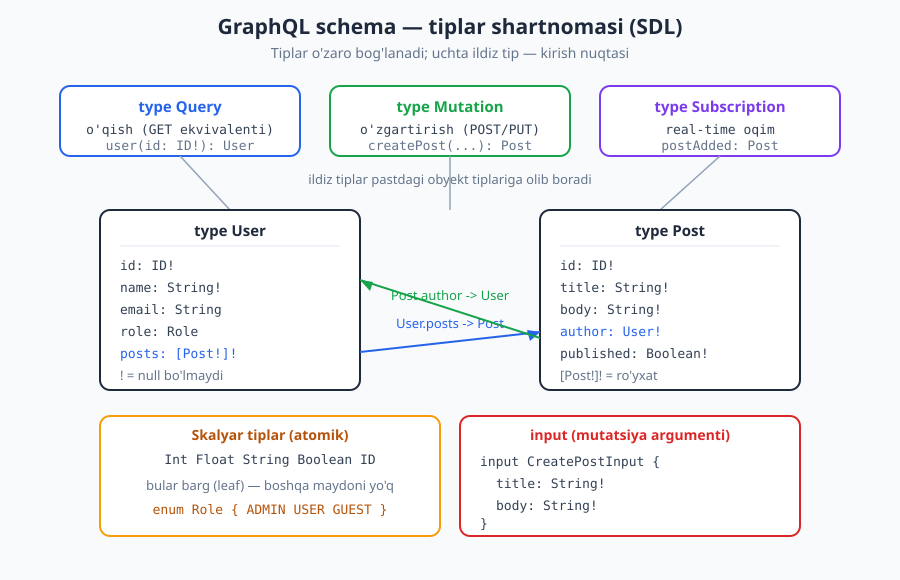
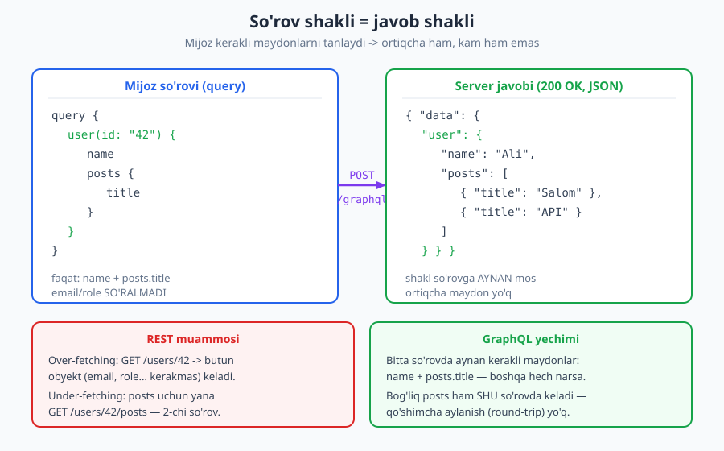
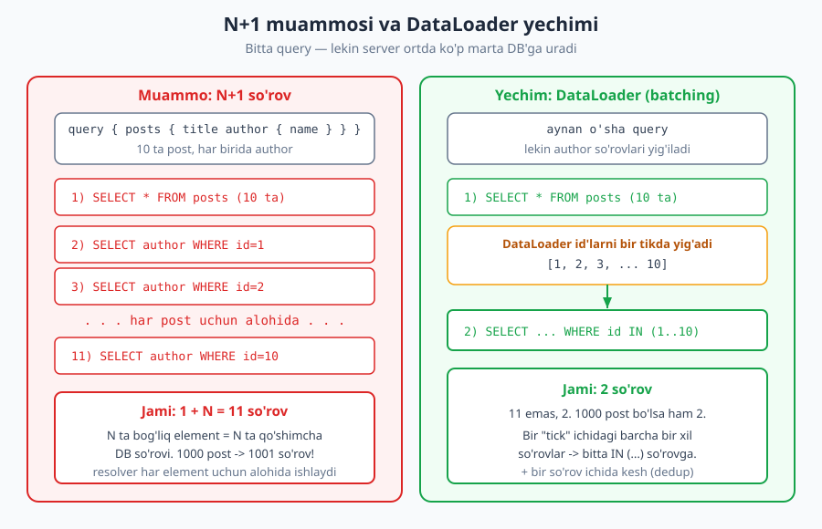

# 17 — GraphQL dizayni

[⬅️ Oldingi: 16 — Keshlash (HTTP caching)](./16-keshlash.md) · [🏠 README](./README.md) · [Keyingi: 18 — gRPC va Protocol Buffers ➡️](./18-grpc.md)

---

> **Bu bobda:** REST'dan keyingi ikkinchi yirik uslub — GraphQL. U bitta endpoint (odatda `POST /graphql`) orqali ishlaydigan, **mijoz qaysi maydonlarni xohlasa, aynan shularni so'raydigan** so'rov tili va ish vaqti (runtime). Biz uning tipli sxemasini (SDL), `Query`/`Mutation`/`Subscription` ildiz tiplarini, over/under-fetching muammosini qanday hal qilishini va — eng muhimi — uning halol trade-off'larini (N+1, keshlash, murakkablik, xato, versiyalash) ko'rib chiqamiz. Oxirida REST va GraphQL'ni qachon tanlashni muhokama qilamiz.
>
> **Halollik / Eslatma:** GraphQL — RFC emas, **GraphQL Foundation** (asli Facebook) e'lon qilgan rasmiy spetsifikatsiya. Faktlar shu spetsifikatsiyaga tayanadi: bitta endpoint, tipli sxema, mijoz maydonlarni tanlaydi, N+1 muammosi DataLoader/batching bilan yengiladi. "Qachon GraphQL, qachon REST" qismi — mutlaq qoida emas, **trade-off**; kontekst hal qiladi. Bir muhim halollik: GraphQL odatda HTTP xato kodi emas, `200 OK` + javob tanasida `errors[]` qaytaradi — bu REST'ning status-kod falsafasiga zid; buni yashirmaymiz. SDL va JSON namunalari to'g'ri sintaksisda; spetsifikatsiya va asboblar vaqt bilan o'zgaradi.

---

## GraphQL nima va nega kerak

[16-bobgacha](./16-keshlash.md) biz asosan REST haqida gaplashdik: resurslar, URI'lar, HTTP fe'llari. REST kuchli va sodda. Lekin uning ikkita o'jar kamchiligi bor, va ularni biz [07-bobda](./07-sorov-javob-payload.md) "over-fetching va under-fetching" deb nomlagan edik. Eslatib o'tay:

- **Over-fetching** (ortiqcha olish): mijozga faqat foydalanuvchining ismi kerak, lekin `GET /users/42` butun obyektni — email, telefon, manzil, ro'yxatdan o'tgan sana — hammasini qaytaradi. Kerakmas baytlar tarmoqda yuriydi. Mobil ilova uchun bu — sekinroq ekran, ko'proq trafik.
- **Under-fetching** (kam olish): bitta ekranni chizish uchun bir nechta resurs kerak. Masalan, foydalanuvchi + uning postlari + har postning izohlari. REST'da bu uch-to'rt alohida so'rov: `GET /users/42`, keyin `GET /users/42/posts`, keyin har post uchun `GET /posts/{id}/comments`. Har so'rov — yangi tarmoq aylanishi (round-trip).

Tasavvur qiling, restoranda ofitsiant sizga **butun menyuni tayyorlab** keltiradi (over-fetching) yoki har taomni alohida-alohida, har safar oshxonaga qaytib (under-fetching). GraphQL'da esa siz **bitta aniq buyurtma** berasiz: "menga shu, shu va shu kerak" — va oshxona aynan shuni, bir martada keltiradi.

Rasman: **GraphQL — API'lar uchun so'rov tili (query language) va shu so'rovlarni bajaruvchi ish vaqti (runtime).** U Facebook'da 2012-yilda mobil ilovalarning aynan shu og'rig'ini hal qilish uchun tug'ildi, 2015-yilda ochiq qilindi, hozir esa mustaqil **GraphQL Foundation** spetsifikatsiyasi sifatida rivojlanadi.

GraphQL'ning REST'dan tubdan farq qiladigan uchta g'oyasi:

1. **Bitta endpoint.** REST'da har resurs o'z URI'siga ega (`/users`, `/posts`, `/comments`). GraphQL'da odatda bitta manzil bor — masalan `POST /graphql`. "Nima kerakligi" URL'da emas, **so'rov tanasida** ifodalanadi.
2. **Mijoz maydonlarni tanlaydi.** Server "men nimani qaytarsam, shu" demaydi; mijoz "menga aynan shu maydonlar kerak" deydi va javob aynan o'sha shaklda keladi.
3. **Kuchli tipli, contract-first sxema.** Server o'z imkoniyatlarini **sxema** (schema) sifatida e'lon qiladi: qanday tiplar bor, har tipda qanday maydonlar, qaysi so'rovlar mumkin. Bu — mashina o'qiy oladigan, bir ma'noli shartnoma. Buni biz [04-bobda](./04-api-uslublari.md) API uslublarini taqqoslaganda eslatib o'tgan edik.

> **Eslatma:** "GraphQL — REST o'rnini bosadi" degan da'vo soddalashtirilgan. To'g'rirog'i: GraphQL — REST hal qila olmagan **muayyan muammolarga** (ko'p manbali, o'zgaruvchan, mijoz-boshqaradigan ma'lumot ehtiyoji) javob. Ko'p tizimlar ikkalasini birga ishlatadi.

---

## Sxema (Schema) — yurakdagi shartnoma

GraphQL'da hamma narsa **sxemadan** boshlanadi. Sxema — bu serverning to'liq "imkoniyatlar xaritasi": qanday tiplar mavjud, ular qanday bog'langan, mijoz nimani so'ray oladi. Sxema **SDL** (Schema Definition Language — sxema ta'rifi tili) deb ataladigan maxsus sintaksisda yoziladi.



### Tiplar va maydonlar

Eng asosiy qurilish bloki — **obyekt tipi** (`type`). U maydonlardan iborat, har maydonning o'z tipi bor:

```graphql
type User {
  id: ID!
  name: String!
  email: String
  role: Role
  posts: [Post!]!
}

type Post {
  id: ID!
  title: String!
  body: String!
  published: Boolean!
  author: User!
}
```

Bu yerda diqqat qilinadigan detallar:

- **Skalyar tiplar** (atomik, "barg" qiymatlar): `Int`, `Float`, `String`, `Boolean` va maxsus `ID` (noyob identifikator, ko'pincha satr sifatida seriyalanadi). Bular boshqa maydonga ega bo'lmaydi — daraxtning bargi.
- **`!` (undov)** — maydon **null bo'la olmaydi** degani. `name: String!` — ism doim bo'ladi; `email: String` — email bo'lmasligi mumkin (null).
- **`[Post!]!`** — ro'yxat. Ichkaridagi `!` "ro'yxat ichida null element yo'q", tashqaridagi `!` "ro'yxatning o'zi null emas (bo'sh bo'lishi mumkin, lekin null emas)" degani.
- **Bog'lanish (relationship)** — `User.posts` `Post` tipiga, `Post.author` esa `User` tipiga ishora qiladi. Bu graf hosil qiladi — nomi ham shundan: ma'lumotlar **graf** kabi bir-biriga ulangan.

GraphQL'ning yana bir nechta qurilish bloki:

- **`enum`** — cheklangan qiymatlar to'plami: `enum Role { ADMIN  USER  GUEST }`.
- **`interface`** — umumiy maydonlar to'plami; turli tiplar uni amalga oshiradi (masalan, `Node { id: ID! }`).
- **`union`** — bir maydon bir nechta tipdan biri bo'lishi mumkin: `union SearchResult = User | Post`.
- **`input`** — mutatsiyaga argument sifatida uzatiladigan tuzilma (oddiy `type`'dan farqi: faqat kirish uchun).

### Uchta ildiz tip: kirish nuqtalari

Sxemada uchta maxsus **ildiz tip** (root type) bor — ular API'ga kirish eshiklari:

| Ildiz tip | Vazifasi | REST analogi |
|---|---|---|
| `Query` | Ma'lumot **o'qish** | `GET` |
| `Mutation` | Ma'lumot **o'zgartirish** (yaratish/yangilash/o'chirish) | `POST`/`PUT`/`PATCH`/`DELETE` |
| `Subscription` | **Real-time** oqim (server hodisa yuborib turadi) | WebSocket/SSE |

```graphql
type Query {
  user(id: ID!): User
  posts(limit: Int = 10): [Post!]!
}

type Mutation {
  createPost(input: CreatePostInput!): Post!
}

type Subscription {
  postAdded: Post!
}

input CreatePostInput {
  title: String!
  body: String!
}
```

`Subscription` — bu real-time mexanizm bo'lib, odatda WebSocket ustida ishlaydi; biz uni [20-bobda](./20-realtime-websocket-sse.md) WebSocket va SSE bilan birga chuqurroq ko'ramiz. Bu bobda asosiy e'tibor `Query` va `Mutation`'da.

> **Standart:** GraphQL'ning kuchli tomoni — sxema **majburiy va birinchi darajali**. REST'da shartnoma (OpenAPI) ko'pincha keyin yoziladi yoki umuman bo'lmaydi; GraphQL'da sxema bo'lmasa, server umuman ishlamaydi. Bu "contract-first" yondashuvni tabiiy qiladi — [21-bobdagi](./21-openapi.md) OpenAPI g'oyasiga o'xshash, lekin majburiy.

---

## Query: mijoz nimani so'rasa, shuni oladi

Endi eng o'ziga xos qism. GraphQL so'rovi — bu sizga kerakli maydonlarning **daraxt shaklidagi** tasviri. Siz aynan kerakli maydonlarni yozasiz, server esa javobni **aynan o'sha shaklda** qaytaradi.



So'rov:

```graphql
query {
  user(id: "42") {
    name
    posts {
      title
    }
  }
}
```

Buni HTTP darajasida ko'raylik — GraphQL odatda `POST /graphql` orqali, so'rov tanasida JSON sifatida yuboriladi:

```http
POST /graphql HTTP/1.1
Host: api.example.com
Content-Type: application/json
Authorization: Bearer <token>

{"query": "query { user(id: \"42\") { name posts { title } } }"}

HTTP/1.1 200 OK
Content-Type: application/json

{"data":{"user":{"name":"Ali","posts":[{"title":"Salom"},{"title":"API dizayni"}]}}}
```

E'tibor bering:

- **Javob shakli so'rov shakliga aynan mos.** Siz `name` va `posts.title` so'radingiz — javobda aynan shular bor, na ko'p, na kam. `email`, `role`, `body` — so'ralmadi, demak javobda yo'q.
- **Javob doim `data` kaliti ostida** keladi. Xato bo'lsa, qo'shimcha `errors` kaliti qo'shiladi (buni keyinroq ko'ramiz).
- **HTTP status `200 OK`** — hatto so'rovning bir qismi xato bo'lsa ham (bu — muhim trade-off, pastda batafsil).

### Argumentlar, alias, fragment, o'zgaruvchilar

GraphQL so'rovlari yana bir nechta vositaga ega:

**Argumentlar** — maydonni sozlash: `user(id: "42")`, `posts(limit: 5)`.

**Alias** — bir maydonni har xil argument bilan ikki marta so'rash; nomlar to'qnashmasligi uchun nom beriladi:

```graphql
query {
  birinchi: user(id: "1") { name }
  ikkinchi: user(id: "2") { name }
}
```

**Fragment** — takrorlanuvchi maydonlar to'plamiga nom berish (DRY):

```graphql
query {
  user(id: "42") {
    ...userFields
    posts { ...userFields }
  }
}

fragment userFields on User {
  id
  name
}
```

**O'zgaruvchilar (variables)** — qiymatni so'rov matniga yopishtirib qo'ymasdan, alohida uzatish (bu xavfsizroq va keshlanadigan):

```graphql
query GetUser($id: ID!) {
  user(id: $id) {
    name
  }
}
```

JSON tanasi ikki qismdan iborat bo'ladi:

```json
{
  "query": "query GetUser($id: ID!) { user(id: $id) { name } }",
  "variables": { "id": "42" }
}
```

> **Xavfsizlik:** Qiymatlarni so'rov matniga qo'lda yopishtirish (string konkatenatsiya) — REST'dagi SQL-injection'ga o'xshash xavf. **O'zgaruvchilardan foydalaning** — bu GraphQL darajasida tipni ham tekshiradi.

### Mutation: o'zgartirish

O'qish `query` orqali bo'lsa, har qanday o'zgartirish (yaratish, yangilash, o'chirish) `mutation` orqali bo'ladi. Sintaksisi bir xil, faqat boshida `mutation` so'zi turadi va `Mutation` ildiz tipidagi maydon chaqiriladi:

```graphql
mutation {
  createPost(input: { title: "Yangi post", body: "Matn..." }) {
    id
    title
    published
  }
}
```

Diqqat: mutatsiya ham **o'zgartirgandan keyin natijani so'raydi** — qaysi maydonlar qaytishini siz tanlaysiz (`id`, `title`, `published`). Bu REST'dagi "yaratdim, endi qayta `GET` qilib olishim kerakmi?" muammosini yo'q qiladi.

```http
POST /graphql HTTP/1.1
Host: api.example.com
Content-Type: application/json
Authorization: Bearer <token>

{"query":"mutation { createPost(input: {title: \"Yangi\", body: \"Matn\"}) { id title published } }"}

HTTP/1.1 200 OK
Content-Type: application/json

{"data":{"createPost":{"id":"101","title":"Yangi","published":false}}}
```

> **Eslatma:** GraphQL spetsifikatsiyasi `query` maydonlarini parallel, `mutation` maydonlarini esa **ketma-ket** (birin-ketin) bajarishni kafolatlaydi — chunki o'zgartirishlar tartibi muhim. Bu idempotentlik mavzusiga tegishli; [15-bobda](./15-idempotentlik-parallellik.md) parallellik haqida gaplashgandik.

### Subscription: qisqacha

`subscription` — server tomonidan mijozga uzatiladigan hodisalar oqimi. Masalan, yangi post qo'shilganda barcha tinglovchilarga yuborish:

```graphql
subscription {
  postAdded {
    id
    title
  }
}
```

Bu odatda WebSocket (yoki SSE) transport ustida ishlaydi — uni [20-bobda](./20-realtime-websocket-sse.md) batafsil ko'ramiz.

---

## Over/under-fetching'ni qanday hal qiladi

Endi boshidagi muammoga qaytaylik. Bir ekran kerak bo'lsin: foydalanuvchining ismi, avatari va uning oxirgi 3 ta postining sarlavhasi.

**REST'da** (sodda variantda):

```http
GET /users/42            -> butun user obyekti (over-fetch)
GET /users/42/posts?limit=3   -> 2-chi aylanish (under-fetch'ni qoplash uchun)
```

Ikki so'rov, va birinchisida kerakmas maydonlar. Mobil tarmoqda har aylanish 100–300 ms qo'shishi mumkin.

**GraphQL'da** — bitta so'rov, aynan kerakli maydonlar:

```graphql
query {
  user(id: "42") {
    name
    avatarUrl
    posts(limit: 3) {
      title
    }
  }
}
```

Bitta tarmoq aylanishi, na ortiqcha bayt, na yetishmagan ma'lumot. Bu GraphQL'ning eng kuchli tomoni va u eng yaxshi yaltiraydigan joy:

- **Mobil ilovalar** — tarmoq va batareya qimmat; kerakmas baytlar zarar.
- **Murakkab, o'zgaruvchan UI** — bir ekran ko'p manbadan ma'lumot yig'adi; har frontend jamoasi o'z so'rovini moslaydi, backend'ga tegmasdan.
- **Aggregatsiya (BFF)** — bir GraphQL qatlami ortda bir nechta mikroservis/REST API'ni birlashtirib, mijozga yagona graf taqdim etadi. Buni biz [23-bobda](./23-api-gateway-bff.md) BFF (Backend-for-Frontend) sifatida ko'ramiz.

> **Trade-off:** Bu moslashuvchanlik bepul emas. Mijoz endi **og'ir** so'rovlar ham yubora oladi (chuqur ichma-ich, ko'p bog'lanishli) — bu serverga yuk. Pastda buni qanday cheklashni ko'ramiz. Qoidaning o'zi shu: GraphQL kuch-quvvatni mijozga beradi, demak mas'uliyatni ham serverga qaytaradi.

---

## Muammolar va trade-off'lar (halol qism)

GraphQL — sehrli tayoqcha emas. Uning real, kundalik muammolari bor. Yaxshi muhandis ularni oldindan biladi.

### 1. N+1 muammosi

Bu — GraphQL'ning eng mashhur tuzog'i. Tasavvur qiling, so'rov:

```graphql
query {
  posts {
    title
    author { name }
  }
}
```

Sodda amalga oshirilganda server quyidagicha ishlaydi:

1. `posts` resolveri: `SELECT * FROM posts` — 10 ta post oladi (bu "1").
2. Har post uchun `author` resolveri **alohida** chaqiriladi: `SELECT * FROM users WHERE id = ?` — 10 marta (bu "N").

Jami **1 + N = 11** ta DB so'rovi. 1000 ta post bo'lsa — **1001** ta so'rov. Tizim tiz cho'kadi.



**Yechim — DataLoader (batching + per-request kesh).** G'oya oddiy: bog'liq elementlarni darrov so'ramaymiz, balki bitta "tick" davomida barcha kerakli `id`'larni **yig'amiz**, keyin bitta so'rov bilan olamiz:

```sql
-- 10 ta alohida so'rov o'rniga:
SELECT * FROM users WHERE id IN (1, 2, 3, ..., 10)
```

Endi jami **2** ta so'rov: `posts` uchun bitta, barcha `author`'lar uchun bitta. DataLoader yana **bir so'rov ichida kesh** ham qiladi — agar bir `id` ikki marta kerak bo'lsa, DB'dan bir marta olinadi.

> **Diqqat:** N+1 — GraphQL'ga xos kasallik EMAS; u REST'da ham, ORM'larda ham bor. Lekin GraphQL'da u **osonroq paydo bo'ladi**, chunki mijoz ichma-ich bog'lanishlarni erkin so'ray oladi. Shuning uchun DataLoader yoki shunga o'xshash batching deyarli har bir jiddiy GraphQL serverida shart.

### 2. Keshlash qiyinlashadi

[16-bobda](./16-keshlash.md) biz HTTP keshlashning kuchini ko'rdik: `GET` so'rovlari URL bo'yicha keshlanadi, `ETag`/`Cache-Control` butun infratuzilma (brauzer, CDN, proksi) tomonidan bepul ishlatiladi. GraphQL bu mexanizmni **buzadi**:

- Hamma narsa `POST` — `POST` odatda keshlanmaydi (RFC 9111).
- Bitta endpoint — URL har doim `/graphql`, demak "URL = kesh kaliti" ishlamaydi.
- Javob shakli har so'rovda har xil — bir xil URL turli natija beradi.

Yechimlar (har biri kontekstga bog'liq):

- **Persisted queries** (saqlangan so'rovlar) — so'rov matni o'rniga uning **hash**'i yuboriladi; server oldindan tanigan so'rovlarni `GET` orqali keshlanadigan qiladi. Bu CDN keshini qaytaradi.
- **Ilova darajasidagi kesh** — server ichida obyekt darajasida kesh (masalan Redis), DataLoader keshi.
- **Mijoz tomonidagi normalizatsiyalangan kesh** — Apollo Client, Relay kabi kutubxonalar javobni `id` bo'yicha normalizatsiya qilib saqlaydi.

> **Trade-off:** HTTP keshlash REST'ning "bepul" ustunligi edi. GraphQL'da uni qaytarish uchun qo'shimcha ish (persisted queries yoki ilova-darajali kesh) kerak. Bu — GraphQL moslashuvchanligi uchun to'lanadigan haq.

### 3. So'rov murakkabligi va rate limiting

REST'da bir so'rov — odatda bir resurs, taxminan oldindan bilinadigan yuk. GraphQL'da esa mijoz **juda og'ir** so'rov yozishi mumkin — masalan, chuqur ichma-ich bog'lanish:

```graphql
query {
  posts {
    author {
      posts {
        author {
          posts { title }
        }
      }
    }
  }
}
```

Bu eksponensial yuk yaratishi mumkin. [14-bobdagi](./14-rate-limiting.md) oddiy "soatiga N so'rov" cheklovi bu yerda yetarli emas — chunki bir so'rovning o'zi minglab obyektni so'rashi mumkin. Shuning uchun GraphQL'da maxsus himoyalar qo'llanadi:

- **Query depth limit** — so'rov chuqurligini cheklash (masalan, maksimum 7 daraja).
- **Query complexity limit** — har maydonga "narx" berib, umumiy "ball"ni cheklash.
- **Pagination majburiy** — ro'yxat qaytaruvchi maydonlarda `limit` argumenti shart.
- **Timeout** — uzoq cho'ziladigan so'rovni to'xtatish.

### 4. Xato: 200 OK + `errors[]`

Bu — eng muhim halollik. REST'da xato HTTP status kodida ifodalanadi: `404`, `400`, `500` ([03-bobdagi](./03-http-status-kodlari.md) status oilalari). GraphQL esa boshqacha ishlaydi: ko'p hollarda u **`200 OK` qaytaradi**, xatolar esa javob tanasidagi **`errors`** ro'yxatida bo'ladi:

```json
{
  "data": { "user": null },
  "errors": [
    {
      "message": "User topilmadi",
      "path": ["user"],
      "extensions": { "code": "NOT_FOUND" }
    }
  ]
}
```

Nega shunday? Chunki bir so'rov **qisman muvaffaqiyatli** bo'lishi mumkin: `user` topildi, lekin uning `posts` maydonida xato yuz berdi. REST'ning bitta status kodi bunday "yarmi ishladi" holatini ifodalay olmaydi. GraphQL `data`'da ishlagan qismni, `errors`'da esa muammolarni qaytaradi.

> **Anti-pattern / Diqqat:** Bu REST'ga o'rgangan mijozlar uchun tuzoq. "200 keldi, demak hammasi yaxshi" deb `errors`'ni tekshirmaslik — eng keng tarqalgan GraphQL xatosi. **Doim `errors` ro'yxatini tekshiring.** Shuni ham bilib qo'ying: transport darajasidagi xato (autentifikatsiya yo'q, server qulagan) baribir HTTP status kodida (`401`, `500`) keladi — faqat **GraphQL ichidagi** xatolar `200 + errors` shaklida bo'ladi.

[09-bobdagi](./09-xato-dizayni.md) RFC 9457 "Problem Details" — REST uchun. GraphQL o'z xato formatiga ega (`errors[]` + `extensions.code`), shuning uchun u boshqa konvensiya. Ikkalasini aralashtirmang.

### 5. Versiyalash: "versiyasiz evolyutsiya"

[10-bobda](./10-versiyalash.md) biz REST'ni qanday versiyalashni ko'rdik (`/v1`, `/v2`...). GraphQL bu masalaga boshqacha qaraydi va **"versiyasiz evolyutsiya"** ni targ'ib qiladi:

- **Maydon qo'shish** — buzmaydigan o'zgarish. Eski mijozlar yangi maydonni so'ramaydi, demak ularga ta'sir qilmaydi.
- **Maydonni `@deprecated` deb belgilash** — o'chirish o'rniga, eskirgan deb belgilanadi (sxemada ko'rinadi, asboblar ogohlantiradi), lekin ishlashda davom etadi:

```graphql
type User {
  name: String!
  fullName: String @deprecated(reason: "`name` ishlatish kerak")
}
```

Mijoz faqat o'ziga kerakli maydonni so'ragani uchun, yangi maydonlar qo'shish hech kimni buzmaydi — bu `/v2` yaratish ehtiyojini kamaytiradi.

> **Halollik:** "Versiyasiz" so'zi mubolag'a. Maydon **o'chirish** yoki tipini **o'zgartirish** baribir buzuvchi o'zgarish (breaking change) — buni hech qanday sxema yashira olmaydi. GraphQL faqat **eng keng tarqalgan** evolyutsiya turini (maydon qo'shish) og'riqsiz qiladi. Real loyihalarda deprecate qilingan maydonlar ham bir kun o'chiriladi — bu hali ham boshqarilishi kerak.

---

## REST vs GraphQL: qachon qaysi

Mana eng muhim savol. Javob — **"ikkalasi ham, kontekstga qarab"**. Quyidagi jadval qaror berishga yordam beradi:

| Mezon | REST mos keladi | GraphQL mos keladi |
|---|---|---|
| Ma'lumot shakli | Barqaror, sodda CRUD | O'zgaruvchan, mijoz-boshqaradigan |
| Mijozlar | Bir xil, taxmin qilinadigan | Ko'p xil (mobil, web, ichki), har xil ehtiyoj |
| Manbalar | Bitta backend/DB | Ko'p mikroservis/manba aggregatsiyasi |
| Keshlash | HTTP/CDN keshi muhim | Ilova-darajali kesh joyida |
| Over/under-fetch | Muammo emas | Asosiy og'riq nuqtasi |
| Fayl yuklash, binary | Tabiiy | Noqulay (alohida mexanizm kerak) |
| Public, oddiy API | ✅ Sodda, tanish | Ortiqcha murakkablik |
| Murakkab UI/grafli ma'lumot | Ko'p so'rov kerak | ✅ Bitta moslashuvchan so'rov |

Amaliy yo'l-yo'riq (trade-off sifatida, qoida emas):

- **Sodda, public, CRUD-asosli API** (masalan, to'lov, weather, oddiy ma'lumotnoma) → **REST**. U tanish, HTTP keshi bepul, asboblari pishgan, o'rganish oson.
- **Murakkab, o'zgaruvchan mijoz ehtiyoji, ko'p manba** (masalan, ijtimoiy tarmoq, dashboard, mobil-og'ir mahsulot) → **GraphQL**. Frontend jamoalari mustaqil ishlaydi, over/under-fetching yo'qoladi.
- **Ichki, yuqori-unumli xizmatlararo aloqa** → ko'pincha **gRPC** ([18-bob](./18-grpc.md)) — bu uchinchi yo'l.
- **Ko'pincha eng yaxshi javob — aralash:** GraphQL'ni frontend uchun (BFF), REST/gRPC'ni ichkarida.

> **Trade-off:** GraphQL "yaxshiroq" emas — u **boshqa** trade-off'lar to'plami. U moslashuvchanlikni oladi, lekin operatsion murakkablik (N+1, keshlash, query himoyasi, monitoring) qo'shadi. Kichik jamoa va sodda domen uchun bu murakkablik o'zini oqlamasligi mumkin. Tanlovni domen va jamoa qaroriga ko'ra qiling.

---

## Xavfsizlik: qisqacha

GraphQL'ning o'ziga xos xavfsizlik nuqtalari bor — REST bilimingiz ([13-bob](./13-api-xavfsizligi.md)) o'rinli, lekin yetarli emas:

- **Introspection** — GraphQL serveri o'z sxemasini so'rov orqali oshkor qila oladi (asboblar shuni ishlatadi). Bu qulay, lekin **production'da hujumchiga butun API xaritasini beradi**. Ko'p jamoalar uni production'da o'chiradi yoki cheklaydi.
- **Query complexity/depth** — yuqorida ko'rganimizdek, og'ir so'rovlar — DoS vektori (OWASP API4: Unrestricted Resource Consumption). Depth/complexity limit shart.
- **Avtorizatsiya har resolverda** — eng muhim nuqta. GraphQL'da bir so'rov ko'p maydonga tegadi; ruxsatni endpoint darajasida emas, **har maydon/resolver darajasida** tekshirish kerak. Aks holda mijoz boshqa foydalanuvchining `posts.author.email`'ini graf orqali o'g'irlashi mumkin — bu [12-bobdagi](./12-avtorizatsiya.md) BOLA (Broken Object Level Authorization, OWASP API1) ning aynan GraphQL ko'rinishi.

> **Xavfsizlik:** GraphQL'ning grafli tabiati avtorizatsiyani **murakkabroq** qiladi. "Endpoint himoyalangan" yetarli emas — har bog'lanish bo'ylab yurib boradigan ruxsatni o'ylash kerak.

---

## To'liq misol: sxema, query, javob

Hammasini birlashtiramiz. Kichik blog API'si:

```graphql
type Query {
  post(id: ID!): Post
}

type Post {
  id: ID!
  title: String!
  author: User!
  comments(limit: Int = 5): [Comment!]!
}

type User {
  id: ID!
  name: String!
}

type Comment {
  id: ID!
  text: String!
  author: User!
}
```

Mijoz so'rovi — bitta postning sarlavhasi, muallifi va birinchi 2 ta izohi (har izoh muallifi bilan):

```graphql
query GetPost($id: ID!) {
  post(id: $id) {
    title
    author { name }
    comments(limit: 2) {
      text
      author { name }
    }
  }
}
```

To'liq HTTP almashinuvi:

```http
POST /graphql HTTP/1.1
Host: api.example.com
Content-Type: application/json

{"query":"query GetPost($id: ID!){post(id:$id){title author{name} comments(limit:2){text author{name}}}}","variables":{"id":"7"}}

HTTP/1.1 200 OK
Content-Type: application/json

{"data":{"post":{"title":"GraphQL haqida","author":{"name":"Ali"},"comments":[{"text":"Zo'r maqola","author":{"name":"Vali"}},{"text":"Rahmat","author":{"name":"Hasan"}}]}}}
```

Bitta so'rov, uchta tip bo'ylab yurib o'tdi, javob aynan so'ralgan shaklda. REST'da bu kamida 3–4 ta so'rov bo'lardi (post, muallif, izohlar, izoh mualliflari). Ana shu — GraphQL'ning mohiyati. Va ortda DataLoader bo'lmasa — bu aynan N+1 tuzog'i (`comments[].author` har izoh uchun alohida so'rov). Demak: kuch va mas'uliyat birga keladi.

---

## Asosiy g'oyalar (bobni qisqacha)

- **GraphQL** — bitta endpoint (`POST /graphql`) ustida ishlaydigan, tipli sxemaga asoslangan so'rov tili; mijoz **qaysi maydonlarni** xohlashini so'raydi, javob aynan o'sha shaklda keladi.
- **Sxema (SDL)** — birinchi darajali, majburiy shartnoma. `type`, skalyar (`Int/Float/String/Boolean/ID`), `enum`, `interface`, `union`, `input`. Uchta ildiz tip: `Query` (o'qish), `Mutation` (o'zgartirish), `Subscription` (real-time).
- GraphQL **over-fetching** (ortiqcha maydon) va **under-fetching** (ko'p so'rov) muammolarini bitta moslashuvchan so'rov bilan hal qiladi — mobil va murakkab UI uchun ayni muddao.
- **Trade-off'lar halol:** **N+1** (DataLoader/batching bilan yeching), **keshlash qiyin** (persisted queries / ilova-kesh), **query murakkabligi** (depth/complexity limit), **xato `200 OK + errors[]`** (REST status falsafasidan farqli), **versiyasiz evolyutsiya** (lekin o'chirish baribir buzuvchi).
- **REST vs GraphQL** — mutlaq emas, kontekst: sodda public CRUD → REST; murakkab/o'zgaruvchan mijoz ehtiyoji, ko'p manba aggregatsiyasi → GraphQL. Ko'pincha aralash.
- **Xavfsizlik:** introspection'ni production'da cheklang, query complexity'ni cheklang, avtorizatsiyani **har resolverda** tekshiring (GraphQL'ning BOLA ko'rinishi).

---

## Mashqlar

### Oson

**1-mashq.** Quyidagi sxemada qaysi tiplar `Query` ildiz tipining maydoni orqali kirish nuqtasiga ega, qaysilari faqat bog'lanish orqali yetib boriladi? `id` maydonidagi `!` nimani anglatadi?

```graphql
type Query { product(id: ID!): Product }
type Product { id: ID!  name: String!  reviews: [Review!]! }
type Review { id: ID!  rating: Int!  text: String }
```

**2-mashq.** Yuqoridagi sxema uchun bitta mahsulotning **nomi va uning sharhlarining faqat `rating`'i**ni oladigan query yozing (`id = "55"`). `text` va `Product.id` so'ralmasin.

**3-mashq.** GraphQL so'rovi `200 OK` qaytardi, lekin javob tanasi `{"data": {"product": null}, "errors": [...]}` ko'rinishda. Mijoz "200 keldi, hammasi joyida" deb hisoblasa, qanday xato qiladi?

### O'rta

**4-mashq.** Bir mobil ekran foydalanuvchining `name`'i va oxirgi 3 ta buyurtmasining `total`'ini ko'rsatadi. Buni (a) REST'da va (b) GraphQL'da qanday olishni ko'rsating. REST variantida over- yoki under-fetching qayerda yuzaga keladi?

**5-mashq.** `Product` tipiga yangi mahsulot yaratadigan `createProduct` mutatsiyasini yozing. `input` tipini ham e'lon qiling (`name` majburiy, `price` majburiy). Mutatsiya yaratilgan mahsulotning `id` va `name`'ini qaytarsin.

**6-mashq.** Quyidagi so'rovda N+1 muammosi qayerda yuzaga keladi? Necha DB so'rovi bo'lishi mumkin (10 ta mahsulot va har birida 1 ta sotuvchi bo'lsa)?

```graphql
query { products { name  seller { name } } }
```

### Qiyin

**7-mashq.** 6-mashqdagi N+1 muammosini **DataLoader** qanday hal qiladi? "Batching" va "per-request kesh" tushunchalarini va so'rovlar sonining 11 dan 2 ga tushishini tushuntiring.

**8-mashq.** Sizning GraphQL API'ngiz tez ishlamayapti, chunki HTTP/CDN keshi umuman ishlamayapti. Nega GraphQL'da oddiy HTTP keshlash ([16-bob](./16-keshlash.md)) ishlamaydi, va buni qaytarish uchun qanday strategiyalar bor?

**9-mashq.** Sizdan yangi ichki mahsulot uchun API uslubi tanlash so'raldi. Mahsulot — murakkab, ko'p ekranli mobil ilova bo'lib, ma'lumot 4 ta turli mikroservisdan keladi va frontend jamoasi tez-tez yangi ekran qo'shadi. REST yoki GraphQL? Qaroringizni kamida uchta mezon (over/under-fetching, manba aggregatsiyasi, jamoa mustaqilligi) va kamida bitta trade-off (nima yo'qotasiz) bilan asoslang.

<details markdown="1">
<summary>Yechimlar</summary>

### 1-mashq yechimi

Faqat `product(id: ID!)` `Query` ildiz tipining maydoni — demak **kirish nuqtasi** yagona: `Product`'ga undan kiriladi. `Review`'ga to'g'ridan-to'g'ri kirib bo'lmaydi; unga faqat `Product.reviews` **bog'lanishi** orqali yetib boriladi (graf bo'ylab yurib). `id: ID!` dagi `!` — bu maydon **null bo'la olmaydi** degani: har mahsulotning `id`'si doim mavjud va to'ldirilgan bo'ladi.

### 2-mashq yechimi

```graphql
query {
  product(id: "55") {
    name
    reviews {
      rating
    }
  }
}
```

`Product.id`, `Review.id`, `Review.text` so'ralmadi — demak javobda ham bo'lmaydi. GraphQL javobi aynan so'rov shakliga mos keladi: `{"data":{"product":{"name":"...","reviews":[{"rating":5},...]}}}`.

### 3-mashq yechimi

Mijoz **`errors` ro'yxatini e'tiborsiz qoldiradi** — bu eng keng tarqalgan GraphQL xatosi. REST'dan farqli o'laroq, GraphQL **`200 OK` qaytarsa ham** so'rov to'liq yoki qisman muvaffaqiyatsiz bo'lishi mumkin: ishlagan qism `data`'da, muammolar esa `errors`'da bo'ladi. Bu yerda `product` `null` va `errors` to'la — demak mahsulot olinmadi (masalan, topilmadi yoki ruxsat yo'q). To'g'ri mijoz **doim** `errors` ro'yxatini tekshirishi va `data` ichidagi `null` maydonlarni nazarda tutishi kerak. Faqat HTTP status kodiga ishonish — noto'g'ri.

### 4-mashq yechimi

**(a) REST:**

```http
GET /users/42              -> butun user obyekti (over-fetch: kerakmas maydonlar keladi)
GET /users/42/orders?limit=3   -> ikkinchi aylanish (under-fetch'ni qoplash)
```

- **Over-fetching**: `GET /users/42` `name`'dan tashqari email, telefon, manzil... hammasini qaytaradi — bizga faqat `name` kerak edi.
- **Under-fetching**: foydalanuvchi obyekti buyurtmalarni o'z ichiga olmaydi, shuning uchun **ikkinchi** so'rov kerak — bu qo'shimcha tarmoq aylanishi.

**(b) GraphQL** — bitta so'rov, aynan kerakli maydonlar:

```graphql
query {
  user(id: "42") {
    name
    orders(limit: 3) {
      total
    }
  }
}
```

Bitta aylanish, ortiqcha bayt yo'q, ikkinchi so'rov yo'q.

### 5-mashq yechimi

```graphql
type Mutation {
  createProduct(input: CreateProductInput!): Product!
}

input CreateProductInput {
  name: String!
  price: Float!
}
```

Mutatsiyani chaqirish:

```graphql
mutation {
  createProduct(input: { name: "Telefon", price: 1500.0 }) {
    id
    name
  }
}
```

`input` tipi `type`'dan farqi — u faqat **kirish** uchun ishlatiladi (argument sifatida). Mutatsiya o'zgartirgandan keyin natijaning qaysi maydonlarini qaytarishni biz tanlaymiz (`id`, `name`) — bu REST'dagi "yaratdim, endi qayta `GET` qilay" ehtiyojini yo'q qiladi.

### 6-mashq yechimi

N+1 muammosi `seller { name }` qismida yuzaga keladi:

1. `products` resolveri: bitta so'rov — `SELECT * FROM products` (10 ta mahsulot). Bu **"1"**.
2. Har mahsulot uchun `seller` resolveri **alohida** chaqiriladi: `SELECT * FROM sellers WHERE id = ?` — 10 marta. Bu **"N"**.

Jami **1 + 10 = 11** ta DB so'rovi. Agar mahsulotlar 1000 ta bo'lsa — **1001** so'rov. Sabab: GraphQL resolveri har element uchun mustaqil ishlaydi va sodda amalga oshirilganda bog'liq ma'lumotni alohida-alohida oladi.

### 7-mashq yechimi

**DataLoader** ikki mexanizm bilan ishlaydi:

1. **Batching (yig'ish):** Har `seller`'ni darrov so'rash o'rniga, DataLoader bir "tick" (event-loop sikli) davomida barcha kerakli sotuvchi `id`'larini **to'playdi** — `[1, 2, 3, ..., 10]`. Tick oxirida bularning hammasini **bitta** so'rovga aylantiradi: `SELECT * FROM sellers WHERE id IN (1, ..., 10)`. Natijada `seller` uchun N ta so'rov o'rniga **bitta** so'rov.

2. **Per-request kesh (dedup):** Agar bir xil `id` bir so'rov ichida bir necha marta kerak bo'lsa (masalan, 3 ta mahsulot bir sotuvchiga tegishli), DataLoader uni DB'dan **bir marta** oladi va keshdan qaytaradi.

Natija: `products` uchun 1 + barcha `seller`'lar uchun 1 = **2** ta so'rov. 1000 mahsulot bo'lsa ham 2 (yoki sahifalangan bo'lsa undan ham kam). N+1 yo'qoladi.

> Muhim: DataLoader keshi **bir so'rov doirasida** (per-request) ishlaydi — har yangi GraphQL so'rovida yangi DataLoader yaratiladi, aks holda eski ma'lumot tarqalib ketadi.

### 8-mashq yechimi

**Nega HTTP keshlash ishlamaydi** ([16-bob](./16-keshlash.md)):

- GraphQL deyarli hamma narsani `POST` orqali yuboradi; `POST` odatda keshlanmaydi (RFC 9111).
- URL doim bitta — `/graphql`; HTTP keshi "URL = kalit" tamoyiliga tayanadi, lekin bu yerda URL hech narsani farqlamaydi.
- Bir xil URL'ga turli so'rovlar turli javob beradi — kesh kaliti yo'q.

**Qaytarish strategiyalari:**

- **Persisted queries:** so'rov matni o'rniga uning hash'ini yuborish; serverga tanish so'rovlarni `GET` orqali (URL'da hash bilan) keshlanadigan qilish — bu CDN/brauzer keshini qaytaradi.
- **Ilova-darajali kesh:** server ichida obyekt darajasida kesh (Redis va sh.k.), DataLoader per-request keshi.
- **Mijoz tomonidagi normalizatsiyalangan kesh:** Apollo/Relay javobni `id` bo'yicha normalizatsiya qilib mijozda saqlaydi, takroriy so'rovlarni kamaytiradi.

Asosiy g'oya: REST'da "bepul" bo'lgan HTTP keshi GraphQL'da **qo'shimcha qatlam** bilan qaytariladi — bu moslashuvchanlik uchun to'lov.

### 9-mashq yechimi

**Qaror: GraphQL.** Asoslar:

1. **Over/under-fetching:** Murakkab, ko'p ekranli mobil ilova har ekranda turli maydon to'plamini talab qiladi. REST'da bu yo ortiqcha maydonlar (over-fetch — mobil trafik isrofi), yo ko'p so'rov (under-fetch — sekin ekran). GraphQL'da har ekran aynan kerakli maydonlarni bitta so'rovda oladi.
2. **Manba aggregatsiyasi:** Ma'lumot 4 ta mikroservisdan keladi. GraphQL qatlami (BFF, [23-bob](./23-api-gateway-bff.md)) ularni yagona grafga birlashtiradi — mijoz 4 ta API bilan emas, bitta sxema bilan ishlaydi.
3. **Jamoa mustaqilligi:** Frontend tez-tez yangi ekran qo'shadi. Maydon qo'shish GraphQL'da buzmaydigan o'zgarish, demak frontend ko'p hollarda backend'ga teginmasdan yangi so'rovlar yoza oladi — mustaqil rivojlanish.

**Trade-off (nima yo'qotasiz):** HTTP/CDN keshining "bepulligi"ni yo'qotasiz — uni persisted queries yoki ilova-kesh bilan qayta qurish kerak. Qo'shimcha operatsion murakkablik paydo bo'ladi: N+1'dan himoya (DataLoader), query depth/complexity limit, har resolverdagi avtorizatsiya (BOLA xavfi), monitoring. Kichik/sodda domen uchun bu murakkablik o'zini oqlamasdi — lekin tasvirlangan kontekstda (murakkab, ko'p manbali, tez o'zgaruvchan mobil mahsulot) GraphQL afzalliklari trade-off'lardan ustun. Agar domen sodda, public CRUD bo'lganida — REST tanlardik.

</details>

---

[⬅️ Oldingi: 16 — Keshlash (HTTP caching)](./16-keshlash.md) · [🏠 README](./README.md) · [Keyingi: 18 — gRPC va Protocol Buffers ➡️](./18-grpc.md)
