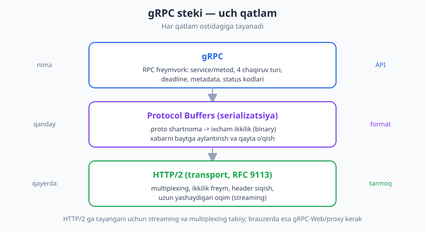
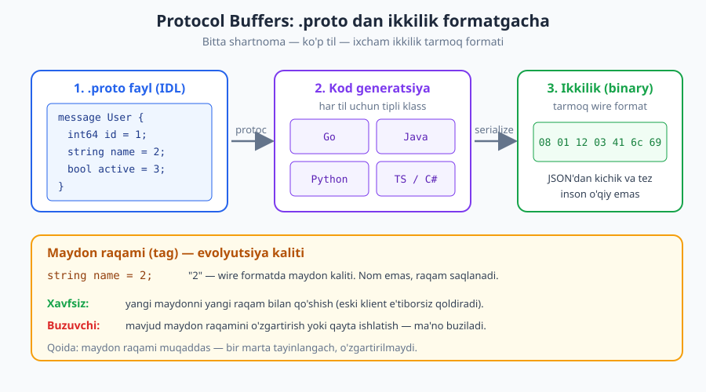
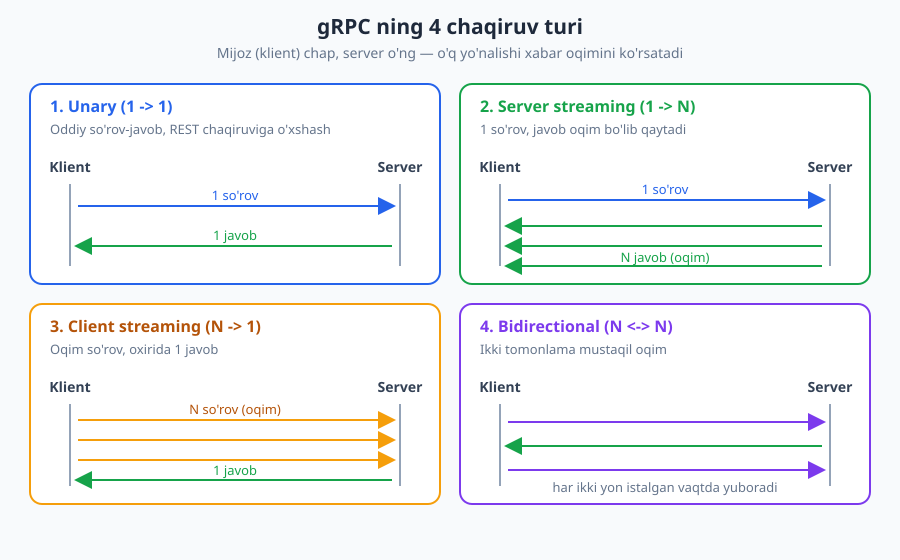

# 18 — gRPC va Protocol Buffers

[⬅️ Oldingi: 17 — GraphQL dizayni](./17-graphql.md) · [🏠 README](./README.md) · [Keyingi: 19 — Asinxron API va webhooklar ➡️](./19-asinxron-webhook.md)

---

> **Bu bobda:** REST va GraphQL'dan keyin uchinchi yirik uslub — gRPC. U Google'ning yuqori-unumli RPC freymvorki: shartnoma `.proto` faylda yoziladi (Protocol Buffers), xabarlar ixcham ikkilik (binary) formatda yuriladi va hammasi HTTP/2 ustida ishlaydi. Biz protobuf IDL'ini, contract-first g'oyasini, to'rtta chaqiruv turini (unary, server/client/bidirectional streaming), gRPC'ning o'z status kodlarini va eng muhimi — uni REST'ga nisbatan qachon tanlash kerakligini ko'rib chiqamiz.
>
> **Halollik / Eslatma:** Faktlar standartlarga tayanadi: gRPC HTTP/2 (**RFC 9113**) ustida ishlaydi va serializatsiya uchun Protocol Buffers (proto3) IDL'idan foydalanadi; 4 chaqiruv turi va contract-first model — gRPC ning rasmiy spetsifikatsiyasidan. "Qachon gRPC, qachon REST" qismi esa **trade-off** — mutlaq qoida emas, kontekst hal qiladi. Brauzerda gRPC to'g'ridan-to'g'ri ishlamasligini halol aytamiz (gRPC-Web/proxy kerak). `.proto` va JSON namunalari to'g'ri sintaksisda; standartlar va versiyalar vaqt bilan o'zgaradi.

---

## gRPC nima va nega kerak

Tasavvur qiling, sizda ikkita ichki xizmat bor: `buyurtma-servisi` va `to'lov-servisi`. Birinchisi ikkinchisidan "shu buyurtmani to'la" deb so'raydi. Siz buni REST bilan qilishingiz mumkin: `POST /payments` yuborasiz, JSON tanasini yig'asiz, status kodini tekshirasiz. Ishlaydi. Lekin bu yerda mijoz — brauzer emas, **boshqa server**. Inson o'qiy JSON, ko'rinadigan URL, brauzerda sinash — bularning hech biri kerak emas. Kerak bo'lgani: **tezlik, ixchamlik va qat'iy tipli shartnoma.**

Aynan shu nuqtada gRPC paydo bo'ladi. gRPC — Google ishlab chiqqan, ochiq kodli **RPC freymvorki**. RPC (Remote Procedure Call) — bu masofadagi metodni xuddi lokal funksiyadek chaqirish g'oyasi; biz uni [04-bobda](./04-api-uslublari.md) API uslublarini taqqoslaganda ko'rib o'tgandik. gRPC shu eski RPC g'oyasini zamonaviy ikki ustun bilan tirgaydi:

- **HTTP/2** (RFC 9113) — transport sifatida. Multiplexing, ikkilik freymlar, streaming.
- **Protocol Buffers** (proto3) — shartnoma tili va ixcham ikkilik serializatsiya formati sifatida.

> **Eslatma:** "g" harfi haqida ko'p bahslar bor — Google rasman uni "gRPC Remote Procedure Calls" deb (har relizda turlicha) ochib beradi. Amalda buni yodlash shart emas; muhimi — bu **yuqori-unumli, ko'p tilli, shartnomaga asoslangan RPC tizimi**.

gRPC eng ko'p ishlatiladigan joy — **ichki mikroservis aloqasi**: bir xizmat ikkinchisini chaqiradigan, ko'p tilli (bir servis Go, boshqasi Java, uchinchisi Python) va yuqori trafikli tizimlar. Public, brauzerga qaragan API'lar uchun esa u kamroq mos — buni bob oxirida halol muhokama qilamiz.



Bu uch qatlamni yodda tuting: yuqorida **gRPC** (nimani chaqirasiz — service va metod), o'rtada **Protocol Buffers** (xabar qanday baytga aylanadi), pastda **HTTP/2** (baytlar tarmoqda qanday yuriydi). Endi har qatlamni alohida ochamiz.

---

## Protocol Buffers: shartnoma tili

REST'da odatda shartnoma alohida hujjatda (OpenAPI) yoki umuman dasturchining boshida yashaydi. gRPC'da esa shartnoma **birinchi darajali, majburiy artefakt**: u `.proto` faylda yoziladi. Bu fayl **IDL** — *Interface Definition Language* (interfeys ta'rifi tili). Unda ikki narsa ta'riflanadi:

1. **`message`** — ma'lumot tuzilmasi (maydonlar va ularning tiplari). REST'dagi JSON ob'ektining tipli analogi.
2. **`service`** — chaqirsa bo'ladigan metodlar to'plami (har biri so'rov va javob `message`'iga ega).

Mana minimal misol (proto3 sintaksisi):

```proto
syntax = "proto3";

package shop.v1;

// Ma'lumot tuzilmasi
message User {
  int64 id = 1;
  string name = 2;
  bool active = 3;
}

// So'rov va javob xabarlari
message GetUserRequest {
  int64 id = 1;
}

// Chaqirsa bo'ladigan metodlar
service UserService {
  rpc GetUser(GetUserRequest) returns (User);
}
```

Bu faylni o'qigan har qanday dasturchi (yoki mashina) aniq biladi: `UserService` da `GetUser` metodi bor, u `GetUserRequest` (ichida `int64 id`) qabul qiladi va `User` qaytaradi. Bu — **mashina o'qiy, tipli, bir ma'noli shartnoma**.

### Maydon raqamlari — eng muhim detal

Diqqat qiling: har maydondan keyin `= 1`, `= 2`, `= 3` turadi. Bu maydonning **nomi emas, balki raqami (tag)**. Va bu butun protobuf evolyutsiyasining kalitidir.



Ikkilik wire formatda **maydon nomi umuman saqlanmaydi** — faqat raqami va qiymati yoziladi. Ya'ni `name = 2` da "name" so'zi tarmoqqa chiqmaydi; chiqadigani — "2-maydon = 'Ali'". Bu nima uchun muhim:

- **Ixchamlik:** uzun maydon nomlari o'rniga bir-ikki bayt raqam yuriydi — JSON'dan sezilarli kichik.
- **Evolyutsiya:** mijoz va server xabarni **raqam bo'yicha** moslaydi, nom bo'yicha emas. Demak siz maydon *nomini* o'zgartirib (`name` → `full_name`) raqamini saqlab qolsangiz — wire darajasida hech narsa buzilmaydi.

Bundan protobuf evolyutsiyasining oltin qoidalari kelib chiqadi:

| Amal | Xavfsizmi? | Sabab |
|---|---|---|
| Yangi maydonni **yangi raqam** bilan qo'shish | Ha (xavfsiz) | Eski klient noma'lum raqamni e'tiborsiz qoldiradi. |
| Maydon **nomini** o'zgartirish (raqam o'sha) | Ha (wire darajasida) | Wire'da nom yo'q, raqam moslaydi. |
| Mavjud maydon **raqamini** o'zgartirish | Yo'q (buzuvchi) | Eski qiymat boshqa maydon deb o'qiladi. |
| Eski maydon raqamini **qayta ishlatish** (yangi ma'no bilan) | Yo'q (buzuvchi) | Eski klient eski tipni kutadi — ma'no aralashadi. |
| Maydon tipini mos kelmaydigan tipga o'zgartirish | Yo'q (buzuvchi) | Bayt talqini buziladi. |

> **Standart:** Protobuf qoidasi sodda va qattiq: **maydon raqami muqaddas.** Bir marta tayinlangach, uni hech qachon o'zgartirmang va qayta ishlatmang. Maydon kerak bo'lmasa, uni o'chiring-u raqamini `reserved` deb belgilang, toki kelajakda hech kim adashib o'sha raqamni qayta ishlatmasin: `reserved 2;` yoki `reserved "name";`. Bu [10-bobdagi](./10-versiyalash.md) "xavfsiz vs buzuvchi o'zgarish" g'oyasining protobuf'dagi aniq ko'rinishi.

### Ikkilik vs JSON

Protobuf'ning serializatsiyasi **ikkilik (binary)** — inson o'qiy emas. JSON bilan taqqoslaylik:

| Jihat | Protobuf (ikkilik) | JSON (matn) |
|---|---|---|
| Hajm | Kichik (maydon raqami + ixcham kodlash) | Kattaroq (nom + qo'shtirnoq takrorlanadi) |
| Tezlik (serialize/parse) | Tez | Sekinroq |
| Inson o'qiy | Yo'q (debug qiyin) | Ha (ko'z bilan o'qiladi) |
| Sxema | Majburiy (`.proto`) | Ixtiyoriy (sxema-siz ham bo'ladi) |
| Tipli kafolat | Kuchli (generatsiya vaqtida) | Zaif (runtime'da tekshiriladi) |

Asosiy savdo: protobuf **hajm va tezlikni** yutadi, **inson o'qiyligini** yo'qotadi. Ichki yuqori-trafikli aloqada bu ajoyib bitim; brauzerda debug qilinadigan public API'da esa noqulay.

---

## Contract-first: `.proto` = yagona haqiqat manbai

REST'da ko'pincha avval kod yoziladi, keyin (yaxshi bo'lsa) hujjat. gRPC esa **contract-first** (avval-shartnoma) ishlaydi: `.proto` fayl — yagona haqiqat manbai (single source of truth). Undan **kod generatsiya qilinadi** — har til uchun alohida:

- `protoc` (yoki til-maxsus plagin) `.proto` ni o'qiydi va sizning tilingizda tipli klasslar hamda klient/server "stub" larini chiqaradi.
- Klient ham, server ham **bir xil `.proto`** dan generatsiya qiladi. Demak ular avtomatik bir xil tipga ega.

Buning amaliy oqibati katta: agar siz `.proto` da `User.name` ni `string` dan `int64` ga o'zgartirsangiz va qayta generatsiya qilsangiz, mos kelmagan kod **kompilyatsiya vaqtida** sinadi — runtime'da emas. Bu REST'dagi "JSON kelganda yangi tip topdik" muammosini oldindan, IDE'da tutadi.

> **Trade-off:** Contract-first kuchli tiplilik beradi, lekin o'z narxi bor: `.proto` ni boshqarish, generatsiya qadamini build'ga qo'shish, versiyalash intizomi. Ko'p tilli ichki tizimda bu narx arziydi (bitta shartnoma → barcha tillar avtomatik mos). Bitta tilli kichik loyihada esa bu ortiqcha tantana bo'lishi mumkin — REST + oddiy JSON yetadi.

---

## To'rtta chaqiruv turi — bobning yuragi

REST/HTTP modeli oddiy: bitta so'rov → bitta javob. gRPC esa HTTP/2 ning streaming imkoniyatidan foydalanib **to'rt xil chaqiruv shaklini** beradi. Bu gRPC ni REST'dan ajratib turadigan eng muhim xususiyat.



### 1. Unary (1 → 1)

Eng oddiy: bitta so'rov, bitta javob. REST'dagi oddiy chaqiruvga to'g'ri keladi.

```proto
service UserService {
  rpc GetUser(GetUserRequest) returns (User);
}
```

**Qachon:** ko'pchilik oddiy operatsiya — "shu ID bo'yicha foydalanuvchini ber", "shu buyurtmani yarat". Aksariyat gRPC metodlari aynan unary.

### 2. Server streaming (1 → N)

Bitta so'rov yuborasiz, server **oqim** sifatida ko'p javob qaytaradi. Javob `returns` oldida `stream` kalit so'zi turadi.

```proto
service PriceService {
  // 1 so'rov, narx yangilanishlari oqimi
  rpc WatchPrices(WatchRequest) returns (stream PriceUpdate);
}
```

**Qachon:** server vaqt o'tishi bilan ko'p natija beradigan holatlar — jonli narx yangilanishlari, katta natija to'plamini bo'lib-bo'lib yuborish, hodisalar tasmasi (feed). Mijoz birinchi natijani hammasini kutmasdan, kelishi bilan ishlatadi.

### 3. Client streaming (N → 1)

Mijoz **oqim** sifatida ko'p so'rov yuboradi, server oxirida **bitta** javob qaytaradi. `stream` kalit so'zi so'rov tomonida.

```proto
service UploadService {
  // Ko'p bo'lak yuboriladi, oxirida 1 xulosa
  rpc UploadChunks(stream Chunk) returns (UploadSummary);
}
```

**Qachon:** mijoz katta narsani bo'laklab yuboradigan holatlar — fayl/video bo'laklarini yuklash, ko'p o'lchov (metrika) namunasini bitta yig'ma natijaga to'plash, telemetriya to'kish.

### 4. Bidirectional streaming (N ↔ N)

Ikki tomon ham mustaqil oqim ochadi: har ikkisi istalgan vaqtda, istalgan tartibda xabar yuboradi. `stream` ikkala tomonda.

```proto
service ChatService {
  // Ikki tomonlama jonli oqim
  rpc Chat(stream ChatMessage) returns (stream ChatMessage);
}
```

**Qachon:** real-vaqt ikki tomonlama aloqa — chat, jonli o'yin holati, ovozli/transkripsiya oqimi, mijoz va server doimiy "suhbatlashadigan" har qanday stsenariy. Bu WebSocket bilan hal qilinadigan masalalarning gRPC analogi ([20-bob — real-time](./20-realtime-websocket-sse.md) bilan bog'lanadi).

> **Eslatma:** To'rt turning hammasi HTTP/2 ning **bitta** ulanishi (connection) ichida ishlaydi — multiplexing tufayli alohida portlar yoki ulanishlar shart emas. Aynan shu HTTP/2 imkoniyati streaming'ni gRPC uchun tabiiy va arzon qiladi.

---

## HTTP/2 nima uchun gRPC uchun ideal

gRPC tasodifan HTTP/2 ni tanlamagan. HTTP/2 (RFC 9113) ning ikkita xususiyati streaming va unumdorlikni mumkin qiladi:

| HTTP/2 xususiyati | gRPC uchun nimaga arziydi |
|---|---|
| **Multiplexing** | Bitta TCP ulanishida ko'p so'rov-oqim parallel yuriydi — head-of-line bloklanishisiz, har chaqiruvga yangi ulanish ochmasdan. |
| **Ikkilik freymlar** | Xabarlar matn emas, ikkilik freymlarga bo'linadi — protobuf'ning ikkilik tabiatiga to'g'ri keladi. |
| **Streaming** | Uzun yashaydigan oqimlar (server/client/bidirectional) HTTP/2 oqimlari ustida tabiiy quriladi. |
| **Header siqish (HPACK)** | Takrorlanuvchi sarlavhalar siqiladi — ko'p mayda chaqiruvda tarmoq tejaladi. |

REST ham HTTP/2 ustida ishlay oladi, lekin u HTTP/1.1 dunyoqarashida loyihalangan (so'rov-javob, matn). gRPC esa **HTTP/2 uchun maxsus** qurilgan — shuning uchun streaming'ni shu qadar tabiiy beradi.

---

## gRPC vs REST vs GraphQL — qiyosiy jadval

Endi uchta yirik uslubni yonma-yon qo'yamiz. Bu [04-bob](./04-api-uslublari.md) va [17-bobning](./17-graphql.md) gRPC bilan to'ldirilgan versiyasi.

| Mezon | REST | GraphQL | gRPC |
|---|---|---|---|
| Transport | HTTP/1.1 yoki HTTP/2 | Odatda HTTP (POST /graphql) | HTTP/2 (majburiy) |
| Format | Odatda JSON (matn) | JSON (matn) | Protobuf (ikkilik) |
| Shartnoma | OpenAPI (ixtiyoriy) | SDL sxema (majburiy) | `.proto` (majburiy, contract-first) |
| Unumdorlik | O'rta | O'rta | Yuqori (ixcham, tez) |
| Streaming | Cheklangan (SSE/chunked) | Subscription (cheklangan) | Kuchli (4 chaqiruv turi) |
| Tiplilik | Zaif (sxemasiz ham) | Kuchli | Kuchli (generatsiya) |
| Brauzerdan to'g'ridan-to'g'ri | Ha | Ha | **Yo'q** (gRPC-Web/proxy kerak) |
| Inson o'qiy / debug | Oson (JSON ko'rinadi) | O'rta | Qiyin (ikkilik) |
| Keshlash | Kuchli (HTTP keshi, [16-bob](./16-keshlash.md)) | Qiyin | Qiyin (HTTP keshi ishlamaydi) |
| Eng mos joy | Public API, CRUD resurslar | Moslashuvchan, ko'p-mijozli o'qish | Ichki mikroservislar, yuqori unum, streaming |

> **Diqqat — halol nuqta:** gRPC ni **brauzer to'g'ridan-to'g'ri chaqira olmaydi.** Brauzer JavaScript'idan HTTP/2 freymlari va trailer'lar ustida to'liq nazorat yo'q, shuning uchun standart gRPC'ni brauzer bajara olmaydi. Yechim — **gRPC-Web**: brauzerga mos varianti, lekin u odatda oraliq **proxy** (masalan Envoy) talab qiladi, u gRPC-Web ni haqiqiy gRPC ga tarjima qiladi. Ya'ni "gRPC frontendda ham ishlatamiz" deyish — texnik jihatdan mumkin, lekin qo'shimcha qatlam bilan. Bu narsani yashirmang.

> **Trade-off:** "Eng tez" yoki "eng to'g'ri" uslub yo'q. REST — keng tarqalgan, debug oson, public uchun ideal. GraphQL — mijoz o'ziga kerakli maydonlarni tanlaydigan moslashuvchanlik. gRPC — server-ichi tezlik va streaming. Ko'p real tizimlar **uchchovini ham** ishlatadi: tashqi public chetda REST/GraphQL, ichki xizmatlararo gRPC.

---

## gRPC status kodlari — HTTP'dan farqli

REST'da natija HTTP status kodi bilan keladi ([03-bob](./03-http-status-kodlari.md)): `200`, `404`, `409` va hokazo. gRPC esa **o'z status kodlari to'plamiga** ega — ular HTTP status raqamlari emas, balki nomli `gRPC status code` lar. (Texnik jihatdan ular HTTP/2 trailer'larida yuriladi, lekin dasturchi nuqtai nazaridan bu alohida tizim.)

Ba'zi muhimlari:

| gRPC status | Ma'nosi | Taxminiy HTTP analogi |
|---|---|---|
| `OK` | Muvaffaqiyat | 200 |
| `INVALID_ARGUMENT` | Mijoz noto'g'ri argument yubordi | 400 |
| `UNAUTHENTICATED` | Autentifikatsiya yo'q/yaroqsiz | 401 |
| `PERMISSION_DENIED` | Autentifikatsiya bor, ruxsat yo'q | 403 |
| `NOT_FOUND` | Resurs topilmadi | 404 |
| `ALREADY_EXISTS` | Resurs allaqachon mavjud | 409 |
| `RESOURCE_EXHAUSTED` | Kvota/limit tugadi | 429 |
| `DEADLINE_EXCEEDED` | Belgilangan muddat o'tdi | 504 |
| `UNAVAILABLE` | Xizmat vaqtincha yetib bo'lmaydi | 503 |
| `INTERNAL` | Server ichki xatosi | 500 |

> **Eslatma:** `UNAUTHENTICATED` (autentifikatsiya yo'q) va `PERMISSION_DENIED` (autentifikatsiya bor, lekin ruxsat yo'q) farqi — bu [11-bob](./11-autentifikatsiya.md) va [12-bobdagi](./12-avtorizatsiya.md) `401` vs `403` farqining aynan gRPC ko'rinishi. RFC 9110 semantikasidagi mantiq bu yerda ham bir xil: kimligini bilmaslik boshqa, kimligi ma'lum-u ruxsati yo'qligi boshqa.

### Deadline, timeout va metadata

gRPC'ning yana ikki muhim tushunchasi:

- **Deadline / timeout.** gRPC'da mijoz har chaqiruvga **deadline** (qachongacha javob kutaman) belgilashni kuchli rag'batlantiradi. Bu o'tib ketsa, chaqiruv `DEADLINE_EXCEEDED` bilan tugaydi. Bu — chidamlilik (resilience) uchun muhim: cheksiz kutib turuvchi chaqiruvlar zanjir bo'ylab tizimni bo'g'ib qo'yishi mumkin.
- **Metadata.** REST'dagi HTTP sarlavhalarining gRPC analogi. Kalit-qiymat juftliklari sifatida so'rov/javob bilan birga yuriydi — masalan autentifikatsiya tokeni (`authorization`), trace ID va boshqa kontekst.

---

## Qachon gRPC, qachon REST — qarorni asoslash

Bu bobning amaliy yuragi. Texnologiyani tanlash — mutlaq qoida emas, balki kontekstga moslash.

**gRPC ni tanlang, agar:**

- Aloqa **ichki, xizmatdan-xizmatga** (mikroservislar orasida) — mijoz brauzer emas, boshqa server.
- **Yuqori unumdorlik va past kechikish** kritik (ko'p mayda chaqiruv, katta hajm).
- Tizim **ko'p tilli** — Go, Java, Python, C# xizmatlari bitta `.proto` shartnomadan generatsiya qiladi.
- **Streaming** tabiiy kerak — jonli oqim, ikki tomonlama aloqa, katta natijani bo'lib yuborish.
- Qat'iy, kompilyatsiya-vaqtida tekshiriladigan **shartnoma** muhim.

**REST (yoki GraphQL) ni tanlang, agar:**

- API **public** va **brauzerga** qaragan — frontend, uchinchi tomon integratsiyalari, keng auditoriya.
- **Inson o'qiyligi va debug qulayligi** muhim (JSON'ni ko'z bilan ko'rib, `curl` bilan sinash).
- **HTTP keshlash** ([16-bob](./16-keshlash.md)) sizga foyda beradi — gRPC bunda zaif.
- Soddalik va keng tooling muhim; jamoa REST'ga ko'nikkan.

> **Trade-off:** Eng keng tarqalgan **donishmand tanlov — ikkalasi ham**: tashqi chegarada (edge) REST/GraphQL API, uning ortidagi ichki xizmatlar orasida gRPC. Shunday qilib siz tashqi mijozga tanish, debug-oson, brauzerga mos yuzani berasiz; ichkarida esa tezlik va tiplilikdan foydalanasiz. "Hammasi gRPC" yoki "hammasi REST" — kamdan-kam to'g'ri javob.

> **Anti-pattern:** Public, brauzerga qaragan API'ni faqat "moda" yoki "gRPC tez" degani uchun gRPC'da qurish. Natijada siz har joyga gRPC-Web proxy qo'yasiz, keshlashni yo'qotasiz, debug'ni qiyinlashtirasiz va integratsiya qiluvchilarni `.proto` + maxsus tooling'ga majburlaysiz — REST bularning hammasini bepul beradigan joyda. Tezlik foydasi bu narxni qoplamasligi mumkin.

---

## Halollik va evolyutsiya

Yana bir necha amaliy haqiqatni ochiq aytaylik:

- **Protobuf evolyutsiyasi qoidaga qattiq amal qiladi.** Maydon raqamini muqaddas saqlang, eski raqamni qayta ishlatmang, o'chirilgan maydonni `reserved` qiling. Bu intizomsiz gRPC API jimgina buziladi — eng yomon turdagi buzilish.
- **Brauzer = gRPC-Web.** Frontendingiz gRPC bilan gaplashishi kerak bo'lsa, gRPC-Web va (odatda) Envoy kabi proxy rejalashtiring. Buni loyiha boshida hisobga oling, oxirida "nega brauzerda ishlamayapti?" deb hayron bo'lmang.
- **Hujjatlash.** `.proto` o'zi yaxshi shartnoma, lekin u OpenAPI kabi inson uchun interaktiv hujjat emas. Yaxshi gRPC API `.proto` izohlari (kommentariylar) va ulardan generatsiya qilingan hujjat bilan keladi. Hujjatlash va DX [22-bobda](./22-hujjatlash-dx.md) chuqurroq.
- **Asinxronlik bilan adashtirmang.** gRPC streaming — bu ulanish ochiq turgan, real-vaqt oqim. U xizmatlarni butunlay ajratuvchi (decoupled), navbatga asoslangan **asinxron** model emas — buni [19-bobda](./19-asinxron-webhook.md) ko'ramiz. Streaming ≠ event-driven.

---

## Asosiy g'oyalar (bobni qisqacha)

- **gRPC** — Google'ning yuqori-unumli RPC freymvorki: **HTTP/2** (RFC 9113) transport + **Protocol Buffers** (proto3) shartnoma/serializatsiya. Eng kuchli joyi — **ichki mikroservis** aloqasi.
- **Protocol Buffers** — `.proto` faylda `message` va `service` ta'riflanadigan IDL. Xabarlar **ikkilik** formatda — JSON'dan kichik va tez, lekin inson o'qiy emas. Har til uchun kod **generatsiya** qilinadi.
- **Maydon raqami muqaddas:** wire formatda nom emas, raqam saqlanadi. Yangi maydonni yangi raqam bilan qo'shish — xavfsiz; raqamni o'zgartirish/qayta ishlatish — buzuvchi. O'chirilgan raqamni `reserved` qiling.
- **Contract-first:** `.proto` — yagona haqiqat manbai; klient va server bir xil shartnomadan generatsiya qiladi — mos kelmaslik kompilyatsiya vaqtida tutiladi.
- **4 chaqiruv turi:** **unary** (1→1), **server streaming** (1→N), **client streaming** (N→1), **bidirectional** (N↔N). HTTP/2 multiplexing ularni tabiiy qiladi.
- **gRPC status kodlari** HTTP'dan farqli (`OK`, `NOT_FOUND`, `INVALID_ARGUMENT`, `UNAUTHENTICATED` vs `PERMISSION_DENIED`...). **Deadline** va **metadata** muhim.
- **Qachon:** ichki/ko'p-tilli/yuqori-unum/streaming → gRPC; public/brauzer/debug/keshlash → REST. Brauzerda gRPC **to'g'ridan-to'g'ri ishlamaydi** — gRPC-Web + proxy kerak. Ko'p tizim ikkalasini birga ishlatadi (edge'da REST, ichkarida gRPC).

---

## Mashqlar

### Oson

**1-mashq.** To'rtta chaqiruv turini ularning shakli bilan moslang:
- (a) unary
- (b) server streaming
- (c) client streaming
- (d) bidirectional streaming

Shakllar: (1) N → 1, (2) 1 → 1, (3) N ↔ N, (4) 1 → N.

**2-mashq.** Protobuf (ikkilik) va JSON (matn) o'rtasidagi uchta asosiy farqni ayting: hajm, inson o'qiyligi va sxema talab qilinishi bo'yicha. Har biri uchun qaysi format yutadi?

**3-mashq.** gRPC qaysi ikki texnologiya ustiga quriladi (biri transport, biri serializatsiya)? Har birining vazifasini bir jumlada ayting.

### O'rta

**4-mashq.** Quyidagi `.proto` parchasiga `email` (string) maydonini qo'shing, raqamini to'g'ri tanlang va nega aynan o'sha raqamni tanlaganingizni tushuntiring:

```proto
message User {
  int64 id = 1;
  string name = 2;
  bool active = 3;
}
```

**5-mashq.** Quyidagi har bir stsenariy uchun qaysi gRPC chaqiruv turi eng mos kelishini ayting va nega:
- (a) Bitta foydalanuvchini ID bo'yicha olish.
- (b) Server jonli birja narxlarini doimiy yuborib turishi.
- (c) Mobil ilova katta videoni bo'lak-bo'lak yuklashi.
- (d) Ikki foydalanuvchi o'rtasidagi real-vaqt chat.

**6-mashq.** Sizdan public, brauzerga qaragan ob-havo API'si qurish so'raldi. Hamkasbingiz "gRPC tez, shuni ishlatamiz" deydi. gRPC va REST orasida qaysi birini tanlaysiz va nega? Brauzer omilini albatta hisobga oling.

### Qiyin

**7-mashq.** Protobuf evolyutsiyasi: quyidagi har bir o'zgarish **xavfsizmi** yoki **buzuvchimi**? Sababini wire format (maydon raqami) nuqtai nazaridan tushuntiring.
- (a) `string name = 2;` ni `string full_name = 2;` ga (faqat nom) o'zgartirish.
- (b) `string name = 2;` ni `string name = 5;` ga (faqat raqam) o'zgartirish.
- (c) Yangi `string phone = 4;` maydonini qo'shish.
- (d) `int64 id = 1;` ni o'chirib, keyin `string code = 1;` qo'shish (1-raqamni qayta ishlatish).

**8-mashq.** gRPC ni brauzerdan to'g'ridan-to'g'ri ishlatib bo'lmasligini tushuntiring: nega standart gRPC brauzerda bajarilmaydi va amaliy yechim (gRPC-Web + proxy) qanday ishlaydi? Bu cheklov sizning arxitektura qarorlaringizga qanday ta'sir qiladi?

**9-mashq.** Sizda public REST API va uning ortida o'nlab ichki mikroservis bor (turli jamoalar, turli tillarda). Ichki xizmatlararo aloqani gRPC'ga ko'chirishni o'ylayapsiz. Bu qarorni tahlil qiling: gRPC bu yerda nima yutadi, qaysi narsalarni (keshlash, debug, brauzer) o'ylab ko'rishingiz kerak, va nega public chetni REST'da qoldirish ko'pincha to'g'ri? "Hammasini gRPC qilish" anti-pattern bo'lishi mumkin bo'lgan holatni ko'rsating.

<details markdown="1">
<summary>Yechimlar</summary>

### 1-mashq yechimi
- (a) unary → (2) **1 → 1** — bitta so'rov, bitta javob.
- (b) server streaming → (4) **1 → N** — bitta so'rov, javob oqim.
- (c) client streaming → (1) **N → 1** — so'rov oqim, oxirida bitta javob.
- (d) bidirectional streaming → (3) **N ↔ N** — ikki tomonlama mustaqil oqim.

### 2-mashq yechimi
- **Hajm:** protobuf yutadi — ikkilik kodlash va maydon raqamlari (nom o'rniga) tufayli xabar JSON'dan kichik.
- **Inson o'qiyligi:** JSON yutadi — matn, `curl`/brauzerda ko'z bilan o'qiladi; protobuf ikkilik, debug qiyin.
- **Sxema talabi:** bu kontekstga bog'liq. Protobuf **majburiy** `.proto` sxema talab qiladi (bu kuchli tiplilik beradi); JSON sxemasiz ham ishlaydi (moslashuvchan, lekin tipli kafolat zaif). "Yutuq" maqsadga bog'liq: qat'iylik kerak bo'lsa protobuf, erkinlik kerak bo'lsa JSON.

### 3-mashq yechimi
gRPC ikki ustun ustiga quriladi:
- **HTTP/2** (RFC 9113) — **transport**: baytlarni tarmoqda yuritadi; multiplexing, ikkilik freym va streaming'ni beradi.
- **Protocol Buffers** (proto3) — **serializatsiya va shartnoma**: `.proto` da xabar/servisni ta'riflaydi va xabarni ixcham ikkilik baytga aylantiradi.

### 4-mashq yechimi

```proto
message User {
  int64 id = 1;
  string name = 2;
  bool active = 3;
  string email = 4;
}
```

`email` ga **4-raqam** beriladi. Sabab: 1, 2, 3 allaqachon band; yangi maydonga **ishlatilmagan, navbatdagi raqam** berish kerak. Mavjud raqamni (1–3) qayta ishlatib bo'lmaydi — u boshqa maydonning wire kaliti. Yangi maydonni yangi raqam bilan qo'shish — **additive, xavfsiz** o'zgarish: eski klient 4-raqamni tanimaydi va e'tiborsiz qoldiradi.

### 5-mashq yechimi
- (a) **Unary (1 → 1)** — oddiy so'rov-javob, bitta foydalanuvchi qaytadi.
- (b) **Server streaming (1 → N)** — bitta "kuzat" so'rovi, server narx yangilanishlarini oqim sifatida yuboraveradi.
- (c) **Client streaming (N → 1)** — mijoz video bo'laklarini oqim qilib yuboradi, server oxirida bitta xulosa/natija qaytaradi.
- (d) **Bidirectional streaming (N ↔ N)** — ikki tomon ham xabar yuboradi va qabul qiladi, real-vaqt ikki tomonlama oqim.

### 6-mashq yechimi
Bu yerda **REST** to'g'ri tanlov. Sabablari:
- API **public va brauzerga qaragan** — gRPC ni brauzer to'g'ridan-to'g'ri chaqira olmaydi; gRPC bilan har bir mijozga gRPC-Web + proxy (Envoy) majburlanadi, bu keng public auditoriya uchun og'ir to'siq.
- Ob-havo ma'lumoti odatda **keshlanadigan** (bir necha daqiqa eskirsa ham mayli) — REST + HTTP keshlash ([16-bob](./16-keshlash.md)) bu yerda katta yutuq, gRPC esa keshlashda zaif.
- **Debug va integratsiya** oson bo'lishi kerak — uchinchi tomon dasturchilari `curl` bilan sinab ko'radi, JSON'ni o'qiydi.

"gRPC tez" argumenti to'g'ri, lekin bu yerda tezlik bitta ob-havo so'rovida sezilmaydi, ayni paytda brauzer/kesh/debug narxi katta. Tezlik foydasi kontekstga mos kelmaydi.

### 7-mashq yechimi
- (a) **Xavfsiz** (wire darajasida). Wire formatda maydon **nomi saqlanmaydi**, faqat raqami (2). Nomi `name` dan `full_name` ga o'zgarsa ham, raqam 2 bir xil — bayt oqimi o'zgarmaydi, eski va yangi kod moslaydi. (Eslatma: generatsiya qilingan kod darajasida o'zgaruvchi nomi o'zgaradi, lekin wire shartnomasi buzilmaydi.)
- (b) **Buzuvchi**. Maydon **raqami** 2 dan 5 ga o'zgardi. Wire formatda moslash raqam bo'yicha — eski klient 2-raqamda `name` kutadi, yangi server uni 5-da yuboradi; eski klient `name` ni topmaydi, yangi 5-maydonni esa tanimaydi. Ma'lumot yo'qoladi.
- (c) **Xavfsiz**. Yangi `phone = 4` — ishlatilmagan raqam bilan qo'shilgan additive maydon. Eski klient 4-raqamni e'tiborsiz qoldiradi.
- (d) **Buzuvchi (eng xavfli)**. 1-raqam avval `int64 id` edi, endi `string code`. Eski klient 1-raqamda son kutadi, matn keladi — talqin buziladi (jim, runtime'da). Aynan shu sababli o'chirilgan maydon raqamini **hech qachon qayta ishlatmaslik** kerak; uni `reserved 1;` deb belgilash to'g'ri yo'l.

### 8-mashq yechimi
**Nega brauzerda ishlamaydi:** standart gRPC HTTP/2 ning past darajadagi xususiyatlariga (freymlar ustidan to'liq nazorat, HTTP/2 trailer'lari) tayanadi. Brauzerning JavaScript `fetch`/XHR API'lari bu darajadagi nazoratni bermaydi — brauzer dasturchisi gRPC freymlarini xohlagancha qura olmaydi. Shuning uchun haqiqiy gRPC protokolini brauzer bajara olmaydi.

**Yechim — gRPC-Web + proxy:** gRPC-Web — brauzer bajara oladigan tarzda moslashtirilgan variant (brauzer API'lari imkoniyatiga sig'adigan kodlash). Lekin u haqiqiy gRPC emas, shuning uchun odatda oraliq **proxy** (masalan Envoy) qo'yiladi: brauzer gRPC-Web yuboradi → proxy uni haqiqiy gRPC ga tarjima qiladi → backend gRPC servisi qabul qiladi (va teskari yo'lda javob).

**Arxitektura ta'siri:** agar frontend gRPC bilan gaplashishi kerak bo'lsa, siz qo'shimcha qatlam (gRPC-Web kutubxonasi + proxy) rejalashtirishingiz, uni deploy/monitoring qilishingiz kerak. Bu murakkablik ko'pincha public/brauzer chegarasini **REST'da** qoldirish foydasiga dalil bo'ladi — brauzerga REST/JSON beriladi, gRPC esa faqat ichki xizmatlararo qoladi.

### 9-mashq yechimi
**gRPC ichki aloqada nima yutadi:**
- **Unumdorlik:** ixcham ikkilik protobuf + HTTP/2 multiplexing — ko'p mayda xizmatlararo chaqiruvda kechikish va tarmoq hajmi kamayadi.
- **Ko'p tillilik:** turli jamoalar turli tillarda yozadi, lekin hammasi bitta `.proto` shartnomadan generatsiya qiladi — tip mos kelmasligi kompilyatsiya vaqtida tutiladi.
- **Streaming va deadline:** xizmatlararo oqim va har chaqiruvga muddat (deadline) — chidamlilik (resilience) uchun foydali.

**Nimani o'ylab ko'rish kerak:**
- **Keshlash:** ichki gRPC chaqiruvlari HTTP keshidan foyda ko'rmaydi — agar kesh muhim bo'lsa, alohida (masalan ilova darajasida) hal qilinadi.
- **Debug:** ikkilik protobuf'ni ko'z bilan o'qib bo'lmaydi; jamoaga gRPC tooling (reflection, `grpcurl` kabi vositalar) kerak bo'ladi.
- **Operatsion narx:** `.proto` ni boshqarish, generatsiya qadamini har til build'iga qo'shish, versiyalash intizomi (maydon raqami muqaddas).

**Nega public chetni REST'da qoldirish to'g'ri:** tashqi mijozlar (brauzer, uchinchi tomon) gRPC ni to'g'ridan-to'g'ri chaqira olmaydi (gRPC-Web + proxy kerak), ular JSON'ni debug qilishni va keshlashni qadrlaydi. Demak **edge'da REST/GraphQL, ichkarida gRPC** — ko'p tizimda eng yaxshi bitim.

**"Hammasini gRPC" anti-pattern bo'ladigan holat:** agar siz public brauzer mijozlarini ham gRPC ga majburlasangiz — har joyga gRPC-Web proxy qo'yasiz, HTTP keshlashni yo'qotasiz, uchinchi tomon integratsiyasini `.proto` + maxsus tooling'ga bog'laysiz. Ichki tezlik foydasi bu tashqi narxni qoplamaydi. To'g'ri qaror — gRPC ni o'z kuchi joyida (ichki) ishlatish, public chetni tanish REST'da qoldirish.

</details>

---

[⬅️ Oldingi: 17 — GraphQL dizayni](./17-graphql.md) · [🏠 README](./README.md) · [Keyingi: 19 — Asinxron API va webhooklar ➡️](./19-asinxron-webhook.md)
