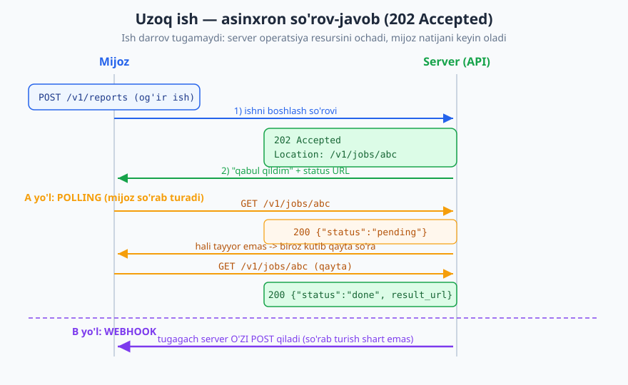
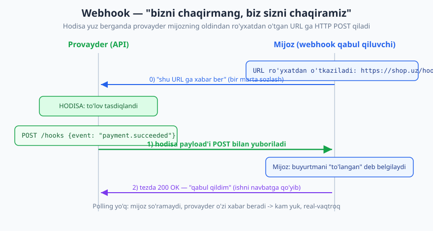
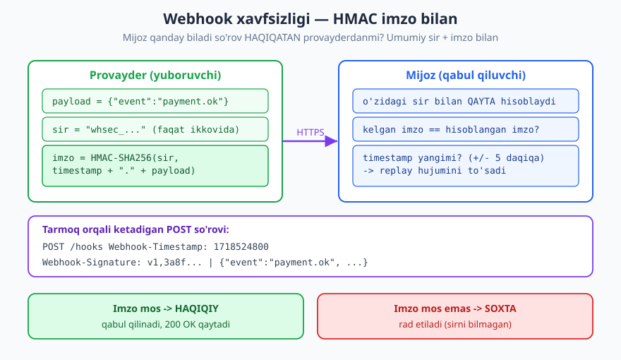

# 19 — Asinxron API va webhooklar

[⬅️ Oldingi: 18 — gRPC va Protocol Buffers](./18-grpc.md) · [🏠 README](./README.md) · [Keyingi: 20 — Real-time API: WebSocket va SSE ➡️](./20-realtime-websocket-sse.md)

---

> **Bu bobda:** Hozirgacha biz asosan **sinxron** dunyoda yashadik: mijoz so'raydi, server darrov javob beradi. Lekin ba'zi ish UZOQ davom etadi (video qayta ishlash, katta hisobot), ba'zisi esa umuman mijozning so'roviga bog'liq emas, balki **hodisaga** asoslangan (to'lov o'tdi, yangi xabar keldi). Bu bobda ikkita asosiy asinxron naqshni ko'ramiz: uzoq ish uchun **202 Accepted + status resursi** (polling) va hodisalar uchun **webhook** (teskari API) — uning dizayni, **xavfsizligi** (HMAC imzo), **ishonchliligi** (retry, idempotentlik, dead-letter) va qachon webhook, qachon polling, qachon WebSocket/SSE tanlash.
>
> **Halollik / Eslatma:** Status kodlari **RFC 9110** ga asoslanadi (`202 Accepted` — qabul qilindi, lekin hali tugamadi). Webhook'ning o'zi rasmiy IETF protokoli emas — bu keng tarqalgan **konvensiya** (Stripe, GitHub, Slack kabilar shakllantirgan); shuning uchun ko'p detal (imzo sarlavhasi nomi, retry jadvali) provayderdan provayderga farq qiladi va men buni "ko'p amaliyotda" deb belgilayman, RFC raqami ixtiro qilmayman. HMAC g'oyasi va `at-least-once` yetkazish — mustahkam, sanoatda standart. **AsyncAPI 3.0** (2023-noyabr; eng yangisi 3.1.0, 2026-yanvar) — event-driven API'larni hujjatlash spetsifikatsiyasi. JSON namunalari valid; standartlar va versiyalar vaqt bilan o'zgaradi.

---

## Sinxron vs asinxron: nega bitta model yetmaydi

Tasavvur qiling, restoranga kirdingiz. Ikki xil buyurtma bor:

1. **Bir stakan suv so'rayapsiz.** Ofitsiant darrov olib keladi. Siz turib kutasiz, u kelguncha — bir necha soniya. Bu **sinxron**: so'rov → darhol javob.
2. **Murakkab taom buyurtma qildingiz.** Ofitsiant "tushundim, 30 daqiqa" deydi va ketadi. Siz turib kutmaysiz — o'tirasiz, gaplashasiz; tayyor bo'lganda u **o'zi** olib keladi (yoki siz oshxonaga "tayyormi?" deb so'rab turasiz). Bu **asinxron**.

Hozirgacha o'rgangan REST API'larimiz birinchi turga o'xshaydi: `GET /users/42` yuborasiz, server darhol `200 OK` bilan foydalanuvchini qaytaradi. Bu ajoyib ishlaydi — **agar ish tez bo'lsa**. Lekin ikki holatda sinxron model sinadi:

- **Uzoq ish (long-running).** Video transkodlash, 100 ming qatorli hisobot generatsiya, PDF eksport, AI modelidan javob. Bu sekundlab yoki daqiqalab davom etishi mumkin. Mijozni (va HTTP ulanishni) shuncha vaqt kutib turishga majburlash — yomon: ulanish timeout bo'ladi, mijoz qotib qoladi, server resursi band turadi.
- **Hodisaga asoslangan (event-driven).** "To'lov tasdiqlandi", "buyurtma jo'natildi", "yangi xabar keldi" — bular mijozning so'roviga emas, **tashqi hodisaga** bog'liq. Mijoz qachon so'rashni bilmaydi. U faqat "bo'lganda menga ayt" deyishi mumkin.

Bu ikki muammoga ikki naqsh javob beradi. Birinchisi — **asinxron so'rov-javob** (202 + status resursi). Ikkinchisi — **webhook**. Ikkalasini ham ochamiz.

> **Eslatma:** "Asinxron" so'zi bu yerda **API darajasidagi** asinxronlikni anglatadi — server ishni darrov tugatmaydi, javob keyinroq keladi. Buni dasturlash tilidagi `async/await` bilan adashtirmang: u bir til ichidagi mexanizm, biz esa **mijoz va server orasidagi protokol** haqida gaplashyapmiz.

---

## Uzoq ish: asinxron so'rov-javob (202 Accepted)

Birinchi muammo — uzoq ish. Mijoz "menga 2026-yil savdo hisobotini tayyorlab ber" deydi, bu 40 soniya davom etadi. Agar siz oddiy sinxron `200 OK` ni 40 soniya ushlab tursangiz, har xil narsa buziladi.

**Yechim:** serverni "darhol tugatishga" majburlamang. Aksincha, server **"tushundim, ish boshlandi"** deb tezda javob qaytarsin, va mijozga ishni **kuzatish uchun manzil** bersin. Aynan shu uchun RFC 9110 da `202 Accepted` mavjud.



### Qadam 1: ishni boshlash → 202 + status URL

Mijoz og'ir ishni boshlovchi so'rov yuboradi. Server uni **darrov bajarmaydi**; navbatga qo'yadi (background worker), va `202 Accepted` qaytaradi. `Location` (yoki body ichidagi havola) — ishni kuzatish uchun **operatsiya resursi** manzilini ko'rsatadi.

```http
POST /v1/reports HTTP/1.1
Host: api.example.com
Content-Type: application/json
Authorization: Bearer <token>

{"period": "2026", "format": "pdf"}

HTTP/1.1 202 Accepted
Location: /v1/jobs/job_abc123
Content-Type: application/json

{"id": "job_abc123", "status": "pending", "links": {"self": "/v1/jobs/job_abc123"}}
```

Diqqat qiling: `202` — bu `200 OK` ham, `201 Created` ham emas. U aniq aytadi: **"so'rovni qabul qildim, lekin ish hali tugamadi"**. Bu RFC 9110 ning aniq semantikasi — [03-bobdagi](./03-http-status-kodlari.md) status kodlari to'plamining muhim a'zosi.

> **Standart:** RFC 9110 ga ko'ra `202 Accepted` — so'rov qayta ishlash uchun qabul qilindi, lekin **bajarilishi hali yakunlanmagan** (hatto rad etilishi ham mumkin). Aynan uzoq-ishli (long-running) operatsiyalar uchun mo'ljallangan. `201 Created` esa resurs **allaqachon yaratilgan** bo'lsa ishlatiladi — bu yerda esa hisobot hali yo'q, faqat "ish" boshlandi.

### Qadam 2: operatsiya (job) resursini dizayn qilish

`202` qaytarish kifoya emas — mijoz **qayoqdan biladi** ish tugaganini? Shuning uchun siz birinchi darajali **operatsiya resursi** (ko'pincha "job" yoki "operation" deb ataladi) yaratasiz. Bu oddiy resurs — uni `GET` bilan o'qib bo'ladi va u ish holatini bildiradi:

```json
{
  "id": "job_abc123",
  "status": "pending",
  "created_at": "2026-06-16T09:00:00Z",
  "links": {
    "self": "/v1/jobs/job_abc123"
  }
}
```

`status` maydoni hayotiy. Yaxshi dizaynda u aniq, cheklangan holatlar to'plamiga ega:

| `status` | Ma'nosi |
|---|---|
| `pending` (yoki `queued`) | Qabul qilindi, navbatda, hali boshlanmadi. |
| `processing` (yoki `running`) | Ayni paytda bajarilyapti. |
| `done` (yoki `succeeded`) | Muvaffaqiyatli tugadi — natija tayyor. |
| `failed` | Xatolik bilan tugadi — sababi `error` maydonida. |

Ish tugaganda, `GET /v1/jobs/job_abc123` quyidagicha javob beradi — natijaga havola bilan:

```json
{
  "id": "job_abc123",
  "status": "done",
  "created_at": "2026-06-16T09:00:00Z",
  "completed_at": "2026-06-16T09:00:42Z",
  "result_url": "/v1/reports/2026-06/sales.pdf"
}
```

> **Eslatma — status kodi vs status maydoni.** `GET /v1/jobs/abc` so'rovining o'zi muvaffaqiyatli bo'ladi — server **`200 OK`** qaytaradi (job resursini topdi va berdi). Ishning **mantiqiy** holati esa body ichidagi `status` maydonida. Ya'ni "ish muvaffaqiyatsiz tugadi" `500` emas — bu `200 OK` + `{"status": "failed"}`. HTTP status kodi *so'rovning* taqdiri haqida, `status` maydoni esa *ishning* taqdiri haqida. Buni aralashtirib yubormang.

### Qadam 3: natijani qanday olish — polling yoki webhook

Endi ikki yo'l bor:

- **A) Polling** — mijoz `GET /v1/jobs/abc` ni vaqti-vaqti bilan qayta so'rab turadi, toki `status` `done` bo'lguncha. Sodda, lekin "isrofgar": ko'p bo'sh so'rov yuboriladi va natija biroz kechikadi (keyingi so'rovgacha kutiladi).
- **B) Webhook** — mijoz so'rab turmaydi; ish tugaganda **server o'zi** mijozning URL'iga xabar yuboradi. Tejamli va tezroq, lekin mijozdan ommaviy URL va qabul qiluvchi endpoint talab qiladi.

Polling sodda boshlash uchun yaxshi; lekin u qanchalik tez-tez so'rashga arziydi degan savol bilan keladi. Mana shu yerda **webhook** sahnaga chiqadi — va u shu qadar muhimki, alohida bo'lim talab qiladi.

> **Trade-off:** Polling vs webhook — mutlaq g'olib yo'q. **Polling** mijoz tomonida sodda (faqat HTTP `GET`), ommaviy URL talab qilmaydi, "firewall ortidagi" mijoz uchun ham ishlaydi — lekin kechikadi va ortiqcha trafik beradi. **Webhook** real-vaqtroq va tejamli — lekin mijozdan ommaviy, xavfsiz, doim ishlaydigan endpoint talab qiladi. Ko'p yetuk API **ikkalasini ham** beradi: webhook — asosiy, polling — zaxira.

---

## Webhook: teskari API ("bizni chaqirmang, biz sizni chaqiramiz")

Oddiy API'da **mijoz** tashabbuskor: u so'raydi, server javob beradi. Webhook bu rollarni **teskari** aylantiradi. Endi hodisa yuz berganda **server (provayder)** tashabbuskor bo'ladi — u **mijozning** oldindan ro'yxatdan o'tgan URL'iga HTTP `POST` yuboradi. Shuning uchun webhook'ni ko'pincha **"teskari API"** (reverse API) yoki Hollywood'cha "Don't call us, we'll call you" tamoyili deb atashadi.



**Polling bilan taqqoslang.** Polling'da mijoz "tayyormi? tayyormi? tayyormi?" deb takror so'raydi — ko'pchilik so'rov "yo'q, hali emas" javobini oladi (bekorga ketgan trafik). Webhook'da mijoz **umuman so'ramaydi** — faqat kutadi, va aynan kerakli vaqtda bitta `POST` keladi. Bu kam yuk va real-vaqtroq.

Webhook uchun klassik misollar:

- **To'lov tizimi** (Stripe, Payme va h.k.): "to'lov tasdiqlandi", "to'lov bekor qilindi" → buyurtmani "to'langan" deb belgilaysiz.
- **Git platformasi** (GitHub): "yangi commit push qilindi", "PR ochildi" → CI quvurini ishga tushirasiz.
- **Messaging** (Telegram, Slack): "yangi xabar keldi" → botingiz javob beradi.

### Webhook dizayni: nimadan iborat

Yaxshi webhook tizimi uch qismdan iborat:

1. **Hodisa turi (event type).** Nima yuz berdi? Odatda nuqta bilan ajratilgan, kengaytiriladigan ism: `payment.succeeded`, `order.shipped`, `user.deleted`. Mijoz qaysi turlarga obuna bo'lishini tanlaydi.
2. **Payload (hodisa ma'lumoti).** Hodisa haqida tafsilot — JSON ob'ekt. Kamida: hodisa turi, vaqt, va tegishli resurs ma'lumoti.
3. **Yetkazib berish (delivery).** Provayder mijozning URL'iga `POST` qiladi va javobini kuzatadi.

Tipik webhook payload'i mana shunday ko'rinadi:

```json
{
  "id": "evt_1JZ9k2",
  "type": "payment.succeeded",
  "created_at": "2026-06-16T09:14:07Z",
  "api_version": "2026-01-01",
  "data": {
    "payment_id": "pay_88f0",
    "order_id": "ord_4521",
    "amount": 49900,
    "currency": "UZS",
    "status": "succeeded"
  }
}
```

Bir necha dizayn qarori bu yerda yashiringan:

- **`id` (hodisa identifikatori).** Har bir hodisaga noyob ID. Bu ishonchlilik uchun kritik — pastda ko'ramiz (idempotentlik kaliti vazifasini bajaradi).
- **`type`.** Mijoz bitta endpoint'da turli hodisalarni `type` bo'yicha ajratadi.
- **`created_at`.** Hodisa **qachon** yuz berganini bildiradi — tartiblash va replay tekshiruvi uchun (ISO 8601 / RFC 3339).
- **`data`.** Hodisaning haqiqiy ma'lumoti. Bu yerda muhim trade-off bor (pastda).

> **Trade-off — "thin" vs "fat" payload.** Ikki yondashuv bor. **Fat payload** (yuqoridagidek) — hodisa ma'lumotini to'liq yuboradi; mijozga qulay (qo'shimcha so'rov shart emas), lekin payload kattalashadi va eskirgan/maxfiy ma'lumotni o'z ichiga olishi mumkin. **Thin payload** (yoki "notification") — faqat ID va tur yuboradi (`{"type": "payment.succeeded", "payment_id": "pay_88f0"}`), mijoz keyin `GET /payments/pay_88f0` bilan to'liq, **dolzarb** ma'lumotni o'zi oladi. Thin xavfsizroq (maxfiy ma'lumot webhook'da ketmaydi) va doim dolzarb, lekin har webhook'ga qo'shimcha so'rov qo'shadi. Public, maxfiy ma'lumotli tizimlarda ko'pincha thin yoki gibrid afzal.

### Mijozning ro'yxatdan o'tishi

Webhook ishlashi uchun mijoz oldin provayderga **qaysi URL'ga va qaysi hodisalarni** yuborishni aytishi kerak. Bu odatda boshqaruv panelida yoki API orqali qilinadi:

```json
{
  "endpoint": "https://shop.example/webhooks/payments",
  "events": ["payment.succeeded", "payment.failed", "refund.created"],
  "secret": "whsec_4eC39Hq...",
  "active": true
}
```

E'tibor bering: ro'yxatdan o'tishda **`secret`** (umumiy sir) ham keladi. Bu webhook xavfsizligining kaliti — keyingi bo'lim aynan shu haqda.

---

## Webhook xavfsizligi: so'rov haqiqatan provayderdanmi?

Mana eng muhim savol. Sizning webhook endpoint'ingiz — `https://shop.example/webhooks/payments` — **ommaviy** URL. Uni dunyodagi har kim chaqira oladi. Demak yomon niyatli kishi shunchaki `POST {"type": "payment.succeeded", "amount": 1000000}` yuborishi mumkin — va agar siz tekshirmasangiz, soxta "to'lov" ni qabul qilib, mahsulotni bepul jo'natib yuborasiz.

Savol: **mijoz qanday biladi `POST` haqiqatan provayderdanmi, yoki soxtami?**

Javob: **HMAC imzo.** Provayder va mijoz **umumiy sir** (shared secret) ni bilishadi (ro'yxatdan o'tishda almashilgan). Provayder har bir payload'ni shu sir bilan **imzolaydi** va imzoni sarlavhada yuboradi. Mijoz **o'sha sir** bilan imzoni qayta hisoblaydi va solishtiradi. Sirni bilmagan hujumchi to'g'ri imzoni yarata olmaydi → uning soxta so'rovi rad etiladi.



### HMAC qanday ishlaydi

**HMAC** (Hash-based Message Authentication Code) — sir kalit bilan hisoblanadigan kriptografik "barmoq izi". Asosiy g'oya:

```
imzo = HMAC-SHA256(sir, timestamp + "." + payload)
```

Provayder bu imzoni hisoblab, `POST` so'roviga sarlavha sifatida qo'shadi:

```http
POST /webhooks/payments HTTP/1.1
Host: shop.example
Content-Type: application/json
Webhook-Timestamp: 1718524800
Webhook-Signature: v1,3a8f0c2b9e7d6a5f4c3b2a1908f7e6d5c4b3a2918f7e6d5c4b3a2918f7e6d5c4

{"id": "evt_1JZ9k2", "type": "payment.succeeded", "data": {"amount": 49900}}
```

Mijoz tomonida tekshiruv mantig'i:

1. So'rovdan **xom (raw)** payload baytlari, `Webhook-Timestamp` va `Webhook-Signature` ni o'qib oladi.
2. O'zidagi **sir** bilan `HMAC-SHA256(sir, timestamp + "." + payload)` ni qayta hisoblaydi.
3. Hisoblangan imzoni kelgan imzo bilan **doimiy-vaqtli** (constant-time) solishtiradi.
4. Mos kelsa — haqiqiy, ishlaydi. Mos kelmasa — soxta, rad etiladi (`400`/`401`).

> **Xavfsizlik:** Bir nechta nozik nuqta. **(1)** Imzoni **xom baytlar** ustidan tekshiring — JSON'ni parse qilib, qayta serialize qilgandan keyin emas (bo'sh joy/tartib o'zgarib imzo buziladi). **(2)** Solishtirishni **doimiy-vaqtli** funksiya bilan qiling (`hmac.compare_digest` kabi), oddiy `==` bilan emas — vaqt-tahlili (timing attack) hujumini oldini olish uchun. **(3)** Sirni hech qachon kodga yozmang yoki log'ga chiqarmang — uni maxfiy boshqaring.

### Timestamp va replay hujumi

HMAC imzo so'rovning **haqiqiyligini** isbotlaydi, lekin bitta teshik qoldiradi: **replay hujumi**. Hujumchi haqiqiy, to'g'ri imzolangan so'rovni "ushlab" olib, keyin **qayta-qayta yuborsa**? Imzo to'g'ri — har safar qabul qilinadi.

Yechim: imzoga **timestamp** ni ham qo'shish (yuqorida `timestamp + "." + payload` deganimiz shu uchun). Mijoz timestamp'ni tekshiradi: agar u **juda eski** bo'lsa (masalan ±5 daqiqadan tashqarida), so'rovni rad etadi. Demak hujumchi ushlab olgan so'rovni faqat qisqa oyna ichida ishlata oladi — replay deyarli imkonsiz bo'ladi.

### Yana ikki himoya qatlami

- **HTTPS majburiy.** Webhook URL'i doim `https://` bo'lishi shart. HTTP'da payload va imzo tarmoqda ochiq ketadi — har kim o'qiy oladi va o'zgartira oladi.
- **(Ixtiyoriy) IP ro'yxati.** Ba'zi provayderlar webhook'ni qaysi IP diapazonidan yuborishini e'lon qiladi; mijoz faqat o'sha IP'lardan kelganini qabul qiladi. Bu qo'shimcha qatlam, lekin IP'lar o'zgarishi mumkinligi sababli HMAC'ni **almashtirmaydi**, faqat to'ldiradi.

> **Diqqat:** HMAC imzo — webhook xavfsizligining **asosi**, ixtiyoriy "yaxshi bo'lardi" emas. Imzosiz ommaviy webhook endpoint — har kim soxta hodisa yubora oladigan ochiq eshik. Bu to'g'ridan-to'g'ri [13-bobdagi](./13-api-xavfsizligi.md) API xavfsizligi mavzusiga bog'lanadi: ishonchsiz kirishni hech qachon tasdiqsiz qabul qilmang.

---

## Webhook ishonchliligi: yetkazish kafolatlanmaydi

Endi eng nozik amaliy haqiqat. Webhook — bu tarmoq orqali `POST`. Tarmoq esa **ishonchsiz**: mijoz serveri bir lahza o'chgan bo'lishi, sekin javob berishi, timeout bo'lishi mumkin. Demak **yetkazish kafolatlanmaydi**. Buni dizaynda hisobga olmasangiz, jim ravishda hodisa yo'qoladi — eng yomon turdagi xato.

### Retry va exponential backoff

Agar provayder `POST` yuborganda mijoz `2xx` qaytarmasa (xato qaytardi, timeout bo'ldi, ulanmadi) — provayder **qayta urinadi (retry)**. Lekin darrov va cheksiz emas: **exponential backoff** bilan — har urinish orasidagi tanaffus ortib boradi (masalan 1 daqiqa, keyin 5, keyin 30, keyin 2 soat...), bir necha kun davomida, keyin taslim bo'ladi.

Buning katta oqibati bor: **bir hodisa mijozga bir necha marta yetib kelishi mumkin.** Ko'pincha mijoz `200` qaytardi-yu, lekin javob provayderga yetib bormadi (tarmoq uzildi) — provayder "yetkazilmadi" deb o'ylaydi va **qayta yuboradi**, garchi mijoz allaqachon qabul qilgan bo'lsa ham.

### At-least-once → idempotent mijoz SHART

Bu bizni webhook'ning eng muhim xususiyatiga olib keladi: ko'p webhook tizimi **at-least-once** (kamida bir marta) yetkazishni beradi — "**aniq bir marta**" (exactly-once) emas. Ya'ni: hodisa **yo'qolmaydi** (kamida bir marta keladi), lekin **takrorlanishi mumkin** (bir necha marta kelishi mumkin).

Demak **mijoz idempotent bo'lishi shart**: bir xil hodisani ikki marta qayta ishlash **bir marta qayta ishlash bilan bir xil natija** berishi kerak. Aks holda — `payment.succeeded` ikki marta kelsa — mijoz mahsulotni ikki marta jo'natadi, yoki balansga ikki marta pul qo'shadi.

Yechim sodda va biz buni [15-bobda](./15-idempotentlik-parallellik.md) ko'rganmiz: har webhook'ning **hodisa `id`** sini ishlatib, qayta ishlangan ID'larni saqlang:

```
hodisa keldi → uning id (evt_1JZ9k2) ni bazada qidir
  agar bor   → "allaqachon ko'rganman" → 200 OK qaytar, qayta ishlama
  agar yo'q  → qayta ishla, keyin id ni "ishlangan" deb saqla → 200 OK
```

> **Eslatma:** Mana shuning uchun webhook payload'ida **noyob `id`** bo'lishi muhim edi. U mijoz uchun **idempotentlik kaliti** vazifasini bajaradi — xuddi [15-bobdagi](./15-idempotentlik-parallellik.md) `Idempotency-Key` g'oyasidek, lekin bu yerda kalitni **provayder** payload ichida beradi. Idempotent mijoz `at-least-once` yetkazishni amalda `exactly-once` ta'siriga aylantiradi.

### Tartib kafolati yo'q

Yana bir halol nuqta: webhooklar **tartibda kelishini kafolatlamaydi**. Retry'lar tufayli `order.created` dan oldin `order.shipped` kelishi mumkin. Shuning uchun:

- Tartibga **tayanmang**. Har hodisani mustaqil qayta ishlang.
- Agar tartib muhim bo'lsa, payload ichidagi `created_at` (yoki ketma-ket raqam) ga qarab tartiblang yoki "eskini e'tiborsiz qoldir" mantig'ini quring.

### Mijoz tezda 2xx qaytarishi kerak

Provayder `POST` yuborgach, mijozning javobini **cheklangan vaqt** kutadi (ko'pincha bir necha soniya). Agar mijoz ichida og'ir ishni (masalan email yuborish, hisobot hisoblash) shu so'rov ichida bajarsa va sekinlashsa — provayder **timeout** deb hisoblaydi va **qayta yuboradi**, garchi mijoz aslida ishlayotgan bo'lsa ham. Bu ortiqcha takrorga olib keladi.

To'g'ri naqsh: mijoz webhook'ni qabul qilganda **faqat ikki ish qilsin** — (1) imzoni tekshirsin, (2) hodisani **ichki navbatga (queue) qo'ysin** — va darrov `200 OK` qaytarsin. Haqiqiy og'ir ishni keyin, fon ishchisida (background worker) bajarsin.

```http
POST /webhooks/payments HTTP/1.1
Host: shop.example
Webhook-Signature: v1,3a8f...

{"id": "evt_1JZ9k2", "type": "payment.succeeded"}

HTTP/1.1 200 OK
Content-Type: application/json

{"received": true}
```

### Dead-letter: taslim bo'lganda

Agar mijoz uzoq vaqt (kunlab) javob bermasa, provayder oxiri taslim bo'ladi. Yo'qotilgan hodisalar **dead-letter** (o'lik xat) ga boradi — provayder ularni log/UI'da ko'rsatadi, mijoz keyinroq qo'lda yoki API orqali **qayta yuborishni** (replay) so'rashi mumkin. Yaxshi webhook provayderi mijozga "yetkazilmagan hodisalar" ro'yxatini va "qayta yubor" tugmasini beradi.

> **Diqqat — xulosa.** Webhook qabul qiluvchi sifatida sizning oltin qoidalaringiz: **(1)** imzoni doim tekshir; **(2)** tezda `2xx` qaytar, og'ir ishni navbatga qo'y; **(3)** `id` bo'yicha **idempotent** bo'l (takror keladi); **(4)** tartibga tayanma; **(5)** webhook kelmay qolishi mumkinligini bil — kritik holatlar uchun zaxira polling yoki reconciliation (solishtirish) qil.

---

## Event-driven va message queue (ichki async)

Webhook — bu **tashqi** asinxronlik: provayder va sizning tizimingiz (ikki alohida tashkilot) orasidagi `HTTP POST`. Lekin **tizim ichida** ham asinxronlik kerak bo'ladi — va u yerda boshqa vosita ishlatiladi: **message queue / message broker** (Kafka, RabbitMQ, AWS SQS, NATS va h.k.).

G'oya bir xil — "ishni darrov bajarma, navbatga qo'y, keyin alohida ishchi bajaradi" — lekin mexanizm farq qiladi:

| Jihat | Webhook | Message queue |
|---|---|---|
| Qayerda | **Tashqi** (tizimlararo, internetda) | **Ichki** (bir tizim ichida) |
| Transport | HTTP POST | Broker protokoli (Kafka/AMQP...) |
| Kim biladi kimni | Provayder mijoz URL'ini biladi | Yuboruvchi qabul qiluvchini bilmaydi (pub/sub) |
| Tartib/kafolat | Zaif (at-least-once, tartibsiz) | Sozlanadigan, ko'pincha kuchliroq |

**Pub/sub (publish/subscribe)** g'oyasi message queue'ning yuragidir: ish ishlab chiqaruvchi (publisher) hodisani brokerga "e'lon qiladi", uni kim "tinglashini" bilmaydi; bir nechta iste'molchi (subscriber) o'zi qiziqqan hodisalarga **obuna bo'ladi**. Bu xizmatlarni bir-biridan **ajratadi** (decoupling) — yangi iste'molchi qo'shish uchun ishlab chiqaruvchini o'zgartirish shart emas.

Bu mavzu chuqur va arxitektura darajasiga tegishli — uni [Dasturiy arxitektura](../arxitektura/README.md) kitobida event-driven arxitektura, broker'lar va saga naqshlari bilan to'liqroq ochamiz. Bu yerda muhimi shuni bilish: **webhook ≈ tashqi event yetkazish, message queue ≈ ichki event yetkazish**, ikkalasi ham bir xil "ajrat va asinxron qayta ishla" falsafasiga tayanadi.

---

## AsyncAPI: event-driven API'larni hujjatlash

REST API'larni biz OpenAPI bilan hujjatlaymiz ([21-bob](./21-openapi.md)). Lekin OpenAPI **so'rov-javob** dunyosiga moslangan — webhook, message va event oqimlarini tabiiy ifodalay olmaydi. Aynan shu bo'shliqni **AsyncAPI** to'ldiradi: u **OpenAPI'ning asinxron/event-driven ekvivalenti**.

AsyncAPI bilan siz quyidagilarni mashina-o'qiy formatda ta'riflaysiz: qaysi **kanallar** (channels) bor, ularda qaysi **xabarlar** (messages) yuriydi, qaysi **operatsiyalar** (send/receive) mavjud va payload sxemasi qanday. Mana minimal misol (AsyncAPI 3.0):

```yaml
asyncapi: 3.0.0
info:
  title: To'lov hodisalari API
  version: 1.0.0
channels:
  paymentEvents:
    address: payment/events
    messages:
      paymentSucceeded:
        payload:
          type: object
          properties:
            type:
              type: string
            data:
              type: object
operations:
  onPaymentSucceeded:
    action: send
    channel:
      $ref: '#/channels/paymentEvents'
```

> **Standart:** AsyncAPI **3.0** (2023-noyabr) muhim qayta tuzilish keltirdi — **operatsiyalar kanallardan ajratildi** (avval ular birga edi), bu pub/sub'ni aniqroq ifodalaydi. Eng yangi versiya — **3.1.0** (2026-yanvar). AsyncAPI webhook, Kafka, MQTT, WebSocket kabi turli asinxron transportlarni qamraydi. U hali OpenAPI darajasida keng tarqalmagan, lekin event-driven tizimlar uchun standartlashayotgan tanlov. Hujjatlash bo'yicha umumiy g'oyalarni [22-bobda](./22-hujjatlash-dx.md) ko'ramiz.

---

## Webhook vs polling vs WebSocket/SSE — qaysi birini qachon

Asinxron natijani yetkazishning bir necha yo'li bor. Quyidagi jadval har birini qachon tanlashni umumlashtiradi (WebSocket va SSE [20-bobning](./20-realtime-websocket-sse.md) asosiy mavzusi):

| Mexanizm | Kim tashabbuskor | Eng mos joy | Cheklov |
|---|---|---|---|
| **Polling** | Mijoz so'rab turadi | Sodda holat, kam-tez yangilanish, firewall ortidagi mijoz | Kechikadi, ortiqcha trafik |
| **Webhook** | Server (provayder) POST qiladi | Tizimlararo, server-to-server hodisalar (to'lov, git) | Mijozda ommaviy URL kerak; at-least-once |
| **SSE** (Server-Sent Events) | Server bir tomonlama oqim | Server → brauzer **bir tomonlama** jonli yangilanish (lenta, progress) | Faqat server → mijoz; brauzerga qaragan |
| **WebSocket** | Ikki tomonlama jonli kanal | **Ikki tomonlama** real-vaqt (chat, o'yin, jonli hamkorlik) | Murakkabroq; doimiy ulanish |

Amaliy yo'l-yo'riq:

- **Boshqa server**ga hodisa yetkazasizmi (to'lov, git, integratsiya)? → **Webhook**.
- **Brauzerga** server tomonidan **bir tomonlama** jonli yangilanish (progress bar, jonli lenta)? → **SSE**.
- **Brauzer ↔ server** doimiy **ikki tomonlama** real-vaqt (chat, o'yin)? → **WebSocket**.
- Eng sodda yechim yetadi va kechikish muhim emasmi? → **Polling**.

> **Trade-off:** Bu mexanizmlar raqobatchi emas, balki turli ehtiyojlar uchun. Ko'p tizim ularni birga ishlatadi: uzoq ish uchun **202 + webhook**, frontend progress uchun **SSE**, jonli chat uchun **WebSocket**, va hammasi uchun **polling** zaxira sifatida. "Hammaga bitta mexanizm" — kamdan-kam to'g'ri javob; ehtiyojni mexanizmga moslang.

---

## Asosiy g'oyalar (bobni qisqacha)

- **Sinxron model tez ish uchun yaxshi**, lekin **uzoq ish** (hisobot, transkodlash) va **hodisaga asoslangan** (to'lov, xabar) holatlarda sinadi — asinxron naqshlar kerak.
- **Uzoq ish → 202 Accepted + operatsiya resursi.** Server darrov `202` + status URL qaytaradi (RFC 9110); mijoz `GET /jobs/abc` bilan holatni (`pending`/`processing`/`done`/`failed`) **polling** qiladi yoki webhook kutadi. So'rov muvaffaqiyati = HTTP `200`; ishning taqdiri = body'dagi `status` maydoni.
- **Webhook = teskari API:** hodisa yuz berganda **provayder** mijozning ro'yxatdan o'tgan URL'iga `POST` qiladi. Polling'dan kam yuk va real-vaqtroq. Dizayn: **hodisa turi** + **payload** (thin vs fat trade-off) + **yetkazish**.
- **Xavfsizlik = HMAC imzo.** Endpoint ommaviy, demak har kim soxta so'rov yubora oladi. Provayder umumiy **sir** bilan payload'ni imzolaydi (`HMAC-SHA256`), mijoz qayta hisoblab tekshiradi. **Timestamp** replay hujumini to'sadi; **HTTPS** majburiy; doimiy-vaqtli solishtirish va xom-bayt ustidan tekshirish.
- **Ishonchlilik:** yetkazish kafolatlanmaydi → **retry (exponential backoff)** → bir hodisa **takror** kelishi mumkin (**at-least-once**). Demak mijoz **idempotent** bo'lishi shart (hodisa `id` bo'yicha dedup, [15-bob](./15-idempotentlik-parallellik.md)). **Tartib kafolati yo'q**. Mijoz **tezda `2xx`** qaytarib, og'ir ishni navbatga qo'ysin. Yo'qolganlar — **dead-letter**.
- **Message queue** (Kafka/RabbitMQ) = **ichki** event yetkazish (pub/sub, decoupling); webhook = **tashqi**. Ikkalasi bir falsafada ([arxitektura](../arxitektura/README.md)).
- **AsyncAPI** (3.0, 2023; 3.1.0, 2026) — event-driven API'larni hujjatlash standarti, OpenAPI'ning async ekvivalenti.
- **Tanlov:** server→server hodisa → **webhook**; brauzerga bir tomonlama → **SSE**; ikki tomonlama jonli → **WebSocket** ([20-bob](./20-realtime-websocket-sse.md)); sodda/kechikishga toqat → **polling**.

---

## Mashqlar

### Oson

**1-mashq.** Quyidagi har bir vaziyat **sinxron** so'rov-javobga mosmi yoki **asinxron** naqsh talab qiladimi? Sababini bir jumlada ayting:
- (a) `GET /users/42` — bitta foydalanuvchini olish.
- (b) "2026-yilning butun savdo hisobotini PDF qil" (40 soniya davom etadi).
- (c) "To'lov tasdiqlanganda menga xabar ber".
- (d) `POST /orders` — yangi buyurtma yaratish (darrov saqlanadi).

**2-mashq.** Webhook nima, va nega uni "teskari API" deb atashadi? Polling bilan asosiy farqini bir-ikki jumlada tushuntiring.

**3-mashq.** `202 Accepted` status kodi nimani anglatadi va u nega `200 OK` yoki `201 Created` dan farq qiladi? Qaysi holatda ishlatiladi?

### O'rta

**4-mashq.** "Video yuklash → transkodlash (1-2 daqiqa) → tayyor bo'lganda URL ber" oqimi uchun asinxron so'rov-javob dizayn qiling: (a) boshlang'ich so'rov va `202` javobini HTTP blok sifatida ko'rsating; (b) operatsiya (job) resursining `status` holatlarini sanang; (c) tugagandagi `GET /jobs/...` javobini JSON sifatida ko'rsating.

**5-mashq.** Bir messaging platformasi uchun `message.received` webhook payload'ini dizayn qiling. Quyidagilarni o'z ichiga olsin: noyob hodisa ID, hodisa turi, vaqt, va xabar ma'lumoti (kim yubordi, matn). Nega noyob ID muhimligini bir jumlada izohlang.

**6-mashq.** Sizdan "buyurtma yetkazib berildi" haqida mijozni xabardor qilish so'raldi. **Polling** va **webhook** orasidan birini tanlang. Quyidagi ikki stsenariy uchun alohida javob bering va nega:
- (a) Mijoz — **boshqa kompaniyaning serveri** (B2B integratsiya).
- (b) Mijoz — **brauzerdagi sahifa**, foydalanuvchi "kutish" ekranida turibdi.

### Qiyin

**7-mashq.** Webhook endpoint'ingiz `https://shop.example/webhooks` ommaviy. Hujumchi soxta `{"type": "payment.succeeded", "amount": 9999999}` yuborishi mumkin. **HMAC imzo** bilan himoyani to'liq dizayn qiling: (a) provayder imzoni qanday hisoblaydi; (b) mijoz uni qanday tekshiradi (qadamlab); (c) **timestamp** nima uchun kerak va qaysi hujumni to'sadi; (d) yana ikkita himoya qatlamini ayting.

**8-mashq.** Sizning to'lov webhook'ingiz `payment.succeeded` ni qabul qilganda foydalanuvchi balansiga pul qo'shadi. Bir kuni siz balansga **ikki marta** pul qo'shilganini ko'rdingiz. Nima sodir bo'lgan bo'lishi mumkin, va buni qanday tuzatasiz? "At-least-once", "idempotentlik" va hodisa "id" tushunchalaridan foydalaning. Kod-mantiqni psevdokod sifatida ko'rsating.

**9-mashq.** Webhook tizimini **provayder** tomonidan loyihalashtiryapsiz. Ishonchli yetkazishni ta'minlash uchun to'liq strategiya yozing: (a) mijoz `2xx` qaytarmaganda nima qilasiz (retry siyosati); (b) nega **exponential backoff**; (c) qancha urinishdan keyin va qayerga (dead-letter); (d) mijozga qanday "qayta yuborish"/ko'rish imkonini berasiz; (e) **tartib** haqida mijozga qanday ogohlantirish berasiz va nega.

<details markdown="1">
<summary>Yechimlar</summary>

### 1-mashq yechimi
- (a) **Sinxron** — bitta resursni o'qish tez, server darrov `200 OK` bilan qaytaradi.
- (b) **Asinxron** (202 + status resursi) — 40 soniya davom etadigan ish uchun HTTP ulanishni ushlab turish noto'g'ri; server `202` qaytaradi, mijoz polling/webhook bilan natijani oladi.
- (c) **Asinxron, webhook** — bu hodisaga asoslangan, mijoz qachon so'rashni bilmaydi; provayder hodisa yuz berganda o'zi `POST` qiladi.
- (d) **Sinxron** — buyurtma darrov yaratiladi va saqlanadi; server `201 Created` bilan qaytaradi.

### 2-mashq yechimi
**Webhook** — provayder hodisa yuz berganda mijozning oldindan ro'yxatdan o'tgan URL'iga HTTP `POST` yuboradigan mexanizm. Uni **"teskari API"** deyishadi, chunki odatdagi API'da mijoz so'raydi va server javob beradi; webhook'da esa **rollar teskari** — server tashabbuskor bo'ladi va mijozni "chaqiradi".

**Polling'dan farqi:** polling'da mijoz "tayyormi?" deb takror so'rab turadi (ko'p bo'sh so'rov, kechikish); webhook'da mijoz **umuman so'ramaydi** — faqat hodisa bo'lganda bitta `POST` keladi (kam yuk, real-vaqtroq).

### 3-mashq yechimi
**`202 Accepted`** (RFC 9110) — server so'rovni **qabul qildi**, lekin ishni **hali tugatmagani** (yoki hatto rad etishi mumkinligini) bildiradi. U `200 OK` (so'rov tugadi, javob shu) va `201 Created` (resurs allaqachon yaratildi) dan farq qiladi — bu yerda natija hali tayyor emas, faqat ish boshlandi. **Uzoq-ishli (long-running)** operatsiyalar uchun ishlatiladi: server `202` + status/job URL qaytaradi, mijoz keyin holatni kuzatadi.

### 4-mashq yechimi
**(a) Boshlang'ich so'rov va `202` javobi:**

```http
POST /v1/videos HTTP/1.1
Host: api.example.com
Content-Type: application/json
Authorization: Bearer <token>

{"source_url": "https://upload.example/raw/clip.mov"}

HTTP/1.1 202 Accepted
Location: /v1/jobs/job_v8821
Content-Type: application/json

{"id": "job_v8821", "status": "pending", "links": {"self": "/v1/jobs/job_v8821"}}
```

**(b) Job `status` holatlari:** `pending` (navbatda) → `processing` (transkodlanyapti) → `done` (tayyor) yoki `failed` (xato bilan tugadi).

**(c) Tugagandagi `GET /v1/jobs/job_v8821` javobi:**

```json
{
  "id": "job_v8821",
  "status": "done",
  "created_at": "2026-06-16T09:00:00Z",
  "completed_at": "2026-06-16T09:01:35Z",
  "result_url": "https://cdn.example/videos/v8821/720p.mp4"
}
```

Eslatma: bu `GET` ning o'zi `200 OK` qaytaradi (job topildi); ishning natijasi `status` maydonida.

### 5-mashq yechimi

```json
{
  "id": "evt_7Hh2Qa",
  "type": "message.received",
  "created_at": "2026-06-16T10:22:51Z",
  "data": {
    "message_id": "msg_5510",
    "chat_id": "chat_88",
    "from": {"user_id": "u_204", "name": "Dilnoza"},
    "text": "Salom, buyurtmam qayerda?"
  }
}
```

**Noyob `id` nima uchun muhim:** webhook `at-least-once` yetkazadi — bir hodisa takror kelishi mumkin (retry tufayli). Mijoz `id` (`evt_7Hh2Qa`) ni ishlatib, allaqachon ko'rgan hodisani **dedup** qiladi (idempotentlik kaliti) — shunda bitta xabar ikki marta qayta ishlanmaydi (masalan ikki marta javob yuborilmaydi).

### 6-mashq yechimi
- (a) **Boshqa kompaniyaning serveri (B2B) → webhook.** Server-to-server hodisa yetkazish uchun webhook ideal: mijoz serverida ommaviy URL bor, polling'ning ortiqcha trafigi va kechikishi kerak emas. Provayder hodisa bo'lganda `POST` qiladi (imzo bilan).
- (b) **Brauzerdagi sahifa → polling (yoki SSE).** Brauzer sahifasi odatda ommaviy URL'ga ega emas — webhook'ni qabul qila olmaydi. Foydalanuvchi "kutish" ekranida turgani uchun sahifa job holatini bir necha soniyada bir **polling** qilib turishi mumkin (`GET /jobs/abc`), yoki real-vaqtroq kerak bo'lsa **SSE** bilan server bir tomonlama yangilanish yuboradi ([20-bob](./20-realtime-websocket-sse.md)).

### 7-mashq yechimi
**(a) Provayder imzoni hisoblaydi:** umumiy sir (ro'yxatdan o'tishda almashilgan) bilan: `imzo = HMAC-SHA256(sir, timestamp + "." + raw_payload)`. So'ngra imzoni va timestamp'ni sarlavhalarda yuboradi:

```http
POST /webhooks HTTP/1.1
Host: shop.example
Webhook-Timestamp: 1718524800
Webhook-Signature: v1,3a8f0c2b...

{"id": "evt_1JZ9k2", "type": "payment.succeeded", "data": {"amount": 49900}}
```

**(b) Mijoz tekshiradi (qadamlab):**
1. So'rovdan **xom payload baytlari**, `Webhook-Timestamp` va `Webhook-Signature` ni oladi.
2. O'zidagi sir bilan `HMAC-SHA256(sir, timestamp + "." + raw_payload)` ni **qayta hisoblaydi**.
3. Hisoblangan imzoni kelgan imzo bilan **doimiy-vaqtli** funksiya (`hmac.compare_digest`) bilan solishtiradi.
4. Mos kelsa — haqiqiy, qabul qiladi; mos kelmasa — soxta, `400`/`401` bilan rad etadi. Sirni bilmagan hujumchi to'g'ri imzo yarata olmaydi.

**(c) Timestamp nima uchun:** **replay hujumini** to'sadi. HMAC imzo so'rov haqiqiyligini isbotlaydi, lekin hujumchi haqiqiy imzolangan so'rovni "ushlab" olib **qayta yuborsa**, imzo har safar to'g'ri bo'laveradi. Timestamp imzoga kiritilganligi uchun mijoz uni tekshiradi: agar `timestamp` juda eski bo'lsa (masalan ±5 daqiqadan tashqari), so'rovni rad etadi — demak ushlangan so'rov faqat qisqa oyna ichida ishlaydi.

**(d) Yana ikki himoya qatlami:** **(1) HTTPS majburiy** — payload va imzo tarmoqda ochiq ketmasin; **(2) IP allowlist** (ixtiyoriy) — faqat provayderning e'lon qilingan IP diapazonidan kelgan so'rovlarni qabul qilish (HMAC'ni almashtirmaydi, to'ldiradi).

### 8-mashq yechimi
**Nima sodir bo'ldi:** webhook **at-least-once** yetkazadi. Ehtimol mijoz `payment.succeeded` ni qabul qilib, balansga pul qo'shdi va `200 OK` qaytardi — lekin javob provayderga yetib bormadi (tarmoq uzildi) yoki mijoz juda sekin javob berdi (timeout). Provayder "yetkazilmadi" deb hisoblab, **hodisani qayta yubordi**. Mijoz uni **yangi hodisa** deb qabul qilib, balansga **yana** pul qo'shdi → ikki marta.

**Tuzatish — idempotentlik (hodisa `id` bo'yicha dedup):** har bir webhook'ning noyob `id` sini ishlatib, qayta ishlangan ID'larni saqlang:

```
hodisa keladi (id = evt_1JZ9k2)
  transaksiya boshla:
    agar processed_events jadvalida id mavjud bo'lsa:
        -> "allaqachon ishlangan" -> hech nima qo'shma -> 200 OK qaytar
    aks holda:
        -> balansga pul qo'sh
        -> processed_events ga id ni yoz (UNIQUE cheklov)
        -> commit -> 200 OK qaytar
```

`id` ustiga **UNIQUE** cheklov qo'ying — agar ikkita parallel takror bir vaqtda kelsa, faqat bittasi yoziladi, ikkinchisi cheklovga urilib bekor bo'ladi. Bu `at-least-once` yetkazishni amalda `exactly-once` ta'siriga aylantiradi ([15-bob](./15-idempotentlik-parallellik.md)).

### 9-mashq yechimi
**(a) Retry siyosati:** mijoz `2xx` qaytarmasa (xato kodi, timeout, ulanmadi) — hodisani **qayta yuborish navbatiga** qo'ying va keyinroq qayta urinib ko'ring. Faqat `2xx` ni "muvaffaqiyatli yetkazildi" deb hisoblang.

**(b) Nega exponential backoff:** darrov va tez-tez qayta urinish allaqachon qiynalgan (yoki o'chgan) mijoz serverini yanada bo'g'adi va o'z resursingizni isrof qiladi. Backoff bilan tanaffus bosqichma-bosqich ortadi (masalan 1 daq → 5 daq → 30 daq → 2 soat...) — bu mijozga tiklanish vaqti beradi va yukni tarqatadi. Jitter (tasodifiy qo'shimcha) qo'shsangiz, ko'p hodisa bir vaqtda qayta urinmaydi.

**(c) Qancha urinish va dead-letter:** belgilangan muddatdan keyin (masalan bir necha kun yoki ~10-15 urinishdan keyin) taslim bo'ling. Yetkazilmagan hodisalarni **dead-letter** ga ko'chiring — ular yo'qolmasin, log/ombor'da qolsin.

**(d) Qayta yuborish/ko'rish imkoni:** mijozga boshqaruv panelida (yoki API'da) "yetkazilmagan hodisalar" ro'yxatini va har biriga **"qayta yubor" (replay)** tugmasini bering. Shuningdek, har bir yetkazish urinishining tarixini (status kodi, vaqt) ko'rsating — mijoz debug qila olsin.

**(e) Tartib haqida ogohlantirish:** hujjatda aniq yozing — **webhooklar tartibda kelishi kafolatlanmaydi** (retry tufayli `order.shipped`, `order.created` dan oldin kelishi mumkin). Mijozga tartibga **tayanmaslikni** va kerak bo'lsa payload ichidagi `created_at` (yoki ketma-ket raqam) bo'yicha o'zi tartiblashni tavsiya qiling. Nega: at-least-once + mustaqil retry'lar global tartibni saqlay olmaydi; buni yashirsangiz, mijoz jim ravishda noto'g'ri holat quradi.

</details>

---

[⬅️ Oldingi: 18 — gRPC va Protocol Buffers](./18-grpc.md) · [🏠 README](./README.md) · [Keyingi: 20 — Real-time API: WebSocket va SSE ➡️](./20-realtime-websocket-sse.md)
