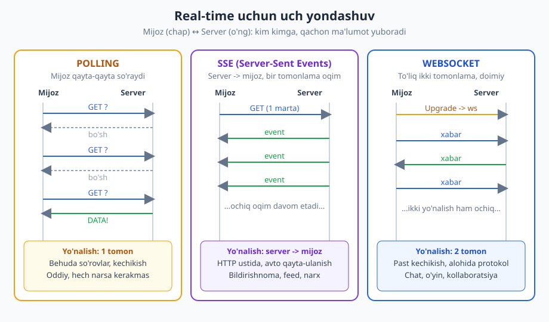
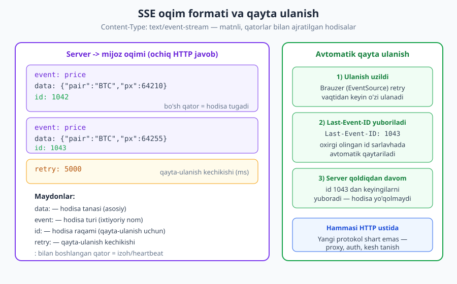
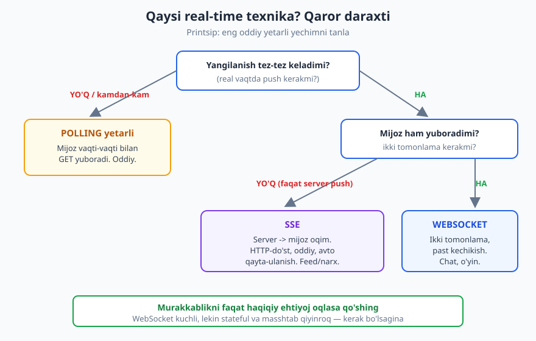

# 20 — Real-time API: WebSocket va SSE

[⬅️ Oldingi: 19 — Asinxron API va webhooklar](./19-asinxron-webhook.md) · [🏠 README](./README.md) · [Keyingi: 21 — OpenAPI spetsifikatsiyasi ➡️](./21-openapi.md)

---

> **Bu bobda:** Oddiy HTTP'da har doim mijoz so'rov boshlaydi — lekin chat, jonli narx, bildirishnoma yoki kuzatuvda **server o'zi** mijozga ma'lumot yuborishi kerak. Shu ehtiyojni qondiradigan to'rtta texnikani ko'ramiz: polling va long polling, **Server-Sent Events (SSE)** (server->mijoz bir tomonlama oqim) va **WebSocket** (to'liq ikki tomonlama doimiy ulanish). Qaysi biri qachon kerakligini, dizayn masalalarini (auth, qayta ulanish, masshtablash, heartbeat) va webhook bilan farqini o'rganamiz.
>
> **Halollik / Eslatma:** "Qaysi texnika to'g'ri" — bu **kontekstga-bog'liq trade-off**, mutlaq qoida emas. Aniq standartga tayanadigan joylar: SSE format va `text/event-stream`, `EventSource` hamda `Last-Event-ID` qayta-ulanish mexanizmi = **WHATWG HTML Living Standard** (Server-Sent Events bo'limi); WebSocket protokoli = **RFC 6455** (HTTP'dan `Upgrade` orqali); HTTP semantikasi (`Upgrade`, status kodlar) = **RFC 9110**. SSE/WebSocket spetsifikatsiyalari brauzer va platformalarda biroz farq qilishi va vaqt bilan o'zgarishi mumkin; namunalar shu standartlar semantikasiga mos.

---

## Muammo: HTTP'da har doim mijoz so'raydi

Bu kitobning katta qismida ko'rgan model sodda: **mijoz so'rov yuboradi, server javob qaytaradi**. Mijoz tashabbus qiladi, server javob beradi va aloqa tugaydi. Bu — request/response (so'rov-javob) modeli, va u veb'ning asosini tashkil qiladi.

Bu model juda ko'p narsa uchun mukammal. Lekin bir sinf ehtiyoj bor, uni u tabiiy qondira olmaydi: **server tarafida nimadir o'zgardi, va mijoz buni darhol bilishi kerak** — mijoz so'ramasa ham.

Misollar:

- **Chat** — boshqa odam xabar yozdi; ekranda darrov ko'rinishi kerak.
- **Jonli narx** — birja narxi sekundda bir necha marta o'zgaradi.
- **Bildirishnoma** — "buyurtmangiz yetkazildi", "kimdir sizni belgiladi".
- **Jonli kuzatuv** — taksi xaritada harakatlanadi; sport hisobi yangilanadi.
- **Kollaborativ tahrir** — bir hujjatni ikki kishi birga yozadi (Google Docs uslubi).

Bularning hammasida umumiy bir narsa bor: **ma'lumot serverdan keladi, lekin uning vaqtini server hal qiladi, mijoz emas.** Klassik request/response'da mijoz "menga yangilik bormi?" deb **so'rashi** kerak — server o'zi gapira olmaydi. Demak bizga server mijozga *o'zi* ma'lumot yuborishi (server push) mexanizmi kerak.

Buni hal qilishning to'rtta asosiy yo'li bor. Ularni soddadan murakkabgacha ko'rib chiqamiz.



---

## 1. Polling: mijoz qayta-qayta so'raydi

Eng sodda yechim: muammoni "yashirish" o'rniga, mijoz shunchaki **tez-tez so'raydi**.

### Short polling (oddiy polling)

Mijoz har necha sekundda bir xil GET so'rovini takrorlaydi:

```http
GET /v1/chats/42/messages?after=1088 HTTP/1.1
Host: api.example.com
Authorization: Bearer <token>

HTTP/1.1 200 OK
Content-Type: application/json

{"messages": [], "last_id": 1088}
```

Yangilik yo'q bo'lsa, javob bo'sh keladi. Mijoz 3 sekunddan keyin yana so'raydi. Va yana. Yangi xabar paydo bo'lganda, navbatdagi so'rov uni qaytaradi.

- **Kuchli:** absolyut sodda. Hech qanday yangi texnologiya, protokol yoki infratuzilma kerakmas — oddiy GET. Har qanday HTTP mijoz, har qanday proxy, har qanday keshda ishlaydi.
- **Zaif:** **behuda so'rovlar** — javoblarning ko'pi bo'sh, lekin har biri server resursini sarflaydi. Va **kechikish**: yangilik so'rovlar orasida kelsa, mijoz keyingi so'rovgacha (masalan 3 sekund) bilmaydi. Intervalni qisqartirsangiz kechikish kamayadi, lekin behuda yuk ortadi — bu ikki yomonlik orasidagi murosa.

> **Eslatma:** Pollingda **server holatsiz** (stateless) bo'lib qoladi — har so'rov mustaqil, server hech qanday ochiq ulanishni saqlamaydi. Bu uni masshtablashda eng oson texnikaga aylantiradi: oddiy REST stateless printsipi to'liq saqlanadi. Real-timeligi past, lekin operatsion jihatdan eng arzon.

### Long polling

Polling'ni sezilarli yaxshilash: server javobni **darhol qaytarmaydi**, balki yangilik chiqquncha **ushlab turadi**. Yangilik kelsa — javob qaytadi; kelmasa — server timeout (masalan 30 sekund) gacha kutadi, keyin bo'sh javob beradi va mijoz darrov qayta so'raydi.

```http
GET /v1/chats/42/messages?after=1088 HTTP/1.1
Host: api.example.com
Authorization: Bearer <token>
```

Server bu so'rovni **ochiq ushlab turadi**. Yangi xabar kelganda:

```http
HTTP/1.1 200 OK
Content-Type: application/json

{"messages": [{"id": 1089, "text": "Salom!"}], "last_id": 1089}
```

Mijoz javobni oladi, qayta ishlaydi va darhol keyingi long-poll so'rovini ochadi.

- **Kuchli:** kechikish polling'dan ancha past — yangilik kelishi bilan javob ketadi, intervalni kutmaydi. Hali ham oddiy HTTP ustida.
- **Zaif:** server endi **ochiq so'rovlarni ushlab turadi** (stateless emas; har kutayotgan mijoz uchun resurs band). Hali ham *so'rov-asoslangan* — har javobdan keyin yangi so'rov ochiladi. Bu — request/response modelini chegarasigacha cho'zish, lekin baribir push emas.

Long polling yillar davomida real-timelikning "tirikchilik" yechimi bo'lgan — to SSE va WebSocket keng tarqalmaguncha. Bugun ham fallback (zaxira) sifatida ishlatiladi.

---

## 2. Server-Sent Events (SSE): bir tomonlama oqim

SSE — request/response'dan tashqariga chiqadigan birinchi qadam, lekin **HTTP ichida qoladi**. G'oya oddiy va chiroyli: mijoz bitta GET so'rov ochadi, lekin server javobni **yopmaydi** — uning o'rniga **ochiq oqim** orqali hodisalarni birin-ketin yuboradi.

Bu **bir tomonlama**: server -> mijoz. Mijoz oqim orqali hech narsa yubora olmaydi (kerak bo'lsa, alohida oddiy POST so'rov qiladi).

### Qanday ishlaydi

Mijoz so'raydi, `Accept: text/event-stream` bilan:

```http
GET /v1/prices/stream HTTP/1.1
Host: api.example.com
Accept: text/event-stream
Authorization: Bearer <token>

HTTP/1.1 200 OK
Content-Type: text/event-stream
Cache-Control: no-cache
Connection: keep-alive
```

Javob `200 OK`, lekin **yopilmaydi**. Server vaqt o'tib hodisalarni shu ochiq tanaga yozib boradi:

```
event: price
data: {"pair": "BTC", "px": 64210}
id: 1042

event: price
data: {"pair": "BTC", "px": 64255}
id: 1043

: heartbeat

retry: 5000
```

Brauzerda mijoz tomoni juda sodda — `EventSource` API buni o'zi boshqaradi (ulanish, qayta ulanish, hodisalarni ajratish):

```
const es = new EventSource("/v1/prices/stream");
es.addEventListener("price", (e) => {
  const data = JSON.parse(e.data);   // {"pair":"BTC","px":64255}
  // narxni ekranda yangila
});
```

### SSE format — sodda, matnli

Oqim `text/event-stream` media tipida, oddiy matn. Har hodisa qatorlardan iborat, hodisalar **bo'sh qator** bilan ajratiladi:



| Maydon | Vazifa |
|---|---|
| `data:` | Hodisa tanasi — asosiy yuk. Ko'p qatorli bo'lishi mumkin (har qatori `data:`). |
| `event:` | Hodisa **turi/nomi** (ixtiyoriy). Mijoz turlarga alohida obuna bo'ladi (`price`, `alert`...). Berilmasa, standart `message` turi. |
| `id:` | Hodisa **identifikatori** — qayta ulanishda davomni ta'minlaydi (pastda). |
| `retry:` | Ulanish uzilsa, mijoz **qancha kutib** qayta ulanishi (millisekundda). |
| `:` bilan boshlangan qator | **Izoh** — e'tiborsiz qoldiriladi. Ulanishni tirik tutish (heartbeat) uchun ishlatiladi. |

> **Standart:** SSE — WHATWG HTML Living Standard'ning bir qismi (`text/event-stream` media tipi, `EventSource` interfeysi). Format ataylab oddiy: oddiy matn, qatorlar bilan. Hech qanday maxsus protokol yo'q — bu oddiy, uzun davom etadigan HTTP javobi.

### Avtomatik qayta ulanish — SSE'ning kuchli tomoni

SSE'ning eng yoqimli xususiyati: **ulanish uzilsa, qayta ulanish avtomatik**. Brauzer (`EventSource`) buni o'zi qiladi. Va `id:` maydoni tufayli **hech bir hodisa yo'qolmaydi**:

1. Server har hodisaga `id:` beradi (masalan `1043`). Brauzer oxirgi olingan `id`ni eslab qoladi.
2. Ulanish uzilsa, brauzer kutadi (`retry:` qiymati qadar), keyin **o'zi** qayta ulanadi.
3. Qayta ulanishda brauzer oxirgi `id`ni **`Last-Event-ID`** sarlavhasida avtomatik yuboradi:

```http
GET /v1/prices/stream HTTP/1.1
Host: api.example.com
Accept: text/event-stream
Last-Event-ID: 1043
```

4. Server `1043`dan **keyingi** hodisalardan davom etadi — uzilish davridagi hodisalar yo'qolmaydi (agar server ularni buferda saqlasa).

Bu mexanizm ko'p qo'lda ish talab qiladigan "qayta ulanish + qoldiqni yetkazish" mantig'ini **bepul** beradi — WebSocket'da buni o'zingiz yozasiz.

### SSE qachon ideal

SSE faqat **server -> mijoz** yuboradi, shuning uchun u **bir tomonlama push** ehtiyojlari uchun aynan to'g'ri:

- Jonli bildirishnoma va feed.
- Narx/kotirovka oqimi, ko'rsatkichlar dashboard'i.
- Uzoq operatsiya progressi (model javobi tokenma-token, jarayon foizi).
- Jonli sport hisobi, ovoz berish natijasi.

> **Trade-off:** SSE'ning kuchi — **soddalik va HTTP-mosligi**. U oddiy HTTP javobi bo'lgani uchun mavjud auth, proxy, keshlash va monitoring tizimlari uni *tanidi* — yangi protokol kerakmas. Cheklovi — **faqat bir tomonlama** (mijoz oqim orqali yubormaydi) va matnli (binar emas). Eski HTTP/1.1'da yana bir cheklov: brauzer bir domenga bir vaqtda cheklangan ulanishlar ochadi, ko'p ochiq SSE oqimi ularni "yeb qo'yishi" mumkin — HTTP/2 ostida bu muammo yo'qoladi (multiplekslash).

---

## 3. WebSocket: to'liq ikki tomonlama ulanish

WebSocket — eng kuchli, lekin eng "og'ir" yechim. U request/response modelini butunlay tark etadi va o'rniga **doimiy, ikki tomonlama** ulanish o'rnatadi: ulanish ochiq turguncha **ham mijoz, ham server** istalgan vaqtda xabar yuborishi mumkin.

### HTTP'dan upgrade

WebSocket ulanishi oddiy HTTP so'rov sifatida boshlanadi, lekin maxsus `Upgrade` sarlavhasi bilan — bu serverdan protokolni HTTP'dan WebSocket'ga **almashtirishni** so'raydi:

```http
GET /v1/chat HTTP/1.1
Host: api.example.com
Upgrade: websocket
Connection: Upgrade
Sec-WebSocket-Key: dGhlIHNhbXBsZSBub25jZQ==
Sec-WebSocket-Version: 13

HTTP/1.1 101 Switching Protocols
Upgrade: websocket
Connection: Upgrade
Sec-WebSocket-Accept: s3pPLMBiTxaQ9kYGzzhZRbK+xOo=
```

`101 Switching Protocols` (RFC 9110) — server rozilik bildirdi. Shu paytdan boshlab ulanish **endi HTTP emas**: u WebSocket protokoliga (RFC 6455) o'tdi, va ikki taraf bir-biriga **freym** (xabar) yuboradi.

URL sxemasi ham boshqacha: `ws://` (shifrlanmagan) yoki **`wss://`** (TLS ustida, shifrlangan — productionda doim shu).

```
const ws = new WebSocket("wss://api.example.com/v1/chat");
ws.onmessage = (e) => { /* serverdan xabar */ };
ws.send(JSON.stringify({type: "msg", text: "Salom!"}));  // mijozdan serverga
```

### Nima yutamiz va nimani yo'qotamiz

WebSocket bizga **ikki tomonlama, past kechikishli, doimiy** kanal beradi — chat, ko'p o'yinchili o'yin, kollaborativ tahrir uchun aynan kerakli narsa. Lekin bu kuch katta narxlar bilan keladi:

> **Trade-off:** WebSocket — **alohida protokol, HTTP semantikasidan tashqari**. Bu nimani anglatadi:
>
> - **HTTP qulayliklari yo'qoladi.** Ulanish ochilgach, oddiy metod/status kod/keshlash/content negotiation ishlamaydi — bularning hammasi HTTP semantikasi edi. Xato signalini, "status"ni, versiyalashni **o'zingiz** xabar formatida o'ylab topasiz.
> - **O'z protokolingizni yozasiz.** WebSocket faqat "freym" tashiydi; uning *ichida* nima borligi (xabar turlari, format, tartib) — sizning ishingiz. Ko'pincha JSON xabarlar ishlatiladi, lekin bu konvensiya, standart emas.
> - **Stateful — masshtab qiyin.** Har ulanish serverda **ochiq holat** band qiladi. Mijoz qaysi serverga ulangan bo'lsa, keyingi xabarlar ham shu yerga kelishi kerak. Ko'p server bo'lsa, ularni bog'lash uchun **pub/sub backplane** kerak (pastda).
> - **Proxy/infratuzilma murakkabroq.** Ba'zi korporativ proxy va load balancerlar uzun ochiq ulanishlar yoki `Upgrade` bilan to'liq tanish bo'lmaydi; sozlash kerak.

Demak WebSocket — kuchli, lekin **murakkablik narxi** bilan. Uni faqat haqiqatan ikki tomonlama past-kechikish kerak bo'lganda tanlash kerak.

---

## To'rtta texnikani taqqoslash

| Mezon | Polling | Long polling | SSE | WebSocket |
|---|---|---|---|---|
| Yo'nalish | Mijoz so'raydi | Mijoz so'raydi | Server -> mijoz (1 tomon) | Ikki tomon |
| Server push? | Yo'q (so'rov bilan) | ~Ha (ushlab turish) | Ha | Ha |
| Protokol | HTTP | HTTP | HTTP (`text/event-stream`) | WebSocket (HTTP'dan upgrade) |
| Kechikish | Yuqori (interval) | Past | Past | Eng past |
| Murakkablik | Eng past | Past | Past-o'rta | Yuqori |
| Stateful? | Yo'q | Qisman (ochiq so'rov) | Ha (ochiq oqim) | Ha (ochiq ulanish) |
| Masshtablash | Eng oson | Oson | O'rta | Qiyin (backplane) |
| Avto qayta-ulanish | — | qo'lda | **Built-in** (`Last-Event-ID`) | qo'lda |
| Binar ma'lumot | Ha | Ha | Yo'q (matn) | Ha |
| Tipik foydalanish | Kam yangilanish | Eski real-time | Feed/bildirishnoma/narx | Chat/o'yin/kollaboratsiya |

> **Eslatma:** Jadval "yaxshi -> yomon" tartibi emas — har biri **boshqa kompromis nuqtasi**. Pollingning "yuqori kechikishi" kamdan-kam yangilanadigan ma'lumot uchun muammo emas, va uning "eng oson masshtablashi" katta afzallik. WebSocket'ning kuchi faqat ikki tomonlama past kechikish kerak bo'lgandagina narxini oqlaydi.

---

## Qaysi texnikani qachon tanlash

Endi tanlash qoidasini chiqaramiz. Eng muhim printsip:

> **Eng oddiy yetarli yechimni tanlang.** Real-time texnologiyalar murakkablik (stateful ulanish, qayta ulanish, masshtab) qo'shadi. Bu murakkablikni faqat haqiqiy ehtiyoj oqlasa qo'shing.



Qaror daraxti:

1. **Yangilanish kamdan-kam yoki kechikish muhim emasmi?** -> **Polling** yetarli. Doimiy ulanish bilan ovora bo'lmang. Masalan, ob-havo har 10 daqiqada yangilansa, polling ideal.

2. **Faqat server push kerakmi (mijoz oqim orqali yubormaydi)?** -> **SSE**. Bildirishnoma, jonli feed, narx, progress — bularda mijoz faqat *oladi*. SSE oddiy, HTTP-do'st, qayta ulanish bepul.

3. **Ikki tomonlama, past kechikish kerakmi (mijoz ham tez-tez yuboradi)?** -> **WebSocket**. Chat, ko'p o'yinchili o'yin, kollaborativ tahrir — mijoz va server ikkalasi ham faol gaplashadi.

> **Anti-pattern:** "Real-time" so'zini eshitib darrov WebSocket'ga sakrash. Ko'p hollarda ehtiyoj aslida bir tomonlama (faqat server push) — bunda SSE yetarli va ancha sodda. Yana ko'proq hollarda yangilanish shunchalik tez-tez emaski, oddiy polling kifoya qiladi. WebSocket'ning stateful murakkabligini olishdan oldin, "menga rostdan ikki tomonlama past kechikish kerakmi?" deb so'rang.

> **Trade-off:** SSE vs WebSocket — eng tez-tez chalkashtiriladigan tanlov. **Faqat ko'rsatadigan** real-time (dashboard, feed, narx) uchun SSE deyarli har doim to'g'riroq tanlov: kamroq kod, HTTP infratuzilmasidan foydalanadi, qayta ulanish built-in. WebSocket'ni faqat **mijoz tez-tez yuboradigan** (chat yozish, o'yin harakati, kursor pozitsiyasi) holatda tanlang. "Ikki tomonlama bo'lsa kerak" degan noaniq his bilan emas, real yuborish-yo'nalishi bilan qaror qiling.

---

## Dizayn masalalari: real-time API'ni to'g'ri qurish

Texnikani tanlash — boshlanish. Productionda ishlaydigan real-time API quryotganda bir nechta masalani yechish kerak.

### Autentifikatsiya

Real-time ulanish ham himoyalanishi shart — ulanish ochiq qoladi degani "auth kerakmas" degani emas.

- **SSE** oddiy HTTP GET bo'lgani uchun, odatdagi [autentifikatsiya](./11-autentifikatsiya.md) ishlaydi: `Authorization: Bearer <token>` sarlavhasi. (Brauzer `EventSource` maxsus sarlavha qo'shishga to'g'ridan-to'g'ri imkon bermaydi, shuning uchun ko'p amaliyotda cookie-asosli sessiya yoki tokenni boshqa yo'l bilan beriladi.)
- **WebSocket** boshlang'ich (handshake) so'rovi HTTP bo'lgani uchun, **token o'sha handshake'da** tekshiriladi — `Upgrade` so'rovida `Authorization` sarlavhasi yoki cookie orqali. Ulanish o'rnatilgach uni qayta tekshirish qiyin, shuning uchun auth **ochilishda** qilinadi.

> **Xavfsizlik:** Tokenni **URL query'ga qo'yib yubormang** (`?token=...`). URL'lar log'larga, proxy yozuvlariga, brauzer tarixiga tushadi — token sizib chiqadi. Buni [API xavfsizligi](./13-api-xavfsizligi.md) bobida ko'rgan tamoyil sifatida eslang. Tokenni sarlavhada yoki (brauzer cheklovi tufayli SSE'da) xavfsiz cookie'da bering. Yana: uzoq yashaydigan ulanishda token **muddati tugashi** mumkin — tugash vaqtini hisobga oling (qayta ulanishda yangi token).

### Qayta ulanish

Tarmoq uziladi — mobil tunnel, Wi-Fi almashinuvi, server qayta ishga tushishi. Real-time API **uzilishni kutgan** holda loyihalanishi kerak:

- **SSE'da** bu deyarli bepul: `Last-Event-ID` + server bufer = qayta ulanishda qoldiqni davom ettirish.
- **WebSocket'da** bularning hammasini **o'zingiz** yozasiz: uzilishni aniqlash, qayta ulanish (afzalrog'i **eksponensial backoff** bilan — har urinishda kutish vaqtini oshirib, serverni "qayta ulanish bo'roni"dan saqlash), va "men oxirgi qaysi xabarni oldim?" holatini tiklash.

### Masshtablash: stateful ulanishlar muammosi

Bu real-time'ning eng qiyin qismi. SSE va WebSocket ikkalasida ham, har mijoz **bitta serverga** ochiq ulanish bilan bog'lanadi. Endi bir nechta server bo'lsa:

- Mijoz **A** server-1'ga, mijoz **B** server-2'ga ulangan.
- A yangi xabar yuboradi (chatda). Bu xabar B'ga ham yetishi kerak — lekin B boshqa serverda!

Yechim — **pub/sub backplane**: serverlar markaziy xabar shinasiga (Redis Pub/Sub, NATS, Kafka kabi) ulanadi. Server-1 xabarni shinaga e'lon qiladi; shinaga obuna bo'lgan server-2 uni oladi va o'z mijozi B'ga yuboradi.

```
Mijoz A  ──►  Server-1  ──►  [ pub/sub shina ]  ──►  Server-2  ──►  Mijoz B
```

Bu masshtablashning markaziy naqshi: **ulanish holati serverda, lekin xabar tarqatish markazlashtirilgan**. Bu mavzu tizim dizayni darajasiga chiqadi — chuqurroq [Dasturiy arxitektura](../arxitektura/README.md) kitobida ko'riladi.

> **Eslatma:** Aynan shu stateful tabiat tufayli WebSocket'ni masshtablash polling'dan ancha qiyin. Polling stateless — istalgan so'rov istalgan serverga borishi mumkin, backplane kerakmas. Bu trade-off tanlovga qaytadi: real-time qulayligi vs operatsion murakkablik.

### Heartbeat va backpressure

Ikkita yana muhim amaliy masala:

- **Heartbeat (ping/pong).** Ochiq ulanish "jonli"ligini tekshirish uchun davriy signal yuboriladi. WebSocket'da protokol darajasida ping/pong freymlari bor (RFC 6455). SSE'da heartbeat odatda davriy izoh qatori (`: ping`) sifatida yuboriladi — bu ulanishni va oraliq proxy'larni "tirik" tutadi, ular bo'sh ulanishni yopib qo'ymasin.
- **Backpressure (ortiqcha bosim).** Server xabarlarni mijoz qabul qila oladiganidan **tezroq** yuborsa nima bo'ladi? Buferlar to'ladi, xotira o'sadi. Yaxshi dizayn buni hisobga oladi: tezlikni cheklash, eski yangilanishlarni tashlash (masalan faqat oxirgi narxni saqlash), yoki mijozga "sekinla" signali. Bu [rate limiting](./14-rate-limiting.md) g'oyasining real-time varianti.

---

## Webhook bilan farqi: ikkalasi ham "server push", lekin boshqa

Avvalgi [19-bobda](./19-asinxron-webhook.md) **webhook**ni ko'rdik — u ham "server o'zi xabar yuboradi" holati. Tabiiy savol: webhook bilan SSE/WebSocket bir narsami? **Yo'q** — ular tubdan boshqa stsenariy uchun.

| Jihat | Webhook | SSE / WebSocket |
|---|---|---|
| Kim qabul qiladi | **Boshqa server** (mijoz ham server) | **Brauzer / mobil ilova** (oxirgi foydalanuvchi qurilmasi) |
| Ulanish | Ulanish **yo'q** — voqea bo'lganda yangi HTTP POST | **Doimiy ochiq** ulanish |
| Tashabbus | Server qabul qiluvchiga **POST qiladi** | Mijoz ulanishni **ochadi**, keyin server oqim yuboradi |
| Qabul qiluvchining publik manzili | Kerak (POST keladigan URL) | Kerakmas (mijoz o'zi ulanadi) |
| Tipik holat | Tizimlararo integratsiya (to'lov, CI/CD) | Foydalanuvchi UI'sini jonli yangilash |

Asosiy farq: **webhook server-to-server**, qabul qiluvchining o'zi publik manzilli server bo'lishi kerak; server unga voqea bo'lganda yangi POST yuboradi (doimiy ulanish yo'q). **SSE/WebSocket esa server-to-client**: brauzer yoki mobil ilova (publik manzili yo'q) serverga **doimiy ulanish ochadi**, va server shu ochiq kanal orqali yangilik yuboradi.

> **Eslatma:** Ko'pincha ikkalasi birga ishlatiladi. Masalan: tashqi to'lov tizimi sizning serveringizga **webhook** (server-to-server) yuboradi -> sizning serveringiz buni qayta ishlaydi -> keyin foydalanuvchining brauzeriga **SSE/WebSocket** orqali "to'lov tasdiqlandi" deb push qiladi. Webhook ichkariga, SSE/WS tashqariga (foydalanuvchiga).

---

## Asosiy g'oyalar (bobni qisqacha)

- Klassik HTTP **request/response** — mijoz so'raydi, server javob beradi. Lekin chat, jonli narx, bildirishnoma, kuzatuvda **server o'zi** push qilishi kerak. Buni qondiradigan 4 texnika bor.
- **Polling** — mijoz qayta-qayta GET. Eng sodda, stateless, eng oson masshtab; lekin behuda so'rovlar va kechikish. **Long polling** — server javobni yangilik chiqquncha ushlab turadi; kechikish past, lekin hali so'rov-asoslangan.
- **SSE (Server-Sent Events)** — server -> mijoz **bir tomonlama** oqim, `text/event-stream` ustida (`data:`/`event:`/`id:`/`retry:`). **Avtomatik qayta ulanish** (`Last-Event-ID`) built-in. HTTP-do'st, oddiy. Bildirishnoma, feed, narx, progress uchun ideal.
- **WebSocket** — to'liq **ikki tomonlama**, doimiy ulanish; HTTP'dan `Upgrade` (`101 Switching Protocols`), `ws://`/`wss://`. Past kechikish, lekin **alohida protokol** (HTTP metod/status/kesh yo'q), **stateful** (masshtab qiyin), o'z xabar formatingiz. Chat, o'yin, kollaboratsiya uchun.
- **Tanlash qoidasi:** kam yangilanish -> polling; faqat server push -> SSE; ikki tomonlama past kechikish -> WebSocket. Printsip: **eng oddiy yetarli yechim**; murakkablikni faqat haqiqiy ehtiyoj oqlaganda qo'shing.
- **Dizayn masalalari:** auth (token handshake/sarlavhada, URL'da emas), qayta ulanish (SSE bepul, WS qo'lda + backoff), masshtablash (ko'p server -> **pub/sub backplane**), heartbeat (ping/pong yoki izoh), backpressure.
- **Webhook'dan farq:** webhook = **server-to-server** (qabul qiluvchi ham publik server, ulanishsiz POST); SSE/WS = **server-to-client** (brauzer/mobil doimiy ulanish ochadi). Ko'pincha birga: webhook ichkariga, SSE/WS foydalanuvchiga.

---

## Mashqlar

### Oson

**1-mashq.** Quyidagi texnikalarni **yo'nalishi** bo'yicha tasniflang: (a) polling, (b) SSE, (c) WebSocket. Har biri uchun ayting — ma'lumot faqat server->mijozmi, faqat mijoz->servermi, yoki ikki tomonlamami?

**2-mashq.** SSE va WebSocket o'rtasidagi eng asosiy farqni bir-ikki jumlada ayting. Qaysi biri HTTP ichida qoladi, qaysi biri alohida protokolga o'tadi?

**3-mashq.** SSE oqimida `data:`, `event:`, `id:` va `retry:` maydonlarining har biri nimaga xizmat qiladi? `Last-Event-ID` sarlavhasi qachon va nima uchun yuboriladi?

### O'rta

**4-mashq.** Quyidagi har bir stsenariy uchun eng mos texnikani (polling / SSE / WebSocket) tanlang va **bir-ikki jumlada asoslang**:
- (a) Ko'p o'yinchili shaxmat ilovasi — ikki o'yinchi navbatma-navbat yuradi.
- (b) Server tomonidagi uzoq hisobni progress foizini ko'rsatish (0% -> 100%).
- (c) Har 15 daqiqada yangilanadigan valyuta kursi paneli.
- (d) Jonli sport hisobi tablosi (tomoshabin faqat ko'radi).

**5-mashq.** Quyidagi SSE oqimini o'qing va tushuntiring: brauzer bu hodisalarni qanday ajratadi, qaysi turdagi hodisalar, va ulanish uzilsa qaysi `Last-Event-ID` yuboriladi?
```
event: status
data: {"state": "processing"}
id: 7

event: status
data: {"state": "done"}
id: 8
```

**6-mashq.** Bir dasturchi "jonli bildirishnoma" funksiyasi uchun WebSocket ishlatmoqchi. Bildirishnomalar faqat serverdan keladi (foydalanuvchi hech narsa yubormaydi). Bu tanlovning muammosi nimada, va nimani tavsiya qilasiz? Polling'ning bu yerdagi kamchiligi nima edi?

### Qiyin

**7-mashq.** Real-time chat ilovasi uchun **WebSocket** dizaynini eskizlang. (a) Ulanish qanday ochiladi va auth qanday tekshiriladi? (b) Bir foydalanuvchi 1000+ bo'lib, bir nechta serverga taqsimlangan — bir foydalanuvchi yuborgan xabar boshqa serverdagi foydalanuvchiga qanday yetadi? (c) Foydalanuvchi metroga kirib aloqa uzilsa, ilova qanday tiklanadi (qayta ulanish strategiyasi)?

**8-mashq.** Jonli moliya dashboard'i quryapsiz: server sekundiga yuzlab narx yangilanishini yuboradi, mijoz faqat ko'radi. SSE va WebSocket o'rtasida tanlang va **chuqur trade-off** bering: HTTP-moslik, qayta ulanish, masshtab, binar vs matn, va backpressure (server mijozdan tez yuborsa) nuqtai nazaridan. Backpressure'ni qanday yengillashtirasiz?

**9-mashq.** Real-time API uchun **auth va qayta ulanish** strategiyasini batafsil loyihalang. (a) WebSocket'da token qayerda va qachon tekshiriladi, nima uchun URL query'ga qo'yish xavfli? (b) Ulanish 8 soat ochiq qolsa va token 1 soatda muddati tugasa, qanday hal qilasiz? (c) Uzilgandan keyin qayta ulanishda nima uchun **eksponensial backoff** kerak, va SSE'da qoldiq hodisalarni yo'qotmaslik qanday ta'minlanadi?

<details markdown="1">
<summary>Yechimlar</summary>

### 1-mashq yechimi
- (a) **Polling** — texnik jihatdan mijoz so'raydi, server javob beradi (so'rov-asoslangan); ma'lumot oqimi server->mijoz, lekin har doim **mijoz tashabbusi** bilan. Server o'zi push qila olmaydi.
- (b) **SSE** — **faqat server -> mijoz** (bir tomonlama). Mijoz oqim orqali yubora olmaydi (kerak bo'lsa alohida POST qiladi).
- (c) **WebSocket** — **ikki tomonlama**: ham mijoz, ham server istalgan vaqtda xabar yuboradi.

### 2-mashq yechimi
Eng asosiy farq — **yo'nalish va protokol**. **SSE** faqat **server->mijoz** bir tomonlama oqim va u **HTTP ichida qoladi** (oddiy `text/event-stream` javobi, hech qanday yangi protokol yo'q). **WebSocket** to'liq **ikki tomonlama** va u HTTP handshake'dan keyin **alohida protokolga** (`101 Switching Protocols` orqali, RFC 6455) o'tadi — undan keyin oddiy HTTP semantikasi (metod, status kod, kesh) ishlamaydi.

### 3-mashq yechimi
- `data:` — hodisaning **asosiy yuki** (tana); odatda JSON yoki matn.
- `event:` — hodisaning **turi/nomi** (ixtiyoriy); mijoz turlarga alohida obuna bo'lishi mumkin (`price`, `status`...). Berilmasa standart `message` turi.
- `id:` — hodisa **identifikatori**; brauzer oxirgisini eslab qoladi.
- `retry:` — ulanish uzilsa, mijoz **qancha kutib** qayta ulanishi (ms).

`Last-Event-ID` — ulanish **uzilib qayta ulanganda** brauzer (`EventSource`) tomonidan **avtomatik** yuboriladi; qiymati — oxirgi olingan `id`. Maqsadi: server shu `id`dan **keyingi** hodisalardan davom etib, uzilish davridagi hodisalarni yo'qotmaslik.

### 4-mashq yechimi
- (a) **WebSocket** — shaxmat ikki tomonlama past kechikish talab qiladi; har ikki o'yinchi yurish yuboradi (mijoz->server) va raqib yurishini oladi (server->mijoz). Real interaktivlik.
- (b) **SSE** — progress faqat **server->mijoz** bir tomonlama push; mijoz hech narsa yubormaydi, faqat foizni ko'radi. SSE oddiy va aynan to'g'ri (qayta ulanish ham bepul).
- (c) **Polling** — 15 daqiqada bir yangilanish juda kamdan-kam; doimiy ulanish ortiqcha. Har necha daqiqada GET yetarli, stateless va eng arzon.
- (d) **SSE** — tomoshabin faqat **ko'radi** (server->mijoz), hech narsa yubormaydi. SSE ideal: jonli feed, avto qayta ulanish, HTTP-do'st. (Polling ham ishlaydi, lekin "jonli" his uchun SSE yaxshiroq.)

### 5-mashq yechimi
Bu ikkita hodisa, **bo'sh qator** bilan ajratilgan. Ikkalasi ham `event: status` turida, shuning uchun brauzerda `status` turiga obuna bo'lgan tinglovchi ularni oladi. Birinchi hodisa: `data` = `{"state": "processing"}`, `id` = 7. Ikkinchi: `data` = `{"state": "done"}`, `id` = 8. Brauzer har hodisani bo'sh qatorda yakunlaydi va `data`ni JSON sifatida o'qiydi (`JSON.parse`). Ulanish uzilsa, oxirgi olingan `id` = **8** bo'lgani uchun brauzer qayta ulanishda `Last-Event-ID: 8` yuboradi — server 8 dan keyingi hodisalardan davom etadi.

### 6-mashq yechimi
**Muammo:** bildirishnoma **faqat serverdan keladi** (foydalanuvchi yubormaydi) — bu **bir tomonlama** ehtiyoj. WebSocket esa **ikki tomonlama** kanal; uni bir tomonlama ish uchun ishlatish — keraksiz murakkablik: stateful ulanish, qo'lda qayta ulanish, masshtab uchun backplane — hech biri bu sodda holatda kerak emas. **Tavsiya: SSE.** U aynan bir tomonlama server push uchun mo'ljallangan, oddiy, HTTP-do'st, va qayta ulanish (`Last-Event-ID`) built-in. **Polling'ning kamchiligi:** behuda so'rovlar (ko'pi bo'sh) va kechikish (bildirishnoma interval orasida kelsa, foydalanuvchi keyingi so'rovgacha ko'rmaydi) — bildirishnoma "darhol" bo'lishi kutilsa, polling zaif.

### 7-mashq yechimi
**Chat uchun WebSocket dizayni:**

**(a) Ulanish va auth.** Mijoz `wss://api.example.com/v1/chat`ga ulanadi. Auth **handshake (`Upgrade`) so'rovida** tekshiriladi — `Authorization: Bearer <token>` sarlavhasi yoki xavfsiz cookie orqali. Token yaroqsiz bo'lsa, server upgrade'ni rad etadi (handshake bosqichida `401`). Ulanish o'rnatilgach, har xabarni qayta-autentifikatsiya qilmaymiz; lekin avtorizatsiyani har xabarda tekshiramiz (foydalanuvchi shu xonaga yoza oladimi).

**(b) Ko'p server orqali xabar tarqatish.** Foydalanuvchi A server-1'ga, B server-2'ga ulangan. A xabar yuboradi -> server-1 uni **pub/sub backplane**'ga (masalan Redis Pub/Sub yoki NATS) tegishli xona kanaliga e'lon qiladi -> shu kanalga obuna bo'lgan server-2 xabarni oladi va o'z ulangan mijozi B'ga WebSocket orqali yuboradi. Shunday qilib ulanish holati serverlarda taqsim, lekin xabar tarqatish markazlashtirilgan.

**(c) Qayta ulanish.** Aloqa uzilsa, mijoz uzilishni aniqlaydi (heartbeat ping/pong javob bermasligi yoki socket xatosi) va **eksponensial backoff** bilan qayta urinadi (1s, 2s, 4s... cheklov bilan, server "qayta ulanish bo'ronidan" himoyalansin). Qayta ulanib bo'lgach, mijoz "men oxirgi qaysi xabar id'ini oldim?" ni serverga aytadi (yoki REST orqali yo'qolgan xabarlarni so'raydi), va server qoldiqni yetkazadi — chunki WebSocket'da SSE'dagidek built-in `Last-Event-ID` yo'q, buni o'zimiz quramiz.

### 8-mashq yechimi
Mijoz **faqat ko'radi** (yuborish yo'q) — bu bir tomonlama, demak boshlang'ich moyillik **SSE** tomon. Chuqur trade-off:

- **HTTP-moslik:** SSE oddiy HTTP javobi — mavjud auth, proxy, monitoring tanidi; WebSocket alohida protokol, infratuzilma sozlash kerak. **SSE yutadi.**
- **Qayta ulanish:** SSE'da `Last-Event-ID` + bufer = built-in qoldiq davomi; WebSocket'da qo'lda. **SSE yutadi** (uzilish tez-tez bo'ladigan mobil mijozda ayniqsa).
- **Masshtab:** ikkalasi ham stateful (ochiq oqim/ulanish) -> ko'p serverda backplane kerak. **Teng** — bu yerda SSE afzallik bermaydi.
- **Binar vs matn:** narx yangilanishi matn (JSON), binar shart emas -> SSE'ning "faqat matn" cheklovi muammo emas. **Teng/ahamiyatsiz.**
- **Backpressure:** sekundiga yuzlab yangilanish — mijoz ulgurmasligi mumkin. **Yengillashtirish:** (1) **konflyatsiya/throttling** — har tikni emas, masalan har 250ms da faqat **oxirgi** narxni yuborish (eski oraliq qiymatlar foydasiz); (2) server tomonida har mijoz uchun bufer chegarasi va to'lsa eng eski yangilanishlarni tashlash; (3) HTTP/2 multiplekslashdan foydalanish (eski HTTP/1.1 ulanish-cheklovini chetlab o'tish).

**Xulosa:** bu stsenariyda **SSE** to'g'riroq — kamroq kod, qayta ulanish bepul, HTTP-do'st; backpressure'ni narxni siyraklashtirib (konflyatsiya) hal qilamiz. WebSocket'ni faqat keyinchalik mijoz ham yuboradigan (masalan dashboardda interaktiv buyruq) bo'lsa ko'rib chiqamiz.

### 9-mashq yechimi
**(a) WebSocket'da token.** Token **handshake (`Upgrade`) so'rovida** tekshiriladi — `Authorization` sarlavhasi yoki xavfsiz cookie orqali, ulanish ochilishidan oldin. URL query'ga (`wss://.../chat?token=...`) qo'yish **xavfli**, chunki URL'lar server log'lariga, oraliq proxy yozuvlariga, va brauzer/mobil tarixiga tushadi — token o'sha yerlarda sizib chiqadi. Sarlavha/cookie esa odatda log'larda saqlanmaydi.

**(b) Uzoq ulanish + qisqa token.** Ulanish 8 soat, token 1 soat. Yechim: ulanishni token muddati tufayli **uzmaslik**; o'rniga mijoz **yangi token oladi** (refresh) va uni ulanish ustidan yuboradi (masalan maxsus `auth.refresh` xabari) — server uni qabul qilib ichki sessiya muddatini yangilaydi. Yoki: token tugashidan oldin server ogohlantiradi va mijoz yangi token bilan **toza qayta ulanadi**. Asosiy g'oya — auth holatini ulanish davomida **yangilab borish**, "bir marta ochildi, abadiy ishonchli" deb qoldirmaslik.

**(c) Eksponensial backoff va SSE qoldig'i.** Uzilgandan keyin barcha mijozlar bir vaqtda qayta ulanmoqchi bo'ladi (server qayta ishga tushgan bo'lsa, ayniqsa) — agar hammasi darhol urinsa, **"qayta ulanish bo'roni"** serverni qayta yiqitadi. **Eksponensial backoff** (1s, 2s, 4s, 8s... + ozgina tasodifiy "jitter") urinishlarni vaqt bo'ylab yoyadi va serverga nafas oldiradi. **SSE'da qoldiqni yo'qotmaslik:** server har hodisaga `id:` beradi va yaqin hodisalarni qisqa muddat **buferda** saqlaydi; mijoz qayta ulanganda brauzer `Last-Event-ID`'ni avtomatik yuboradi, server shu `id`dan keyingilarni qaytaradi — uzilish davridagi hodisalar yetkaziladi. (Bufer cheksiz emas — juda uzoq uzilishda eng eski hodisalar yo'qolishi mumkin, bu hujjatlashtirilishi kerak.)

</details>

---

[⬅️ Oldingi: 19 — Asinxron API va webhooklar](./19-asinxron-webhook.md) · [🏠 README](./README.md) · [Keyingi: 21 — OpenAPI spetsifikatsiyasi ➡️](./21-openapi.md)
