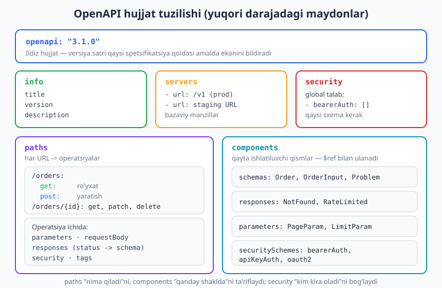
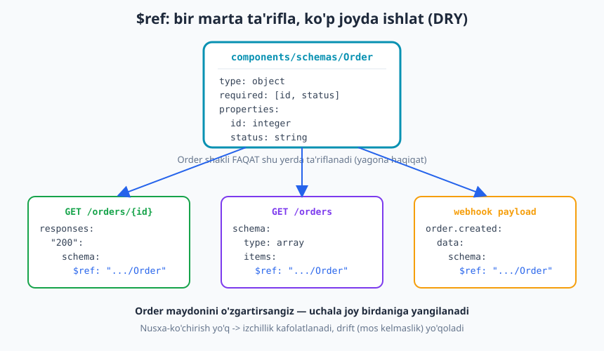
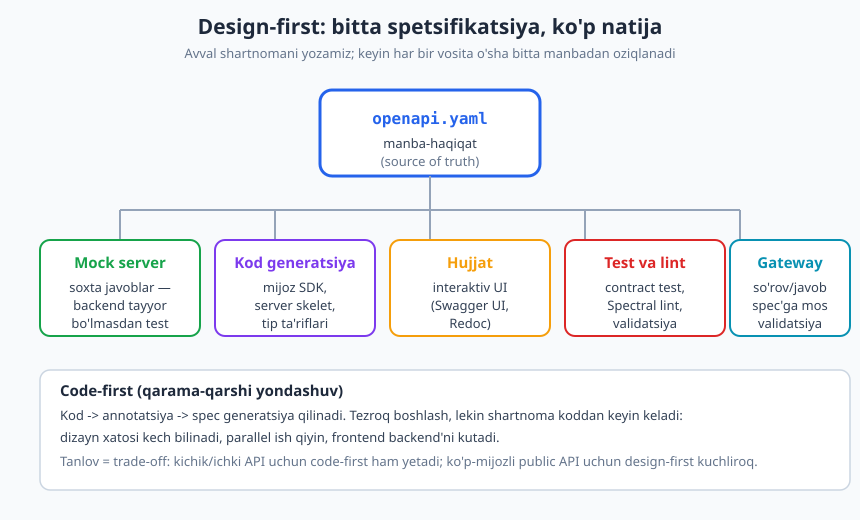

# 21 — OpenAPI spetsifikatsiyasi

[⬅️ Oldingi: 20 — Real-time API: WebSocket va SSE](./20-realtime-websocket-sse.md) · [🏠 README](./README.md) · [Keyingi: 22 — Hujjatlash va Developer Experience ➡️](./22-hujjatlash-dx.md)

---

> **Bu bobda:** API'ning shartnomasini — qaysi yo'llar bor, qanday so'rov kiradi, qanday javob chiqadi — odam ham, **mashina** ham o'qiy oladigan **rasmiy** formatda yozishni o'rganamiz. Bu format **OpenAPI** deb ataladi. Hujjat tuzilishini (`openapi`, `info`, `servers`, `paths`, `components`, `security`), operatsiya tasvirini, `$ref` bilan qayta ishlatishni, xavfsizlik sxemalarini, **design-first vs code-first** yondashuvlarini va spetsifikatsiyadan o'sib chiqadigan butun ekotizimni (mock, kod generatsiya, interaktiv hujjat, kontrakt test, lint) ko'ramiz.
>
> **Halollik / Eslatma:** Misollar **OpenAPI 3.1.0** (2021-fevral, JSON Schema 2020-12 bilan moslangan) sintaksisida; barcha YAML/JSON bloklari haqiqiy validator bilan tekshirilgan. **Eng yangi versiya — OpenAPI 3.2.0** (2025-sentabr), u tuzilgan teglar, oqimli (streaming) media-turlari va yangi OAuth oqimlarini qo'shdi. "Swagger" — bu eski 2.0 versiya nomi va atrofidagi vositalar to'plamining nomi; bugun standartning o'zi rasman "OpenAPI" deyiladi. Design-first vs code-first tanlovi **kontekstga-bog'liq trade-off**, mutlaq qoida emas.

---

## Muammo: shartnoma odamning kallasida qoladi

Tasavvur qiling, siz buyurtmalar API'sini yozdingiz. Frontend dasturchi keladi va so'raydi: "`POST /orders` qanday javob qaytaradi? Maydon nomi `total` mi `amount` mi? `status` qanaqa qiymatlar oladi? Xato bo'lsa qaysi kod keladi?"

Siz og'zaki tushuntirasiz. Ertaga yana bir dasturchi keladi — yana tushuntirasiz. Mobil jamoa keladi — uchinchi marta. Har safar tafsilot biroz boshqacha aytiladi. Kimdir noto'g'ri eslab qoladi. Kodda maydon nomi o'zgaradi — lekin hech kim buni bilmaydi, chunki shartnoma **hech qaerda yozilmagan**, faqat sizning kallangizda va tarqoq Slack xabarlarida.

Bu — klassik muammo. API'ning **shartnomasi** (kontrakti) — uning interfeysi, va'dasi — no-rasmiy, mashina o'qiy olmaydigan, tez eskiriydigan holatda yashaydi. Natijada:

- **Hujjat** qo'lda yoziladi va koddan ortda qoladi (drift).
- Har bir mijoz **mijoz kodini** (so'rov yuborish qismini) noldan, qo'lda yozadi — xato qilib.
- **Test** API shartnomaga mos kelishini avtomatik tekshira olmaydi.
- Backend tayyor bo'lmaguncha frontend **kuta** turadi — chunki nimaga tayanishini bilmaydi.

Yechim: shartnomani **bitta rasmiy, mashina-o'qiy faylda** yozish. Shu fayl manba-haqiqat (source of truth) bo'ladi, va undan hujjat, kod, test, mock — hammasi **avtomatik** o'sadi. OpenAPI aynan shu standartni beradi.

---

## OpenAPI nima

**OpenAPI Specification (OAS)** — bu REST (aniqrog'i, HTTP) API'larni tasvirlash uchun **til-mustaqil**, mashina-o'qiy standart. U bitta hujjatda butun API'ni ta'riflaydi: qaysi yo'llar (`paths`) bor, har birida qanday operatsiyalar (GET/POST/...), qanday parametr va tana (body) kiradi, qanday javob (status kod + shakl) chiqadi, va kim kira oladi (xavfsizlik).

Hujjatning o'zi **YAML** yoki **JSON**da yoziladi (ikkalasi ham bir xil ma'noni beradi — YAML odamga qulayroq, JSON mashinaga). U **dasturlash tilidan mustaqil**: bitta `openapi.yaml` Java, Python, Go yoki Node backend'ni ham, JavaScript yoki Swift mijozni ham bir xil tasvirlaydi.

### Qisqacha tarix va versiyalar

OpenAPI dastlab **Swagger** loyihasidan o'sib chiqdi. 2015-yilda standart "OpenAPI" deb qayta nomlandi (Linux Foundation ostidagi OpenAPI Initiative). Asosiy versiyalar:

| Versiya | Yili | Muhim o'zgarish |
|---|---|---|
| Swagger 2.0 | 2014 | Eski nom; hali ko'p eski API'larda uchraydi |
| OpenAPI 3.0.x | 2017 | `components`, ko'p `servers`, yaxshilangan sxemalar |
| **OpenAPI 3.1.0** | 2021 | **JSON Schema 2020-12 bilan to'liq moslandi**; `webhooks` qo'shildi |
| **OpenAPI 3.2.0** | 2025-sent | Tuzilgan teglar, oqimli media-turlar, yangi OAuth oqimlari |

Bu kitobda biz **3.1** sintaksisidan foydalanamiz, chunki u eng keng qo'llab-quvvatlanadi va JSON Schema bilan to'liq mos (sxemalarni yozish yengilroq). 3.2 — eng yangisi, lekin asosiy tushunchalar bir xil.

> **Eslatma:** OpenAPI **REST/HTTP** uslubidagi API'lar uchun. GraphQL'ning o'z sxema tili bor (SDL — [17-bob](./17-graphql.md)), gRPC'da `.proto` fayl ([18-bob](./18-grpc.md)), event-driven (hodisaga asoslangan) API'larda esa **AsyncAPI** ishlatiladi — bu bobning oxirida ko'ramiz.

---

## Hujjat tuzilishi: yuqori darajadagi maydonlar

Har bir OpenAPI hujjati bir nechta yuqori darajadagi maydondan iborat. Ularni avval xaritada ko'rib chiqamiz, keyin to'liq misolda.



| Maydon | Vazifasi |
|---|---|
| `openapi` | Spetsifikatsiya versiyasi (masalan `"3.1.0"`) — qaysi qoidalar amalda |
| `info` | API metama'lumoti: `title`, `version`, `description` |
| `servers` | Bazaviy URL'lar (production, staging) |
| `paths` | Har bir URL yo'li -> undagi operatsiyalar (GET/POST/...) |
| `components` | Qayta ishlatiluvchi qismlar: `schemas`, `responses`, `parameters`, `securitySchemes` |
| `security` | Global xavfsizlik talabi (qaysi sxema kerak) |
| `tags` | Operatsiyalarni guruhlash (hujjatda bo'limlar) |
| `webhooks` | (3.1) Server jo'natadigan chiquvchi hodisalar |

Asosiy ajratish shunday: **`paths`** "API nima qiladi"ni, **`components`** "ma'lumot qanday shaklda"ni, **`security`** esa "kim kira oladi"ni ta'riflaydi.

### To'liq kichik misol

Quyida — kichik, lekin **to'liq va valid** OpenAPI hujjat. Buyurtmalar resursi uchun ro'yxat, yaratish va bitta buyurtmani o'qish. Diqqat bilan o'qing: bu butun bobning skeleti.

```yaml
openapi: "3.1.0"
info:
  title: Buyurtmalar API
  version: "1.0.0"
  description: Onlayn do'kon buyurtmalarini boshqarish uchun kichik REST API.
servers:
  - url: https://api.example.com/v1
    description: Ishlab chiqarish (production)
  - url: https://staging.example.com/v1
    description: Sinov muhiti (staging)
security:
  - bearerAuth: []
tags:
  - name: orders
    description: Buyurtmalar bilan ishlash
paths:
  /orders:
    get:
      tags: [orders]
      summary: Buyurtmalar ro'yxati
      operationId: listOrders
      parameters:
        - name: status
          in: query
          required: false
          schema:
            type: string
            enum: [pending, paid, shipped, cancelled]
      responses:
        "200":
          description: Buyurtmalar ro'yxati
          content:
            application/json:
              schema:
                type: array
                items:
                  $ref: "#/components/schemas/Order"
    post:
      tags: [orders]
      summary: Yangi buyurtma yaratish
      operationId: createOrder
      requestBody:
        required: true
        content:
          application/json:
            schema:
              $ref: "#/components/schemas/OrderInput"
      responses:
        "201":
          description: Buyurtma yaratildi
          headers:
            Location:
              description: Yangi buyurtma manzili
              schema:
                type: string
          content:
            application/json:
              schema:
                $ref: "#/components/schemas/Order"
        "422":
          $ref: "#/components/responses/ValidationError"
  /orders/{orderId}:
    parameters:
      - name: orderId
        in: path
        required: true
        schema:
          type: integer
          format: int64
    get:
      tags: [orders]
      summary: Bitta buyurtma
      operationId: getOrder
      responses:
        "200":
          description: Buyurtma topildi
          content:
            application/json:
              schema:
                $ref: "#/components/schemas/Order"
        "404":
          $ref: "#/components/responses/NotFound"
components:
  securitySchemes:
    bearerAuth:
      type: http
      scheme: bearer
      bearerFormat: JWT
  schemas:
    Order:
      type: object
      required: [id, status, total, created_at]
      properties:
        id:
          type: integer
          format: int64
          examples: [1001]
        status:
          type: string
          enum: [pending, paid, shipped, cancelled]
        total:
          type: number
        created_at:
          type: string
          format: date-time
    OrderInput:
      type: object
      required: [item_id, quantity]
      properties:
        item_id:
          type: integer
        quantity:
          type: integer
          minimum: 1
    Problem:
      type: object
      properties:
        type:
          type: string
        title:
          type: string
        status:
          type: integer
        detail:
          type: string
  responses:
    NotFound:
      description: Resurs topilmadi
      content:
        application/problem+json:
          schema:
            $ref: "#/components/schemas/Problem"
    ValidationError:
      description: Validatsiya xatosi
      content:
        application/problem+json:
          schema:
            $ref: "#/components/schemas/Problem"
```

E'tibor bering: status kod (`201 Created` + `Location` sarlavhasi yaratishda, `422` validatsiya xatosida, `404` topilmaganda) — hammasi **RFC 9110** semantikasiga mos. OpenAPI faqat shakl emas, **to'g'ri HTTP semantikasini** ham hujjatlashtiradi (status kodlar uchun [03-bob](./03-http-status-kodlari.md)).

### Bir xil narsa JSON'da

OpenAPI YAML va JSON o'rtasida bir xil. Yuqoridagi `getOrder` operatsiyasining JSON ko'rinishi:

```json
{
  "openapi": "3.1.0",
  "info": { "title": "Buyurtmalar API", "version": "1.0.0" },
  "paths": {
    "/orders/{orderId}": {
      "get": {
        "operationId": "getOrder",
        "responses": {
          "200": {
            "description": "Buyurtma topildi",
            "content": {
              "application/json": {
                "schema": { "$ref": "#/components/schemas/Order" }
              }
            }
          }
        }
      }
    }
  }
}
```

Amalda ko'pchilik **YAML**ni tanlaydi — kamroq qavs, izoh yozish mumkin, o'qish oson. Vositalar ikkalasini ham tushunadi.

---

## Operatsiya tasviri: parametr, tana, javob

Har bir yo'l (`path`) ostida bir yoki bir nechta **operatsiya** bo'ladi — HTTP metodi bilan kalitlangan (`get`, `post`, `put`, `patch`, `delete`). Operatsiya uchta asosiy qismdan iborat:

1. **`parameters`** — kiruvchi parametrlar. Har biri `in` bilan joyi ko'rsatiladi:
   - `in: path` — URL ichidagi o'zgaruvchi (`/orders/{orderId}`), har doim `required: true`.
   - `in: query` — so'rov satridagi (`?status=paid`), odatda ixtiyoriy.
   - `in: header` — maxsus sarlavha (`If-Match`, `X-Request-Id`).
2. **`requestBody`** — so'rov tanasi (POST/PUT/PATCH'da), `content` ostida media-tur va sxema bilan.
3. **`responses`** — status kod -> tavsif + `content` (media-tur -> sxema). Har bir mumkin javobni ro'yxatlash kerak.

Quyida — `PATCH` operatsiyasi, optimistik parallellik uchun `If-Match` sarlavhasi va `409`/`412` xato javoblari bilan (parallellik uchun [15-bob](./15-idempotentlik-parallellik.md)):

```yaml
paths:
  /orders/{orderId}:
    patch:
      summary: Buyurtma holatini yangilash
      operationId: updateOrder
      parameters:
        - name: orderId
          in: path
          required: true
          schema:
            type: integer
        - name: If-Match
          in: header
          required: false
          description: Optimistik parallellik uchun ETag qiymati
          schema:
            type: string
      requestBody:
        required: true
        content:
          application/json:
            schema:
              type: object
              properties:
                status:
                  type: string
                  enum: [paid, shipped, cancelled]
      responses:
        "200":
          description: Yangilandi
          content:
            application/json:
              schema:
                $ref: "#/components/schemas/Order"
        "409":
          description: Konflikt (holat o'tishi mumkin emas)
        "412":
          description: Precondition Failed (ETag mos kelmadi)
```

Bu OpenAPI fragmenti quyidagi haqiqiy HTTP almashinuvini tasvirlaydi:

```http
PATCH /v1/orders/1001 HTTP/1.1
Host: api.example.com
Content-Type: application/json
If-Match: "a1b2c3"
Authorization: Bearer <token>

{"status": "shipped"}

HTTP/1.1 200 OK
Content-Type: application/json
ETag: "d4e5f6"

{"id": 1001, "status": "shipped", "total": 42.5, "created_at": "2026-06-16T09:00:00Z"}
```

> **Eslatma:** `operationId` — har operatsiyaning butun hujjat bo'yicha **yagona** identifikatori. Kod generatsiya qiluvchi vositalar undan funksiya nomi yasaydi (masalan `listOrders()`, `createOrder()`). Shuning uchun uni mazmunli va izchil yozing.

---

## Schema va `$ref`: bir marta ta'rifla, ko'p joyda ishlat

Ma'lumotning shakli **JSON Schema** bilan ta'riflanadi: `type`, `properties`, `required`, `enum`, `format`, `minimum` va h.k. OpenAPI 3.1 to'g'ridan-to'g'ri JSON Schema 2020-12 lug'atini ishlatadi.

Eng muhim g'oya — **`$ref`** (reference, havola). Bir sxemani `components/schemas` ostida **bir marta** ta'riflab, keyin uni hamma joyda `$ref` bilan chaqirasiz. Bu — DRY (Don't Repeat Yourself) tamoyilining OpenAPI'dagi ko'rinishi.



Masalan, `Address` (manzil) sxemasi ham hisob-kitob manzili, ham yetkazib berish manzili sifatida ishlatiladi:

```yaml
components:
  schemas:
    Address:
      type: object
      required: [city, street]
      properties:
        city:
          type: string
        street:
          type: string
        zip:
          type: string
    Customer:
      type: object
      required: [id, name]
      properties:
        id:
          type: integer
        name:
          type: string
        billing_address:
          $ref: "#/components/schemas/Address"
        shipping_address:
          $ref: "#/components/schemas/Address"
```

`#/components/schemas/Address` — bu **JSON Pointer**: `#` hujjat ildizi, keyin maydonlar bo'yicha pastga. `$ref` ni nafaqat sxemalarga, balki `responses`, `parameters`, `requestBody`ga ham qo'llash mumkin (yuqoridagi to'liq misolda `NotFound` va `ValidationError` javoblari shunday qayta ishlatildi).

> **Trade-off:** `$ref` — izchillik va saqlash uchun zo'r, lekin haddan tashqari chuqur ichma-ich `$ref`lar hujjatni o'qishni qiyinlashtiradi. Mantiqiy mustaqil qismlarni komponentga chiqaring; bir martalik kichik shaklni o'rinda (inline) qoldiring. Sxemalarni `$ref` bilan ulashning yana bir foydasi — maydonni **bitta joyda** o'zgartirsangiz, barcha foydalanish joylari birdaniga yangilanadi (drift yo'q).

`$ref`ni boshqa **faylga** ham yo'naltirish mumkin (`$ref: "./common/address.yaml#/Address"`) — katta API'larda hujjatni bir nechta faylga bo'lib, umumiy qismlarni ulashish uchun.

---

## Xavfsizlik sxemalari (security schemes)

API kim kira olishini ham tasvirlash kerak. OpenAPI'da bu ikki bosqichda bo'ladi:

1. **`components/securitySchemes`** — sxemalarni ta'riflash (qanday auth bor).
2. **`security`** — ularni global yoki operatsiya darajasida **biriktirish** (qaysi joyda qaysi sxema kerak).

To'rtta `type` mavjud (autentifikatsiya uchun [11-bob](./11-autentifikatsiya.md)):

| `type` | Ma'nosi | Misol |
|---|---|---|
| `apiKey` | Sarlavha/query/cookie'dagi maxfiy kalit | `X-API-Key: abc123` |
| `http` | HTTP auth sxemasi (`bearer`, `basic`) | `Authorization: Bearer <JWT>` |
| `oauth2` | OAuth 2.0 oqimlari (grant turlari) | Authorization Code + PKCE |
| `openIdConnect` | OIDC kashfiyot URL'i orqali | `.well-known/openid-configuration` |

```yaml
components:
  securitySchemes:
    apiKeyAuth:
      type: apiKey
      in: header
      name: X-API-Key
    bearerAuth:
      type: http
      scheme: bearer
      bearerFormat: JWT
    basicAuth:
      type: http
      scheme: basic
    oauth2:
      type: oauth2
      flows:
        authorizationCode:
          authorizationUrl: https://auth.example.com/authorize
          tokenUrl: https://auth.example.com/token
          scopes:
            orders:read: Buyurtmalarni o'qish
            orders:write: Buyurtmalarni o'zgartirish
    oidc:
      type: openIdConnect
      openIdConnectUrl: https://auth.example.com/.well-known/openid-configuration
security:
  - bearerAuth: []
```

> **Standart:** OAuth 2.0 = **RFC 6749**; Bearer token = **RFC 6750**; JWT formati = **RFC 7519**. **OAuth 2.1** (hali IETF draft, yakuniy RFC emas) yangi mijozlar uchun **PKCE'ni majburiy** qiladi, **implicit** va **password (ROPC)** grant turlarini olib tashlaydi. Shuning uchun yangi API'da xavfsizlik sxemasi sifatida `authorizationCode` (PKCE bilan) yoki `clientCredentials` (servis-servis) oqimini tanlang, `implicit`/`password`ni emas.

`security` ni **operatsiya darajasida** ham qo'llab, global qoidani **ustidan yozish** mumkin. Bo'sh `security: []` — "bu yo'lda auth shart emas" degani:

```yaml
paths:
  /public/health:
    get:
      summary: Sog'liq tekshiruvi (auth shart emas)
      security: []
      responses:
        "200":
          description: OK
  /orders:
    post:
      summary: Buyurtma yaratish (oauth2 scope kerak)
      security:
        - oauth2: [orders:write]
      responses:
        "201":
          description: Yaratildi
```

Bu yerda `/public/health` ochiq, `/orders` POST esa `orders:write` scope'ini talab qiladi. `security` ro'yxatidagi har bir element — **VA** emas **YOKI** mantiqi: bir nechta sxemani sanasangiz, ulardan **birortasi** yetadi.

---

## Design-first vs code-first

Spetsifikatsiyani qachon yozish — ikkita yondashuv bor, va bu juda muhim qaror.

### Design-first (spec avval)

Avval `openapi.yaml` ni yozasiz — **kod yozishdan oldin**. Shartnoma kelishiladi, keyin har kim shu shartnomaga qarab ishlaydi.



**Afzalliklari:**

- **Parallel ish.** Spec tasdiqlangach, frontend va backend **bir vaqtda** ishlay boshlaydi — frontend mock serverga tayanadi, backend tayyor bo'lishini kutmaydi.
- **Erta kelishuv.** Dizayn xatosi (chalkash maydon nomi, noto'g'ri status kod) **kod yozilmasdan oldin** ko'rinadi — tuzatish arzon.
- **Kelishuv hujjati.** Spec — jamoalar o'rtasidagi rasmiy va'da (API nima ekanligi haqida [01-bob](./01-api-nima.md)).

### Code-first (koddan generatsiya)

Avval kodni (kontrollerlar, annotatsiyalar) yozasiz; spec esa **koddan avtomatik generatsiya** qilinadi (Java'da annotatsiyalardan, Pythonda dekoratorlardan va h.k.).

**Afzalliklari:**

- **Tezroq boshlash** — alohida spec faylni qo'lda saqlash kerak emas.
- Spec **har doim kod bilan mos** (chunki undan chiqadi) — drift kamroq.

**Kamchiliklari:** dizayn xatosi kech (kod yozilgandan keyin) bilinadi; parallel ish qiyinroq; spec sifatining koddan oshib ketmaydi.

| Mezon | Design-first | Code-first |
|---|---|---|
| Qachon spec | Kod yozishdan oldin | Koddan keyin generatsiya |
| Parallel ish | Kuchli (mock bilan) | Cheklangan |
| Dizayn xatosi | Erta ko'rinadi | Kech ko'rinadi |
| Drift xavfi | Bor (qo'lda sinxron) | Kam (avtomatik) |
| Kim uchun | Public/ko'p-mijozli API | Ichki/kichik API, tez prototip |

> **Trade-off:** mutlaq g'olib yo'q. Ko'p-mijozli yoki public API'da, bir nechta jamoa parallel ishlaganda — **design-first** kuchliroq (shartnoma birinchi). Bitta jamoa boshqaradigan kichik ichki servisda yoki tez prototipda — **code-first** ham yetarli. Ko'pincha amalda gibrid: design-first bilan boshlab, keyin spec'ni manba qilib koddan validatsiya qilish.

---

## Ekotizim: bitta spec'dan nima o'sadi

OpenAPI'ning haqiqiy kuchi — spetsifikatsiyaning o'zi emas, balki undan **avtomatik** o'sadigan butun ekotizim. Bitta `openapi.yaml` quyidagilarni "oziqlantiradi":

| Natija | Misol vositalar | Foydasi |
|---|---|---|
| **Interaktiv hujjat** | Swagger UI, Redoc, Stoplight | Brauzerda o'qiladigan, sinab ko'riladigan hujjat |
| **Mijoz/server kod** | OpenAPI Generator, openapi-typescript | SDK va tip ta'riflarini qo'lda yozish shart emas |
| **Mock server** | Prism, Microcks | Backend tayyor bo'lmasdan soxta javob |
| **Kontrakt test** | Schemathesis, Dredd | API spec'ga mos ishlashini tekshirish |
| **Lint / stil** | Spectral | Nomlash, izchillik, best-practice qoidalari |
| **So'rov validatsiya** | Gateway plaginlari | Kiruvchi so'rovni spec'ga qarab tekshirish |

Bir necha muhim nuqtani ajratamiz:

- **Interaktiv hujjat** — bitta spec'dan **Swagger UI** yoki **Redoc** chiroyli, sinab ko'rsa bo'ladigan sahifa yasaydi. Bu Developer Experience (DX)ning poydevori — [22-bob](./22-hujjatlash-dx.md) buni chuqurroq ochadi.
- **Kontrakt test** — API'ning haqiqiy javobi spec va'dasiga mos kelishini avtomatik sinaydi. Mijoz va server bir xil shartnomaga sodiq qolishini kafolatlaydi ([24-bob](./24-testlash-contract.md)).
- **Linting (Spectral)** — spec'ning o'zining sifatini tekshiradi: har operatsiyada `description` bormi, nomlash izchilmi, xavfsizlik biriktirilganmi. CI'da ishga tushiriladi.

> **Best practice:** spec'ni **manba-haqiqat** (single source of truth) qiling va uni **CI quvuriga** joylang — har bir o'zgarishda avtomatik validatsiya + lint + (mavjud bo'lsa) kontrakt test ishlasin. Shunda hujjat hech qachon eskirmaydi, mijozlar va kod bir xil va'daga tayanadi.

---

## AsyncAPI: hodisalar uchun ekvivalent

OpenAPI **so'rov-javob** (request/response) uslubidagi HTTP API'lar uchun. Lekin ko'p tizimlar **hodisaga asoslangan** (event-driven): message broker orqali xabar yuborish, webhook, Kafka mavzulari, MQTT. Bunday "kim qaysi kanalga qanday xabar yuboradi/oladi"ni tasvirlash uchun alohida standart bor — **AsyncAPI** (asinxron API va webhooklar uchun [19-bob](./19-asinxron-webhook.md)).

AsyncAPI OpenAPI'ga ataylab o'xshatilgan, lekin u **kanallar** (channels) va **operatsiyalar** (yuborish/qabul qilish) atrofida qurilgan. AsyncAPI 3.0 (2023-noyabr) operatsiyalarni kanallardan ajratdi; eng yangi versiya — 3.1.0 (2026-yanvar).

```yaml
asyncapi: "3.0.0"
info:
  title: Buyurtma hodisalari
  version: "1.0.0"
channels:
  orderCreated:
    address: order.created
    messages:
      orderCreatedMessage:
        payload:
          type: object
          properties:
            id:
              type: integer
            status:
              type: string
operations:
  onOrderCreated:
    action: receive
    channel:
      $ref: "#/channels/orderCreated"
```

> **Eslatma:** REST uchun OpenAPI, event-driven uchun AsyncAPI — ikkalasini bir loyihada birga ishlatish odatiy. Asosiy g'oya bir xil: shartnomani **rasmiy, mashina-o'qiy** faylda saqlash.

---

## Asosiy g'oyalar (bobni qisqacha)

- **OpenAPI** — REST/HTTP API'larni til-mustaqil, mashina-o'qiy tasvirlash standarti (YAML yoki JSON). Eski nomi Swagger 2.0; hozir 3.1 keng ishlatiladi, 3.2.0 (2025-sent) eng yangisi.
- **Hujjat tuzilishi:** `openapi`, `info`, `servers`, `paths` (operatsiyalar), `components` (qayta ishlatiluvchi), `security`, `tags`. `paths` = "nima qiladi", `components` = "qanday shaklda", `security` = "kim kira oladi".
- **Operatsiya** = `parameters` (path/query/header) + `requestBody` + `responses` (status kod -> sxema). Status kodlar RFC 9110 semantikasiga mos bo'lishi kerak.
- **`$ref`** — bir marta ta'riflab, ko'p joyda ishlatish (DRY). Drift yo'qoladi, izchillik kafolatlanadi.
- **Xavfsizlik sxemalari**: `apiKey`, `http` (bearer/basic), `oauth2`, `openIdConnect` — komponentda ta'riflanib, `security` orqali biriktiriladi. OAuth 2.1 yo'nalishi: PKCE majburiy, implicit/password olib tashlangan.
- **Design-first** (spec avval, parallel ish, erta kelishuv) vs **code-first** (koddan generatsiya, tez boshlash) — kontekstga-bog'liq trade-off.
- **Ekotizim:** bitta spec'dan interaktiv hujjat, mijoz/server kod, mock server, kontrakt test, lint o'sadi. Spec'ni manba-haqiqat qiling va CI'da validatsiya qiling.
- **AsyncAPI** — event-driven API'lar uchun OpenAPI ekvivalenti.

## Mashqlar

### Oson

**1-mashq.** Yuqoridagi to'liq OpenAPI misolida quyidagilarni toping va ayting: (a) API nechta `server`ga ega? (b) `/orders` `POST` muvaffaqiyatli bo'lganda qaysi status kod qaytadi va qaysi sarlavha qo'shiladi? (c) `Order` sxemasida qaysi maydonlar `required`?

**2-mashq.** Quyidagi maydonlardan har biri OpenAPI hujjatining qaysi yuqori darajadagi bo'limiga tegishli ekanligini ayting: `title`, qayta ishlatiluvchi `Order` sxemasi, `/orders/{orderId}` yo'li, production URL, `bearerAuth` ta'rifi.

### O'rta

**3-mashq.** `GET /products/{productId}` operatsiyasi uchun OpenAPI fragmenti yozing: `productId` path parametri (integer), `200` javobi `Product` sxemasiga `$ref` qiladi, `404` javobi ham bo'lsin. `Product` sxemasini `components` ostida ta'riflang (`id`, `name`, `price`).

**4-mashq.** `Money` deb nomlangan qayta ishlatiluvchi sxema yozing (`amount: number`, `currency: string`) va uni `Order` sxemasi ichida `total` maydoni sifatida `$ref` orqali ishlating. Nega bu nusxa-ko'chirishdan yaxshiroq — bir jumlada tushuntiring.

**5-mashq.** API'ga **API kalit** (header'da `X-API-Key`) bilan auth qo'shing: `securitySchemes` da sxemani ta'riflang va uni global `security` orqali biriktiring. Keyin bitta ochiq (`/status`) endpoint qo'shing — unda auth shart bo'lmasligi kerak.

### Qiyin

**6-mashq.** `tasks` (vazifalar) resursi uchun **to'liq CRUD** OpenAPI fragmentini yozing: `GET /tasks` (ro'yxat), `POST /tasks` (yaratish, `201` + `Location`), `GET /tasks/{id}`, `PATCH /tasks/{id}`, `DELETE /tasks/{id}` (`204`). `Task` va `TaskInput` sxemalarini `components`da ta'riflang, javoblarda `$ref` ishlating. Har bir operatsiyaga `operationId` bering.

**7-mashq.** Bir jamoa yangi public to'lov API'sini boshlamoqchi. Frontend, mobil va uchta tashqi hamkor jamoasi parallel ishlashi kerak. **Design-first** mi **code-first** mi tanlang va kamida uchta sabab bilan asoslang. Tanlovingizdan kelib chiqib, spec tayyor bo'lgach **qaysi vositalar** (mock, codegen, ...) qanday foyda berishini ayting.

**8-mashq.** Bitta `openapi.yaml` mavjud. Undan **nimalar generatsiya qilinishi mumkin**ligini sanab bering (kamida 4 ta), har birining kim uchun foydali ekanini ayting. Keyin: nega spec'ni CI quvuriga qo'yish (validatsiya + lint) muhim — drift muammosi orqali tushuntiring.

<details markdown="1">
<summary>Yechimlar</summary>

### 1-mashq yechimi
(a) **Ikkita** server: `https://api.example.com/v1` (production) va `https://staging.example.com/v1` (staging). (b) `POST /orders` muvaffaqiyatli bo'lganda **`201 Created`** qaytadi va **`Location`** sarlavhasi yangi buyurtma manzilini ko'rsatadi — bu RFC 9110 ning resurs yaratish konvensiyasi. (c) `Order` da `required`: **`id`, `status`, `total`, `created_at`**.

### 2-mashq yechimi
- `title` -> **`info`** bo'limi.
- qayta ishlatiluvchi `Order` sxemasi -> **`components/schemas`**.
- `/orders/{orderId}` yo'li -> **`paths`**.
- production URL -> **`servers`**.
- `bearerAuth` ta'rifi -> **`components/securitySchemes`** (va `security` orqali biriktiriladi).

### 3-mashq yechimi

```yaml
paths:
  /products/{productId}:
    get:
      summary: Bitta mahsulot
      operationId: getProduct
      parameters:
        - name: productId
          in: path
          required: true
          schema:
            type: integer
      responses:
        "200":
          description: Mahsulot topildi
          content:
            application/json:
              schema:
                $ref: "#/components/schemas/Product"
        "404":
          description: Mahsulot topilmadi
components:
  schemas:
    Product:
      type: object
      required: [id, name, price]
      properties:
        id:
          type: integer
        name:
          type: string
        price:
          type: number
```

### 4-mashq yechimi

```yaml
components:
  schemas:
    Money:
      type: object
      required: [amount, currency]
      properties:
        amount:
          type: number
        currency:
          type: string
    Order:
      type: object
      required: [id, total]
      properties:
        id:
          type: integer
        total:
          $ref: "#/components/schemas/Money"
```

`Money` ni `$ref` bilan ishlatish nusxa-ko'chirishdan yaxshiroq, chunki pul shaklini (masalan `currency`ga `enum` qo'shish) **bitta joyda** o'zgartirsangiz, uni ishlatadigan barcha maydonlar birdaniga yangilanadi — drift bo'lmaydi.

### 5-mashq yechimi

```yaml
paths:
  /status:
    get:
      summary: API holati (auth shart emas)
      security: []
      responses:
        "200":
          description: OK
components:
  securitySchemes:
    apiKeyAuth:
      type: apiKey
      in: header
      name: X-API-Key
security:
  - apiKeyAuth: []
```

Global `security` API kalitini hamma joyga qo'llaydi; `/status` operatsiyasidagi `security: []` esa uni o'sha yo'l uchun **bekor qiladi** (auth shart emas).

### 6-mashq yechimi

```yaml
paths:
  /tasks:
    get:
      summary: Vazifalar ro'yxati
      operationId: listTasks
      responses:
        "200":
          description: Ro'yxat
          content:
            application/json:
              schema:
                type: array
                items:
                  $ref: "#/components/schemas/Task"
    post:
      summary: Vazifa yaratish
      operationId: createTask
      requestBody:
        required: true
        content:
          application/json:
            schema:
              $ref: "#/components/schemas/TaskInput"
      responses:
        "201":
          description: Yaratildi
          headers:
            Location:
              schema:
                type: string
          content:
            application/json:
              schema:
                $ref: "#/components/schemas/Task"
  /tasks/{id}:
    parameters:
      - name: id
        in: path
        required: true
        schema:
          type: integer
    get:
      summary: Bitta vazifa
      operationId: getTask
      responses:
        "200":
          description: Topildi
          content:
            application/json:
              schema:
                $ref: "#/components/schemas/Task"
        "404":
          description: Topilmadi
    patch:
      summary: Vazifani yangilash
      operationId: updateTask
      requestBody:
        required: true
        content:
          application/json:
            schema:
              $ref: "#/components/schemas/TaskInput"
      responses:
        "200":
          description: Yangilandi
          content:
            application/json:
              schema:
                $ref: "#/components/schemas/Task"
    delete:
      summary: Vazifani o'chirish
      operationId: deleteTask
      responses:
        "204":
          description: O'chirildi (tana yo'q)
components:
  schemas:
    Task:
      type: object
      required: [id, title, done]
      properties:
        id:
          type: integer
        title:
          type: string
        done:
          type: boolean
    TaskInput:
      type: object
      required: [title]
      properties:
        title:
          type: string
        done:
          type: boolean
```

Diqqat: `POST` -> `201` + `Location`, `DELETE` -> `204` (tana yo'q) — RFC 9110 ga mos. Yaratish/yangilash uchun alohida `TaskInput` (mijoz beradigan maydonlar) va to'liq `Task` (server qaytaradigan, `id` bilan) ishlatildi — bu yaxshi amaliyot.

### 7-mashq yechimi
**Design-first** tanlanadi. Sabablar: (1) **Parallel ish** — frontend, mobil va uchta hamkor jamoasi backend tayyor bo'lishini kutmasdan, kelishilgan spec'ga (va mock serverga) tayanib bir vaqtda ishlay oladi. (2) **Erta kelishuv** — to'lov API'sida shartnoma kritik; xato (chalkash maydon, noto'g'ri status kod) kod yozilmasdan, arzon bosqichda tuzatiladi. (3) **Tashqi hamkorlar uchun barqaror shartnoma** — public API'da spec rasmiy va'da, undan ortga qaytish qiyin; oldindan kelishish chalkashlikni oldini oladi.

Spec tayyor bo'lgach: **mock server** (Prism) frontend/mobil/hamkorlarga darhol sinash imkonini beradi; **kod generatsiya** har bir mijoz uchun SDK va tiplarni qo'lda yozish zaruratini olib tashlaydi; **interaktiv hujjat** (Redoc/Swagger UI) hamkorlarga o'zini-o'zi tushuntiruvchi qo'llanma beradi; **kontrakt test** haqiqiy backend spec va'dasiga sodiq qolishini kafolatlaydi.

### 8-mashq yechimi
Bitta `openapi.yaml`dan generatsiya qilinadigan narsalar:

1. **Interaktiv hujjat** (Swagger UI / Redoc) — mijoz dasturchilari uchun o'qiladigan, sinab ko'riladigan qo'llanma.
2. **Mijoz SDK / tip ta'riflari** (OpenAPI Generator) — har bir til uchun mijoz kodi; qo'lda yozish va xato kamayadi.
3. **Server skelet** — kontrollerlar bo'sh shabloni; backend dasturchisi faqat mantiqini to'ldiradi.
4. **Mock server** (Prism) — soxta javoblar; parallel ishlab chiqish.
5. **Kontrakt test** (Schemathesis/Dredd) — haqiqiy API spec'ga mosligini avtomatik tekshirish.

**Nega CI'ga qo'yish muhim:** agar spec qo'lda saqlansa va kod alohida o'zgarsa, ular vaqt o'tib **mos kelmay qoladi** (drift) — hujjat yolg'on bo'ladi, generatsiyalangan SDK noto'g'ri ishlaydi, mijozlar adashadi. Spec'ni CI quvuriga qo'yish (har push'da **validatsiya** spec o'zining grammatikasiga to'g'ri ekanini, **lint** (Spectral) izchillik va best-practice qoidalarini, kontrakt test esa kod spec'ga mosligini tekshiradi) drift'ni avtomatik ushlaydi — spec doimo ishonchli manba-haqiqat bo'lib qoladi.

</details>

---

[⬅️ Oldingi: 20 — Real-time API: WebSocket va SSE](./20-realtime-websocket-sse.md) · [🏠 README](./README.md) · [Keyingi: 22 — Hujjatlash va Developer Experience ➡️](./22-hujjatlash-dx.md)
