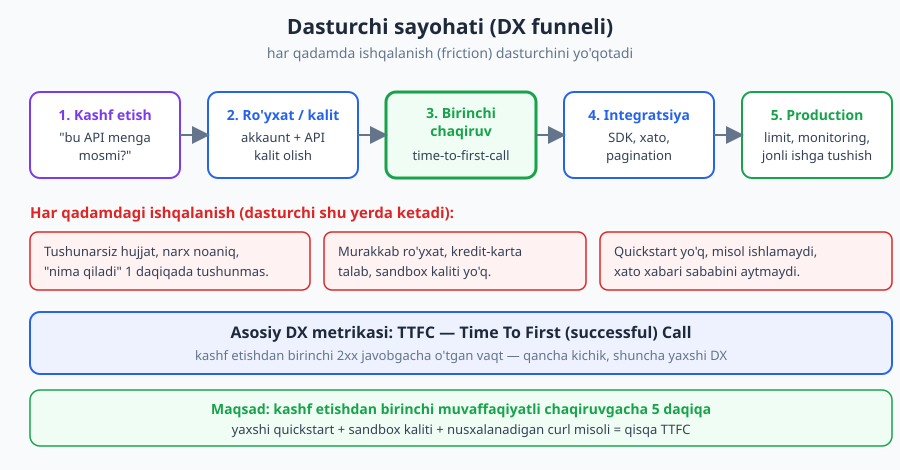
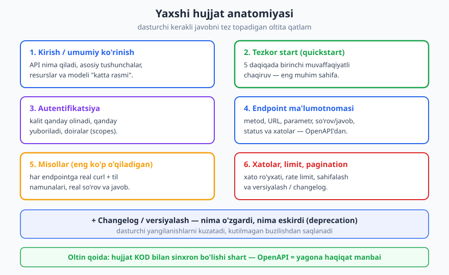
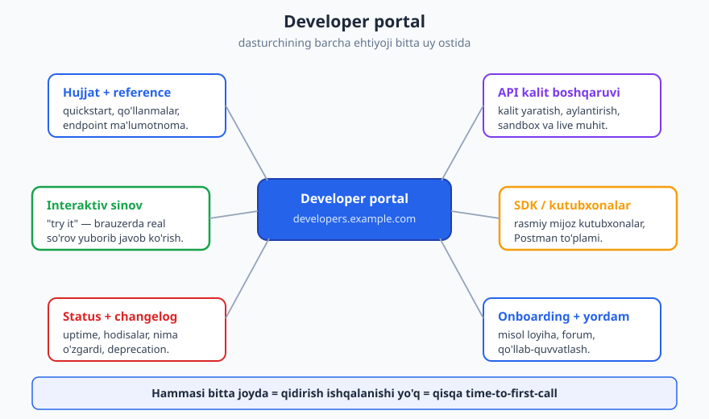

# 22 — Hujjatlash va Developer Experience

[⬅️ Oldingi: 21 — OpenAPI spetsifikatsiyasi](./21-openapi.md) · [🏠 README](./README.md) · [Keyingi: 23 — API gateway, BFF va kompozitsiya ➡️](./23-api-gateway-bff.md)

---

> **Bu bobda:** API'ning kodi qanchalik yaxshi bo'lmasin, agar boshqa dasturchi uni **tushuna va ishlata olmasa**, u amalda mavjud emas. Bu bobda **Developer Experience (DX)** — dasturchining API bilan ishlash tajribasini ko'ramiz: yaxshi hujjatning anatomiyasi (quickstart, reference, misollar), interaktiv hujjat (Swagger UI / Redoc), SDK va mijoz kutubxonalari, developer portal, va eng kuchli DX omili — **izchillik**. Asosiy metrika sifatida "birinchi muvaffaqiyatli chaqiruvgacha vaqt" (time-to-first-call) tushunchasini o'rganamiz.
>
> **Halollik / Eslatma:** Bu bob ko'p jihatdan **mahsulot va amaliyot** mavzusi — bitta RFC unga buyruq bermaydi, ko'p qarorlar **kontekstga-bog'liq trade-off**. Aniq standartga tayanadigan joylar: interaktiv hujjat va SDK'lar **OpenAPI** (3.1, eng yangi 3.2 — [21-bob](./21-openapi.md)) spetsifikatsiyasidan generatsiya qilinadi; xato namunalari **RFC 9457 Problem Details** (`application/problem+json`) formatida; HTTP misollar (metod, status) **RFC 9110** semantikasiga mos. JSON namunalari valid. "Yaxshi hujjat qanday bo'lishi kerak" bo'yicha aniq raqamli qoida yo'q — quyidagilar sanoatdagi keng tarqalgan amaliyot, mutlaq haqiqat emas.

---

## API — bu mahsulot, dasturchi — foydalanuvchi

Birinchi bobda aytgan edik: API — bu **shartnoma va mahsulot** ([1-bob](./01-api-nima.md)). Endi shu g'oyani oxirigacha olib boramiz.

Tasavvur qiling, siz ajoyib jihozni ishlab chiqardingiz — ichki mexanizmi mukammal, tez, ishonchli. Lekin qutidan chiqarganda na qo'llanma, na tugmalar belgisi, na nimadan boshlashni ko'rsatadigan hech narsa. Xaridor uni qaytaradi. Jihoz "yomon" emas edi — **undan foydalanish tajribasi** yomon edi.

API ham xuddi shunday. Sizning API'ngizning **foydalanuvchisi — boshqa dasturchi**. U sizning mahsulotingizni sotib oladi (yoki bepul ishlatadi), uni o'z ilovasiga ulaydi, va shu ulanish ustiga o'z biznesini quradi. Uning tajribasi — bu sizning API'ngizning **Developer Experience (DX)** si.

**Nega bu muhim?** Chunki dasturchining tanlovi bor. Agar sizning API'ngizni ulash og'riqli bo'lsa — hujjat chalkash, misollar ishlamaydi, xatolar sababini aytmaydi — u **ketadi**. Ko'pincha to'g'ridan-to'g'ri raqobatchiga o'tadi, kim DX'ni yaxshiroq qilgan bo'lsa. Bozorda ikki to'lov API'si, ikki SMS API'si, ikki xarita API'si bo'lsa, ko'pincha **g'olib — yaxshiroq hujjati va tezroq onboardingi borgani**, hatto texnik jihatdan biroz zaifroq bo'lsa ham.

> **Eslatma:** "Bizning ishimiz kod yozish, hujjat ikkinchi darajali" — bu eng qimmat xato. Hujjat — API'ning **interfeysi**. Foydalanuvchi sizning kodingizni ko'rmaydi; u faqat hujjat, javoblar va xato xabarlarini ko'radi. Ular yomon bo'lsa, API ham yomon — mohiyatidan qat'i nazar.

### Asosiy metrika: time to first successful call

DX'ni "his qilsa bo'ladi, lekin o'lchab bo'lmaydi" deb o'ylash mumkin. Aslida unday emas. Eng foydali bitta metrika bor:

**Time to first (successful) call (TTFC)** — dasturchi sizning API'ngizni birinchi marta ko'rganidan, **birinchi muvaffaqiyatli (2xx) javob** olgunigacha o'tgan vaqt.

Bu raqam DX'ning sog'lig'ini ajoyib jamlaydi, chunki u butun yo'lni o'z ichiga oladi: hujjatni topish, tushunish, ro'yxatdan o'tish, kalit olish, birinchi so'rovni yuborish, va u **ishlashi**. Bu yo'lning istalgan qadamida ishqalanish (friction) bo'lsa — chalkash quickstart, kalit olish murakkab, misol noto'g'ri — TTFC o'sadi va dasturchi ketish ehtimoli ortadi.



Yaxshi public API'larda maqsad — TTFC'ni **5 daqiqaga** tushirish: dasturchi sahifaga keladi, quickstart'dagi `curl` misolini nusxalaydi, sandbox kalitini qo'yadi, yuboradi — va ishlaydi. Shu "ishladi!" lahzasi — DX'ning eng muhim onlari. Undan keyin dasturchi sizga ishonadi va integratsiyani davom ettiradi.

> **Trade-off:** Ichki (internal) API'da TTFC kamroq tashvishli — jamoa sizdan so'rab o'rganishi mumkin. Ammo **public** yoki ko'p-jamoali katta tashkilotda TTFC qimmatga tushadi: har bir chalkash daqiqa — ko'plab dasturchilarning behuda vaqti va qo'llab-quvvatlash so'rovlari.

---

## Yaxshi hujjatning anatomiyasi

"Yaxshi hujjat" — bu shunchaki "ko'p matn" emas. Aksincha — eng yaxshi hujjat dasturchiga **kerakli javobni eng tez topishga** yordam beradi. Yaxshi hujjat oltita asosiy qatlamdan iborat. Ularni birma-bir ko'ramiz.



### 1. Kirish / umumiy ko'rinish (overview)

Eng yuqorida — **bu API nima qiladi** degan bir-ikki paragraf. Dasturchi 30 sekundda "bu menga mosmi?" degan savolga javob olishi kerak. Bu yerda:

- API nima qiladi va qaysi muammoni hal qiladi.
- Asosiy tushunchalar va resurslar modeli ("buyurtma", "mijoz", "to'lov" va ular qanday bog'langan).
- Bazaviy URL (`https://api.example.com/v1`), formatlar (JSON), umumiy konvensiyalar.

Bu qism qisqa bo'lsin — bu xarita, ensiklopediya emas.

### 2. Tezkor start (quickstart) — eng muhim sahifa

Agar hujjatda faqat bitta sahifani mukammal qila olsangiz, **uni quickstart qiling**. Quickstart — dasturchini **eng qisqa yo'l** bilan birinchi muvaffaqiyatli chaqiruvga olib boradigan sahifa. U TTFC'ni to'g'ridan-to'g'ri belgilaydi.

Yaxshi quickstartda aniq, ketma-ket, nusxalanadigan qadamlar bo'ladi:

1. Ro'yxatdan o'ting va sandbox kalitini oling (havola bilan).
2. Mana shu `curl` so'rovini nusxalang va kalitingizni qo'ying.
3. Mana shunday javob olasiz.

Misol quickstart parchasi:

```http
POST /v1/messages HTTP/1.1
Host: api.example.com
Authorization: Bearer sk_test_4eC39...
Content-Type: application/json

{"to": "+998901234567", "text": "Salom!"}

HTTP/1.1 201 Created
Location: /v1/messages/msg_88123
Content-Type: application/json

{"id": "msg_88123", "status": "queued"}
```

Diqqat: bu yerda **POST** yangi resurs (xabar) yaratadi, shuning uchun javob **201 Created** va `Location` sarlavhasi yangi resurs manzilini ko'rsatadi — bu RFC 9110 semantikasiga to'liq mos ([3-bob](./03-http-status-kodlari.md) va [6-bob](./06-resurs-uri-dizayni.md)da batafsil). Quickstartda status kodlar to'g'ri bo'lishi muhim, chunki dasturchi aynan shu yerdan API'ning "uslubini" o'rganadi.

> **Diqqat:** Quickstartda dasturchi nusxalashi mumkin bo'lgan **haqiqiy, ishlaydigan** so'rov bo'lsin. "Bu yerga URL qo'ying" kabi to'ldiriladigan o'rinlar minimal bo'lsin — har bir to'ldiriladigan joy — bu xatolik imkoniyati va ishqalanish.

### 3. Autentifikatsiya

Quickstartdan keyin dasturchi bilishi kerak bo'lgan ikkinchi narsa: **kalit yoki tokenni qanday olaman va qanday yuboraman?** ([11-bob](./11-autentifikatsiya.md)). Bu bo'lim aniq aytishi kerak:

- Kalit/token qayerdan olinadi (dashboard, OAuth oqimi).
- U qanday yuboriladi (masalan `Authorization: Bearer <token>`).
- Sandbox (test) va live (production) kalitlar farqi.
- Doiralar (scopes) / ruxsatlar va ularni qanday so'rash.

Autentifikatsiya — onboardingdagi eng ko'p "qoqiladigan" joy. Uni alohida, aniq, misol bilan yoritish TTFC'ni sezilarli qisqartiradi.

### 4. Endpoint ma'lumotnomasi (reference)

Bu — API'ning **lug'ati**: har bir endpoint to'liq, aniq tasvirlangan. Har endpoint uchun:

- **Metod va URL:** `GET /v1/orders/{order_id}`.
- **Parametrlar:** path, query, header — har biri turi, majburiymi, izohi bilan.
- **So'rov tanasi (request body):** sxema va misol ([7-bob](./07-sorov-javob-payload.md)).
- **Javob:** status kodlar, javob sxemasi, misol.
- **Xatolar:** bu endpoint qaytarishi mumkin bo'lgan xatolar ([9-bob](./09-xato-dizayni.md)).

Eng muhim amaliy nuqta: reference'ni **qo'lda yozmang**. Uni **OpenAPI spetsifikatsiyasidan generatsiya qiling** ([21-bob](./21-openapi.md)). Sababini keyinroq — "halollik" bo'limida ko'ramiz: qo'lda yozilgan reference muqarrar eskiradi.

### 5. Misollar — eng ko'p o'qiladigan qism

Mana sirli haqiqat: dasturchilar hujjatni **boshdan oxir o'qimaydi**. Ular **misolni qidiradi**, nusxalaydi, va ishlatadi. Demak **misol — eng ko'p o'qiladigan qism**, va u eng ko'p e'tiborga loyiq.

Har bir asosiy endpoint uchun:

- **Real `curl` misoli** — to'liq, nusxalanadigan.
- **Til namunalari** — dasturchining tilida (JavaScript, Python, PHP, Go...). SDK bor bo'lsa, SDK chaqiruvi misoli ham.
- **Real javob** — to'liq, haqiqiy maydonlar bilan.

Yaxshi javob misoli — to'liq va haqiqatga o'xshash:

```json
{
  "id": "user_42",
  "name": "Olcha Savdo",
  "email": "olcha@example.com",
  "created_at": "2026-06-16T09:30:00Z",
  "plan": "pro"
}
```

Sanaga e'tibor bering: `created_at` — **ISO 8601 / RFC 3339** formatida (`2026-06-16T09:30:00Z`), bu API'lar uchun tavsiya etilgan standart ([7-bob](./07-sorov-javob-payload.md)). Misol qanchalik haqiqatga yaqin bo'lsa, dasturchi shuncha kam taxmin qiladi.

### 6. Xatolar, limit, pagination

Hujjatning "xush kelibsiz" qismi optimist: hammasi to'g'ri ketgan holatni ko'rsatadi. Lekin dasturchi vaqtining katta qismi — **xato bilan kurashishga** ketadi. Shuning uchun hujjat **noto'g'ri ketgan holatni ham** to'liq yoritishi shart:

- **Xatolar ro'yxati:** har status kod nimani anglatadi, qachon yuz beradi, qanday tuzatiladi. Xato formati — izchil ([9-bob](./09-xato-dizayni.md)). Sanoatda keng standart — **RFC 9457 Problem Details**:

```json
{
  "type": "https://api.example.com/problems/invalid-api-key",
  "title": "API kalit yaroqsiz",
  "status": 401,
  "detail": "Berilgan API kalit topilmadi yoki bekor qilingan. Kalitni dashboard'dan tekshiring.",
  "instance": "/v1/users/42",
  "docs": "https://developers.example.com/auth"
}
```

Diqqat: bu **401 Unauthorized** — autentifikatsiya muvaffaqiyatsiz (kalit yaroqsiz), bu RFC 9110 bo'yicha to'g'ri kod. Agar kalit yaroqli, lekin ruxsat yetmasa — **403 Forbidden** bo'lardi ([11-bob](./11-autentifikatsiya.md)da 401 va 403 farqi). `docs` — Problem Details'ning **kengaytma a'zosi**; u dasturchini to'g'ridan-to'g'ri tegishli hujjat sahifasiga yuboradi — bu DX uchun ajoyib amaliyot.

- **Rate limit:** qanday limitlar bor, qanday sarlavhalar (`Retry-After`, `RateLimit-*`) qaytadi, limit oshganda nima qilish ([14-bob](./14-rate-limiting.md)).
- **Pagination va filtrlash:** ro'yxat endpointlari qanday sahifalanadi (offset/cursor, `Link` sarlavha) ([8-bob](./08-sahifalash-filtrlash.md)).

### + Changelog / versiyalash

Va nihoyat — **nima o'zgardi?** Dasturchi API'ni bir marta ulab, keyin uni "unutadi" — to nimadir buzilmaguncha. Yaxshi hujjat **changelog** (o'zgarishlar tarixi) yuritadi: yangi endpointlar, o'zgargan maydonlar, **eskirayotgan (deprecated)** narsalar va ularning sunset (o'chirilish) sanasi ([10-bob](./10-versiyalash.md)). `Deprecation` va `Sunset` HTTP sarlavhalari (RFC 9745 va RFC 8594) shu xabarni mashina o'qiydigan tarzda ham yetkazadi.

---

## Interaktiv hujjat: o'qishdan sinashga

Statik hujjat — yaxshi. Lekin **interaktiv** hujjat — yaxshiroq. Farqi: dasturchi misolni o'qish o'rniga, uni **shu yerda, brauzerda sinab ko'radi** ("try it"), real javobni darrov oladi. Bu TTFC'ni keskin qisqartiradi — chunki "birinchi chaqiruv" hatto IDE ochmasdan, hujjat sahifasining o'zidayoq bo'ladi.

Bunday interaktiv hujjatlar deyarli har doim **OpenAPI spetsifikatsiyasidan generatsiya qilinadi** ([21-bob](./21-openapi.md)). Sizning OpenAPI faylingizni o'qiydigan asboblar:

| Asbob | Nima beradi | Uslubi |
|---|---|---|
| **Swagger UI** | Har endpoint ochiladi, "Try it out" tugmasi real so'rov yuboradi | Interaktiv, sinov uchun |
| **Redoc** | Chiroyli, o'qishga qulay, uch-panelli ma'lumotnoma | O'qish/reference uchun |
| **Stoplight / Scalar** | Zamonaviy portal, interaktiv + qo'llanma | To'liq portal |
| **Postman** | So'rovlar to'plami (collection), import qilinadi, sinaladi | Lokal sinov / jamoa |

OpenAPI fayl bo'lsa, bu asboblarning **hammasini bepul** olasiz: bittasi OpenAPI yozasiz, hujjat, interaktiv sinov va Postman to'plami — barchasi shundan keladi. Bu OpenAPI'ning eng katta DX foydasi.

> **Eslatma:** "Swagger" va "OpenAPI" — ko'pincha aralashtiriladi. Tarixan format "Swagger" deb atalardi; 2.0 versiyadan keyin spetsifikatsiya **OpenAPI** deb nomlandi (hozir 3.1, eng yangi 3.2). "Swagger" hozir asosan **asboblar** nomi (Swagger UI, Swagger Editor). Spetsifikatsiya = OpenAPI; asbob = Swagger UI.

Mana OpenAPI parchasi — undan interaktiv reference avtomatik chiqadi:

```yaml
openapi: 3.1.0
info:
  title: Example API
  version: 1.4.0
  description: |
    Buyurtmalar va foydalanuvchilarni boshqarish API'si.
    Tezkor start: developers.example.com/quickstart
paths:
  /v1/orders/{order_id}:
    get:
      summary: Bitta buyurtmani olish
      description: Berilgan ID bo'yicha buyurtma tafsilotini qaytaradi.
      parameters:
        - name: order_id
          in: path
          required: true
          description: Buyurtma identifikatori
          schema:
            type: string
      responses:
        '200':
          description: Buyurtma topildi
          content:
            application/json:
              schema:
                $ref: '#/components/schemas/Order'
              examples:
                oddiy:
                  summary: Yetkazilgan buyurtma
                  value:
                    id: ord_1001
                    status: delivered
                    total: 49.90
        '404':
          description: Buyurtma topilmadi
components:
  schemas:
    Order:
      type: object
      properties:
        id:
          type: string
        status:
          type: string
          enum: [pending, paid, shipped, delivered]
        total:
          type: number
```

Diqqat qiling — bu yerda `summary`, `description`, `examples` bor. OpenAPI faqat texnik shakl emas; u **hujjat manbai** ham. Misollar va izohlarni OpenAPI ichiga yozsangiz, ular avtomatik hujjatga chiqadi.

---

## SDK va mijoz kutubxonalari

Dasturchi sizning API'ngizga to'g'ridan-to'g'ri HTTP yuborishi mumkin. Lekin u **o'z tilida** ishlashni yoqtiradi — Python obyekti, JavaScript funksiyasi, PHP klassi sifatida, HTTP detallarini o'ylamasdan.

**SDK (Software Development Kit) / mijoz kutubxonasi** — aynan shuni beradi. Xom HTTP o'rniga:

```http
POST /v1/messages HTTP/1.1
Host: api.example.com
Authorization: Bearer sk_test_4eC39...
Content-Type: application/json

{"to": "+998901234567", "text": "Salom!"}
```

dasturchi shunchaki shunday yozadi (tushuncha sifatida):

```
client.messages.create(to="+998901234567", text="Salom!")
```

SDK ichida: autentifikatsiya sarlavhasini qo'yish, JSON serializatsiya, status kod tekshirish, xatolarni til istisnolariga (exception) aylantirish, qayta urinish (retry), pagination'ni avtomatik aylantirish — bularning hammasi yashiriladi. Bu DX'ni **keskin** oshiradi: dasturchi biznes mantiqiga e'tibor beradi, HTTP mexanikasiga emas.

**SDK'lar ham OpenAPI'dan generatsiya qilinishi mumkin** (kod generatorlar orqali) — bu ko'p tilni qo'llab-quvvatlashni arzonlashtiradi.

> **Trade-off:** SDK — DX uchun ajoyib, lekin **bepul emas**. Har bir til uchun SDK — bu qo'shimcha kod, versiyalash, hujjat va qo'llab-quvvatlash yuki. API o'zgarsa, har bir SDK'ni yangilash kerak. Shuning uchun: kichik yoki yangi API'da avval **yaxshi hujjat + curl misollar**ga e'tibor bering; SDK'ni keng talab bo'lganda, eng ko'p ishlatiladigan 1-2 tildan boshlab qo'shing. Generatsiya qilingan SDK'lar yukni kamaytiradi, lekin "qo'lda silliqlangan" SDK'chalik tabiiy bo'lmasligi mumkin.

---

## Developer portal: hammasi bitta uy ostida

Yuqoridagi qismlar — hujjat, kalit, sinov, SDK, status, changelog — alohida-alohida sochilib yotishi mumkin. **Developer portal** ularni **bitta joyga** yig'adi: dasturchi `developers.example.com`ga keladi va hamma narsani topadi.



Yaxshi portalda:

- **Hujjat + reference** — quickstart, qo'llanmalar, endpoint ma'lumotnoma.
- **Ro'yxatdan o'tish va kalit boshqaruvi** — akkaunt yarat, kalit ol/aylantir, sandbox va live muhitni boshqar.
- **Interaktiv sinov** — "try it" brauzerda real so'rov.
- **SDK'lar va Postman to'plami** — yuklab olinadi.
- **Status sahifa + changelog** — uptime, hodisalar, nima o'zgardi.
- **Onboarding va yordam** — misol loyiha, qo'llanmalar, forum/qo'llab-quvvatlash.

Buning DX qiymati — **qidirish ishqalanishini yo'q qilish**. Dasturchi "kalitni qayerdan olaman?", "limit qancha?", "status qanday?" kabi savollarning har biriga turli joydan javob izlamaydi — hammasi bir uyda. Bu, yana, TTFC'ni qisqartiradi.

---

## Izchillik — eng kuchli DX omili

Endi eng muhim g'oyaga keldik. Yuqoridagi hamma narsa — hujjat, SDK, portal — foydali. Lekin **eng kuchli DX omili — izchillik (consistency)**.

Izchillik nimani anglatadi? Butun API **bir xil konvensiyalarga** rioya qiladi:

- **Nomlash:** hamma maydon bir xil uslubda (`snake_case` yoki `camelCase` — bittasini tanla va hamma joyda ishlat) ([7-bob](./07-sorov-javob-payload.md)).
- **Xato formati:** har bir endpoint xatosi **bir xil shaklda** qaytadi (masalan Problem Details) ([9-bob](./09-xato-dizayni.md)).
- **Pagination:** har bir ro'yxat **bir xil mexanizm** bilan sahifalanadi ([8-bob](./08-sahifalash-filtrlash.md)).
- **Status kodlar:** bir xil holat bir xil kod qaytaradi (yaratish — har doim 201, topilmadi — har doim 404) ([3-bob](./03-http-status-kodlari.md)).
- **Sanalar, ID'lar, formatlar:** hamma joyda bir xil.

**Nega bu eng kuchli?** Chunki izchil API'da dasturchi **bir marta o'rganadi va hamma joyda qo'llaydi**. Birinchi endpoint qanday ishlasa — qolgan ellik endpoint ham **xuddi shunday** ishlaydi deb taxmin qila oladi, va taxmini **to'g'ri chiqadi**. Hujjatga qayta-qayta murojaat qilmaydi; API "bashorat qilinadigan" (predictable) bo'ladi.

Izchil bo'lmagan API — buning aksi: bir endpoint `user_id`, boshqasi `userId`, uchinchisi `id` ishlatadi; bir joyda xato `{"error": "..."}`, boshqada `{"message": "..."}`, uchinchida `{"errors": [...]}`. Dasturchi **har bir endpointni alohida o'rganishga** majbur. Hatto mukammal hujjat ham bu chalkashlikni to'la qoplay olmaydi.

> **Trade-off:** Izchillikni saqlash intizom talab qiladi — ayniqsa API o'sganda va ko'p jamoa unga qo'shsa. Shuning uchun ko'p tashkilot **API uslub qo'llanmasi (style guide)** yozadi: nomlash, xato, pagination, versiya qoidalarini. Yangi endpoint qo'shilganda u qo'llanmaga moslikka tekshiriladi (ko'pincha avtomatik linter bilan — [26-bob](./26-hayot-sikli-governance.md)da governance). Izchillik — bir martalik ish emas, doimiy mashq.

---

## Onboarding: birinchi qadamni osonlashtirish

DX faqat hujjat haqida emas — **birinchi qadamni qanchalik oson** qilishingiz haqida ham. Yaxshi onboarding quyidagilarni o'z ichiga oladi:

- **Oson ro'yxatdan o'tish:** akkaunt yaratish tez bo'lsin; agar mumkin bo'lsa, kalit olish uchun kredit-karta **talab qilmang** (sinov uchun). Har bir qo'shimcha shakl maydoni — yo'qotilgan dasturchi.
- **Sandbox / test muhit:** dasturchi **xavfsiz** sinashi mumkin bo'lgan muhit — real pul ketmaydi, real SMS yuborilmaydi, real ma'lumot o'zgarmaydi. Sandbox kaliti darhol berilsa, dasturchi production'ga tegmasdan ishonchli his qiladi.
- **Misol loyiha (sample app):** "noldan boshlash" o'rniga, dasturchi tayyor, ishlaydigan misol loyihani klonlab, undan davom etadi. Bu eng tez "ishladi!" lahzasini beradi.

Bu uchovi birgalikda TTFC'ni keskin qisqartiradi va birinchi tajribani ijobiy qiladi.

---

## Halollik: hujjat kod bilan sinxron bo'lishi shart

Va nihoyat — bobning eng muhim ogohlantirishi. **Eskirgan hujjat — yomon hujjat. Ba'zan u umuman hujjatsizlikdan ham yomonroq.**

Sababi oddiy: hujjatsiz dasturchi ehtiyot bo'ladi, sinab ko'radi, tekshiradi. **Noto'g'ri** hujjat esa unga **ishonadi** — va aldaydi. "Hujjat shunday deydi, lekin API boshqacha javob beradi" — bu dasturchini soatlab azoblaydigan va sizning API'ngizga ishonchini buzadigan eng yomon tajribalardan biri.

Muammoning ildizi: **qo'lda yozilgan hujjat muqarrar eskiradi.** Kod o'zgaradi, kimdir hujjatni yangilashni unutadi, va vaqt o'tib hujjat bilan haqiqat ajraladi. Bu — qochib bo'lmaydigan jarayon, agar hujjat **qo'lda** yuritilsa.

**Yechim — avtomatlashtirish va yagona haqiqat manbai (single source of truth):**

- **OpenAPI'ni yagona haqiqat manbai qiling** ([21-bob](./21-openapi.md)). Reference hujjat, interaktiv sinov, SDK'lar — hammasi **shu bitta fayldan** generatsiya qilinadi. Spetsifikatsiya o'zgarsa, hammasi birga yangilanadi.
- **OpenAPI'ni kodga bog'lang.** Ikki yo'l bor: (a) **spec-first** — avval OpenAPI yoziladi, kod va testlar shundan tekshiriladi; (b) **code-first** — kod annotatsiyalaridan OpenAPI generatsiya qilinadi. Ikkalasida ham maqsad bir: spetsifikatsiya va kod **ajralib ketmasligi**.
- **Contract testing** bilan tekshiring: API javoblari OpenAPI sxemasiga mosligini avtomatik test qiladi ([24-bob](./24-testlash-contract.md)). Agar kod hujjatdan chetga chiqsa, test yiqiladi va sizni ogohlantiradi.
- **Misollarni testdan generatsiya qiling** yoki real javoblarni tekshiring — qo'lda yozilgan misol ham eskiradi.

> **Diqqat:** "Hujjatni keyin yangilaymiz" — eng ko'p buziladigan va'da. Yechim — uni **odamning intizomiga** emas, **jarayonga** bog'lash: OpenAPI'dan generatsiya, contract testlar CI'da. Shunda hujjatning sinxronligi avtomatik kafolatlanadi, "esdan chiqdi" muammosi yo'qoladi.

Bu DX'ning yakuniy va eng halol qoidasi: **eng yaxshi hujjat — kodga avtomatik bog'langan hujjat.** U hech qachon yolg'on gapirmaydi, chunki u kodning o'zidan keladi.

---

## Asosiy g'oyalar (bobni qisqacha)

- **API — mahsulot, dasturchi — foydalanuvchi.** Yomon DX = dasturchi ketadi, ko'pincha raqobatchiga. Hujjat — API'ning interfeysi.
- **Time to first (successful) call (TTFC)** — asosiy DX metrikasi: kashf etishdan birinchi 2xx javobgacha vaqt. Qancha kichik, shuncha yaxshi.
- **Yaxshi hujjat anatomiyasi:** kirish, **quickstart** (eng muhim), autentifikatsiya, endpoint reference, **misollar** (eng ko'p o'qiladigan), xatolar/limit/pagination, changelog.
- **Interaktiv hujjat** (Swagger UI / Redoc) va **SDK'lar** OpenAPI'dan generatsiya qilinadi — bitta spec, ko'p foyda.
- **Developer portal** hammasini bitta joyga yig'adi — qidirish ishqalanishini yo'q qiladi.
- **Izchillik — eng kuchli DX omili:** bir xil nomlash, xato, pagination, status — dasturchi bir marta o'rganib, hamma joyda qo'llaydi.
- **Onboarding:** oson ro'yxat, sandbox muhit, misol loyiha — birinchi tajribani osonlashtiradi.
- **Halollik:** hujjat kod bilan **sinxron** bo'lishi shart. Yechim — OpenAPI yagona haqiqat manbai + contract testing + avtomatlashtirish.

---

## Mashqlar

### Oson

**1-mashq.** Yaxshi hujjatning oltita asosiy qatlamini sanang. Ulardan qaysi biri "eng muhim sahifa" deb ataladi va nega?

**2-mashq.** Quyidagi ikki hujjat parchasidan qaysi biri yaxshiroq DX beradi va nega?

- (A) "Foydalanuvchi yaratish uchun `/users` endpointiga so'rov yuboring."
- (B) Quyidagi `curl` so'rovini nusxalang, `<KALIT>`ni o'z sandbox kalitingizga almashtiring va ishga tushiring:
  ```http
  POST /v1/users HTTP/1.1
  Host: api.example.com
  Authorization: Bearer <KALIT>
  Content-Type: application/json

  {"name": "Olcha"}
  ```
  Javob: `201 Created`, `{"id": "user_42", "name": "Olcha"}`.

### O'rta

**3-mashq.** Bitta endpoint uchun mini-hujjat yozing: `GET /v1/orders/{order_id}` — bitta buyurtmani olish. Quyidagilarni yoritib: metod va URL, path parametr izohi, muvaffaqiyatli javob misoli (JSON), va kamida bitta xato holati (status kod + qachon).

**4-mashq.** Yangi to'lov API'si uchun **quickstart** rejasini tuzing: dasturchini birinchi muvaffaqiyatli chaqiruvga olib boradigan eng qisqa qadamlar ketma-ketligini yozing. Har bir qadam TTFC'ni qanday qisqartirishini ayting.

**5-mashq.** Bir kompaniyaning API'sida shu holat bor: bitta endpoint `{"user_id": 42}`, boshqasi `{"userId": 42}`, uchinchisi `{"id": 42}` qaytaradi; xatolar ba'zan `{"error": "..."}`, ba'zan `{"message": "..."}` shaklida. Bu qanday DX muammosi? Uni qanday tuzatasiz va bu nega TTFC va umumiy tajribaga ta'sir qiladi?

### Qiyin

**6-mashq.** Sizga yomon DX'li API berildi: hujjat statik PDF, oxirgi yangilanish 8 oy oldin; quickstart yo'q; misollar eskirgan (ba'zilari `404` qaytaradi); kalit olish uchun qo'lda email yozib, 2 kun kutish kerak; xatolar shunchaki `500` qaytaradi. **Yaxshilash rejasini** tuzing: muammolarni ta'sir bo'yicha tartiblang va har biriga aniq yechim bering.

**7-mashq.** Sizda omadli holat: API allaqachon OpenAPI spetsifikatsiyasi bilan yozilgan. **Time-to-first-call'ni kamaytirish strategiyasini** loyihalang: TTFC'ni o'lchashning amaliy usuli, OpenAPI'dan nimalarni avtomatik generatsiya qilish, sandbox va onboarding qarorlari, va nima uchun har biri TTFC'ga ta'sir qiladi.

**8-mashq.** **SDK vs faqat-hujjat** trade-off'ini chuqur tahlil qiling. Yangi public API uchun rasmiy SDK chiqarish kerakmi yoki avval faqat yaxshi hujjat + curl misollar yetadimi? Qaysi omillar qaysi tarafga og'iradi (jamoa hajmi, til xilma-xilligi, qo'llab-quvvatlash quvvati, API barqarorligi)? Generatsiya qilingan SDK bu balansni qanday o'zgartiradi?

<details markdown="1">
<summary>Yechimlar</summary>

### 1-mashq yechimi
Oltita qatlam: **(1) Kirish/umumiy ko'rinish** (API nima qiladi, asosiy tushunchalar), **(2) Tezkor start (quickstart)**, **(3) Autentifikatsiya** (kalit qanday olinadi/yuboriladi), **(4) Endpoint ma'lumotnomasi (reference)** (metod, URL, parametr, javob, xato), **(5) Misollar** (real curl + til namunalari), **(6) Xatolar, limit, pagination** (+ changelog/versiyalash). **Eng muhim sahifa — quickstart**, chunki u dasturchini eng qisqa yo'l bilan birinchi muvaffaqiyatli chaqiruvga olib boradi va shu bilan **time-to-first-call**ni to'g'ridan-to'g'ri belgilaydi — bu DX'ning asosiy metrikasi.

### 2-mashq yechimi
**(B) yaxshiroq.** (A) faqat *aytadi* nima qilish kerakligini, lekin dasturchi hali ham so'rovni o'zi qurishi, qaysi sarlavhalar kerakligini, format qandayligini, qanday javob kutilishini taxmin qilishi kerak — bu ishqalanish va xatolik imkoniyati. (B) esa **nusxalanadigan, ishlaydigan** misol beradi: aniq metod, URL, sarlavhalar, tana, va kutilgan javob (`201 Created` — yangi resurs yaratish uchun to'g'ri kod). Dasturchi nusxalaydi, bitta o'rinni (`<KALIT>`) to'ldiradi, va ishlaydi. Misol — eng ko'p o'qiladigan qism; (B) aynan shu kuchdan foydalanadi va TTFC'ni qisqartiradi.

### 3-mashq yechimi
**`GET /v1/orders/{order_id}` — bitta buyurtmani olish**

- **Metod va URL:** `GET /v1/orders/{order_id}` — GET safe va idempotent (faqat o'qiydi), tanasiz.
- **Path parametr:** `order_id` (string, majburiy) — buyurtma identifikatori, masalan `ord_1001`.
- **Muvaffaqiyatli javob (`200 OK`):**
  ```http
  GET /v1/orders/ord_1001 HTTP/1.1
  Host: api.example.com
  Authorization: Bearer <token>

  HTTP/1.1 200 OK
  Content-Type: application/json

  {"id": "ord_1001", "status": "delivered", "total": 49.90, "created_at": "2026-06-10T14:00:00Z"}
  ```
- **Xato holati:** `404 Not Found` — berilgan `order_id` mavjud bo'lmasa (yoki bu foydalanuvchiga tegishli bo'lmasa, ma'lumot sizishini oldini olish uchun ko'pincha ham 404 — [12-bob](./12-avtorizatsiya.md)). Yana: `401 Unauthorized` — kalit yo'q/yaroqsiz. Xatolar Problem Details formatida qaytadi.

(Izoh: `200 OK` — mavjud resursni o'qish uchun to'g'ri kod; `201` faqat yaratishda. Bu izchillikning bir qismi.)

### 4-mashq yechimi
**To'lov API'si uchun quickstart rejasi (eng qisqa yo'l):**

1. **"Sandbox kalitini oling"** — bitta tugma, kredit-karta talab qilmasdan darhol test kaliti. *TTFC'ga ta'sir:* kalit olish — onboardingdagi eng ko'p qoqiladigan joy; uni bir bosishga tushirish katta vaqt tejaydi.
2. **"Birinchi to'lovni yarating"** — to'liq, nusxalanadigan `curl` so'rovi, faqat kalit o'rni to'ldiriladi. *Ta'sir:* dasturchi o'zi so'rov qurmaydi — taxmin va xato yo'qoladi.
3. **"Kutilgan javobni ko'ring"** — real `201 Created` javobi, to'liq maydonlar bilan. *Ta'sir:* dasturchi nima kutilishini biladi, javobini solishtirib tekshiradi.
4. **"Test kartasi raqamlari"** — sandboxda muvaffaqiyat/rad holatlarini sinash uchun maxsus test raqamlari. *Ta'sir:* dasturchi xavfsiz, real pul ketmasdan turli holatlarni sinaydi.
5. **"Keyingi qadam"** — webhook sozlash yoki SDK havolasi. *Ta'sir:* muvaffaqiyatdan keyin tabiiy davom, dasturchini integratsiyada ushlab turadi.

Umumiy printsip: har qadam **bitta aniq ish**, nusxalanadigan, taxminsiz — TTFC'ni minutlarga tushiradi.

### 5-mashq yechimi
Bu — **izchillik (consistency) muammosi**, va u eng kuchli DX omilining buzilishi. Dasturchi birinchi endpointda `user_id`ni o'rganadi, lekin ikkinchisida `userId`, uchinchisida `id` — har bir endpointni **alohida o'rganishga** majbur, taxmini har safar noto'g'ri chiqadi. Xatolar ham ikki shaklda (`error` / `message`) — dasturchi xatolarni umumiy kod bilan ishlay olmaydi, har birini alohida ko'rib chiqishi kerak.

**Tuzatish:** **bitta konvensiyani tanlang va hamma joyda qo'llang** — masalan, hamma maydon `snake_case`, hamma ID `_id` qo'shimchasi bilan (`user_id`, `order_id`), hamma xato bitta shaklda (Problem Details — RFC 9457). Mavjud nomuvofiqlikni yangi versiyada to'g'rilang ([10-bob](./10-versiyalash.md) — buzuvchi o'zgarish), eskisini bir muddat parallel saqlab, **API uslub qo'llanmasi** yozing va yangi endpointlarni avtomatik linter bilan tekshiring.

**Nega TTFC va tajribaga ta'sir qiladi:** izchil API'da dasturchi **bir marta o'rganib hamma joyda qo'llaydi** — birinchi muvaffaqiyatdan keyin qolgan endpointlar "bashorat qilinadigan" bo'ladi, hujjatga qayta murojaat kamayadi. Nomuvofiq API'da har endpoint yangi to'siq — TTFC nafaqat birinchi chaqiruvda, balki **butun integratsiya davomida** o'sib boradi.

### 6-mashq yechimi
**Yaxshilash rejasi (ta'sir bo'yicha tartiblangan):**

**Eng yuqori ta'sir — onboarding to'sig'i:**
- *Muammo:* kalit olish 2 kun (qo'lda email). *Yechim:* **avtomatik self-service** — dashboardda bir bosishda sandbox kaliti. Bu eng katta TTFC qotishi; uni birinchi tuzating.

**Yuqori ta'sir — birinchi chaqiruv:**
- *Muammo:* quickstart yo'q. *Yechim:* nusxalanadigan `curl` misoli bilan quickstart yozing — dasturchini 5 daqiqada birinchi 2xx'ga olib boring.
- *Muammo:* misollar eskirgan (`404`). *Yechim:* misollarni **OpenAPI'dan generatsiya** qiling va contract test bilan tekshiring — eskirish takrorlanmasin ([24-bob](./24-testlash-contract.md)).

**O'rta ta'sir — sinxronlik va xato:**
- *Muammo:* statik PDF, 8 oy yangilanmagan. *Yechim:* PDF'dan **OpenAPI'dan generatsiya qilingan jonli portal**ga o'ting (Swagger UI/Redoc) — hujjat avtomatik sinxron bo'ladi.
- *Muammo:* xatolar shunchaki `500`. *Yechim:* to'g'ri status kodlar (`400`/`401`/`404`/`422`...) va **Problem Details** formatida sababli xato xabarlari ([9-bob](./09-xato-dizayni.md)) — dasturchi muammoni o'zi tuzata oladi.

**Asosiy g'oya:** eng katta TTFC to'siqlarini (kalit, quickstart) avval hal qiling, keyin sinxronlik muammosini ildizidan (OpenAPI + avtomatlashtirish) yeching — "qo'lda yangilash" siklini takrorlamang.

### 7-mashq yechimi
**TTFC'ni kamaytirish strategiyasi (OpenAPI allaqachon bor):**

**(a) TTFC'ni o'lchash.** Amaliy usul: yangi akkauntlar uchun ro'yxatdan o'tish vaqti va **birinchi muvaffaqiyatli (2xx) API chaqiruvi** vaqti orasidagi farqni kuzating (analitika/telemetriya orqali). Bu funnelda qaysi qadamda dasturchilar "tushib qolishini" ham ko'rsatadi — eng ko'p tashlab ketiladigan qadam = eng katta ishqalanish.

**(b) OpenAPI'dan avtomatik generatsiya qiling:**
- **Interaktiv reference** (Swagger UI/Redoc) — "try it" bilan, dasturchi hatto IDE'siz birinchi chaqiruvni qiladi.
- **Misollar** — OpenAPI `examples`'dan, har doim spec bilan sinxron.
- **SDK'lar** — eng ko'p ishlatiladigan tillarda, kod generator orqali.
- **Postman to'plami** — import qilib darhol sinash.

**(c) Sandbox va onboarding:**
- **Self-service sandbox kaliti** — kredit-kartasiz, darhol. Kalit olish ishqalanishini nolga tushiradi.
- **Misol loyiha** — klonlab, kalitni qo'yib ishga tushiriladi; "ishladi!" lahzasini tezlashtiradi.

**(d) Nega ta'sir qiladi:** har bir element TTFC funnelidagi bitta to'siqni olib tashlaydi — kalit (sandbox), birinchi so'rov (try-it + misol), tushunish (sinxron reference). OpenAPI yagona manba bo'lgani uchun bularning hammasi **bir martalik ish** va keyin avtomatik sinxron qoladi — TTFC vaqt o'tib ham past qoladi.

### 8-mashq yechimi
**SDK vs faqat-hujjat — chuqur trade-off:**

**Faqat-hujjat + curl tarafiga og'iradigan omillar:**
- **Kichik jamoa / cheklangan qo'llab-quvvatlash quvvati:** har SDK — doimiy yuk (versiyalash, xato tuzatish, hujjat, har tilda). Kichik jamoa buni ko'tara olmaydi.
- **API hali o'zgaruvchan (barqaror emas):** API tez-tez o'zgarsa, har o'zgarishda har SDK'ni yangilash — qimmat va xatoga moyil. Avval API'ni barqarorlashtirish ma'qul.
- **Tor auditoriya bitta tilda:** agar deyarli hamma foydalanuvchi bitta tilda bo'lsa, ko'p SDK ortiqcha.

**SDK tarafiga og'iradigan omillar:**
- **Ko'p tilli auditoriya:** har dasturchi o'z tilida ishlamoqchi; xom HTTP yozish — ishqalanish. SDK DX'ni keskin oshiradi.
- **Murakkab API:** auth, qayta urinish, pagination aylantirish, idempotency ([15-bob](./15-idempotentlik-parallellik.md)) — bularni SDK yashirsa, dasturchi xato qilmaydi.
- **Yetarli quvvat va barqaror API:** SDK'ni qo'llab-quvvatlashga resurs bor va API shakli barqaror bo'lsa, SDK qiymati yukidan oshadi.

**Generatsiya qilingan SDK balansni qanday o'zgartiradi:** OpenAPI'dan SDK generatsiyasi **qo'llab-quvvatlash yukini keskin kamaytiradi** — API o'zgarsa, spec'dan SDK'lar qayta generatsiya qilinadi, har tilni qo'lda yangilash shart emas. Bu "SDK juda qimmat" argumentini zaiflashtiradi va ko'p tilni arzon qiladi. **Lekin** generatsiya qilingan SDK ba'zan "qo'lda silliqlangan"chalik tabiiy/idiomatik bo'lmaydi — shuning uchun amaliy yondashuv: eng muhim 1-2 tilni qo'lda silliqlash, qolganlarini generatsiya qilish.

**Xulosa (kontekstga-bog'liq):** **yangi** public API uchun ko'pincha to'g'ri tartib — avval **ajoyib hujjat + curl + interaktiv try-it** (TTFC'ni shu bilan past qiling), API barqarorlashgach va talab ko'rsatgach, eng ko'p ishlatiladigan tildan boshlab SDK qo'shing (imkon bo'lsa OpenAPI'dan generatsiya bilan). SDK — DX'ni oshiradi, lekin u "birinchi qadam" emas, "keyingi qadam".

</details>

---

[⬅️ Oldingi: 21 — OpenAPI spetsifikatsiyasi](./21-openapi.md) · [🏠 README](./README.md) · [Keyingi: 23 — API gateway, BFF va kompozitsiya ➡️](./23-api-gateway-bff.md)
