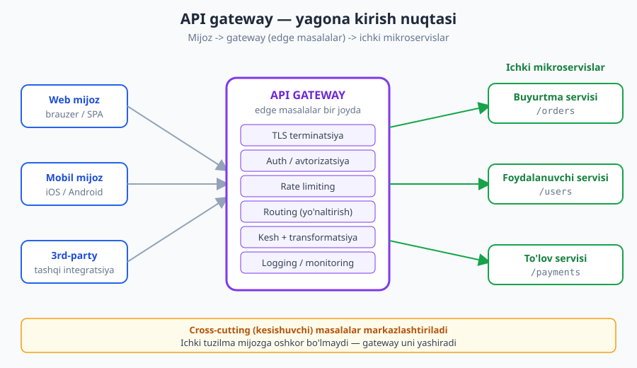
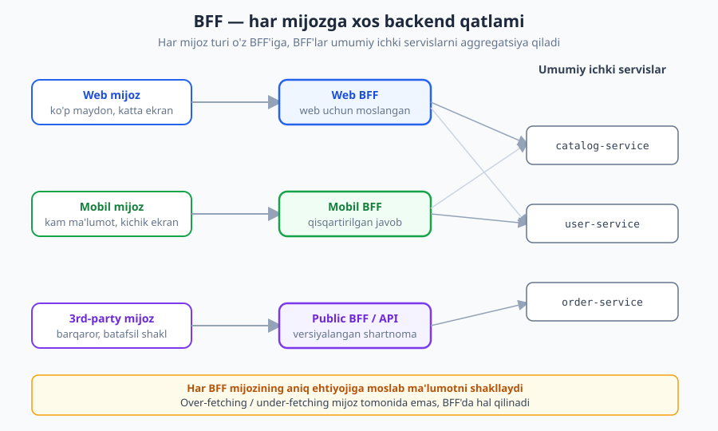
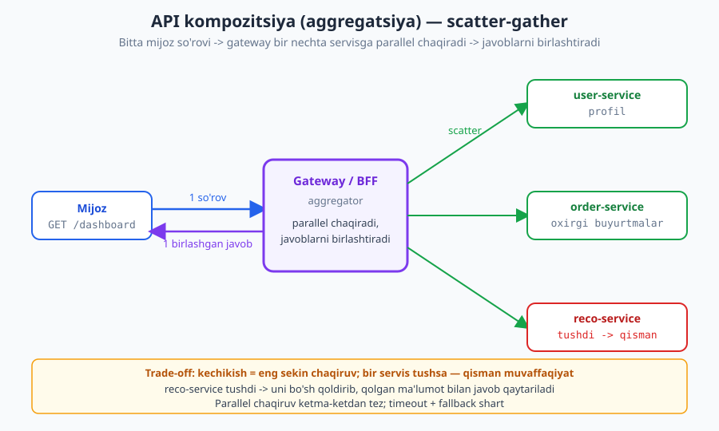

# 23 — API gateway, BFF va kompozitsiya

[⬅️ Oldingi: 22 — Hujjatlash va Developer Experience](./22-hujjatlash-dx.md) · [🏠 README](./README.md) · [Keyingi: 24 — API testlash va contract testing ➡️](./24-testlash-contract.md)

---

> **Bu bobda:** Tizim bitta servisdan ko'p servisga (mikroservislarga) o'sganda, mijoz har biriga to'g'ridan-to'g'ri ulanishi qiyinlasha boradi. Yechim sifatida **API gateway** (yagona kirish nuqtasi), **BFF** (Backend for Frontend — har mijoz turiga moslangan qatlam) va **API kompozitsiya / aggregatsiya** (bir so'rovni bir nechta servisga tarqatib, javoblarni birlashtirish) naqshlarini o'rganamiz. Har birining vazifasi, trade-off'i va anti-naqshlari bilan tanishamiz.
>
> **Halollik / Eslatma:** Bu bobdagi naqshlar — **arxitektura tanlovlari**, mutlaq qoidalar emas. "Qachon gateway, qachon BFF kerak" — bu **kontekstga-bog'liq trade-off**. Standartga tayanadigan joylar (HTTP semantikasi, status kodlar, kesh sarlavhalari) **RFC 9110** va **RFC 9111** asosida. Gateway/BFF/service-mesh — bu sanoat amaliyoti (Netflix, Amazon va boshqalar ommalashtirgan); ularning aniq ko'rinishi mahsulot va vaqt bilan o'zgaradi. Namunadagi HTTP va JSON bloklari standart semantikasiga mos.

---

## Muammo: ko'p servis, ko'p eshik

Kitobning katta qismida biz **bitta API** haqida gapirdik: bitta server, bitta `https://api.example.com`, mijoz unga ulanadi. Bu juda ko'p tizim uchun to'g'ri va yetarli model.

Lekin tizim o'sgani sari, ko'p jamoa ko'pincha uni **mikroservislarga** bo'ladi — har biri o'z mas'uliyati, o'z deploy'i, o'z ma'lumotlar bazasi bilan: `user-service`, `order-service`, `payment-service`, `catalog-service` va hokazo. (Mikroservis arxitekturasining o'zi alohida mavzu — [Dasturiy arxitektura](../arxitektura/README.md) kitobida chuqurroq.) Bu ichki jamoaga foyda: har servis mustaqil rivojlanadi.

Endi savol: **mijoz bu servislarga qanday ulanadi?**

Eng sodda (va sodda holatda to'g'ri) javob — **to'g'ridan-to'g'ri**: web ilova `user-service`ga, `order-service`ga, `payment-service`ga alohida so'rov yuboradi. Bir-ikki servis bo'lsa bu yaxshi ishlaydi.

Lekin servislar soni o'ngacha, yuztaga yetganda, bu yondashuv og'riydi:

- **Ko'p endpoint, ko'p manzil.** Mijoz har servis manzilini, portini, versiyasini bilishi kerak. Bir servis ko'chsa — barcha mijoz yangilanadi.
- **Auth takrori.** Har servis tokenni mustaqil tekshirishi kerak — yoki har mijoz har servisga auth'ni qaytadan ulashi kerak. [Autentifikatsiya](./11-autentifikatsiya.md) mantig'i hamma joyda takrorlanadi.
- **Ichki tuzilma oshkor.** Mijoz "qaysi servis nima qiladi"ni biladi — bu ichki arxitekturani tashqariga **sizdiradi**. Servislarni qayta tashkil qilsangiz, bu mijoz uchun buzilish (breaking change) bo'ladi.
- **Cross-cutting masalalar tarqoq.** Rate limiting, logging, kesh, TLS — bularning har biri har servisda alohida amalga oshiriladi yoki butunlay yo'q.
- **Brauzer cheklovlari.** Web mijoz uchun ko'p domen = ko'p TLS handshake, CORS murakkabligi, parallel ulanish limiti.

Bu muammolarning umumiy yechimi — **bitta yagona kirish nuqtasi** qo'yish: **API gateway**.

---

## API gateway: yagona kirish nuqtasi

**Analogiya.** Katta ofis binosini tasavvur qiling. Har xonaga (servisga) tashqaridan to'g'ridan-to'g'ri kirib bo'lmaydi. Hamma **bitta qabulxona** (gateway) orqali kiradi: u yerda sizni tekshirishadi (auth), ro'yxatga olishadi (logging), kerakli xonaga yo'naltirishadi (routing), va juda ko'p odam kelsa navbat qo'yishadi (rate limiting). Mehmon ichki tuzilmani bilishi shart emas — faqat qabulxonani biladi.

API gateway aynan shu: mijoz va ichki servislar **orasida** turadigan qatlam. Mijoz faqat gateway bilan gaplashadi; gateway esa so'rovni tegishli ichki servisga uzatadi.



### Gateway nima qiladi — edge masalalar bir joyda

Gateway'ning kuchi shundaki, u **edge concerns** (tizim chetidagi, kirish nuqtasidagi masalalar) ni **bitta joyda** markazlashtiradi. Bular **cross-cutting** (kesishuvchi) masalalar — ya'ni deyarli har servisga tegishli, lekin biznes-mantiqqa aloqasi yo'q:

| Vazifa | Nima qiladi | Tegishli bob |
|---|---|---|
| **Routing (yo'naltirish)** | `/orders/*` -> `order-service`, `/users/*` -> `user-service` | — |
| **Auth (autentifikatsiya/avtorizatsiya)** | tokenni bir marta tekshiradi, kim ekanini servislarga uzatadi | [11](./11-autentifikatsiya.md) |
| **Rate limiting** | mijozga so'rov chastotasi cheklovi, 429 qaytaradi | [14](./14-rate-limiting.md) |
| **TLS terminatsiya** | HTTPS shifrini gateway yechadi, ichkarida sodda ulanish | [13](./13-api-xavfsizligi.md) |
| **Kesh** | tez-tez so'raladigan javobni gateway'da saqlaydi | [16](./16-keshlash.md) |
| **Logging / monitoring** | har so'rovni qayd etadi, metrikalar to'playdi | [25](./25-observability.md) |
| **So'rov/javob transformatsiya** | format o'zgartirish, sarlavha qo'shish/olib tashlash | — |
| **Versiyalash** | `/v1`/`/v2` ni to'g'ri servisga yo'naltiradi | [10](./10-versiyalash.md) |

Asosiy g'oya: **bu masalalarni har servisda takrorlamaslik.** Tokenni tekshirish mantig'ini 20 ta servisga emas, bir gateway'ga yozasiz. Rate limit qoidasini bir joyda boshqarasiz. Bu — DRY (takrorlanmaslik) tamoyilini infratuzilma darajasida qo'llash.

> **Eslatma:** Gateway ichki servislarga **kimligini** (autentifikatsiya natijasini) ko'pincha ishonchli ichki sarlavha orqali uzatadi — masalan, gateway tokenni tekshirib, `X-User-Id: 42` ni ichki so'rovga qo'shadi. Ichki servis endi tokenni qayta tekshirmaydi, gateway'ga ishonadi. Bu faqat ichki tarmoq **ishonchli** bo'lsa xavfsiz; aks holda servislar ham qayta tekshirishi kerak (zero-trust yondashuvi).

### Gateway orqali oqim — namuna

Mijoz bitta sodda so'rov yuboradi; gateway uni qabul qiladi, tekshiradi va ichki servisga uzatadi:

```http
GET /v1/orders/1001 HTTP/1.1
Host: api.example.com
Authorization: Bearer <token>
```

Gateway nima qiladi (ketma-ketlik):

1. **TLS** shifrini yechadi.
2. **Token** ni tekshiradi — yaroqsiz bo'lsa, hatto ichki servisga bormay turib `401 Unauthorized` qaytaradi.
3. **Rate limit** — mijoz limitidan oshgan bo'lsa, `429 Too Many Requests` (+ `Retry-After`) qaytaradi.
4. **Routing** — `/orders/*` qoidasiga ko'ra so'rovni `order-service`ga uzatadi, kimligini ichki sarlavhada qo'shib.
5. Ichki javobni oladi, kerak bo'lsa **transformatsiya** qiladi (ortiqcha ichki maydonlarni olib tashlaydi), **log**'ga yozadi va mijozga qaytaradi.

Mijoz uchun bularning hammasi ko'rinmaydi — u faqat yakuniy javobni oladi:

```http
HTTP/1.1 200 OK
Content-Type: application/json
Cache-Control: private, max-age=30

{"id": 1001, "status": "shipped", "total": 49.90}
```

Diqqat qiling: mijoz `order-service`ning ichki manzilini, portini, hatto uning alohida servis ekanini ham bilmaydi. Bu **abstraksiya** — gateway ichki tuzilmani yashiradi.

---

## Gateway'ning trade-off'lari

Gateway kuchli, lekin **bepul emas**. Har naqsh kabi, u ham o'z narxi bilan keladi.

> **Trade-off:** Markazlashtirish ikki tomonlama qilich. Bir joyda boshqarish — izchillik va DRY beradi; lekin ayni "bir joy" **yagona muvaffaqiyatsizlik nuqtasi** (SPOF — single point of failure) ham bo'lib qoladi.

Asosiy narxlar:

- **SPOF (yagona muvaffaqiyatsizlik nuqtasi).** Gateway tushsa — **butun tizim** tushadi, garchi ichki servislar sog'lom bo'lsa ham. Shu sabab gateway odatda **bir nechta nusxada** (replica), yuk balansirovchi ortida ishlaydi. Bu uni murakkablashtiradi.
- **Bottleneck (tor halqa).** Har so'rov gateway'dan o'tadi — u yetarli quvvatli bo'lmasa, butun trafik sekinlashadi. Ortiqcha "og'ir" ish (masalan, har so'rovda murakkab transformatsiya) bu yerda yig'iladi.
- **Qo'shimcha kechikish (latency).** Yana bir tarmoq sakrashi (hop) qo'shiladi: mijoz -> gateway -> servis. Odatda kichik, lekin nolinchi emas.
- **Operatsion murakkablik.** Gateway — yana bir tizim: uni deploy qilish, monitoring, masshtablash, yangilash kerak.

### Anti-naqsh: "smart gateway, dumb services"

Eng xavfli xato — gateway'ga **juda ko'p mantiq** yuklash.

> **Anti-pattern:** Gateway faqat **edge masalalar** (auth, routing, rate limit, kesh, logging) bilan shug'ullanishi kerak. Unga **biznes-mantiq** (narx hisoblash, buyurtma validatsiyasi, qoidalar) yuklasangiz — bu "smart gateway, dumb services" anti-naqshiga aylanadi: butun aql gateway'da, servislar esa "ahmoq" ma'lumot omborlariga aylanadi.

Nega bu yomon:

- Gateway **markaziy bog'liqlikka** aylanadi — har biznes o'zgarishi uni tegadi, deploy navbatga turadi.
- Servislarning **mustaqilligi yo'qoladi** — mikroservisga o'tishdan kutilgan asosiy foyda.
- Gateway **bir nechta servis biznesini** biladi — coupling (bog'liqlik) o'sadi, test qiyinlashadi.

**Qoida:** gateway "yupqa" (thin) bo'lsin — u yo'naltiradi va himoyalaydi, lekin **qaror qabul qilmaydi**. Biznes mantiq servislarda qoladi.

---

## BFF: Backend for Frontend

Gateway bitta umumiy eshik beradi. Lekin amalda **turli mijozlar turli ehtiyojga** ega — va bitta umumiy API ularning hammasini bir vaqtda yaxshi qondira olmaydi.

**Analogiya.** Bir oshpaz bitta umumiy taom tayyorlasa, hech kim to'liq mamnun bo'lmaydi: bola uchun ortiqcha achchiq, sportchi uchun kam, qariya uchun og'ir. Yaxshi restoranda har mijoz turiga **moslangan menyu** bor. BFF aynan shu: har mijoz turi uchun **o'ziga moslashtirilgan backend qatlami**.



### Nega bitta umumiy API yetarli emas

Web va mobil mijozlarni solishtiring:

| Jihat | Web mijoz | Mobil mijoz |
|---|---|---|
| Ekran | katta, ko'p ma'lumot sig'adi | kichik, kam ma'lumot |
| Tarmoq | tez, barqaror | sekin, beqaror, mobil internet |
| So'rov soni | ko'p so'rovga toqat qiladi | har so'rov batareya va trafik sarflaydi |
| Ma'lumot shakli | to'liq obyekt | qisqartirilgan, faqat kerakli maydon |

Agar ikkalasi **bir xil** umumiy API'dan foydalansa:

- **Web uchun yetarli** API mobil uchun **ortiqcha ma'lumot** beradi (over-fetching) — mobil keraksiz maydonlarni ham yuklaydi.
- Yoki **mobil uchun mos** qisqa API web uchun **yetarli emas** (under-fetching) — web qo'shimcha so'rov yuborishga majbur.

(Bu ayni muammo — over/under-fetching — [GraphQL](./17-graphql.md) hal qilmoqchi bo'lgan muammo bilan bir xil. GraphQL'da mijoz **o'zi** kerakli maydonni so'raydi; BFF'da esa **server tomonida** har mijoz turi uchun moslangan qatlam buni hal qiladi. Ikkalasi ham yaroqli yechim — keyinroq solishtiramiz.)

### BFF qanday ishlaydi

Har mijoz turi uchun **alohida** backend qatlami yaratiladi:

- **Web BFF** — web ehtiyojiga moslangan: to'liq ma'lumot, web sahifa tuzilishiga mos aggregatsiya.
- **Mobil BFF** — mobil uchun: kam maydon, kamroq so'rov, ekran uchun aynan kerakli shakl.
- **Public BFF / API** — 3rd-party uchun: barqaror, versiyalangan, batafsil hujjatlangan shartnoma.

Har BFF **bir xil ichki servislardan** (catalog, user, order) foydalanadi, lekin javobni **o'z mijoziga moslab** shakllaydi. Asosiy g'oya: **"har frontend o'z backendiga egalik qiladi"** — odatda shu frontend'ni yozadigan jamoa BFF'ni ham yozadi va boshqaradi.

> **Eslatma:** BFF — bu gateway'ning **o'rnini bosmaydi**, balki uni **to'ldiradi**. Ko'p arxitekturada gateway (umumiy edge: auth, rate limit, TLS) **va** BFF'lar (mijozga xos shakl) birga ishlaydi: mijoz -> gateway -> BFF -> servislar. Yoki BFF'ning o'zi gateway vazifalarini bajaradi (kichikroq tizimda).

### Trade-off: BFF ham bepul emas

> **Trade-off:** BFF har mijozga ideal mos API beradi — lekin **ko'paytirilgan kod** evaziga. N ta mijoz turi = N ta BFF = N marta ko'proq saqlash, deploy va potensial **takroriy mantiq**.

- **Kod takrori.** Web BFF va mobil BFF ko'p umumiy mantiqni baham ko'rishi mumkin — agar ehtiyot bo'lmasangiz, uni ikki marta yozasiz. Umumiy qismni alohida kutubxonaga chiqarish kerak.
- **Ko'proq deploy birligi.** Har BFF — alohida deploy, monitoring, masshtablash.
- **Egalik chegarasi.** "Yangi maydon kim qo'shadi — frontend jamoasi (BFF'da) yoki servis jamoasi?" — javob aniq bo'lishi kerak.

**Qachon arziydi:** mijoz turlari ehtiyoji **chinakam farq qilganda** (web vs mobil vs 3rd-party). Agar hamma mijoz deyarli bir xil ma'lumot olsa — bitta umumiy API yetarli, BFF ortiqcha murakkablik (YAGNI).

---

## API kompozitsiya va aggregatsiya

Ko'pincha **bitta mijoz so'rovi** bir nechta servis ma'lumotini talab qiladi. Misol: mobil ilovaning bosh ekrani (`dashboard`) uchun kerak — foydalanuvchi profili (user-service), oxirgi buyurtmalar (order-service) va tavsiyalar (reco-service).

Mijoz buni ikki yo'l bilan olishi mumkin:

1. **O'zi uch so'rov yuboradi** — har servisga alohida. Mobil tarmoqda uch marta murojaat: sekin, batareya sarflaydi, mijoz kodi murakkablashadi.
2. **Bitta so'rov yuboradi**, gateway/BFF uni **bir nechta servisga tarqatadi** (scatter), javoblarni **birlashtiradi** (gather) va bitta yaxlit javob qaytaradi.

Ikkinchisi — **API kompozitsiya** (yoki **aggregatsiya**, **scatter-gather** naqshi).



### Scatter-gather: parallel chaqirish

Aggregator (gateway yoki BFF) servislarga **ketma-ket emas, parallel** murojaat qiladi — aks holda kechikish qo'shilib ketadi:

- **Ketma-ket (sekin):** user (120ms) + order (150ms) + reco (200ms) = **470ms**.
- **Parallel (tez):** uchovi bir vaqtda boshlanadi -> umumiy kechikish = **eng sekini** = 200ms.

Birlashtirilgan javob bitta yaxlit obyekt sifatida qaytadi:

```json
{
  "user": {
    "id": 42,
    "name": "Olov Tursunov"
  },
  "recent_orders": [
    {"id": 1001, "status": "shipped", "total": 49.90},
    {"id": 1002, "status": "pending", "total": 12.00}
  ],
  "recommendations": [
    {"product_id": 88, "title": "Simsiz quloqchin"},
    {"product_id": 91, "title": "Telefon g'ilofi"}
  ]
}
```

Mijoz uchun bu **bitta** so'rov, **bitta** javob — u ortidagi uch servisni bilmaydi.

### Trade-off: kechikish va qisman muvaffaqiyatsizlik

Aggregatsiya qulay, lekin ikki muhim trade-off bor.

> **Trade-off:** Aggregatsiyada umumiy kechikish **eng sekin** servisga bog'lanadi (parallel bo'lsa ham), va **bir servis tushsa** — butun javob xavf ostida. Bu ikki masalani ataylab loyihalash kerak.

**1. Kechikish.** Parallel chaqirsangiz ham, javob eng sekin servisni **kutadi**. Bitta sekin servis butun `dashboard`ni sekinlashtiradi. Yechim: har chaqiruvga **timeout** qo'yish — masalan, 300ms ichida javob bermagan servisni "yo'q" deb hisoblash.

**2. Qisman muvaffaqiyatsizlik (partial failure).** Uch servisdan biri — masalan, `reco-service` — tushib qolsa, nima qilish kerak?

- **Yomon yondashuv:** butun so'rovni `500`/`503` bilan rad etish. Foydalanuvchi profil va buyurtmalarini ham ko'rmaydi — garchi ular sog'lom bo'lsa ham. Bitta ikkinchi darajali servis butun ekranni o'ldiradi.
- **Yaxshi yondashuv (graceful degradation):** muhim bo'lmagan qism (tavsiyalar) tushsa — uni **bo'sh qoldirib**, qolgan ma'lumot bilan javob qaytarish. Foydalanuvchi profil va buyurtmalarini ko'radi; tavsiyalar shunchaki ko'rinmaydi.

```json
{
  "user": {"id": 42, "name": "Olov Tursunov"},
  "recent_orders": [
    {"id": 1001, "status": "shipped", "total": 49.90}
  ],
  "recommendations": [],
  "partial": true,
  "degraded": ["recommendations"]
}
```

Bu yerda javobning o'zi `200 OK` bo'lib qoladi (asosiy ma'lumot bor), lekin `partial: true` va `degraded` maydoni mijozga "bu javob to'liq emas" deb aytadi — mijoz buni bilib turib hal qiladi. Qaysi qism "muhim" (tushsa butun so'rov yiqiladi) va qaysi qism "ixtiyoriy" (tushsa o'tkazib yuboriladi) ekani — bu **biznes qarori**, har dashboard uchun aniqlanadi.

> **Eslatma:** Aggregatsiya har bir bog'liq servisga bog'liqlikni oshiradi. Resilience naqshlari — **timeout**, **retry**, **circuit breaker** (tushgan servisga murojaatni vaqtincha to'xtatish), **fallback** (zaxira qiymat) — bu yerda muhim. Bu naqshlar va ularni kuzatish [observability](./25-observability.md) bobida hamda [Dasturiy arxitektura](../arxitektura/README.md) kitobida chuqurroq.

---

## Gateway vs BFF vs to'g'ridan-to'g'ri: qachon qaysi

Uch yondashuvni solishtiraylik. Bular bir-birini **inkor etmaydi** — ko'pincha birga ishlatiladi.

| Mezon | To'g'ridan-to'g'ri | API gateway | BFF |
|---|---|---|---|
| **Maqsad** | sodda, oraliq qatlam yo'q | umumiy edge masalalar | mijozga xos shakl |
| **Auth/rate limit** | har servisda | bir joyda (gateway) | gateway yoki BFF'da |
| **Mijozga moslik** | yo'q | umumiy (hammasiga bir xil) | har mijozga moslangan |
| **Aggregatsiya** | mijoz o'zi qiladi | mumkin | aynan kuchli tomoni |
| **Murakkablik** | eng past | o'rta | eng yuqori |
| **Qachon** | 1–2 servis, ichki | ko'p servis, umumiy edge | mijozlar ehtiyoji chinakam farqli |

**Amaliy qoidalar:**

- **Kichik tizim (1–2 servis):** to'g'ridan-to'g'ri. Gateway ortiqcha (YAGNI).
- **Ko'p servis, umumiy ehtiyoj:** API gateway — auth, rate limit, routing markazlashadi.
- **Ko'p mijoz turi, farqli ehtiyoj:** gateway + BFF — gateway umumiy edge, BFF har mijozga shakl.

> **Trade-off:** Eng keng tarqalgan to'liq ko'rinish: **mijoz -> gateway (umumiy edge) -> BFF (mijozga shakl) -> servislar.** Lekin bu eng murakkab ham — har qatlam o'z narxi bilan keladi. Faqat ehtiyoj **haqiqatan** paydo bo'lganda qo'shing.

---

## Service mesh: ichki servis-to-servis qatlami

Gateway va BFF — bular **mijoz va tizim orasidagi** trafik haqida. Lekin tizim ichida **servislar bir-biri bilan** ham juda ko'p gaplashadi (`order-service` -> `payment-service` -> `user-service`...). Bu ichki trafikni kim boshqaradi?

Buning uchun **service mesh** naqshi bor: har servis yoniga kichik **proxy** (sidecar) qo'yiladi, va servislararo barcha trafik shu proxy'lar orqali o'tadi. Mesh ichki trafikka **mTLS** (o'zaro shifrlangan ulanish), **retry**, **timeout**, **circuit breaker**, va **kuzatuv** beradi — biznes kodga tegmasdan.

Farqni eslab qolish oson:

| | Yo'nalish | Nima boshqaradi |
|---|---|---|
| **API gateway** | **shimoliy-janubiy** (north-south) | tashqaridan ichkariga — mijoz <-> tizim trafigi |
| **Service mesh** | **sharqiy-g'arbiy** (east-west) | tizim ichida — servis <-> servis trafigi |

> **Eslatma:** Service mesh — bu alohida, kattaroq mavzu (infratuzilma tomonidan); bu kitob API **dizayni** haqida, shuning uchun uni faqat tan olamiz. Kichik tizimga mesh **kerak emas** — u ko'p servis va katta operatsion balog'atda o'zini oqlaydi.

---

## Public API gateway: 3rd-party uchun

Gateway'ning maxsus turi — **public API gateway** (yoki "API management" qatlami) — bu API'ni **tashqi dasturchilarga** (3rd-party) ochganda kerak bo'ladi. Bu yerda alohida ehtiyojlar paydo bo'ladi:

- **API kalit boshqaruvi.** Har tashqi dasturchiga kalit beriladi; gateway kim qaysi kalit bilan kelganini biladi va shunga qarab cheklaydi.
- **Kvota.** Har mijoz/tarif uchun chastota va hajm cheklovi — masalan, bepul tarif: 1000 so'rov/kun ([rate limiting](./14-rate-limiting.md) bilan amalga oshiriladi).
- **Developer portal.** Tashqi dasturchilar uchun hujjat, "try it" konsoli, kalit olish, foydalanish statistikasi — [hujjatlash va DX](./22-hujjatlash-dx.md) bobidagi g'oyalar shu yerda jamlanadi.
- **Analitika va monetizatsiya.** Kim qancha ishlatdi, qaysi endpoint mashhur, tarifga ko'ra hisob-kitob.

> **Eslatma:** Ichki gateway (o'z mobil/web ilovangiz uchun) va public gateway (tashqi dasturchilar uchun) farq qiladi: ichki gateway tezlik va sodda auth'ga e'tibor beradi; public gateway kalit boshqaruvi, kvota, hujjat va monetizatsiyaga. Bitta gateway ikkala rolni ham o'ynashi mumkin, lekin ehtiyoj boshqacha.

---

## Halollik: gateway hamma uchun emas

Eng muhim xulosa — **bu naqshlar o'rinli bo'lganda qo'shiladi**, "zamonaviy ko'rinishi uchun" emas.

> **Anti-pattern:** Bitta-ikkita servisli kichik tizimga to'liq gateway + BFF + service mesh qurish — bu **over-engineering** (ortiqcha muhandislik). Murakkablik haqiqiy foyda bermay, faqat operatsion yukni oshiradi.

Eslang:

- **Kichik tizim** (monolit yoki 1–2 servis): hech qaysi qatlam kerak emas. Mijoz to'g'ridan-to'g'ri ulanadi yoki oddiy reverse-proxy yetadi. **YAGNI** — kerak bo'lmaganini qurmang.
- **O'sib borgan tizim** (ko'p servis): gateway auth, rate limit, routing'ni markazlashtirib **haqiqiy** og'riqni yengillashtiradi — endi u arziydi.
- **Ko'p mijoz turi:** BFF qo'shiladi.
- **Katta, ko'p servisli, yuqori balog'at:** service mesh ichki trafikni boshqaradi.

Har qadamda savol bir xil: **"Bu qatlam yechgan og'riq men hozir his qilayotgan og'riqdanmi, yoki men shunchaki his qilishi mumkin deb o'ylayapmanmi?"** Birinchi bo'lsa — qo'shing; ikkinchi bo'lsa — kuting. Arxitektura **muammoga javob** bo'lishi kerak, muammoni **kutib** olib kelinmasligi kerak.

---

## Asosiy g'oyalar (bobni qisqacha)

- **API gateway** — mijoz va ichki servislar orasidagi **yagona kirish nuqtasi**; edge (cross-cutting) masalalarni — auth, rate limit, routing, TLS, kesh, logging — **bir joyda** markazlashtiradi.
- Gateway trade-off'i: markazlashtirish (DRY, izchillik) **lekin** SPOF, bottleneck, qo'shimcha kechikish va murakkablik. Gateway **yupqa** bo'lsin — biznes mantiq servislarda qoladi ("smart gateway, dumb services" = anti-naqsh).
- **BFF (Backend for Frontend)** — har **mijoz turi** (web/mobil/3rd-party) uchun moslashtirilgan backend qatlami; over/under-fetching'ni server tomonida hal qiladi. GraphQL'ga muqobil yondashuv. Narxi — ko'paytirilgan kod va deploy.
- **API kompozitsiya / aggregatsiya** — bitta so'rovni bir nechta servisga **parallel** tarqatish (scatter) va javoblarni birlashtirish (gather). Trade-off: kechikish (eng sekin servis) va **qisman muvaffaqiyatsizlik** — graceful degradation bilan hal qilinadi.
- **Service mesh** ichki (servis-to-servis, sharqiy-g'arbiy) trafik uchun; gateway esa tashqi (mijoz-tizim, shimoliy-janubiy) uchun.
- **Halollik:** bu naqshlarning hech biri majburiy emas. Kichik tizimga ular **ortiqcha** (YAGNI/over-engineering); tizim o'sib, og'riq haqiqiy bo'lganda qo'shiladi.

## Mashqlar

### Oson

**1-mashq.** API gateway bajaradigan **kamida to'rtta** cross-cutting (edge) vazifani sanang va har biri nima uchun servisda emas, gateway'da turishi mantiqliroq ekanini bir jumlada tushuntiring.

**2-mashq.** API gateway va BFF o'rtasidagi **asosiy farqni** ikki-uch jumlada tushuntiring. Ular bir-birini inkor etadimi yoki birga ishlay oladimi?

### O'rta

**3-mashq.** Quyidagi masalalardan qaysilari **gateway'da** (edge), qaysilari **servisda** (biznes) turishi kerak? Har biriga sabab bilan: (a) tokenni tekshirish, (b) buyurtma narxini hisoblash, (c) rate limiting, (d) "foydalanuvchi bu mahsulotni sotib olishi mumkinmi" qoidasi, (e) TLS terminatsiya, (f) so'rovlarni log'ga yozish.

**4-mashq.** Bir jamoa web va mobil ilova quryapti. Ikkalasi ham bitta umumiy `GET /v1/products/{id}` API'dan foydalanadi, lekin mobil ilova javobning atigi uchdan birini ishlatadi — qolgani behuda trafik. Bu qaysi muammo (nomini ayting), va **BFF** uni qanday hal qiladi? Yana bitta muqobil yechim qaysi (boshqa bobdan)?

**5-mashq.** Mobil ilovaning bosh ekrani uchta servis ma'lumotini talab qiladi: profil, balans va bildirishnomalar. Mijoz buni (a) o'zi uch alohida so'rov bilan, yoki (b) gateway aggregatsiyasi orqali bir so'rov bilan olishi mumkin. Mobil mijoz uchun (b) variant qanday afzalliklar beradi? Kamida ikkitasini ayting.

### Qiyin

**6-mashq.** Bir tizimda gateway vaqt o'tishi bilan "smart" bo'lib ketdi: u endi buyurtma narxini hisoblaydi, chegirma qoidalarini qo'llaydi va to'lov validatsiyasini bajaradi. Bu qaysi anti-naqsh? **Uchta** aniq muammoni sanang (mustaqillik, deploy, test nuqtai nazaridan) va to'g'ri yechimni ayting.

**7-mashq.** Sizda over/under-fetching muammosi bor. Uni hal qilishning **uchta** yo'li: (a) BFF, (b) GraphQL, (c) gateway-aggregation. Bir jamoa qaysi birini tanlashi kerakligini hal qilishga yordam beradigan mezonlarni keltiring — har yondashuv qachon ustun ekanini ayting.

**8-mashq.** `GET /dashboard` aggregatsiyasi uch servisga murojaat qiladi: `user-service` (muhim), `order-service` (muhim), `reco-service` (ixtiyoriy tavsiyalar). Loyihalang: (a) `reco-service` 5 sekund javob bermay osilib qolsa, butun dashboard'ni nima saqlaydi? (b) `reco-service` `503` qaytarsa, javob qanday ko'rinishi kerak — `200` mi yoki `503`mi, va nega? (c) Mijoz javob "to'liq emas" ekanini qanday biladi? Konkret JSON shaklini ko'rsating.

<details markdown="1">
<summary>Yechimlar</summary>

### 1-mashq yechimi
Kamida to'rtta edge vazifa (har biri har servisda takrorlanmasligi kerak bo'lgan cross-cutting masala):

- **Auth (tokenni tekshirish)** — tokenni 20 servisda emas, bir joyda tekshirish izchil va xavfsiz; yaroqsiz so'rov ichki servisga umuman bormaydi.
- **Rate limiting** — chastota cheklovi global ko'rinishni talab qiladi (mijoz hamma servisga necha marta murojaat qildi); bir joyda boshqarish osonroq.
- **TLS terminatsiya** — HTTPS sertifikat boshqaruvini bir joyda qilish; ichki servislar sodda ulanish bilan qoladi.
- **Logging / monitoring** — har so'rovni bir nuqtada qayd etish butun trafikning yagona ko'rinishini beradi.

(Routing va kesh ham yaroqli javob — har biri ham servisda takrorlamaslik mantiqiy.)

### 2-mashq yechimi
**Gateway** — **umumiy** edge qatlami: u **hamma** mijozga **bir xil** xizmat qiladi (auth, rate limit, routing). **BFF** — **mijozga xos** qatlam: har mijoz turi (web/mobil/3rd-party) uchun ma'lumotni **alohida moslab** shakllaydi.

Ular bir-birini **inkor etmaydi** — aksincha, ko'pincha **birga** ishlaydi: mijoz -> gateway (umumiy edge) -> BFF (mijozga shakl) -> servislar. Gateway "kim kira oladi va qancha"ni, BFF esa "qanday shaklda ma'lumot"ni hal qiladi.

### 3-mashq yechimi
- **(a) tokenni tekshirish — GATEWAY.** Edge/cross-cutting; bir marta tekshirilsa yetadi, har servisda takrorlash shart emas.
- **(b) buyurtma narxini hisoblash — SERVIS.** Bu **biznes mantiq** — gateway'ga qo'yilsa "smart gateway" anti-naqshi.
- **(c) rate limiting — GATEWAY.** Edge; global chastota cheklovi bir joyda.
- **(d) "sotib olishi mumkinmi" qoidasi — SERVIS.** Bu domen biznes qoidasi (avtorizatsiya emas, biznes mantiq) — servisda turadi.
- **(e) TLS terminatsiya — GATEWAY.** Klassik edge masala.
- **(f) log'ga yozish — GATEWAY** (umumiy kirish/chiqish logi uchun). Servis ham o'z ichki biznes hodisalarini log qilishi mumkin, lekin so'rov-darajadagi umumiy access log gateway'da.

Umumiy tamoyil: **cross-cutting (biznesga aloqasiz, hamma so'rovga tegishli) -> gateway; biznes qaror -> servis.**

### 4-mashq yechimi
Bu — **over-fetching** muammosi: mijoz unga kerak bo'lgandan **ko'proq** ma'lumot oladi (mobil javobning 2/3 qismini behuda yuklaydi).

**BFF qanday hal qiladi:** mobil uchun alohida **Mobil BFF** qatlami quriladi; u `product-service`dan to'liq ma'lumotni oladi-yu, mijozga **faqat mobil kerakli** maydonlarni qaytaradi (server tomonida qisqartiradi). Mobil endi aynan kerak narsani — kamroq trafik, kamroq batareya — oladi; web esa o'z BFF'idan to'liq ma'lumot oladi.

**Muqobil yechim:** [GraphQL](./17-graphql.md) — mijoz **o'zi** kerakli maydonlarni so'rovda ko'rsatadi, server aynan o'shani qaytaradi. BFF server tomonida moslaydi, GraphQL esa mijozga so'rashni beradi — ikkalasi ham over/under-fetching'ni yengadi.

### 5-mashq yechimi
Gateway aggregatsiyasi (bir so'rov) mobil mijoz uchun afzalliklari:

1. **Kamroq tarmoq murojaati.** Uch alohida so'rov o'rniga bitta — mobil tarmoqda (sekin, beqaror) har murojaat qimmat; bittaga tushirish kechikish va batareyani tejaydi.
2. **Parallel chaqirish serverda.** Gateway uch servisga **parallel** murojaat qiladi -> umumiy kutish = eng sekin servis (masalan 200ms), mijoz ketma-ket qilsa esa yig'indi (masalan 470ms) bo'lardi.
3. **Soddaroq mijoz kodi.** Mijoz uch javobni o'zi birlashtirishi, har birining xatosini alohida boshqarishi shart emas — bitta javob, bitta xato yo'li.
4. (Qo'shimcha) **Qisman muvaffaqiyatsizlik markazlashadi** — gateway bir servis tushsa graceful degradation qiladi, mijoz buni qayta yozmaydi.

### 6-mashq yechimi
Bu — **"smart gateway, dumb services"** anti-naqshi: biznes mantiq (narx, chegirma, to'lov validatsiyasi) gateway'ga ko'chgan, servislar esa "ahmoq" ma'lumot omborlariga aylangan.

Uchta aniq muammo:

1. **Mustaqillik yo'qoladi.** Mikroservisning asosiy foydasi — har servis mustaqil rivojlanishi edi. Endi har biznes o'zgarishi (yangi chegirma qoidasi) gateway'ni tegadi — servislar mustaqilligini yo'qotadi.
2. **Deploy bo'g'ilishi.** Har biznes o'zgarishi markaziy gateway deploy'iga bog'lanadi; har jamoa shu yagona komponentni o'zgartirishga navbat kutadi — deploy tezligi pasayadi va xavf markazlashadi.
3. **Test va coupling.** Gateway endi bir nechta servisning biznesini biladi -> coupling o'sadi, uni test qilish murakkablashadi, va bitta o'zgarish kutilmagan joyni buzishi mumkin.

**To'g'ri yechim:** biznes mantiqni (narx, chegirma, to'lov validatsiyasi) tegishli **servislarga qaytarish**; gateway'ni **yupqa** qilib, faqat edge masalalar (auth, routing, rate limit, kesh, logging) bilan cheklash. Gateway yo'naltiradi va himoyalaydi, lekin biznes **qaror qabul qilmaydi**.

### 7-mashq yechimi
Uchala yondashuv ham over/under-fetching'ni yengadi, lekin har biri boshqa kontekstda ustun:

- **(a) BFF qachon ustun:** mijoz turlari **oz va aniq** (web/mobil/3rd-party) va ularning ehtiyoji **barqaror**. Server tomonida nazorat to'liq, ortga-moslik oson, mijoz sodda qoladi. Kamchilik: har mijoz turiga alohida kod/deploy.
- **(b) GraphQL qachon ustun:** mijozlar **xilma-xil va o'zgaruvchan** ehtiyojli (ko'p turli ekran, tez evolyutsiya), va mijozga **o'zi so'rashga** ruxsat berish ma'qul. Bitta endpoint, mijoz egiluvchan. Kamchilik: server murakkabligi (N+1, kesh, rate limit GraphQL'da qiyinroq) — [17-bob](./17-graphql.md).
- **(c) Gateway-aggregation qachon ustun:** muammo asosan **bir so'rovda bir nechta servisni birlashtirish** (under-fetching), va sizda allaqachon gateway bor. Tez yechim, REST'da qoladi, mijoz uchun bir so'rov. Kamchilik: har yangi kombinatsiya uchun gateway'da maxsus endpoint kerak — egiluvchanlik GraphQL'dan past.

**Tanlash mezoni:** (1) mijoz turi soni va barqarorligi — kam/barqaror -> BFF; ko'p/o'zgaruvchan -> GraphQL. (2) Ehtiyojning xilma-xilligi — bir xil shakl -> BFF/aggregation; har xil maydon kombinatsiyasi -> GraphQL. (3) Mavjud infratuzilma — REST + gateway bor bo'lsa, aggregation eng arzon qadam. (4) Jamoaning GraphQL bilan tajribasi va uni boshqarishga tayyorligi.

### 8-mashq yechimi
**(a) Osilib qolishdan saqlash — timeout.** Har servis chaqiruviga **timeout** (masalan 300–500ms) qo'yiladi. `reco-service` shu vaqt ichida javob bermasa, aggregator uni "tushgan/yo'q" deb hisoblaydi va kutishni to'xtatadi — butun dashboard `reco-service`ni cheksiz kutib osilib qolmaydi. (Qo'shimcha: **circuit breaker** — `reco-service` qayta-qayta tushsa, unga murojaatni vaqtincha umuman to'xtatib, darhol bo'sh tavsiya qaytarish.)

**(b) Status kod — `200 OK`.** Chunki **muhim** ma'lumot (user, order) muvaffaqiyatli olindi — dashboard'ning asosiy maqsadi bajarildi. Faqat **ixtiyoriy** qism (tavsiyalar) tushdi, bu butun so'rovni muvaffaqiyatsiz qilmaydi. `503` qaytarish noto'g'ri bo'lardi: u mijozga "hech narsa ishlamadi" deb aytadi, holbuki asosiy ma'lumot bor. Bu — **graceful degradation**: butun so'rovni bir ixtiyoriy bo'lak o'ldirmaydi. (Agar **muhim** servis — `user-service` — tushganida edi, u holda `503`/`502` o'rinli bo'lardi, chunki javobning yadrosi yo'q.)

**(c) Mijoz "to'liq emas"ligini qanday biladi** — javobning o'zida aniq belgi bilan: ixtiyoriy maydon bo'sh qaytadi va qo'shimcha `partial`/`degraded` maydonlari qaysi qism yo'qligini aytadi:

```json
{
  "user": {"id": 42, "name": "Olov Tursunov"},
  "recent_orders": [
    {"id": 1001, "status": "shipped", "total": 49.90}
  ],
  "recommendations": [],
  "partial": true,
  "degraded": ["recommendations"]
}
```

Mijoz `partial: true` va `degraded` ro'yxatini ko'rib, tavsiyalar bloki o'rniga "tavsiyalar hozir mavjud emas" deb ko'rsatadi yoki uni umuman yashiradi — qolgan ekran esa to'liq ishlaydi.

</details>

---

[⬅️ Oldingi: 22 — Hujjatlash va Developer Experience](./22-hujjatlash-dx.md) · [🏠 README](./README.md) · [Keyingi: 24 — API testlash va contract testing ➡️](./24-testlash-contract.md)
