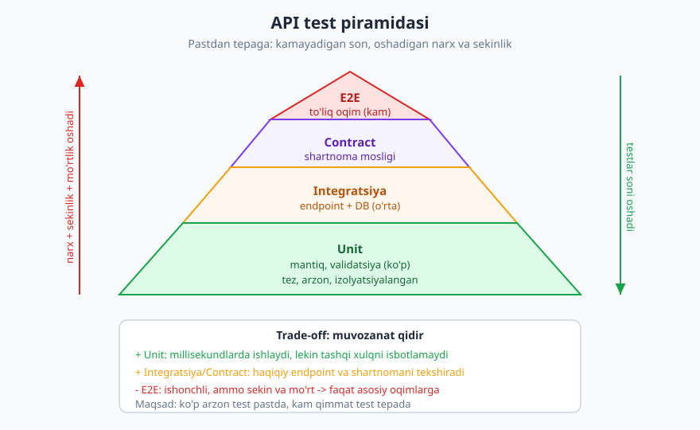
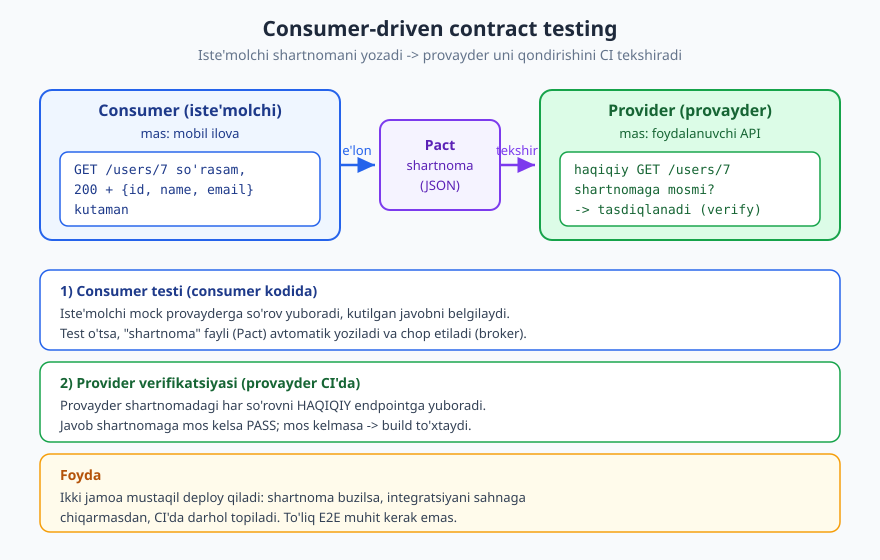
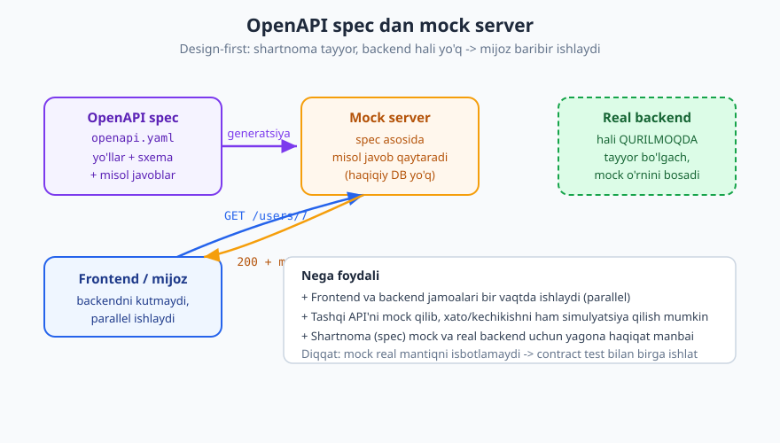

# 24 — API testlash va contract testing

[⬅️ Oldingi: 23 — API gateway, BFF va kompozitsiya](./23-api-gateway-bff.md) · [🏠 README](./README.md) · [Keyingi: 25 — Observability va ishlash ➡️](./25-observability.md)

---

> **Bu bobda:** API'ni qanday qilib ishonchli sinash — **test piramidasi** (ko'p unit, o'rta integratsiya va contract, kam E2E), har bir test turining roli, va kitobning markaziy g'oyasi **contract testing** (consumer-driven, Pact uslubi): iste'molchi kutgan shartnomani provayder buzmasligini mustaqil tekshirish. Shuningdek **mocking / API virtualizatsiya** (OpenAPI spec dan mock server), **schema validatsiya**, nimani testlash kerakligi (muvaffaqiyat, xato holatlari, auth, rate limit, idempotentlik), qisqa xavfsizlik testlari va CI/CD'ga ulash.
>
> **Halollik / Eslatma:** Test piramidasi, contract testing va mocking — bular **muhandislik amaliyotlari** (industriya konvensiyalari), aniq RFC emas. Lekin testlanadigan xulq RFC'larga asoslanadi: HTTP metod/status semantikasi **RFC 9110**, xato formati **RFC 9457** (`application/problem+json`), schema **OpenAPI 3.1** (JSON Schema 2020-12 bilan moslangan; eng yangisi 3.2.0, 2025-sent). Misol JSON/YAML namunalar valid (tekshirilgan). "Pact" bu yerda umumiy yondashuv nomi sifatida ishlatiladi; aniq vosita tanlovi kontekstga bog'liq trade-off, va vositalar versiyasi vaqt bilan o'zgaradi.

---

## Nega API'ni alohida testlash kerak

[01 — API nima](./01-api-nima.md) bobida API'ni **shartnoma** deb atagandik: mijoz va server o'rtasidagi rasmiy kelishuv. Web ilovada tugmani noto'g'ri rangga bo'yasangiz, bitta foydalanuvchi norozi bo'ladi. Lekin **API shartnomasini** buzsangiz — masalan `user_id` maydonini jimgina `userId` ga o'zgartirsangiz — **barcha mijozlar** (mobil ilovalar, hamkor integratsiyalari, ichki xizmatlar) bir vaqtda sinadi. Va ular sizning kodingizni qayta deploy qila olmaydi.

Shuning uchun API testlashning asosiy maqsadi — oddiy "kod ishlayaptimi" emas, balki uchta narsa:

1. **Shartnoma buzilmasligi.** Bugun ishlagan mijoz ertaga ham ishlashi kerak. O'zgarish (refaktoring, yangi xususiyat) **eski shartnomani** sindirmasligini avtomatik kafolatlash.
2. **Regresiya yo'qligi.** Bir joyni tuzatib, boshqa joyni buzmaslik. Test to'plami — "o'tmishda ishlagan narsa hali ham ishlayapti" degan tutib turuvchi to'r.
3. **Mijozlar ishonchi.** Sinalmagan API — "ehtimol ishlar" API. Sinalgan API — "shartnomani himoya qilamiz" degan va'da. Bu ayniqsa **public** va **ko'p-mijozli** API'larda hal qiluvchi.

> **Eslatma:** Test — bu "kelajakdagi o'zingizga yozgan xat". Bir necha oydan keyin kodni o'zgartirganda, test sizga "to'xta, sen shartnomani buzding" deydi. Testsiz har refaktoring — qo'rquv bilan qilingan tikish.

Bu bobda biz API'ga xos test strategiyasini quramiz: qaysi turdagi testlardan **qancha** yozish kerak, va eng muhimi — mijoz bilan server **mos** ekanini qanday isbotlash.

---

## Test piramidasi API kontekstida

Klassik **test piramidasi** g'oyasi sodda: pastda ko'p **arzon va tez** testlar, tepada kam **qimmat va sekin** testlar bo'lsin. API uchun bu piramida shunday ko'rinadi:



| Qatlam | Nima sinaydi | Tezlik | Mo'rtlik | Soni |
|--------|--------------|:------:|:--------:|:----:|
| **Unit** | Alohida funksiya/mantiq, validatsiya qoidalari | juda tez | past | ko'p |
| **Integratsiya** | Haqiqiy endpoint + DB/qatlamlar birga | o'rta | o'rta | o'rta |
| **Contract** | Mijoz va server shartnomaga mosligi | tez | past | o'rta |
| **E2E** | To'liq foydalanuvchi oqimi, real muhit | sekin | yuqori | kam |

Asosiy mantiq — **trade-off**:

- **Unit testlar** millisekundlarda ishlaydi, hech qanday tarmoq yoki DB kerak emas. Lekin ular faqat **ichki mantiqni** isbotlaydi — "endpoint to'g'ri javob beryaptimi" degan savolga javob bermaydi.
- **E2E testlar** eng ishonchli ("haqiqatan ishlayapti"), lekin **sekin** (haqiqiy muhit, tarmoq, ma'lumotlar) va **mo'rt** (bitta tashqi xizmat sekinlashsa, test "yiqiladi", lekin kod aybdor emas). Shuning uchun ulardan **kam** yoziladi — faqat eng muhim oqimlar uchun (ro'yxatdan o'tish, to'lov).
- Orasida **integratsiya** va **contract** testlar haqiqiy qiymatning katta qismini arzon narxda beradi.

> **Anti-pattern:** "Muz konusi" (ice cream cone) — piramidani ag'darish: ko'p sekin E2E, kam unit. Bunday to'plam soatlab ishlaydi, tez-tez "yolg'on yiqiladi" (flaky) va dasturchilar unga ishonmay qo'yadi. Maqsad — asosiy qiymatni **eng past** (eng arzon) qatlamga surish.

> **Trade-off:** Piramida qattiq qoida emas, mo'ljal. Mikroservis dunyosida ko'plar piramidaning "Contract" qatlamini kengaytirib, ba'zi E2E'larni almashtiradi — chunki contract test E2E'dan ancha arzon, lekin "integratsiya buzildimi" degan savolning katta qismiga javob beradi.

---

## Test turlari batafsil

### Unit testlar — mantiqni izolyatsiyada sinash

**Unit test** API'ning **bitta bo'lagini** — funksiya, validator, hisoblash — tarmoq va DB'siz sinaydi. Misol: "agar `quantity` 0 yoki manfiy bo'lsa, validator xato qaytaradimi?"

Bu yerda HTTP yo'q. Siz to'g'ridan-to'g'ri funksiyani chaqirasiz:

```
# psevdokod (har qanday tilda shu g'oya)
natija = buyurtma_validatsiya({"item_id": 42, "quantity": 0})
kutaman: natija.xato == "quantity 1 dan kichik bo'lmasin"
```

Unit testlar **chegaraviy holatlar** (0, manfiy, juda katta, bo'sh string, `null`) va **biznes qoidalari** (chegirma hisoblash, soliq, holat o'tishlari) uchun ideal — chunki ular tez va ularni ko'p yozish arzon.

> **Eslatma:** Unit test endpointning **tashqi xulqini** isbotlamaydi. Validator funksiyasi to'g'ri bo'lishi mumkin, lekin endpoint uni chaqirishni **unutgan** bo'lsa, unit test buni topmaydi. Shu sabab integratsiya kerak.

### Integratsiya testlar — endpointni HTTP darajasida sinash

**Integratsiya test** haqiqiy endpointni HTTP orqali chaqirib, **javobni to'liq** tekshiradi: status kodi, body shakli, headerlar, xato holatlari. Bu yerda routing, validatsiya, biznes mantiq va (ko'pincha) test DB birga ishlaydi.

G'oya: "shu so'rovni yuborsam, shu javobni kutaman".

```http
POST /v1/orders HTTP/1.1
Host: api.example.com
Content-Type: application/json
Authorization: Bearer <token>

{"item_id": 42, "quantity": 2}
```

```http
HTTP/1.1 201 Created
Location: /v1/orders/1001
Content-Type: application/json

{"id": 1001, "status": "pending", "quantity": 2}
```

Integratsiya testi quyidagilarni tasdiqlaydi: status **201** (200 emas — yangi resurs yaratildi, [03 — status kodlari](./03-http-status-kodlari.md)), `Location` header bor, body'da `id` va `status` maydonlari mavjud va to'g'ri shaklda. Bitta test g'oyasi (psevdokod):

```
javob = http_post("/v1/orders", token=t, body={"item_id": 42, "quantity": 2})
kutaman: javob.status == 201
kutaman: javob.header["Location"] == "/v1/orders/1001"
kutaman: javob.body.status == "pending"
```

> **Diqqat:** Integratsiya testlar haqiqiy DB ishlatadi — shuning uchun har test **mustaqil** bo'lsin (o'z ma'lumotini yaratadi va tozalaydi), aks holda testlar bir-biriga ta'sir qilib "flaky" bo'ladi. Ko'pincha har test tranzaksiyada ishlaydi va oxirida rollback qilinadi.

### Contract testlar — mijoz va server mosligini sinash

Mana bobning yuragi. Integratsiya testi serverni **server tomonida** sinaydi. Lekin u savolga javob bermaydi: "mening **mijozim** aynan shu javobni kutyaptimi?" Ikki jamoa alohida ishlaganda, eng xavfli xato — **mos kelmaslik**: server `email` maydonini olib tashlaydi, mijoz esa uni hali ham kutadi.

**Contract testing** aynan shu moslikni — **alohida**, to'liq muhit qurmasdan — sinaydi. Eng tarqalgan yondashuv — **consumer-driven contract** (iste'molchi boshqaradigan shartnoma):



Oqim ikki bosqichli:

1. **Consumer (iste'molchi)** o'z testida **mock provayderga** so'rov yuboradi va aynan **nimani kutishini** belgilaydi: "`GET /v1/users/7` so'rasam, `200` va `{id, name, email}` kutaman". Test o'tsa, bu kutgan narsalar **shartnoma fayli** (Pact) sifatida yoziladi.

2. **Provider (provayder)** o'z CI'sida shu shartnomani oladi va **har bir so'rovni HAQIQIY endpointga** yuboradi. Javob shartnomaga mos kelsa — PASS. Mos kelmasa (masalan `email` yo'qolgan) — **build to'xtaydi**.

Shartnoma fayli — bu ikki jamoa o'rtasidagi rasmiy kelishuvning mashina o'qiy oladigan ko'rinishi:

```json
{
  "consumer": {"name": "MobilIlova"},
  "provider": {"name": "FoydalanuvchiAPI"},
  "interactions": [
    {
      "description": "mavjud foydalanuvchini olish",
      "request": {"method": "GET", "path": "/v1/users/7"},
      "response": {
        "status": 200,
        "headers": {"Content-Type": "application/json"},
        "body": {"id": 7, "name": "Ali", "email": "ali@example.com"}
      }
    }
  ]
}
```

> **Standart:** Contract testing aniq RFC emas — bu **muhandislik amaliyoti** (Pact eng mashhur vosita oilasi). "Consumer-driven" — iste'molchi o'ziga **kerak** bo'lgan minimal shartnomani belgilaydi, provayder esa undan ko'proq bersa ham (qo'shimcha maydonlar) shartnoma buzilmaydi. Shu sabab qo'shimcha qo'shish — buzilmaydigan o'zgarish ([10 — versiyalash](./10-versiyalash.md)).

**Nega bu kuchli:** contract test **mustaqil deploy** imkonini beradi. Ikki jamoa bir-birining muhitini ko'tarmasdan, faqat shartnoma faylini almashib, "biz hali ham mos kelyapmizmi" deb tekshiradi. Shartnoma buzilsa — sahnaga chiqarmasdan, CI'da topiladi. Bu sekin, mo'rt E2E'larning katta qismini almashtiradi.

> **Diqqat:** Consumer va provider testlari **alohida** ishlaydi va alohida bog'liqliklarni mock qiladi. Shuning uchun contract test "shu ikki tomon mos" deydi, lekin "butun tizim ishlayapti" demaydi. Eng muhim oqimlar uchun baribir ozgina E2E qoldiring.

### Schema validatsiya — javob spec'ga mosligini avtomatik tekshirish

Agar sizda [21 — OpenAPI](./21-openapi.md) spec bo'lsa, undan **bepul** test olishingiz mumkin: har bir endpoint javobi spec'dagi schema'ga mos kelishini avtomatik tekshirish. Bu contract testning bir turi — bu yerda "shartnoma" sizning OpenAPI faylingiz.

Spec quyidagicha javob shaklini belgilaydi:

```yaml
openapi: 3.1.0
info:
  title: Foydalanuvchi API
  version: 1.0.0
paths:
  /v1/users/{id}:
    get:
      summary: Foydalanuvchini olish
      parameters:
        - name: id
          in: path
          required: true
          schema:
            type: integer
      responses:
        "200":
          description: Topildi
          content:
            application/json:
              schema:
                type: object
                required: [id, name, email]
                properties:
                  id:
                    type: integer
                  name:
                    type: string
                  email:
                    type: string
                    format: email
              example:
                id: 7
                name: Ali
                email: ali@example.com
        "404":
          description: Topilmadi
```

Test g'oyasi: real javobni oling, uni spec'dagi schema'ga **validate** qiling. Agar javobda `email` yo'q bo'lsa yoki `id` string bo'lib qolgan bo'lsa — test yiqiladi, chunki `required` va `type` buzilgan:

```
javob = http_get("/v1/users/7", token=t)
kutaman: javob.status == 200
kutaman: schema_validate(javob.body, spec["/v1/users/{id}"]["200"])  # mos
```

> **Eslatma:** Schema validatsiya **shaklni** (maydon bormi, turi to'g'rimi) tekshiradi, lekin **qiymat to'g'riligini** (masalan `name` haqiqatan o'sha foydalanuvchiniki ekanini) tekshirmaydi. Shu sabab uni integratsiya testlari bilan birga ishlat: schema = shakl, integratsiya = mantiq.

### E2E testlar — to'liq oqim, real muhit

**E2E (end-to-end)** test haqiqiy (yoki haqiqiyga juda yaqin) muhitda **to'liq foydalanuvchi oqimini** sinaydi: ro'yxatdan o'tish -> tizimga kirish -> buyurtma yaratish -> to'lov -> tasdiq. Bu yerda hech narsa mock qilinmaydi.

E2E eng ishonchli signal beradi ("foydalanuvchi haqiqatan shu yo'ldan o'ta oladi"), lekin eng qimmat. Shu sabab ulardan **oz** yoziladi — faqat **biznes uchun hal qiluvchi** oqimlar.

> **Trade-off:** E2E va contract o'rtasidagi tanlov ko'pincha "qancha ishonch kerak vs qancha narx ko'tara olaman" savoli. Ko'p mikroservis jamoasi qoidasi: "har integratsiya nuqtasini contract bilan qopla, faqat eng muhim foydalanuvchi safarini E2E bilan qopla".

---

## Mocking va API virtualizatsiya

**Mocking** — haqiqiy bog'liqlik o'rniga **soxta** (oldindan dasturlangan) versiyasini qo'yish. API testlashda u ikki tomonda foydali.

### 1) OpenAPI spec dan mock server

[21 — OpenAPI](./21-openapi.md) bobida ko'rgan **design-first** yondashuvning eng yoqimli mevasi: spec tayyor bo'lsa, undan **mock server** generatsiya qilish mumkin. Mock server haqiqiy backend hali **qurilmagan** bo'lsa ham, spec'dagi misol javoblarni qaytaradi.



Foydasi:

- **Parallel ishlash:** frontend jamoasi backend tayyor bo'lishini kutmaydi — mock'ga so'rov yuborib UI'ni quradi. Backend tayyor bo'lgach, mock'ni real URL bilan almashtiradi.
- **Yagona haqiqat manbai:** mock ham, real backend ham **bir xil spec'ga** bo'ysunadi, shuning uchun mock'ga moslab qurilgan mijoz real backendga ham mos keladi.

### 2) Test uchun tashqi API'ni mock qilish

Sizning API'ingiz tashqi xizmatga (to'lov shlyuzi, SMS, xarita) bog'liq bo'lsa, integratsiya testlarida har safar haqiqiy tashqi API'ni chaqirish — sekin, qimmat (ba'zan pulli) va **ishonchsiz** (tashqi xizmat tushib qolsa, sizning testingiz "yiqiladi"). Yechim — tashqi API'ni **mock** qilish:

- **Muvaffaqiyat javobini** simulyatsiya qilish (to'lov o'tdi).
- **Xato holatlarini** simulyatsiya qilish (to'lov rad etildi, `503`).
- **Kechikishni** simulyatsiya qilish (timeout xulqini sinash) — bu boshqacha yo'l bilan sinash qiyin.

> **Diqqat (eng muhim cheklov):** Mock **siz dasturlagan narsani** qaytaradi — u real backendning **haqiqiy mantiqini** isbotlamaydi. Agar siz mock'ni noto'g'ri javob beradigan qilib sozlasangiz, testlaringiz yashil bo'lib, real integratsiya buzilgan bo'lishi mumkin. Aynan shu bo'shliqni **contract test** to'ldiradi: mock kutgan shartnoma haqiqiy provayder bilan tasdiqlanadi. Mock + contract = parallel ishlash + ishonch.

---

## Nimani testlash kerak

Yangi boshlovchilar faqat **"baxtli yo'l"ni** (hammasi to'g'ri kirgan holat) sinaydi. Lekin API'lar ko'pincha **xato yo'llarida** sinadi. Quyida API endpointi uchun "qamrov xaritasi":

### Muvaffaqiyat yo'llari

To'g'ri kirish bilan to'g'ri javob: `200`/`201`/`204`, to'g'ri body, to'g'ri `Location` header. Bu — minimal asos.

### Xato holatlari (eng ko'p e'tibordan chetda qoladigan)

Har bir mantiqiy xato uchun **to'g'ri status kodi** va **to'g'ri xato body** ([09 — xato dizayni](./09-xato-dizayni.md), `application/problem+json` — RFC 9457):

| Holat | Kutilgan status | Testlash kerak |
|-------|:---------------:|----------------|
| Yaroqsiz so'rov shakli | `400` | sintaktik buzuq JSON |
| Autentifikatsiyasiz | `401` | token yo'q/yaroqsiz |
| Ruxsatsiz | `403` | autentifikatsiyalangan, lekin huquqi yo'q |
| Topilmadi | `404` | mavjud bo'lmagan `id` |
| Konflikt | `409` | takroriy yaratish, holat ziddiyati |
| Semantik validatsiya | `422` | shakl to'g'ri, lekin qiymat noto'g'ri |

`401` va `403` farqi ([11 — autentifikatsiya](./11-autentifikatsiya.md)) — alohida test holatlari bo'lsin: `401` = "kimligingni bilmayman", `403` = "kimligingni bilaman, lekin bu mumkin emas". Xato body misoli:

```json
{
  "type": "https://api.example.com/problems/validation-error",
  "title": "So'rov tanasi yaroqsiz",
  "status": 422,
  "detail": "quantity maydoni 1 dan kichik bo'lishi mumkin emas",
  "instance": "/v1/orders",
  "errors": [
    {"field": "quantity", "code": "min", "message": "1 dan kichik bo'lmasin"}
  ]
}
```

Test bu yerda `status == 422` VA `body.type` to'g'ri URI ekanini VA `errors` ichida `quantity` borligini tekshiradi — chunki mijozlar bu **mashina o'qiy oladigan** `type` ga tayanadi.

### Chegaraviy holatlar

Bo'sh ro'yxat, `null` maydonlar, juda uzun string, juda katta son, Unicode (emoji, o'zbek harflari), maksimal/minimal qiymatlar, sahifaning oxiri.

### Maxsus API xulqlari (bu kitobning mavzulari)

- **Autentifikatsiya** ([11](./11-autentifikatsiya.md)): yaroqli token, muddati o'tgan token, yaroqsiz imzo — har biri to'g'ri javob beradimi.
- **Rate limiting** ([14 — rate limiting](./14-rate-limiting.md)): limitdan oshganda `429` va `Retry-After` header qaytadimi.
- **Idempotentlik** ([15 — idempotentlik](./15-idempotentlik-parallellik.md)): bir xil `Idempotency-Key` bilan ikki marta yuborsang, server **bir marta** bajaradimi va bir xil javob qaytaradimi. Bu eng muhim testlardan, chunki uni qo'lda topish qiyin.
- **Pagination** ([08 — sahifalash](./08-sahifalash-filtrlash.md)): birinchi sahifa, oxirgi sahifa, bo'sh natija, `Link` header'dagi `next`/`prev` to'g'rimi.

> **Eslatma:** Bu xulqlarni testlash — shartnomaning "ko'rinmas" qismini himoya qilish. Maydon shaklini hamma tekshiradi; lekin "`429` da `Retry-After` bormi" yoki "takror yuborilganda to'lov ikki marta bo'lmaydimi" degan testlar haqiqiy ishonchni beradi.

---

## Xavfsizlik testlash (qisqacha)

To'liq xavfsizlik [13 — API xavfsizligi](./13-api-xavfsizligi.md) bobida; bu yerda **avtomatik testga** aylantirsa bo'ladigan ikki muhim turni eslatamiz.

**Avtorizatsiya (BOLA/BFLA) testlari** — OWASP API Security Top 10 (2023) ro'yxatidagi **API1 (BOLA)** eng keng tarqalgan zaiflik. Test g'oyasi sodda, lekin hayotiy:

```
# Ali tizimga kirgan, lekin Vali'ning buyurtmasini so'raydi
javob = http_get("/v1/orders/999", token=ali_token)  # 999 = Vali'niki
kutaman: javob.status == 403 yoki 404   # Ali'niki EMAS
```

Bunday test "boshqa foydalanuvchi resursiga kira olmaslik"ni avtomatik kafolatlaydi. **Har** resursli endpoint uchun "begona obyektga kirib bo'lmaydi" testi yozish — eng yuqori qaytar beradigan xavfsizlik testi.

**Fuzzing** — endpointga ataylab buzuq, kutilmagan kirishlar (juda uzun string, maxsus belgilar, `null`, noto'g'ri turlar) yuborib, server **`500` bilan qulamasligini** (balki toza `400`/`422` qaytarishini) tekshirish. OpenAPI spec'dan avtomatik fuzz testlar generatsiya qilish mumkin.

> **Xavfsizlik:** Avtorizatsiya testlari **regresiyani** ham tutadi: bugun to'g'ri ishlagan tekshiruvni ertaga refaktoring buzib qo'yishi mumkin. BOLA testi shu xatoni deploy'dan oldin topadi.

---

## CI/CD: testni quvurga ulash

Test faqat **avtomatik** va **har o'zgarishda** ishlaganda qiymat beradi. Tipik CI/CD quvuri har push/PR'da quyidagilarni ketma-ket bajaradi:

1. **Unit testlar** — eng tez, birinchi to'siq.
2. **Integratsiya testlar** — test DB ko'tariladi, endpointlar sinaladi.
3. **Schema / spec lint** — OpenAPI spec o'zi yaroqlimi (valid 3.1) va **buzilmaydigan** o'zgarishmi (eski maydon olib tashlanmadimi).
4. **Contract verify** — provayder iste'molchilar shartnomasini hali ham qondiradimi.
5. (ixtiyoriy) **Asosiy E2E** — staging muhitda bir-ikki kritik oqim.

Asosiy qoida: **shartnoma buzilsa, build to'xtaydi.** Ya'ni mos kelmaslik **sahnaga chiqmaydi** — u CI'da, deploy'dan oldin tutiladi.

```
push -> [unit] -> [integratsiya] -> [spec lint] -> [contract verify] -> [deploy]
              har bosqich yiqilsa: quvur to'xtaydi, deploy bo'lmaydi
```

> **Trade-off:** Contract verify'ni CI'ga ulashda "qaysi versiyalar mos" degan masala chiqadi (provayder yangi, iste'molchi eski). Pact uslubidagi vositalar buni "broker" orqali boshqaradi: qaysi iste'molchi qaysi provayder versiyasiga deploy qilingani kuzatiladi, va "xavfsiz deploy qilsa bo'ladimi" degan savolga javob beriladi.

---

## Halollik: 100% qamrov maqsad emas

Yangi jamoalar tez-tez "**100% kod qamrovi**"ni maqsad qilib qo'yadi. Bu **adashtiruvchi** o'lchov. Qamrovni 100% qilish uchun ahamiyatsiz kodga ham test yozasiz (vaqt ketadi), lekin baribir **shartnomani** yoki muhim xato yo'lini sinamasligingiz mumkin. Qamrov "qaysi qator ishladi"ni o'lchaydi — "to'g'ri xulqni isbotladimi"ni emas.

To'g'ri mo'ljal — **xavfga asoslangan**:

- **Muhim yo'llar:** to'lov, ro'yxatdan o'tish, asosiy biznes oqimlari — chuqur sinaladi.
- **Shartnoma:** har public endpoint shakli contract/schema bilan himoyalanadi.
- **Xato holatlari:** `4xx` yo'llari (`401`/`403`/`404`/`409`/`422`) — chunki real foydalanuvchilar shu yerda ko'p qoqiladi.
- **Ahamiyatsiz / o'z-o'zidan ravshan kod** — kam yoki umuman test kerak emas.

> **Eslatma:** Yaxshi savol "qamrovim necha foiz?" emas, balki "agar shu test to'plami yashil bo'lsa, men deploy qilishga **ishonamanmi**?". Agar javob "yo'q" bo'lsa — qamrov son emas, balki muhim yo'llar yetishmayapti.

---

## Asosiy g'oyalar (bobni qisqacha)

- API testlashning maqsadi — **shartnomani himoya qilish**, regresiyani ushlash va mijozlar ishonchini ta'minlash; API buzilsa, hamma mijoz bir vaqtda sinadi.
- **Test piramidasi:** ko'p arzon **unit**, o'rta **integratsiya** va **contract**, kam qimmat **E2E**. E2E sekin/mo'rt — faqat eng muhim oqimlarga.
- **Unit** = izolyatsiyalangan mantiq/validatsiya; **integratsiya** = haqiqiy endpoint + DB HTTP darajasida; **E2E** = to'liq oqim real muhitda.
- **Contract testing** (consumer-driven, Pact uslubi) — bobning yuragi: iste'molchi shartnoma yozadi, provayder uni CI'da tasdiqlaydi. Bu **mustaqil deploy** imkonini beradi va to'liq muhit qurmasdan mos kelmaslikni topadi.
- **Schema validatsiya** — OpenAPI 3.1 spec'dan bepul test: javob shakli spec'ga mos kelishini avtomatik tekshirish (shaklni, qiymatni emas).
- **Mocking:** OpenAPI spec'dan mock server (frontend backendni kutmaydi); tashqi API'ni mock qilib xato/kechikishni simulyatsiya qilish. Lekin mock real mantiqni isbotlamaydi — contract bilan birga ishlat.
- **Nimani sinash:** muvaffaqiyat + xato holatlari (`400`/`401`/`403`/`404`/`409`/`422`) + chegaraviy holatlar + auth/rate limit/idempotentlik/pagination.
- **Xavfsizlik:** BOLA/avtorizatsiya testlari (begona resursga kira olmaslik) va fuzzing — avtomatik testga aylantirilsa, regresiyani tutadi.
- **CI/CD:** har o'zgarishda unit -> integratsiya -> spec lint -> contract verify. **Shartnoma buzilsa, build to'xtaydi.**
- **100% qamrov maqsad emas;** xavfga asoslangan: muhim yo'llar + shartnoma + xato holatlari muhimroq.

---

## Mashqlar

### Oson

**1-mashq.** Quyidagi har bir testni piramidaning qaysi qatlamiga (unit / integratsiya / contract / E2E) joylaysiz?

- (a) "`buyurtma_narxi()` funksiyasi 3 ta element uchun to'g'ri jami qaytaradimi".
- (b) "Mijoz `GET /users/7` ga `email` maydoni qaytishini kutyapti — provayder buni beradimi".
- (c) "Foydalanuvchi ro'yxatdan o'tib, buyurtma berib, to'lovni yakunlay oladimi (real staging)".
- (d) "`POST /v1/orders` haqiqatan `201` va `Location` header qaytaradimi".

**2-mashq.** "Safe yo'l" (happy path) nima va nega faqat uni testlash yetarli emas? Faqat baxtli yo'lni sinasangiz, qanday muammolarni o'tkazib yuborasiz — uchta misol keltiring.

**3-mashq.** Mock server qachon foydali? Bitta aniq stsenariy ayting (jamoa ishi nuqtai nazaridan), va mock'ning bitta muhim cheklovini ayting.

### O'rta

**4-mashq.** `PUT /v1/users/{id}` (foydalanuvchi profilini yangilash) endpointi uchun **integratsiya test holatlari** ro'yxatini yozing. Kamida 5 ta holat — har biriga kutilgan status kodi. Faqat baxtli yo'lni emas, xato yo'llarini ham qamrang.

**5-mashq.** Consumer-driven contract testing'ni o'z so'zlaringiz bilan tushuntiring: ikki bosqich nima, "shartnoma fayli"ni kim yozadi va kim tekshiradi, va nega bu E2E'dan arzonroq?

**6-mashq.** Quyidagi vaziyatlarning har birida **mock**, **contract test**, yoki **integratsiya test**dan qaysi biri to'g'ri keladi — va nega?

- (a) Frontend jamoasi backend hali qurilmaganda UI quryapti.
- (b) Tashqi to'lov shlyuzi `503` qaytarganda sizning API'ingiz to'g'ri ishlashini sinash.
- (c) Sizning API'ingiz haqiqatan `409 Conflict`ni to'g'ri body bilan qaytarishini tasdiqlash.

### Qiyin

**7-mashq.** Ikki jamoa bor: **MobilIlova** (iste'molchi) va **FoydalanuvchiAPI** (provayder). Ular mustaqil deploy qilmoqchi. **Consumer-driven contract** oqimini boshidan oxirigacha dizayn qiling: kim nimani yozadi, shartnoma qayerda saqlanadi, CI quvurida qaysi bosqichda nima tekshiriladi, va "shartnoma buzilsa" nima sodir bo'ladi. Provayder `email` maydonini olib tashlamoqchi bo'lganida tizim qanday himoya qiladi — tushuntiring.

**8-mashq.** `GET /v1/orders/{id}` endpointi uchun **xato + xavfsizlik** test holatlarining to'plamini tuzing. Kamida 6 ta holat, har biriga: so'rov tavsifi + kutilgan status. Kamida bittasi BOLA (begona foydalanuvchi resursiga kirish) testi bo'lsin. Nega BOLA testi alohida muhim?

**9-mashq.** Jamoa "bizda 95% kod qamrovi bor, demak API ishonchli" deyapti. Bu xulosaning xatosini tushuntiring: qamrov nimani o'lchaydi va nimani o'lchamaydi? Qamrov yuqori bo'lsa-da, qaysi muhim narsalar sinalmagan bo'lishi mumkin — uchta aniq misol keltiring.

<details markdown="1">
<summary>Yechimlar</summary>

### 1-mashq yechimi

- (a) **Unit** — bitta funksiyaning ichki mantiqi, tarmoq/DB yo'q.
- (b) **Contract** — iiste'molchi kutgan shartnoma provayder tomonidan tasdiqlanishi. (Tuzatish: "iste'molchi".) Bu mijoz va server mosligini sinaydi.
- (c) **E2E** — to'liq foydalanuvchi oqimi, real (staging) muhit, hech narsa mock emas.
- (d) **Integratsiya** — haqiqiy endpoint HTTP darajasida, status va header tekshiriladi.

Eslatma: (b) va (d) o'xshash ko'rinadi, lekin farqi — (d) serverni **server tomonida** sinaydi, (b) esa mijoz **kutgan** narsa bilan **mos**likni sinaydi.

### 2-mashq yechimi

**Safe yo'l (happy path)** — hamma narsa to'g'ri kirgan, kutilgan natija chiqqan holat: yaroqli token, to'g'ri body, mavjud resurs -> `200`/`201`. Faqat uni sinash yetarli emas, chunki real hayotda foydalanuvchilar va mijozlar ko'pincha **noto'g'ri** yo'llardan keladi.

Uchta o'tkazib yuboriladigan muammo:

1. **Xato holatlari** — yaroqsiz kirishda server `500` bilan qulashi mumkin (`400`/`422` o'rniga). Happy-path testi buni hech qachon ko'rmaydi.
2. **Avtorizatsiya teshiklari** — boshqa foydalanuvchining resursiga kirish mumkinmi (BOLA)? Happy path o'z resursiga kiradi, begona resursni sinamaydi.
3. **Chegaraviy holatlar** — bo'sh ro'yxat, `null` maydon, juda katta qiymat, sahifaning oxiri — bularning bari happy-path'da uchramaydi, lekin ishlab chiqarishda muqarrar yuz beradi.

### 3-mashq yechimi

**Foydali stsenariy:** frontend jamoasi backend hali qurilmaganda ishlamoqchi. OpenAPI spec'dan **mock server** ko'tariladi, frontend mock'ga so'rov yuborib UI'ni quradi — backend tayyor bo'lishini kutmaydi. Ikki jamoa **parallel** ishlaydi, bu vaqtni tejaydi. (Boshqa to'g'ri stsenariy: tashqi pulli API'ni har testda chaqirmaslik uchun mock qilish.)

**Muhim cheklov:** mock **siz dasturlagan** javobni qaytaradi — u real backendning **haqiqiy mantiqini** isbotlamaydi. Mock'ni noto'g'ri sozlasangiz, testlar yashil, lekin real integratsiya buzilgan bo'lishi mumkin. Shu sabab mock'ni **contract test** bilan birga ishlatish kerak.

### 4-mashq yechimi

`PUT /v1/users/{id}` (idempotent, to'liq almashtirish) uchun integratsiya test holatlari:

| Holat | Kutilgan status |
|-------|:---------------:|
| Yaroqli token + yaroqli body + mavjud `id` (baxtli yo'l) | `200 OK` (yangilangan resurs) |
| Autentifikatsiyasiz (token yo'q) | `401 Unauthorized` |
| Boshqa foydalanuvchining `id`'si (huquq yo'q) | `403 Forbidden` |
| Mavjud bo'lmagan `id` | `404 Not Found` |
| Yaroqsiz body (sintaktik buzuq JSON) | `400 Bad Request` |
| Body shakli to'g'ri, lekin qiymat noto'g'ri (mas: `email` yaroqsiz format) | `422 Unprocessable Content` |
| Yaroqli body'ni **ikki marta** yuborish (idempotentlik) | ikkala marta `200`, server holati bir xil |

Eslatma: `PUT` idempotent ([15 — idempotentlik](./15-idempotentlik-parallellik.md)) bo'lgani uchun oxirgi holat muhim — takror yuborish bir xil natija qoldirishini tasdiqlaydi. `401` (kim ekaningni bilmayman) va `403` (bilaman, lekin mumkin emas) alohida holatlar.

### 5-mashq yechimi

**Consumer-driven contract testing** ikki bosqichda ishlaydi:

1. **Consumer testi (iste'molchi kodida):** iste'molchi **mock provayderga** so'rov yuboradi va aynan nimani kutishini belgilaydi ("`GET /users/7` -> `200` + `{id, name, email}`"). Test o'tsa, bu kutgan narsalar **shartnoma faylini** (Pact) avtomatik yozadi. **Shartnoma faylini iste'molchi yozadi.**

2. **Provider verifikatsiyasi (provayder CI'da):** provayder shartnomadagi har so'rovni **haqiqiy endpointga** yuboradi va javob shartnomaga mos kelishini tekshiradi. **Shartnomani provayder tekshiradi.**

**Nega E2E'dan arzonroq:** contract testda har tomon **alohida** ishlaydi — to'liq muhit (ikkala xizmat, DB, tarmoq) ko'tarilmaydi. Iste'molchi mock bilan, provayder o'z endpointi bilan. Shu sabab u **tez** va **barqaror** (kam flaky), lekin baribir "ikki tomon mosmi" degan asosiy savolga javob beradi. E2E esa butun muhitni ko'taradi — sekin va mo'rt.

### 6-mashq yechimi

- (a) **Mock** (OpenAPI spec'dan mock server) — backend yo'q, frontend spec asosidagi misol javoblar bilan ishlaydi, parallel rivojlanish.
- (b) **Integratsiya test (tashqi API'ni mock qilib)** — bu yerda **tashqi** to'lov shlyuzini mock qilib, uni `503` qaytaradigan qilib sozlaysiz, so'ng **o'z** endpointingizni haqiqiy chaqirib, u to'g'ri ishlashini (mas: `502`/`503` qaytarishi, retry qilishi) tekshirasiz. Mock — kirish; sinalayotgan narsa — sizning kodingiz.
- (c) **Integratsiya test** — o'z endpointingiz haqiqatan `409`ni to'g'ri body ([09 — xato dizayni](./09-xato-dizayni.md)) bilan qaytarishini HTTP darajasida tasdiqlash. (Agar mijoz `409`ni kutishini kafolatlamoqchi bo'lsangiz, qo'shimcha contract test ham foydali.)

### 7-mashq yechimi

**To'liq consumer-driven contract oqimi:**

1. **Iste'molchi (MobilIlova) shartnomani yozadi.** MobilIlova jamoasi o'z testlarida mock `FoydalanuvchiAPI`ga so'rov yuboradi: "`GET /v1/users/7` so'rasam, `200` va `{id, name, email}` kutaman". Test o'tsa, **Pact shartnoma fayli** generatsiya bo'ladi.

2. **Shartnoma markaziy joyda saqlanadi.** Fayl **broker**ga (umumiy ombor) chop etiladi, shunda provayder uni topa oladi. Broker qaysi iste'molchi qaysi versiyaga deploy qilinganini ham kuzatadi.

3. **Provayder (FoydalanuvchiAPI) CI'da verify qiladi.** FoydalanuvchiAPI quvuri brokerdan shartnomani oladi va har so'rovni **haqiqiy** `FoydalanuvchiAPI`ga yuboradi. Javob shartnomaga mos kelsa — PASS.

4. **CI bosqichi:** `... -> [provayder testlari] -> [contract verify] -> [deploy]`. Contract verify yiqilsa — quvur to'xtaydi, deploy bo'lmaydi.

**`email`ni olib tashlaganda himoya:** provayder `email`ni javobdan olib tashlaydi va kodini push qiladi. CI'da contract verify ishlaydi: shartnoma `email`ni talab qiladi, lekin haqiqiy javobda u yo'q -> **verify yiqiladi** -> **build to'xtaydi**. Demak buzilgan o'zgarish **sahnaga chiqmaydi**. Provayder MobilIlova bilan kelishmaguncha (yoki mijoz yangilanmaguncha) deploy qila olmaydi. Aynan shu — mustaqil deploy'ni xavfsiz qiladigan narsa: har jamoa o'z tezligida ishlaydi, lekin shartnoma ikkalasini bog'lab turadi.

### 8-mashq yechimi

`GET /v1/orders/{id}` uchun xato + xavfsizlik test holatlari:

| So'rov tavsifi | Kutilgan status |
|----------------|:---------------:|
| Token yo'q | `401 Unauthorized` |
| Yaroqsiz / muddati o'tgan token | `401 Unauthorized` |
| Mavjud bo'lmagan `id` | `404 Not Found` |
| Yaroqsiz `id` formati (mas: `abc`) | `400 Bad Request` |
| **Begona foydalanuvchi buyurtmasi** (Ali so'rasa, Vali'niki) — BOLA | `403` yoki `404` (Ali'niki EMAS) |
| Yumshoq o'chirilgan / `410 Gone` resurs (agar qo'llanilsa) | `410 Gone` |

**Nega BOLA testi alohida muhim:** BOLA (Broken Object Level Authorization) — OWASP API Security Top 10 (2023) ro'yxatining **API1**, ya'ni eng keng tarqalgan va og'ir zaiflik. Sababi: endpoint `id`'ni qabul qiladi, lekin "**bu foydalanuvchi shu obyektga egami**" tekshiruvini unutish juda oson. Happy-path testi o'z resursiga kiradi va hech qachon begona resursni sinamaydi — shuning uchun BOLA teshigini faqat **maxsus** "Ali Vali'ning buyurtmasini so'raydi" testi tutadi. Bu test regresiyani ham himoya qiladi: bugun ishlagan huquq tekshiruvini ertaga refaktoring buzib qo'ymasligini kafolatlaydi. To'liqroq: [13 — API xavfsizligi](./13-api-xavfsizligi.md).

### 9-mashq yechimi

**Kod qamrovi (code coverage)** — test ishga tushganda kodning **qaysi qatorlari bajarilganini** o'lchaydigan metrika. 95% qamrov "kod qatorlarining 95% i biron-bir test davomida ishga tushdi" degani.

**Xatosi:** qamrov "qator ishladimi"ni o'lchaydi, "**to'g'ri xulq isbotlandi**mi"ni emas. Qator ishlashi mumkin, lekin test uning natijasini **tekshirmasligi** mumkin (assertion yo'q). Qamrov yuqori — lekin ishonch kafolatlanmaydi.

Yuqori qamrovda ham sinalmagan bo'lishi mumkin bo'lgan uchta narsa:

1. **Shartnoma mosligi** — kod ichdan ishlasa-da, mijoz kutgan **javob shakli** o'zgargan bo'lishi mumkin (maydon nomi, turi). Buni contract/schema test tutadi, qamrov emas.
2. **Avtorizatsiya teshiklari (BOLA)** — huquq tekshiruvi kodi "ishlagan" (qatori bajarilgan) bo'lishi mumkin, lekin u **begona resursni rad etishini** hech kim tasdiqlamagan bo'lishi mumkin.
3. **Xato yo'llari va chegaralar** — `429`'da `Retry-After` bormi, takroriy `Idempotency-Key` ikki marta bajarmaydimi, bo'sh sahifa to'g'ri ishlaydimi — bular ko'pincha "qator ishladi" deb hisoblansa-da, **mazmunan** sinalmagan bo'ladi.

Xulosa: to'g'ri savol "qamrovim necha foiz" emas, balki "bu testlar yashil bo'lsa, deploy qilishga **ishonamanmi**". Xavfga asoslangan testlash — muhim yo'llar + shartnoma + xato holatlari — sondan muhimroq.

</details>

---

[⬅️ Oldingi: 23 — API gateway, BFF va kompozitsiya](./23-api-gateway-bff.md) · [🏠 README](./README.md) · [Keyingi: 25 — Observability va ishlash ➡️](./25-observability.md)
