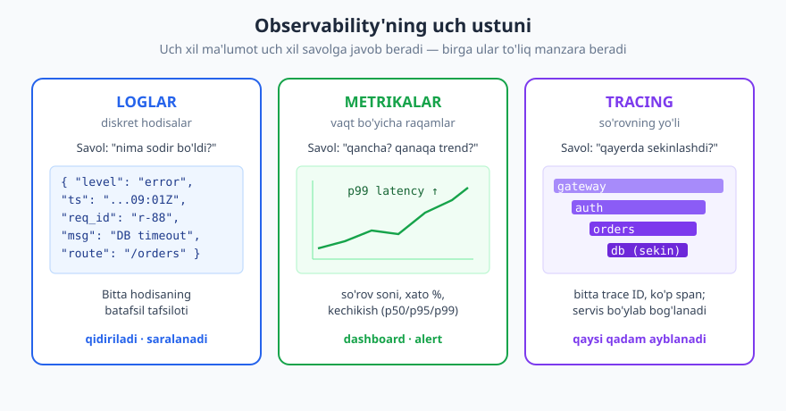
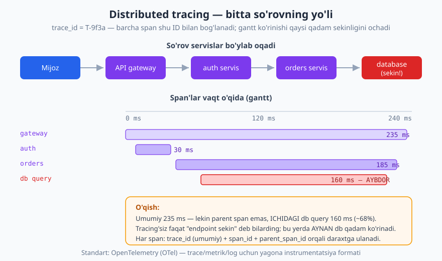
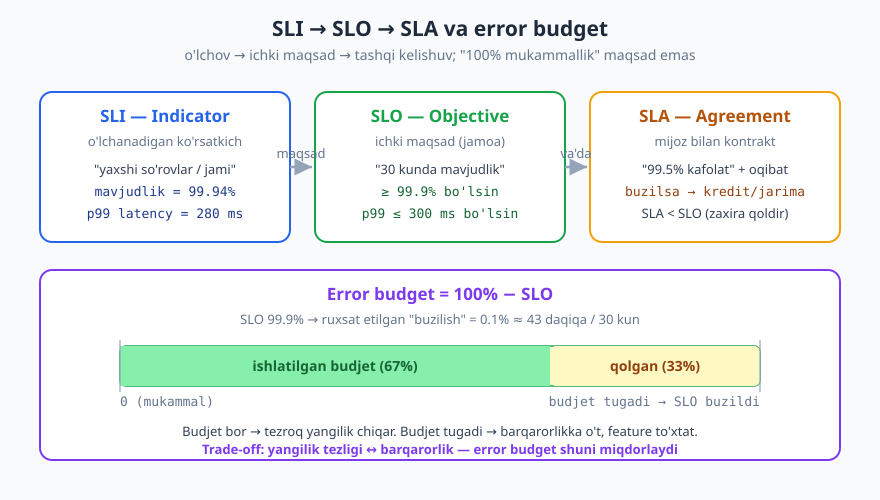

# 25 — Observability va ishlash

[⬅️ Oldingi: 24 — API testlash va contract testing](./24-testlash-contract.md) · [🏠 README](./README.md) · [Keyingi: 26 — API hayot sikli va boshqaruv ➡️](./26-hayot-sikli-governance.md)

---

> **Bu bobda:** API yozildi, test o'tdi, ishlab chiqarishga (production) chiqdi — endi nima? Tunda telefoningiz jiringlaydi: "API sekin". Qayerda? Qaysi endpoint? Qaysi servis? Buni bilish uchun **observability** (kuzatuvchanlik) kerak. Bu bobda observability'ning **uch ustuni** — loglar, metrikalar, tracing — ni, **SLI/SLO/SLA** va **error budget** orqali ishonchlilik maqsadlarini qo'yishni, **alerting** ni (alert-charchog'isiz), so'ng **ishlash (performance)** optimizatsiyasini (kechikish manbalari, payload, siqish, kesh, batch, N+1) va mijoz tomonidagi mustahkamlikni (retry + backoff + jitter, timeout, circuit breaker) ko'ramiz.
>
> **Halollik / Eslatma:** Status kodlari va `Retry-After` **RFC 9110** ga, keshlash **RFC 9111** ga, `Link` sarlavhasi **RFC 8288** ga asoslanadi — bular barqaror standartlar. Observability tushunchalarining ko'pi (uch ustun, RED metodi, SLI/SLO, error budget, RED/USE) — bu **muhandislik konvensiyalari** (Google SRE kitobi, sanoat amaliyoti tomonidan shakllangan), rasmiy IETF RFC emas; men ularni "amaliyotda" deb belgilayman, RFC raqami ixtiro qilmayman. **OpenTelemetry (OTel)** — trace/metrik/log uchun ochiq instrumentatsiya standarti (CNCF loyihasi); u vaqt bilan rivojlanadi. JSON namunalari valid. Aniq raqamlar (necha p99, necha SLO) — kontekstga bog'liq trade-off, men ularni misol sifatida beraman.

---

## Observability nima va nega kerak

Tasavvur qiling, mashinangiz bor, lekin unda **hech qanday asbob yo'q**: tezlik o'lchagich yo'q, yonilg'i ko'rsatkichi yo'q, dvigatel chirog'i yo'q. Mashina yuradi — toki yurguncha. Bir kun to'xtab qoladi. Nega? Yonilg'i tugadimi? Dvigatel qizib ketdimi? Bilmaysiz — kapotni ochib taxmin qilasiz. Endi tasavvur qiling, panelda hamma asbob bor: bir qarashda yonilg'i kam ekanini, harorat normal ekanini ko'rasiz. Muammo yuzaga kelishidan **oldin** ko'rasiz.

**Observability** — bu API'ngizning "asboblar paneli". Texnik ta'rifi: tizimni **tashqaridan kuzatib**, uning **ichida nima bo'layotganini** tushunish qobiliyati. Faqat "ishlayaptimi yoki yo'qmi" emas — "**nega** sekin, **qayerda** xato, **kim** ta'sirlandi" degan savollarga javob bera olish.

Nega API uchun bu juda muhim:

- **API ko'p mijozga xizmat qiladi.** Bitta endpoint minglab mobil ilova, integratsiya, ichki servisga xizmat qiladi. Bittasi buzilsa — barchasiga ta'sir qiladi. Kuzatuvsiz, siz uni **mijoz shikoyat qilgandagina** bilasiz (eng yomon signal).
- **Tarqoq (distributed).** Zamonaviy API ortida ko'p servis bor (gateway, auth, biznes-logika, DB, tashqi servislar — [23-bob](./23-api-gateway-bff.md)). So'rov ularning bittasida sekinlashsa, qaysi birida ekanini topish — kuzatuvsiz — pichanzorda igna izlash.
- **Ishlab chiqarish ≠ laboratoriya.** Lokal kompyuteringizda hammasi ishlaydi. Production'da real yuk, real tarmoq, real chekka holatlar bor. Ularni faqat **o'lchab** ko'rasiz.

> **Eslatma:** "Monitoring" va "observability" ni ko'pincha aralashtiradilar. **Monitoring** — siz oldindan bilgan savollarga javob beradigan o'lchovlar ("CPU 80% dan oshdimi?"). **Observability** — siz **oldindan bilmagan** savollarni ham so'ray olish ("nega aynan shu mijozning, aynan shu endpoint'i, aynan kechqurun sekin?"). Observability monitoring'ni o'z ichiga oladi va undan kengroq. Amalda ikkalasi ham kerak.

Maqsad oddiy: **muammoni mijoz sezishidan oldin topish, topgandan keyin tez tuzatish.** Buning uchun uch xil ma'lumot yig'amiz.

---

## Uch ustun: loglar, metrikalar, tracing

Observability amaliyotda **uch ustun** (three pillars) ga ajratiladi. Har biri boshqacha shaklda ma'lumot beradi va boshqacha savolga javob qiladi. Ular birini-biri **almashtirmaydi**, **to'ldiradi**.



| Ustun | Nimani saqlaydi | Javob beradigan savol | Tabiati |
|---|---|---|---|
| **Loglar** | diskret hodisalar (matn/JSON) | "aynan **nima** sodir bo'ldi?" | batafsil, qidiriladigan |
| **Metrikalar** | vaqt bo'yicha agregat raqamlar | "**qancha**? qanaqa **trend**?" | arzon, tez, alert uchun |
| **Tracing** | bitta so'rovning servislararo yo'li | "**qayerda** sekinlashdi?" | bog'lovchi, sabab topadi |

### 1-ustun: loglar (logs)

**Log** — bu sodir bo'lgan **diskret hodisaning yozuvi**: "so'rov keldi", "xato yuz berdi", "to'lov o'tdi". Bu kunlik kundalik (diary) kabi — har bir muhim narsa vaqt bilan yoziladi.

Eng muhim qoida: **strukturalangan log** (structured logging) yozing. Ya'ni odam o'qiydigan erkin matn emas, balki **mashina o'qiy oladigan** format — odatda har bir log qatori bitta **JSON obyekti**:

```json
{
  "ts": "2026-06-16T09:01:12.481Z",
  "level": "error",
  "service": "orders-api",
  "request_id": "req_7Hh2Qa",
  "method": "POST",
  "route": "/v1/orders",
  "status": 500,
  "duration_ms": 4210,
  "user_id": "u_204",
  "msg": "database timeout while creating order"
}
```

Nega struktura muhim? Chunki shunda logni **so'rab** (query) olish mumkin: "barcha `status >= 500` va `route = /v1/orders` bo'lgan loglarni ko'rsat", "`request_id = req_7Hh2Qa` bo'yicha hammasini ko'rsat". Erkin matnda buni qilolmaysiz — `grep` bilan urinasiz va aniqlik yo'qoladi.

**Log darajalari (levels)** — har bir logning jiddiyligini bildiradi. Keng tarqalgan to'plam:

| Daraja | Qachon | Misol |
|---|---|---|
| `debug` | rivojlantirish tafsiloti | "kesh kaliti hisoblandi: ..." |
| `info` | normal muhim hodisa | "so'rov bajarildi 200, 45ms" |
| `warn` | g'alati, lekin xato emas | "rate-limit chegarasiga yaqin" |
| `error` | bitta so'rov muvaffaqiyatsiz | "DB timeout, 500 qaytdi" |
| `fatal` | tizim ishlay olmaydi | "DB ulanish butunlay yo'q" |

Production'da odatda `info` va undan yuqorisini saqlaysiz (`debug` ni juda ko'p — faqat kerak bo'lganda yoqasiz).

#### Correlation / request ID — eng muhim bitta narsa

Bitta so'rov bir nechta funksiya, modul, hatto servisdan o'tadi va yo'lda ko'p log yozadi. Agar bu loglarni **bir-biriga bog'lovchi** umumiy belgi bo'lmasa, ular bir-biriga aralashib ketadi (ayniqsa minglab parallel so'rov bo'lganda).

Yechim: har bir kiruvchi so'rovga **noyob ID** bering (`request_id` yoki `correlation_id` deb ataladi). Bu so'rov yo'lida yozilgan **har bir log**ga shu ID ni qo'shing. Endi muammoli so'rovni topganingizda, uning ID si bo'yicha qidirib, **butun tarixini** bir joyda ko'rasiz.

```http
POST /v1/orders HTTP/1.1
Host: api.example.com
Content-Type: application/json
X-Request-Id: req_7Hh2Qa

{"item_id": 42, "quantity": 2}

HTTP/1.1 500 Internal Server Error
Content-Type: application/problem+json
X-Request-Id: req_7Hh2Qa

{"type": "https://errors.example.com/internal", "title": "Internal Server Error", "status": 500, "instance": "/v1/orders"}
```

Diqqat: server ID ni **javobda ham qaytaradi** (`X-Request-Id`). Endi mijoz xato haqida shikoyat qilsa, "request ID ni bering" deysiz — va o'sha ID bo'yicha to'g'ridan-to'g'ri tegishli loglarni topasiz. Agar mijoz ID yubormasa, server uni o'zi generatsiya qiladi. Tarqoq tizimda bu ID servisdan servisga **uzatiladi** (propagation) — bu tracing'ning poydevori (pastda).

> **Xavfsizlik:** Logga **maxfiy ma'lumot yozmang.** Token, parol, `Authorization` sarlavhasi, to'liq karta raqami, shaxsiy ma'lumot (PII) — bular logga tushmasligi kerak. Loglar ko'p joyga ko'chiriladi (ombor, tashqi log-servis) va ularga ko'p odam kira oladi; maxfiy ma'lumot logda — bu sizib chiqish (leak). Maydonlarni **redact** qiling (`"authorization": "[REDACTED]"`, `"card": "**** 4242"`). Bu xavfsizlik bobining ([13-bob](./13-api-xavfsizligi.md)) bevosita davomi.

### 2-ustun: metrikalar (metrics)

Agar log — alohida hodisa bo'lsa, **metrika** — vaqt bo'yicha **raqam** (sonli o'lchov). "So'nggi daqiqada nechta so'rov keldi", "xato foizi qancha", "kechikish qancha". Log bitta voqeani aytadi; metrika **trendni** ko'rsatadi.

Nega ikkalasi ham? Chunki metrika **arzon va tez**: millionlab so'rovni alohida log qilib saqlash qimmat, lekin ularni "soniyada N so'rov" deb **agregat** qilib saqlash arzon. Metrika alert va dashboard uchun ideal; log esa aniq sababni topish uchun.

#### RED metodi — har endpoint uchun uch metrika

Qaysi metrikalarni yig'ish kerak? Amaliyotda mashhur va sodda retsept — **RED metodi** (so'rovga yo'naltirilgan servislar uchun):

- **R — Rate:** soniyada (yoki daqiqada) nechta so'rov keldi. Trafik hajmi.
- **E — Errors:** ulardan nechtasi xato bo'ldi (odatda `5xx`, ba'zan `4xx` ham). Xato **foizi** (`errors / rate`) eng muhim signal.
- **D — Duration:** so'rov qancha vaqt oldi — **kechikish (latency)**.

> **Eslatma:** RED so'rovli (request-driven) servislar uchun. Resurslar (CPU, xotira, disk) uchun **USE metodi** (Utilization, Saturation, Errors) bor. Ikkalasi bir-birini to'ldiradi: RED "mijoz nimani ko'rmoqda", USE "mashina qanchalik bo'g'ilgan" ni aytadi.

#### Kechikishni o'rtacha emas, **persentilda** o'lchang

Eng ko'p uchraydigan xato: kechikishni **o'rtacha (average)** bilan o'lchash. O'rtacha aldaydi. Tasavvur qiling, 100 so'rovning 99 tasi 50 ms, bittasi 5000 ms. O'rtacha ≈ 100 ms — "yaxshi" ko'rinadi. Lekin bitta foydalanuvchi 5 sekund kutdi!

Shuning uchun **persentil (percentile)** ishlatiladi:

| O'lchov | Ma'nosi |
|---|---|
| **p50** (median) | so'rovlarning yarmi shundan tez |
| **p95** | 95% shundan tez (5% sekinroq) |
| **p99** | 99% shundan tez — "eng yomon 1%" |

`p99 = 800 ms` degani: foydalanuvchilarning 1% i 800 ms dan ko'p kutmoqda. Katta API'da 1% — bu juda ko'p odam. Shuning uchun jiddiy jamoalar **p95/p99** ga qaraydi, o'rtachaga emas. "Dum" (tail latency) — eng yomon tajriba, va aynan u mijozni jahllantiradi.

> **Diqqat:** Persentillarni **qo'shib o'rtachalab bo'lmaydi.** Ikki serverning p99 lari 800 va 600 bo'lsa, umumiy p99 — "700" emas. Persentil agregatsiyasi alohida hisoblanadi (histogram orqali). Metrika tizimingiz buni o'zi qiladi, lekin "p99 larni o'rtachalab" hisobot chiqarmang.

#### Dashboard va alert

Metrikalar **dashboard** da grafik bo'lib ko'rsatiladi (RPS, xato %, p99 vaqt bo'yicha). Inson ularga qarab tizim "sog'lig'ini" bir qarashda ko'radi. Va metrikalar **alert** ning manbai: "agar xato % 1% dan oshsa — xabar yubor". Alerting'ga pastda alohida qaytamiz.

### 3-ustun: tracing (distributed tracing)

Mikroservis dunyosida bitta foydalanuvchi so'rovi **ko'p servisdan** o'tadi: gateway → auth → orders → DB → to'lov servisi. Endpoint sekin bo'lsa — **qaysi qadam** aybdor? Log har servisda alohida, metrika umumiy raqam beradi, lekin "shu **bitta** so'rovning shu **bitta** safardagi yo'li" ni hech biri ko'rsatmaydi. Buni **distributed tracing** qiladi.



Ikki asosiy tushuncha:

- **Trace** — bitta so'rovning butun yo'li, bitta **trace ID** bilan belgilanadi. Yuqoridagi `X-Request-Id` g'oyasining tarqoq versiyasi.
- **Span** — yo'l ichidagi bitta ish bo'lagi (masalan "auth servisidagi tekshiruv", yoki "DB so'rovi"). Har span'ning boshlanish vaqti, davomiyligi, va **ota-span (parent)** i bor. Span'lar daraxt hosil qiladi.

Servisdan servisga so'rov o'tganda, **trace kontekst** (trace ID + parent span ID) sarlavhalarda uzatiladi (W3C `traceparent` standarti). Shuning uchun barcha servislardagi span'lar bitta umumiy ID bo'yicha bog'lanadi va siz "gantt diagramma" ko'rinishida — qaysi qadam qancha vaqt olganini — ko'rasiz.

Yuqoridagi rasmda umumiy 235 ms, lekin ichidagi **DB so'rovi 160 ms** (~68%). Tracing'siz siz faqat "`/v1/orders` sekin" deb bilardingiz; tracing bilan **aynan DB** qadami ayblanadi — bu allaqachon tuzatishning yarmi.

> **Standart:** Tracing, metrika va loglarni **bir xil** instrumentatsiya bilan yig'ish uchun sanoat standarti — **OpenTelemetry (OTel)** (CNCF loyihasi). U til/vendordan mustaqil API va format beradi, shuning uchun bir marta instrument qilib, har qanday backend'ga (Jaeger, Grafana, Datadog...) yuborasiz. Trace kontekstni uzatish formati — **W3C Trace Context** (`traceparent`/`tracestate` sarlavhalari). Bu konkret mahsulot emas, ochiq standart — vendor-qulflanishdan (lock-in) saqlaydi.

> **Trade-off:** Har bir so'rovni to'liq trace qilish qimmat (saqlash, ishlash). Shuning uchun amalda **sampling** (namuna olish) qilinadi — masalan so'rovlarning 1-10% i to'liq trace qilinadi, yoki "xato bo'lgan/sekin bo'lgan so'rovlarni doim trace qil" (tail-based sampling). To'liqlik ↔ xarajat o'rtasidagi muvozanat.

---

## SLI / SLO / SLA — ishonchlilik maqsadlari

O'lchadik. Endi **qancha yaxshi yetarli?** "API tez ishlasin" — bu maqsad emas, bu orzu. Maqsad **o'lchanadigan va aniq** bo'lishi kerak. Buning uchun uch tushuncha bor — ko'pincha aralashtiriladi, lekin ular **alohida**.



| Atama | To'liq nomi | Nima | Kim uchun |
|---|---|---|---|
| **SLI** | Service Level **Indicator** | o'lchanadigan ko'rsatkich | "mavjudlik = 99.94%" |
| **SLO** | Service Level **Objective** | ichki **maqsad** | "≥ 99.9% bo'lsin" |
| **SLA** | Service Level **Agreement** | mijoz bilan **kontrakt** + oqibat | "99.5% kafolat, buzilsa kredit" |

- **SLI (indikator)** — siz aslida **o'lchaydigan** raqam. Misol: "muvaffaqiyatli so'rovlar / jami so'rovlar" (mavjudlik), yoki "p99 kechikish". SLI — fakt, hozirgi holat.
- **SLO (maqsad)** — siz **xohlagan** SLI qiymati, jamoa ichidagi maqsad. Misol: "30 kunlik oynada mavjudlik **≥ 99.9%** bo'lsin", "p99 **≤ 300 ms** bo'lsin". Bu hech kimga va'da emas — bu o'zingiz uchun chiziq.
- **SLA (kelishuv)** — mijoz bilan **rasmiy shartnoma** va uni buzganlikning **oqibati** (jarima, kredit, pul qaytarish). Misol: "99.5% mavjudlikni kafolatlaymiz; agar undan past bo'lsa, oylik to'lovning 10% ini qaytaramiz".

**Muhim qoida:** SLA **SLO dan past** bo'lishi kerak (`SLA < SLO`). Nega? Chunki SLO — sizning ichki, qattiqroq maqsadingiz; SLA — mijozga bergan va'dangiz. Agar SLO 99.9% bo'lsa, mijozga 99.5% va'da qiling — shunda SLO ni biroz o'tkazib yuborsangiz ham, SLA buzilmaydi (zaxira bor). SLA ni SLO ga teng qo'ysangiz, har kichik nuqsonda kontrakt buziladi.

### "Mukammal" maqsad — bu yomon maqsad

Yangi muhandislar "100% mavjudlik" qo'yishni xohlaydi. Bu **yomon maqsad**, ikki sababga ko'ra. Birinchidan, **erishib bo'lmaydi** — har doim kichik nuqson bo'ladi (tarmoq, deploy, tashqi servis). Ikkinchidan, **juda qimmat** — 99% dan 99.9% ga, undan 99.99% ga har "to'qqiz" qo'shish narxi eksponensial ortadi, foyda esa kamayadi. Maqsad **mijoz farqni sezadigan** darajada bo'lishi kerak — undan ortig'i pul sovurish.

> **Eslatma — "to'qqizlar" va vaqt:** mavjudlik foizi ruxsat etilgan "o'chiq" vaqtga aylanadi (30 kunlik oyna uchun taxminan):
> | SLO | Ruxsat etilgan downtime / 30 kun |
> |---|---|
> | 99% | ~7.2 soat |
> | 99.9% | ~43 daqiqa |
> | 99.99% | ~4.3 daqiqa |
> | 99.999% | ~26 sekund |
>
> "Besh to'qqiz" (99.999%) — oyiga 26 sekund. Bunga erishish nihoyatda qimmat; ko'p API uchun 99.9% yetarli va aqlli.

### Error budget — nuqsonni "byudjet" sifatida ko'rish

Mana eng chiroyli g'oya. Agar SLO `99.9%` bo'lsa, demak `0.1%` **nuqsonga ruxsat berilgan**. Bu `0.1%` — sizning **error budget** (xato byudjeti). 30 kunlik oyna uchun bu ~43 daqiqa "o'chiq" yoki ekvivalent miqdordagi xato so'rov.

Bu byudjetni **pul** kabi tasavvur qiling:

- **Byudjet bor (sarflanmagan)** → siz tavakkal qila olasiz: tezroq yangilik chiqaring, eksperiment qiling, agressiv deploy qiling. Kichik nuqson bo'lsa — byudjetdan yechiladi, jahannam emas.
- **Byudjet tugadi** → SLO buzilish yoqasida. Endi **barqarorlikka o'ting**: yangi feature'larni to'xtating, faqat ishonchlilikni yaxshilovchi ishlarni qiling, toki byudjet tiklanguncha.

Bu **yangilik tezligi ↔ barqarorlik** trade-off ini son bilan boshqaradigan ajoyib mexanizm. "Tez chiqaramizmi yoki ehtiyot bo'lamizmi" degan abadiy janjalni byudjet hal qiladi: byudjet bor — tez; byudjet yo'q — ehtiyot. Subyektiv emas, o'lchovga asoslangan.

> **Trade-off:** Error budget jamoalararo nizolarni ham hal qiladi. Mahsulot jamoasi tez yangilik xohlaydi, infratuzilma jamoasi barqarorlik xohlaydi. Error budget umumiy, obyektiv "valyuta" beradi — ikki tomon ham unga rozi bo'ladi.

---

## Alerting — muammodan xabar berish (charchamasdan)

Metrika va SLO bor. Endi tizim buzilganda kimdir **bilishi** kerak — yarim tunda ham. Bu **alerting**. Alert — bu shart bajarilganda (masalan "xato % > 1%, 5 daqiqa davomida") avtomatik xabar (SMS, telefon qo'ng'irog'i, Slack).

Lekin alerting'da eng katta xavf — **texnik** emas, **insoniy**: **alert charchog'i (alert fatigue)**.

> **Anti-pattern (alert fatigue):** Agar juda ko'p alert kelsa — ko'pi yolg'on signal (false positive) yoki ahamiyatsiz — odamlar ularga **e'tibor bermay qo'yadi.** "Yana o'sha alert, e'tibor berma" deydi. Va o'sha kuni **haqiqiy** alert keladi — uni ham e'tiborsiz qoldiradi. Natija: ko'p alert = **kam xavfsizlik**. Bo'ri-bo'ri qichqirgan cho'pon masali.

Yaxshi alerting tamoyillari:

- **Har bir alert harakat talab qilsin.** Agar alert kelganda qilinadigan hech narsa yo'q bo'lsa (yoki "ertaga qarab ko'ramiz" bo'lsa) — bu alert emas, shovqin. Uni dashboard'ga ko'chiring.
- **Belgilarga (symptom) emas, sabablariga emas — foydalanuvchi ta'siriga alert qo'ying.** "CPU 80%" — buzuq alert (CPU yuqori bo'lishi mumkin, lekin foydalanuvchi baxtli). "Xato % > 1%" yoki "p99 > 1s" — yaxshi alert (foydalanuvchi azob chekmoqda). **SLO ga bog'langan** alert eng kuchli: "error budget tez yonayapti" → alert.
- **Jiddiylik darajalari.** Hammasi yarim tunda qo'ng'iroq qilmasligi kerak. **Page** (darhol uyg'ot) — faqat mijoz hozir azob chekayotgan holatlar; **ticket** (ish vaqtida ko'r) — sekin o'sayotgan muammolar.
- **Yolg'on signalni kamaytiring.** "5 daqiqa davomida" deb shart qo'ying (bir lahzalik chayqalishga alert bermang). Bu noise'ni keskin kamaytiradi.

> **Eslatma:** Yaxshi alert **runbook** (yo'riqnoma) bilan keladi — "bu alert kelsa, dastlab buni tekshir, keyin buni qil". Bu uyqudan turgan navbatchi muhandisni adashtirmaydi. Alert dizayni — bu ham DX (developer experience), faqat tashqi emas, **ichki** jamoa uchun.

---

## Ishlash (performance) — kechikishni kamaytirish

Observability bizga "qayerda sekin" ekanini ko'rsatdi. Endi **nima qilamiz**? Avval kechikish **qayerdan** kelishini tushunaylik, keyin har manbaga davo.

Kechikishning asosiy manbalari:

- **Hisoblash** — server ishlov berishi (algoritm, seriallashtirish).
- **I/O kutish** — DB so'rovi, tashqi servisga chaqiruv, fayl. Odatda eng katta ulush.
- **Tarmoq** — payload borib-kelishi (masofa, hajm, ulanish soni).
- **Navbatda turish** — server band, so'rov navbatda kutmoqda.

Tracing aniq qaysi qism ekanini aytadi. Davolar (eng ta'sirlidan):

### 1. Faqat kerakli ma'lumotni yuboring (payload)

Eng arzon optimizatsiya — **kamroq ma'lumot uzatish.** Agar mijozga 5 ta maydon kerak bo'lsa, 50 tasini yubormang. Bu [07-bobdagi](./07-sorov-javob-payload.md) payload dizayni va [08-bobdagi](./08-sahifalash-filtrlash.md) sahifalashning bevosita ishlash oqibati:

- **Sparse fieldsets** — mijoz `?fields=id,name,price` bilan kerakli maydonlarni so'rasin.
- **Pagination** — million qatorni bitta javobda bermang; sahifalab bering ([08-bob](./08-sahifalash-filtrlash.md)). Bu serverni ham, tarmoqni ham, mijozni ham yengillashtiradi.

### 2. Siqish (compression)

Matn (JSON) juda yaxshi siqiladi. Mijoz `Accept-Encoding: gzip, br` yuboradi, server javobni siqib `Content-Encoding: gzip` (yoki `br` — Brotli) bilan qaytaradi. JSON 60-80% kichrayishi mumkin — ya'ni tarmoq vaqti shuncha kamayadi.

```http
GET /v1/products?fields=id,name,price HTTP/1.1
Host: api.example.com
Accept-Encoding: br, gzip

HTTP/1.1 200 OK
Content-Type: application/json
Content-Encoding: br
Vary: Accept-Encoding

{"items": [{"id": 1, "name": "Kitob", "price": 4500}]}
```

> **Eslatma:** Siqishni qo'shganda `Vary: Accept-Encoding` qo'shing — kesh siqilgan va siqilmagan versiyani aralashtirib yubormasin ([16-bob](./16-keshlash.md)). Yana: juda kichik javoblarni siqish foydasiz (siqish overhead'i undan ko'p); odatda bir chegaradan (~1 KB) katta javoblar siqiladi.

### 3. Keshlash

Eng tez so'rov — **umuman qilinmagan** so'rov. Agar javob tez-tez o'zgarmasa, uni keshlang. `Cache-Control`, `ETag` + `If-None-Match` → `304 Not Modified` (RFC 9111) — bu butun bir bob ([16-bob](./16-keshlash.md)). Ishlash nuqtai nazaridan: kesh DB va hisoblash yukini **butunlay** olib tashlaydi. Eng katta tezlik yutug'i ko'pincha shu.

### 4. Batch endpoint — ko'p amalni bittada

Agar mijoz 100 ta alohida `GET /items/{id}` qilsa — 100 ta borib-kelish (round-trip), 100 marta tarmoq kechikishi. O'rniga **batch** (to'plamli) endpoint bering: `GET /v1/items?ids=1,2,3,...,100` yoki `POST /v1/items:batchGet` bitta so'rovda hammasini olib keladi. Tarmoq borib-kelishlari soni keskin kamayadi.

> **Trade-off:** Batch endpoint kuchli, lekin murakkablik qo'shadi: qisman muvaffaqiyat (100 tadan 3 tasi topilmadi — qanaqa status? har element uchun alohida natija/xato kerak), kattaroq payload, keshlash qiyinlashadi. Kichik API'da oddiy alohida endpoint yetarli; yuqori yukli, ko'p-elementli ish-oqimda batch katta foyda beradi.

### 5. N+1 muammosi

Klassik tuzoq: ro'yxat olasiz (1 so'rov), keyin har element uchun **alohida** qo'shimcha so'rov qilasiz (N so'rov) → `1 + N` so'rov. 100 ta buyurtma uchun har birining mijozini alohida olsangiz — 101 DB so'rovi. Yechim: ma'lumotni **birga oling** (join, yoki `WHERE id IN (...)` bilan to'plamli yuklash). [GraphQL](./17-graphql.md) da bu ayniqsa o'tkir (mijoz chuqur ichma-ich so'raydi) — **DataLoader** kabi batching/cache qatlami N+1 ni hal qiladi.

### 6. Ulanish darajasi (HTTP/2, ulanishni qayta ishlatish)

HTTP/1.1 da har domen uchun ulanish soni cheklangan va so'rovlar navbat kutadi. **HTTP/2** (RFC 9113) bitta ulanishda **multipleksing** beradi — ko'p so'rov parallel oqadi, sarlavhalar siqiladi. Ko'p kichik so'rov bo'lganda bu sezilarli tezlik. (HTTP/3 — RFC 9114 — bundan ham yaxshi, ayniqsa beqaror tarmoqda.)

> **Trade-off (umumiy):** Performance optimizatsiya — bu doim **muvozanat**. Kesh tezlik beradi, lekin "eskirgan ma'lumot" xavfi qo'shadi. Batch tarmoqni tejaydi, murakkablik qo'shadi. Birinchi **o'lchang** (qaysi qism aslida sekin), keyin shu qismni optimizatsiya qiling. **Erta optimizatsiya** (premature optimization) — vaqt isrofi va qo'shimcha murakkablik. "O'lcha → topshrik → optimizatsiya → qayta o'lcha" sikli.

---

## Mijoz tomoni: mustahkam iste'mol (resilience)

Observability va performance — server tomoni. Lekin API'ni **iste'mol qiluvchi** mijoz ham mustahkam bo'lishi kerak: tarmoq beqaror, server vaqtincha band, rate-limit urilishi mumkin. Yaxshi mijoz bularga **chiroyli** munosabatda bo'ladi.

### Retry + backoff + jitter

Server `503 Service Unavailable` yoki `429 Too Many Requests` ([14-bob](./14-rate-limiting.md)) qaytarsa — bu **vaqtinchalik** bo'lishi mumkin. Mijoz **qayta urinishi** (retry) o'rinli. Lekin **aql bilan**:

- **Backoff (chekinish):** darrov va tez-tez qayta urinmang — bu allaqachon qiynalgan serverni yanada bo'g'adi. Tanaffusni **bosqichma-bosqich** oshiring (exponential backoff): 1s → 2s → 4s → 8s...
- **Jitter (tasodif):** agar 1000 mijoz bir vaqtda xato olib, hammasi aynan 2 sekunddan keyin qayta ursa — yana bir vaqtda urib, serverni qaytadan yiqitadi ("thundering herd"). Har tanaffusga **tasodifiy** qo'shimcha qo'shing (jitter) — urinishlar vaqt bo'ylab tarqaladi.
- **`Retry-After` ni hurmat qiling.** Agar server `Retry-After` (RFC 9110) sarlavhasini bersa — aynan o'shancha kuting, taxmin qilmang. Server "30 sekunddan keyin urin" desa, 1 sekundda urinish — befoyda va zararli.

```http
HTTP/1.1 429 Too Many Requests
Retry-After: 30
Content-Type: application/problem+json

{"type": "https://errors.example.com/rate-limit", "title": "Too Many Requests", "status": 429}
```

> **Diqqat:** **Faqat xavfsiz yoki idempotent** so'rovlarni bemalol qayta urinish mumkin (`GET`, `PUT`, `DELETE`). `POST` ni ko'r-ko'rona qayta urinsangiz — ikki marta buyurtma yaratishingiz mumkin. `POST` ni qayta urinish uchun **idempotency-key** kerak ([15-bob](./15-idempotentlik-parallellik.md)) — shunda takror so'rov ikki marta bajarilmaydi.

### Timeout

Mijoz **abadiy kutmasligi** kerak. Har so'rovga **timeout** qo'ying (masalan 5 sekund). Server muddatda javob bermasa — uzing va xatoni qayta ishlang. Timeout'siz, bitta osilgan so'rov mijozning resursini band qiladi va zanjir bo'ylab boshqa so'rovlarni ham bloklaydi.

### Circuit breaker (avtomat o'chirgich)

Agar bog'liq servis **butunlay yiqilgan** bo'lsa, har so'rovda 5 sekund timeout kutib, keyin xato olish — vaqt va resurs isrofi. **Circuit breaker** (uydagi avtomat o'chirgich kabi) buni hal qiladi:

- Servisga so'rovlar muvaffaqiyatsiz bo'la boshlasa va xato darajasi chegaradan oshsa — o'chirgich **"ochiladi"**: keyingi so'rovlar serverga **umuman yuborilmaydi**, darrov xato (yoki zaxira/fallback javob) qaytariladi. Serverga "nafas olish" beriladi, mijoz tez fail bo'ladi.
- Bir ozdan keyin o'chirgich **"yarim ochiq"** holatga o'tadi: bitta sinov so'rov yuboradi. Muvaffaqiyatli bo'lsa — **"yopiladi"** (normal ishga qaytadi); yo'q bo'lsa — yana yopiq qoladi.

Bu **kaskad nosozlik** (cascading failure) ni to'sadi — bitta servis yiqilishi butun tizimni qulatib yubormaydi.

> **Eslatma:** Retry + timeout + circuit breaker — uchchalasi birga ishlaydi va ko'pincha **gateway** ([23-bob](./23-api-gateway-bff.md)) yoki service-mesh darajasida markaziy qo'llanadi, har mijoz alohida yozmasin. Bu naqshlar API dizayni emas, **distributed-systems resilience** naqshlari — lekin API iste'mol qiluvchi har bir mijoz ulardan bahramand bo'lishi kerak.

---

## Asosiy g'oyalar (bobni qisqacha)

- **Observability** = tizim ichida "nima bo'layapti"ni tashqaridan tushunish. Maqsad: muammoni mijoz sezishidan oldin top, topgach tez tuzat.
- **Uch ustun:** **loglar** (diskret hodisalar — "nima"), **metrikalar** (vaqt bo'yicha raqam/trend — "qancha"), **tracing** (so'rovning servislararo yo'li — "qayerda sekin"). Ular bir-birini to'ldiradi.
- **Strukturalangan log** (JSON) + **request/correlation ID** — bitta so'rovning butun tarixini bog'laydi. Maxfiy ma'lumotni **logga yozmang** (redact).
- **RED metodi:** Rate, Errors, Duration. Kechikishni **o'rtacha emas, persentilda** (p95/p99) o'lching — "dum" mijozni jahllantiradi.
- **SLI** (o'lchov) → **SLO** (ichki maqsad) → **SLA** (mijoz kontrakti, `SLA < SLO`). **100% maqsad qo'ymang** — erishilmas va qimmat.
- **Error budget = 100% − SLO** — yangilik tezligi ↔ barqarorlik trade-off'ini son bilan boshqaradi.
- **Alert fatigue** anti-naqsh: faqat **harakat talab qiladigan, foydalanuvchiga ta'sir qiluvchi** narsaga (SLO-asosli) alert qo'y; aks holda muhim signal cho'kib ketadi.
- **Performance:** kamroq payload, siqish (gzip/br), kesh, batch, N+1 ni yo'qot, HTTP/2. Avval **o'lcha**, keyin optimizatsiya — erta optimizatsiyadan saqlan.
- **Mijoz mustahkamligi:** retry + exponential backoff + jitter (+ `Retry-After` ni hurmat qil), timeout, circuit breaker. `POST` ni faqat idempotency-key bilan qayta urin.

---

## Mashqlar

### Oson

**1-mashq.** Observability'ning uch ustunini ayting va har biri qaysi savolga javob berishini bir jumlada tushuntiring.

**2-mashq.** SLI, SLO va SLA o'rtasidagi farqni o'z so'zlaringiz bilan ayting. Har biriga "API mavjudligi" misolida bittadan misol keltiring. Nega `SLA < SLO` bo'lishi kerak?

**3-mashq.** Kechikishni **o'rtacha (average)** bilan o'lchash nega xavfli? "p99" nimani anglatadi?

### O'rta

**4-mashq.** `GET /v1/orders/{id}` endpoint'i uchun observability dizayni qiling: (a) qanaqa **metrikalar** yig'asiz (kamida 3 ta)? (b) muvaffaqiyatli va xato holat uchun qanaqa **log** yozasiz (strukturalangan, namuna)? Logga **nimani yozmaslik** kerak?

**5-mashq.** Tarqoq tizimda **correlation/request ID** nega muhim? Misol bilan tushuntiring: bitta so'rov gateway → auth → orders → DB dan o'tadi, va orders servisida xato chiqadi. ID bo'lmasa va bo'lsa — debug qanday farq qiladi?

**6-mashq.** SLO `99.9%` (30 kunlik oyna). (a) Error budget necha foiz va taxminan necha **daqiqa** "o'chiq"ga to'g'ri keladi? (b) Oyning yarmida (15 kun) byudjetning 80% i allaqachon sarflangan bo'lsa, jamoa qanaqa qaror qilishi kerak — tez yangilik chiqarish davom etadimi yoki yo'qmi va nega?

### Qiyin

**7-mashq.** Foydalanuvchilar "`/v1/checkout` endpoint vaqti-vaqti bilan juda sekin" deb shikoyat qilmoqda, lekin metrikangizdagi **o'rtacha** kechikish normal ko'rinadi. Bu endpoint ortida 4 servis bor (gateway → cart → inventory → payment). Muammoni topish uchun **bosqichma-bosqich strategiya** yozing: qaysi ustunlarni qanaqa tartibda ishlatasiz va nega.

**8-mashq.** `GET /v1/dashboard` endpoint'i p99 = 3.5 sekund. Tracing ko'rsatadi: u 50 ta widget uchun har biriga alohida DB so'rovi qilmoqda (jami 51 so'rov), va javob 400 KB JSON. **Performance optimizatsiya rejasi** tuzing — kamida 4 ta aniq texnika, har biri uchun trade-off bilan, va qaysi tartibda qo'llashni asoslang.

**9-mashq.** Jamoangizda "alert charchog'i" muammosi bor: navbatchi muhandislar tunda 20+ alert oladi, ko'pi e'tiborsiz qolyapti. **Alert dizaynini qayta loyihalang**: (a) qaysi alertlarni o'chirasiz/dashboard'ga ko'chirasiz, (b) qaysi printsip bo'yicha qaysi narsaga alert qo'yasiz, (c) jiddiylik darajalarini qanday ajratasiz, (d) yolg'on signalni qanday kamaytirasiz.

<details markdown="1">
<summary>Yechimlar</summary>

### 1-mashq yechimi
- **Loglar** — diskret hodisalar yozuvi; savol: "aynan **nima** sodir bo'ldi?" (masalan, "shu so'rovda DB timeout bo'ldi").
- **Metrikalar** — vaqt bo'yicha agregat raqamlar; savol: "**qancha** va qanaqa **trend**?" (masalan, "xato % so'nggi soatda 0.2% dan 3% ga oshdi").
- **Tracing** — bitta so'rovning servislararo yo'li; savol: "**qayerda** sekinlashdi?" (masalan, "235 ms ning 160 ms i DB qadamida").

Ular bir-birini almashtirmaydi: metrika "muammo bor"ni ko'rsatadi, tracing "qayerda"ni, log "nega aniq"ni.

### 2-mashq yechimi
- **SLI (indikator)** — siz **o'lchaydigan fakt**. Misol: "so'nggi 30 kunda mavjudlik = 99.94%".
- **SLO (maqsad)** — siz **xohlagan** ichki chiziq. Misol: "mavjudlik **≥ 99.9%** bo'lsin". Hech kimga va'da emas, jamoa uchun.
- **SLA (kelishuv)** — mijoz bilan **kontrakt + oqibat**. Misol: "99.5% kafolatlaymiz; past bo'lsa, oylik to'lovning 10% ini qaytaramiz".

**Nega `SLA < SLO`:** SLO — qattiqroq ichki maqsad, SLA — mijozga bergan yumshoqroq va'da. SLO ni biroz o'tkazib yuborsangiz ham (99.9% o'rniga 99.7% bo'lib qolsa), SLA (99.5%) hali buzilmaydi — zaxira (bufer) bor. SLA ni SLO ga teng qo'ysangiz, har kichik nuqson kontraktni buzadi va jarima keladi.

### 3-mashq yechimi
**O'rtacha xavfli**, chunki u **dumini yashiradi**. 100 so'rovning 99 tasi 50 ms, bittasi 5000 ms bo'lsa — o'rtacha ≈ 100 ms, "yaxshi" ko'rinadi. Lekin bitta real foydalanuvchi 5 sekund kutdi! O'rtacha bir nechta juda yomon tajribani ko'p yaxshi tajribaga "eritib" yuboradi.

**p99** = "99-persentil": so'rovlarning 99% i shu vaqtdan **tez** bajarildi, ya'ni eng yomon 1% shundan sekin. `p99 = 800 ms` → foydalanuvchilarning 1% i 800 ms dan ko'p kutmoqda. Katta API'da 1% — ko'p odam, shuning uchun p95/p99 ga qaraladi.

### 4-mashq yechimi
**(a) Metrikalar (RED bo'yicha):**
- **Rate** — `GET /v1/orders/{id}` ga soniyadagi so'rov soni.
- **Errors** — xato javoblar foizi (`4xx` va `5xx` alohida; ayniqsa `5xx`). `404` ni alohida kuzatish foydali (ko'p `404` — buzuq mijoz yoki noto'g'ri ID).
- **Duration** — kechikish persentilda (p50/p95/p99).

Qo'shimcha: kesh hit/miss nisbati (agar keshlangan bo'lsa).

**(b) Strukturalangan log namunasi (muvaffaqiyat):**
```json
{
  "ts": "2026-06-16T09:00:01.221Z",
  "level": "info",
  "service": "orders-api",
  "request_id": "req_a1B2c3",
  "method": "GET",
  "route": "/v1/orders/{id}",
  "order_id": "ord_5510",
  "status": 200,
  "duration_ms": 38,
  "user_id": "u_204"
}
```
Xato holat:
```json
{
  "ts": "2026-06-16T09:00:02.880Z",
  "level": "error",
  "service": "orders-api",
  "request_id": "req_a1B2c3",
  "method": "GET",
  "route": "/v1/orders/{id}",
  "order_id": "ord_5510",
  "status": 500,
  "duration_ms": 5012,
  "error_kind": "db_timeout",
  "msg": "database read timeout"
}
```

**Logga yozMANG:** `Authorization` sarlavhasi/token, parol, to'liq karta raqami, shaxsiy ma'lumot (PII — telefon, manzil) ochiq holda. Ularni redact qiling yoki umuman tushirib qoldiring.

### 5-mashq yechimi
**ID bo'lmasa:** orders servisida xato chiqdi, lekin u xato faqat "DB timeout" deydi. Bu xato **qaysi** kiruvchi so'rovga tegishli ekanini bilmaysiz. Ayni paytda yuzlab parallel so'rov ketmoqda; gateway log, auth log, orders log, DB log — hammasi alohida va aralash. Qaysi gateway so'rovi → qaysi orders xatosi ekanini qo'lda taxmin qilasiz (deyarli imkonsiz).

**ID bo'lsa:** gateway kiruvchi so'rovga `request_id = req_a1B2c3` beradi va uni **har bir keyingi servisga** uzatadi (sarlavhada). Auth, orders, DB — hammasi shu ID bilan log yozadi. Xato chiqqanda, `req_a1B2c3` bo'yicha **bitta qidiruv** butun zanjirni ketma-ket ko'rsatadi: gateway qabul qildi → auth o'tkazdi (12 ms) → orders DB so'radi → DB 5s da timeout. Endi xato **aynan qaysi qadamda** ekani ko'rinadi. ID — bu butun tarqoq tizimni bir-biriga "tikadigan" ip.

(Bu, aslida, tracing'ning soddalashtirilgan ko'rinishi: trace ID = umumlashtirilgan request ID.)

### 6-mashq yechimi
**(a)** Error budget = `100% − 99.9% = 0.1%`. 30 kun = 43 200 daqiqa; `0.1% × 43 200 ≈ 43 daqiqa` ruxsat etilgan "o'chiq" (yoki ekvivalent miqdordagi xato so'rov) bir oyda.

**(b)** Oyning yarmida (15 kun) byudjetning **80%** i sarflangan — bu xavfli tezlik. Qolgan 15 kunga atigi 20% byudjet qoldi, ya'ni ~8-9 daqiqalik zaxira. Bunda jamoa **barqarorlikka o'tishi** kerak:
- Yangi, xavfli feature deploy'larini **to'xtatish** yoki sekinlashtirish.
- Sababni tekshirish (nega byudjet shuncha tez yondi? bitta incident'mi yoki surunkali nuqsonmi?) va ishonchlilikni yaxshilovchi ishlarga o'tish.
- Agar shu sur'atda davom etsa, oy oxiriga **SLO buziladi** — bu mijoz ishonchiga (va ehtimol SLA ga) zarba. Error budget aynan shu qarorni **subyektivsiz** beradi: byudjet kam qolganida tavakkal kamaytiriladi.

### 7-mashq yechimi
"O'rtacha normal, lekin vaqti-vaqti bilan sekin" — bu klassik **dum (tail latency)** muammosi: kam sonli so'rovlar juda sekin, lekin o'rtachaga "erib" ketgan. Bosqichma-bosqich:

1. **Metrikadan boshlang — o'rtachaga emas, persentilga qarang.** p99 (va p99.9) ni ko'ring. Ehtimol p50 = 80 ms, lekin p99 = 4s. Bu shikoyatni tasdiqlaydi va o'lchaydi ("vaqti-vaqti bilan" = eng yomon 1%).
2. **Naqshni qidiring.** Sekin so'rovlar bir vaqtga (masalan har soatda batafsil ish), bir mijozga, yoki bir parametrga to'planganmi? Metrika/log filtrlar bilan.
3. **Tracing — sekin namunalardan birini oching.** Tail-based sampling bo'lsa, aynan sekin trace'lar saqlangan. Gantt'da qaysi span (cart/inventory/payment) vaqtning ko'pini olganini ko'ring. Aytaylik, `payment` servisi vaqti-vaqti bilan 3s span.
4. **Log — o'sha trace ID bo'yicha.** Payment servisining shu so'rovdagi loglarini o'qing: ehtimol tashqi to'lov-provayderiga chaqiruv ba'zan sekin, yoki ulanish puli (connection pool) tugab navbatda kutmoqda.
5. **Gipotezani tasdiqlang va tuzating** (masalan, payment chaqiruviga timeout + retry + circuit breaker, yoki pool kattalashtirish), **keyin qayta o'lchang** — p99 tushdimi?

Tartib mantig'i: **metrika** "muammo bor + qancha"ni (arzon, keng), **tracing** "qaysi servis"ni (sabab tor), **log** "nega aniq"ni (eng batafsil) beradi. Kengdan torga.

### 8-mashq yechimi
Ikki muammo aniq: **N+1** (51 so'rov) va **katta payload** (400 KB). Reja (ta'sirli tartibda):

1. **N+1 ni yo'qot (eng katta yutuq).** 50 alohida so'rov o'rniga to'plamli yuklash: `WHERE id IN (...)` yoki join bilan bitta-ikkita so'rovda barcha widget ma'lumotini oling. 51 → ~2 so'rov. *Trade-off:* so'rov murakkabroq, lekin borib-kelish va navbat keskin kamayadi. Bu eng katta sababni oladi.
2. **Keshlash.** Dashboard ma'lumoti har soniyada o'zgarmasa, hisoblangan natijani (yoki widget bo'laklarini) keshlang; `ETag` + `304` bilan o'zgarmagan bo'lsa qayta yubormang ([16-bob](./16-keshlash.md)). *Trade-off:* eskirgan ma'lumot xavfi — qisqa TTL yoki invalidatsiya kerak.
3. **Payload'ni kichraytir.** Mijozga 50 widget'ning hammasi bir vaqtda kerakmi? **Pagination/lazy-load** — ko'rinadigan widget'larnigina yuboring, qolganini skroll'da ([08-bob](./08-sahifalash-filtrlash.md)); va `?fields=` bilan ortiqcha maydonlarni kesing ([07-bob](./07-sorov-javob-payload.md)). *Trade-off:* mijoz tomonida ko'proq mantiq.
4. **Siqish (gzip/br).** 400 KB JSON 70%+ siqiladi → tarmoq vaqti kamayadi. Arzon, deyarli risksiz; `Vary: Accept-Encoding` qo'shing. *Trade-off:* juda kichik javoblar uchun foydasiz (bu yerda emas).

**Tartib asosi:** avval **o'lcha** (tracing allaqachon N+1 ni ko'rsatdi), eng katta sababni (N+1) birinchi ol, keyin kesh, keyin payload/siqish. Har qadamdan keyin **qayta o'lcha** — p99 tushganini tasdiqla. Hammasini birvarakayiga qilib, qaysi biri yordam berganini bilmay qolmang.

### 9-mashq yechimi
**(a) O'chiriladigan / dashboard'ga ko'chiriladiganlar:** harakat talab qilmaydigan va foydalanuvchiga ta'sir qilmaydigan alertlar. Masalan, "CPU 80%", "disk 70%", "bitta server qayta yuklandi" — bular o'z-o'zidan muammo emas (avtomatik masshtablanish bor, foydalanuvchi baxtli). Ularni **dashboard**'ga (kuzatish uchun) yoki **ticket**'ga (ish vaqtida ko'rish) ko'chiring, tunda uyg'otmasin.

**(b) Qaysi printsip:** **belgi/sabab emas, foydalanuvchi ta'siriga (symptom-based) va SLO ga bog'lab** alert qo'ying. Ya'ni "mijoz hozir azob chekayaptimi?" — "xato % > 1% (5 daqiqa)", "p99 > 1s", "error budget tez yonmoqda". Bular kelganda **aniq harakat** bor va u haqiqatan muhim.

**(c) Jiddiylik darajalari:**
- **Page (darhol uyg'ot/qo'ng'iroq)** — faqat mijoz **hozir** azob chekayotgan, kechiktirib bo'lmaydigan holatlar (asosiy endpoint butun yiqildi, SLO buzilish yoqasida).
- **Ticket / Slack (ish vaqtida)** — sekin o'sayotgan, kechiktirsa bo'ladigan muammolar (disk asta to'lyapti, deprecated API hali ishlatilmoqda).

**(d) Yolg'on signalni kamaytirish:**
- **Davomiylik sharti** — "5 daqiqa davomida" deb qo'ying, bir lahzalik chayqalishga alert berma.
- **To'g'ri chegara** — tarixiy ma'lumotga asoslab realistik chegara tanlang (har "g'alati" raqamga emas).
- **Guruhlash/susaytirish (deduplication)** — bitta hodisadan kelib chiqqan 50 ta alertni bitta qilib birlashtir.
- **Runbook biriktiring** — har alertga "kelsa nima qilish" yo'riqnomasi; foydasiz alert tezda ko'rinadi va olib tashlanadi.

Natija: kamroq, lekin **har biri muhim** alert. Shunda navbatchi alertga **ishonadi** va haqiqiy muammoga darhol javob beradi — bo'ri-bo'ri masali takrorlanmaydi.

</details>

---

[⬅️ Oldingi: 24 — API testlash va contract testing](./24-testlash-contract.md) · [🏠 README](./README.md) · [Keyingi: 26 — API hayot sikli va boshqaruv ➡️](./26-hayot-sikli-governance.md)
