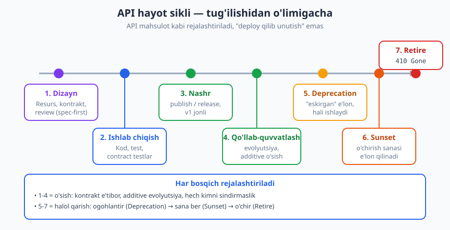
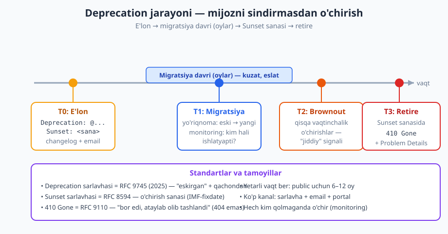
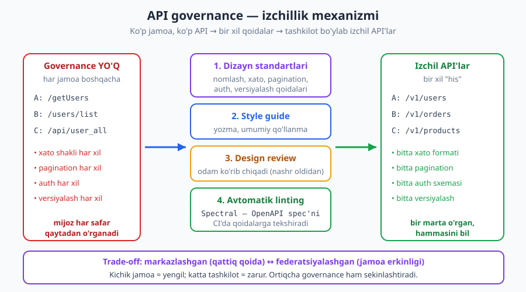

# 26 — API hayot sikli va boshqaruv

[⬅️ Oldingi: 25 — Observability va ishlash](./25-observability.md) · [🏠 README](./README.md) · [Keyingi: 27 — Dizayn naqshlari va anti-naqshlari ➡️](./27-naqshlar-antinaqshlar.md)

---

> **Bu bobda:** API faqat yozilib, deploy qilinadigan kod emas — uning **tug'ilishidan o'limigacha** bir umri bor. Shu umrning bosqichlarini ko'ramiz: dizayn → ishlab chiqish → nashr → qo'llab-quvvatlash → deprecation → sunset → retire. So'ng tashkilot ko'p API qilganda paydo bo'ladigan **izchillik muammosi**ni va uni boshqarish (governance) mexanizmlarini o'rganamiz: dizayn standartlari, style guide, design review, avtomatik linting va API katalog. Oxirida — eskirgan API'ni mijozni sindirmasdan halol o'chirishning to'liq jarayoni.
>
> **Halollik / Eslatma:** Hayot sikli bosqichlari va governance modellari **standart emas, balki amaliyot va tashkiliy trade-off'lar** — "har doim markazlashtir" yoki "shuncha oy ber" degan mutlaq qoida yo'q, kontekst (jamoa hajmi, mijoz turi) hal qiladi. Aniq standartga tayanadigan joylar: `Deprecation` sarlavhasi = **RFC 9745** (2025), `Sunset` sarlavhasi = **RFC 8594**, `410 Gone`/`429` = **RFC 9110**, xato shakli = **RFC 9457** (Problem Details), OpenAPI 3.1 = lint qilinadigan kontrakt. Standartlar va versiyalar vaqt bilan o'zgaradi; HTTP namunalari `RFC 9110` semantikasiga mos.

---

## API ham tug'iladi, qariydi va o'ladi

[01-bobda](./01-api-nima.md) aytgan edik: API — **mahsulot**. Mahsulotning hayot sikli bo'ladi — uni rejalashtirasiz, ishlab chiqasiz, sotuvga chiqarasiz, qo'llab-quvvatlaysiz va bir kun kelib eskirganini olib tashlaysiz. API bilan ham aynan shunday. Eng ko'p uchraydigan xato — API'ni "deploy qilib unutish": yozdik, ishladi, tamom. Aslida API chiqgan kun — bu uning hayotining **boshlanishi**, oxiri emas.

Tasavvur qiling, restoran ochasiz. Menyuni faqat ochilish kuni o'ylamaysiz: vaqt o'tib taomlar qo'shasiz, ba'zilarini olib tashlaysiz, narxlarni yangilaysiz, va bir kun "bu taomni endi tayyorlamaymiz" deb ogohlantirib, keyin menyudan olib tashlaysiz. Mijozlarni "to'satdan bu taom yo'q" deb ranjitmaysiz. API hayot sikli ham xuddi shu — **rejalashtirilgan, ogohlantirilgan, boshqariladigan jarayon.**



---

## Hayot sikli bosqichlari

Keling, har bir bosqichni alohida ko'rib chiqamiz. Bu bosqichlar ketma-ket, lekin 4-bosqich (qo'llab-quvvatlash) ko'pincha **yillar** davom etadi va o'z ichida ko'plab kichik evolyutsiyalarni o'z ichiga oladi.

### 1. Rejalashtirish va dizayn

API yozishdan **oldin** keladigan bosqich. Bu yerda hal qilinadi: qanday resurslar bo'ladi ([06-bob](./06-resurs-uri-dizayni.md)), kontrakt qanday ([21-bob](./21-openapi.md)), nomlash, xato shakli, auth qanday bo'ladi. Bu bosqichda **dizaynni ko'rib chiqish** (design review) eng arzon: bir qator OpenAPI o'zgartirish bepul, ammo chiqarilgan API'ni o'zgartirish minglab mijozni sindirishi mumkin.

> **Eslatma:** "Spec-first" (avval kontrakt) yondashuvi shu bosqichni kuchaytiradi: avval OpenAPI yoziladi, ko'rib chiqiladi, kelishiladi — keyin kod yoziladi. Kontrakt — bahslashish va kelishuvning markaziy hujjati.

### 2. Ishlab chiqish

Kontrakt asosida kod yoziladi, testlar (shu jumladan **contract testlar**, [24-bob](./24-testlash-contract.md)) yoziladi. Kontraktdan og'ish shu yerda ushlanadi — implementatsiya spec'ga mos bo'lishi shart.

### 3. Nashr (publish / release)

API jonli efirga chiqadi. `v1` mijozlarga ochiq. Shu daqiqadan boshlab API — **shartnoma**: undan boshqalar tayanadi, va siz uni xohlaganingizcha o'zgartira olmaysiz. Bu burilish nuqtasi — bu yergacha o'zgartirish arzon, bundan keyin qimmat.

### 4. Qo'llab-quvvatlash va evolyutsiya

API'ning **eng uzoq** bosqichi. Bu yerda API o'sadi: yangi maydonlar, yangi endpointlar, yangi imkoniyatlar qo'shiladi — lekin **mavjud mijozlarni sindirmasdan** (additive, non-breaking o'zgarishlar). Buzuvchi o'zgarish kerak bo'lganda, yangi versiya chiqariladi ([10-bob](./10-versiyalash.md)). Bu bosqichda observability ([25-bob](./25-observability.md)) kritik: API qanday ishlatilayotganini, qaysi endpointlar issiq, qaysilari "o'lik" ekanini bilasiz.

### 5. Deprecation (eskirtirish)

Bir kun kelib endpoint yoki butun versiya **eskiradi**: yangi va yaxshiroq alternativa bor, eskini saqlash qimmat. Lekin uni **birdan o'chirmaysiz** — avval "bu eskirgan, yangisiga o'ting" deb e'lon qilasiz. Muhim: deprecated API **hali ishlaydi**. Deprecation — bu o'chirish emas, **ogohlantirish**.

### 6. Sunset (o'chirish sanasi)

Deprecation'dan keyin aniq **sana** e'lon qilasiz: "shu kundan keyin bu API ishlamaydi". Sunset — bu o'chirishning **rejalashtirilgan** vaqti. Mijozga ko'chish uchun yetarli vaqt berilgan bo'ladi.

### 7. Retire (o'chirish)

Sunset sanasida API **haqiqatda o'chiriladi**. Endi unga so'rov kelsa, `410 Gone` ([03-bob](./03-http-status-kodlari.md)) qaytadi — "bu resurs bor edi, ataylab olib tashlandi". Bu `404` dan ma'lumotliroq, chunki `404` "topilmadi, balki noto'g'ri manzil", `410` esa "ataylab to'xtatildi" deydi.

> **Trade-off:** Versiyani qancha vaqt **jonli** ushlash kerak? Har jonli versiya — qo'llab-quvvatlash xarajati (kod, xavfsizlik yamoqlari, test). Lekin tez o'chirish mijozni ranjitadi. Public API uchun ko'pincha **6–12 oy** deprecation davri beriladi; ichki API'da bir necha hafta yetishi mumkin. Bu sof tashkiliy qaror — standart yo'q.

---

## Deprecation jarayoni — chuqurroq

Bu hayot siklining eng nozik qismi: **eskirgan API'ni mijozni sindirmasdan o'chirish.** [10-bobda](./10-versiyalash.md) `Deprecation`/`Sunset` sarlavhalarini ko'rgandik; bu yerda **to'liq jarayon**ni — boshidan oxirigacha — tartiblaymiz.

Asosiy tamoyil:

> **Diqqat:** Hech kimni **kutilmaganda** sindirmang. Deprecation — bu aloqa (communication) muammosi, texnik muammo emas. Texnik tomoni oson: endpointni o'chirasiz. Qiyini — har bir mijozni o'z vaqtida, bir necha kanal orqali ogohlantirish va ularga ko'chish uchun real vaqt berish.



### 1-qadam: E'lon (Deprecation header + hujjat + changelog + aloqa)

Birinchi navbatda **e'lon qilasiz** — bir necha kanal orqali, chunki bitta kanal hammaga yetib bormaydi:

- **`Deprecation` sarlavhasi (RFC 9745, 2025):** API javobining o'zida mashina-o'qiy signal. Endpoint deprecated ekanini bildiradi va qachondan boshlab ekanini ko'rsatadi.
- **`Sunset` sarlavhasi (RFC 8594):** qachon o'chirilishini ko'rsatadi.
- **Hujjat:** [22-bobdagi](./22-hujjatlash-dx.md) hujjatda endpoint "deprecated" deb belgilanadi.
- **Changelog:** o'zgarishlar jurnaliga yoziladi.
- **Email / portal / status sahifa:** ro'yxatdan o'tgan mijozlarga to'g'ridan-to'g'ri xabar.

`Deprecation` sarlavhasi RFC 9745 da **structured field** — qiymati `@` bilan boshlanadigan Unix epoch sekundidagi sana (qachondan deprecated):

```http
GET /v1/orders/1001 HTTP/1.1
Host: api.example.com
Authorization: Bearer <token>

HTTP/1.1 200 OK
Content-Type: application/json
Deprecation: @1748736000
Sunset: Wed, 31 Dec 2025 23:59:59 GMT
Link: <https://docs.example.com/migrating-to-v2>; rel="deprecation"; type="text/html"

{"id": 1001, "status": "paid"}
```

Bu javobda diqqat qiling:

- `Deprecation: @1748736000` — bu endpoint 2025-06-01 dan beri deprecated (epoch sekundi). RFC 9745 sanani structured field sifatida talab qiladi (oddiy `true` emas — bu eski amaliyot edi).
- `Sunset: Wed, 31 Dec 2025 23:59:59 GMT` — qachon o'chiriladi (RFC 8594, IMF-fixdate formatida — RFC 9110 dagi `Date` sarlavhasi formati bilan bir xil).
- `Link: ...; rel="deprecation"` — migratsiya yo'riqnomasiga havola (RFC 8288 Web Linking, RFC 9745 tavsiya qiladi).

> **Standart:** `Deprecation` = **RFC 9745** (sentyabr 2025) va `Sunset` = **RFC 8594** — bular **mustaqil**, ikkalasi ham bo'lishi mumkin. `Deprecation` "eskirgan" (lekin hali ishlaydi) deydi; `Sunset` "shu sanadan keyin o'chadi" deydi. Endpoint deprecated bo'lsa-yu, lekin hali sunset sanasi belgilanmagan bo'lsa — faqat `Deprecation` qo'yiladi.

### 2-qadam: Migratsiya yo'riqnomasi

Mijozga faqat "eskirgan" demang — **qanday ko'chishni** ko'rsating. Yaxshi migratsiya yo'riqnomasida:

- Eski va yangi endpoint yonma-yon (before/after misol).
- Maydon o'zgarishlari jadvali (eski nom → yangi nom).
- Tez-tez beriladigan savollar (nega o'zgardi, nima yutaman).
- Migratsiya muddati va sunset sanasi.

Bu yo'riqnoma deprecation muvaffaqiyatining **markazi**. Migratsiya qanchalik oson bo'lsa, mijoz shunchalik tez ko'chadi va sizning sunset'ingiz shunchalik silliq kechadi.

### 3-qadam: Migratsiya davri va monitoring

Mijozlarga **yetarli vaqt** bering (public uchun ko'pincha oylar). Bu davrda eng muhim narsa — **kim hali eski versiyani ishlatyapti?** degan savolga javob. Observability ([25-bob](./25-observability.md)) shu yerda hal qiluvchi:

- Versiya/endpoint bo'yicha trafikni metrikalang (`api_requests_total{version="v1"}`).
- Mijoz/API-kalit bo'yicha ajrating — kim qancha ishlatyapti.
- Trafik **nolga yaqinlashganini** kuting: hech kim ishlatmasa, o'chirish xavfsiz.

```http
GET /metrics HTTP/1.1
Host: internal.example.com

HTTP/1.1 200 OK
Content-Type: text/plain

# v1 hali kuniga ~1200 marta chaqirilmoqda — 3 ta mijoz
api_requests_total{version="v1",client="acme"} 845
api_requests_total{version="v1",client="globex"} 312
api_requests_total{version="v1",client="initech"} 41
```

Bu raqamlarga qarab qaror qabul qilasiz: agar `initech` faqat 41 marta chaqirsa, ehtimol ular sinov qilyapti yoki unutilgan integratsiya — ularga shaxsiy xabar yuborasiz.

### 4-qadam: Brownout (qisqacha)

**Brownout** — versiyani **qisqa muddatga** (masalan 5 daqiqa) atayin o'chirib, keyin yana yoqish. Maqsad — "deprecated" e'lonini e'tiborsiz qoldirgan mijozlarga **real ta'sirni his qildirish**: ularning integratsiyasi qisqa vaqtga sinadi, ular sababini topadi va ko'chishga shoshiladi. Bu agressiv usul; **faqat oldindan e'lon qilingan jadval bilan** va ehtiyotkorlik bilan ishlatiladi (yirik internet-platformalar kCloud API'larida ishlatadi).

> **Anti-pattern:** Brownout'ni **e'lonsiz** o'tkazish — bu mijozga "sabotaj"dek tuyuladi va ishonchni yo'qotadi. Brownout — ogohlantirish quroli, jazo emas. Faqat sunset sanasi yaqinlashganda, e'lon qilingan brownout oynalarida.

### 5-qadam: Retire — 410 Gone

Sunset sanasi yetganda va trafik xavfsiz darajaga tushganda, versiyani **o'chirasiz**. Endi so'rov kelsa, ma'lumotli xato qaytaring — `404` emas, `410 Gone` ([03-bob](./03-http-status-kodlari.md)), va xato tanasini [09-bobdagi](./09-xato-dizayni.md) Problem Details (RFC 9457) shaklida bering:

```http
GET /v1/orders/1001 HTTP/1.1
Host: api.example.com

HTTP/1.1 410 Gone
Content-Type: application/problem+json

{"type":"https://docs.example.com/errors/version-sunset","title":"API versiyasi o'chirilgan","status":410,"detail":"v1 2025-12-31 da to'xtatildi. Iltimos v2 ga o'ting.","instance":"/v1/orders/1001"}
```

Bu javob mijozga aniq aytadi: nima bo'ldi (o'chirildi), qachon (2025-12-31), nima qilish kerak (v2 ga o'tish). `410` — "bor edi, ataylab olib tashlandi" semantikasi (RFC 9110), bu aynan to'xtatilgan versiya holatini bildiradi.

---

## Governance — ko'p API bo'lganda izchillik muammosi

Hozirgacha bitta API hayot sikli haqida gapirdik. Endi tasavvur qiling: tashkilotda **o'nlab jamoa** bor, har biri o'z API'larini yozadi. Hech qanday kelishuvsiz nima bo'ladi?

- A jamoa: `GET /getUsers`, xato `{"error": "not found"}`, auth — API-kalit.
- B jamoa: `GET /users/list`, xato `{"message": "404"}`, auth — Bearer token.
- C jamoa: `POST /api/user_all`, xato `{"err_code": 4}`, auth — Basic.

Mijoz (yoki ichki dasturchi) har bir API'ni **noldan o'rganishga** majbur. Har biri boshqacha nomlaydi, boshqacha xato qaytaradi, boshqacha sahifalaydi, boshqacha avtorizatsiya qiladi. Bu — **izchillik muammosi**, va u tashkilot kattalashgani sayin og'irlashadi.

**Governance** (boshqaruv) — bu muammoning yechimi: tashkilot bo'ylab API'lar **bir xil qoidalarga** bo'ysunishini ta'minlash. Maqsad — **"bir marta o'rgan, hammasini bil"**: bir API'ni tushungan dasturchi boshqasini ham darrov tushunadi, chunki ular bir xil "his" beradi.



### Mexanizm 1: Dizayn standartlari / style guide

Yozma hujjat — tashkilot bo'ylab **majburiy yoki tavsiya qilinadigan** qoidalar to'plami. Odatda quyidagilarni qamraydi:

| Soha | Standart qoida (misol) |
|------|------------------------|
| Nomlash | Resurs nomlari ko'plikda, `kebab-case`: `/order-items` |
| URI tuzilishi | `/v1/{resurs}/{id}/{sub-resurs}`, fe'l yo'q |
| Xato shakli | Har doim RFC 9457 Problem Details ([09-bob](./09-xato-dizayni.md)) |
| Sahifalash | Kursor-asosida, `Link` sarlavhasi bilan ([08-bob](./08-sahifalash-filtrlash.md)) |
| Versiyalash | URI'da major: `/v1/`, `/v2/` ([10-bob](./10-versiyalash.md)) |
| Auth | OAuth 2.0 Bearer token, scope'lar bilan ([11-bob](./11-autentifikatsiya.md)) |
| Sana formati | ISO 8601 / RFC 3339: `2026-06-16T10:00:00Z` |
| Maydon nomi | `snake_case`, izchil tashkilot bo'ylab |

Bu jadval — kichraytirilgan **API style guide**. Mashhur ochiq misollar bor (yirik bulut va to'lov platformalarining API dizayn qo'llanmalari), lekin har tashkilot o'ziga moslashtiradi. Eng muhimi — **u yozma va bitta joyda** bo'lsin.

> **Eslatma:** Style guide **qoidalarning sababini** ham tushuntirishi kerak, faqat "shunday qil" demasin. "Nega kursor-pagination?" degan savolga javob bo'lsa, dasturchilar qoidaga ishonadi va chetga chiqmaydi.

### Mexanizm 2: API review jarayoni (design review)

Yangi API (yoki katta o'zgarish) jonli efirga chiqishdan **oldin** uni odam ko'rib chiqadi. Bu — kod-review'ning API-dizayn darajasidagi ekvivalenti. Review'da tekshiriladi:

- Standartlarga mos keladimi (nomlash, xato, auth)?
- Resurs modeli mantiqiymi, fe'l-endpointlar yo'qmi?
- Buzuvchi o'zgarish bormi, versiya kerakmi?
- Xavfsizlik (BOLA/BFLA — [13-bob](./13-api-xavfsizligi.md)) o'ylanganmi?

Review **nashrdan oldin** bo'lgani muhim — chiqgan API'ni o'zgartirish qimmat (hayot sikli 3-bosqichdan keyin).

### Mexanizm 3: Avtomatik linting (Spectral)

Odam review'i qimmat va sekin. Ko'p qoidalarni **avtomatlashtirib** bo'ladi: OpenAPI spec'ni ([21-bob](./21-openapi.md)) qoidalar to'plamiga qarab tekshiruvchi vosita — eng mashhuri **Spectral**. Bu CI'da ishlaydi: har pull-request'da spec lint qilinadi, qoida buzilsa — build sinadi.

Spectral qoidasi (ruleset) namunasi — "har operatsiyada `operationId` va `description` bo'lishi shart":

```yaml
extends: spectral:oas
rules:
  operation-operationId:
    description: Har operatsiyada operationId bo'lishi shart
    given: $.paths[*][*]
    severity: error
    then:
      field: operationId
      function: truthy
  operation-description:
    description: Har operatsiyada description bo'lishi shart
    given: $.paths[*][*]
    severity: warn
    then:
      field: description
      function: truthy
  no-verb-in-path:
    description: URI yo'lida fe'l ishlatmang (get, create, delete)
    given: $.paths[*]~
    severity: error
    then:
      function: pattern
      functionOptions:
        notMatch: "/(get|create|update|delete)"
```

Bu ruleset uchta qoidani majburlaydi: har operatsiyada `operationId` (xato darajasida), `description` (ogohlantirish darajasida), va URI yo'lida fe'l yo'qligi. CI'da `spectral lint openapi.yaml` ishlaganda, bu qoidalarni buzgan spec qizil bo'ladi.

> **Trade-off:** Avtomatik linting **arzon va izchil** (har safar bir xil tekshiradi, charchamaydi), lekin faqat **mashina-tekshiriladigan** qoidalarni ushlaydi (nomlash, struktura). "Bu resurs modeli mantiqiymi?" degan **mazmuniy** savolga lint javob bera olmaydi — u odam review'ini talab qiladi. Ikkalasi birga ishlaydi: lint mayda-chuydani tutadi, odam katta rasmni ko'radi.

### Mexanizm 4: API katalog / inventar

Tashkilot kattalashganda yana bir muammo paydo bo'ladi: **qaysi API'lar umuman bor?** Hech kim bilmaydigan, hujjatsiz, unutilgan API'lar — bu xavf. OWASP API Security Top 10 (2023) buni **API9: Improper Inventory Management** ([13-bob](./13-api-xavfsizligi.md)) deb ataydi:

- **Shadow API** ("soya API") — rasman ro'yxatda yo'q, lekin jonli ishlaydigan endpoint. Hech kim uni kuzatmaydi, yamoqlamaydi — xavfsizlik teshigi.
- **Zombie API** ("zombi API") — eski, deprecated bo'lishi kerak edi, lekin o'chirilmagan va unutilgan versiya. Hali jonli, lekin hech kim qaramaydi.

Yechim — markaziy **API katalog** (inventar): har API ro'yxatga olinadi, egasi, versiyasi, hujjati, statusi (jonli/deprecated/sunset) bilan. Bu — hayot siklini **boshqarib turish** vositasi: katalogga qarab har API qaysi bosqichda ekanini ko'rasiz va zombi/soya API'larni topib o'chirasiz.

> **Xavfsizlik:** Deprecation jarayoni va API katalog bir-biriga bog'liq: agar deprecated API'larni katalogda kuzatmasangiz, ular **zombi API**ga aylanadi — o'chirilishi kerak edi, lekin jonli qoladi va xavfsizlik yuzasini kengaytiradi. Governance bu yerda to'g'ridan-to'g'ri xavfsizlik masalasi.

---

## Markazlashgan va federatsiyalashgan governance

Governance qanchalik **qattiq** bo'lishi kerak? Bu — markaziy trade-off, ikki uchi bor:

| | Markazlashgan | Federatsiyalashgan |
|---|---|---|
| **Kim qaror qiladi** | Markaziy API platforma jamoasi | Har jamoa o'zi (umumiy doirada) |
| **Qoidalar** | Qattiq, majburiy, bir xil | Yumshoq, tavsiya, moslashuvchan |
| **Afzallik** | Maksimal izchillik | Jamoa tezligi, avtonomiya |
| **Kamchilik** | Sekin, byurokratiya, bo'g'iq | Izchilsizlik xavfi |
| **Qachon** | Yirik tashkilot, ko'p tashqi mijoz | Ko'p mustaqil jamoa, tez harakat |

Amalda ko'pchilik **o'rta yo'l**ni tanlaydi: markaziy jamoa **standartlar va vositalarni** (style guide, Spectral ruleset, katalog) beradi, lekin har jamoa o'z API'sini mustaqil yozadi va ko'p qoidalar **avtomatik** (lint orqali) majburlanadi — odam review'i faqat katta yangi API'larga. Bu "asfaltlangan yo'l" (paved road) modeli: to'g'ri yo'l eng oson yo'l qilib qo'yiladi, majburlash o'rniga qulaylik bilan yo'naltiriladi.

---

## Halollik: governance og'irlik ham qo'shadi

Governance bepul emas — u **og'irlik** (overhead) qo'shadi:

- Review jarayoni API chiqishini **sekinlashtiradi**.
- Style guide'ni o'qish, tushunish, unga rioya qilish vaqt oladi.
- Juda qattiq qoidalar jamoalarni **bo'g'adi** va ular qoidalarni aylanib o'tishga harakat qiladi (shadow API'lar shundan tug'iladi).

> **Trade-off:** Governance — **hajmga bog'liq**. Bitta jamoali kichik startup uchun og'ir governance — bu byurokratiya, foydadan ko'ra zarari ko'p; ularga yengil style guide va lint yetadi. Yuzlab API'li yirik korporatsiya uchun governance — **zaruriyat**: usiz API "manzarasi" boshqarib bo'lmas xaosga aylanadi. Sizning vazifangiz — tashkilot hajmiga **mos** og'irlikni tanlash, "eng yaxshi amaliyot" deb hammasini bir paytda joriy qilmaslik.

Oltin qoida: **governance'ni qiymat keltirgan joyda qo'shing.** Avval eng og'riqli izchilsizlikni (masalan har API boshqacha xato qaytaradi) standartlang, keyin asta kengaytiring. "Hammasini birdan" — bu governance'ning o'zi anti-pattern bo'lib ketishi.

---

## Hammasi birga — hayot sikli + governance

Ikki mavzu bir-biriga ulanadi. **Hayot sikli** — bitta API'ning umri (tug'ilish → o'lim). **Governance** — ko'p API'ni bir xil tamoyilga solib, har birining hayot siklini **boshqarib turish**. Misol uchun:

- Style guide deprecation **qoidasini** belgilaydi: "deprecated API'da `Deprecation` + `Sunset` sarlavhasi shart, kamida 6 oy davr".
- API katalog har API **qaysi bosqichda** ekanini ko'rsatadi (jonli/deprecated/sunset).
- Spectral linting deprecated endpointlar to'g'ri belgilanganini **tekshiradi**.
- Review yangi API chiqishidan oldin uni standartlarga **moslaydi**.

Shunday qilib, tashkilot bo'ylab har API — tug'ilishidan o'limigacha — **bir xil, oldindan aytib bo'ladigan, halol** jarayondan o'tadi. Mijoz hech qachon kutilmaganda sinmaydi, va dasturchi har API'ni qanday ishlatishni allaqachon biladi.

---

## Asosiy g'oyalar (bobni qisqacha)

- **API'ning hayot sikli bor:** dizayn → ishlab chiqish → nashr → qo'llab-quvvatlash → deprecation → sunset → retire. "Deploy qilib unutish" — eng katta xato.
- **Nashr — boshlanish, oxir emas.** Eng uzoq bosqich — qo'llab-quvvatlash va evolyutsiya (additive o'sish, mijozni sindirmasdan).
- **Deprecation — aloqa muammosi.** Hech kimni kutilmaganda sindirmang: `Deprecation` (RFC 9745) + `Sunset` (RFC 8594) sarlavhalari + hujjat + changelog + email, va migratsiya yo'riqnomasi.
- **Migratsiya davrida monitoring kalit:** kim hali eski versiyani ishlatyaptini observability bilan kuzatib, trafik nolga yaqinlashganda o'chiring. Retire = `410 Gone` + Problem Details.
- **Governance ko'p API'da izchillikni ta'minlaydi:** dizayn standartlari / style guide, design review, avtomatik linting (Spectral), API katalog (zombi/soya API oldini olish — OWASP API9).
- **Markazlashgan ↔ federatsiyalashgan — trade-off:** qattiq qoida (izchillik) vs jamoa erkinligi (tezlik). Ko'pchilik "asfaltlangan yo'l" o'rta yo'lini tanlaydi.
- **Governance hajmga bog'liq:** kichik jamoaga yengil, katta tashkilotga zarur. Ortiqcha governance bo'g'adi — qiymat keltirgan joyda qo'shing.

---

## Mashqlar

### Oson

**1-mashq.** Quyidagi hayot sikli bosqichlarini **to'g'ri tartibda** joylashtiring: `retire`, `dizayn`, `deprecation`, `nashr`, `qo'llab-quvvatlash`, `ishlab chiqish`, `sunset`.

**2-mashq.** `Deprecation` va `Sunset` sarlavhalari nima farq qiladi? Qaysi biri "qachon o'chadi"ni, qaysi biri "eskirgan"ni bildiradi? Deprecated API hali ishlaydimi?

**3-mashq.** Versiya o'chirilgandan keyin so'rov kelsa, qaysi status kod qaytariladi — `404` yoki `410`? Nega aynan o'sha biri ma'lumotliroq?

### O'rta

**4-mashq.** `/v1/payments` endpointini deprecate qilmoqchisiz; u 2026-03-01 dan deprecated, 2026-09-30 da o'chadi. Mijoz `https://docs.example.com/migrate-v2` ga o'tishi kerak. Shu endpointga `GET` so'roviga **deprecated, lekin hali ishlaydigan** javob sarlavhalarini (status + uchta tegishli sarlavha) dizayn qiling.

**5-mashq.** Tashkilotingizda uchta jamoa API yozadi, lekin har biri xatoni boshqacha qaytaradi: `{"error":"..."}`, `{"message":"..."}`, `{"err":4}`. Style guide uchun **uchta aniq qoida** yozing, izchillikni ta'minlash uchun (xato shakli, nomlash konvensiyasi, versiyalash).

**6-mashq.** Siz `v1` ni o'chirmoqchisiz, lekin **kim hali ishlatyapti**ni bilmaysiz. Observability'dan ([25-bob](./25-observability.md)) qanday foydalanib buni aniqlaysiz? Qaysi metrika va qaysi label kerak? Trafik qanday ko'rsatkichga tushganda o'chirish xavfsiz?

### Qiyin

**7-mashq.** 150 ta faol mijozli public `/v1` API'ni `/v2` ga ko'chirib, `/v1` ni o'chirishning **to'liq deprecation strategiyasini** bosqichma-bosqich tuzing (e'londan retirgacha). Har bosqichda: qaysi sarlavhalar, qanday aloqa, qancha vaqt, monitoring nimani kuzatadi, va "muhim mijoz hali v1 da" bo'lsa qanday qaror qabul qilinadi.

**8-mashq.** 40 ta jamoali tashkilotda API'lar izchilsiz (har biri boshqacha). Sizdan **governance modeli** tanlash so'raldi: markazlashgan, federatsiyalashgan yoki aralash? Tanlovingizni asoslang va to'rtta mexanizmni (standartlar, review, linting, katalog) qanday joriy qilishingizni, har birining og'irligi va qiymatini tushuntiring.

**9-mashq.** Tashkilotingizda **shadow va zombi API'lar** muammosi bor: hujjatsiz endpointlar va o'chirilmagan eski versiyalar. Bu nima uchun xavfsizlik xavfi (OWASP API9, [13-bob](./13-api-xavfsizligi.md))? Bu muammoni hayot sikli + governance vositalari (katalog, linting, deprecation jarayoni) bilan qanday tizimli hal qilasiz — bir martalik tozalash va doimiy oldini olish rejasini yozing.

<details markdown="1">
<summary>Yechimlar</summary>

### 1-mashq yechimi

To'g'ri tartib:

1. **dizayn** (rejalashtirish)
2. **ishlab chiqish** (kod + test)
3. **nashr** (publish / release — v1 jonli)
4. **qo'llab-quvvatlash** (evolyutsiya, additive o'sish)
5. **deprecation** ("eskirgan" e'lon, hali ishlaydi)
6. **sunset** (o'chirish sanasi e'lon qilinadi)
7. **retire** (haqiqatda o'chiriladi → `410 Gone`)

### 2-mashq yechimi

- **`Deprecation` (RFC 9745):** endpoint/versiya **eskirganini** (va qachondan beri) bildiradi — "yangisiga o'ting" signali.
- **`Sunset` (RFC 8594):** uni **qachon o'chirishni** (aniq sana) ko'rsatadi.

Ikkalasi **mustaqil**: faqat `Deprecation` bo'lishi mumkin (sana hali belgilanmagan), yoki ikkalasi birga. **Deprecated API hali ishlaydi** — deprecation o'chirish emas, **ogohlantirish**. Faqat sunset sanasidan keyin (retire) u to'xtaydi.

### 3-mashq yechimi

`410 Gone` qaytariladi (`404` emas). Sababi semantik (RFC 9110):

- **`404 Not Found`** = "topilmadi" — balki manzil noto'g'ri, balki hech qachon bo'lmagan, balki vaqtinchalik yo'q. Noaniq.
- **`410 Gone`** = "bor edi, **ataylab** olib tashlandi" — bu aynan to'xtatilgan versiya holatini bildiradi. Mijozga "bu resurs mavjud edi, lekin biz uni ataylab o'chirdik, qayta urinma" deb aniq xabar beradi.

`410` Problem Details (RFC 9457) tanasi bilan birga mijozga nima qilishni (yangi versiyaga o'tish) ham aytadi.

### 4-mashq yechimi

`Deprecation` sarlavhasi RFC 9745 da `@` + Unix epoch sekundi formatida. 2026-03-01T00:00:00Z = epoch `1772323200`. `Sunset` esa IMF-fixdate formatida (RFC 9110 `Date` formati). Endpoint **hali ishlaydi** — shuning uchun `200 OK`:

```http
GET /v1/payments HTTP/1.1
Host: api.example.com
Authorization: Bearer <token>

HTTP/1.1 200 OK
Content-Type: application/json
Deprecation: @1772323200
Sunset: Wed, 30 Sep 2026 23:59:59 GMT
Link: <https://docs.example.com/migrate-v2>; rel="deprecation"; type="text/html"

{"items": [], "next": null}
```

Tushuntirish:

- `200 OK` — deprecated, lekin **hali ishlaydi**, shuning uchun normal muvaffaqiyatli javob (`410` emas — u faqat retire'dan keyin).
- `Deprecation: @1772323200` — 2026-03-01 dan deprecated (epoch sekundi).
- `Sunset: Wed, 30 Sep 2026 23:59:59 GMT` — 2026-09-30 da o'chadi.
- `Link: ...; rel="deprecation"` — migratsiya yo'riqnomasiga havola (RFC 8288 + RFC 9745 tavsiyasi).

### 5-mashq yechimi

Style guide uchun uchta aniq qoida:

1. **Xato shakli:** "Barcha API'lar xatoni **RFC 9457 Problem Details** (`application/problem+json`) formatida qaytaradi: majburiy `type`, `title`, `status`; tavsiya `detail`, `instance`. `{"error":...}` yoki maxsus shakllar **taqiqlanadi**." Bu uchta turli xato shaklini bittaga keltiradi.
2. **Nomlash konvensiyasi:** "Resurs nomlari **ko'plikda** va `kebab-case` (`/order-items`); JSON maydon nomlari **`snake_case`** va butun tashkilot bo'ylab izchil. URI yo'lida **fe'l ishlatilmaydi** (`/getUsers` emas, `GET /users`)."
3. **Versiyalash:** "Major versiya **URI'da**: `/v1/`, `/v2/`. Buzuvchi o'zgarish faqat major versiyada; deprecated versiyaga `Deprecation` (RFC 9745) + `Sunset` (RFC 8594) sarlavhalari qo'yiladi, kamida 6 oy migratsiya davri beriladi."

Bu uchta qoida + ularning **sababi** (mijoz har safar qaytadan o'rganmasligi uchun) style guide'ning yadrosi bo'ladi. Ko'pini Spectral lint orqali avtomatlashtirish mumkin.

### 6-mashq yechimi

**Metrika va label:** so'rovlar hisoblagichini **versiya** (va **mijoz/API-kalit**) bo'yicha labellab metrikalang:

```
api_requests_total{version="v1", client="acme", endpoint="/orders"}
```

- `version` label — `v1` vs `v2` trafikni ajratadi.
- `client` (yoki `api_key_id`) label — **kim** ishlatyaptini ko'rsatadi (eng muhimi — shaxsan kim bilan bog'lanish kerakligi).
- `endpoint` label — qaysi endpointlar hali issiq.

**Jarayon:**

1. `version="v1"` trafikni vaqt bo'yicha grafiklang — u kamayib boryaptimi?
2. `client` bo'yicha guruhlang — qaysi mijozlar hali v1 da. Ozchilik qolsa, ularga **shaxsiy** xabar.
3. **O'chirish mezoni:** trafik **nolga yoki nolga juda yaqin** (faqat ahamiyatsiz/tasodifiy so'rovlar) bo'lganda, **va** sunset sanasi yetganda. Agar muhim mijoz hali katta hajmda chaqirsa — sunset'ni kechiktirish yoki ular bilan alohida ishlash.

Muhim nuance: API darajasida monitoring **so'rovni** ko'radi, lekin "javobning qaysi maydonini o'qiyapti" ni ko'rmaydi. Shuning uchun maydon-darajasidagi deprecation'da (masalan bitta maydon) so'rov-shakliga yoki mijoz e'loniga qarab baholanadi.

### 7-mashq yechimi

**To'liq deprecation strategiyasi (150 mijozli public v1 → v2):**

**A bosqich — v2 chiqarish (v1 toza jonli).** v1 va v2 yonma-yon. v1 hali **hech qanday** deprecation belgisiz (200, sarlavhasiz). Batafsil migratsiya yo'riqnomasi (before/after, maydon jadvali, FAQ) e'lon qilinadi. **Vaqt:** mijozlar v2 ni sinab ko'rishi uchun bir necha hafta-oy.

**B bosqich — deprecation boshlanishi.** v1 javoblariga qo'shiladi:

```http
HTTP/1.1 200 OK
Deprecation: @<epoch>
Sunset: <6-12 oy keyingi sana> GMT
Link: <https://docs.example.com/migrate-v2>; rel="deprecation"
```

Status hali `200`. Aloqa: email + portal + status-sahifa + changelog — **barcha 150 mijozga**. **Eng muhim:** versiya/mijoz bo'yicha trafik monitoringi boshlanadi (kim, qancha). **Vaqt:** sunset sanasigacha 6–12 oy (public uchun).

**C bosqich — faol eslatish va brownout.** Sunset yaqinlashganda, hali v1 ishlatayotgan mijozlarni **individual** aniqlab (monitoring orqali), ularga shaxsiy xabar (email/qo'ng'iroq). Status-sahifada hisoblagich. Ixtiyoriy **brownout**: qisqa, **oldindan e'lon qilingan** oynalarda v1 ni o'chirib-yoqib, e'tiborsiz mijozlarga real ta'sirni his qildirish.

**D bosqich — Sunset / Retire.** Sunset sanasida v1 → `410 Gone` + Problem Details (RFC 9457). **Lekin qaror nuqtasi:** agar **muhim** mijozlar hali v1 da bo'lsa:

- Sunset'ni **kechiktirish** (yangi sana e'lon qilib) — ko'pincha eng halol yo'l, "hech kimni kutilmaganda sindirmaslik" tamoyili ustun.
- Yoki ular bilan kelishilgan **grace-period** / shaxsiy migratsiya yordami.
- Hech qachon "muhim mijoz jonli ekanini bilib turib, e'lonsiz o'chirish" — bu ishonchni buzadi.

Tashkiliy jihatdan bu qarorni kim qabul qiladi (platforma jamoasi? mahsulot egasi?) — bu governance siyosatida oldindan belgilanadi.

### 8-mashq yechimi

**Tanlov: aralash (federatsiyalashgan amalga oshirish + markaziy standartlar) — "asfaltlangan yo'l" modeli.**

**Asos:** 40 jamoa — bu katta. **To'liq markazlashgan** model bu hajmda byurokratiyaga aylanadi: har API uchun markaziy review — bo'lon-bog'liq (bottleneck), jamoalar sekinlashadi va qoidalarni aylanib o'tib **shadow API** yaratadi. **To'liq federatsiyalashgan** esa izchilsizlikka olib keladi (hozirgi muammo). Yechim — markaz **standartlar va vositalarni** beradi, jamoalar **mustaqil** ishlaydi, va izchillik asosan **avtomatik** majburlanadi.

**To'rtta mexanizm:**

1. **Standartlar / style guide (markaziy, yengil og'irlik, yuqori qiymat).** Markaziy jamoa yagona style guide yozadi (xato = RFC 9457, nomlash, pagination, auth, versiyalash). Og'irlik bir martalik (yozish), qiymat doimiy. Eng avval **eng og'riqli** izchilsizlikni (xato shakli) standartlash.
2. **Avtomatik linting (markaziy ruleset, past og'irlik, yuqori qiymat).** Spectral ruleset markaz tomonidan beriladi, har jamoaning CI'sida ishlaydi. Mashina-tekshiriladigan qoidalarni (struktura, nomlash) avtomatik majburlaydi — odam review'isiz. Og'irlik past (bir marta sozlash), izchillik yuqori.
3. **Design review (federatsiyalashgan, faqat katta o'zgarishlarga).** Har API uchun **emas** — faqat **yangi public API** yoki **buzuvchi o'zgarish** uchun. Jamoa ichida yoki yengil markaziy maslahat. Bu review og'irligini eng qiymatli joyga cheklaydi (bottleneck'ni oldini oladi).
4. **API katalog (markaziy, o'rta og'irlik, yuqori qiymat).** Barcha API'lar markaziy katalogda ro'yxatga olinadi (egasi, versiya, status, hujjat). Bu — boshqaruv ko'zi: zombi/soya API'larni topadi, hayot siklini kuzatadi. Avtomatik to'ldirilsa (CI'da spec'ni katalogga ro'yxatlash), og'irligi kam.

**Umumiy tamoyil:** to'g'ri yo'lni **eng oson yo'l** qilib qo'yish — majburlash o'rniga qulaylik bilan yo'naltirish. Bu 40 jamoaning tezligini saqlab, izchillikni ta'minlaydi.

### 9-mashq yechimi

**Nima uchun xavfsizlik xavfi (OWASP API9 — Improper Inventory Management):**

- **Shadow API** (hujjatsiz, ro'yxatsiz endpoint): hech kim uni kuzatmaydi va yamoqlamaydi — eski kutubxonalar, yopilmagan teshiklar. Tajovuzkor topadi, lekin himoyachi bilmaydi.
- **Zombi API** (deprecated bo'lishi kerak edi, lekin jonli qolgan eski versiya): eski, ehtimol zaif auth/validatsiyaga ega versiya jonli — hujum yuzasi kengayadi. Yangi versiyada tuzatilgan kamchilik eski versiyada qoladi.

Ikkalasi ham **noma'lum** API yuzasini yaratadi — siz himoya qila olmaysiz, chunki mavjudligini bilmaysiz.

**Tizimli yechim — bir martalik tozalash + doimiy oldini olish:**

*Bir martalik tozalash:*

1. **Kashf qilish:** gateway/proxy loglari, traffik va kod skanini ishlatib **barcha jonli endpointlarni** topish (faqat hujjatdagilarni emas).
2. **Solishtirish:** topilgan endpointlarni katalog/hujjatga solishtirish — farqlar = shadow yoki zombi API.
3. **Qaror:** har topilganga — hujjatlash + katalogga qo'shish, **yoki** deprecation jarayoniga kiritib (Deprecation/Sunset) o'chirish.

*Doimiy oldini olish (governance):*

1. **API katalog majburiy:** har API jonli efirga chiqishi uchun katalogda ro'yxatda bo'lishi shart — ro'yxatsiz API gateway'da chiqarilmaydi (CI/deploy darvozasi).
2. **Avtomatik registratsiya:** CI'da OpenAPI spec'ni katalogga ro'yxatlash — qo'lda emas, avtomatik (Spectral lint bilan birga).
3. **Hayot sikli majburlash:** style guide deprecated API'larni belgilab (Deprecation/Sunset) va sunset sanasida o'chirishni talab qiladi — zombi API tug'ilmaydi, chunki har deprecated versiyaning **o'chirish sanasi** bor va katalog uni kuzatadi.
4. **Davriy audit:** muntazam (masalan choraklik) katalog vs jonli trafik solishtiruvi — yangi shadow/zombi paydo bo'lganini ushlash.

Natija: API yuzasi **to'liq ma'lum** va boshqariladi — har endpoint katalogda, har deprecated versiyaning sunset sanasi bor, hech narsa "unutilmaydi". Hayot sikli (deprecation → sunset → retire) va governance (katalog, linting) birga zombi/soya API'larni **tizimli** ravishda oldini oladi.

</details>

---

[⬅️ Oldingi: 25 — Observability va ishlash](./25-observability.md) · [🏠 README](./README.md) · [Keyingi: 27 — Dizayn naqshlari va anti-naqshlari ➡️](./27-naqshlar-antinaqshlar.md)
