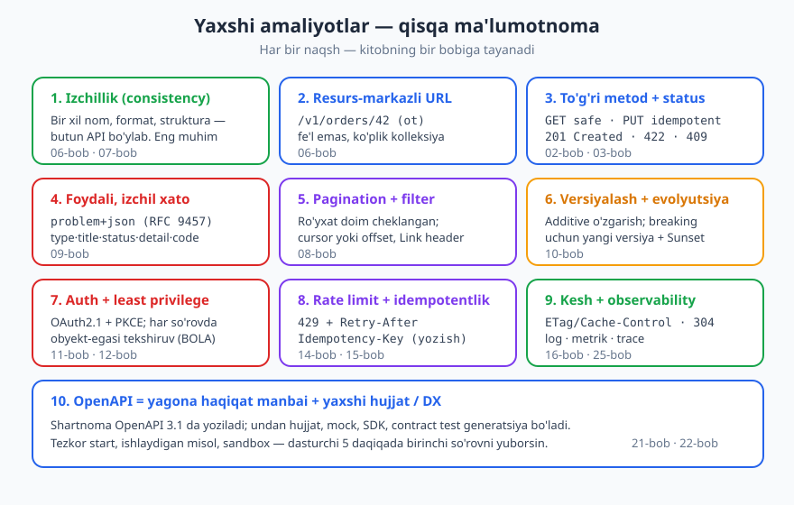
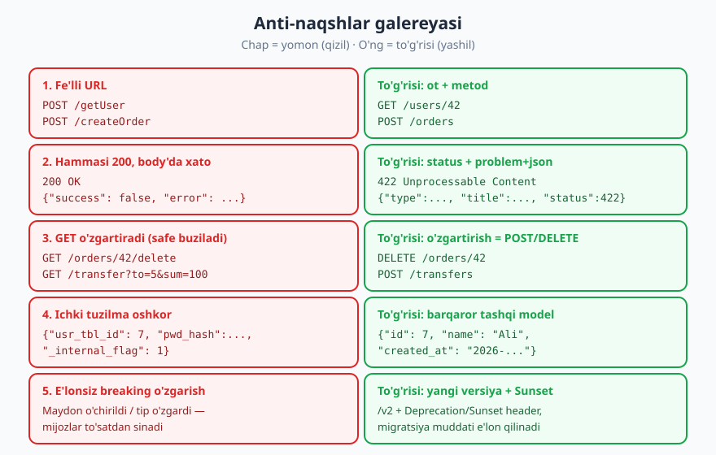
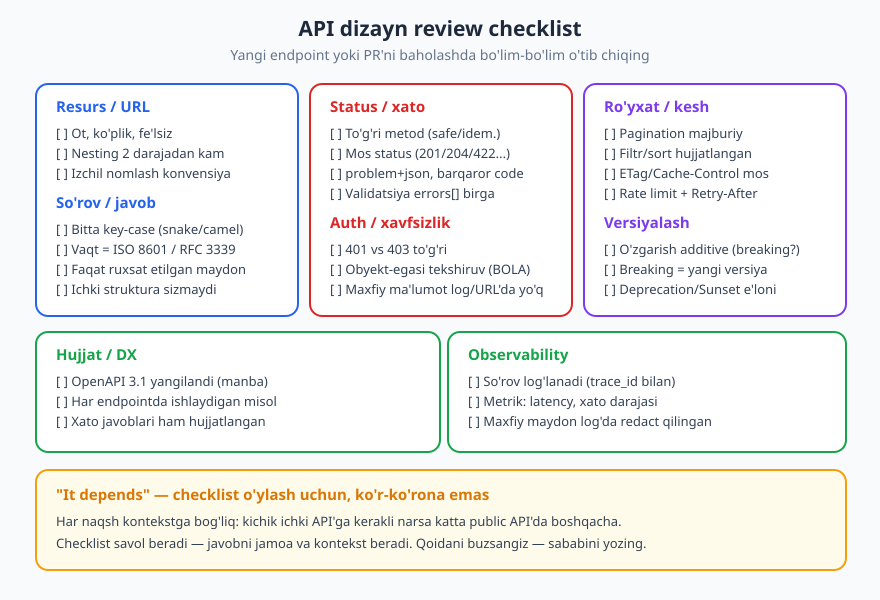

# 27 — Dizayn naqshlari va anti-naqshlari

[⬅️ Oldingi: 26 — API hayot sikli va boshqaruv](./26-hayot-sikli-governance.md) · [🏠 README](./README.md) · [Keyingi: 28 — Kapston: to'liq API'ni noldan loyihalash ➡️](./28-kapston.md)

---

> **Bu bobda:** 26 bob davomida biz API dizaynining tamoyillarini bittalab o'rgandik — HTTP semantikasi, resurs modellashtirish, xato dizayni, versiyalash, xavfsizlik, kesh va boshqalar. Bu bob ularni **amaliy naqsh** (yaxshi amaliyot) va **anti-naqsh** (qaytar-qaytar takrorlanadigan xato) sifatida **bitta joyga jamlaydi** — tez ma'lumotnoma. Oxirida amaliy **dizayn review checklist**i beriladi.
>
> **Halollik / Eslatma:** Bu bobdagi har bir naqsh kitobning aniq bobiga tayanadi (havolalar bilan), va o'z navbatida **RFC 9110** (HTTP semantikasi), **RFC 9457** (xato formati), **OWASP API Security Top 10 — 2023** kabi standartlarga asoslanadi. JSON namunalar valid (tekshirilgan). Lekin eng muhim ogohlantirish: **bu qoidalar mutlaq emas.** Har biri kontekstga bog'liq trade-off — kichik ichki API uchun to'g'ri kelgan narsa katta public API uchun boshqacha bo'lishi mumkin. Oxirgi bo'lim shu "it depends" muvozanatiga bag'ishlangan.

---

## Nega bu bob kerak

Tasavvur qiling, siz 26 bobni o'qib chiqdingiz. Boshingizda yuzlab tafsilot bor: `201` qachon, `422` qachon, cursor pagination nima, BOLA nima... Lekin yangi endpoint yozayotganda bularning hammasini esda tutish qiyin. Kerak bo'lgan narsa — **bitta varaq**: yaxshi amaliyotlar ro'yxati, ulardan tez-tez qochiladigan xatolar galereyasi, va review paytida o'tib chiqiladigan checklist.

Mana shu bobning maqsadi. Bu **yangi material emas** — bu kitob bo'ylab tarqalgan bilimni **jamlash** va **ma'lumotnoma**ga aylantirish. Har bir punktni qisqa beramiz va chuqurroq tushuntirish kerak bo'lsa, mos bobga havola qilamiz.

> **Eslatma:** "Naqsh" (pattern) — qayta-qayta ishlaydigan, sinovdan o'tgan yechim. "Anti-naqsh" (anti-pattern) — birinchi qarashda mantiqiy ko'rinadigan, lekin amalda muammo keltiradigan yechim. Tajribali muhandisning kuchi ko'pincha **anti-naqshlarni tanib olishida** — chunki ularni vaqtida ko'rsangiz, soatlab vaqt va katta texnik qarzdan qutulasiz.

---

## 1-qism. Yaxshi amaliyotlar (naqshlar)

Quyida API dizaynining asosiy yaxshi amaliyotlari. Har biriga qisqa ta'rif, "nega" va chuqurroq o'rganish uchun bobga havola.



### Izchillik (consistency) — eng muhim qoida

Agar bu bobdan **bitta** narsani eslab qolsangiz — shu bo'lsin. Izchillik degani: bir xil narsa butun API bo'ylab **bir xil** ko'rinadi. Bir joyda `created_at`, boshqa joyda `creationDate` bo'lmasin. Bir endpointda xato `{"error": ...}`, boshqasida `{"message": ...}` bo'lmasin.

Nega eng muhim? Chunki **izchil API'ni o'rganish oson**: dasturchi bitta endpointni tushunsa, qolganlarini taxmin qila oladi. Izchilsiz API — har bir endpoint alohida jumboq. Hatto "nomukammal lekin izchil" qoida ko'pincha "mukammal lekin notekis" qoidadan yaxshiroqdir.

> **Standart:** Izchillikni **yozma uslub qo'llanmasi** (API style guide) va **markazlashgan kod** (umumiy javob/xato handler, umumiy validator) bilan ta'minlang. Chuqurroq: [06 — Resurs va URI dizayni](./06-resurs-uri-dizayni.md), [07 — So'rov/javob payload](./07-sorov-javob-payload.md).

### Resurs-markazli URL, otlar bilan

URL'lar **otlar** (resurslar) bo'lsin, fe'llar emas. `GET /users/42` — yaxshi; `GET /getUser?id=42` — yomon. Harakatni **HTTP metodi** ifodalaydi (GET o'qiydi, POST yaratadi, DELETE o'chiradi), URL esa resursni nomlaydi. Kolleksiyalar ko'plikda (`/orders`), element ID bilan (`/orders/42`).

> **Chuqurroq:** [06 — Resurs va URI dizayni](./06-resurs-uri-dizayni.md).

### To'g'ri HTTP metod va status kod

Metodlar **semantik** ahamiyatga ega (RFC 9110): GET **safe** (faqat o'qiydi, hech narsani o'zgartirmaydi) va **idempotent**; PUT **idempotent** (to'liq almashtirish); DELETE **idempotent**; POST **safe ham, idempotent ham emas**; PATCH (RFC 5789) — qisman, idempotent bo'lishi shart emas.

Status kodlar to'g'ri kategoriyani bersin: `201 Created` (+ `Location`), `204 No Content` (o'chirildi, tana yo'q), `400` o'qib bo'lmas so'rov, `422 Unprocessable Content` semantik validatsiya, `409 Conflict`, `404`, `429`. `2xx` = muvaffaqiyat, `4xx` = mijoz aybi, `5xx` = server aybi.

> **Chuqurroq:** [02 — HTTP chuqur](./02-http-chuqur.md), [03 — HTTP status kodlari](./03-http-status-kodlari.md).

### Foydali, izchil xato (Problem Details)

Xato javobi — API'ning eng ko'p o'qiladigan qismi. U **nima** noto'g'ri, **qayerda**, **qanday tuzatish**ni aytsin. Standart format — **RFC 9457 Problem Details** (`application/problem+json`): `type`, `title`, `status`, `detail`, `instance` + kengaytmalar (`code`, `errors[]`, `trace_id`). Butun API **bitta** xato shaklida.

> **Chuqurroq:** [09 — Xatolarni dizayn qilish](./09-xato-dizayni.md).

### Pagination va filtr — standart bilan

Ro'yxat qaytaruvchi endpoint **hech qachon cheksiz** bo'lmasligi kerak. Doim sahifalang (cursor yoki offset), filtr va saralashni izchil, hujjatlangan parametrlar bilan bering. Keyingi sahifaga `Link` header (RFC 8288, `rel="next"`) yoki tana ichida `next_cursor`.

> **Chuqurroq:** [08 — Sahifalash, filtrlash, saralash, qidiruv](./08-sahifalash-filtrlash.md).

### Versiyalash + evolyutsion (additive) o'zgarish

API o'zgaradi — bu tabiiy. Maqsad — **mijozlarni sindirmaslik**. Imkon qadar **additive** o'zgartiring: yangi maydon, yangi endpoint qo'shing (eskisini olib tashlamasdan). Faqat majburan **breaking** o'zgarish kerak bo'lganda yangi versiya (`/v2`) chiqaring va eskisini `Deprecation`/`Sunset` header bilan e'lon qilib, migratsiya muddati bering.

> **Chuqurroq:** [10 — API versiyalash va evolyutsiya](./10-versiyalash.md).

### Auth + least privilege + obyekt-egasi tekshiruvi

Autentifikatsiya (kim?) va avtorizatsiya (nimaga ruxsat?) — alohida bosqichlar. Foydalanuvchi-uchun oqim uchun **OAuth 2.0/2.1 Authorization Code + PKCE**, servis-uchun-servis uchun **Client Credentials**. Har bir token **eng kam imtiyoz** (least privilege) bilan ishlasin. Va eng muhimi: har bir so'rovda **obyekt egasi**ni tekshiring — foydalanuvchi `GET /orders/42` so'rasa, 42-buyurtma **uniki** ekanini tasdiqlang.

> **Xavfsizlik:** Obyekt-egasini tekshirmaslik — OWASP API Security Top 10 — 2023 dagi **API1: Broken Object Level Authorization (BOLA)** — eng keng tarqalgan API zaifligi. Chuqurroq: [11 — Autentifikatsiya](./11-autentifikatsiya.md), [12 — Avtorizatsiya](./12-avtorizatsiya.md).

### Rate limit + idempotentlik

API'ni suiiste'mol va tasodifiy ortiqcha yukdan himoya qiling: **rate limit** (so'rov chegarasi). Chegara oshganda `429 Too Many Requests` + `Retry-After`. Yozish operatsiyalarida (to'lov, buyurtma) **idempotentlik** ta'minlang: `Idempotency-Key` header bilan takror so'rov ikki marta bajarmasin (tarmoq uzilganda mijoz xavfsiz qayta urinsin).

> **Chuqurroq:** [14 — Rate limiting](./14-rate-limiting.md), [15 — Idempotentlik va parallellik](./15-idempotentlik-parallellik.md).

### Kesh va observability

Keshlash (RFC 9111) — tezlik va yuk kamayishi: `Cache-Control`, `ETag` + `If-None-Match` → `304 Not Modified`. Va siz ko'rmagan narsani tuzata olmaysiz — **observability**: tuzilgan log (har so'rovda `trace_id`), metriklar (latency, xato darajasi), distributed tracing.

> **Chuqurroq:** [16 — Keshlash](./16-keshlash.md), [25 — Observability](./25-observability.md).

### OpenAPI = yagona haqiqat manbai + yaxshi hujjat / DX

Shartnomani **OpenAPI 3.1** da yozing va uni **yagona haqiqat manbai** (source of truth) qiling — undan hujjat, mock server, mijoz SDK, contract test'lar generatsiya bo'ladi. Hujjat dasturchi-do'st (DX) bo'lsin: tezkor start, har endpoint uchun ishlaydigan misol, sinov uchun sandbox.

> **Chuqurroq:** [21 — OpenAPI](./21-openapi.md), [22 — Hujjatlash va DX](./22-hujjatlash-dx.md).

---

## 2-qism. Anti-naqshlar galereyasi

Endi teskari tomon — qaytar-qaytar uchraydigan xatolar. Har biri uchun: **nima** ekani, **nega yomon**ligi, va **to'g'risi** nima ekani.



### Fe'lli URL

**Nima:** `POST /getUser`, `POST /createOrder`, `GET /deleteItem`.

**Nega yomon:** Harakatni HTTP metodi ifodalashi kerak, URL'da takrorlanishi — RPC uslubini REST liboda ko'rsatish. URL portlaydi (`/getUser`, `/getUserById`, `/getActiveUsers`...), metod semantikasi yo'qoladi, kesh va tooling adashadi. Richardson Maturity Model bo'yicha bu L0 (POST-everything), maqsad esa L2.

**To'g'risi:** Ot + metod: `GET /users/42`, `POST /orders`, `DELETE /items/7`.

### Hammasiga `200 OK` + body'da xato

**Nima:** Har bir javob `200`, xato esa tanada `{"success": false, "error": "..."}`.

**Nega yomon:** HTTP semantikasini buzadi. Monitoring, proksilar, CDN, retry kutubxonalari `2xx`ni "muvaffaqiyat" deb biladi — ular xatoni **ko'rmaydi**, noto'g'ri keshlaydi, qayta urinmaydi. Dashboard'da "xato darajasi" nol ko'rinadi, incidentlar yashirin qoladi.

**To'g'risi:** Xato kategoriyasiga mos status (`4xx`/`5xx`) + RFC 9457 Problem Details tana. Batafsil: [09 — Xatolarni dizayn qilish](./09-xato-dizayni.md).

### O'zgartiruvchi (mutating) GET

**Nima:** `GET /orders/42/delete`, `GET /transfer?to=5&sum=100`.

**Nega yomon:** GET **safe** bo'lishi shart (RFC 9110) — faqat o'qishi kerak. Brauzerlar, prefetcher'lar, qidiruv botlari, link-skanerlar GET'ni xohlagancha "bosadi". O'zgartiruvchi GET = botingiz o'zi buyurtmalarni o'chiradi yoki pul o'tkazadi. Bu xavfli va keshlashni ham buzadi.

**To'g'risi:** O'zgartiruvchi har qanday operatsiya — POST/PUT/PATCH/DELETE. `DELETE /orders/42`, `POST /transfers`.

### Ichki DB tuzilmasini to'g'ridan-to'g'ri oshkor qilish (leaky abstraction)

**Nima:** Javobda `usr_tbl_id`, `pwd_hash`, `_internal_status_code`, ORM obyektini to'g'ridan-to'g'ri qaytarish.

**Nega yomon:** Ikki muammo. (1) **Xavfsizlik:** ichki tuzilma, ustun nomlari, hatto maxfiy maydonlar (`pwd_hash`) sizadi. (2) **Bog'lanish (coupling):** API'ngiz DB sxemasiga mahkam bog'lanadi — DB'ni o'zgartirsangiz, API ham buziladi, mijozlar ham. Bu OWASP API3 (Broken Object Property Level Authorization) bilan ham bog'liq.

**To'g'risi:** Ichki modeldan **alohida**, barqaror **tashqi (API) model**: `{"id": 7, "name": "Ali", "created_at": "..."}`. DTO / serializer qatlami orqali faqat kerakli, xavfsiz maydonlarni bering.

### Izchilsiz nomlash va format

**Nima:** Bir joyda `camelCase`, boshqa joyda `snake_case`; bir endpointda vaqt `1718524800`, boshqasida `"2026-06-16"`; bir joyda `userId`, boshqasida `user_id`.

**Nega yomon:** Mijoz har bir endpoint uchun maxsus kod yozishga majbur; xatolar ko'payadi; API "tasodifan yig'ilgandek" tuyuladi. Bu — izchillik anti-naqshi (1-qismdagi #1 ning teskarisi).

**To'g'risi:** Bitta key-case tanlang (snake_case YOKI camelCase — RFC 8259 ikkalasini ham ko'taradi, muhimi bittasi). Vaqt doim ISO 8601 / RFC 3339. Uslub qo'llanmasi + linter.

### E'lonsiz breaking o'zgarish

**Nima:** Maydonni jimgina o'chirish, tipini o'zgartirish (`"price": "100"` → `"price": 100`), majburiy yangi parametr qo'shish — hech qanday e'lonsiz.

**Nega yomon:** Mijozlar **to'satdan** sinadi, sababini bilmaydi. Ishonch yo'qoladi. Bu eng tez ishonchni buzadigan xato.

**To'g'risi:** Buzmaydigan (additive) o'zgartiring; majburan breaking kerak bo'lsa — yangi versiya + `Deprecation`/`Sunset` header (RFC 9745 / RFC 8594) + migratsiya muddati. Batafsil: [10 — Versiyalash](./10-versiyalash.md).

### Chuqur nesting

**Nima:** `/users/1/orders/2/items/3/reviews/4/comments/5`.

**Nega yomon:** Uzun, mo'rt, eslab bo'lmas URL'lar; bitta resursga ko'p yo'l; mijoz ortiqcha iyerarxiyaga bog'lanadi. Ko'pincha chuqur nesting kerak ham emas.

**To'g'risi:** Nestingni **1-2 darajada** ushlang. Resurslar global ID'ga ega bo'lsa, to'g'ridan-to'g'ri murojaat qiling: `/comments/5` (kerak bo'lsa filtr bilan `/comments?review_id=4`).

### Mass assignment (server maydonlarini qabul qilish)

**Nima:** Mijoz so'rov tanasini to'g'ridan-to'g'ri obyektga bog'lash — `user.fill(request.body)`. Mijoz `{"is_admin": true, "balance": 999999}` yuboradi, server qabul qiladi.

**Nega yomon:** Foydalanuvchi o'ziga **server boshqaradigan maydonlarni** o'rnatib oladi (admin bo'lib qoladi, balansini o'zgartiradi). Bu jiddiy zaiflik — OWASP API3 (BOPLA) doirasida.

**To'g'risi:** **Ruxsat etilgan maydonlar ro'yxati** (allow-list / explicit binding). Faqat mijoz o'zgartirishi mumkin bo'lgan maydonlarni qabul qiling; `id`, `role`, `balance`, `created_at` kabilarni **e'tiborsiz** qoldiring.

### Ketma-ket ID + obyekt-egasini tekshirmaslik

**Nima:** ID'lar ketma-ket (`/orders/1`, `/orders/2`, ...) va server faqat "token bormi?" ni tekshiradi, "bu obyekt shu foydalanuvchiniki mi?" ni emas.

**Nega yomon:** Hujumchi `1, 2, 3...` ni sinab boshqalarning ma'lumotini o'qiydi (IDOR / BOLA). Ketma-ket ID buni **osonlashtiradi** (taxmin qilish oson).

**To'g'risi:** Har so'rovda **obyekt egasini** tekshiring (bu asosiy himoya). Qo'shimcha qatlam sifatida taxmin qilib bo'lmas ID (UUID) ishlatish mumkin, lekin u **tekshiruv o'rnini bosmaydi**. Batafsil: [13 — API xavfsizligi](./13-api-xavfsizligi.md).

### Pagination yo'q (cheksiz ro'yxat)

**Nima:** `GET /users` butun bazadagi millionlab yozuvni qaytaradi.

**Nega yomon:** Sekin javob, katta xotira, server va mijoz ikkalasi ham "yiqiladi"; ma'lumot o'sgani sayin asta-sekin ishlamay qoladi. OWASP API4 (Unrestricted Resource Consumption) bilan bog'liq.

**To'g'risi:** Standart va maksimal `limit` (masalan, default 20, max 100) + cursor/offset pagination. Batafsil: [08 — Sahifalash, filtrlash](./08-sahifalash-filtrlash.md).

### Maxfiy ma'lumotni log/URL/keshga qo'yish

**Nima:** Token yoki parolni URL'da (`?token=abc`), maxfiy maydonni log'ga, foydalanuvchiga oid `private` javobni umumiy keshga.

**Nega yomon:** URL'lar log'larga, brauzer tarixiga, `Referer` headeriga tushadi. Maxfiy ma'lumot log'da — sizib chiqish manbai. Foydalanuvchi-ma'lumotini umumiy keshga qo'yish — bir foydalanuvchining ma'lumoti boshqasiga ko'rinishi.

**To'g'risi:** Maxfiy ma'lumot **header** orqali (`Authorization: Bearer`), URL'da emas. Log'da maxfiy maydonni **redact** qiling. Foydalanuvchi-xos javobga `Cache-Control: private` (yoki `no-store`).

### Over-engineering (ortiqcha murakkablik) — YAGNI

**Nima:** Hech kim so'ramagan to'liq HATEOAS (L3 gipermedia), kerakmas mikroservis bo'linishi, har bir narsa uchun abstraksiya qatlami, "kelajakda kerak bo'lishi mumkin" deb qo'shilgan parametrlar.

**Nega yomon:** Murakkablik **bepul emas** — har bir qatlam yangi xatolik, sekinlik, o'rganish to'sig'i keltiradi. Ko'pchilik "REST" API'lar L2 (verb + status to'g'ri) da to'xtaydi va shu yetarli. Hech qachon kelmaydigan ehtiyoj uchun bugun murakkablik qurish — **YAGNI** ("You Aren't Gonna Need It") buzilishi.

**To'g'risi:** Eng oddiy ishlaydigan yechimdan boshlang. Murakkablikni **haqiqiy ehtiyoj** paydo bo'lganda qo'shing. Gipermedia, gateway, BFF — kerak bo'lsa qo'shing ([23 — API Gateway / BFF](./23-api-gateway-bff.md)), kerak bo'lmasa qo'shmang.

> **Trade-off:** Over-engineering anti-naqshi qiziq, chunki uning teskarisi — **under-engineering** (pagination yo'q, versiyalash yo'q, auth zaif) — ham anti-naqsh. Ikkalasi ham yomon. Maqsad — **kontekstga mos** murakkablik darajasi. Buni topishning yagona yo'li — keyingi bo'limdagi "it depends" tafakkuri.

---

## 3-qism. Dizayn review checklist

Yangi endpoint yozganda yoki PR'ni ko'rganda, quyidagi checklist'ni bo'lim-bo'lim o'tib chiqing. Bu — yuqoridagi naqsh va anti-naqshlarni **amaliy savol**larga aylantirilgan ko'rinishi.



### Resurs / URL

- URL **ot**mi (fe'l emas), kolleksiya **ko'plik**mi?
- Nesting **2 darajadan** kammi?
- Nomlash **izchil**mi (boshqa endpointlar bilan bir xil uslub)?

### So'rov / javob

- Key-case **bitta** (snake_case yoki camelCase)mi?
- Vaqtlar **ISO 8601 / RFC 3339**mi?
- Faqat **kerakli va xavfsiz** maydonlar qaytadimi (ichki tuzilma sizmaydimi)?
- Mass assignment'dan himoyami (faqat ruxsat etilgan maydon qabul qilinadimi)?

### Status / xato

- Metod **semantik** to'g'rimi (GET safe, PUT/DELETE idempotent)?
- Status kod **mos**mi (`201`+`Location`, `204`, `422`, `409`, `404`...)?
- Xato `application/problem+json`mi, barqaror `code` bormi?
- Validatsiya xatolari **birga** (`errors[]`) qaytadimi?

### Auth / xavfsizlik

- `401` (tanimadim) va `403` (mumkin emas) **to'g'ri** ishlatilganmi?
- Har so'rovda **obyekt-egasi** tekshiriladimi (BOLA himoyasi)?
- Maxfiy ma'lumot **log/URL/keshda yo'q**mi?
- Token least-privilege scope bilanmi?

### Pagination / filtr

- Ro'yxat **doim** sahifalanganmi (default + max limit)?
- Filtr/saralash **hujjatlangan** parametrlar bilanmi?

### Versiyalash

- O'zgarish **additive**mi (breaking emasmi)?
- Agar breaking — **yangi versiya** + `Deprecation`/`Sunset`mi?

### Kesh

- O'qish endpointlarida `ETag`/`Cache-Control` **mos**mi?
- Foydalanuvchi-xos javob `private`/`no-store`mi?

### Hujjat

- **OpenAPI** yangilandimi (shartnoma manba)?
- Har endpointda **ishlaydigan misol** va **xato javoblari** hujjatlanganmi?

### Observability

- So'rov `trace_id` bilan **log'lanadi**mi?
- Asosiy **metriklar** (latency, xato darajasi) chiqadimi?
- Maxfiy maydonlar log'da **redact** qilinganmi?

> **Eslatma:** Bu checklist'ni o'z jamoangizga moslang. Ba'zi punktlar sizning kontekstingizga taalluqli bo'lmasligi mumkin (masalan, ichki-faqat API'da kesh muhim bo'lmasligi mumkin), ba'zilarini esa qo'shishingiz kerak (masalan, GraphQL uchun N+1, gRPC uchun `.proto` mosligi). Checklist — **tirik hujjat**, kitobdan ko'chirilgan toshga o'yilgan qonun emas.

---

## 4-qism. "It depends" — qoida vs kontekst

Eng muhim bo'lim oxirida keladi, chunki u yuqoridagi hamma narsani muvozanatga soladi.

Har bir naqsh — **kontekstga bog'liq trade-off**, mutlaq qonun emas. Checklist sizga **o'ylash uchun savol** beradi; javobni esa sizning vaziyatingiz beradi. Misollar:

- **Cursor vs offset pagination?** Katta, tez o'zgaruvchan ma'lumotda cursor; kichik, "10-sahifaga o't" kerak bo'lgan admin panelda offset ham yetarli. ([08-bob](./08-sahifalash-filtrlash.md))
- **422 vs 400?** Ko'p mashhur API'lar barcha validatsiyaga `400` ishlatadi, biz `422` ni semantik xatoga ajratdik — **ikkalasi ham qabul**, muhimi izchillik. ([09-bob](./09-xato-dizayni.md))
- **REST vs GraphQL vs gRPC?** Public, keng-keshlanadigan API uchun REST; mobil-frontend uchun moslashuvchan so'rov kerak bo'lsa GraphQL; ichki, yuqori-unum servis-aro aloqa uchun gRPC. ([04-bob](./04-api-uslublari.md), [17](./17-graphql.md), [18](./18-grpc.md))
- **Versiyani URL'damimi (`/v2`), headerdamimi?** Ikkalasining ham tarafdori bor; jamoangiz va mijozlaringizga qaysi qulay bo'lsa. ([10-bob](./10-versiyalash.md))
- **HATEOAS kerakmi?** Ko'pincha yo'q. Lekin uzoq yashaydigan, evolyutsiyaga moyil public API'da foydali bo'lishi mumkin. ([05-bob](./05-rest-tamoyillari.md))

> **Diqqat:** Anti-naqshlarning **ba'zilari** har doim yomon (o'zgartiruvchi GET, maxfiy ma'lumotni log'ga, obyekt-egasini tekshirmaslik — bular **deyarli har doim** xato). Lekin ko'pchilik "qoidalar" — kuchli **standart** (default), zaif **majburiyat** emas. Tajriba — qachon standartga rioya qilish va qachon ataylab undan chetlashishni bilishdir.

**Qoidadan chetlashganda — sababini yozing.** Agar siz `409` o'rniga `422` ishlatdingiz, yoki versiyani URL'da emas headerda qildingiz — bu yaxshi bo'lishi mumkin, lekin **qarorni hujjatlang** (ADR — architecture decision record yoki API style guide'da). Shunda kelajakdagi muhandis (yoki 6 oydan keyingi siz) "nega bunday qilingan?" deb hayron bo'lmaydi. Bu — [26 — API hayot sikli va boshqaruv](./26-hayot-sikli-governance.md) bobidagi governance tafakkurining bir qismi.

> **Trade-off:** Kichik startap MVP'si va yirik bank API'si bir xil qoidalarni bir xil qattiqlikda qo'llamaydi. MVP'da tezlik va soddalik ko'pincha mukammallikdan ustun — `/v1` qo'ying, asosiy auth va pagination'ni to'g'ri qiling, qolganini keyin sayqallaysiz. Bank API'sida esa har bir punkt jiddiy. **Kontekst — qirol.**

---

## Asosiy g'oyalar (bobni qisqacha)

- Bu bob butun kitobni **naqsh** va **anti-naqsh** ma'lumotnomasiga jamlaydi — yangi material emas, tez-topish uchun.
- **Eng muhim naqsh — izchillik.** Bir xil narsa butun API bo'ylab bir xil ko'rinsin. Markaziy handler + uslub qo'llanmasi bilan ta'minlang.
- **Asosiy naqshlar:** ot-URL + to'g'ri metod/status, Problem Details xato, pagination, additive evolyutsiya, OAuth+BOLA tekshiruv, rate limit+idempotentlik, kesh+observability, OpenAPI manba + yaxshi DX.
- **Asosiy anti-naqshlar:** fe'lli URL, hammasiga `200`, o'zgartiruvchi GET, ichki tuzilma sizishi, izchilsizlik, e'lonsiz breaking, chuqur nesting, mass assignment, BOLA-tekshirmaslik, pagination yo'q, maxfiyatni log/URL'ga qo'yish, over-engineering (YAGNI).
- **Review checklist** — naqshlarni amaliy savollarga aylantiradi: resurs/URL, so'rov/javob, status/xato, auth/xavfsizlik, pagination, versiyalash, kesh, hujjat, observability.
- **"It depends":** ko'pchilik qoidalar — kuchli **default**, mutlaq qonun emas. Checklist o'ylash uchun, ko'r-ko'rona emas. Qoidadan chetlashsangiz — **sababini yozing**. Kontekst — qirol.

---

## Mashqlar

### Oson

**1-mashq.** Quyidagi har bir holatda qaysi **anti-naqsh** ishlatilganini nomlang va **to'g'risini** bir qatorda yozing:
(a) `POST /api/createInvoice`
(b) `GET /invoices/77/markPaid`
(c) `GET /invoices` butun bazani (50 000 yozuv) qaytaradi.
(d) Javob: `{"usr_pwd_hash": "x9f...", "internal_state": 3}`
(e) Har bir xato `200 OK` bilan `{"ok": false, "msg": "..."}`.

**2-mashq.** Quyidagi javob izchilsiz nomlash anti-naqshini ko'rsatadi. Muammolarni sanab, izchil **bitta** versiyaga keltiring:
```json
{"userId": 7, "created_at": 1718524800, "OrderCount": 3, "is-active": true}
```

### O'rta

**3-mashq.** Quyidagi endpoint dizaynini **review checklist** yordamida baholang. Kamida **4 ta** muammoni toping va har biriga qaysi checklist bo'limiga tegishli ekanini ko'rsating.
```http
GET /getOrdersByUser?userId=7&token=secret123

HTTP/1.1 200 OK
Content-Type: application/json

{"ok": false, "error": "user not found", "all_orders": [ ... 8000 ta yozuv ... ]}
```

**4-mashq.** Bir API endpointida bir nechta anti-naqsh bor. Uni **to'g'ri** dizaynga qayta loyihalang (URL, metod, status, format). Asl:
> "Foydalanuvchi profilini yangilash uchun: `POST /updateUserProfile` ga butun so'rov tanasini yuboring; agar `is_admin: true` yuborsangiz, admin bo'lasiz; muvaffaqiyat ham, xato ham `200` qaytadi."

**5-mashq.** "Over-engineering" va "under-engineering" — ikkalasi ham anti-naqsh. Bir kichik startap **ichki** buyurtma API'si uchun: (a) **kerakli** 3 ta naqshni, (b) shu bosqichda **ortiqcha** (kechiktirib bo'ladigan) 2 ta narsani sanab, har birini bir jumlada asoslang.

### Qiyin

**6-mashq.** Quyidagi "yomon" API'ni **to'liq qayta loyihalang**. Har bir o'zgarish uchun qaysi anti-naqshni tuzatayotganingizni va qaysi bobga tayanayotganingizni ko'rsating.
> Bir do'kon API'si: `POST /getProducts` (barcha mahsulot, pagination yo'q), `GET /buyProduct?id=5&card=1234...` (xarid qiladi), xatolar `200 + {"error": ...}`, javoblarda `db_row_id` va `supplier_secret` maydonlari bor, har bir mijoz har qancha so'rov yuborishi mumkin, hujjat yo'q.

**7-mashq.** O'z jamoangiz uchun **dizayn review checklist** yarating. Kamida **6 bo'lim** va har bo'limga **3-4 tekshiruv savoli**. Bo'limlarning kamida **2 tasi** sizning kontekstingizga xos bo'lsin (masalan, agar GraphQL ishlatsangiz N+1, gRPC bo'lsa `.proto` mosligi, fintech bo'lsa idempotentlik va audit). Nega aynan shu punktlarni tanlaganingizni qisqacha izohlang.

**8-mashq.** "Qoida vs kontekst" muvozanati. Quyidagi **uchta** vaziyatda bitta umumiy "qoida" har xil qaror talab qiladi. Har biri uchun qarorni va **sababini** yozing:
- Qoida: "Har doim cursor pagination ishlat." Vaziyatlar: (a) million-yozuvli, real-vaqt o'sadigan event log; (b) admin panel, 3 ta sahifa, "5-sahifaga o't" kerak; (c) faqat oxirgi 10 ta bildirishnoma.
- Qaysi vaziyatda qoidaga rioya qilasiz, qaysida ataylab chetlashasiz va nega? Qarorni qanday hujjatlaysiz?

<details markdown="1">
<summary>Yechimlar</summary>

### 1-mashq yechimi

(a) **Fe'lli URL.** To'g'risi: `POST /invoices`.
(b) **O'zgartiruvchi GET** (safe buzilgan). To'g'risi: `POST /invoices/77/payments` (yoki `PATCH /invoices/77` bilan `{"status": "paid"}`).
(c) **Pagination yo'q** (cheksiz ro'yxat). To'g'risi: `GET /invoices?limit=20&cursor=...` (default + max limit).
(d) **Ichki tuzilma oshkor + maxfiy maydon sizishi.** To'g'risi: faqat tashqi, xavfsiz maydonlar — `pwd_hash` va `internal_state` umuman qaytmasin.
(e) **Hammasiga `200`** + body'da xato. To'g'risi: mos `4xx`/`5xx` status + `application/problem+json`.

### 2-mashq yechimi

Muammolar: aralash key-case (`userId` camelCase, `created_at` snake_case, `OrderCount` PascalCase, `is-active` kebab-case); vaqt Unix timestamp (raqam) sifatida ISO 8601 emas. Izchil (snake_case, RFC 3339 vaqt) versiya:
```json
{"user_id": 7, "created_at": "2026-06-16T12:00:00Z", "order_count": 3, "is_active": true}
```
(camelCase tanlasangiz ham bo'ladi — muhimi **bitta** uslub butun API bo'ylab.)

### 3-mashq yechimi

Muammolar (har biri checklist bo'limi bilan):
1. **`/getOrdersByUser` — fe'lli URL** (Resurs/URL bo'limi). To'g'risi: `GET /users/7/orders` yoki `GET /orders?user_id=7`.
2. **`token=secret123` URL'da** (Auth/xavfsizlik). Token URL'ga, log'ga, brauzer tarixiga tushadi. To'g'risi: `Authorization: Bearer ...` header.
3. **`200 OK` + `{"ok": false}`** (Status/xato). Xato `200` bilan kelmaydi. To'g'risi: `404 Not Found` + `application/problem+json`.
4. **Pagination yo'q** — 8000 yozuv (Pagination/filtr). To'g'risi: `limit`/`cursor` bilan sahifalash.
5. (Qo'shimcha) Obyekt-egasi tekshiruvi ko'rinmaydi — `user_id=7` so'rovchining o'ziniki ekani tasdiqlanganmi? (Auth/xavfsizlik — BOLA).

To'g'rilangan: `GET /users/7/orders?limit=20&cursor=...` + `Authorization: Bearer ...`; topilmasa `404` problem+json; ro'yxat sahifalangan; obyekt-egasi tekshirilgan.

### 4-mashq yechimi

Anti-naqshlar: fe'lli URL (`/updateUserProfile`), noto'g'ri metod (`POST` o'rniga yangilashga `PATCH`/`PUT`), mass assignment (`is_admin` qabul qilinishi — OWASP API3/BOLA-oilasidagi xavf), hammasiga `200`.

To'g'ri dizayn:
```http
PATCH /users/7 HTTP/1.1
Host: api.example.com
Content-Type: application/json
Authorization: Bearer <token>

{"name": "Ali", "bio": "Dasturchi"}

HTTP/1.1 200 OK
Content-Type: application/json

{"id": 7, "name": "Ali", "bio": "Dasturchi"}
```
- URL — ot (`/users/7`), metod — `PATCH` (qisman yangilash).
- Server **faqat ruxsat etilgan maydonlarni** (`name`, `bio`) qabul qiladi; `is_admin`, `role`, `balance` e'tiborsiz qoldiriladi (allow-list).
- Muvaffaqiyat `200` (yoki yaratishda `201`); validatsiya xatosi `422` + problem+json; ruxsat yo'q `403`.

### 5-mashq yechimi

Kichik startap **ichki** buyurtma API'si:

**(a) Kerakli 3 naqsh:**
1. **To'g'ri metod/status va ot-URL** — soddaligicha ham izchil bo'lsin, keyinroq qayta yozish qimmat.
2. **Asosiy auth + obyekt-egasi tekshiruvi** — ichki bo'lsa ham, BOLA eng keng tarqalgan xato; arzon, lekin himoya katta.
3. **Pagination** — bugun 100 yozuv bo'lsa ham, ma'lumot o'sadi; keyin qo'shish breaking o'zgarish bo'lib qoladi.

**(b) Hozir ortiqcha (kechiktirib bo'ladigan) 2 narsa:**
1. **To'liq HATEOAS (L3)** — hech kim so'ramagan; mijoz (sizning o'z frontend'ingiz) URL'larni biladi. L2 yetarli.
2. **Murakkab versiyalash infratuzilmasi / API gateway / BFF** — bitta ichki iste'molchi uchun ortiqcha. `/v1` prefiks qo'ying, qolganini ehtiyoj kelganda quring.

### 6-mashq yechimi

Qayta loyihalash (har biri anti-naqsh + bob):

1. **`POST /getProducts` → `GET /products?limit=20&cursor=...`** — fe'lli URL + noto'g'ri metod (o'qishga POST) + pagination yo'q. ([06](./06-resurs-uri-dizayni.md), [08](./08-sahifalash-filtrlash.md))
2. **`GET /buyProduct?...&card=1234` → `POST /orders`** (tana ichida buyum + to'lov ma'lumoti, header'da auth) — o'zgartiruvchi GET + karta raqami URL'da (maxfiyat sizishi). Idempotentlik uchun `Idempotency-Key`. ([02](./02-http-chuqur.md), [13](./13-api-xavfsizligi.md), [15](./15-idempotentlik-parallellik.md))
3. **`200 + {"error": ...}` → mos `4xx`/`5xx` + `application/problem+json`** — hammasiga `200` anti-naqshi. ([09](./09-xato-dizayni.md))
4. **`db_row_id`, `supplier_secret` olib tashlash** — ichki tuzilma + maxfiy maydon sizishi. Faqat barqaror tashqi model. ([07](./07-sorov-javob-payload.md))
5. **Rate limit qo'shish** (`429` + `Retry-After`) — cheksiz so'rov anti-naqshi. ([14](./14-rate-limiting.md))
6. **OpenAPI + hujjat** — hujjat yo'qligi. Shartnomani manba qiling. ([21](./21-openapi.md), [22](./22-hujjatlash-dx.md))

Natija (namuna):
```http
POST /orders HTTP/1.1
Host: api.shop.example
Content-Type: application/json
Authorization: Bearer <token>
Idempotency-Key: a1b2c3d4

{"product_id": 5, "quantity": 1, "payment_method_id": "pm_99"}

HTTP/1.1 201 Created
Location: /orders/1001
Content-Type: application/json

{"id": 1001, "status": "pending", "total": 50000, "currency": "UZS"}
```

### 7-mashq yechimi

Namuna jamoa checklist'i (fintech + GraphQL ishlatadigan jamoa uchun, 7 bo'lim):

1. **Resurs/URL:** ot-URL? ko'plik kolleksiya? nesting ≤2? izchil nomlash?
2. **So'rov/javob:** bitta key-case? ISO 8601 vaqt? allow-list (mass assignment yo'q)? ichki maydon sizmaydi?
3. **Status/xato:** to'g'ri metod/status? problem+json + barqaror `code`? validatsiya `errors[]`?
4. **Auth/xavfsizlik:** 401/403 to'g'ri? **obyekt-egasi tekshiruvi** (BOLA)? maxfiyat URL/log'da yo'q?
5. **Idempotentlik / audit (kontekst-xos — fintech):** pul-o'zgartiruvchi so'rovda `Idempotency-Key` shartmi? har moliyaviy harakat **audit log**'ga yozildimi? summalar butun-son (tiyin) sifatida saqlanadimi?
6. **GraphQL (kontekst-xos):** N+1 muammosi bormi (DataLoader/batching)? query chuqurligi/murakkabligi cheklanganmi? maydon-darajasidagi avtorizatsiya bormi?
7. **Hujjat/observability:** schema/OpenAPI yangilandimi? `trace_id` log'i? maxfiy maydon redact?

**Izoh:** 5 va 6 — kontekst-xos. Fintech bo'lgani uchun idempotentlik va audit jiddiy (ikki marta yechilgan pul — falokat). GraphQL ishlatilgani uchun N+1 va query-murakkabligi REST checklist'ida bo'lmaydigan, lekin biz uchun kritik punktlar. Qolgan 5 bo'lim — universal asos.

### 8-mashq yechimi

**(a) Million-yozuvli, real-vaqt o'sadigan event log:** Qoidaga **rioya qilaman** — cursor pagination. Sabab: offset katta ma'lumotda sekin (`OFFSET 1000000` butun jadvalni kechib o'tadi) va o'sib turgan ma'lumotda offset "sirpanadi" (yangi yozuv qo'shilsa, sahifalar suriladi, takror/tushib-qolish). Cursor barqaror va tez.

**(b) Admin panel, 3 sahifa, "5-sahifaga o't":** Qoidadan **ataylab chetlashaman** — offset pagination ishlataman. Sabab: ma'lumot kichik va barqaror (offset sekinligi sezilmaydi), va foydalanuvchi **aniq sahifa raqamiga sakrash** istaydi — bu cursor bilan tabiiy emas, offset bilan oson. Bu yerda UX ehtiyoji texnik "ideal"dan ustun.

**(c) Faqat oxirgi 10 ta bildirishnoma:** Qoida **taalluqli emas** — pagination umuman shart emas. Ro'yxat tabiatan cheklangan (10 ta), shuning uchun oddiy cheklangan ro'yxat qaytaring. Pagination qo'shish — ortiqcha murakkablik (over-engineering).

**Hujjatlash:** Har bir qaror API style guide yoki ADR'da qisqa yoziladi: "Event log — cursor (masshtab); admin ro'yxatlari — offset (sahifa-sakrash UX, kichik ma'lumot); cheklangan ro'yxatlar — paginationsiz." Shunda kelajakdagi muhandis nima uchun bir API ichida har xil yondashuv borligini tushunadi — bu izchilsizlik emas, **asoslangan kontekst-qarori**. Bu [26 — hayot sikli va governance](./26-hayot-sikli-governance.md) tafakkurining amaliy ko'rinishi.

</details>

---

[⬅️ Oldingi: 26 — API hayot sikli va boshqaruv](./26-hayot-sikli-governance.md) · [🏠 README](./README.md) · [Keyingi: 28 — Kapston: to'liq API'ni noldan loyihalash ➡️](./28-kapston.md)
