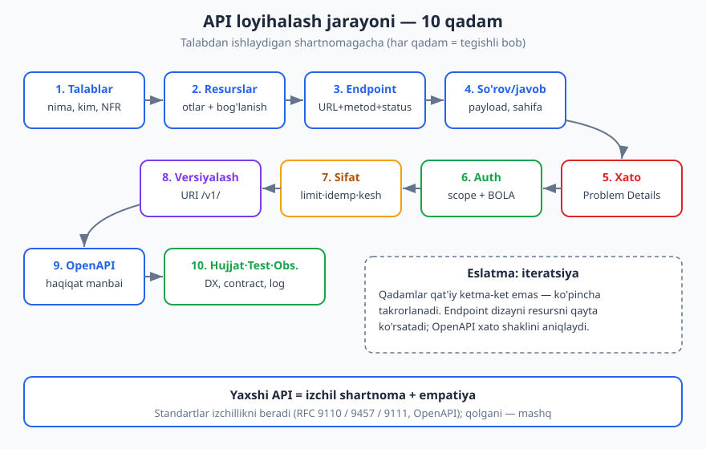
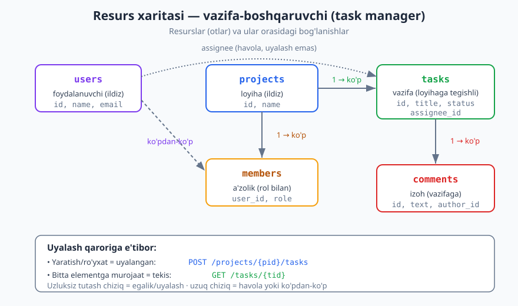
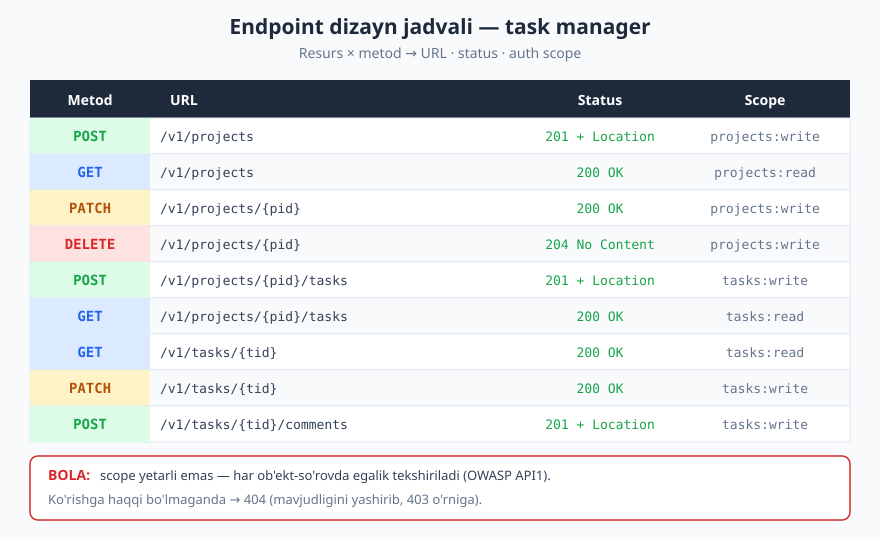

# 28 — Kapston: to'liq API'ni noldan loyihalash

[⬅️ Oldingi: 27 — Dizayn naqshlari va anti-naqshlari](./27-naqshlar-antinaqshlar.md) · [🏠 README](./README.md)

---

> **Bu bobda:** 27 bob davomida biz API dizaynining alohida vositalarini o'rgandik — HTTP semantikasi, resurslar, status kodlar, auth, xato, versiyalash, OpenAPI, test. Endi ularning hammasini **bitta jonli loyihada** birlashtiramiz: noldan boshlab bitta real API'ni — vazifa-boshqaruvchi (task manager) ilovasini — o'n qadamli jarayon bo'yicha to'liq loyihalaymiz. Har qadamda tegishli bobga havola beramiz, qaror chiqaramiz va trade-off'ni asoslaymiz. Bob oxirida sizda noldan har qanday API'ni loyihalashga yetadigan tartib bo'ladi.
>
> **Halollik / Eslatma:** Bu bob yangi standart kiritmaydi — u oldingi boblardagi standartlarni (HTTP semantikasi = **RFC 9110**, xato formati = **RFC 9457**, keshlash = **RFC 9111**, OpenAPI **3.1**, **OWASP API Security Top 10 — 2023**) amalda qo'llaydi. Bitta "to'g'ri" API dizayni yo'q: bu yerdagi har bir qaror — **kontekstga-bog'liq trade-off**, va biz uni nima uchun shunday tanlaganimizni ochiq aytamiz. Barcha JSON namunalari valid (RFC 8259), OpenAPI parchasi 3.1 sintaksisida. Sizning loyihangizning talablari boshqacha bo'lsa, qarorlar ham boshqacha bo'lishi mumkin.

---

## Kirish: vositalardan jarayongacha

Tasavvur qiling, siz endi quruvchisiz va sizda to'liq asboblar to'plami bor: bolg'a (HTTP metodlari), o'lchagich (status kodlar), poydevor quyish usuli (resurs dizayni), qulf (auth), signalizatsiya (rate limit), chizma standarti (OpenAPI). Asboblarni bilish — bir narsa. Ulardan **uy qurish** — boshqa narsa. Kapston shu haqida: bir-bir asbobni emas, balki **butun jarayonni** ko'rsatamiz.

Yaxshi API hech qachon "endpoint yozaman" deb klaviaturadan boshlanmaydi. U **talabdan** boshlanadi va spetsifikatsiyaga aylanadi, faqat keyin kodga. Bu bob shu tartibni — talabdan ishlaydigan shartnomagacha bo'lgan yo'lni — bitta misolda to'liq bosib o'tadi.

Mana umumiy jarayon. Uni yodda saqlang: keyin har qanday API'ni shu xarita bo'yicha loyihalashingiz mumkin.



> **Eslatma:** Bu qadamlar qat'iy ketma-ket emas — ko'pincha ular **takrorlanadi (iteratsiya)**. Endpoint dizayni paytida resurs modelini qayta ko'rib chiqasiz; OpenAPI yozayotganda xato formatini aniqlashtirasiz. Lekin birinchi marta o'tganda shu tartib eng tabiiy.

---

## Qadam 1 — Talablar: nima va kim uchun

Hech bir texnik qaror talabni bilmasdan ma'noga ega emas. Avval savollarga javob beramiz:

**API nima qiladi?** Vazifa-boshqaruvchi (task manager). Foydalanuvchilar loyihalar (project) ochadi, ularning ichida vazifalar (task) yaratadi, vazifalarni boshqalarga biriktiradi, holatini o'zgartiradi (todo → doing → done), izoh (comment) qoldiradi.

**Kim ishlatadi (mijoz turlari)?** Bu narsa dizaynni keskin o'zgartiradi, shuning uchun aniqlaymiz:

| Mijoz | Xususiyati | Dizaynga ta'siri |
|---|---|---|
| **Web SPA** (brauzer) | Foydalanuvchi nomidan ishlaydi | Auth = OAuth Authorization Code + PKCE; CORS kerak |
| **Mobil ilova** | Foydalanuvchi nomidan, offline-ga moyil | Idempotentlik muhim (tarmoq beqaror); kompakt payload |
| **Tashqi integratsiya** (boshqa tizim) | Servis nomidan | Auth = Client Credentials; rate limit qattiqroq |

**Asosiy use-case'lar (foydalanish stsenariylari):**

1. Foydalanuvchi loyiha yaratadi va unga vazifalar qo'shadi.
2. Vazifani boshqa a'zoga biriktiradi va muddat (due date) belgilaydi.
3. Vazifalarni holat/biriktirilgan-shaxs bo'yicha filtrlaydi va sahifalaydi.
4. Vazifa holatini o'zgartiradi; izoh qoldiradi.
5. Tashqi tizim webhook orqali "vazifa bajarildi" hodisasini oladi.

**Funksional bo'lmagan talablar (NFR):**

- **Masshtab:** ~10 ming faol foydalanuvchi, kuniga ~1 mln so'rov. Katta emas, lekin "kichik hobby" ham emas — multi-tenant.
- **Xavfsizlik:** har bir foydalanuvchi faqat **o'zi a'zo bo'lgan** loyihalarning vazifalarini ko'radi. Bu — eng muhim talab; uni e'tibordan chetda qoldirish [OWASP API1: BOLA](./13-api-xavfsizligi.md) zaifligini keltiradi.
- **Ishonchlilik:** mobil mijoz bir so'rovni ikki marta yuborsa, ikkita vazifa yaratilmasligi kerak (idempotentlik).
- **Evolyutsiya:** API o'sadi; eski mijozlarni sindirmasdan yangilik qo'shish mumkin bo'lsin.

> **Trade-off:** Talablarni yozish "ortiqcha rasmiyatchilik" tuyulishi mumkin, lekin aynan shu jadval keyingi har bir qarorni asoslaydi. "Kim ishlatadi" degan savolga javob bermasangiz, auth usulini tasodifan tanlaysiz.

---

## Qadam 2 — Resurslarni aniqlash

Endi domendan (vazifa boshqaruvi) **resurslar**ni ajratamiz. Qoida ([6-bob: resurs va URI dizayni](./06-resurs-uri-dizayni.md)): resurslar odatda domendagi **otlar** — "narsalar", fe'llar emas. Use-case'lardagi otlarni belgilaymiz: foydalanuvchi, loyiha, vazifa, izoh, a'zolik.

| Resurs | Tavsif | Egasi/ota resursi |
|---|---|---|
| `users` | Foydalanuvchi profili | — (ildiz) |
| `projects` | Loyiha (vazifalar to'plami) | foydalanuvchilar a'zo |
| `tasks` | Vazifa | loyihaga tegishli |
| `comments` | Vazifa izohi | vazifaga tegishli |
| `members` | Loyiha a'zoligi (rol bilan) | loyihaga tegishli |

Resurslar orasidagi **bog'lanishlar** dizaynni belgilaydi:

- Loyiha → ko'p vazifa (`one-to-many`): vazifa loyihasiz mavjud bo'lmaydi → `tasks` loyihaga **uyalangan (nested)**.
- Vazifa → ko'p izoh: izoh ham uyalangan.
- Foydalanuvchi ↔ loyiha → **ko'pdan-ko'p**: oraliq resurs `members` (rol bilan).
- Vazifa → biriktirilgan foydalanuvchi: vazifaning `assignee_id` maydoni (havola, uyalash emas).



> **Trade-off — uyalash chuqurligi:** `tasks` loyihaga bog'liq, shuning uchun `/projects/{id}/tasks` mantiqiy. Lekin biz **bir vazifaga to'g'ridan-to'g'ri** ham murojaat qila olishimiz kerak (izoh, holat o'zgarishi). Yechim: yaratish/ro'yxat kolleksiya bo'yicha **uyalangan** (`/projects/{pid}/tasks`), bitta elementga murojaat esa **tekis (flat)** (`/tasks/{tid}`). Ikki-uch darajadan chuqur uyalashdan qoching: `/projects/1/tasks/2/comments/3/likes/4` o'qish va keshlash uchun og'ir.

---

## Qadam 3 — Endpointlar: metod, URL, status

Endi har bir resurs uchun **endpoint**larni chizamiz. Har biri uch narsadan iborat: **URL** (resurs), **metod** ([2-bob: HTTP chuqur](./02-http-chuqur.md)), **status kod** ([3-bob: status kodlar](./03-http-status-kodlari.md)).

Metod tanlash qoidasi (RFC 9110): o'qish = `GET` (safe, idempotent); yangi element yaratish = `POST` (safe emas, idempotent emas); to'liq almashtirish = `PUT` (idempotent); qisman o'zgartirish = `PATCH`; o'chirish = `DELETE` (idempotent).

To'liq endpoint jadvali:



| Metod va URL | Maqsad | Muvaffaqiyat status | Auth (scope) |
|---|---|---|---|
| `POST /v1/projects` | Loyiha yaratish | `201 Created` + `Location` | `projects:write` |
| `GET /v1/projects` | Loyihalar ro'yxati | `200 OK` | `projects:read` |
| `GET /v1/projects/{pid}` | Bitta loyiha | `200 OK` | `projects:read` |
| `PATCH /v1/projects/{pid}` | Loyihani o'zgartirish | `200 OK` | `projects:write` |
| `DELETE /v1/projects/{pid}` | Loyihani o'chirish | `204 No Content` | `projects:write` |
| `POST /v1/projects/{pid}/tasks` | Vazifa yaratish | `201 Created` + `Location` | `tasks:write` |
| `GET /v1/projects/{pid}/tasks` | Vazifalar ro'yxati (filtr) | `200 OK` | `tasks:read` |
| `GET /v1/tasks/{tid}` | Bitta vazifa | `200 OK` | `tasks:read` |
| `PATCH /v1/tasks/{tid}` | Vazifani o'zgartirish | `200 OK` | `tasks:write` |
| `DELETE /v1/tasks/{tid}` | Vazifani o'chirish | `204 No Content` | `tasks:write` |
| `POST /v1/tasks/{tid}/comments` | Izoh qo'shish | `201 Created` + `Location` | `tasks:write` |
| `GET /v1/tasks/{tid}/comments` | Izohlar ro'yxati | `200 OK` | `tasks:read` |
| `POST /v1/projects/{pid}/members` | A'zo qo'shish | `201 Created` | `members:write` |
| `GET /v1/me` | Joriy foydalanuvchi | `200 OK` | `profile:read` |

E'tibor bering:

- **Holat o'zgartirish** uchun alohida `POST /tasks/{id}/done` kabi fe'l-endpoint yaratmadik — buning o'rniga `PATCH /tasks/{id}` bilan `{"status": "done"}` yuboramiz. Holat oddiy maydon bo'lsa, bu yetarli va resurs-orientatsiyani saqlaydi.

> **Trade-off — amal (action) endpointlari:** Agar amal yon ta'sirli bo'lsa (masalan "vazifani arxivlash + xabarnoma yuborish + audit yozish"), uni oddiy maydon o'zgarishi emas, **alohida sub-resurs** sifatida ifodalash mantiqiyroq: `POST /v1/tasks/{id}/archive`. Bizning misolda holat oddiy, shuning uchun `PATCH` yetarli. Qoida: "fe'l-endpoint" anti-naqshidan qoching, lekin murakkab amal sof CRUD'ga sig'masa, undan qo'rqmang ([27-bob](./27-naqshlar-antinaqshlar.md)).

- `DELETE` → `204 No Content` (qaytaradigan tana yo'q). Ba'zilar `200` + o'chirilgan ob'ekt qaytaradi — ikkalasi ham to'g'ri, lekin biz `204`ni izchillik uchun tanladik.
- `POST` yaratishda har doim `Location` sarlavhasi yangi resurs URL'ini beradi — mijoz uni qayta-yuklamasdan ham biladi.

---

## Qadam 4 — So'rov va javob dizayni

Endpointlar ko'rinishi tayyor. Endi **payload**larni loyihalaymiz ([7-bob: so'rov/javob payload](./07-sorov-javob-payload.md)).

**Konvensiya qarorlari** (bir marta tanlab, hamma joyda saqlaymiz):

- Maydon nomlari = `snake_case` (`due_date`, `assignee_id`).
- Vaqt = ISO 8601 / RFC 3339 string (`"2026-06-16T09:00:00Z"`).
- ID = string (kelajakda UUID'ga o'tishni osonlashtiradi; raqamga bog'lanib qolmaymiz).
- Pul yoki nozik sonlar yo'q bu domenda, lekin bo'lsa — string yoki integer-tiyin.

**Vazifa yaratish — to'liq so'rov/javob:**

```http
POST /v1/projects/p_42/tasks HTTP/1.1
Host: api.example.com
Authorization: Bearer <token>
Content-Type: application/json
Idempotency-Key: 1d8e0f2a-7c3b-4a9e-b1c2-5f6a7b8c9d0e

{
  "title": "Login sahifasini yangilash",
  "assignee_id": "u_7",
  "due_date": "2026-06-20T17:00:00Z",
  "priority": "high"
}

HTTP/1.1 201 Created
Location: /v1/tasks/t_1001
Content-Type: application/json

{
  "id": "t_1001",
  "project_id": "p_42",
  "title": "Login sahifasini yangilash",
  "status": "todo",
  "assignee_id": "u_7",
  "due_date": "2026-06-20T17:00:00Z",
  "priority": "high",
  "created_at": "2026-06-16T09:12:00Z",
  "updated_at": "2026-06-16T09:12:00Z"
}
```

E'tibor bering: javob faqat mijoz yuborganini qaytarmaydi — **server tomonidan hosil qilingan** maydonlarni ham (`id`, `status: "todo"` standart qiymat, `created_at`) qo'shadi. Mijoz hech qachon `id` yoki `created_at` yubormaydi; ularni faqat server boshqaradi.

**Vazifalar ro'yxati — sahifalash va filtrlash** ([8-bob: sahifalash/filtrlash](./08-sahifalash-filtrlash.md)):

```http
GET /v1/projects/p_42/tasks?status=todo&assignee_id=u_7&limit=20&cursor=eyJpZCI6InRfOTgwIn0 HTTP/1.1
Host: api.example.com
Authorization: Bearer <token>

HTTP/1.1 200 OK
Content-Type: application/json

{
  "data": [
    {"id": "t_981", "title": "API hujjatini yozish", "status": "todo", "assignee_id": "u_7"},
    {"id": "t_982", "title": "Testlarni qo'shish", "status": "todo", "assignee_id": "u_7"}
  ],
  "pagination": {
    "next_cursor": "eyJpZCI6InRfOTgyIn0",
    "has_more": true
  }
}
```

> **Trade-off — cursor vs offset:** Biz **cursor-asosli** sahifalashni tanladik (`?cursor=...`), `?page=3&per_page=20` (offset) emas. Sabab: vazifalar tez-tez qo'shiladi va o'chiriladi — offset bilan "3-sahifa" har safar siljiydi, foydalanuvchi bir elementni ikki marta ko'radi yoki o'tkazib yuboradi. Cursor barqaror. Narxi: foydalanuvchi to'g'ridan-to'g'ri "57-sahifa"ga sakray olmaydi — lekin task ro'yxatida bu kerak emas. Agar API admin-panel uchun bo'lsa va "umumiy soni + ixtiyoriy sahifaga sakrash" kerak bo'lsa, offset afzalroq bo'lardi.

---

## Qadam 5 — Xato dizayni

Muvaffaqiyatli yo'lni chizdik. Endi **xato** yo'lini — bu ko'pincha e'tibordan chetda qoladigan, lekin DX (developer experience) uchun hal qiluvchi qism ([9-bob: xato dizayni](./09-xato-dizayni.md)).

Standart format = **RFC 9457 "Problem Details for HTTP APIs"**, media type `application/problem+json`. Hamma xato shu shaklda qaytadi — mijoz bitta parser yozadi.

**Validatsiya xatosi** (mijoz noto'g'ri ma'lumot yubordi):

```http
POST /v1/projects/p_42/tasks HTTP/1.1
Content-Type: application/json
Authorization: Bearer <token>

{"title": "", "due_date": "kecha"}

HTTP/1.1 422 Unprocessable Content
Content-Type: application/problem+json

{
  "type": "https://api.example.com/problems/validation-error",
  "title": "So'rov ma'lumotlari yaroqsiz",
  "status": 422,
  "detail": "Ba'zi maydonlar talab darajasiga javob bermadi.",
  "instance": "/v1/projects/p_42/tasks",
  "errors": [
    {"field": "title", "code": "required", "message": "Sarlavha bo'sh bo'lmasligi kerak"},
    {"field": "due_date", "code": "invalid_format", "message": "ISO 8601 sana kutilgan"}
  ]
}
```

`errors` — bu **kengaytma a'zosi** (RFC 9457 standart a'zolardan tashqari qo'shimcha maydonlarga ruxsat beradi). U formaga mos validatsiya xatolarini bitta javobda beradi, shunda mijoz hamma maydon xatosini birdan ko'rsata oladi.

**Status moslik jadvali** (har holat → to'g'ri kod):

| Vaziyat | Status | Izoh |
|---|---|---|
| Forma yaroqsiz (semantik) | `422 Unprocessable Content` | JSON to'g'ri, lekin qiymatlar yaroqsiz |
| JSON sintaksisi buzuq | `400 Bad Request` | umuman parse bo'lmadi |
| Token yo'q / yaroqsiz | `401 Unauthorized` | autentifikatsiya yo'q |
| Token bor, lekin ruxsat yo'q | `403 Forbidden` | autentifikatsiya bor, avtorizatsiya yo'q |
| Resurs topilmadi | `404 Not Found` | yoki ko'rishga haqqi yo'q (BOLA yashirish) |
| Holat ziddiyati | `409 Conflict` | masalan allaqachon o'chirilgan |
| Rate limit | `429 Too Many Requests` | + `Retry-After` |

> **Diqqat — 401 vs 403:** `401` = "kim ekanligingni bilmayman" (autentifikatsiya). `403` = "kim ekanligingni bilaman, lekin bunga haqqing yo'q" (avtorizatsiya). Bu farqni chalkashtirish — eng ko'p uchraydigan API xatosi. RFC 9110 buni aniq ajratadi.

---

## Qadam 6 — Auth: kim va nimaga haqli

Endi qulfni o'rnatamiz. Ikki bosqich: **autentifikatsiya** (kim?) ([11-bob](./11-autentifikatsiya.md)) va **avtorizatsiya** (nimaga haqli?) ([12-bob](./12-avtorizatsiya.md)).

**Autentifikatsiya tanlovi:**

- **Foydalanuvchi nomidan** ishlovchi web/mobil mijozlar → **OAuth 2.0 Authorization Code + PKCE**. Bu — foydalanuvchiga yo'naltirilgan ilovalar uchun standart yo'l. (OAuth 2.1 yo'nalishi — hali draft — PKCE'ni hamma mijoz uchun majburiy qiladi va implicit/password grantlarni olib tashlaydi; biz shu yo'nalishga amal qilamiz.)
- **Tashqi tizimlar** (servis nomidan) → **Client Credentials**.
- Token formati: kirib kelgan token **OAuth bearer token** (RFC 6750), serverda esa biz uni **JWT** sifatida ifodalashimiz mumkin (`sub`, `scope`, `exp` claimlar) — JWT bu token *formati*, OAuth bu *protokol*; ular bir-birini almashtirmaydi.

**Scope (ruxsat doirasi)** — token nimaga ruxsat berishini chegaralaydi. Endpoint jadvalida ko'rgan scope'lar: `projects:read`, `projects:write`, `tasks:read`, `tasks:write`, `members:write`, `profile:read`. Mobil ilova hamma scope'ni so'raydi; tashqi "faqat o'qish" integratsiyasi faqat `*:read` oladi.

**Eng muhim qism — BOLA himoyasi** (OWASP API1, [13-bob](./13-api-xavfsizligi.md)): scope "tasks:read" berilgani — foydalanuvchi **istalgan** vazifani o'qiy oladi degani **emas**. Har bir so'rovda server quyidagini tekshiradi:

> Token egasi (`sub`) shu vazifa tegishli loyihaning **a'zosimi**?

Agar yo'q bo'lsa → `404 Not Found` (yo'qligini yashirib, `403` o'rniga — chunki `403` "bu resurs mavjud, lekin senga emas" deb ma'lumot sizdiradi). Bu tekshiruv **har bir ob'ekt-darajali so'rovda** bo'lishi shart; scope tekshiruvi uni almashtirmaydi.

```http
GET /v1/tasks/t_1001 HTTP/1.1
Authorization: Bearer <boshqa-loyiha-a'zosining-tokeni>

HTTP/1.1 404 Not Found
Content-Type: application/problem+json

{
  "type": "https://api.example.com/problems/not-found",
  "title": "Vazifa topilmadi",
  "status": 404,
  "detail": "So'ralgan vazifa mavjud emas yoki sizga ko'rinmaydi.",
  "instance": "/v1/tasks/t_1001"
}
```

> **Xavfsizlik:** BOLA — OWASP API Security Top 10 (2023) ning **birinchi** zaifligi, chunki u eng keng tarqalgan va eng zararli. "ID URL'da bor, demak men uni so'rab tekshiraman" yetarli emas — har gal egalik (ownership) tekshirilishi kerak. Bu xato butun talablar ro'yxatidagi eng muhim NFRni buzadi.

---

## Qadam 7 — Sifat: rate limit, idempotentlik, kesh

API ishlaydi va xavfsiz. Endi uni **mustahkam** qilamiz.

**Rate limiting** ([14-bob](./14-rate-limiting.md)) — bir mijoz tizimni bosib qo'ymasligi uchun (OWASP API4: Unrestricted Resource Consumption). Token bucket algoritmi, har token uchun limit. Limitga yetganda:

```http
HTTP/1.1 429 Too Many Requests
Retry-After: 30
RateLimit-Limit: 1000
RateLimit-Remaining: 0
RateLimit-Reset: 30
Content-Type: application/problem+json

{
  "type": "https://api.example.com/problems/rate-limited",
  "title": "So'rovlar chegarasi oshib ketdi",
  "status": 429,
  "detail": "Iltimos, 30 sekunddan keyin qayta urinib ko'ring."
}
```

`Retry-After` standart (RFC 9110); `RateLimit-*` sarlavhalari IETF draft — biz ularni amaldagi konvensiya sifatida ishlatamiz va mijozga "qachon qaytish"ni aytamiz.

**Idempotentlik** ([15-bob](./15-idempotentlik-parallellik.md)) — mobil mijoz vazifa yaratish so'rovini yuboradi, javob kelmaydi (tarmoq uzildi), mijoz qayta yuboradi. Ikkita vazifa yaralmasligi kerak. Yechim: `POST` so'rovlarda `Idempotency-Key` sarlavhasi (yuqoridagi yaratish misolida ko'rgan). Server kalitni saqlaydi: birinchi marta — ishlaydi va natijani keshlaydi; ikkinchi marta xuddi shu kalit bilan — kodni qayta ishlatmasdan **saqlangan natijani** qaytaradi.

> **Eslatma:** `Idempotency-Key` sarlavhasi IETF draft holatida (Stripe va boshqalar keng ishlatadi). `GET`, `PUT`, `DELETE` tabiatan idempotent (RFC 9110), shuning uchun kalit faqat `POST` uchun kerak.

**Keshlash** ([16-bob](./16-keshlash.md), RFC 9111) — kam o'zgaradigan resurslarni keshlaymiz. Loyiha o'qishida `ETag` qaytaramiz; mijoz keyingi so'rovda `If-None-Match` bilan keladi; o'zgarmagan bo'lsa → `304 Not Modified` (tana yo'q, tarmoq tejaladi). Bu ayni paytda **optimistik bir-vaqtlilik** uchun ham ishlaydi: `PATCH` da `If-Match` bilan kelgan eski ETag → `412 Precondition Failed` (kimdir orada o'zgartirgan).

```http
GET /v1/projects/p_42 HTTP/1.1
If-None-Match: "v7"

HTTP/1.1 304 Not Modified
ETag: "v7"
```

---

## Qadam 8 — Versiyalash strategiyasi

API o'sadi. Bir kun keladi, payload shaklini **sindiruvchi (breaking)** o'zgarish kerak bo'ladi. Eski mijozlarni qanday saqlaymiz? ([10-bob: versiyalash](./10-versiyalash.md))

Biz **URI versiyalash**ni tanladik — shuning uchun hamma yo'lda `/v1/` prefiksi bor (`/v1/projects`, `/v1/tasks`).

> **Trade-off — URI vs header versiyalash:** URI versiyalash (`/v1/...`) brauzerda ko'rinadi, log'da o'qiladi, `curl` bilan sinash oson, keshlash bilan toza ishlaydi. Kamchiligi: "sof REST" nuqtai nazaridan bir resurs ikki URL'ga ega bo'ladi. Muqobil — `Accept: application/vnd.example.v1+json` (media type versiyalash) — sofroq, lekin ko'rinmas va sinash qiyin. Public API va keng auditoriya uchun **URI versiyalash** soddaligini afzal ko'rdik. Ichki mikroservislar uchun header versiyalash mosroq bo'lishi mumkin.

**Qoidalar:**

- Yangi **ixtiyoriy** maydon qo'shish — sindiruvchi emas; versiya o'zgartirmaymiz (additive).
- Maydonni o'chirish, qayta nomlash, majburiy qilish — sindiruvchi; `/v2/` talab qiladi.
- `/v1/` ni o'chirishdan oldin **`Deprecation`** (RFC 9745) va **`Sunset`** (RFC 8594) sarlavhalari bilan ogohlantiramiz va hujjatda muddatni e'lon qilamiz.

---

## Qadam 9 — OpenAPI: yagona haqiqat manbai

Endi shartnomani **mashina o'qiy oladigan** spetsifikatsiyaga aylantiramiz ([21-bob: OpenAPI](./21-openapi.md)). OpenAPI spec — bu "yagona haqiqat manbai (source of truth)": undan hujjat, mijoz SDK, server stub va contract testlar avtomatik chiqadi.

Bir-ikki endpoint uchun OpenAPI **3.1** parchasi:

```yaml
openapi: 3.1.0
info:
  title: Task Manager API
  version: 1.0.0
servers:
  - url: https://api.example.com/v1
paths:
  /projects/{pid}/tasks:
    post:
      summary: Loyihada yangi vazifa yaratish
      operationId: createTask
      security:
        - oauth2: [tasks:write]
      parameters:
        - name: pid
          in: path
          required: true
          schema:
            type: string
        - name: Idempotency-Key
          in: header
          required: false
          schema:
            type: string
            format: uuid
      requestBody:
        required: true
        content:
          application/json:
            schema:
              $ref: '#/components/schemas/TaskCreate'
      responses:
        '201':
          description: Vazifa yaratildi
          headers:
            Location:
              schema:
                type: string
          content:
            application/json:
              schema:
                $ref: '#/components/schemas/Task'
        '422':
          description: Validatsiya xatosi
          content:
            application/problem+json:
              schema:
                $ref: '#/components/schemas/Problem'
components:
  securitySchemes:
    oauth2:
      type: oauth2
      flows:
        authorizationCode:
          authorizationUrl: https://auth.example.com/authorize
          tokenUrl: https://auth.example.com/token
          scopes:
            tasks:read: Vazifalarni o'qish
            tasks:write: Vazifalarni o'zgartirish
  schemas:
    TaskCreate:
      type: object
      required: [title]
      properties:
        title:
          type: string
          minLength: 1
        assignee_id:
          type: string
        due_date:
          type: string
          format: date-time
        priority:
          type: string
          enum: [low, medium, high]
    Task:
      type: object
      required: [id, project_id, title, status, created_at]
      properties:
        id:
          type: string
        project_id:
          type: string
        title:
          type: string
        status:
          type: string
          enum: [todo, doing, done]
        assignee_id:
          type: [string, "null"]
        due_date:
          type: [string, "null"]
          format: date-time
        priority:
          type: string
          enum: [low, medium, high]
        created_at:
          type: string
          format: date-time
        updated_at:
          type: string
          format: date-time
    Problem:
      type: object
      properties:
        type:
          type: string
        title:
          type: string
        status:
          type: integer
        detail:
          type: string
        instance:
          type: string
```

E'tibor bering: `assignee_id` va `due_date` ning `type: [string, "null"]` shakli — JSON Schema 2020-12 (OpenAPI 3.1 unga moslangan) usuli "string yoki null" ifodalashning. 3.0 dagi `nullable: true` o'rniga shu ishlatiladi.

> **Standart:** OpenAPI 3.1 (Feb 2021) JSON Schema 2020-12 bilan tekislangan; eng yangisi 3.2.0 (Sept 2025). Biz 3.1 sintaksisida yozdik — u keng qo'llab-quvvatlanadi.

---

## Qadam 10 — Hujjat, test, observability

Spec tayyor. Oxirgi qadam — uni **ishonchli va qulay** qilish.

**Hujjat va DX** ([22-bob: hujjatlash/DX](./22-hujjatlash-dx.md)): OpenAPI'dan interaktiv hujjat (Swagger UI / Redoc) avtomatik chiqadi. Lekin yaxshi DX undan ko'proq: "Getting Started" yo'riqnomasi, real `curl` namunalar, autentifikatsiya bo'yicha qadam-baqadam, xatolar lug'ati. Hujjat — API'ning yuzi; ko'p dasturchi avval hujjatni ko'radi, keyin qaror qiladi.

**Test** ([24-bob: testlash/contract](./24-testlash-contract.md)): ikki qatlam.

1. **Contract testlar** — implementatsiya OpenAPI spec'ga mos kelishini tekshiradi (spec aytgan shakl = server qaytargan shakl). Bu — spec'ning "yolg'on gapirmasligi"ning kafolati.
2. **Integratsiya testlar** — har endpoint, ayniqsa **xavfsizlik** yo'llari: "boshqa loyiha a'zosi `t_1001`ni o'qiy olmaydi" testini albatta yozamiz (BOLA regressiyasini ushlash uchun).

**Observability** ([25-bob: observability](./25-observability.md)): har so'rovda structured log (kim, qaysi endpoint, status, davomiyligi), `trace_id` (so'rovni xizmatlar bo'ylab kuzatish), metrikalar (so'rov soni, xato foizi, p95 kechikish). Muammo chiqsa, "nima bo'ldi"ni log'dan emas, balki **dashboard**dan ko'rasiz.

---

## To'liq ishlangan misol: yana bir bor, qisqacha

Yuqorida har qadamni alohida ko'rdik. Mana ularning hammasi bitta vazifa-boshqaruvchi API'ning **yaxlit shartnomasi** sifatida:

- **Talab:** multi-tenant task manager; web/mobil/tashqi mijozlar; eng muhim NFR — har kim faqat o'z loyihalarini ko'radi.
- **Resurslar:** `users`, `projects`, `tasks`, `comments`, `members` — uyalash bilan, lekin elementga tekis murojaat.
- **Endpointlar:** CRUD + filtr + sahifalash; metod/status RFC 9110'ga mos; yaratishda `201` + `Location`.
- **Payload:** `snake_case`, RFC 3339 vaqt, server-hosil maydonlar; cursor sahifalash.
- **Xato:** RFC 9457 Problem Details, `errors` kengaytmasi bilan validatsiya.
- **Auth:** OAuth Code+PKCE (foydalanuvchi), Client Credentials (servis); scope + **har so'rovda BOLA tekshiruvi**.
- **Sifat:** 429 + `Retry-After`; `Idempotency-Key` POST uchun; `ETag`/`If-None-Match` kesh va `If-Match` bir-vaqtlilik.
- **Versiya:** URI `/v1/`; additive o'sish; `Deprecation`/`Sunset` bilan iste'foga chiqarish.
- **Spec:** OpenAPI 3.1 — yagona haqiqat manbai.
- **Sifat-kafolat:** hujjat, contract + xavfsizlik testlari, structured log + trace + metrikalar.

Asosiy trade-off qarorlari va ularning sababi:

| Qaror | Tanlov | Sabab |
|---|---|---|
| Sahifalash | Cursor | Ro'yxat tez o'zgaradi → offset siljiydi |
| Versiyalash | URI `/v1/` | Ko'rinarli, sinash oson, keng auditoriya |
| Holat o'zgartirish | `PATCH` maydon | Oddiy holat → fe'l-endpoint kerak emas |
| 403 o'rniga 404 | Yashirish | Resurs mavjudligini sizdirmaslik (BOLA) |
| ID formati | String | UUID'ga oson o'tish; DB internalini sizdirmaslik |

---

## Dizayn review: o'zini tekshirish

Loyihalash tugagach, [27-bob](./27-naqshlar-antinaqshlar.md) ruhidagi checklist bilan o'zingizni tekshiring. Har bir savolga "ha" deya olsangiz, dizayn mustahkam:

- [ ] URL'lar **otlardanmi** (resurs), fe'llardan emasmi? (`/tasks`, `/getTasks` emas)
- [ ] Har metod RFC 9110 semantikasiga **mosmi**? (`GET` safe, `DELETE` idempotent)
- [ ] Har status kod **to'g'rimi**? (yaratish `201`, o'chirish `204`, `401` vs `403`)
- [ ] Xato formati **izchilmi** (RFC 9457), hamma joyda bir xilmi?
- [ ] **BOLA** — har ob'ekt-so'rovda egalik tekshirilyaptimi?
- [ ] Yaratish so'rovlari **idempotentmi** (`Idempotency-Key`)?
- [ ] Payload maydon konvensiyasi (`snake_case`) **hamma joyda bir xilmi**?
- [ ] Sahifalash strategiyasi tanlangan va **izchilmi**?
- [ ] **Versiyalash** rejasi bormi; sindiruvchi o'zgarish qanday boshqariladi?
- [ ] OpenAPI spec server bilan **mos**mi (contract test)?
- [ ] Server internallari (DB ustun nomlari, stack-trace) **sizib chiqmayaptimi**?

> **Anti-pattern:** Eng ko'p uchraydigan to'rtta: (1) fe'l-URL (`/createTask`); (2) hamma xatoga `200 OK` + tanada `{"error": ...}`; (3) egalik tekshiruvisiz ID (BOLA); (4) izchilsiz maydon nomlari (`due_date` bir joyda, `dueDate` boshqasida). Ularning hammasidan yuqoridagi jarayon himoya qiladi.

---

## Keyingi qadamlar

Loyihalashni bilish — yarmi. Endi eng muhimi — **amaliyot**.

1. **Real API quring.** Bu dizaynni tanlagan tilingizda implementatsiya qiling — [Node.js](../nodejs/README.md), Laravel yoki Django bilan. Spec'dan boshlang, keyin kod. Birinchi loyihangiz mukammal bo'lmaydi — bu normal.
2. **Tizim darajasiga ko'taring.** API bitta xizmat ichidagi shartnoma; uni katta tizim ichida joylash (xizmatlar chegarasi, gateway, ma'lumotlar oqimi) — alohida fan. [Dasturiy arxitektura](../arxitektura/README.md) kitobi shu haqida.
3. **Mashhur API'larni o'rganing.** Stripe (xato dizayni va idempotentlik etaloni), GitHub (resurs modeli va pagination), Twilio (DX). Yaxshi API'ni o'qish — yaxshi yozishning eng tez yo'li.
4. **OpenAPI'ni avtomatlashtiring.** Spec'dan SDK, hujjat va contract test chiqarishni CI'ga ulang — shunda shartnoma har doim haqiqatga mos qoladi.

---

## Yakuniy so'z

Butun kitob bo'ylab bir g'oya qaytarildi: **API — bu shartnoma**. U mashina o'qiy oladigan formatda yozilgan, lekin uni o'qiydiganlar — odamlar, sizdan keyingi dasturchilar. Yaxshi API ikki narsadan iborat:

- **Izchillik** — bir marta o'rgangan qoida hamma joyda ishlaydi. Status kodlar, maydon nomlari, xato shakli, sahifalash — bashorat qilinadigan. Izchillik ishonch hosil qiladi.
- **Empatiya** — siz API'ni o'zingiz uchun emas, **uni ishlatadigan dasturchi** uchun loyihalaysiz. Xato xabari unga yo'l ko'rsatadimi? Hujjat birinchi 5 daqiqada ishlatib ko'rishga yetadimi? Bu — texnik emas, insoniy savol.

Bularning ikkalasi ham bir kechada kelmaydi. Ular **mashq** bilan — har bir loyiha, har bir review, har bir "nega bu xato shunday qaytdi?" savoli bilan keladi. Siz endi vositalarni ham, jarayonni ham bilasiz. Qolgan — qurish. Omad.

---

## Asosiy g'oyalar (bobni qisqacha)

- **API dizayni jarayon** — talabdan boshlanadi, spec'da yakunlanadi, kod eng oxirida. Klaviaturadan emas, savoldan boshlang.
- **O'n qadam:** talab → resurs → endpoint → payload → xato → auth → sifat → versiya → OpenAPI → hujjat/test/observability. Har qadam oldingi bobdagi vositadan foydalanadi.
- **Har qaror — trade-off.** Cursor vs offset, URI vs header versiya, PATCH vs amal-endpoint — kontekst hal qiladi, mutlaq qoida emas. Tanlovni asoslay olish — tanlovning o'zidan muhimroq.
- **Xavfsizlik tasodif emas** — BOLA himoyasi (har ob'ekt-so'rovda egalik tekshiruvi) dizaynning birinchi sinfli qismi; OWASP API1.
- **Izchillik + empatiya = yaxshi API.** Standart (RFC 9110/9457/9111, OpenAPI) izchillikni beradi; dasturchiga g'amxo'rlik empatiyani. Qolgani — mashq.

---

## Mashqlar

### Oson

**1-mashq.** Quyidagi talab berilgan: "Foydalanuvchilar kitoblarni ro'yxatga oladi va har bir kitobga sharh (review) yozadi." Bu domendan **ikkita resurs** va ular orasidagi **bog'lanish**ni aniqlang.

**2-mashq.** Loyihalash jarayonining quyidagi qadamlarini **to'g'ri tartibda** joylashtiring: OpenAPI yozish · resurslarni aniqlash · talablarni to'plash · endpointlarni belgilash · xato formatini dizayn qilish.

**3-mashq.** "Yangi kitob qo'shish" amali uchun to'g'ri **HTTP metod**, **URL** va muvaffaqiyat **status kod**ini ayting.

### O'rta

**4-mashq.** 1-mashqdagi kitob/sharh domeni uchun **endpoint jadvali** tuzing (kamida 5 endpoint): metod, URL, status. Sharh kitobga uyalangan bo'lsin.

**5-mashq.** Shu API uchun **auth dizayni** chizing: qaysi grant (foydalanuvchi mijozi uchun), qanday **scope**lar kerak, va "boshqa odamning sharhini o'chirish"ni qanday to'sasiz (qaysi tekshiruv, qaysi status)?

**6-mashq.** "Kitobga yangi sharh qo'shish" uchun **to'liq so'rov va javob** blokini yozing (HTTP metod, yo'l, sarlavhalar, valid JSON tana; server `201` qaytarsin, javob server-hosil maydonlarni o'z ichiga olsin).

### Qiyin

**7-mashq.** Butunlay boshqa domen — **stol bron qilish (restoran reservation) tizimi** — uchun API'ni noldan loyihalang: (a) 3 ta talab/NFR, (b) resurs xaritasi, (c) kamida 6 endpointli jadval (auth scope bilan), (d) bitta endpointning to'liq so'rov/javob misoli.

**8-mashq.** Shu bron tizimi uchun **ikkita dizayn qarorini** trade-off bilan asoslang: (1) sahifalash cursor yoki offset; (2) versiyalash URI yoki header. Har biri uchun "qachon teskari tanlov to'g'ri bo'lardi"ni ham ayting.

**9-mashq.** Bron yaratish endpointi uchun **OpenAPI 3.1 parchasi** yozing (`paths` ostida bitta `POST` operatsiya: `requestBody` sxemasi, `201` va `409` javoblar). 409 — bir vaqtda ikki kishi bir stolni bron qilishga urinsa.

<details markdown="1">
<summary>Yechimlar</summary>

### 1-mashq yechimi

Resurslar: `books` (kitob) va `reviews` (sharh). Bog'lanish: **bir kitobga ko'p sharh** (one-to-many). Sharh kitobsiz mavjud bo'lmaydi, shuning uchun u kitobga tegishli (uyalangan) sub-resurs. Foydalanuvchi ham resurs bo'lishi mumkin (`users`), lekin talab "ikkita resurs" so'radi, asosiylari — `books` va `reviews`.

### 2-mashq yechimi

To'g'ri tartib:

1. Talablarni to'plash
2. Resurslarni aniqlash
3. Endpointlarni belgilash
4. Xato formatini dizayn qilish
5. OpenAPI yozish

Mantiq: nima qilishimizni (talab) bilmasak, resurslarni ajrata olmaymiz; resurslarsiz endpoint yo'q; xato formati endpointlar shaklini bilgach aniqlanadi; OpenAPI — hamma qaror tayyor bo'lgach yoziladigan **yakuniy shartnoma**.

### 3-mashq yechimi

- **Metod:** `POST` (yangi element yaratish — safe emas, idempotent emas).
- **URL:** `POST /v1/books` (kolleksiyaga qo'shish).
- **Status:** `201 Created`, javobda `Location: /v1/books/{yangi_id}` sarlavhasi bilan.

### 4-mashq yechimi

| Metod va URL | Maqsad | Status |
|---|---|---|
| `POST /v1/books` | Kitob qo'shish | `201 Created` + `Location` |
| `GET /v1/books` | Kitoblar ro'yxati (sahifa) | `200 OK` |
| `GET /v1/books/{bid}` | Bitta kitob | `200 OK` |
| `POST /v1/books/{bid}/reviews` | Sharh qo'shish | `201 Created` + `Location` |
| `GET /v1/books/{bid}/reviews` | Kitob sharhlari ro'yxati | `200 OK` |
| `GET /v1/reviews/{rid}` | Bitta sharh (tekis murojaat) | `200 OK` |
| `DELETE /v1/reviews/{rid}` | Sharhni o'chirish | `204 No Content` |

Ro'yxat/yaratish kitobga uyalangan (`/books/{bid}/reviews`), bitta sharhga murojaat tekis (`/reviews/{rid}`) — chuqur uyalashdan qochish uchun.

### 5-mashq yechimi

- **Grant:** foydalanuvchi nomidan ishlovchi web/mobil mijoz uchun **OAuth 2.0 Authorization Code + PKCE** (OAuth 2.1 yo'nalishi — PKCE majburiy, implicit/password yo'q).
- **Scope'lar:** `books:read`, `reviews:read`, `reviews:write`. (Kitob qo'shish admin amali bo'lsa — alohida `books:write`.)
- **"Boshqa odamning sharhini o'chirish"ni to'sish:** `reviews:write` scope yetarli **emas** — bu BOLA (OWASP API1). Server `DELETE /v1/reviews/{rid}` da token egasi (`sub`) shu sharh **muallifimi** (yoki admin) ekanini tekshiradi. Agar yo'q bo'lsa → **`404 Not Found`** (resurs mavjudligini sizdirmaslik uchun `403` o'rniga 404). Scope "nima turdagi amal"ni, egalik tekshiruvi "qaysi aniq ob'ektga" ruxsatni boshqaradi — ikkalasi ham kerak.

### 6-mashq yechimi

```http
POST /v1/books/b_15/reviews HTTP/1.1
Host: api.example.com
Authorization: Bearer <token>
Content-Type: application/json

{
  "rating": 5,
  "text": "Ajoyib kitob, API dizaynini noldan o'rgatadi."
}

HTTP/1.1 201 Created
Location: /v1/reviews/r_900
Content-Type: application/json

{
  "id": "r_900",
  "book_id": "b_15",
  "author_id": "u_3",
  "rating": 5,
  "text": "Ajoyib kitob, API dizaynini noldan o'rgatadi.",
  "created_at": "2026-06-16T10:30:00Z"
}
```

Server `id`, `book_id` (yo'ldan), `author_id` (tokendan), `created_at` ni o'zi hosil qildi — mijoz ularni yubormaydi.

### 7-mashq yechimi

**(a) Talab/NFR:**

1. Foydalanuvchilar restoranlarni ko'radi va ma'lum sana/vaqtga stol bron qiladi.
2. **NFR — bir-vaqtlilik:** ikki kishi bir stolni bir vaqtga bron qila olmasligi kerak (ortiqcha-bron yo'q).
3. **NFR — xavfsizlik:** foydalanuvchi faqat **o'z** bronlarini ko'radi/bekor qiladi (BOLA himoyasi).

**(b) Resurs xaritasi:**

- `restaurants` (ildiz) → ko'p `tables` (stol).
- `restaurants` → ko'p `reservations` (bron); bron `table_id`, `user_id`, `start_time`, `party_size` ga ega.
- `users` → ko'p `reservations`.

**(c) Endpoint jadvali:**

| Metod va URL | Maqsad | Status | Scope |
|---|---|---|---|
| `GET /v1/restaurants` | Restoranlar ro'yxati | `200 OK` | `restaurants:read` |
| `GET /v1/restaurants/{rid}/availability?date=...` | Bo'sh stollar | `200 OK` | `restaurants:read` |
| `POST /v1/restaurants/{rid}/reservations` | Bron yaratish | `201 Created` + `Location` | `reservations:write` |
| `GET /v1/reservations/{resid}` | Bitta bron | `200 OK` | `reservations:read` |
| `DELETE /v1/reservations/{resid}` | Bronni bekor qilish | `204 No Content` | `reservations:write` |
| `GET /v1/me/reservations` | Mening bronlarim | `200 OK` | `reservations:read` |

**(d) To'liq so'rov/javob:**

```http
POST /v1/restaurants/rest_8/reservations HTTP/1.1
Host: api.example.com
Authorization: Bearer <token>
Content-Type: application/json
Idempotency-Key: 9a1b2c3d-4e5f-6071-8293-a4b5c6d7e8f9

{
  "table_id": "tbl_3",
  "start_time": "2026-06-20T19:00:00Z",
  "party_size": 4
}

HTTP/1.1 201 Created
Location: /v1/reservations/res_555
Content-Type: application/json

{
  "id": "res_555",
  "restaurant_id": "rest_8",
  "table_id": "tbl_3",
  "user_id": "u_42",
  "start_time": "2026-06-20T19:00:00Z",
  "party_size": 4,
  "status": "confirmed",
  "created_at": "2026-06-16T11:00:00Z"
}
```

### 8-mashq yechimi

**(1) Sahifalash — bu yerda offset to'g'riroq.** Restoranlar ro'yxati nisbatan **barqaror** (kunlik tez-tez qo'shilib-o'chmaydi) va foydalanuvchi "umumiy soni"ni ko'rishi, "5-sahifa"ga sakrashi qulay bo'lishi mumkin — offset shuni beradi. *Teskari tanlov qachon to'g'ri:* agar biz juda tez o'sadigan oqimni (masalan real-vaqt bron-loglari) sahifalasak, offset siljiydi va dublikat/o'tkazib-yuborish chiqadi — o'shanda cursor afzal.

**(2) Versiyalash — URI (`/v1/`).** Bu public-ga moyil iste'mol API; mijozlar turli (web/mobil/uchinchi-tomon), URL ko'rinadigan va sinash oson bo'lsin. *Teskari tanlov qachon to'g'ri:* agar bu faqat ichki mikroservislar orasidagi shartnoma bo'lsa va biz URL'ni "toza resurs identifikatori" sifatida saqlamoqchi bo'lsak, `Accept` media-type versiyalash sofroq bo'lardi.

### 9-mashq yechimi

```yaml
openapi: 3.1.0
info:
  title: Restaurant Reservation API
  version: 1.0.0
paths:
  /restaurants/{rid}/reservations:
    post:
      summary: Restoranda stol bron qilish
      operationId: createReservation
      security:
        - oauth2: [reservations:write]
      parameters:
        - name: rid
          in: path
          required: true
          schema:
            type: string
      requestBody:
        required: true
        content:
          application/json:
            schema:
              type: object
              required: [table_id, start_time, party_size]
              properties:
                table_id:
                  type: string
                start_time:
                  type: string
                  format: date-time
                party_size:
                  type: integer
                  minimum: 1
      responses:
        '201':
          description: Bron yaratildi
          headers:
            Location:
              schema:
                type: string
          content:
            application/json:
              schema:
                type: object
                properties:
                  id:
                    type: string
                  status:
                    type: string
        '409':
          description: Stol shu vaqtga allaqachon band
          content:
            application/problem+json:
              schema:
                type: object
                properties:
                  type:
                    type: string
                  title:
                    type: string
                  status:
                    type: integer
                  detail:
                    type: string
```

`409 Conflict` — ortiqcha-bron holatining to'g'ri kodi: so'rov o'zi yaroqli (`422` emas), lekin resursning joriy holati bilan ziddiyatda. Bron yozuvini saqlashda `(table_id, start_time)` ustida unikal cheklov yoki optimistik qulflash bilan poyga-holatidan himoyalanamiz.

</details>

---

[⬅️ Oldingi: 27 — Dizayn naqshlari va anti-naqshlari](./27-naqshlar-antinaqshlar.md) · [🏠 README](./README.md)
