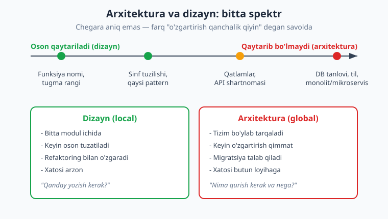
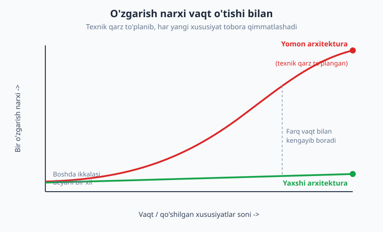
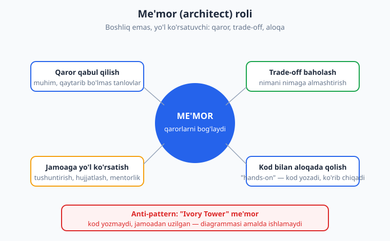

# 01 — Dasturiy arxitektura nima va nega muhim

[🏠 README](./README.md) · [Keyingi: 02 — Sifat atributlari va trade-off'lar ➡️](./02-sifat-atributlari-tradeoff.md)

---

> **Bu bobda:** dasturiy arxitektura nima ekanini — "o'zgartirish qiyin bo'lgan muhim qarorlar" sifatida — ko'rib chiqamiz. Richards va Ford'ning to'rt o'lchovli ta'rifini (struktura + sifat atributlari + qarorlar + dizayn printsiplari), arxitektura va dizayn farqini (qaytarib bo'lmaslik spektri), me'mor (architect) roli va uning eng keng tarqalgan anti-patternini ("ivory tower"), arxitektura nega muhimligini (o'zgarish narxi, texnik qarz, "big ball of mud"), va arxitekturaning birinchi qonunini — "hamma narsa trade-off" — o'rganamiz. Yakunda Conway qonuni bilan tanishib, butun kitobning yo'l xaritasini chizamiz.
>
> **Trade-off eslatmasi / Halollik:** bu bob asosan **konseptual** — kam kod. Ta'riflar obro'li manbalardan (Martin Fowler, Richards & Ford "Fundamentals of Software Architecture") olingan va tasdiqlangan. Bitta kichik TypeScript namuna ("o'zgarish narxi" modeli) **haqiqatan ishga tushirib tekshirilgan**. Diagrammalar tushunchani vizuallashtirish uchun; ulardagi raqamlar (narx ~ N) — soddalashtirilgan model, aniq o'lchov emas.

---

## Sintaksis emas, qaror

Sizning qo'lingizda allaqachon kod bor. Funksiya yoza olasiz, sinf tuzasiz, interfeys e'lon qilasiz, kutubxonani ulaysiz. Agar bu so'zlar notanish bo'lsa — bu kitobdan oldin [TypeScript](../typescript/README.md), [Python](../python/README.md) yoki [PHP](../php/README.md) kitoblaridan birini ko'rib chiqing; ular **sintaksisni** o'rgatadi. Bu kitob esa boshqa, kattaroq savolga javob beradi:

> Sinf yozishni bilaman. Lekin **qaysi** sinflar bo'lishi, ular **qanday** bo'linishi, biznes mantiq qayerda turishi, ma'lumotlar bazasi bilan qanday gaplashishi, tizim o'sganda nima sinishini qayerdan bilaman?

Mana shu — **dasturiy arxitektura** (software architecture). U sizning tizimingiz haqidagi eng muhim, eng erta va eng qaytarib bo'lmas qarorlar to'plami. Sintaksis — bu g'isht qanday qo'yilishi; arxitektura — bu binoning shakli, qancha qavat, qayerda yuk ko'taruvchi devor. G'ishtni keyin almashtirish oson; yuk ko'taruvchi devorni ko'chirish — butun binoni qayta qurish demak.

Ko'plab dasturchilar arxitekturani "yo'l-yo'lakay" hosil qiladi: kod yozaverib, qaror o'z-o'zidan paydo bo'ladi. Va u **albatta** paydo bo'ladi — savol shuki, u **ongli** qarormi yoki tasodifiy. Tasodifiy arxitektura deyarli har doim yomon arxitektura bo'ladi. Bu kitob sizga shu qarorlarni ongli, asoslangan, trade-off'larni tushungan holda qabul qilishni o'rgatadi.

---

## Dasturiy arxitektura nima: bir nechta ta'rif

Arxitekturaning bitta umumiy qabul qilingan ta'rifi yo'q — bu sohaning o'zi yosh va doimiy bahsda. Lekin uchta ta'rif birgalikda to'liq tasvirni beradi.

### 1. Martin Fowler: "muhim narsalar"

Martin Fowler o'z arxitektura sahifasida Ralph Johnson'ning mashhur formulasini keltiradi:

> "Architecture is about the important stuff. Whatever that is." — **muhim narsalar haqida. Nima muhim bo'lsa, o'sha.**

Bu ta'rif birinchi qarashda hazildek tuyuladi, lekin chuqur ma'noga ega: **nima muhim ekanini me'mor aniqlaydi**, va u kontekstga bog'liq. Bitta loyihada ma'lumotlar bazasi tanlovi hal qiluvchi, boshqasida — javob tezligi, uchinchisida — xavfsizlik. Fowler arxitekturani yana shunday ta'riflaydi:

> "the shared understanding that the expert developers have of the system design" — **tajribali dasturchilarning tizim dizayni haqidagi umumiy tushunchasi.**

Ya'ni arxitektura — bu faqat diagramma yoki hujjat emas; bu jamoaning boshidagi **umumiy aqliy model**. Yangi a'zo kelganda undan "tizim qanday ishlaydi?" deb so'rasangiz, javoblar bir-biriga mos kelsa — arxitektura aniq.

> **Eslatma:** Johnson "arxitektura — bu loyihada **erta to'g'ri qilishni istagan qarorlaringiz**" deydi. Diqqat: "erta qabul qilingan" emas, "erta **to'g'ri** qilishni xohlagan" — chunki erta qabul qilinadi-yu, ko'pincha noto'g'ri chiqadi va keyin ularni o'zgartirish qimmat bo'ladi.

### 2. Richards & Ford: to'rt o'lchov

Mark Richards va Neal Ford o'zlarining "Fundamentals of Software Architecture" kitobida arxitekturani **to'rt o'lchov** sifatida ta'riflaydi. Bu eng amaliy ta'rif — uni yodda saqlash kerak:

```text
Dasturiy arxitektura =
   1. Struktura          (tizim qaysi uslubda qurilgan: monolit, mikroservis, event-driven...)
 + 2. Sifat atributlari  (xususiyatlar / "-ilities": masshtablanuvchanlik, ishonchlilik...)
 + 3. Arxitektura qarorlari (qoidalar: "barcha aloqa API gateway orqali o'tadi")
 + 4. Dizayn printsiplari   (yo'riqnomalar: "iloji boricha asinxron aloqani afzal ko'r")
```

Bu to'rttasini ajratib turish muhim, ayniqsa oxirgi ikkisi:

- **Arxitektura qarori** — bu **qoida** (rule). U majburiy. Masalan: "ma'lumotlar bazasiga faqat ma'lumot qatlami murojaat qiladi". Buni buzish — arxitekturani buzish.
- **Dizayn printsipi** — bu **yo'riqnoma** (guideline). U majburiy emas, lekin tavsiya. Masalan: "iloji bo'lsa, REST o'rniga gRPC ishlat". Ba'zan asosli sabab bilan undan chetga chiqish mumkin.

Bu farqni 02 va 03-boblarda chuqurlashtiramiz: sifat atributlari — 02-bob, qarorlarni hujjatlash (ADR) — 03-bob.

### 3. Bino o'xshatishi — va uning chegarasi

"Arxitektor" so'zi me'morchilikdan kelgan, va o'xshatish foydali: ikkala holatda ham asosiy strukturani, yuk ko'taruvchi qismlarni, umumiy shaklni oldindan rejalashtirasiz. Lekin **o'xshatishning chegarasini ham bilish kerak** — aks holda u sizni chalg'itadi:

> **Diqqat (o'xshatish chegarasi):** binoda poydevorni quygandan keyin o'zgartirib bo'lmaydi — bu **fizika**. Dasturda esa o'zgartirish **mumkin**, faqat **qimmat**. Bino bir marta quriladi va o'zgarmaydi; dastur esa yillab **doimiy o'zgaradi**. Shuning uchun dasturiy arxitektura me'morchilikdan ko'ra ko'proq **shaharsozlik** (urban planning)ga o'xshaydi: shahar hech qachon "tugamaydi", u o'sadi, ba'zi rayonlar buziladi, yangilari quriladi. Yaxshi me'mor o'zgarishni **taqiqlamaydi** — uni **arzonlashtiradi**.

---

## Arxitektura va dizayn: qayerda chegara?

Eng ko'p beriladigan savol: "bu arxitekturaviy qarormi yoki oddiy dizaynmi?" Aniq chegara yo'q — bu **spektr**, va uni o'lchaydigan bitta o'lcham bor. Martin Fowler buni eng sodda qilib aytadi:

> **Arxitektura — bu o'zgartirish qiyin bo'lgan narsalar.** (Things that are hard to change.)

Ya'ni qaror qancha **qaytarib bo'lmas** (irreversible) bo'lsa, u shunchalik arxitekturaviy. Qancha oson qaytarilsa — shunchalik oddiy dizayn.



Bir nechta misol bilan spektrni his qilaylik:

| Qaror | Qaytarib bo'ladimi? | Daraja |
|---|---|---|
| Tugma rangi, o'zgaruvchi nomi | Juda oson (bir qatorda) | Dizayn |
| Qaysi pattern, sinf tuzilishi | Oson (refaktoring bilan) | Dizayn / chegara |
| Qatlamlar bo'linishi, API shartnomasi | Qiyin (ko'p joyga ta'sir) | Arxitektura |
| Ma'lumotlar bazasi turi (SQL vs NoSQL), til | Juda qiyin (migratsiya) | Arxitektura |
| Monolit yoki mikroservis | Juda qiyin (tizim qayta qurish) | Arxitektura |

> **Eslatma:** chegara loyihaga bog'liq. Kichik skriptda "qaysi DB" — arzimas qaror; banking tizimida — yillik loyiha. Shuning uchun "arxitekturaviymi?" degan savolga javob har doim **kontekstda**: "bu qarorni keyin o'zgartirish bizning tizimimizda qancha turadi?"

Bu fikrning amaliy natijasi: **yaxshi me'mor qaytarib bo'lmas qarorlarni iloji boricha kechiktiradi yoki ularni qaytariladigan qilib o'zgartiradi.** Masalan, ma'lumotlar bazasini to'g'ridan-to'g'ri ishlatish o'rniga uni interfeys (repository) orqasiga yashirsangiz — DB tanlovi "qaytarib bo'lmas"dan "qiyin, lekin mumkin"ga aylanadi. Bu g'oyani 12-13-boblarda (hexagonal, clean) chuqur ko'ramiz.

---

## O'zgarish narxi: nima uchun "muhim qaror" muhim

"Qaytarib bo'lmaslik" abstrakt tuyulishi mumkin. Uni **o'zgarish narxi** orqali aniqroq his qilaylik. Lokal (dizayn) qaror bitta modulga tegadi — uni o'zgartirish arzon. Arxitekturaviy qaror butun tizimga **tarqaladi** — uni o'zgartirish qimmat, chunki ko'p modul, integratsiya, migratsiya kerak.

Buni juda sodda model bilan ko'rsataylik. Quyidagi TypeScript namuna har bir qarorning "narxi"ni hisoblaydi: lokal qaror narxi taalluqli modullar soniga teng, arxitekturaviy qaror esa tarqalish va qaytarib bo'lmaslik tufayli koeffitsiyent bilan ko'paytiriladi.

```ts
type Qaror = {
  nom: string;
  arxitekturaviymi: boolean;  // tizim bo'ylab tarqaladimi?
  taalluqliModullar: number;  // bu qaror nechta modulga ta'sir qiladi
};

// Soddalashtirilgan model: bitta modulni o'zgartirish 1 birlik kuch.
// Arxitekturaviy qaror N modulga tarqaladi va qaytarib bo'lmaslik tufayli
// qo'shimcha integratsiya/migratsiya koeffitsiyenti bilan (bu yerda 3x).
function ozgartirishNarxi(q: Qaror): number {
  const asos = q.taalluqliModullar;
  const koeffitsiyent = q.arxitekturaviymi ? 3 : 1;
  return asos * koeffitsiyent;
}

const qarorlar: Qaror[] = [
  { nom: "Tugma rangini o'zgartirish",      arxitekturaviymi: false, taalluqliModullar: 1  },
  { nom: "REST'dan event-driven'ga o'tish", arxitekturaviymi: true,  taalluqliModullar: 8  },
  { nom: "Bitta funksiyani refaktor qilish",arxitekturaviymi: false, taalluqliModullar: 1  },
  { nom: "Monolitni mikroservisga bo'lish", arxitekturaviymi: true,  taalluqliModullar: 12 },
];

for (const q of qarorlar) {
  const turi = q.arxitekturaviymi ? "ARXITEKTURAVIY" : "lokal dizayn";
  console.log(`${q.nom.padEnd(38)} | ${turi.padEnd(15)} | narx ~ ${ozgartirishNarxi(q)}`);
}
```

Ishga tushirsak (probe muhitida `tsx` bilan haqiqatan bajarilgan; `tsc --strict` toza o'tdi):

```text
Tugma rangini o'zgartirish             | lokal dizayn    | narx ~ 1
REST'dan event-driven'ga o'tish        | ARXITEKTURAVIY  | narx ~ 24
Bitta funksiyani refaktor qilish       | lokal dizayn    | narx ~ 1
Monolitni mikroservisga bo'lish        | ARXITEKTURAVIY  | narx ~ 36
```

Farqni ko'rdingizmi? Lokal qarorlar **1**, arxitekturaviy qarorlar **24** va **36**. Bu — soddalashtirilgan model (haqiqiy hayotda raqamlar boshqacha), lekin **nisbat** to'g'ri: arxitekturaviy xato lokal xatodan **o'nlab marta** qimmatroq. Aynan shuning uchun arxitekturaga vaqt sarflash arziydi.

> **Diqqat:** bu raqamlar — **o'qitish modeli**, o'lchov emas. "Mikroservisga o'tish 36 birlik turadi" deb hech kimga aytmang. G'oya bitta: arxitekturaviy qaror narxi modullar soniga **ko'paytiriladi**, lokal qaror esa **bitta**ligicha qoladi.

### Texnik qarz va "big ball of mud"

Endi vaqt o'lchamini qo'shaylik. Har bir noto'g'ri yoki shoshilinch qaror — bu **texnik qarz** (technical debt): bugun tezroq yetkazish uchun olingan "qarz", uni keyin "foiz" bilan qaytarish kerak. Ward Cunningham bu metaforani kiritgan: ozgina qarz — sog'lom (tezroq bozorga chiqasiz), lekin qarz to'planib qolsa — har yangi xususiyat tobora qimmatlashadi, chunki avval eski chigallik bilan kurashish kerak.



Yomon arxitekturaning oxirgi bekati — **big ball of mud** ("katta loy to'pi"). Bu eng keng tarqalgan dasturiy arxitektura "uslubi": tasodifan hosil bo'lgan, hech qanday aniq strukturasi yo'q, hamma narsa hamma narsaga bog'langan tizim. Uni o'zgartirish dahshatli, chunki bitta joyni tegsangiz — kutilmagan boshqa joy sinadi.

> **Anti-pattern (big ball of mud):** struktura yo'qligi ham strukturadir — eng yomoni. Bunday tizimda hech kim to'liq qanday ishlashini bilmaydi, har o'zgarish qo'rqinchli, yangi dasturchi oylab "joylashadi". Buni 25-bobda batafsil, oldini olish usullari bilan ko'ramiz.

Asosiy xulosa: arxitektura muhim, chunki u o'zgarish narxini boshqaradi. Yaxshi arxitektura kelajakdagi o'zgarishlarni **arzon** qiladi; yomoni esa — har yangi qadamni qimmatlashtiradi, oxir-oqibat loyihani to'xtatadigan darajagacha.

---

## Me'mor (architect) roli

Agar arxitektura — bu muhim qarorlar bo'lsa, **me'mor** — bu qarorlarni qabul qiladigan, asoslaydigan va jamoaga tushuntiradigan odam. Bu lavozim emas, balki **rol**: kichik jamoada uni eng tajribali dasturchi bajaradi, kattasida — alohida arxitektor.



Me'morning asosiy mas'uliyatlari:

- **Qaror qabul qilish.** Muhim, qaytarib bo'lmas tanlovlarni qiladi: arxitektura uslubi, texnologiya, chegaralar. Va — bu muhim — **qachon qaror qabul QILMASLIKni** ham biladi (qaytarib bo'lmas qarorni kechiktirish).
- **Trade-off baholash.** Har tanlovning narxini ko'radi: "bu yondashuv tezroq, lekin qimmatroq qo'llab-quvvatlanadi". Bu kitobning markaziy ko'nikmasi.
- **Jamoaga yo'l ko'rsatish.** Qarorni faqat qabul qilish kifoya emas — uni **tushuntirish**, hujjatlash (ADR — 03-bob), jamoaga mentorlik qilish kerak. Tushunmagan qoidaga hech kim amal qilmaydi.
- **Kod bilan aloqada qolish.** Yaxshi me'mor kod yozadi, code review qiladi, jamoaning haqiqiy og'rig'ini his qiladi. Bu eng muhim — chunki uning aksi mashhur anti-patternga olib keladi.

> **Anti-pattern (Ivory Tower me'mor):** "fil suyagidan minora"da o'tirgan me'mor — kod yozmaydigan, jamoadan uzilgan, faqat chiroyli diagramma chizadigan arxitektor. Uning diagrammasi qog'ozda mukammal, lekin amalda ishlamaydi, chunki u haqiqiy cheklovlarni (kutubxona xatti-harakati, deadline, jamoa malakasi) bilmaydi. **Qaror qabul qiluvchi natijadan uzilmasligi kerak.** Eng yaxshi me'morlar — "hands-on" (kodga qo'l uradigan) me'morlar.

> **Amaliyotda:** sizda "arxitektor" degan lavozim bo'lishi shart emas. Agar siz "ma'lumotlar bazasini Redis bilan keshlaymizmi?" yoki "bu mantiqni alohida servisga ajratamizmi?" degan savolga javob berayotgan bo'lsangiz — siz **arxitektura qaror qabul qilyapsiz**. Bu kitob aynan shu lahzalarda yaxshi qaror chiqarishingizga yordam beradi.

---

## Birinchi qonun: hamma narsa trade-off

Endi bu kitobning eng muhim jumlasiga keldik. Richards va Ford uni **"dasturiy arxitekturaning birinchi qonuni"** deb ataydi:

> **"Everything in software architecture is a trade-off."**
> Dasturiy arxitekturada **hamma narsa — ayirboshlash** (trade-off).

Va undan kelib chiqadigan ikkinchi mashhur jumla:

> **"Why is more important than how."**
> **Nega** — **qanday**dan muhimroq.

Bu nimani anglatadi? **Yagona to'g'ri javob yo'q.** Mikroservis monolitdan yaxshiroq emas; NoSQL SQL'dan yaxshiroq emas; event-driven request/response'dan yaxshiroq emas. Har birining **narxi** va **foydasi** bor, va to'g'ri tanlov **kontekstga** bog'liq.

> **Diqqat (mutlaq da'volar — soxta):** "Mikroservis har doim yaxshi", "Monolit eskirgan", "SQL o'lyapti", "Hamma joyda Kafka ishlat" — bularning **hammasi noto'g'ri**, chunki ular kontekstsiz. To'g'ri javob deyarli har doim shunday boshlanadi: **"Bog'liq. Nimaga? ..."** (It depends). Internetda biror texnologiyani "har doim yaxshi" deb maqtagan maslahatga shubha bilan qarang.

Misol — bitta trade-off'ni ochaylik:

> **Trade-off (monolit vs mikroservis):** mikroservislar mustaqil joylashtirish va masshtablashni beradi (foyda), lekin tarmoq murakkabligi, distributed tranzaksiya muammosi va operatsion yukni qo'shadi (narx). Kichik jamoa va oddiy domen uchun bu narx foydadan ko'p — monolit to'g'riroq. Yuzlab dasturchili, mustaqil rivojlanishi kerak bo'lgan tizimda esa aksincha. **Savol "qaysi yaxshi?" emas — "bizning kontekstimizda qaysi narx-foyda nisbati to'g'riroq?"**

Aynan shuning uchun "nega" muhimroq: agar siz **nega** monolit tanlaganingizni (kichik jamoa, tez bozorga chiqish) bilsangiz, kontekst o'zgarganda (jamoa o'sdi) qarorni qayta ko'rib chiqa olasiz. Agar faqat **qanday** qilishni (mikroservis qanday quriladi) bilsangiz-u, **nega**sini bilmasangiz — noto'g'ri vaziyatda noto'g'ri vositani ishlatasiz.

### Big design up front vs evolyutsion (qisqa)

Tarixan ikki qarama-qarshi yondashuv bor edi:

- **Big Design Up Front (BDUF)** — hamma narsani oldindan, kod yozishdan oldin to'liq loyihalash. Muammosi: kelajakni to'liq bilib bo'lmaydi, talablar o'zgaradi, ortiqcha taxmin behuda ketadi.
- **Evolyutsion arxitektura** — arxitekturani vaqt bilan, kerak bo'lganda rivojlantirish, lekin **ongli** va **boshqariladigan** tarzda (tasodifiy "yo'l-yo'lakay" emas).

Bugungi konsensus — o'rtada: muhim, qaytarib bo'lmas qarorlarni o'ylab qil (ozgina "up front"), qolganini evolyutsiya qildir. Bu mavzuni 25-bobda ("evolyutsion arxitektura, fitness function") chuqur ochamiz.

---

## Conway qonuni (qisqa kirish)

Yana bitta tushuncha bilan tanishaylik, chunki u butun kitob bo'ylab qaytib keladi. Melvin Conway 1967-yilda shunday kuzatuvni ifodalagan:

> **Conway qonuni:** "organizations design systems that mirror their communication structure." Ya'ni **tizim dizayni tashkilotning aloqa tuzilmasini aks ettiradi.**

Sodda qilib: agar sizning tashkilotingizda uchta jamoa bo'lsa va ular kam gaplashsa — tizimingiz katta ehtimol uchta zaif bog'langan qismdan iborat bo'ladi. Agar barcha frontend-chilar bitta jamoa, backend-chilar boshqasi bo'lsa — tizimingiz frontend va backend o'rtasida keskin chegara bilan ajraladi. Tuzilma muqarrar ravishda **aks etadi**.

Buning amaliy natijasi — **"Inverse Conway Maneuver"** (teskari Conway manevri): agar siz ma'lum bir arxitekturani (masalan, mustaqil mikroservislarni) xohlasangiz — avval **jamoalarni** shu arxitekturaga mos qilib tuzing (har servisga mustaqil jamoa). Tuzilmangiz arxitekturangizni "tortib chiqaradi".

> **Eslatma:** Conway qonuni "yaxshi/yomon" emas — bu **kuzatuv**. U arxitektura faqat texnik emas, balki **tashkiliy** masala ekanini ko'rsatadi. Buni 16-bobda (chegaralar) va 25-bobda yana ko'ramiz.

---

## Kitob yo'l xaritasi

Bu kitob sizni eng kichik miqyosdan eng kattasiga olib chiqadi — xuddi kameraning "zoom out" qilishidek:

```text
KOD DIZAYNI            ILOVA ARXITEKTURASI        TIZIM DIZAYNI            KAPSTON
(sinf, modul)          (bitta ilova shakli)       (ko'p servis, masshtab)  (hammasi birga)
   |                        |                          |                       |
04 coupling/cohesion   10 modullik                16 monolit/mikroservis   26 real tizimni
05 SOLID               11 qatlamli                17 API dizayni              noldan loyihalash
06 DRY/KISS/YAGNI      12 hexagonal               18 SQL vs NoSQL
07-09 patternlar       13 onion/clean             19 masshtablash
                       14 DDD                     20 keshlash
                       15 event-driven/CQRS       21 navbatlar
                                                  22 CAP/consistency
                                                  23 ishonchlilik
                                                  24 observability
                                                  25 evolyutsion/anti-pattern
```

Har bob oldingisiga tayanadi va har birida bir xil to'rt savolga javob beramiz: **nima**, **nega**, **qachon**, va eng muhimi — **trade-off** (nimani nimaga almashtirasiz).

> **Cross-link:** bu kitob til-mustaqil, lekin amaliy misollarni boshqa kitoblarda ko'rishingiz mumkin. Kod darajasidagi dizayn (SOLID, patternlar) [TypeScript](../typescript/README.md) kitobida; arxitekturaning PHP'dagi amaliy qo'llanilishi [PHP Expert](../php-expert/README.md) kitobida; ma'lumotlar bazasi tanlovi va modellashtirish [SQL](../sql/README.md) kitobida; backend va API qatlami [Node.js](../nodejs/README.md) kitobida; real bot backend misoli esa [Telegram bot (JS)](../tgbot-js/README.md) kitobida ko'rsatilgan.

---

## Asosiy g'oyalar (bobni qisqacha)

- Arxitektura — **sintaksis emas, qaror**. U **o'zgartirish qiyin bo'lgan muhim qarorlar** to'plami.
- Uchta ta'rif: Fowler ("muhim narsalar" + "umumiy tushuncha"), Richards & Ford (struktura + sifat atributlari + qarorlar + dizayn printsiplari), va "o'zgartirish qiyin narsalar".
- Arxitektura vs dizayn — bu **spektr**, o'lchami **qaytarib bo'lmaslik**.
- Arxitektura muhim, chunki u **o'zgarish narxini** boshqaradi: texnik qarz to'planmasa, kelajak arzon bo'ladi.
- Me'mor — qaror qabul qiladi, trade-off baholaydi, jamoaga yo'l ko'rsatadi va **kod bilan aloqada qoladi** ("ivory tower"dan qoching).
- **Birinchi qonun: hamma narsa trade-off.** Yagona to'g'ri javob yo'q. **Nega > qanday.**
- Conway qonuni: arxitektura tashkilot tuzilmasini aks ettiradi.

---

## Mashqlar

> Bu bob konseptual, shuning uchun mashqlarning ko'pi **mulohaza**ga qaratilgan. Yozma javob bering — keyin yechim bilan solishtiring. Ba'zilarida kichik kod bor.

### Oson

**1-mashq.** Quyidagi qarorlarni "arxitekturaviy" yoki "lokal dizayn"ga ajrating va nega shunday deb o'ylaganingizni bir jumlada yozing:
(a) `for` siklini `map` ga o'zgartirish; (b) ma'lumotlar bazasini PostgreSQL'dan MongoDB'ga ko'chirish; (c) o'zgaruvchi nomini qisqartirish; (d) butun tizimni REST'dan GraphQL'ga o'tkazish; (e) bitta funksiya ichidagi `if` shartini soddalashtirish.

**2-mashq.** "Arxitektura — bu o'zgartirish qiyin bo'lgan narsalar" jumlasini o'z so'zlaringiz bilan tushuntiring. Nega "qiyin"lik darajasi loyihaga bog'liq?

**3-mashq.** Bino o'xshatishi qayerda **buziladi**? Kamida ikkita farqni ayting (dastur vs bino).

**4-mashq.** "Ivory tower me'mor" nima va nega bu anti-pattern? Bir jumlada ayting.

### O'rta

**5-mashq.** Richards & Ford'ning to'rt o'lchovidan ("struktura, sifat atributlari, qarorlar, dizayn printsiplari") qaysi biri **majburiy qoida**, qaysi biri **tavsiya**? Har biriga o'z tizimingizdan (yoki tasavvur qilingan e-commerce'dan) bittadan misol keltiring.

**6-mashq.** "Birinchi qonun: hamma narsa trade-off". Quyidagi da'voni tuzating — uni mutlaqlikdan trade-off shakliga keltiring: *"Mikroservis har doim monolitdan yaxshi, chunki u masshtablanadi."*

**7-mashq.** Sizdan "bizning kichik startap uchun monolit yoki mikroservis?" deb so'rashdi. "Bog'liq" deb javob berdingiz. Endi: **nimaga** bog'liq? Kamida uchta omilni sanang.

**8-mashq.** Conway qonuni: agar kompaniyada "Frontend jamoasi" va "Backend jamoasi" bo'lsa, tizim arxitekturasi qanday ko'rinishini bashorat qiling. Endi siz mustaqil "Buyurtma servisi" va "To'lov servisi" mikroservislarini xohlasangiz — jamoalarni qanday tuzgan bo'lardingiz (Inverse Conway)?

**9-mashq.** Texnik qarz nima? "Yaxshi qarz" va "yomon qarz"ga bittadan misol keltiring (dasturiy loyiha kontekstida).

### Qiyin

**10-mashq.** Quyidagi vaziyatni tahlil qiling. Jamoa ma'lumotlar bazasini to'g'ridan-to'g'ri (kod ichida `db.query(...)`) hamma joyda ishlatadi. Bu DB tanlovini spektrning qaysi tomoniga (qaytarib bo'lmas / qaytariladigan) qo'yadi? Qaror narxini **kamaytirish** uchun qanday arxitekturaviy o'zgartirish kiritardingiz? (Maslahat: 12-13-boblar mavzusi.)

**11-mashq.** Ushbu bobdagi "o'zgarish narxi" TypeScript modelini kengaytiring: qaytarib bo'lmaslik (irreversibility) darajasini `0..1` qiymatli alohida maydon qiling va narxni `taalluqliModullar * (1 + 5 * qaytaribBolmaslik)` formulasi bilan hisoblang. Modelni `tsx` bilan ishga tushiring (yoki qog'ozda hisoblang). Bu yangi formula avvalgi "arxitekturaviy = 3x" yondashuvidan **nimasi bilan yaxshiroq**?

**12-mashq.** "Big design up front" va "evolyutsion arxitektura" o'rtasida qaror qabul qilyapsiz. Quyidagi ikki loyiha uchun qaysi yondashuvga **ko'proq** og'ardingiz va nega? (a) raketa boshqaruv tizimi (xato = falokat, talablar barqaror); (b) yangi ijtimoiy tarmoq startapi (talablar tez o'zgaradi, bozorni hali sinab ko'rmagansiz). Trade-off'ni tushuntiring.

**13-mashq (dizayn).** Sizga "kichik onlayn-do'kon" uchun arxitekturaviy qaror so'rashdi: mahsulot rasmlari qayerda saqlansin — (a) ma'lumotlar bazasida (BLOB), (b) serverdagi fayl tizimida, (c) tashqi obyekt-saqlovda (S3 kabi)? Bu **arxitekturaviy qaror**mi? Uchala variantning trade-off'ini yozing va kontekst (kichik do'kon, kam trafik) uchun bittasini tanlab, **nega** ekanini asoslang.

<details markdown="1">
<summary>Yechimlar</summary>

### 1-mashq yechimi

- (a) `for` -> `map`: **lokal dizayn**. Bitta funksiya ichida, oson qaytariladi.
- (b) PostgreSQL -> MongoDB: **arxitekturaviy**. Ma'lumot modeli, so'rovlar, butun ma'lumot qatlami o'zgaradi — migratsiya, juda qiyin.
- (c) o'zgaruvchi nomini qisqartirish: **lokal dizayn**. Refaktoring vositasi bir lahzada bajaradi.
- (d) REST -> GraphQL: **arxitekturaviy**. API shartnomasi, barcha mijozlar, server qatlami — keng tarqaladi.
- (e) `if` shartini soddalashtirish: **lokal dizayn**. Bitta funksiya, oson qaytariladi.

Asosiy mezon: **o'zgartirishni keyin qaytarish/o'zgartirish qancha turadi.** Bitta joy -> dizayn; tizim bo'ylab tarqaladi -> arxitektura.

### 2-mashq yechimi

"Qiyin"lik — bu o'zgartirishning **narxi va xavfi**: qancha kodga tegadi, qancha migratsiya/integratsiya kerak, xato qilsangiz oqibati qancha. Bu loyihaga bog'liq, chunki **kontekst narxni belgilaydi**: kichik skriptda DB almashtirish 10 daqiqa, banking tizimida — oylar va regulyatsiya. Bir xil "tur" qaror turli kontekstda turli darajada "qiyin" bo'ladi — shuning uchun arxitekturaviy chegara universal emas.

### 3-mashq yechimi

Bino o'xshatishi buziladigan joylar (kamida ikkita):

1. **O'zgarish.** Bino bir marta quriladi va o'zgarmaydi (poydevor — fizika). Dastur esa yillab **doimiy o'zgaradi** — o'zgartirish mumkin, faqat qimmat. Dastur ko'proq **shaharsozlik**ka o'xshaydi.
2. **Materiya.** Binoda fizik cheklov (tortishish, material) qat'iy. Dasturda hamma narsa "yumshoq" (soft-ware) — chegaralarni o'zimiz o'ylab topamiz, ular tabiatdan kelmaydi.
3. (Qo'shimcha) Bino "tugaydi", dastur "tirik" qoladi va o'sadi.

### 4-mashq yechimi

**Ivory tower me'mor** — kod yozmaydigan, jamoadan uzilgan, faqat diagramma chizadigan arxitektor. Anti-pattern, chunki uning qarorlari **haqiqiy cheklovlarni** (kutubxona xatti-harakati, deadline, jamoa malakasi) hisobga olmaydi — qog'ozda mukammal, amalda ishlamaydi. Qaror qabul qiluvchi natijadan uzilmasligi kerak.

### 5-mashq yechimi

- **Struktura** — arxitektura uslubi (masalan, e-commerce'da: "modulli monolit"). Bu qaror, lekin tanlangach — kontekst.
- **Sifat atributlari** — talablar (masalan: "katalog 200ms ichida yuklansin", "to'lov 99.9% ishonchli"). Bular o'lchanadigan maqsadlar.
- **Arxitektura qarorlari** — **majburiy qoida** (masalan: "to'lov mantig'i faqat To'lov modulida; boshqa modullar unga to'g'ridan-to'g'ri tegmaydi"). Buzilsa — arxitektura buzildi.
- **Dizayn printsiplari** — **tavsiya** (masalan: "iloji bo'lsa, og'ir vazifalarni asinxron navbatga uzat"). Asosli sabab bilan chetga chiqish mumkin.

Qisqasi: **qarorlar = qoida (must), dizayn printsiplari = yo'riqnoma (should).**

### 6-mashq yechimi

Tuzatilgan da'vo (trade-off shaklida):

> "Mikroservislar **mustaqil masshtablash va joylashtirishni** beradi (foyda), lekin **tarmoq murakkabligi, distributed tranzaksiya va operatsion yuk** narxini qo'shadi. Shuning uchun ular **katta jamoa va murakkab, mustaqil rivojlanishi kerak bo'lgan domen** uchun to'g'ri keladi; kichik jamoa va oddiy domenda bu narx foydadan ortib ketadi va **monolit to'g'riroq** bo'ladi."

"Har doim yaxshi" yo'qoldi; foyda, narx va kontekst paydo bo'ldi.

### 7-mashq yechimi

"Bog'liq" — nimaga? Kamida uchta omil:

1. **Jamoa hajmi va tuzilmasi.** Kichik (3-5 kishi) jamoa mikroservislarni operatsiya qila olmaydi — monolit foydaliroq (Conway qonuni ham shuni qo'llab-quvvatlaydi).
2. **Domen murakkabligi va chegaralari.** Domen aniq mustaqil qismlarga bo'linadimi? Bo'linmasa — distributed monolit (eng yomoni) chiqadi.
3. **Masshtab/yuk talabi.** Hozir kam foydalanuvchi bo'lsa, masshtab muammosi yo'q — mikroservis murakkabligi hozircha ortiqcha.

(Qo'shimcha: bozorga chiqish tezligi, operatsion yetuklik/DevOps, byudjet.)

### 8-mashq yechimi

**Bashorat:** "Frontend" va "Backend" jamoalari bo'lsa, tizim frontend va backend o'rtasida keskin chegara bilan ajraladi — ular orasidagi API "jamoaviy chegara"ga aylanadi (Conway qonuni). Bu yomon emas, lekin "Buyurtma" yoki "To'lov" kabi **biznes** chegaralari bo'ylab ajralmaydi — chunki tashkilot **texnik qatlam** bo'ylab tuzilgan.

**Inverse Conway:** mustaqil "Buyurtma servisi" va "To'lov servisi"ni xohlasangiz — jamoalarni **biznes chegarasi** bo'ylab tuzing: bitta "Buyurtma jamoasi" (o'z frontend + backend + DB), bitta "To'lov jamoasi". Har jamoa to'liq mas'ul (cross-functional). Tashkilot tuzilmasi kerakli arxitekturani "tortib chiqaradi".

### 9-mashq yechimi

**Texnik qarz** — bugun tezroq yetkazish uchun ataylab yoki bilmasdan olingan "qisqa yo'l", uni keyin "foiz" (qo'shimcha mehnat) bilan qaytarish kerak.

- **Yaxshi qarz:** "MVP'ni tez chiqarish uchun keshni hozircha sodda qildik, bozor tasdiqlansa qayta yozamiz" — ongli, hujjatlangan, rejalashtirilgan qaytarish bilan. Tezlik foydasi narxidan oshadi.
- **Yomon qarz:** "ishladi, ketdik" deb tashlab ketilgan, hech kim bilmaydigan chigallik — hujjatsiz, rejasiz, foizi ko'r-ko'rona o'sadi. Big ball of mud shu yo'l bilan tug'iladi.

### 10-mashq yechimi

Hamma joyda `db.query(...)` ishlatish DB tanlovini spektrning **qaytarib bo'lmas** tomoniga itaradi: DB o'zgarsa, har bir `db.query` chaqiruvini topib o'zgartirish kerak — narx modullar soniga ko'paytiriladi.

**Narxni kamaytirish:** ma'lumotga kirishni **interfeys (repository)** orqasiga yashiring. Kod faqat `UserRepository` interfeysi bilan gaplashadi; konkret implementatsiya (PostgreSQL, MongoDB) interfeys ortida turadi. Endi DB almashtirish = bitta implementatsiyani yangisiga almashtirish; qolgan kod tegmaydi. Bu **Dependency Inversion** (DIP, 05-bob) va **hexagonal/ports & adapters** (12-bob) g'oyasi. Qaror "qaytarib bo'lmas"dan "lokal va qaytariladigan"ga aylandi.

### 11-mashq yechimi

Namunaviy yechim:

```ts
type Qaror = {
  nom: string;
  taalluqliModullar: number;
  qaytaribBolmaslik: number; // 0..1 (0 = oson qaytariladi, 1 = deyarli mumkin emas)
};

function ozgartirishNarxi(q: Qaror): number {
  return q.taalluqliModullar * (1 + 5 * q.qaytaribBolmaslik);
}

const qarorlar: Qaror[] = [
  { nom: "Tugma rangi",            taalluqliModullar: 1,  qaytaribBolmaslik: 0.0 }, // narx = 1
  { nom: "API shartnomasi",        taalluqliModullar: 6,  qaytaribBolmaslik: 0.5 }, // narx = 21
  { nom: "Monolit -> mikroservis", taalluqliModullar: 12, qaytaribBolmaslik: 0.9 }, // narx = 66
];

for (const q of qarorlar) {
  console.log(`${q.nom.padEnd(24)} | narx ~ ${ozgartirishNarxi(q)}`);
}
```

**Nimasi bilan yaxshiroq:** avvalgi model qarorni faqat ikki turga (arxitekturaviy/lokal, 3x yoki 1x) bo'lardi — bu juda qo'pol. Yangi model qaytarib bo'lmaslikni **uzluksiz spektr** (0..1) sifatida ifodalaydi, ya'ni "biroz arxitekturaviy" (masalan API shartnomasi, 0.5) qarorlarni ham aks ettiradi. Bu haqiqatga yaqinroq, chunki bobda aytganimizdek — arxitektura/dizayn ikki quti emas, **spektr**.

(Eslatma: bu hali ham o'qitish modeli, aniq o'lchov emas.)

### 12-mashq yechimi

- (a) **Raketa boshqaruvi:** **Big design up front**ga ko'proq og'aman. Xato narxi falokatli (qaytarib bo'lmaydi — raketa uchib ketdi), talablar barqaror va oldindan ma'lum. Ortiqcha oldindan loyihalash narxi, xato narxi oldida arzon. Evolyutsiya uchun "ishlab chiqarishda sinab ko'rish" imkoni yo'q.
- (b) **Ijtimoiy tarmoq startapi:** **Evolyutsion**ga ko'proq og'aman. Talablar noma'lum va tez o'zgaradi; bozorni hali sinab ko'rmagansiz. Oldindan to'liq loyihalash katta ehtimol **noto'g'ri** narsani loyihalash bo'ladi (behuda ketadi). Tez chiqarib, foydalanuvchidan o'rganib, arxitekturani rivojlantirgan ma'qul.

**Trade-off:** BDUF kelajakni bilish narxiga ishonadi (xato qimmat bo'lganda to'g'ri); evolyutsiya esa moslashuvchanlikni afzal ko'radi (noaniqlik yuqori bo'lganda to'g'ri). Ko'p real loyiha o'rtada: qaytarib bo'lmas o'zaklarni o'ylab qil, qolganini evolyutsiya qildir.

### 13-mashq yechimi

Bu **arxitekturaviy qaror** — chunki keyin o'zgartirish qiyin (rasmlar joylashuvi butun ilovaga, backup'ga, masshtabga ta'sir qiladi). Trade-off'lar:

- **(a) DB ichida (BLOB):** tranzaksion yaxlitlik (rasm ham, yozuv ham bitta tranzaksiyada) — **foyda**. Lekin DB shishadi, backup og'irlashadi, masshtablash qiyin, rasm uzatish DB'ni yuklaydi — **narx**. Odatda tavsiya etilmaydi.
- **(b) Fayl tizimi:** sodda, arzon, kichik loyiha uchun yetarli — **foyda**. Lekin ko'p serverga masshtablashda muammo (qaysi serverda qaysi rasm?), backup va CDN qiyinroq — **narx**.
- **(c) Tashqi obyekt-saqlov (S3):** cheksiz masshtab, CDN bilan oson, server statesiz qoladi — **foyda**. Lekin tashqi bog'liqlik, ozgina kechikish, va kichik trafikda ortiqcha murakkablik/xarajat bo'lishi mumkin — **narx**.

**Tanlov (kichik do'kon, kam trafik):** men **(b) fayl tizimi**dan boshlardim — eng sodda, arzon, hozirgi yukga yetarli (YAGNI: hali kerak bo'lmagan masshtab uchun murakkablik qo'shmaslik). Lekin rasm yo'lini **interfeys ortiga** yashirardim, shunda do'kon o'ssa **(c) S3**ga o'tish lokal o'zgarish bo'ladi. Ya'ni: bugungi kontekst uchun eng sodda yechim + ertaga o'zgarishni arzonlashtiruvchi chegara. **Nega:** kam trafikda S3 murakkabligi narxi hozircha foydadan ortiq; lekin qaytarib bo'lmaslikni interfeys bilan kamaytirib, kelajakni ham himoya qildik.

(Muqobil: agar do'kon allaqachon bir nechta serverda ishlasa yoki tez o'sishi aniq bo'lsa — to'g'ridan-to'g'ri (c) S3 to'g'riroq, chunki (b)dan (c)ga keyin ko'chish ham mehnat talab qiladi.)

</details>

---

[🏠 README](./README.md) · [Keyingi: 02 — Sifat atributlari va trade-off'lar ➡️](./02-sifat-atributlari-tradeoff.md)
