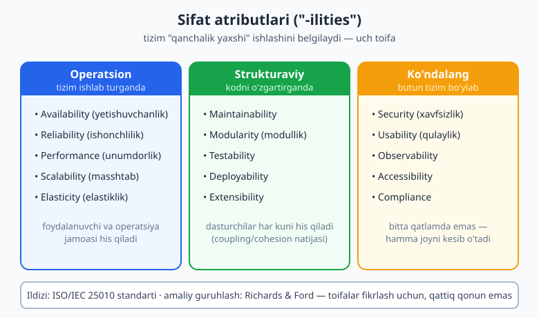
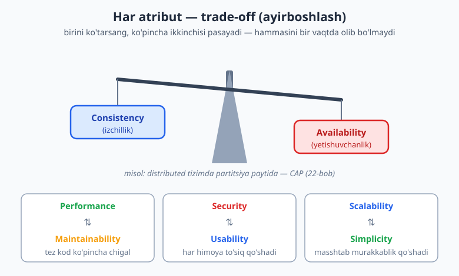
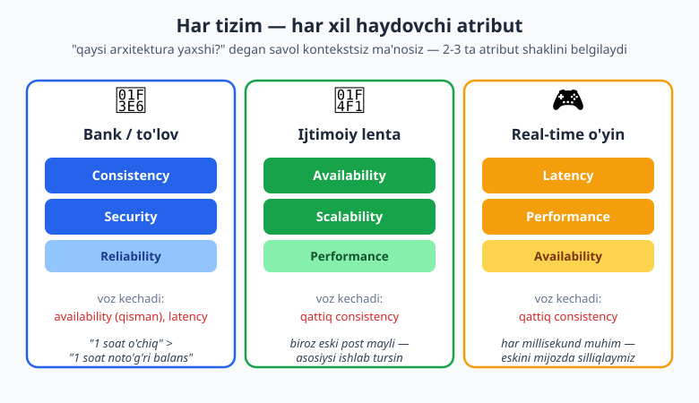

# 02 — Sifat atributlari va trade-off'lar

[⬅️ Oldingi: 01 — Dasturiy arxitektura nima va nega muhim](./01-arxitektura-nima.md) · [🏠 README](./README.md) · [Keyingi: 03 — Arxitekturani hujjatlashtirish: C4, UML, ADR ➡️](./03-hujjatlash-c4-adr.md)

---

> **Bu bobda:** arxitekturani aslida nima belgilashini — **sifat atributlari** (quality attributes, ko'pincha "-ilities" yoki *arxitektura xususiyatlari* deb ataladi) — o'rganamiz. Funksional talab "tizim nima qiladi"ni aytadi; sifat atributi esa "u buni qanchalik yaxshi qiladi"ni: tez, ishonchli, xavfsiz, kengaytirilishi oson. Biz ularni toifalarga ajratamiz (operatsion, strukturaviy, ko'ndalang), ISO/IEC 25010 standartiga ishora qilamiz, va eng muhim haqiqatga yetamiz: bularning **hammasini bir vaqtda maksimallashtirib bo'lmaydi**. Har bir arxitektura qarori — **trade-off** (ayirboshlash). Shuningdek "haydovchi" 2-3 atributni qanday tanlash, ularni qanday **o'lchash** (masalan availability'ni "to'qqizlar" bilan), va har xil tizim nega har xil prioritetga ega ekanini ko'ramiz.
>
> **Trade-off eslatmasi / Halollik:** bu bob **konseptual** — bu yerda "to'g'ri javob" yo'q, **kontekst** bor. Atributlar ro'yxati va ta'riflari **ISO/IEC 25010** va Mark Richards & Neal Ford'ning *"Fundamentals of Software Architecture"* asariga tayanadi. Availability matematikasi (99.9% -> yiliga ~8.76 soat) va ketma-ket bog'liq servislar availability'sining ko'paytirilishi **haqiqatan TypeScript'da hisoblab tekshirildi**. "Filan atribut har doim muhim" degan mutlaq da'volar yo'q — hammasi ayirboshlash.

---

## Funksional emas — "qanchalik yaxshi"

Birinchi bobda arxitektura **muhim qarorlar** ekanini ko'rdik. Ammo savol tug'iladi: qarorni **nima** boshqaradi? Nega bir loyihada monolit to'g'ri, boshqasida mikroservis? Javob — **sifat atributlari**.

Tasavvur qiling, sizdan "buyurtma qabul qiluvchi tizim" so'raldi. Bu — **funksional talab** (functional requirement): tizim *nimani* bajaradi. Lekin shu bitta jumladan ortda yashiringan savollar arxitekturani belgilaydi:

- Tizim sekundiga 10 ta buyurtmani qabul qilishi kerakmi yoki 100 000 tasini? *(scalability/performance)*
- U yiliga 1 soat o'chsa bo'ladimi yoki har daqiqa qimmatmi? *(availability)*
- To'lov ma'lumotini buzg'unchidan qanchalik qattiq himoya qilish kerak? *(security)*
- Yangi dasturchi kodga 1 kunda yoki 1 oyda kirisha oladimi? *(maintainability)*

Bu savollarning javoblari — **nofunksional talablar** (non-functional requirements). Aynan ular tizimning **shaklini** belgilaydi. Ikkala tizim ham "buyurtma qabul qiladi", lekin biri bankning to'lov tizimi, ikkinchisi o'qituvchining test boti bo'lsa — ularning arxitekturasi yer bilan osmoncha farq qiladi.

> **Asosiy g'oya:** funksional talab *nima*ni aytadi, sifat atributi *qanchalik yaxshi*ni. Arxitektura asosan ikkinchisiga javob beradi. Aynan shuning uchun "to'g'ri arxitektura" degan narsa mavjud emas — faqat **shu sifat atributlari uchun to'g'ri** arxitektura bor.

### "-ilities" va arxitektura xususiyatlari

Ingliz tilida ko'pchilik bu atributlar `-ility` qo'shimchasi bilan tugaydi: scalab**ility**, availab**ility**, maintainab**ility**, reliab**ility**, testab**ility**. Shuning uchun ularni norasmiy ravishda **"-ilities"** deb atashadi. Richards & Ford esa rasmiyroq atama ishlatadi: **architecture characteristics** (arxitektura xususiyatlari). Uchala nom — sifat atributi, "-ility", arxitektura xususiyati — amalda bir narsa.

> **Eslatma:** bularning umumlashgan, sanoat bo'ylab kelishilgan ta'riflari **ISO/IEC 25010** standartida ("Systems and software Quality Requirements and Evaluation" — SQuaRE) berilgan. U mahsulot sifatini 8 ta toifaga ajratadi: functional suitability, performance efficiency, compatibility, usability, reliability, security, maintainability, portability. Biz bu bobda standartning aniq tuzilmasidan ko'ra, **me'mor uchun foydali guruhlash**ni ishlatamiz, lekin atamalarning ildizi shu standartda.

---

## Atributlarni guruhlash: operatsion, strukturaviy, ko'ndalang

Yuzlab "-ility" mavjud. Hammasini yodlash shart emas — ularni **uch katta toifaga** bo'lib tushunish kifoya. Bu Richards & Ford ishlatadigan amaliy guruhlashga yaqin.



### 1. Operatsion atributlar — tizim *ishlab turganda*

Bular tizimning **ish vaqtidagi** (runtime) xulqiga taalluqli. Foydalanuvchi va operatsiya jamoasi ularni bevosita his qiladi.

| Atribut | O'zbekcha | "Qancha yaxshi?" degani |
|---|---|---|
| **Availability** | ishlab turish / yetishuvchanlik | Tizim qancha vaqt ishlab turibdi? (99.9% = yiliga ~8.76 soat o'chiq) |
| **Reliability** | ishonchlilik | Tizim qanchalik kam xato beradi / noto'g'ri natija qaytaradi? |
| **Performance** | unumdorlik | So'rovga qancha tez javob beradi? (latency, throughput) |
| **Scalability** | masshtablanuvchanlik | Yuk oshganda tizim qanday "o'sadi"? |
| **Elasticity** | elastiklik | Yuk tez ko'tarilib-tushganda tezda moslasha oladimi? |

> **Diqqat:** *availability* va *reliability* ko'pincha aralashtiriladi, lekin ular bir xil emas. Tizim **ishlab turishi mumkin** (available), lekin **noto'g'ri javob** qaytarishi mumkin (unreliable). Va aksincha — tizim har doim to'g'ri ishlaydi, lekin tez-tez o'chib qoladi (reliable, lekin past availability). Ikkalasi ham kerak.

### 2. Strukturaviy atributlar — kodni *o'zgartirganda*

Bular tizimning **ichki tuzilishiga** va u bilan **ishlash qulayligiga** taalluqli. Foydalanuvchi ularni ko'rmaydi — lekin **dasturchilar** har kuni his qiladi, va ular oxir-oqibat narx va tezlikka aylanadi.

| Atribut | O'zbekcha | "Qancha yaxshi?" degani |
|---|---|---|
| **Maintainability** | qo'llab-quvvatlanuvchanlik | O'zgartirish kiritish qanchalik oson va xavfsiz? |
| **Modularity** | modullik | Tizim mustaqil, almashtirib bo'ladigan qismlarga bo'linganmi? |
| **Testability** | testlanuvchanlik | Kodni avtomatik test bilan qoplash qanchalik oson? |
| **Deployability** | joylanuvchanlik | Yangi versiyani ishga chiqarish qanchalik tez va xavfsiz? |
| **Extensibility** | kengaytiriluvchanlik | Yangi funksiya qo'shish mavjudini buzmaydimi? |

> **Eslatma:** strukturaviy atributlar deyarli to'g'ridan-to'g'ri **coupling** (bog'liqlik) va **cohesion** (jipslik) bilan belgilanadi — bularni 04-bobda chuqur o'rganamiz. Loose coupling va high cohesion bo'lgan tizim odatda yuqori maintainability, testability va deployability'ga ega bo'ladi. Bular alohida "sehrli" xususiyat emas — bitta yaxshi tuzilmaning oqibatlari.

### 3. Ko'ndalang atributlar — *butun* tizimni qamrab oluvchi

Bular bironta qatlam yoki modulda yashamaydi — ular **butun tizim bo'ylab** kesib o'tadi. Shuning uchun ularni "cross-cutting" (ko'ndalang kesuvchi) deb atashadi.

| Atribut | O'zbekcha | "Qancha yaxshi?" degani |
|---|---|---|
| **Security** | xavfsizlik | Ruxsatsiz kirish/o'zgartirishdan qanchalik himoyalangan? |
| **Usability** | qulaylik | Foydalanuvchi maqsadiga qanchalik oson yetadi? |
| **Observability** | kuzatuvchanlik | Tizim ichida nima bo'layotganini ko'ra olamizmi? (log, metrika, tracing — 24-bob) |
| **Accessibility** | foydalanish imkoniyati | Imkoniyati cheklangan foydalanuvchilar ham ishlata oladimi? |
| **Compliance** | muvofiqlik | Qonun/standartlarga (GDPR, PCI-DSS...) mos keladimi? |

> **Amaliyotda:** xavfsizlikni "keyin qo'shamiz" deb qoldirish — eng qimmat xatolardan biri. U ko'ndalang atribut bo'lgani uchun, keyin qo'shish butun tizimni qayta ko'rib chiqishni talab qiladi. Shuning uchun **"security by design"** printsipi bor (25-bobda batafsil): xavfsizlik birinchi kundan dizaynning bir qismi bo'lishi kerak.

> **Diqqat:** bu uch toifaga bo'lish — **didaktik vosita**, qattiq qonun emas. Masalan, *performance*'ni operatsion deb sanadik, lekin u kod tuzilishiga (strukturaviy) ham bog'liq. *Observability* operatsiya va strukturani ham qamraydi. Toifalar atributlar **haqida o'ylash**ga yordam beradi — ularni qutiga qamab qo'yishga emas.

---

## Arxitekturaviy ahamiyatli talablar (ASR)

Har bir nofunksional talab arxitekturani o'zgartirmaydi. "Tugma ko'k bo'lsin" — nofunksional (usability), lekin u arxitekturaga ta'sir qilmaydi. Ammo "sekundiga 100 000 so'rovni 50 ms ichida qaytar" — bu **butun tizimning shaklini** belgilaydi.

Aynan shu ikkinchi turdagi talablar — **Architecturally Significant Requirements (ASR)**, arxitekturaviy ahamiyatli talablar. Ular quyidagi sifatlardan biriga ega bo'lganda paydo bo'ladi:

- **Keng ta'sir:** talab ko'p komponentga teginadi (masalan "barcha ma'lumot tinch holatda shifrlangan bo'lsin").
- **Yuqori narx yoki risk:** noto'g'ri qaror qimmatga tushadi (masalan masshtab yoki ma'lumot izchilligi qarori).
- **Yangi yoki tanish bo'lmagan:** jamoa ilgari hal qilmagan muammo.

> **Asosiy g'oya:** arxitekturaning ish hajmining katta qismi — **ASR'larni topish va ularni bir-biriga qarshi tarozilash**. Funksional talablar ro'yxati uzun bo'lishi mumkin, lekin tizim *shaklini* odatda 5-10 ta ASR belgilaydi. Me'mor sifatida birinchi vazifangiz — "tizim nima qiladi?" emas, balki **"u qanday sifatlarga ega bo'lishi SHART, va qaysilaridan voz kechsak bo'ladi?"** degan savolni berish.

---

## Eng muhim haqiqat: hammasini bir vaqtda olib bo'lmaydi

Endi bu bobning yuragiga keldik. Yangi me'morlar ko'pincha shunday o'ylaydi:

> "Tizimim tez ham, ishonchli ham, xavfsiz ham, masshtablanuvchan ham, sodda ham, arzon ham bo'lsin."

Bu — **mumkin emas**. Sifat atributlari bir-biriga **qarshi tortadi**. Birini oshirish ko'pincha boshqasini pasaytiradi. Bu kamchilik emas — bu fizikaning, matematikaning va iqtisodning tabiati. Me'morlik — bu **"hammasini olish" emas, "to'g'ri narsani almashtirish"** san'ati.



Mana eng keng tarqalgan to'rt ziddiyat:

### Consistency vs Availability (izchillik va yetishuvchanlik)

Distributed (tarqatilgan) tizimda ma'lumot bir nechta serverda nusxalanadi. Tarmoq bo'linib qolganda (network partition — bu muqarrar) siz tanlashga majbur bo'lasiz: yo har bir nusxa **bir xil** ma'lumotni qaytarsin (consistency), yo tizim **javob bersin** (availability) — lekin ikkalasini bir vaqtda kafolatlab bo'lmaydi.

> **Eslatma:** bu mashhur **CAP teoremasi** (Eric Brewer, 2000). U *imkonsizlik* teoremasi: partitsiya bo'lganda C va A ni bir vaqtda kafolatlab bo'lmaydi. Bankning balansi har doim aniq bo'lishi kerak (consistency g'olib), ijtimoiy tarmoq lentasi esa biroz eski post ko'rsatsa ham hech kim o'lmaydi, asosiysi ishlab tursin (availability g'olib). CAP'ni va uning aniqroq versiyasi PACELC'ni **22-bobda** chuqur o'rganamiz — hozircha shuni biling: bu sof trade-off.

### Performance vs Maintainability (unumdorlik va qo'llab-quvvatlanuvchanlik)

Eng tez kod ko'pincha eng **chigal** kod. Qo'lda optimallashtirish, keshlash qatlamlari, past darajadagi nayranglar — ular tezlikni oshiradi, lekin kodni o'qish va o'zgartirishni qiyinlashtiradi. Toza, qatlamli, abstraksiyalangan kod — o'qish oson, lekin har abstraksiya biroz ortiqcha xarajat (overhead) qo'shadi.

> **Anti-pattern:** **erta optimallashtirish** (premature optimization). Hali muammo o'lchanmaganda kodni "tezlik uchun" murakkablashtirish — ko'p hollarda maintainability'ni bekorga qurbon qilish. Avval o'lchang, keyin kerakli joyni optimallashtiring. (Donald Knuth'ning mashhur "erta optimallashtirish — barcha yomonliklarning ildizi" iqtibosi aynan shu haqida — lekin u "kichik samaradorlik" haqida ekanini, har qanday optimizatsiya emasligini eslab qoling.)

### Security vs Usability (xavfsizlik va qulaylik)

Har bir himoya qatlami foydalanuvchiga to'siq qo'shadi. Ikki faktorli autentifikatsiya tizimni xavfsizroq qiladi — lekin har safar kirishni sekinlashtiradi. 20 belgili, har 30 kunda almashtiriladigan parol — xavfsizroq, lekin foydalanuvchini bezdiradi (va ular parolni qog'ozga yozib qo'yadi, bu esa **xavfsizlikni pasaytiradi**).

> **Amaliyotda:** eng yaxshi xavfsizlik qarorlari ko'pincha usability'ni **kamroq** buzganlaridir — masalan parol o'rniga passkey/biometrika. Trade-off'ni ko'rib chiqish ba'zan uni **yumshatish** yo'lini ham ochadi.

### Scalability vs Simplicity (masshtab va soddalik)

Sekundiga millionlab so'rovni ko'tara oladigan tizim — bir nechta servis, navbat, kesh qatlami, load balancer, replikatsiyalangan baza talab qiladi. Bularning har biri **murakkablik** qo'shadi: ko'proq harakatlanuvchi qism, ko'proq xato nuqtasi, ko'proq operatsion yuk. Kichik loyihaga shu "katta" arxitekturani qo'llash — soddalikni bekorga qurbon qilish.

> **Diqqat:** bu eng ko'p uchraydigan boshlovchi xatosi — **"Google qilgani uchun biz ham qilamiz"**. Google'ning muammosi sizning muammoyingiz emas. Mikroservis, Kafka, Kubernetes — bular masshtab muammosini soddalik evaziga yechadi. Agar sizda masshtab muammosi yo'q bo'lsa, siz faqat **murakkablikni sotib oldingiz**, hech narsa sotib olmasdan.

> **Trade-off:** yuqoridagilarning hech biri "qaysisi yaxshi?" degan savol emas. To'g'ri savol — **"shu kontekstda nimani nimaga almashtiryapman, va bu almashtirish o'rinlimi?"** Me'mor sifatida sizning ishingiz — ayirboshlashni **ko'rinadigan, ongli va asoslangan** qilish.

---

## Prioritetlash: 2-3 ta "haydovchi" atributni tanlash

Agar hamma narsa bir vaqtda "yuqori" bo'lolmasa, demak siz **tanlashingiz** kerak. Amaliy haqiqat shu: har bir tizimda atigi **2-3 ta atribut** uning shaklini hal qiladi. Bularni **haydovchi atributlar** (driving characteristics) deb ataymiz. Qolganlari — "yetarli darajada yaxshi bo'lsa bo'ldi" toifasida qoladi.

> **Eslatma:** Richards & Ford maslahati — atigi bir nechta (taxminan 3 dan ortiq emas) eng muhim arxitektura xususiyatini tanlang. Juda ko'p "muhim" atribut tanlash — dizaynni murakkablashtiradi va trade-off'larni yashiradi. Kamroq, lekin aniqroq prioritet kuchliroq dizayn beradi.

Va eng muhimi — **bu tanlov kontekstga butunlay bog'liq**. Mana uchta har xil tizim, uchta butunlay boshqacha prioritet:



| Tizim | Haydovchi atributlar | Nega |
|---|---|---|
| **Bank / to'lov tizimi** | Consistency, Security, Reliability | Balans hech qachon noto'g'ri bo'lmasligi kerak; pul va ma'lumot himoyasi qonuniy talab |
| **Ijtimoiy tarmoq lentasi** | Availability, Scalability | Lenta har doim ishlasin (biroz eski bo'lsa ham mayli); millionlab foydalanuvchiga masshtablansin |
| **Real-time o'yin / treyding** | Latency, Performance | Bir necha millisekund kechikish o'yinni yoki bitimni buzadi |
| **Ichki hisobot tizimi** | Maintainability, Usability | Kam foydalanuvchi, kam yuk; lekin tez o'zgaradi va qulay bo'lishi kerak |

> **Asosiy g'oya:** "qaysi arxitektura yaxshi?" degan savolning javobi har doim **"nima uchun?"** bilan boshlanadi. Bank uchun availability evaziga consistency'ni tanlash to'g'ri; ijtimoiy tarmoq uchun aynan teskarisi to'g'ri. **Bir xil to'g'ri javob ikki tizim uchun bir vaqtda noto'g'ri bo'lishi mumkin** — chunki ularning haydovchi atributlari boshqacha.

> **Amaliyotda:** prioritetlashni majburlaydigan foydali mashq — biznes egasidan so'rang: *"Agar tanlash kerak bo'lsa, tizim 1 soat o'chib qolgani yaxshimi, yoki 1 soat noto'g'ri ma'lumot ko'rsatgani?"* Javob — sizning haydovchi atributingizni ochib beradi. Hech kim "ikkalasi ham yomon" deyolmaydi — chunki muhandislikda **tanlashga majbursiz**.

---

## Atributni o'lchash: noaniqdan aniq talabga

"Tizim tez bo'lsin" — bu **talab emas**, bu **xohish**. Uni tekshirib bo'lmaydi, demak unga ko'ra dizayn ham qilib bo'lmaydi. Sifat atributi faqat **o'lchanadigan** qilinganda foydali bo'ladi.

| Noaniq xohish | O'lchanadigan talab (yaxshi) |
|---|---|
| "Tez bo'lsin" | "Buyurtma sahifasi 95-foiz hollarda 200 ms ichida ochilsin (p95 < 200 ms)" |
| "Ishonchli bo'lsin" | "Oylik availability >= 99.9% (oyiga <= 43 daqiqa o'chiq)" |
| "Masshtablansin" | "Sekundiga 10 000 buyurtmani p99 < 500 ms bilan ko'tarsin" |
| "Xavfsiz bo'lsin" | "Barcha ma'lumot tranzitda TLS 1.2+ va tinch holatda AES-256 bilan shifrlansin" |

> **Eslatma:** o'lchanadigan sifat talabini ba'zan **fitness function** (yaroqlilik funksiyasi) deb ataladi — arxitekturaning shu atributga mosligini avtomatik tekshiradigan test. Bu evolyutsion arxitekturaning asosi; **25-bobda** batafsil ko'ramiz.

### "To'qqizlar": availability'ni o'lchash

Availability eng ko'p ishlatiladigan o'lchanadigan atribut. U **foiz** bilan ifodalanadi, va sanoatda uni "necha to'qqiz" (nines) deb sanaydilar. Muhim narsa — **kichik foiz farqi katta vaqt farqini anglatadi**.

Quyidagi TypeScript kodi har bir availability darajasi yiliga va oyiga qancha **downtime**ga (o'chiq vaqtga) ruxsat berishini hisoblaydi. Bu kod `arx-probe` muhitida **haqiqatan ishga tushirildi**:

```ts
// Availability ("to'qqizlar") -> yiliga ruxsat etilgan downtime
function downtimePerYear(availabilityPct: number): { perYear: string; perMonth: string } {
  const minutesPerYear = 365 * 24 * 60;           // 525600
  const minutesPerMonth = (365 / 12) * 24 * 60;   // ~43800
  const down = (1 - availabilityPct / 100);
  const fmt = (mins: number): string => {
    if (mins >= 1440) return (mins / 1440).toFixed(2) + " kun";
    if (mins >= 60) return (mins / 60).toFixed(2) + " soat";
    return mins.toFixed(2) + " daqiqa";
  };
  return { perYear: fmt(down * minutesPerYear), perMonth: fmt(down * minutesPerMonth) };
}

for (const a of [99, 99.9, 99.99, 99.999]) {
  const d = downtimePerYear(a);
  console.log(`${a}% -> yiliga: ${d.perYear}, oyiga: ${d.perMonth}`);
}
```

Ishga tushirsak (`npx tsx`), natija:

```text
99% -> yiliga: 3.65 kun, oyiga: 7.30 soat
99.9% -> yiliga: 8.76 soat, oyiga: 43.80 daqiqa
99.99% -> yiliga: 52.56 daqiqa, oyiga: 4.38 daqiqa
99.999% -> yiliga: 5.26 daqiqa, oyiga: 0.44 daqiqa
```

Bu jadval me'mor uchun juda muhim intuitsiya beradi:

| Availability | Nomi | Yiliga downtime | Taxminan |
|---|---|---|---|
| 99% | "ikki to'qqiz" | ~3.65 kun | Ichki vositalar uchun yetarli |
| 99.9% | "uch to'qqiz" | ~8.76 soat | Ko'p veb-ilovalar maqsadi |
| 99.99% | "to'rt to'qqiz" | ~52 daqiqa | Jiddiy biznes/SaaS |
| 99.999% | "besh to'qqiz" | ~5.26 daqiqa | Telekom, kritik infratuzilma |

> **Diqqat:** har bir qo'shimcha "to'qqiz" — eksponensial qimmat. 99.9%'dan 99.99%'ga o'tish redundant serverlar, avtomatik failover, ko'p mintaqali joylanish talab qilishi mumkin — narx ehtimol bir necha barobar oshadi. Shuning uchun **"99.999% kerakmi yoki 99.9% yetarlimi?"** — bu sof biznes/narx trade-off'i, texnik xohish emas. Ortiqcha "to'qqiz" — bu bekorga sarflangan pul.

### Yashirin tuzoq: ketma-ket bog'liqlik availability'ni pasaytiradi

Mana ko'pchilik o'tkazib yuboradigan muhim haqiqat. Agar so'rovingiz **ketma-ket** uchta servisdan o'tsa va ularning har biri 99.9% available bo'lsa — umumiy availability **99.9% emas, balki pastroq**. Chunki ehtimolliklar **ko'paytiriladi**:

```ts
// Ketma-ket bog'liq servislar: umumiy availability KO'PAYTIRILADI (pasayadi)
function chainAvailability(serviceAvailabilities: number[]): number {
  return serviceAvailabilities.reduce((acc, a) => acc * (a / 100), 1) * 100;
}
console.log("3 x 99.9% ketma-ket:", chainAvailability([99.9, 99.9, 99.9]).toFixed(3) + "%");
console.log("5 x 99.9% ketma-ket:", chainAvailability([99.9, 99.9, 99.9, 99.9, 99.9]).toFixed(3) + "%");
```

Natija (haqiqatan hisoblangan):

```text
3 x 99.9% ketma-ket: 99.700%
5 x 99.9% ketma-ket: 99.501%
```

> **Amaliyotda:** uchta 99.9% servis ketma-ket ulansa, umumiy availability **99.7%**ga tushadi (yiliga ~26 soat downtime — deyarli uch barobar!). Bu mikroservis arxitekturasining yashirin narxlaridan biri: ko'proq servis = ko'proq bog'liqlik = pastroq umumiy availability. Aynan shuning uchun ishonchli distributed tizimlar **redundancy** (zaxira), **retry**, **circuit breaker** va **graceful degradation** ishlatadi — bularni **23-bobda** o'rganamiz. Bu shuningdek 01-bobdagi "har qaror trade-off" g'oyasini tasdiqlaydi: mikroservisning moslashuvchanligi availability matematikasi evaziga keladi.

### SLA, SLO, SLI

O'lchanadigan availability talabi ko'pincha **shartnomaga** aylanadi:

- **SLA (Service Level Agreement):** mijoz bilan **rasmiy va'da** ("biz 99.9% availability beramiz, aks holda pul qaytaramiz"). Buzilsa — huquqiy/moliyaviy oqibat.
- **SLO (Service Level Objective):** jamoaning **ichki maqsadi** (odatda SLA'dan qattiqroq, masalan 99.95% — bufer uchun).
- **SLI (Service Level Indicator):** maqsadni o'lchaydigan **haqiqiy metrika** (masalan, muvaffaqiyatli so'rovlar foizi).

> **Eslatma:** SLA/SLO/SLI'ni va ularni qanday monitoring qilishni **24-bobda** (Observability) batafsil ko'ramiz. Hozircha shuni biling: o'lchanmaydigan atribut — bo'sh va'da. Availability "99.9%" deb yozilganda u o'lchanadi, kuzatiladi va shartnoma qilinadi. "Tez bo'lsin" esa — hech narsa.

---

## Hammasini birga: atributdan arxitekturaga

Endi to'liq fikr zanjirini ko'raylik. Faraz qilaylik, sizdan **e-commerce (onlayn-do'kon) backend**i so'raldi. Me'mor sifatida yo'lingiz quyidagicha:

1. **ASR'larni toping.** Biznes bilan suhbatda aniqlaydi: "Black Friday'da yuk 50 barobar oshadi" (scalability), "to'lov hech qachon yo'qolmasin/ikki marta yechilmasin" (consistency/reliability), "karta ma'lumoti himoyalansin, PCI-DSS" (security/compliance).
2. **Haydovchi atributlarni tanlang.** Bularning ichidan eng kuchli 3 tasi: **scalability** (Black Friday), **reliability** (to'lov), **security** (karta). Maintainability va usability ham kerak, lekin ular "yetarli" toifasida.
3. **Trade-off'larni tan oling.** Scalability uchun keshlash va asinxron navbatlar qo'shamiz — bu **eventual consistency** keltiradi (mahsulot zaxirasi soni bir necha soniya eskirgan ko'rinishi mumkin). Bu mahsulot ko'rsatish uchun **qabul qilinadi**, lekin to'lov uchun **qabul qilinmaydi** — shuning uchun to'lovni alohida, qattiq izchil (strongly consistent) yo'lda yuritamiz.
4. **O'lchanadigan talab qiling.** "Katalog p95 < 300 ms; to'lov idempotent va hech qachon ikki marta yechilmaydi; availability 99.95%."
5. **Endi arxitektura qarorlari keladi** — qatlamlar, servislar, baza tanlovi. Lekin ular **birinchi to'rtta qadamga xizmat qiladi**, aksincha emas.

> **Asosiy g'oya:** arxitektura **atributdan kelib chiqadi**, texnologiyadan emas. "Kafka ishlataylik" yoki "mikroservis qilaylik" deb boshlash — orqaga yurish. Avval **qaysi sifat muhim** (va qaysisidan voz kechsak bo'ladi) ni aniqlang; texnologiya o'sha trade-off'ning **natijasi** bo'lsin. Bu — bu kitobning markaziy fikrlash usuli, va keyingi barcha boblar shu poydevorga quriladi.

---

## Tez-tez uchraydigan tushunmovchiliklar

> **Anti-pattern: "Yuqori sifat = barcha atribut yuqori".** Yo'q. Yuqori sifatli arxitektura — bu **to'g'ri atributlar** yuqori bo'lgan arxitektura. Ichki hisobot vositasiga "besh to'qqiz" availability berish — ortiqcha xarajat, sifat emas.

> **Anti-pattern: "Trade-off — bu murosaga kelish/yon berish".** Trade-off zaiflik emas, **ongli qaror**. Yomon me'mor trade-off'ni yashiradi yoki inkor etadi ("hammasini olamiz"). Yaxshi me'mor uni ko'rsatadi, asoslaydi va hujjatlashtiradi (03-bobdagi ADR aynan shu uchun).

> **Anti-pattern: noaniq atributni "talab" deb qabul qilish.** "Tez/ishonchli/xavfsiz bo'lsin" — bu talab emas. Raqamsiz, kontekstsiz atribut — tekshirib bo'lmaydigan, demak dizaynga yaroqsiz xohish. Har doim **"qancha?"** va **"qaysi sharoitda?"** deb so'rang.

> **Diqqat: atributlar vaqt o'tib o'zgaradi.** Bugun availability muhim emas (10 foydalanuvchi), lekin tizim o'ssa — kritikka aylanadi. Shuning uchun haydovchi atributlarni **vaqti-vaqti bilan qayta ko'rib chiqing**. Arxitektura — bir martalik qaror emas, evolyutsiya (25-bob).

---

## Xulosa

- **Sifat atributlari** (quality attributes / "-ilities" / arxitektura xususiyatlari) tizimning *qanchalik yaxshi* ishlashini belgilaydi va arxitekturaning asosiy haydovchisi. Ularning ildizi **ISO/IEC 25010** standartida; amaliy guruhlash Richards & Ford'da.
- Uch toifa: **operatsion** (availability, performance, scalability — ish vaqtida), **strukturaviy** (maintainability, modularity, testability — kodni o'zgartirganda), **ko'ndalang** (security, usability, observability — butun tizim bo'ylab).
- **Funksional talab** *nima*ni, **nofunksional** *qanchalik yaxshi*ni aytadi. Tizim shaklini odatda 5-10 ta **arxitekturaviy ahamiyatli talab (ASR)** belgilaydi.
- **Hamma atributni bir vaqtda maksimallashtirib bo'lmaydi** — har narsa **trade-off**: consistency vs availability, performance vs maintainability, security vs usability, scalability vs simplicity.
- **2-3 ta haydovchi atributni tanlang** — kontekstga qarab (bank ≠ ijtimoiy tarmoq ≠ o'yin). "Qaysi yaxshi?" emas, "nima uchun?".
- Atribut faqat **o'lchanadigan** bo'lsa foydali: availability'ni "to'qqizlar" bilan (99.9% = yiliga ~8.76 soat), latency'ni p95/p99 bilan. Ketma-ket bog'liq servislar availability'ni **ko'paytiradi** (pasaytiradi).
- Arxitektura **atributdan** kelib chiqadi, texnologiyadan emas.

Keyingi bobda bu trade-off'larni va qarorlarni **qanday hujjatlashtirishni** o'rganamiz: **C4 model** (tizimni ko'rsatish), **UML** asoslari va **ADR** (har bir muhim qaror va uning trade-off'ini yozib qoldirish).

---

## Mashqlar

> Maslahat: bu mashqlarning ko'pchiligida **bitta to'g'ri javob yo'q** — muhimi sizning **asoslashingiz** va trade-off'ni ko'rsata olishingiz. Yechimlarni ko'rishdan oldin o'zingiz yozib chiqing.

### Oson

1. Quyidagi atributlarni uch toifaga (operatsion / strukturaviy / ko'ndalang) ajrating: *testability, security, availability, deployability, scalability, usability, maintainability, performance*.

2. *Availability* va *reliability* o'rtasidagi farqni o'z so'zlaringiz bilan, har biriga bittadan misol bilan tushuntiring.

3. Quyidagi talablardan qaysilari **funksional**, qaysilari **nofunksional**? (a) "Foydalanuvchi parolini tiklay olsin", (b) "Sahifa 1 soniyada ochilsin", (c) "Tizim PDF hisobot eksport qilsin", (d) "Tizim 99.9% ishlab tursin".

4. "Tizim tez bo'lsin" — bu nega yomon talab? Uni **o'lchanadigan** qilib qayta yozing.

5. 99.99% availability yiliga taxminan necha daqiqa downtime'ga ruxsat beradi? (Bobdagi jadvaldan eslang yoki hisoblang.)

### O'rta

6. **Onlayn-bank ilovasi** uchun 3 ta haydovchi atributni tanlang va har birini bir jumla bilan asoslang. Keyin: bu tanlov tufayli **qaysi atributdan voz kechishga** tayyorsiz?

7. **Real-time ko'p o'yinchili o'yin** (masalan, otishma) uchun 3 ta haydovchi atributni tanlang va asoslang. Bank bilan farqini izohlang.

8. Bitta jamoa "tizim tez ham, oddiy ham, masshtablanuvchan ham, eng xavfsiz ham, eng arzon ham bo'lsin" desa — me'mor sifatida ularga nima deysiz? Qaysi savolni berasiz?

9. **Security vs usability** trade-off'iga ish hayotidan (yoki tasavvuringizdan) bitta aniq misol keltiring: qaysi xavfsizlik chorasi qulaylikni qanday pasaytirdi, va bu o'rinli edimi?

10. Bir tizim 4 ta servisdan iborat, ularning har biri **ketma-ket** chaqiriladi va har biri 99.95% available. Umumiy availability taxminan qancha bo'ladi (ko'paytirish)? Bu nimani anglatadi?

### Qiyin

11. **Stsenariy loyihalash:** "Universitet uchun onlayn imtihon tizimi" so'raldi. Imtihon kuni 5000 talaba bir vaqtda kiradi; imtihon javoblari hech qachon yo'qolmasligi kerak; oddiy kunlarda yuk juda past. (a) Kamida 4 ta ASR yozing. (b) 3 ta haydovchi atributni tanlang va asoslang. (c) Eng kamida ikkita trade-off'ni nomlang (nimani nimaga almashtiryapsiz).

12. **Trade-off tahlili:** jamoangiz kataloq sahifasini tezlashtirish uchun og'ir keshlash qatlami qo'shmoqchi. Bu qaysi atributni oshiradi, qaysi(lar)ini pasaytiradi? Keshlash *consistency*'ga qanday ta'sir qiladi? Qaysi ma'lumot turi uchun bu qabul qilinadi, qaysi biri uchun yo'q?

13. **Atributlarni qarama-qarshi qo'yish:** quyidagi har bir juftlik uchun ular **qanday ziddiyatda** ekanini bitta jumla bilan ayting: (a) consistency vs availability, (b) performance vs maintainability, (c) scalability vs simplicity, (d) security vs usability.

14. **Kod mashqi (TS yoki Python):** bobdagi `downtimePerYear` g'oyasini kengaytiring — funksiya `availabilityPct` va `numberOfServices` (ketma-ket) qabul qilsin va **umumiy** availability hamda yiliga downtime'ni qaytarsin. `arx-probe` muhitida ishga tushirib, 99.9% li 1, 3 va 5 servis uchun natijani solishtiring.

<details markdown="1">
<summary>Yechimlar</summary>

### 1-mashq yechimi

- **Operatsion** (ish vaqtidagi xulq): availability, scalability, performance.
- **Strukturaviy** (kodni o'zgartirish): testability, deployability, maintainability.
- **Ko'ndalang** (butun tizim bo'ylab): security, usability.

Eslatma: bu chegaralar qattiq emas — masalan performance kod tuzilishiga ham bog'liq. Toifalar fikrlash uchun, qamab qo'yish uchun emas.

### 2-mashq yechimi

- **Availability** = tizim **ishlab turish** ulushi. Misol: sayt 99.9% vaqt ochiladi.
- **Reliability** = tizim **to'g'ri/kutilgan** ishlashi. Misol: ochilgan sayt har doim *to'g'ri* balansni ko'rsatadi.

Farq: tizim available bo'lib, lekin unreliable bo'lishi mumkin (ishlaydi, lekin noto'g'ri javob beradi); yoki reliable bo'lib, past availability'ga ega bo'lishi mumkin (har doim to'g'ri, lekin tez-tez o'chadi). Ikkalasi alohida o'lchanadi.

### 3-mashq yechimi

- **Funksional** (tizim *nima qiladi*): (a) parol tiklash, (c) PDF eksport.
- **Nofunksional** (*qanchalik yaxshi*): (b) sahifa tezligi (performance), (d) 99.9% (availability).

### 4-mashq yechimi

"Tez bo'lsin" yomon, chunki **o'lchab bo'lmaydi** — qachon "tez", qaysi sharoitda, qaysi foiz so'rovlar uchun? Uni tekshirib bo'lmaydi, demak dizaynga yaroqsiz.

O'lchanadigan versiya, masalan: *"Mahsulot sahifasi 95% so'rovlarda 250 ms ichida (p95 < 250 ms), 99% so'rovlarda 500 ms ichida (p99 < 500 ms) javob bersin — odatiy yuk ostida."* Endi uni o'lchash, kuzatish va shartnoma qilish mumkin.

### 5-mashq yechimi

99.99% ("to'rt to'qqiz") yiliga taxminan **52 daqiqa** downtime beradi (aniqrog'i ~52.56 daqiqa). Hisoblash: `(1 - 0.9999) * 525600 daqiqa/yil ≈ 52.56 daqiqa`.

### 6-mashq yechimi

**Namunaviy javob (onlayn-bank):**

- **Consistency** — balans va tranzaksiyalar hech qachon noto'g'ri yoki ziddiyatli bo'lmasligi kerak.
- **Security** — pul va shaxsiy ma'lumot; qonuniy va ishonch talabi.
- **Reliability** — pul o'tkazmasi yo'qolmasligi yoki ikki marta bajarilmasligi kerak.

**Nimadan voz kechamiz:** ko'pincha **availability** (qisman) va **latency**. Masalan, qattiq izchillik uchun tranzaksiya bir necha replika tasdiqini kutishi mumkin — bu sekinroq, va partitsiya paytida tizim "javob berishdan ko'ra to'xtashni" afzal ko'radi (xato ko'rsatib, noto'g'ri balans ko'rsatmaslik). Bank uchun "1 soat o'chiq" "1 soat noto'g'ri balans"dan **yaxshiroq**.

### 7-mashq yechimi

**Namunaviy javob (real-time o'yin):**

- **Latency** — har millisekund muhim; kechikish o'yinni buzadi.
- **Performance/throughput** — ko'p o'yinchining holatini real-vaqtda yangilash.
- **Availability** — matchlar uzilmasligi kerak (lekin "mukammal izchillik"dan ko'ra muhimroq emas).

**Bank bilan farq:** o'yinda **consistency'dan voz kechiladi** — agar bir o'yinchining ekranida raqib bir necha millisekund eski joyda ko'rinsa, hech qisi yo'q (mijoz tomonda silliqlaymiz). Bankda esa aynan teskari — consistency muqaddas, latency emas. **Bir xil "to'g'ri javob" ikki tizim uchun butunlay teskari.**

### 8-mashq yechimi

Bu mumkin emas — atributlar bir-biriga qarshi tortadi (xavfsizlik usability'ni, masshtab soddalikni pasaytiradi). Me'mor sifatida men ularga **trade-off mavjudligini** tushuntiraman va **prioritetlashga majburlovchi** savol beraman, masalan:

> "Agar tanlash kerak bo'lsa: tizim 1 soat o'chgani afzalmi, yoki 1 soat noto'g'ri ma'lumot ko'rsatgani? Yangi funksiya 2 hafta kechiksa afzalmi, yoki kod chigallashib qolgani?"

Bunday "yo-yo" savollar yashirin prioritetlarni ochib beradi. "Hammasi yuqori" — bu prioritet **yo'q**ligini anglatadi, va prioritetsiz dizayn ham yo'q.

### 9-mashq yechimi

Namunaviy misol: bank ilovasi har **5 daqiqada** qayta login so'raydi (xavfsizlik uchun). Bu **security**'ni oshiradi, lekin **usability**'ni jiddiy pasaytiradi — foydalanuvchi bezor bo'ladi.

O'rinlimi? Kontekstga bog'liq: yuqori qiymatli pul o'tkazmasi sahifasida — ehtimol ha; oddiy balans ko'rishda — ehtimol yo'q (qisqa muddatli token + qurilma ishonchi yetarli). Yaxshiroq yechim ko'pincha trade-off'ni **yumshatadi**: passkey/biometrika xavfsizlikni saqlab, qulaylikni kamroq buzadi.

### 10-mashq yechimi

`0.9995^4 = 0.998001...` → taxminan **99.80%**. Ya'ni 4 ta 99.95% li servis ketma-ket ulansa, umumiy availability ~99.8%ga tushadi (yiliga ~17.5 soat downtime — har bittasiniki ~4.4 soat bo'lsa ham).

Bu shuni anglatadi: **ketma-ket bog'liqlik availability'ni pasaytiradi**. Ko'proq servis qo'shish (mikroservis) umumiy ishonchlilikni avtomatik oshirmaydi — aksincha, redundancy va resilience patternlari (23-bob) bo'lmasa, pasaytiradi.

### 11-mashq yechimi

**Namunaviy yechim (onlayn imtihon tizimi):**

(a) **ASR'lar:**
- Imtihon kuni 5000 ta bir vaqtdagi foydalanuvchini ko'tarish (scalability/concurrency).
- Topshirilgan javob **hech qachon yo'qolmasligi** kerak (durability/reliability).
- Imtihon davomida tizim o'chmasligi kerak — imtihon oynasida yuqori availability.
- Oddiy kunlarda resurs isrof bo'lmasin (elasticity / xarajat samaradorligi).

(b) **Haydovchi atributlar:** **scalability** (pik yuk), **reliability/durability** (javob yo'qolmasligi), **availability** (imtihon oynasida). Maintainability "yetarli" toifasida.

(c) **Trade-off'lar:**
- **Elasticity vs simplicity:** pik yuk uchun avtomatik masshtablanuvchi infratuzilma (auto-scaling) qo'shamiz — bu murakkablik qo'shadi, lekin oddiy kunda resurs tejaydi.
- **Durability vs latency:** har bir javobni darhol, ishonchli saqlash (replikatsiya bilan yozish) javob saqlashni biroz sekinlashtiradi — lekin "javob yo'qolmasin" muqaddas, shuning uchun bu almashtirish o'rinli.

Muqobil: agar byudjet tor bo'lsa, doimo katta klaster o'rniga imtihon kuniga vaqtincha masshtablash (elasticity) tanlanadi — xarajatni availability murakkabligiga almashtiramiz.

### 12-mashq yechimi

- **Oshadi:** performance (latency kamayadi), ehtimol scalability (bazaga yuk kamayadi).
- **Pasayadi:** consistency (kesh eskirgan ma'lumot ko'rsatishi mumkin — "stale read"), maintainability (kesh-invalidatsiya mantig'i murakkablik qo'shadi), ba'zan correctness riski.

**Consistency'ga ta'sir:** kesh — bu nusxa; asl ma'lumot o'zgarganda kesh darhol bilmaydi (TTL tugaguncha yoki invalidatsiyagacha eski qoladi). Bu **eventual consistency**.

**Qabul qilinadi:** mahsulot tavsifi, narx ko'rsatish, blog post — bir necha soniya eskirgan bo'lsa hech qisi yo'q. **Qabul qilinmaydi:** hisobdagi pul balansi, zaxiradagi oxirgi 1 dona mahsulot (oversell riski), to'lov holati. Ya'ni keshlash — atribut emas, **kontekstga bog'liq** qaror. (Keshlashni 20-bobda chuqur ko'ramiz.)

### 13-mashq yechimi

- **(a) consistency vs availability:** tarmoq partitsiyasida tizim yo har doim bir xil ma'lumot qaytaradi (lekin javob bermay turishi mumkin), yo har doim javob beradi (lekin eski/ziddiyatli ma'lumot bilan) — ikkalasini bir vaqtda kafolatlab bo'lmaydi (CAP).
- **(b) performance vs maintainability:** eng tez kod ko'pincha eng chigal/optimallashtirilgan, eng o'qiluvchan kod esa abstraksiya overhead'i tufayli biroz sekinroq.
- **(c) scalability vs simplicity:** ko'p yukni ko'tarish navbat/kesh/servis/replika qo'shadi — har biri harakatlanuvchi qism va xato nuqtasi, ya'ni murakkablik.
- **(d) security vs usability:** har bir himoya qatlami (MFA, murakkab parol, qayta-login) foydalanuvchi yo'liga to'siq qo'shadi.

### 14-mashq yechimi

**Namunaviy yechim (TypeScript), `arx-probe`'da tekshirilgan:**

```ts
function chainDowntime(availabilityPct: number, numberOfServices: number): {
  total: string; downtimePerYear: string;
} {
  const single = availabilityPct / 100;
  const total = Math.pow(single, numberOfServices);   // ketma-ket -> ko'paytirish
  const minutesPerYear = 365 * 24 * 60;
  const downMins = (1 - total) * minutesPerYear;
  const fmt = (m: number) =>
    m >= 60 ? (m / 60).toFixed(2) + " soat" : m.toFixed(2) + " daqiqa";
  return { total: (total * 100).toFixed(3) + "%", downtimePerYear: fmt(downMins) };
}

for (const n of [1, 3, 5]) {
  const r = chainDowntime(99.9, n);
  console.log(`${n} servis x 99.9% -> umumiy ${r.total}, yiliga ${r.downtimePerYear}`);
}
```

Kutilgan natija (`npx tsx` bilan):

```text
1 servis x 99.9% -> umumiy 99.900%, yiliga 8.76 soat
3 servis x 99.9% -> umumiy 99.700%, yiliga 26.25 soat
5 servis x 99.9% -> umumiy 99.501%, yiliga 43.71 soat
```

**Xulosa:** servislar ketma-ket bog'langanda umumiy availability tez pasayadi — 1 servisning 8.76 soat downtime'i 5 servisda ~43.8 soatga aylanadi. Bu mikroservis arxitekturasini loyihalashda redundancy va resilience (23-bob) nega zarurligini ko'rsatadi.

</details>

---

[⬅️ Oldingi: 01 — Dasturiy arxitektura nima va nega muhim](./01-arxitektura-nima.md) · [🏠 README](./README.md) · [Keyingi: 03 — Arxitekturani hujjatlashtirish: C4, UML, ADR ➡️](./03-hujjatlash-c4-adr.md)
