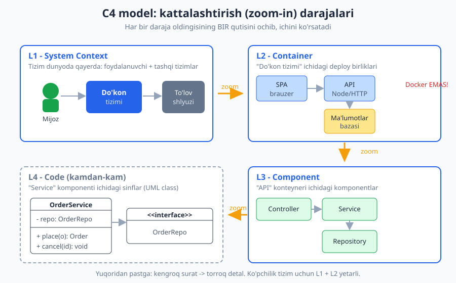
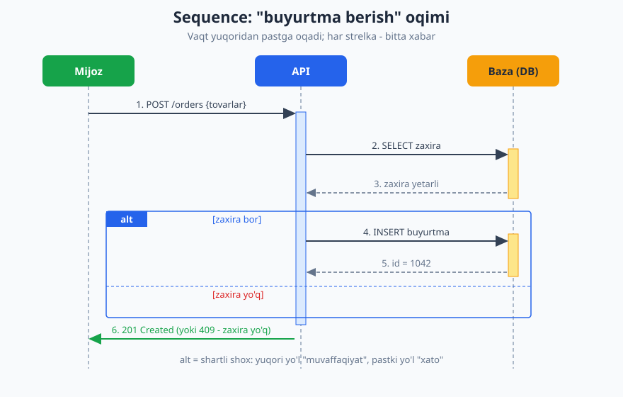
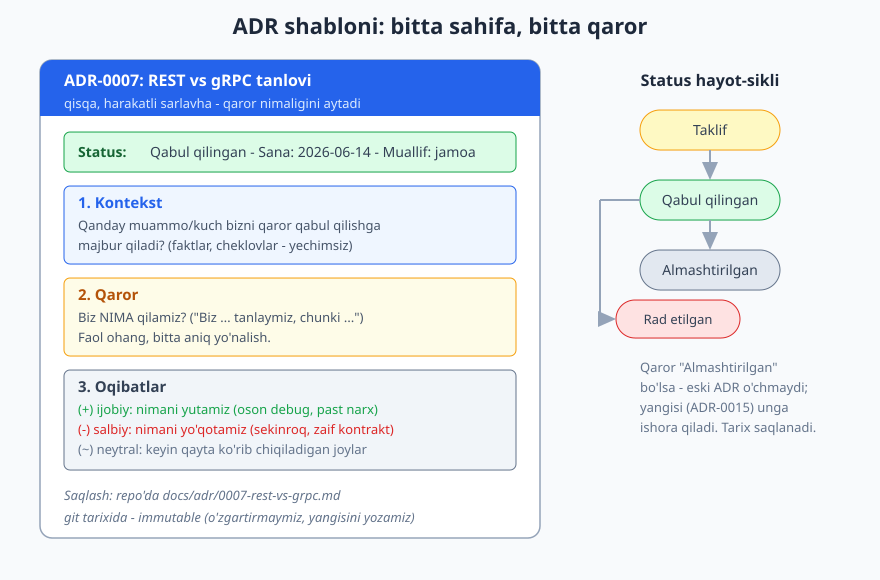

# 03 — Arxitekturani hujjatlashtirish: C4, UML, ADR

[⬅️ Oldingi: 02 — Sifat atributlari va trade-off'lar](./02-sifat-atributlari-tradeoff.md) · [🏠 README](./README.md) · [Keyingi: 04 — Coupling va cohesion ➡️](./04-coupling-cohesion.md)

---

> **Bu bobda:** arxitekturani QANDAY hujjatlashtirishni o'rganamiz — diagrammalar va matn orqali tizimni boshqalarga (va kelajakdagi o'zimizga) tushuntirish. Asosiy uchta vosita: **C4 model** (Simon Brown) — tizimni 4 darajada (Context / Container / Component / Code) "kattalashtirib" ko'rsatadigan diagramma yondashuvi; **UML**ning yengil, kerakli qismi (ayniqsa **ketma-ketlik** va **komponent** diagrammasi); va **ADR** (Architecture Decision Record) — bitta arxitektura qarorini, uning kontekstini va oqibatlarini yozib qo'yadigan kichik hujjat. Maqsad — "to'liq hujjat to'plami" emas, balki **kerakli, kam, ammo tirik** hujjat.
>
> **Trade-off eslatmasi / Halollik:** bu bob deyarli to'liq **konseptual** — diagramma va qaror yozish madaniyatihaqida. Hujjatning o'zi ham trade-off: ko'p hujjat = aniqlik, lekin u eskirib qoladi (stale) va saqlash narxi bor; oz hujjat = tez, lekin yangi a'zo adashadi. Bobdagi yagona ishlaydigan kod — ADR strukturasini modellashtiruvchi kichik TypeScript namunasi — `tsc --strict` bilan tekshirilgan va ishga tushirilgan; uning natijasi haqiqiy. Diagrammalar "konseptual" (qo'lda chizilgan misol), real tizimning o'lchov raqamlari emas.

---

Bir tasavvur qiling: siz yangi jamoaga qo'shildingiz. Birinchi kuni sizga 200 ming qatorlik kod bazasiga havola berishadi va "mana, o'qib chiq" deyishadi. Qayerdan boshlaysiz? `main` fayldanmi? Ma'lumotlar bazasi sxemasidanmi? Bir hafta o'tib ham siz hali "bu tizim umuman nima qiladi, qaysi qismlar bir-biri bilan gaplashadi" degan **katta suratni** ko'ra olmaysiz.

Mana shu — hujjatsiz arxitekturaning narxi. Kod sizga HAR BIR daraxtni ko'rsatadi, lekin **o'rmonni** ko'rsatmaydi. Arxitekturani hujjatlashtirish — bu o'rmon xaritasini chizish san'ati.

## Nega hujjatlash kerak

Ko'p dasturchi hujjatni yoqtirmaydi: "vaqt ketadi, eskiradi, baribir hech kim o'qimaydi". Bularning bir qismi haq. Lekin hujjatlashning to'rtta haqiqiy maqsadini ko'rib chiqsak, nega u zarurligini tushunamiz:

1. **Aloqa (kommunikatsiya).** Arxitektura — bu jamoaviy tushuncha. Diagramma — eng tez "umumiy til". Bitta yaxshi Container diagrammasi yarim soatlik yig'ilishni 5 daqiqaga qisqartiradi. Bu aloqa ikki tomonlama: **texnik** (dasturchilar bir-biriga "biz qayerda turibmiz" deydi) va **biznes** (menejer/mijozga tizim qanday qismlardan iboratligini ko'rsatadi).
2. **Yangi a'zoni jalb qilish (onboarding).** Yuqoridagi misoldagi yangi dasturchi. Yaxshi Context + Container diagrammasi bilan u birinchi soatdayoq "bu tizim 3 ta ilova va 1 ta bazadan iborat, tashqarida to'lov shlyuzi bor" deb tushunadi.
3. **Qaror izi (decision trail).** Olti oydan keyin kimdir so'raydi: "Nega bu yerda Kafka emas, oddiy navbat ishlatilgan?". Agar siz buni o'sha paytda yozib qo'ymagan bo'lsangiz, javob "esimda yo'q" bo'ladi. Bu — ADRning ishi.
4. **Fikrlashga majburlash.** Qarorni YOZISH jarayonining o'zi sizni aniq fikrlashga majbur qiladi. Ko'pincha ADR yozayotib, "to'xta, bu g'oya umuman ishlamaydi" deb tushunasiz — hali kod yozilmasdan oldin.

> **Eslatma:** "Kod o'zi hujjat" — bu yarim haqiqat. Kod sizga **NIMA** qilinayotganini aniq ko'rsatadi (chunki u ishlaydi). Lekin u sizga ikki narsani KO'RSATMAYDI: (a) **struktura** — qaysi qism qaysi qism bilan gaplashadi, qaysi modul mustaqil deploy qilinadi (buni 50 ta fayl ichidan yig'ib olish kerak); (b) **NEGA** — nega aynan shunday qilingan, qaysi muqobillar rad etilgan. Kod "nima"ni saqlaydi, hujjat "struktura"va "nega"ni saqlaydi.

> **Diqqat:** eng yomon hujjat — **noto'g'ri** hujjat. Eskirgan diagramma yangi dasturchini noto'g'ri yo'lga boshlaydi va "demak hech kimga ishonib bo'lmaydi" degan ishonchsizlikni tug'diradi. Shuning uchun qoida: **kam, lekin tirik** hujjat yoz. 50 sahifalik o'qilmaydigan Word fayldan ko'ra, 1 ta tirik Context diagramma + 5 ta ADR afzal.

## C4 model — arxitekturaning xaritasi

**C4 model** ni Simon Brown ishlab chiqqan (manba: c4model.com). Bu nima uchun kerak? Chunki dasturchilar "arxitektura diagrammasi" chizganda har xil quti, har xil o'q, har xil daraja aralashtirib yuborishadi — natijada bitta diagrammada foydalanuvchi ham, ma'lumotlar bazasi jadvali ham, Docker konteyneri ham bir vaqtda turadi. Hech kim tushunmaydi.

C4 buni **darajalarga** ajratish bilan hal qiladi. Nomidagi "C4" — to'rtta darajaning bosh harfi: **C**ontext, **C**ontainer, **C**omponent, **C**ode.

Eng kuchli intuitsiya — bu **xarita** o'xshatishi. Google Maps'da siz butun dunyoni ko'rasiz (mamlakatlar), keyin shaharga **kattalashtirasiz** (ko'chalar), keyin binoga (xonalar). Har bir daraja oldingisining BIR elementini ochib, ichini ko'rsatadi. C4 ham aynan shunday: har daraja keyingisiga **zoom-in** qilinadi.



### L1 — System Context (tizim konteksti)

Eng yuqori, eng kam detalli daraja. Bitta savolga javob beradi: **"Bu tizim dunyoda qayerda turibdi?"**

Bu darajada faqat uchta narsa bor:

- **Sizning tizimingiz** — markazdagi bitta quti (ichi qora quti, detal yo'q).
- **Foydalanuvchilar (Person)** — tizimni ishlatadigan odamlar/rollar (mijoz, administrator, kuryer).
- **Tashqi tizimlar (Software System)** — sizning tizimingiz bog'lanadigan, lekin O'ZINGIZ boshqarmaydigan tizimlar (to'lov shlyuzi, SMS-provayder, xarita API).

Bu diagrammani **menejerga, biznes egasiga** ko'rsatsa bo'ladi — texnik bilim talab qilmaydi. "Mana bizning tizim, mana kim ishlatadi, mana qaysi tashqi xizmatlarga bog'liqmiz".

```text
[Mijoz] ---> ( Onlayn do'kon tizimi ) ---> [To'lov shlyuzi]
                       |
                       v
                [SMS provayder]
```

### L2 — Container (konteyner)

Endi markazdagi "Onlayn do'kon tizimi" qutisini **ochamiz**. Ichida nima bor? **Konteynerlar.**

> **Diqqat — eng ko'p tarqalgan tushunmovchilik:** C4'dagi "Container" — bu **Docker konteyneri EMAS!** Bu so'z bu yerda umumiy ma'noda — "ichida kod ishlaydigan yoki ma'lumot saqlanadigan, alohida deploy/ishga tushiriladigan birlik" degani. Container = **ilova** (veb-server, mobil ilova, SPA, API, fon-ishchi) yoki **ma'lumot do'koni** (ma'lumotlar bazasi, fayl tizimi, kesh). Docker bilan deploy qilinishi mumkin, lekin shart emas — JVM jarayoni, brauzerdagi SPA, yoki oddiy bir PHP-ilova ham "container".

Mezon oddiy: **agar uni alohida ishga tushirish/to'xtatish/deploy qilish mumkin bo'lsa — bu container.**

Onlayn do'kon misolida konteynerlar:

| Container | Texnologiya | Vazifa |
|---|---|---|
| Veb SPA | brauzerdagi JS (React) | foydalanuvchi interfeysi |
| API server | Node.js / HTTP | biznes mantiq, REST endpoint'lar |
| Ma'lumotlar bazasi | PostgreSQL | doimiy saqlash |
| Fon-ishchi | Node.js worker | email yuborish, hisobotlar |

Bu daraja — **dasturchilar va DevOps uchun eng foydali** daraja. U "tizim qanday deploy qilinadi va qaysi qism qaysi qism bilan gaplashadi" ni ko'rsatadi. Ko'pincha real loyihada **Context + Container** ikkitasi yetarli — qolgan ikkitasi kamdan-kam kerak bo'ladi.

> **Amaliyotda:** Container diagrammasida har bir o'q (strelka)ga yorliq qo'ying — faqat "API -> DB" emas, balki "API -> DB: SQL/TCP o'qish-yozish". Bu "qaysi protokol bilan, qanday maqsadda gaplashadi"ni ko'rsatadi va xavfsizlik/tarmoq muhokamalarida juda asqotadi.

### L3 — Component (komponent)

Endi bitta konteynerni — masalan "API server"ni — ochamiz. Ichida **komponentlar** bor: konteyner ichidagi mantiqiy bloklar, har biri aniq mas'uliyatga ega guruh (sinf/modul to'plami).

API misolida: `OrderController` (HTTP so'rovlarni qabul qiladi) -> `OrderService` (biznes mantiq) -> `OrderRepository` (bazaga yozadi). Bu daraja kod tashkilotini ko'rsatadi, lekin hali ham aniq sinflar emas — **mantiqiy komponentlar**.

Bu darajani **faqat murakkab konteyner uchun** chizing. Agar konteyner kichik bo'lsa, bu diagramma ortiqcha.

### L4 — Code (kod)

Eng pastki, eng detalli daraja: bitta komponent ichidagi **sinflar, interfeyslar, funksiyalar** — bu aslida **UML class diagrammasi**. C4 muallifi ham aytadi: bu darajani **kamdan-kam** chizing, chunki:

- u juda tez eskiradi (kod har kuni o'zgaradi);
- uni IDE/asboblar koddan **avtomatik** generatsiya qila oladi;
- qog'ozda emas, koddagina foydali.

> **Trade-off:** C4'da yuqoriga chiqqan sari — **kamroq detal, kamroq eskirish, ko'proq barqaror**. Pastga tushgan sari — ko'proq detal, lekin tezroq eskiradi. Shuning uchun amaliy maslahat: **Context va Container ni doim saqlang** (ular kamdan-kam o'zgaradi), Component ni faqat murakkab joyda, Code ni esa deyarli hech qachon qo'lda chizmang.

### C4 va UML munosabati

C4 — UML'ga **pragmatik muqobil**. To'liq UML 14 xil diagramma turiga ega va og'ir; ko'p jamoa uni o'rganishga ham erinadi. C4 esa atigi 4 ta darajadan iborat, **notatsiya-mustaqil** (oddiy quti va o'qlar bilan ham, asbob bilan ham chizish mumkin). Shu sababli C4 amaliyotda UML'dan ko'ra ko'proq qabul qilingan.

> **Eslatma — qanday vositada chizish:** C4 diagrammalarini Structurizr (Simon Brown'ning asbobi), draw.io, Excalidraw, yoki hatto qog'ozda chizsa bo'ladi. Pastda "diagrams as code" yondashuvini ham ko'ramiz.

## Misol: real tizim uchun Context va Container

Keling, kichik real tizimni — **Telegram-bot backend**ini — C4'ning birinchi ikki darajasida matnli tasvirlaymiz. (Bot misolini batafsil ko'rishni istasangiz, [Telegram-bot kitobiga](../tgbot-js/README.md) qarang — bu yerda biz uni arxitektura nuqtai nazaridan ko'ramiz.)

**L1 — Context:**

```text
KONTEKST DIAGRAMMA — "Buyurtma boti"

  [Foydalanuvchi]  --Telegram orqali xabar-->  ( Buyurtma boti tizimi )
                                                       |
                          ( Buyurtma boti tizimi )  --webhook qabul-->  [Telegram Bot API]
                          ( Buyurtma boti tizimi )  --to'lov so'rovi-->  [To'lov provayderi]
```

Foydalanuvchi botga to'g'ridan-to'g'ri gaplashmaydi — u **Telegram** orqali gaplashadi, Telegram esa bizning tizimga webhook yuboradi. Bu nuans Context darajasida ko'rinadi.

**L2 — Container:**

```text
KONTEYNER DIAGRAMMA — "Buyurtma boti tizimi" ichi

  [Telegram Bot API]
        |  webhook (HTTPS POST)
        v
  ( Webhook qabul qiluvchi )  --vazifa qo'y-->  ( Navbat: Redis )
   Node.js / HTTP                                     |
                                                      | vazifa ol
                                                      v
                                            ( Bot ishchi (worker) )  --o'qish/yozish-->  ( Ma'lumotlar bazasi )
                                             Node.js                                          PostgreSQL
                                                      |
                                                      | to'lov
                                                      v
                                            [To'lov provayderi]
```

Bu yerda **muhim arxitektura qarori** ko'rinadi: webhook'ni qabul qiluvchi (tez javob berishi shart) va og'ir ishni bajaruvchi worker — **ikki alohida konteyner**, orasida navbat. Nega? Telegram webhook'ga tez javob kutadi; agar biz worker'da to'lovni kutib tursak, webhook timeout bo'ladi. Bu — bitta diagramma ko'rsatadigan, kodda darrov ko'rinmaydigan qaror. (Bu naqsh haqida [21-bobda](./21-message-queue-async.md) batafsil.)

## UML asoslari — kerakli 3-4 turi

To'liq UML'ni o'rganishga hojat yo'q. Amaliyotda quyidagi to'rt tur 90% ehtiyojni qoplaydi:

| Diagramma | Nimani ko'rsatadi | Qachon |
|---|---|---|
| **Class** (sinf) | sinflar, ularning maydonlari/metodlari, o'zaro aloqasi (meros, kompozitsiya) | murakkab domen modelini tushuntirganda |
| **Sequence** (ketma-ketlik) | vaqt bo'yicha xabarlar oqimi: kim kimga, qaysi tartibda | murakkab oqim (login, to'lov, retry) ni tushuntirganda |
| **Component** (komponent) | komponentlar va ular o'rtasidagi interfeyslar | tizim qismlari va ularning kontraktlari |
| **Deployment** (joylashtirish) | qaysi qism qaysi serverga/mashinaga joylashadi | infratuzilma, tarmoq, masshtab muhokamasi |

> **Amaliyotda:** "to'liq UML shart emas — kerakli 3-4 turdan foydalan" degan qoida amaliyotda eng to'g'ri yo'l. Class va Sequence eng ko'p ishlatiladigan ikkitasi. Component va Deployment — tizim diagrammasi sifatida C4 bilan ko'p qoplanadi.

### Ketma-ketlik (sequence) diagrammasi

Eng foydali UML diagrammalaridan biri. U **vaqt bo'yicha** kim kimga, qaysi tartibda xabar yuborishini ko'rsatadi. Tepada — ishtirokchilar (foydalanuvchi, API, baza), ularning ostida **hayot chizig'i** (vertikal punktir) pastga tushadi; har bir gorizontal o'q — bitta xabar. Vaqt yuqoridan pastga oqadi.



Diagrammadagi muhim elementlar:

- **Hayot chizig'i (lifeline)** — har ishtirokchidan pastga tushadigan punktir chiziq.
- **Faollik bloki (activation bar)** — ishtirokchi "ishlab turgan" vaqtni ko'rsatadigan to'rtburchak.
- **Sinxron xabar** — to'liq o'q (so'rov), **qaytish** — punktir o'q (javob).
- **alt bloki** — shartli shox: "agar zaxira bor bo'lsa ... aks holda ...". Bu xato yo'llarini ham ko'rsatish imkonini beradi — aynan shu narsa sequence'ni qimmatli qiladi.

> **Eslatma:** sequence diagrammasini chizishning eng yaxshi vaqti — **murakkab yoki nozik oqimni** muhokama qilganda: autentifikatsiya, to'lov, retry/circuit breaker, distributed tranzaksiya. Oddiy CRUD uchun u ortiqcha.

## ADR — Architecture Decision Record

Endi hujjatlashning eng kam baholangan, lekin eng kuchli vositasiga keldik. **ADR** — bu bitta arxitektura qarorini yozib qo'yadigan **qisqa** (odatda 1 sahifa) hujjat.

Muammo shunday: tizim hayoti davomida yuzlab qaror qabul qilinadi — "REST yoki gRPC?", "monolit yoki bo'lamizmi?", "qaysi baza?", "kesh kerakmi?". Olti oy yoki ikki yil o'tib, kimdir (ko'pincha — o'zingiz) so'raydi: **"nega shunday qilingan ekan?"**. Agar yozilmagan bo'lsa, javob yo'q. Yoki battari — kimdir "bu ahmoqlik" deb qarorni teskari qiladi, keyin esa o'sha qaror nega qilinganini (yaxshi sabab bor edi!) qaytadan og'riq bilan kashf etadi.

ADR buni hal qiladi: **qaror qabul qilingan paytda**, uning **kontekstini va oqibatlarini** yozib qo'yadi.



### ADR tuzilmasi

Eng keng tarqalgan (Michael Nygard) shabloni atigi bir necha bo'limdan iborat:

1. **Sarlavha** — `ADR-0007: Servislararo aloqa uchun REST` — raqam + qisqa, harakatli nom.
2. **Status** — `Taklif` / `Qabul qilingan` / `Rad etilgan` / `Eskirgan` / `Almashtirilgan`.
3. **Kontekst** — qanday kuchlar, cheklovlar, muammo bizni qaror qabul qilishga majbur qilmoqda. Faqat **faktlar**, hali yechim emas. ("Buyurtma servisi inventar servisi bilan gaplashishi kerak; jamoa REST'ni yaxshi biladi; hozircha yuk past.")
4. **Qaror** — biz NIMA qilamiz. Faol ohangda: "Biz REST/JSON tanlaymiz, chunki ...".
5. **Oqibatlar** — qaror natijasida nima o'zgaradi. **Ham ijobiy, ham salbiy** (bu eng muhim qism!). "(+) oson debug; (-) gRPC'dan sekinroq; (~) keyin yuk oshsa qayta ko'riladi."

> **Trade-off:** ADR'ning eng qimmatli qismi — **salbiy oqibatlar**. Ko'p odam faqat "nega bu yaxshi" deb yozadi. Lekin har qaror narxga ega; salbiy tomonini halol yozish — kelajakdagi o'zingizga "ha, biz bu narxni bilib turib to'ladik" deyish imkonini beradi. Salbiy oqibatsiz ADR — bu reklama, hujjat emas.

### Misol ADR: REST vs gRPC

Quyida to'liq ADR namunasi (Markdown'da, repo'da `docs/adr/0007-rest-vs-grpc.md` sifatida saqlanadi):

```text
# ADR-0007: Servislararo aloqa uchun REST (gRPC emas)

**Status:** Qabul qilingan  |  **Sana:** 2026-06-14

## Kontekst
Yangi buyurtma servisi inventar servisi bilan ichki tarmoqda gaplashishi kerak.
Jamoa REST/JSON'ni yaxshi biladi va undan brauzer/curl bilan oson sinov qiladi.
Hozircha yuk past (kuniga ~10k so'rov). gRPC tezroq, lekin jamoa uni bilmaydi
va tooling (proto generatsiya, debug) qo'shimcha o'rganishni talab qiladi.

## Qaror
Biz servislararo aloqa uchun JSON/HTTP REST tanlaymiz. Sabab: past o'rganish
narxi, jamoaning mavjud bilimiga mos kelishi, va hozirgi yuk darajasida
tezlik farqi sezilmasligi.

## Oqibatlar
- (+) Past o'rganish narxi; curl/Postman bilan oson sinov va debug.
- (+) Mavjud monitoring/logging tooling to'g'ridan-to'g'ri ishlaydi.
- (-) gRPC'ga nisbatan sekinroq (JSON serializatsiya, HTTP/1.1).
- (-) Sxema kontrakti zaifroq (proto'dagidek qat'iy emas).
- (~) Yuk sezilarli oshsa, ichki "issiq yo'l" uchun gRPC qayta ko'rib chiqiladi
  (yangi ADR bilan).
```

> **Amaliyotda:** ADR'ni **git** bilan, kod yonida (`docs/adr/`) saqlang. Nega? Chunki ADR koddagi qaror bilan birga "sayohat qiladi", PR'da ko'rib chiqiladi, va git tarixi qachon/kim qarorni o'zgartirganini ko'rsatadi. (Git bo'yicha [git-github kitobiga](../git-github/README.md) qarang.) ADR'lar **immutable** (o'zgarmas): qaror eskirsa, eskini O'CHIRMAYSIZ — statusini "Almashtirilgan" qilib, yangi ADR yozasiz. Tarix saqlanadi.

### ADR'ni mashinada o'qiladigan qilish (ishlaydigan namuna)

ADR — bu shunchaki matn, lekin uni tuzilmali (structured) qilib modellashtirish foydali: masalan, bot/skript barcha "Almashtirilgan" ADR'larni topib, ularning yangi versiyasiga havola qilishni tekshirishi mumkin. Quyidagi TypeScript namunasi ADR strukturasini tip sifatida ko'rsatadi va kichik validatsiya qiladi. Bu kod `tsc --strict` bilan tekshirilgan va `tsx` bilan ishga tushirilgan:

```ts
type AdrStatus = "Taklif" | "Qabul qilingan" | "Rad etilgan" | "Eskirgan" | "Almashtirilgan";

interface Adr {
  id: number;            // 0001, 0002 ...
  sarlavha: string;
  status: AdrStatus;
  sana: string;          // YYYY-MM-DD
  kontekst: string;
  qaror: string;
  oqibatlar: string[];   // ijobiy va salbiy
  almashtirgan?: number; // status=Almashtirilgan bo'lsa, qaysi ADR ni almashtirgan
}

// Soddalashtirilgan validatsiya: "Almashtirilgan" status bo'lsa, almashtirgan ID shart.
function adrYaroqli(a: Adr): boolean {
  if (a.status === "Almashtirilgan" && a.almashtirgan === undefined) return false;
  return a.id > 0 && a.sarlavha.length > 0 && a.oqibatlar.length > 0;
}

const adr: Adr = {
  id: 7,
  sarlavha: "Servislararo aloqa uchun REST (gRPC emas)",
  status: "Qabul qilingan",
  sana: "2026-06-14",
  kontekst: "Buyurtma servisi inventar servisi bilan gaplashishi kerak.",
  qaror: "JSON/HTTP REST ishlatamiz; jamoa REST'ni biladi, debug oson.",
  oqibatlar: ["(+) Past narx, oson sinov.", "(-) gRPC'dan sekinroq."],
};

console.log("Yaroqli ADR?:", adrYaroqli(adr));
// Almashtirilgan, lekin almashtirgan ID berilmagan -> yaroqsiz
console.log("Yomon ADR yaroqli?:", adrYaroqli({ ...adr, status: "Almashtirilgan" }));
```

Ishga tushirsak, quyidagi natija olinadi (haqiqiy chiqish):

```text
Yaroqli ADR?: true
Yomon ADR yaroqli?: false
```

Bu — kichik g'oya, lekin u muhim narsani ko'rsatadi: ADR'ni **shabloga sodiq** (har biri Kontekst/Qaror/Oqibat'ga ega, almashtirishlar bog'langan) qilib saqlasangiz, uni avtomatlashtirish va tekshirish mumkin bo'ladi.

## Diagrams as code

Diagrammalarni "qo'lda" (draw.io, Excalidraw) chizish bir muammoga ega: ular kod bilan birga **eskiradi**, lekin git'da matn sifatida ko'rinmaydi (binary/JSON), shuning uchun diff qilib bo'lmaydi. Yechim — **diagramma-kod**: diagrammani matn sifatida yozasiz, asbob uni rasmga aylantiradi. Afzalligi: git'da diff ko'rinadi, PR'da ko'rib chiqiladi, kod yonida turadi.

Asosiy variantlar:

| Asbob | Nimaga yaxshi |
|---|---|
| **Mermaid** | Markdown ichida ishlaydi (GitHub render qiladi), sequence/flowchart/class uchun yengil |
| **PlantUML** | to'liq UML, kuchli, lekin og'irroq sintaksis |
| **Structurizr** | aynan C4 uchun — bitta model'dan barcha 4 daraja diagrammasini generatsiya qiladi |

Mermaid'da yuqoridagi sequence diagrammasining yozuvi:

```text
sequenceDiagram
    Mijoz->>API: POST /orders {tovarlar}
    API->>DB: SELECT zaxira
    DB-->>API: zaxira yetarli
    API->>DB: INSERT buyurtma
    DB-->>API: id = 1042
    API-->>Mijoz: 201 Created
```

> **Eslatma:** Structurizr ayniqsa C4 uchun kuchli — siz tizimni **bir marta** matn bilan ta'riflaysiz (qaysi container, qaysi component), asbob esa Context, Container, Component diagrammalarini **avtomatik** chiqaradi. Bu "bitta haqiqat manbasi" (single source of truth) tamoyiliga mos: diagrammalar bir-biriga zid bo'lib qolmaydi.

## 4+1 view qisqacha

Yana bir klassik g'oya — **4+1 arxitektura ko'rinishlari** (Philippe Kruchten). Asosiy fikr: bitta diagramma butun arxitekturani ko'rsata olmaydi, chunki har xil o'quvchi har xil narsani ko'rishni xohlaydi. Shuning uchun **bir necha ko'rinish (view)** kerak:

- **Logical** — funksionallik, asosiy bloklar (dasturchiga);
- **Process** — jarayonlar, parallellik, ish oqimi (ishlash/masshtab uchun);
- **Development** — kod tashkiloti, modullar (jamoaga);
- **Physical / Deployment** — qaysi qism qaysi serverga tushadi (DevOps'ga);
- **+1 = Scenarios** — yuqoridagilarni bog'lab turadigan asosiy stsenariylar (use case'lar).

C4 va 4+1 zid emas — C4 ko'proq amaliy va sodda; 4+1 esa "turli o'quvchi uchun turli ko'rinish kerak" degan umumiy g'oyani beradi. Amaliyotda ko'pchilik C4'dan boshlaydi.

## Cross-link: bu bilim qayerda ishlatiladi

- **Kapston (26-bob).** Yakuniy [tizim dizayni bobida](./26-kapston-tizim-dizayni.md) siz aynan C4 (Context + Container) diagrammalarini chizasiz va asosiy qarorlarni ADR sifatida yozasiz — bu bob o'sha mahoratning poydevori.
- **Git bilan ADR.** ADR'lar kod bilan birga `docs/adr/` da, git tarixida saqlanadi — [git-github kitobiga](../git-github/README.md) qarang.
- **Keyingi boblar.** [04-coupling/cohesion](./04-coupling-cohesion.md) va keyingilarda chizadigan har bir diagramma C4 yoki UML notatsiyasidan foydalanadi — endi siz ularni "o'qiy olasiz".

---

## Mashqlar

### Oson

**1-mashq.** C4 modelning 4 darajasini to'g'ri tartibda (yuqoridan pastga, kengdan torga) ayting va har biri bitta jumlada nimani ko'rsatishini yozing.

**2-mashq.** Quyidagilarning qaysilari C4'da "Container" hisoblanadi, qaysilari yo'q? (a) PostgreSQL ma'lumotlar bazasi, (b) `OrderService` sinfi, (c) brauzerdagi React SPA, (d) `users` jadvali, (e) Redis kesh, (f) `formatDate()` funksiyasi.

**3-mashq.** "C4'dagi Container — bu Docker konteyneri" — bu da'vo to'g'rimi yoki noto'g'ri? Bir jumlada izohlang.

**4-mashq.** ADR'ning beshta asosiy bo'limini sanang. Qaysi bo'lim eng ko'p e'tibordan chetda qoladi, lekin eng qimmatli — va nega?

### O'rta

**5-mashq.** Quyidagi tizim uchun **C4 Context** darajasidagi barcha elementlarni (foydalanuvchilar + sizning tizimingiz + tashqi tizimlar) sanang: *"Onlayn taksi buyurtma ilovasi: yo'lovchi mobil ilovadan taksi chaqiradi, haydovchi alohida ilovada buyurtma oladi, to'lov karta orqali, joylashuv xaritada ko'rsatiladi, SMS bilan tasdiq yuboriladi."*

**6-mashq.** O'sha taksi tizimi uchun kamida 4 ta **Container** ni (har biri texnologiya + vazifa bilan) sanang.

**7-mashq.** Quyidagi qaror uchun to'liq **ADR yozing** (5 bo'lim): *"Jamoa foydalanuvchi sessiyasini saqlash uchun server xotirasi (in-memory) o'rniga Redis tanlamoqchi, chunki ular bir nechta API nusxasini ishga tushirmoqchi."* Salbiy oqibatlarni ham yozishni unutmang.

**8-mashq.** Quyidagi stsenariy uchun **ketma-ketlik (sequence)** diagrammasining matnli tavsifini (kim -> kimga: xabar) yozing: *"Foydalanuvchi login qiladi: API parolni tekshiradi (bazadan o'qiydi), to'g'ri bo'lsa token yaratadi va qaytaradi, noto'g'ri bo'lsa 401 qaytaradi."* `alt` blokini ishlating.

**9-mashq.** Quyidagi vaziyatlarning har biri uchun **qaysi C4 daraja** eng mos kelishini ayting: (a) menejerga tizim qanday tashqi xizmatlarga bog'liqligini ko'rsatish; (b) DevOps'ga qaysi qism alohida deploy qilinishini ko'rsatish; (c) yangi dasturchiga `OrderService` ichidagi sinflarni tushuntirish; (d) butun tizim "kim ishlatadi"ni biznesga ko'rsatish.

### Qiyin

**10-mashq.** Bitta jamoa ikki yil davomida hech qanday ADR yozmagan. Yangi texnik direktor kelib, "nega bizda Kafka emas, RabbitMQ ishlatilgan?" deb so'raydi — hech kim aniq sababni eslay olmaydi. Bu vaziyatdan kelib chiqadigan **uchta aniq xarajat/zararni** sanang va ADR madaniyati buni qanday oldini olishini tushuntiring.

**11-mashq.** Yangi a'zo: "Bizda Container diagrammasi bor, lekin u 6 oy oldin chizilgan va o'shandan beri 2 ta yangi servis qo'shilgan — diagramma noto'g'ri". Bu **eskirgan hujjat** muammosini hal qilish uchun ikkita amaliy yondashuvni taklif qiling (biri jarayonga, biri vositaga oid).

**12-mashq.** "C4 Code (L4) darajasini har bir komponent uchun qo'lda chizamiz va doim yangilab turamiz" — bu rejani **tanqid qiling**: nega bu yomon g'oya, va C4 muallifi o'rniga nima maslahat beradi?

**13-mashq (kod).** ADR'larni boshqaruvchi kichik tip-xavfsiz funksiya yozing (TS yoki Python). Funksiya ADR ro'yxatini oladi va: (a) statusi "Almashtirilgan" bo'lib, `almashtirgan` ID si yo'q bo'lganlarni "yaroqsiz" deb topadi; (b) `almashtirgan` ID haqiqatan ro'yxatda mavjudligini tekshiradi. Yozganingizni `tsx`/`python` bilan ishga tushirib tekshiring.

**14-mashq (loyihalash).** Kichik tizim — "Telegram orqali ovqat yetkazib berish boti" — uchun **Context + Container** matnli diagrammasini loyihalang. Webhook'ni qabul qilish va og'ir ishni (to'lov, restoran bilan aloqa) ajratish kerakmi? Qarorni bitta qisqa ADR bilan asoslang.

<details markdown="1">
<summary>Yechimlar</summary>

### 1-mashq yechimi

Yuqoridan pastga (kengdan torga):

1. **L1 — System Context:** tizim dunyoda qayerda — foydalanuvchilar va tashqi tizimlar bilan munosabati.
2. **L2 — Container:** tizim ichidagi alohida deploy/ishga tushiriladigan birliklar (ilovalar va ma'lumot do'konlari).
3. **L3 — Component:** bitta konteyner ichidagi mantiqiy komponentlar (mas'uliyat bloklari).
4. **L4 — Code:** bitta komponent ichidagi sinflar/interfeyslar (UML class) — kamdan-kam chiziladi.

### 2-mashq yechimi

Container: **(a) PostgreSQL** (ma'lumot do'koni), **(c) React SPA** (brauzerda ishlaydigan ilova), **(e) Redis kesh** (ma'lumot do'koni). Bularning hammasi alohida ishga tushiriladigan/deploy qilinadigan birliklar.

Container EMAS: **(b) `OrderService` sinfi** — bu Component yoki Code darajasiga tegishli; **(d) `users` jadvali** — bu baza ICHIDAGI struktura, baza container, jadval undan past detal; **(f) `formatDate()` funksiyasi** — bu Code (L4) darajasi.

### 3-mashq yechimi

**Noto'g'ri.** C4'dagi "Container" — Docker konteyneri emas. U umumiy ma'noda "kod ishlaydigan yoki ma'lumot saqlanadigan, alohida deploy/ishga tushiriladigan birlik" (ilova yoki ma'lumot do'koni) degani. Docker bilan deploy qilinishi mumkin, lekin shart emas — brauzerdagi SPA, JVM jarayoni, oddiy PHP-ilova ham "container".

### 4-mashq yechimi

Beshta bo'lim: **Sarlavha, Status, Kontekst, Qaror, Oqibatlar.**

Eng ko'p chetda qoladigan, lekin eng qimmatli — **Oqibatlar**, ayniqsa uning **salbiy** qismi. Ko'p odam faqat "nega bu yaxshi" deb yozadi. Lekin har qaror narxga ega; salbiy tomonini halol yozish kelajakdagi o'qigan kishiga "bu narxni bilib turib to'laganmiz, bu ahmoqlik emas edi" deyish imkonini beradi. Salbiy oqibatsiz ADR — reklama.

### 5-mashq yechimi

**Context elementlari:**

- **Foydalanuvchilar (Person):** Yo'lovchi, Haydovchi. (Ikkalasi alohida rol — har biri o'z ilovasidan foydalanadi.)
- **Sizning tizimingiz:** Taksi buyurtma platformasi (bitta quti).
- **Tashqi tizimlar:** To'lov shlyuzi (karta to'lovi), Xarita/joylashuv provayderi (masalan, xarita API), SMS provayder (tasdiq xabarlari).

E'tibor bering: "mobil ilova" Context'da alohida quti EMAS — u tizimning bir qismi (container), foydalanuvchi esa undan foydalanadi.

### 6-mashq yechimi

Namunaviy konteynerlar:

| Container | Texnologiya | Vazifa |
|---|---|---|
| Yo'lovchi mobil ilovasi | iOS/Android | taksi chaqirish UI |
| Haydovchi mobil ilovasi | iOS/Android | buyurtma qabul qilish UI |
| API server (backend) | Node.js/Python HTTP | biznes mantiq, matching |
| Real-vaqt joylashuv servisi | WebSocket server | jonli joylashuv yangilash |
| Ma'lumotlar bazasi | PostgreSQL | buyurtma, foydalanuvchi saqlash |

(Yo'lovchi va haydovchi ilovalari alohida konteyner, chunki alohida deploy qilinadi va turli UI'ga ega.)

### 7-mashq yechimi

```text
# ADR-0012: Sessiya saqlash uchun Redis (in-memory emas)

**Status:** Qabul qilingan  |  **Sana:** 2026-06-14

## Kontekst
API'ni gorizontal masshtablash uchun bir nechta nusxa (instance) ishga
tushirmoqchimiz, load balancer ortida. Hozir sessiya har nusxaning O'Z
xotirasida saqlanadi, shuning uchun foydalanuvchi har safar boshqa nusxaga
tushsa, sessiyasi yo'qoladi (qayta login). Yopishqoq sessiya (sticky session)
yechimi load balancing'ni cheklaydi.

## Qaror
Sessiyani Redis (markazlashgan, barcha nusxalar uchun umumiy) da saqlaymiz.
Har nusxa sessiyani Redis'dan o'qiydi/yozadi, shuning uchun foydalanuvchi
istalgan nusxaga tushsa ham sessiyasi saqlanadi.

## Oqibatlar
- (+) API endi to'liq stateless -> gorizontal masshtab oson, sticky session shart emas.
- (+) Bitta nusxa qulasa, sessiyalar yo'qolmaydi (Redis'da turibdi).
- (-) Redis yangi bog'liqlik va potensial yakka nuqta (SPOF) -> uni replikatsiya/HA qilish kerak.
- (-) Har sessiya o'qishi endi tarmoq sayohati (in-memory'dan sekinroq, garchi Redis tez bo'lsa ham).
- (~) Redis ishlamay qolsa fallback strategiyasi keyin ko'rib chiqiladi (yangi ADR).
```

Asosiy nuqta: salbiy oqibatlar (Redis = yangi SPOF, tarmoq latensiyasi) halol yozilgan.

### 8-mashq yechimi

```text
sequenceDiagram
    Foydalanuvchi->>API: POST /login {email, parol}
    API->>DB: SELECT user WHERE email=...
    DB-->>API: user (parol hash bilan)
    alt parol to'g'ri
        API->>API: token yarat (JWT)
        API-->>Foydalanuvchi: 200 OK {token}
    else parol noto'g'ri
        API-->>Foydalanuvchi: 401 Unauthorized
    end
```

`alt` bloki ikki yo'lni — muvaffaqiyat (200 + token) va xato (401) — bir diagrammada ko'rsatadi. E'tibor bering: parolni tekshirish API ichida (`API->>API`), bazadan esa faqat saqlangan hash o'qiladi.

### 9-mashq yechimi

- (a) menejerga tashqi bog'liqliklar -> **L1 Context** (texnik bilim talab qilmaydi, tashqi tizimlar ko'rinadi).
- (b) DevOps'ga deploy birliklari -> **L2 Container** (aynan deploy qilinadigan birliklarni ko'rsatadi).
- (c) `OrderService` ichidagi sinflar -> **L4 Code** (sinf darajasi; yoki agar bir necha komponent bo'lsa L3 dan boshlab).
- (d) biznesga "kim ishlatadi" -> **L1 Context** (foydalanuvchilar/rollar ko'rinadi).

### 10-mashq yechimi

Uchta aniq zarar:

1. **Qayta kashf qilish narxi.** Hech kim sababni bilmagani uchun, kimdir "RabbitMQ yomon, Kafka qo'yamiz" deb migratsiyani boshlashi mumkin — keyin esa o'sha asl sabab (masalan, jamoa Kafka'ni operatsiya qila olmasligi, yoki yuk Kafka'ni oqlamasligi) qaytadan, og'riq va vaqt bilan kashf qilinadi.
2. **Yomon qaror xavfi.** Kontekstni bilmay turib o'zgartirilgan qaror tizimni buzishi mumkin (masalan, RabbitMQ aynan kerakli "per-message ack" semantikasi uchun tanlangan bo'lsa, Kafka'da bu boshqacha ishlaydi).
3. **Ishonch va tezlik yo'qolishi.** Har safar "nega shunday?" degan savol javobsiz qolsa, jamoa qaror qabul qilishdan qo'rqadi yoki sekinlashadi; yangi a'zolar tizimga ishonmaydi.

ADR madaniyati: qaror **qabul qilingan paytda** kontekst + sabab + rad etilgan muqobillar yoziladi. Ikki yildan keyin texnik direktor `docs/adr/` ni ochib, "ADR-0003: Kafka emas RabbitMQ" ni o'qiydi va sababni 2 daqiqada tushunadi. Migratsiya kerak bo'lsa ham, u eski kontekst ustiga qurib, yangi ADR yozadi.

### 11-mashq yechimi

Ikki yondashuv:

1. **Jarayonga oid:** diagrammani yangilashni "Definition of Done"ning qismiga aylantiring — yangi servis qo'shgan PR diagrammani ham yangilamasa, merge qilinmaydi. Yoki har sprint oxirida qisqa "arxitektura review" — diagramma haqiqatga mos kelishini tekshirish.
2. **Vositaga oid:** "diagrams as code" (Structurizr/Mermaid) ga o'ting. Diagramma matn sifatida kod yonida (git'da) tursa, u PR diff'da ko'rinadi va review'da eskirgani sezilib qoladi. Structurizr bilan model bir marta ta'riflanadi -> diagrammalar avtomatik chiqadi, qo'lda bir nechta joyni yangilash shart emas.

Tub sabab: **eskirish narxini past qilish.** Diagramma qancha kod yonida va avtomatik bo'lsa, shuncha kam eskiradi.

### 12-mashq yechimi

Nega yomon:

- **Tez eskiradi.** L4 (Code) — sinflar har kuni o'zgaradi; qo'lda chizilgan class diagramma bir hafta ichida noto'g'ri bo'lib qoladi. Uni "doim yangilab turish" — ulkan, tugamaydigan ish.
- **Past qiymat.** Bu detal aslida **kodda** bor va IDE uni ko'rsatadi; qog'ozda takrorlash ortiqcha.
- **Avtomatlashtirsa bo'ladi.** Class diagrammani asboblar koddan avtomatik generatsiya qila oladi — qo'lda chizish behuda mehnat.

C4 muallifi maslahati: **Code darajasini kamdan-kam chizing**, kerak bo'lsa ham koddan avtomatik generatsiya qiling. E'tiborni **Context va Container** ga qarating — ular kam o'zgaradi, eng ko'p qiymat beradi va qo'lda saqlashga arziydi.

### 13-mashq yechimi

```ts
type AdrStatus = "Taklif" | "Qabul qilingan" | "Rad etilgan" | "Almashtirilgan";

interface Adr {
  id: number;
  sarlavha: string;
  status: AdrStatus;
  almashtirgan?: number;
}

function tekshir(adrlar: Adr[]): { id: number; muammo: string }[] {
  const idlar = new Set(adrlar.map((a) => a.id));
  const muammolar: { id: number; muammo: string }[] = [];
  for (const a of adrlar) {
    if (a.status === "Almashtirilgan") {
      if (a.almashtirgan === undefined) {
        muammolar.push({ id: a.id, muammo: "Almashtirilgan, lekin almashtirgan ID yo'q" });
      } else if (!idlar.has(a.almashtirgan)) {
        muammolar.push({ id: a.id, muammo: `almashtirgan ID ${a.almashtirgan} ro'yxatda yo'q` });
      }
    }
  }
  return muammolar;
}

const adrlar: Adr[] = [
  { id: 1, sarlavha: "REST tanlovi", status: "Almashtirilgan", almashtirgan: 5 }, // 5 yo'q!
  { id: 2, sarlavha: "Redis sessiya", status: "Qabul qilingan" },
  { id: 3, sarlavha: "Eski auth", status: "Almashtirilgan" }, // almashtirgan yo'q!
];

console.log(tekshir(adrlar));
```

Ishga tushirilganda (haqiqiy chiqish):

```text
[
  { id: 1, muammo: "almashtirgan ID 5 ro'yxatda yo'q" },
  { id: 3, muammo: "Almashtirilgan, lekin almashtirgan ID yo'q" }
]
```

Ko'rinib turibdiki, ADR'larni tuzilmali saqlash ularning izchilligini avtomatik tekshirish imkonini beradi.

### 14-mashq yechimi

**Context:**

- Foydalanuvchilar: Mijoz (ovqat buyuradi), Restoran (buyurtma oladi — alohida interfeys yoki bot orqali).
- Tizim: Ovqat yetkazish boti.
- Tashqi: Telegram Bot API, To'lov provayderi.

**Container:**

```text
[Telegram Bot API] --webhook--> ( Webhook qabul qiluvchi: Node.js )
                                       | vazifa qo'y
                                       v
                                ( Navbat: Redis )
                                       | vazifa ol
                                       v
                                ( Ishchi/worker: Node.js ) --o'qish/yozish--> ( PostgreSQL )
                                       | to'lov
                                       v
                                [To'lov provayderi]
```

**Ajratish kerakmi?** Ha. **ADR-0001: Webhook va worker'ni ajratish.**

- **Kontekst:** Telegram webhook'ga tez (~bir necha soniya ichida) javob kutadi. To'lov va restoran bilan aloqa sekin va ishonchsiz bo'lishi mumkin.
- **Qaror:** Webhook faqat so'rovni qabul qilib, vazifani navbatga (Redis) qo'yadi va darrov "OK" qaytaradi; og'ir ishni alohida worker bajaradi.
- **Oqibatlar:** (+) webhook hech qachon timeout bo'lmaydi, tizim yuk ostida barqaror; (-) qo'shimcha murakkablik (navbat + worker), eventual ishlov (foydalanuvchi natijani biroz kechikib oladi); (~) kichik bot uchun bu ortiqcha bo'lishi mumkin — yuk past bo'lsa, bitta jarayon ham yetadi.

Muqobil: hamma narsani bitta jarayonda qilish — kichik bot uchun soddaroq, lekin yuk yoki sekin to'lov ostida webhook timeout xavfi bor. Bu — klassik **soddalik vs barqarorlik** trade-off'i.

</details>

---

[⬅️ Oldingi: 02 — Sifat atributlari va trade-off'lar](./02-sifat-atributlari-tradeoff.md) · [🏠 README](./README.md) · [Keyingi: 04 — Coupling va cohesion ➡️](./04-coupling-cohesion.md)
