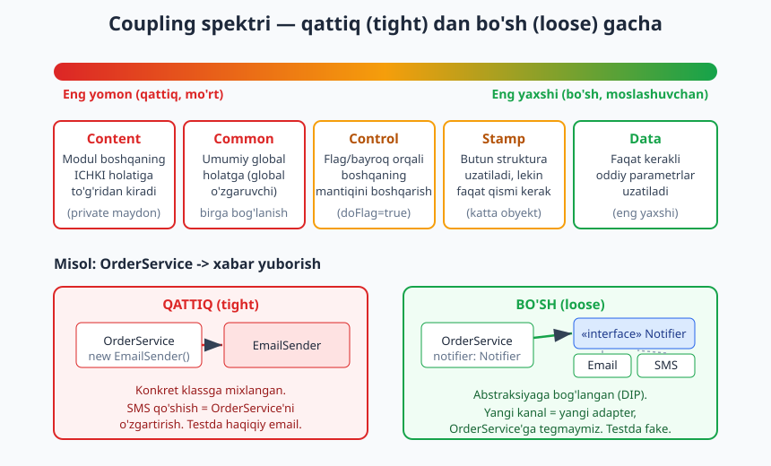
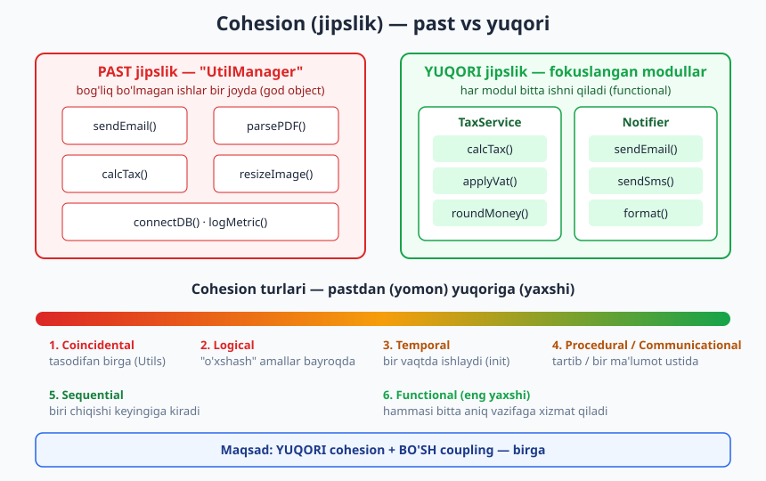
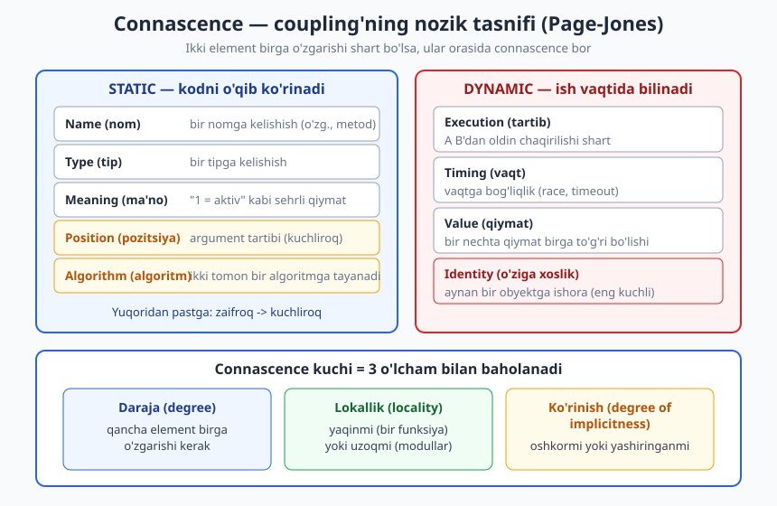

# 04 — Coupling va cohesion (bog'liqlik va jipslik)

[⬅️ Oldingi: 03 — Arxitekturani hujjatlashtirish: C4, UML, ADR](./03-hujjatlash-c4-adr.md) · [🏠 README](./README.md) · [Keyingi: 05 — SOLID printsiplari ➡️](./05-solid.md)

---

> **Bu bobda:** dasturiy dizaynning ikki eng muhim o'lchovini — **coupling** (bog'liqlik: modullar bir-biriga qanchalik mahkam bog'langan) va **cohesion** (jipslik: bitta modul ichidagi qismlar bir-biriga qanchalik aloqador) — chuqur o'rganamiz. Tight (qattiq) va loose (bo'sh) coupling farqini, coupling turlarini (content, common, control, stamp, data), cohesion turlarini (functional dan coincidental gacha), afferent/efferent coupling va instability metrikasini, hamda coupling'ning zamonaviy nozik tasnifi — **connascence** (Page-Jones) — ni ko'rib chiqamiz. Asosiy kod-misol: qattiq bog'langan klassni interfeys + dependency injection orqali bo'sh bog'langanga aylantirish refaktoringi.
>
> **Trade-off eslatmasi / Halollik:** "loose coupling + high cohesion" — kitobning markaziy g'oyasi, lekin u ham mutlaq emas. Haddan tashqari abstraksiya (har joyga interfeys) keraksiz murakkablik tug'diradi — bu ham xarajat. Bu bobdagi kod-misol (TypeScript) **haqiqatan ishga tushirilib tekshirilgan** (natija oxirgi bo'limda); coupling/cohesion turlari va connascence esa baholash uchun **konseptual asboblar** — qattiq formula emas, balki fikrlash ramkasi.

---

## Nega aynan shu ikki tushuncha?

Tasavvur qiling: siz uy quryapsiz. Agar oshxonadagi suv kranini almashtirmoqchi bo'lganingizda **butun uyning vodoprovodini** qayta qurishingiz kerak bo'lsa — bu yomon dizayn. Yaxshi qurilgan uyda kranni alohida burab olib, yangisini o'rnatasiz, qolgan hamma narsa joyida qoladi. Mana shu — **loose coupling**.

Endi tasavvur qiling: bitta xona ham yotoqxona, ham oshxona, ham hammom, ham garaj. Hamma narsa aralash. Bu — **low cohesion** (past jipslik). Yaxshi uyda har xonaning aniq vazifasi bor.

Dasturiy ta'minotda ham xuddi shunday. **Coupling** — modullar orasidagi bog'lar; **cohesion** — bitta modul ichidagi birlik. Bu ikkisi 1970-yillarda Larry Constantine tomonidan kiritilgan, ammo bugun ham dasturiy dizaynning **eng asosiy** o'lchovlari bo'lib qolmoqda. SOLID (05-bob), patternlar (07-09-boblar), qatlamli/hexagonal arxitektura (11-13-boblar) — barchasi, mohiyatan, **coupling'ni kamaytirib, cohesion'ni oshirish** uchun ixtiro qilingan vositalar.

> **Eslatma:** coupling va cohesion — bir-biriga qarama-qarshi emas, balki **mustaqil** ikki o'lchov. Maqsad — ikkalasini birga yaxshilash: modul **ichida** mahkam (high cohesion), modullar **orasida** bo'sh (loose coupling).

---

## 1-qism. Coupling (bog'liqlik)

**Coupling** — bir modul boshqa modul haqida qancha "bilishi" va unga qanchalik bog'liqligi. O'lchov: agar B modulni o'zgartirsangiz, A modulni ham o'zgartirishga (yoki qayta sinashga) majbur bo'lasizmi?

- **Tight (qattiq) coupling:** A B'ning ichki tafsilotlariga mahkam bog'langan. B o'zgarsa — A buziladi. Almashtirib, test qilib, qayta ishlatib bo'lmaydi.
- **Loose (bo'sh) coupling:** A B bilan faqat barqaror, kichik **shartnoma** (interfeys) orqali gaplashadi. B ichini o'zgartirsa — shartnoma saqlangani uchun A sezmaydi.

### Nega loose yaxshi?

Uchta amaliy sabab — har birini eslab qoling:

1. **O'zgartirish (changeability):** bo'sh bog'langan tizimda bitta joyni o'zgartirsangiz, to'lqin boshqa joylarga tarqalmaydi. Tight coupling'da esa bitta o'zgarish o'nlab fayllarga "shrapnel" bo'lib uchadi (buni keyinroq *shotgun surgery* anti-pattern deb ataymiz).
2. **Test (testability):** A faqat interfeysga bog'liq bo'lsa, testda haqiqiy bog'liqlik o'rniga **soxta** (fake/mock) qo'yib, A'ni izolyatsiyada sinash mumkin. Tight coupling'da test qilish uchun ko'pincha butun "olamni" ko'tarish kerak (haqiqiy DB, haqiqiy email...).
3. **Qayta ishlatish (reusability):** bo'sh bog'langan modul kontekstdan mustaqil — uni boshqa loyihaga ham olib o'tish oson.



> **Diqqat:** "loose coupling" — "bog'liqlik umuman yo'q" degani emas. Modullar ishlash uchun **bir-biriga muhtoj** — aks holda tizim emas, bog'lanmagan bo'laklar to'plami bo'lardi. Maqsad — bog'liqlikni **yo'qotish** emas, balki uni **boshqariladigan, barqaror, minimal** qilish.

### Coupling turlari — eng yomondan eng yaxshigacha

An'anaviy klassifikatsiya (Constantine/Yourdon) coupling'ni kuchiga qarab tartiblaydi. Pastdan yuqoriga — yomondan yaxshigacha:

#### 1. Content coupling (eng yomon)

Bir modul boshqasining **ichki, yashirin** holatiga to'g'ridan-to'g'ri kiradi yoki uni o'zgartiradi. Bu eng mo'rt bog'lanish — chunki ichki tafsilot istalgan vaqt o'zgarishi mumkin.

```ts
// ANTI-MISOL: content coupling
class Wallet {
  public balance = 100; // ichki holat ochiq qolgan
}

class Shop {
  pay(w: Wallet, amount: number): void {
    w.balance -= amount; // <-- boshqa obyektning ICHIGA kirib, to'g'ridan o'zgartiradi
  }
}
```

`Shop` `Wallet`ning `balance` maydoni qanday saqlanishini biladi. Agar `Wallet` balansni boshqacha hisoblay boshlasa (masalan, valyuta bilan), `Shop` buziladi. To'g'risi — `Wallet` o'zi metod bersin: `w.withdraw(amount)`.

#### 2. Common coupling (global holat orqali)

Bir nechta modul **umumiy global holatga** (global o'zgaruvchi, singleton, jarayon-bo'ylab umumiy obyekt) bog'lanadi. Birortasi uni o'zgartirsa — boshqalariga sezdirmasdan ta'sir qiladi.

```ts
// ANTI-MISOL: common coupling
let CURRENT_USER: string | null = null; // global holat

function loginModule(name: string): void { CURRENT_USER = name; }
function orderModule(): void {
  // CURRENT_USER'ga yashirin bog'langan — uni kim qachon o'zgartirgani noma'lum
  console.log(`Buyurtma: ${CURRENT_USER}`);
}
```

Bu kontekst (CURRENT_USER) yashirin "tarmoq simi" orqali modullarni bog'laydi — diagrammada ko'rinmaydi, lekin haqiqatda bor. Test qilish ham qiyin: globalni har testdan oldin tozalash kerak.

#### 3. Control coupling (bayroq orqali boshqarish)

Bir modul boshqasiga **bayroq/flag** uzatib, uning ichki **mantiqini boshqaradi**. Chaqiruvchi chaqiriluvchining ichki tarmoqlanishini bilishi shart bo'ladi.

```ts
// ANTI-MISOL: control coupling
function process(data: string, mode: number): string {
  if (mode === 1) return data.toUpperCase();
  if (mode === 2) return data.toLowerCase();
  return data; // chaqiruvchi "sehrli" mode raqamini bilishi shart
}
```

Bu yerda `mode` — control flag. Chaqiruvchi `process` ichida nima bo'lishini boshqarmoqda. Yaxshisi — ikki aniq metod (`toUpper`, `toLower`) yoki strategiya (Strategy pattern, 09-bob).

#### 4. Stamp coupling (butun struktura, lekin qismi kerak)

Modulga **katta butun struktura** uzatiladi, lekin u faqat bir-ikki maydonidan foydalanadi. Bu modul keraksiz narsalarga bog'lanadi.

```ts
interface User { id: number; name: string; email: string; address: string; phone: string; }

// stamp coupling: butun User kerak, lekin faqat email ishlatiladi
function sendWelcome(user: User): void { console.log(`Salom -> ${user.email}`); }

// data coupling (yaxshiroq): faqat kerakli narsa uzatiladi
function sendWelcomeBetter(email: string): void { console.log(`Salom -> ${email}`); }
```

`sendWelcome` butun `User`ga bog'langan — `User`ning istalgan maydoni o'zgarsa, bu funksiya ham qayta ko'rib chiqish doirasiga kiradi, garchi faqat `email` kerak bo'lsa ham.

#### 5. Data coupling (eng yaxshi)

Modullar faqat **kerakli oddiy ma'lumotni** (primitiv yoki minimal struktura) parametr orqali almashadi. Hech kim hech kimning ichini bilmaydi. Bu erishish mumkin bo'lgan eng past, eng sog'lom coupling.

> **Eslatma — folklorni to'g'rilaymiz:** ba'zan "no coupling — eng yaxshi" deyiladi. Bu xato: bog'lanmagan modullar tizim emas. Amaliy maqsad — **data coupling** darajasiga intilish, content/common/control coupling'dan qochish. Bu turlar qat'iy "qonun" emas, balki **sezgirlikni o'tkirlaydigan til** — kodga qarab "bu qaysi turdagi bog'lanish?" deb so'rashga o'rgatadi.

---

## 2-qism. Cohesion (jipslik)

**Cohesion** — bitta modul ichidagi elementlar (metodlar, maydonlar) bir-biriga qanchalik **mantiqan aloqador**, bitta aniq maqsadga qanchalik birga xizmat qiladi.

- **High (yuqori) cohesion:** modul **bitta narsa** qiladi va uni yaxshi qiladi. Ichidagi hamma narsa shu maqsadga ishlaydi. O'qish, o'zgartirish, nomlash oson.
- **Low (past) cohesion:** modul ichida bog'liq bo'lmagan ishlar to'planib qolgan ("god object", "Utils", "Manager", "Helper"). Sababsiz katta, nomlash qiyin, o'zgarishlar ko'p.

Sodda mezon: **modulning nomini ayta olasizmi va u haqiqatan shuni qiladimi?** `TaxCalculator` faqat soliq hisoblasa — high cohesion. `UtilManager` email yuborsa, PDF o'qisa, soliq hisoblasa va rasm o'lchamini o'zgartirsa — low cohesion.



### Cohesion turlari — eng yomondan eng yaxshigacha

Klassik shkala (Stevens/Myers/Constantine) — pastdan yuqoriga:

| # | Tur | Ma'no | Baho |
|---|---|---|---|
| 1 | **Coincidental** | qismlar tasodifan birga (tipik `Utils.js`) | eng yomon |
| 2 | **Logical** | "o'xshash toifa" amallar, bayroq bilan tanlanadi (barcha I/O bitta funksiyada) | yomon |
| 3 | **Temporal** | bir vaqtda bajariladi (masalan, `startup()` ichida hamma narsa ishga tushadi) | o'rtacha |
| 4 | **Procedural** | ma'lum tartibda bajariladi, lekin ma'lumot bog'lanmagan | o'rtacha |
| 5 | **Communicational** | bir xil ma'lumot ustida ishlaydi (bir recorddan o'qib, unga yozadi) | yaxshi |
| 6 | **Sequential** | birining chiqishi keyingisining kirishi (pipeline) | yaxshi |
| 7 | **Functional** | hammasi bitta aniq, yaxlit vazifaga xizmat qiladi | eng yaxshi |

```ts
// PAST cohesion (coincidental): bog'liq bo'lmagan ishlar bir klassda
class UtilManager {
  sendEmail(to: string, t: string) { /* ... */ }
  calcTax(price: number) { /* ... */ }
  resizeImage(path: string) { /* ... */ }
  connectDb() { /* ... */ }
}

// YUQORI cohesion (functional): har klass bitta aniq vazifa
class Notifier { send(to: string, t: string) { /* ... */ } }
class TaxService { calc(price: number) { /* ... */ } }
class ImageProcessor { resize(path: string) { /* ... */ } }
```

> **Anti-pattern — God Object:** hamma narsani "biladigan va qiladigan" ulkan klass. Past cohesion + odatda tight coupling (hamma unga bog'lanadi). Belgilari: 1000+ qator, "Manager"/"Util"/"Helper" nomi, o'nlab bog'liqlik. Davo — mas'uliyatlarni alohida, fokuslangan modullarga ajratish (SRP, 05-bob).

> **Amaliyotda:** "Utils" papkasi — past cohesion'ning eng keng tarqalgan ko'rinishi. `utils/helpers.ts` ichiga sana formatlash, string kesish, valyuta hisoblash, API chaqirish — hammasi tushib qoladi. Yaxshisi: `date/`, `money/`, `text/` kabi maqsadli modullar. "Utils" o'sib boryaptimi — bu jipslik buzilayotganidan signal.

### Cohesion va coupling — bir tanganing ikki tomoni

Diqqat qiling: cohesion'ni oshirsangiz, ko'pincha coupling **o'z-o'zidan** kamayadi. Nega? Modul ichidagi bog'liq narsalar birga turganda, ular orasidagi aloqalar **modul ichida** qoladi (ichki, ko'rinmas), modullar **orasidagi** sirt esa kichrayadi. Aksincha — past cohesion modullarni bir-biriga bog'lanishga majbur qiladi, chunki bitta ishni bajarish uchun bir nechta "har xil" moduldan parcha kerak bo'ladi.

Shuning uchun maqsad **ikkalasini birga**: **LOOSE coupling + HIGH cohesion**. Bu — butun kitobning markaziy g'oyasi va deyarli har bir keyingi printsip/pattern shu ikki kuchni muvozanatlash uchun mavjud.

---

## 3-qism. Coupling'ni o'lchash: Ca, Ce va instability

Coupling'ni faqat "his qilish" emas, **o'lchash** ham mumkin. Robert Martin kiritgan metrikalar (paket/modul darajasida):

- **Afferent coupling (Ca)** — *kiruvchi* bog'liqliklar: nechta tashqi modul **bu** modulga bog'langan ("menga kim muhtoj?").
- **Efferent coupling (Ce)** — *chiquvchi* bog'liqliklar: bu modul nechta tashqi modulga bog'langan ("men kimga muhtojman?").
- **Instability (I)** = `Ce / (Ca + Ce)` — 0 dan 1 gacha.
  - **I ≈ 0** — barqaror (stable): ko'p narsa unga bog'liq, o'zi hech kimga bog'liq emas. O'zgartirish **qimmat** (ko'p joyni buzadi), lekin u **kam o'zgarishi kerak**. Misol: `config`, `utils`, asosiy abstraksiyalar.
  - **I ≈ 1** — beqaror (unstable): hech kim unga bog'liq emas, o'zi ko'pga bog'liq. O'zgartirish **arzon** va u **tez-tez o'zgaradi**. Misol: `main`, kontrollerlar, UI.

> **Esda tuting (eslatma, qonun emas):** sog'lom dizaynda **barqaror modullar abstraktroq**, **beqaror modullar konkretroq** bo'ladi. Konkret va barqaror modul (hamma bog'langan, lekin tez-tez o'zgaradigan) — og'riq manbai. Bu Martin'ning "Stable Dependencies / Stable Abstractions" printsiplari; ularni 10-bob (modullik) da batafsil ko'ramiz.

Quyidagi kod-misolda `instability` formulasini hisoblab ko'rsatamiz (natijasi oxirgi bo'limda).

---

## 4-qism. KOD MISOL — tight coupling'dan loose coupling'gacha refaktoring

Bu — bobning markaziy, **ishga tushiriladigan** misoli. Stsenariy real: **e-commerce / Telegram-bot backend** — foydalanuvchi buyurtma berganda unga xabar yuboramiz.

### Avval: tight coupling (qattiq)

```ts
class EmailSender {
  send(to: string, text: string): void {
    console.log(`[EMAIL->${to}] ${text}`);
  }
}

class OrderServiceTight {
  private mailer = new EmailSender(); // <-- QATTIQ: ichida `new`

  placeOrder(userEmail: string, item: string): void {
    // ... buyurtma mantiqi ...
    this.mailer.send(userEmail, `"${item}" buyurtmangiz qabul qilindi.`);
  }
}
```

Muammolar — `OrderServiceTight` `EmailSender` konkret klassiga **mixlangan**:

1. **O'zgartirish:** SMS qo'shmoqchimisiz? `OrderServiceTight` ichini o'zgartirishingiz shart — bu OCP (Open/Closed, 05-bob) buzilishi.
2. **Test:** `placeOrder`ni sinaganda **haqiqiy** email ketadi (sekin, nazoratsiz, yon ta'sirli). `EmailSender`ni soxtaga almashtira olmaysiz.
3. **Qayta ishlatish:** `OrderServiceTight`ni email-siz kontekstda ishlatib bo'lmaydi.

Connascence tilida: `OrderServiceTight` va `EmailSender` orasida **Connascence of Type** + **Name** bor, va u **uzoq lokallikda** (ikki alohida klass) — demak nisbatan kuchli bog'lanish.

### Keyin: loose coupling (bo'sh) — interfeys + injection

Yechim ikki bosqich:

1. **Abstraksiya kiritamiz** (port/interfeys `Notifier`) — `OrderService` endi konkret klassga emas, shartnomaga bog'lanadi (bu **Dependency Inversion**, DIP, 05-bob).
2. **Bog'liqlikni tashqaridan beramiz** (constructor injection) — `OrderService` ichida `new` yo'q; kim qaysi kanalni ishlatishini **tashqi tomon** hal qiladi.

```ts
// Port (abstraksiya) — OrderService faqat shunga bog'liq
interface Notifier {
  notify(to: string, text: string): void;
}

// Adapterlar — har biri alohida, fokuslangan (high cohesion)
class EmailNotifier implements Notifier {
  notify(to: string, text: string) { console.log(`[EMAIL->${to}] ${text}`); }
}
class SmsNotifier implements Notifier {
  notify(to: string, text: string) { console.log(`[SMS->${to}] ${text}`); }
}

// Testlar uchun soxta — coupling bo'sh bo'lgani uchun arzon
class FakeNotifier implements Notifier {
  public sent: Array<{ to: string; text: string }> = [];
  notify(to: string, text: string) { this.sent.push({ to, text }); }
}

class OrderServiceLoose {
  constructor(private readonly notifier: Notifier) {} // inject, `new` YO'Q

  placeOrder(userContact: string, item: string): void {
    this.notifier.notify(userContact, `"${item}" buyurtmangiz qabul qilindi.`);
  }
}
```

Endi:

```ts
new OrderServiceLoose(new EmailNotifier()).placeOrder("vali@example.com", "Klaviatura");
new OrderServiceLoose(new SmsNotifier()).placeOrder("+998901234567", "Sichqoncha");

// Test: haqiqiy yuborishsiz tekshiramiz
const fake = new FakeNotifier();
new OrderServiceLoose(fake).placeOrder("test@example.com", "Monitor");
console.log(fake.sent.length === 1); // true
```

Diqqat: **SMS qo'shish uchun `OrderServiceLoose`ga teginmadik** — faqat yangi adapter (`SmsNotifier`) yozdik. Bu — loose coupling'ning sovg'asi. Bog'lanish endi eng past, **data coupling** darajasida: `OrderService` faqat `Notifier` shartnomasining ikkita stringini biladi, undan boshqa hech narsani emas.

> **Trade-off:** har bog'liqlik uchun interfeys yaratish ham xarajat — ortiqcha fayl, ortiqcha sath, "interfeys portlashi" (interface explosion). Agar bog'liqlik **hech qachon almashmaydigan** va **tabiatan barqaror** bo'lsa (masalan, til standart kutubxonasidagi `Math`), unga interfeys yasash YAGNI (06-bob) buzilishi. **Qoida:** chegaradagi, almashishi ehtimoliy yoki test qilinishi kerak bo'lgan bog'liqliklarga (DB, tashqi API, email/SMS, soat, fayl tizimi) abstraksiya kerak; sof, barqaror hisob-kitoblarga — shart emas.

---

## 5-qism. Connascence — coupling'ning zamonaviy nozik tasnifi

An'anaviy "content/common/.../data" tasnifi foydali, lekin u **modullar orasidagi** bog'lanishni qo'pol o'lchaydi. Meilir **Page-Jones** taklif qilgan **connascence** ("birga tug'ilish" — lotincha *con + nasci*) — ancha nozik til: **ikki element birga o'zgarishi shart bo'lsa, ular orasida connascence bor**, va uni **turi** hamda **kuchi** bo'yicha baholaymiz.

Connascence ikki katta guruhga bo'linadi: **static** (kodni o'qib ko'rinadi) va **dynamic** (faqat ish vaqtida bilinadi — shuning uchun xavfliroq).



### Static connascence (kodda ko'rinadi)

Zaifroqdan kuchliroqqa:

- **Name (nom):** ikki joy bir nomga kelishadi (o'zgaruvchi, metod nomi). Eng zaif, eng yengil — IDE rename bilan tuzatasiz.
- **Type (tip):** ikki joy bir tipga kelishadi.
- **Meaning (ma'no):** "sehrli qiymat" — `status === 1` "aktiv" degani. Yechim: nomlangan konstanta/enum.
- **Position (pozitsiya):** argumentlar **tartibi** muhim — `createUser(firstName, lastName)`. Ikki stringni adashtirsangiz, kompilyator tutmaydi. Kuchliroq.
- **Algorithm (algoritm):** ikki tomon bir xil algoritmga (masalan, parol heshlash yoki checksum) tayanadi — biri o'zgarsa, ikkinchisi ham o'zgarishi shart.

```ts
// Connascence of Position (mo'rt): tartib muhim, tip bir xil -> kompilyator tutmaydi
function createUser(firstName: string, lastName: string, city: string): string {
  return `${firstName} ${lastName}, ${city}`;
}

// Connascence of Name (mustahkam): nom orqali bog'lanish, tartib ahamiyatsiz
interface UserInput { firstName: string; lastName: string; city: string; }
function createUserNamed(u: UserInput): string {
  return `${u.firstName} ${u.lastName}, ${u.city}`;
}
```

Bu yerda biz pozitsion bog'lanishni (kuchli) nomli bog'lanishga (zaif) **kamaytirdik** — bu connascence bilan ishlashning asosiy amali. Ushbu misol ham probe'da ishga tushirildi (natija oxirda).

### Dynamic connascence (ish vaqtida bilinadi)

Bularni statik tahlil/kompilyator tuta olmaydi — shuning uchun **xavfliroq**:

- **Execution (tartib):** A B'dan oldin chaqirilishi shart (`init()` keyin `use()`).
- **Timing (vaqt):** vaqtga bog'liqlik — race condition, timeout (22-23-boblarda muhim).
- **Value (qiymat):** bir nechta qiymat birga to'g'ri bo'lishi kerak (masalan, `start <= end` invariant ikki maydon orasida).
- **Identity (o'ziga xoslik):** ikki joy **aynan bir** obyektga ishora qilishi shart. Eng kuchli, eng mo'rt.

### Connascence kuchini nima belgilaydi?

Uch o'lcham (refaktoring ustuvorligini shu bilan aniqlaysiz):

1. **Daraja (degree):** qancha element birga o'zgarishi kerak. Ko'proq element — kuchliroq.
2. **Lokallik (locality):** elementlar yaqinmi (bir funksiya ichida) yoki uzoqmi (alohida modullar, hatto alohida servislar). **Uzoq** — kuchliroq, xavfliroq.
3. **Ko'rinish (oshkoralik):** bog'lanish oshkormi yoki yashiringanmi. **Yashirin** — yomonroq.

> **Amaliy ikki qoida (Page-Jones ruhida):** (1) **kuchliroq** connascence'ni **zaifroqqa** aylantiring (pozitsiya -> nom; ma'no -> nomlangan tip). (2) Bog'lanish **uzoqlashgan** sari uni **zaiflashtiring** — bir funksiya ichidagi kuchli bog'lanish unchalik xavfli emas, lekin ikki modul/servis orasidagi kuchli bog'lanish — xavf manbai.

> **Eslatma:** connascence — "content/common/data" tasnifining o'rnini bosadigan dushman emas, balki **aniqroq linza**. Ikkalasi bir g'oyani — "bog'lanishni kamaytir" — turli o'tkirlikda ko'rsatadi. Connascence ayniqsa kod-darajasidagi nozik bog'lanishlarni ko'rishga yordam beradi.

---

## 6-qism. Amaliyotda: bog'liqlik anti-patternlari

Past cohesion va tight coupling birga ikki mashhur "kasallik" ko'rinishida namoyon bo'ladi:

### God Object (xudo-obyekt)

Yuqorida ko'rdik: hamma narsani biladigan, hamma unga bog'langan ulkan klass. Past cohesion + yuqori afferent coupling. Davo: mas'uliyatlarni fokuslangan modullarga ajratish.

### Shotgun Surgery (miltiq jarrohligi)

**Bitta** mantiqiy o'zgarishni amalga oshirish uchun **ko'p** fayl/modulga teginish kerak bo'lishi. Bu — bir g'oya bir nechta joyga **tarqalib ketgani** belgisi (past cohesion: bog'liq mantiq bir joyda emas).

> **Misol:** "valyuta formati" mantiqi 12 ta faylga tarqalgan. Yangi valyuta qo'shsangiz — 12 joyni topib o'zgartirasiz, bittasini unutsangiz — bug. Davo: formatlashni **bitta** yuqori cohesion'li modulga jamlash (`MoneyFormatter`), qolganlar unga bog'lanadi.

> **Anti-pattern — Feature Envy:** metod o'z klassidan ko'ra **boshqa** klassning ma'lumotiga ko'proq qiziqadi (ko'p `other.getX()` chaqiradi). Bu metod noto'g'ri joyda — uni ma'lumot turgan klassga ko'chiring (bu Demeter qonuni bilan bog'liq, 06-bob).

Bu ikki anti-pattern bir-birining oynaga aksi: **shotgun surgery** — bitta o'zgarish ko'p joyga teginadi (past cohesion), **divergent change** — bitta modul ko'p sabab bilan o'zgaradi (SRP buzilishi, 05-bob). Ikkalasi ham cohesion buzilganini ko'rsatadi.

> **Cross-link:** coupling'ni boshqarishning eng kuchli vositalari keyingi boblarda — **SOLID** (05-bob), ayniqsa DIP (bog'liqlikni teskari qilish) va SRP (cohesion'ni oshirish); **modullik va chegaralar** (10-bob), bu yerda Ca/Ce va Stable Dependencies amalda ishlaydi. Patternlar (07-09) ham aksariyat hollarda coupling'ni kamaytirish maqsadida tug'iladi.

---

## Xulosa — eslab qolish kerak bo'lganlar

- **Coupling** — modullar orasidagi bog'lanish; **cohesion** — modul ichidagi birlik. Mustaqil ikki o'lchov.
- Maqsad: **LOOSE coupling + HIGH cohesion** birga. Bu — kitobning markaziy g'oyasi.
- Coupling turlari (yomondan yaxshigacha): content -> common -> control -> stamp -> **data**.
- Cohesion turlari (yomondan yaxshigacha): coincidental -> ... -> **functional**.
- Tight'dan loose'ga: **abstraksiya (interfeys) + injection** (DIP). `new`ni ichkaridan tashqariga chiqar.
- **Ca/Ce, instability** `I = Ce/(Ca+Ce)` — coupling'ni o'lchaydi; barqaror modul abstraktroq bo'lsin.
- **Connascence** — nozikroq linza: kuchli bog'lanishni zaifga, uzoq bog'lanishni yaqinga aylantiring.
- Trade-off: haddan tashqari abstraksiya ham xarajat — chegaralarga abstraksiya, sof hisoblarga shart emas.

---

## Mashqlar

### Oson

**1-mashq.** Quyidagi kodda qaysi coupling turi bor va u nima uchun yomon?

```ts
class Logger { public lines: string[] = []; }
class Service {
  run(log: Logger) { log.lines.push("ishladi"); } // ?
}
```

**2-mashq.** Bu klassning cohesion'i yuqorimi yoki past? Nima uchun? Qanday yaxshilash mumkin?

```ts
class AccountManager {
  hashPassword(p: string) { /* ... */ }
  sendNewsletter(to: string) { /* ... */ }
  calculateInterest(balance: number) { /* ... */ }
}
```

**3-mashq.** `I = Ce/(Ca+Ce)` formulasi bo'yicha hisoblang va izohlang: modul A ga 10 ta boshqa modul bog'langan (Ca=10), A esa 0 ta modulga bog'langan (Ce=0). Instability nechchi? Bu modul barqarormi yoki beqaror?

**4-mashq.** Quyidagi ikki coupling turini eng yomondan eng yaxshigacha tartiblang: `data`, `content`, `control`. Har biriga bir jumlali ta'rif bering.

### O'rta

**5-mashq.** Quyidagi `mode` parametri qaysi coupling turini keltiradi? Uni control coupling'siz qayta yozing (refaktoring g'oyasini yozing, kod shart emas).

```ts
function notify(user: string, mode: "email" | "sms" | "push") { /* if/else mode bo'yicha */ }
```

**6-mashq.** Quyidagi funksiya **stamp coupling**dan aziyat chekadi. Uni **data coupling**ga aylantiring (kod yozing).

```ts
interface Order { id: number; items: string[]; total: number; userEmail: string; createdAt: Date; }
function sendReceipt(order: Order) {
  console.log(`Chek -> ${order.userEmail}: ${order.total} so'm`);
}
```

**7-mashq.** Quyidagi kodda qaysi connascence turi bor (static yoki dynamic? qaysi aniq tur?) va u nega xavfli?

```ts
function configure() { globalThis.dbReady = true; }
function query() { if (!(globalThis as any).dbReady) throw new Error("DB tayyor emas"); }
// query() configure() dan oldin chaqirilsa — buziladi
```

**8-mashq.** `Connascence of Meaning`ga misol keltiring (sehrli qiymat) va uni `Connascence of Name`ga aylantiring (nomlangan konstanta/enum bilan).

**9-mashq.** "Shotgun surgery" va "God object" anti-patternlarini bir-biridan farqlang: qaysi biri cohesion bilan, qaysi biri coupling bilan ko'proq bog'liq? Har biriga real misol keltiring.

### Qiyin

**10-mashq (KOD — refaktoring, ishga tushiring).** Quyidagi tight-coupled `ReportGenerator` ma'lumotni doim konsolga yozadi va sanani konkret `new Date()` bilan oladi (bu testni nondeterministik qiladi). Uni interfeys + injection bilan **loose**ga aylantiring: (a) chiqish maqsadini (`Sink`) inject qiling, (b) soatni (`Clock`) inject qiling. So'ng `FakeSink` + `FixedClock` bilan **haqiqiy konsolsiz va deterministik** test yozing va `npx tsx` da ishga tushiring.

```ts
class ReportGenerator {
  generate(title: string): void {
    const when = new Date().toISOString(); // <-- konkret, testda nondeterministik
    console.log(`[${when}] ${title}`);      // <-- konkret chiqish
  }
}
```

**11-mashq (KOD — connascence).** Quyidagi funksiya **Connascence of Position**dan aziyat chekadi (4 ta bir xil tipdagi argument — adashtirish oson). Uni **Connascence of Name**ga aylantiring (nomlangan maydonli obyekt) va `npx tsx`da tartibni o'zgartirib chaqirib, natija bir xil bo'lishini ko'rsating.

```ts
function makeRange(rmin: number, rmax: number, step: number, count: number): string {
  return `[${rmin}..${rmax}] step=${step} n=${count}`;
}
```

**12-mashq (dizayn).** Telegram-bot backend'ida `OrderService` hozir to'g'ridan-to'g'ri `PostgresClient`, `RedisCache`, `EmailSender` va `TelegramApi`ni `new` qiladi. (a) Bu yerda qaysi coupling muammolari bor? (b) Har bir bog'liqlik uchun abstraksiya kerakmi — yo'qmi, qaror qiling va sababini yozing (trade-off!). (c) Refaktoring qilingan `OrderService` konstruktori qanday ko'rinishini yozing (faqat imzo/signature).

**13-mashq (tahlil).** Sizga 3 ta modul berilgan: `config` (Ca=15, Ce=0), `paymentController` (Ca=0, Ce=8), `moneyUtils` (Ca=9, Ce=2). Har biri uchun instability'ni hisoblang, qaysi biri barqaror/beqaror ekanini ayting, va sog'lom dizaynda qaysi biri **abstraktroq**, qaysi biri **konkretroq** bo'lishi kerakligini izohlang.

---

<details markdown="1">
<summary>Yechimlar</summary>

### 1-mashq yechimi

**Content coupling.** `Service` `Logger`ning ichki `lines` massiviga to'g'ridan-to'g'ri kirib, uni o'zgartiryapti. Yomon, chunki `Logger` ichki saqlashni o'zgartirsa (masalan, faylga yozsa yoki massiv o'rniga buffer ishlatsa), `Service` buziladi. To'g'risi — `Logger` metod bersin: `log.info("ishladi")`, ichki tafsilot yashirin qolsin (inkapsulyatsiya).

### 2-mashq yechimi

**Past cohesion (coincidental/logical).** `AccountManager` uchta **bog'liq bo'lmagan** ishni qiladi: parol heshlash (xavfsizlik), newsletter yuborish (marketing/aloqa), foiz hisoblash (moliya). Bularning birgaligi tasodifiy. Yaxshilash: uchta fokuslangan modulga ajratish — `PasswordHasher`, `Notifier` (yoki `NewsletterService`), `InterestCalculator`. Har biri bitta aniq vazifaga ega bo'ladi (functional cohesion, SRP).

### 3-mashq yechimi

`I = Ce/(Ca+Ce) = 0/(10+0) = 0`. Instability = **0** — bu **maksimal barqaror** (stable) modul. 10 ta modul unga bog'langan, lekin u hech kimga bog'liq emas. Uni o'zgartirish qimmat (10 joyni buzishi mumkin), shuning uchun u **kam o'zgarishi** va **abstrakt/barqaror** bo'lishi kerak (masalan, asosiy interfeys yoki `config`).

### 4-mashq yechimi

Eng yomondan eng yaxshigacha: **content -> control -> data**.

- **content:** bir modul boshqasining ichki holatiga to'g'ridan kiradi (eng yomon, eng mo'rt).
- **control:** bayroq/flag orqali boshqaning ichki mantiqini boshqaradi (o'rtacha).
- **data:** faqat kerakli oddiy ma'lumotni parametr orqali uzatadi (eng yaxshi).

### 5-mashq yechimi

`mode` — **control coupling** (chaqiruvchi `notify` ichidagi tarmoqlanishni boshqaradi). Refaktoring g'oyasi: **Strategy pattern** (09-bob) yoki interfeys + injection. `Notifier` interfeysini yarating (`notify(to, text)`), har kanal uchun alohida adapter (`EmailNotifier`, `SmsNotifier`, `PushNotifier`), va kerakli adapterni tashqaridan inject qiling. Endi `notify` ichida `if/else mode` yo'q — yangi kanal = yangi adapter, mavjud kodga tegmaysiz (OCP). Bu aynan 4-qismdagi refaktoring.

### 6-mashq yechimi

```ts
// Faqat kerakli ma'lumotni uzatamiz -> data coupling
function sendReceipt(userEmail: string, total: number): void {
  console.log(`Chek -> ${userEmail}: ${total} so'm`);
}
// Chaqiruvchi: sendReceipt(order.userEmail, order.total);
```

Endi `sendReceipt` butun `Order`ga emas, faqat ikkita primitiv qiymatga bog'langan. `Order`ning boshqa maydonlari (`items`, `createdAt`...) o'zgarsa, bu funksiya ta'sirlanmaydi.

### 7-mashq yechimi

**Dynamic connascence — Connascence of Execution** (bajarilish tartibi). `query()` `configure()` dan **keyin** chaqirilishi shart, aks holda xato. Xavfli, chunki bu bog'lanish **ish vaqtida** bilinadi — kompilyator/IDE tutmaydi. Bonus: bu yerda **common coupling** ham bor (global `dbReady`). Davo: holatni oshkor qilish — `configure()` tayyor obyekt qaytarsin, `query` esa o'sha obyektni argument qabul qilsin (tartibni tip tizimi majburlaydi).

### 8-mashq yechimi

```ts
// Connascence of Meaning (yomon): "2" nimani anglatishini hamma joy bilishi kerak
if (user.status === 2) { /* ban qilingan */ }

// Connascence of Name (yaxshi): nom orqali bog'lanish, ma'no oshkor
enum UserStatus { Active = "active", Banned = "banned", Pending = "pending" }
if (user.status === UserStatus.Banned) { /* ... */ }
```

Sehrli `2`ni nomlangan `UserStatus.Banned`ga aylantirdik — endi ma'no kodda ko'rinadi va bog'lanish zaifroq (nom darajasi).

### 9-mashq yechimi

- **God object** — ko'proq **cohesion** muammosi (past cohesion: bir klass juda ko'p bog'liqsiz ish qiladi), shuningdek yuqori afferent coupling. Misol: 2000 qatorli `ApplicationManager` — DB, auth, email, hisobot, hammasi ichida.
- **Shotgun surgery** — ko'proq **cohesion**ning teskari ko'rinishi (bog'liq mantiq **tarqalib** ketgan): bitta o'zgarish ko'p faylga teginadi. Misol: "soliq stavkasi" mantiqi 15 ta kontrollerda takrorlangan; stavka o'zgarsa — 15 joy.

Farq: god object — **bir joyda juda ko'p**; shotgun surgery — **bir narsa juda ko'p joyda**. Ikkalasi ham past cohesion belgisi, lekin teskari yo'nalishda.

### 10-mashq yechimi (kod — ishga tushirildi)

```ts
interface Sink { write(line: string): void; }
interface Clock { now(): Date; }

class ConsoleSink implements Sink { write(line: string) { console.log(line); } }
class SystemClock implements Clock { now() { return new Date(); } }

class FakeSink implements Sink {
  public lines: string[] = [];
  write(line: string) { this.lines.push(line); }
}
class FixedClock implements Clock {
  constructor(private readonly fixed: Date) {}
  now() { return this.fixed; }
}

class ReportGenerator {
  constructor(private readonly sink: Sink, private readonly clock: Clock) {}
  generate(title: string): void {
    this.sink.write(`[${this.clock.now().toISOString()}] ${title}`);
  }
}

// Deterministik test — haqiqiy konsolsiz
const sink = new FakeSink();
const clock = new FixedClock(new Date("2026-01-01T00:00:00.000Z"));
new ReportGenerator(sink, clock).generate("Oylik hisobot");

const ok = sink.lines.length === 1 &&
  sink.lines[0] === "[2026-01-01T00:00:00.000Z] Oylik hisobot";
console.log("Test:", ok ? "PASS" : "FAIL");
```

`Sink` va `Clock`ni inject qilib, ikkala konkret bog'liqlikni (konsol, soat) abstraksiya ortiga oldik. Endi test **deterministik** (sana qotirilgan) va **yon ta'sirsiz** (konsolga yozmaydi). Bu misol probe'da ishga tushirilib, `PASS` berdi.

### 11-mashq yechimi (kod — ishga tushirildi)

```ts
interface RangeSpec { min: number; max: number; step: number; count: number; }
function makeRange(s: RangeSpec): string {
  return `[${s.min}..${s.max}] step=${s.step} n=${s.count}`;
}

// Tartibni o'zgartirib chaqiramiz — natija bir xil bo'lishi kerak
const a = makeRange({ min: 0, max: 100, step: 5, count: 21 });
const b = makeRange({ count: 21, step: 5, max: 100, min: 0 });
console.log(a === b ? "PASS (tartib muhim emas)" : "FAIL");
```

Pozitsion 4 ta argumentni (Connascence of Position — adashtirish oson, kompilyator tutmaydi) nomlangan maydonli obyektga (Connascence of Name) aylantirdik. Endi maydon **nomi** bilan bog'lanamiz; tartib ahamiyatsiz. Probe'da `PASS` berdi.

### 12-mashq yechimi (dizayn)

**(a)** `OrderService` to'rtta konkret infratuzilma klassiga `new` orqali mahkam bog'langan (tight coupling). Natija: testda haqiqiy DB/Redis/email/Telegram kerak; birini almashtirib bo'lmaydi; `OrderService` infratuzilma tafsilotlarini "biladi" (DIP buzilishi); cohesion ham pasayadi (biznes mantiq + ulanish boshqaruvi aralashadi).

**(b)** Qaror (trade-off bilan):
- `PostgresClient` -> **`OrderRepository` interfeysi** kerak. DB chegarasi, test/almashtirish ehtimoli yuqori.
- `RedisCache` -> **`Cache` interfeysi** kerak. Tashqi infratuzilma, test'da fake foydali.
- `EmailSender` / `TelegramApi` -> **`Notifier` interfeysi** kerak. Kanal almashishi mumkin, test'da haqiqiy yuborish kerak emas.
- Agar biror sof, barqaror yordamchi bo'lsa (masalan, `OrderId` generatori — toza funksiya) — unga interfeys YAGNI bo'lardi.

**(c)**
```ts
constructor(
  private readonly orders: OrderRepository,
  private readonly cache: Cache,
  private readonly notifier: Notifier,
) {}
```
`new` yo'q; barcha chegara-bog'liqliklar tashqaridan inject. Eslatma: to'rtta o'rniga uchta — `EmailSender` va `TelegramApi` bitta `Notifier` abstraksiyasi ortiga birlashtirildi (sirt kichraydi).

### 13-mashq yechimi (tahlil)

- `config`: `I = 0/(15+0) = 0` -> **maksimal barqaror**. 15 modul unga bog'langan. Sog'lom dizaynda **abstraktroq/barqaror** bo'lishi kerak (kam o'zgaradi).
- `paymentController`: `I = 8/(0+8) = 1` -> **maksimal beqaror**. Hech kim unga bog'liq emas, o'zi 8 modulga bog'liq. **Konkretroq** bo'lishi tabiiy (kontroller — tez-tez o'zgaradi, undan hech narsa bog'liq emas).
- `moneyUtils`: `I = 2/(9+2) = 2/11 ≈ 0.18` -> **ancha barqaror** (9 modul bog'langan, o'zi atigi 2 taga). **Abstraktroq/barqarorroq** bo'lishi maqsadga muvofiq — chunki ko'p narsa unga tayanadi, tez-tez o'zgarsa, 9 joyni buzadi.

Umumiy xulosa: barqaror modullar (config, moneyUtils) abstrakt va kam o'zgaruvchan; beqaror modullar (paymentController) konkret va tez o'zgaruvchan bo'lishi sog'lom. "Konkret + barqaror" (hamma bog'langan, lekin tez o'zgaradigan) — eng og'riqli kombinatsiya.

</details>

---

## Bob hisoboti (kod-verifikatsiya)

Bu bobdagi kod-misollar probe muhitida (`$env:TEMP\arx-probe`, TypeScript 6.0.3 + tsx 4.22, Node v24) **haqiqatan ishga tushirildi va tip-tekshiruvdan o'tdi**.

**1) Asosiy refaktoring (`_v_04.ts`) — `npx tsx _v_04.ts` chiqishi:**

```text
=== 1) TIGHT coupling (faqat email, qotib qolgan) ===
[EMAIL->ali@example.com] "Kitob" buyurtmangiz qabul qilindi.

=== 2) LOOSE coupling (xohlagan kanalni inject qilamiz) ===
[EMAIL->vali@example.com] "Klaviatura" buyurtmangiz qabul qilindi.
[SMS->+998901234567] "Sichqoncha" buyurtmangiz qabul qilindi.

=== 3) Test: FakeNotifier bilan haqiqiy yuborishsiz tekshiramiz ===
Yuborilgan xabarlar soni: 1
Test natijasi: PASS (haqiqiy email yubormay tekshirildi)

=== 4) Instability I = Ce/(Ca+Ce) ===
utils  (Ca=12, Ce=1):  I = 0.08 -> barqaror
config (Ca=8,  Ce=0):  I = 0.00 -> maksimal barqaror
main   (Ca=0,  Ce=9):  I = 1.00 -> maksimal beqaror
```

`npx tsc --noEmit --strict _v_04.ts` -> **toza (xato yo'q)**.

**2) Connascence misoli (`_v_04b.ts`) — `npx tsx _v_04b.ts` chiqishi:**

```text
=== Connascence of Position (mo'rt) ===
Oqil Imomnazarov, Toshkent
Toshkent Oqil, Imomnazarov

=== Connascence of Name (mustahkam) ===
Oqil Imomnazarov, Toshkent
Oqil Imomnazarov, Toshkent

Named: tartib o'zgarsa ham natija bir xil? HA (PASS)
```

`npx tsc --noEmit --strict _v_04b.ts` -> **toza (xato yo'q)**.

Demak: tight->loose refaktoring haqiqatan ishlaydi (SMS qo'shish `OrderService`ga tegmasdan, `FakeNotifier` bilan haqiqiy yuborishsiz test); pozitsion bog'lanishni nomli bog'lanishga aylantirsak, argument tartibi natijaga ta'sir qilmaydi. Instability formulasi ham kutilgan qiymatlarni berdi.

---

[⬅️ Oldingi: 03 — Arxitekturani hujjatlashtirish: C4, UML, ADR](./03-hujjatlash-c4-adr.md) · [🏠 README](./README.md) · [Keyingi: 05 — SOLID printsiplari ➡️](./05-solid.md)
