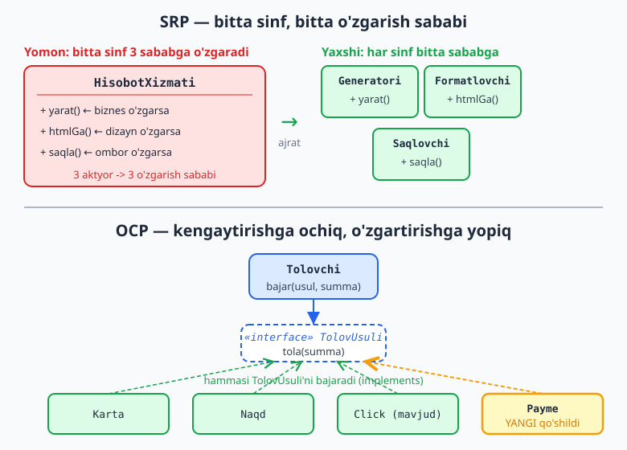
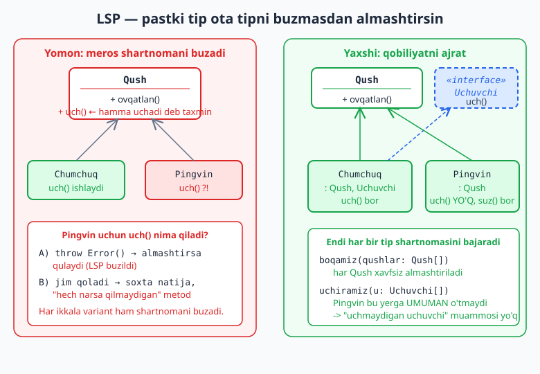
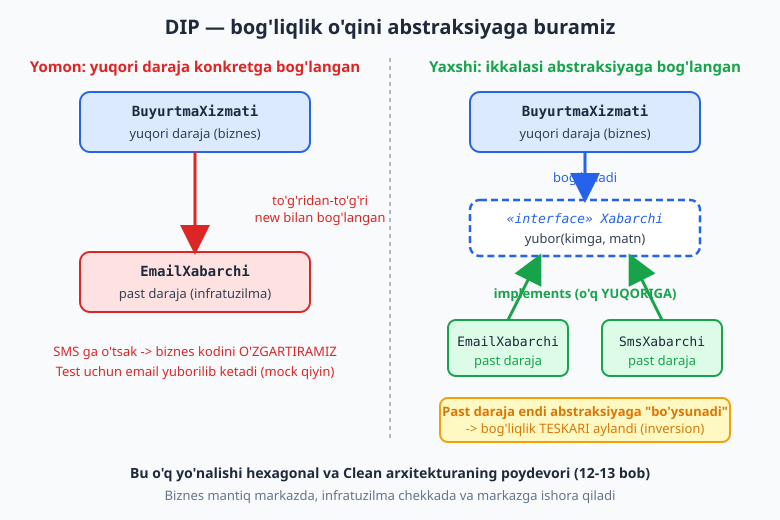

# 05 — SOLID printsiplari

[⬅️ Oldingi: 04 — Coupling va cohesion](./04-coupling-cohesion.md) · [🏠 README](./README.md) · [Keyingi: 06 — Boshqa printsiplar: DRY, KISS, YAGNI ➡️](./06-dry-kiss-yagni.md)

---

> **Bu bobda:** SOLID — obyektga yo'naltirilgan dizaynning beshta printsipi (SRP, OCP, LSP, ISP, DIP). Har birini "nima, nega, qachon" tarzida, **yomon misol ❌ va yaxshi misol ✅** bilan ko'ramiz. Bu printsiplar oldingi bobdagi coupling/cohesion g'oyalarining amaliy ko'rinishi: ularning maqsadi — kodni **o'zgartirishga oson** qilish. Ayniqsa DIP (Dependency Inversion) muhim — u keyinroq o'rganadigan hexagonal va Clean arxitekturaning poydevori (12-13 bob).
>
> **Trade-off eslatmasi / Halollik:** SOLID — **dogma emas, vosita**. Maqsad — kelajakdagi o'zgarishni arzonlashtirish, abstraksiya soni rekordini o'rnatish emas. Har bir printsipni haddan oshirib qo'llash (over-engineering) o'z xatosi. Bu bobdagi barcha TypeScript misollari `$env:TEMP/arx-probe` da `tsc --strict` va `tsx` orqali **haqiqatan ishga tushirib tekshirilgan** — bob oxirida natijalar keltirilgan.

---

## SOLID nima va nega kerak

SOLID — beshta dizayn printsipining bosh harflaridan tuzilgan qisqartma. Ularni 2000-yillarda **Robert C. Martin (Uncle Bob)** mashhur qildi (printsiplarning ayrimlari undan oldin ham mavjud edi — masalan LSP'ni 1988-yilda Barbara Liskov ta'riflagan, OCP'ni Bertrand Meyer kiritgan). "SOLID" so'zini esa Michael Feathers taklif qilgan.

| Harf | Nomi | Bir jumlada |
|---|---|---|
| **S** | Single Responsibility (SRP) | Sinf bitta o'zgarish sababiga ega bo'lsin |
| **O** | Open/Closed (OCP) | Kengaytirishga ochiq, o'zgartirishga yopiq |
| **L** | Liskov Substitution (LSP) | Pastki tip ota tipni buzmasdan almashtirsin |
| **I** | Interface Segregation (ISP) | Kichik, maxsus interfeyslar; ishlatilmaydigan metodga bog'lanma |
| **D** | Dependency Inversion (DIP) | Abstraksiyaga bog'lan, konkret klassga emas |

Lekin eng muhim savol: **nega?** SOLID printsiplarining yagona umumiy maqsadi bor — **o'zgarishga moslashuvchan kod**. Dasturiy ta'minot doim o'zgaradi: yangi talab keladi, biznes qoidasi o'zgaradi, integratsiya almashadi. Yomon dizaynda bitta kichik o'zgarish o'nlab faylga tarqaladi (04-bobdagi **tight coupling**). SOLID — aynan shu tarqalishni kamaytirish texnikasi.

> **Eslatma:** 04-bobni eslang — **loose coupling** (zaif bog'liqlik) va **high cohesion** (yuqori jipslik) yaxshi dizaynning o'lchovi edi. SOLID — o'sha o'lchovlarga erishishning amaliy retsepti. SRP cohesion'ni oshiradi; DIP, OCP, ISP coupling'ni kamaytiradi.

> **Diqqat — SOLID dogma emas.** SOLID'ni "har bir sinf uchun interfeys yarat" deb tushunish — keng tarqalgan xato. Bu over-engineering'ga olib keladi: bitta implementatsiyali interfeys, foydasiz abstraksiya qatlamlari, o'qib bo'lmaydigan kod. To'g'ri yondashuv: **o'zgarish ehtimoli yuqori** joyni moslashuvchan qil, qolganini sodda qoldir. Bu bob har printsipning "qachon **kerak emas**"ligini ham aytadi.

---

## SRP — Single Responsibility (yagona mas'uliyat)

### Ta'rif va eng katta tushunmovchilik

> "Bir sinf o'zgarishi uchun faqat **bitta sabab** bo'lishi kerak." — Robert C. Martin

Bu eng ko'p **noto'g'ri tushuniladigan** printsip. Eng keng tarqalgan xato — "SRP degani sinfda **bitta metod** bo'lishi kerak" deb o'ylash. **Bu noto'g'ri.** SRP metodlar soni haqida emas.

Robert Martin keyinchalik ta'rifni aniqlashtirdi: "bir sinf **bitta aktyor** (manfaatdor tomon, stakeholder) oldida javobgar bo'lsin". Ya'ni: agar sinfingizni **turli sabablarga ko'ra, turli odamlar** (boshqaruv, dizayner, DBA) o'zgartirishni talab qilsa — bu sinf juda ko'p mas'uliyatga ega.

> **Intuitsiya:** o'zingizdan so'rang: "bu sinfni o'zgartirishni **kim** so'raydi?" Agar javob bitta bo'lsa (masalan, faqat marketing bo'limi) — SRP yaxshi. Agar uchta turli bo'lim bo'lsa — sinf uchta sababga bog'langan.

### Yomon misol ❌ — aralashgan mas'uliyatlar

E-commerce loyihasida bitta `HisobotXizmati` sinfi: hisobotni **tuzadi**, uni **HTML formatlaydi**, va **diskka saqlaydi**.

```ts
// ❌ YOMON: bitta sinf 3 ta o'zgarish sababiga ega
class HisobotXizmati {
  // 1) Biznes mantig'i — buxgalteriya o'zgarsa o'zgaradi
  yarat(qatorlar: string[]) { /* hisob-kitob */ }

  // 2) Taqdimot — dizayner HTML'ni o'zgartirsa o'zgaradi
  htmlGa() { /* <h1>...</h1> */ }

  // 3) Saqlash — fayl tizimidan bazaga o'tsak o'zgaradi
  saqla(nom: string) { /* diskka yoz */ }
}
```

Muammo: HTML dizaynini o'zgartirsak — **biznes mantiqli sinfga** tegamiz. Saqlashni bazaga ko'chirsak — yana **shu sinfga** tegamiz. Uch xil sabab, bitta fayl. Bu nima bilan xavfli? Har tegishda regressiya (eski xato qaytishi) xavfi bor, va testlash qiyinlashadi.

### Yaxshi misol ✅ — mas'uliyatlarni ajratish

```ts
// ✅ YAXSHI: har sinf bitta sababga o'zgaradi
interface Hisobot {
  sarlavha: string;
  qatorlar: string[];
}

class HisobotGeneratori {            // sabab: biznes mantig'i
  yarat(qatorlar: string[]): Hisobot {
    return { sarlavha: "Oylik savdo", qatorlar };
  }
}

class HisobotFormatlovchi {          // sabab: taqdimot
  htmlGa(h: Hisobot): string {
    return `<h1>${h.sarlavha}</h1><ul>${h.qatorlar
      .map((q) => `<li>${q}</li>`)
      .join("")}</ul>`;
  }
}

class HisobotSaqlovchi {             // sabab: saqlash mexanizmi
  private xotira = new Map<string, string>();
  saqla(nom: string, mazmun: string): void { this.xotira.set(nom, mazmun); }
  oqi(nom: string): string | undefined { return this.xotira.get(nom); }
}
```

Endi har sinf bitta aktyorga javob beradi. HTML o'zgarsa — faqat `HisobotFormatlovchi`. Saqlash bazaga o'tsa — faqat `HisobotSaqlovchi` (yoki uning yangi varianti). Biznes mantiq daxlsiz qoladi.



> **Amaliyotda:** SRP'ni "ajratish kerakmi?" deb hal qilishda **o'zgarish chastotasi**ga qarang. Agar formatlash va saqlash hech qachon alohida o'zgarmasa (masalan, kichik skriptda) — ularni bitta sinfda qoldirish **to'g'ri**. SRP'ni mexanik qo'llab, har funksiyani alohida sinfga bo'lib chiqish — anemik, sochilib ketgan dizayn (over-engineering). Mas'uliyat = o'zgarish o'qi, satr soni emas.

---

## OCP — Open/Closed (ochiq/yopiq)

### Ta'rif

> "Dasturiy modul **kengaytirishga ochiq**, lekin **o'zgartirishga yopiq** bo'lishi kerak." — Bertrand Meyer

Ma'nosi: yangi xulq qo'shganda **mavjud, sinalgan kodga tegmaslik** kerak. Yangi xususiyatni — yangi kod yozib qo'shamiz, eskisini o'chirib-qayta yozib emas. Bu nega muhim? Chunki ishlab turgan kodga har tegish — yangi xato kiritish xavfi. "Yopiq" — barqarorlik; "ochiq" — o'sish.

Klassik anti-pattern — **uzun `if/else` yoki `switch`** turlar bo'yicha. Har yangi tur qo'shilganda shu `switch`ga yana bitta `case` qo'shasiz. Bu OCP'ni buzadi.

### Yomon misol ❌ — har yangi to'lov turi switch'ni o'zgartiradi

```ts
// ❌ YOMON: yangi tur = mavjud metodni TAHRIRLASH
class Tolovchi {
  tola(usul: string, summa: number): string {
    if (usul === "karta") return `Kartadan ${summa} yechildi`;
    else if (usul === "naqd") return `${summa} naqd qabul qilindi`;
    // "click" qo'shish uchun -> shu metodni OCHIB tahrirlaymiz ❌
    else throw new Error("Noma'lum usul");
  }
}
```

Telegram-bot to'lov tizimida yangi provayder (Click, Payme, Uzum) qo'shilsa — har safar shu `tola` metodini ochib, yana bitta `else if` qo'shamiz. Metod o'sib, "ochiq jarrohlik"ga aylanadi va har tahrirda boshqa to'lov turlarini buzish xavfi paydo bo'ladi.

### Yaxshi misol ✅ — strategiya / polimorfizm

Har to'lov turini umumiy interfeysni bajaruvchi **alohida sinf** qilamiz:

```ts
// ✅ YAXSHI: yangi tur = yangi sinf, mavjud kod O'ZGARMAYDI
interface TolovUsuli {
  nom: string;
  tola(summa: number): string;
}

class Karta implements TolovUsuli {
  nom = "karta";
  tola(summa: number) { return `Kartadan ${summa} so'm yechildi`; }
}
class Naqd implements TolovUsuli {
  nom = "naqd";
  tola(summa: number) { return `${summa} so'm naqd qabul qilindi`; }
}
// Yangi usul — Tolovchi'ga TEGMASDAN qo'shildi:
class Click implements TolovUsuli {
  nom = "click";
  tola(summa: number) { return `Click orqali ${summa} so'm to'landi`; }
}

class Tolovchi {
  // Bu sinf "yopiq" — endi hech qachon o'zgarmaydi
  bajar(usul: TolovUsuli, summa: number): string {
    return usul.tola(summa);
  }
}
```

`Payme` qo'shmoqchimisiz? Yangi sinf yozasiz, `Tolovchi`ga **umuman tegmaysiz**. Mana shu — "kengaytirishga ochiq, o'zgartirishga yopiq".

> **Trade-off:** OCP bepul emas. Har bir abstraksiya (interfeys) — qo'shimcha murakkablik. Agar to'lov turlari **hech qachon ko'paymasa** (va shunday qolishi aniq bo'lsa), oddiy `switch` ham yetarli. OCP'ni **o'zgarish kelishi ehtimoli yuqori** o'qda qo'llang. Hamma narsani oldindan abstraktlash — **YAGNI** buzilishi (06-bobda). Qoida: "uchinchi marta `case` qo'shayotgan bo'lsangiz — strategiyaga o'ting".

> **Eslatma:** OCP'ni amalga oshirishning eng keng tarqalgan yo'li — **Strategy** patterni (09-bob). Yuqoridagi `TolovUsuli` aslida Strategy'ning aynan o'zi. DIP bilan birga, OCP design patternlarning ko'pchiligi asosida yotadi.

---

## LSP — Liskov Substitution (Liskov almashtiruvi)

### Ta'rif

> "Agar S tipi T tipining pastki tipi bo'lsa, T tipidagi obyektlarni S tipidagi obyektlar bilan **dasturni buzmasdan** almashtirish mumkin bo'lishi kerak." — Barbara Liskov (1988)

Oddiy tilda: **pastki sinf (subclass) ota sinfning shartnomasini bajarishi shart.** Agar funksiya `Qush` qabul qilsa, unga **istalgan** `Qush` (jumladan pingvin) berilganda ham to'g'ri ishlashi kerak — kutilmagan xato bermasdan.

LSP buzilishi odatda meros (inheritance) noto'g'ri ishlatilganda yuzaga keladi: "X — bu Y" deb meros qildik, lekin X aslida Y'ning hamma va'dasini bajara olmaydi.

### Yomon misol ❌ — uchmaydigan "uchuvchi" (Pingvin-Qush)

```ts
// ❌ YOMON: Qush bazasiga uch() qo'yib, hamma qush uchadi deb taxmin qildik
abstract class Qush {
  abstract uch(): string;   // <- bu yerda buzilish urug'i
  abstract ovqatlan(): string;
}

class Chumchuq extends Qush {
  uch() { return "Chumchuq uchdi"; }
  ovqatlan() { return "don yedi"; }
}

class Pingvin extends Qush {
  uch() { throw new Error("Pingvin ucholmaydi!"); } // ❌ shartnomani buzdi
  ovqatlan() { return "baliq yedi"; }
}

function hammasiniUchiramiz(qushlar: Qush[]) {
  for (const q of qushlar) q.uch(); // Pingvin kelsa -> qulaydi!
}
```

`hammasiniUchiramiz` funksiyasi har `Qush` ucha oladi deb ishonadi. Lekin `Pingvin` kelganda exception otadi — dastur **buziladi**. `Pingvin` `Qush`'ni xavfsiz **almashtira olmadi** — LSP buzildi. Muqobil "yechim" — `uch()`ni bo'sh qoldirish — yana yomon: soxta, jim natija (no-op), bu yanada chigal xatolarga olib keladi.

### Yaxshi misol ✅ — qobiliyatni ajratish

Muammoning ildizi: **uchish — har qushning xususiyati emas.** Demak uni bazaga emas, alohida **qobiliyat interfeysi**ga chiqaramiz:

```ts
// ✅ YAXSHI: umumiy baza faqat ROST umumiy xulqni saqlaydi
abstract class Qush {
  constructor(public nom: string) {}
  abstract ovqatlan(): string;     // har qush ovqatlanadi — ROST umumiy
}

interface Uchuvchi {               // uchish — alohida qobiliyat
  uch(): string;
}

class Chumchuq extends Qush implements Uchuvchi {
  ovqatlan() { return `${this.nom} don yedi`; }
  uch() { return `${this.nom} uchdi`; }
}

class Pingvin extends Qush {        // Uchuvchi'ni IMPLEMENT QILMAYDI
  ovqatlan() { return `${this.nom} baliq yedi`; }
  suz() { return `${this.nom} suzdi`; }
}

function hammasiniBoqamiz(qushlar: Qush[]): string[] {
  return qushlar.map((q) => q.ovqatlan());   // har Qush xavfsiz
}
function faqatUchuvchilar(u: Uchuvchi[]): string[] {
  return u.map((x) => x.uch());              // Pingvin bu yerga UMUMAN o'tmaydi
}
```

Endi `Pingvin`ni `faqatUchuvchilar`ga berib bo'lmaydi — kompilyator ruxsat bermaydi. "Uchmaydigan uchuvchi" muammosi **ildizdan** yo'qoladi.



> **Diqqat — Kvadrat/To'rtburchak paradoksi.** LSP'ning eng mashhur misoli: matematikada kvadrat — to'rtburchakning xususiy holi, demak `Kvadrat extends Tortburchak` mantiqiy ko'rinadi. Lekin to'rtburchakda `eniniOzgartir(5)` faqat enini o'zgartiradi; kvadratda esa **ikkala tomonni** o'zgartirishga majbur — bu "to'rtburchak hulqi"ni buzadi. Funksiya `Tortburchak` kutib, `eni=5, boyi=4` deb yuza 20 chiqishini kutsa, kvadrat 16 yoki 25 qaytaradi. **Saboq:** "real dunyoda X — bu Y" har doim "kod meros"ini oqlamaydi. Yechimini Mashqlar bo'limida ko'ramiz.

> **Amaliyotda:** LSP buzilishini sezishning belgilari — pastki sinfda `throw new Error()`, bo'sh override (no-op), yoki `if (obj instanceof Pingvin)` kabi tip tekshiruvlar. Bularni ko'rsangiz — meros iyerarxiyasini qayta ko'rib chiqing. Ko'pincha yechim: meros o'rniga **kompozitsiya** yoki **interfeys ajratish** (06-bobdagi "meros o'rniga kompozitsiya").

---

## ISP — Interface Segregation (interfeysni ajratish)

### Ta'rif

> "Mijozlarni ular **ishlatmaydigan** metodlarga bog'lanishga majburlamang." — Robert C. Martin

Ma'nosi: bitta **semiz interfeys** (ko'p metodli) o'rniga, bir nechta **kichik, maxsus** interfeyslar tuzing. Shunda har mijoz faqat o'ziga kerakli metodlarga bog'lanadi.

Nega muhim? Agar interfeysingizda 10 ta metod bo'lsa va sinf faqat 3 tasini ishlatsa — qolgan 7 tasini ham **bajarishga majbur** (odatda bo'sh yoki `throw` bilan — bu LSP'ni ham buzadi). Bundan tashqari, interfeysning ishlatilmaydigan qismi o'zgarsa, sizning sinfingiz ham qayta kompilyatsiya/qayta test bo'ladi — keraksiz bog'liqlik.

### Yomon misol ❌ — semiz interfeys

```ts
// ❌ YOMON: hamma "ishchi" ovqatlanadi va uxlaydi deb taxmin
interface Ishchi {
  ishla(): string;
  ovqatlan(): string;
  uxla(): string;
}

class Odam implements Ishchi {
  ishla() { return "ishladi"; }
  ovqatlan() { return "tushlik qildi"; }
  uxla() { return "uxladi"; }
}

class Robot implements Ishchi {
  ishla() { return "24/7 ishladi"; }
  ovqatlan() { throw new Error("Robot ovqatlanmaydi"); } // ❌ majburiy, ma'nosiz
  uxla() { throw new Error("Robot uxlamaydi"); }         // ❌
}
```

`Robot` `Ishchi`'ga bog'langani uchun `ovqatlan` va `uxla`ni ham **bajarishga majbur** — garchi ular mantiqsiz bo'lsa ham. Bu `throw` lar yana LSP'ni buzadi.

### Yaxshi misol ✅ — kichik maxsus interfeyslar

```ts
// ✅ YAXSHI: har qobiliyat — alohida kichik interfeys
interface Ishlovchi { ishla(): string; }
interface Ovqatlanuvchi { ovqatlan(): string; }

class OdamIshchi implements Ishlovchi, Ovqatlanuvchi {
  ishla() { return "Odam ishladi"; }
  ovqatlan() { return "Odam tushlik qildi"; }
}

class RobotIshchi implements Ishlovchi {
  // Faqat o'ziga keraklisi — ovqatlanishga BOG'LANMAYDI
  ishla() { return "Robot 24/7 ishladi"; }
}

function smenanIshlat(ishchilar: Ishlovchi[]): string[] {
  return ishchilar.map((i) => i.ishla());  // Odam ham, Robot ham mos
}
```

Endi `smenanIshlat` faqat `Ishlovchi`'ga bog'langan, ovqatlanishga emas. `RobotIshchi` ma'nosiz metodlarni bajarmaydi. Kerak bo'lsa, sinf bir nechta kichik interfeysni birga bajaradi (`OdamIshchi`).

> **Eslatma:** ISP — bu SRP'ning **interfeyslar darajasidagi** ko'rinishi. SRP "sinf bitta sababga", ISP "interfeys bitta rolga" deydi. Ikkalasi ham bir g'oyaga xizmat qiladi: keraksiz bog'liqlikni yo'qotish.

> **Trade-off:** Interfeyslarni juda mayda bo'lakka bo'lib yuborish ham yomon — yuzlab bir metodli interfeys kodni o'qishni qiyinlashtiradi. **Rol** bo'yicha guruhlang: bir-biri bilan doim birga ishlatiladigan metodlar bitta interfeysda qolsin. ISP "interfeyslar mayda bo'lsin" emas, "mijoz **ishlatmaydigan**ga bog'lanmasin" deydi.

---

## DIP — Dependency Inversion (bog'liqlik inversiyasi)

### Ta'rif — eng muhim printsip

> "(a) Yuqori darajali modullar past darajali modullarga bog'lanmasin; **ikkalasi ham abstraksiyaga** bog'lansin. (b) Abstraksiyalar detallarga bog'lanmasin; **detallar abstraksiyaga** bog'lansin." — Robert C. Martin

Bu printsipni tushunish uchun ikki tushuncha kerak:

- **Yuqori daraja** — biznes mantig'i, "nima qilish kerak" (masalan `BuyurtmaXizmati`).
- **Past daraja** — texnik detal, "qanday qilish kerak" (masalan `EmailXabarchi`, baza, fayl).

Odatdagi (yomon) bog'liqlik: yuqori daraja pastdan foydalanadi, demak unga **to'g'ridan-to'g'ri** bog'lanadi. DIP buni **teskari aylantiradi** ("inversion"): o'rtaga **abstraksiya** (interfeys) qo'yamiz va **ikkala daraja ham o'sha abstraksiyaga** bog'lanadi. Endi past daraja abstraksiyaga "bo'ysunadi".

### Yomon misol ❌ — biznes mantiq konkret klassga bog'langan

```ts
// ❌ YOMON: yuqori daraja KONKRET EmailXabarchi'ni o'zi yaratadi
class EmailXabarchi {
  yubor(kimga: string, matn: string) { return `EMAIL -> ${kimga}: ${matn}`; }
}

class BuyurtmaXizmati {
  private xabarchi = new EmailXabarchi();  // ❌ qattiq bog'langan (new)
  tasdiqla(mijoz: string) {
    return this.xabarchi.yubor(mijoz, "Buyurtmangiz qabul qilindi");
  }
}
```

Muammolar:
1. **SMS**ga o'tmoqchi bo'lsak — biznes sinfini (`BuyurtmaXizmati`) **o'zgartiramiz**. OCP ham buzildi.
2. **Test**: `BuyurtmaXizmati`ni tekshirsak, har test haqiqiy email yuborib yuboradi — buni "soxta" (mock) bilan almashtirish mumkin emas, chunki `new` ichkarida qotib qolgan.

### Yaxshi misol ✅ — abstraksiyaga bog'lanish + injection

```ts
// ✅ YAXSHI: ikkala daraja ham Xabarchi abstraksiyasiga bog'langan
interface Xabarchi {
  yubor(kimga: string, matn: string): string;
}

class EmailXabarchi implements Xabarchi {
  yubor(kimga: string, matn: string) { return `EMAIL -> ${kimga}: ${matn}`; }
}
class SmsXabarchi implements Xabarchi {
  yubor(kimga: string, matn: string) { return `SMS -> ${kimga}: ${matn}`; }
}

class BuyurtmaXizmati {
  // Konkretga EMAS, Xabarchi abstraksiyasiga bog'langan.
  // Bog'liqlik TASHQARIDAN beriladi (dependency injection):
  constructor(private xabarchi: Xabarchi) {}
  tasdiqla(mijoz: string): string {
    return this.xabarchi.yubor(mijoz, "Buyurtmangiz qabul qilindi");
  }
}

const emailBilan = new BuyurtmaXizmati(new EmailXabarchi());
const smsBilan = new BuyurtmaXizmati(new SmsXabarchi());
```

Endi `BuyurtmaXizmati` **`Xabarchi`ni qanday bajarilishini bilmaydi** — faqat shartnomani biladi. SMS'ga o'tish — biznes kodiga **tegmasdan**, faqat `new BuyurtmaXizmati(new SmsXabarchi())`. Test esa endi oson:

```ts
// Test uchun soxta (mock) — biznes kodiga TEGMASDAN ulanadi
class SoxtaXabarchi implements Xabarchi {
  yuborilganlar: string[] = [];
  yubor(kimga: string, matn: string) {
    const yozuv = `MOCK ${kimga}:${matn}`;
    this.yuborilganlar.push(yozuv);
    return yozuv;
  }
}
const soxta = new SoxtaXabarchi();
new BuyurtmaXizmati(soxta).tasdiqla("Davron");
// soxta.yuborilganlar.length === 1  -> haqiqiy email yubormasdan tekshirildi
```



> **Diqqat — DIP ≠ DI.** Ikki tushunchani aralashtirmang. **DIP (Dependency Inversion Principle)** — dizayn *printsipi*: "abstraksiyaga bog'lan". **DI (Dependency Injection)** — *texnika*: bog'liqlikni tashqaridan (konstruktor orqali) berish. DI — DIP'ga erishishning bir usuli, lekin ular sinonim emas. DI konteyneri (Spring, NestJS) — shunchaki bu uzatishni avtomatlashtiruvchi vosita.

> **Amaliyotda:** DIP — bu **butun arxitektura** poydevori, faqat sinf darajasidagi hiyla emas. Diagrammadagi o'q yo'nalishiga e'tibor bering: infratuzilma (past daraja) markazga (abstraksiyaga) ishora qiladi. Aynan shu g'oya **hexagonal arxitektura** (portlar va adapterlar, 12-bob) va **Clean Architecture**'ning (13-bob) "dependency rule"i: bog'liqlik o'qi **doim ichkariga**, biznes mantig'iga qaratilgan. Biznes mantiq baza, framework, tashqi API'ni **bilmaydi** — ular abstraksiya orqali ulanadi. SOLID'dan tizim arxitekturasiga ko'prik aynan shu yerda.

---

## SOLID birga ishlaydi

Bu printsiplar alohida emas, **birga** ishlaydi va ko'pincha biri ikkinchisini qo'llab-quvvatlaydi:

- **DIP + OCP** — abstraksiyaga bog'lanish yangi implementatsiya qo'shishni oson qiladi (yopiq sinf, ochiq kengayish).
- **ISP + LSP** — kichik, to'g'ri interfeyslar "uchmaydigan uchuvchi" kabi shartnoma buzilishlarining oldini oladi.
- **SRP + ISP** — biri sinf darajasida, biri interfeys darajasida bir xil maqsadga (keraksiz bog'liqlikni kesish) xizmat qiladi.

Yagona umumiy maqsad — bobning boshida aytganimiz: **o'zgarishni arzonlashtirish**. Har bir printsipni qo'llashdan oldin so'rang: "bu yerda o'zgarish kelishi ehtimoli bormi? Bu abstraksiya o'sha o'zgarishni arzonlashtiradimi?" Agar javob "yo'q" bo'lsa — sodda qoldiring.

> **Anti-pattern — SOLID over-engineering.** Eng keng tarqalgan SOLID xatosi — printsiplarni mexanik, kontekstsiz qo'llash: har sinf uchun interfeys (ko'pincha bitta implementatsiyali), har funksiya uchun alohida sinf, beshta qatlam abstraksiya. Natija — "AbstractFactoryProviderManagerImpl" jahannami: o'qib bo'lmaydigan, kuzatib bo'lmaydigan kod. **SOLID o'qishni osonlashtirishi kerak, qiyinlashtirishi emas.** Agar abstraksiya hech qanday haqiqiy o'zgarishni arzonlashtirmasa — u faqat shovqin (06-bobdagi **YAGNI** va **KISS** bilan muvozanat saqlang).

---

## Mashqlar

> Yechimlardagi barcha TS kod `arx-probe` muhitida `tsc --strict` va `tsx` orqali ishga tushirib tekshirilgan.

### Oson

1. **Harflarni esla.** SOLID — bu qaysi beshta printsip? Har biriga bir jumlali ta'rif yozing (qaramasdan).
2. **Tushunmovchilikni tuzat.** Hamkasbingiz "SRP degani har sinfda faqat bitta metod bo'lishi" deydi. U nimada yanglishyapti? To'g'ri ta'rifni ayting.
3. **Printsipni top.** Quyidagi kod qaysi SOLID printsipini buzadi?
   ```ts
   class Hisobotchi {
     hisobla() { /* ... */ }
     pdfGa() { /* ... */ }
     emailYubor() { /* ... */ }
   }
   ```
4. **DIP yoki DI?** "Bog'liqlikni konstruktor orqali berish" — bu DIP printsipimi yoki DI texnikasimi? Farqini ayting.

### O'rta

5. **Switch'ni ayblang.** Quyidagi kod qaysi printsipni buzadi va nega?
   ```ts
   function narx(turi: string, asos: number): number {
     if (turi === "oddiy") return asos;
     if (turi === "vip") return asos * 0.9;
     if (turi === "bayram") return asos * 0.8;
     throw new Error("Noma'lum tur");
   }
   ```
6. **OCP'ga refaktor qiling (KOD).** 5-mashqdagi `narx` funksiyasini OCP'ga moslang: har chegirma turini alohida sinf qiling, shunda yangi tur qo'shganda mavjud kod o'zgarmasin. Kodni yozing.
7. **ISP buzilishini top.** Bir interfeysda `chop()`, `skanerla()`, `faksYubor()` metodlari bor. Oddiy printer faqat `chop()`ni qila oladi. Qaysi printsip buziladi, qanday tuzatasiz?
8. **DIP bilan ulang (KOD).** `RoyxatdanOtkazish` sinfi foydalanuvchini saqlashi kerak, lekin u **qayerda** saqlanishini (xotira, baza) bilmasligi kerak. `FoydalanuvchiRepozitoriysi` interfeysi va bitta xotira-implementatsiyasini yozing, ularni DI bilan ulang.

### Qiyin

9. **Kvadrat/To'rtburchak (KOD).** `Kvadrat extends Tortburchak` merosi LSP'ni nega buzadi — kod bilan ko'rsating. So'ng LSP'ni buzmaydigan **muqobil dizayn**ni (meros o'rniga) yozing.
10. **Telegram-bot to'lov tizimi (dizayn).** Botingizda Click, Payme, Uzum to'lov provayderlari bor; ertaga yana ikkitasi qo'shilishi mumkin. Qaysi SOLID printsiplari bu yerda eng muhim? Komponentlarni va abstraksiyalarni qisqacha loyihalang (kod yoki diagramma-matn).
11. **Anti-misolni tuzating.** Quyidagi sinf **bir vaqtning o'zida bir necha** SOLID printsipini buzadi. Qaysilarini, va qanday refaktor qilasiz?
    ```ts
    class UserManager {
      saveToMySQL(u: User) { /* SQL */ }
      sendWelcomeEmail(u: User) { /* SMTP */ }
      validatePassword(p: string) { /* regex */ }
      renderProfileHTML(u: User) { /* HTML */ }
    }
    ```
12. **Qachon SOLIDni QO'LLAMASLIK kerak?** Bir martalik 30 qatorlik skript yozyapsiz (CSV o'qib, jami chiqaradi, qayta ishlatilmaydi). SOLID'ni to'liq qo'llash kerakmi? Javobingizni "trade-off" tilida asoslang.
13. **DIP -> arxitektura (konseptual).** DIP'dagi "bog'liqlik o'qini teskari aylantirish" g'oyasi hexagonal/Clean arxitekturada qanday kattalashtiriladi? Bog'liqlik o'qi qaysi tomonga qaragan bo'lishi kerak va nega?

---

<details markdown="1">
<summary>Yechimlar</summary>

### 1-mashq yechimi
- **S — SRP:** sinf bitta o'zgarish sababiga (bitta aktyorga) ega bo'lsin.
- **O — OCP:** kengaytirishga ochiq, o'zgartirishga yopiq (yangi kod qo'sh, eskini tahrirlama).
- **L — LSP:** pastki tip ota tipni dasturni buzmasdan almashtira olsin.
- **I — ISP:** mijoz ishlatmaydigan metodlarga bog'lanmasin; kichik maxsus interfeyslar.
- **D — DIP:** abstraksiyaga bog'lan, konkretga emas; ikkala daraja ham abstraksiyaga.

### 2-mashq yechimi
Hamkasb **SRP'ni metod soni** bilan chalkashtiryapti. SRP **metodlar soni haqida emas** — bitta sinfda o'nlab metod bo'lishi mumkin, agar ularning hammasi bitta mas'uliyatga (bitta o'zgarish sababiga, bitta aktyorga) xizmat qilsa. To'g'ri ta'rif: "sinf o'zgarishi uchun faqat bitta sabab bo'lsin". Ko'rsatkich — "bu sinfni o'zgartirishni **kim** so'raydi?" Agar bir nechta turli manfaatdor tomon bo'lsa, SRP buzilgan.

### 3-mashq yechimi
**SRP buziladi.** `Hisobotchi` uchta turli sababga o'zgaradi: `hisobla()` (biznes mantig'i), `pdfGa()` (taqdimot/format), `emailYubor()` (xabar yuborish infratuzilmasi). Uch aktyor, uch sabab. Yechim: `HisobotGenerator`, `PdfFormatlovchi`, `XabarYuboruvchi` ga ajratish.

### 4-mashq yechimi
Bu **DI (Dependency Injection) texnikasi** — bog'liqlikni tashqaridan, konstruktor orqali uzatish. **DIP** esa printsip: "abstraksiyaga bog'lan". DI — DIP'ga erishish usullaridan biri, lekin agar konstruktorga **konkret klass** uzatsangiz (`new BuyurtmaXizmati(new EmailXabarchi())` da tip `EmailXabarchi` bo'lsa), DI bor, DIP yo'q. DIP uchun uzatilayotgan narsa **interfeys/abstraksiya** bo'lishi shart.

### 5-mashq yechimi
**OCP buziladi.** Har yangi chegirma turi (`student`, `qishki` ...) qo'shilganda shu funksiyani **ochib, tahrirlash** kerak — "o'zgartirishga yopiq" emas. Qo'shimcha: turlar ko'paygani sayin `if` zanjiri o'sib, test qilish va o'qish qiyinlashadi.

### 6-mashq yechimi (ishga tushirib tekshirilgan)
```ts
interface ChegirmaQoidasi {
  qollanadimi(summa: number): boolean;
  hisobla(summa: number): number;
}
class OddiyMijoz implements ChegirmaQoidasi {
  qollanadimi() { return true; }
  hisobla(summa: number) { return summa; }
}
class VipMijoz implements ChegirmaQoidasi {
  qollanadimi(summa: number) { return summa > 0; }
  hisobla(summa: number) { return summa * 0.9; }
}
class BayramAksiya implements ChegirmaQoidasi {
  qollanadimi(summa: number) { return summa >= 100000; }
  hisobla(summa: number) { return summa * 0.8; }
}
class Kassa {
  // Yangi qoida qo'shilsa Kassa O'ZGARMAYDI (OCP)
  yakuniyNarx(summa: number, qoida: ChegirmaQoidasi): number {
    return qoida.qollanadimi(summa) ? qoida.hisobla(summa) : summa;
  }
}
// yakuniyNarx(100000, new VipMijoz())    -> 90000
// yakuniyNarx(100000, new BayramAksiya()) -> 80000
```
Endi yangi `QishkiAksiya` qo'shish — yangi sinf, `Kassa`ga tegmaysiz. Bu **Strategy** patterni (09-bob).

### 7-mashq yechimi
**ISP buziladi** (qo'shimcha — LSP ham, agar `OddiyPrinter` `skanerla()`/`faksYubor()`ni `throw` qilsa). Oddiy printer `skanerla()` va `faksYubor()`ga **bog'lanishga majbur**, garchi ularni qila olmasa. Yechim — semiz interfeysni ajratish:
```ts
interface Chopuvchi { chop(): void; }
interface Skanerlovchi { skanerla(): void; }
interface Fakslovchi { faksYubor(): void; }
class OddiyPrinter implements Chopuvchi { chop() {} }
class CtotamasaMFP implements Chopuvchi, Skanerlovchi, Fakslovchi {
  chop() {} skanerla() {} faksYubor() {}
}
```

### 8-mashq yechimi (ishga tushirib tekshirilgan)
```ts
interface Foydalanuvchi { id: number; ism: string; }

interface FoydalanuvchiRepozitoriysi {
  saqla(f: Foydalanuvchi): void;
  topId(id: number): Foydalanuvchi | undefined;
}
// Konkret adapter (DIP'da "detal abstraksiyaga bo'ysunadi")
class XotiraRepozitoriysi implements FoydalanuvchiRepozitoriysi {
  private jadval = new Map<number, Foydalanuvchi>();
  saqla(f: Foydalanuvchi) { this.jadval.set(f.id, f); }
  topId(id: number) { return this.jadval.get(id); }
}
// Yuqori daraja — faqat ABSTRAKSIYAGA bog'langan
class RoyxatdanOtkazish {
  constructor(private repo: FoydalanuvchiRepozitoriysi) {}  // DI
  otkaz(ism: string): Foydalanuvchi {
    const f = { id: Math.floor(Math.random() * 1e6), ism };
    this.repo.saqla(f);
    return f;
  }
}
const xizmat = new RoyxatdanOtkazish(new XotiraRepozitoriysi());
```
Ertaga `PostgresRepozitoriysi` yozsangiz — `RoyxatdanOtkazish`ga tegmaysiz, faqat konstruktorga boshqa adapter berasiz. Bu DIP + Repository patterni (14-bobdagi DDD'da kengayadi).

### 9-mashq yechimi (ishga tushirib tekshirilgan)
**Nega buziladi:** `Kvadrat extends Tortburchak` da kvadrat enini o'zgartirsangiz, bo'yini ham o'zgartirishga majbur (kvadrat tomonlari teng). Funksiya `Tortburchak` qabul qilib, `eni=5, boyi=4 -> yuza=20` deb kutsa, kvadrat bu shartnomani buzadi (16 yoki 25 qaytaradi). Pastki tip ota tip xulqini buzdi -> LSP buzildi.

**LSP'ni buzmaydigan muqobil** — meros emas, umumiy interfeys + o'zgarmas (immutable) shakllar:
```ts
interface Shakl { yuza(): number; }
class Tortburchak implements Shakl {
  constructor(private eni: number, private boyi: number) {}
  yuza() { return this.eni * this.boyi; }
}
class Kvadrat implements Shakl {
  constructor(private tomon: number) {}
  yuza() { return this.tomon * this.tomon; }
}
function umumiyYuza(shakllar: Shakl[]): number {
  return shakllar.reduce((s, sh) => s + sh.yuza(), 0);
}
// umumiyYuza([new Tortburchak(2,3), new Kvadrat(4)]) -> 6 + 16 = 22
```
Endi "enini o'zgartir" kabi xavfli mutatsiya yo'q; ikkalasi ham faqat `yuza()` shartnomasini bajaradi va xavfsiz almashtiriladi.

### 10-mashq yechimi (namunaviy + muqobillar)
Bu yerda **DIP, OCP, ISP** eng muhim. Namunaviy dizayn:
```text
interface TolovProvayderi {
  tola(summa: number, mijoz: string): TolovNatija
}
ClickProvayderi   implements TolovProvayderi
PaymeProvayderi   implements TolovProvayderi
UzumProvayderi    implements TolovProvayderi

TolovXizmati  -> TolovProvayderi (abstraksiyaga bog'langan, DI bilan)
```
- **OCP/Strategy:** yangi provayder = yangi sinf, `TolovXizmati`ga tegmaysiz.
- **DIP:** bot biznes mantig'i konkret Click SDK'siga emas, `TolovProvayderi`ga bog'langan -> test uchun `SoxtaProvayder` ulanadi (haqiqiy pul harakatisiz).
- **ISP:** agar ba'zi provayderlar "qaytarib berish" (refund) qila olsa, ba'zilari yo'q — `Qaytaruvchi` interfeysini alohida ajrating, hammasini bitta semiz interfeysga tiqmang.

**Muqobil/trade-off:** agar provayderlar atigi bitta bo'lsa va o'zgarmasligi aniq bo'lsa — bu abstraksiya ortiqcha (YAGNI). Lekin "ertaga yana ikkitasi qo'shiladi" deyilgani uchun bu yerda abstraksiya **oqlanadi**. Real bot misolini [tgbot-js kitobida](../tgbot-js/README.md) ko'rishingiz mumkin.

### 11-mashq yechimi
`UserManager` kamida **SRP va DIP** ni buzadi (potensial OCP ham):
- **SRP:** to'rt sabab bir sinfda — saqlash (DBA), email (infra), validatsiya (biznes), HTML (dizayn).
- **DIP:** `saveToMySQL` konkret MySQL'ga, `sendWelcomeEmail` konkret SMTP'ga qattiq bog'langan — abstraksiya yo'q, test qilib bo'lmaydi.

Refaktor:
```text
UserRepository (interface)     <- MySqlUserRepository implements
EmailSender    (interface)     <- SmtpEmailSender implements
PasswordValidator              (alohida sinf, biznes qoidasi)
UserView                       (HTML render, alohida)
RegisterUser (use case)  -> UserRepository, EmailSender, PasswordValidator (DI)
```
Har biri bitta mas'uliyat (SRP), biznes konkret texnologiyani bilmaydi (DIP). Bu — 13-bobdagi Clean Architecture "use case" tuzilishiga olib boradigan yo'l.

### 12-mashq yechimi
**Yo'q, to'liq qo'llash shart emas — bu trade-off.** SOLID'ning narxi — qo'shimcha abstraksiya, ko'proq fayl, ko'proq murakkablik. Uning **foydasi** — kelajakdagi o'zgarishni arzonlashtirish. Bir martalik, qayta ishlatilmaydigan 30 qatorlik skriptda **kelajakdagi o'zgarish yo'q**, demak foyda nolga teng, narx esa qoladi. Bu holda SOLID'ni to'liq qo'llash — **over-engineering**, **YAGNI** va **KISS** buzilishi (06-bob). To'g'ri qaror: sodda, to'g'ridan-to'g'ri kod yozing. SOLID — o'zgarish ehtimoli yuqori, uzoq yashaydigan kod uchun vosita.

### 13-mashq yechimi
DIP'dagi "o'qni teskari aylantirish" tizim darajasida **dependency rule**ga kattalashadi: bog'liqlik o'qi **doim ichkariga, biznes mantig'iga** qaragan bo'lishi kerak. Hexagonal (12-bob)'da biznes "olti burchak" markazda; tashqi dunyo (UI, baza, API) — **adapterlar**, ular **portlar** (interfeyslar) orqali ichkariga ulanadi. Clean Architecture (13-bob)'da entity va use case markazda; framework, DB, web — tashqi halqada va **markazga** ishora qiladi. Nega? Chunki biznes mantig'i — eng barqaror, eng qimmatli qism; u baza yoki framework o'zgarsa **o'zgarmasligi** kerak. Demak bog'liqlik undan tashqariga emas, **unga tomon** yo'naltiriladi — bu aynan DIP, faqat butun tizim miqyosida.

</details>

---

[⬅️ Oldingi: 04 — Coupling va cohesion](./04-coupling-cohesion.md) · [🏠 README](./README.md) · [Keyingi: 06 — Boshqa printsiplar: DRY, KISS, YAGNI ➡️](./06-dry-kiss-yagni.md)
