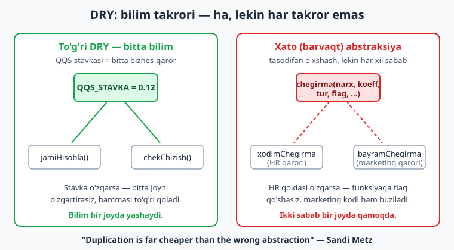
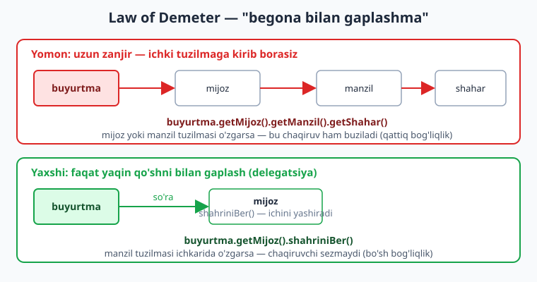
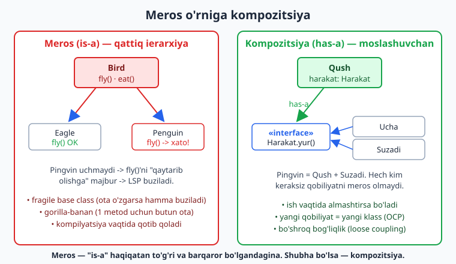

# 06 — Boshqa printsiplar: DRY, KISS, YAGNI, SoC

[⬅️ Oldingi: 05 — SOLID printsiplari](./05-solid.md) · [🏠 README](./README.md) · [Keyingi: 07 — Yaratuvchi patternlar ➡️](./07-creational-patterns.md)

---

> **Bu bobda:** SOLID'dan keyingi, lekin undan kam emas — kundalik dizaynni boshqaradigan printsiplar to'plamini ko'rib chiqamiz. **DRY** (takrorlama) — ammo nimani? Bu bobning eng muhim nuansi: DRY *kodni* emas, *bilimni* takrorlamaslik haqida, va noto'g'ri qo'llangan DRY (barvaqt abstraksiya) takrordan ko'ra qimmatroq turadi. **KISS** (sodda tut) va **YAGNI** (kerak bo'lmaguncha qo'shma) bilan over-engineering'ga qarshi turamiz. **Separation of Concerns** (masalalarni ajratish) modullik poydevorini qo'yadi. **Law of Demeter** ortiqcha zanjirni kesadi. Va nihoyat — **meros o'rniga kompozitsiya**: nega "is-a" ko'pincha tuzoq, va qanday qilib qobiliyatni "ulash" moslashuvchanroq.
>
> **Trade-off eslatmasi / Halollik:** bu printsiplar **dogma emas** — ularning har biri muvozanat talab qiladi. DRY'ni juda erta qo'llasangiz noto'g'ri abstraksiya yaratasiz; KISS'ni mutlaqlashtirsangiz kerakli moslashuvchanlikni yo'qotasiz. Bobdagi TypeScript namunalari (`_v_06.ts`) `npx tsx` bilan **haqiqatan ishga tushirilgan** va `tsc --strict` bilan tip-tekshirilgan — natijalar real. Qarorlarning o'zi (qachon DRY qo'llash kerak) esa kontekstga bog'liq — biz ularni mezon sifatida beramiz, "har doim shunday qil" deb emas.

---

## Nega SOLID'dan keyin yana printsiplar?

05-bobda SOLID — beshta nomli, kuchli, lekin biroz "akademik" printsipni ko'rdik. Amaliyotda esa siz kuniga o'nlab mayda qarorlar qabul qilasiz: *bu ikki funksiyani birlashtiraymi? bu yangi parametrni qo'shaymi? bu metod zanjiri normalmi?* Mana shu qarorlar uchun bizga **engilroq, intuitiv** mezonlar kerak. DRY, KISS, YAGNI, SoC va Law of Demeter — aynan shular.

Ularning umumiy maqsadi bitta: **murakkablikni boshqarish**. Yomon arxitektura kamdan-kam bitta katta xato bo'ladi; u ko'pincha minglab "mayda, mantiqiy ko'ringan" qarorlarning yig'indisi — har biri alohida zararsiz, lekin birgalikda *big ball of mud* (loy to'pi). Bu printsiplar — har bir mayda qaror oldida o'zingizga beradigan savollardir.

> **Eslatma:** bu printsiplarning hech biri "qonun" emas (Law of Demeter ham, nomiga qaramay, qattiq qonun emas — bu *uslubiy ko'rsatma*). Ular — **evristika**: ko'p hollarda to'g'ri yo'lni ko'rsatadigan, lekin kontekst talab qilsa chetga chiqish mumkin bo'lgan tavsiyalar.

---

## DRY — Don't Repeat Yourself

DRY — ehtimol eng ko'p tilga olinadigan va eng ko'p **noto'g'ri tushuniladigan** printsip. Uni Andy Hunt va Dave Thomas "The Pragmatic Programmer" kitobida quyidagicha ta'rifladilar:

> "Har bir bilim parchasi tizimda **yagona, aniq, vakolatli** ko'rinishga ega bo'lishi kerak."

Diqqat qiling: bu yerda "kod" so'zi yo'q. Gap **bilim** (knowledge) haqida — biznes-qoida, qaror, formula, ma'lumot strukturasi. DRY aytadiki: bitta *qaror* tizimda bir nechta joyda yashasa, ularning biri o'zgarganda boshqalari "eskirib qoladi" va sizda nomuvofiqlik (xato) paydo bo'ladi.

### Klassik misol: takrorlangan biznes-qoida

Tasavvur qiling, e-commerce backendingizda QQS (qo'shilgan qiymat solig'i) stavkasi 12%. Siz uni ikki joyda yozdingiz:

```ts
// ❌ WET (Write Everything Twice): 12% ikki joyda qotib qolgan
function hisobKitob(narx: number): number {
  return narx + narx * 0.12; // QQS — shu yerda
}
function chek(narx: number): number {
  return narx * 0.12; // QQS — yana shu yerda
}
```

Ertaga davlat QQS'ni 15%'ga oshirsa, siz `hisobKitob`'ni yangilaysiz, lekin `chek`'ni unutasiz. Endi mijoz cheki bilan haqiqiy hisob-kitob bir-biriga to'g'ri kelmaydi — bu **bug**, va uni topish qiyin, chunki kod "ishlayapti", faqat noto'g'ri.

To'g'ri DRY — bilimni (12% — bu *bitta soliq qarori*) bitta joyga jamlash:

```ts
// ✅ DRY: stavka — yagona haqiqat manbai (single source of truth)
const QQS_STAVKA = 0.12;
const qqsHisobla = (narx: number): number => narx * QQS_STAVKA;
const jamiHisobla = (narx: number): number => narx + qqsHisobla(narx);
```

Endi stavka o'zgarsa — bitta qatorni o'zgartirasiz, butun tizim avtomatik to'g'ri qoladi.

> **Eslatma:** bu probe'da ishga tushirildi. `hisobKitob(1000)` -> `1120`, `chek(1000)` -> `120`; DRY versiya ham aynan `1120` va `120` beradi. Farq natijada emas — **kelajakdagi o'zgarishga chidamlilikda**.

### DRY haddan oshganda — eng muhim dars

Mana endi bu bobning eng qimmatli qismi. Ko'pchilik dasturchi DRY'ni shunday tushunadi: *"ikki qator kod o'xshasa — birlashtir"*. Bu **xato**. Ba'zan ikki kod parchasi *tasodifan* o'xshaydi, lekin ularning *sabablari* har xil. Ularni birlashtirsangiz, siz ikkita mustaqil narsani bir-biriga **bog'lab** qo'yasiz.

```ts
// Ikkalasi HOZIR bir xil ko'rinadi — lekin SABABLARI butunlay boshqa
function xodimChegirma(narx: number): number {
  return narx * 0.9; // xodimga 10% — bu HR/kadrlar qarori
}
function bayramChegirma(narx: number): number {
  return narx * 0.9; // bayramga 10% — bu marketing qarori
}
```

"DRY!" deb hayqirib, ularni birlashtirasiz:

```ts
// ⚠️ Barvaqt abstraksiya — ikki sababni bitta joyga qamadi
function chegirma(narx: number, koeff: number): number {
  return narx * koeff;
}
```

Bir-ikki oy o'tib, HR aytadi: "xodim chegirmasi endi staj asosida — 3 yildan oshganlarga 15%". Endi siz `chegirma`'ga `staj` parametri qo'shasiz... lekin u marketing chaqiruvini ham buzadi. Keyin marketing aytadi: "bayram chegirmasi faqat soat 18:00'dan keyin". Yana parametr. Tez orada `chegirma(narx, koeff, staj, vaqt, mijozTuri, ...)` — hech kim tushunmaydigan, `if`'larga to'la **noto'g'ri abstraksiya** paydo bo'ladi.



Bu hodisani **AHA** deb atashadi — *Avoid Hasty Abstractions* (shoshilinch abstraksiyalardan qoching), Kent C. Dodds ommalashtirgan. Sandi Metz esa eng mashhur jumla bilan ifodalagan:

> **"Duplication is far cheaper than the wrong abstraction."**
> (Takror — noto'g'ri abstraksiyadan ancha arzon.) — Sandi Metz

Mantiq oddiy: takror — *ko'rinadigan* muammo. Siz uni ko'rasiz va kerak bo'lganda tuzatasiz. Noto'g'ri abstraksiya esa — *yashirin* muammo. U "to'g'ri ish qilyapman" tuyg'usini beradi, lekin har yangi talab bilan u qiyofasizlanib boradi, va undan qutulish (de-abstract qilish) odatda abstraksiya yaratishdan qiyinroq.

> **Amaliyotda:** ikki kod o'xshaganda o'zingizdan so'rang — *"agar talab bittasini o'zgartirsa, ikkinchisi ham xuddi shunday o'zgarishi SHARTMI?"* Ha bo'lsa — bu bitta bilim, DRY qiling. Yo'q bo'lsa — bu tasodifiy o'xshashlik (incidental duplication), tinch qo'ying. Qoida: **"birinchi takror — toqat qil, ikkinchi — sezgi bilan kuzat, uchinchi — abstraksiya haqida o'yla"** (rule of three).

> **Anti-pattern:** har takrorni darhol funksiyaga chiqarish, ya'ni *premature DRY*. Belgisi: ko'p `boolean` flag parametrlari (`render(x, true, false, true)`), "umumiy" funksiya ichida bir-biriga aloqasiz `if` shoxlari, yoki "bu funksiya nima qiladi?" degan savolga bir gap bilan javob berolmaslik.

DRY'ni faqat kodga emas, **butun tizimga** qo'llang: ma'lumot sxemasi (bitta haqiqat manbai), konfiguratsiya, hujjat va kod o'rtasidagi takror (kod o'zgaradi, hujjat eskiradi), test ma'lumotlari. Eng xavfli takror — *kishilarning boshidagi* takror: ikki jamoa bir xil biznes-qoidani mustaqil amalga oshirsa.

---

## KISS — Keep It Simple

KISS — *"Keep It Simple, Stupid"* (sodda tut). G'oya: **eng oddiy ishlaydigan yechim odatda eng yaxshisi**. Murakkablik — dushman, chunki u o'qish, sinash, o'zgartirish va xato qidirishni qiyinlashtiradi.

Bu yerda muhim farqni ajrating:

- **Tasodifiy murakkablik** (accidental complexity) — bizning yomon qaror, ortiqcha abstraksiya, "chiroyli" lekin keraksiz patternlardan kelib chiqadi. Buni KISS yo'q qiladi.
- **Mohiyatli murakkablik** (essential complexity) — masalaning o'zida bor (masalan, soliq hisob-kitobi haqiqatan murakkab). Buni yo'qotib bo'lmaydi, faqat boshqarish mumkin.

KISS mohiyatli murakkablikni inkor etmaydi — u faqat *o'zimiz qo'shadigan* tasodifiy murakkablikka qarshi.

```ts
// ❌ "Aqlli" — lekin nima qilishini darrov tushunib bo'lmaydi
const juftmi = (n: number): boolean =>
  !((n & 1) as unknown as boolean) ? true : ![n % 2].includes(1);

// ✅ Sodda — niyat darhol o'qiladi
const juft = (n: number): boolean => n % 2 === 0;
```

Ikkalasi ham ishlaydi. Lekin birinchisi — *zukkolik ko'rgazmasi*; ikkinchisi — *muhandislik*. Kod bir marta yoziladi, lekin o'nlab marta o'qiladi. O'qish uchun yozing.

> **Diqqat:** KISS "primitiv yoz" degani emas. Ba'zan sodda yechim — bu yaxshi tanlangan abstraksiya yoki pattern (07-09 boblar). Soddalik — bu *minimal tushunarlilik*, *minimal kod* emas. 200 qatorli ravshan kod, 20 qatorli sirli koddan KISS'roq bo'lishi mumkin.

---

## YAGNI — You Aren't Gonna Need It

YAGNI — Extreme Programming'dan (Kent Beck, Ron Jeffries) kelgan: **kerak bo'lguncha funksiya yoki moslashuvchanlik qo'shmang**. "Kelajakda kerak bo'lar" deb qo'shilgan kod ko'pincha *hech qachon* kerak bo'lmaydi — lekin u hoziroq murakkablik, bug va qo'llab-quvvatlash yukini keltiradi.

Klassik misol — "balki keyin boshqa ma'lumot bazasi kerak bo'lar" deb beshta abstraksiya qatlami qurish, holbuki sizda hozir bitta PostgreSQL bor va yaqin orada o'zgarishi ehtimoli yo'q:

```text
// Over-engineering (YAGNI buzilishi):
IRepositoryFactoryProvider -> AbstractRepositoryFactory
  -> IUserRepository -> SqlUserRepositoryAdapter -> ...
// Hozirgi ehtiyoj: foydalanuvchini saqlash va o'qish. Tamom.
```

YAGNI aytadi: hozirgi, *aniq* talabni yeching. Kelajak talab paydo bo'lganda — refactor qiling (test'lar bilan himoyalangan kod buni xavfsiz qiladi). Ko'pincha "kelajak" siz tasavvur qilganidan boshqacha keladi, demak oldindan qurilgan abstraksiya baribir mos kelmaydi.

> **Trade-off:** YAGNI murosasiz emas. Ba'zi qarorlar *keyin o'zgartirish qimmat* (one-way door) — masalan, ma'lumotlar bazasi sxemasi, public API shartnomasi, autentifikatsiya modeli. Bularga oldindan o'ylash *o'rinli*. Arzon qaytariladigan qarorlarda (two-way door) esa — YAGNI: keyin o'zgartirasiz. Savol: *"bu qarorni keyin o'zgartirish qancha turadi?"*

> **Anti-pattern:** *speculative generality* (taxminiy umumiylik) — hech kim so'ramagan "konfiguratsiyalanuvchanlik", ishlatilmaydigan abstrakt klasslar, "har ehtimolga qarshi" parametrlar. Belgisi: faqat bitta amalga oshirishi bo'lgan interfeyslar, "TODO: kelajakda" izohlar, hech qachon chaqirilmaydigan kod yo'llari.

---

## KISS + YAGNI + DRY muvozanati

Bu uchtasi ba'zan **bir-biriga qarshi tortadi** — va aynan shu kuchlanishni boshqarish muhandislikning mohiyatidir.

- **DRY** sizni abstraksiyaga *undaydi* (takrorni yo'q qil).
- **YAGNI** va **KISS** sizni abstraksiyadan *tortib oladi* (kerak bo'lmasa qo'shma, sodda tut).

Ziddiyatni *AHA* hal qiladi: **takrorni darhol yo'q qilishga shoshilmang** (KISS/YAGNI), lekin *haqiqiy* bilim takrorini ko'rganingizda — ayniqsa uchinchi marta — uni jamlang (DRY). Ya'ni: DRY'ni *kech* qo'llang, abstraksiya o'zining "shaklini" ko'rsatganidan keyin.

> **Amaliyotda:** yangi kod yozayotganda KISS+YAGNI ustun bo'lsin — sodda, to'g'ridan-to'g'ri, takror bo'lsa ham mayli. Kod *barqarorlashgach* va takror namunasi *aniqlashgach*, DRY bilan tozalang. "Make it work, make it right, make it fast" (avval ishlat, keyin to'g'rila, oxirida tezlat — Kent Beck) — shu tartibda. Avvaldan "right" va "fast" deb shoshilmang.

---

## Separation of Concerns — masalalarni ajratish

SoC — *Separation of Concerns* (masalalarni ajratish): har bir modul, qatlam yoki komponent **bitta masala** (concern) bilan shug'ullansin. "Masala" — bu tizimga ta'sir qiluvchi alohida tashvish: ma'lumotni saqlash, biznes-mantiq, foydalanuvchi interfeysi, autentifikatsiya, loglash.

SoC — SRP'ning (05-bobdagi Single Responsibility) kattaroq, arxitektura darajasidagi ko'rinishi. SRP bitta *sinf* haqida bo'lsa, SoC butun *tizim tuzilmasi* haqida.

Klassik buzilish — biznes-mantiq, ma'lumotlar bazasi va HTML chiqishi bitta funksiyada:

```ts
// ❌ Uch masala bir joyda aralashgan
function foydalanuvchiSahifa(id: number): string {
  const row = db.query("SELECT * FROM users WHERE id = " + id); // ma'lumot kirishi + SQL injection!
  const chegirma = row.vip ? row.balans * 0.1 : 0;              // biznes-mantiq
  return `<h1>${row.ism}</h1><p>Chegirma: ${chegirma}</p>`;     // taqdimot (HTML)
}
```

Bu funksiyani sinab bo'lmaydi (baza kerak), qayta ishlatib bo'lmaydi (HTML qotib qolgan), va xavfsiz emas. SoC bilan uch masalani ajratamiz:

```text
data qatlami      ->  UserRepository.byId(id)      // faqat ma'lumot kirishi
domain qatlami    ->  chegirmaHisobla(user)         // faqat biznes-mantiq
presentation      ->  renderUserPage(user, discount) // faqat chiqish
```

Har biri alohida sinaladi, qayta ishlatiladi va o'zgartiriladi. Bu — qatlamli arxitekturaning (11-bob), hexagonal'ning (12-bob) va modullikning (10-bob) poydevori. SoC'ni bu yerda *kirish* sifatida ko'ramiz; chuqurroq — keyingi qismlarda.

> **Eslatma:** SoC "qancha ko'p qatlam, shuncha yaxshi" degani emas. Ortiqcha ajratish — o'zi murakkablik (YAGNI). Maqsad — *o'zgarish sabablari* har xil bo'lgan narsalarni ajratish, har bir mayda narsani emas.

---

## Law of Demeter — "begona bilan gaplashma"

Law of Demeter (LoD, "Demeter qonuni") — *eng kam bilim printsipi* (principle of least knowledge). G'oyasi: obyekt faqat **yaqin qo'shnilari** bilan "gaplashishi" kerak — ichki ichki tuzilmalarga kirib bormasligi kerak. Mashhur metafora: *"do'stlaring bilan gaplash, begonalar bilan emas"*.

Amalda LoD buziladi, qachonki siz **uzun metod zanjiri** yozsangiz:

```ts
// ❌ LoD buzilishi: ichki tuzilmaga kirib borasiz
const shahar = buyurtma.getMijoz().getManzil().getShahar();
```

Bu yerda `buyurtma` `mijoz`'ni, u `manzil`'ni, u `shahar`'ni biladi degan **ichki bilimni** chaqiruvchi koddan talab qilyapsiz. Endi `Mijoz` yoki `Manzil` tuzilmasi o'zgarsa (masalan, `manzil` endi ro'yxat bo'lsa), bu chaqiruv ham buziladi — garchi u to'g'ridan-to'g'ri ular bilan ishlamasa ham. Bu **qattiq bog'liqlik** (tight coupling).



Yechim — **delegatsiya** (delegation): obyektning o'zi kerakli ma'lumotni bersin, ichini ochmasin:

```ts
class Mijoz {
  constructor(private readonly manzil: Manzil) {}
  // Mijoz o'z manzilini "begonaga" bermaydi — kerakli ma'lumotni o'zi qaytaradi
  shahriniBer(): string {
    return this.manzil.shahar;
  }
}
// Endi chaqiruvchi faqat o'z qo'shnisi bilan gaplashadi:
const shahar = buyurtma.getMijoz().shahriniBer();
```

> **Diqqat — muhim nuans:** LoD *fluent interface*'larni (zanjir-uslub API) taqiqlamaydi. `query.where(...).orderBy(...).limit(...)` qonuniy — chunki har chaqiruv **bir xil obyektni** (yoki bir xil turdagi builder'ni) qaytaradi, siz *boshqa* obyektlarning ichiga kirmaysiz. LoD buzilishi — bu har bosqichda **boshqa-boshqa** obyektga o'tib, ularning ichki tuzilmasiga tayanish. "Train wreck" (`a.b().c().d()` har xil tur) — yomon; "fluent builder" (bir tur) — yaxshi.

> **Trade-off:** LoD'ni mutlaqlashtirsangiz — har obyektga o'nlab "o'tkazgich" (wrapper) metodlar qo'shasiz (`shahriniBer`, `pochtaIndeksiniBer`, ...), bu ham yuk. Maqsad — *muhim* ichki tuzilmalarni yashirish, har biror maydaga metod yasash emas. Ko'pincha "begona zanjir" — bu obyekt noto'g'ri joyga qo'yilgan mas'uliyat belgisi (Feature Envy).

---

## Composition over inheritance — meros o'rniga kompozitsiya

Bu — amaliy dizaynda eng ta'sirli printsiplardan biri, GoF kitobida ("Design Patterns", 1994) ham qayd etilgan: **"favour object composition over class inheritance"** (klass merosidan ko'ra obyekt kompozitsiyasini afzal ko'r).

### Meros nima va nega tuzoq

Meros (inheritance) — `is-a` ("...dir") munosabati: `Eagle` — bu `Bird`. U kuchli, lekin **qattiq** vositadir, va bir nechta jiddiy muammosi bor.

**1-muammo: fragile base class** (mo'rt asos klass). Ota klassni o'zgartirsangiz, undan meros olgan *barcha* bolalar buzilishi mumkin — siz ularni ko'rmasangiz ham. Meros — eng *qattiq* bog'liqlik turi: bola ota klassning *amalga oshirilishiga* (nafaqat interfeysiga) bog'lanadi.

**2-muammo: LSP buzilishi (gorilla-banan).** Ota klass barcha bolalarga *barcha* metodlarini "majburan" beradi:

```ts
abstract class Bird {
  fly(): string { return `${this.nom} uchmoqda`; }
  eat(): string { return `${this.nom} ovqatlanmoqda`; }
  constructor(public readonly nom: string) {}
}
class PenguinInherit extends Bird {
  override fly(): string {
    throw new Error("Pingvin ucha olmaydi!"); // ota shartnomasini buzdik (LSP buzilishi)
  }
}
```

Pingvin uchmaydi, lekin u `Bird`'dan `fly()`'ni meros oldi — endi uni "qaytarib olishga" majburmiz. Bu **Liskov Substitution** buzilishi (05-bob): `PenguinInherit`'ni `Bird` o'rniga qo'ysangiz, `fly()` chaqirgan kod kutilmaganda qulaydi.

Erik Raymond buni **"gorilla-banan muammosi"** deb atagan: *"siz bananni so'radingiz, lekin gorillani ham, butun o'rmonni ham birga oldingiz"* — ya'ni bitta metodni meros olish uchun butun ota ierarxiyasini olib kelishingiz kerak.

### Kompozitsiya — qobiliyatni "ulash"

Kompozitsiya — `has-a` ("...ga ega") munosabati: `Qush` *harakat qobiliyatiga* ega. Qobiliyatni alohida obyekt qilib, uni "ulaymiz":

```ts
interface Harakat {
  yur(nom: string): string;
}
class Ucha implements Harakat {
  yur(nom: string): string { return `${nom} uchib harakat qilmoqda`; }
}
class Suzadi implements Harakat {
  yur(nom: string): string { return `${nom} suzib harakat qilmoqda`; }
}

class Qush {
  // qobiliyat konstruktor orqali "in'eksiya" qilinadi (DIP bilan uyg'un, 05-bob)
  constructor(public readonly nom: string, private readonly harakat: Harakat) {}
  harakatlan(): string { return this.harakat.yur(this.nom); }
}

const burgut = new Qush("Burgut", new Ucha());
const pingvin = new Qush("Pingvin", new Suzadi()); // istisno YO'Q!
```

Endi pingvin keraksiz `fly()`'ni *umuman* olmaydi — u faqat *o'ziga kerakli* qobiliyatni oladi. Yangi harakat turi kerakmi? Yangi klass yozasiz (`Ucha`/`Suzadi` yoniga `Yuguradi`) — mavjud kodga tegmaysiz (bu **OCP**, 05-bob). Ish vaqtida ham o'zgartirsa bo'ladi: `qush.harakat`'ni almashtirib, xatti-harakatni jonli o'zgartirasiz — meros bilan bu mumkin emas (u kompilyatsiya vaqtida qotadi).



Aslida bu — **Strategy pattern**'ning o'zi (09-bob): xatti-harakatni interfeys ortiga olib, almashtiriladigan qilamiz.

> **Eslatma:** probe'da ikkala yondashuv ham ishga tushirildi. Meros versiyada `new PenguinInherit("Pingvin").fly()` — **istisno** tashladi (`Pingvin ucha olmaydi!`). Kompozitsiya versiyada `pingvin.harakatlan()` -> `Pingvin suzib harakat qilmoqda` — **toza** ishladi. Farq aniq.

> **Trade-off:** meros — *har doim yomon* degani EMAS. U "is-a" haqiqatan to'g'ri, barqaror va *substitutability* (LSP) buzilmaydigan holatlarda — masalan, framework hayot-tsikli klasslari, yoki `Exception` ierarxiyalari — to'g'ri va qulay vosita. Qoida: **"is-a" haqiqatan to'g'ri va barqaror bo'lsa — meros mumkin; ozgina shubha bo'lsa, yoki "is-a" o'rniga "behaves-like-a" bo'lsa — kompozitsiya.** Ko'p tilda chuqur meros ierarxiyalari (3+ daraja) deyarli har doim dizayn xatosi belgisi.

> **Anti-pattern:** *implementation inheritance for code reuse* — kodni qayta ishlatish uchun (mantiqiy "is-a" bo'lmasa ham) meros qilish. Masalan `class Stack extends ArrayList` — Stack ArrayList "emas", lekin uning metodlarini ishlatish uchun meros qilingan; natijada Stack'ga `ArrayList`'ning `get(i)`/`add(i, x)` kabi mantiqsiz metodlari "sizib chiqadi". To'g'risi — kompozitsiya (`Stack` ichida `ArrayList` saqlaydi).

---

## Yana ikkita foydali printsip

**Principle of Least Astonishment** (eng kam hayratlanish printsipi): tizim o'zini foydalanuvchi/dasturchi *kutgandek* tutsin. `add()` deb nomlangan metod ma'lumotni o'chirmasin; `getUser()` baza yozuvini o'zgartirmasin (yashirin nojo'ya ta'sir — *side effect* bo'lmasin). Kod o'qiganda "shuncha aniq narsa nega bunday qilyapti?" degan hayrat — bu dizayn hidi. Niyat va xulq mos kelsin.

**"Make it work, make it right, make it fast"** (Kent Beck): tartib muhim.
1. **Work** — avval ishlaydigan, sodda yechim (KISS). To'g'ri natija ber.
2. **Right** — keyin tozala: takrorni jamla (DRY, agar haqiqiy bo'lsa), masalalarni ajrat (SoC), nomlarni tuzat.
3. **Fast** — *eng oxirida*, va faqat *o'lchab* (profiling) — haqiqiy bo'g'iz topilsa optimallashtir.

Eng ko'p uchraydigan xato — bosqichlarni teskari qilish: ishlamaydigan kodni optimallashtirish, yoki "to'g'ri" deb shoshilib over-engineer qilish. *Premature optimization is the root of all evil* (barvaqt optimallashtirish — barcha yomonliklarning ildizi) — Donald Knuth, lekin u ham "kichik samaradorlikni 97% holatda unut" deb to'liq kontekstda aytgan; qolgan 3% — o'lchangan, kritik joylar.

---

## Amaliyotda: printsiplar dogma emas, muvozanat

Endi eng muhim haqiqat. Bu printsiplarning hammasi — **bir-birini cheklaydigan kuchlar**, va siz ularni *muvozanatlaysiz*, ko'r-ko'rona qo'llamaysiz:

| Printsip | Sizni qayoqqa tortadi | Qarshi kuch | Muvozanat |
|---|---|---|---|
| DRY | abstraksiyaga, jamlashga | KISS/YAGNI (haddan oshma) | bilim takrorinigina jamla; AHA |
| KISS | soddalikka | DRY (haqiqiy takror) | mohiyatli murakkablikka toqat |
| YAGNI | kechiktirishga | one-way door qarorlar | qaytarish narxini o'lcha |
| SoC | ajratishga | YAGNI (ortiqcha qatlam) | o'zgarish sababiga qarab ajrat |
| LoD | inkapsulyatsiyaga | wrapper yuki | muhimnigina yashir |
| Kompozitsiya | moslashuvchanlikka | barqaror "is-a" da meros qulay | "is-a" haqiqiymi? |

Tajribali me'morni boshlovchidan ajratadigan narsa — printsiplarni *yodlash* emas, balki *qachon qaysi biri ustun bo'lishini* his qilish. Yangi, beqaror kodda KISS+YAGNI ustun; kod barqarorlashgach DRY+SoC bilan tozalaysiz; meros vasvasasi kelganda kompozitsiyani birinchi ko'rib chiqasiz.

> **Amaliyotda:** code review'da bu printsiplarni *savol* sifatida ishlating, ayblov sifatida emas. "Bu ikki funksiya bir xil sababga ko'ra o'zgaradimi?" (DRY tekshiruvi). "Bu parametr hozir kimga kerak?" (YAGNI). "Bu zanjir ichki tuzilmaga bog'lanyaptimi?" (LoD). "Bu meros 'is-a' haqiqatan to'g'rimi?" (kompozitsiya). Javoblar — kodda, dogmada emas.

Bu printsiplar 05-bobdagi **SOLID** bilan birgalikda ishlaydi (DIP — kompozitsiyaning poydevori; SRP — SoC'ning mayda ko'rinishi), va keyingi boblar uchun zamin tayyorlaydi: **patternlar** (07-09) ko'pincha shu printsiplarning nomlangan yechimlari, **modullik** (10) esa SoC'ning arxitektura ko'lamidagi davomi. Til-specifik amaliy misollar uchun [TypeScript](../typescript/README.md), [PHP Expert](../php-expert/README.md) (PHP'da arxitektura) va [Node.js](../nodejs/README.md) kitoblariga qarang.

---

## Mashqlar

> Maslahat: kod mashqlarini `_v_NN.ts` faylga yozib, `npx tsx _v_NN.ts` bilan ishga tushiring va `npx tsc --noEmit --strict` bilan tekshiring (probe muhiti: `$env:TEMP/arx-probe`).

### Oson

1. **Bilimmi yoki tasodifmi?** Quyidagi ikki holatning qaysi biri *haqiqiy* DRY buzilishi (bilim takrori), qaysi biri *tasodifiy* o'xshashlik? (a) `kunlikLimit = 5` va `oylikLimit = 5` ikki joyda yozilgan; (b) `MAX_RETRY = 3` retry mantiqida ikki funksiyada yozilgan.

2. **KISS qaysi?** Bir xil ishni qiladigan ikki funksiya berilgan: biri `for` sikli bilan ravshan, ikkinchisi murakkab `reduce` + bitli operatsiyalar bilan "zukko". KISS qaysini afzal ko'radi va nega?

3. **YAGNI hidi.** Kod-bazada `interface PaymentProvider` bor, lekin uning yagona amalga oshirishi `StripeProvider`, va boshqa provider rejada yo'q. Bu YAGNI buzilishimi? Javobingizni asoslang (ipucha: one-way vs two-way door).

4. **SoC ajrating.** `function jadval(): string` baza so'rovi, narx hisobi va HTML chiqishini bitta joyda qiladi. Uni nechta masalaga (concern) ajratasiz va har biri qaysi qatlamga tegishli?

5. **LoD buzilishimi?** Quyidagilardan qaysi biri Law of Demeter'ni buzadi: (a) `mijoz.shahriniBer()`; (b) `buyurtma.getMijoz().getManzil().getShahar()`; (c) `query.where("x").orderBy("y").limit(10)`?

### O'rta

6. **Bu yerda DRY haddan oshganmi?** Bir loyihada `validateEmail()` va `validateUsername()` funksiyalari ichki kodi bir xil (regex tekshirish), lekin email RFC qoidasiga, username esa loyiha qoidasiga (3-20 belgi, faqat harf) bog'liq. Dasturchi ularni `validate(value, regex)`'ga birlashtirdi. Bu to'g'ri DRY'mi yoki barvaqt abstraksiya? Asoslang.

7. **Uchlik muvozanati.** Sizga yangi xususiyat berildi va siz allaqachon ikki joyda o'xshash 4-qatorli kod yozdingiz. Hozir DRY qilasizmi yoki kutasizmi? "Rule of three" va AHA'ga tayanib qaror qabul qiling va sababini yozing.

8. **LoD'ni delegatsiya bilan tuzating.** Quyidagi zanjirni Law of Demeter'ga mos qilib qayta yozing:
   ```ts
   const narx = buyurtma.getSavat().getMahsulot(0).getNarx().getQiymat();
   ```
   `Buyurtma`'ga qanday metod qo'shasiz? Ichki tuzilma o'zgarsa nima ustunlik beradi?

9. **YAGNI vs one-way door.** Jamoa yangi mahsulot uchun ma'lumotlar bazasi sxemasini loyihalayapti. Biri "hozir faqat bitta valyuta kerak, `narx` ustuni yetarli" deydi; ikkinchisi "valyutani ham saqlaylik, keyin qiyin bo'ladi" deydi. YAGNI'ni one-way/two-way door tushunchasi bilan qo'llab, qaysi tomonni qo'llab-quvvatlaysiz va nega?

10. **SoC buzilishini toping.** Quyidagi kodda nechta masala aralashgan va xavfsizlik muammosi bormi?
    ```ts
    function login(name: string): string {
      const u = db.query("SELECT * FROM users WHERE name='" + name + "'");
      log("kirdi: " + name);
      return u ? "<h1>Salom " + u.ism + "</h1>" : "<p>topilmadi</p>";
    }
    ```

### Qiyin

11. **Merosni kompozitsiyaga aylantir (KOD).** Quyidagi meros ierarxiyasi `Robot extends Animal`'da `Robot` `eat()` va `sleep()`'ni meros oladi, lekin ular unga mantiqsiz. Buni kompozitsiya (qobiliyatni interfeys + ulanadigan obyekt sifatida) bilan qayta loyihalang. TS'da yozing, `npx tsx` bilan ishga tushiring, `tsc --strict` toza bo'lsin.
    ```ts
    abstract class Animal {
      eat(): string { return "ovqatlanmoqda"; }
      sleep(): string { return "uxlamoqda"; }
      move(): string { return "harakatlanmoqda"; }
    }
    class Dog extends Animal {}
    class Robot extends Animal {} // eat()/sleep() mantiqsiz!
    ```

12. **DRY'ni to'g'ri qo'llang (KOD).** Bir e-commerce kodida QQS (12%) uchta joyda qotib qolgan: `cartTotal`, `invoice`, `receipt`. Uni bitta haqiqat manbaiga (single source of truth) jamlang. Keyin yangi talab keldi: ba'zi mahsulotlar QQS'dan ozod (0%). Yechiminggizni shu talabga *moslashuvchan* qiling (stavkani mahsulot turiga bog'lang), lekin over-engineer qilmang. TS'da yozing va ishga tushiring.

13. **Trade-off tahlili (loyihalash).** Telegram-bot backendida foydalanuvchiga xabar yuborishning 3 usuli bor: matn, rasm, tugmali menyu. Hozir faqat matn kerak. Bir dizayn — darhol `MessageSenderFactory` + 3 ta strategiya quradi; ikkinchisi — bitta `sendText()` funksiyasi yozadi. YAGNI, KISS va kelajak o'zgarishini hisobga olib, qaysi yondashuvni tanlaysiz? Qaysi sharoitda fikringiz o'zgaradi? Trade-off'larni sanab bering.

14. **Aralash printsiplar (loyihalash + KOD).** Sizga "chegirma hisoblash" moduli kerak: oddiy mijoz 0%, VIP 10%, bayram kuni qo'shimcha 5%. Boshlovchi buni `if/else` "minorasi" bilan bitta funksiyaga yozadi. Siz uni *kompozitsiya* (chegirma qoidalarini ulanadigan ro'yxat sifatida) bilan loyihalang — yangi qoida qo'shilsa eski kodga tegmaslik kerak (OCP). Qaysi printsiplar ishladi (DRY/SoC/kompozitsiya/OCP)? TS'da yozib ishga tushiring.

<details markdown="1">
<summary>Yechimlar</summary>

### 1-mashq yechimi
(a) **Tasodifiy** o'xshashlik bo'lishi *ehtimol* — `kunlikLimit` va `oylikLimit` har xil biznes-qarorlar; kunlik 5'ni 10'ga oshirsangiz, oylik 5 o'zgarmasligi mumkin. Ularni `LIMIT = 5` deb birlashtirish xato (AHA). (b) **Haqiqiy** DRY buzilishi — `MAX_RETRY` *bitta* texnik qaror (necha marta urinish); u ikki joyda bo'lsa, biri o'zgarsa retry xulqi nomuvofiq bo'ladi. Buni `const MAX_RETRY = 3` bilan jamla. Mezon: *ikkalasi bir xil sababga ko'ra o'zgaradimi?* (a) yo'q, (b) ha.

### 2-mashq yechimi
KISS **ravshan `for` siklini** afzal ko'radi. Ikkalasi bir xil natija bersa ham, "zukko" `reduce`+bitli versiya — *tasodifiy murakkablik*: o'qish, sinash va xato qidirishni qiyinlashtiradi. Kod bir marta yoziladi, o'nlab marta o'qiladi. KISS = minimal *tushunarlilik*, minimal *qator* emas.

### 3-mashq yechimi
Bu **chegaraviy holat**, lekin ko'p hollarda **YAGNI buzilishi emas** — `PaymentProvider` interfeysi *two-way door*: keyin kerak bo'lmasa, uni olib tashlash arzon. Ammo agar interfeys hozir hech qanday qiymat bermayotgan bo'lsa (faqat bitta amalga oshirish, test uchun ham kerak emas) — uni *hozir* qo'shish *speculative generality*. Pragmatik qoida: to'lov provayderi almashishi *real ehtimol* bo'lsa (biznesda tez-tez bo'ladi) — interfeys o'rinli; sof "balki kerak bo'lar" bo'lsa — YAGNI, keyin chiqarasiz (test bilan refactor xavfsiz).

### 4-mashq yechimi
Uch masala: (1) **ma'lumot kirishi** — baza so'rovi -> `data`/repository qatlami; (2) **biznes-mantiq** — narx hisobi -> `domain`/service qatlami; (3) **taqdimot** — HTML chiqishi -> `presentation`/view qatlami. Har biri alohida sinaladi va qayta ishlatiladi. Bu — SoC'ning qatlamli arxitekturaga (11-bob) aylanishi.

### 5-mashq yechimi
(b) **buzadi** — `getMijoz().getManzil().getShahar()` uch xil obyektning ichki tuzilmasiga kirib boradi ("train wreck"). (a) **buzmaydi** — `mijoz`'ga to'g'ridan-to'g'ri xabar yuborasiz (delegatsiya). (c) **buzmaydi** — fluent interface: har chaqiruv *bir xil* `query` turini qaytaradi, boshqa obyekt ichiga kirmaysiz.

### 6-mashq yechimi
Bu **barvaqt abstraksiya** (xato DRY). `validateEmail` va `validateUsername` *tasodifan* o'xshash (ikkalasi regex), lekin *sabablari* har xil: email RFC standartiga (tashqi, barqaror), username esa loyiha qoidasiga (3-20 belgi — biznes qaroriga, o'zgaruvchan) bog'liq. Ertaga username qoidasi "endi `_` ham mumkin, 30 belgigacha" o'zgarsa, `validate(value, regex)` email'ni ham xatarga qo'yadi yoki yangi parametrlar bilan shishadi. To'g'risi — ikkita alohida, niyatga aniq funksiya. Agar *umumiy* narsa bo'lsa (masalan "regex'ga moslik tekshiruvchi past darajali yordamchi"), uni ajratish mumkin, lekin biznes-validatorlarni emas.

### 7-mashq yechimi
Hozircha **kutaman** (KISS/YAGNI). Faqat ikki marta takror — bu hali abstraksiya "shaklini" ko'rsatmadi; ehtimol uchinchi ishlatilish boshqacha bo'lib chiqadi va abstraksiya mos kelmaydi. *Rule of three*: birinchi takror — toqat, ikkinchi — kuzat, **uchinchi** — abstraksiya haqida o'yla. AHA: noto'g'ri abstraksiya takrordan qimmat, shuning uchun shoshmayman. Agar takror *xavfli* bo'lsa (masalan, biri o'zgarib ikkinchisi unutilsa bug chiqsa — bilim takrori), unda hozir jamlayman. Mezon — *bilim*mi yoki *kod*mi.

### 8-mashq yechimi
```ts
class Buyurtma {
  // ... savat ichkarida yashiringan
  birinchiMahsulotNarxi(): number {
    return this.savat.mahsulot(0).narx; // ichki zanjir Buyurtma ICHIDA qoladi
  }
}
const narx = buyurtma.birinchiMahsulotNarxi();
```
`Buyurtma`'ga `birinchiMahsulotNarxi()` (yoki yaxshiroq — `jamiNarx()`) delegatsiya metodi qo'shamiz. Ustunlik: savat/mahsulot ichki tuzilmasi o'zgarsa (masalan `narx` endi `Pul` value-object bo'lsa), chaqiruvchi kod **sezmaydi** — faqat `Buyurtma` ichini tuzatasiz. Bog'liqlik bitta joyga jamlanadi.

### 9-mashq yechimi
Men **valyutani saqlashni qo'llab-quvvatlayman** — bu *one-way door* qarori. Ma'lumotlar bazasi sxemasi va saqlangan ma'lumot — keyin o'zgartirish *qimmat*: agar yillab faqat `narx` saqlasangiz, keyin valyuta qo'shganda eski yozuvlarda valyuta noma'lum bo'ladi (migratsiya azobi). YAGNI two-way (arzon qaytariladigan) qarorlarga kuchli; one-way qarorlarga esa *oldindan o'ylash* o'rinli. Bu yerda valyuta ustuni qo'shish narxi past, lekin uni *qo'shmaslik* narxi (kelajakdagi migratsiya + ma'lumot yo'qolishi) yuqori — shuning uchun YAGNI bu yerda *chetga suriladi*. (Diqqat: bu "har narsani oldindan qo'sh" degani emas — faqat qaytarish qimmat bo'lgan, ehtimoli real qarorlarga.)

### 10-mashq yechimi
**Uch masala** aralashgan: (1) ma'lumot kirishi (`db.query`), (2) loglash (cross-cutting concern), (3) taqdimot (HTML). Qo'shimcha — **jiddiy xavfsizlik xatosi**: `"... name='" + name + "'"` — **SQL injection**! Foydalanuvchi `name` = `' OR '1'='1` yuborsa, butun jadval ochiladi. To'g'risi: parametrli so'rov (`WHERE name = ?`), mantiqni service'ga, HTML'ni view'ga ajratish, loglashni alohida (yoki middleware/dekorator orqali). SoC bu yerda nafaqat tozalik, balki *xavfsizlik* uchun ham muhim — masalalar aralashganda zaifliklar yashirinadi.

### 11-mashq yechimi
```ts
interface Mover { move(): string; }
interface Eater { eat(): string; }
interface Sleeper { sleep(): string; }

class Walks implements Mover { move() { return "yurib harakatlanmoqda"; } }
class Rolls implements Mover { move() { return "g'ildirakda harakatlanmoqda"; } }
class BiologicalLife implements Eater, Sleeper {
  eat() { return "ovqatlanmoqda"; }
  sleep() { return "uxlamoqda"; }
}

class Dog {
  private mover = new Walks();
  private life = new BiologicalLife();
  move() { return this.mover.move(); }
  eat() { return this.life.eat(); }
  sleep() { return this.life.sleep(); }
}
class Robot {
  private mover = new Rolls();
  move() { return this.mover.move(); } // eat()/sleep() YO'Q — kerak emas!
}

console.log(new Dog().eat(), new Dog().move());   // ovqatlanmoqda g'ildiraksiz...
console.log(new Robot().move());                   // g'ildirakda harakatlanmoqda
```
**Mohiyat:** `Robot` endi mantiqsiz `eat()`/`sleep()`'ni *umuman* olmaydi. Har qobiliyat — alohida ulanadigan birlik. Yangi tirik mavjudot kerakmi — `BiologicalLife`'ni ulaysiz; yangi harakat — yangi `Mover`. Meros majburlagan "gorilla-banan" yo'qoldi. (`tsc --strict` toza o'tadi, har metod aniq tipli.)

### 12-mashq yechimi
```ts
// Yagona haqiqat manbai + moslashuvchanlik (over-engineer emas)
type Mahsulot = { nom: string; narx: number; qqsdanOzod?: boolean };
const QQS_STAVKA = 0.12;
const qqsStavka = (m: Mahsulot): number => (m.qqsdanOzod ? 0 : QQS_STAVKA);
const qqs = (m: Mahsulot): number => m.narx * qqsStavka(m);
const jami = (m: Mahsulot): number => m.narx + qqs(m);

const kitob: Mahsulot = { nom: "Kitob", narx: 50000, qqsdanOzod: true };
const telefon: Mahsulot = { nom: "Telefon", narx: 1000000 };
console.log(jami(kitob));    // 50000  (QQS 0)
console.log(jami(telefon));  // 1120000 (QQS 12%)
```
**Mohiyat:** stavka — bitta joyda (`QQS_STAVKA` + `qqsStavka`). `cartTotal`/`invoice`/`receipt` endi `jami()`'ni chaqiradi — takror yo'q. Yangi talab (ozod mahsulot) bitta `qqsdanOzod` bayrog'i bilan, mantiqni bitta joyda o'zgartirib hal qilindi. Over-engineer emas: hech qanday "factory" yoki ortiqcha qatlam yo'q (YAGNI). Stavka qoidasi murakkablashsa (har toifaga har xil stavka) — `qqsStavka`'ni jadvalga aylantirasiz, lekin *hozir* kerak emas.

### 13-mashq yechimi
**Tanlov:** hozir **bitta `sendText()`** (KISS+YAGNI). Sabablar: (1) hozir faqat matn kerak — 3 strategiya + factory *speculative generality*; (2) `sendText` — two-way door: keyin kengaytirish arzon (rasm/menyu *qo'shimcha* metodlar, mavjud kodga tegmaydi); (3) sodda kod tezroq yetkaziladi va kamroq bug.

**Qachon fikr o'zgaradi:** (a) agar talablar *allaqachon* uchala turni ko'rsatsa (YAGNI yo'q — bu real ehtiyoj); (b) agar yuborish mantig'i murakkab bo'lsa (retry, rate-limit, navbat) va u har turda *bir xil* bo'lsa — unda umumiy `Sender` abstraksiyasi *bilim takrorini* oldini oladi (DRY); (c) agar turlar runtime'da dinamik tanlansa (foydalanuvchi sozlamasiga qarab) — Strategy pattern o'rinli.

**Trade-off:** Factory yondashuvi — kelajakka tayyor, lekin hozir ortiqcha murakkablik, kechikish, test yuki. `sendText` — sodda va tez, lekin uchta tur kelganda refactor kerak (test bilan himoyalansa — arzon). YAGNI tarozi *arzon two-way door* tomonda — shuning uchun sodda boshlaymiz.

### 14-mashq yechimi
```ts
type Buyurtma = { summa: number; vip: boolean; bayramKuni: boolean };
// Har qoida — alohida, ulanadigan birlik (kompozitsiya + OCP)
type ChegirmaQoida = (b: Buyurtma) => number; // qaytaradi: chegirma ulushi (0..1)

const vipQoida: ChegirmaQoida = (b) => (b.vip ? 0.10 : 0);
const bayramQoida: ChegirmaQoida = (b) => (b.bayramKuni ? 0.05 : 0);

function chegirmaJami(b: Buyurtma, qoidalar: ChegirmaQoida[]): number {
  const ulush = qoidalar.reduce((sum, q) => sum + q(b), 0);
  return b.summa * Math.min(ulush, 1); // jami chegirma summa
}

const qoidalar = [vipQoida, bayramQoida];
console.log(chegirmaJami({ summa: 100000, vip: true, bayramKuni: true }, qoidalar));  // 15000
console.log(chegirmaJami({ summa: 100000, vip: false, bayramKuni: false }, qoidalar)); // 0
```
**Ishlagan printsiplar:** **Kompozitsiya** — qoidalar ulanadigan obyektlar/funksiyalar (`if/else` minorasi emas). **OCP** — yangi qoida (`sodiqlikQoida`) qo'shilsa, `chegirmaJami`'ga *tegmaysiz*, faqat ro'yxatga qo'shasiz. **SoC** — har qoida o'z masalasini biladi (VIP mantig'i bayram mantig'idan ajralgan). **DRY** — chegirma *qo'llash* mantig'i (yig'indi, cheklov) bitta joyda. **KISS** — har qoida bir qatorli. Bu — Strategy + kompozitsiya birikmasi (09-bob).

</details>

---

## Verifikatsiya hisoboti (TS run)

Bobdagi barcha kod namunalari `$env:TEMP/arx-probe/_v_06.ts` faylida ishga tushirildi va `tsc --strict` bilan tip-tekshirildi.

```bash
# Set-Location "$env:TEMP\arx-probe"
npx tsx _v_06.ts             # ishga tushirish
npx tsc --noEmit --strict _v_06.ts   # tip-tekshiruv (0 xato)
```

Olingan natijalar (haqiqiy chiqish):

```text
=== 1) Meros yondashuv ===
Burgut uchmoqda
Burgut ovqatlanmoqda
Meros muammosi: Pingvin ucha olmaydi!        <- LSP buzilishi (istisno)

=== 2) Kompozitsiya yondashuv ===
Burgut uchib harakat qilmoqda
Pingvin suzib harakat qilmoqda               <- istisno YO'Q

=== 3) DRY (to'g'ri) ===
WET (takror): 1120 120
DRY (yagona manba): 1120 120                 <- natija bir xil, chidamlilik boshqa

=== 4) Xato DRY (AHA) ===
Alohida (to'g'ri ajratilgan): 900 900
Umumlashma (xavfli birlashtirish): 900

=== 5) Law of Demeter ===
LoD buzilishi (zanjir): Toshkent
LoD hurmati (delegatsiya): Toshkent          <- bir xil natija, boshqa bog'liqlik

BARCHA NAMUNALAR ISHLADI.
```

`tsc --noEmit --strict` — **0 xato** (toza). Meros versiyasi pingvinda istisno tashlaydi (LSP buzilishi real), kompozitsiya versiyasi esa toza ishlaydi — bu bobning markaziy farqini kod bilan tasdiqlaydi.

---

[⬅️ Oldingi: 05 — SOLID printsiplari](./05-solid.md) · [🏠 README](./README.md) · [Keyingi: 07 — Yaratuvchi patternlar ➡️](./07-creational-patterns.md)
