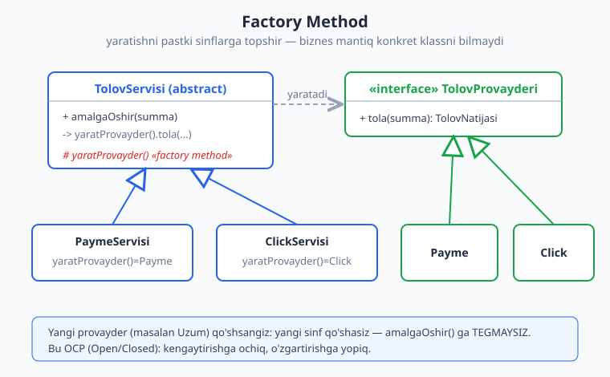
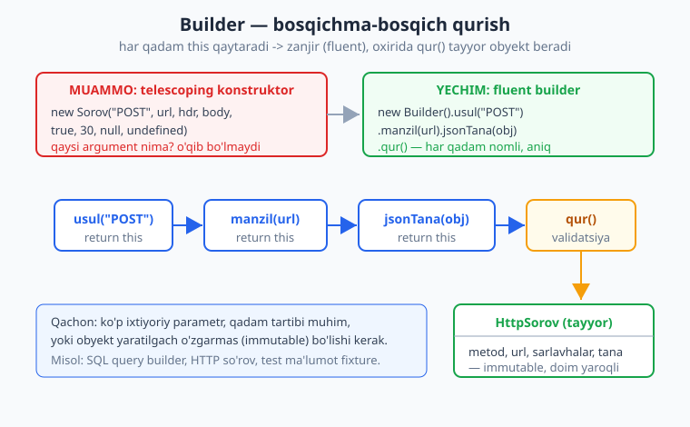
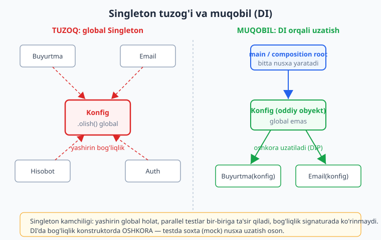

# 07 — Yaratuvchi patternlar (creational)

[⬅️ Oldingi: 06 — Boshqa printsiplar: DRY, KISS, YAGNI](./06-dry-kiss-yagni.md) · [🏠 README](./README.md) · [Keyingi: 08 — Strukturaviy patternlar ➡️](./08-structural-patterns.md)

---

> **Bu bobda:** design pattern (loyihalash namunasi) nima ekanini, GoF (Gang of Four) ning 23 patterni qaysi 3 toifaga bo'linishini va nima uchun pattern "jamoaviy til" bo'lib xizmat qilishini ko'ramiz. So'ng birinchi toifani — **yaratuvchi (creational)** patternlarni — chuqur o'rganamiz: Factory Method, Abstract Factory, Builder, Prototype va Singleton. Har biri uchun **muammo -> yechim -> ishlaydigan TypeScript misol -> qachon ishlat / qachon ishlatma** sxemasini bosib o'tamiz. Singleton'ni esa alohida ehtiyotkorlik bilan — uning anti-pattern (zararli namuna) tomonini va Dependency Injection (bog'liqlikni tashqaridan uzatish) muqobilini ko'rsatib o'rganamiz.
>
> **Trade-off eslatmasi / Halollik:** pattern — bu "har joyga qo'llab bo'ladigan oltin qoida" emas, **kontekstga bog'liq vosita**. Patternni keraksiz joyga tiqishtirish — eng keng tarqalgan anti-pattern. Bu bobdagi barcha TS misollari `$env:TEMP/arx-probe` muhitida `tsx` bilan **ishga tushirilgan** va `tsc --noEmit --strict` bilan **tip-tekshirilgan** (bob oxirida hisobot). "Qachon ishlatma" bo'limlari konseptual maslahat — ular ham trade-off, dogma emas.

---

## Design pattern nima va nega kerak

Tasavvur qiling, siz uy quryapsiz va "deraza tepasidagi yukni qanday taqsimlash kerak" degan muammoga duch keldingiz. Me'morlar buni asrlar oldin yechib qo'yishgan — bu **arka** (kamar). Siz arkani noldan ixtiro qilmaysiz; shunchaki "bu yerga arka qo'yamiz" deysiz va hamma sizni tushunadi.

**Design pattern** (loyihalash namunasi) — dasturlashdagi xuddi shu narsa: **takroriy uchraydigan muammoga nomli, sinovdan o'tgan yechim**. Pattern — bu tayyor kod emas (kutubxona emas), balki **g'oya/shablon**: muayyan vaziyatda obyektlar va sinflarni qanday tashkil etish kerakligi haqida retsept.

Atama 1994-yilda chiqqan **"Design Patterns: Elements of Reusable Object-Oriented Software"** kitobidan keng tarqaldi. Uni to'rt muallif yozgani uchun ularni hazil bilan **"Gang of Four" (GoF)** deb atashadi. Kitob 23 ta patternni katalogga oladi.

> **Eslatma:** pattern — bu **lug'at**. Eng katta foydasi — kommunikatsiya. "Bu yerda Strategy ishlatamiz" desangiz, jamoadosh darrov tuzilmani tasavvur qiladi. Diagramma chizmaysiz, uzun tushuntirish yozmaysiz — bitta so'z yetadi. Bu **jamoaviy til** (ubiquitous language ruhida — buni 14-bobda DDD'da ko'ramiz).

### GoF ning 3 toifasi

GoF 23 patternni nima qilishiga qarab uch toifaga ajratadi:

| Toifa | Nima haqida | Misollar |
|---|---|---|
| **Creational** (yaratuvchi) | Obyekt **YARATISH** jarayonini moslashuvchan qilish | Factory Method, Abstract Factory, Builder, Prototype, Singleton |
| **Structural** (strukturaviy) | Obyekt va sinflarni **birlashtirish** (kattaroq tuzilma) | Adapter, Decorator, Facade, Proxy, Composite, Bridge, Flyweight |
| **Behavioral** (xulq-atvor) | Obyektlar **o'zaro aloqasi** va mas'uliyat taqsimoti | Strategy, Observer, Command, State, Template Method, Iterator va boshqalar |

Bu bob **birinchi toifa** — creational haqida. Strukturaviy patternlar [08-bobda](./08-structural-patterns.md), xulq-atvor patternlari [09-bobda](./09-behavioral-patterns.md).

> **Anti-pattern: pattern kasalligi (patternitis).** Eng keng tarqalgan xato — patternni ko'rsatkich sifatida ishlatish ("men bilaman, demak qo'llayman"). Oddiy `new User()` yetarli bo'lgan joyga `AbstractUserFactoryBuilder` qo'yish — bu **haddan oshirish** (over-engineering). Pattern muammoni yechishi kerak, muammo ixtiro qilmasligi. Avval [YAGNI](./06-dry-kiss-yagni.md) ni eslang: "kerak bo'lmaguncha qo'shma". Pattern — javob, lekin **savol kelganda**.

---

## Creational patternlar: nima va nega

Eng sodda obyekt yaratish — `new Klass()`. Nega bunga pattern kerak? Chunki `new` to'g'ridan-to'g'ri **konkret klassga bog'lab qo'yadi**. Bu [DIP (Dependency Inversion)](./05-solid.md) ga zid: kod abstraksiyaga emas, konkret tipga bog'lanadi.

Creational patternlar shu bog'liqlikni yumshatadi: **"nima yaratilishi"** qarorini bir joyga jamlaydi, qolgan kod esa faqat abstraksiya bilan ishlaydi. Natijada:

- yangi tip qo'shganda eski kodga tegmaysiz (OCP — Open/Closed);
- yaratish murakkab bo'lsa (ko'p qadam, validatsiya), uni tartibga solasiz;
- testda haqiqiy obyekt o'rniga soxta (mock) obyekt uzatish osonlashadi.

Keling, beshtasini birma-bir ko'ramiz.

---

## 1. Factory Method — yaratishni pastki sinflarga topshirish

### Muammo

E-commerce backend'ida to'lovni turli provayderlar (Payme, Click, keyinchalik Uzum) orqali qabul qilasiz. Sodda yondashuv:

```ts
// ANTI-MISOL: switch hamma joyda takrorlanadi
function tola(provayder: string, summa: number) {
  if (provayder === "payme") { /* Payme mantigi */ }
  else if (provayder === "click") { /* Click mantigi */ }
  // yangi provayder = HAR JOYDAGI switch'ni o'zgartirish (OCP buzildi)
}
```

Har yangi provayder qo'shganda butun kod bo'ylab `if/switch` larni qidirib o'zgartirasiz. Bu **shotgun surgery** (bitta o'zgarish ko'p joyga tarqaladi) anti-patterni.

### Yechim

**Factory Method** — obyekt yaratishni alohida metodga ajratadi va uni **pastki sinflar** aniqlaydi. Asosiy biznes mantiq qaysi konkret klass kelishini bilmaydi — u faqat abstraksiya (interfeys) bilan ishlaydi.



```ts
interface TolovNatijasi {
  muvaffaqiyat: boolean;
  tranzaksiyaId: string;
}

interface TolovProvayderi {
  tola(summa: number): TolovNatijasi;
}

class Payme implements TolovProvayderi {
  tola(summa: number): TolovNatijasi {
    return { muvaffaqiyat: true, tranzaksiyaId: `payme_${summa}` };
  }
}
class Click implements TolovProvayderi {
  tola(summa: number): TolovNatijasi {
    return { muvaffaqiyat: true, tranzaksiyaId: `click_${summa}` };
  }
}

// Creator: yaratishni pastki sinflarga topshiradi
abstract class TolovServisi {
  protected abstract yaratProvayder(): TolovProvayderi; // <- FACTORY METHOD

  // Umumiy biznes mantiq — provayder qaysiligini BILMAYDI
  amalgaOshir(summa: number): TolovNatijasi {
    const provayder = this.yaratProvayder();
    return provayder.tola(summa);
  }
}

class PaymeServisi extends TolovServisi {
  protected yaratProvayder(): TolovProvayderi { return new Payme(); }
}
class ClickServisi extends TolovServisi {
  protected yaratProvayder(): TolovProvayderi { return new Click(); }
}

const xizmat: TolovServisi = new PaymeServisi();
console.log(xizmat.amalgaOshir(5000));
// -> { muvaffaqiyat: true, tranzaksiyaId: 'payme_5000' }
```

> **Eslatma:** ko'pincha "factory" deganda **oddiy factory** (simple factory) ham nazarda tutiladi — bu rasmiy GoF pattern emas, balki yaratishni bitta funksiya/metodga jamlash. Ko'p hollarda klassik Factory Method (meros bilan) o'rniga oddiy registr (xarita) yetarli:

```ts
type Kanal = "payme" | "click";
const registr: Record<Kanal, () => TolovProvayderi> = {
  payme: () => new Payme(),
  click: () => new Click(),
};
function yaratProvayder(kanal: Kanal): TolovProvayderi {
  return registr[kanal](); // switch yo'q; yangi kanal = registrga 1 qator
}
```

### Qachon ishlat / qachon ishlatma

- **Ishlat:** yaratiladigan konkret tip kompilyatsiya vaqtida noma'lum (konfiguratsiya, foydalanuvchi tanlovi); yangi turlar tez-tez qo'shiladi; yaratish mantig'ini bir joyga jamlamoqchisiz.
- **Ishlatma:** atigi bitta-ikkita tip bor va o'zgarmaydi — oddiy `new` yetarli. Klassik (merosli) Factory Method ba'zan ortiqcha; oddiy factory funksiya/registr ko'pincha yengilroq.

> **Amaliyotda:** ORM'lar (masalan Sequelize, TypeORM) `Repository` obyektini factory orqali yaratadi. DI konteynerlar (NestJS, Spring) — aslida ulkan, sozlanadigan factory: siz tipni so'raysiz, konteyner uni yaratib beradi. Bu DIP ([05-bob](./05-solid.md)) ning amaliy ko'rinishi.

---

## 2. Abstract Factory — bog'liq obyektlar oilasi

### Muammo

UI mavzusini (tema) ikki holatda qo'llab-quvvatlaysiz: yorug' (light) va qorong'i (dark). Har temada **bir nechta** element bor: tugma, oyna, menyu. Muammo: yorug' tugma + qorong'i oyna **aralashib ketmasligi** kerak. Factory Method bitta obyekt yaratadi; bu yerda esa **birga ishlaydigan obyektlar oilasi** kerak.

### Yechim

**Abstract Factory** — o'zaro bog'liq obyektlar **oilasini** yaratadigan interfeys beradi. Bitta factory butun oilani izchil yaratadi.

```ts
interface Tugma { chiz(): string; }
interface Oyna { ramka(): string; }

interface TemaFactory {
  yaratTugma(): Tugma;
  yaratOyna(): Oyna;
}

class YorugTugma implements Tugma { chiz() { return "oq fonli tugma"; } }
class YorugOyna implements Oyna { ramka() { return "och kulrang ramka"; } }
class QorongTugma implements Tugma { chiz() { return "qora fonli tugma"; } }
class QorongOyna implements Oyna { ramka() { return "to'q kulrang ramka"; } }

class YorugTema implements TemaFactory {
  yaratTugma(): Tugma { return new YorugTugma(); }
  yaratOyna(): Oyna { return new YorugOyna(); }
}
class QorongTema implements TemaFactory {
  yaratTugma(): Tugma { return new QorongTugma(); }
  yaratOyna(): Oyna { return new QorongOyna(); }
}

function interfeysQur(tema: TemaFactory): string {
  // Oila DOIM bir xil temadan — aralashmaydi
  return `${tema.yaratTugma().chiz()} + ${tema.yaratOyna().ramka()}`;
}

console.log(interfeysQur(new QorongTema()));
// -> "qora fonli tugma + to'q kulrang ramka"
```

> **Trade-off:** Abstract Factory oilani izchil saqlaydi, lekin **yangi mahsulot turi** (masalan `yaratMenyu()`) qo'shsangiz — `TemaFactory` interfeysini VA barcha konkret temalarni o'zgartirasiz. Ya'ni "yangi tema qo'shish" oson, "yangi element turi qo'shish" qiyin. Bu patternning tug'ma cheklovi — buni bilib tanlang.

### Factory Method vs Abstract Factory

| | Factory Method | Abstract Factory |
|---|---|---|
| Nima yaratadi | **bitta** mahsulot | **bog'liq mahsulotlar oilasi** |
| Mexanizm | meros (pastki sinf override qiladi) | kompozitsiya (factory obyekti uzatiladi) |
| Misol | bitta to'lov provayderi | butun UI tema (tugma+oyna+menyu) |

---

## 3. Builder — murakkab obyektni bosqichma-bosqich qurish

### Muammo

Ba'zi obyektlarning ko'p maydoni bor, ularning aksariyati ixtiyoriy. "Telescoping konstruktor" (uzaygan konstruktor) anti-patterni paydo bo'ladi:

```ts
// ANTI-MISOL: bu argumentlar nima? O'qib bo'lmaydi.
new HttpSorov("POST", "https://...", { "Auth": "x" }, '{"a":1}', true, 30000);
```

Qaysi `true`, qaysi raqam nimani anglatadi? Tartibni adashtirsangiz — sokin (silent) xato.

### Yechim

**Builder** — obyektni **bosqichma-bosqich**, har qadami nomli metod orqali quradi. Odatda **fluent interfeys** (zanjirli chaqiruv) bilan: har metod `this` qaytaradi, oxirida `qur()` tayyor obyektni beradi.



```ts
interface HttpSorov {
  metod: string;
  url: string;
  sarlavhalar: Record<string, string>;
  tana?: string;
}

class HttpSorovBuilder {
  private metod = "GET";
  private url = "";
  private sarlavhalar: Record<string, string> = {};
  private tana?: string;

  usul(metod: string): this { this.metod = metod; return this; }
  manzil(url: string): this { this.url = url; return this; }
  sarlavha(kalit: string, qiymat: string): this {
    this.sarlavhalar[kalit] = qiymat;
    return this;
  }
  jsonTana(obyekt: unknown): this {
    this.tana = JSON.stringify(obyekt);
    this.sarlavhalar["Content-Type"] = "application/json";
    return this;
  }
  qur(): HttpSorov {
    if (!this.url) throw new Error("url majburiy"); // validatsiya BIR joyda
    return { metod: this.metod, url: this.url, sarlavhalar: this.sarlavhalar, tana: this.tana };
  }
}

const sorov = new HttpSorovBuilder()
  .usul("POST")
  .manzil("https://api.example.uz/orders")
  .sarlavha("Authorization", "Bearer xxx")
  .jsonTana({ mahsulot: "kitob", soni: 2 })
  .qur();

console.log(sorov.metod, sorov.url, sorov.sarlavhalar["Content-Type"]);
// -> "POST https://api.example.uz/orders application/json"
```

Har chaqiruv **o'zini izohlaydi** (`usul`, `manzil`, `jsonTana`) — tartibni adashtirib bo'lmaydi, ixtiyoriy maydonlarni tashlab ketish mumkin, validatsiya bitta `qur()` da.

### Qachon ishlat / qachon ishlatma

- **Ishlat:** ko'p ixtiyoriy parametr; yaratishda validatsiya yoki qadam tartibi muhim; natija o'zgarmas (immutable) obyekt bo'lishi kerak.
- **Ishlatma:** obyekt 2-3 maydonli — oddiy konstruktor yoki obyekt-literal (`{ a, b }`) yetarli. Builder qo'shimcha klass va boilerplate keltiradi.

> **Amaliyotda:** SQL query builder'lar (Knex, Drizzle: `db.select().from("orders").where(...)`), HTTP klientlar, test ma'lumot generatorlari (fixture/test data builder) aynan shu patternni ishlatadi. Bog'lanish: bu fluent uslubni [SQL kitobida](../sql/README.md) so'rov tuzishda ham uchratasiz.

---

## 4. Prototype — mavjud obyektni klonlash

### Muammo

Ba'zan yangi obyektni noldan yaratish qimmat (ko'p sozlash, tashqi resurs) yoki mavjud obyektga juda o'xshash nusxa kerak. Masalan: "Shartnoma shabloni" bor, undan har mijoz uchun biroz o'zgartirilgan nusxa qilasiz.

### Yechim

**Prototype** — obyektga o'zini **klonlash** (nusxalash) qobiliyatini beradi. Yangi obyekt mavjudidan ko'chiriladi, keyin ehtiyojga ko'ra o'zgartiriladi.

```ts
interface Klonlanuvchi<T> { klon(): T; }

class Hujjat implements Klonlanuvchi<Hujjat> {
  constructor(public sarlavha: string, public teglar: string[]) {}

  klon(): Hujjat {
    // CHUQUR nusxa: massiv ham ko'chiriladi (sayoz nusxa = yashirin bog'liqlik!)
    return new Hujjat(this.sarlavha, [...this.teglar]);
  }
}

const shablon = new Hujjat("Shartnoma shabloni", ["huquqiy", "2026"]);
const nusxa = shablon.klon();
nusxa.sarlavha = "Mijoz A shartnomasi";
nusxa.teglar.push("mijoz-a");

console.log(shablon.teglar.length, nusxa.teglar.length);
// -> 2 3   (shablon tegmagan — chuqur nusxa to'g'ri ishladi)
```

> **Diqqat: sayoz (shallow) vs chuqur (deep) nusxa.** Eng keng tarqalgan xato — sayoz nusxa: massiv/obyekt **havola bilan** ko'chiriladi, ikki nusxa bir xil ichki massivni ulashadi. Nusxani o'zgartirsangiz — original ham buziladi (yashirin bog'liqlik). Yuqorida `[...this.teglar]` aynan shuni oldini oladi. JavaScript'da `structuredClone()` ham chuqur nusxa beradi (lekin metodlarni emas, faqat ma'lumotni).

### Qachon ishlat / qachon ishlatma

- **Ishlat:** obyekt yaratish qimmat; ko'p o'xshash nusxa kerak; "shablon -> ozgina o'zgartirilgan nusxa" stsenariysi.
- **Ishlatma:** obyekt sodda va arzon yaratiladi — `new` yoki spread (`{ ...obj }`) yetarli. Murakkab obyekt grafida chuqur nusxa o'zi murakkab muammo bo'lib qoladi.

---

## 5. Singleton — bitta nusxa (va uning xavfi)

### Muammo

Ba'zi resurslardan dastur bo'ylab **bitta** nusxa bo'lishi mantiqiy: konfiguratsiya, log yozuvchi, ma'lumotlar bazasi ulanish puli (connection pool). Bir nechta nusxa resursni isrof qiladi yoki ziddiyat keltiradi.

### "Yechim" (lekin ehtiyot bo'ling)

**Singleton** — klassning faqat bitta nusxasi bo'lishini ta'minlaydi va unga global kirish nuqtasi beradi. Konstruktor yopiq, yagona nusxa statik metod orqali olinadi:

```ts
class Konfiguratsiya {
  private static nusxa: Konfiguratsiya | null = null;
  private qiymatlar = new Map<string, string>();

  private constructor() {} // tashqaridan new QILIB bo'lmaydi

  static olish(): Konfiguratsiya {
    if (Konfiguratsiya.nusxa === null) {
      Konfiguratsiya.nusxa = new Konfiguratsiya();
    }
    return Konfiguratsiya.nusxa;
  }

  ornat(kalit: string, qiymat: string): void { this.qiymatlar.set(kalit, qiymat); }
  oqi(kalit: string): string | undefined { return this.qiymatlar.get(kalit); }
}

Konfiguratsiya.olish().ornat("til", "uz");
console.log(Konfiguratsiya.olish() === Konfiguratsiya.olish()); // -> true (bir xil nusxa)
console.log(Konfiguratsiya.olish().oqi("til"));                 // -> "uz"
```

### Nega Singleton ko'pincha ANTI-PATTERN

Singleton — eng ko'p suiiste'mol qilinadigan pattern. GoF kitobida bor, lekin ko'p tajribali muhandis undan qochishni maslahat beradi. Sabablari:

> **Anti-pattern: Singleton — yashirin global holat.**
>
> 1. **Global holat (global state).** Singleton aslida bezatilgan global o'zgaruvchi. Uni istalgan joydan o'zgartirish mumkin — kim, qachon o'zgartirganini kuzatish qiyin. Bu [coupling](./04-coupling-cohesion.md) ni oshiradi.
> 2. **Yashirin bog'liqlik (hidden dependency).** `Konfiguratsiya.olish()` ni metod ichida chaqirsangiz, bu bog'liqlik **signaturada ko'rinmaydi**. Kodga qarab, bu klass nimaga bog'liqligini bilolmaysiz — u "yashirin".
> 3. **Test qiyin.** Singleton holatini testlar o'rtasida tozalash kerak; parallel testlar bir xil nusxani ulashadi va bir-biriga ta'sir qiladi. Soxta (mock) nusxa qo'yish noqulay.
> 4. **DIP buzilishi.** Kod konkret `Konfiguratsiya` klassiga qattiq bog'lanadi, abstraksiyaga emas.



### Muqobil: Dependency Injection (DI)

Ko'pincha sizga **"global kirish"** emas, balki **"bitta nusxa"** kerak. Bu ikkalasi har xil narsa. Bitta nusxa yaratib, uni kerakli joylarga **oshkora uzatish** (inject qilish) Singleton'ning barcha kamchiligini hal qiladi:

```ts
interface KonfigOquvchi { oqi(k: string): string | undefined; }

class ServisDIbilan {
  constructor(private konfig: KonfigOquvchi) {} // bog'liqlik OSHKORA — signaturada ko'rinadi
  til(): string { return this.konfig.oqi("til") ?? "uz"; }
}

// Testda almashtirish OSON — soxta (mock) konfig uzatamiz:
const soxtaKonfig: KonfigOquvchi = { oqi: (_k) => "en" };
console.log(new ServisDIbilan(soxtaKonfig).til()); // -> "en"
```

Bu yerda:

- bog'liqlik **konstruktorda ko'rinadi** (yashirin emas);
- testda istalgan soxta obyekt uzatiladi;
- nusxa **bitta** bo'lishini dastur kirish nuqtasi (composition root) ta'minlaydi — uni global qilmasdan.

> **Eslatma:** "bitta nusxa kerak" degani "global Singleton kerak" degani EMAS. Nusxani bir marta yarating va DI orqali tarqating. DI konteynerlar (NestJS, Spring) aynan shuni qiladi: ular obyektning "singleton ko'lami" (scope) ni boshqaradi, lekin uni global statik holat qilmaydi. DI'ni [12-bobda (Hexagonal)](./12-hexagonal-portlar-adapterlar.md) chuqurroq ko'ramiz; tamoyil esa [DIP, 05-bob](./05-solid.md) dan keladi.

### Qachon Singleton baribir maqbul

- **Ishlatma (deyarli har doim):** biznes mantiq, servis, repozitoriy — bularni DI bilan bering.
- **Maqbul bo'lishi mumkin:** holatsiz (stateless) yordamchi (masalan toza funksiyalar to'plami); yoki tashqi resurs nusxasi (connection pool) — lekin uni ham ko'pincha DI orqali tarqatish afzal. Til darajasidagi modul (ES module) o'zi bir marta yuklanadi — ko'p holatda "modul-darajali bitta nusxa" Singleton klassidan toza muqobil.

---

## Patternlarni umumiy taqqoslash

| Pattern | Maqsad | Tipik real misol | Ishlatma agar... |
|---|---|---|---|
| **Factory Method** | yaratishni pastki sinflarga topshir | to'lov provayderi tanlash | atigi 1 konkret tip bo'lsa |
| **Abstract Factory** | bog'liq obyektlar oilasi | UI tema (tugma+oyna) | oila yo'q, yagona obyekt bo'lsa |
| **Builder** | murakkab obyektni qadam-baqadam qur | SQL/HTTP so'rov quruvchi | 2-3 maydonli oddiy obyekt bo'lsa |
| **Prototype** | mavjud obyektni klonla | hujjat shablonidan nusxa | obyekt arzon yaratilsa |
| **Singleton** | bitta nusxa | (ehtiyot bo'l) konfig, pul | deyarli har doim — DI afzal |

> **Trade-off:** har creational pattern qo'shimcha **abstraksiya qatlami** keltiradi — bu moslashuvchanlik beradi, lekin **murakkablik narxida**. Patternni tanlashda o'zingizdan so'rang: "shu moslashuvchanlik menga HOZIR kerakmi yoki bir kun KEYIN kerak bo'lishi MUMKINmi?". Birinchi javob "ha" bo'lsa — qo'llang. Ikkinchisi bo'lsa — [YAGNI](./06-dry-kiss-yagni.md) ni eslang.

---

## Mashqlar

### Oson

**1-mashq.** Quyidagi ta'riflarni patternga moslang: (a) bog'liq obyektlar oilasini yaratadi; (b) obyektni klonlaydi; (c) faqat bitta nusxani ta'minlaydi; (d) obyektni qadam-baqadam quradi; (e) yaratishni pastki sinflarga topshiradi.

**2-mashq.** GoF ning uchta toifasini ayting va har biriga bittadan misol pattern keltiring.

**3-mashq.** "Pattern haddan oshirish anti-pattern" iborasini o'z so'zingiz bilan tushuntiring va bitta misol keltiring.

**4-mashq.** Quyidagi kod qaysi muammoga (anti-pattern) duch keladi va qaysi creational pattern uni yechadi?
```ts
new Hisobot("PDF", "A4", true, false, 12, null, "uz", undefined);
```

### O'rta

**5-mashq.** Bir ilovada yaratish kerak: `Email`, `SMS`, `Telegram` xabarchilari (hammasi `Xabarchi` interfeysini bajaradi). Foydalanuvchi kanalni runtime'da tanlaydi. Qaysi pattern mos? Uni TypeScript'da `switch`'siz (registr orqali) yozing va `telegram` kanali bilan sinab ko'ring.

**6-mashq.** Quyidagi Builder'ga `vaqtCheki(ms)` (timeout) ixtiyoriy qadamini qo'shing va `qur()` da agar timeout 0 dan kichik bo'lsa xato tashlasin. Fluent zanjir buzilmasligi kerak.
```ts
class SorovBuilder {
  private url = "";
  manzil(u: string): this { this.url = u; return this; }
  qur() { return { url: this.url }; }
}
```

**7-mashq.** "Prototype registry" yozing: `Map<string, Sozlama>` ombor bo'lsin, `Sozlama.klon()` metodi bilan. `prod` shablonidan klon oling, klon `port` ini o'zgartiring va original tegmaganini tekshiring.

**8-mashq.** Abstract Factory ning tug'ma cheklovini tushuntiring: nega "yangi tema qo'shish" oson, lekin "yangi element turi (masalan menyu) qo'shish" qiyin?

**9-mashq.** Bir loyihada `Logger.getInstance()` (Singleton) hamma joyda ishlatiladi. Bu kodda qaysi 2 muammo bor va ularni DI bilan qanday yechasiz? Qisqa kod-eskiz bilan ko'rsating.

### Qiyin

**10-mashq.** `Pizza` obyekti uchun Builder yozing: `olcham` (kichik/o'rta/katta), `asos`, ixtiyoriy `qo'shimchalar` (massiv). `qur()` da 5 tadan ortiq qo'shimcha bo'lsa xato tashlansin. To'liq TypeScript'da yozing va katta pizza + 2 qo'shimcha bilan ishga tushiring.

**11-mashq.** Singleton'ni testlanuvchan qilish: `Tokenchi` klassi token yaratadi va vaqtni `Date.now()` orqali oladi. Hozir uni test qilib bo'lmaydi (vaqt har safar boshqa). `Soat` interfeysini DI qiling va `SoxtaSoat(1000)` bilan natija **deterministik** (aniq) bo'lishini ko'rsating.

**12-mashq.** Quyidagi stsenariyga qaysi creational pattern(lar) mos kelishini asoslang: e-commerce'da buyurtma yaratish — buyurtmaning ko'p ixtiyoriy maydoni bor (chegirma, manzil, sovg'a o'rami), to'lov provayderi runtime'da tanlanadi, va "tezkor qayta buyurtma" uchun oldingi buyurtmadan nusxa olinadi. Qaysi qism qaysi patternga to'g'ri keladi?

**13-mashq (loyihalash).** Bir jamoa har joyga pattern tiqishtirib, `AbstractNotificationFactoryProviderBuilderSingleton` yaratdi. Bu nega yomon? "Pattern kasalligi"ni qanday aniqlaysiz va kodni soddalashtirish uchun nimani so'raysiz?

---

<details markdown="1">
<summary>Yechimlar</summary>

### 1-mashq yechimi
(a) Abstract Factory; (b) Prototype; (c) Singleton; (d) Builder; (e) Factory Method.

### 2-mashq yechimi
- **Creational** (yaratuvchi) — Builder. Obyekt yaratishni boshqaradi.
- **Structural** (strukturaviy) — Adapter. Obyektlarni kattaroq tuzilmaga birlashtiradi.
- **Behavioral** (xulq-atvor) — Strategy. Obyektlar o'rtasidagi aloqa va mas'uliyatni belgilaydi.

### 3-mashq yechimi
Pattern muammoni yechish uchun, muammo ixtiro qilish uchun emas. Oddiy `new User()` yetadigan joyga `UserFactory` qo'yish keraksiz abstraksiya keltiradi: kod ko'payadi, o'qish qiyinlashadi, lekin hech qanday moslashuvchanlik foydasi yo'q. Misol: bitta, hech qachon o'zgarmaydigan konfig obyekti uchun Builder yozish — `{ a, b }` literal yetib turadi.

### 4-mashq yechimi
Bu **telescoping konstruktor** (uzaygan konstruktor) anti-patterni: argumentlar tartibi va ma'nosi o'qilmaydi (`true`, `false`, `null`, `undefined` nimani anglatadi?). Yechim — **Builder**: `new HisobotBuilder().format("PDF").olcham("A4").raqamlash(true).qur()` — har qadam nomli, ixtiyoriylar tashlanadi.

### 5-mashq yechimi
**Factory** (oddiy factory / registr). `switch`'siz, registr orqali — yangi kanal qo'shish bitta qator:
```ts
interface Xabarchi { yubor(matn: string): string; }
class EmailXabarchi implements Xabarchi { yubor(m: string) { return `email: ${m}`; } }
class SmsXabarchi implements Xabarchi { yubor(m: string) { return `sms: ${m}`; } }
class TelegramXabarchi implements Xabarchi { yubor(m: string) { return `telegram: ${m}`; } }

type Kanal = "email" | "sms" | "telegram";
const registr: Record<Kanal, () => Xabarchi> = {
  email: () => new EmailXabarchi(),
  sms: () => new SmsXabarchi(),
  telegram: () => new TelegramXabarchi(),
};
function xabarchiYarat(kanal: Kanal): Xabarchi { return registr[kanal](); }

console.log(xabarchiYarat("telegram").yubor("Salom")); // -> "telegram: Salom"
```
Registr OCP'ni qondiradi: yangi kanal = registrga bitta yozuv, mavjud kodga tegmaysiz.

### 6-mashq yechimi
```ts
class SorovBuilder {
  private url = "";
  private timeout?: number;
  manzil(u: string): this { this.url = u; return this; }
  vaqtCheki(ms: number): this { this.timeout = ms; return this; }
  qur() {
    if (this.timeout !== undefined && this.timeout < 0) {
      throw new Error("timeout manfiy bo'lishi mumkin emas");
    }
    return { url: this.url, timeout: this.timeout };
  }
}
new SorovBuilder().manzil("https://x.uz").vaqtCheki(3000).qur(); // OK
```
Validatsiya `qur()` da jamlandi — fluent zanjir buzilmadi.

### 7-mashq yechimi
```ts
interface Sozlama { klon(): Sozlama; host: string; port: number; }
class ServerSozlama implements Sozlama {
  constructor(public host: string, public port: number) {}
  klon(): Sozlama { return new ServerSozlama(this.host, this.port); }
}
const shablonlar = new Map<string, Sozlama>();
shablonlar.set("prod", new ServerSozlama("prod.example.uz", 443));

const yangiProd = shablonlar.get("prod")!.klon();
yangiProd.port = 8443;
console.log(shablonlar.get("prod")!.port, yangiProd.port); // -> 443 8443
```
Original `prod` tegmadi — klon mustaqil nusxa.

### 8-mashq yechimi
Abstract Factory **interfeysi** mahsulot turlarini sanab beradi (`yaratTugma`, `yaratOyna`). **Yangi tema** qo'shish = interfeysni bajaradigan yangi klass yozish (mavjud kod o'zgarmaydi — OCP qondiriladi). Lekin **yangi element turi** (`yaratMenyu`) qo'shish = `TemaFactory` interfeysini O'ZGARTIRISH, demak BARCHA mavjud temalarni ham yangilash kerak. Ya'ni pattern bir o'qda ochiq (yangi oila), boshqa o'qda yopiq (yangi a'zo). Bu uning fundamental trade-off'i.

### 9-mashq yechimi
Ikki muammo: (1) **yashirin bog'liqlik** — `Logger.getInstance()` metod ichida chaqirilsa, klassning logger'ga bog'liqligi signaturada ko'rinmaydi; (2) **test qiyin** — testda log'ni tutib olish yoki o'chirish uchun global Singleton'ni almashtirish noqulay. DI yechimi:
```ts
interface Logger { yoz(m: string): void; }
class Servis {
  constructor(private logger: Logger) {} // oshkora bog'liqlik
  ishla() { this.logger.yoz("ishladi"); }
}
// Testda: new Servis({ yoz: () => {} }) — soxta logger, oson.
```

### 10-mashq yechimi
```ts
type Olcham = "kichik" | "orta" | "katta";
interface Pizza { olcham: Olcham; asos: string; qoshimchalar: string[]; }

class PizzaBuilder {
  private olcham: Olcham = "orta";
  private asos = "yupqa";
  private qoshimchalar: string[] = [];
  setOlcham(o: Olcham): this { this.olcham = o; return this; }
  setAsos(a: string): this { this.asos = a; return this; }
  qoshimchaQosh(q: string): this { this.qoshimchalar.push(q); return this; }
  qur(): Pizza {
    if (this.qoshimchalar.length > 5) throw new Error("5 tadan ortiq qo'shimcha mumkin emas");
    return { olcham: this.olcham, asos: this.asos, qoshimchalar: [...this.qoshimchalar] };
  }
}
const pizza = new PizzaBuilder()
  .setOlcham("katta").setAsos("qalin")
  .qoshimchaQosh("pishloq").qoshimchaQosh("qo'ziqorin")
  .qur();
console.log(pizza.olcham, pizza.asos, pizza.qoshimchalar.join(","));
// -> "katta qalin pishloq,qo'ziqorin"
```

### 11-mashq yechimi
```ts
interface Soat { hozir(): number; }
class HaqiqiySoat implements Soat { hozir() { return Date.now(); } }
class SoxtaSoat implements Soat {
  constructor(private qiymat: number) {}
  hozir() { return this.qiymat; }
}
class Tokenchi {
  constructor(private soat: Soat) {} // vaqt DI qilindi
  yarat(): string { return `token@${this.soat.hozir()}`; }
}
const t = new Tokenchi(new SoxtaSoat(1000));
console.log(t.yarat() === "token@1000"); // -> true (deterministik!)
```
Vaqtni tashqaridan uzatib (DI), test natijasini **aniq** qildik. `Date.now()` ga to'g'ridan-to'g'ri bog'lanish — yashirin bog'liqlik edi.

### 12-mashq yechimi
Uch pattern bir stsenariyda birlashadi:
- **Builder** — buyurtmaning ko'p ixtiyoriy maydoni (chegirma, manzil, sovg'a o'rami) uchun. `new BuyurtmaBuilder().mahsulot(...).chegirma(10).qur()`.
- **Factory (Method/registr)** — to'lov provayderi runtime'da tanlanadi (Payme/Click). Yaratish registr orqali.
- **Prototype** — "tezkor qayta buyurtma" oldingi buyurtmadan `klon()` oladi, foydalanuvchi ozgina o'zgartiradi.

Diqqat: uchchalasini ishlatish "to'g'ri" degani emas — har biri **haqiqiy** muammoni yechgani uchun oqlanadi. Agar buyurtmada 2 maydon bo'lsa, Builder ortiqcha bo'lardi.

### 13-mashq yechimi
`AbstractNotificationFactoryProviderBuilderSingleton` — **pattern kasalligi** (patternitis) ning klassik belgisi: nom o'zi 4-5 pattern aralashganini ko'rsatadi, lekin hech biri aniq muammoni yechmaydi. Belgilar: (1) abstraksiya qatlamlari soni real ehtiyojdan ko'p; (2) "moslashuvchanlik" hech qachon ishlatilmaydi (YAGNI buzilgan); (3) oddiy o'zgarish uchun 5 fayl ochish kerak. So'rash kerak: "**hozir** qaysi konkret muammoni yechyapmiz?" Agar javob "kelajakda kerak bo'lishi mumkin" bo'lsa — abstraksiyani olib tashlang, `function yuborXabar(kanal, matn)` bilan boshlang, **haqiqiy** ehtiyoj kelganda pattern qo'shing (refaktoring oson). Sodda kod — eng yaxshi boshlang'ich.

</details>

---

## Bob xulosasi

- **Design pattern** — takroriy muammoga nomli, sinovdan o'tgan yechim va jamoaviy til (lug'at). GoF 23 patternni 3 toifaga ajratadi.
- **Creational** patternlar obyekt yaratishni moslashuvchan qiladi va `new` ga qattiq bog'lanishni kamaytiradi (DIP ruhida).
- **Factory Method** yaratishni pastki sinflarga topshiradi; **Abstract Factory** bog'liq obyektlar oilasini; **Builder** murakkab obyektni qadam-baqadam quradi; **Prototype** klonlaydi.
- **Singleton** — eng ehtiyotkorlik talab qiladigan pattern: ko'pincha **anti-pattern** (yashirin global holat, test qiyin, DIP buzilishi). Muqobil — **Dependency Injection**: bitta nusxani oshkora uzatish.
- Eng muhim qoida: pattern — vosita, dogma emas. **Trade-off** ni o'lchang va [YAGNI](./06-dry-kiss-yagni.md) ni unutmang.

Keyingi bobda obyektlarni kattaroq tuzilmalarga **birlashtirish** — strukturaviy patternlarni ko'ramiz.

> **Kod-verifikatsiya hisoboti.** Bu bobdagi barcha TypeScript misollari `$env:TEMP/arx-probe` muhitida tekshirildi (Node v24, TypeScript 6.0.3, tsx 4.22):
>
> - `_v_07.ts` — 5 pattern (Factory Method, Abstract Factory, Builder, Prototype, Singleton + DI muqobil). `npx tsx _v_07.ts` -> hammasi kutilgan natijani chiqardi; `npx tsc --noEmit --strict _v_07.ts` -> **toza (0 xato)**.
> - `_v_07b.ts` — mashq yechimlari (registr-factory, Pizza Builder, DI-Soat test, Prototype registry). `npx tsx _v_07b.ts` -> hammasi o'tdi (jumladan `[DI test] true` deterministik); `npx tsc --noEmit --strict` -> **toza (0 xato)**.
> - Matndagi "-> ..." natijalari shu ishga tushirishlardan olingan, soxta emas.

---

[⬅️ Oldingi: 06 — Boshqa printsiplar: DRY, KISS, YAGNI](./06-dry-kiss-yagni.md) · [🏠 README](./README.md) · [Keyingi: 08 — Strukturaviy patternlar ➡️](./08-structural-patterns.md)
