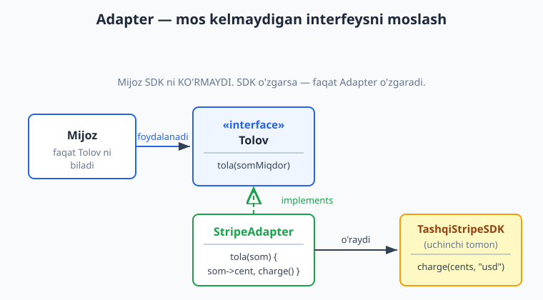
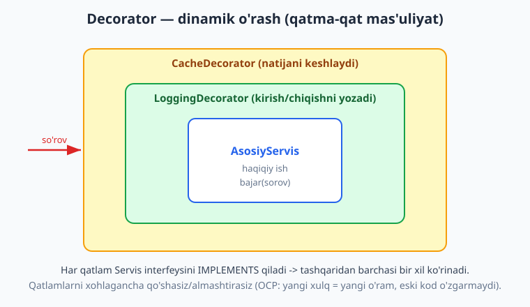
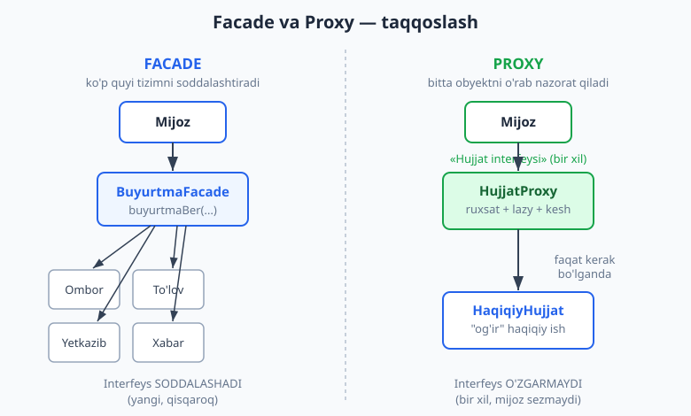

# 08 — Strukturaviy patternlar (structural)

[⬅️ Oldingi: 07 — Yaratuvchi patternlar](./07-creational-patterns.md) · [🏠 README](./README.md) · [Keyingi: 09 — Xulq-atvor patternlari ➡️](./09-behavioral-patterns.md)

---

> **Bu bobda:** GoF'ning ikkinchi oilasi — **strukturaviy (structural) patternlar** bilan tanishamiz. Agar yaratuvchi patternlar (07-bob) obyektni *qanday yaratish* haqida bo'lsa, strukturaviy patternlar obyektlarni *qanday birlashtirish va tuzish* haqida: kichik qismlardan kattaroq, moslashuvchan tuzilmalarni meros (inheritance) o'rniga **kompozitsiya** orqali yig'amiz. Yetti pattern bor — **Adapter** (mos kelmaydigan interfeysni moslash), **Decorator** (obyektga dinamik mas'uliyat qo'shish), **Facade** (murakkab quyi tizimga sodda fasad), **Proxy** (o'rinbosar: lazy, kesh, kirish nazorati), **Composite** (qism-butun daraxti), **Bridge** (abstraksiya va implementatsiyani ajratish) va **Flyweight** (xotira tejash). Asosiy to'rttasini — Adapter, Decorator, Facade, Proxy — TypeScript'da yozib, haqiqatan ishga tushirdik. Eng muhim "tushunchaviy" qism — bu uchta o'xshash ko'rinadigan patternni (**Decorator vs Proxy vs Adapter**) bir-biridan ajratish.
>
> **Trade-off eslatmasi / Halollik:** strukturaviy patternlar bepul kelmaydi — har qatlam (o'ram, fasad, proxy) bitta **indirektsiya** (bilvosita qatlam) qo'shadi: ko'proq sinf, ko'proq fayl, debug paytida "stack" chuqurroq. Ular **bog'liqlikni kamaytirish** evaziga **soddalikni** qurbon qiladi. Bu bobdagi barcha TS kod-misollari `npx tsx` bilan ishga tushirilgan va `npx tsc --strict` bilan tip-tekshirilgan (0 xato); "ishga tushirsak" deb ko'rsatilgan natijalar — haqiqiy chiqish. Pattern tanlovi esa har doim kontekstga bog'liq — "qaysi yaxshi" emas, "qaysi shu muammoga mos".

---

## Strukturaviy patternlar nima va nega kerak

Tasavvur qiling: sizda bir nechta tayyor qism bor — uchinchi tomon kutubxonasi, eski modul, og'ir resurs — va ularni o'z ilovangizga **toza** ulashingiz kerak. To'g'ridan-to'g'ri ulasangiz, kodingiz o'sha qismlarning ichki tafsilotlariga **bog'lanib** (coupling — bog'liqlik, 04-bob) qoladi: qism o'zgarsa, kodingiz buziladi. Strukturaviy patternlar bu muammoni hal qiladi — ular qismlar orasiga **oraliq tuzilma** qo'yib, bog'liqlikni boshqaradi.

Eng kuchli umumiy g'oya — **meros o'rniga kompozitsiya** (composition over inheritance, 06-bobdan). Meros bilan xulqni *kompilyatsiya vaqtida* qattiq belgilaysiz; kompozitsiya bilan obyektlarni *ish vaqtida* yig'asiz va almashtirasiz. Strukturaviy patternlarning aksariyati — Decorator, Proxy, Adapter, Bridge, Facade — bitta obyekt ichida boshqasini **saqlash** (wrapping — o'rash) g'oyasiga tayanadi.

> **Eslatma:** "pattern" — bu copy-paste qilinadigan kod emas (07-bobda aytganimizdek), balki **takrorlanadigan muammoga sinalgan yondashuv** va jamoa uchun **umumiy lug'at**. "Bu yerda Adapter qo'shdim" deyish — uzun tushuntirishdan tezroq.

Bu bobdagi yo'l xaritasi — yettita pattern, ikki guruhga ajraladi:

```text
                 STRUKTURAVIY PATTERNLAR
   +-------------------------+--------------------------+
   | INTERFEYS bilan ishlash | TUZILMA bilan ishlash    |
   +-------------------------+--------------------------+
   | Adapter   (moslash)     | Composite (daraxt)       |
   | Decorator (qo'shish)    | Bridge    (ikki o'q)     |
   | Facade    (soddalash)   | Flyweight (tejash)       |
   | Proxy     (nazorat)     |                          |
   +-------------------------+--------------------------+
```

Avval to'rtta "interfeys ustida ishlovchi" patternni chuqur ochamiz (ular eng ko'p chalkashtiriladi), keyin tuzilma patternlariga o'tamiz.

---

## Adapter — mos kelmaydigan interfeysni moslash

**Muammo.** Sizda kerakli funksiyani bajaradigan tayyor sinf bor (uchinchi tomon SDK, eski modul), lekin uning **interfeysi** sizning kodingiz kutgan interfeysga mos kelmaydi. Metod nomlari boshqa, parametrlar boshqa, qaytariladigan qiymat formati boshqa. Uni to'g'ridan-to'g'ri ishlatsangiz, biznes kodingiz o'sha begona shaklga bog'lanadi.

**Yechim.** Ikkalasi orasiga **Adapter** qo'ying — u sizning interfeysingizni **implements** qiladi, lekin ichida begona sinfni saqlaydi va chaqiruvlarni tarjima qiladi. Elektr rozetka adapteri kabi: devordagi rozetka (begona shakl) va sizning vilkangiz (kutilgan shakl) orasida tarjimon.



**TS kod (ishga tushadi).** To'lov misoli — bizning ilova `Tolov` interfeysini biladi (so'mda ishlaydi), uchinchi tomon SDK esa cent va `usd` bilan ishlaydi:

```ts
// Bizning ilovaga kerak interfeys (target):
interface Tolov {
  tola(somMiqdor: number): { ok: boolean; xabar: string };
}

// Uchinchi tomon SDK (adaptee) — interfeysi BOSHQA:
class TashqiStripeSDK {
  charge(amountCents: number, currency: "usd"): { status: number; id: string } {
    return { status: amountCents > 0 ? 200 : 400, id: "ch_" + amountCents };
  }
}

// Adapter: SDK ni Tolov interfeysiga moslaydi.
class StripeAdapter implements Tolov {
  private readonly somDollarKurs = 12600; // 1 USD ~ 12600 so'm (taxminiy)
  constructor(private readonly sdk: TashqiStripeSDK) {}

  tola(somMiqdor: number): { ok: boolean; xabar: string } {
    const cents = Math.round((somMiqdor / this.somDollarKurs) * 100);
    const javob = this.sdk.charge(cents, "usd");
    return { ok: javob.status === 200, xabar: `Stripe ${javob.id} status=${javob.status}` };
  }
}

// Mijoz faqat Tolov interfeysini biladi — SDK ni ko'rmaydi.
function tolovniBajar(t: Tolov, som: number): void {
  const r = t.tola(som);
  console.log(`${som} so'm -> ok=${r.ok} (${r.xabar})`);
}

const tolov: Tolov = new StripeAdapter(new TashqiStripeSDK());
tolovniBajar(tolov, 126000);
```

Ishga tushirsak (`npx tsx`):

```text
126000 so'm -> ok=true (Stripe ch_10003 status=200)
```

E'tibor bering: `tolovniBajar` funksiyasi `Tolov` interfeysini oladi, Stripe haqida **hech narsa bilmaydi**. Ertaga Stripe'dan PayMe yoki Click'ga o'tsangiz — yangi `PaymeAdapter implements Tolov` yozasiz, biznes kod **o'zgarmaydi**. Bu DIP (Dependency Inversion, 05-bob) ning amaliy ko'rinishi.

> **Amaliyotda:** real loyihada deyarli har bir tashqi integratsiya — to'lov provayderi, SMS-gateway, xarita API, fayl-saqlash (S3) — o'z adapteri ortida turishi kerak. Bu sizning "anti-corruption layer" (buzilishdan himoya qatlami, DDD'dan, 14-bob) ingiz: tashqi dunyoning g'alati shakllari domeningizga **sizib kirmaydi**.

> **Diqqat:** Adapter mavjud, o'zgartirib bo'lmaydigan kod uchun. Agar interfeysni o'zingiz boshidan loyihalashtirayotgan bo'lsangiz — adapter shart emas, to'g'ri interfeysni darrov yozing. Adapter — "tuzatish", "yaxshilash" emas.

### Adapter ikki ko'rinishi

- **Obyekt adapteri** (yuqoridagi) — adaptee'ni *saqlaydi* (kompozitsiya). Eng moslashuvchan, har tilda ishlaydi. **Buni afzal ko'ring.**
- **Sinf adapteri** — adaptee'dan *meros oladi* (ko'p meros bor tillarda). TypeScript/Java'da ko'p merosning yo'qligi tufayli kam ishlatiladi.

---

## Decorator — obyektga dinamik mas'uliyat qo'shish

**Muammo.** Sizda asosiy obyekt bor (servis, oqim, handler), unga **qo'shimcha xulq** kerak — logging, keshlash, autentifikatsiya tekshiruvi, siqish. Lekin: (a) bu xulqlarni har xil kombinatsiyada qo'shish kerak, (b) asosiy sinfni o'zgartirmasdan. Agar har kombinatsiya uchun alohida pastki sinf yozsangiz (`LoggingCachingService`, `LoggingAuthService`, ...) — sinflar soni portlaydi.

**Yechim.** **Decorator** — asosiy obyekt bilan **bir xil interfeysni** implements qiladigan o'ram. U ichida boshqa shu interfeysli obyektni saqlaydi, o'z ishini qo'shadi, keyin ichkiga uzatadi (delegatsiya). Decoratorlarni **bir-biriga o'rab** istalgan kombinatsiya yig'asiz — matryoshka kabi.



```ts
interface Servis {
  bajar(sorov: string): string;
}

class AsosiyServis implements Servis {
  bajar(sorov: string): string {
    return `natija(${sorov})`;
  }
}

// Har dekorator Servis ni IMPLEMENTS qiladi VA ichida Servis SAQLAYDI.
abstract class ServisDecorator implements Servis {
  constructor(protected readonly ich: Servis) {}
  abstract bajar(sorov: string): string;
}

class LoggingDecorator extends ServisDecorator {
  bajar(sorov: string): string {
    console.log(`-> kirish: ${sorov}`);
    const r = this.ich.bajar(sorov); // ichkiga uzatadi
    console.log(`<- chiqish: ${r}`);
    return r;
  }
}

class CacheDecorator extends ServisDecorator {
  private kesh = new Map<string, string>();
  bajar(sorov: string): string {
    const bor = this.kesh.get(sorov);
    if (bor !== undefined) {
      console.log(`cache HIT: ${sorov}`);
      return bor;
    }
    const r = this.ich.bajar(sorov);
    this.kesh.set(sorov, r);
    console.log(`cache MISS -> saqlandi: ${sorov}`);
    return r;
  }
}

// O'rash: cache(logging(asosiy)) — tashqi qatlam cache.
const servis: Servis = new CacheDecorator(new LoggingDecorator(new AsosiyServis()));
servis.bajar("x"); // 1-chaqiruv
servis.bajar("x"); // 2-chaqiruv — keshdan
```

Ishga tushirsak:

```text
1-chaqiruv:
-> kirish: x
<- chiqish: natija(x)
cache MISS -> saqlandi: x
2-chaqiruv (kesh):
cache HIT: x
```

Diqqat qiling — ikkinchi chaqiruvda cache HIT bo'ldi, shuning uchun logging **umuman ishlamadi** (chunki cache tashqi qatlamda, asosiyga yetib bormadi). O'rash tartibi muhim. `CacheDecorator(LoggingDecorator(...))` va `LoggingDecorator(CacheDecorator(...))` — boshqacha xulq beradi.

> **Eslatma (OCP bilan bog'liq):** Decorator — **Open/Closed printsipi**ning (05-bob) eng toza ko'rinishi. Yangi xulq kerakmi? Yangi decorator yozasiz — `AsosiyServis` kodi va mavjud decoratorlar **o'zgarmaydi** (kengaytirishga ochiq, o'zgartirishga yopiq).

> **Amaliyotda:** **HTTP middleware** — Decorator'ning eng keng tarqalgan amaliy ko'rinishi. Express, Koa, [grammY (Telegram-bot)](../tgbot-js/README.md), [Node.js backend](../nodejs/README.md) freymvorklarida `app.use(auth)`, `app.use(logger)` — har biri so'rovni o'rab, navbatdagisiga uzatadi. Funksional uslubda decorator `(next) => (req) => ...` shaklini oladi (mashqlarda ko'ramiz).

### Java/standart kutubxonadagi misol

Decorator'ni tan olishni o'rgansangiz, uni hamma joyda ko'rasiz: Java'da `BufferedReader(new FileReader(...))` — `BufferedReader` buferlash xulqini qo'shadigan decorator. Node.js'da oqimlar (`gzip.pipe(...)`) — shunga yaqin g'oya.

---

## Facade — murakkab quyi tizimga sodda interfeys

**Muammo.** Biror amalni bajarish uchun bir nechta sinf/servisni ma'lum tartibda chaqirish kerak. Masalan, "buyurtma berish" = omborni tekshir + to'lovni yech + yetkazishni rejalashtir + xabar yubor. Har bir chaqiruvchi shu 4 qadamni bilishi va to'g'ri tartibda bajarishi — bilim takrorlanishi va xato manbai.

**Yechim.** **Facade** — bu murakkablikni bitta sodda metod ortiga yashiruvchi sinf. Mijoz `buyurtmaBer(...)` chaqiradi, qolgani — fasad ichida. Mehmonxona resepshni kabi: siz "tashqi mashina chaqiring" deysiz, resepshn esa qaysi xizmat, qanday raqam, qanday to'lov — hammasini o'zi hal qiladi.

```ts
class Ombor { bandQil(m: string, n: number): boolean { /* ... */ return true; } }
class TolovServisi { yech(som: number): boolean { /* ... */ return true; } }
class Yetkazib { rejalashtir(manzil: string): string { return "DLV-" + manzil.length; } }
class Xabarnoma { yubor(matn: string): void { console.log(matn); } }

// Facade 4 servisni bitta metod ortiga yashiradi.
class BuyurtmaFacade {
  private ombor = new Ombor();
  private tolov = new TolovServisi();
  private yetkazib = new Yetkazib();
  private xabar = new Xabarnoma();

  buyurtmaBer(mahsulot: string, soni: number, som: number, manzil: string): string {
    if (!this.ombor.bandQil(mahsulot, soni)) throw new Error("ombor yetishmaydi");
    if (!this.tolov.yech(som)) throw new Error("to'lov muvaffaqiyatsiz");
    const dlv = this.yetkazib.rejalashtir(manzil);
    this.xabar.yubor(`Buyurtma qabul qilindi: ${dlv}`);
    return dlv;
  }
}

const fasad = new BuyurtmaFacade();
console.log("Natija:", fasad.buyurtmaBer("Kitob", 2, 90000, "Toshkent"));
```

Ishga tushirsak:

```text
Buyurtma qabul qilindi: DLV-8
Natija: DLV-8
```

> **Trade-off:** Facade quyi tizimni **yashiradi**, lekin **yo'qotmaydi** — agar kerak bo'lsa, mijoz baribir ichki servislarni to'g'ridan-to'g'ri ishlatishi mumkin (fasad ularni `private` qilmasligi mumkin). Facade — qulaylik qatlami, qamoq emas. Lekin ehtiyot bo'ling: fasad o'sib **"God object"** (hamma ishni qiladigan ulkan sinf) ga aylanmasin — bu anti-pattern (25-bob).

> **Anti-pattern:** Facade'ni har bir alohida servis uchun mexanik o'rash deb tushunmang. Agar fasadingiz faqat bitta metodni bitta servisga uzatsa va hech nima soddalashtirmasa — bu ortiqcha qatlam (needless indirection). Facade *bir nechta* qadamni *bitta* mazmunli amalga jamlaganida foydali.

### Facade vs Adapter

Ikkalasi ham "o'rab interfeys beradi", lekin maqsad boshqa:
- **Adapter** — *mavjud* interfeysni *boshqa, talab qilingan* interfeysga moslaydi (shakl o'zgaradi, odatda bittama-bitta).
- **Facade** — *yangi, soddalashtirilgan* interfeys yaratadi (ko'p narsani bittaga jamlaydi). Hech kim "shu aniq interfeys" talab qilmaydi — siz qulaylik uchun o'ylab topasiz.

---

## Proxy — o'rinbosar (lazy, kesh, kirish nazorati)

**Muammo.** Sizda haqiqiy obyekt bor, lekin unga to'g'ridan-to'g'ri murojaat **qimmat** yoki **xavfli**: obyekt og'ir (uni yaratish vaqt/xotira oladi), masofada (tarmoq so'rovi), yoki har kim ko'rishi mumkin emas (ruxsat kerak). Asosiy obyektga har murojaatni tekshirish/keshlash/kechiktirish kerak — lekin uning kodini o'zgartirmasdan, va mijoz buni sezmasdan.

**Yechim.** **Proxy** — haqiqiy obyekt bilan **aynan bir xil interfeysni** implements qiladigan o'rinbosar. Mijoz proxy bilan ishlaydi, haqiqiy obyekt bilan ishlayotganini bilmaydi. Proxy esa murojaat ustidan nazorat o'rnatadi: ruxsatni tekshiradi, keshdan beradi, yoki obyektni faqat **birinchi kerak bo'lganda** yaratadi (lazy).



```ts
interface Hujjat {
  oqi(): string;
}

class HaqiqiyHujjat implements Hujjat {
  private mazmun: string;
  constructor(nom: string) {
    console.log(`HaqiqiyHujjat YUKLANDI: ${nom}`); // "og'ir" yuklash
    this.mazmun = `<<${nom} mazmuni>>`;
  }
  oqi(): string { return this.mazmun; }
}

// Virtual + himoya Proxy: faqat ruxsat bo'lsa va faqat kerak bo'lganda yuklaydi.
class HujjatProxy implements Hujjat {
  private haqiqiy: HaqiqiyHujjat | null = null; // lazy
  constructor(private readonly nom: string, private readonly rol: "admin" | "mehmon") {}

  oqi(): string {
    if (this.rol !== "admin") return "RUXSAT YO'Q";          // kirish nazorati
    if (this.haqiqiy === null) {
      this.haqiqiy = new HaqiqiyHujjat(this.nom);            // faqat birinchi marta
    }
    return this.haqiqiy.oqi();
  }
}

const mehmon: Hujjat = new HujjatProxy("maxfiy.pdf", "mehmon");
console.log("mehmon:", mehmon.oqi());        // yuklanmaydi ham
const admin: Hujjat = new HujjatProxy("maxfiy.pdf", "admin");
console.log("admin 1:", admin.oqi());         // shu yerda yuklanadi
console.log("admin 2:", admin.oqi());         // qayta yuklamaydi
```

Ishga tushirsak:

```text
mehmon: RUXSAT YO'Q
HaqiqiyHujjat YUKLANDI: maxfiy.pdf
admin 1: <<maxfiy.pdf mazmuni>>
admin 2: <<maxfiy.pdf mazmuni>>
```

E'tibor bering: mehmon uchun `HaqiqiyHujjat` **umuman yaratilmadi** (RUXSAT YO'Q oldin qaytdi), admin uchun esa faqat **bir marta** yaratildi (ikkinchi `oqi()` da "YUKLANDI" chiqmadi). Bu — virtual proxy (lazy) va himoya proxy (access control) ning birikishi.

**Proxy turlari:**
- **Virtual proxy** — og'ir obyektni lazy yuklaydi (yuqoridagi misol).
- **Protection proxy** — kirish ruxsatini tekshiradi.
- **Cache proxy** — natijalarni keshlaydi (so'rovni takrorlamaslik uchun).
- **Remote proxy** — masofadagi obyekt (boshqa serverda) uchun lokal o'rinbosar; tarmoq aloqasini yashiradi (RPC, gRPC stub'lari shunga o'xshash).

> **Eslatma:** JavaScript'da `Proxy` — tilning o'rnatilgan ob'yekti (`new Proxy(target, handler)`) — aynan shu pattern asosida ishlaydi. Vue 3'ning reaktivligi, ORM lazy-loading (Hibernate, Doctrine) — barchasi proxy ustiga qurilgan.

---

## Decorator vs Proxy vs Adapter — chalkashtirmang

Bu uch pattern kodda deyarli **bir xil ko'rinadi** (hammasi obyektni o'rab, interfeys beradi). Farq — **maqsad va interfeys** da. Buni aniq ajratish — bu bobning eng muhim mahorati:

| | Interfeys nima bo'ladi? | Maqsad | "Nima qo'shadi?" |
|---|---|---|---|
| **Adapter** | **O'ZGARADI** (begona -> talab qilingan) | Mos kelmaydigan interfeyslarni ulash | Hech nima — faqat tarjima |
| **Decorator** | **O'ZGARMAYDI** (bir xil) | Xulqni boyitish/qo'shish | Yangi mas'uliyat (logging, kesh...) |
| **Proxy** | **O'ZGARMAYDI** (bir xil) | Murojaatni nazorat qilish | Nazorat (ruxsat, lazy, kesh) |

Decorator va Proxy interfeys jihatidan bir xil. Asosiy farq — **niyatda**:
- **Decorator** obyektga **funksionallik** *qo'shadi*, va odatda mijoz uni **ongli ravishda** o'rab oladi (ko'p decorator zanjir qiladi). G'oya: "shu obyektga yana bir xususiyat qo'shsam".
- **Proxy** obyektga **murojaatni boshqaradi**, ko'pincha mijoz haqiqiy obyekt borligini ham bilmaydi. G'oya: "shu obyektga kirishni nazorat qilsam". Proxy odatda haqiqiy obyektni **o'zi yaratadi/boshqaradi**, decorator esa tayyor obyektni *qabul qiladi*.

> **Diqqat:** "Cache" ni ham Decorator, ham Proxy deb atash mumkin — chegaralar suzuvchan. Muhimi nom emas, **niyat aniqligi**: agar keshlash *murojaatni optimallashtirish* uchun va mijoz sezmasa — Proxy deb o'ylang; agar keshlash *ongli qo'shilgan xususiyat* bo'lsa va zanjirning bir qismi bo'lsa — Decorator deb o'ylang.

---

## Composite — qism-butun daraxti

**Muammo.** Sizda daraxtsimon tuzilma bor — papka ichida fayllar va boshqa papkalar; menyu ichida punktlar va submenyu'lar; grafik ichida shakllar va shakl-guruhlari. Yagona (fayl) va guruh (papka) elementlarni **alohida** ishlasangiz — kod `if (papka) ... else ...` bilan to'ladi va rekursiya og'irlashadi.

**Yechim.** **Composite** — yagona element (leaf) va konteyner (composite) ni **bir xil interfeys** ortida birlashtiradi. Konteyner o'z bolalarini saqlaydi va amalni ularga rekursiv uzatadi. Natijada mijoz "bu yagona elementmi yoki guruhmi?" deb so'ramaydi — barchasi bir xil.

```ts
interface FSTugun {
  hajm(): number; // bayt
}
class Fayl implements FSTugun {
  constructor(private readonly nom: string, private readonly bayt: number) {}
  hajm(): number { return this.bayt; }              // leaf
}
class Papka implements FSTugun {
  private bolalar: FSTugun[] = [];
  constructor(private readonly nom: string) {}
  qosh(t: FSTugun): this { this.bolalar.push(t); return this; }
  hajm(): number {                                  // composite — rekursiv
    return this.bolalar.reduce((s, b) => s + b.hajm(), 0);
  }
}

const ildiz = new Papka("loyiha")
  .qosh(new Fayl("a.ts", 1200))
  .qosh(new Papka("src").qosh(new Fayl("index.ts", 800)).qosh(new Fayl("util.ts", 400)));
console.log("Umumiy hajm:", ildiz.hajm(), "bayt");
```

Ishga tushirsak:

```text
Umumiy hajm: 2400 bayt
```

`hajm()` ni chaqirganda `Fayl` o'z baytini, `Papka` esa bolalarining yig'indisini qaytaradi — bir xil interfeys, har xil amalga oshirish. Bu — fayl tizimlari, DOM daraxti, tashkiliy ierarxiya, biznes-menyu uchun klassik yechim.

> **Amaliyotda:** [Telegram-bot](../tgbot-js/README.md) yoki har qanday UI'da ko'p darajali **menyu** (inline keyboard) — Composite'ning tabiiy qo'llanilishi: tugma (leaf) va submenu (composite) bir xil "chiz/qayta ishla" interfeysiga ega.

---

## Bridge — abstraksiya va implementatsiyani ajratish

**Muammo.** Sizda ikki **mustaqil o'lcham** bor, ikkalasi ham kengayadi. Masalan: *shakl* (doira, kvadrat) va *render usuli* (vektor, raster). Agar har kombinatsiya uchun sinf yozsangiz — `VektorDoira`, `RasterDoira`, `VektorKvadrat`, `RasterKvadrat`... — sinflar soni ko'paytmaga aylanadi (N×M portlashi).

**Yechim.** **Bridge** — ikki o'lchamni ikki alohida ierarxiyaga ajratadi va ular orasiga "ko'prik" (kompozitsiya) quradi. Abstraksiya (shakl) implementatsiyaga (render) *meros* orqali emas, *saqlash* orqali bog'lanadi.

```ts
interface Render { doira(r: number): string; }              // implementatsiya o'lchami
class VektorRender implements Render { doira(r: number) { return `vektor-doira r=${r}`; } }
class RasterRender implements Render { doira(r: number) { return `raster-doira r=${r}`; } }

abstract class Shakl {                                       // abstraksiya o'lchami
  constructor(protected readonly render: Render) {}          // <-- ko'prik
  abstract chiz(): string;
}
class Doira extends Shakl {
  constructor(render: Render, private readonly r: number) { super(render); }
  chiz(): string { return this.render.doira(this.r); }
}

console.log(new Doira(new VektorRender(), 5).chiz());
console.log(new Doira(new RasterRender(), 5).chiz());
```

```text
vektor-doira r=5
raster-doira r=5
```

Endi yangi shakl (Kvadrat) qo'shsangiz — render bilan avtomatik ikkala variantda ishlaydi; yangi render (SVG) qo'shsangiz — barcha shakllar bilan ishlaydi. **N+M**, **N×M** emas.

> **Eslatma:** Bridge va Adapter chalkashtiriladi. Farq — *qachon*: **Adapter** mavjud, mos kelmaydigan kodlarni *keyin* ulaydi (tuzatish); **Bridge** dizaynni *oldindan* ikki o'qqa ajratadi (rejalashtirish). Bridge va Strategy (09-bob) ham strukturaviy jihatdan o'xshash — Bridge butun ierarxiyani ajratadi, Strategy bitta algoritmni almashtiradi.

---

## Flyweight — ko'p mayda obyekt, kam xotira

**Muammo.** Sizga juda ko'p (millionlab) mayda obyekt kerak — matn muharririda har bir harf, o'yinda har bir daraxt/o'q, xaritada har bir nuqta. Har biri alohida obyekt bo'lsa — xotira tugaydi.

**Yechim.** **Flyweight** — obyekt holatini ikkiga bo'ladi: **ichki holat** (intrinsic — umumiy, o'zgarmas, masalan harf shakli "A") va **tashqi holat** (extrinsic — har nusxaga xos, masalan pozitsiya). Ichki holatni **ulashilgan** (shared) flyweight obyektlarda saqlaysiz, tashqisini esa tashqaridan uzatasiz. Million "A" harfi — bitta "A" flyweight'i + million pozitsiya.

```text
KO'P NUSXA (yomon)            FLYWEIGHT (yaxshi)
million Harf obyekti          1 ta "A" flyweight (shakl, font)
har birida: shakl+pozitsiya   + million pozitsiya (faqat koordinata)
=> xotira portlashi           => xotira tejaladi
```

> **Trade-off:** Flyweight kodingizni murakkablashtiradi (holatni ajratish, flyweight'lar fabrikasini boshqarish) va faqat obyektlar soni **juda katta** bo'lganda foyda beradi. Premature optimization (erta optimallashtirish) — anti-pattern; avval o'lchang. Shuning uchun bu pattern eng kam ishlatiladigan strukturaviy patternlardan. Bugungi GC'li tillarda (JS, Python) odatda kerak bo'lmaydi — past darajali grafika/o'yin dvigatellarida uchraydi.

---

## Qachon qaysi pattern? Qisqa qaror jadvali

| Vaziyat | Pattern |
|---|---|
| Tashqi SDK/eski API interfeysi mos kelmaydi | **Adapter** |
| Obyektga logging/kesh/auth qo'shish, zanjirlash kerak | **Decorator** |
| Murakkab ko'p-qadamli amalni bitta sodda chaqiruvga jamlash | **Facade** |
| Og'ir obyektni lazy yuklash, ruxsat tekshirish, masofa | **Proxy** |
| Daraxt: qism va butun bir xil ishlanishi kerak | **Composite** |
| Ikki mustaqil o'lcham, N×M portlashi | **Bridge** |
| Millionlab mayda obyekt, xotira muammosi | **Flyweight** |

> **Diqqat — umumiy xato:** har joyga pattern tiqish ("pattern abuse") — anti-pattern. Strukturaviy pattern har biri bitta **indirektsiya qatlami** qo'shadi: ko'proq sinf, qiyinroq debug. Faqat **haqiqiy** muammo (mos kelmaydigan interfeys, takrorlanuvchi murakkablik, real og'ir resurs) bo'lganda ishlating. Soddalik birinchi — pattern keyin.

---

## Mashqlar

### Oson

**1.** Quyidagi vaziyatlarning har biri uchun qaysi strukturaviy pattern mos kelishini ayting: (a) eski `XmlReport` sinfini yangi `Report` interfeysiga ulash; (b) `UserService` ga so'rovlarni log qilish; (c) `getProfile()`, `getOrders()`, `getReviews()` ni "to'liq foydalanuvchi sahifasi" deb bitta metodga jamlash; (d) katta rasm faylini faqat ekranda ko'ringanda yuklash.

**2.** Decorator va Proxy interfeysni o'zgartirmaydi, Adapter o'zgartiradi. Bu uch patternni "interfeys o'zgaradimi?" va "asosiy maqsad nima?" bo'yicha bir jadvalga joylang.

**3.** "Facade quyi tizimni yo'qotadi, faqat yashiradi" — bu jumla to'g'rimi? Bir-ikki gap bilan tushuntiring.

**4.** Nega Decorator OCP (Open/Closed) printsipining yaxshi misoli hisoblanadi? Yangi xulq qo'shganda qaysi kod o'zgaradi, qaysi o'zgarmaydi?

### O'rta

**5.** Quyidagi kodda qaysi strukturaviy pattern ishlatilgan va u qaysi muammoni hal qilyapti?

```ts
class GzipStream {
  constructor(private inner: { yoz(d: string): void }) {}
  yoz(d: string): void { this.inner.yoz("[gz]" + d); }
}
```

**6.** Sizda `LegacyLogger` bor: `writeLine(text: string)` metodi bilan. Ilovangiz esa `Logger` interfeysini kutadi: `info(msg: string)` va `error(msg: string)`. **Adapter yozing** (`info` -> `"INFO: "+msg`, `error` -> `"ERROR: "+msg`).

**7.** Facade `BuyurtmaFacade` da `tolov.yech()` `false` qaytarsa nima bo'ladi? Hozirgi kodda bu holat to'g'ri ishlanganmi? Ombor allaqachon band qilingan bo'lsa, qanday muammo (ehtimol) yuzaga keladi va uni qanday hal qilardingiz (konseptual javob)?

**8.** Composite'da `Papka` ga `Papka` qo'shish mumkin (rekursiv), `Fayl` ga esa bola qo'shib bo'lmaydi. Bu interfeys jihatidan qanday ifodalanadi? `Fayl` ga `qosh()` metodi bo'lishi kerakmi? Trade-off'ni tushuntiring (xavfsizlik vs shaffoflik).

### Qiyin

**9.** **Cache uchun Proxy yozing.** `NarxServisi` interfeysi (`narx(mahsulot: string): number`) va `AsosiyNarx` (har chaqiruvda `chaqiruvSoni++`) berilgan deylik. `NarxCacheProxy` yozing: bir xil mahsulot uchun ikkinchi marta `AsosiyNarx` chaqirilmasin. 3 marta `narx("Kitob")` chaqirilganda asosiy servis faqat **1 marta** chaqirilishini ko'rsating.

**10.** **Decorator zanjiri (HTTP middleware) yozing.** `type Handler = (yol: string, user: string | null) => string` berilgan. Funksional uslubda ikki middleware yozing: `authMiddleware` (agar `user === null` bo'lsa `"401 Unauthorized"` qaytaradi, aks holda `next`ga uzatadi) va `logMiddleware` (chaqiruvni log qiladi, keyin `next`ga uzatadi). Ularni `logMiddleware(authMiddleware(asosiyHandler))` shaklida zanjirlang va `(/profil, null)` hamda `(/profil, "oqil")` bilan sinab ko'ring.

**11.** **Composite menyu yozing.** `MenyuPunkt` (leaf) va `MenyuGuruh` (composite) sinflarini `MenyuTugun` interfeysi (`chiz(otstep: string): void`) bilan yozing. `MenyuGuruh` o'z bolalarini otstup (indentation) bilan rekursiv chizsin. "Bosh menyu" -> [Uy, "Mahsulotlar" -> [Kitoblar, Elektronika], Aloqa] tuzilmasini chizing.

**12.** **Tahlil (kod yo'q).** E-commerce backend'ida shu talablar bor: (a) to'lov uchun Stripe va PayMe ikkalasini ham qo'llab-quvvatlash; (b) har bir tashqi so'rovni log qilish va sekin so'rovlarda 1 soniya keshlash; (c) "checkout" 5 ta servisni chaqiradi. Har talab uchun qaysi strukturaviy pattern(lar)ni qo'llaysiz va nega? Indirektsiya qatlamlarining trade-off'ini ham yozing.

**13.** **Farqni isbotlang.** "Cache" ni Proxy va Decorator sifatida yozish mumkin. Bitta keshlash mantig'i uchun ikkala variantni ham qisqa yozing va qaysi holatda qaysisini "to'g'ri nom" deb atashni niyat (intent) nuqtai nazaridan asoslang.

<details markdown="1"><summary>Yechimlar</summary>

### 1-mashq yechimi

(a) **Adapter** — mavjud `XmlReport` interfeysini kerakli `Report` interfeysiga moslash. (b) **Decorator** — `UserService` interfeysini saqlab, logging qo'shish. (c) **Facade** — uch chaqiruvni bitta mazmunli amalga jamlash. (d) **Proxy** (virtual/lazy) — rasmni faqat kerak bo'lganda yuklash.

### 2-mashq yechimi

| Pattern | Interfeys o'zgaradimi? | Asosiy maqsad |
|---|---|---|
| Adapter | Ha (begona -> talab) | Mos kelmaydiganni ulash |
| Decorator | Yo'q (bir xil) | Xulq qo'shish/boyitish |
| Proxy | Yo'q (bir xil) | Murojaatni nazorat qilish |

Adapter "shakl"ni o'zgartiradi; Decorator va Proxy shaklni saqlab, "ichki"ni o'zgartiradi (biri funksiya qo'shadi, biri kirishni boshqaradi).

### 3-mashq yechimi

To'g'ri. Facade quyi tizim servislarini **o'chirmaydi** — ular hamon mavjud va to'g'ridan-to'g'ri chaqirilishi mumkin. Facade shunchaki **qulay, soddalashtirilgan kirish nuqtasi** qo'shadi. Bu — qatlam, qamoq emas: ilg'or foydalanuvchi kerak bo'lsa ichki servislarga tushishi mumkin.

### 4-mashq yechimi

Yangi xulq (masalan "siqish") kerak bo'lsa, **yangi decorator sinfi** yozasiz (`CompressDecorator`). `AsosiyServis` kodi **o'zgarmaydi**, mavjud `LoggingDecorator`/`CacheDecorator` ham **o'zgarmaydi**. Faqat o'rash joyida bitta yangi qatlam qo'shasiz. Ya'ni tizim kengaytirishga ochiq (yangi sinf), o'zgartirishga yopiq (eski sinflar tegilmaydi) — bu aynan OCP.

### 5-mashq yechimi

Bu **Decorator**. `GzipStream` ichki oqim (`inner`) bilan **bir xil interfeysni** (`yoz`) saqlaydi, lekin chiqishga `[gz]` prefiksini qo'shadi (siqish xulqini boyitadi) va ichkiga uzatadi. Muammo: oqimga siqish xulqini asosiy sinfni o'zgartirmasdan, dinamik qo'shish.

### 6-mashq yechimi

```ts
class LegacyLogger {
  writeLine(text: string): void { console.log(text); }
}
interface Logger {
  info(msg: string): void;
  error(msg: string): void;
}
class LoggerAdapter implements Logger {
  constructor(private readonly eski: LegacyLogger) {}
  info(msg: string): void { this.eski.writeLine("INFO: " + msg); }
  error(msg: string): void { this.eski.writeLine("ERROR: " + msg); }
}

const log: Logger = new LoggerAdapter(new LegacyLogger());
log.info("boshlandi");   // INFO: boshlandi
log.error("xatolik");    // ERROR: xatolik
```

`LoggerAdapter` `Logger` ni implements qiladi, ichida `LegacyLogger` ni saqlaydi va `info`/`error` ni uning `writeLine` chaqiruviga tarjima qiladi.

### 7-mashq yechimi

Hozirgi kodda `tolov.yech()` `false` qaytarsa, `throw new Error("to'lov muvaffaqiyatsiz")` ishlaydi — istisno tashlanadi. **Muammo:** ombor allaqachon `bandQil` bilan band qilingan, lekin to'lov muvaffaqiyatsiz tugadi — band qilingan tovar **bo'shatilmay qoladi** (resurs sizib ketdi). Bu — distributed/ko'p-qadamli amallardagi klassik muammo. Yechim (konseptual): har qadamda "compensation" (qaytarish) logikasi — `try/catch` ichida xato bo'lsa `ombor.bekorQil()` chaqirish; yoki **Saga pattern** (15, 21-boblar) — har bir qadam o'zining bekor qilish amaliga ega. Bu Facade'ning "tranzaksion" mas'uliyatini ko'rsatadi.

### 8-mashq yechimi

Ikki yondashuv (klassik trade-off):
- **Shaffof (transparent):** `qosh()`/`olib_tashla()` ni umumiy `FSTugun` interfeysiga qo'yasiz — `Fayl` ham, `Papka` ham bir xil. Mijoz uchun qulay (har doim bir xil interfeys), lekin `Fayl.qosh()` mazmunsiz (xato/istisno tashlashga majbur).
- **Xavfsiz (safe):** `qosh()` faqat `Papka` da bo'ladi, interfeysda emas. `Fayl` ga bola qo'shib bo'lmaydi (kompilyatsiya/tip xatosi). Xavfsizroq, lekin mijoz "bu Papkami?" deb tekshirishi kerak.

Ko'pincha **xavfsiz** variant afzal (tip tizimi xatoni oldin tutadi). GoF kitobi shaffofni ko'rsatadi, lekin zamonaviy amaliyot xavfsizlikka moyil.

### 9-mashq yechimi

```ts
interface NarxServisi { narx(mahsulot: string): number; }
class AsosiyNarx implements NarxServisi {
  public chaqiruvSoni = 0;
  narx(mahsulot: string): number {
    this.chaqiruvSoni++;                 // "og'ir" hisob (DB so'rovi)
    return mahsulot.length * 1000;
  }
}
class NarxCacheProxy implements NarxServisi {
  private kesh = new Map<string, number>();
  constructor(private readonly ich: NarxServisi) {}
  narx(mahsulot: string): number {
    const bor = this.kesh.get(mahsulot);
    if (bor !== undefined) return bor;
    const n = this.ich.narx(mahsulot);
    this.kesh.set(mahsulot, n);
    return n;
  }
}

const asos = new AsosiyNarx();
const narxlar: NarxServisi = new NarxCacheProxy(asos);
narxlar.narx("Kitob"); narxlar.narx("Kitob"); narxlar.narx("Kitob");
console.log("Asosiy chaqirildi:", asos.chaqiruvSoni, "marta");
```

Chiqish: `Asosiy chaqirildi: 1 marta`. Proxy interfeysni saqlaydi (`NarxServisi`), murojaatni keshlab nazorat qiladi. Mijoz proxy yoki asosiy servis bilan ishlayotganini bilmaydi.

### 10-mashq yechimi

```ts
type Handler = (yol: string, user: string | null) => string;
const asosiyHandler: Handler = (yol) => `200 OK ${yol}`;

const authMiddleware = (next: Handler): Handler => (yol, user) =>
  user === null ? "401 Unauthorized" : next(yol, user);

const logMiddleware = (next: Handler): Handler => (yol, user) => {
  const r = next(yol, user);
  console.log(`[mw] ${yol} (${user ?? "anon"}) -> ${r}`);
  return r;
};

const himoyalangan = logMiddleware(authMiddleware(asosiyHandler));
himoyalangan("/profil", null);      // [mw] /profil (anon) -> 401 Unauthorized
himoyalangan("/profil", "oqil");    // [mw] /profil (oqil) -> 200 OK /profil
```

Bu — **funksional Decorator**: har middleware `next` handler'ni o'rab, yangi handler qaytaradi. Sinflar yo'q, lekin g'oya bir xil — interfeys (`Handler`) saqlanadi, xulq qo'shiladi, zanjir qilinadi. Bu Express/grammY middleware'ining mohiyati.

### 11-mashq yechimi

```ts
interface MenyuTugun { chiz(otstep: string): void; }
class MenyuPunkt implements MenyuTugun {
  constructor(private readonly nom: string) {}
  chiz(otstep: string): void { console.log(`${otstep}- ${this.nom}`); }
}
class MenyuGuruh implements MenyuTugun {
  private bolalar: MenyuTugun[] = [];
  constructor(private readonly nom: string) {}
  qosh(t: MenyuTugun): this { this.bolalar.push(t); return this; }
  chiz(otstep: string): void {
    console.log(`${otstep}+ ${this.nom}`);
    for (const b of this.bolalar) b.chiz(otstep + "  ");
  }
}

const menyu = new MenyuGuruh("Bosh menyu")
  .qosh(new MenyuPunkt("Uy"))
  .qosh(new MenyuGuruh("Mahsulotlar").qosh(new MenyuPunkt("Kitoblar")).qosh(new MenyuPunkt("Elektronika")))
  .qosh(new MenyuPunkt("Aloqa"));
menyu.chiz("");
```

Chiqish:

```text
+ Bosh menyu
  - Uy
  + Mahsulotlar
    - Kitoblar
    - Elektronika
  - Aloqa
```

`MenyuPunkt` (leaf) o'zini chizadi; `MenyuGuruh` (composite) o'zini chizib, bolalarini chuqurroq otstup bilan rekursiv chizadi. Bir xil `chiz()` interfeysi tufayli mijoz "punktmi yoki guruhmi?" deb so'ramaydi.

### 12-mashq yechimi

**(a) Stripe + PayMe:** **Adapter**. Har provayder uchun adapter (`StripeAdapter`, `PaymeAdapter`) umumiy `Tolov` interfeysini implements qiladi. Biznes kod faqat `Tolov` ni biladi; yangi provayder = yangi adapter, eski kod o'zgarmaydi (OCP + DIP).

**(b) Log + kesh:** **Decorator** (yoki kesh uchun Proxy). Tashqi servis chaqiruvini `LoggingDecorator` va `CacheDecorator` bilan o'rang. Zanjir: `cache(log(haqiqiyServis))`. Har biri mustaqil, kombinatsiya qilinadi.

**(c) Checkout 5 servis:** **Facade**. `CheckoutFacade.checkout(...)` 5 servisni to'g'ri tartibda chaqiradi, mijoz murakkablikni ko'rmaydi.

**Trade-off:** har qatlam (adapter, decorator, facade) bitta indirektsiya qo'shadi — ko'proq sinf, stack chuqurroq, debug qiyinroq. Lekin evaziga: provayderlar almashtiriladi (adapter), xulqlar mustaqil qo'shiladi (decorator), murakkablik yashiriladi (facade), va biznes kod tashqi dunyoning o'zgarishidan **himoyalanadi**. Bu joyda qatlamlar **haqiqiy** muammoni (almashinuvchanlik, takror, murakkablik) hal qilgani uchun oqlangan — bezak uchun emas.

### 13-mashq yechimi

**Proxy variant** (murojaatni nazorat — mijoz sezmaydi):

```ts
interface Servis { ber(k: string): string; }
class HaqiqiyS implements Servis { ber(k: string): string { return "natija:" + k; } }
class CacheProxy implements Servis {
  private kesh = new Map<string, string>();
  constructor(private ich: Servis) {}
  ber(k: string): string {
    return this.kesh.get(k) ?? (() => { const v = this.ich.ber(k); this.kesh.set(k, v); return v; })();
  }
}
```

**Decorator variant** (ongli qo'shilgan xususiyat, zanjirning bir qismi) — kod deyarli bir xil, faqat nom `CacheDecorator` va u boshqa decoratorlar bilan zanjirlanishi kutiladi.

**Asoslash:** kod bir xil bo'lishi mumkin, farq **niyatda**. Agar keshlash *mijozga ko'rinmas optimizatsiya* bo'lsa (mijoz haqiqiy servis bilan ishlayapman deb o'ylaydi) — **Proxy**. Agar keshlash *ataylab qo'shilgan, boshqa o'ramlar (log, auth) bilan birga zanjirlanadigan xususiyat* bo'lsa — **Decorator**. GoF ham buni tan oladi: patternlar tuzilishi bo'yicha emas, **maqsadi** bo'yicha farqlanadi.

</details>

---

## Xulosa

Strukturaviy patternlar obyektlarni meros o'rniga **kompozitsiya** orqali yig'ib, bog'liqlikni boshqaradi. Asosiy g'oya — o'rash (wrapping): bitta obyekt ichida boshqasini saqlab, interfeysni moslash (Adapter), boyitish (Decorator), soddalashtirish (Facade) yoki nazorat qilish (Proxy). Tuzilma patternlari esa kattaroq shakllarni quradi: daraxt (Composite), ikki o'q (Bridge), xotira tejash (Flyweight).

Eng muhim saboq — **Decorator/Proxy/Adapter** ni niyat bo'yicha ajratish (interfeys o'zgaradimi va nima qo'shiladi), va har qatlam bepul emasligini eslab qolish: indirektsiya soddalikni qurbon qiladi. Pattern — muammoga javob, bezak emas.

Keyingi bobda **xulq-atvor (behavioral) patternlari**ga o'tamiz — Strategy, Observer, Command, State va boshqalar: obyektlar *o'zaro qanday muloqot qiladi va mas'uliyatni qanday taqsimlaydi*.

> **Cross-link:** middleware (Decorator) amaliy ko'rinishini [Telegram-bot (grammY)](../tgbot-js/README.md) va [Node.js backend](../nodejs/README.md) kitoblarida ko'rasiz. OCP printsipi uchun [05 — SOLID](./05-solid.md), meros vs kompozitsiya uchun [06 — DRY/KISS/YAGNI](./06-dry-kiss-yagni.md). Yaratuvchi patternlar (Factory, Builder...) — [07-bob](./07-creational-patterns.md).

---

[⬅️ Oldingi: 07 — Yaratuvchi patternlar](./07-creational-patterns.md) · [🏠 README](./README.md) · [Keyingi: 09 — Xulq-atvor patternlari ➡️](./09-behavioral-patterns.md)
